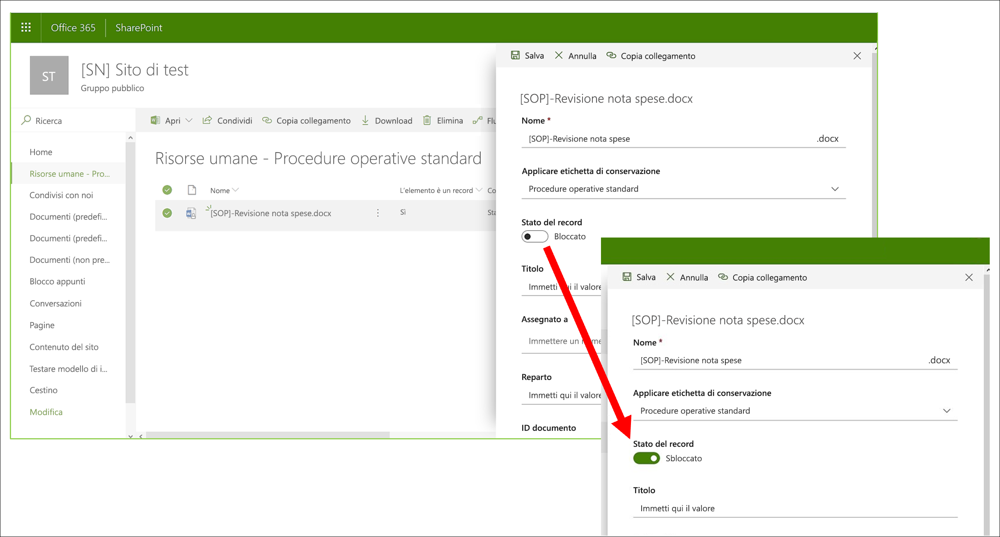
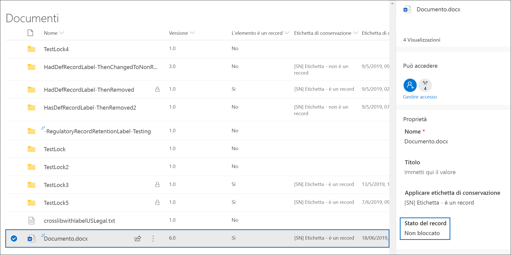
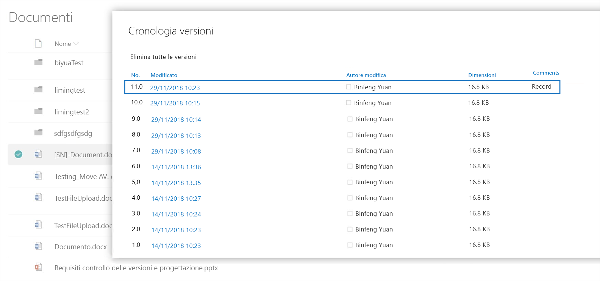
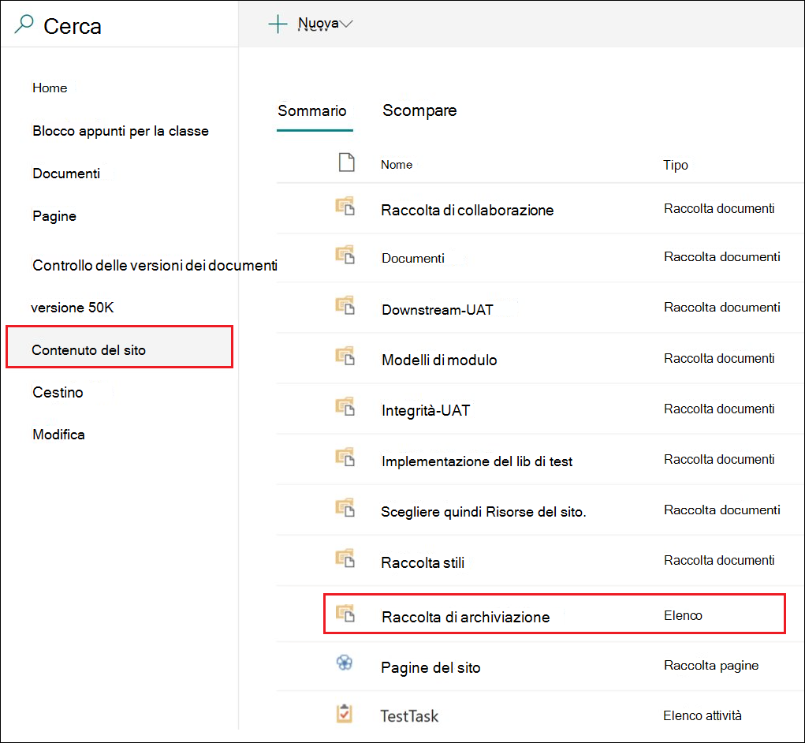
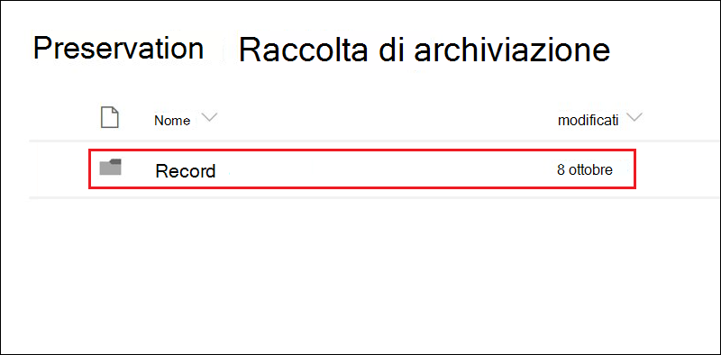

# Usare il controllo delle versioni per aggiornare i record archiviati in SharePoint o OneDriveUse record versioning to update records stored in SharePoint or OneDrive

>*[Indicazioni per l'assegnazione di licenze di Microsoft 365 per sicurezza e conformità](/office365/servicedescriptions/microsoft-365-service-descriptions/microsoft-365-tenantlevel-services-licensing-guidance/microsoft-365-security-compliance-licensing-guidance).**[Microsoft 365 licensing guidance for security & compliance](/office365/servicedescriptions/microsoft-365-service-descriptions/microsoft-365-tenantlevel-services-licensing-guidance/microsoft-365-security-compliance-licensing-guidance).*

>[!NOTE] 
> Poiché i record normativi bloccano la modifica, il controllo delle versioni dei record non è disponibile per i record normativi.Because regulatory records block editing, record versioning is not available for regulatory records.

La possibilità di contrassegnare un documento come [record](records-management.md#records) e limitare le azioni che è possibile eseguire su di esso rappresenta un obiettivo essenziale per qualsiasi soluzione di gestione dei record.The ability to mark a document as a [record](records-management.md#records) and restrict actions that can be performed on the record is an essential goal for any records management solution. Tuttavia, la collaborazione potrebbe essere necessaria anche per le persone che creano versioni successive.However, collaboration might also be needed for people to create subsequent versions.

Ad esempio, può capitare di contrassegnare come record un contratto di vendita, e che successivamente sia necessario aggiornare il contratto con nuovi termini e contrassegnare l'ultima versione come nuovo record conservando comunque la versione precedente.For example, you might mark a sales contract as a record, but then need to update the contract with new terms and mark the latest version as a new record while still retaining the previous record version. Per scenari di questo tipo, SharePoint e OneDrive supportano il *controllo delle versioni dei record*.For these types of scenarios, SharePoint and OneDrive support *record versioning*. Le cartelle del blocco appunti di OneNote non supportano il controllo delle versioni dei record.OneNote notebook folders don't support record versioning.

Per usare il controllo delle versioni dei record, è necessario prima di tutto [etichettare un documento e contrassegnarlo come record](declare-records.md).To use record versioning, you first [label the document and mark it as a record](declare-records.md). Una volta fatto ciò, accanto all'etichetta di conservazione viene visualizzata una proprietà del documento denominata *Stato del record*, con lo stato del record iniziale impostato su **Bloccato**.At this point, a document property, called *Record status* is displayed next to the retention label, and the initial record status is **Locked**. 

È possibile eseguire le operazioni seguenti:You can now do the following things:

  - **Modificare e conservare continuamente come record singole versioni del documento, sbloccando e bloccando la proprietà Stato del record.****Continually edit and retain individual versions of the document as records, by unlocking and locking the Record status property.** Solo quando la proprietà **Stato del record** è impostata su **Bloccato** è una nuova versione del record conservata.Only when the **Record status** property is set to **Locked** is a new version of the record retained. Questo consente di ridurre il rischio di mantenere le versioni e le copie inutili del documento.This toggle of locked and unlocked reduces the risk of retaining unnecessary versions and copies of the document.

  - **Archiviare automaticamente i record in un archivio dei record sul posto all'interno della raccolta siti.****Have the records automatically stored in an in-place records repository located within the site collection.** Ogni raccolta siti di SharePoint e OneDrive mantiene il contenuto nella propria raccolta di archiviazione.Each site collection in SharePoint and OneDrive preserves content in its Preservation Hold library. Le versioni dei record vengono archiviate nella cartella Record della raccolta.Record versions are stored in the Records folder in this library.

  - **Conservare un documento sempre valido che contiene tutte le versioni.****Maintain an evergreen document that contains all versions.** Per impostazione predefinita, ogni documento di SharePoint e OneDrive ha una cronologia delle versioni disponibile nel menu dell’elemento.By default, each SharePoint and OneDrive document has a version history available on the item menu. In questa cronologia delle versioni è possibile individuare facilmente le versioni record e visualizzare tali documenti.In this version history, you can easily see which versions are records and view those documents.

> [!TIP]
> Quando si usa il controllo delle versioni dei record con un'etichetta di conservazione che include un'azione di eliminazione, è consigliabile configurare anche l'impostazione di conservazione **Avvia il periodo di conservazione in base a:** impostandola su **Quando gli elementi sono stati etichettati**.When you use record versioning with a retention label that has a delete action, consider configuring the retention setting **Start the retention period based on:** to be **When items were labeled**. Con questa impostazione dell'etichetta, l'inizio del periodo di conservazione viene reimpostato per ogni nuova versione del record, in modo da garantire l'eliminazione delle versioni meno recenti prima di quelle più recenti.With this label setting, the start of the retention period is reset for each new record version, which ensures that older versions will be deleted before newer versions.

Il controllo delle versioni del record è automaticamente disponibile per qualsiasi documento con un'etichetta di conservazione che contrassegna l'elemento come record.Record versioning is automatically available for any document that has a retention label that marks the item as a record. Quando un utente visualizza le proprietà del documento tramite il riquadro dei dettagli, può cambiare lo **Stato del record** da **Bloccato** a **Sbloccato**.When a user views the document properties by using the details pane, they can toggle the **Record status** from **Locked** to **Unlocked**. Questa azione crea un record nella cartella Record della raccolta di archiviazione, dove rimane fino alla fine del periodo di conservazione.This action creates a record in the Records folder in the Preservation Hold library, where it resides for the remainder of its retention period. 

Quando il documento è sbloccato, qualsiasi utente con autorizzazioni di modifica standard può modificare il file.While the document is unlocked, any user with standard edit permissions can edit the file. Tuttavia, gli utenti non possono eliminare il file, perché è ancora considerato un record.However, users can't delete the file, because it's still a record. Una volta completato il processo di modifica, l'utente può quindi impostare lo **Stato del record** da **Sbloccato** a **Bloccato**, che impedisce ulteriori modifiche in questo stato.When editing is complete, a  user can then toggle the **Record status** from **Unlocked** to **Locked**, which prevents further edits while in this status.
  

## Bloccare e sbloccare un recordLocking and unlocking a record

Dopo aver applicato a un documento un'etichetta di conservazione che contrassegna un contenuto come record, qualsiasi utente con il livello di autorizzazione Collaborazione o inferiore può sbloccare un record o bloccare un record sbloccato.After a retention label that marks content as a record is applied to a document, any user with Contribute permissions or a narrower permission level can unlock a record or lock an unlocked record.
  

Quando un utente sblocca un record, si verificano le operazioni seguenti:When a user unlocks a record, the following actions occur:

1. Se la raccolta siti corrente non ha una raccolta di archiviazione, ne viene creata una.If the current site collection doesn't have a Preservation Hold library, one is created.

2. Se nella raccolta di archiviazione non è presente una cartella Record, ne viene creata una.If the Preservation Hold library doesn't have a Records folder, one is created.

3. Un’azione **Copia in** copia l'ultima versione del documento nella cartella Record.A **Copy to** action copies the latest version of the document to the Records folder. L'azione **Copia in** include solo la versione più recente e non quelle precedenti.The **Copy to** action includes only the latest version and no prior versions. Il documento copiato è ora considerato come versione record del documento e il suo nome file ha il formato: \[Titolo GUID Versione\#\]This copied document is now considered a record version of the document, and its file name has the format: \[Title GUID Version\#\]

4. La copia creata nella cartella Record viene aggiunta alla cronologia delle versioni del documento originale e questa versione riporta la parola **Record** nel campo Commenti.The copy created in the Records folder is added to the version history of the original document, and this version shows the word **Record** in the comments field.

5. Il documento originale è una nuova versione che può essere modificata ma non eliminata.The original document is a new version that can be edited, but not deleted. La colonna della raccolta del documento **L’elemento è un record** mostra ancora il valore **Sì** perché il documento è ancora un record, anche se ora può essere modificato.The document library column **Item is a Record** still shows the **Yes** value because the document is still a record, even if it can now be edited.

Quando un utente blocca un record, il documento originale torna a non essere modificabile.When a user locks a record, the original document again can't be edited. Ma è l'azione di sbloccare un record che ne copia una versione nella cartella Record della raccolta di archiviazione.But it is the action of unlocking a record that copies a version to the Records folder in the Preservation Hold library.

## Versioni del recordRecord versions

Ogni volta che un utente sblocca un record, la versione più recente viene copiata nella raccolta di archiviazione, che contiene il valore di **Record** nel campo **Commenti** della cronologia delle versioni.Each time a user unlocks a record, the latest version is copied to the Preservation Hold library, and that version contains the value of **Record** in the **Comments** field of the version history.
  

Per visualizzare la cronologia delle versioni, selezionare un documento nella raccolta documenti e quindi fare clic su **Cronologia delle versioni** nel menu dell’elemento.To view the version history, select a document in the document library and then click **Version history** in the item menu.

## Dove vengono archiviati i recordWhere records are stored

I record vengono archiviati nella cartella Record della raccolta di archiviazione nel sito principale della raccolta siti.Records are stored in the Records folder in the Preservation Hold library in the top-level site in the site collection. Nel riquadro di spostamento sinistro del sito principale scegliere **Contenuto del sito** \> **Raccolta di archiviazione**.In the left navigation on the top-level site, choose **Site contents** \> **Preservation Hold Library**.
  

  

Per altre informazioni sul funzionamento della raccolta di archiviazione, vedere [Come funziona la conservazione per SharePoint e OneDrive](retention-policies-sharepoint.md#how-retention-works-for-sharepoint-and-onedrive).For more information about how the Preservation Hold library works, see [How retention works for SharePoint and OneDrive](retention-policies-sharepoint.md#how-retention-works-for-sharepoint-and-onedrive).

## Cercare nel log di controllo gli eventi di controllo delle versioni del recordSearching the audit log for record versioning events

Le azioni per bloccare e sbloccare i record vengono registrate nel log di controllo.The actions of locking and unlocking records are logged in the audit log. In **Attività su file e pagine** selezionare **Stato del record modificato in Bloccato** e **Stato del record modificato in Sbloccato**.From **File and page activities**, select **Changed record status to locked** and **Changed record status to unlocked**.

Per altre informazioni su come cercare questi eventi, vedere [Eseguire una ricerca nel log di controllo nel Centro sicurezza e conformità](search-the-audit-log-in-security-and-compliance.md#file-and-page-activities).For more information about searching for these events, see [Search the audit log in the Security & Compliance Center](search-the-audit-log-in-security-and-compliance.md#file-and-page-activities).

## Passaggi successiviNext steps

Per altri scenari supportati dalla gestione dei record, vedere [Scenari comuni per la gestione dei record](get-started-with-records-management.md#common-scenarios-for-records-management).For other scenarios supported by records management, see [Common scenarios for records management](get-started-with-records-management.md#common-scenarios-for-records-management).