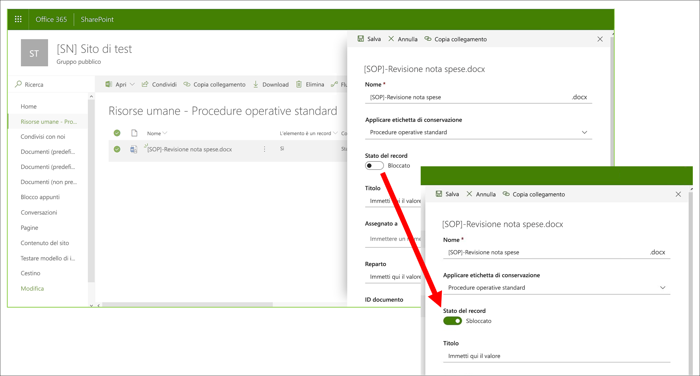

# Informazioni sui recordLearn about records

>*[Indicazioni per l'assegnazione di licenze di Microsoft 365 per sicurezza e conformità](https://aka.ms/ComplianceSD).**[Microsoft 365 licensing guidance for security & compliance](https://aka.ms/ComplianceSD).*

La gestione dei record in Microsoft 365 consente alle organizzazioni di conformarsi alle politiche aziendali e agli obblighi legali o normativi, riducendo inoltre i rischi e le responsabilità legali.Managing records in Microsoft 365 helps your organization comply with corporate policies and legal or regulatory obligations, while also reducing risk and legal liability.

Quando un contenuto viene contrassegnato come record:When content is marked as a record:

- Vengono applicate restrizioni agli elementi in base alle [azioni consentite o bloccate](#compare-restrictions-for-what-actions-are-allowed-or-blocked).Restrictions are placed on the items in terms of what [actions are allowed or blocked](#compare-restrictions-for-what-actions-are-allowed-or-blocked).

- Vengono registrate altre attività relative all'elemento.Additional activities about the item are logged.

- Si ha una prova dell'eliminazione quando l'elemento viene eliminato al termine del periodo di conservazione.You have proof of disposition when the items are deleted at the end of their retention period.

Usare [etichette di conservazione ](retention.md#retention-labels) per contrassegnare un contenuto come record.You use [retention labels](retention.md#retention-labels) to mark content as a record. È possibile pubblicare tali etichette in modo che utenti e amministratori possano applicarle manualmente al contenuto oppure applicarle automaticamente al contenuto che si desidera contrassegnare come record.You can either publish those labels so that users and administrators can manually apply them to content, or auto-apply those labels to content that you want to mark as a record.

Usando le etichette di conservazione per contrassegnare il contenuto come record, è possibile implementare una strategia unica e coerente per la gestione dei record nell'ambiente Microsoft 365.By using retention labels to mark content as records, you can implement a single and consistent strategy for managing records across your Microsoft 365 environment.

## Confronto tra le restrizioni relative alle azioni consentite o bloccateCompare restrictions for what actions are allowed or blocked

Usare la tabella seguente per identificare quali restrizioni vengono applicate al contenuto in seguito all'applicazione di un'etichetta di conservazione standard e di etichette di conservazione che contrassegnano il contenuto come record.Use the following table to identify what restrictions are placed on content as a result of applying a standard retention label, and retention labels that mark content as a record. 

Un'etichetta di conservazione standard include la configurazione per mantenere i dati senza contrassegnare il contenuto come record.A standard retention label has the configuration to retain data without marking content as a record.

>[!NOTE] 
> Per completezza di informazioni, la tabella include colonne per un record bloccato e sbloccato, applicabile a SharePoint e OneDrive, ma non a Exchange.For completeness, the table includes columns for a locked and unlocked record, which is applicable to SharePoint and OneDrive, but not Exchange. Per bloccare e sbloccare un record viene usato il [controllo delle versioni dei record](#record-versioning), che non è supportato per gli elementi di Exchange.The ability to lock and unlock a record uses [record versioning](#record-versioning) that isn't supported for Exchange items. Quindi, per tutti gli elementi di Exchange contrassegnati come record, il comportamento mappato alla colonna **Record: bloccato** e alla colonna **Record: non bloccato** non è pertinente.So for all Exchange items that are marked as a record, the behavior maps to the **Record - locked** column, and the **Record - unlocked column** is not relevant.

|AzioneAction| Etichetta di conservazioneRetention label |Record: bloccatoRecord - locked| Record: sbloccatoRecord - unlocked|
|:-----|:-----|:-----|:-----|:-----|
|Modifica contenutiEdit contents|ConsentitoAllowed | **Bloccato****Blocked** | ConsentitoAllowed|
|Modifica le proprietà, tra cui RinominaEdit properties, including rename|ConsentitoAllowed |ConsentitoAllowed | ConsentitoAllowed|
|EliminaDelete|Consentito 1Allowed 1 |**Bloccato****Blocked** | **Bloccato****Blocked**|
|CopiaCopy|ConsentitoAllowed |ConsentitoAllowed | ConsentitoAllowed|
|Sposta all'interno del container 2Move within container 2|ConsentitoAllowed |ConsentitoAllowed | ConsentitoAllowed|
|Sposta tra container 2Move across containers 2|ConsentitoAllowed |Consentito se mai sbloccatoAllowed if never unlocked | ConsentitoAllowed|
|Apri/leggiOpen/Read|ConsentitoAllowed |ConsentitoAllowed | ConsentitoAllowed|
|Cambia etichettaChange label|ConsentitoAllowed |Consentito: solo amministratori containerAllowed - container admin only | Consentito: solo amministratori containerAllowed - container admin only|
|Rimuovi etichettaRemove label|ConsentitoAllowed |Consentito: solo amministratori containerAllowed - container admin only | Consentito: solo amministratori containerAllowed - container admin only|

Note a piè di pagina:Footnotes:

1 Supportato da OneDrive ed Exchange conservando una copia in una posizione protetta, ma bloccato da SharePoint.1 Supported by OneDrive and Exchange by retaining a copy in a secured location, but blocked by SharePoint.

Messaggio che un utente vede se tenta di eliminare un documento con etichetta in SharePoint:Message a user sees if they try to delete a labeled document in SharePoint:

2 I container includono le raccolte documenti in SharePoint e le cassette postali in Exchange.2 Containers include SharePoint document libraries and Exchange mailboxes.

## Usare le etichette di conservazione per dichiarare i recordUsing retention labels to declare records

Quando si crea un'etichetta di conservazione, si può scegliere di usarla per contrassegnare il contenuto come record:When you create a retention label, you have the option to use the retention label to mark the content as a record:

1. Nel Centro conformità Microsoft 365 passare a **Gestione record** \> **Piano di archiviazione**.In the Microsoft 365 compliance center, go to **Records Management** \> **File Plan**. Nella pagina **Piano di archiviazione**, selezionare **Crea un'etichetta**.On the **File plan** page, select **Create a label**.

2. Nella pagina **Impostazioni etichetta** della procedura guidata scegliere l'opzione di impostazione dell'etichetta di conservazione per contrassegnare il contenuto come record.On the **Label settings** page in the wizard, choose the option to classify content as a record.
    
   

3. Applicare l'etichetta di conservazione ai documenti di SharePoint o OneDrive e ai messaggi di posta elettronica di Exchange, se necessario.Apply the retention label to SharePoint or OneDrive documents and Exchange emails, as needed. Per istruzioni:For instructions:
    
    - [Creare etichette di conservazione e applicarle nelle appCreate retention labels and apply them in apps](create-apply-retention-labels.md)
    
    - [Applicare automaticamente un'etichetta di conservazione al contenutoApply a retention label to content automatically](apply-retention-labels-automatically.md)

### Applicare l'etichetta di conservazione configurata al contenutoApplying the configured retention label to content

Quando le etichette di conservazione che classificano il contenuto come record vengono rese disponibili agli utenti per applicarle nelle app:When retention labels that mark content as a record are made available for users to apply them in apps:

- Per Exchange, qualsiasi utente con accesso in scrittura alla cassetta postale può applicare queste etichette.For Exchange, any user with write-access to the mailbox can apply these labels. 
- Per SharePoint e OneDrive, qualsiasi utente del gruppo Membri predefinito (con livello di autorizzazione Collaborazione) può applicare queste etichette.For SharePoint and OneDrive, any user in the default Members group (the Contribute permission level) can apply these labels.

Esempio di documento contrassegnato come record da un'etichetta di conservazione:Example of a document marked as record by using a retention label:

## Controllo delle versioni del recordRecord versioning

La possibilità di contrassegnare un documento come record e limitare le azioni che è possibile eseguire sul record rappresenta un obiettivo essenziale per qualsiasi soluzione di gestione dei record.The ability to mark a document as a record and restrict actions that can be performed on the record is an essential goal for any records management solution. Tuttavia, la collaborazione potrebbe essere necessaria anche per le persone che creano versioni successive.However, collaboration might also be needed for people to create subsequent versions.

Ad esempio, può capitare di contrassegnare come record un contratto di vendita, e che successivamente sia necessario aggiornare il contratto con nuovi termini e contrassegnare l'ultima versione come nuovo record conservando comunque la versione precedente.For example, you might mark a sales contract as a record, but then need to update the contract with new terms and mark the latest version as a new record while still retaining the previous record version. Per scenari di questo tipo, SharePoint e OneDrive supportano il *controllo delle versioni dei record*.For these types of scenarios, SharePoint and OneDrive support *record versioning*. Le cartelle del blocco appunti di OneNote non supportano il controllo delle versioni dei record.OneNote notebook folders don't support record versioning.

Per usare il controllo delle versioni dei record, è necessario prima di tutto etichettare un documento e contrassegnarlo come record.To use record versioning, first label the document and mark it as a record. Una volta fatto ciò, accanto all'etichetta di conservazione viene visualizzata una proprietà del documento denominata *Stato del record*, con lo stato del record iniziale impostato su **Bloccato**.At this point, a document property, called *Record status* is displayed next to the retention label, and the initial record status is **Locked**. 

È possibile eseguire le operazioni seguenti:You can now do the following things:

  - **Modificare e conservare continuamente come record singole versioni del documento, sbloccando e bloccando la proprietà Stato del record.****Continually edit and retain individual versions of the document as records, by unlocking and locking the Record status property.** Solo quando la proprietà **Stato del record** è impostata su **Bloccato** è una nuova versione del record conservata.Only when the **Record status** property is set to **Locked** is a new version of the record retained. Questo consente di ridurre il rischio di mantenere le versioni e le copie inutili del documento.This toggle of locked and unlocked reduces the risk of retaining unnecessary versions and copies of the document.

  - **Archiviare automaticamente i record in un archivio dei record sul posto all'interno della raccolta siti.****Have the records automatically stored in an in-place records repository located within the site collection.** Ogni raccolta siti di SharePoint e OneDrive mantiene il contenuto nella propria raccolta di archiviazione.Each site collection in SharePoint and OneDrive preserves content in its Preservation Hold library. Le versioni dei record vengono archiviate nella cartella Record della raccolta.Record versions are stored in the Records folder in this library.

  - **Conservare un documento sempre valido che contiene tutte le versioni.****Maintain an evergreen document that contains all versions.** Per impostazione predefinita, ogni documento di SharePoint e OneDrive ha una cronologia delle versioni disponibile nel menu dell’elemento.By default, each SharePoint and OneDrive document has a version history available on the item menu. In questa cronologia delle versioni è possibile individuare facilmente le versioni record e visualizzare tali documenti.In this version history, you can easily see which versions are records and view those documents.

Il controllo delle versioni del record è automaticamente disponibile per qualsiasi documento con un'etichetta di conservazione che contrassegna l'elemento come record.Record versioning is automatically available for any document that has a retention label that marks the item as a record. Quando un utente visualizza le proprietà del documento tramite il riquadro dei dettagli, può cambiare lo **Stato del record** da **Bloccato** a **Sbloccato**.When a user views the document properties by using the details pane, they can toggle the **Record status** from **Locked** to **Unlocked**. Questa azione crea un record nella cartella Record della raccolta di archiviazione, dove rimane fino alla fine del periodo di conservazione.This action creates a record in the Records folder in the Preservation Hold library, where it resides for the remainder of its retention period. 

Quando il documento è sbloccato, qualsiasi utente con autorizzazioni di modifica standard può modificare il file.While the document is unlocked, any user with standard edit permissions can edit the file. Tuttavia, gli utenti non possono eliminare il file, perché è ancora considerato un record.However, users can't delete the file, because it's still a record. Una volta completato il processo di modifica, l'utente può quindi impostare lo **Stato del record** da **Sbloccato** a **Bloccato**, che impedisce ulteriori modifiche in questo stato.When editing is complete, a  user can then toggle the **Record status** from **Unlocked** to **Locked**, which prevents further edits while in this status.
  

### Bloccare e sbloccare un recordLocking and unlocking a record

Dopo aver applicato a un documento un'etichetta di conservazione che contrassegna un contenuto come record, qualsiasi utente con il livello di autorizzazione Collaborazione o inferiore può sbloccare un record o bloccare un record sbloccato.After a retention label that marks content as a record is applied to a document, any user with Contribute permissions or a narrower permission level can unlock a record or lock an unlocked record.
  

Quando un utente sblocca un record, si verificano le operazioni seguenti:When a user unlocks a record, the following actions occur:

1. Se la raccolta siti corrente non ha una raccolta di archiviazione, ne viene creata una.If the current site collection doesn't have a Preservation Hold library, one is created.

2. Se nella raccolta di archiviazione non è presente una cartella Record, ne viene creata una.If the Preservation Hold library doesn't have a Records folder, one is created.

3. Un’azione **Copia in** copia l'ultima versione del documento nella cartella Record.A **Copy to** action copies the latest version of the document to the Records folder. L'azione **Copia in** include solo la versione più recente e non quelle precedenti.The **Copy to** action includes only the latest version and no prior versions. Il documento copiato è ora considerato come versione record del documento e il suo nome file ha il formato: \[Titolo GUID Versione\#\]This copied document is now considered a record version of the document, and its file name has the format: \[Title GUID Version\#\]

4. La copia creata nella cartella Record viene aggiunta alla cronologia delle versioni del documento originale e questa versione riporta la parola **Record** nel campo Commenti.The copy created in the Records folder is added to the version history of the original document, and this version shows the word **Record** in the comments field.

5. Il documento originale è una nuova versione che può essere modificata ma non eliminata.The original document is a new version that can be edited, but not deleted. La colonna della raccolta del documento **L’elemento è un record** mostra ancora il valore **Sì** perché il documento è ancora un record, anche se ora può essere modificato.The document library column **Item is a Record** still shows the **Yes** value because the document is still a record, even if it can now be edited.

Quando un utente blocca un record, il documento originale torna a non essere modificabile.When a user locks a record, the original document again can't be edited. Ma è l'azione di sbloccare un record che ne copia una versione nella cartella Record della raccolta di archiviazione.But it is the action of unlocking a record that copies a version to the Records folder in the Preservation Hold library.

### Versioni del recordRecord versions

Ogni volta che un utente sblocca un record, la versione più recente viene copiata nella cartella Record della raccolta di archiviazione, che contiene il valore di **Record** nel campo **Commenti** della cronologia delle versioni.Each time a user unlocks a record, the latest version is copied to the Records folder in the Preservation Hold library, and that version contains the value of **Record** in the **Comments** field of the version history.
  

Per visualizzare la cronologia delle versioni, selezionare un documento nella raccolta documenti e quindi fare clic su **Cronologia delle versioni** nel menu dell’elemento.To view the version history, select a document in the document library and then click **Version history** in the item menu.

### Dove vengono archiviati i recordWhere records are stored

I record vengono archiviati nella cartella Record della raccolta di archiviazione nel sito principale della raccolta siti.Records are stored in the Records folder in the Preservation Hold library in the top-level site in the site collection. Nel riquadro di spostamento sinistro del sito principale scegliere **Contenuto del sito** \> **Raccolta di archiviazione**.In the left navigation on the top-level site, choose **Site contents** \> **Preservation Hold Library**.
  

  

La raccolta di archiviazione è visibile solo agli amministratori della raccolta siti.The Preservation Hold library is visible only to site collection admins. Inoltre, la raccolta di archiviazione non esiste per impostazione predefinita.Also, the Preservation Hold library doesn't exist by default. Viene creata solo quando il contenuto soggetto a un'etichetta o a un criterio di conservazione viene eliminato per la prima volta nella raccolta siti.It's created only when content subject to a retention label or retention policy is deleted for the first time in the site collection.

### Cercare nel log di controllo gli eventi di controllo delle versioni del recordSearching the audit log for record versioning events

Le azioni per bloccare e sbloccare i record vengono registrate nel log di controllo.The actions of locking and unlocking records are logged in the audit log. È possibile cercare le attività specifiche **Stato del record modificato in Bloccato** e **Stato del record modificato in Sbloccato**, che si trovano nella sezione **Attività su file e pagine** nell'elenco a discesa **Attività** nella pagina **Ricerca log di controllo** nel centro sicurezza e conformità.You can search for the specific activities **Changed record status to locked** and **Changed record status to unlocked**, which are located in the **File and page activities** section in the **Activities** dropdown list on the **Audit log search** page in the security and compliance center.
  

Per altre informazioni su come cercare questi eventi, vedere la sezione "Attività su file e pagine" in [Ricerche nel log di controllo Centro sicurezza e conformità](search-the-audit-log-in-security-and-compliance.md#file-and-page-activities).For more information about searching for these events, see the "File and page activities" section in [Search the audit log in the Security & Compliance Center](search-the-audit-log-in-security-and-compliance.md#file-and-page-activities).

## Passaggi successiviNext steps

Se non si hanno ancora etichette di conservazione da usare per la gestione dei record, vedere [Introduzione ai criteri e alle etichette di conservazione](get-started-with-retention.md).If you don't yet have retention labels to use for records management, see [Get started with retention policies and retention labels](get-started-with-retention.md).

Per ulteriori informazioni sull'eliminazone dei record, vedere [Eliminazione dei record](disposition.md).To learn about disposition of records, see [Disposing of content](disposition.md).
