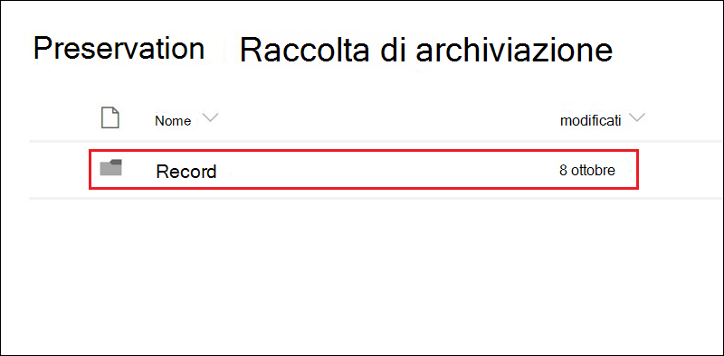

# Informazioni sui recordLearn about records

>*[Indicazioni per l'assegnazione di licenze di Microsoft 365 per sicurezza e conformità](https://aka.ms/ComplianceSD).**[Microsoft 365 licensing guidance for security & compliance](https://aka.ms/ComplianceSD).*

La gestione dei record in Microsoft 365 consente alle organizzazioni di conformarsi alle politiche aziendali e agli obblighi legali o normativi, riducendo inoltre i rischi e le responsabilità legali.Managing records in Microsoft 365 helps your organization comply with corporate policies and legal or regulatory obligations, while also reducing risk and legal liability.

Quando un contenuto viene contrassegnato come record:When content is marked as an record:

- L’elemento diventa non modificabile, dunque non può essere modificato o eliminato.The item becomes immutable, which means that it can't be modified or deleted.

- Vengono registrate altre attività relative all'elemento.Additional activities about the item are logged.

- Si ha una prova dell’eliminazione quando l'elemento viene eliminato al termine del periodo di conservazione.You have proof of disposition when they are deleted at the end of their retention period.

Usare [etichette di conservazione ](labels.md) per contrassegnare un contenuto come record.You use [retention labels](labels.md) to mark content as a record. Dopo aver creato le etichette di conservazione che dichiarano i record, è possibile pubblicare tali etichette in modo che utenti e amministratori possano applicarle manualmente al contenuto oppure applicarle automaticamente al contenuto che si vuole classificare come record.After you create retention labels that declare records, you can either publish those labels so that users and administrators can manually apply them to content, or auto-apply those labels to content that you want to mark as a record. Per istruzioni, vedere [Creare, pubblicare e applicare automaticamente etichette di conservazione](create-retention-labels.md).For instructions, see [Create, publish, and auto-apply retention labels ](create-retention-labels.md).

Usando le etichette di conservazione per dichiarare i record, si può implementare un'unica strategia coerente di gestione dei record nell'ambiente Microsoft 365.By using retention labels to declare records, you can implement a single, consistent records-management strategy across your Microsoft 365 environment.

Tenere presente quanto segue in relazione ai record:Keep the following things in mind about records:

  - **I record non sono modificabili.****Records are immutable.** Un'etichetta di conservazione che contrassegna un contenuto come record può essere applicata al contenuto di Exchange, oltre a SharePoint e OneDrive.A retention label that marks content as a record can be applied to content in Exchange, in addition to SharePoint and OneDrive. Tuttavia, il [controllo delle versioni del record](#record-versioning) è disponibile solo in SharePoint e OneDrive e non in Exchange.However, [record versioning](#record-versioning) is available only in SharePoint and OneDrive, and not for Exchange.

    In Exchange il contenuto etichettato come record non è modificabile fino all'eliminazione finale.In Exchange, content labeled as a record is immutable until its final deletion. Quando un elemento di Exchange viene classificato come record, si verificano i seguenti eventi:When an Exchange item is labeled as a record, four things happen:

    - L'elemento non può essere eliminato definitivamente.The item can't be permanently deleted.

    - L'elemento non può essere modificato.The item can't be edited.

    - L'etichetta non può essere modificata.The label can't be changed.

    - L'etichetta non può essere rimossa.The label can't be removed.

  - **Record e cartelle.****Records and folders.** È possibile applicare un'etichetta di conservazione a una cartella di Exchange, SharePoint o OneDrive.You can apply a retention label to a folder in Exchange, SharePoint, and OneDrive. Se una cartella viene etichettata come record e si sposta un elemento al suo interno, l'elemento viene identificato come record.If a folder is labeled as a record, and you move an item into the folder, the item is labeled as a record. Quando si sposta l'elemento dalla cartella, l'elemento rimarrà etichettato come record.When you move the item out of the folder, the item remains labeled as a record.

    Inoltre, se l'etichetta del record applicata a una cartella (in SharePoint e OneDrive) viene trasformata in etichetta di conservazione che non dichiara il contenuto come record, gli elementi nella cartella mantengono l'etichetta del record esistente.Also, if you change the record label that's applied to a folder (in SharePoint and OneDrive) to a retention label that does not declare content as a record, items in the folder keep their existing record label.

    Per altre informazioni sull'applicazione di etichette di conservazione alle cartelle di SharePoint e OneDrive, vedere [Applicazione di un'etichetta di conservazione predefinita a tutto il contenuto in una raccolta, una cartella o un set di documenti di SharePoint](labels.md#applying-a-default-retention-label-to-all-content-in-a-sharepoint-library-folder-or-document-set).For more information about applying retention labels to SharePoint and OneDrive folders, see [Applying a default retention label to all content in a SharePoint library, folder, or document set](labels.md#applying-a-default-retention-label-to-all-content-in-a-sharepoint-library-folder-or-document-set).

  - **Non è possibile eliminare i record**.**Records can't be deleted**. Se un utente prova a eliminare un record in Exchange, l'elemento viene spostato nella cartella Elementi ripristinabili, come descritto in [Funzionamento dei criteri di conservazione con posizioni Exchange](retention-policies-exchange.md#how-a-retention-policy-works-with-exchange-locations).If a user attempts to delete a record in Exchange, the item is moved to the Recoverable Items folder as described in [How a retention policy works with Exchange locations](retention-policies-exchange.md#how-a-retention-policy-works-with-exchange-locations).

    Se un utente prova a eliminare un record in SharePoint, viene visualizzato un messaggio di errore che indica che l'elemento non è stato eliminato e che rimane nella raccolta.If a user attempts to delete a record in a SharePoint, an error is displayed say that the item wasn't deleted, and remains in the library.

    

    Se un utente prova a eliminare un record in OneDrive, l'elemento viene spostato nella raccolta di archiviazione, come descritto in [Funzionamento dei criteri di conservazione con SharePoint e OneDrive](retention-policies-sharepoint.md#how-a-retention-policy-works-with-sharepoint-and-onedrive).If a user attempts to delete a record in OneDrive, the item is moved to the Preservation Hold library as described in [How a retention policy works with SharePoint and OneDrive](retention-policies-sharepoint.md#how-a-retention-policy-works-with-sharepoint-and-onedrive).

  - **Non è possibile rimuovere le etichette dei record.****Records labels can't be removed.** Dopo aver applicato un'etichetta record a un elemento, solo l'amministratore di tale posizione, ad esempio l'amministratore di una raccolta siti di un sito di SharePoint, può rimuovere l'etichetta.After a record label has been applied to an item, only the admin of that location (for example, a site collection admin of a SharePoint site) can remove that record label.

## Usare le etichette di conservazione per dichiarare i recordUsing retention labels to declare records

Quando si crea un'etichetta di conservazione, si può scegliere di usarla per contrassegnare il contenuto come record:When you create a retention label, you have the option to use the retention label to mark the content as a record:

1. Nel Centro conformità Microsoft 365 passare a **Gestione record** \> **Piano di archiviazione**.In the Microsoft 365 compliance center, go to **Records Management** \> **File Plan**. Nella pagina **Piano di archiviazione**, selezionare **Crea un'etichetta**.On the **File plan** page, select **Create a label**.

2. Nella pagina **Impostazioni etichetta** della procedura guidata scegliere l'opzione di impostazione dell'etichetta di conservazione per dichiarare il contenuto come record.On the **Label settings** page in the wizard, choose the option to set the retention label to declare content as a record.
    
   

3. [Pubblicare](labels.md#how-retention-labels-work-with-retention-label-policies) o [Applicare automaticamente](labels.md#applying-a-retention-label-automatically-based-on-conditions) l'etichetta di conservazione ai siti di SharePoint e/o agli account di OneDrive.[Publish](labels.md#how-retention-labels-work-with-retention-label-policies) or [auto-apply](labels.md#applying-a-retention-label-automatically-based-on-conditions) the retention label to SharePoint sites and/or OneDrive accounts.

### Applicare un'etichetta di conservazione al contenutoApplying a retention label to content

Per Exchange, qualsiasi utente con accesso in scrittura alla cassetta postale può applicare un'etichetta di conservazione a un messaggio di posta elettronica.For Exchange, any user with write-access to the mailbox can apply a record label to an email message. Per il contenuto di SharePoint e OneDrive, qualsiasi utente del gruppo Membri predefinito (con livello di autorizzazione Collaborazione) può applicare un'etichetta record al contenuto.For content in SharePoint and OneDrive, any user in the default Members group (the Contribute permission level) can apply a record label to content. Solo un amministratore della raccolta siti può rimuovere o modificare l’etichetta record dopo che è stata applicata.Only a site collection admin can remove or change that record label after it's been applied. Come descritto in precedenza, un'etichetta di conservazione che classifica il contenuto come record può essere applicata automaticamente al contenuto.As previously explained, a retention label that classifies content as a record can be auto-applied to content.

Ecco l'aspetto di una etichetta record applicata a un documento in un sito di SharePoint o un account di OneDrive.Here's what this looks like when a record label is applied to a document on a SharePoint site or OneDrive account.
  

## Controllo delle versioni del recordRecord versioning

Una parte essenziale della gestione record è la possibilità di dichiarare un documento come record e che tale record non sia modificabile.An essential part of records management is the ability to declare a document as a record and have that record be immutable. Allo stesso tempo, l’impossibilità di modificare i record impedisce la collaborazione al documento se si presenta la necessità di creare versioni successive.At the same time, record immutability prevents collaboration on the document if people need to create subsequent versions. Ad esempio, può capitare di dichiarare come record un contratto di vendita, e che successivamente sia necessario aggiornare il contratto con nuovi termini e dichiarare l'ultima versione come nuovo record conservando comunque la versione precedente.For example, you might declare a sales contract as a record, but then need to update the contract with new terms and declare the latest version as a new record while still retaining the previous record version. Per scenari di questo tipo, SharePoint e OneDrive supportano il *controllo delle versioni dei record*.For these types of scenarios, SharePoint and OneDrive support *record versioning*. Le cartelle del blocco appunti di OneNote non supportano il controllo delle versioni dei record.OneNote notebook folders don't support record versioning.

Per usare il controllo delle versioni dei record, prima di tutto occorre usare il Centro conformità Microsoft 365 per creare etichette di conservazione che dichiarino i record e pubblicarle in tutti i siti di SharePoint e gli account di OneDrive oppure pubblicarle in siti specifici di SharePoint o account di OneDrive.To use record versioning, the first step is to use the Microsoft 365 compliance center to create retention labels that declare records and and publish them to all SharePoint sites and OneDrive accounts, or publish them to specific SharePoint sites or OneDrive accounts. Il passaggio successivo consiste nell'applicare a un documento un'etichetta record di conservazione pubblicata.The next step is to apply a published retention record label to a document. Fatto questo, accanto all'etichetta di conservazione viene visualizzata una proprietà del documento denominata *Stato del record*, con lo stato del record iniziale impostato su **Bloccato**.When this happens, a document property, called *Record status* is displayed next to the retention label, and the initial record status will be **Locked**. A questo punto, è possibile effettuare le operazioni seguenti:At this point, you can do the following things:

  - **Modificare e dichiarare continuamente come record singole versioni del documento, sbloccando e bloccando la proprietà Stato del record.****Continually edit and declare individual versions of the document as records, by unlocking and locking the Record status property.** Solo le versioni dichiarate come record vengono mantenute quando la proprietà **Stato del record** è impostata su **Bloccato**.Only the versions declared as records are retained when the **Record status** property is set to **Locked**. Questo consente di ridurre il rischio di mantenere le versioni e le copie inutili del documento.This reduces the risk of retaining unnecessary versions and copies of the document.

  - **Archiviare automaticamente i record in un archivio dei record sul posto all'interno della raccolta siti.****Have the records automatically stored in an in-place records repository located within the site collection.** Ogni raccolta siti di SharePoint e OneDrive mantiene il contenuto nella propria raccolta di archiviazione.Each site collection in SharePoint and OneDrive preserves content in its Preservation Hold library. Le versioni dei record vengono archiviate nella cartella Record della raccolta.Record versions are stored in the Records folder in this library.

  - **Conservare un documento sempre valido che contiene tutte le versioni.****Maintain an evergreen document that contains all versions.** Per impostazione predefinita, ogni documento di SharePoint e OneDrive ha una cronologia delle versioni disponibile nel menu dell’elemento.By default, each SharePoint and OneDrive document has a version history available on the item menu. In questa cronologia delle versioni è possibile individuare facilmente le versioni record e visualizzare tali documenti.In this version history, you can easily see which versions are records and view those documents.

Il controllo delle versioni del record è automaticamente disponibile per qualsiasi documento con un'etichetta di conservazione che dichiara l'elemento come record.Record versioning is automatically available for any document that has a retention label that declares the item as a record. Quando un utente visualizza le proprietà del documento tramite il riquadro dei dettagli, cambia lo **Stato del record** da **Bloccato** a **Sbloccato**.When a user views the document properties through the details pane, they toggle the **Record status** from **Locked** to **Unlocked**. Questo singolo clic crea un record nella cartella Record della raccolta di archiviazione, dove rimane fino alla fine del periodo di conservazione.This single click creates a record in the Records folder in the Preservation Hold library, where it resides for the remainder of its retention period. 

Quando il documento è sbloccato, qualsiasi utente con autorizzazioni può modificare il file.While the document is unlocked, any user with permissions can edit the file. Tuttavia, gli utenti non possono eliminare il file, perché è considerato un record.However, users can't delete the file, because it's considered a record. Dopo aver apportato le modifiche necessarie, l'utente può quindi impostare lo **Stato del record** da **Sbloccato** a **Bloccato**, in modo che il documento venga di nuovo dichiarato come record e non possa essere modificato.After the necessary changes are made, the user can then toggle the **Record status** from **Unlocked** to **Locked**, so that the document is again declared a record and can't be edited.
  

### Bloccare e sbloccare un recordLocking and unlocking a record

Una volta assegnata un'etichetta record di conservazione a un documento, qualsiasi utente con il livello di autorizzazione Collaborazione o inferiore può sbloccare un record o bloccare un record sbloccato.After a record label is assigned to a document, any user with Contribute permissions or a narrower permission level can unlock a record or lock an unlocked record.
  

Quando un utente sblocca un record, si verificano le operazioni seguenti:When a user unlocks a record, the following actions occur:

1. Se la raccolta siti corrente non ha una raccolta di archiviazione, ne viene creata una.If the current site collection doesn't have a Preservation Hold library, one is created.

2. Se nella raccolta di archiviazione non è presente una cartella Record, ne viene creata una.If the Preservation Hold library doesn't have a Records folder, one is created.

3. Un’azione **Copia in** copia l'ultima versione del documento nella cartella Record.A **Copy to** action copies the latest version of the document to the Records folder. L'azione **Copia in** include solo la versione più recente e non quelle precedenti.The **Copy to** action includes only the latest version and no prior versions. Il documento copiato è ora considerato come versione record del documento e il suo nome file ha il formato: \[Titolo GUID Versione\#\]This copied document is now considered a record version of the document, and its file name has the format: \[Title GUID Version\#\]

4. La copia creata nella cartella Record viene aggiunta alla cronologia delle versioni del documento originale e questa versione riporta la parola **Record** nel campo Commenti.The copy created in the Records folder added to the version history of the original document, and this version shows the word **Record** in the comments field.

5. Il documento originale è una nuova versione che può essere modificata (ma non eliminata).The original document is a new version that can be edited (but not deleted). La colonna della raccolta del documento **L’elemento è un record** mostra ancora il valore **Sì** perché il documento è ancora considerato come un record, anche se ora può essere modificato.The document library column **Item is a Record** still shows the **Yes** value because the document is still considered a record, even if it can now be edited.

Quando un utente blocca un record, il documento originale torna a non essere modificabile.When a user locks a record, the original document again can't be edited. Ma è l'azione di sbloccare un record che ne copia una versione nella cartella Record della raccolta di archiviazione.But it is the action of unlocking a record that copies a version to the Records folder in the Preservation Hold library.

### Versioni del recordRecord versions

Ogni volta che un utente sblocca un record, la versione più recente viene copiata nella cartella Record della raccolta di archiviazione, che contiene il valore di **Record** nel campo **Commenti** della cronologia delle versioni.Each time a user unlocks a record, the latest version is copied to the Records folder in the Preservation Hold library, and that version contains the value of **Record** in the **Comments** field of the version history.
  

Per visualizzare la cronologia delle versioni, selezionare un documento nella raccolta documenti e quindi fare clic su **Cronologia delle versioni** nel menu dell’elemento.To view the version history, select a document in the document library and then click **Version history** in the item menu.

### Dove vengono archiviati i recordWhere records are stored

I record vengono archiviati nella cartella Record della raccolta di archiviazione nel sito principale della raccolta siti.Records are stored in the Records folder in the Preservation Hold library in the top-level site in the site collection. Nel riquadro di spostamento sinistro del sito principale scegliere **Contenuto del sito** \> **Raccolta di archiviazione**.In the left nav on the top-level site, choose **Site contents** \> **Preservation Hold Library**.
  

  

La raccolta di archiviazione è visibile solo agli amministratori della raccolta siti.The Preservation Hold library is visible only to site collection admins. Inoltre, la raccolta di archiviazione non esiste per impostazione predefinita.Also, the Preservation Hold library doesn't exist by default. Viene creata solo quando il contenuto soggetto a un'etichetta o a un criterio di conservazione viene eliminato per la prima volta nella raccolta siti.It's created only when content subject to a retention label or retention policy is deleted for the first time in the site collection.

### Cercare nel log di controllo gli eventi di controllo delle versioni del recordSearching the audit log for record versioning events

Le azioni per bloccare e sbloccare i record vengono registrate nel log di controllo.The actions of locking and unlocking records are logged in the audit log. È possibile cercare le attività specifiche **Stato del record modificato in Bloccato** e **Stato del record modificato in Sbloccato**, che si trovano nella sezione **Attività su file e pagine** nell'elenco a discesa **Attività** nella pagina **Ricerca log di controllo** nel centro sicurezza e conformità.You can search for the specific activities **Changed record status to locked** and **Changed record status to unlocked**, which are located in the **File and page activities** section in the **Activities** dropdown list on the **Audit log search** page in the security and compliance center.
  

Per altre informazioni su come cercare questi eventi, vedere la sezione "Attività su file e pagine" in [Ricerche nel log di controllo Centro sicurezza e conformità](search-the-audit-log-in-security-and-compliance.md#file-and-page-activities).For more information about searching for these events, see the "File and page activities" section in [Search the audit log in the Security & Compliance Center](search-the-audit-log-in-security-and-compliance.md#file-and-page-activities).

## Passaggi successiviNext steps

Per istruzioni su come creare e pubblicare le etichette di conservazione che contengono l'opzione per contrassegnare il contenuto come record, vedere [Creare, pubblicare e applicare automaticamente etichette di conservazione](create-retention-labels.md).For instructions how to create and publish the retention labels that contain the setting to mark content as a record, see [Create, publish, and auto-apply retention labels](create-retention-labels.md).
