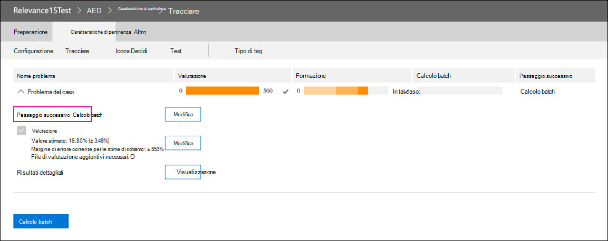

# Ritiro del modulo rilevanza in Advanced eDiscovery

Il 10 marzo 2021 ritiriamo il modulo rilevanza in Advanced eDiscovery. Questo ritiro significa che le organizzazioni non avranno più accesso al modulo Pertinenza (accedendo a Gestisci rilevanza set di revisione in un caso di  >   Advanced eDiscovery) o potranno accedere ai modelli di pertinenza esistenti. Il modulo di rilevanza corrente che viene ritirato verrà sostituito con una nuova soluzione di codifica predittiva nel secondo trimestre 2021. Questa nuova funzionalità consente alle organizzazioni di creare modelli di codifica predittivi in un flusso di lavoro più semplice e intuitivo.

Per prepararsi a questo prossimo ritiro, è consigliabile che le organizzazioni che utilizzano il modulo Pertinenza esportino l'output del modello prima della data di ritiro eseguendo un calcolo batch per tutti i modelli esistenti. Tutti i punteggi di pertinenza del modello verranno archiviati in modo permanente nel set di revisioni corrispondente e saranno accessibili quando i documenti vengono esportati. I punteggi di pertinenza vengono mantenuti anche come metadati nel file di caricamento. Inoltre, sarà comunque possibile filtrare il contenuto nel set di recensioni in base al punteggio di pertinenza e avere accesso a tutti i metadati prodotti dai modelli di pertinenza.

## Completare i modelli non completati

Per tutti i modelli di pertinenza non completati, completare la valutazione, la formazione e il calcolo batch in modo da poter applicare il modello ai documenti in un insieme da rivedere. Il completamento del calcolo batch conserverà le informazioni dopo la data di ritiro del modulo Pertinenza.

Ecco i passaggi per completare eventuali modelli non completati:

1. Formare il modello fino a quando non viene stabilizzato e pronto per il calcolo batch. Vedi [Formazione su tagging e pertinenza.](tagging-and-relevance-training-in-advanced-ediscovery.md)

   Lo screenshot seguente mostra un modulo pronto per un calcolo batch. Si noti che la valutazione e la formazione sono completate e il passaggio successivo consiste nell'eseguire il calcolo batch.

   

2. Eseguire il calcolo batch. Vedere [Esecuzione del calcolo batch.](track-relevance-analysis-in-advanced-ediscovery.md#performing-batch-calculation)

3. Verificare che il calcolo batch sia stato eseguito correttamente. Vedere [Risultati di calcolo batch.](track-relevance-analysis-in-advanced-ediscovery.md#batch-calculation-results)

Per assistenza con il completamento dei modelli di pertinenza non completati, contattare il supporto tecnico Microsoft.
