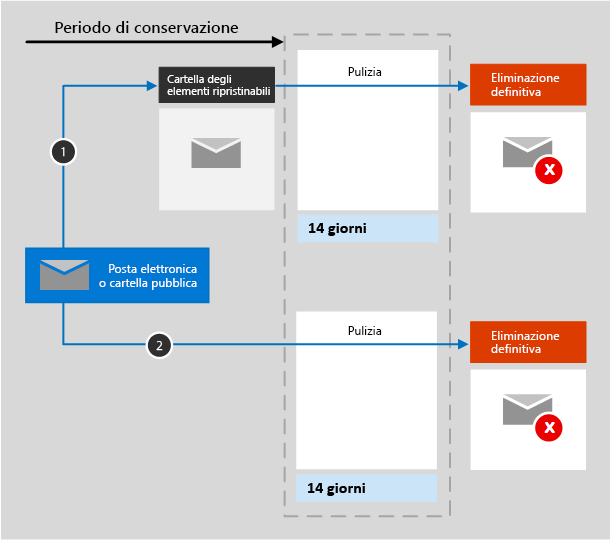

# Informazioni sui criteri di conservazione per ExchangeLearn about retention policies for Exchange

Questo articolo integra [Informazioni sui criteri di conservazione](retention-policies.md) con informazioni specifiche per Exchange.The information in this article supplements [Learn about retention policies](retention-policies.md) because it has information that's specific to Exchange.

## Funzionamento dei criteri di conservazione in ExchangeHow a retention policy works with Exchange

Per quanto riguarda la posta dell’utente, il calendario e altri elementi della cassetta postale, i criteri di conservazione vengono applicati a livello di cassetta postale.For a user's mail, calendar, and other mailbox items, a retention policy is applied at the level of a mailbox.

Nel caso delle cartelle pubbliche, i criteri di conservazione vengono applicati a tutte le cartelle pubbliche e non a livello di cartella o cassetta postale.For public folders, a retention policy is applied to all public folders and not at the folder or mailbox level.

Quando si configurano i criteri di conservazione per tali posizioni, sono inclusi gli elementi di posta elettronica seguenti: i messaggi di posta elettronica con allegati, incluse le bozze, le attività, gli elementi del calendario quando hanno una data di fine e le note.When you configure a retention policy for these locations, the following mail items are included: Mail messages (includes drafts) with any attachments, tasks and calendar items when they have an end date, and notes. I contatti, le attività e gli elementi del calendario che non hanno una data di fine sono esclusi.Contacts, and any tasks and calendar items that don't have an end date are not included. Altri elementi archiviati in una cassetta postale, ad esempio i messaggi salvati di Skype e di Teams, sono inclusi con i propri criteri di conservazione distinti.Other items stored in a mailbox, such as Skype and Teams saved messages, are included with their separate retention policy.

Le cassette postali e le cartella pubbliche utilizzano la cartella [Elementi ripristinabili](https://docs.microsoft.com/exchange/security-and-compliance/recoverable-items-folder/recoverable-items-folder) per conservare gli elementi.Both a mailbox and a public folder use the [Recoverable Items folder](https://docs.microsoft.com/exchange/security-and-compliance/recoverable-items-folder/recoverable-items-folder) to retain items. Solo gli utenti a cui sono state assegnate autorizzazioni di eDiscovery possono visualizzare il contenuto di una cartella Elementi ripristinabili di un altro utente.Only people who have been assigned eDiscovery permissions can view items in another user's Recoverable Items folder.
  
Quando un utente elimina un messaggio da una cartella (fatta eccezione per la cartella Posta eliminata), per impostazione predefinita il messaggio viene trasferito nella cartella Posta eliminata.When a person deletes a message in a folder other than the Deleted Items folder, by default, the message moves to the Deleted Items folder. Quando un utente elimina un elemento dalla cartella Posta eliminata, il messaggio viene spostato nella cartella Elementi ripristinabili.When a person deletes an item in the Deleted Items folder, the message is moved to the Recoverable Items folder. Tuttavia, un utente può eliminare temporaneamente un elemento (MAIUSC+CANC) di qualsiasi cartella. Con questa operazione la cartella Posta eliminata viene ignorata e l'elemento viene inserito direttamente nella cartella Elementi ripristinabili.However, a user can soft delete an item (Shift+Delete) in any folder, which bypasses the Deleted Items folder and moves the item directly to the Recoverable Items folder.
  
Quando si applica un criterio di conservazione a un percorso di Exchange, un processo timer valuta periodicamente gli elementi nella cartella Elementi ripristinabili.When you apply a retention policy to an Exchange location, a timer job periodically evaluates items in the Recoverable Items folder. Se un elemento non corrisponde alle regole specificate in almeno un criterio di conservazione, viene eliminato definitivamente dalla cartella Elementi ripristinabili.If an item doesn't match the rules of at least one retention policy, the item is permanently deleted (also called hard deleted) from the Recoverable Items folder.

L’esecuzione del processo timer può richiedere fino a 7 giorni, e il percorso di Exchange deve contenere almeno 10 MB.The timer job can take up to seven days to run and the Exchange location must contain at least 10 MB.
  
Quando un utente prova a modificare le proprietà di un elemento della cassetta postale, ad esempio, l'oggetto, il corpo, gli allegati, i mittenti, i destinatari o la data di invio o di ricezione di un messaggio, una copia dell'elemento originale viene salvata nella cartella Elementi ripristinabili prima che la modifica diventi effettiva.When a user attempts to change properties of a mailbox item—such as the subject, body, attachments, senders and recipients, or date sent or received for a message—a copy of the original item is saved to the Recoverable Items folder before the change is committed. Questo si verifica per ogni modifica successiva.This action happens for each subsequent change. Alla fine del periodo di conservazione, le copie nella cartella Elementi ripristinabili vengono eliminate definitivamente.At the end of the retention period, copies in the Recoverable Items folder are permanently deleted.

Dopo l'assegnazione di un criterio di conservazione a una cassetta postale o a una cartella pubblica, i percorsi del contenuto variano in base al fatto che il criterio di conservazione preveda di conservare ed eliminare, solo conservare o solo eliminare.After a retention policy is assigned to a mailbox or public folder, the paths the content takes depend on whether the retention settings are to retain and delete, to retain only, or delete only.

Se l'impostazione di conservazione è Conserva ed elimina:When the retention settings are to retain and delete:

1. **Se l'elemento viene modificato o eliminato definitivamente** dall'utente, con MAIUSC+CANC o eliminandolo da Posta eliminata, durante il periodo di conservazione: l'elemento viene spostato o copiato, in caso di modifica, nella cartella Elementi ripristinabili.**If the item is modified or permanently deleted** by the user (either SHIFT+DELETE or deleted from Deleted Items) during the retention period: The item is moved (or copied, in the case of edit) to the Recoverable Items folder. Lì, a intervalli regolari viene eseguito un processo timer che identifica i messaggi il cui periodo di conservazione è scaduto. Questi elementi vengono eliminati definitivamente entro 14 giorni dalla data di fine del periodo di conservazione.There, a timer job runs periodically and identifies items whose retention period has expired, and these items are permanently deleted within 14 days of the end of the retention period. 14 giorni è l'impostazione predefinita, ma può essere configurato un valore fino a 30 giorni.Note that 14 days is the default setting, but it can be configured up to 30 days.

2. **Se l'elemento non viene modificato o eliminato** durante il periodo di conservazione: lo stesso processo viene eseguito periodicamente in tutte le cartelle della cassetta postale e identifica i messaggi il cui periodo di conservazione è scaduto. Questi elementi vengono eliminati definitivamente entro 14 giorni dalla data di fine del periodo di conservazione.**If the item is not modified or deleted** during the retention period: The same process runs periodically on all folders in the mailbox and identifies items whose retention period has expired, and these items are permanently deleted within 14 days of the end of the retention period. 14 giorni è l'impostazione predefinita, ma può essere configurato un valore fino a 30 giorni.Note that 14 days is the default setting, but it can be configured up to 30 days. 

Quando l'impostazione di conservazione è Conserva solo o Elimina solo, i percorsi del contenuto sono varianti di Conserva ed elimina:When the retention settings are retain-only, or delete-only, the contents paths are variations of retain and delete:

### Percorsi di contenuto per l'impostazione di conservazione Conserva soloContent paths for retain-only retention settings

1. **Se l'elemento viene modificato o eliminato** durante il periodo di conservazione: una copia dell'elemento originale viene creata nella cartella Elementi ripristinabili e conservata fino al termine del periodo di conservazione, quindi la copia nella cartella Elementi ripristinabili viene eliminata definitivamente entro 14 giorni dalla scadenza dell'elemento.**If the item is modified or deleted** during the retention period: A copy of the original item is created in the Recoverable Items folder and retained until the end of the retention period, when the copy in the Recoverable Items folder is permanently deleted within 14 days after the item expires. 

2. **Se l’elemento non viene modificato o eliminato** durante il periodo di conservazione: non succede niente prima o dopo il periodo di conservazione. L’elemento rimane nella posizione originale.**If the item is not modified or deleted** during the retention period: Nothing happens before and after the retention period; the item remains in its original location.

### Percorsi di contenuto per l'impostazione di conservazione Elimina soloContent paths for delete-only retention settings

1. **Se l’elemento non viene eliminato** durante il periodo configurato: alla fine del periodo configurato nel criterio di conservazione, l’elemento viene spostato nella cartella Elementi ripristinabili.**If the item is not deleted** during the configured period: At the end of the configured period in the retention policy, the item is moved to the Recoverable Items folder. 

2. **Se l'elemento viene eliminato** durante il periodo configurato: l'elemento viene immediatamente spostato nella cartella Elementi ripristinabili.**If the item is deleted** during the configured period: The item is immediately moved to the Recoverable Items folder. Se un utente elimina l’elemento da questa posizione o svuota la cartella Elementi ripristinabili, l’elemento viene eliminato definitivamente.If a user deletes the item from there or empties the Recoverable Items folder, the item is permanently deleted. In caso contrario, l'elemento viene eliminato definitivamente dopo un periodo di 14 giorni nella cartella Elementi ripristinabili.Otherwise, the item is permanently deleted after being in the Recoverable Items folder for 14 days. 

## Esclusione di specifici tipi di elementi di Exchange dai criteri di conservazioneExcluding specific types of Exchange items from a retention policy

È possibile usare PowerShell per escludere specifici tipi di elementi di Exchange dai criteri di conservazione quando le impostazioni dei criteri sono Conserva solo.By using PowerShell, you can exclude specific types of Exchange items from a retention policy when the retention settings are for retain-only. Ad esempio, è possibile escludere i messaggi vocali, le conversazioni di messaggistica istantanea e altri contenuti di Skype for Business Online nelle cassette postali.For example, you can exclude voicemail messages, IM conversations, and other Skype for Business Online content in mailboxes. Si possono anche escludere elementi del calendario, note e attività.You can also exclude calendar, note, and task items. Questa funzionalità è disponibile solo tramite PowerShell, non è disponibile quando si crea un criterio di conservazione usando la procedura guidata nel Centro conformità Microsoft 365.This capability is available only by using PowerShell; it's not available when you create a retention policy by using the wizard in the Microsoft 365 compliance center.
  
Per escludere i tipi selezionati per gli elementi di Exchange in un criterio di conservazione, usare il parametro `ExcludedItemClasses` con i cmdlet [New-RetentionComplianceRule](https://docs.microsoft.com/powershell/module/exchange/new-retentioncompliancerule) e [Set-RetentionComplianceRule](https://docs.microsoft.com/powershell/module/exchange/set-retentioncompliancerule).To exclude your selected types for Exchange items in a retention policy, use the  `ExcludedItemClasses` parameter with the [New-RetentionComplianceRule](https://docs.microsoft.com/powershell/module/exchange/new-retentioncompliancerule) and  [Set-RetentionComplianceRule](https://docs.microsoft.com/powershell/module/exchange/set-retentioncompliancerule) cmdlets.

Per usare i cmdlet dei criteri di conservazione, è prima necessario [connettersi a PowerShell in Centro sicurezza e conformità](https://docs.microsoft.com/powershell/exchange/connect-to-scc-powershell?view=exchange-ps).To use the retention policies cmdlets, you must first [connect to Security & Compliance Center PowerShell](https://docs.microsoft.com/powershell/exchange/connect-to-scc-powershell?view=exchange-ps).

## Quando un utente abbandona l’organizzazioneWhen a user leaves the organization 

Se un utente abbandona l’organizzazione e la relativa cassetta postale è inclusa nei criteri di conservazione, quest’ultima diventerà inattiva quando viene eliminato l'account di Microsoft 365 dell'utente.If a user leaves your organization and the user's mailbox is included in a retention policy, the mailbox becomes an inactive mailbox when the user's Microsoft 365 account is deleted. I contenuti di una cassetta postale inattiva sono comunque soggetti ai criteri di conservazione applicati alla cassetta postale prima della disattivazione e sono disponibili per la ricerca eDiscovery.The contents of an inactive mailbox are still subject to any retention policy that was placed on the mailbox before it was made inactive, and the contents are available to an eDiscovery search. Per altre informazioni, vedere [Cassette postali inattive in Exchange Online](inactive-mailboxes-in-office-365.md).For more information, see [Inactive mailboxes in Exchange Online](inactive-mailboxes-in-office-365.md). 

## Come configurare un criterio di conservazione per ExchangeHow to configure a retention policy for Exchange

Seguire le istruzioni per [Creare e configurare i criteri di conservazione](create-retention-policies.md), e nella pagina **Scegli percorsi** della procedura guidata, selezionare una delle opzioni seguenti:Follow the instructions for [Create and configure retention policies](create-retention-policies.md) and for the **Choose locations**  page of the wizard, select one of the following options:

- **Applica il criterio solo al contenuto dei messaggi di posta elettronica di Exchange, alle cartelle pubbliche, ai gruppi di Office 365 e ai documenti di OneDrive e di SharePoint****Apply policy only to content in Exchange email, public folders, Office 365 groups, OneDrive and SharePoint documents**

- **Voglio scegliere posizioni specifiche** > **Posta elettronica di Exchange**, **Cartelle pubbliche di Exchange**, e **Gruppi di Office 365**.**Let me choose specific locations** > **Exchange email**, **Exchange public folders**, and **Office 365 groups**.

Anche se un gruppo di Microsoft 365 ha una cassetta postale di Exchange, un criterio di conservazione che include l'intero percorso **Posta elettronica di Exchange** non includerà il contenuto nelle cassette postali del gruppo di Microsoft 365.Even though a Microsoft 365 group has an Exchange mailbox, a retention policy that includes the entire **Exchange email** location won't include content in Microsoft 365 group mailboxes. Per conservare i contenuti delle cassette postali, selezionare la posizione dei **Gruppi di Office 365**.To retain content in these mailboxes, select the **Office 365 groups** location.
