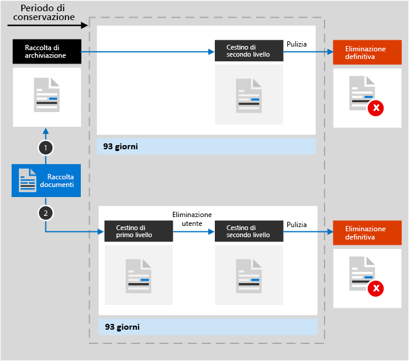

# Informazioni sulla conservazione per SharePoint e OneDrive

>*[Indicazioni per l'assegnazione di licenze di Microsoft 365 per sicurezza e conformità](https://aka.ms/ComplianceSD).*

Questo articolo integra [Informazioni sulla conservazione](retention.md) con informazioni specifiche per SharePoint e OneDrive.

Per altri carichi di lavoro, vedere:

- [Informazioni sulla conservazione per Microsoft Teams](retention-policies-teams.md)
- [Informazioni sulla conservazione per Yammer](retention-policies-yammer.md)
- [Informazioni sulla conservazione per Exchange](retention-policies-exchange.md)

## Cosa è incluso per la conservazione e l'eliminazione

È possibile conservare tutti i file archiviati in siti di SharePoint o OneDrive applicando un criterio di conservazione o un'etichetta di conservazione. 

È possibile eliminare i file seguenti:

- Se si usa un criterio di conservazione, tutti i file nelle raccolte documenti, il che include tutte le raccolte documenti di SharePoint create automaticamente, come le **Risorse del sito**.
    
- Se si usano le etichette di conservazione, tutti i file in tutte le raccolte documenti e tutti i file a livello radice non contenuti in una cartella.
    
> [!TIP]
> Se si usa una [query con un criterio di applicazione automatica per un'etichetta di conservazione](apply-retention-labels-automatically.md#auto-apply-labels-to-content-with-keywords-or-searchable-properties), è possibile escludere raccolte documenti usando la voce seguente: `NOT(DocumentLink:"<URL to document library>")`

Le voci di elenco non sono supportate dai criteri di conservazione ma dalle etichette di conservazione, ad eccezione delle voci presenti negli elenchi di sistema. Si tratta di elenchi nascosti utilizzati da SharePoint per la gestione del sistema e includono il catalogo della pagina master, il catalogo delle soluzioni e le origini dati.

Le impostazioni di conservazione sia dei criteri che delle etichette di conservazione non sono validi per le strutture di organizzazione che includono raccolte, elenchi e cartelle.

Per i criteri di conservazione e i criteri di etichetta applicati automaticamente: i siti di SharePoint devono essere indicizzati per applicare le impostazioni di conservazione. Se gli elementi nelle raccolte documenti di SharePoint sono configurati per non essere visualizzati nei risultati di ricerca, tale configurazione non esclude i file dalle impostazioni di conservazione.

## Funzionamento della conservazione per SharePoint e OneDrive

Per archiviare contenuti da conservare, SharePoint e OneDrive creano una raccolta di archiviazione se non ne esiste già una. È possibile visualizzare questa raccolta nella pagina **Contenuto del sito** nel sito principale della raccolta siti. La maggior parte degli utenti non può visualizzare la raccolta di archiviazione poiché è visibile soltanto agli amministratori della raccolta siti.

Non è necessario che gli elementi di SharePoint con un’etichetta di conservazione standard (che non dichiara l'elemento come record) siano presenti nella Raccolta di archiviazione in quanto rimangono nella loro posizione originale. SharePoint impedisce agli utenti di eliminare un elemento quando l’etichetta di conservazione applicata è configurata per conservare il contenuto. Inoltre, il controllo delle versioni di SharePoint conserva le versioni precedenti quando gli elementi vengono modificati. In altri scenari, tuttavia, la Raccolta di archiviazione viene usata quando è necessario conservare gli elementi:
- Elementi di OneDrive con etichette di conservazione standard
- Elementi di SharePoint o OneDrive con etichette di conservazione che li dichiarano come record, se l'elemento è sbloccato per la modifica
- Elementi soggetti ai criteri di conservazione

Per conservare tali contenuti quando un utente tenta di modificarli o eliminarli, viene eseguita una verifica del contenuto per stabilire se è stato modificato dopo l'applicazione delle impostazioni di conservazione. Nel caso della prima modifica dell’applicazione delle impostazioni di conservazione, il contenuto viene copiato nella raccolta di archiviazione che permette all'utente di modificare o eliminare i contenuti originali. Il contenuto di una raccolta siti può essere copiato nella raccolta di archiviazione, indipendentemente dalle impostazioni di conservazione.
  
Un processo timer pulisce periodicamente la raccolta di archiviazione. Per i contenuti rimasti nella raccolta di archiviazione per più di 30 giorni, questo processo confronta i contenuti con tutte le query usate dalle impostazioni di conservazione per tali contenuti. I contenuti che superano il periodo di conservazione configurato vengono eliminati dalla raccolta di archiviazione e dalla posizione originale, se ancora presenti. Questo processo timer viene eseguito ogni sette giorni. Ciò significa che, oltre al periodo minimo di 30 giorni, possono essere necessari fino a 37 giorni perché il contenuto sia eliminato dalla raccolta di archiviazione.
  
Questo comportamento si applica ai contenuti che esistono al momento dell'applicazione delle impostazioni di conservazione. Inoltre, per i criteri di conservazione, i nuovi contenuti creati o aggiunti alla raccolta siti in seguito all'inclusione nei criteri conservazione, verranno conservati dopo l'eliminazione. Tuttavia, i nuovi contenuti non vengono copiati nella raccolta di archiviazione al momento della prima modifica, ma solo quando viene eliminato. Per conservare tutte le versioni di un file, è necessario attivare il [controllo delle versioni](#how-retention-works-with-document-versions).
  
Se si prova a eliminare una raccolta, un elenco, una cartella o un sito soggetti a conservazione, viene visualizzato un messaggio di errore. È possibile eliminare una cartella se prima di tutto si spostano o si eliminano eventuali file soggetti a conservazione presenti nella cartella.

> [!NOTE]
> Poiché la Raccolta di archiviazione viene creata solo quando è necessaria e non quando si applicano criteri di conservazione o un’etichetta di conservazione, per consentire questa operazione è necessario innanzitutto modificare o eliminare un elemento soggetto a conservazione. Quindi, passare alla Raccolta di archiviazione per visualizzare la copia conservata.
  
Dopo che le impostazioni di conservazione vengono assegnate ai contenuti di OneDrive o a un sito di SharePoint, i percorsi del contenuto variano in base al fatto che le impostazioni di conservazione siano Conserva ed elimina, Conserva solo o Elimina solo.

Se l'impostazione di conservazione è Conserva ed elimina:

  
1. **Se il contenuto viene modificato o eliminato** durante il periodo di conservazione, viene creata una copia del contenuto originale uguale a quello esistente durante l’assegnazione delle impostazioni di conservazione della raccolta di archiviazione. Nella raccolta, un processo timer identifica gli elementi il cui periodo di conservazione è scaduto. Questi elementi vengono poi spostati nel cestino di secondo livello, dove vengono eliminati definitivamente dopo 93 giorni. Il Cestino di secondo livello non è visibile agli utenti finali come il Cestino di primo livello, tuttavia gli amministratori della raccolta siti possono visualizzare e ripristinare il contenuto da tale posizione.

    > [!NOTE]
    > Per evitare perdite accidentali di dati, non eliminiamo più definitivamente il contenuto dalla raccolta di archiviazione. Eliminiamo invece definitivamente il contenuto solo dal Cestino in modo che tutto il contenuto della raccolta di archiviazione passi al Cestino di secondo livello.
    
2. **Se il contenuto non viene modificato o eliminato** durante il periodo di conservazione, il processo timer lo sposta nel Cestino di primo livello alla fine del periodo di conservazione. Se un utente elimina il contenuto da questa posizione o svuota questo Cestino, il documento viene spostato nel Cestino di secondo livello. Il periodo di conservazione per i Cestini di primo e secondo livello è di 93 giorni. Al termine di questi 93 giorni, il documento viene eliminato definitivamente dal Cestino di primo o di secondo livello. Il Cestino non è indicizzato e quindi non è disponibile per la ricerca. Di conseguenza, una ricerca eDiscovery non può trovare alcun contenuto nel Cestino a cui applicare un blocco.

Quando l'impostazione di conservazione è Conserva solo o Elimina solo, i percorsi del contenuto sono varianti di Conserva ed elimina:

### Percorsi di contenuto per l'impostazione di conservazione Conserva solo

1. **Se il contenuto viene modificato o eliminato** durante il periodo di conservazione: una copia del documento originale viene creata nella raccolta di archiviazione e conservata fino al termine del periodo di conservazione, quindi la copia nella raccolta di archiviazione viene spostata nel cestino di secondo livello e viene eliminata definitivamente dopo 93 giorni.

2. **Se il contenuto non viene modificato o eliminato** durante il periodo di conservazione: non succede niente prima o dopo il periodo di conservazione. Il documento rimane nella posizione originale.

### Percorsi di contenuto per l'impostazione di conservazione Elimina solo

1. **Se il contenuto viene eliminato** durante il periodo configurato: il documento viene spostato nel Cestino di primo livello. Se un utente elimina il documento da questa posizione o svuota questo Cestino, il documento viene spostato nel Cestino di secondo livello. Il periodo di conservazione per i Cestini di primo e secondo livello è di 93 giorni, dopo i quali il documento viene eliminato definitivamente dal Cestino, sia di primo che di secondo livello. Se il contenuto viene modificato durante il periodo configurato, segue lo stesso percorso di eliminazione dopo il periodo configurato.

2. **Se il contenuto non viene eliminato** durante il periodo configurato: alla fine del periodo configurato nel criterio di conservazione, il documento viene spostato nel Cestino di primo livello. Se un utente elimina il documento da questa posizione o svuota questo Cestino, il documento viene spostato nel Cestino di secondo livello. Il periodo di conservazione per i Cestini di primo e secondo livello è di 93 giorni, dopo i quali il documento viene eliminato definitivamente dal Cestino, sia di primo che di secondo livello. Il Cestino non è indicizzato e quindi non è disponibile per la ricerca. Di conseguenza, una ricerca eDiscovery non può trovare alcun contenuto nel Cestino a cui applicare un blocco.

## Funzionamento della conservazione per il contenuto di OneNote

Quando si applicano i criteri di conservazione a una posizione che include contenuto di OneNote, le diverse sezioni di OneNote corrispondono ai file individuali. Questo significa che ogni sezione verrà conservata ed eliminata singolarmente, in base alle impostazioni di conservazione specificate.

## Come funziona la conservazione con le versioni dei documenti

Il controllo delle versioni è una caratteristica di tutte gli elenchi e raccolte documenti di SharePoint e OneDrive. Per impostazione predefinita, il controllo delle versioni conserva almeno 500 versioni principali, limite che è possibile aumentare. Per ulteriori informazioni, vedere [Abilitare e configurare il controllo delle versioni per un elenco o una raccolta](https://support.office.com/article/1555d642-23ee-446a-990a-bcab618c7a37) e [Come funziona il controllo delle versioni negli elenchi e nelle raccolte](https://support.microsoft.com/office/how-versioning-works-in-lists-and-libraries-0f6cd105-974f-44a4-aadb-43ac5bdfd247).
  
Quando un documento con versioni è soggetto a impostazioni di conservazione per conservare tale contenuto, le versioni che vengono copiate nella libreria di conservazione esistono come elemento distinto. Se le impostazioni di conservazione sono configurate per l'eliminazione al termine del periodo di conservazione:

- Se il periodo di conservazione si basa sulla data di creazione del contenuto, ciascuna versione ha la stessa data di scadenza del documento originale.  Il documento originale e le sue versioni scadono tutti allo stesso tempo.

- Se il periodo di conservazione si basa sulla data dell'ultima modifica del contenuto, ciascuna versione ha la propria data di scadenza in base a quando il documento originale è stato modificato per creare quella versione.  i documenti originali e le relative versioni scadono indipendentemente l'uno dall'altro.

> [!NOTE]
> le versioni conservate dei documenti di SharePoint e OneDrive non sono disponibili per la ricerca da parte degli strumenti di eDiscovery.

Quando l'azione di conservazione elimina il documento, tutte le versioni non presenti nella raccolta di archiviazione vengono eliminate contemporaneamente in base alla versione corrente.

Se gli elementi sono soggetti a criteri di conservazione (o a un blocco eDiscovery), i limiti di controllo delle versioni per la raccolta documenti vengono ignorati finché non viene raggiunto il periodo di conservazione del documento (o se il blocco eDiscovery viene rilasciato). In questo scenario, le versioni precedenti non vengono eliminate automaticamente e non è possibile eliminarle.

Questo non è il caso delle etichette di conservazione se il contenuto non è soggetto a criteri di conservazione (o blocco eDiscovery). I limiti di controllo delle versioni sono rispettati in modo che le versioni più vecchie vengano automaticamente cancellate per accogliere le nuove versioni, ma agli utenti viene ancora impedito di cancellare le versioni.

## Quando un utente abbandona l’organizzazione

**SharePoint**:

Se un utente abbandona l'organizzazione, tutti i contenuti creati da quest'ultimo non subiranno alcuna modifica in quanto SharePoint è considerato un ambiente di collaborazione, al contrario di una cassetta postale o di un account OneDrive dell'utente.

**OneDrive**:

Se un utente abbandona l'organizzazione, i file soggetti a un criterio di conservazione o con etichette di conservazione verranno mantenuti per l'intera durata dell'etichetta o del criterio. Durante questo periodo di tempo, tutti gli accessi di condivisione continueranno a funzionare. Quando il periodo di conservazione scade, il contenuto viene spostato nel Cestino della raccolta siti e solo gli amministratori possono accedervi. Se un documento viene contrassegnato come record da un’etichetta di conservazione, il documento viene mantenuto fino allo scadere del periodo di conservazione, al termine del quale il contenuto verrà eliminato definitivamente.

## Linee guida per la configurazione

Se si configura per la prima volta la conservazione in Microsoft 365, vedere [Informazioni sui criteri e sulle etichette di conservazione](get-started-with-retention.md).

Se si è pronti per configurare un criterio di conservazione o un'etichetta di conservazione per Exchange, vedere le istruzioni seguenti:
- [Creare e configurare criteri di conservazione](create-retention-policies.md)
- [Creare etichette di conservazione e applicarle nelle app](create-apply-retention-labels.md)
- [Applicare automaticamente un'etichetta di conservazione al contenuto](apply-retention-labels-automatically.md)
