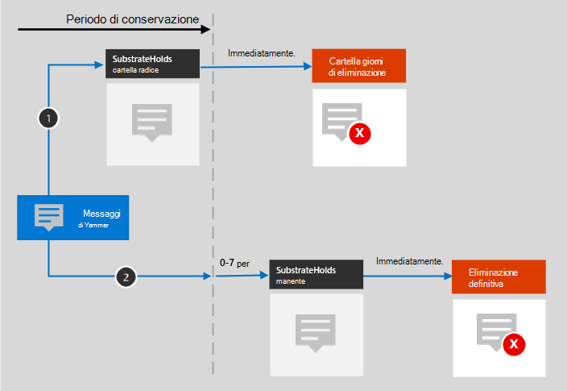

# Informazioni sulla conservazione per Yammer

>*[Indicazioni per l'assegnazione di licenze di Microsoft 365 per sicurezza e conformità](/office365/servicedescriptions/microsoft-365-service-descriptions/microsoft-365-tenantlevel-services-licensing-guidance/microsoft-365-security-compliance-licensing-guidance).*

> [!NOTE]
> Questa funzionalità è in anteprima e soggetta a modifiche.

Questo articolo integra [Informazioni sulla conservazione](retention.md) con informazioni specifiche per Yammer.

Per altri carichi di lavoro, vedere:

- [Informazioni sulla conservazione per SharePoint e OneDrive](retention-policies-sharepoint.md)
- [Informazioni sulla conservazione per Microsoft Teams](retention-policies-teams.md)
- [Informazioni sulla conservazione per Exchange](retention-policies-exchange.md)

## Cosa è incluso per la conservazione e l'eliminazione

Usando i criteri di conservazione per Yammer è possibile conservare ed eliminare gli elementi di Yammer seguenti: messaggi della community e messaggi privati.

Le reazioni degli altri utenti sotto forma di emoticon non sono incluse in questi messaggi.

## Funzionamento della conservazione per Yammer

È possibile usare i criteri di conservazione per conservare ed eliminare i messaggi della community e i messaggi privati di Yammer. I messaggi privati sono archiviati in una cartella nascosta all'interno della cassetta postale di ogni utente incluso nel messaggio, e i messaggi della community sono archiviati in un'analoga cartella nascosta all'interno della cassetta postale di gruppo della community.

I messaggi di Yammer non sono interessati dai criteri di conservazione configurati per le cassette postali di utenti o gruppi. Benché i messaggi di Yammer siano archiviati in Exchange, questi dati di Yammer vengono inclusi solo da un criterio di conservazione configurato per le posizioni **Messaggi della community di Yammer** e **Messaggi utente di Yammer**.

> [!NOTE]
> Se un utente è incluso in un criterio di conservazione attivo che conserva i dati di Yammer e si eliminata una cassetta postale di un utente incluso in tale criterio, per conservare i dati di Yammer la cassetta postale viene convertita in una [cassetta postale inattiva](inactive-mailboxes-in-office-365.md). Se non è necessario conservare i dati di Yammer per l'utente, escludere l'account utente dal criterio di conservazione prima di eliminare la relativa cassetta postale.

Dopo che i criteri di conservazione sono stati configurati per messaggi di Yammer, un processo timer del servizio Exchange valuterà periodicamente gli elementi nella cartella nascosta in cui vengono archiviati i messaggi di Yammer. Il processo timer richiede fino a sette giorni per l'esecuzione. Quando il periodo di conservazione degli elementi scade, questi vengono spostati nella cartella SubstrateHolds, una cartella nascosta presente in ogni cassetta postale utente o di gruppo in cui vengono archiviati gli elementi "eliminati temporaneamente" prima che vengano eliminati definitivamente.

> [!NOTE]
> In base al [primo principio di conservazione](retention.md#the-principles-of-retention-or-what-takes-precedence), l'eliminazione permanente viene sempre sospesa se lo stesso elemento deve essere conservato a causa di un altro criterio di conservazione oppure è sottoposto a blocchi di eDiscovery per motivi legali o di indagine.

Dopo la configurazione di un criterio di conservazione per i messaggi di Yammer, i percorsi del contenuto variano in base al fatto che il criterio di conservazione sia impostato per conservare e poi eliminare, conservare solo o eliminare solo.

Se il criterio di conservazione conserva e poi elimina:

Per i due percorsi nel diagramma:

1. **Se un messaggio di Yammer viene modificato o eliminato** dall’utente durante il periodo di conservazione, il messaggio originale viene copiato (se è stato modificato) o spostato (se è stato eliminato) immediatamente nella cartella SubstrateHolds. Il messaggio viene archiviato in questa posizione fino alla scadenza del periodo di conservazione, quindi viene eliminato immediatamente in modo definitivo.

2. **Se il messaggio di Yammer non viene eliminato**, così come per i messaggi correnti dopo essere stati modificati, il messaggio viene spostato nella cartella SubstrateHolds alla scadenza del periodo di conservazione. Questa azione richiede fino a sette giorni dalla data di scadenza. Dopo che il messaggio è stato spostato nella cartella SubstrateHolds, viene eliminato immediatamente in modo definitivo. 

> [!NOTE]
> I messaggi nella cartella SubstrateHolds sono disponibili per la ricerca tramite gli strumenti di eDiscovery. Finché i messaggi non vengono eliminati definitivamente (nella cartella SubstrateHolds), rimangono disponibili per la ricerca tramite gli strumenti di eDiscovery.

Quando il criterio di conservazione è Conserva solo, o Elimina solo, i percorsi del contenuto sono varianti di Conserva ed Elimina.

### Percorsi di contenuto per il criterio di conservazione Conserva solo

1. **Se un messaggio di Yammer viene modificato o eliminato**: una copia del messaggio originale viene immediatamente creata nella cartella SubstrateHolds e conservata in tale posizione fino alla scadenza del periodo di conservazione. Quindi il messaggio viene eliminato immediatamente in modo definitivo dalla cartella SubstrateHolds.

2. **Se il messaggio di Yammer non viene modificato o eliminato**, così come per i messaggi correnti dopo essere stati modificati durante il periodo di conservazione: non succede niente prima o dopo il periodo di conservazione. L'elemento rimane nella posizione originale.

### Percorsi di contenuto per il criterio di conservazione Elimina solo

1. **Se il messaggio di Yammer non viene eliminato** durante il periodo di conservazione: alla fine del periodo di conservazione il messaggio viene spostato nella cartella SubstrateHolds. Questa azione richiede fino a sette giorni dalla data di scadenza. Quindi il messaggio viene eliminato immediatamente in modo definitivo dalla cartella SubstrateHolds.

2. **Se il messaggio di Yammer viene eliminato dall'utente** durante il periodo, verrà immediatamente spostato nella cartella SubstrateHolds da dove verrà immediatamente eliminato in modo definitivo.

## Messaggi e utenti esterni

Per impostazione predefinita, i criteri di conservazione dei messaggi utente di Yammer si applicano a tutti gli utenti dell'organizzazione, ma non agli utenti esterni. Si può applicare un'etichetta di conservazione a utenti esterni selezionando **Scegli utente** e specificando il loro account. 

Al momento, gli utenti guest di Azure B2B non sono supportati.

## Quando un utente abbandona l’organizzazione 

Se un utente lascia l’organizzazione e il suo account di Microsoft 365 viene eliminato, i suoi messaggi utente di Yammer soggetti alla conservazione vengono archiviati in una cassetta postale inattiva. I messaggi restano sottoposti ai criteri di conservazione applicati all’utente prima della disattivazione della sua cassetta postale, e sono disponibili per la ricerca eDiscovery. Per altre informazioni, vedere [Cassette postali inattive in Exchange Online](inactive-mailboxes-in-office-365.md). 

Se l’utente ha archiviato dei file in Yammer, vedere la [sezione corrispondente](retention-policies-sharepoint.md#when-a-user-leaves-the-organization) per SharePoint e OneDrive.

## Limitazioni

I criteri di conservazione di Yammer sono attualmente in anteprima, e stiamo lavorando continuamente all'ottimizzazione della funzionalità di conservazione. Nel frattempo, notare le limitazioni seguenti quando si usa la conservazione per i messaggi della community e i messaggi privati di Yammer:

- Quando si seleziona **Scegli utenti** per la posizione **Messaggi utente di Yammer**, potrebbero essere visualizzati utenti non della cassetta postale e guest. I criteri di conservazione non sono pensati per questi utenti, quindi non selezionarli.

## Linee guida per la configurazione

Se si configura per la prima volta la conservazione in Microsoft 365, vedere [Informazioni sui criteri e sulle etichette di conservazione](get-started-with-retention.md).

Se si è pronti per configurare un criterio di conservazione per Yammer, vedere [Creare e configurare criteri di conservazione](create-retention-policies.md).