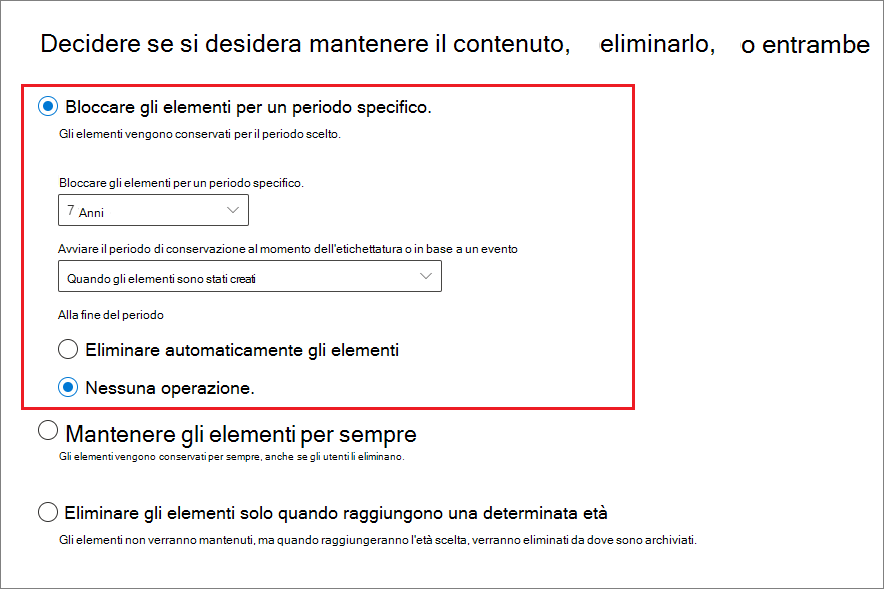
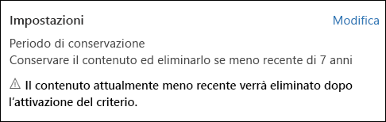
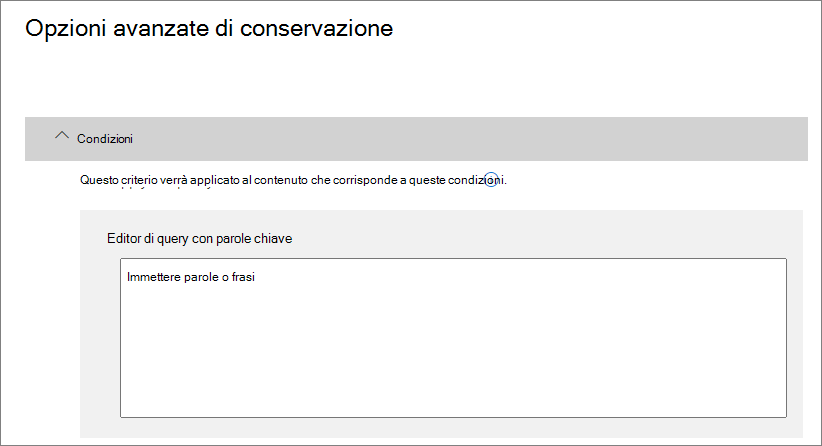
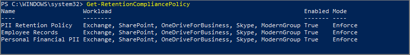

# Panoramica dei criteri di conservazione

>*[Indicazioni per l'assegnazione di licenze di Microsoft 365 per sicurezza e conformità](https://aka.ms/ComplianceSD).*

Per la maggior parte delle organizzazioni, il volume e la complessità dei dati aumentano giorno dopo giorno, a causa di posta elettronica, documenti, messaggi istantanei e altro ancora. La gestione o il controllo efficace di queste informazioni è importante perché è necessario:
  
- **Conformarsi in modo proattivo alle normative del settore e ai criteri interni** che richiedono di conservare il contenuto per un periodo di tempo minimo, ad esempio la norma Sarbanes-Oxley Act richiede che alcuni tipi di contenuto vengano conservati per sette anni. 
    
- **Ridurre i rischi in caso di controversie legali o di violazioni della sicurezza** eliminando definitivamente i contenuti obsoleti che non è più necessario mantenere. 
    
- **Aiutare l'organizzazione a condividere le informazioni in modo efficace e a essere più flessibile** assicurando che gli utenti usino solo contenuti aggiornati e pertinenti. 
    
Un criterio di conservazione consente di raggiungere tutti questi obiettivi. La gestione dei contenuti in genere richiede due azioni:
  
- **Conservare** il contenuto in modo che non possa essere eliminato definitivamente prima del termine del periodo di conservazione. 
    
- **Eliminare** il contenuto in modo permanente alla fine del periodo di conservazione. 
    
Con i criteri di conservazione è possibile:
  
- Decidere proattivamente se conservare il contenuto, eliminarlo o entrambe le cose, ovvero conservarlo ed eliminarlo successivamente.
    
- Applicare un singolo criterio all'intera organizzazione o a posizioni o utenti specifici.
    
- Applicare i criteri a tutti i contenuti o al contenuto che soddisfa determinate condizioni, ad esempio che contiene parole chiave specifiche o [tipi specifici di informazioni riservate](what-the-sensitive-information-types-look-for.md).
    
Quando si impostano criteri di conservazione per il contenuto, gli utenti possono continuare a modificare e usare il contenuto come sempre perché il contenuto viene mantenuto nella posizione originale. Se però qualcuno modifica o elimina il contenuto soggetto ai criteri, ne viene salvata una copia in una posizione sicura dove viene conservata finché restano in vigore i criteri.
  
Infine, alcune organizzazioni hanno la necessità di conformarsi a normative come la regola 17a-4 della SEC (Securities and Exchange Commission), in base alla quale i criteri di conservazione attivati non possono essere disattivati o resi meno restrittivi. Per soddisfare questo requisito, è possibile usare la caratteristica protezione dell'archiviazione. Dopo aver bloccato i criteri, nessuno, incluso l'amministratore, può disattivarli o renderli meno restrittivi.
  
I criteri di conservazione vengono creati e gestiti dal [Centro conformità Microsoft 365](https://compliance.microsoft.com/): **Criteri** > **Dati** > **Conservazione**

In alternativa, è possibile passare alla stessa posizione nel Centro conformità Microsoft 365 usando la scheda **Soluzioni** > **Governance delle informazioni** > **Conservazione**. 

**Se si vuole avere la possibilità di esaminare il contenuto prima che venga eliminato definitivamente,** provare a usare [etichette di conservazione](labels.md) anziché i criteri di conservazione. Quando si crea un'etichetta di conservazione, è possibile configurare una [revisione per l'eliminazione](disposition.md#disposition-reviews) per rivedere il contenuto al termine del periodo di conservazione.

## Funzionamento dei criteri di conservazione con il contenuto presente

Quando si include una posizione, ad esempio un sito o una cassetta postale, nei criteri di conservazione, il contenuto rimane nella posizione originale. Gli utenti possono continuare a lavorare normalmente con i propri documenti o messaggi di posta elettronica. Tuttavia, se modificano o eliminano il contenuto incluso nei criteri, viene conservata una copia del contenuto al momento dell'applicazione dei criteri.
  
Per le raccolte siti di SharePoint una copia del contenuto originale viene conservata nella raccolta di archiviazione quando gli utenti modificano o eliminano il contenuto. Per la posta elettronica e le cartelle pubbliche la copia viene conservata nella cartella Elementi ripristinabili. Queste posizioni sicure e il contenuto conservato non sono visibili alla maggior parte degli utenti. Con i criteri di conservazione non è neanche necessario che gli utenti sappiano che il contenuto è soggetto a criteri.
  
Note:
  
- Il contenuto di Teams (chat) è archiviato in Exchange, dove i criteri sono applicati in base al tipo di messaggio (posta elettronica o conversazione).
    
- I criteri di conservazione applicati a un gruppo di Office 365 includono sia la cassetta postale del gruppo che il sito.

- La raccolta di archiviazione utilizza la quota di spazio di archiviazione del sito.
    
### Contenuto negli account di OneDrive e nei siti di SharePoint

I criteri di conservazione vengono applicati a livello di raccolta siti. Quando si include una raccolta siti di SharePoint o un account OneDrive nei criteri di conservazione viene usata una raccolta di archiviazione per conservare i documenti. Se non esiste già, la raccolta viene creata automaticamente. È possibile visualizzare questa raccolta nella pagina **Contenuto del sito** nel sito principale della raccolta siti. La maggior parte degli utenti non può visualizzare la raccolta di archiviazione poiché è visibile soltanto agli amministratori della raccolta siti.
  
Se un utente tenta di modificare o eliminare i contenuti di un sito soggetto a Conserva ed elimina o a Conserva solo, i criteri controllano innanzitutto se il contenuto è stato modificato dal momento della sua applicazione. Nel caso della prima modifica dall'applicazione dei criteri di conservazione, questi creano una copia dei contenuti nella raccolta di archiviazione, quindi permettono all'utente di modificare o eliminare i contenuti originali. I contenuti presenti nella raccolta siti possono essere copiati nella raccolta di archiviazione anche se tali contenuti non corrispondono al filtro della query utilizzato dai criteri di conservazione.

Copiare i contenuti nella raccolta di archiviazione è possibile per i contenuti che esistono al momento dell'applicazione dei criteri di conservazione. Inoltre, i nuovi contenuti creati o aggiunti alla raccolta siti in seguito all'inclusione nei criteri conservazione, verranno conservati dopo l'eliminazione. Tuttavia, i nuovi contenuti non vengono copiati nella raccolta di archiviazione al momento della prima modifica, ma solo quando viene eliminato. Per conservare tutte le versioni di un file, attivare il controllo delle versioni, come illustrato in una [sezione](#how-a-retention-policy-works-with-document-versions-in-a-site-collection) di seguito.
  
Si osservi che, se si prova a eliminare una raccolta, un elenco, una cartella o un sito soggetti a criteri di conservazione, viene visualizzato un messaggio di errore. Un utente può eliminare una cartella se prima di tutto sposta o elimina gli eventuali file nella cartella soggetta ai criteri. Inoltre, la raccolta di archiviazione viene creata solo quando il primo elemento deve essere copiato nella raccolta e non quando si creano criteri di conservazione. Quindi, per verificare i criteri, è necessario prima di tutto modificare o eliminare un documento in un sito soggetto ai criteri, quindi passare alla raccolta di archiviazione per visualizzare la copia conservata.
  
Dopo che i criteri di conservazione vengono assegnati a un account di OneDrive o a un sito di SharePoint, i percorsi del contenuto variano in base al fatto che il criterio di conservazione sia Conserva ed elimina, Conserva solo o Elimina solo.

Se il criterio di conservazione è Conserva ed elimina:

  
1. **Se il contenuto viene modificato o eliminato** durante il periodo di conservazione: una copia del contenuto originale al momento dell'assegnazione dei criteri di conservazione viene creata nella raccolta di archiviazione. Nella raccolta, un processo timer viene eseguito periodicamente e identifica gli elementi il cui periodo di conservazione è scaduto. Questi elementi vengono spostati nel cestino di secondo livello, dove vengono eliminati definitivamente dopo 93 giorni. Il Cestino di secondo livello non è visibile agli utenti finali come il Cestino di primo livello, tuttavia gli amministratori della raccolta siti possono visualizzare e ripristinare il contenuto da tale posizione.

    > [!NOTE]
    > Per evitare perdite accidentali di dati, il contenuto non viene mai eliminato automaticamente dalla raccolta di archiviazione, ma passa al cestino di secondo livello. Il periodo di tolleranza di 93 giorni consente agli amministratori di recuperare il contenuto, se necessario.
    
2. **Se il contenuto non viene modificato o eliminato** durante il periodo di conservazione: alla fine del periodo di conservazione il documento viene spostato nel Cestino di primo livello. Se un utente elimina il documento da questa posizione o svuota questo Cestino, il documento viene spostato nel Cestino di secondo livello. Il periodo di conservazione per i Cestini di primo e secondo livello è di 93 giorni, dopo i quali il documento viene eliminato definitivamente dal Cestino, sia di primo che di secondo livello. Il Cestino non è indicizzato e quindi non è disponibile per la ricerca. Di conseguenza, una ricerca eDiscovery non può trovare alcun contenuto nel Cestino a cui applicare un blocco. 

Quando il criterio di conservazione è Conserva solo, o Elimina solo, i percorsi del contenuto sono varianti di Conserva ed elimina:

#### Percorsi di contenuto per il criterio di conservazione Conserva solo

1. **Se il contenuto viene modificato o eliminato** durante il periodo di conservazione: una copia del documento originale viene creata nella raccolta di archiviazione e conservata fino al termine del periodo di conservazione, quindi la copia nella raccolta di archiviazione viene spostata nel cestino di secondo livello e viene eliminata definitivamente dopo 93 giorni.

2. **Se il contenuto non viene modificato o eliminato** durante il periodo di conservazione: non succede niente prima o dopo il periodo di conservazione. Il documento rimane nella posizione originale.

#### Percorsi di contenuto per il criterio di conservazione Elimina solo

1. **Se il contenuto viene eliminato** durante il periodo di conservazione: il documento viene spostato nel cestino di primo livello. Se un utente elimina il documento da questa posizione o svuota questo Cestino, il documento viene spostato nel Cestino di secondo livello. Il periodo di conservazione per i Cestini di primo e secondo livello è di 93 giorni, dopo i quali il documento viene eliminato definitivamente dal Cestino, sia di primo che di secondo livello. Se il contenuto viene modificato durante il periodo di conservazione, esegue lo stesso percorso di eliminazione dopo la scadenza del contenuto.

2. **Se il contenuto non viene eliminato** durante il periodo di conservazione: alla fine del periodo di conservazione il documento viene spostato nel Cestino di primo livello. Se il contenuto viene eliminato durante il periodo di conservazione, il documento viene spostato immediatamente nel cestino di primo livello. Se un utente elimina il documento da questa posizione o svuota questo Cestino, il documento viene spostato nel Cestino di secondo livello. Il periodo di conservazione per i Cestini di primo e secondo livello è di 93 giorni, dopo i quali il documento viene eliminato definitivamente dal Cestino, sia di primo che di secondo livello. Il Cestino non è indicizzato e quindi non è disponibile per la ricerca. Di conseguenza, una ricerca eDiscovery non può trovare alcun contenuto nel Cestino a cui applicare un blocco.

### Contenuto in cassette postali e cartelle pubbliche

Per la posta elettronica, il calendario e altri elementi di un utente, i criteri di conservazione vengono applicati a livello di cassetta postale. Per una cartella pubblica, i criteri di conservazione vengono applicati a livello di cartella e non di cassetta postale. Per conservare gli elementi sia di una cassetta postale che di una cartella pubblica viene utilizzata la cartella Elementi ripristinabili. Solo gli utenti a cui sono state assegnate autorizzazioni di eDiscovery possono visualizzare gli elementi nella cartella Elementi ripristinabili di un altro utente.
  
Per impostazione predefinita, quando un utente elimina un messaggio in una cartella diversa dalla cartella Posta eliminata, il messaggio viene spostato nella cartella Posta eliminata. Quando un utente elimina un elemento dalla cartella Posta eliminata, il messaggio viene spostato nella cartella Elementi ripristinabili. Un utente può anche eliminare temporaneamente un elemento (MAIUSC+CANC) in qualsiasi cartella. Con questa operazione la cartella Posta eliminata viene ignorata e l'elemento viene inserito direttamente nella cartella Elementi ripristinabili.
  
Un processo verifica periodicamente gli elementi nella cartella Elementi ripristinabili. Se un elemento non corrisponde alle regole specificate in almeno un criterio di conservazione, viene eliminato definitivamente dalla cartella Elementi ripristinabili.
  
Quando un utente prova a modificare determinate proprietà di un elemento di cassette postali (ad esempio, l'oggetto, il corpo, gli allegati, i mittenti o i destinatari, la data di invio o di ricezione di un messaggio), una copia dell'elemento originale viene salvata nella cartella Elementi ripristinabili prima che la modifica diventi effettiva. Questo si verifica per ogni modifica successiva. Alla fine del periodo di conservazione, le copie nella cartella Elementi ripristinabili vengono eliminate definitivamente.
  
Se il criterio di conservazione è Conserva ed elimina:

1. **Se l'elemento viene modificato o eliminato** definitivamente dall'utente (con MAIUSC+CANC o eliminandolo da Posta eliminata) durante il periodo di conservazione, viene spostato (o copiato, in caso di modifica) nella cartella Elementi ripristinabili. In questa raccolta a intervalli regolari viene eseguito un processo che identifica i messaggi il cui periodo di conservazione è scaduto. Questi elementi vengono eliminati definitivamente entro 14 giorni dalla data di fine del periodo di conservazione. 14 giorni è l'impostazione predefinita, ma può essere configurato un valore fino a 30 giorni.
    
2. **Se l'elemento non viene modificato o eliminato** durante il periodo di conservazione, lo stesso processo viene eseguito periodicamente in tutte le cartelle della cassetta postale e identifica i messaggi il cui periodo di conservazione è scaduto. Questi elementi vengono eliminati definitivamente entro 14 giorni dalla data di fine del periodo di conservazione. 14 giorni è l'impostazione predefinita, ma può essere configurato un valore fino a 30 giorni. Quando il criterio di conservazione è Conserva solo, o Elimina solo, i percorsi del contenuto sono varianti di Conserva ed elimina:

#### Percorsi di contenuto per il criterio di conservazione Conserva solo

1. **Se l'elemento viene modificato o eliminato** durante il periodo di conservazione: una copia dell'elemento originale viene creata nella cartella Elementi ripristinabili e conservata fino al termine del periodo di conservazione, quindi la copia nella cartella Elementi ripristinabili viene eliminata definitivamente entro 14 giorni dalla scadenza dell'elemento. 

2. **Se l’elemento non viene modificato o eliminato** durante il periodo di conservazione: non succede niente prima o dopo il periodo di conservazione. L’elemento rimane nella posizione originale.

#### Percorsi di contenuto per il criterio di conservazione Elimina solo

1. **Se l’elemento non viene eliminato** durante il periodo di conservazione: alla fine del periodo di conservazione l’elemento viene spostato nella cartella Elementi ripristinabili. 

2. **Se l'elemento viene eliminato** durante il periodo, l'elemento verrà immediatamente spostato nella cartella Elementi ripristinabili. Se un utente elimina l'elemento da questa posizione o svuota la cartella Elementi ripristinabili, l'elemento viene eliminato definitivamente. In caso contrario, l'elemento viene eliminato definitivamente dopo un periodo di 14 giorni nella cartella Elementi ripristinabili. 

### Quando un utente abbandona l'organizzazione

**Exchange** 

Se un utente abbandona l'organizzazione e la relativa cassetta postale è inclusa nei criteri di conservazione, quest'ultima diventerà inattiva quando viene eliminato l'account di Office 365 dell'utente. I contenuti di una cassetta postale inattiva sono comunque soggetti ai criteri di conservazione applicati alla cassetta postale prima della disattivazione e sono disponibili per la ricerca eDiscovery. Per altre informazioni, vedere [Cassette postali inattive in Exchange Online](inactive-mailboxes-in-office-365.md).

**OneDrive**

Se un utente abbandona l'organizzazione, i file soggetti a un criterio di conservazione o contenenti etichette di conservazione verranno mantenuti per l'intera durata dell'etichetta o del criterio. Durante questo periodo di tempo, tutti gli accessi di condivisione continueranno a funzionare. Quando il periodo di conservazione scade, il contenuto viene spostato nel Cestino della raccolta siti e solo gli amministratori possono accedervi. Se un documento viene contrassegnato come record da un criterio di conservazione, viene mantenuto fino allo scadere del periodo di conservazione, al termine del quale il contenuto verrà eliminato definitivamente.

**SharePoint**

Se un utente abbandona l'organizzazione, tutti i contenuti creati da quest'ultimo non subiranno alcuna modifica in quanto SharePoint è considerato un ambiente di collaborazione, al contrario di una cassetta postale o di un account OneDrive dell'utente.

## Funzionamento dei criteri di conservazione con le versioni del documento in una raccolta siti

Il controllo delle versioni è una caratteristica di tutte le raccolte documenti di SharePoint Online e OneDrive for Business. Per impostazione predefinita, il controllo delle versioni conserva almeno 500 versioni principali, limite che è possibile aumentare. Per altre informazioni, vedere [Abilitare e configurare il controllo delle versioni per un elenco o una raccolta](https://support.office.com/article/1555d642-23ee-446a-990a-bcab618c7a37).
  
Un criterio di conservazione, ovvero un criterio che prevede la conservazione del contenuto anziché la sola eliminazione, mantiene tutte le versioni di un documento in una raccolta siti di SharePoint o in un account OneDrive. Quando si modifica un documento oggetto di un criterio di blocco o di conservazione, viene copiata una versione dell'originale nella Raccolta blocchi per conservazione. Quando si elimina un documento oggetto di un criterio di blocco o di conservazione, vengono copiate tutte le versioni nella Raccolta blocchi per conservazione, se è attivato il controllo delle versioni. Ogni versione di un documento nella Raccolta blocchi per conservazione è un elemento separato con un periodo di conservazione specifico:
  
- Se i criteri di conservazione si basano sulla data di creazione del contenuto, ciascuna versione ha la stessa data di scadenza del documento originale. Il documento originale e le sue versioni scadono tutti allo stesso tempo.
    
- Se i criteri di conservazione si basano sulla data dell'ultima modifica del contenuto, ciascuna versione ha la propria data di scadenza in base a quando il documento originale è stato modificato per creare quella versione. I documenti originali e le relative versioni scadono indipendentemente l'uno dall'altro.

> [!NOTE]
> Le versioni conservate dei documenti di SharePoint e OneDrive non sono disponibili per la ricerca da parte degli strumenti di eDiscovery.

## Conservazione del contenuto per un periodo di tempo specifico

Grazie ai criteri di conservazione è possibile conservare il contenuto per un periodo di tempo indefinito o per un numero specifico di giorni, mesi o anni. Il calcolo relativo al periodo di conservazione del contenuto è basato sulla data di modifica del contenuto e non sulla data di applicazione dei criteri di conservazione. È possibile scegliere se calcolare questo periodo a partire dalla creazione del contenuto o, per OneDrive e SharePoint, dalla data dell'ultima modifica.
  
Se, ad esempio, si vuole conservare il contenuto di una raccolta siti per sette anni dall'ultima modifica e un documento presente in questa raccolta siti non è stato modificato per sei anni, il documento verrà conservato solo per un altro anno, se non viene modificato. Se il documento viene nuovamente modificato, il periodo di conservazione verrà ricalcolato in base alla nuova data di modifica e il documento verrà conservato per altri sette anni.
  
Analogamente, se si desidera conservare il contenuto di una cassetta postale per sette anni e un messaggio è stato inviato sei anni fa, il messaggio verrà conservato solo per un altro anno. Per il contenuto di Exchange, il periodo si basa sempre sulla data di ricezione o di invio, che corrispondono. La conservazione del contenuto in base all'ultima modifica si applica solo al contenuto del sito di OneDrive e SharePoint.
  
È possibile scegliere se eliminare definitivamente il contenuto alla fine del periodo di conservazione. I criteri di conservazione possono anche eliminare il contenuto obsoleto senza conservarlo. Vedere la sezione successiva.
  

  
## Eliminazione di contenuto antecedente a una data specifica

I criteri di conservazione possono conservare e quindi eliminare il contenuto successivamente o eliminare il contenuto obsoleto senza conservarlo.
  
Se i criteri di conservazione eliminano il contenuto, è importante tenere presente che il periodo di tempo specificato per i criteri di conservazione viene calcolato dal momento in cui il contenuto è stato creato o modificato, non dal momento dell'assegnazione dei criteri.
  

  
Ad esempio, si supponga di creare criteri di conservazione che eliminano il contenuto dopo tre anni e quindi di assegnarli a tutti gli account di OneDrive, che includono grandi quantità di contenuti creati quattro o cinque anni fa. In questo caso, molti contenuti verranno eliminati subito dopo la prima assegnazione dei criteri di conservazione. Per questo motivo, **i criteri di conservazione che eliminano il contenuto possono avere un impatto notevole**. 
  
Prima di assegnare criteri di conservazione a una raccolta siti per la prima volta, è quindi consigliabile considerare il tempo trascorso dalla creazione del contenuto esistente e l'impatto dei criteri sul contenuto. È anche opportuno comunicare l'introduzione dei nuovi criteri agli utenti prima di assegnarli, in modo che possano valutarne l'impatto. Questo avviso viene visualizzato quando si esaminano le impostazioni per i criteri di conservazione prima di crearli.
  

  
## Impostazioni avanzate che applicano i criteri solo a contenuti che soddisfano determinate condizioni

I criteri di conservazione possono essere applicati a tutto il contenuto nelle posizioni incluse oppure solo al contenuto che contiene parole chiave specifiche o [tipi specifici di informazioni riservate](what-the-sensitive-information-types-look-for.md).
  

  
### Conservare il contenuto che include parole chiave specifiche

È possibile applicare i criteri di conservazione solo al contenuto che soddisfa determinate condizioni e quindi eseguire azioni di conservazione solo su tale contenuto. Le condizioni disponibili ora supportano l'applicazione di criteri di conservazione al contenuto che include parole o frasi specifiche. È possibile perfezionare la query usando operatori di ricerca come AND, OR e NOT. Per ulteriori informazioni sugli operatori, vedere [Query con parole chiave e condizioni di ricerca per la ricerca di contenuto](keyword-queries-and-search-conditions.md).
  
Il supporto delle proprietà disponibili per le ricerche (ad esempio, **subject:**) sarà disponibile a breve.
  
I criteri di conservazione basati su query usano l'indice di ricerca per identificare il contenuto.
  

  
### Conservare il contenuto che include informazioni riservate

È possibile applicare i criteri di conservazione anche solo al contenuto che contiene [tipi specifici di informazioni riservate](what-the-sensitive-information-types-look-for.md). Ad esempio, è possibile scegliere di applicare requisiti di conservazione univoci solo al contenuto che contiene informazioni personali come codici identificativi dei singoli contribuenti, codici di previdenza sociale o numeri di passaporto.
  

  
Note:
  
- I criteri di conservazione avanzati per le informazioni riservate non si applicano alle cartelle pubbliche di Exchange o a Skype for Business perché queste posizioni non supportano i tipi di informazioni riservate.
    
- Exchange Online, infatti, usa le regole di flusso di posta (note anche come regole di trasporto) per identificare le informazioni riservate e quindi funziona solo per i messaggi in transito, non per tutti gli elementi già archiviati in una cassetta postale. Per Exchange Online, questo significa che i criteri di conservazione possono identificare le informazioni riservate e possono eseguire azioni di conservazione solo nei messaggi ricevuti **dopo** l'applicazione dei criteri alla cassetta postale. I criteri di conservazione basati su query descritti nella sezione precedente non hanno questa limitazione perché usano l'indice di ricerca per identificare il contenuto. 
    
## Applicazione di criteri di conservazione a un'intera organizzazione o a posizioni specifiche

È possibile applicare facilmente i criteri di conservazione a un'intera organizzazione, a intere posizioni oppure a posizioni o utenti specifici.
  
### Criteri a livello di organizzazione

Una delle caratteristiche più efficaci dei criteri di conservazione riguarda la possibilità di applicare i criteri alle posizioni in Office 365, tra cui:
  
- Posta elettronica di Exchange
    
- Raccolte siti di SharePoint
    
- Account di OneDrive
    
- Gruppi di Office 365 (si applica al contenuto della cassetta postale del gruppo e del sito di SharePoint associato).
    
- Cartelle pubbliche di Exchange
    

Altre caratteristiche importanti di un criterio di conservazione a livello di organizzazione includono:
  
- Non sono previsti limiti al numero di cassette postali o di siti inclusi nel criterio.
    
- Per Exchange, le nuove cassette postali create dopo l'applicazione del criterio ereditano automaticamente il criterio.
  
### Criteri validi per intere posizioni

Quando si scelgono le posizioni, è possibile includere o escludere facilmente un'intera posizione, ad esempio la posta elettronica di Exchange o gli account di OneDrive. A questo scopo, attivare o disattivare lo **Stato** di tale posizione. 
  
Come per i criteri a livello di organizzazione, un criterio applicabile a una qualsiasi combinazione di posizioni complete può includere un numero illimitato di cassette postali o siti. Ad esempio, se un criterio include tutta la posta elettronica di Exchange e tutti i siti di SharePoint, verranno inclusi tutti i siti e tutte le cassette postali, indipendentemente dal numero. Inoltre, per Exchange, le nuove cassette postali create dopo l'applicazione del criterio ereditano automaticamente il criterio.

### Criteri con specifiche inclusioni o esclusioni

È anche possibile applicare i criteri di conservazione a specifici utenti, gruppi di Office 365 o siti. A questo scopo, attivare lo **Stato** di tale posizione e quindi usare i collegamenti per includere o escludere determinati utenti, gruppi di Office 365 o siti. 
  
Si noti però che sono previsti i limiti seguenti quando si configura un criterio di conservazione che include o esclude più di 1.000 posizioni specifiche:
  
- Valori massimi per i criteri di conservazione:
    - 1.000 cassette postali
    - 1.000 gruppi di Office 365
    - 1.000 utenti per le chat private di Teams
    - 100 siti (OneDrive o SharePoint)

- Un tenant non può contenere più di 10.000 criteri di conservazione.
    
Sebbene esistano questi limiti, è possibile evitarli applicando criteri a livello di organizzazione o criteri validi per intere posizioni.
  
### Posizioni Skype

A differenza della posta elettronica di Exchange, non è possibile attivare lo stato della posizione Skype per includere tutti gli utenti ma quando si attiva la posizione, sarà possibile scegliere manualmente gli utenti di cui si desidera conservare le conversazioni:

  
Quando si seleziona **Scegli utenti **, è possibile includere rapidamente tutti gli utenti selezionando la casella **Nome ** nell'intestazione di colonna. È necessario considerare, però, che ciascun utente viene conteggiato come specifica inclusione nei criteri. Di conseguenza, se si includono più di 1.000 utenti, si applicano i limiti indicati nella sezione precedente. La selezione di tutti gli utenti di Skype da questa posizione non coincide con la procedura che prevede l'inclusione predefinita di tutti gli utenti di Skype con i criteri a livello di organizzazione. 
  

  
Si noti che**Cronologia conversazioni**, una cartella di Outlook, è una funzionalità che non ha nulla a che fare con l'archiviazione di Skype. **Cronologia conversazioni** può essere disattivata dall'utente finale, mentre l'archiviazione per Skype avviene memorizzando una copia delle conversazioni di Skype in una cartella nascosta che è inaccessibile all'utente, ma disponibile per eDiscovery.

### Posizioni di SharePoint

I criteri di conservazione possono conservare il contenuto di siti di comunicazione di SharePoint, siti del team non collegati a gruppi di Office 365 e siti classici. I siti del team collegati a gruppi di Office 365 non sono supportati con questa opzione. In alternativa, usare le posizioni dei **gruppi di Office 365**.

Se si specificano siti non supportati, i criteri di conservazione li ignoreranno.

Quando si specificano le posizioni dei siti di SharePoint, non è necessario disporre delle autorizzazioni per accedere al sito e non viene eseguita alcuna convalida quando si specifica l'URL nella pagina **Modifica delle posizioni**. Tuttavia, i siti devono essere indicizzati e viene verificata l'esistenza dei siti specificati al termine della procedura guidata.

Se la verifica dell'URL immesso fallisce, verrà visualizzato un messaggio di errore e la procedura guidata non creerà il criterio di conservazione fino al successo della verifica. Se si visualizza il messaggio di errore, tornare alla procedura guidata per cambiare l'URL o rimuovere il sito.

### Percorsi di Teams

> [!NOTE]
> La configurazione per la conservazione di messaggi di canali privati non è ancora supportata. La conservazione dei file condivisi in canali privati è supportata.

È possibile usare i criteri di conservazione per conservare chat e messaggi del canale in Teams. Le chat di Teams vengono archiviate in una cartella nascosta della cassetta postale di ogni utente, incluso nella chat e i messaggi del canale di Teams vengono archiviati in un'analoga cartella nascosta della cassetta postale del gruppo per il team. Tuttavia, è importante sapere che Teams usa un servizio di chat con tecnologia Azure che archivia anche questi dati e che, per impostazione predefinita, questo servizio archivia i dati per sempre. Per questo motivo, è consigliabile usare il percorso di Teams per mantenere ed eliminare i dati di Teams. Con il percorso di Teams, i dati verranno eliminati definitivamente dalle cassette postali di Exchange e dal servizio di chat con tecnologia Azure sottostante. Per ulteriori informazioni, vedere [Panoramica di sicurezza e conformità in Microsoft Teams](https://go.microsoft.com/fwlink/?linkid=871258).
  
I messaggi di chat e i canali di Teams non sono interessati dai criteri di conservazione applicati alle cassette postali di utenti o gruppi dei percorsi di Exchange o dei gruppi di Office 365. Anche se i messaggi di chat e i canali di Teams vengono archiviati in Exchange, sono interessati solo dai criteri di conservazione applicati al percorso di Teams.

> [!NOTE]
> Se un utente è incluso nei criteri di conservazione attivi che conservano i dati di Teams e viene eliminata una cassetta postale di un utente incluso in tali criteri, per conservare i dati, la cassetta postale viene convertita in una [cassetta postale inattiva](inactive-mailboxes-in-office-365.md). Se non è necessario conservare i dati per l'utente, escludere l'utente dai criteri di conservazione prima di eliminare la relativa cassetta postale.
  
Dopo che i criteri di conservazione vengono assegnati a un team, i messaggi di chat e i canali possono seguire uno dei due percorsi seguenti:

1. **Se un messaggio di chat o canale viene modificato o eliminato** dall'utente durante il periodo di conservazione, viene spostato e archiviato, o copiato nel caso di modifica, nella cartella SubstrateHolds (una cartella nascosta nella cassetta postale di ogni utente o gruppo) fino alla scadenza del periodo di conservazione. I messaggi vengono eliminati definitivamente il giorno della scadenza del periodo di conservazione.

2. **Se un messaggio di chat o canale non viene eliminato** durante il periodo di conservazione, viene spostato nella cartella SubstrateHolds entro un giorno dalla scadenza del periodo di conservazione (l'operazione richiede da 0 a 24 ore). Il messaggio viene eliminato definitivamente un giorno dopo essere stato spostato nella cartella SubstrateHolds. 

> [!NOTE]
> I messaggi nella cartella SubstrateHolds sono disponibili per la ricerca tramite gli strumenti di eDiscovery. Dopo che un messaggio è stato eliminato definitivamente, non verrà restituito in una ricerca di eDiscovery.

Lavoriamo costantemente per ottimizzare la funzionalità di conservazione in Teams e prevediamo di rilasciarne di nuove nei prossimi mesi. Nel frattempo, ecco alcune limitazioni da tenere presenti:
  
- **Teams richiede criteri di conservazione specifici**. Quando si creano i criteri di conservazione e si attiva il percorso di Teams, tutti gli altri percorsi vengono disattivati. I criteri di conservazione che includono Teams possono includere solo Teams e non altri percorsi. 
    
- **Teams non è incluso in un criterio a livello di organizzazione**. Se si crea un criterio a livello di organizzazione, Teams non viene incluso perché richiede criteri di conservazione specifici. 
    
- **Teams non supporta la conservazione avanzata**. Quando si crea un criterio di conservazione, se si sceglie [Impostazioni avanzate che applicano i criteri solo a contenuti che soddisfano determinate condizioni](#advanced-settings-that-apply-a-policy-only-to-content-that-meets-certain-conditions), il percorso di Teams non è disponibile. Al momento, la conservazione in Teams si applica a tutto il contenuto di messaggi di chat e canali. 

- **Il contenuto di Teams nei canali privati non è supportato**. Al momento, i criteri di conservazione creati per Teams non si applicano ai messaggi di canali privati. Solo i messaggi di canali standard sono soggetti a criteri di conservazione creati per Teams. Il supporto per i criteri di conservazione per i canali privati sarà disponibile a breve. 
    
- **In Teams potrebbero essere necessari fino a tre giorni per pulire i messaggi scaduti**. I criteri di conservazione applicati a Teams elimineranno i messaggi di chat e canali al termine del periodo di conservazione. Tuttavia, potrebbero essere necessari fino a tre giorni per pulire i messaggi ed eliminarli definitivamente. Inoltre, i messaggi di chat e canali saranno disponibili per la ricerca tramite strumenti di eDiscovery nel periodo successivo alla scadenza del periodo di conservazione e quando i messaggi vengono eliminati definitivamente.

   > [!NOTE]
   > È stata rimossa la limitazione secondo la quale un criterio di conservazione non poteva eliminare contenuti di Teams con meno di 30 giorni. Ora il periodo di conservazione per i contenuti di Teams può essere definito dall'utente a partire da 1 giorno. Se il periodo di conservazione è di 1 giorno, saranno necessari fino a tre giorni dopo la scadenza del periodo di conservazione, per l'eliminazione definitiva dei messaggi.
    
In Teams i file condivisi in chat vengono archiviati nell'account di OneDrive dell'utente che ha condiviso il file. I file caricati nei canali vengono archiviati nel sito di SharePoint del team. Di conseguenza, per conservare o eliminare i file in Teams, è necessario creare un criterio di conservazione che si applichi alle posizioni di OneDrive e dei gruppi di Microsoft 365. Se si desidera applicare un criterio ai file condivisi in Teams di un solo utente o un team specifico, è possibile scegliere le posizioni di OneDrive o dei gruppi di Microsoft 365 e includere l'utente o il team specifico.
  
I criteri di conservazione che si applicano a Teams possono usare la [protezione dell'archiviazione](#locking-a-retention-policy).
  

  
> [!NOTE]
> Se si creano criteri di conservazione per i percorsi di Skype o Teams nell'organizzazione, uno di questi criteri viene visualizzato come criterio cartella predefinito quando un utente visualizza le proprietà di una cartella della cassetta postale nel client desktop di Outlook. Si tratta di un problema di visualizzazione non corretta in Outlook e di un [problema noto](https://support.microsoft.com/help/4491013/outlook-client-displays-teams-or-skype-for-business-retention-policies). Quello che dovrebbe essere visualizzato come criterio cartella predefinito è il criterio di conservazione della cassetta postale applicato alla cartella. Il criterio di conservazione di Skype o Teams non viene applicato alla cassetta postale dell'utente.  

### Posizioni dei gruppi di Microsoft 365

Per conservare il contenuto di un gruppo di Microsoft 365, è necessario usare la posizione dei gruppi di Microsoft 365. Anche se un gruppo di Office 365 ha una cassetta postale di Exchange, un criterio di conservazione che include l'intero percorso di Exchange non includerà il contenuto nelle cassette postali del gruppo di Office 365. I criteri di conservazione applicati a un gruppo di Microsoft 365 includono sia la cassetta postale del gruppo che il sito. Un criterio di conservazione applicato a un gruppo di Microsoft 365 protegge le risorse create da un gruppo di Microsoft 365, che includerebbe Microsoft Teams.

Inoltre, non è possibile usare il percorso di Exchange per includere o escludere una specifica cassetta postale del gruppo. Anche se il percorso di Exchange consente inizialmente di selezionare una cassetta postale del gruppo, provando a salvare il criterio di conservazione si riceverà un messaggio di errore che segnala che "RemoteGroupMailbox" non è una selezione valida per il percorso di Exchange. 

## Esclusione di specifici tipi di elementi di Exchange dai criteri di conservazione
È possibile usare PowerShell per escludere specifici tipi di elementi di Exchange dai criteri di conservazione. Ad esempio, è possibile escludere i messaggi vocali, le conversazioni di messaggistica istantanea e altri contenuti di Skype for Business Online nelle cassette postali. Si possono anche escludere elementi del calendario, note e attività. Questa funzionalità è disponibile solo tramite PowerShell, non è disponibile nell'interfaccia utente quando si crea un criterio di conservazione.
  
A questo scopo, usare il parametro `ExcludedItemClasses` dei cmdlet `New-RetentionComplianceRule` e `Set-RetentionComplianceRule`.

## Blocco dei criteri di conservazione
È possibile che alcune organizzazioni debbano attenersi ai regolamenti definiti da enti normativi, come il regolamento 17a-4 della SEC (Securities and Exchange Commission), in base al quale i criteri di conservazione attivati non possono essere disattivati o resi meno restrittivi. La funzionalità di protezione dell'archiviazione consente di bloccare i criteri in modo che nessuno, incluso l'amministratore, possa disattivarli o renderli meno restrittivi.
  
Dopo il blocco dei criteri, nessuno può disattivarli, né rimuovere le posizioni dai criteri. Inoltre, non è possibile modificare o eliminare contenuti soggetti ai criteri durante il periodo di conservazione. Se i criteri sono stati bloccati, l'unico modo per modificarli è aggiungere posizioni oppure prolungarne la durata. I criteri bloccati possono essere aumentati o prolungati, ma non ridotti o disattivati.
  
Prima di bloccare i criteri di conservazione è quindi **essenziale** conoscere i requisiti di conformità dell'organizzazione e **non bloccare i criteri** a meno che non sia strettamente necessario.

### Bloccare i criteri di conservazione con PowerShell
  
È possibile bloccare i criteri di conservazione solo con PowerShell.

Prima di tutto, [connettersi a PowerShell in Centro sicurezza e conformità di Office 365](https://docs.microsoft.com/powershell/exchange/office-365-scc/connect-to-scc-powershell/connect-to-scc-powershell?view=exchange-ps).

In secondo luogo, per visualizzare un elenco dei criteri di conservazione e trovare il nome dei criteri che si intende bloccare, eseguire `Get-RetentionCompliancePolicy`.

Infine, per applicare la protezione dell'archiviazione sui criteri di conservazione, eseguire `Set-RetentionCompliancePolicy` con il parametro `RestrictiveRetention` impostato su true. Ad esempio:

`Set-RetentionCompliancePolicy -Identity "<Name of Policy>" – RestrictiveRetention $true`

Dopo aver eseguito questo cmdlet, viene visualizzata una richiesta di conferma. Scegliere **Sì a tutti**.

La protezione dell'archiviazione è ora inserita nei criteri di conservazione. Se si esegue `Get-RetentionCompliancePolicy`, il parametro `RestrictiveRetention` viene impostato su true. Ad esempio:

`Get-RetentionCompliancePolicy -Identity "<Name of Policy>" |Fl`

  
## Rilascio dei criteri di conservazione

È possibile disattivare o eliminare i criteri di conservazione in qualsiasi momento. Eseguendo questa operazione, il contenuto di SharePoint o OneDrive conservato nella Raccolta di archiviazione non viene eliminato immediatamente e definitivamente. Per evitare perdite accidentali di dati, è previsto un periodo di tolleranza di 30 giorni, durante il quale la scadenza del contenuto per tale criterio non viene applicata alla raccolta di archiviazione, in modo da poter ripristinare qualsiasi contenuto in caso di necessità. È possibile attivare di nuovo i criteri di conservazione durante il periodo di tolleranza; in tal caso, nessun contenuto verrà eliminato per tale criterio.

Il periodo di tolleranza di 30 giorni in SharePoint e in OneDrive corrisponde al periodo di attesa di 30 giorni in Exchange. Per altre informazioni, vedere [Gestione della permanenza nelle cassette postali ](identify-a-hold-on-an-exchange-online-mailbox.md#managing-mailboxes-on-delay-hold).

## Precedenza nei principi di conservazione

È possibile, o addirittura probabile, che al contenuto siano applicati più criteri di conservazione con azioni (conservare, eliminare o entrambi) e periodi di conservazione diversi. Quali sono i criteri che hanno la precedenza? Al livello più alto, un contenuto che viene conservato in base a un particolare criterio non può essere eliminato definitivamente da un altro criterio.
  

  
Per comprendere in che modo i diversi criteri di conservazione vengono applicati al contenuto, tenere presente questi principi di conservazione:
  
1. **La conservazione prevale sull'eliminazione.** Si supponga di avere un criterio di conservazione che indica di eliminare la posta elettronica di Exchange dopo tre anni e un altro criterio di conservazione che indica di conservare la posta elettronica di Exchange per cinque anni e quindi eliminarla. Il contenuto che supera i tre anni verrà eliminato e nascosto agli utenti, ma comunque conservato nella cartella Elementi ripristinabili fino a raggiungere i cinque anni, quando verrà eliminato definitivamente. 
    
2. **Prevale il periodo di conservazione più lungo.** Se un contenuto è soggetto a più criteri di conservazione, verrà mantenuto fino al termine del periodo di conservazione più lungo. 
    
3. **L'inclusione esplicita prevale sull'inclusione implicita.** Questo significa che: 
    
    1. Se un utente assegna manualmente un'etichetta con impostazioni di conservazione a un elemento, ad esempio un messaggio di posta elettronica di Exchange o un documento di OneDrive, l'etichetta ha la precedenza sui criteri assegnati a livello di sito o di cassetta postale e su un'etichetta predefinita assegnata tramite la raccolta documenti. Ad esempio, se l'etichetta esplicita indica di conservare per 10 anni, ma i criteri assegnati dal sito indicano di conservare solo per cinque anni, l'etichetta ha la precedenza. Le etichette applicate automaticamente sono considerate implicite e non esplicite, perché vengono applicate automaticamente da Microsoft 365.
    
    2. Se un criterio di conservazione include una posizione specifica, ad esempio la cassetta postale o l'account di OneDrive for Business di un particolare utente, il criterio ha la precedenza su un altro criterio di conservazione applicato alle cassette postali o agli account di OneDrive for Business di tutti gli utenti, ma che non include specificamente la cassetta postale di quell'utente.
    
4. **Prevale il periodo di eliminazione più breve.** Analogamente, se un contenuto è soggetto a più criteri di eliminazione (senza conservazione), verrà eliminato alla fine del periodo di conservazione più breve. 
    
I principi di conservazione funzionano come un flusso di risoluzione di conflitti dall'alto verso il basso: se le regole applicate da tutti i criteri o le etichette sono le stesse in un determinato livello, il flusso si sposta verso il basso al livello successivo per determinare la priorità di applicazione di ogni regola.
  
Infine, un criterio o un'etichetta di conservazione non può eliminare definitivamente qualsiasi contenuto che si trovi in stato di blocco per eDiscovery. Quando il blocco viene rilasciato, il contenuto torna idoneo per il processo di pulizia descritto in precedenza.
  
## Usare i criteri di conservazione invece di queste caratteristiche

Un singolo criterio di conservazione può essere facilmente applicato a un'intera organizzazione e alle posizioni in Microsoft 365, inclusi Exchange Online, SharePoint Online, OneDrive for Business e i gruppi di Microsoft 365. Se si desidera conservare o eliminare contenuti in una qualsiasi posizione in Microsoft 365, è consigliabile usare un criteri di conservazione. È anche possibile usare le etichette con impostazioni di conservazione. Per altre informazioni, vedere [Panoramica delle etichette](labels.md).
  
Per conservare o eliminare contenuti in Microsoft 365, in passato sono state usate diverse funzionalità, elencate di seguito, che continueranno a funzionare insieme ai criteri di conservazione e alle etichette. In futuro, tuttavia, per la governance delle informazioni si consiglia di usare i criteri di conservazione o le etichette invece di queste caratteristiche. I criteri di conservazione sono l'unica funzionalità che può sia conservare che eliminare il contenuto in Microsoft 365.
  
### Exchange Online

- [Gestire i casi di eDiscovery nel Centro sicurezza &amp; conformità](https://support.office.com/article/edea80d6-20a7-40fb-b8c4-5e8c8395f6da) (blocco di eDiscovery) 
    
- [Blocco sul posto e blocco per controversia legale](https://go.microsoft.com/fwlink/?linkid=846124) (blocco di eDiscovery) 

- [Come identificare il tipo di blocco applicato a una cassetta postale di Exchange Online](identify-a-hold-on-an-exchange-online-mailbox.md)
    
- [Tag di conservazione e criteri di conservazione](https://go.microsoft.com/fwlink/?linkid=846125), noti anche come [gestione record di messaggistica](https://go.microsoft.com/fwlink/?linkid=846126) (solo eliminazione) 
    
### SharePoint Online e OneDrive for Business

- [Gestire i casi di eDiscovery nel Centro sicurezza &amp; conformità](https://support.office.com/article/edea80d6-20a7-40fb-b8c4-5e8c8395f6da) (blocco di eDiscovery) 
    
- [Aggiunta di un contenuto a un caso e archiviare origini blocco nel centro eDiscovery](https://support.office.com/article/54d70de9-1ec2-4325-84f3-aeb588554479) (blocco di eDiscovery) 
    
- [Panoramica dei criteri di eliminazione dei documenti](https://support.office.com/article/55e8d858-f278-482b-a198-2e62d6a2e6e5) (solo eliminazione) 
    
- [Configurazione di gestione dei record sul posto](https://support.office.com/article/7707a878-780c-4be6-9cb0-9718ecde050a) (conservazione) 
    
- [Usare criteri per la chiusura e l'eliminazione di siti](https://support.office.com/article/a8280d82-27fd-48c5-9adf-8a5431208ba5) (solo eliminazione) 
    
- [Criteri di gestione delle informazioni ](intro-to-info-mgmt-policies.md) (solo eliminazione) 
    
Se in passato sono stati usati blocchi di eDiscovery per la governance delle informazioni, per garantire una conformità proattiva ora si devono usare invece i criteri di conservazione. È consigliabile usare un solo blocco per eDiscovery.
  
### I criteri di conservazione sostituiscono i criteri di gestione delle informazioni

Nei siti di SharePoint potrebbero essere usati [criteri di gestione delle informazioni](intro-to-info-mgmt-policies.md) per conservare il contenuto. Se si applicano criteri di conservazione dei documenti a un sito che già usa criteri tipo di contenuto o criteri di gestione delle informazioni per un elenco o una raccolta, tali criteri vengono ignorati e vengono applicati i criteri di eliminazione dei documenti. 
  
## Modifiche apportate ai criteri di conservazione

Se si usavano i precedenti criteri di conservazione, questi criteri ora vengono convertiti automaticamente nei nuovi criteri di conservazione che usano solo l'azione di conservazione. I criteri non eliminano il contenuto. I criteri di conservazione continueranno a funzionare e conservare il contenuto senza bisogno di interventi da parte dell'utente. Questi criteri sono disponibili nella pagina **Criteri** nel [Centro conformità Microsoft 365](https://compliance.microsoft.com/) o nella pagina **Conservazione** in **Governance delle informazioni** del [Centro sicurezza&amp; e conformità](https://protection.office.com/). È possibile cambiare i criteri di conservazione per modificare il periodo di conservazione, ma non è possibile apportare altre modifiche, ad esempio l'aggiunta o la rimozione delle posizioni. 

## Trovare i cmdlet di PowerShell per i criteri di conservazione

Per usare i cmdlet dei criteri di conservazione:
  
1. [Connettersi a PowerShell nel Centro sicurezza e conformità](https://docs.microsoft.com/powershell/exchange/office-365-scc/connect-to-scc-powershell/connect-to-scc-powershell).
    
2. Usare i cmdlet del Centro sicurezza e conformità:
    
    - [Get-RetentionCompliancePolicy](https://docs.microsoft.com/powershell/module/exchange/policy-and-compliance-retention/get-retentioncompliancepolicy)
    
    - [New-RetentionCompliancePolicy](https://docs.microsoft.com/powershell/module/exchange/policy-and-compliance-retention/new-retentioncompliancepolicy)
    
    - [Remove-RetentionCompliancePolicy](https://docs.microsoft.com/powershell/module/exchange/policy-and-compliance-retention/remove-retentioncompliancepolicy)
    
    - [Set-RetentionCompliancePolicy](https://docs.microsoft.com/powershell/module/exchange/policy-and-compliance-retention/set-retentioncompliancepolicy)
    
    - [Get-RetentionComplianceRule](https://docs.microsoft.com/powershell/module/exchange/policy-and-compliance-retention/get-retentioncompliancerule)
    
    - [New-RetentionComplianceRule](https://docs.microsoft.com/powershell/module/exchange/policy-and-compliance-retention/new-retentioncompliancerule)
    
    - [Remove-RetentionComplianceRule](https://docs.microsoft.com/powershell/module/exchange/policy-and-compliance-retention/remove-retentioncompliancerule)
    
    - [Set-RetentionComplianceRule](https://docs.microsoft.com/powershell/module/exchange/policy-and-compliance-retention/set-retentioncompliancerule)

## Autorizzazioni

Ai membri del team di conformità che creeranno criteri di conservazione è necessario assegnare autorizzazioni per il [Centro sicurezza&amp; e conformità](https://protection.office.com/). Per impostazione predefinita, l'amministratore del tenant ha accesso a questa posizione e può fornire ai responsabili della conformità e ad altre persone l'accesso al [Centro sicurezza &amp; conformità](https://protection.office.com/) senza concedere tutte le autorizzazioni di un amministratore del tenant. A questo scopo, è consigliabile accedere alla pagina **Autorizzazioni** del [Centro sicurezza &amp; conformità](https://protection.office.com/), modificare il gruppo di ruoli **Amministratore conformità** e aggiungere membri a tale gruppo di ruoli. 
  
Per altre informazioni, vedere l'articolo [Consentire agli utenti di accedere al Centro sicurezza e conformità](https://docs.microsoft.com/microsoft-365/security/office-365-security/grant-access-to-the-security-and-compliance-center). 

Queste autorizzazioni sono necessarie solo per creare e applicare i criteri di conservazione. L'applicazione dei criteri non richiede l'accesso al contenuto.

## Ulteriori informazioni

- [Criteri di conservazione in Microsoft Teams](/microsoftteams/retention-policies#using-powershell )
- [Panoramica delle etichette](labels.md)
- [Limiti di SharePoint Online](https://docs.microsoft.com/office365/servicedescriptions/sharepoint-online-service-description/sharepoint-online-limits)
- [Limiti e specifiche per Microsoft Teams](https://docs.microsoft.com/microsoftteams/limits-specifications-teams) 
    
