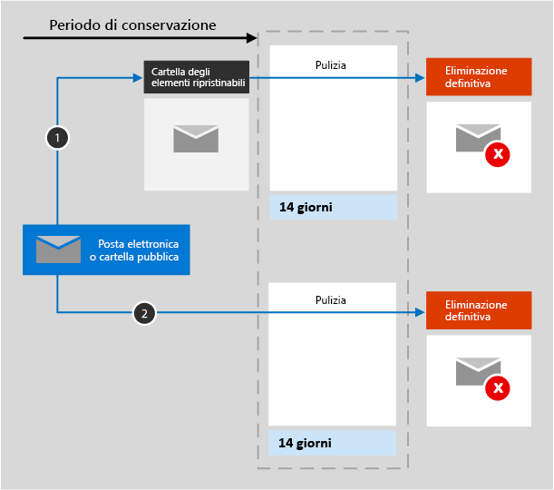
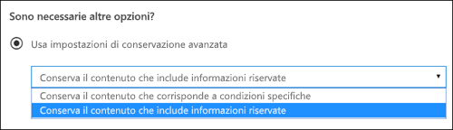

# Panoramica dei criteri di conservazioneOverview of retention policies

>*[Indicazioni per l'assegnazione di licenze di Microsoft 365 per sicurezza e conformità](https://aka.ms/ComplianceSD).**[Microsoft 365 licensing guidance for security & compliance](https://aka.ms/ComplianceSD).*

Per la maggior parte delle organizzazioni, il volume e la complessità dei dati aumentano giorno dopo giorno, a causa di posta elettronica, documenti, messaggi istantanei e altro ancora. La gestione o il controllo efficace di queste informazioni è importante perché è necessario:For most organizations, the volume and complexity of their data is increasing daily — email, documents, instant messages, and more. Effectively managing or governing this information is important because you need to:
  
- **Conformarsi in modo proattivo alle normative del settore e ai criteri interni** che richiedono di conservare il contenuto per un periodo di tempo minimo, ad esempio la norma Sarbanes-Oxley Act richiede che alcuni tipi di contenuto vengano conservati per sette anni.**Comply proactively with industry regulations and internal policies** that require you to retain content for a minimum period of time — for example, the Sarbanes-Oxley Act might require you to retain certain types of content for seven years. 
    
- **Ridurre i rischi in caso di controversie legali o di violazioni della sicurezza** eliminando definitivamente i contenuti obsoleti che non è più necessario mantenere.**Reduce your risk in the event of litigation or a security breach** by permanently deleting old content that you're no longer required to keep. 
    
- **Aiutare l'organizzazione a condividere le informazioni in modo efficace e a essere più flessibile** assicurando che gli utenti usino solo contenuti aggiornati e pertinenti.**Help your organization to share knowledge effectively and be more agile** by ensuring that your users work only with content that's current and relevant to them. 
    
Un criterio di conservazione consente di raggiungere tutti questi obiettivi. La gestione dei contenuti in genere richiede due azioni:A retention policy can help you achieve all of these goals. Managing content commonly requires two actions:
  
- **Conservare** il contenuto in modo che non possa essere eliminato definitivamente prima del termine del periodo di conservazione.**Retaining** content so that it can't be permanently deleted before the end of the retention period. 
    
- **Eliminare** il contenuto in modo permanente alla fine del periodo di conservazione.**Deleting** content permanently at the end of the retention period. 
    
Con i criteri di conservazione è possibile:With a retention policy, you can:
  
- Decidere proattivamente se conservare il contenuto, eliminarlo o entrambe le cose, ovvero conservarlo ed eliminarlo successivamente.Decide proactively whether to retain content, delete content, or both — retain and then delete the content.
    
- Applicare un singolo criterio all'intera organizzazione o a posizioni o utenti specifici.Apply a single policy to the entire organization or specific locations or users.
    
- Applicare i criteri a tutti i contenuti o al contenuto che soddisfa determinate condizioni, ad esempio che contiene parole chiave specifiche o [tipi specifici di informazioni riservate](what-the-sensitive-information-types-look-for.md).Apply a policy to all content or content meeting certain conditions, such as content containing specific keywords or [specific types of sensitive information](what-the-sensitive-information-types-look-for.md).
    
Quando si impostano criteri di conservazione per il contenuto, gli utenti possono continuare a modificare e usare il contenuto come sempre perché il contenuto viene mantenuto nella posizione originale. Se però qualcuno modifica o elimina il contenuto soggetto ai criteri, ne viene salvata una copia in una posizione sicura dove viene conservata finché restano in vigore i criteri.When content is subject to a retention policy, people can continue to edit and work with the content as if nothing's changed because the content is retained in place, in its original location. But if someone edits or deletes content that's subject to the policy, a copy is saved to a secure location where it's retained while the policy is in effect.
  
Infine, alcune organizzazioni hanno la necessità di conformarsi a normative come la regola 17a-4 della SEC (Securities and Exchange Commission), in base alla quale i criteri di conservazione attivati non possono essere disattivati o resi meno restrittivi. Per soddisfare questo requisito, è possibile usare la caratteristica protezione dell'archiviazione. Dopo aver bloccato i criteri, nessuno, incluso l'amministratore, può disattivarli o renderli meno restrittivi.Finally, some organizations have to comply with regulations such as Securities and Exchange Commission (SEC) Rule 17a-4, which requires that after a retention policy is turned on, it cannot be turned off or made less restrictive. To meet this requirement, you can use Preservation Lock. After a policy's been locked, no one (including an administrator) can turn off the policy or make it less restrictive.
  
I criteri di conservazione vengono creati e gestiti dal [Centro conformità Microsoft 365](https://compliance.microsoft.com/): **Criteri** > **Dati** > **Conservazione**You create and manage retention policies from the [Microsoft 365 compliance center](https://compliance.microsoft.com/): **Policies** > **Data** > **Retention**

In alternativa, è possibile passare alla stessa posizione nel Centro conformità Microsoft 365 usando la scheda **Soluzioni** > **Governance delle informazioni** > **Conservazione**.Alternatively, you can navigate to the same place in the Microsoft 365 compliance center by using **Solutions** > **Information governance** > **Retention** tab. 

**Se si vuole avere la possibilità di esaminare il contenuto prima che venga eliminato definitivamente,** provare a usare [etichette di conservazione](labels.md) anziché i criteri di conservazione.**If you want the ability to review content before it’s permanently deleted,** consider using [retention labels](labels.md) instead of a retention policy. Quando si crea un'etichetta di conservazione, è possibile configurare una [revisione per l'eliminazione](disposition.md#disposition-reviews) per rivedere il contenuto al termine del periodo di conservazione.When you create a retention label, you can set up a [disposition review](disposition.md#disposition-reviews) to review the content at the end of its retention period.

## Funzionamento dei criteri di conservazione con il contenuto presenteHow a retention policy works with content in place

Quando si include una posizione, ad esempio un sito o una cassetta postale, nei criteri di conservazione, il contenuto rimane nella posizione originale. Gli utenti possono continuare a lavorare normalmente con i propri documenti o messaggi di posta elettronica. Tuttavia, se modificano o eliminano il contenuto incluso nei criteri, viene conservata una copia del contenuto al momento dell'applicazione dei criteri.When you include a location such as a site or mailbox in a retention policy, the content remains in its original location. People can continue to work with their documents or mail as if nothing's changed. But if they edit or delete content that's included in the policy, a copy of the content as it existed when you applied the policy is retained.
  
Per le raccolte siti di SharePoint una copia del contenuto originale viene conservata nella raccolta di archiviazione quando gli utenti modificano o eliminano il contenuto. Per la posta elettronica e le cartelle pubbliche la copia viene conservata nella cartella Elementi ripristinabili. Queste posizioni sicure e il contenuto conservato non sono visibili alla maggior parte degli utenti. Con i criteri di conservazione non è neanche necessario che gli utenti sappiano che il contenuto è soggetto a criteri.For SharePoint site collections, a copy of the original content is retained in the Preservation Hold library when users edit or delete it. For email and public folders, the copy is retained in the Recoverable Items folder. These secure locations and the retained content are not visible to most people. With a retention policy, people do not even need to know that their content is subject to the policy.
  
Note:Notes:
  
- Il contenuto di Teams (chat) è archiviato in Exchange, dove i criteri sono applicati in base al tipo di messaggio (posta elettronica o conversazione).Teams (chat) content is stored in Exchange, where the policy is applied based on message type (email or conversation).
    
- I criteri di conservazione applicati a un gruppo di Office 365 includono sia la cassetta postale del gruppo che il sito.A retention policy applied to an Office 365 group includes both the group mailbox and site.

- La raccolta di archiviazione utilizza la quota di spazio di archiviazione del sito.The Preservation Hold library consumes storage quota for the site.
    
### Contenuto negli account di OneDrive e nei siti di SharePointContent in OneDrive accounts and SharePoint sites

I criteri di conservazione vengono applicati a livello di raccolta siti.A retention policy is applied at the level of a site collection. Quando si include una raccolta siti di SharePoint o un account OneDrive nei criteri di conservazione viene usata una raccolta di archiviazione per conservare i documenti.When you include a SharePoint site collection or OneDrive account in a retention policy, a Preservation Hold library is used to retain documents. Se non esiste già, la raccolta viene creata automaticamente.This library is automatically created if it doesn't already exist. È possibile visualizzare questa raccolta nella pagina **Contenuto del sito** nel sito principale della raccolta siti.You can view this library on the **Site contents** page in the top-level site of the site collection. La maggior parte degli utenti non può visualizzare la raccolta di archiviazione poiché è visibile soltanto agli amministratori della raccolta siti.Most users can't view the Preservation Hold library because it's visible only to site collection administrators.
  
Se un utente tenta di modificare o eliminare i contenuti di un sito soggetto a Conserva ed elimina o a Conserva solo, i criteri controllano innanzitutto se il contenuto è stato modificato dal momento della sua applicazione.If a person attempts to change or delete content in a site that's subject to retain and delete, or retain-only, first the policy checks whether the content's been changed since the policy was applied. Nel caso della prima modifica dall'applicazione dei criteri di conservazione, questi creano una copia dei contenuti nella raccolta di archiviazione, quindi permettono all'utente di modificare o eliminare i contenuti originali.If this is the first change since the policy was applied, the retention policy copies the content to the Preservation Hold library, and then allows the person to change or delete the original content. I contenuti presenti nella raccolta siti possono essere copiati nella raccolta di archiviazione anche se tali contenuti non corrispondono al filtro della query utilizzato dai criteri di conservazione.Any content in the site collection can be copied to the Preservation Hold library, even if the content does not match the query used by the retention policy.

Copiare i contenuti nella raccolta di archiviazione è possibile per i contenuti che esistono al momento dell'applicazione dei criteri di conservazione.Copying content to the Preservation Hold library applies to content that exists when the retention policy is applied. Inoltre, i nuovi contenuti creati o aggiunti alla raccolta siti in seguito all'inclusione nei criteri conservazione, verranno conservati dopo l'eliminazione.In addition, any new content that's created or added to the site collection after it was included in the policy will be retained after deletion. Tuttavia, i nuovi contenuti non vengono copiati nella raccolta di archiviazione al momento della prima modifica, ma solo quando viene eliminato.However, new content isn't copied to the Preservation Hold library the first time it's edited, only when it's deleted. Per conservare tutte le versioni di un file, attivare il controllo delle versioni, come illustrato in una [sezione](#how-a-retention-policy-works-with-document-versions-in-a-site-collection) di seguito.To retain all versions of a file, turn on versioning, as explained in a following [section](#how-a-retention-policy-works-with-document-versions-in-a-site-collection).
  
Si osservi che, se si prova a eliminare una raccolta, un elenco, una cartella o un sito soggetti a criteri di conservazione, viene visualizzato un messaggio di errore.Note that a user receives an error if they try to delete a library, list, folder, or site that's subject to a retention policy. Un utente può eliminare una cartella se prima di tutto sposta o elimina gli eventuali file nella cartella soggetta ai criteri.A user can delete a folder if they first move or delete any files in the folder that are subject to the policy. Inoltre, la raccolta di archiviazione viene creata solo quando il primo elemento deve essere copiato nella raccolta e non quando si creano criteri di conservazione.Also, the Preservation Hold library is created only when the first item needs to be copied to the library and not when you create the retention policy. Quindi, per verificare i criteri, è necessario prima di tutto modificare o eliminare un documento in un sito soggetto ai criteri, quindi passare alla raccolta di archiviazione per visualizzare la copia conservata.Therefore, to test your policy, you first need to edit or delete a document in a site that is subject to the policy, and then browse to the Preservation Hold library to view the retained copy.
  
Dopo che i criteri di conservazione vengono assegnati a un account di OneDrive o a un sito di SharePoint, i percorsi del contenuto variano in base al fatto che il criterio di conservazione sia Conserva ed elimina, Conserva solo o Elimina solo.After a retention policy is assigned to a OneDrive account or SharePoint site, the paths the content takes depend on whether the retention policy is to retain and delete, to retain only, or delete only.

Se il criterio di conservazione è Conserva ed elimina:When the retention policy is to retain and delete:

  
1. **Se il contenuto viene modificato o eliminato** durante il periodo di conservazione: una copia del contenuto originale al momento dell'assegnazione dei criteri di conservazione viene creata nella raccolta di archiviazione.**If the content is modified or deleted** during the retention period: A copy of the original content as it existed when the retention policy was assigned is created in the Preservation Hold library. Nella raccolta, un processo timer viene eseguito periodicamente e identifica gli elementi il cui periodo di conservazione è scaduto.There, a timer job runs periodically and identifies items whose retention period has expired. Questi elementi vengono spostati nel cestino di secondo livello, dove vengono eliminati definitivamente dopo 93 giorni.Those items are then moved to the second-stage Recycle Bin, where they're permanently deleted at the end of 93 days. Il Cestino di secondo livello non è visibile agli utenti finali come il Cestino di primo livello, tuttavia gli amministratori della raccolta siti possono visualizzare e ripristinare il contenuto da tale posizione.The second-stage Recycle Bin is not visible to end users (only the first-stage Recycle Bin is), but site collection admins can view and restore content from there.

    > [!NOTE]
    > Per evitare perdite accidentali di dati, il contenuto non viene mai eliminato automaticamente dalla raccolta di archiviazione, ma passa al cestino di secondo livello.To help prevent inadvertent data loss, content is never automatically deleted from the Preservation Hold library but moves to the second-stage Recycle Bin. Il periodo di tolleranza di 93 giorni consente agli amministratori di recuperare il contenuto, se necessario.There, the grace period of 93 days lets admins recover this content, if necessary.
    
2. **Se il contenuto non viene modificato o eliminato** durante il periodo di conservazione: alla fine del periodo di conservazione il documento viene spostato nel Cestino di primo livello.**If the content is not modified or deleted** during the retention period: At the end of the retention period, the document is moved to the first-stage Recycle Bin. Se un utente elimina il documento da questa posizione o svuota questo Cestino, il documento viene spostato nel Cestino di secondo livello.If a user deletes the document from there or empties this Recycle Bin (also known as purging), the document is moved to the second-stage Recycle Bin. Il periodo di conservazione per i Cestini di primo e secondo livello è di 93 giorni, dopo i quali il documento viene eliminato definitivamente dal Cestino, sia di primo che di secondo livello.A 93-day retention period spans both the first-stage and second-stage recycle bins. At the end of 93 days, the document is permanently deleted from wherever it resides, in either the first-stage or second-stage Recycle Bin. Il Cestino non è indicizzato e quindi non è disponibile per la ricerca.The Recycle Bin is not indexed and therefore unavailable for searching. Di conseguenza, una ricerca eDiscovery non può trovare alcun contenuto nel Cestino a cui applicare un blocco.As a result, an eDiscovery search can't find any Recycle Bin content on which to place a hold. 

Quando il criterio di conservazione è Conserva solo, o Elimina solo, i percorsi del contenuto sono varianti di Conserva ed elimina:When the retention policy is retain-only, or delete-only, the contents paths are variations of retain and delete:

#### Percorsi di contenuto per il criterio di conservazione Conserva soloContent paths for retain-only retention policy

1. **Se il contenuto viene modificato o eliminato** durante il periodo di conservazione: una copia del documento originale viene creata nella raccolta di archiviazione e conservata fino al termine del periodo di conservazione, quindi la copia nella raccolta di archiviazione viene spostata nel cestino di secondo livello e viene eliminata definitivamente dopo 93 giorni.**If the content is modified or deleted** during the retention period: A copy of the original document is created in the Preservation Hold library and retained until the end of the retention period, when the copy in the Preservation Hold library is moved to the second-stage Recycle Bin and is permanently deleted after 93 days.

2. **Se il contenuto non viene modificato o eliminato** durante il periodo di conservazione: non succede niente prima o dopo il periodo di conservazione. Il documento rimane nella posizione originale.**If the content is not modified or deleted** during the retention period: Nothing happens before and after the retention period; the document remains in its original location.

#### Percorsi di contenuto per il criterio di conservazione Elimina soloContent paths for delete-only retention policy

1. **Se il contenuto viene eliminato** durante il periodo di conservazione: il documento viene spostato nel cestino di primo livello.**If the content is deleted** during the retention period: The document is moved to first-stage Recycle Bin. Se un utente elimina il documento da questa posizione o svuota questo Cestino, il documento viene spostato nel Cestino di secondo livello.If a user deletes the document from there or empties this Recycle Bin, the document is moved to the second-stage Recycle Bin. Il periodo di conservazione per i Cestini di primo e secondo livello è di 93 giorni, dopo i quali il documento viene eliminato definitivamente dal Cestino, sia di primo che di secondo livello.A 93-day retention period spans both the first-stage and second-stage recycle bins. At the end of 93 days, the document is permanently deleted from wherever it resides, in either the first-stage or second-stage Recycle Bin. Se il contenuto viene modificato durante il periodo di conservazione, esegue lo stesso percorso di eliminazione dopo la scadenza del contenuto.If the content is modified during the retention period, it follows the same deletion path after the content expires.

2. **Se il contenuto non viene eliminato** durante il periodo di conservazione: alla fine del periodo di conservazione il documento viene spostato nel Cestino di primo livello.**If the content is not deleted** during the retention period: At the end of the retention period, the document is moved to the first-stage Recycle Bin. Se il contenuto viene eliminato durante il periodo di conservazione, il documento viene spostato immediatamente nel cestino di primo livello.If the content is deleted during the retention period, the document is immediately moved to first-stage Recycle Bin. Se un utente elimina il documento da questa posizione o svuota questo Cestino, il documento viene spostato nel Cestino di secondo livello.If a user deletes the document from there or empties this Recycle Bin (also known as purging), the document is moved to the second-stage Recycle Bin. Il periodo di conservazione per i Cestini di primo e secondo livello è di 93 giorni, dopo i quali il documento viene eliminato definitivamente dal Cestino, sia di primo che di secondo livello.A 93-day retention period spans both the first-stage and second-stage recycle bins. At the end of 93 days, the document is permanently deleted from wherever it resides, in either the first-stage or second-stage Recycle Bin. Il Cestino non è indicizzato e quindi non è disponibile per la ricerca.The Recycle Bin is not indexed and therefore unavailable for searching. Di conseguenza, una ricerca eDiscovery non può trovare alcun contenuto nel Cestino a cui applicare un blocco.As a result, an eDiscovery search can't find any Recycle Bin content on which to place a hold.

### Contenuto in cassette postali e cartelle pubblicheContent in mailboxes and public folders

Per la posta elettronica, il calendario e altri elementi di un utente, i criteri di conservazione vengono applicati a livello di cassetta postale. Per una cartella pubblica, i criteri di conservazione vengono applicati a livello di cartella e non di cassetta postale. Per conservare gli elementi sia di una cassetta postale che di una cartella pubblica viene utilizzata la cartella Elementi ripristinabili. Solo gli utenti a cui sono state assegnate autorizzazioni di eDiscovery possono visualizzare gli elementi nella cartella Elementi ripristinabili di un altro utente.For a user's mail, calendar, and other items, a retention policy is applied at the level of a mailbox. For a public folder, a retention policy is applied at the folder level, not the mailbox level. Both a mailbox and a public folder use the Recoverable Items folder to retain items. Only people whom have been assigned eDiscovery permissions can view items in another user's Recoverable Items folder.
  
Per impostazione predefinita, quando un utente elimina un messaggio in una cartella diversa dalla cartella Posta eliminata, il messaggio viene spostato nella cartella Posta eliminata. Quando un utente elimina un elemento dalla cartella Posta eliminata, il messaggio viene spostato nella cartella Elementi ripristinabili. Un utente può anche eliminare temporaneamente un elemento (MAIUSC+CANC) in qualsiasi cartella. Con questa operazione la cartella Posta eliminata viene ignorata e l'elemento viene inserito direttamente nella cartella Elementi ripristinabili.By default, when a person deletes a message in a folder other than the Deleted Items folder, the message is moved to the Deleted Items folder. When a person deletes an item in the Deleted Items folder, the message is moved to the Recoverable Items folder. In addition, a person can soft delete an item (SHIFT+DELETE) in any folder, which bypasses the Deleted Items folder and moves the item directly to the Recoverable Items folder.
  
Un processo verifica periodicamente gli elementi nella cartella Elementi ripristinabili. Se un elemento non corrisponde alle regole specificate in almeno un criterio di conservazione, viene eliminato definitivamente dalla cartella Elementi ripristinabili.A process periodically evaluates items in the Recoverable Items folder. If an item doesn't match the rules of at least one retention policy, the item is permanently deleted (also called hard deleted) from the Recoverable Items folder.
  
Quando un utente prova a modificare determinate proprietà di un elemento di cassette postali (ad esempio, l'oggetto, il corpo, gli allegati, i mittenti o i destinatari, la data di invio o di ricezione di un messaggio), una copia dell'elemento originale viene salvata nella cartella Elementi ripristinabili prima che la modifica diventi effettiva.When a person attempts to change certain properties of a mailbox item — such as the subject, body, attachments, senders and recipients, or date sent or received for a message — a copy of the original item is saved to the Recoverable Items folder before the change is committed. Questo si verifica per ogni modifica successiva.This action happens for each subsequent change. Alla fine del periodo di conservazione, le copie nella cartella Elementi ripristinabili vengono eliminate definitivamente.At the end of the retention period, copies in the Recoverable Items folder are permanently deleted.
  
Se il criterio di conservazione è Conserva ed elimina:When the retention policy is to retain and delete:

1. **Se l'elemento viene modificato o eliminato** definitivamente dall'utente (con MAIUSC+CANC o eliminandolo da Posta eliminata) durante il periodo di conservazione, viene spostato (o copiato, in caso di modifica) nella cartella Elementi ripristinabili. In questa raccolta a intervalli regolari viene eseguito un processo che identifica i messaggi il cui periodo di conservazione è scaduto. Questi elementi vengono eliminati definitivamente entro 14 giorni dalla data di fine del periodo di conservazione. 14 giorni è l'impostazione predefinita, ma può essere configurato un valore fino a 30 giorni.**If the item is modified or permanently deleted** by the user (either SHIFT+DELETE or deleted from Deleted Items) during the retention period, the item is moved (or copied, in the case of edit) to the Recoverable Items folder. There, a process runs periodically and identifies items whose retention period has expired, and these items are permanently deleted within 14 days of the end of the retention period. Note that 14 days is the default setting, but it can be configured up to 30 days.
    
2. **Se l'elemento non viene modificato o eliminato** durante il periodo di conservazione, lo stesso processo viene eseguito periodicamente in tutte le cartelle della cassetta postale e identifica i messaggi il cui periodo di conservazione è scaduto. Questi elementi vengono eliminati definitivamente entro 14 giorni dalla data di fine del periodo di conservazione.**If the item is not modified or deleted** during the retention period, the same process runs periodically on all folders in the mailbox and identifies items whose retention period has expired, and these items are permanently deleted within 14 days of the end of the retention period. 14 giorni è l'impostazione predefinita, ma può essere configurato un valore fino a 30 giorni.Note that 14 days is the default setting, but it can be configured up to 30 days. Quando il criterio di conservazione è Conserva solo, o Elimina solo, i percorsi del contenuto sono varianti di Conserva ed elimina:When the retention policy is retain-only, or delete-only, the contents paths are variations of retain and delete:

#### Percorsi di contenuto per il criterio di conservazione Conserva soloContent paths for retain-only retention policy

1. **Se l'elemento viene modificato o eliminato** durante il periodo di conservazione: una copia dell'elemento originale viene creata nella cartella Elementi ripristinabili e conservata fino al termine del periodo di conservazione, quindi la copia nella cartella Elementi ripristinabili viene eliminata definitivamente entro 14 giorni dalla scadenza dell'elemento.**If the item is modified or deleted** during the retention period: A copy of the original item is created in the Recoverable Items folder and retained until the end of the retention period, when the copy in the Recoverable Items folder is permanently deleted within 14 days after the item expires. 

2. **Se l’elemento non viene modificato o eliminato** durante il periodo di conservazione: non succede niente prima o dopo il periodo di conservazione. L’elemento rimane nella posizione originale.**If the item is not modified or deleted** during the retention period: Nothing happens before and after the retention period; the item remains in its original location.

#### Percorsi di contenuto per il criterio di conservazione Elimina soloContent paths for delete-only retention policy

1. **Se l’elemento non viene eliminato** durante il periodo di conservazione: alla fine del periodo di conservazione l’elemento viene spostato nella cartella Elementi ripristinabili.**If the item is not deleted** during the retention period: At the end of the retention period, the item is moved to the Recoverable items folder. 

2. **Se l'elemento viene eliminato** durante il periodo, l'elemento verrà immediatamente spostato nella cartella Elementi ripristinabili.**If the item is deleted** during the period, the item is immediately moved to the Recoverable items folder. Se un utente elimina l'elemento da questa posizione o svuota la cartella Elementi ripristinabili, l'elemento viene eliminato definitivamente.If a user deletes the item from there or empties the Recoverable items folder, the item is permanently deleted. In caso contrario, l'elemento viene eliminato definitivamente dopo un periodo di 14 giorni nella cartella Elementi ripristinabili.Otherwise, the item is permanently deleted after being in the Recoverable items folder for 14 days. 

### Quando un utente abbandona l'organizzazioneWhen a user leaves the organization

**Exchange****Exchange** 

Se un utente abbandona l'organizzazione e la relativa cassetta postale è inclusa nei criteri di conservazione, quest'ultima diventerà inattiva quando viene eliminato l'account di Office 365 dell'utente.If a user leaves your organization and the user's mailbox is included in a retention policy, the mailbox becomes an inactive mailbox when the user's Office 365 account is deleted. I contenuti di una cassetta postale inattiva sono comunque soggetti ai criteri di conservazione applicati alla cassetta postale prima della disattivazione e sono disponibili per la ricerca eDiscovery.The contents of an inactive mailbox are still subject to any retention policy that was placed on the mailbox before it was made inactive, and the contents are available to an eDiscovery search. Per altre informazioni, vedere [Cassette postali inattive in Exchange Online](inactive-mailboxes-in-office-365.md).For more information, see [Inactive mailboxes in Exchange Online](inactive-mailboxes-in-office-365.md).

**OneDrive****OneDrive**

Se un utente abbandona l'organizzazione, i file soggetti a un criterio di conservazione o contenenti etichette di conservazione verranno mantenuti per l'intera durata dell'etichetta o del criterio.If a user leaves your organization, any files subject to a retention policy or containing retention labels will remain for the duration of the policy or label. Durante questo periodo di tempo, tutti gli accessi di condivisione continueranno a funzionare.During that time period, all sharing access continues to work. Quando il periodo di conservazione scade, il contenuto viene spostato nel Cestino della raccolta siti e solo gli amministratori possono accedervi. Se un documento viene contrassegnato come record da un criterio di conservazione, viene mantenuto fino allo scadere del periodo di conservazione, al termine del quale il contenuto verrà eliminato definitivamente.When the retention period expires, content moves into the Site Collection Recycle Bin and is not accessible to anyone except the admin. If a document is marked by a retention policy as a record, it will not be deleted until the retention period is over, after which time the content is permanently deleted.

**SharePoint****SharePoint**

Se un utente abbandona l'organizzazione, tutti i contenuti creati da quest'ultimo non subiranno alcuna modifica in quanto SharePoint è considerato un ambiente di collaborazione, al contrario di una cassetta postale o di un account OneDrive dell'utente.When a user leaves your organization, any content created by that user is not affected because SharePoint is considered a collaborative environment, unlike a user's mailbox or OneDrive account.

## Funzionamento dei criteri di conservazione con le versioni del documento in una raccolta sitiHow a retention policy works with document versions in a site collection

Il controllo delle versioni è una caratteristica di tutte le raccolte documenti di SharePoint Online e OneDrive for Business.Versioning is a feature of all document libraries in SharePoint Online and OneDrive for Business. Per impostazione predefinita, il controllo delle versioni conserva almeno 500 versioni principali, limite che è possibile aumentare.By default, versioning retains a minimum of 500 major versions, though you can increase this limit. Per altre informazioni, vedere [Abilitare e configurare il controllo delle versioni per un elenco o una raccolta](https://support.office.com/article/1555d642-23ee-446a-990a-bcab618c7a37).For more information, see [Enable and configure versioning for a list or library](https://support.office.com/article/1555d642-23ee-446a-990a-bcab618c7a37).
  
Un criterio di conservazione, ovvero un criterio che prevede la conservazione del contenuto anziché la sola eliminazione, mantiene tutte le versioni di un documento in una raccolta siti di SharePoint o in un account OneDrive.A retain policy (retention policy that retains content instead of delete-only) retains all versions of a document in a SharePoint site collection or OneDrive account. Quando si modifica un documento oggetto di un criterio di blocco o di conservazione, viene copiata una versione dell'originale nella Raccolta blocchi per conservazione.When a document subject to a hold or retain policy is edited for the first time, a version of the original document is copied to the Preservation Hold library. Quando si elimina un documento oggetto di un criterio di blocco o di conservazione, vengono copiate tutte le versioni nella Raccolta blocchi per conservazione, se è attivato il controllo delle versioni.When a document subject to a hold or retain policy is deleted, all versions are copied to the Preservation Hold library if versioning is enabled. Ogni versione di un documento nella Raccolta blocchi per conservazione è un elemento separato con un periodo di conservazione specifico:Each version of a document in the Preservation Hold library exists as a separate item with its own retention period:
  
- Se i criteri di conservazione si basano sulla data di creazione del contenuto, ciascuna versione ha la stessa data di scadenza del documento originale. Il documento originale e le sue versioni scadono tutti allo stesso tempo.If the retention policy is based on when the content was created, each version has the same expiration date as the original document. The original document and its versions all expire at the same time.
    
- Se i criteri di conservazione si basano sulla data dell'ultima modifica del contenuto, ciascuna versione ha la propria data di scadenza in base a quando il documento originale è stato modificato per creare quella versione. I documenti originali e le relative versioni scadono indipendentemente l'uno dall'altro.If the retention policy is based on when the content was last modified, each version has its own expiration date based on when the original document was modified to create that version. The original documents and its versions expire independently of each other.

> [!NOTE]
> Le versioni conservate dei documenti di SharePoint e OneDrive non sono disponibili per la ricerca da parte degli strumenti di eDiscovery.The preserved versions of SharePoint and OneDrive documents are not searchable by eDiscovery tools.

## Conservazione del contenuto per un periodo di tempo specificoRetaining content for a specific period of time

Grazie ai criteri di conservazione è possibile conservare il contenuto per un periodo di tempo indefinito o per un numero specifico di giorni, mesi o anni.With a retention policy, you can retain content indefinitely or for a specific number of days, months, or years. Il calcolo relativo al periodo di conservazione del contenuto è basato sulla data di modifica del contenuto e non sulla data di applicazione dei criteri di conservazione.The duration for how long content is retained is calculated from the age of the content, not from when the retention policy is applied. È possibile scegliere se calcolare questo periodo a partire dalla creazione del contenuto o, per OneDrive e SharePoint, dalla data dell'ultima modifica.You can choose whether the age is based on when the content was created or (for OneDrive and SharePoint) when it was last modified.
  
Se, ad esempio, si vuole conservare il contenuto di una raccolta siti per sette anni dall'ultima modifica e un documento presente in questa raccolta siti non è stato modificato per sei anni, il documento verrà conservato solo per un altro anno, se non viene modificato. Se il documento viene nuovamente modificato, il periodo di conservazione verrà ricalcolato in base alla nuova data di modifica e il documento verrà conservato per altri sette anni.For example, if you want to retain content in a site collection for seven years since it was last modified, and a document in that site collection hasn't been modified in six years, the document will be retained for only another year if it's not modified. If the document is edited again, the age of the document is calculated from the new last modified date, and it will be retained for another seven years.
  
Analogamente, se si desidera conservare il contenuto di una cassetta postale per sette anni e un messaggio è stato inviato sei anni fa, il messaggio verrà conservato solo per un altro anno. Per il contenuto di Exchange, il periodo si basa sempre sulla data di ricezione o di invio, che corrispondono. La conservazione del contenuto in base all'ultima modifica si applica solo al contenuto del sito di OneDrive e SharePoint.Similarly, if you want to retain content in a mailbox for seven years, and a message was sent six years ago, the message will be retained for only one year. For Exchange content, the age is always based on the date received or sent (they are the same). Retaining content based on when it was last modified applies only to site content in OneDrive and SharePoint.
  
È possibile scegliere se eliminare definitivamente il contenuto alla fine del periodo di conservazione.You can choose whether you want the content to be permanently deleted at the end of the retention period. I criteri di conservazione possono anche eliminare il contenuto obsoleto senza conservarlo.A retention policy can also delete old content without retaining it. Vedere la sezione successiva.See the next section.
  

  
## Eliminazione di contenuto antecedente a una data specificaDeleting content that's older than a specific age

I criteri di conservazione possono conservare e quindi eliminare il contenuto successivamente o eliminare il contenuto obsoleto senza conservarlo.A retention policy can both retain and then delete content, or delete old content without retaining it.
  
Se i criteri di conservazione eliminano il contenuto, è importante tenere presente che il periodo di tempo specificato per i criteri di conservazione viene calcolato dal momento in cui il contenuto è stato creato o modificato, non dal momento dell'assegnazione dei criteri.If your retention policy deletes content, it's important to understand that the time period specified for a retention policy is calculated from the time when the content was created or modified, not the time since the policy was assigned.
  

  
Ad esempio, si supponga di creare criteri di conservazione che eliminano il contenuto dopo tre anni e quindi di assegnarli a tutti gli account di OneDrive, che includono grandi quantità di contenuti creati quattro o cinque anni fa. In questo caso, molti contenuti verranno eliminati subito dopo la prima assegnazione dei criteri di conservazione. Per questo motivo, **i criteri di conservazione che eliminano il contenuto possono avere un impatto notevole**.For example, suppose that you create a retention policy that deletes content after three years, and then assign that policy to all OneDrive accounts, which contain a lot of content that was created four or five years ago. In this case, a lot of content will be deleted soon after assigning the retention policy for the first time. For this reason, **a retention policy that deletes content can have a considerable impact on your content**. 
  
Prima di assegnare criteri di conservazione a una raccolta siti per la prima volta, è quindi consigliabile considerare il tempo trascorso dalla creazione del contenuto esistente e l'impatto dei criteri sul contenuto. È anche opportuno comunicare l'introduzione dei nuovi criteri agli utenti prima di assegnarli, in modo che possano valutarne l'impatto. Questo avviso viene visualizzato quando si esaminano le impostazioni per i criteri di conservazione prima di crearli.Therefore, before you assign a retention policy to a site collection for the first time, you should first consider the age of the existing content and how the policy may impact that content. You may also want to communicate the new policy to your users before assigning it, to give them time to assess the possible impact. Note this warning that appears when you review the settings for your retention policy just before creating it.
  

  
## Impostazioni avanzate che applicano i criteri solo a contenuti che soddisfano determinate condizioniAdvanced settings that apply a policy only to content that meets certain conditions

I criteri di conservazione possono essere applicati a tutto il contenuto nelle posizioni incluse oppure solo al contenuto che contiene parole chiave specifiche o [tipi specifici di informazioni riservate](what-the-sensitive-information-types-look-for.md).A retention policy can apply to all content in the locations that it includes, or you can choose to apply a retention policy only to content that contains specific keywords or [specific types of sensitive information](what-the-sensitive-information-types-look-for.md).
  

  
### Conservare il contenuto che include parole chiave specificheRetain content that contains specific keywords

È possibile applicare i criteri di conservazione solo al contenuto che soddisfa determinate condizioni e quindi eseguire azioni di conservazione solo su tale contenuto. Le condizioni disponibili ora supportano l'applicazione di criteri di conservazione al contenuto che include parole o frasi specifiche. È possibile perfezionare la query usando operatori di ricerca come AND, OR e NOT. Per ulteriori informazioni sugli operatori, vedere [Query con parole chiave e condizioni di ricerca per la ricerca di contenuto](keyword-queries-and-search-conditions.md).You can apply a retention policy only to content that satisfies certain conditions, and then take retention actions on just that content. The conditions available now support applying a retention policy to content that contains specific words or phrases. You can refine your query by using search operators like AND, OR, and NOT. For more information on these operators, see [Keyword queries and search conditions for Content Search](keyword-queries-and-search-conditions.md).
  
Il supporto delle proprietà disponibili per le ricerche (ad esempio, **subject:**) sarà disponibile a breve.Support for adding searchable properties (for example, **subject:**) is coming soon.
  
I criteri di conservazione basati su query usano l'indice di ricerca per identificare il contenuto.Query-based retention uses the search index to identify content.
  

  
### Conservare il contenuto che include informazioni riservateRetain content that contains sensitive information

È possibile applicare i criteri di conservazione anche solo al contenuto che contiene [tipi specifici di informazioni riservate](what-the-sensitive-information-types-look-for.md). Ad esempio, è possibile scegliere di applicare requisiti di conservazione univoci solo al contenuto che contiene informazioni personali come codici identificativi dei singoli contribuenti, codici di previdenza sociale o numeri di passaporto.You can also apply a retention policy only to content that contains [specific types of sensitive information](what-the-sensitive-information-types-look-for.md). For example, you can choose to apply unique retention requirements only to content that contains personally identifiable information (PII) such as taxpayer identification numbers, social security numbers, or passport numbers.
  

  
Note:Notes:
  
- I criteri di conservazione avanzati per le informazioni riservate non si applicano alle cartelle pubbliche di Exchange o a Skype for Business perché queste posizioni non supportano i tipi di informazioni riservate.Advanced retention for sensitive information doesn't apply to Exchange public folders or Skype for Business because those locations don't support sensitive information types.
    
- Exchange Online, infatti, usa le regole di flusso di posta (note anche come regole di trasporto) per identificare le informazioni riservate e quindi funziona solo per i messaggi in transito, non per tutti gli elementi già archiviati in una cassetta postale. Per Exchange Online, questo significa che i criteri di conservazione possono identificare le informazioni riservate e possono eseguire azioni di conservazione solo nei messaggi ricevuti **dopo** l'applicazione dei criteri alla cassetta postale. I criteri di conservazione basati su query descritti nella sezione precedente non hanno questa limitazione perché usano l'indice di ricerca per identificare il contenuto.You should understand that Exchange Online uses mail flow rules (also known as transport rules) to identify sensitive information, so this works only on messages in transit — not on all items already stored in a mailbox. For Exchange Online, this means that a retention policy can identify sensitive information and take retention actions only on messages that are received **after** the policy is applied to the mailbox. (Note that query-based retention described in the previous section doesn't have this limitation because it uses the search index to identify content.) 
    
## Applicazione di criteri di conservazione a un'intera organizzazione o a posizioni specificheApplying a retention policy to an entire organization or specific locations

È possibile applicare facilmente i criteri di conservazione a un'intera organizzazione, a intere posizioni oppure a posizioni o utenti specifici.You can easily apply a retention policy to an entire organization, entire locations, or only to specific locations or users.
  
### Criteri a livello di organizzazioneOrg-wide policy

Una delle caratteristiche più efficaci dei criteri di conservazione riguarda la possibilità di applicare i criteri alle posizioni in Office 365, tra cui:One of the most powerful features of a retention policy is that it can apply to locations across Office 365, including:
  
- Posta elettronica di ExchangeExchange email
    
- Raccolte siti di SharePointSharePoint site collections
    
- Account di OneDriveOneDrive accounts
    
- Gruppi di Office 365 (si applica al contenuto della cassetta postale del gruppo e del sito di SharePoint associato).Office 365 groups (applies to content in the group's mailbox and associated SharePoint site.)
    
- Cartelle pubbliche di ExchangeExchange public folders
    

Altre caratteristiche importanti di un criterio di conservazione a livello di organizzazione includono:Other important features of an org-wide retention policy include:
  
- Non sono previsti limiti al numero di cassette postali o di siti inclusi nel criterio.There is no limit to the number of mailboxes or sites the policy can include.
    
- Per Exchange, le nuove cassette postali create dopo l'applicazione del criterio ereditano automaticamente il criterio.For Exchange, any new mailbox created after the policy is applied will automatically inherit the policy.
  
### Criteri validi per intere posizioniA policy that applies to entire locations

Quando si scelgono le posizioni, è possibile includere o escludere facilmente un'intera posizione, ad esempio la posta elettronica di Exchange o gli account di OneDrive.When you choose locations, you can easily include or exclude an entire location, such as Exchange email or OneDrive accounts. A questo scopo, attivare o disattivare lo **Stato** di tale posizione.To do so, toggle the **Status** of that location on or off. 
  
Come per i criteri a livello di organizzazione, un criterio applicabile a una qualsiasi combinazione di posizioni complete può includere un numero illimitato di cassette postali o siti. Ad esempio, se un criterio include tutta la posta elettronica di Exchange e tutti i siti di SharePoint, verranno inclusi tutti i siti e tutte le cassette postali, indipendentemente dal numero. Inoltre, per Exchange, le nuove cassette postali create dopo l'applicazione del criterio ereditano automaticamente il criterio.Like an org-wide policy, if a policy applies to any combination of entire locations, there is no limit to the number of mailboxes or sites the policy can include. For example, if a policy includes all Exchange email and all SharePoint sites, all sites and mailboxes will be included, no matter how many. And for Exchange, any new mailbox created after the policy is applied will automatically inherit the policy.

### Criteri con specifiche inclusioni o esclusioniA policy with specific inclusions or exclusions

È anche possibile applicare i criteri di conservazione a specifici utenti, gruppi di Office 365 o siti. A questo scopo, attivare lo **Stato** di tale posizione e quindi usare i collegamenti per includere o escludere determinati utenti, gruppi di Office 365 o siti.You can also apply a retention policy to specific users, Office 365 groups, or sites. To do so, toggle the **Status** of that location on, and then use the links to include or exclude specific users, Office 365 groups, or sites. 
  
Si noti però che sono previsti i limiti seguenti quando si configura un criterio di conservazione che include o esclude più di 1.000 posizioni specifiche:However, note that the following limits exist when you configure a retention policy that includes or excludes over 1,000 specific locations:
  
- Valori massimi per i criteri di conservazione:Maximum numbers for the retention policy:
    - 1.000 cassette postali1,000 mailboxes
    - 1.000 gruppi di Office 3651,000 Office 365 groups
    - 1.000 utenti per le chat private di Teams1,000 users for Teams private chats
    - 100 siti (OneDrive o SharePoint)100 sites (OneDrive or SharePoint)

- Un tenant non può contenere più di 10.000 criteri di conservazione.A tenant can contain no more than 10,000 retention policies.
    
Sebbene esistano questi limiti, è possibile evitarli applicando criteri a livello di organizzazione o criteri validi per intere posizioni.Although these limits exist, you can avoid them by applying either an org-wide policy or a policy that applies to entire locations.
  
### Posizioni SkypeSkype locations

A differenza della posta elettronica di Exchange, non è possibile attivare lo stato della posizione Skype per includere tutti gli utenti ma quando si attiva la posizione, sarà possibile scegliere manualmente gli utenti di cui si desidera conservare le conversazioni:Unlike Exchange email, you can't toggle the status of the Skype location on to include all users, but when you turn on that location, you then manually choose the users whose conversations you want to retain:

  
Quando si seleziona \*\*Scegli utenti \*\*, è possibile includere rapidamente tutti gli utenti selezionando la casella \*\*Nome \*\* nell'intestazione di colonna.When you select **Choose users**, you can quickly include all users by selecting the **Name** box in the column header. È necessario considerare, però, che ciascun utente viene conteggiato come specifica inclusione nei criteri.However, it's important to understand that each user counts as a specific inclusion in the policy. Di conseguenza, se si includono più di 1.000 utenti, si applicano i limiti indicati nella sezione precedente.Therefore, if you include over 1,000 users, the limits noted in the previous section apply. La selezione di tutti gli utenti di Skype da questa posizione non coincide con la procedura che prevede l'inclusione predefinita di tutti gli utenti di Skype con i criteri a livello di organizzazione.Selecting all Skype users here is not the same as if an org-wide policy were able to include all Skype users by default. 
  

  
Si noti che**Cronologia conversazioni**, una cartella di Outlook, è una funzionalità che non ha nulla a che fare con l'archiviazione di Skype. **Cronologia conversazioni** può essere disattivata dall'utente finale, mentre l'archiviazione per Skype avviene memorizzando una copia delle conversazioni di Skype in una cartella nascosta che è inaccessibile all'utente, ma disponibile per eDiscovery.Note that **Conversation History**, a folder in Outlook, is a feature that has nothing to do with Skype archiving. **Conversation History** can be turned off by the end user, but archiving for Skype is done by storing a copy of Skype conversations in a hidden folder that is inaccessible to the user but available to eDiscovery.

### Posizioni di SharePointSharePoint locations

I criteri di conservazione possono conservare il contenuto di siti di comunicazione di SharePoint, siti del team non collegati a gruppi di Office 365 e siti classici.Your retention policy can retain content in SharePoint communication sites, team sites that aren't connected by Office 365 groups, and classic sites. I siti del team collegati a gruppi di Office 365 non sono supportati con questa opzione. In alternativa, usare le posizioni dei **gruppi di Office 365**.Team sites connected by Office 365 groups aren't supported with this option and instead, use the **Office 365 groups** locations.

Se si specificano siti non supportati, i criteri di conservazione li ignoreranno.If you specify sites that aren't supported, these are ignored by the retention policy.

Quando si specificano le posizioni dei siti di SharePoint, non è necessario disporre delle autorizzazioni per accedere al sito e non viene eseguita alcuna convalida quando si specifica l'URL nella pagina **Modifica delle posizioni**.When you specify your locations for SharePoint sites, you don't need permissions to access the site and no validation is done at the time you specify the URL on the **Edit locations** page. Tuttavia, i siti devono essere indicizzati e viene verificata l'esistenza dei siti specificati al termine della procedura guidata.However, the sites must be indexed and the sites you specify are checked that they exist at the end of the wizard.

Se la verifica dell'URL immesso fallisce, verrà visualizzato un messaggio di errore e la procedura guidata non creerà il criterio di conservazione fino al successo della verifica.If this check fails, you see a message that validation failed for the URL you entered, and the wizard won't create the retention policy until the validation check passes. Se si visualizza il messaggio di errore, tornare alla procedura guidata per cambiare l'URL o rimuovere il sito.If you see this message, go back in the wizard to change the URL or remove the site.

### Percorsi di TeamsTeams locations

> [!NOTE]
> La configurazione per la conservazione di messaggi di canali privati non è ancora supportata.We don't yet support configuration for retention of private channel messages. La conservazione dei file condivisi in canali privati è supportata.Retention of files shared in private channels is supported.

È possibile usare i criteri di conservazione per conservare chat e messaggi del canale in Teams. Le chat di Teams vengono archiviate in una cartella nascosta della cassetta postale di ogni utente, incluso nella chat e i messaggi del canale di Teams vengono archiviati in un'analoga cartella nascosta della cassetta postale del gruppo per il team. Tuttavia, è importante sapere che Teams usa un servizio di chat con tecnologia Azure che archivia anche questi dati e che, per impostazione predefinita, questo servizio archivia i dati per sempre. Per questo motivo, è consigliabile usare il percorso di Teams per mantenere ed eliminare i dati di Teams. Con il percorso di Teams, i dati verranno eliminati definitivamente dalle cassette postali di Exchange e dal servizio di chat con tecnologia Azure sottostante. Per ulteriori informazioni, vedere [Panoramica di sicurezza e conformità in Microsoft Teams](https://go.microsoft.com/fwlink/?linkid=871258).You can use a retention policy to retain chats and channel messages in Teams. Teams chats are stored in a hidden folder in the mailbox of each user included in the chat, and Teams channel messages are stored in a similar hidden folder in the group mailbox for the team. However, it's important to understand that Teams uses an Azure-powered chat service that also stores this data, and by default this service stores the data forever. For this reason, we strongly recommend that you use the Teams location to retain and delete Teams data. Using the Teams location will permanently delete data from both the Exchange mailboxes and the underlying Azure-powered chat service. For more information, see [Overview of security and compliance in Microsoft Teams](https://go.microsoft.com/fwlink/?linkid=871258).
  
I messaggi di chat e i canali di Teams non sono interessati dai criteri di conservazione applicati alle cassette postali di utenti o gruppi dei percorsi di Exchange o dei gruppi di Office 365.Teams chats and channel messages are not affected by retention policies applied to user or group mailboxes in the Exchange or Office 365 groups locations. Anche se i messaggi di chat e i canali di Teams vengono archiviati in Exchange, sono interessati solo dai criteri di conservazione applicati al percorso di Teams.Even though Teams chats and channel messages are stored in Exchange, they're affected only by a retention policy that's applied to the Teams location.

> [!NOTE]
> Se un utente è incluso nei criteri di conservazione attivi che conservano i dati di Teams e viene eliminata una cassetta postale di un utente incluso in tali criteri, per conservare i dati, la cassetta postale viene convertita in una [cassetta postale inattiva](inactive-mailboxes-in-office-365.md).If a user is included in an active retention policy that retains Teams data and you a delete a mailbox of a user who is included in this policy, to retain the data, the mailbox is converted into an [inactive mailbox](inactive-mailboxes-in-office-365.md). Se non è necessario conservare i dati per l'utente, escludere l'utente dai criteri di conservazione prima di eliminare la relativa cassetta postale.If you don't need to retain this data for the user, exclude the user from the retention policy before you delete their mailbox.
  
Dopo che i criteri di conservazione vengono assegnati a un team, i messaggi di chat e i canali possono seguire uno dei due percorsi seguenti:After a retention policy is assigned to a team, chat and channel messages can follow one of two paths:

1. **Se un messaggio di chat o canale viene modificato o eliminato** dall'utente durante il periodo di conservazione, viene spostato e archiviato, o copiato nel caso di modifica, nella cartella SubstrateHolds (una cartella nascosta nella cassetta postale di ogni utente o gruppo) fino alla scadenza del periodo di conservazione.**If a chat or channel message is modified or deleted** by the user during the retention period, the message is moved (or copied, in the case of edit) to the SubstrateHolds folder (which is a hidden folder in every user or group mailbox) and is stored in this folder until the retention period expires. I messaggi vengono eliminati definitivamente il giorno della scadenza del periodo di conservazione.Messages are permanently deleted on the day the retention period expires.

2. **Se un messaggio di chat o canale non viene eliminato** durante il periodo di conservazione, viene spostato nella cartella SubstrateHolds entro un giorno dalla scadenza del periodo di conservazione (l'operazione richiede da 0 a 24 ore).**If a chat or channel message isn't deleted** during the retention period, the message is moved to the SubstrateHolds folder within one day after the retention period expires (it takes from 0 to 24 hours). Il messaggio viene eliminato definitivamente un giorno dopo essere stato spostato nella cartella SubstrateHolds.The message is permanently deleted one day after it is moved to the SubstrateHolds folder. 

> [!NOTE]
> I messaggi nella cartella SubstrateHolds sono disponibili per la ricerca tramite gli strumenti di eDiscovery.Messages in the SubstrateHolds folder are searchable by eDiscovery tools. Dopo che un messaggio è stato eliminato definitivamente, non verrà restituito in una ricerca di eDiscovery.After a message is permanently deleted, it won't be returned in an eDiscovery search.

Lavoriamo costantemente per ottimizzare la funzionalità di conservazione in Teams e prevediamo di rilasciarne di nuove nei prossimi mesi.We're continuously working on optimizing retention functionality in Teams, and we plan to release new features in the coming months. Nel frattempo, ecco alcune limitazioni da tenere presenti:In the meantime, here are a few limitations to be aware of:
  
- **Teams richiede criteri di conservazione specifici**.**Teams require a separate retention policy**. Quando si creano i criteri di conservazione e si attiva il percorso di Teams, tutti gli altri percorsi vengono disattivati.When you create a retention policy and toggle on the Teams location, all other locations toggle off. I criteri di conservazione che includono Teams possono includere solo Teams e non altri percorsi.A retention policy that includes Teams can include only Teams and no other locations. 
    
- **Teams non è incluso in un criterio a livello di organizzazione**.**Teams aren't included in an org-wide policy**. Se si crea un criterio a livello di organizzazione, Teams non viene incluso perché richiede criteri di conservazione specifici.If you create an org-wide policy, Teams are not included because they require a separate retention policy. 
    
- **Teams non supporta la conservazione avanzata**.**Teams doesn't support advanced retention**. Quando si crea un criterio di conservazione, se si sceglie [Impostazioni avanzate che applicano i criteri solo a contenuti che soddisfano determinate condizioni](#advanced-settings-that-apply-a-policy-only-to-content-that-meets-certain-conditions), il percorso di Teams non è disponibile.When you create a retention policy, if you choose the [Advanced settings that apply a policy only to content that meets certain conditions](#advanced-settings-that-apply-a-policy-only-to-content-that-meets-certain-conditions), the Teams location is not available. Al momento, la conservazione in Teams si applica a tutto il contenuto di messaggi di chat e canali.At this time, retention in Teams applies to all of the chat and channel message content. 

- **Il contenuto di Teams nei canali privati non è supportato**.**Teams content in private channels isn't supported**. Al momento, i criteri di conservazione creati per Teams non si applicano ai messaggi di canali privati.At this time, retention policies created for Teams don't apply to private channel messages. Solo i messaggi di canali standard sono soggetti a criteri di conservazione creati per Teams.Only messages in standard channels are subject to a retention policy created for Teams. Il supporto per i criteri di conservazione per i canali privati sarà disponibile a breve.Support for retention policies for private channels is coming soon. 
    
- **In Teams potrebbero essere necessari fino a tre giorni per pulire i messaggi scaduti**.**Teams may take up to three days to clean up expired messages**. I criteri di conservazione applicati a Teams elimineranno i messaggi di chat e canali al termine del periodo di conservazione.A retention policy applied to Teams will delete chat and channel messages when the retention period expires. Tuttavia, potrebbero essere necessari fino a tre giorni per pulire i messaggi ed eliminarli definitivamente.However, it may take up to three days to clean up these messages and permanently delete them. Inoltre, i messaggi di chat e canali saranno disponibili per la ricerca tramite strumenti di eDiscovery nel periodo successivo alla scadenza del periodo di conservazione e quando i messaggi vengono eliminati definitivamente.Also, chat and channel messages will be searchable with eDiscovery tools during the time after the retention period expires and when messages are permanently deleted.

   > [!NOTE]
   > È stata rimossa la limitazione secondo la quale un criterio di conservazione non poteva eliminare contenuti di Teams con meno di 30 giorni.It used to be true that a retention policy couldn't delete Teams content that's less than 30 days old, but we've removed this limitation. Ora il periodo di conservazione per i contenuti di Teams può essere definito dall'utente a partire da 1 giorno.Now the retention period for Teams content can be any number of days you choose and as short as one day. Se il periodo di conservazione è di 1 giorno, saranno necessari fino a tre giorni dopo la scadenza del periodo di conservazione, per l'eliminazione definitiva dei messaggi.If you do have a retention period of one day, it will take up to three days after the retention period expires before messages are permanently deleted.
    
In Teams i file condivisi in chat vengono archiviati nell'account di OneDrive dell'utente che ha condiviso il file.In Teams, files that are shared in chat are stored in the OneDrive account of the user who shared the file. I file caricati nei canali vengono archiviati nel sito di SharePoint del team.Files that are uploaded into channels are stored in the SharePoint site for the team. Di conseguenza, per conservare o eliminare i file in Teams, è necessario creare un criterio di conservazione che si applichi alle posizioni di OneDrive e dei gruppi di Microsoft 365.Therefore, to retain or delete files in Teams, you need to create a retention policy that applies to OneDrive and Microsoft 365 Group locations. Se si desidera applicare un criterio ai file condivisi in Teams di un solo utente o un team specifico, è possibile scegliere le posizioni di OneDrive o dei gruppi di Microsoft 365 e includere l'utente o il team specifico.If you want to apply a policy to the files shared in Teams of just a specific user or team, you can choose the OneDrive or Microsoft 365 Group locations and include the specific user or team.
  
I criteri di conservazione che si applicano a Teams possono usare la [protezione dell'archiviazione](#locking-a-retention-policy).A retention policy that applies to Teams can use [Preservation Lock](#locking-a-retention-policy).
  

  
> [!NOTE]
> Se si creano criteri di conservazione per i percorsi di Skype o Teams nell'organizzazione, uno di questi criteri viene visualizzato come criterio cartella predefinito quando un utente visualizza le proprietà di una cartella della cassetta postale nel client desktop di Outlook.If you create retention policies for Skype or Teams locations in your organization, one of those policies is shown as the default folder policy when a user views the properties of a mailbox folder in the Outlook desktop client. Si tratta di un problema di visualizzazione non corretta in Outlook e di un [problema noto](https://support.microsoft.com/help/4491013/outlook-client-displays-teams-or-skype-for-business-retention-policies).This is an incorrect display issue in Outlook and [a known issue](https://support.microsoft.com/help/4491013/outlook-client-displays-teams-or-skype-for-business-retention-policies). Quello che dovrebbe essere visualizzato come criterio cartella predefinito è il criterio di conservazione della cassetta postale applicato alla cartella.What should be displayed as the default folder policy is the mailbox retention policy that's applied to the folder. Il criterio di conservazione di Skype o Teams non viene applicato alla cassetta postale dell'utente.The Skype or Teams retention policy is not applied to the user's mailbox.  

### Posizioni dei gruppi di Microsoft 365Microsoft 365 groups locations

Per conservare il contenuto di un gruppo di Microsoft 365, è necessario usare la posizione dei gruppi di Microsoft 365.To retain content for a Microsoft 365 group, you need to use the Microsoft 365 groups location. Anche se un gruppo di Office 365 ha una cassetta postale di Exchange, un criterio di conservazione che include l'intero percorso di Exchange non includerà il contenuto nelle cassette postali del gruppo di Office 365.Even though a Microsoft 365 group has an Exchange mailbox, a retention policy that includes the entire Exchange location won't include content in Microsoft 365 group mailboxes. I criteri di conservazione applicati a un gruppo di Microsoft 365 includono sia la cassetta postale del gruppo che il sito.A retention policy applied to a Microsoft 365 group includes both the group mailbox and site. Un criterio di conservazione applicato a un gruppo di Microsoft 365 protegge le risorse create da un gruppo di Microsoft 365, che includerebbe Microsoft Teams.A retention policy applied to an Microsoft 365 group protects the resources created by a Microsoft 365 group, which would include Microsoft Teams.

Inoltre, non è possibile usare il percorso di Exchange per includere o escludere una specifica cassetta postale del gruppo.In addition, it's not possible to use the Exchange location to include or exclude a specific group mailbox. Anche se il percorso di Exchange consente inizialmente di selezionare una cassetta postale del gruppo, provando a salvare il criterio di conservazione si riceverà un messaggio di errore che segnala che "RemoteGroupMailbox" non è una selezione valida per il percorso di Exchange.Although the Exchange location initially allows a group mailbox to be selected, when you try to save the retention policy, you receive an error that "RemoteGroupMailbox" is not a valid selection for the Exchange location. 

## Esclusione di specifici tipi di elementi di Exchange dai criteri di conservazioneExcluding specific types of Exchange items from a retention policy
È possibile usare PowerShell per escludere specifici tipi di elementi di Exchange dai criteri di conservazione. Ad esempio, è possibile escludere i messaggi vocali, le conversazioni di messaggistica istantanea e altri contenuti di Skype for Business Online nelle cassette postali. Si possono anche escludere elementi del calendario, note e attività. Questa funzionalità è disponibile solo tramite PowerShell, non è disponibile nell'interfaccia utente quando si crea un criterio di conservazione.By using PowerShell, you can exclude specific types of Exchange items from a retention policy. For example, you can exclude voicemail messages, IM conversations, and other Skype for Business Online content in mailboxes. You can also exclude calendar, note, and task items. This capability is available only by using PowerShell; it's not available in the UI when you create a retention policy.
  
A questo scopo, usare il parametro `ExcludedItemClasses` dei cmdlet `New-RetentionComplianceRule` e `Set-RetentionComplianceRule`.To do this, use the  `ExcludedItemClasses` parameter of the  `New-RetentionComplianceRule` and  `Set-RetentionComplianceRule` cmdlets.

## Blocco dei criteri di conservazioneLocking a retention policy
È possibile che alcune organizzazioni debbano attenersi ai regolamenti definiti da enti normativi, come il regolamento 17a-4 della SEC (Securities and Exchange Commission), in base al quale i criteri di conservazione attivati non possono essere disattivati o resi meno restrittivi. La funzionalità di protezione dell'archiviazione consente di bloccare i criteri in modo che nessuno, incluso l'amministratore, possa disattivarli o renderli meno restrittivi.Some organizations may need to comply with rules defined by regulatory bodies such as the Securities and Exchange Commission (SEC) Rule 17a-4, which requires that after a retention policy is turned on, it cannot be turned off or made less restrictive. With Preservation Lock, you can lock the policy so that no one — including the administrator — can turn off the policy or make it less restrictive.
  
Dopo il blocco dei criteri, nessuno può disattivarli, né rimuovere le posizioni dai criteri. Inoltre, non è possibile modificare o eliminare contenuti soggetti ai criteri durante il periodo di conservazione. Se i criteri sono stati bloccati, l'unico modo per modificarli è aggiungere posizioni oppure prolungarne la durata. I criteri bloccati possono essere aumentati o prolungati, ma non ridotti o disattivati.After a policy's been locked, no one can turn it off or remove locations from the policy. And it's not possible to modify or delete content that's subject to the policy during the retention period. After the policy's been locked, the only ways you can modify the retention policy are by adding locations to it or extending its duration. A locked policy can be increased or extended, but it can't be reduced or turned off.
  
Prima di bloccare i criteri di conservazione è quindi **essenziale** conoscere i requisiti di conformità dell'organizzazione e **non bloccare i criteri** a meno che non sia strettamente necessario.Therefore, before you lock a retention policy, it's **critical** that you understand your organization's compliance requirements, and that **you do not lock a policy** until you're certain that's what you need.

### Bloccare i criteri di conservazione con PowerShellLock a retention policy by using PowerShell
  
È possibile bloccare i criteri di conservazione solo con PowerShell.You can lock a retention policy only by using PowerShell.

Prima di tutto, [connettersi a PowerShell in Centro sicurezza e conformità di Office 365](https://docs.microsoft.com/powershell/exchange/office-365-scc/connect-to-scc-powershell/connect-to-scc-powershell?view=exchange-ps).First, [connect to Office 365 Security & Compliance Center PowerShell](https://docs.microsoft.com/powershell/exchange/office-365-scc/connect-to-scc-powershell/connect-to-scc-powershell?view=exchange-ps).

In secondo luogo, per visualizzare un elenco dei criteri di conservazione e trovare il nome dei criteri che si intende bloccare, eseguire `Get-RetentionCompliancePolicy`.Second, to view a list of your retention policies and find the name of the policy that you want to lock, run `Get-RetentionCompliancePolicy`.

Infine, per applicare la protezione dell'archiviazione sui criteri di conservazione, eseguire `Set-RetentionCompliancePolicy` con il parametro `RestrictiveRetention` impostato su true.Third, to place a Preservation Lock on the retention policy, run `Set-RetentionCompliancePolicy` with the `RestrictiveRetention` parameter set to true. Ad esempio:For example:

`Set-RetentionCompliancePolicy -Identity "<Name of Policy>" – RestrictiveRetention $true`

Dopo aver eseguito questo cmdlet, viene visualizzata una richiesta di conferma. Scegliere **Sì a tutti**.After you run that cmdlet, you see a confirmation prompt. Choose **Yes to All**.

La protezione dell'archiviazione è ora inserita nei criteri di conservazione.A Preservation Lock is now placed on the retention policy. Se si esegue `Get-RetentionCompliancePolicy`, il parametro `RestrictiveRetention` viene impostato su true.If you run `Get-RetentionCompliancePolicy`, the `RestrictiveRetention` parameter is set to true. Ad esempio:For example:

`Get-RetentionCompliancePolicy -Identity "<Name of Policy>" |Fl`

  
## Rilascio dei criteri di conservazioneReleasing a retention policy

È possibile disattivare o eliminare i criteri di conservazione in qualsiasi momento.You can turn off or delete a retention policy at any time. Eseguendo questa operazione, il contenuto di SharePoint o OneDrive conservato nella Raccolta di archiviazione non viene eliminato immediatamente e definitivamente.When you do so, any SharePoint or OneDrive content that's being retained in the Preservation Hold library is not immediately and permanently deleted. Per evitare perdite accidentali di dati, è previsto un periodo di tolleranza di 30 giorni, durante il quale la scadenza del contenuto per tale criterio non viene applicata alla raccolta di archiviazione, in modo da poter ripristinare qualsiasi contenuto in caso di necessità.Instead, to help prevent inadvertent data loss, there is a 30-day grace period, during which content expiration for that policy does not happen in the Preservation Hold library, so that you can restore any content from there, if needed. È possibile attivare di nuovo i criteri di conservazione durante il periodo di tolleranza; in tal caso, nessun contenuto verrà eliminato per tale criterio.You can also turn on the retention policy again during the grace period, and no content will be deleted for that policy.

Il periodo di tolleranza di 30 giorni in SharePoint e in OneDrive corrisponde al periodo di attesa di 30 giorni in Exchange.This 30-day grace period in SharePoint and OneDrive corresponds to the 30-day delay hold in Exchange. Per altre informazioni, vedere [Gestione della permanenza nelle cassette postali ](identify-a-hold-on-an-exchange-online-mailbox.md#managing-mailboxes-on-delay-hold).For more information, see [Managing mailboxes on delay hold](identify-a-hold-on-an-exchange-online-mailbox.md#managing-mailboxes-on-delay-hold).

## Precedenza nei principi di conservazioneThe principles of retention, or what takes precedence?

È possibile, o addirittura probabile, che al contenuto siano applicati più criteri di conservazione con azioni (conservare, eliminare o entrambi) e periodi di conservazione diversi. Quali sono i criteri che hanno la precedenza? Al livello più alto, un contenuto che viene conservato in base a un particolare criterio non può essere eliminato definitivamente da un altro criterio.It's possible or even likely that content might have several retention policies applied to it, each with a different action (retain, delete, or both) and retention period. What takes precedence? At the highest level, rest assured that content being retained by one policy can't be permanently deleted by another policy.
  

  
Per comprendere in che modo i diversi criteri di conservazione vengono applicati al contenuto, tenere presente questi principi di conservazione:To understand how different retention policies are applied to content, keep these principles of retention in mind:
  
1. **La conservazione prevale sull'eliminazione.****Retention wins over deletion.** Si supponga di avere un criterio di conservazione che indica di eliminare la posta elettronica di Exchange dopo tre anni e un altro criterio di conservazione che indica di conservare la posta elettronica di Exchange per cinque anni e quindi eliminarla.Suppose that one retention policy says to delete Exchange email after three years, but another retention policy says to retain Exchange email for five years and then delete it. Il contenuto che supera i tre anni verrà eliminato e nascosto agli utenti, ma comunque conservato nella cartella Elementi ripristinabili fino a raggiungere i cinque anni, quando verrà eliminato definitivamente.Any content that reaches three years old will be deleted and hidden from the users' view, but still retained in the Recoverable Items folder until the content reaches five years old, when it is permanently deleted. 
    
2. **Prevale il periodo di conservazione più lungo.****The longest retention period wins.** Se un contenuto è soggetto a più criteri di conservazione, verrà mantenuto fino al termine del periodo di conservazione più lungo.If content is subject to multiple policies that retain content, it will be retained until the end of the longest retention period. 
    
3. **L'inclusione esplicita prevale sull'inclusione implicita.****Explicit inclusion wins over implicit inclusion.** Questo significa che:This means: 
    
    1. Se un utente assegna manualmente un'etichetta con impostazioni di conservazione a un elemento, ad esempio un messaggio di posta elettronica di Exchange o un documento di OneDrive, l'etichetta ha la precedenza sui criteri assegnati a livello di sito o di cassetta postale e su un'etichetta predefinita assegnata tramite la raccolta documenti.If a label with retention settings is manually assigned by a user to an item, such as an Exchange email or OneDrive document, that label takes precedence over both a policy assigned at the site or mailbox level and a default label assigned by the document library. Ad esempio, se l'etichetta esplicita indica di conservare per 10 anni, ma i criteri assegnati dal sito indicano di conservare solo per cinque anni, l'etichetta ha la precedenza.For example, if the explicit label says to retain for 10 years, but the policy assigned to the site says to retain for only five years, the label takes precedence. Le etichette applicate automaticamente sono considerate implicite e non esplicite, perché vengono applicate automaticamente da Microsoft 365.Auto-applied labels are considered implicit, not explicit, because they're applied automatically by Microsoft 365.
    
    2. Se un criterio di conservazione include una posizione specifica, ad esempio la cassetta postale o l'account di OneDrive for Business di un particolare utente, il criterio ha la precedenza su un altro criterio di conservazione applicato alle cassette postali o agli account di OneDrive for Business di tutti gli utenti, ma che non include specificamente la cassetta postale di quell'utente.If a retention policy includes a specific location, such as a specific user's mailbox or OneDrive for Business account, that policy takes precedence over another retention policy that applies to all users' mailboxes or OneDrive for Business accounts but doesn't specifically include that user's mailbox.
    
4. **Prevale il periodo di eliminazione più breve.** Analogamente, se un contenuto è soggetto a più criteri di eliminazione (senza conservazione), verrà eliminato alla fine del periodo di conservazione più breve.**The shortest deletion period wins.** Similarly, if content's subject to multiple policies that delete content (with no retention), it will be deleted at the end of the shortest retention period. 
    
I principi di conservazione funzionano come un flusso di risoluzione di conflitti dall'alto verso il basso: se le regole applicate da tutti i criteri o le etichette sono le stesse in un determinato livello, il flusso si sposta verso il basso al livello successivo per determinare la priorità di applicazione di ogni regola.Understand that the principles of retention work as a tie-breaking flow from top to bottom: If the rules applied by all policies or labels are the same at one level, the flow moves down to the next level to determine precedence for which rule is applied.
  
Infine, un criterio o un'etichetta di conservazione non può eliminare definitivamente qualsiasi contenuto che si trovi in stato di blocco per eDiscovery. Quando il blocco viene rilasciato, il contenuto torna idoneo per il processo di pulizia descritto in precedenza.Finally, a retention policy or label cannot permanently delete any content that's on hold for eDiscovery. When the hold is released, the content again becomes eligible for the cleanup process described above.
  
## Usare i criteri di conservazione invece di queste caratteristicheUse a retention policy instead of these features

Un singolo criterio di conservazione può essere facilmente applicato a un'intera organizzazione e alle posizioni in Microsoft 365, inclusi Exchange Online, SharePoint Online, OneDrive for Business e i gruppi di Microsoft 365.A single retention policy can easily apply to an entire organization and locations across Microsoft 365, including Exchange Online, SharePoint Online, OneDrive for Business, and Microsoft 365 groups. Se si desidera conservare o eliminare contenuti in una qualsiasi posizione in Microsoft 365, è consigliabile usare un criteri di conservazione.If you need to retain or delete content anywhere in Microsoft 365, we recommend that you use a retention policy. È anche possibile usare le etichette con impostazioni di conservazione.(You can also use labels with retention settings. Per altre informazioni, vedere [Panoramica delle etichette](labels.md).For more information, see [Overview of labels](labels.md).)
  
Per conservare o eliminare contenuti in Microsoft 365, in passato sono state usate diverse funzionalità,There are several other features that have previously been used to retain or delete content in Microsoft 365. elencate di seguito,These are listed below. che continueranno a funzionare insieme ai criteri di conservazione e alle etichette.These features will continue to work side by side with retention policies and retention labels. In futuro, tuttavia, per la governance delle informazioni si consiglia di usare i criteri di conservazione o le etichette invece di queste caratteristiche.But moving forward, for information governance, we recommend that you use a retention policy or labels instead of all of these features. I criteri di conservazione sono l'unica funzionalità che può sia conservare che eliminare il contenuto in Microsoft 365.A retention policy is the only feature that can both retain and delete content across Microsoft 365.
  
### Exchange OnlineExchange Online

- [Gestire i casi di eDiscovery nel Centro sicurezza &amp; conformità](https://support.office.com/article/edea80d6-20a7-40fb-b8c4-5e8c8395f6da) (blocco di eDiscovery)[Manage eDiscovery cases in the Security &amp; Compliance Center](https://support.office.com/article/edea80d6-20a7-40fb-b8c4-5e8c8395f6da) (eDiscovery hold) 
    
- [Blocco sul posto e blocco per controversia legale](https://go.microsoft.com/fwlink/?linkid=846124) (blocco di eDiscovery)[In-Place Hold and Litigation Hold](https://go.microsoft.com/fwlink/?linkid=846124) (eDiscovery hold) 

- [Come identificare il tipo di blocco applicato a una cassetta postale di Exchange OnlineHow to identify the type of hold placed on an Exchange Online mailbox](identify-a-hold-on-an-exchange-online-mailbox.md)
    
- [Tag di conservazione e criteri di conservazione](https://go.microsoft.com/fwlink/?linkid=846125), noti anche come [gestione record di messaggistica](https://go.microsoft.com/fwlink/?linkid=846126) (solo eliminazione)[Retention tags and retention policies](https://go.microsoft.com/fwlink/?linkid=846125), also known as [messaging records management (MRM)](https://go.microsoft.com/fwlink/?linkid=846126) (Deletion only) 
    
### SharePoint Online e OneDrive for BusinessSharePoint Online and OneDrive for Business

- [Gestire i casi di eDiscovery nel Centro sicurezza &amp; conformità](https://support.office.com/article/edea80d6-20a7-40fb-b8c4-5e8c8395f6da) (blocco di eDiscovery)[Manage eDiscovery cases in the Security &amp; Compliance Center](https://support.office.com/article/edea80d6-20a7-40fb-b8c4-5e8c8395f6da) (eDiscovery hold) 
    
- [Aggiunta di un contenuto a un caso e archiviare origini blocco nel centro eDiscovery](https://support.office.com/article/54d70de9-1ec2-4325-84f3-aeb588554479) (blocco di eDiscovery)[Add content to a case and place sources on hold in the eDiscovery Center](https://support.office.com/article/54d70de9-1ec2-4325-84f3-aeb588554479) (eDiscovery hold) 
    
- [Panoramica dei criteri di eliminazione dei documenti](https://support.office.com/article/55e8d858-f278-482b-a198-2e62d6a2e6e5) (solo eliminazione)[Overview of document deletion policies](https://support.office.com/article/55e8d858-f278-482b-a198-2e62d6a2e6e5) (Deletion only) 
    
- [Configurazione di gestione dei record sul posto](https://support.office.com/article/7707a878-780c-4be6-9cb0-9718ecde050a) (conservazione)[Configuring in place records management](https://support.office.com/article/7707a878-780c-4be6-9cb0-9718ecde050a) (Retention) 
    
- [Usare criteri per la chiusura e l'eliminazione di siti](https://support.office.com/article/a8280d82-27fd-48c5-9adf-8a5431208ba5) (solo eliminazione)[Use policies for site closure and deletion](https://support.office.com/article/a8280d82-27fd-48c5-9adf-8a5431208ba5) (Deletion only) 
    
- [Criteri di gestione delle informazioni ](intro-to-info-mgmt-policies.md) (solo eliminazione)[Information management policies](intro-to-info-mgmt-policies.md) (Deletion only) 
    
Se in passato sono stati usati blocchi di eDiscovery per la governance delle informazioni, per garantire una conformità proattiva ora si devono usare invece i criteri di conservazione.If you've previously used any of the eDiscovery holds for the purpose of information governance, you should instead use a retention policy for proactive compliance. È consigliabile usare un solo blocco per eDiscovery.You should use a hold only for eDiscovery.
  
### I criteri di conservazione sostituiscono i criteri di gestione delle informazioniRetention policies override information management policies

Nei siti di SharePoint potrebbero essere usati [criteri di gestione delle informazioni](intro-to-info-mgmt-policies.md) per conservare il contenuto.In SharePoint sites, you may be using [information management policies](intro-to-info-mgmt-policies.md) to retain content. Se si applicano criteri di conservazione dei documenti a un sito che già usa criteri tipo di contenuto o criteri di gestione delle informazioni per un elenco o una raccolta, tali criteri vengono ignorati e vengono applicati i criteri di eliminazione dei documenti.If you apply a retention policy to a site that already uses content type policies or information management policies for a list or library, those policies are ignored while the retention policy is in effect. 
  
## Modifiche apportate ai criteri di conservazioneWhat happened to preservation policies?

Se si usavano i precedenti criteri di conservazione, questi criteri ora vengono convertiti automaticamente nei nuovi criteri di conservazione che usano solo l'azione di conservazione. I criteri non eliminano il contenuto.If you were using a preservation policy, that policy has been automatically converted to a retention policy that uses only the retain action — the policy won't delete content. I criteri di conservazione continueranno a funzionare e conservare il contenuto senza bisogno di interventi da parte dell'utente.The preservation policy continues to work and preserve your content without requiring any changes from you. Questi criteri sono disponibili nella pagina **Criteri** nel [Centro conformità Microsoft 365](https://compliance.microsoft.com/) o nella pagina **Conservazione** in **Governance delle informazioni** del [Centro sicurezza&amp; e conformità](https://protection.office.com/).You can find these policies on the **Policies** page in the [Microsoft 365 compliance center](https://compliance.microsoft.com/), or on the **Retention** page under **Information governance** in the [Security &amp; Compliance Center](https://protection.office.com/). È possibile cambiare i criteri di conservazione per modificare il periodo di conservazione, ma non è possibile apportare altre modifiche, ad esempio l'aggiunta o la rimozione delle posizioni.You can edit a preservation policy to change the retention period, but you can't make other changes, such as adding or removing locations. 

## Trovare i cmdlet di PowerShell per i criteri di conservazioneFind the PowerShell cmdlets for retention policies

Per usare i cmdlet dei criteri di conservazione:To use the retention policies cmdlets:
  
1. [Connettersi a PowerShell nel Centro sicurezza e conformità](https://docs.microsoft.com/powershell/exchange/office-365-scc/connect-to-scc-powershell/connect-to-scc-powershell).[Connect to the Security & Compliance Center Powershell](https://docs.microsoft.com/powershell/exchange/office-365-scc/connect-to-scc-powershell/connect-to-scc-powershell)
    
2. Usare i cmdlet del Centro sicurezza e conformità:Use these Security & Compliance Center cmdlets:
    
    - [Get-RetentionCompliancePolicyGet-RetentionCompliancePolicy](https://docs.microsoft.com/powershell/module/exchange/policy-and-compliance-retention/get-retentioncompliancepolicy)
    
    - [New-RetentionCompliancePolicyNew-RetentionCompliancePolicy](https://docs.microsoft.com/powershell/module/exchange/policy-and-compliance-retention/new-retentioncompliancepolicy)
    
    - [Remove-RetentionCompliancePolicyRemove-RetentionCompliancePolicy](https://docs.microsoft.com/powershell/module/exchange/policy-and-compliance-retention/remove-retentioncompliancepolicy)
    
    - [Set-RetentionCompliancePolicySet-RetentionCompliancePolicy](https://docs.microsoft.com/powershell/module/exchange/policy-and-compliance-retention/set-retentioncompliancepolicy)
    
    - [Get-RetentionComplianceRuleGet-RetentionComplianceRule](https://docs.microsoft.com/powershell/module/exchange/policy-and-compliance-retention/get-retentioncompliancerule)
    
    - [New-RetentionComplianceRuleNew-RetentionComplianceRule](https://docs.microsoft.com/powershell/module/exchange/policy-and-compliance-retention/new-retentioncompliancerule)
    
    - [Remove-RetentionComplianceRuleRemove-RetentionComplianceRule](https://docs.microsoft.com/powershell/module/exchange/policy-and-compliance-retention/remove-retentioncompliancerule)
    
    - [Set-RetentionComplianceRuleSet-RetentionComplianceRule](https://docs.microsoft.com/powershell/module/exchange/policy-and-compliance-retention/set-retentioncompliancerule)

## AutorizzazioniPermissions

Ai membri del team di conformità che creeranno criteri di conservazione è necessario assegnare autorizzazioni per il [Centro sicurezza&amp; e conformità](https://protection.office.com/).Members of your compliance team who will create retention policies need permissions to the [Security &amp; Compliance Center](https://protection.office.com/). Per impostazione predefinita, l'amministratore del tenant ha accesso a questa posizione e può fornire ai responsabili della conformità e ad altre persone l'accesso al [Centro sicurezza &amp; conformità](https://protection.office.com/) senza concedere tutte le autorizzazioni di un amministratore del tenant. A questo scopo, è consigliabile accedere alla pagina **Autorizzazioni** del [Centro sicurezza &amp; conformità](https://protection.office.com/), modificare il gruppo di ruoli **Amministratore conformità** e aggiungere membri a tale gruppo di ruoli.By default, your tenant admin has access to this location and can give compliance officers and other people access to the [Security &amp; Compliance Center](https://protection.office.com/), without giving them all the permissions of a tenant admin. To do this, we recommend that you go to the **Permissions** page of the [Security &amp; Compliance Center](https://protection.office.com/), edit the **Compliance Administrator** role group, and add members to that role group. 
  
Per altre informazioni, vedere l'articolo [Consentire agli utenti di accedere al Centro sicurezza e conformità](https://docs.microsoft.com/microsoft-365/security/office-365-security/grant-access-to-the-security-and-compliance-center).For more information, see [Give users access to the Security & Compliance Center](https://docs.microsoft.com/microsoft-365/security/office-365-security/grant-access-to-the-security-and-compliance-center). 

Queste autorizzazioni sono necessarie solo per creare e applicare i criteri di conservazione. L'applicazione dei criteri non richiede l'accesso al contenuto.These permissions are required only to create and apply a retention policy. Policy enforcement does not require access to the content.

## Ulteriori informazioniMore information

- [Criteri di conservazione in Microsoft TeamsRetention policies in Microsoft Teams](/microsoftteams/retention-policies#using-powershell )
- [Panoramica delle etichetteOverview of labels](labels.md)
- [Limiti di SharePoint OnlineSharePoint Online Limits](https://docs.microsoft.com/office365/servicedescriptions/sharepoint-online-service-description/sharepoint-online-limits)
- [Limiti e specifiche per Microsoft TeamsLimits and specifications for Microsoft Teams](https://docs.microsoft.com/microsoftteams/limits-specifications-teams) 
    
