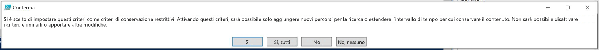

# <a name="use-preservation-lock-to-restrict-changes-to-retention-policies-and-retention-label-policies"></a>Usare la protezione dell'archiviazione per limitare le modifiche ai criteri di conservazione e ai criteri per le etichette di conservazione

>*[Indicazioni per l'assegnazione di licenze di Microsoft 365 per sicurezza e conformità](https://aka.ms/ComplianceSD).*

La protezione dell'archiviazione blocca i criteri di conservazione o i criteri per le etichette di conservazione in modo che nessuno, incluso l'amministratore, possa disattivarli, eliminarli o renderli meno restrittivi. Questa configurazione potrebbe essere necessaria per i requisiti normativi e può aiutare a proteggersi da amministratori non autorizzati.

Se i criteri di conservazione sono bloccati:

- Nessuno può disattivarli.
- È possibile aggiungere percorsi, ma non rimuoverli
- È possibile estendere un periodo di conservazione, ma non ridurlo

In sintesi, un criterio bloccato può essere aumentato o esteso, ma non ridotto, disabilitato o disattivato.
  
> [!IMPORTANT]
> Prima di bloccare un criterio di conservazione o un criterio dell'etichetta di conservazione, è essenziale comprendere l'impatto dell'operazione e verificare se sia necessario all'organizzazione. Ad esempio, potrebbe essere necessario per rispettare i requisiti normativi. Dopo l'applicazione del blocco di conservazione, gli amministratori non potranno disabilitare o eliminare il criterio.

Configurare la protezione dell'archiviazione dopo aver creato i [criteri di conservazione](create-retention-policies.md) o i criteri per le etichette di conservazione da [pubblicare ](create-apply-retention-labels.md) o [applicare automaticamente](apply-retention-labels-automatically.md). 

## <a name="how-to-lock-a-retention-policy-or-retention-label-policy"></a>Come bloccare i criteri di conservazione o i criteri per le etichette di conservazione

Se è necessario usare la protezione dell'archiviazione, occorre usare PowerShell. Poiché gli amministratori non possono disabilitare o eliminare i criteri per la conservazione dopo l'applicazione della protezione dell’archiviazione, l'abilitazione di questa caratteristica non è disponibile nell'interfaccia utente per proteggerla dalla configurazione accidentale.

Tutti i criteri per la conservazione e con qualsiasi configurazione supportano la protezione dell'archiviazione.

1. [Connettersi a PowerShell in Centro sicurezza e conformità](https://docs.microsoft.com/powershell/exchange/connect-to-scc-powershell).

2. Trovare il nome del criterio da bloccare eseguendo [Get-RetentionCompliancePolicy](https://docs.microsoft.com/powershell/module/exchange/get-retentioncompliancepolicy). Ad esempio:
    
   

3. Per applicare la protezione dell’archiviazione al criterio, eseguire il cmdlet [Set-RetentionCompliancePolicy](https://docs.microsoft.com/powershell/module/exchange/set-retentioncompliancepolicy) con il nome del criterio e il parametro *RestrictiveRetention* impostato su true:
    
    ```powershell
    Set-RetentionCompliancePolicy -Identity "<Name of Policy>" –RestrictiveRetention $true
    ```
    
    Ad esempio:
    
    
    
     Quando viene richiesto, leggere e accettare le restrizioni disponibili in questa configurazione immettendo **Y** :
    
   

La protezione dell'archiviazione è ora inserita nei criteri. Per confermare, eseguire di nuovo `Get-RetentionCompliancePolicy`, ma specificare il nome del criterio e visualizzare i parametri dei criteri:

```powershell
Get-RetentionCompliancePolicy -Identity "<Name of Policy>" |Fl
```

Dovrebbe essere visualizzato **RestrictiveRetention** è impostato su **True**. Ad esempio:


## <a name="see-also"></a>Vedere anche

[Risorse che consentono di soddisfare i requisiti normativi per la governance delle informazioni e la gestione dei record](retention-regulatory-requirements.md)
