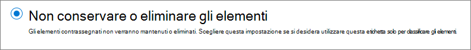
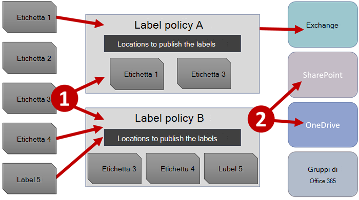
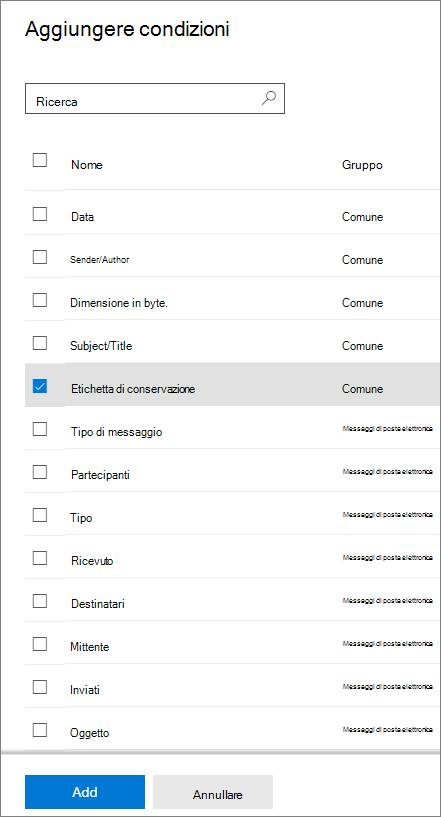
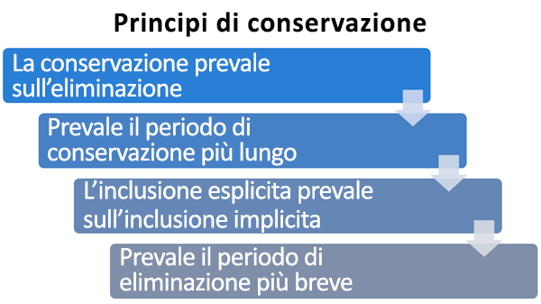

# Informazioni sui criteri e sulle etichette di conservazione

>*[Indicazioni per l'assegnazione di licenze di Microsoft 365 per sicurezza e conformità](https://aka.ms/ComplianceSD).*

Per la maggior parte delle organizzazioni, il volume e la complessità dei dati aumentano giorno dopo giorno, a causa di posta elettronica, documenti, messaggi istantanei e altro ancora. La gestione o il controllo efficace di queste informazioni è importante perché è necessario:
  
- **Conformarsi in modo proattivo alle normative del settore e ai criteri interni** che richiedono di conservare il contenuto per un periodo di tempo minimo, ad esempio la norma Sarbanes-Oxley Act richiede che alcuni tipi di contenuto vengano conservati per sette anni. 

- **Ridurre i rischi in caso di controversie legali o di violazioni della sicurezza** eliminando definitivamente i contenuti obsoleti che non è più necessario mantenere. 
    
- **Aiutare l'organizzazione a condividere le informazioni in modo efficace e a essere più flessibile** assicurando che gli utenti usino solo contenuti aggiornati e pertinenti. 
    
Le impostazioni di conservazione configurate consentono di raggiungere tutti questi obiettivi. La gestione dei contenuti in genere richiede due azioni:
  
- **Conservare** il contenuto in modo che non possa essere eliminato definitivamente prima del termine del periodo di conservazione. 
    
- **Eliminare** il contenuto in modo permanente alla fine del periodo di conservazione. 
    

Con queste due azioni di conservazione, è possibile configurare impostazioni di conservazione per ottenere i risultati seguenti:

- Sola conservazione: conservare il contenuto per sempre o per un periodo di tempo specificato.
- Sola eliminazione: eliminare il contenuto dopo un determinato periodo di tempo.
- Conservazione ed eliminazione: conservare il contenuto per un periodo di tempo specificato e quindi eliminarlo.

Queste impostazioni di conservazione funzionano con il contenuto in locale, consentendo di risparmiare sui costi generali associati alla creazione e alla configurazione di spazio di archiviazione aggiuntivo quando è necessario conservare il contenuto per motivi di conformità. Inoltre, non è necessario implementare processi personalizzati per copiare e sincronizzare i dati.

## Funzionamento delle impostazioni di conservazione con i contenuti in locale

Quando al contenuto è assegnata un'impostazione di conservazione, rimane nella posizione originale. Gli utenti possono continuare a lavorare normalmente con i propri documenti o messaggi di posta elettronica. Tuttavia, se modificano o eliminano contenuto incluso nel criterio di conservazione, verrà conservata una copia del contenuto nello stato in cui si trovava al momento dell'applicazione delle impostazioni di conservazione.
  
- Per i siti di SharePoint e OneDrive, la copia viene conservata nella **raccolta di archiviazione**.

- Per le cassette postali di Exchange, la copia viene conservata nella cartella **Elementi ripristinabili**. 

- Per i messaggi di Teams e Yammer, la copia viene conservata in una cartella nascosta denominata **SubstrateHolds** all'interno della cartella **Elementi ripristinabili** di Exchange.

> [!NOTE]
> La raccolta di archiviazione consuma spazio di archiviazione non esente dalla quota di archiviazione di un sito. Potrebbe essere necessario aumentare lo spazio di archiviazione quando si usano impostazioni di conservazione per i gruppi di SharePoint e Microsoft 365.
> 
Queste posizioni sicure e il contenuto conservato non sono visibili alla maggior parte degli utenti. Nella maggior parte dei casi, non è neanche necessario che gli utenti sappiano che il contenuto è soggetto a impostazioni di conservazione.

Per informazioni più dettagliate sul funzionamento delle impostazioni di conservazione per carichi di lavoro diversi, vedere gli articoli seguenti:

- [Informazioni sulla conservazione per SharePoint e OneDrive](retention-policies-sharepoint.md)
- [Informazioni sulla conservazione per Microsoft Teams](retention-policies-teams.md)
- [Informazioni sulla conservazione per Yammer](retention-policies-yammer.md)
- [Informazioni sulla conservazione per Exchange](retention-policies-exchange.md)

## Criteri di conservazione ed etichette di conservazione.

Per assegnare impostazioni di conservazione al contenuto è possibile usare sia criteri di conservazione che etichette di conservazione. 

Usare un criterio di conservazione per assegnare le stesse impostazioni di conservazione per il contenuto a livello di sito o cassetta postale e usare un'etichetta di conservazione per assegnare impostazioni di conservazione a livello di elemento (cartelle, documenti o messaggi di posta elettronica).

Ad esempio, se tutti i documenti in un sito di SharePoint devono essere conservati per 5 anni, è più efficiente farlo con un criterio di conservazione anziché applicare la stessa etichetta di conservazione a tutti i documenti del sito. Tuttavia, se alcuni documenti di quel sito devono essere conservati per 5 anni e altri per 10 anni, un criterio di conservazione potrebbe non essere adatto. Quando è necessario specificare impostazioni di conservazione a livello di elemento, usare le etichette di conservazione. 

Diversamente dai criteri di conservazione, le impostazioni di conservazione delle etichette di conservazione restano associate al contenuto se questo viene copiato o spostato in una posizione diversa di Microsoft 365. Inoltre, le etichette di conservazione hanno le funzionalità seguenti, che i criteri di conservazione non supportano: 
 
- Opzioni per iniziare il periodo di conservazione dal momento in cui il contenuto è stato etichettato o in base a un evento, oltre che in base all'età o alla data di ultima modifica.

- Usare [classificatori sottoponibili a training](classifier-learn-about.md) per identificare il contenuto da etichettare.

- Applicare un'etichetta predefinita per i documenti di SharePoint.

- Supportare la [revisione per l'eliminazione](disposition-reviews.md) per rivedere il contenuto prima che sia eliminato definitivamente.

- Contrassegnare il contenuto come [record](records-management.md#records) come parte delle impostazioni dell'etichetta e avere sempre una [prova dell'eliminazione](disposition.md#disposition-of-records) quando il contenuto viene eliminato al termine del periodo di conservazione.

### Criteri di conservazione

È possibile applicare i criteri di conservazione alle posizioni seguenti:
- Posta elettronica di Exchange
- Sito di SharePoint
- Account di OneDrive
- Gruppi di Microsoft 365
- Skype for Business
- Cartelle pubbliche di Exchange
- Messaggi del canale di Teams
- Chat di Teams
- Messaggi della community di Yammer
- Messaggi privati di Yammer

È possibile applicare in modo efficiente un singolo criterio a più posizioni oppure a posizioni o utenti specifici.
    
Si può anche applicare un criterio a tutto il contenuto o al contenuto che soddisfa specifiche condizioni, ad esempio che contiene parole chiave o [tipi di informazioni sensibili](sensitive-information-type-entity-definitions.md).

#### Usare la protezione dell'archiviazione per la conformità ai requisiti normativi

Per alcune organizzazioni può essere necessario rispettare i regolamenti definiti da enti normativi come la Securities and Exchange Commission (SEC) Rule 17a-4, in base alla quale, una volta attivato, un criterio di conservazione non può essere disattivato o reso meno restrittivo. 

La protezione dell'archiviazione garantisce che l'organizzazione possa rispettare tali requisiti normativi perché blocca i criteri di conservazione in modo che nessuno, incluso l'amministratore, possa disattivarli, eliminarli o renderli meno restrittivi.
  
Quando un criterio di conservazione è bloccato:

- Nessuno può disattivarlo.
- È possibile aggiungere percorsi, ma non rimuoverli
- Il contenuto soggetto al criterio non può essere modificato o eliminato durante il periodo di conservazione
- È possibile estendere un periodo di conservazione, ma non ridurlo

In sintesi, un criterio bloccato può essere aumentato o esteso, ma non ridotto, disabilitato o disattivato.
  
> [!IMPORTANT]
> Prima di bloccare un criterio di conservazione, è essenziale comprendere l'impatto dell'operazione e verificare se sia necessario all'organizzazione per soddisfare i requisiti normativi. Dopo l'applicazione del blocco di conservazione, gli amministratori non potranno disabilitare o eliminare il criterio.

La Protezione dell'archiviazione viene applicata dopo la creazione del criterio di conservazione utilizzando PowerShell. Le istruzioni sono incluse in[Creare e configurare criteri di conservazione. ](create-retention-policies.md).

#### Rilascio dei criteri di conservazione

Posto che un criterio di conservazione non sia bloccato con Protezione dell'archiviazione, è possibile disattivarlo o eliminarlo in qualsiasi momento. 

Eseguendo questa operazione, il contenuto di SharePoint o OneDrive conservato nella Raccolta di archiviazione non viene eliminato immediatamente e definitivamente. Per evitare perdite accidentali di dati, è previsto un periodo di tolleranza di 30 giorni, durante il quale la scadenza del contenuto per tale criterio non viene applicata alla raccolta di archiviazione, in modo da poter ripristinare qualsiasi contenuto in caso di necessità. Inoltre, non è possibile eliminare manualmente questo contenuto durante il periodo di tolleranza.

È possibile attivare di nuovo i criteri di conservazione durante il periodo di tolleranza; in tal caso, nessun contenuto verrà eliminato per tale criterio.

Il periodo di tolleranza di 30 giorni in SharePoint e in OneDrive corrisponde al periodo di attesa di 30 giorni in Exchange. Per altre informazioni, vedere [Gestione della permanenza nelle cassette postali ](identify-a-hold-on-an-exchange-online-mailbox.md#managing-mailboxes-on-delay-hold).

### Etichette di conservazione

Usare le etichette di conservazione per tipi di contenuto diversi che richiedono impostazioni di conservazione diverse. Ad esempio:
  
- Moduli fiscali che devono essere conservati per un periodo di tempo minimo. 
    
- Materiali per la stampa che devono essere eliminati definitivamente dopo uno specifico periodo di tempo. 
    
- Ricerche competitive che devono essere conservate per uno specifico periodo di tempo e in seguito eliminate definitivamente. 
    
- Permessi di lavoro che devono essere classificati come record in modo che non sia possibile modificarli o eliminarli. 
    
In tutti questi casi, le etichette di conservazione consentono di applicare impostazioni di conservazione per il controllo della governance a livello di elemento (documenti o posta elettronica).
  
Con le etichette di conservazione è possibile:
  
- **Permettere agli utenti dell'organizzazione di applicare manualmente un'etichetta di conservazione** a contenuti in Outlook e Outlook sul Web, OneDrive, SharePoint e gruppi di Microsoft 365. Gli utenti spesso conoscono meglio il tipo di contenuto su cui stanno lavorando, quindi possono classificarlo e applicare le impostazioni di conservazione appropriate. 
    
- **Applicare automaticamente etichette di conservazione al contenuto** se soddisfa specifiche condizioni, ad esempio se include: 
    - Tipi specifici di informazioni riservate.
    - Parole chiave specifiche che corrispondono a una query creata.
    - Criteri di corrispondenza per un classificatore sottoponibile a training.

- **Avviare il periodo di conservazione dal momento in cui il contenuto è stato etichettato** per i documenti in siti di SharePoint e account di OneDrive e per gli elementi di posta elettronica, ad eccezione degli elementi di calendario. Se si applica un'etichetta di conservazione con questa configurazione a un elemento del calendario, il periodo di conservazione inizia dal momento dell'invio.

- **Avviare il periodo di conservazione quando si verifica un evento**, ad esempio se i dipendenti lasciano l'organizzazione o alla scadenza dei contratti.

- **Applicare un'etichetta di conservazione predefinita a una raccolta documenti, una cartella o un set di documenti** in SharePoint, in modo che i documenti archiviati in quella posizione ereditino l'etichetta di conservazione predefinita.

Inoltre, le etichette di conservazione supportano la [gestione dei record](records-management.md) per messaggi di posta elettronica e documenti tra app e servizi Microsoft 365. È possibile usare un'etichetta di conservazione per contrassegnare gli elementi come record. Quando questo avviene e il contenuto rimane in Microsoft 365, l'etichetta pone altre restrizioni sul contenuto che potrebbero essere necessarie per motivi legali. Per altre informazioni, vedere [confrontare le restrizioni relative alle azioni consentite o bloccate](records-management.md#compare-restrictions-for-what-actions-are-allowed-or-blocked).

Se il contenuto viene spostato al di fuori di Microsoft 365, le [etichette di conservazione](sensitivity-labels.md), a differenza delle etichette di riservatezza, non vengono mantenute.

Non sono previsti limiti rispetto al numero di etichette di conservazione supportate per un tenant. Tuttavia, 10.000 è il numero massimo di criteri supportati per un tenant, inclusi i criteri che applicano le etichette (criteri per le etichette di conservazione e per le etichette di conservazione applicate automaticamente) e i criteri di conservazione.

#### Classificazione del contenuto senza applicazione di azioni

Anche se lo scopo principale delle etichette di conservazione è conservare o eliminare contenuto, è possibile usarle anche senza attivare la conservazione o altre azioni. In questo caso, si può usare un'etichetta di conservazione semplicemente come etichetta di testo, senza applicare azioni.
  
Ad esempio, è possibile creare e applicare un'etichetta di conservazione denominata "Rivedere in un secondo momento" senza azioni e quindi usarla per ritrovare il contenuto in seguito.
  

#### Uso di un'etichetta di conservazione come condizione nei criteri di prevenzione della perdita dei dati

È possibile specificare un'etichetta di conservazione come condizione in un criterio di prevenzione della perdita dei dati (DLP) per i documenti in SharePoint. Ad esempio, configurare un criterio DLP per impedire che i documenti vengano condivisi all'esterno dell'organizzazione se vi è applicata una specifica etichetta di conservazione.

Per altre informazioni, vedere [Uso di un'etichetta di conservazione come condizione nei criteri di prevenzione della perdita dei dati](data-loss-prevention-policies.md#using-a-retention-label-as-a-condition-in-a-dlp-policy).

#### Etichette di conservazione e criteri per applicarle

Le etichette di conservazione sono blocchi predefiniti indipendenti e riutilizzabili. Lo scopo principale di un criterio di etichetta di conservazione è raggruppare un set di tali etichette e specificare le posizioni in cui si vuole che vengano visualizzate. Quindi, gli amministratori e gli utenti possono applicare le etichette al contenuto in tali posizioni.
  

  
Quando si pubblicano etichette di conservazione, vengono incluse in un criterio di etichetta di conservazione che le rende disponibili per la selezione da parte di amministratori e utenti:

- Una singola etichetta di conservazione può essere inclusa in molti criteri di etichetta di conservazione.

- I criteri di etichetta di conservazione specificano le posizioni di pubblicazione delle etichette di conservazione.

- Una singola posizione può anche essere inclusa in molti criteri di etichetta di conservazione.

Oltre ai criteri per le etichette di conservazione, è anche possibile creare uno o più criteri di applicazione automatica, ognuno con una singola etichetta di conservazione. Con questo criterio, quando vengono soddisfatte le condizioni specificate viene applicata automaticamente un'etichetta di conservazione. 

#### Criteri per le etichette di conservazione e posizioni

È possibile pubblicare tipi di etichette di conservazione differenti in posizioni diverse, a seconda dell'azione eseguita dall'etichetta di conservazione.
  
| Se l'etichetta di conservazione è... | Il criterio di etichetta può essere applicato a… |
|:-----|:-----|
|Pubblicato ad amministratori e utenti finali    |Exchange, SharePoint, OneDrive, gruppi di Microsoft 365    |
|Applicata automaticamente in base a tipi di informazioni sensibili o classificatori sottoponibili a training    |Exchange (solo a tutte le cassette postali), SharePoint, OneDrive    |
|Applicata automaticamente in base a una query    |Exchange, SharePoint, OneDrive, gruppi di Microsoft 365    |
   
In Exchange, le etichette di conservazione applicate automaticamente vengono applicate solo ai nuovi messaggi inviati (dati in transito), non a tutti gli elementi attualmente presenti nella cassetta postale (dati archiviati). Inoltre, le etichette di conservazione applicate automaticamente per i tipi di informazioni sensibili e i classificatori sottoponibili a training possono essere applicate solo a tutte le cassette postali, non a cassette postali specifiche.
  
Le cartelle pubbliche di Exchange, Skype e i messaggi di Teams e Yammer non supportano le etichette di conservazione. Per conservare ed eliminare contenuto in queste posizioni, usare i criteri di conservazione.

#### Una sola etichetta di conservazione alla volta

A un messaggio di posta elettronica o un documento è possibile assegnare una sola etichetta di conservazione alla volta:
  
- Per le etichette di conservazione assegnate manualmente da amministratori o utenti finali, è possibile rimuovere o cambiare l'etichetta di conservazione assegnata.
    
- Se al contenuto è assegnata un'etichetta applicata automaticamente, tale etichetta può essere sostituita da un'etichetta di conservazione pubblicata.
    
- Se al contenuto è assegnata un'etichetta di conservazione pubblicata, non è possibile sostituirla con un'etichetta applicata automaticamente.
    
- Se sono presenti più regole che assegnano automaticamente un'etichetta e il contenuto soddisfa le condizioni di più regole, viene assegnata l'etichetta di conservazione della regola meno recente (per data di creazione).
    
Per capire come e perché è stata applicata un'etichetta di conservazione anziché un'altra, è utile comprendere la differenza tra assegnare esplicitamente un'etichetta un'etichetta assegnata in modo implicito:

- Le etichette di conservazione applicate da un criterio di etichetta vengono assegnate in modo esplicito
- Le etichette di conservazione applicate automaticamente da un criterio di applicazione automatica vengono assegnate in modo implicito

Un'etichetta di conservazione assegnata in modo esplicito ha la precedenza su un'etichetta di conservazione assegnata in modo implicito. Per altre informazioni, vedere la sezione [Precedenza nei principi di conservazione](retention.md#the-principles-of-retention-or-what-takes-precedence) in questa pagina.

#### Monitoraggio delle etichette di conservazione

Dal Centro conformità Microsoft 365 selezionare **Classificazione dei dati** > **Panoramica** per monitorare il modo in cui le etichette di conservazione sono in uso nel tenant e identificare la posizione in cui si trovano gli elementi contrassegnati. Per ulteriori informazioni, inclusi i prerequisiti importanti, vedere [Conoscere i dati - panoramica sulla classificazione dei dati](data-classification-overview.md).

È quindi possibile eseguire il drill-down tra i dettagli usando [l’esploratore dei contenuti](data-classification-content-explorer.md) e [l’esploratore delle attività](data-classification-activity-explorer.md).

> [!TIP]
>È consigliabile usare alcuni degli altri approfondimenti per la classificazione dei dati, ad esempio i classificatori addestrabili e i tipi di informazioni riservate, per identificare il contenuto che potrebbe essere necessario mantenere o eliminare o gestire come risultato.

Il Centro sicurezza e conformità di Office 365 riceve le informazioni generali equivalenti per la conservazione delle etichette dalla **Gestione delle informazioni** > **Dashboard**, e informazioni più dettagliate dalla **Gestione delle informazioni** > **Esploratore delle attività di etichettatura**. Per ulteriori informazioni sul monitoraggio delle etichette di conservazione nell’interfaccia di amministrazione precedente, vedere la seguente documentazione:
- [Visualizzare i report della gestione dei dati](view-the-data-governance-reports.md)
- [Visualizzare l'utilizzo delle etichette con Analisi delle etichette](label-analytics.md)
- [Visualizzare le attività delle etichette dei documenti](view-label-activity-for-documents.md)

#### Usare Cerca Contenuto per trovare tutti i contenuti su una specifica etichetta di conservazione

Dopo l'assegnazione delle etichette di conservazione al contenuto, è possibile usare lo strumento di ricerca del contenuto per trovare tutti gli elementi su cui è applicata quella specifica etichetta di conservazione.

Quando si crea una ricerca di contenuto, scegliere la condizione **Etichetta di conservazione**, quindi immettere il nome completo dell'etichetta di conservazione o parte di esso e usare un carattere jolly. Per altre informazioni, vedere [Query con parola chiave e condizioni di ricerca per la ricerca di contenuto](keyword-queries-and-search-conditions.md).
  

## Confronto delle funzionalità di criteri ed etichette di conservazione

Usare la tabella seguente per stabilire se usare criteri di conservazione o etichette di conservazione, in base alle funzionalità.

|Funzionalità|Criterio di conservazione |Etichetta di conservazione|
|:-----|:-----|:-----|:-----|
|Impostazioni per conservare e poi eliminare, solo conservare oppure solo eliminare |Sì |Sì |
|Carichi di lavoro supportati:  - Exchange  - SharePoint  - OneDrive  - Gruppi di Microsoft 365  - Skype for Business  - Teams - Yammer|  Sì   Sì   Sì   Sì   Sì   Sì |   Sì, tranne le cartelle pubbliche   Sì   Sì   Sì   No   No   No |
|Conservazione applicata automaticamente | Sì | Sì |
|Conservazione applicata in base alle condizioni   - tipi di informazioni sensibili, query KQL, classificatori sottoponibili a training| No | Sì |
|Conservazione applicata manualmente | No | Sì |
|Presenza nell'interfaccia utente per gli utenti finali | No | Sì |
|Persiste se il contenuto viene spostato | No | Sì, in Microsoft 365 |
|Dichiarazione elemento come record| No | Sì |
|Avviare il periodo di conservazione al momento dell'etichettatura o in base a un evento | No | Sì |
|Revisione per l'eliminazione | No| Sì |
|Prova di eliminazione per un massimo di 7 anni | No |Sì, quando l'elemento è dichiarato come record|
|Audit delle attività dell’amministratore| Sì | Sì|
|Identificazione degli elementi soggetti a conservazione:   - Ricerca contenuto   - Pagina di classificazione dei dati, Esplora contenuto, Esplora attività |   No   No |   Sì   Sì|

Si noti che è possibile usare sia criteri di conservazione che etichette di conservazione, come metodi di conservazione complementari. Ad esempio:

1. Si può creare e configurare un criterio conservazione che elimina automaticamente il contenuto cinque anni dopo l'ultima modifica e applicarlo a tutti gli account di OneDrive.

2. Si può creare e configurare un'etichetta di conservazione che conserva il contenuto per sempre e aggiungerla a un criterio di etichetta pubblicato in tutti gli account di OneDrive. Si spiegherà agli utenti come applicare manualmente l'etichetta a documenti specifici che devono essere esclusi dall'eliminazione automatica se non vengono modificati dopo cinque anni.

Per altre informazioni sul funzionamento congiunto di criteri di conservazione ed etichette di conservazione e su come determinarne il risultato combinato, vedere la sezione successiva che descrive i principi di conservazione e cosa ha la precedenza.

## Precedenza nei principi di conservazione

È possibile, o addirittura probabile, che al contenuto siano applicati più criteri di conservazione ed etichette di conservazione, con azioni (conservare, eliminare oppure conservare e quindi eliminare) e periodi di conservazione diversi. Cosa ha la precedenza? 

A livello generale, la conservazione ha sempre la precedenza rispetto all'eliminazione e prevale il periodo di conservazione più lungo. 

Tuttavia, ci sono anche altri fattori da considerare. Il flusso seguente aiuta a comprendere il risultato. Il conflitto viene risolto a ogni livello, procedendo dall'alto verso il basso: se il risultato è determinato dal primo livello, non è necessario procedere al livello successivo e così via. Il flusso passa al livello successivo per determinare il risultato solo se le regole del livello precedente non lo consentono.

  
Spiegazione per i quattro diversi livelli:
  
1. **La conservazione prevale sull'eliminazione.** Si supponga di avere un criterio di conservazione configurato per eliminare la posta elettronica di Exchange dopo tre anni e un altro criterio di conservazione configurato per conservare la posta elettronica di Exchange per cinque anni e quindi eliminarla. Il contenuto che supera i tre anni verrà eliminato e nascosto agli utenti, ma comunque conservato nella cartella Elementi ripristinabili fino a raggiungere i cinque anni, quando verrà eliminato definitivamente. 
2. **Prevale il periodo di conservazione più lungo.** Se un contenuto è soggetto a più impostazioni di conservazione che prevedono periodi di conservazione diversi, verrà mantenuto fino al termine del periodo di conservazione più lungo.
    
3. **L'inclusione esplicita prevale sull'inclusione implicita.** Questo significa che: 
    
    1. Se un utente assegna manualmente un'etichetta di conservazione con impostazioni di conservazione a un elemento, ad esempio un messaggio di posta elettronica di Exchange o un documento di OneDrive, l'etichetta di conservazione ha la precedenza sui criteri di conservazione assegnati a livello di sito o di cassetta postale e su un'etichetta di conservazione predefinita assegnata alla raccolta documenti. Ad esempio, se l'etichetta di conservazione esplicita è configurata per conservare il contenuto per dieci anni, ma un criterio di conservazione assegnato al sito indica di conservare il contenuto solo per cinque anni, l'etichetta di conservazione ha la precedenza. Le etichette di conservazione applicate automaticamente sono considerate implicite e non esplicite, perché vengono applicate automaticamente da Microsoft 365.
    
    2. Se un criterio di conservazione include una posizione specifica, ad esempio la cassetta postale o l'account di OneDrive di un particolare utente, il criterio di conservazione ha la precedenza su un altro criterio di conservazione applicato alle cassette postali o agli account di OneDrive di tutti gli utenti, ma che non include specificamente la cassetta postale di quell'utente.
    
4. **Prevale il periodo di eliminazione più breve.** Analogamente, se un contenuto è soggetto a più impostazioni di conservazione che eliminano il contenuto senza un periodo di conservazione, verrà eliminato alla fine del periodo di conservazione più breve. 

Infine, un criterio di conservazione o un'etichetta di conservazione non può eliminare definitivamente qualsiasi contenuto che si trovi in stato di blocco per eDiscovery. Quando il blocco viene rilasciato, il contenuto torna idoneo per il processo di pulizia nelle posizioni protette per il carico di lavoro.

## Configurazione del controllo della conservazione

Le azioni dell’amministratore inerenti i criteri di conservazione e la conservazione delle etichette vengono salvate nel log di controllo quando [il controllo è abilitato](turn-audit-log-search-on-or-off.md). Ad esempio, un evento di controllo viene creato quando si crea, si configura o si elimina un criterio o un’etichetta di conservazione. Per la lista completa, vedere [Attività inerenti i criteri e le etichette di conservazione](search-the-audit-log-in-security-and-compliance.md#retention-policy-and-retention-label-activities).

## Cmdlet di PowerShell per criteri ed etichette di conservazione

Per usare i cmdlet di conservazione, è prima necessario [connettersi a PowerShell per Centro sicurezza e conformità di Office 365](https://docs.microsoft.com/powershell/exchange/connect-to-scc-powershell). Quindi, usare uno dei cmdlet seguenti:

- [Get-ComplianceTag](https://docs.microsoft.com/powershell/module/exchange/get-compliancetag)

- [New-ComplianceTag](https://docs.microsoft.com/powershell/module/exchange/new-compliancetag)

- [Remove-ComplianceTag](https://docs.microsoft.com/powershell/module/exchange/remove-compliancetag)

- [Set-ComplianceTag](https://docs.microsoft.com/powershell/module/exchange/set-compliancetag)

- [Enable-ComplianceTagStorage](https://docs.microsoft.com/powershell/module/exchange/enable-compliancetagstorage)

- [Get-ComplianceTagStorage](https://docs.microsoft.com/powershell/module/exchange/get-compliancetagstorage)

- [Get-RetentionCompliancePolicy](https://docs.microsoft.com/powershell/module/exchange/get-retentioncompliancepolicy)

- [New-RetentionCompliancePolicy](https://docs.microsoft.com/powershell/module/exchange/new-retentioncompliancepolicy)

- [Remove-RetentionCompliancePolicy](https://docs.microsoft.com/powershell/module/exchange/remove-retentioncompliancepolicy)

- [Set-RetentionCompliancePolicy](https://docs.microsoft.com/powershell/module/exchange/set-retentioncompliancepolicy)

- [Get-RetentionComplianceRule](https://docs.microsoft.com/powershell/module/exchange/get-retentioncompliancerule)

- [New-RetentionComplianceRule](https://docs.microsoft.com/powershell/module/exchange/new-retentioncompliancerule)

- [Remove-RetentionComplianceRule](https://docs.microsoft.com/powershell/module/exchange/remove-retentioncompliancerule)

- [Set-RetentionComplianceRule](https://docs.microsoft.com/powershell/module/exchange/set-retentioncompliancerule)

## Usare i criteri di conservazione e le etichette di conservazione anziché funzionalità precedenti

Se è necessario conservare o eliminare contenuto in modo proattivo in Microsoft 365 a scopi di governance delle informazioni, è consigliabile usare criteri di conservazione ed etichette di conservazione invece delle funzionalità precedenti indicate di seguito. 
  
Se attualmente si usano queste funzionalità, continueranno a funzionare parallelamente ai criteri e alle etichette di conservazione. Tuttavia, si consiglia per il futuro di usare i criteri di conservazione e le etichette di conservazione. Forniscono infatti un unico meccanismo per gestire in modo centralizzato sia la conservazione che l'eliminazione del contenuto in Microsoft 365.

**Funzionalità precedenti di Exchange Online:**

- [Blocco sul posto e blocco per controversia legale](https://go.microsoft.com/fwlink/?linkid=846124) (blocco di eDiscovery) 

- [Come identificare il tipo di blocco applicato a una cassetta postale di Exchange Online](identify-a-hold-on-an-exchange-online-mailbox.md)
    
- [Tag di conservazione e criteri di conservazione](https://go.microsoft.com/fwlink/?linkid=846125), noti anche come [gestione record di messaggistica (MRM)](https://go.microsoft.com/fwlink/?linkid=846126) (solo eliminazione)
    
Vedere anche [Ritiro degli strumenti legacy di eDiscovery](legacy-ediscovery-retirement.md).

**Funzionalità precedenti di SharePoint e OneDrive:**

- [Aggiunta di un contenuto a un caso e archiviare origini blocco nel centro eDiscovery](https://docs.microsoft.com/SharePoint/governance/add-content-to-a-case-and-place-sources-on-hold-in-the-ediscovery-center) (blocco di eDiscovery) 
    
- [Criteri di eliminazione dei documenti](https://support.office.com/article/Create-a-document-deletion-policy-in-SharePoint-Server-2016-4fe26e19-4849-4eb9-a044-840ab47458ff) (solo eliminazione)
    
- [Configurare la gestione dei record sul posto](https://support.office.com/article/7707a878-780c-4be6-9cb0-9718ecde050a) (solo conservazione) 
    
- [Usare criteri per la chiusura e l'eliminazione di siti](https://support.microsoft.com/it-IT/office/use-policies-for-site-closure-and-deletion-a8280d82-27fd-48c5-9adf-8a5431208ba5) (solo eliminazione) 
    
- [Criteri di gestione delle informazioni ](intro-to-info-mgmt-policies.md) (solo eliminazione)
     
Se in passato sono stati usati blocchi di eDiscovery per la governance delle informazioni, per garantire una conformità proattiva ora si devono usare invece i criteri di conservazione. Usare eDiscovery solo per i blocchi.
  
### Criteri di conservazione e criteri tipo di contenuto di SharePoint o criteri di gestione delle informazioni

Se si sono configurati i siti di SharePoint per criteri tipo di contenuto o criteri di gestione delle informazioni mirati alla conservazione del contenuto di un elenco o una raccolta, tali criteri vengono ignorati quando sono applicati i criteri di conservazione. 

## Informazioni correlate

- [Limiti di SharePoint Online](https://docs.microsoft.com/office365/servicedescriptions/sharepoint-online-service-description/sharepoint-online-limits)
- [Limiti e specifiche per Microsoft Teams](https://docs.microsoft.com/microsoftteams/limits-specifications-teams) 
- [Rispettare la SEC Rule 17a-4](use-exchange-online-to-comply-with-sec-rule-17a-4.md)

## Passaggi successivi

Se si è pronti per creare criteri di conservazione, vedere [Creare e configurare criteri di conservazione](create-retention-policies.md).

Per creare e applicare etichette di conservazione:
- [Creare etichette di conservazione e applicarle nelle app](create-apply-retention-labels.md)
- [Applicare automaticamente un'etichetta di conservazione al contenuto](apply-retention-labels-automatically.md)

