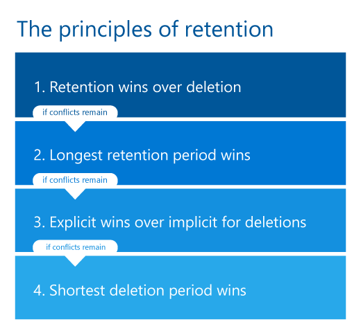

# Informazioni sui criteri e sulle etichette di conservazione

>*[Indicazioni per l'assegnazione di licenze di Microsoft 365 per sicurezza e conformità](/office365/servicedescriptions/microsoft-365-service-descriptions/microsoft-365-tenantlevel-services-licensing-guidance/microsoft-365-security-compliance-licensing-guidance).*

> [!NOTE]
> Se vengono visualizzati messaggi sui criteri di conservazione in Teams o si hanno domande sulle etichette di conservazione nelle app, contattare il reparto IT per informazioni sulla loro configurazione. Nel frattempo, gli articoli seguenti potrebbero risultare utili:
> -  [Messaggi di Teams sui criteri di conservazione](https://support.microsoft.com/office/teams-messages-about-retention-policies-c151fa2f-1558-4cf9-8e51-854e925b483b)
> - [Applicare etichette di conservazione ai file in SharePoint o OneDrive](https://support.microsoft.com/office/apply-retention-labels-to-files-in-sharepoint-or-onedrive-11a6835b-ec9f-40db-8aca-6f5ef18132df)
>
> Le informazioni presenti in questa pagina sono destinate agli amministratori IT che possono creare i criteri e le etichette di conservazione per motivi di conformità.

Per la maggior parte delle organizzazioni, il volume e la complessità dei dati aumentano giorno dopo giorno, a causa di posta elettronica, documenti, messaggi istantanei e altro ancora. La gestione o il controllo efficace di queste informazioni è importante perché è necessario:

- **Conformarsi in modo proattivo alle normative del settore e ai criteri interni** che richiedono di conservare il contenuto per un periodo di tempo minimo, ad esempio la norma Sarbanes-Oxley Act richiede che alcuni tipi di contenuto vengano conservati per sette anni.

- **Ridurre i rischi in caso di controversie legali o di violazioni della sicurezza** eliminando definitivamente i contenuti obsoleti che non è più necessario mantenere.

- **Aiutare l'organizzazione a condividere le informazioni in modo efficace e a essere più flessibile** assicurando che gli utenti usino solo contenuti aggiornati e pertinenti.

Le impostazioni di conservazione configurate consentono di raggiungere questi obiettivi. La gestione dei contenuti in genere richiede due azioni:

| Azione| Finalità |
|:-----|:-----|
|Conservare contenuto | Prevenire l'eliminazione definitiva e rimanere disponibile per eDiscovery |
|Eliminare contenuto | Eliminare definitivamente il contenuto dall'organizzazione|

Con queste due azioni di conservazione, è possibile configurare impostazioni di conservazione per ottenere i risultati seguenti:

- Sola conservazione: conservare il contenuto per sempre o per un periodo di tempo specificato.
- Sola eliminazione: eliminare definitivamente il contenuto dopo un determinato periodo di tempo.
- Conservazione ed eliminazione: conservare il contenuto per un periodo di tempo specifico, quindi eliminarlo definitivamente.

Queste impostazioni di conservazione funzionano con il contenuto in locale, consentendo di risparmiare sui costi generali associati alla creazione e alla configurazione di spazio di archiviazione aggiuntivo quando è necessario conservare il contenuto per motivi di conformità. Inoltre, non è necessario implementare processi personalizzati per copiare e sincronizzare i dati.

Usare le sezioni seguenti per scoprire ulteriori informazioni su come funzionano i criteri e le etichette di conservazione, quando usarli e come si integrano a vicenda. Ma se si desidera iniziare subito ad avviare e implementare le impostazioni di conservazione per alcuni scenari comuni, vedere [Informazioni sui criteri e sulle etichette di conservazione](get-started-with-retention.md).

## Funzionamento delle impostazioni di conservazione con i contenuti in locale

Quando al contenuto è assegnata un’impostazione di conservazione, nei criteri di conservazione, tale contenuto rimane nella posizione originale. Gli utenti possono continuare a lavorare normalmente con i propri documenti o messaggi di posta elettronica. Tuttavia, se modificano o eliminano il contenuto incluso nei criteri di conservazione, una copia del contenuto viene automaticamente conservata.
  
- Per i siti di SharePoint e OneDrive, la copia viene conservata nella **raccolta di archiviazione**.

- Per le cassette postali di Exchange, la copia viene conservata nella cartella **Elementi ripristinabili**. 

- Per i messaggi di Teams e Yammer, la copia viene conservata in una cartella nascosta denominata **SubstrateHolds** all'interno della cartella **Elementi ripristinabili** di Exchange.

> [!NOTE]
> La raccolta di archiviazione consuma spazio di archiviazione non esente dalla quota di archiviazione di un sito. Potrebbe essere necessario aumentare lo spazio di archiviazione quando si usano impostazioni di conservazione per i gruppi di SharePoint e Microsoft 365.
> 
Queste posizioni sicure e il contenuto conservato non sono visibili alla maggior parte degli utenti. Nella maggior parte dei casi, non è neanche necessario che gli utenti sappiano che il contenuto è soggetto a impostazioni di conservazione.

Per informazioni più dettagliate sul funzionamento delle impostazioni di conservazione per carichi di lavoro diversi, vedere gli articoli seguenti:

- [Informazioni sulla conservazione per SharePoint e OneDrive](retention-policies-sharepoint.md)
- [Informazioni sulla conservazione per Microsoft Teams](retention-policies-teams.md)
- [Informazioni sulla conservazione per Yammer](retention-policies-yammer.md)
- [Informazioni sulla conservazione per Exchange](retention-policies-exchange.md)

## Criteri di conservazione ed etichette di conservazione.

Per assegnare le impostazioni di conservazione al contenuto, usare i **criteri di conservazione** e le **etichette di conservazione con i criteri delle etichette**. È possibile usare solo uno di questi metodi o combinarli.

Usare un criterio di conservazione per assegnare le stesse impostazioni di conservazione per il contenuto a livello di sito o cassetta postale e usare un'etichetta di conservazione per assegnare impostazioni di conservazione a livello di elemento (cartelle, documenti o messaggi di posta elettronica).

Ad esempio, se tutti i documenti in un sito di SharePoint devono essere conservati per 5 anni, è più efficiente farlo con un criterio di conservazione anziché applicare la stessa etichetta di conservazione a tutti i documenti del sito. Tuttavia, se alcuni documenti di quel sito devono essere conservati per 5 anni e altri per 10 anni, un criterio di conservazione potrebbe non essere adatto. Quando è necessario specificare impostazioni di conservazione a livello di elemento, usare le etichette di conservazione. 

Diversamente dai criteri di conservazione, le impostazioni di conservazione delle etichette di conservazione vengono trasferite con il contenuto se questo viene copiato o spostato in una posizione diversa all'interno del tenant di Microsoft 365. Inoltre, le etichette di conservazione hanno le funzionalità seguenti, che i criteri di conservazione non supportano: 
 
- Opzioni per iniziare il periodo di conservazione dal momento in cui il contenuto è stato etichettato o in base a un evento, oltre che in base all'età o alla data di ultima modifica.

- Usare [classificatori sottoponibili a training](classifier-learn-about.md) per identificare il contenuto da etichettare.

- Applicare un'etichetta predefinita per i documenti di SharePoint.

- Supportare la [revisione per l'eliminazione](./disposition.md) per rivedere il contenuto prima che sia eliminato definitivamente.

- Contrassegnare il contenuto come [record](records-management.md#records) come parte delle impostazioni dell'etichetta e avere sempre una [prova dell'eliminazione](disposition.md#disposition-of-records) quando il contenuto viene eliminato al termine del periodo di conservazione.

### Criteri di conservazione

È possibile applicare i criteri di conservazione alle posizioni seguenti:
- Posta elettronica di Exchange
- Sito di SharePoint
- Account di OneDrive
- Gruppi di Microsoft 365
- Skype for Business
- Cartelle pubbliche di Exchange
- Messaggi del canale di Teams
- Chat di Teams
- Messaggi della community di Yammer
- Messaggi utente di Yammer

È possibile applicare in modo efficiente un singolo criterio a più posizioni oppure a posizioni o utenti specifici.

Per l'inizio del periodo di conservazione, è possibile scegliere quando il contenuto è stato creato oppure, solo per i file e le posizioni di SharePoint, OneDrive e Office 365, la data di ultima modifica.

Gli elementi ereditano le impostazioni di conservazione dal contenitore specificato nei criteri di conservazione. Se vengono poi spostati all'esterno del contenitore quando il criterio è configurato per la conservazione del contenuto, viene mantenuta una copia dell'elemento nella posizione protetta del carico di lavoro. Le impostazioni di conservazione, tuttavia, non vengono trasferite nella nuova posizione con il contenuto. Se necessario, usare le etichette di conservazione anziché i criteri di conservazione.

### Etichette di conservazione

Usare le etichette di conservazione per tipi di contenuto diversi che richiedono impostazioni di conservazione diverse. Ad esempio:
  
- Moduli fiscali che devono essere conservati per un periodo di tempo minimo. 
    
- Materiali per la stampa che devono essere eliminati definitivamente dopo uno specifico periodo di tempo. 
    
- Ricerche competitive che devono essere conservate per uno specifico periodo di tempo e in seguito eliminate definitivamente. 
    
- Permessi di lavoro che devono essere classificati come record in modo che non sia possibile modificarli o eliminarli. 
    
In tutti questi casi, le etichette di conservazione consentono di applicare impostazioni di conservazione per il controllo della governance a livello di elemento (documenti o posta elettronica).
  
Con le etichette di conservazione è possibile:
  
- **Permettere agli utenti dell'organizzazione di applicare manualmente un'etichetta di conservazione** a contenuti in Outlook e Outlook sul Web, OneDrive, SharePoint e gruppi di Microsoft 365. Gli utenti spesso conoscono meglio il tipo di contenuto su cui stanno lavorando, quindi possono classificarlo e applicare le impostazioni di conservazione appropriate. 
    
- **Applicare automaticamente etichette di conservazione al contenuto** se soddisfa specifiche condizioni, ad esempio se include: 
    - Tipi specifici di informazioni riservate.
    - Parole chiave specifiche che corrispondono a una query creata.
    - Criteri di corrispondenza per un classificatore sottoponibile a training.

- **Avviare il periodo di conservazione dal momento in cui il contenuto è stato etichettato** per i documenti in siti di SharePoint e account di OneDrive e per gli elementi di posta elettronica, ad eccezione degli elementi di calendario. Se si applica un'etichetta di conservazione con questa configurazione a un elemento del calendario, il periodo di conservazione inizia dal momento dell'invio.

- **Avviare il periodo di conservazione quando si verifica un evento**, ad esempio se i dipendenti lasciano l'organizzazione o alla scadenza dei contratti.

- **Applicare un'etichetta di conservazione predefinita a una raccolta documenti, una cartella o un set di documenti** in SharePoint, in modo che i documenti archiviati in quella posizione ereditino l'etichetta di conservazione predefinita.

Inoltre, le etichette di conservazione supportano la [gestione dei record](records-management.md) per messaggi di posta elettronica e documenti tra app e servizi Microsoft 365. È possibile usare un'etichetta di conservazione per contrassegnare gli elementi come record. Quando questo avviene e il contenuto rimane in Microsoft 365, l'etichetta pone altre restrizioni sul contenuto che potrebbero essere necessarie per motivi legali. Per altre informazioni, vedere [confrontare le restrizioni relative alle azioni consentite o bloccate](records-management.md#compare-restrictions-for-what-actions-are-allowed-or-blocked).

Se il contenuto viene spostato al di fuori di Microsoft 365, le [etichette di conservazione](sensitivity-labels.md), a differenza delle etichette di riservatezza, non vengono mantenute.

Non sono previsti limiti rispetto al numero di etichette di conservazione supportate per un tenant. Tuttavia, 10.000 è il numero massimo di criteri supportati per un tenant, inclusi i criteri che applicano le etichette (criteri per le etichette di conservazione e per le etichette di conservazione applicate automaticamente) e i criteri di conservazione.

#### Classificazione del contenuto senza applicazione di azioni

Anche se lo scopo principale delle etichette di conservazione è conservare o eliminare contenuto, è possibile usarle anche senza attivare la conservazione o altre azioni. In questo caso, si può usare un'etichetta di conservazione semplicemente come etichetta di testo, senza applicare azioni.
  
Ad esempio, è possibile creare e applicare un'etichetta di conservazione denominata "Rivedere in un secondo momento" senza azioni e quindi usarla per ritrovare il contenuto in seguito.
  

#### Uso di un'etichetta di conservazione come condizione nei criteri di prevenzione della perdita dei dati

È possibile specificare un'etichetta di conservazione come condizione in un criterio di prevenzione della perdita dei dati (DLP) per i documenti in SharePoint. Ad esempio, configurare un criterio DLP per impedire che i documenti vengano condivisi all'esterno dell'organizzazione se vi è applicata una specifica etichetta di conservazione.

Per altre informazioni, vedere [Uso di un'etichetta di conservazione come condizione nei criteri di prevenzione della perdita dei dati](data-loss-prevention-policies.md#using-a-retention-label-as-a-condition-in-a-dlp-policy).

#### Etichette di conservazione e criteri per applicarle

Quando si pubblicano etichette di conservazione, vengono incluse in un **criterio di etichetta di conservazione** che le rende disponibili per l’applicazione ai contenuti da parte di amministratori e utenti. Come illustrato nel diagramma seguente:

1. Una singola etichetta di conservazione può essere inclusa in più criteri di etichetta di conservazione.

2. I criteri per le etichette di conservazione specificano le posizioni di pubblicazione delle etichette di conservazione. La stessa posizione può essere inclusa in più criteri di etichetta di conservazione.

È anche possibile creare uno o più **criteri per le etichette di conservazione applicate automaticamente**, ognuno con una singola etichetta di conservazione. Con questo criterio, quando vengono soddisfatte le condizioni specificate viene applicata automaticamente un'etichetta di conservazione.

#### Criteri per le etichette di conservazione e posizioni

È possibile pubblicare tipi di etichette di conservazione differenti in posizioni diverse, a seconda dell'azione eseguita dall'etichetta di conservazione.
  
| Se l'etichetta di conservazione è... | Il criterio di etichetta può essere applicato a… |
|:-----|:-----|
|Pubblicato ad amministratori e utenti finali    |Exchange, SharePoint, OneDrive, gruppi di Microsoft 365    |
|Applicata automaticamente in base a tipi di informazioni sensibili o classificatori sottoponibili a training    |Exchange (solo a tutte le cassette postali), SharePoint, OneDrive    |
|Applicata automaticamente in base a una query    |Exchange, SharePoint, OneDrive, gruppi di Microsoft 365    |
   
Le etichette di conservazione applicabili automaticamente in Exchange (sia per le query sia per i tipi di informazioni riservate) vengono applicate solo ai messaggi inviati di recente (dati in transito), non a tutti gli elementi attualmente nella cassetta postale (dati inattivi). Inoltre, le etichette di conservazione applicate automaticamente per i tipi di informazioni riservate possono essere applicate solo a tutte le cassette postali, non a cassette postali specifiche.
  
Le cartelle pubbliche di Exchange, Skype e i messaggi di Teams e Yammer non supportano le etichette di conservazione. Per conservare ed eliminare contenuto in queste posizioni, usare i criteri di conservazione.

#### Una sola etichetta di conservazione alla volta

È possibile applicare una sola etichetta di conservazione alla volta a un messaggio di posta elettronica o un documento. Un'etichetta di conservazione può essere applicata [manualmente](create-apply-retention-labels.md#manually-apply-retention-labels) da un utente finale o da un amministratore oppure automaticamente utilizzando uno dei seguenti metodi:

- [Criteri applicazione automatica etichette](apply-retention-labels-automatically.md).
- [Modello di analisi dei documenti in Microsoft SharePoint Syntex](../contentunderstanding/apply-a-retention-label-to-a-model.md)
- [Etichetta predefinita per i documenti di SharePoint](create-apply-retention-labels.md#applying-a-default-retention-label-to-all-content-in-a-sharepoint-library-folder-or-document-set) o [Outlook](create-apply-retention-labels.md#applying-a-default-retention-label-to-an-outlook-folder)
- [Regole di Outlook](create-apply-retention-labels.md#automatically-applying-a-retention-label-to-email-by-using-rules)

Per le etichette di conservazione standard (non contrassegnano gli elementi come [record o record normativi](records-management.md#records)):

- Gli amministratori e gli utenti finali possono modificare o rimuovere manualmente un'etichetta di conservazione esistente applicata al contenuto. 

- Quando al contenuto è già applicata un'etichetta di conservazione, l'etichetta esistente non verrà automaticamente rimossa o sostituita da un'altra etichetta di conservazione con una possibile eccezione: l'etichetta esistente è stata applicata come etichetta predefinita.
    
    Per ulteriori informazioni sul comportamento dell'etichetta quando viene applicata utilizzando un'etichetta predefinita:
    - Etichetta predefinita per SharePoint: [comportamento dell'etichetta quando si usa un'etichetta predefinita per SharePoint](create-apply-retention-labels.md#label-behavior-when-you-use-a-default-label-for-sharepoint)
    - Etichetta predefinita per Outlook: [applicazione di un'etichetta di conservazione predefinita a una cartella di Outlook](create-apply-retention-labels.md#applying-a-default-retention-label-to-an-outlook-folder)

- Se sono presenti più criteri delle etichette di applicazione automatica che potrebbero applicare un'etichetta di conservazione e il contenuto soddisfa le condizioni di più criteri, viene applicata l'etichetta di conservazione per i criteri delle etichette di applicazione automatica meno recenti (per data di creazione).

Quando le etichette di conservazione contrassegnano gli elementi come record o record normativi, queste etichette non vengono mai modificate automaticamente. Solo gli amministratori del contenitore possono modificare o rimuovere manualmente le etichette di conservazione che contrassegnano gli elementi come record, ma non i record normativi. Per altre informazioni, vedere [confrontare le restrizioni relative alle azioni consentite o bloccate](records-management.md#compare-restrictions-for-what-actions-are-allowed-or-blocked).

#### Monitoraggio delle etichette di conservazione

Dal Centro conformità Microsoft 365 selezionare **Classificazione dei dati** > **Panoramica** per monitorare il modo in cui le etichette di conservazione sono in uso nel tenant e identificare la posizione in cui si trovano gli elementi contrassegnati. Per ulteriori informazioni, inclusi i prerequisiti importanti, vedere [Conoscere i dati - panoramica sulla classificazione dei dati](data-classification-overview.md).

È quindi possibile eseguire il drill-down tra i dettagli usando [l’esploratore dei contenuti](data-classification-content-explorer.md) e [l’esploratore delle attività](data-classification-activity-explorer.md).

> [!TIP]
>È consigliabile usare alcuni degli altri approfondimenti per la classificazione dei dati, ad esempio i classificatori addestrabili e i tipi di informazioni riservate, per identificare il contenuto che potrebbe essere necessario mantenere o eliminare o gestire come risultato.

Il Centro sicurezza e conformità di Office 365 riceve le informazioni generali equivalenti per la conservazione delle etichette dalla **Gestione delle informazioni** > **Dashboard**, e informazioni più dettagliate dalla **Gestione delle informazioni** > **Esploratore delle attività di etichettatura**. Per ulteriori informazioni sul monitoraggio delle etichette di conservazione nell’interfaccia di amministrazione precedente, vedere la seguente documentazione:
- [Visualizzare i report della gestione dei dati](view-the-data-governance-reports.md)
- [Introduzione alla classificazione dei dati](data-classification-overview.md).
- [Visualizzare le attività delle etichette dei documenti](view-label-activity-for-documents.md)

#### Usare Cerca Contenuto per trovare tutti i contenuti su una specifica etichetta di conservazione

Dopo l'assegnazione delle etichette di conservazione al contenuto, è possibile usare lo strumento di ricerca del contenuto per trovare tutti gli elementi su cui è applicata quella specifica etichetta di conservazione.

Quando si crea una ricerca di contenuto, scegliere la condizione **Etichetta di conservazione**, quindi immettere il nome completo dell'etichetta di conservazione o parte di esso e usare un carattere jolly. Per altre informazioni, vedere [Query con parola chiave e condizioni di ricerca per la ricerca di contenuto](keyword-queries-and-search-conditions.md).
  

## Confronto delle funzionalità di criteri ed etichette di conservazione

Usare la tabella seguente per stabilire se usare criteri di conservazione o etichette di conservazione, in base alle funzionalità.

|Funzionalità|Criterio di conservazione |Etichetta di conservazione|
|:-----|:-----|:-----|:-----|
|Impostazioni per conservare e poi eliminare, solo conservare oppure solo eliminare |Sì |Sì |
|Carichi di lavoro supportati:  - Exchange  - SharePoint  - OneDrive  - Gruppi di Microsoft 365  - Skype for Business  - Teams - Yammer|  Sì   Sì   Sì   Sì   Sì   Sì   Sì |   Sì, tranne le cartelle pubbliche   Sì   Sì   Sì   No   No   No |
|Conservazione applicata automaticamente | Sì | Sì |
|Conservazione applicata in base alle condizioni   - tipi di informazioni sensibili, quesiti e parole chiave KQL, classificatori sottoponibili a training| No | Sì |
|Conservazione applicata manualmente | No | Sì |
|Presenza nell'interfaccia utente per gli utenti finali | No | Sì |
|Persiste se il contenuto viene spostato | No | Sì, nel tenant di Microsoft 365 |
|Dichiarazione elemento come record| No | Sì |
|Avviare il periodo di conservazione al momento dell'etichettatura o in base a un evento | No | Sì |
|Revisione per l'eliminazione | No| Sì |
|Prova di eliminazione per un massimo di 7 anni | No |Sì, quando si usa la revisione per l'eliminazione o quando un elemento viene contrassegnato come record|
|Audit delle attività dell’amministratore| Sì | Sì|
|Identificazione degli elementi soggetti a conservazione:   - Ricerca contenuto   - Pagina di classificazione dei dati, Esplora contenuto, Esplora attività |   No   No |   Sì   Sì|

Si noti che è possibile usare sia criteri di conservazione sia etichette di conservazione, come metodi di conservazione complementari. Per esempio:

1. Si può creare e configurare un criterio conservazione che elimina automaticamente il contenuto cinque anni dopo l'ultima modifica e applicarlo a tutti gli account di OneDrive.

2. Si può creare e configurare un'etichetta di conservazione che conserva il contenuto per sempre e aggiungerla a un criterio di etichetta pubblicato in tutti gli account di OneDrive. Si spiegherà agli utenti come applicare manualmente l'etichetta a documenti specifici che devono essere esclusi dall'eliminazione automatica se non vengono modificati dopo cinque anni.

Per altre informazioni sul funzionamento congiunto di criteri di conservazione ed etichette di conservazione e su come determinarne il risultato combinato, vedere la sezione successiva che descrive i principi di conservazione e cosa ha la precedenza.

## Precedenza nei principi di conservazione

Diversamente dalle etichette di conservazione dei dati, è possibile applicare più di un criterio di conservazione allo stesso contenuto. Ogni criterio di conservazione dei dati può risolversi in un’azione di conservazione o di cancellazione. In aggiunta, l’elemento potrebbe essere anche soggetto a queste azioni da parte di un’etichetta di conservazione.

In questo scenario, quando gli elementi possono essere soggetti a multiple impostazioni per la conservazione dei dati che possono entrare in conflitto le une con le alte, quale ha la precedenza per determinare il risultato?

Il risultato non è dettato da quale singolo criterio o etichetta di conservazione vince, ma da quanto a lungo un elemento è conservato (se applicabile) e da quando un elemento viene cancellato (se applicabile). Queste due azioni sono calcolate in maniera indipendente l’una dall’altra, da parte di tutte le impostazioni di conservazione applicate ad un elemento.

Per esempio, un elemento potrebbe essere soggetto ad un criterio di conservazione che è configurato per un’azione di sola cancellazione e ad un altro criterio che è configurato per conservare e successivamente cancellare. Di conseguenza, questo elemento possiede solo un’azione di conservazione e due di cancellazione. Le azioni di conservazione e cancellazione possono essere in conflitto l’una con l’altra e le due azioni di cancellazione potrebbero avere una data configgente. Per elaborare il risultato, è necessario applicare i criteri di conservazione.

A livello generale, la conservazione ha sempre la precedenza rispetto all'eliminazione e prevale il periodo di conservazione più lungo. Queste due semplici regole decidono sempre quanto a lungo gli elementi verranno conservati.

Esistono un paio di ulteriori fattori che determinano quando un elemento debba essere eliminato, questi includono che l’azione di cancellazione da parte di un’etichetta di conservazione ha sempre la precedenza su quella eseguibile da parte di un criterio di conservazione.

Usare il seguente flusso per comprendere i risultati della conservazione e della cancellazione di un singolo elemento, dove ogni livello agisce come un tie-breaker per i conflitti dall’alto verso il basso. Se il risultato è determinato dal primo livello perché non sono presenti ulteriori conflitti, non è necessario passare al livello successivo e così via.

> [!IMPORTANT]
> Se si stanno utilizzando etichette di conservazione dei dati: Prima di usare questo flusso per determinare il risultato delle impostazioni di conservazione multiple sullo stesso elemento, assicurarsi di conoscere [quale etichetta di conservazione è applicata](#only-one-retention-label-at-a-time).

  
Spiegazione per i quattro diversi livelli:
  
1. **La conservazione prevale sull'eliminazione.** Un contenuto non può essere cancellato in maniera permanente quando possiede anche le impostazioni di conservazione.  
    
    Esempio: Un messaggio email è soggetto al criterio di conservazione per Exchange che è configurato per cancellare gli elementi dopo tre anni e possiede anche un'etichetta di conservazione applicata che è configurata per conservare gli elementi per cinque anni.
    
    Il messaggio email verrà conservato per cinque anni perché questa azione conservativa ha la precedenza sulla cancellazione. Il messaggio email viene cancellato alla fine dei cinque anni a causa dell’azione di cancellazione rinviata.

2. **Prevale il periodo di conservazione più lungo.** Se un contenuto è soggetto a più impostazioni di conservazione che prevedono periodi di conservazione diversi, verrà mantenuto fino al termine del periodo di conservazione più lungo.
    
    Esempio: I documenti nel sito Marketing SharePoint sono soggetti a due criteri di conservazione dei dati. Il primo criterio di conservazione dei dati è configurato per tutti i siti SharePoint al fine di conservare gli elementi per cinque anni. Il secondo criterio di conservazione dei dati è configurato per siti specifici di SharePoint al fine di conservare gli elementi per dieci anni.
    
    I documenti in questo sito Marketing SharePoint sono conservati per dieci anni perché è il periodo più lungo di conservazione.

3. **L'esplicito prevale sull'implicito per le eliminazioni.** Ora che sono stati risolti i conflitti per la conservazione, rimangono solo i conflitti per le eliminazioni: 
    
    1. Un’etichetta di conservazione (comunque sia applicata) fornisce una conservazione esplicita se comparata ai criteri di conservazione, perché le impostazioni di conservazione sono applicate ad un singolo elemento piuttosto che assegnate implicitamente da un contenitore. Questo significa che un’azione di cancellazione da un’etichetta di conservazione ha sempre la precedenza rispetto ad un’azione di cancellazione proveniente da un criterio di conservazione.
        
        Esempio: Un documento è soggetto a due criteri di conservazione dei dati che prevedono un’azione di cancellazione rispettivamente di cinque e dieci anni e prevedono anche un’etichetta di conservazione con un’azione di cancellazione a sette anni.
        
        Il documento è cancellato dopo sette anni perché l’azione di cancellazione dell’etichetta di conservazione ha la precedenza.
    
    2. Quando si hanno solo criteri di conservazione dei dati: Se un criterio di conservazione per una località è visibile al fine di utilizzare una configurazione inclusa (come utenti specifici per email Exchange) quel criterio ha la precedenza sui criteri di conservazione invisibili della medesima località.
        
        Un criterio di conservazione non visibile è dove una località è selezionata senza specifiche istanze. Per esempio, **Email Exchange** e le impostazioni predefinite di **Tutti i destinatari** è un criterio di conservazione dei dati non visibile. Oppure, **siti SharePoint** e l’impostazione predefinita di **Tutti i siti**. Quando i criteri di conservazione dei dati sono visibili, hanno uguale precedenza a questo livello.
        
        Esempio 1: Un messaggio email è soggetto a due criteri di conservazione dei dati. Il primo criterio di conservazione dei dati non è visibile e cancella gli elementi dopo dieci anni. Il secondo criterio di conservazione dei dati è visibile a specifiche caselle di posta elettronica e cancella gli elementi dopo cinque anni.
        
        Il messaggio email verrà cancellato dopo cinque anni perché l’azione di cancellazione che viene da un criterio di conservazione dei dati visibile ha la precedenza rispetto ad un criterio di conservazione invisibile.
        
        Esempio 2: Un documento su un account One Drive dell’utente è soggetto a due criteri di conservazione dei dati. Il primo criterio di conservazione dei dati è visibile per includere questo account OneDrive dell’utente e prevede un’azione di cancellazione dopo 10 anni. Il secondo criterio di conservazione dei dati è visibile per includere questo account OneDrive dell’utente e prevede un’azione di cancellazione dopo sette anni.
        
        Non è possibile determinare a questo livello quando sarà cancellato questo documento perché entrambi i criteri di conservazione dei dati sono visibili.

4. **Prevale il periodo di eliminazione più breve.** Applicabile per determinare quando gli elementi saranno cancellati da criteri di conservazione dei dati ed il risultato non può essere determinato al livello precedente: Il contenuto è cancellato alla fine del periodo di conservazione più breve.
    
    Esempio: Un documento su un account One Drive dell’utente è soggetto a due criteri di conservazione dei dati. Il primo criterio di conservazione dei dati è visibile per includere questo account OneDrive dell’utente e prevede un’azione di cancellazione dopo 10 anni. Il secondo criterio di conservazione dei dati è visibile per includere questo account OneDrive dell’utente e prevede un’azione di cancellazione dopo sette anni.
    
    Questo documento verrà cancellato dopo sette anni perché è questo il periodo di conservazione più breve per questi due criteri di conservazione dei dati visibili.

Nota che gli elementi soggetti al blocco eDiscovery possono ricadere sotto il primo principio della conservazione dei dati; questi non possono essere cancellati da nessun criterio o etichetta di conservazione. Quando il blocco è rilasciato, i principi di conservazione dei dati continuano ad essere applicarti. Per esempio, potrebbero essere soggetti ad un periodo di conservazione dei dati ancora valido o ad un’azione di cancellazione rinviata.

Esempi più complessi che combinano azioni di conservazione e cancellazione dei dati:

1. Un elemento ha applicate le seguenti impostazioni di conservazione dei dati:
    
    - Un criterio di conservazione dei dati di sola cancellazione dopo cinque anni.
    - Un criterio di conservazione di tre anni con successiva cancellazione.
    - Un’etichetta di conservazione con un’azione solo conservativa di sette anni
    
    **Risultato**: L’elemento è conservato sette anni perché la conservazione ha la precedenza sulla cancellazione e sette anni è il periodo più lungo di conservazione. Alla fine di questo periodo di conservazione, l’elemento viene cancellato a causa dell’azione di cancellazione frutto dei criteri di conservazione dei dati rinviata mentre l’elemento era conservato.
    
    Anche se questi due criteri di conservazione dispongono di date diverse per le azioni di cancellazione, l’elemento verrà cancellato al più presto alla fine del periodo di conservazione più lungo, che sarà più lungo di entrambe le date di cancellazione. In questo esempio, non è presente un conflitto da risolvere per le date di cancellazione, quindi tutti i conflitti vengono risolti dal secondo livello.

2.  Un elemento ha applicate le seguenti impostazioni di conservazione dei dati:
    
    - Un criterio di conservazione dei dati non visibile con sola cancellazione dopo dieci anni
    - Un criterio di conservazione dei dati visibile con conservazione di cinque anni e successiva cancellazione.
    - Un criterio di conservazione dei dati di tre anni con successiva cancellazione.
    
    **Risultato**: l’elemento viene conservato per cinque anni perché è il periodo di conservazione più lungo. Alla fine di questo periodo di conservazione, l’elemento viene cancellato a causa dell’azione di cancellazione di tre anni dell’etichetta di conservazione dei dati rinviata mentre l’elemento era conservato. L’eliminazione derivante dalle etichette di conservazione ha la precedenza sulla cancellazione derivante da tutti i criteri di conservazione dei dati. In questo esempio, tutti i conflitti vengono risolti dal terzo livello.

## Usare la protezione dell'archiviazione per limitare le modifiche ai criteri

Per alcune organizzazioni può essere necessario rispettare i regolamenti definiti da enti normativi come la Securities and Exchange Commission (SEC) Rule 17a-4, in base alla quale, una volta attivato, un criterio per la conservazione non può essere disattivato o reso meno restrittivo. 

La protezione dell'archiviazione garantisce che l'organizzazione possa rispettare tali requisiti normativi perché blocca i criteri di conservazione o i criteri per le etichette di conservazione in modo che nessuno, incluso l'amministratore, possa disattivarli, eliminarli o renderli meno restrittivi.
  
La protezione dell'archiviazione viene applicata dopo la creazione dei criteri di conservazione o dei criteri per le etichette di conservazione. Per altre informazioni e indicazioni, vedere [Usare la protezione dell'archiviazione per limitare le modifiche ai criteri di conservazione e ai criteri per le etichette di conservazione](retention-preservation-lock.md).

## Rilascio dei criteri di conservazione

Se i criteri di conservazione non hanno una protezione dell'archiviazione è possibile eliminare i criteri in qualsiasi momento, in questo modo vengono disabilitate le impostazioni di conservazione applicate in precedenza. È possibile inoltre mantenere il criterio, ma rimuovere un sito per SharePoint o un account per OneDrive, o modificare lo stato della posizione in off, o disabilitare il criterio.
 
Quando viene intrapresa una qualsiasi delle azioni precedenti, qualsiasi contenuto di SharePoint o OneDrive soggetto a conservazione dal criterio continuerà a essere conservato per 30 giorni per evitare la perdita accidentale di dati. Durante il periodo di tolleranza di 30 giorni, i file eliminati verranno ancora conservati (i file continuano a essere aggiunti alla raccolta di archiviazione), ma il processo timer che pulisce periodicamente la raccolta di archiviazione verrà sospeso per questi file, così da poterli ripristinare se necessario.

Per ulteriori informazioni sulla raccolta di archiviazione, vedere [Come funziona la conservazione per SharePoint e OneDrive](retention-policies-sharepoint.md#how-retention-works-for-sharepoint-and-onedrive).

In base al comportamento durante il periodo di tolleranza, se viene ri-abilitato il criterio o modificato lo stato della posizione nuovamente su on entro 30 giorni, il criterio verrà ripristinato senza alcuna perdita di dati permanente durante questo periodo.

## Configurazione del controllo della conservazione

Le azioni dell’amministratore inerenti i criteri di conservazione e la conservazione delle etichette vengono salvate nel log di controllo quando [il controllo è abilitato](turn-audit-log-search-on-or-off.md). Ad esempio, un evento di controllo viene creato quando si crea, si configura o si elimina un criterio o un’etichetta di conservazione. Per la lista completa, vedere [Attività inerenti i criteri e le etichette di conservazione](search-the-audit-log-in-security-and-compliance.md#retention-policy-and-retention-label-activities).

## Cmdlet di PowerShell per criteri ed etichette di conservazione

Per usare i cmdlet di conservazione, è prima necessario [connettersi a PowerShell per Centro sicurezza e conformità di Office 365](/powershell/exchange/connect-to-scc-powershell). Quindi, usare uno dei cmdlet seguenti:

- [Get-ComplianceTag](/powershell/module/exchange/get-compliancetag)

- [New-ComplianceTag](/powershell/module/exchange/new-compliancetag)

- [Remove-ComplianceTag](/powershell/module/exchange/remove-compliancetag)

- [Set-ComplianceTag](/powershell/module/exchange/set-compliancetag)

- [Enable-ComplianceTagStorage](/powershell/module/exchange/enable-compliancetagstorage)

- [Get-ComplianceTagStorage](/powershell/module/exchange/get-compliancetagstorage)

- [Get-RecordReviewNotificationTemplateConfig](/powershell/module/exchange/get-recordreviewnotificationtemplateconfig)

- [Get-RetentionCompliancePolicy](/powershell/module/exchange/get-retentioncompliancepolicy)

- [New-RetentionCompliancePolicy](/powershell/module/exchange/new-retentioncompliancepolicy)

- [Remove-RetentionCompliancePolicy](/powershell/module/exchange/remove-retentioncompliancepolicy)

- [Set-RecordReviewNotificationTemplateConfig](/powershell/module/exchange/set-recordreviewnotificationtemplateconfig )

- [Set-RetentionCompliancePolicy](/powershell/module/exchange/set-retentioncompliancepolicy)

- [Get-RetentionComplianceRule](/powershell/module/exchange/get-retentioncompliancerule)

- [New-RetentionComplianceRule](/powershell/module/exchange/new-retentioncompliancerule)

- [Remove-RetentionComplianceRule](/powershell/module/exchange/remove-retentioncompliancerule)

- [Set-RetentionComplianceRule](/powershell/module/exchange/set-retentioncompliancerule)

## Quando usare i criteri di conservazione e le etichette di conservazione o i blocchi di eDiscovery

Nonostante sia le impostazioni di conservazione sia [i blocchi creati con un caso di eDiscovery](create-ediscovery-holds.md) possano impedire che i dati vengano eliminati definitivamente, sono progettati per scenari diversi. Per comprendere le differenze e decidere cosa usare, attenersi alle indicazioni seguenti:

- Le impostazioni di conservazione specificate nei criteri di conservazione e nelle etichette di conservazione sono pensate per una strategia di governance delle informazioni a lungo termine al fine di conservare o eliminare i dati per soddisfare i requisiti di conformità. L'ambito è in genere ampio, incentrato in particolare sulla posizione e il contenuto, anziché sui singoli utenti. L'inizio e la fine del periodo di conservazione sono configurabili, con la possibilità di eliminare automaticamente il contenuto senza l’intervento dell'amministratore.

- I blocchi di eDiscovery (casi Core eDiscovery o Advanced eDiscovery) sono progettati per una durata limitata al fine di conservare i dati per indagini legali. L'ambito è specifico, incentrato in particolare su contenuti di proprietà di utenti identificati. L'inizio e la fine del periodo di conservazione non sono configurabili, bensì dipendono da singole azioni dell’amministratore, e non è prevista la possibilità di eliminare automaticamente il contenuto quando viene rilasciato il blocco.

Riepilogo di confronto della conservazione con i blocchi:

|Considerazione|Conservazione |Blocchi di eDiscovery|
|:-----|:-----|:-----|:-----|
|Esigenze aziendali: |Conformità |Esigenze legali |
|Periodo di tempo: |A lungo termine |A breve termine |
|Ambito di interesse: |Ampio, basato sul contenuto |Specifico, basato sull’utente |
|Date di inizio e di fine configurabili: |Sì |No |
|Eliminazione dei contenuti: |Sì (facoltativo) |No |
|Sorveglianza amministrativa: |Bassa |Alta |

Se il contenuto è soggetto sia alle impostazioni di conservazione sia a un blocco di eDiscovery, la conservazione del contenuto per il blocco di eDiscovery avrà sempre la precedenza. In questo modo, i [principi della conservazione](#the-principles-of-retention-or-what-takes-precedence) si estendono ai blocchi di eDiscovery perché conservano i dati finché un amministratore non rilascia il blocco manualmente. Tuttavia, nonostante abbiano la precedenza, non usare i blocchi di eDiscovery per la governance delle informazioni a lungo termine. Se l’eliminazione automatica dei dati costituisce un motivo di preoccupazione, puoi configurare le impostazioni di conservazione in modo da conservare gli elementi per sempre oppure usare la [revisione per l'eliminazione](disposition.md#disposition-reviews) con le etichette di conservazione.

Se usi strumenti di eDiscovery meno recenti per conservare i dati, vedi le risorse seguenti:

- Exchange: 
    - [Conservazione in locale e per controversia legale](/exchange/security-and-compliance/in-place-and-litigation-holds)
    - [Come identificare il tipo di blocco applicato a una cassetta postale di Exchange Online](./identify-a-hold-on-an-exchange-online-mailbox.md)

- SharePoint e OneDrive: 
    - [Aggiungere contenuto a un caso e archiviare origini blocco nel centro eDiscovery](/SharePoint/governance/add-content-to-a-case-and-place-sources-on-hold-in-the-ediscovery-center)

- [Ritiro degli strumenti legacy di eDiscovery](legacy-ediscovery-retirement.md)

## Usare i criteri di conservazione e le etichette di conservazione anziché funzionalità precedenti

Se è necessario conservare o eliminare contenuto in modo proattivo in Microsoft 365 a scopi di governance delle informazioni, è consigliabile usare criteri di conservazione ed etichette di conservazione invece delle funzionalità precedenti indicate di seguito.

Se attualmente si usano queste funzionalità, continueranno a funzionare parallelamente ai criteri e alle etichette di conservazione. Tuttavia, si consiglia per il futuro di usare i criteri di conservazione e le etichette di conservazione. Forniscono infatti un unico meccanismo per gestire in modo centralizzato sia la conservazione che l'eliminazione del contenuto in Microsoft 365.

**Funzionalità precedenti di Exchange Online:**

- [Tag di conservazione e criteri di conservazione](/exchange/security-and-compliance/messaging-records-management/retention-tags-and-policies), noti anche come [gestione record di messaggistica (MRM)](/exchange/security-and-compliance/messaging-records-management/messaging-records-management) (solo eliminazione)

**Funzionalità precedenti di SharePoint e OneDrive:**

- [Criteri di eliminazione dei documenti](https://support.office.com/article/Create-a-document-deletion-policy-in-SharePoint-Server-2016-4fe26e19-4849-4eb9-a044-840ab47458ff) (solo eliminazione)
    
- [Configurare la gestione dei record sul posto](https://support.office.com/article/7707a878-780c-4be6-9cb0-9718ecde050a) (solo conservazione) 
    
- [Usare criteri per la chiusura e l'eliminazione di siti](https://support.microsoft.com/it-IT/office/use-policies-for-site-closure-and-deletion-a8280d82-27fd-48c5-9adf-8a5431208ba5) (solo eliminazione)
    
- [Criteri di gestione delle informazioni ](intro-to-info-mgmt-policies.md) (solo eliminazione)
     
Se si sono configurati i siti di SharePoint per criteri tipo di contenuto o criteri di gestione delle informazioni mirati alla conservazione del contenuto di un elenco o una raccolta, tali criteri vengono ignorati quando sono applicati i criteri di conservazione. 

## Informazioni correlate

- [Limiti di SharePoint Online](/office365/servicedescriptions/sharepoint-online-service-description/sharepoint-online-limits)
- [Limiti e specifiche per Microsoft Teams](/microsoftteams/limits-specifications-teams) 
- [Risorse che consentono di soddisfare i requisiti normativi per la governance delle informazioni e la gestione dei record](retention-regulatory-requirements.md)

## Linee guida per la configurazione

Vedere [Informazioni sui criteri e sulle etichette di conservazione](get-started-with-retention.md). Questo articolo contiene informazioni su abbonamenti, autorizzazioni e collegamenti a istruzioni di configurazione end-to-end per gli scenari di conservazione.