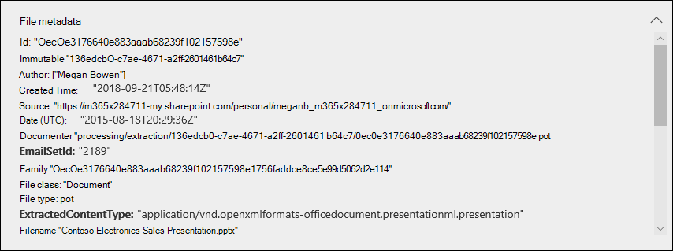
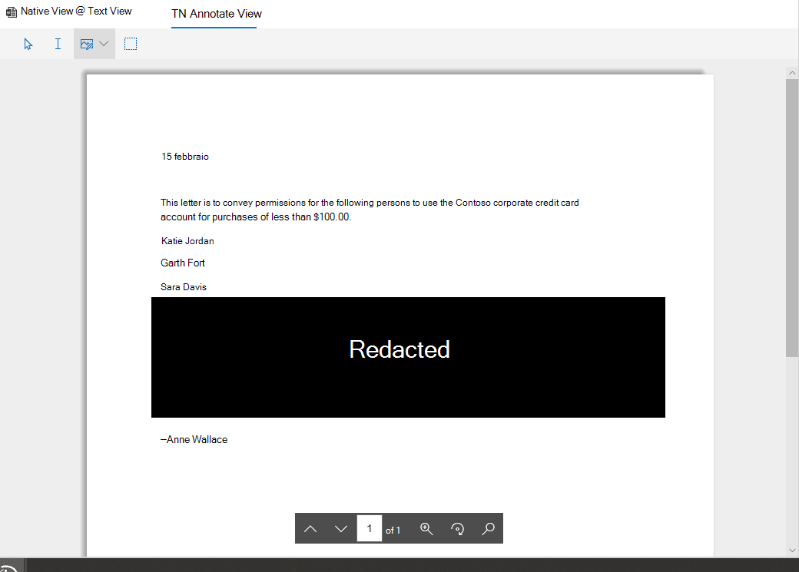

# Esaminare i dati nelle proveReview the data in evidence

I dati di un set di evidenze in un'analisi dei dati sono uno snapshot dei risultati della ricerca raccolti e aggiunti al set di evidenze.The data in an evidence set in a data investigation is a snapshot of the search results that you collected and added to the evidence set. Quando si aggiungono i risultati della ricerca all'evidenza, viene attivato un processo per estrarre file, metadati e testo dagli elementi restituiti dalla ricerca.When you add search results to evidence, a process is triggered to extract files, metadata, and text from the items returned by the search. Successivamente, lo strumento indagini dati (Preview) crea un nuovo indice (tramite un processo denominato *Advanced indicizzazione*) di tutti i dati e aggiunge a un set di evidenze nella scheda **Evidence** .Then the Data Investigations (Preview) tool then builds a new index (by a process called *Advanced indexing*) of all the data and adds to an evidence set on the **Evidence** tab. 

Per le indagini sensibili al tempo, in questo modo è possibile contenere rapidamente l'ambiente eliminando i dati effettivamente versati o dannosi che si trovano nell'origine dati originale, mentre allo stesso tempo è possibile esaminare l'evidenza ricreata in un ambiente in quarantena, che in questo caso è la copia dei dati nel set di evidenze.For time-sensitive investigations, this allows you to quickly contain the environment by deleting the actual spilled or malicious data located in the at original data source, while at the same time allowing you to investigate the re-created evidence in a quarantined environment, which in this case is the data copied to the evidence set). Dopo la raccolta e l'aggiunta dell'evidenza al set di evidenze, è possibile esaminare i singoli documenti nel formato nativo, nel formato di testo o in un formato quasi nativo che è possibile utilizzare per annotare e redigere i documenti.After the evidence is collected and added to the evidence set, you can review individual documents in their native format, text format, or a near-native format that you can use to annotate and redact documents. È inoltre possibile eseguire query per limitare il set di dati in base a intervallo di tempo, tipi di file, proprietari di dati e molte altre proprietà e condizioni di ricerca.Additionally, you can run queries to narrow the data set by time range, file types, data owners, and many other properties and search conditions. Ad esempio, utilizzando le condizioni di autore, mittente o destinatario, è possibile identificare rapidamente le persone coinvolte nell'incidente e se i dati dell'organizzazione sono stati condivisi con utenti esterni.For example, by using the Author, Sender, or Recipient conditions, you can quickly identify the people are involved in the incident and if any data from your organization has been shared with external users. Per ulteriori informazioni sulla ricerca di dati in un set di evidenze, vedere [query the data in evidence](evidence-query.md).For more information about searching through data in an evidence set, see [Query the data in evidence](evidence-query.md).

Per raggruppare i documenti e ottenere assistenza per la revisione, selezionare un set di evidenze nella scheda **Evidence** e quindi fare clic su **Gestisci prova**.To group documents and get more assistance for your review, select an evidence set on the **Evidence** tab, and then click **Manage evidence**. Nel riquadro **analisi** fare clic su **Ricostruisci analisi per l'intero set**.In the **Analytics** tile, click **Rebuild analytics for the whole set**. Verrà eseguito l'analisi avanzata, ad esempio il rilevamento duplicato, il threading di posta elettronica e l'analizzatore dei temi.This will run advanced analytics such as duplicate detection, email threading, and theme analysis. Successivamente, è possibile visualizzare i temi generali dei dati e anche organizzare i documenti tramite thread di posta elettronica, vicino a duplicati e duplicati esatti per facilitare l'indagine.Afterwards, you can see the general themes of the data and also organize documents by email threads, near duplicates, and exact duplicates to help your investigation. Per ulteriori informazioni, vedere [Run Analytics to investigate Faster](run-analytics-to-investigate-faster.md).For more information, see [Run analytics to investigate faster](run-analytics-to-investigate-faster.md).

## Visualizzare i documenti in evidenzaView documents in evidence

Lo strumento di analisi dei dati (Preview) consente di visualizzare il contenuto in diversi visualizzatori, in cui ogni visualizzatore ha uno scopo diverso.The Data Investigations (preview) tool allows you to display content in several different viewers, with each viewer having a different purpose. Questi visualizzatori sono:These viewers are:

- Metadati dei fileFile metadata
- Visualizzazione nativaNative view
- Visualizzazione testoText view
- Visualizzazione annotazioniAnnotate view

Per accedere a uno di questi visualizzatori, è sufficiente selezionare un documento in un set di evidenze.To access any of these viewers, just select a document in an evidence set.

## Metadati dei fileFile metadata

In questa visualizzazione vengono visualizzate varie proprietà dei metadati associate al documento selezionato.This view displays various metadata properties associated with the selected document. È possibile attivare o disattivare questa visualizzazione facendo clic su **metadati file**.You can toggle this view on and off by clicking **File metadata**. Quando si esegue la revisione di un documento, è possibile visualizzare i metadati dei file e comunque cambiarli tra i diversi visualizzatori.When reviewing a document, you can view the file metadata and still change between the different viewers.

Di seguito è riportato un esempio dei metadati di file per un documento.Here's an example of the file metadata for a document. Per ulteriori informazioni sui campi dei metadati, vedere [documento dei campi di metadati nelle indagini sui dati (Preview)](document-metadata-fields.md).For more information about the metadata fields, see [Document metadata fields in Data Investigations (Preview)](document-metadata-fields.md).

## Visualizzazione nativaNative view

Il Visualizzatore nativo Visualizza la visualizzazione più accurata di un documento nel formato nativo.The Native viewer displays the most accurate view of a document in its native format. La visualizzazione nativa è supportata per centinaia di tipi di file ed è destinata a visualizzare i documenti in una delle più vere esperienze native possibili.Native view is supported for hundreds of file types and is meant to display documents in the truest native experience possible. Per i file di Microsoft Office, il Visualizzatore nativo utilizza la versione Web delle app di Office.For Microsoft Office files, the Native viewer uses the web version of Office apps. In questo modo è possibile visualizzare il contenuto, ad esempio i commenti in documenti di Office, formule e righe/colonne nascoste in Excel, e la visualizzazione note in PowerPoint.This allows you to view content such as comments in different Office documents, formulas and hidden rows/columns in Excel, and the Notes view in PowerPoint.

## Visualizzazione testoText view

Il Visualizzatore di testo consente di visualizzare il testo estratto di un file.The Text viewer provides a view of the extracted text of a file. Ignora tutte le immagini e la formattazione incorporate, ma questa visualizzazione è utile se si sta tentando di esaminare e comprendere rapidamente il contenuto di un documento.It ignores any embedded images and formatting, but this view is useful if you're trying to quickly review and understand the content in a document. La visualizzazione del testo include anche queste caratteristiche:Text view also includes these features:

  - Un contatore di linea, che rende più facile fare riferimento a parti specifiche di un documento.A line counter, which makes it easier to reference specific portions of a document.

  - Ricerca hit highlighting che evidenzia i termini del documento e della barra di scorrimentoSearch hit highlighting that highlight terms in the document as well as on the scrollbar

  - Una visualizzazione diff fornisce una visualizzazione di confronto in cui vengono evidenziate le differenze di testo quando si visualizzano i documenti utilizzando il riquadro **quasi duplicati** .A diff view provides a comparison view that highlights the text differences when viewing documents using the **Near duplicates** panel.

**Esempio di contatore di riga e di evidenziazione dei risultati della ricerca in testo e barra di scorrimento****Example of line counter and search hit highlighting in text and scrollbar**

**Esempio di visualizzazione diff****Example of the diff view**

## Visualizzazione annotazioniAnnotate view

La visualizzazione annotazioni fornisce caratteristiche che consentono di applicare il markup su un documento durante il processo di revisione. sono inclusi gli strumenti seguenti:The Annotate view provides features that allow you to apply markup on a document during the review process; this  includes these tools:

  - **Redazioni area** : è possibile disegnare una casella opaca nel documento che nasconde contenuto sensibile.**Area redactions** – You can draw an opaque box on the document that hides sensitive content.

  - **Matita** – è possibile disegnare a mano libera su un documento per attirare l'attenzione su determinate parti del contenuto.**Pencil** – You can free-hand draw on a document to bring attention to certain portions of the content

  - **Seleziona annotazioni** : è possibile selezionare ed eliminare le annotazioni in un documento.**Select annotations** - You can select and delete annotations in a document.

  - **Toggle Transparency Annotation** – è possibile alternare la trasparenza delle annotazioni (tra opaco e semitrasparente) in modo da poter visualizzare il contenuto dietro l'annotazione.**Toggle annotation transparency** – You can toggle the transparency of annotations (between opaque and semi-transparent) so you can view the content behind the annotation. Questo include l'attivazione della trasparenza delle annotazioni e dei redazioni di matite.This includes toggling the transparency of pencil annotations and redactions.

La visualizzazione annotazioni fornisce anche la funzionalità di spostamento seguente:The Annotate view also provides the following navigation functionality:

  - **Pagina precedente**, **pagina successiva**e **passare ai** controlli di spostamento della pagina da utilizzare per i documenti a più pagine.**Previous page**, **Next page**, and **Go to page** - Navigation controls to use for multi-page documents.

  - **Zoom** : aumenta o diminuisce le dimensioni dei documenti nella visualizzazione annotazioni.**Zoom** – Increases or decreases the size of documents in Annotate view.

  - **Ruota** – ruota i documenti in senso orario.**Rotate** – Rotate documents clockwise.

  - **Ricerca** : cercare le parole chiave in un documento e quindi utilizzare i controlli precedenti e successivi per visualizzare i risultati evidenziati all'interno del documento.**Search** – Search for keywords in a document, and then use Previous and Next controls to view the hits (which are highlighted) within the document.

**Esempio di visualizzazione annotazioni****Example of Annotate view**

> [!NOTE]
> Le annotazioni vengono applicate a una copia del documento che è stato aggiunto al set di evidenze.Annotations are applied to a copy of the document that was added to the evidence set. I documenti originali del servizio Live non vengono annotati.The original documents in the live service aren't annotated.
