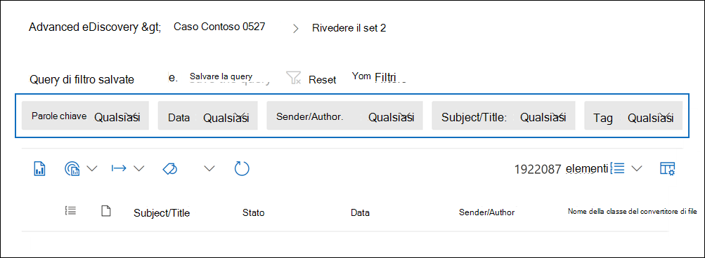
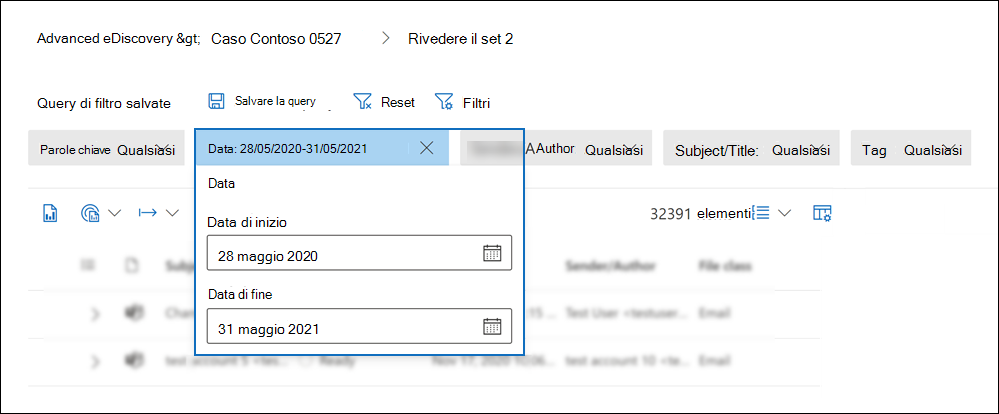
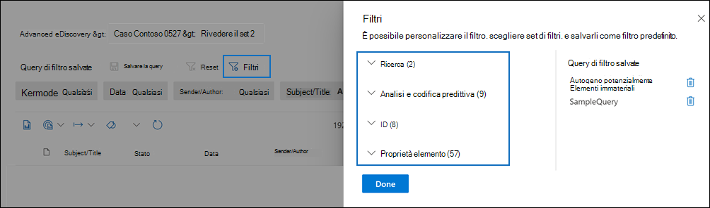
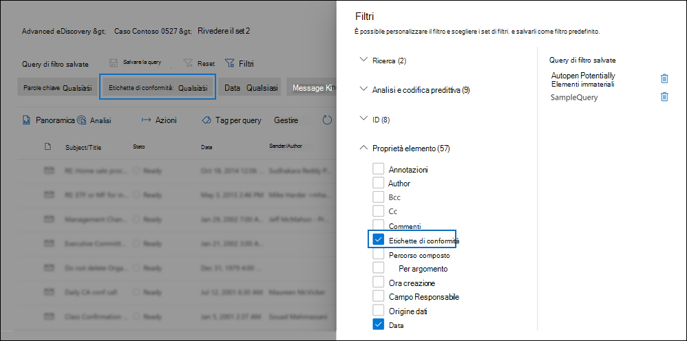
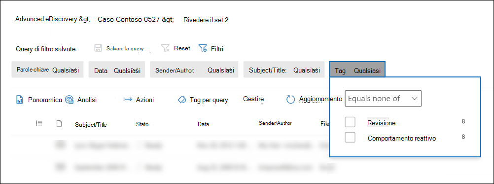
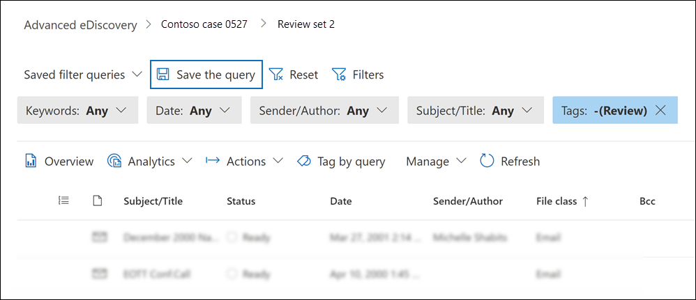
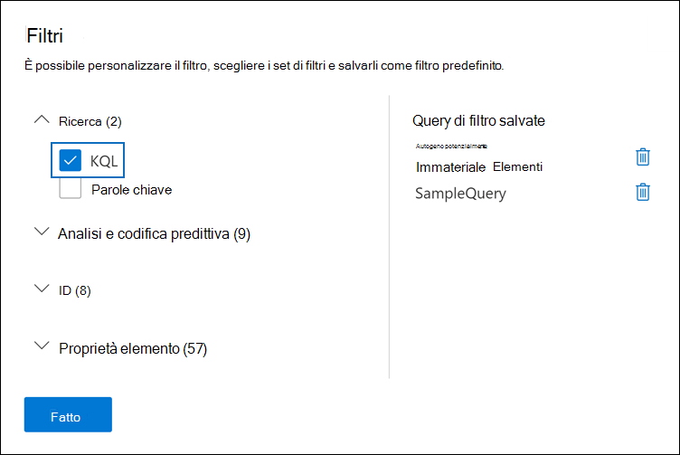
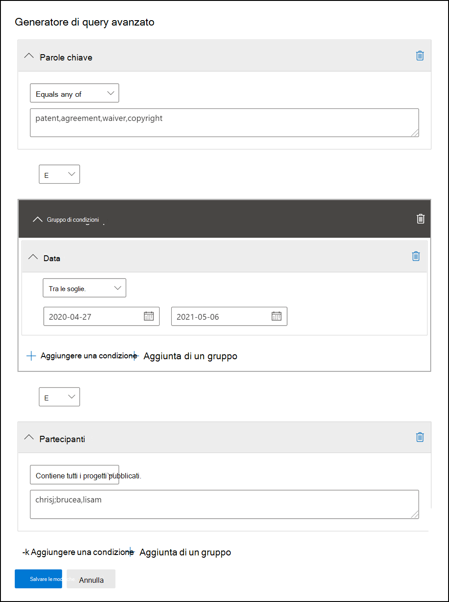

# Eseguire query e filtrare il contenuto in un set di recensioni

Nella maggior parte dei casi, sarà utile approfondire il contenuto di un set di recensioni e organizzarlo per facilitare una revisione più efficiente. L'utilizzo di filtri e query in un set di revisioni consente di concentrarsi su un sottoinsieme di documenti che soddisfano i criteri della revisione.

## Filtri predefiniti

In un set di recensioni sono presenti cinque filtri predefiniti precaricati nel set di recensioni:

- Parole chiave
- Data
- Mittente/Autore
- Oggetto/Titolo
- Tag

Fare clic su ogni filtro per espanderlo e assegnare un valore. Fare clic all'esterno del filtro per applicare automaticamente il filtro al set di revisioni. Lo screenshot seguente mostra il filtro Data configurato per visualizzare i documenti in un intervallo di date.

## Aggiungere o rimuovere filtri

Per aggiungere o rimuovere i filtri visualizzati per il set di recensioni, selezionare **Filtri** per aprire il riquadro dei filtri, visualizzato in una pagina a comparsa. 

I filtri disponibili sono organizzati in quattro sezioni:

- **Ricerca:** filtri che forniscono funzionalità di ricerca diverse.

- **Analisi &** codifica predittiva : Filtri per le proprietà generate e aggiunte ai documenti quando si esegue il processo analitico di document **& tramite posta** elettronica o si utilizzano modelli di codifica predittivi.

- **ID: filtri** per tutte le proprietà ID dei documenti.

- **Proprietà elemento**: Filtri per le proprietà del documento. 

Espandi ogni sezione e seleziona o deseleziona i filtri per aggiungerli o rimuoverli nel set di filtri. Quando si aggiunge un filtro, questo viene visualizzato nel set di filtri. 

> [!NOTE]
> Quando espandi una sezione nel riquadro dei filtri, noterai che sono selezionati i tipi di filtro predefiniti. Puoi mantenerle selezionate o deselezionarle e rimosse dal set di filtri. 

## Tipi di filtro

Ogni campo ricercabile in un set di recensioni dispone di un filtro corrispondente che è possibile utilizzare per filtrare gli elementi in base a un campo specifico.

Esistono più tipi di filtri:

- **Testo libero**: viene applicato un filtro a testo libero ai campi di testo, ad esempio "Subject". È possibile elencare più termini di ricerca separandoli con una virgola.

- **Date**: viene utilizzato un filtro data per i campi data, ad esempio "Data ultima modifica".

- **Opzioni di** ricerca : un filtro delle opzioni di ricerca fornisce un elenco di valori possibili (ogni valore viene visualizzato con una casella di controllo che è possibile selezionare) per campi specifici nella revisione. Questo filtro viene utilizzato per i campi, ad esempio "Sender", in cui è presente un numero limitato di valori possibili nel set di revisione.

- **Parola** chiave: una condizione di parola chiave è un'istanza specifica della condizione a testo libero che è possibile utilizzare per cercare termini. È inoltre possibile utilizzare un linguaggio di query simile a KQL in questo tipo di filtro. Per ulteriori informazioni, vedere le sezioni Linguaggio query e Generatore di query avanzato in questo argomento.

## Includere ed escludere relazioni filtro

È possibile modificare la relazione di inclusione ed esclusione per un determinato filtro. Ad esempio, nel filtro Tag puoi escludere gli elementi contrassegnati  con un tag specifico selezionando Uguale a nessuno nel filtro a discesa. 

## Salvare i filtri come query

Dopo aver soddisfatto i filtri, è possibile salvare la combinazione di filtri come query di filtro. In questo modo è possibile applicare il filtro nelle sessioni di revisione future.

Per salvare un filtro, selezionare **Salva la query e** assegnare un nome. È possibile eseguire query di filtro salvate  in precedenza selezionando l'elenco a discesa Query di filtro salvate e selezionando una query di filtro da applicare per esaminare i documenti impostati. 

Per eliminare una query di filtro, aprire il riquadro dei filtri e selezionare l'icona cestino accanto alla query.

## Linguaggio di query

Oltre a utilizzare i filtri, è anche possibile utilizzare un linguaggio di query simile a KQL nel filtro Parole chiave per creare la query di ricerca del set di recensioni. Il linguaggio di query per le query di set di revisione supporta gli operatori Boolean standard, ad **esempio AND**, **OR**, **NOT** e **NEAR.** Supporta inoltre un carattere jolly a carattere singolo (?) e un carattere jolly a più caratteri (*).

## Generatore di query avanzato

È inoltre possibile creare query più avanzate per cercare documenti in un set di revisioni.

1. Apri il pannello dei filtri, seleziona **Filtri** ed espandi la **sezione** Ricerca.

  

2. Selezionare il **filtro KQL** e fare clic **su Apri generatore di query.**

   In questo pannello è possibile creare query KQL complesse utilizzando il generatore di query. È possibile aggiungere condizioni o gruppi di condizioni che sono costituito da più condizioni connesse logicamente da **relazioni AND** **o OR.**

   
