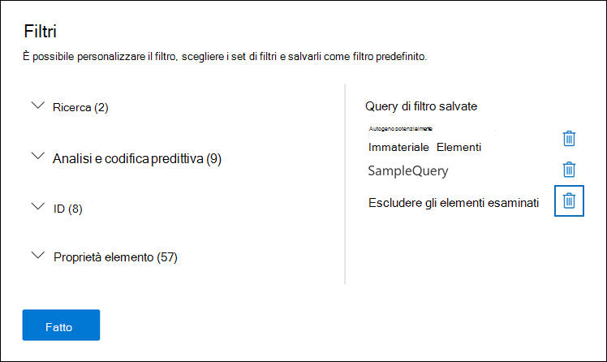

# Query e contenuto del filtro in un insieme da rivedereQuery and filter content in a review set

Nella maggior parte dei casi, sarà utile approfondire il contenuto di un set di recensioni e organizzarlo per facilitare una revisione più efficiente.In most cases, it will be useful to dig deeper into the content in a review set and organize it to facilitate a more efficient review. L'utilizzo di filtri e query in un set di revisioni consente di concentrarsi su un sottoinsieme di documenti che soddisfano i criteri della revisione.Using filters and queries in a review set helps you focus on a subset of documents that meet the criteria of your review.

## Filtri predefinitiDefault filters

In un set di recensioni sono presenti cinque filtri predefiniti precaricati nel set di recensioni:In a review set, there are five default filters that are pre-loaded in the review set:

- Parole chiaveKeywords
- DataDate
- Mittente/AutoreSender/Author
- Oggetto/TitoloSubject/Title
- TagTags

Fare clic su ogni filtro per espanderlo e assegnare un valore.Click each filter to expand it and assign a value. Fare clic all'esterno del filtro per applicare automaticamente il filtro al set di revisioni.Click outside the filter to automatically apply the filter to the review set. Lo screenshot seguente mostra il filtro Data configurato per visualizzare i documenti in un intervallo di date.The following screenshot shows the Date filter configured to show documents within a date range.

## Aggiungere o rimuovere filtriAdd or remove filters

Per aggiungere o rimuovere i filtri visualizzati per il set di recensioni, selezionare **Filtri** per aprire il riquadro dei filtri, visualizzato in una pagina a comparsa.To add or remove filters that are displayed for the review set, select **Filters** to open the filter panel, which is displayed on a flyout page. 

I filtri disponibili sono organizzati in quattro sezioni:The available filters are organized in four sections:

- **Ricerca:** filtri che forniscono funzionalità di ricerca diverse.**Search**: Filters that provide different search capabilities.

- **Analisi &** codifica predittiva : Filtri per le proprietà generate e aggiunte ai documenti quando si esegue il processo analitico di document **& tramite posta** elettronica o si utilizzano modelli di codifica predittivi.**Analytics & predictive coding**: Filters for properties generated and added to documents when you run the **Document & email analytic** job or use predictive coding models.

- **ID: filtri** per tutte le proprietà ID dei documenti.**IDs**: Filters for all ID properties of documents.

- **Proprietà elemento**: Filtri per le proprietà del documento.**Item properties**: Filters for document properties. 

Espandi ogni sezione e seleziona o deseleziona i filtri per aggiungerli o rimuoverli nel set di filtri.Expand each section and select or deselect filters to add or remove them in the filter set. Quando si aggiunge un filtro, questo viene visualizzato nel set di filtri.When you add a filter, it's displayed in the filter set. 

> [!NOTE]
> Quando espandi una sezione nel riquadro dei filtri, noterai che sono selezionati i tipi di filtro predefiniti.When you expand a section in the filter panel, you'll notice that the default filter types are selected. Puoi mantenerle selezionate o deselezionarle e rimosse dal set di filtri.You can keep these selected or deselect them and removed them from the filter set. 

## Tipi di filtroFilter types

Ogni campo ricercabile in un set di recensioni dispone di un filtro corrispondente che è possibile utilizzare per filtrare gli elementi in base a un campo specifico.Every searchable field in a review set has a corresponding filter that you can use for filter items based on a specific field.

Esistono più tipi di filtri:There are multiple types of filters:

- **Testo libero**: viene applicato un filtro a testo libero ai campi di testo, ad esempio "Subject".**Freetext**: A freetext filter is applied to text fields such as "Subject". È possibile elencare più termini di ricerca separandoli con una virgola.You can list multiple search terms by separating them with a comma.

- **Date**: viene utilizzato un filtro data per i campi data, ad esempio "Data ultima modifica".**Date**: A date filter is used for date fields such as "Last modified date".

- **Opzioni di** ricerca : un filtro delle opzioni di ricerca fornisce un elenco di valori possibili (ogni valore viene visualizzato con una casella di controllo che è possibile selezionare) per campi specifici nella revisione.**Search options**: A search options filter provides a list of possible values (each value is displayed with a checkbox that you can select) for particular fields in the review. Questo filtro viene utilizzato per i campi, ad esempio "Sender", in cui è presente un numero limitato di valori possibili nel set di revisione.This filter is used for fields, such as "Sender", where there is a finite number of possible values in the review set.

- **Parola** chiave: una condizione di parola chiave è un'istanza specifica della condizione a testo libero che è possibile utilizzare per cercare termini.**Keyword**: A keyword condition is a specific instance of freetext condition that you can use to search for terms. È inoltre possibile utilizzare un linguaggio di query simile a KQL in questo tipo di filtro.You can also use KQL-like query language in this type of filter. Per ulteriori informazioni, vedere le sezioni Linguaggio query e Generatore di query avanzato in questo argomento.For more information, see the Query language and Advanced query builder sections in this topic.

## Includere ed escludere relazioni filtroInclude and exclude filter relationships

È possibile modificare la relazione di inclusione ed esclusione per un determinato filtro.You have the option to change the include and exclude relationship for a particular filter. Ad esempio, nel filtro Tag puoi escludere gli elementi contrassegnati  con un tag specifico selezionando Uguale a nessuno nel filtro a discesa.For example, in the Tag filter, you can exclude items that are tagged with a particular tag by selecting **Equals none of** in the dropdown filter. 

## Salvare i filtri come querySave filters as queries

Dopo aver soddisfatto i filtri, è possibile salvare la combinazione di filtri come query di filtro.After you are satisfied with your filters, you can save the filter combination as a filter query. In questo modo è possibile applicare il filtro nelle sessioni di revisione future.This lets you apply the filter in the future review sessions.

Per salvare un filtro, selezionare **Salva la query e** assegnare un nome.To save a filter, select **Save the query** and name it. È possibile eseguire query di filtro salvate  in precedenza selezionando l'elenco a discesa Query di filtro salvate e selezionando una query di filtro da applicare per esaminare i documenti impostati.You or other reviewers can run previously saved filter queries by selecting the **Saved filter queries** dropdown and selecting a filter query to apply to review set documents. 

Per eliminare una query di filtro, aprire il riquadro dei filtri e selezionare l'icona cestino accanto alla query.To delete a filter query, open the filter panel and select the trashcan icon next to the query.

## Linguaggio di queryQuery language

Oltre a utilizzare i filtri, è anche possibile utilizzare un linguaggio di query simile a KQL nel filtro Parole chiave per creare la query di ricerca del set di recensioni.In addition to using filters, you can also use a KQL-like query language in the Keywords filter to build your review set search query. Il linguaggio di query per le query di set di revisione supporta gli operatori Boolean standard, ad **esempio AND**, **OR**, **NOT** e **NEAR.**The query language for review set queries supports standard Boolean operators, such as **AND**, **OR**, **NOT**, and **NEAR**. Supporta inoltre un carattere jolly a carattere singolo (?) e un carattere jolly a più caratteri (\*).It also supports a single-character wildcard (?) and a multi-character wildcard (\*).

## Generatore di query avanzatoAdvanced query builder

È inoltre possibile creare query più avanzate per cercare documenti in un set di revisioni.You can also build more advanced queries to search for documents in a review set.

1. Apri il pannello dei filtri, seleziona **Filtri** ed espandi la **sezione** Ricerca.Open the filter panel, select **Filters**, and expand the **Search** section.

  

2. Selezionare il **filtro KQL** e fare clic **su Apri generatore di query.**Select the **KQL** filter and click **Open query builder**.

   In questo pannello è possibile creare query KQL complesse utilizzando il generatore di query.In this panel, you can create complex KQL queries by using the query builder. È possibile aggiungere condizioni o gruppi di condizioni che sono costituito da più condizioni connesse logicamente da **relazioni AND** **o OR.**You can add conditions or add condition groups that are made up of multiple conditions that are logically connected by **AND** or **OR** relationships.

   
