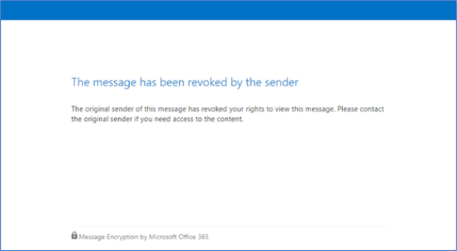

# <a name="revoke-email-encrypted-by-advanced-message-encryption"></a><span data-ttu-id="9bc21-103">Revoca della posta elettronica crittografata tramite crittografia avanzata dei messaggi</span><span class="sxs-lookup"><span data-stu-id="9bc21-103">Revoke email encrypted by Advanced Message Encryption</span></span>

<span data-ttu-id="9bc21-104">La revoca del messaggio di posta elettronica viene offerta come parte della crittografia avanzata dei messaggi di Office 365.</span><span class="sxs-lookup"><span data-stu-id="9bc21-104">Email revocation is offered as part of Office 365 Advanced Message Encryption.</span></span> <span data-ttu-id="9bc21-105">La crittografia avanzata dei messaggi di Office 365 è inclusa in [microsoft 365 Enterprise E5](https://www.microsoft.com/microsoft-365/enterprise/home), Office 365 E5, Microsoft 365 E5 (nonprofit staff pricing), Office 365 Enterprise E5 (nonprofit staff pricing) e Office 365 Education a5.</span><span class="sxs-lookup"><span data-stu-id="9bc21-105">Office 365 Advanced Message Encryption is included in [Microsoft 365 Enterprise E5](https://www.microsoft.com/microsoft-365/enterprise/home), Office 365 E5, Microsoft 365 E5 (Nonprofit Staff Pricing), Office 365 Enterprise E5 (Nonprofit Staff Pricing), and Office 365 Education A5.</span></span> <span data-ttu-id="9bc21-106">Se l'organizzazione dispone di un abbonamento che non include la crittografia dei messaggi avanzata di Office 365, è possibile acquistarla con il componente aggiuntivo SKU Microsoft 365 E5 Compliance per Microsoft 365 E3, Microsoft 365 E3 (nonprofit staff pricing) o il componente aggiuntivo Office 365 Advanced Compliance SKU per Microsoft 365 E3, Microsoft 365 E3 (nonprofit staff pricing) o Office 365 SKU.</span><span class="sxs-lookup"><span data-stu-id="9bc21-106">If your organization has a subscription that does not include Office 365 Advanced Message Encryption, you can purchase it with the Microsoft 365 E5 Compliance SKU add-on for Microsoft 365 E3, Microsoft 365 E3 (Nonprofit Staff Pricing), or the Office 365 Advanced Compliance SKU add-on for Microsoft 365 E3, Microsoft 365 E3 (Nonprofit Staff Pricing), or Office 365 SKUs.</span></span>

<span data-ttu-id="9bc21-107">Questo articolo fa parte di una serie più ampia di articoli sulla [crittografia dei messaggi di Office 365](ome.md).</span><span class="sxs-lookup"><span data-stu-id="9bc21-107">This article is part of a larger series of articles about [Office 365 Message Encryption](ome.md).</span></span>

<span data-ttu-id="9bc21-108">Se un messaggio è stato crittografato utilizzando la crittografia avanzata dei messaggi di Office 365 e si è un amministratore di Microsoft 365, è possibile revocare il messaggio in determinate condizioni.</span><span class="sxs-lookup"><span data-stu-id="9bc21-108">If a message was encrypted using Office 365 Advanced Message Encryption, and you are a Microsoft 365 admin, you can revoke the message under certain conditions.</span></span> <span data-ttu-id="9bc21-109">In questo articolo vengono descritte le circostanze in cui la revoca è possibile e come procedere.</span><span class="sxs-lookup"><span data-stu-id="9bc21-109">This article describes the circumstances under which revocation is possible and how to do it.</span></span>
  
## <a name="encrypted-emails-that-you-can-revoke"></a><span data-ttu-id="9bc21-110">Messaggi di posta elettronica crittografati che è possibile revocare</span><span class="sxs-lookup"><span data-stu-id="9bc21-110">Encrypted emails that you can revoke</span></span>

<span data-ttu-id="9bc21-111">È possibile revocare i messaggi di posta elettronica crittografati se il destinatario ha ricevuto una e-mail crittografata basata sul collegamento.</span><span class="sxs-lookup"><span data-stu-id="9bc21-111">You can revoke encrypted emails if the recipient received a link-based, branded encrypted email.</span></span> <span data-ttu-id="9bc21-112">Se il destinatario ha ricevuto un'esperienza nativa in linea in un client di Outlook supportato, non è possibile revocarli.</span><span class="sxs-lookup"><span data-stu-id="9bc21-112">If the recipient received a native inline experience in a supported Outlook client, then you can't revoke those.</span></span>

<span data-ttu-id="9bc21-113">Se un destinatario riceve un'esperienza basata sul collegamento o un'esperienza in linea dipende dal tipo di identità del destinatario: Office 365 e destinatari dell'account Microsoft (ad esempio, gli utenti di outlook.com) ricevono un'esperienza in linea nei client Outlook supportati.</span><span class="sxs-lookup"><span data-stu-id="9bc21-113">Whether a recipient receives a link-based experience or an inline experience depends on the recipient identity type: Office 365 and Microsoft account recipients (for example, outlook.com users) get an inline experience in supported Outlook clients.</span></span> <span data-ttu-id="9bc21-114">Tutti gli altri tipi di destinatari, ad esempio i destinatari Gmail, ricevono un'esperienza basata sul collegamento.</span><span class="sxs-lookup"><span data-stu-id="9bc21-114">All other recipient types, such as Gmail recipients, get a link-based experience.</span></span>

## <a name="recipient-experience-for-revoked-encrypted-emails"></a><span data-ttu-id="9bc21-115">Esperienza dei destinatari per i messaggi di posta elettronica crittografati</span><span class="sxs-lookup"><span data-stu-id="9bc21-115">Recipient experience for revoked encrypted emails</span></span>

<span data-ttu-id="9bc21-116">Dopo che un messaggio di posta elettronica è stato revocato, il destinatario riceve un errore quando accede alla posta elettronica crittografata tramite il portale di crittografia dei messaggi di Office 365: "il messaggio è stato revocato dal mittente".</span><span class="sxs-lookup"><span data-stu-id="9bc21-116">Once an email has been revoked, the recipient receives an error when they access the encrypted email through the Office 365 Message Encryption portal: "The message has been revoked by the sender".</span></span>



## <a name="how-to-revoke-an-encrypted-email"></a><span data-ttu-id="9bc21-118">Come revocare un messaggio di posta elettronica crittografato</span><span class="sxs-lookup"><span data-stu-id="9bc21-118">How to revoke an encrypted email</span></span>

<span data-ttu-id="9bc21-119">Gli amministratori di Microsoft 365 seguono queste procedure generali per revocare un messaggio di posta elettronica crittografato idoneo:</span><span class="sxs-lookup"><span data-stu-id="9bc21-119">Microsoft 365 administrators follow these general steps to revoke an eligible encrypted email:</span></span>

- <span data-ttu-id="9bc21-120">Ottenere l'ID del messaggio di posta elettronica.</span><span class="sxs-lookup"><span data-stu-id="9bc21-120">Get the Message ID of the email.</span></span>
- <span data-ttu-id="9bc21-121">Verificare che sia possibile revocare il messaggio.</span><span class="sxs-lookup"><span data-stu-id="9bc21-121">Verify that you can revoke the message.</span></span>
- <span data-ttu-id="9bc21-122">Revocare la posta.</span><span class="sxs-lookup"><span data-stu-id="9bc21-122">Revoke the mail.</span></span>

<span data-ttu-id="9bc21-123">Continuare a leggere istruzioni dettagliate per ogni passaggio del processo di revoca.</span><span class="sxs-lookup"><span data-stu-id="9bc21-123">Keep reading for in-depth instructions for each step in the revocation process.</span></span>

### <a name="step-1-obtain-the-message-id-of-the-email"></a><span data-ttu-id="9bc21-124">Passaggio 1.</span><span class="sxs-lookup"><span data-stu-id="9bc21-124">Step 1.</span></span> <span data-ttu-id="9bc21-125">Ottenere l'ID del messaggio di posta elettronica</span><span class="sxs-lookup"><span data-stu-id="9bc21-125">Obtain the Message ID of the email</span></span>

<span data-ttu-id="9bc21-126">Prima di poter revocare una posta crittografata, raccogliere l'ID del messaggio di posta elettronica.</span><span class="sxs-lookup"><span data-stu-id="9bc21-126">Before you can revoke an encrypted mail, gather the Message ID of the mail.</span></span> <span data-ttu-id="9bc21-127">Il MessageId è in genere del formato seguente:</span><span class="sxs-lookup"><span data-stu-id="9bc21-127">The MessageId is usually of the format:</span></span>

`<xxxxxxxxxxxxxxxxxxxxxxx@xxxxxx.xxxx.prod.outlook.com>`  

<span data-ttu-id="9bc21-128">Sono disponibili diversi modi per individuare l'ID del messaggio di posta elettronica che si desidera revocare.</span><span class="sxs-lookup"><span data-stu-id="9bc21-128">There are multiple ways to find the Message ID of the email that you want to revoke.</span></span> <span data-ttu-id="9bc21-129">In questa sezione vengono descritte alcune opzioni, ma è possibile utilizzare qualsiasi metodo che fornisca l'ID.</span><span class="sxs-lookup"><span data-stu-id="9bc21-129">This section describes a couple of options, but you can use any method that provides the ID.</span></span>

#### <a name="to-identify-the-message-id-of-the-email-you-want-to-revoke-by-using-message-trace-in-the-security-amp-compliance-center"></a><span data-ttu-id="9bc21-130">Per identificare l'ID del messaggio di posta elettronica che si desidera revocare tramite la traccia dei messaggi nel &amp; Centro sicurezza e conformità</span><span class="sxs-lookup"><span data-stu-id="9bc21-130">To identify the Message ID of the email you want to revoke by using Message Trace in the Security &amp; Compliance Center</span></span>

1. <span data-ttu-id="9bc21-131">Cercare il messaggio di posta elettronica dal mittente o dal destinatario utilizzando la [nuova traccia dei messaggi nel centro sicurezza & conformità](https://blogs.technet.microsoft.com/exchange/2018/05/02/new-message-trace-in-office-365-security-compliance-center/).</span><span class="sxs-lookup"><span data-stu-id="9bc21-131">Search for the email by sender or recipient using [New Message Trace in Security & Compliance Center](https://blogs.technet.microsoft.com/exchange/2018/05/02/new-message-trace-in-office-365-security-compliance-center/).</span></span>

2. <span data-ttu-id="9bc21-132">Dopo aver individuato il messaggio di posta elettronica, selezionarlo per visualizzare il riquadro **Dettagli traccia dei messaggi** .</span><span class="sxs-lookup"><span data-stu-id="9bc21-132">Once you've located the email, select it to bring up the **Message trace details** pane.</span></span> <span data-ttu-id="9bc21-133">Espandere **ulteriori informazioni** per individuare l'ID del messaggio.</span><span class="sxs-lookup"><span data-stu-id="9bc21-133">Expand **More Information** to locate the Message ID.</span></span>

#### <a name="to-identify-the-message-id-of-the-email-you-want-to-revoke-by-using-office-message-encryption-reports-in-the-security-amp-compliance-center"></a><span data-ttu-id="9bc21-134">Per identificare l'ID del messaggio di posta elettronica che si desidera revocare utilizzando i rapporti di crittografia dei messaggi di &amp; Office nel centro sicurezza e conformità</span><span class="sxs-lookup"><span data-stu-id="9bc21-134">To identify the Message ID of the email you want to revoke by using Office Message Encryption reports in the Security &amp; Compliance Center</span></span>

1. <span data-ttu-id="9bc21-135">Nel centro sicurezza &amp; e conformità, passare al **rapporto di crittografia dei messaggi**.</span><span class="sxs-lookup"><span data-stu-id="9bc21-135">In the Security &amp; Compliance Center, navigate to the **Message encryption report**.</span></span> <span data-ttu-id="9bc21-136">Per informazioni su questo report, vedere [visualizzare i report di sicurezza della posta &amp; elettronica nel centro sicurezza e conformità](../security/office-365-security/view-email-security-reports.md).</span><span class="sxs-lookup"><span data-stu-id="9bc21-136">For information on this report, see [View email security reports in the Security &amp; Compliance Center](../security/office-365-security/view-email-security-reports.md).</span></span>

2. <span data-ttu-id="9bc21-137">Scegliere la tabella **Visualizza dettagli** e identificare il messaggio che si desidera revocare.</span><span class="sxs-lookup"><span data-stu-id="9bc21-137">Choose the **View details** table and identify the message that you want to revoke.</span></span>

3. <span data-ttu-id="9bc21-138">Fare doppio clic sul messaggio per visualizzare i dettagli che includono l'ID del messaggio.</span><span class="sxs-lookup"><span data-stu-id="9bc21-138">Double-click the message to view details that include the Message ID.</span></span>

### <a name="step-2-verify-that-the-mail-is-revocable"></a><span data-ttu-id="9bc21-139">Passaggio 2.</span><span class="sxs-lookup"><span data-stu-id="9bc21-139">Step 2.</span></span> <span data-ttu-id="9bc21-140">Verificare che la posta sia revocabile</span><span class="sxs-lookup"><span data-stu-id="9bc21-140">Verify that the mail is revocable</span></span>

<span data-ttu-id="9bc21-141">Per verificare se è possibile revocare un messaggio, controllare se il campo stato revoca è visibile nel rapporto di crittografia, nella tabella **Details** del Centro sicurezza &amp; e conformità.</span><span class="sxs-lookup"><span data-stu-id="9bc21-141">To verify whether you can revoke a message, check whether the Revocation Status field is visible in the Encryption report, in the **Details** table in the Security &amp; Compliance Center.</span></span>

<span data-ttu-id="9bc21-142">Per verificare se è possibile revocare un messaggio di posta elettronica specifico utilizzando Windows PowerShell, eseguire la procedura seguente.</span><span class="sxs-lookup"><span data-stu-id="9bc21-142">To verify whether you can revoke a particular email message by using Windows PowerShell, complete these steps.</span></span>

1. <span data-ttu-id="9bc21-143">Utilizzo di un account aziendale o dell'Istituto di istruzione con autorizzazioni di amministratore globale nell'organizzazione, avviare una sessione di Windows PowerShell e connettersi a Exchange Online.</span><span class="sxs-lookup"><span data-stu-id="9bc21-143">Using a work or school account that has global administrator permissions in your organization, start a Windows PowerShell session and connect to Exchange Online.</span></span> <span data-ttu-id="9bc21-144">Per istruzioni, vedere [Connettersi a PowerShell di Exchange Online](https://aka.ms/exopowershell).</span><span class="sxs-lookup"><span data-stu-id="9bc21-144">For instructions, see [Connect to Exchange Online PowerShell](https://aka.ms/exopowershell).</span></span>

2. <span data-ttu-id="9bc21-145">Eseguire il cmdlet Get-OMEMessageStatus nel modo seguente:</span><span class="sxs-lookup"><span data-stu-id="9bc21-145">Run the Get-OMEMessageStatus cmdlet as follows:</span></span>

     ```powershell
     Get-OMEMessageStatus -MessageId "<message id>" | ft -a  Subject, IsRevocable
     ```

   <span data-ttu-id="9bc21-146">Questo comando restituisce l'oggetto del messaggio e indica se il messaggio è revocabile.</span><span class="sxs-lookup"><span data-stu-id="9bc21-146">This command returns the subject of the message and whether the message is revocable.</span></span> <span data-ttu-id="9bc21-147">For example,</span><span class="sxs-lookup"><span data-stu-id="9bc21-147">For example,</span></span>

     ```text
     Subject        IsRevocable
     -------        -----------
     "Test message" True
     ```

### <a name="step-3-revoke-the-mail"></a><span data-ttu-id="9bc21-148">Passaggio 3:</span><span class="sxs-lookup"><span data-stu-id="9bc21-148">Step 3.</span></span> <span data-ttu-id="9bc21-149">Revocare la posta elettronica</span><span class="sxs-lookup"><span data-stu-id="9bc21-149">Revoke the mail</span></span>

<span data-ttu-id="9bc21-150">Una volta che si conosce l'ID del messaggio di posta elettronica che si desidera revocare ed è stato verificato che il messaggio è revocabile, è possibile revocare la posta &amp; elettronica utilizzando il Centro sicurezza e conformità di Windows PowerShell.</span><span class="sxs-lookup"><span data-stu-id="9bc21-150">Once you know the Message ID of the email you want to revoke, and you have verified that the message is revocable, you can revoke the email using the Security &amp; Compliance Center or Windows PowerShell.</span></span>

<span data-ttu-id="9bc21-151">Per revocare il messaggio utilizzando il centro &amp; sicurezza e conformità</span><span class="sxs-lookup"><span data-stu-id="9bc21-151">To revoke the message using the Security &amp; Compliance Center</span></span>

1. <span data-ttu-id="9bc21-152">Se si utilizza un account aziendale o dell'Istituto di istruzione con autorizzazioni di amministratore globale nell'organizzazione, connettersi al centro sicurezza & Compliance.</span><span class="sxs-lookup"><span data-stu-id="9bc21-152">Using a work or school account that has global administrator permissions in your organization, connect to the Security & Compliance Center.</span></span>

2. <span data-ttu-id="9bc21-153">Nel **rapporto di crittografia**, nella tabella **Details** del messaggio, scegliere **revoca messaggio**.</span><span class="sxs-lookup"><span data-stu-id="9bc21-153">In the **Encryption report**, in the **Details** table for the message, choose **Revoke message**.</span></span>

<span data-ttu-id="9bc21-154">Per revocare un messaggio di posta elettronica utilizzando Windows PowerShell, utilizzare il cmdlet Set-OMEMessageRevocation.</span><span class="sxs-lookup"><span data-stu-id="9bc21-154">To revoke an email by using Windows PowerShell, use the Set-OMEMessageRevocation cmdlet.</span></span>

1. <span data-ttu-id="9bc21-155">Se si utilizza un account aziendale o dell'Istituto di istruzione con autorizzazioni di amministratore globale nell'organizzazione, [connettersi a PowerShell di Exchange Online](https://aka.ms/exopowershell).</span><span class="sxs-lookup"><span data-stu-id="9bc21-155">Using a work or school account that has global administrator permissions in your organization, [Connect to Exchange Online PowerShell](https://aka.ms/exopowershell).</span></span>

2. <span data-ttu-id="9bc21-156">Eseguire il cmdlet Set-OMEMessageRevocation come indicato di seguito:</span><span class="sxs-lookup"><span data-stu-id="9bc21-156">Run the Set-OMEMessageRevocation cmdlet as follows:</span></span>

    ```powershell
    Set-OMEMessageRevocation -Revoke $true -MessageId "<messageId>"
    ```

3. <span data-ttu-id="9bc21-157">Per verificare se il messaggio di posta elettronica è stato revocato, eseguire il cmdlet Get-OMEMessageStatus come indicato di seguito:</span><span class="sxs-lookup"><span data-stu-id="9bc21-157">To check whether the email was revoked, run the Get-OMEMessageStatus cmdlet as follows:</span></span>

    ```powershell
    Get-OMEMessageStatus -MessageId "<messageId>" | ft -a  Subject, Revoked
    ```

    <span data-ttu-id="9bc21-158">Se la revoca ha avuto esito positivo, il cmdlet restituisce il risultato seguente:</span><span class="sxs-lookup"><span data-stu-id="9bc21-158">If revocation was successful, the cmdlet returns the following result:</span></span>  

     ```text
     Revoked: True
     ```

## <a name="more-information-about-office-365-advanced-message-encryption"></a><span data-ttu-id="9bc21-159">Ulteriori informazioni sulla crittografia avanzata dei messaggi di Office 365</span><span class="sxs-lookup"><span data-stu-id="9bc21-159">More information about Office 365 Advanced Message Encryption</span></span>

- [<span data-ttu-id="9bc21-160">Office 365 Advanced Message Encryption</span><span class="sxs-lookup"><span data-stu-id="9bc21-160">Office 365 Advanced Message Encryption</span></span>](ome-advanced-message-encryption.md)

- [<span data-ttu-id="9bc21-161">Crittografia messaggi avanzata di Office 365-scadenza del messaggio di posta elettronica</span><span class="sxs-lookup"><span data-stu-id="9bc21-161">Office 365 Advanced Message Encryption - email expiration</span></span>](ome-advanced-expiration.md)

- [<span data-ttu-id="9bc21-162">Descrizione del servizio criteri di conformità e del messaggio</span><span class="sxs-lookup"><span data-stu-id="9bc21-162">Message policy and compliance service description</span></span>](https://docs.microsoft.com/office365/servicedescriptions/exchange-online-service-description/message-policy-and-compliance)
