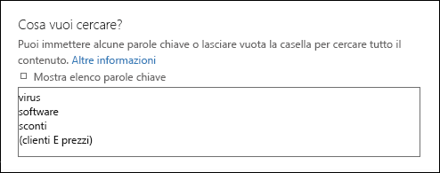
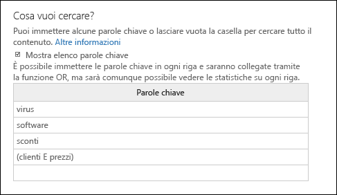
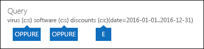

# <a name="run-a-content-search-in-the-security--compliance-center"></a>Eseguire una ricerca contenuto nel Centro sicurezza e conformità

È possibile utilizzare lo strumento eDiscovery ricerca contenuto nel centro sicurezza & Compliance per cercare elementi quali messaggi di posta elettronica, documenti e conversazioni di messaggistica istantanea nell'organizzazione di Office 365. Usare questo strumento per cercare elementi in questi servizi di Office 365:
  
- Cassette postali e cartelle pubbliche in Exchange Online
    
- Siti di SharePoint Online e OneDrive for business
    
- Conversazioni Skype for Business
    
- Microsoft Teams 
    
- Gruppi di Office 365
    
Ricerca contenuto è un nuovo strumento di ricerca di eDiscovery con nuove funzionalità migliorate di scalabilità e prestazioni. Utilizzare Ricerca contenuto per eseguire ricerche di eDiscovery di grandi dimensioni. È possibile eseguire una ricerca in tutte le cassette postali, tutte le cartelle pubbliche di Exchange e tutti i siti di SharePoint Online e gli account di OneDrive for business in una singola ricerca contenuto. Non sono previsti limiti per il numero di posizioni di contenuto che è possibile ricercare. Non esistono inoltre limiti al numero di ricerche che è possibile eseguire contemporaneamente. Dopo aver eseguito una ricerca contenuto, il numero di posizioni di contenuto e il numero stimato di risultati della ricerca vengono visualizzati nel riquadro dei dettagli nella pagina **Ricerca contenuto** . Dopo aver eseguito una ricerca, è possibile visualizzare in anteprima i risultati, ottenere statistiche delle parole chiave per una o più ricerche, modificare in blocco le ricerche dei contenuti ed esportare i risultati in un computer locale. 
  
 **Sommario**
  
[Create a search](run-a-content-search-in-the-security-and-compliance-center.md#create)
  
[Esportare i risultati della ricerca](run-a-content-search-in-the-security-and-compliance-center.md#export)
  
[Preview search results](run-a-content-search-in-the-security-and-compliance-center.md#preview)
  
[Update search results](run-a-content-search-in-the-security-and-compliance-center.md#restart)
  
[Edit a search](run-a-content-search-in-the-security-and-compliance-center.md#edit)
  
[Retry a search](run-a-content-search-in-the-security-and-compliance-center.md#retry)
  

  
## <a name="before-you-begin"></a>Prima di iniziare

- Per informazioni e istruzioni sulla creazione di query di ricerca e sull'utilizzo di operatori di ricerca booleani, vedere [keyword query and Search Conditions for content search](keyword-queries-and-search-conditions.md). In questo articolo sono inoltre disponibili informazioni sulla ricerca di tipi di informazioni riservate e sulla ricerca di contenuto condiviso con persone all'interno e all'esterno dell'organizzazione.
    
- Per accedere alla pagina **Ricerca contenuto** per eseguire ricerche e visualizzare in anteprima ed esportare i risultati della ricerca, un amministratore, un responsabile della conformità o un Manager di eDiscovery deve essere membro del gruppo di ruoli Gestione eDiscovery nel centro sicurezza & Compliance. Non è necessario assegnare altre autorizzazioni di ricerca in Exchange Online, SharePoint Online o per i siti di OneDrive for business. Per ulteriori informazioni, vedere [assegnare le autorizzazioni di eDiscovery nel centro sicurezza & conformità di Office 365](assign-ediscovery-permissions.md).
    
- Sono stati applicati limiti alla ricerca contenuto per mantenere l'integrità e la qualità dei servizi forniti alle organizzazioni di Office 365. Nella maggior parte dei casi, non è possibile modificare questi limiti, ma è necessario conoscerli in modo da tenerli in considerazione durante la pianificazione, l'esecuzione e la risoluzione dei problemi delle ricerche. Per ulteriori informazioni, vedere [limits for Search in the Security & Compliance Center](limits-for-content-search.md).
    
- Vedere la sezione relativa ai tempi di ricerca stimati in base al numero di cassette postali che vengono cercate in una singola ricerca di contenuto. 
    
- Come indicato in precedenza, è possibile utilizzare la ricerca contenuto per cercare contenuto nei gruppi di Office 365 e Microsoft teams. Questo significa che è possibile eseguire una ricerca nella cassetta postale del gruppo, nel calendario condiviso e nei siti di SharePoint associati a un gruppo di Office 365 e a un team Microsoft. Inoltre, è possibile eseguire una ricerca nelle conversazioni dei canali in un team di Microsoft. Per informazioni sui gruppi di Office 365 e Microsoft teams, vedere:
    
  - [Informazioni sui gruppi di Office 365](https://support.office.com/article/b565caa1-5c40-40ef-9915-60fdb2d97fa2)
    
  - [Guida di Microsoft Teams](https://support.office.com/article/23156c0c-2c6e-49dd-8b7b-7c564b76508c)
    
    Vedere la sezione Suggerimenti per la ricerca di contenuto nei gruppi di Office 365 e Microsoft teams. 
    
[Inizio pagina](run-a-content-search-in-the-security-and-compliance-center.md#top)
  
## <a name="create-a-search"></a>Creare una ricerca
<a name="create"> </a>

1. Passare a [https://protection.office.com](https://protection.office.com).
    
2. Accedere a Office 365 usando l'account aziendale o dell'istituto di istruzione.
    
3. Nel riquadro sinistro del Centro sicurezza & conformità fare clic su ricerca **** \> **contenuto**ricerca.
    
4. Fare clic su **Nuovo**.
    
5. Nella pagina **Nuova ricerca**, digitare un nome relativo alla ricerca contenuto. Questo nome deve essere univoco nell'organizzazione. 
    
6. Scegliere i percorsi di contenuto di cui si desidera eseguire la ricerca. È possibile cercare le cassette postali, i siti e le cartelle pubbliche nella stessa ricerca.
    
    
  
1. **Cerca ovunque** Selezionare questa opzione per eseguire la ricerca in tutti i percorsi di contenuto dell'organizzazione. Quando si seleziona questa opzione, è possibile scegliere di effettuare una ricerca in tutte le cassette postali (incluse le cassette postali inattive e le cassette postali per tutti i gruppi di Office 365 e Microsoft Teams), tutti i siti di SharePoint e OneDrive for business (inclusi i siti per tutti i gruppi di Office 365 e Microsoft Teams) e tutte le cartelle pubbliche.
    
    
  
2. **Selezione percorso personalizzato** Selezionare questa opzione per selezionare le cassette postali e i siti in cui si desidera eseguire la ricerca. Se si sceglie questa opzione, si ha la possibilità di eseguire una ricerca in tutti i percorsi di contenuto per un servizio specifico, ad esempio per cercare tutte le cassette postali di Exchange, oppure è possibile cercare percorsi di contenuto specifici per un servizio di Office 365.
    
    Quando si aggiungono percorsi di contenuto per la ricerca, tenere presente quanto segue:
    
    **Cassette postali**
    
  - Quando si fa **** icona per specificare le cassette postali da cercare, lo strumento di selezione delle cassette postali visualizzato è vuoto. Si tratta di un'impostazione predefinita per migliorare le prestazioni. Per aggiungere destinatari all'elenco, digitare un nome, almeno 3 caratteri, nella casella di ricerca **e fare clic**ricerca ricerca.
    
  - È possibile aggiungere le cassette postali inattive e i gruppi di distribuzione all'elenco delle cassette postali da cercare. Per i gruppi di distribuzione, la ricerca viene eseguita nelle cassette postali dei membri del gruppo. Si noti che i gruppi di distribuzione dinamici non sono supportati.
    
  - Per ottenere un elenco delle cassette postali inattive nell'organizzazione, eseguire il comando `Get-Mailbox -InactiveMailboxOnly` in PowerShell di Exchange Online. In alternativa, è possibile passare a **Governance dei dati**\>**Conservazione** nel Centro sicurezza e conformità e quindi fare clic su **Altro**\>**Cassette postali inattive**.
    
  - È inoltre possibile aggiungere la cassetta postale associata a un gruppo di Office 365 o a un team di Microsoft. In questo caso, viene cercata solo la cassetta postale del gruppo o del team. le cassette postali dei membri del gruppo o del team non vengono cercate. Per cercare in queste cassette postali, è necessario aggiungerle specificamente alla ricerca.
    
  - Se non si desidera includere tutte le cassette postali nella ricerca, selezionare **Scegli le cassette postali specifiche per la ricerca**, ma non aggiungere una cassetta postale all'elenco.
    
    **Siti**
    
  - Fare **** icona per aggiungere siti alla ricerca. Digitare l'URL per ogni sito di cui si desidera eseguire la ricerca. Lo strumento di ricerca contenuto convaliderà l'URL e quindi lo aggiungerà all'elenco dei siti da cercare. 
    
  - È possibile aggiungere la SharePoint associata a un gruppo di Office 365 o a un team di Microsoft. Vedere la sezione relativa alle indicazioni su come trovare l'URL per gruppo o team. 
    
  - Se non si desidera includere siti in una ricerca, selezionare **Scegli siti specifici per la ricerca**, ma non aggiungere un sito all'elenco.
    
    **Cartelle pubbliche**
    
    Per le cartelle pubbliche, è possibile scegliere di effettuare una ricerca in tutte le cartelle pubbliche nell'organizzazione di Exchange Online o di non eseguire ricerche nelle cartelle pubbliche.
    
7. Fare clic su **Avanti**.
    
8. Nella pagina **Nuova ricerca**, è possibile aggiungere parole chiave e condizioni per creare la query di ricerca. 
    
    
  
1. Nella casella in **Cosa vuoi cercare?**, digitare una query di ricerca. È possibile specificare parole chiave, proprietà dei messaggi come le date di invio o ricezione o proprietà dei documenti come il nome file o la data dell'ultima modifica apportata. È possibile utilizzare una query più complessa che utilizza un operatore booleano, ad esempio **e**, **o**, **non**, **vicino**o **ONEAR**. È inoltre possibile cercare informazioni sensibili (ad esempio numeri di codice fiscale) nei documenti o cercare documenti condivisi esternamente. Se si lascia vuota la casella parola chiave, tutto il contenuto che si trova nei percorsi di contenuto specificato verrà incluso nei risultati della ricerca. 
    
2. È possibile fare clic sulla casella di controllo **Mostra elenco parole chiave** e digitare una parola chiave in ogni riga. Se si esegue questa operazione, le parole chiave in ogni riga sono connesse dall'operatore **or** nella query di ricerca creata. 
    
    
  
    Perché usare l'elenco di parole chiave? È possibile ottenere statistiche che mostrano il numero di elementi che corrispondono a ogni parola chiave. Questo è utile per identificare rapidamente le parole chiave più e meno efficaci. È possibile usare anche una frase chiave, racchiusa tra parentesi, in una riga. Per altre informazioni sulle statistiche di ricerca, vedere [Visualizzare statistiche delle parole chiave per i risultati di Ricerca contenuto](view-keyword-statistics-for-content-search.md).
    
    Vedere la sezione relativa alle linee guida sull'utilizzo dell'elenco di parole chiave. 
    
3. Fare clic su **Controlla query per errori di battitura** per controllare la query per i caratteri non supportati e per gli operatori booleani che potrebbero non essere capitalizzati. I caratteri non supportati sono spesso nascosti e in genere causano un errore di ricerca o la restituzione di risultati indesiderati. Per altre informazioni sui caratteri non supportati controllati, vedere [Verificare la presenza di errori nella query Ricerca contenuto](check-your-content-search-query-for-errors.md).
    
4. In **condizioni**, aggiungere condizioni a una query di ricerca per restringere una ricerca e restituire un set di risultati più raffinato. Ogni condizione consente di aggiungere una clausola alla query di ricerca KQL creata ed eseguita quando si avvia la ricerca. Una condizione è logicamente connessa alla query con parole chiave (specificata nella casella delle parole chiave) mediante l'operatore **AND**. Ciò significa che, per essere inclusi nei risultati, gli elementi devono soddisfare sia la query con parola chiave, sia la condizione. Ecco come le condizioni consentono di circoscrivere i risultati. 
    
||
|:-----|
|Per ulteriori informazioni sulla creazione di una query di ricerca e sull'utilizzo di condizioni, vedere [keyword queries and Search Conditions for content search ](keyword-queries-and-search-conditions.md). |
   
9. Fare clic su **Ricerca** per salvare le impostazioni di ricerca e avviare la ricerca. 
    
    Viene avviata la ricerca. Al termine della ricerca, nel riquadro dei dettagli vengono visualizzate le informazioni riportate di seguito.
    
    
  
1. La data e l'ora in cui è stata eseguita l'ultima ricerca.
    
2. Il numero e la dimensione totale degli elementi che sono stati trovati che corrispondono alla query di ricerca. Di seguito sono riportati alcuni esempi di tipi di elementi: messaggi di posta elettronica, elementi del calendario e documenti. Se un elemento contiene più istanze di una parola chiave che si sta cercando, viene conteggiata solo una volta nel numero totale di elementi. Ad esempio, se si sta cercando parole "stock" o "Tip" e un messaggio di posta elettronica contiene tre istanze della parola "stock", viene conteggiata una sola volta nel campo **elementi** . 
    
3. Il numero e la dimensione totale degli elementi non indicizzati nei percorsi di contenuto in cui è stata eseguita la ricerca. Il numero di elementi non indicizzati (che non corrispondono ai criteri di ricerca) verrà incluso nelle statistiche della ricerca visualizzate nel riquadro dei dettagli. Se un elemento non indicizzato corrisponde alla query di ricerca (perché altre proprietà del messaggio o del documento soddisfano i criteri di ricerca), non verrà incluso nel numero stimato di elementi non indicizzati. Tuttavia, se un elemento non indicizzato è escluso dai criteri di ricerca, non verrà incluso nella stima degli elementi non indicizzati.
    
4. Il numero di ogni tipo di percorso di contenuto in cui è stata eseguita la ricerca. Per le cassette postali, tenere presente che le cassette postali di archiviazione sono incluse nel numero totale di cassette postali ricercate. Nell'esempio precedente, sono state cercate quattro cassette postali utente e la cassetta postale di archiviazione per ognuno di questi utenti è abilitata. Questo è il motivo per cui otto cassette postali vengono citate nelle statistiche di ricerca.
    
5. Collegamenti per visualizzare in anteprima i risultati della ricerca o eseguire di nuovo la ricerca per aggiornare le statistiche di ricerca.
    
    Se necessario **, fare clic su** l'icona Aggiorna per aggiornare le informazioni nel riquadro dei dettagli per la ricerca selezionata. 
    
[Return to top](run-a-content-search-in-the-security-and-compliance-center.md#top)
  
## <a name="export-search-results"></a>Esportare i risultati della ricerca
<a name="export"> </a>

Dopo aver completato una ricerca, è possibile esportarne i risultati su un computer locale. Quando si esportano i risultati di posta elettronica, questi vengono scaricati nel computer sotto forma di file PST. Quando si esporta contenuto da siti di SharePoint e OneDrive for business, vengono esportate copie dei documenti di Office nativi. Nei risultati di ricerca esportati, sono presenti anche altri documenti e report. Per ulteriori informazioni, vedere [Export Search Results from the Security & Compliance Center](export-search-results.md).
  
## <a name="preview-search-results"></a>Visualizza in anteprima i risultati della ricerca
<a name="preview"> </a>

Al termine della ricerca, è possibile visualizzarne in anteprima i risultati. Esistono alcuni limiti relativi alla visualizzazione in anteprima dei risultati della ricerca contenuto. Per ulteriori informazioni, vedere [limits for Search in the Security & Compliance Center](limits-for-content-search.md). Tenere presente che gli elementi non indicizzati non sono disponibili per la visualizzazione in anteprima.
  
1. Nella pagina **Ricerca contenuto** selezionare una ricerca. 
    
2. Nel riquadro dei dettagli, in **Risultati**, fare clic su **Anteprima risultati della ricerca**. Si apre la pagina **Anteprima risultati della ricerca**, contenente un elenco di elementi dei risultati della ricerca. 
    
    È possibile fare clic su un'intestazione di colonna per ordinare i risultati in base all'oggetto, al tipo, al mittente o alla data di ricezione di un elemento nella cassetta postale di origine.
    
3. Fare clic su un elemento per visualizzare un'anteprima.
    
    L'elemento viene aperto nel riquadro di anteprima.
    
4. Se un tipo di file non è supportato per l'anteprima o per il download di una copia del documento, è possibile fare clic su **Scarica file originale** per scaricarlo nel computer locale. Nelle pagine Web ASPX l'URL della pagina è incluso, anche se l'utente potrebbe non avere le autorizzazioni per accedere alla pagina. 
    
> [!NOTE]
> Se si visualizzano in anteprima i risultati di una ricerca la cui ultima esecuzione risale a non più di 7 giorni prima, verrà richiesto di aggiornare i risultati della ricerca. La ricerca viene eseguita nuovamente per ottenere i risultati più recenti che soddisfano la query di ricerca. 
  
### <a name="file-types-that-can-be-previewed"></a>Tipi di file che è possibile visualizzare in anteprima

È possibile visualizzare l'anteprima dei tipi di file supportati nel riquadro di anteprima. Se un tipo di file non è supportato, sarà necessario scaricare una copia del file nel computer locale per visualizzarla. I tipi di file seguenti sono supportati e possono essere visualizzati in anteprima nella pagina dei **risultati di ricerca di anteprime** . 
  
- .txt, .html, .mhtml
    
- .eml
    
- .doc, .docx, .docm
    
- .pptm, .pptx
    
- .pdf
    
Inoltre, sono supportati i seguenti tipi di contenitori di file. È possibile visualizzare l'elenco di file nel contenitore nel riquadro di anteprima.
  
- .zip
    
- .gzip
    
[Inizio pagina](run-a-content-search-in-the-security-and-compliance-center.md#top)
  
## <a name="update-search-results"></a>Aggiornare i risultati della ricerca
<a name="restart"> </a>

Quando si aggiornano i risultati di una ricerca di contenuto esistente, la query di ricerca viene rieseguita in tutti i percorsi di contenuto specificati. Il motivo più evidente per aggiornare i risultati della ricerca consiste nell'ottenere i dati più recenti.
  
1. Nella pagina **Ricerca contenuto**, selezionare la ricerca per la quale si desidera aggiornare i risultati. 
    
2. Nel riquadro dei dettagli, in **Risultati**, fare clic su **Aggiorna risultati della ricerca**.
    
    Viene visualizzato un messaggio di stato che indica che è in corso il recupero dei risultati. Quando la ricerca è completata, le informazioni aggiornate vengono visualizzate in **Risultati** nel riquadro dei dettagli. Si noti che la data nel campo **Cercato il** nel riquadro dei dettagli viene aggiornata alla data e ora correnti. Per aggiornare le informazioni nell'elenco delle ricerche di contenuto, fare ****l'icona Aggiorna.
    
[Inizio pagina](run-a-content-search-in-the-security-and-compliance-center.md#top)
  
## <a name="edit-a-search"></a>Modificare una ricerca
<a name="edit"> </a>

È possibile modificare le cassette postali di origine e la query di ricerca per una ricerca di contenuto esistente.
  
1. Nella pagina **Ricerca contenuto** selezionare una ricerca. 
    
2. Nel riquadro dei dettagli, in **Query**, fare clic su **Modifica ricerca**.
    
3. Nella pagina **percorsi** è possibile modificare le cassette postali, i gruppi, i siti di SharePoint o i siti di OneDrive for business in cui eseguire la ricerca. È inoltre possibile selezionare (o deselezionate) la ricerca in tutte le cartelle pubbliche in Exchange. 
    
4. Nella pagina **query** è possibile modificare la query di ricerca. 
    
5. Per avviare la ricerca riveduta, fare clic su **Cerca** nella pagina **origini** o **percorsi** . 
    
    Viene avviata la ricerca modificata. Completata la ricerca, i risultati stimati per la ricerca modificata vengono visualizzati nel riquadro dei dettagli.
    
## <a name="retry-a-search"></a>Riprovare la ricerca
<a name="retry"> </a>

Se una ricerca restituisce tutti gli errori, non è necessario eseguire nuovamente la ricerca in tutti i percorsi di contenuto. È possibile eseguire di nuovo la ricerca in modo che solo i percorsi di contenuto non riusciti rieseguano nuovamente la ricerca. Per rieseguire la ricerca in tutti i percorsi di contenuto, è possibile aggiornare i risultati della ricerca.
  
1. Nella pagina **Ricerca contenuto** , selezionare la ricerca che contiene i percorsi di contenuto di cui si desidera eseguire la ricerca. 
    
2. Nel riquadro dei dettagli, in **Errore**, fare clic su **Ripeti la ricerca**.
    
    Viene visualizzato un messaggio di stato che indica che è in corso il recupero dei risultati. Quando la ricerca è completata, le informazioni aggiornate vengono visualizzate in **Risultati** nel riquadro dei dettagli. Si noti che la data nel campo **Cercato il** nel riquadro dei dettagli viene aggiornata alla data e ora correnti. Per aggiornare le informazioni nell'elenco delle ricerche, fare clic su **Aggiorna**icona Aggiorna.
    
[Inizio pagina](run-a-content-search-in-the-security-and-compliance-center.md#top)
  
## <a name="more-information"></a>Altre informazioni
<a name="moreinfo"> </a>

Di seguito vengono fornite ulteriori informazioni sulle ricerche di contenuto.
  
[Limiti e prestazioni](#limits-and-performance)
  
[Elementi non indicizzati](#unindexed-items) 
 
[Microsoft teams e gruppi di Office 365](#microsoft-teams-and-office-365-groups)
  
[OneDrive for Business](#onedrive-for-business)
  
[Query di ricerca](#search-queries)
  
[Eseguire una ricerca in una cassetta postale inattiva](#searching-inactive-mailboxes)
  
[Varie](#miscellaneous)
  
[Inizio pagina](#before-you-begin)
  
### <a name="limits-and-performance"></a>Limiti e prestazioni
  
- Per una descrizione dei limiti applicati alla funzionalità di ricerca contenuto, vedere [limits for Search in the Security & Compliance Center](limits-for-content-search.md).
    
- Microsoft raccoglie informazioni sulle prestazioni per le ricerche contenuto eseguite da tutte le organizzazioni di Office 365. Sebbene la complessità della query di ricerca possa influire sui tempi di ricerca, il fattore principale che influisce sul tempo necessario per una ricerca è il numero di cassette postali in cui la ricerca viene eseguita. Sebbene Microsoft non fornisca un contratto di servizio per i tempi di ricerca, la tabella seguente elenca i tempi di ricerca medi per un'operazione di Ricerca contenuto in base al numero di cassette postali incluse nella ricerca.
    
|**Numero di cassette postali**|**Tempo medio di ricerca**|
|:-----|:-----|
|100  <br/> |30 secondi  <br/> |
|1.000  <br/> |45 secondi  <br/> |
|10.000  <br/> |4 minuti  <br/> |
|25.000  <br/> |10 minuti  <br/> |
|50.000  <br/> |20 minuti  <br/> |
|100.000  <br/> |25 minuti  <br/> |
   
  
### <a name="unindexed-items"></a>Elementi non indicizzati
  
- Come spiegato in precedenza, gli elementi non indicizzati nei percorsi di contenuto ricercati vengono inclusi nei risultati della ricerca stimati. Se un elemento non indicizzato corrisponde alla query di ricerca (perché altre proprietà del messaggio o del documento soddisfano i criteri di ricerca), non verrà incluso nel numero stimato di elementi non indicizzati. Se un elemento non indicizzato è escluso dai criteri di ricerca, non verrà incluso nel numero stimato di elementi non indicizzati. Per ulteriori informazioni, vedere [Unindexed items in Content Search](https://go.microsoft.com/fwlink/p/?LinkId=780739).
    

  
### <a name="microsoft-teams-and-office-365-groups"></a>Microsoft teams e gruppi di Office 365
  
- Microsoft teams è basato sui gruppi di Office 365. Pertanto, la loro ricerca è molto simile. Tenere presente quanto segue quando si cerca contenuto in Microsoft Teams e nei Gruppi di Office 365.
    
  - Per cercare il contenuto presente in Microsoft teams e nei gruppi di Office 365, è necessario specificare la cassetta postale e il sito di SharePoint associati a un team o a un gruppo.
    
  - Eseguire il cmdlet **Get-UnifiedGroup** in Exchange Online per visualizzare le proprietà di un team Microsoft o di un gruppo di Office 365. È un buon modo per ottenere l'URL del sito associato a un gruppo o a un team. Ad esempio, il comando seguente consente di visualizzare le proprietà selezionate per un gruppo di Office 365 denominato Senior Leadership Team: 
    
  ```powershell
  Get-UnifiedGroup "Senior Leadership Team" | FL DisplayName,Alias,PrimarySmtpAddress,SharePointSiteUrl
  DisplayName            : Senior Leadership Team
  Alias                  : seniorleadershipteam
  PrimarySmtpAddress     : seniorleadershipteam@contoso.onmicrosoft.com
  SharePointSiteUrl      : https://contoso.sharepoint.com/sites/seniorleadershipteam
  
  ```

    > [!NOTE]
    > Per eseguire il cmdlet **Get-UnifiedGroup**, è necessario avere il ruolo Destinatari di sola lettura in Exchange Online o essere membri di un gruppo di ruoli assegnato al ruolo Destinatari di sola lettura. 
  
  - Quando viene eseguita la ricerca della cassetta postale di un utente, un gruppo di Microsoft Team o di Office 365 di cui l'utente è membro non verrà cercato. Analogamente, quando si esegue una ricerca in un team Microsoft o in un gruppo di Office 365, vengono cercate solo le cassette postali di gruppo e il sito del gruppo specificato. le cassette postali e gli account di OneDrive for business dei membri del gruppo non vengono ricercati, a meno che non vengano aggiunti in modo esplicito alla ricerca.
    
  - Per ottenere un elenco dei membri di un team di Microsoft o di un gruppo di Office 365, è possibile visualizzare le proprietà nella pagina **Home \> gruppi** nell'interfaccia di amministrazione di Microsoft 365. In alternativa, è possibile eseguire il comando seguente in PowerShell di Exchange Online: 
    
  ```powershell
  Get-UnifiedGroupLinks <group or team name> -LinkType Members | FL DisplayName,PrimarySmtpAddress 
  ```

    > [!NOTE]
    > Per eseguire il cmdlet **Get-UnifiedGroupLinks**, è necessario avere il ruolo Destinatari di sola lettura in Exchange Online o essere membri di un gruppo di ruoli assegnato al ruolo Destinatari di sola lettura. 
  
  - Le conversazioni che fanno parte di un canale Microsoft teams vengono memorizzate nella cassetta postale associata al team di Microsoft. Allo stesso modo, i file che i membri del team condividono in un canale vengono archiviati nel sito di SharePoint del team. Pertanto, è necessario aggiungere la cassetta postale e il sito di SharePoint del team Microsoft come percorso di contenuto per cercare le conversazioni e i file in un canale.
    
  - 
    
    In alternativa, le conversazioni che fanno parte dell'elenco chat in Microsoft teams vengono archiviate nella cassetta postale di Exchange Online degli utenti che partecipano alla chat. mentre i file che un utente condivide nelle conversazioni via chat vengono archiviati nell’account di OneDrive for Business dell'utente stesso. È quindi necessario aggiungere le singole cassette postali utente e gli account di OneDrive for Business come percorsi di contenuto per cercare le conversazioni e i file nell'elenco di chat.
    
    > [!NOTE]
    > Gli utenti che partecipano a conversazioni che fanno parte dell'elenco chat in Microsoft teams devono disporre di una cassetta postale di Exchange Online (basata su cloud) per poter eseguire ricerche nelle conversazioni chat. Questo perché le conversazioni che fanno parte dell'elenco chat sono memorizzate nelle cassette postali basate sul cloud dei partecipanti alla chat. Se un partecipante alla chat non dispone di una cassetta postale di Exchange Online, non sarà possibile effettuare ricerche nelle conversazioni chat. Ad esempio, in una distribuzione ibrida di Exchange, gli utenti che dispongono di una cassetta postale locale potrebbero essere in grado di partecipare a conversazioni che fanno parte dell'elenco chat in Microsoft teams. Tuttavia, in questo caso, il contenuto di queste conversazioni non è ricercabile perché gli utenti non dispongono di cassette postali basate sul cloud. 
  
  - Ogni canale di Microsoft Team o team contiene un wiki per la partecipazione alle note e la collaborazione. Il contenuto Wiki viene salvato automaticamente in un file con formato MHT. Il file è archiviato nella raccolta documenti di dati Wiki di Teams nel sito di SharePoint del team. È possibile usare lo strumento Ricerca contenuto per eseguire ricerche nel Wiki specificando il sito di SharePoint del team come percorso di contenuto in cui eseguire la ricerca. 
    
    > [!NOTE]
    > La possibilità di eseguire ricerche nel wiki di un team o di un canale Microsoft (quando si esegue una ricerca nel sito di SharePoint del team) è stata rilasciata il 22 giugno 2017. Le pagine Wiki salvate o aggiornate in tale data o in seguito sono disponibili per la ricerca. Le pagine Wiki salvate o aggiornate prima di questa data non sono disponibili per la ricerca. 
  
### <a name="onedrive-for-business"></a>OneDrive for Business
  
- Per raccogliere un elenco degli URL per i siti di OneDrive for business nell'organizzazione, vedere [creare un elenco di tutti i percorsi di OneDrive nell'organizzazione](https://support.office.com/article/8e200cb2-c768-49cb-88ec-53493e8ad80a). Lo script in questo articolo consente di creare un file di testo contenente un elenco di tutti i siti di OneDrive for business. Per eseguire questo script, è necessario installare e utilizzare SharePoint Online Management Shell. Assicurarsi di aggiungere l'URL del dominio del sito Web dell'organizzazione a ogni sito di OneDrive for business che si desidera ricercare. Questo è il dominio che contiene tutte le OneDrive for business; ad esempio, `https://contoso-my.sharepoint.com`. Di seguito è riportato un esempio di un URL per il sito di OneDrive for business `https://contoso-my.sharepoint.com/personal/sarad_contoso_onmicrosoft.com`di un utente:.
    

### <a name="search-queries"></a>Query di ricerca
  
- Quando si utilizza l'elenco di parole chiave per creare una query di ricerca, è necessario tenere presente quanto segue.
    
  - È necessario selezionare la casella di controllo **Mostra elenco di parole chiave** e digitare le singole parole chiave in righe separate per creare una query di ricerca in cui le parole o le frasi chiave di ogni riga siano collegate dall'operatore **OR**. Se è sufficiente incollare un elenco di parole chiave nella casella keyword o premere il tasto **invio** dopo aver digitato una parola chiave, non verranno connessi tramite l'operatore **or** . Di seguito è riportato un esempio errato e corretto di aggiunta di un elenco di parole chiave. 
    
    **Non valido**
    
    
  
    **Valido**
    
    
  
  - È inoltre possibile predisporre un elenco di parole chiave o frasi di keyword in un file di Excel o in un file di testo normale, quindi copiare e incollare l'elenco nell'elenco parole chiave. A questo scopo, è necessario selezionare la casella di controllo **Mostra elenco di parole chiave**. Quindi, fare clic sulla prima riga dell'elenco di parole chiave e incollare l'elenco. Ogni riga del file di testo o di Excel verrà incollata in una riga separata nell'elenco delle parole chiave. 
    
  - Dopo aver creato una query utilizzando l'elenco di parole chiave, è consigliabile verificare la sintassi delle query di ricerca, nel riquadro dei dettagli della ricerca selezionata, per rendere la query di ricerca come previsto. Nella query di ricerca visualizzata in **Query** nel riquadro dei dettagli, le parole chiave sono separate dal testo **(c:s)**. Ciò indica che le parole chiave sono connesse tramite l'operatore **or** . Analogamente, se la query di ricerca include condizioni, le parole chiave e le condizioni sono separate dal testo **(c:c)**. Ciò indica che le parole chiave sono connesse alle condizioni dall'operatore **and** . Ecco un esempio della query di ricerca, visualizzata nel riquadro dei dettagli, restituita quando si usa l'elenco di parole chiave e una condizione. 
    
    
  
  - Se si dispone di una query di ricerca che contiene parole chiave per caratteri non inglesi, ad esempio caratteri cinesi, potrebbe essere necessario utilizzare il cmdlet **set-ComplianceSearch** per configurare la proprietà Language per la ricerca di contenuto. Quando si crea una ricerca di contenuto utilizzando l'interfaccia utente grafica nel centro sicurezza & conformità, la lingua predefinita è neutra. 
    
    Come è possibile stabilire se è necessario cambiare l'impostazione della lingua per una ricerca contenuto? Se si verificano determinati percorsi di contenuto che contengono i caratteri non in lingua inglese che si sta cercando, ma la ricerca non restituisce alcun risultato, è possibile che l'impostazione della lingua sia la causa.
    
    Per modificare l'impostazione della lingua per una ricerca di contenuto esistente, eseguire il comando seguente in PowerShell per il Centro sicurezza & Compliance:
    
  ```powershell
  Set-ComplianceSearch <name of content search> -Language <culture code value>
  ```

    Ad esempio, per modificare l'impostazione della lingua in cinese, è necessario `zh-CN` utilizzare il valore del codice delle impostazioni cultura. Dopo aver modificato l'impostazione della lingua, è necessario eseguire nuovamente la ricerca. Per un elenco dei possibili valori del codice delle impostazioni cultura, vedere [classe CultureInfo](https://go.microsoft.com/fwlink/p/?LinkID=184859). Per le ricerche di contenuto, è consigliabile utilizzare i codici delle impostazioni cultura in due parti per il valore dell'impostazione della lingua. ad esempio, `ja-JP` e non `ja`.
    

### <a name="searching-inactive-mailboxes"></a>Eseguire una ricerca in una cassetta postale inattiva
  
Come indicato in precedenza, è possibile cercare le cassette postali inattive in una ricerca di contenuto. Ecco alcuni aspetti da tenere presenti quando si eseguono ricerche nelle cassette postali inattive.
  
- Se una ricerca di contenuto include una cassetta postale utente e la cassetta postale viene resa inattiva, la ricerca di contenuto continuerà a eseguire una ricerca nella cassetta postale inattiva quando si rieseguirà la ricerca dopo che sarà inattiva.
    
- In alcuni casi, un utente può disporre di una cassetta postale attiva e di una cassetta postale inattiva con lo stesso indirizzo SMTP. In questo caso, verrà cercata solo la cassetta postale specifica selezionata come percorso per una ricerca di contenuto. In altre parole, se si aggiunge una cassetta postale di un utente a una ricerca, non è possibile presumere che vengano cercate entrambe le cassette postali attive e inattive. verrà cercata solo la cassetta postale che si aggiunge esplicitamente alla ricerca.
    
- È consigliabile evitare di avere una cassetta postale attiva e una cassetta postale inattiva con lo stesso indirizzo SMTP. Se è necessario riutilizzare l'indirizzo SMTP attualmente assegnato a una cassetta postale inattiva, è consigliabile recuperare la cassetta postale inattiva o ripristinare il contenuto di una cassetta postale inattiva in una cassetta postale attiva (o l'archivio di una cassetta postale attiva), quindi eliminare il cassetta postale inattiva. Per ulteriori informazioni, vedere uno degli argomenti seguenti:
    
  - [Recuperare una cassetta postale inattiva in Office 365](recover-an-inactive-mailbox.md)
    
  - [Ripristinare una cassetta postale inattiva in Office 365](restore-an-inactive-mailbox.md)
    
  - [Eliminare una cassetta postale inattiva in Office 365](delete-an-inactive-mailbox.md)
    
### <a name="miscellaneous"></a>Varie
  
- Le ricerche di contenuto create nella pagina **Ricerca contenuto** nel centro sicurezza & conformità non vengono visualizzate nella pagina **blocco eDiscovery &amp; sul posto** nell'interfaccia di amministrazione di Exchange. Ciò è dovuto al fatto che l'architettura di ricerca del contenuto e gli oggetti di ricerca creati nel centro sicurezza & conformità sono completamente diversi dalla caratteristica eDiscovery sul posto in Exchange Online. 
    
    Per lo stesso motivo, le ricerche create nella pagina **Ricerca contenuto** non vengono visualizzate nella pagina **ricerche** di un caso di eDiscovery nel centro sicurezza & conformità. 
    
- Qual è la differenza tra riavviare e riprovare una una ricerca? Quando si riavvia una ricerca, tutti i percorsi di contenuto specificati nella ricerca vengono nuovamente ricercati in una nuova ricerca di anteprima. Tuttavia, quando si ritenta una ricerca, solo i percorsi di contenuto che hanno avuto esito negativo quando è stata eseguita la ricerca per l'ultima volta vengono nuovamente ricercati.
   

