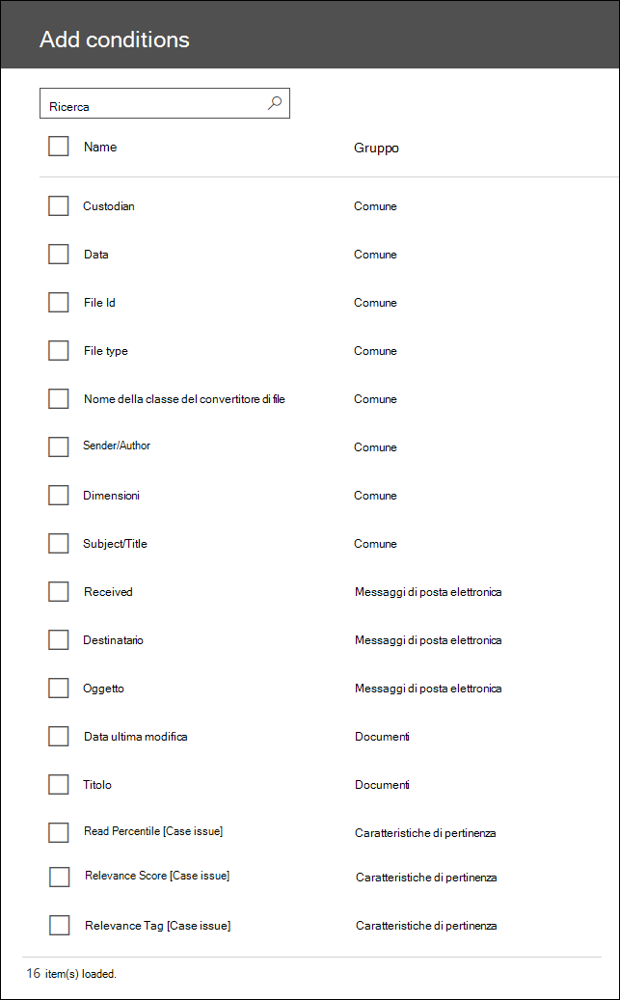

# Ricerca e taggingSearch and Tagging

In Advanced eDiscovery, il modulo di ricerca e tagging consente di cercare, visualizzare in anteprima e organizzare i documenti nel caso.In Advanced eDiscovery, the Search and Tagging module enables you to search, preview, and organize the documents in your case. Attualmente, questo modulo è in versione beta.Currently, this module is in beta. Per una breve dimostrazione di ricerca e tagging, vedere la pagina [Gestisci i dati con Advanced eDiscovery](https://www.youtube.com/watch?v=VaPYL3DHP6I) video.For a brief demonstration of searching and tagging, see the [Manage your data with Advanced eDiscovery](https://www.youtube.com/watch?v=VaPYL3DHP6I) video.

> [!NOTE]
> Per usare Advanced eDiscovery è necessario avere Office 365 E3 con il componente aggiuntivo Advanced Compliance o un abbonamento E5 dell'organizzazione. Se non si ha questo piano e si desidera provare Advanced eDiscovery, è possibile [richiedere una valutazione di Office 365 Enterprise E5](https://go.microsoft.com/fwlink/p/?LinkID=698279).Advanced eDiscovery requires an Office 365 E3 with the Advanced Compliance add-on or an E5 subscription for your organization. If you don't have that plan and want to try Advanced eDiscovery, you can [sign up for a trial of Office 365 Enterprise E5](https://go.microsoft.com/fwlink/p/?LinkID=698279). 
  
## Eseguire una ricerca nei documenti nel casoSearch the documents in your case

Dopo aver elaborato i documenti in un caso avanzato di eDiscovery (e, facoltativamente, eseguire il modulo Analyze o pertinenza), è possibile utilizzare la ricerca e il tagging per i documenti di ricerca e quindi organizzarli applicando tag case-specific (denominati anche etichette).After you have processed documents in an Advanced eDiscovery case (and optionally run the Analyze or Relevance module), you can use the Search and Tagging to search documents and then organize them by applying case-specific tags (also called labels). È possibile definire una query di ricerca utilizzando le schede delle condizioni fornite o utilizzando un linguaggio di query di tipo KQL nella scheda condizione parole chiave.You can define a search query using the provided condition cards or by using a KQL-like query language in the Keywords condition card. Sono supportate la sintassi KQL comune, ad esempio e, o, non e vicino (n), nonché il carattere jolly a più caratteri finale (\*).Common KQL syntax, such as AND, OR, NOT, and NEAR(n) are supported, as well as trailing multi-character wildcard (\*). 

Nella tabella seguente sono elencate le proprietà che è possibile cercare utilizzando una query di parole chiave di KQL.The following table lists the properties that you can search for using a KQL keyword query. In alternativa, è possibile utilizzare una scheda di condizione per lo strumento di ricerca di eDiscovery avanzato per aggiungere una condizione (per le proprietà selezionate) a una query di ricerca.Alternatively, you can use a condition card for in the Advanced eDiscovery Search tool to add a condition (for selected properties) to a search query.

|**Proprietà****Property**|**Descrizione****Description**|
|:-----|:-----|
|**caselabel****caselabel**   | Nome del tag creato/applicato quando un documento è contrassegnato.The name of the tag created/applied when a document is tagged.   |
|**custode****custodian**   | Il custode associato a un documento. soggette a limitazioni.The custodian associated with a document; subject to limitations.   |
|**Data****date**   | Data di invio per la posta elettronica; la data di modifica per i documenti del sito.Sent date for email; the modified date for site documents.   |
|**fileid****fileid**   | ID file all'interno del caso.The File ID within the case.   |
|**filetype****filetype**   | L'estensione di file nativa.The native file extension.   |
|**fileclass****fileclass**   | Posta elettronica, documento o allegato.Email, document, or attachment.   |
|**senderauthor****senderauthor**   | Il mittente per la posta elettronica; autore per i documenti del sito.The sender for email; the author for site documents.   |
|**dimensione****size**   | Le dimensioni del file in KB.The size of the file in KB.   |
|**subjecttitle****subjecttitle**   | L'oggetto per la posta elettronica; il titolo per i documenti del sito.The subject for email; the title for site documents.   |
|**bcc****bcc**   | Il campo Ccn di un messaggio di posta elettronica.The Bcc field of an email.   |
|**cc****cc**   | Campo CC di un messaggio di posta elettronica.The Cc field of an email.   |
|**partecipanti****participants**   | L'indirizzo di posta elettronica di tutti i partecipanti a un thread di posta elettronica, inclusi i collegamenti mancanti.The email address of all participants in an email thread, including for missing links.   |
|**ricevuto****received**   | La data di ricezione di un messaggio di posta elettronica.The date an email was received.   |
|**destinatari****recipients**   | Destinatari di un messaggio di posta elettronica, incluso nei campi a, CC o Ccn.Recipients of an email, included on the To, Cc, or Bcc fields.   |
|**mittente****sender**   | Il mittente di un messaggio di posta elettronica.The sender of an email.   |
|**LastModifiedDate****lastmodifieddate**   | Data dell'Ultima modifica di un documento del sito.The last modified date of a site document.   |
|**inviati****sent**   | La data di invio di un messaggio di posta elettronica.The sent date of an email.   |
|**A****to**   | Il destinatario elencato nel campo a di un messaggio di posta elettronica.The recipient listed in the To field of an email.   |
|**autore****author**   | Autore di un documento del sito.The author of a site document.   |
|**titolo****title**   | Il titolo di un documento del sito.The title of a site document.   |
|**dominanttheme**\***dominanttheme**\*   | Il tema dominante di un elemento.The dominant theme of an item.   |
|**tema**\***themeslist**\*   | Temi associati a un elemento.Themes that are associated with an item.   |
|**readpercentile_ [issuenum]**\*\***readpercentile_[issuenum]**\*\*   | Il percentile di lettura di un elemento, per il problema definito da [issuenum].The read percentile of an item, for the issue defined by [issuenum].   |
|**relevancescore_ [issuenum]**\*\***relevancescore_[issuenum]**\*\*   | Il Punteggio di pertinenza di un elemento, per il problema definito da [issuenum].The relevance score of an item, for the issue defined by [issuenum].   |
|**relevancetag_ [TagName]**\*\***relevancetag_[tagname]**\*\*   | Se un elemento è stato contrassegnato manualmente per la pertinenza, il tag definito da [TagName].If an item has been manually tagged for relevance, the tag defined by  [tagname].   |
|||

\*Disponibile solo se è stato eseguito il modulo temi.\* Only available if the Themes module has been run.

\*\*Disponibile solo se è stato eseguito il modulo pertinenza.\*\* Only available if the Relevance module has been run.

In alternativa, è possibile utilizzare una scheda di condizione nello strumento di ricerca di eDiscovery avanzato per aggiungere una condizione (per le proprietà selezionate) a una query di ricerca.Alternatively, you can use a condition card in the Advanced eDiscovery Search tool to add a condition (for selected properties) to a search query. Nella schermata seguente vengono riportate le condizioni che è possibile aggiungere a una query.The following screenshot shows the conditions that can be added to a query. La colonna **gruppo** indica se la proprietà si applica ai messaggi di posta elettronica, ai documenti del sito o a entrambi (indicati dal valore *comune*).The **Group** column indicates whether the property applies to email, site documents, or both (indicated by the value *Common*). In questa colonna vengono inoltre identificate le proprietà disponibili per la ricerca che possono essere eseguite dopo l'esecuzione del modulo pertinenza.This column also identifies the searchable properties that are available after you run the Relevance module.

Per ulteriori informazioni sulle proprietà disponibili per la ricerca, vedere [keyword query and Search Conditions](keyword-queries-and-search-conditions.md).For more information about searchable properties, see [Keyword queries and search conditions](keyword-queries-and-search-conditions.md).
  
## Vedere ancheSee also

[Advanced eDiscovery (classica)Advanced eDiscovery (classic)](office-365-advanced-ediscovery.md)
  
[Informazioni sulla valutazione in rilevanzaUnderstanding Assessment in Relevance](assessment-in-relevance-in-advanced-ediscovery.md)
  
[Tagging e valutazioneTagging and Assessment](tagging-and-assessment-in-advanced-ediscovery.md)
  
[Formazione di tagging e pertinenzaTagging and Relevance training](tagging-and-relevance-training-in-advanced-ediscovery.md)
  
[Verifica dell'analisi della pertinenzaTracking Relevance analysis](track-relevance-analysis-in-advanced-ediscovery.md)
  
[Decidere in base ai risultatiDeciding based on the results](decision-based-on-the-results-in-advanced-ediscovery.md)
  
[Verifica dell'analisi della pertinenzaTesting Relevance analysis](test-relevance-analysis-in-advanced-ediscovery.md)

