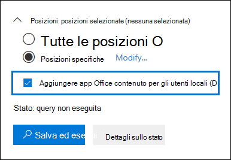

# <a name="search-for-teams-chat-data-for-on-premises-users"></a><span data-ttu-id="c6d5e-103">Cercare i dati delle chat di Teams degli utenti locali</span><span class="sxs-lookup"><span data-stu-id="c6d5e-103">Search for Teams chat data for on-premises users</span></span>

<span data-ttu-id="c6d5e-104">Se l'organizzazione ha una distribuzione ibrida di Exchange oppure sincronizza un'organizzazione di Exchange locale con Office 365 e ha abilitato Microsoft Teams, gli utenti locali possono usare l'applicazione di chat Teams per la messaggistica istantanea.</span><span class="sxs-lookup"><span data-stu-id="c6d5e-104">If your organization has an Exchange hybrid deployment (or your organization synchronizes an on-premises Exchange organization with Office 365) and has enabled Microsoft Teams, on-premises users can use the Teams chat application for instant messaging.</span></span> <span data-ttu-id="c6d5e-105">Per un utente basato sul cloud, i dati delle chat di Teams, detti anche *chat 1x1 o 1xN*, vengono salvati nella cassetta postale principale basata sul cloud.</span><span class="sxs-lookup"><span data-stu-id="c6d5e-105">For a cloud-based user, Teams chat data (also called *1x1 or 1xN chats*) is saved to their primary cloud-based mailbox.</span></span> <span data-ttu-id="c6d5e-106">Quando un utente locale usa l'applicazione di chat Teams, i messaggi della chat non possono essere archiviati nella sua cassetta postale principale, che è ubicata in locale.</span><span class="sxs-lookup"><span data-stu-id="c6d5e-106">When an on-premises user uses the Teams chat application, their chat messages can't be stored in their primary mailbox, which is located on-premises.</span></span> <span data-ttu-id="c6d5e-107">Per aggirare questa limitazione, Microsoft ha rilasciato una nuova funzionalità che consente di creare una risorsa di archiviazione basata sul cloud che consente di usare gli strumenti di eDiscovery per cercare ed esportare i dati delle chat di Teams degli utenti locali.</span><span class="sxs-lookup"><span data-stu-id="c6d5e-107">To get around this limitation, Microsoft has released a new feature where a cloud-based storage area is created so that you use eDiscovery tools to search for and export Teams chat data for on-premises users.</span></span>
  
<span data-ttu-id="c6d5e-108">Di seguito sono elencati i requisiti e le limitazioni per l’abilitazione della risorsa di archiviazione basata sul cloud degli utenti locali:</span><span class="sxs-lookup"><span data-stu-id="c6d5e-108">Here are the requirements and limitations for enabling cloud-based storage for on-premises users:</span></span>
  
- <span data-ttu-id="c6d5e-109">È necessario sincronizzare gli account utente del servizio directory locale, ad esempio Active Directory, con Azure Active Directory, il servizio directory di Microsoft 365.</span><span class="sxs-lookup"><span data-stu-id="c6d5e-109">The user accounts in your on-premises directory service (such as Active Directory) must be synchronized with Azure Active Directory, the directory service in Microsoft 365.</span></span> <span data-ttu-id="c6d5e-110">Questo vuol dire che in Microsoft 365 viene creato un account utente di posta elettronica, che viene associato a un utente la cui cassetta postale principale si trova nell'organizzazione locale.</span><span class="sxs-lookup"><span data-stu-id="c6d5e-110">This means that a mail user account is created in Microsoft 365 and is associated with a user whose primary mailbox is located in the on-premises organization.</span></span>

- <span data-ttu-id="c6d5e-111">All'utente la cui cassetta postale principale si trova nell'organizzazione locale occorre assegnare una licenza di Microsoft Teams e almeno una licenza di Exchange Online Piano 1.</span><span class="sxs-lookup"><span data-stu-id="c6d5e-111">The user whose primary mailbox is located in the on-premises organization must be assigned a Microsoft Teams license and a minimum of an Exchange Online Plan 1 license.</span></span>

- <span data-ttu-id="c6d5e-112">Se l'organizzazione non dispone di una distribuzione ibrida di Exchange, è necessario sincronizzare lo schema di Exchange locale con Azure Active Directory.</span><span class="sxs-lookup"><span data-stu-id="c6d5e-112">If your organization doesn't have an Exchange hybrid deployment, you must synchronize your on-premises Exchange schema to Azure Active Directory.</span></span> <span data-ttu-id="c6d5e-113">Se non lo fai, potresti rischiare di creare cassette postali basate su cloud duplicate in Exchange Online per gli utenti che dispongono di una cassetta postale nell'organizzazione di Exchange locale.</span><span class="sxs-lookup"><span data-stu-id="c6d5e-113">If you don't do this, you might risk creating duplicate cloud-based mailboxes in Exchange Online for users that have a mailbox in your on-premises Exchange organization.</span></span>

- <span data-ttu-id="c6d5e-114">Solo i dati delle chat di Teams associati all’utente locale sono archiviati nella risorsa di archiviazione basata sul cloud.</span><span class="sxs-lookup"><span data-stu-id="c6d5e-114">Only Teams chat data associated with an on-premises user is stored in the cloud-based storage area.</span></span> <span data-ttu-id="c6d5e-115">L’utente locale non può accedere alla risorsa di archiviazione in alcun modo.</span><span class="sxs-lookup"><span data-stu-id="c6d5e-115">An on-premises user can't access this storage area in any way.</span></span>

> [!NOTE]
> <span data-ttu-id="c6d5e-116">Le conversazioni che si svolgono nei canali di Teams vengono sempre archiviate nella cassetta postale basata sul cloud associata al team, il che significa che è possibile cercare le conversazioni del canale.</span><span class="sxs-lookup"><span data-stu-id="c6d5e-116">Teams channel conversations are always stored in the cloud-based mailbox that's associated with the Team, which means you can search for channel conversations.</span></span> <span data-ttu-id="c6d5e-117">Per altre informazioni sulla ricerca di conversazioni dei canali di Teams, vedere [Eseguire una ricerca nei Gruppi di Microsoft 365 e Microsoft Teams](content-search.md#searching-microsoft-teams-and-microsoft-365-groups).</span><span class="sxs-lookup"><span data-stu-id="c6d5e-117">For more information about searching Teams channel conversations, see [Searching Microsoft Teams and Microsoft 365 Groups](content-search.md#searching-microsoft-teams-and-microsoft-365-groups).</span></span>
  
## <a name="how-it-works"></a><span data-ttu-id="c6d5e-118">Funzionamento</span><span class="sxs-lookup"><span data-stu-id="c6d5e-118">How it works</span></span>

<span data-ttu-id="c6d5e-119">Se un utente abilitato per Microsoft Teams dispone di una cassetta postale locale e la sua identità/account utente è stata sincronizzata con il cloud, Microsoft crea una risorsa di archiviazione basata sul cloud per associare i dati delle chat 1xN di Teams dell’utente locale.</span><span class="sxs-lookup"><span data-stu-id="c6d5e-119">If a Microsoft Teams-enabled user has an on-premises mailbox and their user account/identity has been synched to the cloud, Microsoft creates cloud-based storage to associate the on-premises user's 1xN Teams chat data with.</span></span> <span data-ttu-id="c6d5e-120">I dati delle chat di team degli utenti locali sono indicizzati per la ricerca.</span><span class="sxs-lookup"><span data-stu-id="c6d5e-120">Teams chat data for on-premises users is indexed for search.</span></span> <span data-ttu-id="c6d5e-121">In questo modo è possibile usare Ricerca contenuto e le ricerche associate ai casi di eDiscovery Core and Adavanced per cercare, visualizzare in anteprima ed esportare i dati delle chat di Teams degli utenti locali.</span><span class="sxs-lookup"><span data-stu-id="c6d5e-121">This lets you Use Content Search (and searches associated with Core and Advanced eDiscovery cases) to search, preview, and export Teams chat data for on-premises users.</span></span> <span data-ttu-id="c6d5e-122">Per cercare dati delle chat di Teams per gli utenti locali è anche possibile usare i cmdlet **\*ComplianceSearch** in PowerShell per Centro sicurezza e conformità.</span><span class="sxs-lookup"><span data-stu-id="c6d5e-122">You can also use **\*ComplianceSearch** cmdlets in the Security & Compliance Center PowerShell to search for Teams chat data for on-premises users.</span></span>
  
<span data-ttu-id="c6d5e-123">L'immagine seguente mostra il flusso di lavoro che consente di cercare, visualizzare in anteprima ed esportare i dati delle chat di Teams per gli utenti locali.</span><span class="sxs-lookup"><span data-stu-id="c6d5e-123">The following graphic shows the workflow of how Teams chat data for on-premises users is available to search, preview, and export.</span></span>
  

  
<span data-ttu-id="c6d5e-125">Oltre a questa nuova funzionalità, si può continuare a usare Ricerca contenuto per cercare, visualizzare in anteprima ed esportare il contenuto di Teams nel sito di SharePoint basato sul cloud e nella cassetta postale di Exchange associata a ogni team di Microsoft Teams e dati delle chat 1xN di Teams in una cassetta postale di Exchange Online per gli utenti basati sul cloud.</span><span class="sxs-lookup"><span data-stu-id="c6d5e-125">In addition to this new capability, you can still use Content Search to search, preview, and export Teams content in the cloud-based SharePoint site and Exchange mailbox associated with each Microsoft Team and 1xN Teams chat data in the Exchange Online mailbox for cloud-based users.</span></span>


### <a name="what-happens-after-this-feature-is-enabled"></a><span data-ttu-id="c6d5e-126">Cosa succede dopo l'abilitazione della funzionalità?</span><span class="sxs-lookup"><span data-stu-id="c6d5e-126">What happens after this feature is enabled?</span></span>

<span data-ttu-id="c6d5e-127">Dopo la distribuzione di questa funzionalità nell'organizzazione, vengono apportate le modifiche seguenti in Ricerca contenuto e nelle ricerche associate a un caso di eDiscovery nel Centro sicurezza e conformità:</span><span class="sxs-lookup"><span data-stu-id="c6d5e-127">After this feature is deployed in your organization, the following changes are made in Content Search and in searches associated with an eDiscovery case in the Security & Compliance Center:</span></span>
  
- <span data-ttu-id="c6d5e-128">La casella di controllo **Aggiungi il contenuto delle app di Office per gli utenti locali** viene aggiunta sotto **Posizioni** in Ricerca contenuto.</span><span class="sxs-lookup"><span data-stu-id="c6d5e-128">The **Add Office app content for on-premises users** checkbox is added under the **Locations** in Content Search.</span></span>

    
  
- <span data-ttu-id="c6d5e-130">Nel selettore delle posizioni dei contenuti usato per scegliere le cassette postali degli utenti in cui eseguire la ricerca vengono visualizzati gli utenti locali.</span><span class="sxs-lookup"><span data-stu-id="c6d5e-130">On-premises users are displayed in the content locations picker that you use to select user mailboxes to search.</span></span>

## <a name="searching-for-teams-chat-content-for-on-premises-users"></a><span data-ttu-id="c6d5e-131">Cercare contenuto delle chat di Teams degli utenti locali</span><span class="sxs-lookup"><span data-stu-id="c6d5e-131">Searching for Teams chat content for on-premises users</span></span>

<span data-ttu-id="c6d5e-132">Una volta abilitata la funzionalità, è possibile usare Ricerca contenuto nel Centro sicurezza e conformità per cercare dati delle chat di Teams degli utenti locali.</span><span class="sxs-lookup"><span data-stu-id="c6d5e-132">After the feature has been enabled, you can use Content Search in the Security & Compliance Center to search for Teams chat data for on-premises users.</span></span>
  
1. <span data-ttu-id="c6d5e-133">Nel Centro sicurezza e conformità passare a **Ricerca** \> **Ricerca contenuto**.</span><span class="sxs-lookup"><span data-stu-id="c6d5e-133">In the Security & Compliance Center, go to **Search** \> **Content search**</span></span>

2. <span data-ttu-id="c6d5e-134">Nella pagina **Ricerca** fare clic su  **Nuova ricerca**.</span><span class="sxs-lookup"><span data-stu-id="c6d5e-134">On the **Search** page, click  **New search**.</span></span>

    <span data-ttu-id="c6d5e-135">Come illustrato in precedenza, sotto **Posizioni** compare la casella di controllo **Aggiungi il contenuto delle app di Office per gli utenti locali**.</span><span class="sxs-lookup"><span data-stu-id="c6d5e-135">As previously explained, the **Add Office app content for on-premises users** checkbox is displayed under **Locations**.</span></span> <span data-ttu-id="c6d5e-136">Questa opzione è selezionata per impostazione predefinita.</span><span class="sxs-lookup"><span data-stu-id="c6d5e-136">It's selected by default.</span></span>

3. <span data-ttu-id="c6d5e-137">Se necessario, creare la query con parole chiave e aggiungere condizioni alla query di ricerca.</span><span class="sxs-lookup"><span data-stu-id="c6d5e-137">Create the keyword query and add conditions to the search query if necessary.</span></span> <span data-ttu-id="c6d5e-138">Per cercare solo dati di chat di Teams, è possibile aggiungere la query seguente nella casella **Parole chiave**:</span><span class="sxs-lookup"><span data-stu-id="c6d5e-138">To only search for Team chats data, you can add the following query in the **Keywords** box:</span></span>

    ```text
    kind:im
    ```

4. <span data-ttu-id="c6d5e-139">A questo punto, è possibile scegliere una delle opzioni seguenti in **Posizioni**:</span><span class="sxs-lookup"><span data-stu-id="c6d5e-139">At this point, you can choose one of the following options under **Locations**:</span></span>

    - <span data-ttu-id="c6d5e-140">**Tutte le posizioni:** selezionare questa opzione per cercare nelle cassette postali di tutti gli utenti dell'organizzazione.</span><span class="sxs-lookup"><span data-stu-id="c6d5e-140">**All locations:** Select this option to search the mailboxes of all users in your organization.</span></span> <span data-ttu-id="c6d5e-141">Quando la casella di controllo è selezionata, la ricerca verrà eseguita anche in tutte le risorse di archiviazione dei dati delle chat di Teams per gli utenti locali.</span><span class="sxs-lookup"><span data-stu-id="c6d5e-141">When the checkbox is selected, all cloud-based storage of Teams chat data for on-premises users will also be searched.</span></span>

    - <span data-ttu-id="c6d5e-142">**Posizioni specifiche:** selezionare questa opzione e quindi fare clic su **Modifica** \> e scegliere l'utente, i gruppi o i team per cercare cassette postali specifiche.</span><span class="sxs-lookup"><span data-stu-id="c6d5e-142">**Specific locations:** Select this option and then click **Modify** \> Choose user, groups, or teams to search specific mailboxes.</span></span> <span data-ttu-id="c6d5e-143">Come descritto in precedenza, il selettore delle posizioni consente di cercare i dati delle chat di Teams degli utenti locali.</span><span class="sxs-lookup"><span data-stu-id="c6d5e-143">As previously explained, the locations picker lets you search for Teams chat data for on-premises users.</span></span>

5. <span data-ttu-id="c6d5e-144">Salvare ed eseguire la ricerca.</span><span class="sxs-lookup"><span data-stu-id="c6d5e-144">Save and run the search.</span></span> <span data-ttu-id="c6d5e-145">È possibile visualizzare in anteprima i risultati della ricerca degli utenti locali come qualsiasi altro risultato della ricerca.</span><span class="sxs-lookup"><span data-stu-id="c6d5e-145">Any search results for on-premises users can be previewed like any other search results.</span></span> <span data-ttu-id="c6d5e-146">È anche possibile esportare i risultati della ricerca, inclusi i dati delle chat di Teams, in un file PST.</span><span class="sxs-lookup"><span data-stu-id="c6d5e-146">You can also export the search results (including any Teams chat data) to a PST file.</span></span> <span data-ttu-id="c6d5e-147">Per altre informazioni, vedere:</span><span class="sxs-lookup"><span data-stu-id="c6d5e-147">For more information, see:</span></span>

    - [<span data-ttu-id="c6d5e-148">Creare una ricerca</span><span class="sxs-lookup"><span data-stu-id="c6d5e-148">Create a search</span></span>](content-search.md#create-a-search)

    - [<span data-ttu-id="c6d5e-149">Visualizzare l'anteprima dei risultati della ricerca</span><span class="sxs-lookup"><span data-stu-id="c6d5e-149">Preview search results</span></span>](content-search.md#preview-search-results)

    - [<span data-ttu-id="c6d5e-150">Esportare i risultati della Ricerca contenuto</span><span class="sxs-lookup"><span data-stu-id="c6d5e-150">Export Content Search results</span></span>](export-search-results.md)

## <a name="using-powershell-to-search-for-teams-chat-data-for-on-premises-users"></a><span data-ttu-id="c6d5e-151">Usare PowerShell per cercare i dati delle chat di Teams degli utenti locali</span><span class="sxs-lookup"><span data-stu-id="c6d5e-151">Using PowerShell to search for Teams chat data for on-premises users</span></span>

<span data-ttu-id="c6d5e-152">È possibile usare i cmdlet **New-ComplianceSearch** e **Set-ComplianceSearch** in PowerShell nel Centro sicurezza e conformità per cercare i dati delle chat di Teams degli utenti locali.</span><span class="sxs-lookup"><span data-stu-id="c6d5e-152">You can use the **New-ComplianceSearch** and **Set-ComplianceSearch** cmdlets in the Security & Compliance Center PowerShell to search for Teams chat data for on-premises users.</span></span> <span data-ttu-id="c6d5e-153">Come già detto, non è necessario inviare una richiesta di supporto per usare PowerShell per cercare dati delle chat di Teams degli utenti locali.</span><span class="sxs-lookup"><span data-stu-id="c6d5e-153">As previously explained, you don't have to submit a support request to use PowerShell to search for Teams chat data for on-premises users.</span></span>
  
1. <span data-ttu-id="c6d5e-154">[Connettersi a PowerShell in Centro sicurezza e conformità](/powershell/exchange/connect-to-scc-powershell).</span><span class="sxs-lookup"><span data-stu-id="c6d5e-154">[Connect to Security & Compliance Center PowerShell](/powershell/exchange/connect-to-scc-powershell).</span></span>

2. <span data-ttu-id="c6d5e-155">Eseguire il comando di PowerShell seguente per creare una ricerca contenuto che cerchi i dati delle chat di Teams degli utenti locali.</span><span class="sxs-lookup"><span data-stu-id="c6d5e-155">Run the following PowerShell command to create a content search that searches for Teams chat data for on-premises users.</span></span>

    ```powershell
    New-ComplianceSearch <name of new search> -ContentMatchQuery <search query> -ExchangeLocation <on-premises user> -IncludeUserAppContent $true -AllowNotFoundExchangeLocationsEnabled $true  
    ```

    <span data-ttu-id="c6d5e-156">Il parametro *IncludeUserAppContent* viene usato per specificare la risorsa di archiviazione basata sul cloud dell'utente o degli utenti specificati dal parametro *ExchangeLocation*.</span><span class="sxs-lookup"><span data-stu-id="c6d5e-156">The *IncludeUserAppContent*  parameter is used to specify the cloud-based storage for the user or users who are specified by the  *ExchangeLocation*  parameter.</span></span> <span data-ttu-id="c6d5e-157">*AllowNotFoundExchangeLocationsEnabled* consente la ricerca della risorsa di archiviazione basata sul cloud degli utenti locali.</span><span class="sxs-lookup"><span data-stu-id="c6d5e-157">The *AllowNotFoundExchangeLocationsEnabled*  allows you to search the cloud-based storage for on-premises users.</span></span> <span data-ttu-id="c6d5e-158">Quando si usa il valore `$true` per questo parametro, la ricerca non tenta di verificare l'esistenza di una cassetta postale prima di procedere.</span><span class="sxs-lookup"><span data-stu-id="c6d5e-158">When you use the `$true` value for this parameter, the search doesn't try to validate the existence of the mailbox before it runs.</span></span> <span data-ttu-id="c6d5e-159">Questo valore è obbligatorio per eseguire la ricerca della risorsa di archiviazione basata sul cloud per gli utenti locali, perché questa risorsa di archiviazione non viene risolta come una normale cassetta postale basata sul cloud.</span><span class="sxs-lookup"><span data-stu-id="c6d5e-159">This is required to search the cloud-based storage for on-premises users because this cloud-based storage doesn't resolve as a regular cloud-based mailbox.</span></span>

    <span data-ttu-id="c6d5e-160">L'esempio seguente cerca chat di Teams, ossia messaggi istantanei, che contengono la parola chiave "redstone" nella risorsa di archiviazione basata sul cloud di Sara Davis, un utente locale nell'organizzazione Contoso.</span><span class="sxs-lookup"><span data-stu-id="c6d5e-160">The following example searches for Teams chats (which are instant messages) that contain keyword "redstone" in the cloud-based storage for Sara Davis, who is an on-premises user in the Contoso organization.</span></span>
  
    ```powershell
    New-ComplianceSearch "Redstone_Search" -ContentMatchQuery "redstone AND kind:im" -ExchangeLocation sarad@contoso.com -IncludeUserAppContent $true -AllowNotFoundExchangeLocationsEnabled $true  
    ```

   <span data-ttu-id="c6d5e-161">Dopo aver creato una ricerca, assicurarsi di usare il cmdlet **Start-Get compliancesearch** per eseguirla.</span><span class="sxs-lookup"><span data-stu-id="c6d5e-161">After you create a search, be sure to use the **Start-ComplianceSearch** cmdlet to run the search.</span></span> 
  
<span data-ttu-id="c6d5e-162">Per altre informazioni sull'uso di questi cmdlet, vedere:</span><span class="sxs-lookup"><span data-stu-id="c6d5e-162">For more information using these cmdlets, see:</span></span>
  
- [<span data-ttu-id="c6d5e-163">New-ComplianceSearch</span><span class="sxs-lookup"><span data-stu-id="c6d5e-163">New-ComplianceSearch</span></span>](/powershell/module/exchange/new-compliancesearch)

- [<span data-ttu-id="c6d5e-164">Set-ComplianceSearch</span><span class="sxs-lookup"><span data-stu-id="c6d5e-164">Set-ComplianceSearch</span></span>](/powershell/module/exchange/set-compliancesearch)

- [<span data-ttu-id="c6d5e-165">Start-ComplianceSearch</span><span class="sxs-lookup"><span data-stu-id="c6d5e-165">Start-ComplianceSearch</span></span>](/powershell/module/exchange/start-compliancesearch)

## <a name="known-issues"></a><span data-ttu-id="c6d5e-166">Problemi noti</span><span class="sxs-lookup"><span data-stu-id="c6d5e-166">Known issues</span></span>

- <span data-ttu-id="c6d5e-167">Attualmente è possibile cercare, visualizzare in anteprima ed esportare i dati delle chat di Teams degli utenti locali.</span><span class="sxs-lookup"><span data-stu-id="c6d5e-167">Currently, you can search, preview, and export Teams chat data for on-premises users.</span></span> <span data-ttu-id="c6d5e-168">È anche possibile applicare ai dati delle chat di Teams degli utenti locali un blocco associato a un caso di Core o Advanced eDiscovery, oltre che applicare criteri di conservazione per le chat di Teams o i messaggi degli utenti locali.</span><span class="sxs-lookup"><span data-stu-id="c6d5e-168">You can also place the Teams chat data for an on-premises user on a hold associated with a Core or Advanced eDiscovery case, and apply a retention policy for Teams chats or channel messages for on-premises users.</span></span> <span data-ttu-id="c6d5e-169">Al momento, tuttavia, non è possibile applicare criteri di conservazione per altre posizioni dei contenuti (ad esempio cassette postali di Exchange e siti di SharePoint) degli utenti locali.</span><span class="sxs-lookup"><span data-stu-id="c6d5e-169">However at this time, you can't apply a retention policy for other content locations (such as Exchange mailboxes and SharePoint sites) for on-premises users.</span></span>

## <a name="frequently-asked-questions"></a><span data-ttu-id="c6d5e-170">Domande frequenti</span><span class="sxs-lookup"><span data-stu-id="c6d5e-170">Frequently asked questions</span></span>

<span data-ttu-id="c6d5e-171">**Dove si trova la risorsa di archiviazione basata sul cloud per gli utenti locali?**</span><span class="sxs-lookup"><span data-stu-id="c6d5e-171">**Where is the cloud-based storage for on-premises users located?**</span></span>
  
<span data-ttu-id="c6d5e-172">I dati delle chat di Teams vengono archiviati nel file PDL (Preferred Data Location) per un utente locale.</span><span class="sxs-lookup"><span data-stu-id="c6d5e-172">Teams chat data is stored in the Preferred Data Location (PDL) for an on-premises user.</span></span> <span data-ttu-id="c6d5e-173">Il file PDL viene rispettato negli ambienti a singola geo e multi geo.</span><span class="sxs-lookup"><span data-stu-id="c6d5e-173">The PDL is honored in both Single-Geo and Multi-Geo environments.</span></span> <span data-ttu-id="c6d5e-174">Per ulteriori informazioni, vedere [Microsoft 365 Multi-Geo](../enterprise/microsoft-365-multi-geo.md).</span><span class="sxs-lookup"><span data-stu-id="c6d5e-174">For more information, see [Microsoft 365 Multi-Geo](../enterprise/microsoft-365-multi-geo.md).</span></span>
  
 <span data-ttu-id="c6d5e-175">**Sono previsti altri requisiti oltre all'invio di una richiesta di supporto?**</span><span class="sxs-lookup"><span data-stu-id="c6d5e-175">**Are there any other requirements other than submitting a support request?**</span></span>
  
<span data-ttu-id="c6d5e-176">Come descritto in precedenza, occorre sincronizzare le identità degli utenti con cassette postali locali con l'organizzazione basata sul cloud, in modo che venga creato un account di posta elettronica corrispondente per ogni account utente locale in Office 365.</span><span class="sxs-lookup"><span data-stu-id="c6d5e-176">As previously explained, the identities of users with on-prem mailboxes must be synchronized to your cloud-based organization so that a corresponding mail user account is created for each on-premises user account in Office 365.</span></span> <span data-ttu-id="c6d5e-177">L'organizzazione deve avere anche un abbonamento a Office 365 Enterprise, ad esempio un abbonamento a Office 365 Enterprise E1, E3 o E5.</span><span class="sxs-lookup"><span data-stu-id="c6d5e-177">Your organization must also have an Office 365 enterprise subscription, such as an Office 365 Enterprise E1, E3, or E5 subscription.</span></span>
  
 <span data-ttu-id="c6d5e-178">**Esiste il rischio di perdere i dati di chat di Teams se si esegue la migrazione della cassetta postale locale dell'utente nel cloud?**</span><span class="sxs-lookup"><span data-stu-id="c6d5e-178">**Is there a risk of losing the Teams chat data if the user's on-premises mailbox is migrated to the cloud?**</span></span>
  
<span data-ttu-id="c6d5e-179">No.</span><span class="sxs-lookup"><span data-stu-id="c6d5e-179">No.</span></span> <span data-ttu-id="c6d5e-180">Quando si esegue la migrazione nel cloud della cassetta postale principale di un utente locale, i dati delle chat di Teams di quell'utente verranno spostati nella nuova cassetta postale principale basata sul cloud.</span><span class="sxs-lookup"><span data-stu-id="c6d5e-180">When you migrate the primary mailbox of an on-premises user to the cloud, the Teams chat data for that user will be migrated to their new cloud-based primary mailbox.</span></span>
  
 <span data-ttu-id="c6d5e-181">**È possibile applicare un blocco di eDiscovery o criteri di conservazione agli utenti locali?**</span><span class="sxs-lookup"><span data-stu-id="c6d5e-181">**Can I apply an eDiscovery hold or retention policies to on-premises users?**</span></span>
  
<span data-ttu-id="c6d5e-182">Sì.</span><span class="sxs-lookup"><span data-stu-id="c6d5e-182">Yes.</span></span> <span data-ttu-id="c6d5e-183">È possibile applicare criteri di conservazione o blocchi di eDiscovery alle chat di Teams e ai messaggi del canale degli utenti locali.</span><span class="sxs-lookup"><span data-stu-id="c6d5e-183">You can apply eDiscovery holds or retention policies for Teams chats and channel messages of on-premises users.</span></span>
  
 <span data-ttu-id="c6d5e-184">**Ricerca contenuto è in grado di trovare i dati delle chat di Teams meno recenti degli utenti locali, risalenti a prima che l'organizzazione inviasse la richiesta di abilitare questa funzionalità?**</span><span class="sxs-lookup"><span data-stu-id="c6d5e-184">**Can Content Search find older Teams chat data for on-premises users before the time my organization submitted the request to enable this feature?**</span></span>
  
<span data-ttu-id="c6d5e-185">Microsoft ha iniziato ad archiviare i dati delle chat di Teams degli utenti locali il 31 gennaio 2018.</span><span class="sxs-lookup"><span data-stu-id="c6d5e-185">Microsoft started storing the Teams chat data for on-premises users on January 31, 2018.</span></span> <span data-ttu-id="c6d5e-186">Quindi, se l'identità di un utente di Teams locale è stata sincronizzata tra Active Directory e Azure Active Directory fin dalla data specificata, i dati delle sue chat di Teams sono archiviati nel cloud e sono disponibili per la ricerca con Ricerca contenuto.</span><span class="sxs-lookup"><span data-stu-id="c6d5e-186">So, if the identity of an on-premises Teams user has been synched between Active Directory and Azure Active Directory since this date, then their Teams chat data is stored in the cloud and is searchable using Content Search.</span></span> <span data-ttu-id="c6d5e-187">Microsoft sta lavorando anche all'archiviazione dei dati delle chat di Teams precedenti al 31 gennaio 2018 nella risorsa di archiviazione basata sul cloud degli utenti locali.</span><span class="sxs-lookup"><span data-stu-id="c6d5e-187">Microsoft is also working on storing Teams chat data from prior to January 31, 2018 in the cloud-based storage for on-premises users.</span></span> <span data-ttu-id="c6d5e-188">Altre informazioni su questo argomento saranno disponibili a breve.</span><span class="sxs-lookup"><span data-stu-id="c6d5e-188">More information about this will be available soon.</span></span>

 <span data-ttu-id="c6d5e-189">**Gli utenti locali hanno bisogno di una licenza per archiviare i loro dati delle chat di Teams nel cloud?**</span><span class="sxs-lookup"><span data-stu-id="c6d5e-189">**Do on-premises users need a license to store their Teams chat data in the cloud?**</span></span>
  
<span data-ttu-id="c6d5e-190">Sì.</span><span class="sxs-lookup"><span data-stu-id="c6d5e-190">Yes.</span></span> <span data-ttu-id="c6d5e-191">Per archiviare i dati delle chat di Teams di un utente locale in una risorsa di archiviazione basata sul cloud, occorre assegnare all'utente una licenza di Microsoft Teams e una licenza di Exchange Online Piano in Office 365 (o Microsoft 365).</span><span class="sxs-lookup"><span data-stu-id="c6d5e-191">To store Teams chat data for an on-premises user in a cloud-based storage, the user must be assigned a Microsoft Teams license and an Exchange Online Plan license in Office 365 (or Microsoft 365).</span></span>