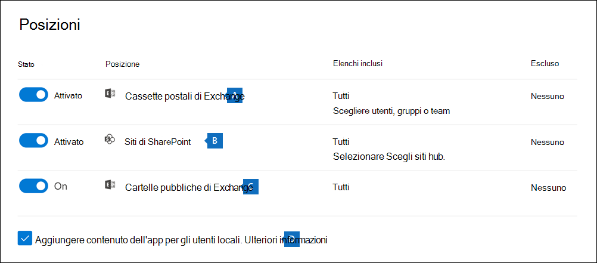
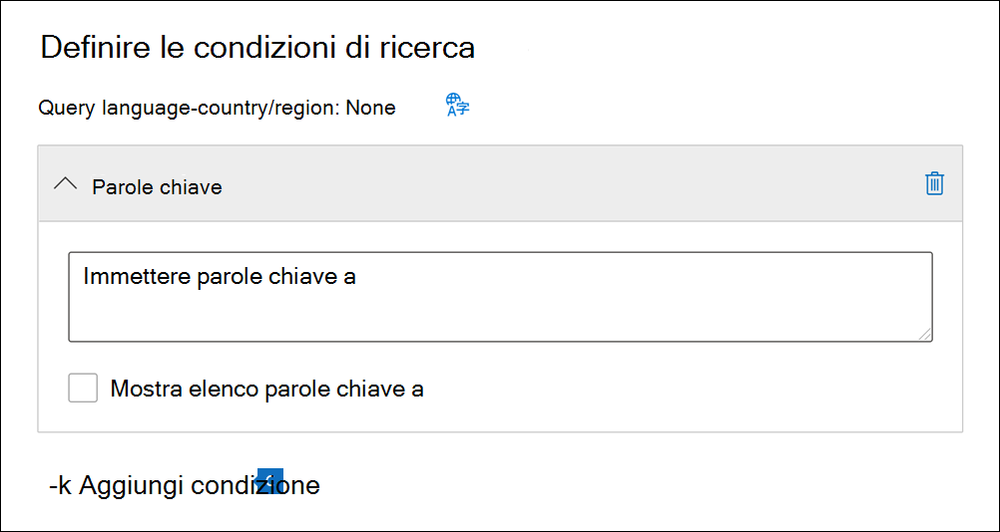

# Cercare contenuto in un caso di eDiscovery di baseSearch for content in a Core eDiscovery case

Dopo aver creato un caso di eDiscovery di base e messo in attesa le persone di interesse nel caso, è possibile creare ed eseguire una o più ricerche di contenuto pertinenti al caso.After a Core eDiscovery case is created and people of interest in the case are placed on hold, you can create and run one or more searches for content relevant to the case. Le ricerche associate a un caso di  eDiscovery di base non sono elencate nella pagina Ricerca contenuto nel Centro Microsoft 365 conformità.Searches associated with a Core eDiscovery case aren't listed on the **Content search** page in the Microsoft 365 compliance center. Queste ricerche sono elencate nella **pagina Ricerche** del caso Core eDiscover a cui sono associate le ricerche.These searches are listed on the **Searches** page of the Core eDiscover case the searches are associated with. Ciò significa anche che le ricerche associate a un caso possono essere accessibili solo dai membri del caso.This also means that searches associated with a case can only be accessed by case members.

Per creare una ricerca eDiscovery di base:To create a Core eDiscovery search:
  
1. Accedere a e accedere utilizzando le credenziali per l'account utente a cui sono state assegnate le autorizzazioni eDiscovery appropriate ed <https://compliance.microsoft.com> è membro del caso.Go to <https://compliance.microsoft.com> and sign in using the credentials for user account that has been assigned the appropriate eDiscovery permissions and is a member of the case.

2. Nel riquadro di spostamento sinistro del Centro Microsoft 365 conformità fare clic su **Mostra** tutto e quindi su **eDiscovery > Core**.In the left navigation pane of the Microsoft 365 compliance center, click **Show all**, and then click **eDiscovery > Core**.

3. Nella pagina **Core eDiscovery** selezionare il caso in cui si desidera creare una ricerca associata e quindi fare clic **su Apri caso.**On the **Core eDiscovery** page, select the case that you want to create an associated search, and then click **Open case**.

4. Nella **home** page del caso fare clic sulla **scheda Ricerche** e quindi su **Nuova ricerca.**On the **Home** page for the case, click the **Searches** tab, and then click **New search**.

   

   > [!NOTE]
   > L’opzione **Cerca per elenco ID** consente di cercare messaggi di posta elettronica specifici e altri elementi della cassetta postale tramite un elenco di ID di Exchange.The **Search by ID list** option lets you search for specific email messages and other mailbox items using a list of Exchange IDs. Per creare un elenco ID di ricerca, è necessario inviare un file con valori delimitati da virgole (CSV) che identifica gli elementi della cassetta postale specifici da cercare.To create an ID list search, you submit a comma-separated value (CSV) file that identifies the specific mailbox items to search for. Per istruzioni, vedere [Preparare un file CSV per un elenco ID di ricerca](csv-file-for-an-id-list-content-search.md).For instructions, see [Prepare a CSV file for an ID list search](csv-file-for-an-id-list-content-search.md).

5. Nella procedura **guidata Nuova ricerca** digitare un nome per la ricerca e una descrizione facoltativa che consente di identificare la ricerca.In the **New search** wizard, type a name for the search, and an optional description that helps identify the search. Il nome della ricerca deve essere univoco nell'organizzazione.The name of the search must be unique in your organization.

6. Nella pagina **Posizioni** scegliere le posizioni di contenuto in cui eseguire la ricerca.On the **Locations** page, choose the content locations that you want to search. È possibile cercare cassette postali, siti e cartelle pubbliche.You can search mailboxes, sites, and public folders.

    
  
   1. **Cassette postali di Exchange**: impostare l'interruttore su **Attivato** e quindi fare clic su **Scegliere utenti, gruppi o team** per specificare le cassette postali da mettere in attesa.**Exchange mailboxes**: Set the toggle to **On** and then click **Choose users, groups, or teams** to specify the mailboxes to place on hold. Utilizzare la casella di ricerca per trovare le cassette postali degli utenti e i gruppi di distribuzione da mettere in attesa (per mettere in attesa le cassette postali dei membri del gruppo).Use the search box to find user mailboxes and distribution groups (to place a hold on the mailboxes of group members) to place on hold. È anche possibile eseguire ricerche nella cassetta postale associata a un team di Microsoft Team (per i messaggi di canale), al gruppo di Office 365 e al gruppo di Yammer.You can also search the mailbox associated with a Microsoft Team (for channel messages), Office 365 Group, and Yammer Group. Per altre informazioni sui dati dell'applicazione archiviati nelle cassette postali, vedere [contenuto archiviato nelle cassette postali per eDiscovery](what-is-stored-in-exo-mailbox.md).For more information about the application data stored in mailboxes, see [Content stored in mailboxes for eDiscovery](what-is-stored-in-exo-mailbox.md).

   2. **Siti di SharePoint**: impostare l'interruttore su **Attivato** quindi fare clic su **Scegli siti** per specificare i siti di SharePoint e gli account di OneDrive da mettere in blocco.**SharePoint sites**: Set the toggle to **On** and then click **Choose sites** to specify SharePoint sites and OneDrive accounts to place on hold. Digitare l'URL per ogni sito che si desidera mettere in blocco.Type the URL for each site that you want to place on hold. È anche possibile aggiungere l'URL del sito di SharePoint per un team di Microsoft Team, un gruppo di Office 365 o un gruppo di Yammer.You can also add the URL for the SharePoint site for a Microsoft Team, Office 365 Group, or Yammer Group.
  
   3. **Cartelle pubbliche di Exchange**: impostare l'interruttore su **attivato** per mettere in stato di blocco tutte le cartelle pubbliche nell'organizzazione di Exchange Online.**Exchange public folders**: Set the toggle to **On** to put all public folders in your Exchange Online organization on hold. Non è possibile scegliere cartelle pubbliche specifiche da mettere in blocco.You can't choose specific public folders to put on hold. Lasciare l'interruttore disattivato se non si vuole impostare un blocco sulle cartelle pubbliche.Leave the toggle switch off if you don't want to put a hold on public folders.
  
   4. Mantenere selezionata questa casella di controllo per cercare contenuto di Teams per gli utenti locali.Keep this checkbox selected to search for Teams content for on-premises users. Ad esempio, se si esegue una ricerca in tutte le cassette postali di Exchange nell'organizzazione e si seleziona questa casella di controllo, la risorsa di archiviazione basata sul cloud usata per archiviare i dati chat di Teams per gli utenti locali verrà inclusa nell'ambito della ricerca.For example, if you search all Exchange mailboxes in the organization and this checkbox is selected, the cloud-based storage used to store Teams chat data for on-premises users will be included in the scope of the search. Per altre informazioni, vedere [Cercare i dati delle chat di Teams degli utenti locali](search-cloud-based-mailboxes-for-on-premises-users.md).For more information, see [Search for Teams chat data for on-premises users](search-cloud-based-mailboxes-for-on-premises-users.md).

7. Nella pagina **Definisci le tue condizioni di ricerca** digitare una query con parole chiave e, se necessario, aggiungere condizioni alla query di ricerca.On the **Define your search conditions** page, type a keyword query and add conditions to the search query if necessary.

   

   1. È possibile specificare parole chiave, proprietà dei messaggi come le date di invio o ricezione o proprietà dei documenti come il nome file o la data dell'ultima modifica apportata.Specify keywords, message properties such as sent and received dates, or document properties such as file names or the date that a document was last changed. È anche possibile usare query più complesse che usano un operatore booleano, come ad esempio **AND**, **OR**, **NOT** o **NEAR**.You can use more complex queries that use a Boolean operator, such as **AND**, **OR**, **NOT**, and **NEAR**. Se si lascia vuota la casella delle parole chiave, nei risultati della ricerca verrà incluso tutto il contenuto disponibile nelle posizioni specificate.If you leave the keyword box empty, all content located in the specified content locations is included in the search results. Per altre informazioni, vedere [Query con parola chiave e condizioni di ricerca per eDiscovery](keyword-queries-and-search-conditions.md).For more information, see [Keyword queries and search conditions for eDiscovery](keyword-queries-and-search-conditions.md).

   2. È anche possibile fare clic sulla casella di controllo **Mostra elenco di parole chiave** e digitare una parola chiave in ogni riga.Alternatively, you can click the **Show keyword list** checkbox and the type a keyword in each row. Se si esegue questa operazione, le parole chiave in ogni riga sono collegate da un operatore logico (**c:s**) con funzionalità simili all’operatore **OR** nella query di ricerca creata.If you do this, the keywords on each row are connected by a logical operator (**c:s**) that is similar in functionality to the **OR** operator in the search query that's created.

      Perché usare l'elenco di parole chiave?Why use the keyword list? È possibile ottenere statistiche che mostrano il numero di elementi che corrispondono a ogni parola chiave.You can get statistics that show how many items match each keyword. Questo è utile per identificare rapidamente le parole chiave più e meno efficaci.This can help you quickly identify which keywords are the most (and least) effective. È possibile usare anche una frase chiave, racchiusa tra parentesi, in una riga.You can also use a keyword phrase (surrounded by parentheses) in a row. Per altre informazioni sulla lista delle parole chiave e sulle statistiche di ricerca, vedere [Visualizzare statistiche delle parole chiave](view-keyword-statistics-for-content-search.md#get-keyword-statistics-for-searches).For more information about the keyword list and search statistics, see [Get keyword statistics for searches](view-keyword-statistics-for-content-search.md#get-keyword-statistics-for-searches).

      > [!NOTE]
      > Per ridurre i problemi causati dai grandi elenchi di parole chiave, è consentito un massimo di 20 righe nell'elenco di parole chiave.To help reduce issues caused by large keyword lists, you're limited to a maximum of 20 rows in the keyword list.

   3. È possibile aggiungere delle condizioni di ricerca per circoscrivere una ricerca e ottenere un insieme di risultati più preciso.You can add search conditions to narrow a search and return a more refined set of results. Ogni condizione aggiunge una clausola alla query di ricerca creata ed eseguita all'avvio della ricerca.Each condition adds a clause to the search query that is created and run when you start the search. Una condizione è collegata logicamente alla query con parole chiave, specificata nell'apposita casella, dall'operatore logico (**c:c**) che ha funzionalità simili all’operatore **AND**.A condition is logically connected to the keyword query (specified in the keyword box) by a logical operator (**c:c**) that is similar in functionality to the **AND** operator. Ciò significa che, per essere inclusi nei risultati, gli elementi devono soddisfare sia la query con parola chiave, sia una o più condizioni.That means that items have to satisfy both the keyword query and one or more conditions to be included in the results. Ecco in che modo le condizioni aiutano a limitare i risultati.This is how conditions help to narrow your results. Per un elenco e una descrizione delle condizioni che è possibile usare in una query di ricerca, vedere [Condizioni di ricerca](keyword-queries-and-search-conditions.md#search-conditions).For a list and description of conditions that you can use in a search query, see [Search conditions](keyword-queries-and-search-conditions.md#search-conditions).

8. Esaminare le impostazioni di ricerca (e modificarle se necessario) e quindi inviare la ricerca per avviarla.Review the search settings (and edit if necessary), and then submit the search to start it.

Una volta completata la ricerca, è possibile visualizzare in anteprima i risultati della ricerca.After the search is completed, you can preview the search results. Se necessario, fare **clic su** Aggiorna nella **pagina Ricerche** per visualizzare la ricerca creata.If necessary, click **Refresh** on the **Searches** page to display the search you created.

## Ulteriori informazioni sulla ricerca di percorsi di contenutoMore information about searching content locations

- Quando si fa **clic su Scegli utenti, gruppi** o team per specificare le cassette postali in cui eseguire la ricerca, la selezione delle cassette postali visualizzata è vuota.When you click **Choose users, groups, or teams** to specify mailboxes to search, the mailbox picker that's displayed is empty. Si tratta di un'impostazione predefinita per migliorare le prestazioni.This is by design to enhance performance. Per aggiungere destinatari all'elenco, fare clic su Scegli utenti, gruppi o **team,** digitare un nome (almeno tre caratteri) nella casella di ricerca, selezionare la casella di controllo accanto al nome e quindi fare clic su **Scegli**.To add recipients to this list, click **Choose users, groups, or teams**, type a name (a minimum of three characters) in the search box, select the check box next to the name, and then click **Choose**.

- È possibile aggiungere cassette postali inattive, Microsoft Teams, Yammer, Office 365 e gruppi di distribuzione all'elenco delle cassette postali in cui eseguire la ricerca.You can add inactive mailboxes, Microsoft Teams, Yammer Groups, Office 365 Groups, and distribution groups to the list of mailboxes to search. Non sono supportati i gruppi di distribuzione dinamici.Dynamic distribution groups aren't supported. Se si aggiungono Microsoft Teams, Yammer gruppi o Office 365 gruppo, viene ricercata la cassetta postale del gruppo o del team. le cassette postali dei membri del gruppo non vengono cercate.If you add Microsoft Teams, Yammer Groups, or Office 365 Groups, the group or team mailbox is searched; the mailboxes of the group members aren't searched.

- Per aggiungere siti alla ricerca, attivare l'interruttore e quindi fare clic **su Scegli siti.**To add sites to the search, turn on the toggle and then click **Choose sites**. Digitare l'URL di ogni sito in cui si desidera eseguire la ricerca.Type the URL for each site that you want to search. È inoltre possibile aggiungere l'URL per il sito SharePoint per un team Microsoft, un Yammer gruppo o un Office 365 gruppo.You can also add the URL for the SharePoint site for a Microsoft Team, a Yammer Group, or an Office 365 Group.
