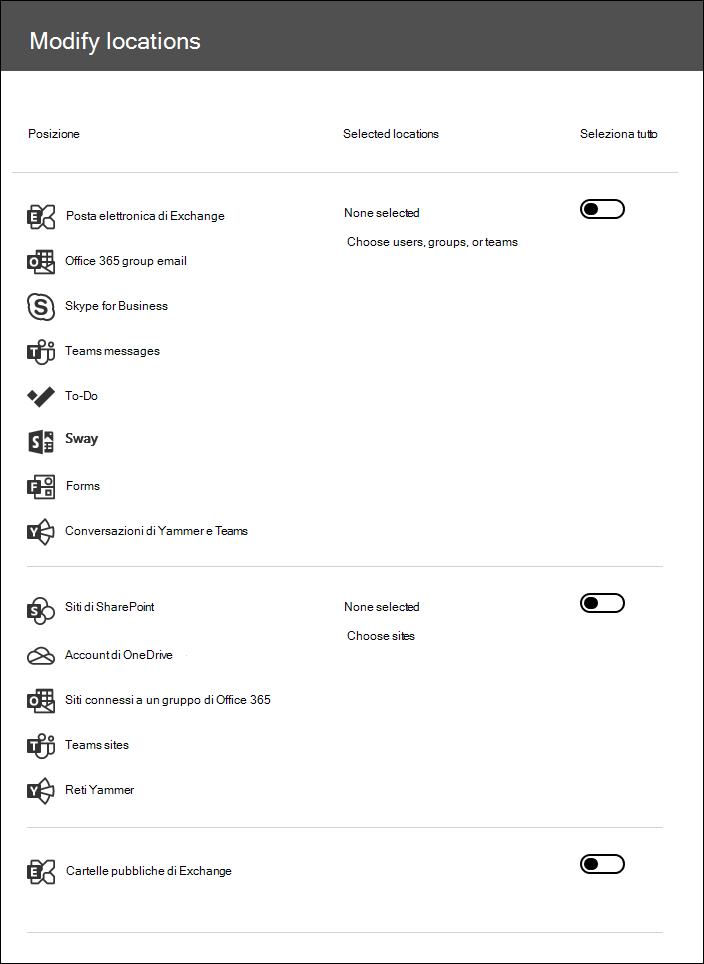

# Ricerca di contenuto in un caso di eDiscovery di base

Dopo la creazione di un caso di eDiscovery di base e la presenza di persone di interesse nel caso, è possibile creare ed eseguire una o più ricerche di contenuto rilevanti per il caso. Le ricerche associate a un caso di eDiscovery di base non sono elencate nella pagina **Ricerca contenuto** del centro conformità di Microsoft 365. Tali ricerche sono elencate nella pagina **ricerche** del caso di EDiscover di base a cui sono associate le ricerche. Questo significa anche che le ricerche associate a un caso possono essere accessibili solo dai membri del caso.

Per creare una ricerca di eDiscovery di base:
  
1. Passare a [https://compliance.microsoft.com](https://compliance.microsoft.com) e accedere con le credenziali per l'account utente a cui sono state assegnate le autorizzazioni di eDiscovery appropriate.

2. Nel riquadro di spostamento a sinistra del centro conformità di Microsoft 365 fare clic su **Mostra tutto**e quindi su **eDiscovery > Core**.

3. Nella pagina **Core eDiscovery** selezionare il caso in cui si desidera creare una ricerca associata e quindi fare clic su **Apri caso**.

4. Nella **Home** page del caso, fare clic sulla scheda **ricerche** .
  
5. Nella pagina **ricerca** fare clic su **nuova ricerca**.

6. Nella pagina **Nuova ricerca**, è possibile aggiungere parole chiave e condizioni per creare la query di ricerca. 

    
  
   a. È possibile specificare le parole chiave, le proprietà dei messaggi, ad esempio le date inviate e ricevute, o le proprietà del documento, ad esempio i nomi di file o la data dell'Ultima modifica di un documento. È possibile utilizzare query più complesse che utilizzano un operatore booleano, ad esempio **and**, **or**, **not**, **near**o **ONEAR**. È inoltre possibile cercare informazioni sensibili (ad esempio numeri di codice fiscale) nei documenti o cercare documenti condivisi esternamente. Se si lascia vuota la casella parola chiave, tutto il contenuto che si trova nei percorsi di contenuto specificato verrà incluso nei risultati della ricerca.

   b. È possibile fare clic sulla casella di controllo **Mostra elenco parole chiave** e digitare una parola chiave in ogni riga. Se si esegue questa operazione, le parole chiave in ogni riga sono connesse dall'operatore **or** nella query di ricerca creata. È possibile immettere un massimo di 20 parole chiave all'elenco.

    
  
    Perché usare l'elenco di parole chiave? È possibile ottenere statistiche che mostrano il numero di elementi che corrispondono a ogni parola chiave. Questo è utile per identificare rapidamente le parole chiave più e meno efficaci. È possibile usare anche una frase chiave, racchiusa tra parentesi, in una riga. Per altre informazioni sulle statistiche di ricerca, vedere [Visualizzare statistiche delle parole chiave per i risultati di Ricerca contenuto](view-keyword-statistics-for-content-search.md).

    Per ulteriori informazioni sull'utilizzo dell'elenco delle parole chiave, vedere [creazione di una query di ricerca](content-search.md#building-a-search-query).

   c. È possibile fare clic su **condizioni** e aggiungere condizioni a una query di ricerca per restringere una ricerca e restituire un insieme di risultati più raffinato. Ogni condizione consente di aggiungere una clausola alla query di ricerca KQL creata ed eseguita quando si avvia la ricerca. Una condizione è logicamente connessa alla query con parole chiave (specificata nella casella delle parole chiave) mediante l'operatore **AND**. Questo significa che gli elementi devono soddisfare sia la query di parole chiave che ogni condizione da includere nei risultati. Ecco in che modo le condizioni aiutano a limitare i risultati.

    Per ulteriori informazioni sulla creazione di una query di ricerca e sull'utilizzo di condizioni, vedere [Keyword queries for Content Search](keyword-queries-and-search-conditions.md).

7. In **percorsi: posizioni in attesa**, scegliere i percorsi di contenuto che si desidera ricercare. È possibile cercare le cassette postali, i siti e le cartelle pubbliche nella stessa ricerca.

    
  
    - **Tutte le posizioni**. Selezionare questa opzione per eseguire la ricerca in tutti i percorsi di contenuto dell'organizzazione. Quando si seleziona questa opzione, è possibile scegliere di effettuare una ricerca in tutte le cassette postali di Exchange (incluse le cassette postali per tutti i team Microsoft, i gruppi di Yammer e i gruppi di Office 365), tutti i siti di SharePoint e OneDrive for business (che include i siti per tutti i gruppi Microsoft, Yammer e Office 365) e tutte le cartelle pubbliche.
    
    - **Tutte le posizioni in attesa**. Selezionare questa opzione per cercare tutti i percorsi di contenuto che sono stati inseriti in eDiscovery Hold nel caso. Se il caso contiene più esenzioni, verranno cercate le posizioni di contenuto di tutte le esenzioni. Inoltre, se un percorso di contenuto è stato posizionato in un blocco basato su query, vengono ricercati solo gli elementi che sono in attesa quando si esegue la ricerca di contenuto che si sta creando in questo passaggio. Ad esempio, se un utente è stato inserito nel caso di archiviazione basata su query che conserva gli elementi inviati o creati prima di una data specifica, verranno ricercati solo gli elementi. Questa operazione viene eseguita collegando la query di blocco del caso e la query di ricerca del contenuto da parte di un operatore **and** . Per ulteriori informazioni, vedere [Search locations on eDiscovery Hold](create-ediscovery-holds.md#search-locations-on-ediscovery-hold).
    
    - **Posizioni specifiche**. Selezionare questa opzione per selezionare le cassette postali e i siti in cui si desidera eseguire la ricerca. Quando si seleziona questa opzione e si fa clic su **modifica**, viene visualizzato un elenco di posizioni. È possibile scegliere di cercare tutti gli utenti, i gruppi, i team o i percorsi del sito. È inoltre possibile cercare le cartelle pubbliche nell'organizzazione.
    
      
  
     Se si seleziona questa opzione e si esegue una ricerca in qualsiasi posizione di contenuto in attesa, qualsiasi query proveniente da un blocco di caso basato su query non verrà applicata alla query di ricerca. In altre parole, viene cercato tutto il contenuto e non solo il contenuto conservato da un blocco di caso basato su query.

8. Dopo aver selezionato i percorsi di contenuto in cui eseguire la ricerca, fare clic su **fine** e quindi su **Salva**.

9. Nella pagina **nuova ricerca** fare clic su **Salva & Esegui** e quindi digitare un nome per la ricerca. Le ricerche associate a un caso di eDiscovery di base devono avere nomi univoci all'interno dell'organizzazione di Office 365.

10. Fare clic su **Salva** per salvare le impostazioni di ricerca e avviare la ricerca.

  Una volta completata la ricerca, è possibile visualizzare in anteprima i risultati della ricerca. Se necessario, fare clic su **Aggiorna** nella pagina **ricerche** per visualizzare la ricerca creata nell'elenco.

11. Fare clic sulla ricerca per visualizzare la pagina del riquadro a comparsa, che contiene le statistiche relative alla ricerca e per eseguire altre attività, ad esempio la visualizzazione delle statistiche di ricerca e l'esportazione dei risultati della ricerca.

## Ulteriori informazioni sulla ricerca di percorsi di contenuto

- Quando si fa clic su **Scegli utenti, gruppi o team** per specificare le cassette postali da cercare, lo strumento di selezione delle cassette postali visualizzato è vuoto. Si tratta di un'impostazione predefinita per migliorare le prestazioni. Per aggiungere destinatari all'elenco, fare clic su **Scegli utenti, gruppi o team**, digitare un nome, almeno 3 caratteri, nella casella di ricerca, selezionare la casella di controllo accanto al nome, quindi fare clic su **Scegli**.

- È possibile aggiungere cassette postali inattive, Microsoft teams, gruppi di Yammer, gruppi di Office 365 e gruppi di distribuzione all'elenco delle cassette postali da cercare. Non sono supportati i gruppi di distribuzione dinamici. Se si aggiungono Microsoft teams, gruppi di Yammer o gruppi di Office 365, viene eseguita la ricerca nella cassetta postale del gruppo o del team. le cassette postali dei membri del gruppo non vengono cercate.

- Per aggiungere siti fare clic su **Scegli siti**, fare di nuovo clic su **Scegli siti** e quindi digitare l'URL per ogni sito che si desidera ricercare. È inoltre possibile aggiungere l'URL per il sito di SharePoint per un team di Microsoft, un gruppo di Yammer o un gruppo di Office 365.
