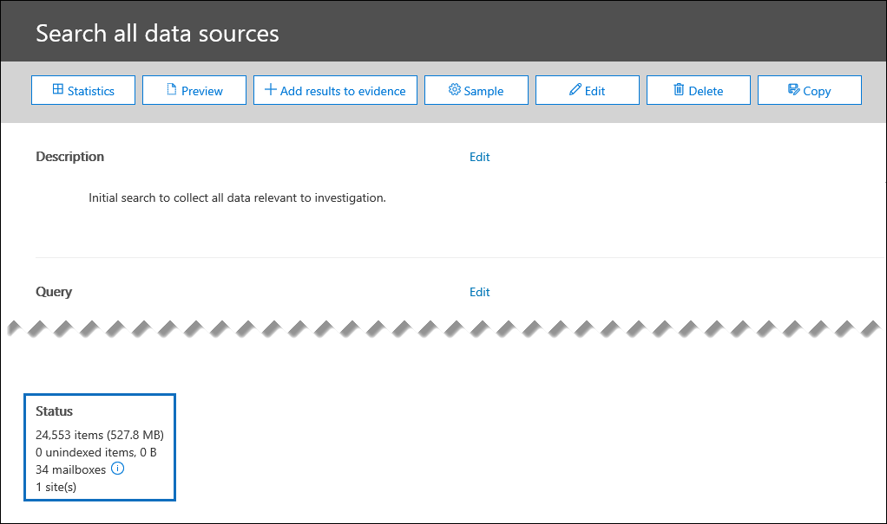

# Statistiche di ricerca in indagini sui dati (anteprima)Search statistics in Data Investigations (preview)

Un modo efficace per convalidare i risultati della ricerca quando si verifica un problema di dati consiste nel visualizzare le statistiche sui risultati della ricerca per assicurarsi che siano allineate alle aspettative.An effective way to validate your search results when investigation a data incident is to view the statistics about your search results to make sure they align with your expectations. Quando una ricerca è terminata, le seguenti statistiche di alto livello vengono visualizzate in **stato** nella pagina riquadro a comparsa dettagli ricerca:When a search as finished running, the following high-level statistics are displayed under **Status** on the search details flyout page:

- Il numero e le dimensioni stimati degli elementi corrispondenti ai criteri di ricerca.The estimated number and size of items that matched the search criteria.

- Il numero e le dimensioni degli elementi parzialmente indicizzati (denominati anche *elementi non indicizzati*) che non sono disponibili per la ricerca ma che sono stati trovati nei percorsi di contenuto che sono stati inclusi nella ricerca.The number and size of partially indexed items (also called *unindexed items*) that aren't searchable but that were found in the content locations that were included in the search.

- Il numero di cassette postali e i siti di cui è stata eseguita la ricerca.The number of mailboxes and sites that were searched.

Per visualizzare statistiche più dettagliate, fare clic su **statistiche** nella pagina del riquadro a comparsa dettagli ricerca.To view more detailed statistics, click **Statistics** on the search details flyout page. Nella pagina **statistiche di ricerca** è possibile visualizzare il riepilogo della ricerca, la posizione principale che conteneva gli elementi corrispondenti ai risultati della ricerca e le statistiche dettagliate sulla query di ricerca.On the **Search statistics** page, you can view the search summary, the top location that contained items that matched the search results, and detailed statistics about the search query.

## RiepilogoSummary

Nella visualizzazione **Riepilogo** , è possibile visualizzare i risultati della ricerca suddivisi in base al tipo di posizione (ad esempio, le posizioni includono le cassette postali di Exchange e i siti di SharePoint).In the **Summary** view, you can see the search results broken down by location type (for example, locations include Exchange mailboxes and SharePoint sites). Per ogni tipo di percorso vengono visualizzate le informazioni seguenti:The following information is displayed for each location type:

- Il numero di posizioni con elementi che corrispondono ai criteri di ricerca.The number of locations that had items that matched the search criteria.

- Il numero totale di elementi di ogni tipo di posizione corrispondenti ai criteri di ricerca.The total number of items from each location type that matched the search criteria.

- La dimensione totale degli elementi di ogni tipo di posizione corrispondenti ai criteri di ricerca.The total size of items from each location type that matched the search criteria.

## Posizioni principaliTop locations

Nella visualizzazione **posizioni superiori** , vengono visualizzati i singoli percorsi di contenuto con la maggior parte degli elementi corrispondenti ai criteri di ricerca.In the **Top locations** view, you see the individual content locations with the most items that matched the search criteria. Per ogni percorso del contenuto, vengono visualizzate le seguenti informazioni:For each content location, the following information is displayed:

- Nome del percorso. l'indirizzo di posta elettronica per le cassette postali e l'URL per i siti di SharePointThe name of the location; the email address for mailboxes and the URL for SharePoint sites

- Tipo di posizioneThe location type

- Numero di elementi che corrispondono ai criteri di ricercaNumber of items that matched the search criteria

- Dimensione totale di tutti gli elementi che corrispondono ai criteri di ricerca.The total size of all items that matched the search criteria.

## QueryQueries

Nella visualizzazione **query** , è possibile visualizzare le statistiche dettagliate per ogni componente della query di ricerca.In the **Queries** view, you can see detailed statistics for each component of the search query. Se è stato utilizzato l'elenco di parole chiave nella query di ricerca, è possibile visualizzare le statistiche avanzate nella visualizzazione **query** che mostrano il numero di elementi che corrispondono a ogni parola chiave o frase di parola chiave.If you used the keyword list in the search query, you can view enhanced statistics in the **Queries** view  that show how many items match each keyword or keyword phrase. In questo modo è possibile identificare rapidamente quali parti della query sono le più (e meno) effettive.This can help you quickly identify which parts of the query are the most (and least) effective. 

Nella visualizzazione **query** vengono visualizzate le informazioni seguenti:The following information is displayed in the **Queries** view:

 - **Tipo di percorso** : il tipo di percorso del contenuto per le statistiche visualizzate nella riga.**Location type** - The type of content location for the statistics displayed in the row.

- **Part** -questa colonna visualizzerà uno dei seguenti valori: **Primary** o **keyword**.**Part** - This column will display one of the following values: **Primary** or **Keyword**. **Principale** indica che la riga presenta statistiche sull'intera query. **Keyword** significa che le statistiche della riga sono relative a uno dei componenti di query.**Primary** means the row presents statistics on the entire query; **Keyword** means the statistics in the row are for one of the query components.

- **Condition** : il componente di query effettivo della query di ricerca a cui si riferisce la riga.**Condition** - The actual query component of the search query the row refers to. Se il valore nella colonna **parte** è **primario**, vengono visualizzate le statistiche per l'intera query di ricerca. Se il valore è **keyword**, vengono visualizzate le statistiche per il componente della query visualizzata nella colonna **query** .If the value in the **Part** column is **Primary**, then the statistics for the entire search query are displayed; if the value is **Keyword**, then the statistics for the component of the query shown in the **Query** column are displayed. Ad esempio, se è stato utilizzato l'elenco delle parole chiave, vengono visualizzate le statistiche.For example, if the keyword list was used, then the statistics one of the keywords are displayed.

  Di seguito sono riportate alcune altre informazioni relative alle statistiche visualizzate nella colonna **query** :Here are some other things to know about the statistics displayed in the **Queries** column:
  
  - Quando si esegue la ricerca di tutto il contenuto nelle cassette postali (non specificando alcuna parola chiave), la query effettiva è **(dimensioni >= 0)** , in modo che tutti gli elementi vengano restituitiWhen you search for all content in mailboxes (by not specifying any keywords), the actual query is **(size >= 0)** so that all items are returned
  
  - Quando si eseguono ricerche in siti di SharePoint e OneDrive, nella query di ricerca vengono aggiunti i due componenti seguenti:When you search SharePoint and OneDrive sites, the two following components are added to the search query:
    
    **Not IsExternalContent: 1** -questo esclude qualsiasi contenuto di un'organizzazione di SharePoint locale**NOT IsExternalContent:1** - This excludes any content from an on-premises SharePoint organization
    
    **Not isOneNotePage: 1** -questo esclude tutti i file di OneNote, poiché si tratta di duplicati di qualsiasi documento corrispondente alla query di ricerca.**NOT isOneNotePage:1** - This excludes all OneNote files because these would be duplicates of any document that matches the search query.

- **Posizioni nella ricerca** Il numero di posizioni di contenuto che presentano elementi che corrispondono alla query di ricerca per la parte o la condizione visualizzata nella riga.**Locations in search** The number of content locations that had items that matched the search query for the part/condition displayed in the row. Si noti che le cassette postali di archiviazione vengono contate come percorso separato se contengono elementi che soddisfano i criteri di ricerca.Note that archive mailboxes are counted as a separate location if they contain items that match the search criteria.

- **Elementi** : il numero totale di elementi che corrispondono ai criteri di ricerca per la parte o la condizione visualizzata nella riga.**Items** - The total number of items that matched the search criteria for the part/condition displayed in the row.

- **Dimensione** : il numero totale di elementi che corrispondono ai criteri di ricerca per la parte o la condizione visualizzata nella riga.**Size** - The total number of items that matched the search criteria for the part/condition displayed in the row.

