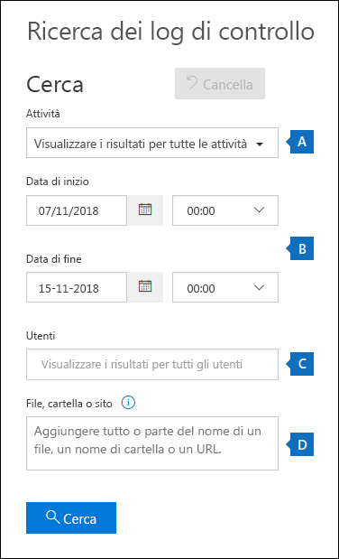
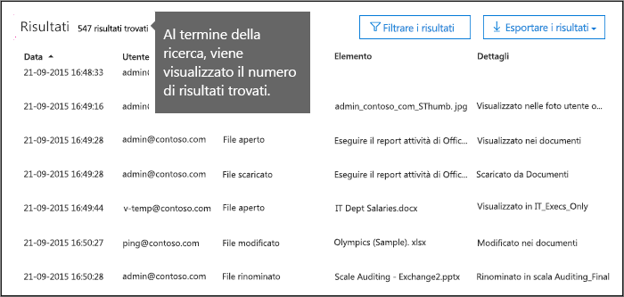
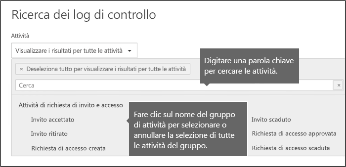
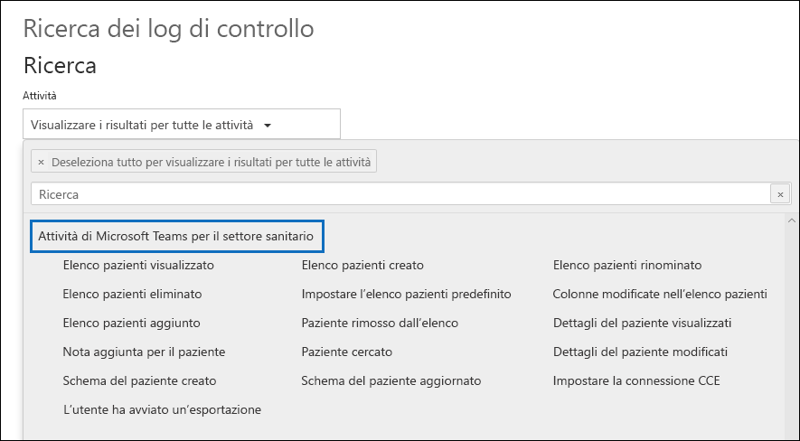
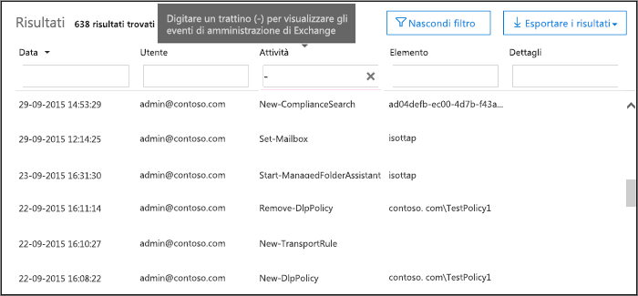

# <a name="search-the-audit-log-in-the-security--compliance-center"></a><span data-ttu-id="8b308-103">Eseguire una ricerca nel log di controllo nel Centro sicurezza e conformità</span><span class="sxs-lookup"><span data-stu-id="8b308-103">Search the audit log in the Security & Compliance Center</span></span>

## <a name="introduction"></a><span data-ttu-id="8b308-104">Introduzione</span><span class="sxs-lookup"><span data-stu-id="8b308-104">Introduction</span></span>

<span data-ttu-id="8b308-105">Se è necessario verificare se un utente ha visualizzato un documento specifico o ha eliminato un elemento dalla cassetta postale,</span><span class="sxs-lookup"><span data-stu-id="8b308-105">Need to find if a user viewed a specific document or purged an item from their mailbox?</span></span> <span data-ttu-id="8b308-106">si può usare il Centro sicurezza e conformità di Office 365 per eseguire una ricerca nel log di controllo unificato e vedere le attività di utenti e amministratori nell'organizzazione di Office 365.</span><span class="sxs-lookup"><span data-stu-id="8b308-106">If so, you can use the Office 365 Security & Compliance Center to search the unified audit log to view user and administrator activity in your Office 365 organization.</span></span> <span data-ttu-id="8b308-107">Perché usare un log di controllo unificato?</span><span class="sxs-lookup"><span data-stu-id="8b308-107">Why a unified audit log?</span></span> <span data-ttu-id="8b308-108">Perché è possibile cercare i tipi seguenti di attività di utenti e amministratori in Office 365:</span><span class="sxs-lookup"><span data-stu-id="8b308-108">Because you can search for the following types of user and admin activity in Office 365:</span></span>

- <span data-ttu-id="8b308-109">Attività utente in SharePoint Online e OneDrive for Business</span><span class="sxs-lookup"><span data-stu-id="8b308-109">User activity in SharePoint Online and OneDrive for Business</span></span>

- <span data-ttu-id="8b308-110">Attività utente in Exchange Online (registrazione di controllo delle cassette postali di Exchange)</span><span class="sxs-lookup"><span data-stu-id="8b308-110">User activity in Exchange Online (Exchange mailbox audit logging)</span></span>

- <span data-ttu-id="8b308-111">Attività amministratore in SharePoint Online</span><span class="sxs-lookup"><span data-stu-id="8b308-111">Admin activity in SharePoint Online</span></span>

- <span data-ttu-id="8b308-112">Attività amministratore in Azure Active Directory (servizio directory per Office 365)</span><span class="sxs-lookup"><span data-stu-id="8b308-112">Admin activity in Azure Active Directory (the directory service for Office 365)</span></span>

- <span data-ttu-id="8b308-113">Attività amministratore in Exchange Online (registrazione di controllo dell'amministratore di Exchange )</span><span class="sxs-lookup"><span data-stu-id="8b308-113">Admin activity in Exchange Online (Exchange admin audit logging)</span></span>

- <span data-ttu-id="8b308-114">Attività utente e amministratore in Sway</span><span class="sxs-lookup"><span data-stu-id="8b308-114">User and admin activity in Sway</span></span>

- <span data-ttu-id="8b308-115">Attività eDiscovery nel Centro sicurezza e conformità</span><span class="sxs-lookup"><span data-stu-id="8b308-115">eDiscovery activities in the security and compliance center</span></span>

- <span data-ttu-id="8b308-116">Attività utente e amministratore in Power BI</span><span class="sxs-lookup"><span data-stu-id="8b308-116">User and admin activity in Power BI</span></span>

- <span data-ttu-id="8b308-117">Attività utente e amministratore in Microsoft Teams</span><span class="sxs-lookup"><span data-stu-id="8b308-117">User and admin activity in Microsoft Teams</span></span>

- <span data-ttu-id="8b308-118">Attività utente e amministratore in Dynamics 365</span><span class="sxs-lookup"><span data-stu-id="8b308-118">User and admin activity in Dynamics 365</span></span>

- <span data-ttu-id="8b308-119">Attività utente e amministratore in Yammer</span><span class="sxs-lookup"><span data-stu-id="8b308-119">User and admin activity in Yammer</span></span>

- <span data-ttu-id="8b308-120">Attività utente e amministratore in Microsoft Power Automate</span><span class="sxs-lookup"><span data-stu-id="8b308-120">User and admin activity in Microsoft Flow</span></span>

- <span data-ttu-id="8b308-121">Attività utente e amministratore in Microsoft Stream</span><span class="sxs-lookup"><span data-stu-id="8b308-121">User and admin activity in Microsoft Stream</span></span>

- <span data-ttu-id="8b308-122">Attività di analisti e amministratori in Microsoft Workplace Analytics</span><span class="sxs-lookup"><span data-stu-id="8b308-122">Analyst and admin activity in Microsoft Workplace Analytics</span></span>

- <span data-ttu-id="8b308-123">Attività utente e amministratore in Microsoft Power Apps</span><span class="sxs-lookup"><span data-stu-id="8b308-123">User and admin activity in Microsoft PowerApps</span></span>

- <span data-ttu-id="8b308-124">Attività utente e amministratore in Microsoft Forms</span><span class="sxs-lookup"><span data-stu-id="8b308-124">User and admin activity in Microsoft Forms</span></span>

## <a name="before-you-begin"></a><span data-ttu-id="8b308-125">Informazioni preliminari</span><span class="sxs-lookup"><span data-stu-id="8b308-125">Before you begin</span></span>

<span data-ttu-id="8b308-126">Accertarsi di leggere i seguenti elementi prima di iniziare la ricerca del registro di controllo di Office 365.</span><span class="sxs-lookup"><span data-stu-id="8b308-126">Be sure to read the following items before you start searching the Office 365 audit log.</span></span>

- <span data-ttu-id="8b308-127">È necessario che l'amministratore corrente o un altro amministratore attivi la registrazione di controllo prima di iniziare a eseguire ricerche nel log di controllo di Office 365.</span><span class="sxs-lookup"><span data-stu-id="8b308-127">You (or another admin) must first turn on audit logging before you can start searching the Office 365 audit log.</span></span> <span data-ttu-id="8b308-128">Per attivare la registrazione, fare clic su **Attiva il controllo** nella pagina **Ricerca log di controllo** del Centro sicurezza e conformità.</span><span class="sxs-lookup"><span data-stu-id="8b308-128">To turn it on, click **Turn on auditing** on the **Audit log search** page in the Security & Compliance Center.</span></span> <span data-ttu-id="8b308-129">Se questo collegamento non è visibile, il controllo è stato già attivato per la propria organizzazione. Dopo l'attivazione, verrà visualizzato un messaggio che indica che è in corso la preparazione del log di controllo e che sarà possibile eseguire una ricerca in un paio d'ore, dopo il completamento della preparazione.</span><span class="sxs-lookup"><span data-stu-id="8b308-129">(If you don't see this link, auditing has already been turned on for your organization.) After you turn it on, a message is displayed that says the audit log is being prepared and that you can run a search in a couple of hours after the preparation is complete.</span></span> <span data-ttu-id="8b308-130">Questa procedura deve essere eseguita una sola volta.</span><span class="sxs-lookup"><span data-stu-id="8b308-130">You only have to do this once.</span></span> <span data-ttu-id="8b308-131">Per altre informazioni, vedere [Attivare o disattivare la ricerca nel log di controllo](turn-audit-log-search-on-or-off.md).</span><span class="sxs-lookup"><span data-stu-id="8b308-131">For more information, see [Turn audit log search on or off](turn-audit-log-search-on-or-off.md).</span></span>

  > [!NOTE]
  > <span data-ttu-id="8b308-132">Microsoft sta per impostare come predefinita l'attivazione del controllo.</span><span class="sxs-lookup"><span data-stu-id="8b308-132">We're in the process of turning on auditing by default.</span></span> <span data-ttu-id="8b308-133">Nel frattempo, è possibile attivarlo come descritto in precedenza.</span><span class="sxs-lookup"><span data-stu-id="8b308-133">Until then, you can turn it on as previously described.</span></span>

- <span data-ttu-id="8b308-134">È necessario avere il ruolo relativo ai log di controllo di sola lettura o ai log di controllo in Exchange Online per poter eseguire ricerche nel log di controllo di Office 365.</span><span class="sxs-lookup"><span data-stu-id="8b308-134">You have to be assigned the View-Only Audit Logs or Audit Logs role in Exchange Online to search the Office 365 audit log.</span></span> <span data-ttu-id="8b308-135">Per impostazione predefinita, questi ruoli sono assegnati ai gruppi di ruoli Gestione conformità e Gestione organizzazione nella pagina **Autorizzazioni** nell'Interfaccia di amministrazione di Exchange.</span><span class="sxs-lookup"><span data-stu-id="8b308-135">By default, these roles are assigned to the Compliance Management and Organization Management role groups on the **Permissions** page in the Exchange admin center.</span></span> <span data-ttu-id="8b308-136">Gli amministratori globali di Office 365 e Microsoft 365 vengono aggiunti automaticamente come membri del gruppo di ruoli Gestione organizzazione in Exchange Online.</span><span class="sxs-lookup"><span data-stu-id="8b308-136">Note Global administrators in Office 365 and Microsoft 365 are automatically added as members of the Organization Management role group in Exchange Online.</span></span> <span data-ttu-id="8b308-137">Per consentire a un utente di eseguire ricerche nel log di controllo di Office 365 con il livello minimo di privilegi, è possibile creare un gruppo di ruoli personalizzato in Exchange Online, aggiungere il ruolo relativo ai log di controllo di sola lettura o ai log di controllo e quindi aggiungere l'utente come membro del nuovo gruppo di ruoli.</span><span class="sxs-lookup"><span data-stu-id="8b308-137">To give a user the ability to search the Office 365 audit log with the minimum level of privileges, you can create a custom role group in Exchange Online, add the View-Only Audit Logs or Audit Logs role, and then add the user as a member of the new role group.</span></span> <span data-ttu-id="8b308-138">Per altre informazioni, vedere [Gestire i gruppi di ruoli in Exchange Online](https://go.microsoft.com/fwlink/p/?LinkID=730688).</span><span class="sxs-lookup"><span data-stu-id="8b308-138">For more information, see [Manage role groups in Exchange Online](https://go.microsoft.com/fwlink/p/?LinkID=730688).</span></span>

  > [!IMPORTANT]
  > <span data-ttu-id="8b308-139">Se si assegna a un utente il ruolo relativo ai log di controllo di sola lettura o ai log di controllo nella pagina **Autorizzazioni** del Centro sicurezza e conformità, l'utente non potrà eseguire ricerche nel log di controllo di Office 365.</span><span class="sxs-lookup"><span data-stu-id="8b308-139">If you assign a user the View-Only Audit Logs or Audit Logs role on the **Permissions** page in the Security & Compliance Center, they won't be able to search the Office 365 audit log.</span></span> <span data-ttu-id="8b308-140">È necessario assegnare le autorizzazioni in Exchange Online.</span><span class="sxs-lookup"><span data-stu-id="8b308-140">You have to assign the permissions in Exchange Online.</span></span> <span data-ttu-id="8b308-141">Ciò avviene perché il cmdlet sottostante usato per la ricerca nel log di controllo è un cmdlet di Exchange Online.</span><span class="sxs-lookup"><span data-stu-id="8b308-141">This is because the underlying cmdlet used to search the audit log is an Exchange Online cmdlet.</span></span>

- <span data-ttu-id="8b308-142">Quando un'attività di controllo viene eseguita da un utente o da un amministratore, viene generato un record di controllo che viene archiviato nel log di controllo di Office 365 per l'organizzazione.</span><span class="sxs-lookup"><span data-stu-id="8b308-142">When an audited activity is performed by a user or admin, an audit record is generated and stored in the Office 365 audit log for your organization.</span></span> <span data-ttu-id="8b308-143">Il periodo di tempo per il quale viene conservato il record di controllo (ed disponibile per la ricerca nel log di controllo) varia in base all'abbonamento a Office 365 e, in particolare, al tipo di licenza assegnata a un utente specifico.</span><span class="sxs-lookup"><span data-stu-id="8b308-143">The length of time that an audit record is retained (and searchable in the audit log) depends on your Office 365 subscription, and specifically the type of the license that is assigned to a specific user.</span></span>

  - <span data-ttu-id="8b308-144">**Office 365 E3:** i record di controllo vengono conservati per 90 giorni.</span><span class="sxs-lookup"><span data-stu-id="8b308-144">**Office 365 E3:** Audit records are retained for 90 days.</span></span> <span data-ttu-id="8b308-145">Ciò significa che è possibile cercare nel log di controllo le attività eseguite negli ultimi 90 giorni.</span><span class="sxs-lookup"><span data-stu-id="8b308-145">That means you can search the audit log for activities that were performed within the last 90 days.</span></span>

    > [!NOTE]
    > <span data-ttu-id="8b308-146">Anche se il controllo delle cassette postali è attivato per impostazione predefinita, si potrebbe notare che gli eventi di controllo delle cassette postali per alcuni utenti non sono inclusi nelle ricerche nei log di controllo nel Centro sicurezza e conformità o nell'API Office 365 Management Activity.</span><span class="sxs-lookup"><span data-stu-id="8b308-146">Even when mailbox auditing on by default is turned on, you might notice that mailbox audit events for some users aren't found in audit log searches in the Security & Compliance Center or via the Office 365 Management Activity API.</span></span> <span data-ttu-id="8b308-147">Vedere la sezione [Altre informazioni sulla registrazione di controllo delle cassette postali](enable-mailbox-auditing.md#more-information).</span><span class="sxs-lookup"><span data-stu-id="8b308-147">For more information, see [More information about mailbox audit logging](enable-mailbox-auditing.md#more-information).</span></span>

  - <span data-ttu-id="8b308-148">**Office 365 E5:** i record di controllo vengono conservati per 90 giorni.</span><span class="sxs-lookup"><span data-stu-id="8b308-148">**Office 365 E5:** Audit records are also retained for 90 days.</span></span> <span data-ttu-id="8b308-149">Il mantenimento dei record di controllo per un anno potrebbe essere disponibile per gli utenti E5 e gli utenti con una licenza E3 e una licenza per il componente aggiuntivo Office 365 Advanced Compliance.</span><span class="sxs-lookup"><span data-stu-id="8b308-149">Retaining audit records for one year may eventually be available for E5 users and users with an E3 license and an Office 365 Advanced Compliance add-on license.</span></span>

    > [!NOTE]
    > <span data-ttu-id="8b308-150">Il programma di anteprima privata per il periodo di conservazione di un anno per i record di controllo per le organizzazioni E5 (o per gli utenti delle organizzazioni E3 con licenza per i componenti aggiuntivi per la conformità avanzata) è chiuso alle nuove iscrizioni.</span><span class="sxs-lookup"><span data-stu-id="8b308-150">The private preview program for the one-year retention period for audit records for E5 organizations (or for users in E3 organizations that have Advanced Compliance add-on licenses) is closed to new enrollment.</span></span> <span data-ttu-id="8b308-151">Questo articolo verrà aggiornato quando il periodo di conservazione di un anno sarà disponibile in anteprima pubblica o rilasciato per la disponibilità generale.</span><span class="sxs-lookup"><span data-stu-id="8b308-151">This article will be updated when the one-year retention period is available in public preview or released for general availability.</span></span>

- <span data-ttu-id="8b308-152">Se si desidera disattivare la ricerca nel log di controllo in Office 365 per la propria organizzazione, è possibile eseguire questo comando nell'istanza di PowerShell remota connessa all'organizzazione di Exchange Online:</span><span class="sxs-lookup"><span data-stu-id="8b308-152">If you want to turn off audit log search in Office 365 for your organization, you can run the following command in remote PowerShell connected to your Exchange Online organization:</span></span>

  ```powershell
  Set-AdminAuditLogConfig -UnifiedAuditLogIngestionEnabled $false
  ```

    <span data-ttu-id="8b308-153">Per attivare di nuovo la ricerca nel log di controllo, è possibile eseguire il comando seguente in PowerShell di Exchange Online:</span><span class="sxs-lookup"><span data-stu-id="8b308-153">To turn on audit search again, you can run the following command in Exchange Online PowerShell:</span></span>

  ```powershell
  Set-AdminAuditLogConfig -UnifiedAuditLogIngestionEnabled $true
  ```

  <span data-ttu-id="8b308-154">Per altre informazioni, vedere [Disattivare la ricerca nel log di controllo in Office 365](turn-audit-log-search-on-or-off.md).</span><span class="sxs-lookup"><span data-stu-id="8b308-154">For more information, see [Turn off audit log search in Office 365](turn-audit-log-search-on-or-off.md).</span></span>

- <span data-ttu-id="8b308-155">Come indicato in precedenza, il cmdlet sottostante usato per la ricerca nel log di controllo è un cmdlet di Exchange Online, ovvero **Search-UnifiedAuditLog**.</span><span class="sxs-lookup"><span data-stu-id="8b308-155">As previously stated, the underlying cmdlet used to search the audit log is an Exchange Online cmdlet, which is **Search-UnifiedAuditLog**.</span></span> <span data-ttu-id="8b308-156">Ciò significa che è possibile usare questo cmdlet anziché la pagina **Ricerca log di controllo** in Centro sicurezza e conformità per eseguire una ricerca nel log di controllo di Office 365.</span><span class="sxs-lookup"><span data-stu-id="8b308-156">That means you can use this cmdlet to search the Office 365 audit log instead of using the **Audit log search** page in the Security & Compliance Center.</span></span> <span data-ttu-id="8b308-157">È necessario eseguire questo cmdlet in una sessione remota di PowerShell connessa all'organizzazione di Exchange Online.</span><span class="sxs-lookup"><span data-stu-id="8b308-157">You have to run this cmdlet in remote PowerShell connected to your Exchange Online organization.</span></span> <span data-ttu-id="8b308-158">Per altre informazioni, vedere [Search-UnifiedAuditLog](https://go.microsoft.com/fwlink/p/?linkid=834776).</span><span class="sxs-lookup"><span data-stu-id="8b308-158">For more information, see [Search-UnifiedAuditLog](https://go.microsoft.com/fwlink/p/?linkid=834776).</span></span>

  <span data-ttu-id="8b308-159">Per informazioni sull'esportazione dei risultati della ricerca restituiti dal cmdlet **Search-UnifiedAuditLog** in un file CSV, vedere la sezione "Suggerimenti per l'esportazione e la visualizzazione del log di controllo in [Esportare, configurare e visualizzare i record del log di controllo ](export-view-audit-log-records.md#tips-for-exporting-and-viewing-the-audit-log).</span><span class="sxs-lookup"><span data-stu-id="8b308-159">For information about exporting the search results returned by the **Search-UnifiedAuditLog** cmdlet to a CSV file, see the "Tips for exporting and viewing the audit log" section in [Export, configure, and view audit log records](export-view-audit-log-records.md#tips-for-exporting-and-viewing-the-audit-log).</span></span>

- <span data-ttu-id="8b308-160">Per scaricare i dati a livello di programmazione dal log di controllo di Office 365, è consigliabile usare l'API Office 365 Management Activity, invece di uno script di PowerShell.</span><span class="sxs-lookup"><span data-stu-id="8b308-160">If you want to programmatically download data from the Office 365 audit log, we recommend that you use the Office 365 Management Activity API instead of using a PowerShell script.</span></span> <span data-ttu-id="8b308-161">L'API Office 365 Management Activity è un servizio Web REST che è possibile utilizzare per sviluppare operazioni e soluzioni per la sicurezza e il monitoraggio della conformità per l'organizzazione.</span><span class="sxs-lookup"><span data-stu-id="8b308-161">The Office 365 Management Activity API is a REST web service that you can use to develop operations, security, and compliance monitoring solutions for your organization.</span></span> <span data-ttu-id="8b308-162">Per altre informazioni, vedere [Riferimento API Office 365 Management Activity](https://docs.microsoft.com/office/office-365-management-api/office-365-management-activity-api-reference).</span><span class="sxs-lookup"><span data-stu-id="8b308-162">For more information, see [Office 365 Management Activity API reference](https://docs.microsoft.com/office/office-365-management-api/office-365-management-activity-api-reference).</span></span>

- <span data-ttu-id="8b308-163">La visualizzazione della voce del log di controllo nei risultati della ricerca può richiedere fino a 30 minuti o a 24 ore dal momento in cui si verifica l'evento.</span><span class="sxs-lookup"><span data-stu-id="8b308-163">It can take up to 30 minutes or up to 24 hours after an event occurs for the corresponding audit log entry to be displayed in the search results.</span></span> <span data-ttu-id="8b308-164">La tabella seguente mostra il tempo necessario per i diversi servizi in Office 365.</span><span class="sxs-lookup"><span data-stu-id="8b308-164">The following table shows the time it takes for the different services in Office 365.</span></span>

  |<span data-ttu-id="8b308-165">**Servizio Office 365**</span><span class="sxs-lookup"><span data-stu-id="8b308-165">**Office 365 service**</span></span>|<span data-ttu-id="8b308-166">**30 minuti**</span><span class="sxs-lookup"><span data-stu-id="8b308-166">**30 minutes**</span></span>|<span data-ttu-id="8b308-167">**24 ore**</span><span class="sxs-lookup"><span data-stu-id="8b308-167">**24 hours**</span></span>|
  |:-----|:-----:|:-----:|
  |<span data-ttu-id="8b308-168">Advanced Threat Protection e Threat Intelligence</span><span class="sxs-lookup"><span data-stu-id="8b308-168">Advanced Threat Protection and Threat Intelligence</span></span>|||
  |<span data-ttu-id="8b308-170">Azure Active Directory (eventi di accesso utente)</span><span class="sxs-lookup"><span data-stu-id="8b308-170">Azure Active Directory (user login events)</span></span>|||
  |<span data-ttu-id="8b308-172">Interfaccia di amministrazione di Azure Active Directory (eventi di amministrazione)</span><span class="sxs-lookup"><span data-stu-id="8b308-172">Azure Active Directory (admin events)</span></span>|||
  |<span data-ttu-id="8b308-174">Prevenzione della perdita di dati</span><span class="sxs-lookup"><span data-stu-id="8b308-174">Data Loss Prevention</span></span>|||
  |<span data-ttu-id="8b308-176">Dynamics 365 CRM</span><span class="sxs-lookup"><span data-stu-id="8b308-176">Dynamics 365 CRM</span></span>|||
  |<span data-ttu-id="8b308-178">eDiscovery</span><span class="sxs-lookup"><span data-stu-id="8b308-178">eDiscovery</span></span>|||
  |<span data-ttu-id="8b308-180">Exchange Online</span><span class="sxs-lookup"><span data-stu-id="8b308-180">Exchange Online</span></span>|||
  |<span data-ttu-id="8b308-182">Microsoft Power Automate</span><span class="sxs-lookup"><span data-stu-id="8b308-182">Microsoft Power Automate</span></span>|||
  |<span data-ttu-id="8b308-184">Microsoft Project</span><span class="sxs-lookup"><span data-stu-id="8b308-184">Microsoft Project</span></span>|||
  |<span data-ttu-id="8b308-186">Microsoft Stream</span><span class="sxs-lookup"><span data-stu-id="8b308-186">Microsoft Stream</span></span>|||
  |<span data-ttu-id="8b308-188">Microsoft Teams</span><span class="sxs-lookup"><span data-stu-id="8b308-188">Microsoft Teams</span></span>|||
  |<span data-ttu-id="8b308-190">Power BI</span><span class="sxs-lookup"><span data-stu-id="8b308-190">Power BI</span></span>|||
  |<span data-ttu-id="8b308-192">Centro sicurezza e conformità</span><span class="sxs-lookup"><span data-stu-id="8b308-192">Security & Compliance Center</span></span>|||
  |<span data-ttu-id="8b308-194">SharePoint Online e OneDrive for Business</span><span class="sxs-lookup"><span data-stu-id="8b308-194">SharePoint Online and OneDrive for Business</span></span>|||
  |<span data-ttu-id="8b308-196">Sway</span><span class="sxs-lookup"><span data-stu-id="8b308-196">Sway</span></span>|||
  |<span data-ttu-id="8b308-198">Workplace Analytics</span><span class="sxs-lookup"><span data-stu-id="8b308-198">Workplace Analytics</span></span>|||
  |<span data-ttu-id="8b308-200">Yammer</span><span class="sxs-lookup"><span data-stu-id="8b308-200">Yammer</span></span>||||
  |<span data-ttu-id="8b308-202">Microsoft Forms</span><span class="sxs-lookup"><span data-stu-id="8b308-202">Microsoft Forms</span></span>||
  ||||

- <span data-ttu-id="8b308-204">Azure Active Directory (Azure AD) è il servizio directory per Office 365.</span><span class="sxs-lookup"><span data-stu-id="8b308-204">Azure Active Directory (Azure AD) is the directory service for Office 365.</span></span> <span data-ttu-id="8b308-205">Il log di controllo unificato contiene le attività di utenti, gruppi, applicazioni, domini e directory eseguite nell'interfaccia di amministrazione di Microsoft 365 o nel portale di gestione di Azure.</span><span class="sxs-lookup"><span data-stu-id="8b308-205">The unified audit log contains user, group, application, domain, and directory activities performed in the Microsoft 365 admin center or in the Azure management portal.</span></span> <span data-ttu-id="8b308-206">Per un elenco completo degli eventi di Azure AD, vedere [Eventi del report di controllo di Azure Active Directory](https://go.microsoft.com/fwlink/p/?LinkID=616549).</span><span class="sxs-lookup"><span data-stu-id="8b308-206">For a complete list of Azure AD events, see [Azure Active Directory Audit Report Events](https://go.microsoft.com/fwlink/p/?LinkID=616549).</span></span>

- <span data-ttu-id="8b308-207">La registrazione di controllo per Power BI non è abilitata per impostazione predefinita.</span><span class="sxs-lookup"><span data-stu-id="8b308-207">Audit logging for Power BI isn't enabled by default.</span></span> <span data-ttu-id="8b308-208">Per cercare le attività di Power BI nel log di controllo di Office 365, è necessario abilitare il controllo nel portale di amministrazione di Power BI.</span><span class="sxs-lookup"><span data-stu-id="8b308-208">To search for Power BI activities in the Office 365 audit log, you have to enable auditing in the Power BI admin portal.</span></span> <span data-ttu-id="8b308-209">Per le istruzioni, vedere la sezione "Log di controllo" nel [portale di amministrazione di Power BI](https://docs.microsoft.com/power-bi/service-admin-portal#audit-logs).</span><span class="sxs-lookup"><span data-stu-id="8b308-209">For instructions, see the "Audit logs" section in [Power BI admin portal](https://docs.microsoft.com/power-bi/service-admin-portal#audit-logs).</span></span>

## <a name="search-the-audit-log"></a><span data-ttu-id="8b308-210">Eseguire ricerche nel log di controllo</span><span class="sxs-lookup"><span data-stu-id="8b308-210">Search the audit log</span></span>

<span data-ttu-id="8b308-211">Ecco il processo per la ricerca nel log di controllo in Office 365.</span><span class="sxs-lookup"><span data-stu-id="8b308-211">Here's the process for searching the audit log in Office 365.</span></span>

[<span data-ttu-id="8b308-212">Passaggio 1: Eseguire una ricerca nel log di controllo</span><span class="sxs-lookup"><span data-stu-id="8b308-212">Step 1: Run an audit log search</span></span>](#step-1-run-an-audit-log-search)

[<span data-ttu-id="8b308-213">Passaggio 2: Visualizzare i risultati della ricerca</span><span class="sxs-lookup"><span data-stu-id="8b308-213">Step 2: View the search results</span></span>](#step-2-view-the-search-results)

[<span data-ttu-id="8b308-214">Passaggio 3: Filtrare i risultati della ricerca</span><span class="sxs-lookup"><span data-stu-id="8b308-214">Step 3: Filter the search results</span></span>](#step-3-filter-the-search-results)

[<span data-ttu-id="8b308-215">Passaggio 4: Esportare i risultati della ricerca in un file</span><span class="sxs-lookup"><span data-stu-id="8b308-215">Step 4: Export the search results to a file</span></span>](#step-4-export-the-search-results-to-a-file)

### <a name="step-1-run-an-audit-log-search"></a><span data-ttu-id="8b308-216">Passaggio 1: Eseguire una ricerca nel log di controllo</span><span class="sxs-lookup"><span data-stu-id="8b308-216">Step 1: Run an audit log search</span></span>

1. <span data-ttu-id="8b308-217">Passare a [https://protection.office.com](https://protection.office.com).</span><span class="sxs-lookup"><span data-stu-id="8b308-217">Go to [https://protection.office.com](https://protection.office.com).</span></span>

    > [!TIP]
    > <span data-ttu-id="8b308-218">Usare una sessione di esplorazione privata (invece di una normale) per accedere al Centro sicurezza e conformità, per impedire che le credenziali con cui si è attualmente connessi vengano utilizzate.</span><span class="sxs-lookup"><span data-stu-id="8b308-218">Use a private browsing session (not a regular session) to access the Security & Compliance Center because this will prevent the credential that you are currently logged on with from being used.</span></span> <span data-ttu-id="8b308-219">Per aprire una finestra InPrivate Browsing in Internet Explorer o in Microsoft Edge, premere CTRL + MAIUSC + P.</span><span class="sxs-lookup"><span data-stu-id="8b308-219">To open an InPrivate Browsing session in Internet Explorer or Microsoft Edge, just press CTRL+SHIFT+P.</span></span> <span data-ttu-id="8b308-220">Per aprire una sessione di esplorazione privata in Google Chrome (denominata finestra di navigazione in incognito), premere CTRL + MAIUSC + N.</span><span class="sxs-lookup"><span data-stu-id="8b308-220">To open a private browsing session in Google Chrome (called an incognito window), press CTRL+SHIFT+N.</span></span>

2. <span data-ttu-id="8b308-221">Accedere a Office 365 usando l'account aziendale o dell'istituto di istruzione.</span><span class="sxs-lookup"><span data-stu-id="8b308-221">Sign in to Office 365 using your work or school account.</span></span>

3. <span data-ttu-id="8b308-222">Nel riquadro sinistro del Centro sicurezza e conformità, fare clic su **Cerca**, quindi su **Ricerca log di controllo**.</span><span class="sxs-lookup"><span data-stu-id="8b308-222">In the left pane of the Security & Compliance Center, click **Search**, and then click **Audit log search**.</span></span>

    <span data-ttu-id="8b308-223">Viene visualizzata la pagina **Ricerca log di controllo**.</span><span class="sxs-lookup"><span data-stu-id="8b308-223">The **Audit log search** page is displayed.</span></span>

    

    > [!NOTE]
    > <span data-ttu-id="8b308-225">È necessario attivare la registrazione di controllo per poter eseguire una ricerca nel log di controllo.</span><span class="sxs-lookup"><span data-stu-id="8b308-225">You have to first turn on audit logging before you can run an audit log search.</span></span> <span data-ttu-id="8b308-226">Se è visualizzato il collegamento **Avviare la registrazione delle attività di utenti e amministratori**, fare clic su di esso per attivare il controllo.</span><span class="sxs-lookup"><span data-stu-id="8b308-226">If the **Start recording user and admin activity** link is displayed, click it to turn on auditing.</span></span> <span data-ttu-id="8b308-227">Se questo collegamento non è visualizzato, il controllo è già stato attivato per l'organizzazione.</span><span class="sxs-lookup"><span data-stu-id="8b308-227">If you don't see this link, auditing has already been turned on for your organization.</span></span>

4. <span data-ttu-id="8b308-228">Configurare i criteri di ricerca seguenti: </span><span class="sxs-lookup"><span data-stu-id="8b308-228">Configure the following search criteria:</span></span>

    <span data-ttu-id="8b308-229">a.</span><span class="sxs-lookup"><span data-stu-id="8b308-229">a.</span></span> <span data-ttu-id="8b308-230">**Attività**: fare clic sull'elenco a discesa per visualizzare le attività che è possibile cercare.</span><span class="sxs-lookup"><span data-stu-id="8b308-230">**Activities**: Click the drop-down list to display the activities that you can search for.</span></span> <span data-ttu-id="8b308-231">Le attività di utenti e amministratori sono organizzate in gruppi di attività correlate.</span><span class="sxs-lookup"><span data-stu-id="8b308-231">User and admin activities are organized in to groups of related activities.</span></span> <span data-ttu-id="8b308-232">È possibile selezionare attività specifiche oppure è possibile fare clic sul nome del gruppo di attività per selezionare tutte le attività del gruppo.</span><span class="sxs-lookup"><span data-stu-id="8b308-232">You can select specific activities or you can click the activity group name to select all activities in the group.</span></span> <span data-ttu-id="8b308-233">È anche possibile fare clic su un'attività selezionata per annullare la selezione.</span><span class="sxs-lookup"><span data-stu-id="8b308-233">You can also click a selected activity to clear the selection.</span></span> <span data-ttu-id="8b308-234">Dopo aver eseguito la ricerca, vengono visualizzate solo le voci del log di controllo per le attività selezionate.</span><span class="sxs-lookup"><span data-stu-id="8b308-234">After you run the search, only the audit log entries for the selected activities are displayed.</span></span> <span data-ttu-id="8b308-235">Se si seleziona **Visualizza i risultati per tutte le attività**, vengono visualizzati i risultati per tutte le attività eseguite dall'utente o dal gruppo di utenti selezionato.</span><span class="sxs-lookup"><span data-stu-id="8b308-235">Selecting **Show results for all activities** displays results for all activities performed by the selected user or group of users.</span></span>

    <span data-ttu-id="8b308-236">Nel log di controllo di Office 365 vengono registrate più di 100 attività di utenti e amministratori.</span><span class="sxs-lookup"><span data-stu-id="8b308-236">Over 100 user and admin activities are logged in the Office 365 audit log.</span></span> <span data-ttu-id="8b308-237">Fare clic sulla scheda **Attività controllate** in questo articolo per visualizzare le descrizioni delle singole attività per i vari servizi di Office 365.</span><span class="sxs-lookup"><span data-stu-id="8b308-237">Click the **Audited activities** tab at the topic of this article to see the descriptions of every activity in each of the different Office 365 services.</span></span>

    <span data-ttu-id="8b308-238">b.</span><span class="sxs-lookup"><span data-stu-id="8b308-238">b.</span></span> <span data-ttu-id="8b308-239">**Data inizio** e **Data fine**: per impostazione predefinita, sono selezionati gli ultimi sette giorni.</span><span class="sxs-lookup"><span data-stu-id="8b308-239">**Start date** and **End date**: The last seven days are selected by default.</span></span> <span data-ttu-id="8b308-240">Selezionare un intervallo di date e ore per visualizzare gli eventi che si sono verificati in quel periodo.</span><span class="sxs-lookup"><span data-stu-id="8b308-240">Select a date and time range to display the events that occurred within that period.</span></span> <span data-ttu-id="8b308-241">La data e l'ora sono specificate in formato UTC (Coordinated Universal Time).</span><span class="sxs-lookup"><span data-stu-id="8b308-241">The date and time are presented in Coordinated Universal Time (UTC) format.</span></span> <span data-ttu-id="8b308-242">L'intervallo massimo che è possibile specificare è 90 giorni.</span><span class="sxs-lookup"><span data-stu-id="8b308-242">The maximum date range that you can specify is 90 days.</span></span> <span data-ttu-id="8b308-243">Se l'intervallo di date selezionato è maggiore di 90 giorni, verrà visualizzato un errore.</span><span class="sxs-lookup"><span data-stu-id="8b308-243">An error is displayed if the selected date range is greater than 90 days.</span></span>

    > [!TIP]
    > <span data-ttu-id="8b308-244">Se si usa l'intervallo di date massimo di 90 giorni, selezionare l'ora corrente per **Data inizio**.</span><span class="sxs-lookup"><span data-stu-id="8b308-244">If you're using the maximum date range of 90 days, select the current time for the **Start date**.</span></span> <span data-ttu-id="8b308-245">In caso contrario, verrà visualizzato un errore che indica che la data di inizio è precedente alla data di fine.</span><span class="sxs-lookup"><span data-stu-id="8b308-245">Otherwise, you'll receive an error saying that the start date is earlier than the end date.</span></span> <span data-ttu-id="8b308-246">Se è stato attivato il controllo negli ultimi 90 giorni, l'intervallo di date massimo non può iniziare prima della data in cui il controllo è stato attivato.</span><span class="sxs-lookup"><span data-stu-id="8b308-246">If you've turned on auditing within the last 90 days, the maximum date range can't start before the date that auditing was turned on.</span></span>

    <span data-ttu-id="8b308-247">c.</span><span class="sxs-lookup"><span data-stu-id="8b308-247">c.</span></span> <span data-ttu-id="8b308-248">**Utenti**: fare clic in questa casella e quindi selezionare uno o più utenti per cui visualizzare i risultati della ricerca.</span><span class="sxs-lookup"><span data-stu-id="8b308-248">**Users**: Click in this box and then select one or more users to display search results for.</span></span> <span data-ttu-id="8b308-249">Nell'elenco di risultati vengono visualizzate le voci del log di controllo per l'attività selezionata eseguita dagli utenti specificati in questa casella.</span><span class="sxs-lookup"><span data-stu-id="8b308-249">The audit log entries for the selected activity performed by the users you select in this box are displayed in the list of results.</span></span> <span data-ttu-id="8b308-250">Lasciare la casella vuota per restituire le voci per tutti gli utenti (e gli account del servizio) nell'organizzazione.</span><span class="sxs-lookup"><span data-stu-id="8b308-250">Leave this box blank to return entries for all users (and service accounts) in your organization.</span></span>

    <span data-ttu-id="8b308-251">d.</span><span class="sxs-lookup"><span data-stu-id="8b308-251">d.</span></span> <span data-ttu-id="8b308-252">**File, cartella o sito**: digitare alcuni o tutti i nomi di file o cartelle per cercare l'attività relativa al file o alla cartella che contiene la parola chiave specificata.</span><span class="sxs-lookup"><span data-stu-id="8b308-252">**File, folder, or site**: Type some or all of a file or folder name to search for activity related to the file of folder that contains the specified keyword.</span></span> <span data-ttu-id="8b308-253">È anche possibile specificare un URL di un file o una cartella.</span><span class="sxs-lookup"><span data-stu-id="8b308-253">You can also specify a URL of a file or folder.</span></span> <span data-ttu-id="8b308-254">Se si utilizza un URL, assicurarsi di digitare il percorso URL completo oppure, se si digita solo una parte dell'URL, di non includere spazi o caratteri speciali.</span><span class="sxs-lookup"><span data-stu-id="8b308-254">If you use a URL, be sure the type the full URL path or if you type a portion of the URL, don't include any special characters or spaces.</span></span>

    <span data-ttu-id="8b308-255">Lasciare questa casella vuota per restituire le voci per tutti i file e le cartelle nell'organizzazione.</span><span class="sxs-lookup"><span data-stu-id="8b308-255">Leave this box blank to return entries for all files and folders in your organization.</span></span>

   <span data-ttu-id="8b308-256">**SUGGERIMENTI**</span><span class="sxs-lookup"><span data-stu-id="8b308-256">**TIPS**</span></span>

   - <span data-ttu-id="8b308-257">Se si stanno cercando tutte le attività correlate a un **sito**, aggiungere il simbolo jolly (\*) dopo l'URL per restituire tutte le voci per quel sito; ad esempio, **"https://contoso-my.sharepoint.com/personal/\*"**.</span><span class="sxs-lookup"><span data-stu-id="8b308-257">If you're looking for all activities related to a **site**, add the wildcard symbol (\*) after the URL to return all entries for that site; for example, **"https://contoso-my.sharepoint.com/personal/\*"**.</span></span>

   - <span data-ttu-id="8b308-258">Se si stanno cercando tutte le attività correlate a un **file**, aggiungere il simbolo jolly (\*) prima del nome file per restituire tutte le voci per quel file; ad esempio, **"\*Customer_Profitability_Sample.csv"**.</span><span class="sxs-lookup"><span data-stu-id="8b308-258">If you're looking for all activities related to a **file**, add the wildcard symbol (\*) before the file name to return all entries for that file; for example, **"\*Customer_Profitability_Sample.csv"**.</span></span>

5. <span data-ttu-id="8b308-259">Fare clic su **Cerca** per eseguire la ricerca usando i criteri di ricerca.</span><span class="sxs-lookup"><span data-stu-id="8b308-259">Click **Search** to run the search using your search criteria.</span></span>

   <span data-ttu-id="8b308-260">I risultati della ricerca vengono caricati e, dopo alcuni istanti, vengono visualizzati in **Risultati**.</span><span class="sxs-lookup"><span data-stu-id="8b308-260">The search results are loaded, and after a few moments they are displayed under **Results**.</span></span> <span data-ttu-id="8b308-261">Al termine della ricerca, viene visualizzato il numero di risultati trovati.</span><span class="sxs-lookup"><span data-stu-id="8b308-261">When the search is finished, the number of results found is displayed.</span></span> <span data-ttu-id="8b308-262">Nel riquadro **Risultati** verranno visualizzati al massimo 5.000 eventi in incrementi di 150 eventi.</span><span class="sxs-lookup"><span data-stu-id="8b308-262">A maximum of 5,000 events will be displayed in the **Results** pane in increments of 150 events.</span></span> <span data-ttu-id="8b308-263">Se sono presenti più di 5.000 eventi che soddisfano i criteri di ricerca, verranno visualizzati i 5.000 eventi più recenti.</span><span class="sxs-lookup"><span data-stu-id="8b308-263">If more than 5,000 events meet the search criteria, the most recent 5,000 events are displayed.</span></span>

   

#### <a name="tips-for-searching-the-audit-log"></a><span data-ttu-id="8b308-265">Suggerimenti per la ricerca nel log di controllo</span><span class="sxs-lookup"><span data-stu-id="8b308-265">Tips for searching the audit log</span></span>

- <span data-ttu-id="8b308-266">È possibile selezionare attività specifiche da cercare facendo clic sul relativo nome.</span><span class="sxs-lookup"><span data-stu-id="8b308-266">You can select specific activities to search for by clicking the activity name.</span></span> <span data-ttu-id="8b308-267">In alternativa, è possibile cercare tutte le attività in un gruppo (ad esempio **Attività su file e cartelle**) facendo clic sul nome del gruppo.</span><span class="sxs-lookup"><span data-stu-id="8b308-267">Or you can search for all activities in a group (such as **File and folder activities**) by clicking the group name.</span></span> <span data-ttu-id="8b308-268">Se è selezionata un'attività, è possibile fare clic su di essa per annullare la selezione.</span><span class="sxs-lookup"><span data-stu-id="8b308-268">If an activity is selected, you can click it to cancel the selection.</span></span> <span data-ttu-id="8b308-269">È anche possibile usare la casella di ricerca per visualizzare le attività contenenti la parola chiave digitata.</span><span class="sxs-lookup"><span data-stu-id="8b308-269">You can also use the search box to display the activities that contain the keyword that you type.</span></span>

  

- <span data-ttu-id="8b308-271">È necessario selezionare **Visualizza i risultati per tutte le attività** nell'elenco **Attività** per visualizzare gli eventi del log di controllo dell'amministratore di Exchange.</span><span class="sxs-lookup"><span data-stu-id="8b308-271">You have to select **Show results for all activities** in the **Activities** list to display events from the Exchange admin audit log.</span></span> <span data-ttu-id="8b308-272">Gli eventi di questo log di controllo mostrano un nome di cmdlet (ad esempio, **Set-Mailbox**) nella colonna **Attività** dei risultati.</span><span class="sxs-lookup"><span data-stu-id="8b308-272">Events from this audit log display a cmdlet name (for example, **Set-Mailbox**) in the **Activity** column in the results.</span></span> <span data-ttu-id="8b308-273">Per altre informazioni, fare clic sulla scheda **Attività controllate** in questo argomento, quindi fare clic su **Attività di amministrazione di Exchange**.</span><span class="sxs-lookup"><span data-stu-id="8b308-273">For more information, click the **Audited activities** tab in this topic and then click **Exchange admin activities**.</span></span>

  <span data-ttu-id="8b308-274">Allo stesso modo, esistono alcune attività di controllo che non hanno un elemento corrispondente nell'elenco **Attività**.</span><span class="sxs-lookup"><span data-stu-id="8b308-274">Similarly, there are some auditing activities that don't have a corresponding item in the **Activities** list.</span></span> <span data-ttu-id="8b308-275">Se si conosce il nome dell'operazione per queste attività, è possibile cercare tutte le attività, filtrare i risultati digitando il nome dell'operazione nella casella per la colonna **Attività**.</span><span class="sxs-lookup"><span data-stu-id="8b308-275">If you know the name of the operation for these activities, you can search for all activities, then filter the results by typing the name of the operation in the box for the **Activity** column.</span></span> <span data-ttu-id="8b308-276">Vedere [Passaggio 3: Filtrare i risultati della ricerca](#step-3-filter-the-search-results) per altre informazioni su come filtrare i risultati.</span><span class="sxs-lookup"><span data-stu-id="8b308-276">See [Step 3: Filter the search results](#step-3-filter-the-search-results) for more information about filtering the results.</span></span>

- <span data-ttu-id="8b308-277">Fare clic su **Cancella** per cancellare i criteri di ricerca correnti.</span><span class="sxs-lookup"><span data-stu-id="8b308-277">Click **Clear** to clear the current search criteria.</span></span> <span data-ttu-id="8b308-278">L'intervallo di date torna impostato sul valore predefinito corrispondente agli ultimi sette giorni.</span><span class="sxs-lookup"><span data-stu-id="8b308-278">The date range returns to the default of the last seven days.</span></span> <span data-ttu-id="8b308-279">È anche possibile fare clic su **Deseleziona tutto per visualizzare i risultati per tutte le attività** per annullare tutte le attività selezionate.</span><span class="sxs-lookup"><span data-stu-id="8b308-279">You can also click **Clear all to show results for all activities** to cancel all selected activities.</span></span>

- <span data-ttu-id="8b308-280">Se vengono trovati 5.000 risultati, è probabile che ci siano più di 5.000 eventi che soddisfano i criteri di ricerca.</span><span class="sxs-lookup"><span data-stu-id="8b308-280">If 5,000 results are found, you can probably assume that there are more than 5,000 events that met the search criteria.</span></span> <span data-ttu-id="8b308-281">È possibile perfezionare i criteri di ricerca ed eseguire di nuovo la ricerca in modo che vengano restituiti meno risultati oppure è possibile esportare tutti i risultati della ricerca selezionando **Esporta risultati** \> **Scarica tutti i risultati**.</span><span class="sxs-lookup"><span data-stu-id="8b308-281">You can either refine the search criteria and rerun the search to return fewer results, or you can export all of the search results by selecting **Export results** \> **Download all results**.</span></span>

### <a name="step-2-view-the-search-results"></a><span data-ttu-id="8b308-282">Passaggio 2: Visualizzare i risultati della ricerca</span><span class="sxs-lookup"><span data-stu-id="8b308-282">Step 2: View the search results</span></span>

<span data-ttu-id="8b308-283">I risultati di una ricerca nel log di controllo vengono visualizzati in **Risultati** nella pagina **Ricerca log di controllo**.</span><span class="sxs-lookup"><span data-stu-id="8b308-283">The results of an audit log search are displayed under **Results** on the **Audit log search** page.</span></span> <span data-ttu-id="8b308-284">Come affermato in precedenza, vengono visualizzati al massimo 5.000 eventi (i più recenti) in incrementi di 150 eventi.</span><span class="sxs-lookup"><span data-stu-id="8b308-284">As previously stated a maximum of 5,000 (newest) events are displayed in increments of 150 events.</span></span> <span data-ttu-id="8b308-285">Per visualizzare più eventi, è possibile usare la barra di scorrimento nel riquadro **Risultati** oppure è possibile premere **MAIUSC+FINE** per visualizzare i 150 eventi successivi.</span><span class="sxs-lookup"><span data-stu-id="8b308-285">To display more events you can use the scroll bar in the **Results** pane or you can press **Shift + End** to display the next 150 events.</span></span>

<span data-ttu-id="8b308-286">I risultati includono le informazioni seguenti relative a ogni evento restituito dalla ricerca:</span><span class="sxs-lookup"><span data-stu-id="8b308-286">The results contain the following information about each event returned by the search:</span></span>

- <span data-ttu-id="8b308-287">**Data**: data e ora (in formato UTC) in cui si è verificato l'evento.</span><span class="sxs-lookup"><span data-stu-id="8b308-287">**Date**: The date and time (in UTC format) when the event occurred.</span></span>

- <span data-ttu-id="8b308-288">**Indirizzo IP**: indirizzo IP del dispositivo usato durante la registrazione dell'attività.</span><span class="sxs-lookup"><span data-stu-id="8b308-288">**IP address**: The IP address of the device that was used when the activity was logged.</span></span> <span data-ttu-id="8b308-289">L'indirizzo IP viene visualizzato in formato IPv4 o IPv6.</span><span class="sxs-lookup"><span data-stu-id="8b308-289">The IP address is displayed in either an IPv4 or IPv6 address format.</span></span>

   > [!NOTE]
  > <span data-ttu-id="8b308-290">Per alcuni servizi, il valore visualizzato in questo campo potrebbe corrispondere all'indirizzo IP di un'applicazione attendibile, ad esempio un'app di Office sul Web, che chiama il servizio per conto di un utente e non l'indirizzo IP del dispositivo usato dalla persona che ha eseguito l'attività.</span><span class="sxs-lookup"><span data-stu-id="8b308-290">For some services, the value displayed in this field might be the IP address for a trusted application (for example, Office on the web apps) calling into the service on behalf of a user and not the IP address of the device used by person who performed the activity.</span></span> <span data-ttu-id="8b308-291">Inoltre, per le attività amministratore (o attività eseguite da un account di sistema) per gli eventi correlati ad Azure Active Directory, l'indirizzo IP non viene registrato e il valore visualizzato nel campo è `null`.</span><span class="sxs-lookup"><span data-stu-id="8b308-291">Also, for admin activity (or activity performed by a system account) for Azure Active Directory-related events, the IP address isn't logged and the value displayed in this field is `null`.</span></span>

- <span data-ttu-id="8b308-292">**Utente**: utente (o account del servizio) che ha eseguito l'azione che ha attivato l'evento.</span><span class="sxs-lookup"><span data-stu-id="8b308-292">**User**: The user (or service account) who performed the action that triggered the event.</span></span>

- <span data-ttu-id="8b308-293">**Attività**: attività eseguita dall'utente.</span><span class="sxs-lookup"><span data-stu-id="8b308-293">**Activity**: The activity performed by the user.</span></span> <span data-ttu-id="8b308-294">Questo valore corrisponde alle attività selezionate nell'elenco a discesa **Attività**.</span><span class="sxs-lookup"><span data-stu-id="8b308-294">This value corresponds to the activities that you selected in the **Activities** drop down list.</span></span> <span data-ttu-id="8b308-295">Per un evento del log di controllo dell'amministratore di Exchange, il valore in questa colonna è un cmdlet di Exchange.</span><span class="sxs-lookup"><span data-stu-id="8b308-295">For an event from the Exchange admin audit log, the value in this column is an Exchange cmdlet.</span></span>

- <span data-ttu-id="8b308-296">**Elemento**: oggetto creato o modificato come risultato dell'attività corrispondente.</span><span class="sxs-lookup"><span data-stu-id="8b308-296">**Item**: The object that was created or modified as a result of the corresponding activity.</span></span> <span data-ttu-id="8b308-297">Ad esempio, il file che è stato visualizzato o modificato oppure l'account utente che è stato aggiornato.</span><span class="sxs-lookup"><span data-stu-id="8b308-297">For example, the file that was viewed or modified or the user account that was updated.</span></span> <span data-ttu-id="8b308-298">Non tutte le attività presentano un valore in questa colonna.</span><span class="sxs-lookup"><span data-stu-id="8b308-298">Not all activities have a value in this column.</span></span>

- <span data-ttu-id="8b308-299">**Dettagli**: dettagli aggiuntivi su un'attività.</span><span class="sxs-lookup"><span data-stu-id="8b308-299">**Detail**: Additional information about an activity.</span></span> <span data-ttu-id="8b308-300">Anche in questo caso, non tutte le attività hanno un valore.</span><span class="sxs-lookup"><span data-stu-id="8b308-300">Again, not all activities have a value.</span></span>

> [!TIP]
> <span data-ttu-id="8b308-301">Fare clic su un'intestazione di colonna in **Risultati** per ordinare i risultati.</span><span class="sxs-lookup"><span data-stu-id="8b308-301">Click a column header under **Results** to sort the results.</span></span> <span data-ttu-id="8b308-302">È possibile ordinare i risultati dalla A alla Z o dalla Z alla A. Fare clic sull'intestazione **Data** per ordinare i risultati dal meno recente al più recente o viceversa.</span><span class="sxs-lookup"><span data-stu-id="8b308-302">You can sort the results from A to Z or Z to A. Click the **Date** header to sort the results from oldest to newest or newest to oldest.</span></span>

#### <a name="view-the-details-for-a-specific-event"></a><span data-ttu-id="8b308-303">Visualizzare i dettagli di un evento specifico</span><span class="sxs-lookup"><span data-stu-id="8b308-303">View the details for a specific event</span></span>

<span data-ttu-id="8b308-304">È possibile visualizzare altri dettagli di un evento facendo clic sul record dell'evento nell'elenco dei risultati della ricerca.</span><span class="sxs-lookup"><span data-stu-id="8b308-304">You can view more details about an event by clicking the event record in the list of search results.</span></span> <span data-ttu-id="8b308-305">Verrà visualizzata una pagina **Dettagli** contenente le proprietà dettagliate del record dell'evento.</span><span class="sxs-lookup"><span data-stu-id="8b308-305">A **Details** page is displayed that contains the detailed properties from the event record.</span></span> <span data-ttu-id="8b308-306">Le proprietà visualizzate dipendono dal servizio di Office 365 in cui si verifica l'evento.</span><span class="sxs-lookup"><span data-stu-id="8b308-306">The properties that are displayed depend on the Office 365 service in which the event occurs.</span></span> <span data-ttu-id="8b308-307">Per visualizzare questi dettagli, fare clic su **Altre informazioni**.</span><span class="sxs-lookup"><span data-stu-id="8b308-307">To display these details, click **More information**.</span></span> <span data-ttu-id="8b308-308">Per le descrizioni, vedere [Proprietà dettagliate nel log di controllo di Office 365](detailed-properties-in-the-office-365-audit-log.md).</span><span class="sxs-lookup"><span data-stu-id="8b308-308">For descriptions, see [Detailed properties in the Office 365 audit log](detailed-properties-in-the-office-365-audit-log.md).</span></span>


### <a name="step-3-filter-the-search-results"></a><span data-ttu-id="8b308-310">Passaggio 3: Filtrare i risultati della ricerca</span><span class="sxs-lookup"><span data-stu-id="8b308-310">Step 3: Filter the search results</span></span>

<span data-ttu-id="8b308-311">Oltre a ordinare i risultati di una ricerca nel log di controllo, è anche possibile filtrarli.</span><span class="sxs-lookup"><span data-stu-id="8b308-311">In addition to sorting, you can also filter the results of an audit log search.</span></span> <span data-ttu-id="8b308-312">Questa caratteristica è molto utile perché consente di filtrare rapidamente i risultati per un'attività o un utente specifico.</span><span class="sxs-lookup"><span data-stu-id="8b308-312">This is a great feature that can help you quickly filter the results for a specific user or activity.</span></span> <span data-ttu-id="8b308-313">È possibile iniziare da una ricerca più ampia e quindi filtrare rapidamente i risultati per visualizzare eventi specifici.</span><span class="sxs-lookup"><span data-stu-id="8b308-313">You can initially create a wide search and then quickly filter the results to see specific events.</span></span> <span data-ttu-id="8b308-314">È quindi possibile restringere i criteri ed eseguire di nuovo la ricerca affinché venga restituito un set di risultati più piccolo e conciso.</span><span class="sxs-lookup"><span data-stu-id="8b308-314">Then you can narrow the search criteria and rerun the search to return a smaller, more concise set of results.</span></span>

<span data-ttu-id="8b308-315">Per filtrare i risultati:</span><span class="sxs-lookup"><span data-stu-id="8b308-315">To filter the results:</span></span>

1. <span data-ttu-id="8b308-316">Eseguire una ricerca nel log di controllo.</span><span class="sxs-lookup"><span data-stu-id="8b308-316">Run an audit log search.</span></span>

2. <span data-ttu-id="8b308-317">Quando vengono visualizzati i risultati, fare clic su **Filtra risultati**.</span><span class="sxs-lookup"><span data-stu-id="8b308-317">When the results are displayed, click **Filter results**.</span></span>

   <span data-ttu-id="8b308-318">Sotto ogni intestazione di colonna vengono visualizzate le caselle delle parole chiave.</span><span class="sxs-lookup"><span data-stu-id="8b308-318">Keyword boxes are displayed under each column header.</span></span>

3. <span data-ttu-id="8b308-319">Fare clic su una delle caselle sotto un'intestazione di colonna e digitare una parola o una fase, a seconda della colonna in base a cui si sta filtrando.</span><span class="sxs-lookup"><span data-stu-id="8b308-319">Click one of the boxes under a column header and type a word or phrase, depending on the column you're filtering on.</span></span> <span data-ttu-id="8b308-320">I risultati verranno riorganizzati dinamicamente per visualizzare gli eventi corrispondenti al filtro.</span><span class="sxs-lookup"><span data-stu-id="8b308-320">The results will dynamically readjust to display the events that match your filter.</span></span>

   

4. <span data-ttu-id="8b308-322">Per cancellare un filtro, fare clic su **X** nella casella del filtro oppure fare clic su **Nascondi filtro**.</span><span class="sxs-lookup"><span data-stu-id="8b308-322">To clear a filter, click the **X** in the filter box or click **Hide filtering**.</span></span>

> [!TIP]
> <span data-ttu-id="8b308-323">Per visualizzare gli eventi del log di controllo dell'amministratore di Exchange, digitare **-** (trattino) nella casella del filtro **Attività**.</span><span class="sxs-lookup"><span data-stu-id="8b308-323">To display events from the Exchange admin audit log, type a **-** (dash) in the **Activity** filter box.</span></span> <span data-ttu-id="8b308-324">In questo modo, verranno visualizzati i nomi dei cmdlet, che sono indicati nella colonna **Attività** per gli eventi di amministrazione di Exchange.</span><span class="sxs-lookup"><span data-stu-id="8b308-324">This will display cmdlet names, which are displayed in the **Activity** column for Exchange admin events.</span></span> <span data-ttu-id="8b308-325">È anche possibile disporre i nomi dei cmdlet in ordine alfabetico.</span><span class="sxs-lookup"><span data-stu-id="8b308-325">Then you can sort the cmdlet names in alphabetical order.</span></span>

### <a name="step-4-export-the-search-results-to-a-file"></a><span data-ttu-id="8b308-326">Passaggio 4: Esportare i risultati della ricerca in un file</span><span class="sxs-lookup"><span data-stu-id="8b308-326">Step 4: Export the search results to a file</span></span>

<span data-ttu-id="8b308-327">È possibile esportare i risultati di una ricerca nel log di controllo in un file con valori delimitati da virgole (CSV) nel computer locale.</span><span class="sxs-lookup"><span data-stu-id="8b308-327">You can export the results of an audit log search to a comma-separated value (CSV) file on your local computer.</span></span> <span data-ttu-id="8b308-328">È possibile aprire il file in Microsoft Excel e usare caratteristiche come ricerca, ordinamento, filtro e divisione di una singola colonna (con più proprietà) in più colonne.</span><span class="sxs-lookup"><span data-stu-id="8b308-328">You can open this file in Microsoft Excel and use features such as search, sorting, filtering, and splitting a single column (that contains multiple properties) into multiple columns.</span></span>

1. <span data-ttu-id="8b308-329">Eseguire una ricerca nel log di controllo e quindi modificare i criteri di ricerca fino a ottenere i risultati desiderati.</span><span class="sxs-lookup"><span data-stu-id="8b308-329">Run an audit log search, and then revise the search criteria until you have the desired results.</span></span>

2. <span data-ttu-id="8b308-330">Fare clic su **Esporta risultati** e selezionare una delle opzioni seguenti:</span><span class="sxs-lookup"><span data-stu-id="8b308-330">Click **Export results** and select one of the following options:</span></span>

   - <span data-ttu-id="8b308-331">**Salva i risultati caricati**: scegliere questa opzione per esportare solo le voci visualizzate in **Risultati** nella pagina **Ricerca log di controllo**.</span><span class="sxs-lookup"><span data-stu-id="8b308-331">**Save loaded results**: Choose this option to export only the entries that are displayed under **Results** on the **Audit log search** page.</span></span> <span data-ttu-id="8b308-332">Il file CSV che viene scaricato contiene le stesse colonne (e gli stessi dati) presenti nella pagina (Data, Utente, Attività, Elemento e Dettagli).</span><span class="sxs-lookup"><span data-stu-id="8b308-332">The CSV file that is downloaded contains the same columns (and data) displayed on the page (Date, User, Activity, Item, and Details).</span></span> <span data-ttu-id="8b308-333">Il file CSV contiene una colonna aggiuntiva (denominata **Altro**) con altre informazioni sulla voce del log di controllo.</span><span class="sxs-lookup"><span data-stu-id="8b308-333">An extra column (named **More**) is included in the CSV file that contains more information from the audit log entry.</span></span> <span data-ttu-id="8b308-334">Poiché si stanno esportando gli stessi risultati caricati (e visualizzabili) nella pagina **Ricerca log di controllo**, verranno esportate al massimo 5.000 voci.</span><span class="sxs-lookup"><span data-stu-id="8b308-334">Because you're exporting the same results that are loaded (and viewable) on the **Audit log search** page, a maximum of 5,000 entries are exported.</span></span>

   - <span data-ttu-id="8b308-335">**Scarica tutti i risultati**: scegliere questa opzione per esportare tutte le voci del log di controllo di Office 365 che soddisfano i criteri di ricerca.</span><span class="sxs-lookup"><span data-stu-id="8b308-335">**Download all results**: Choose this option to export all entries from the Office 365 audit log that meet the search criteria.</span></span> <span data-ttu-id="8b308-336">Per un ampio set di risultati della ricerca, scegliere questa opzione per scaricare tutte le voci del log di controllo oltre ai 5.000 risultati che possono essere visualizzati nella pagina **Ricerca log di controllo**.</span><span class="sxs-lookup"><span data-stu-id="8b308-336">For a large set of search results, choose this option to download all entries from the audit log in addition to the 5,000 audit records that can be displayed on the **Audit log search** page.</span></span> <span data-ttu-id="8b308-337">Questa opzione consente di scaricare i dati non elaborati dal log di controllo in un file CSV e include informazioni aggiuntive sulle voci del log di controllo in una colonna denominata **AuditData**.</span><span class="sxs-lookup"><span data-stu-id="8b308-337">This option downloads the raw data from the audit log to a CSV file, and contains additional information from the audit log entry in a column named **AuditData**.</span></span> <span data-ttu-id="8b308-338">Se si sceglie questa opzione di esportazione potrebbe essere necessario più tempo per scaricare il file, in quanto il file potrebbe essere molto più grande di quello scaricato scegliendo l'altra opzione.</span><span class="sxs-lookup"><span data-stu-id="8b308-338">It may take longer to download the file if you choose this export option because the file may be much larger than the one that's downloaded if you choose the other option.</span></span>

     > [!IMPORTANT]
     > <span data-ttu-id="8b308-339">È possibile scaricare al massimo 50.000 voci in un file CSV da una singola ricerca nel log di controllo.</span><span class="sxs-lookup"><span data-stu-id="8b308-339">You can download a maximum of 50,000 entries to a CSV file from a single audit log search.</span></span> <span data-ttu-id="8b308-340">Se vengono scaricate 50.000 voci nel file CSV, è probabile che ci siano più di 50.000 eventi che soddisfano i criteri di ricerca.</span><span class="sxs-lookup"><span data-stu-id="8b308-340">If 50,000 entries are downloaded to the CSV file, you can probably assume there are more than 50,000 events that met the search criteria.</span></span> <span data-ttu-id="8b308-341">Per eseguire l'esportazione oltre questo limite, provare a usare un intervallo di date per ridurre il numero di voci del log di controllo.</span><span class="sxs-lookup"><span data-stu-id="8b308-341">To export more than this limit, try using a date range to reduce the number of audit log entries.</span></span> <span data-ttu-id="8b308-342">Potrebbe essere necessario eseguire più ricerche con intervalli di date più piccoli per esportare più di 50.000 voci.</span><span class="sxs-lookup"><span data-stu-id="8b308-342">You might have to run multiple searches with smaller date ranges to export more than 50,000 entries.</span></span>

3. <span data-ttu-id="8b308-343">Dopo aver selezionato un'opzione di esportazione, nella parte inferiore della finestra viene visualizzato un messaggio che chiede se aprire il file CSV, salvarlo nella cartella Download o salvarlo in una cartella specifica.</span><span class="sxs-lookup"><span data-stu-id="8b308-343">After you select an export option, a message is displayed at the bottom of the window that prompts you to open the CSV file, save it to the Downloads folder, or save it to a specific folder.</span></span>

#### <a name="more-information-about-exporting-and-viewing-audit-log-search-results"></a><span data-ttu-id="8b308-344">Altre informazioni sull'esportazione e la visualizzazione dei risultati della ricerca nel log di controllo</span><span class="sxs-lookup"><span data-stu-id="8b308-344">More information about exporting and viewing audit log search results</span></span>

- <span data-ttu-id="8b308-345">Se si scaricano tutti i risultati della ricerca, il file CSV contiene una colonna denominata **AuditData** con informazioni aggiuntive su ogni evento.</span><span class="sxs-lookup"><span data-stu-id="8b308-345">If you download all search results, the CSV file contains a column named **AuditData**, which contains additional information about each event.</span></span> <span data-ttu-id="8b308-346">I dati contenuti in questa colonna sono costituiti da un oggetto JSON che contiene più proprietà del record del log di controllo.</span><span class="sxs-lookup"><span data-stu-id="8b308-346">The data in this column consists of a JSON object that contains multiple properties from the audit log record.</span></span> <span data-ttu-id="8b308-347">Ogni coppia *property:value* dell'oggetto JSON è separata da una virgola.</span><span class="sxs-lookup"><span data-stu-id="8b308-347">Each *property:value* pair in the JSON object is separated by a comma.</span></span> <span data-ttu-id="8b308-348">È possibile usare lo strumento di trasformazione JSON nell'editor di Power Query in Excel per dividere la colonna **AuditData** in più colonne, in modo che ogni proprietà dell'oggetto JSON disponga di una colonna specifica.</span><span class="sxs-lookup"><span data-stu-id="8b308-348">You can use the JSON transform tool in the Power Query Editor in Excel to split **AuditData** column into multiple columns so that each property in the JSON object has its own column.</span></span> <span data-ttu-id="8b308-349">In questo modo è possibile ordinare e filtrare in base a una o più di queste proprietà.</span><span class="sxs-lookup"><span data-stu-id="8b308-349">This lets you sort and filter on one or more of these properties.</span></span> <span data-ttu-id="8b308-350">Per le istruzioni dettagliate sull'uso dell'editor di Power Query per trasformare l'oggetto JSON, vedere [Esportare, configurare e visualizzare i record del log di controllo](export-view-audit-log-records.md).</span><span class="sxs-lookup"><span data-stu-id="8b308-350">For step-by-step instructions using the Power Query Editor to transform the JSON object, see [Export, configure, and view audit log records](export-view-audit-log-records.md).</span></span>

  <span data-ttu-id="8b308-351">Dopo avere diviso la colonna **AuditData**, è possibile filtrare in base alla colonna **Operazioni** per visualizzare le proprietà dettagliate per un tipo di attività specifico.</span><span class="sxs-lookup"><span data-stu-id="8b308-351">After you split the **AuditData** column, you can filter on the **Operations** column to display the detailed properties for a specific type of activity.</span></span>

- <span data-ttu-id="8b308-352">L'opzione **Scarica tutti i risultati** scarica i dati non elaborati dal log di controllo di Office 365 in un file CSV.</span><span class="sxs-lookup"><span data-stu-id="8b308-352">The **Download all results** option downloads the raw data from the Office 365 audit log to a CSV file.</span></span> <span data-ttu-id="8b308-353">Il file contiene nomi di colonna (CreationDate, UserIds, Operation, AuditData) diversi rispetto a quelli nel file scaricato selezionando l'opzione **Salva i risultati caricati**.</span><span class="sxs-lookup"><span data-stu-id="8b308-353">This file contains different column names (CreationDate, UserIds, Operation, AuditData) than the file that's downloaded if you select the **Save loaded results** option.</span></span> <span data-ttu-id="8b308-354">Anche i valori per la stessa attività potrebbero essere diversi nei due diversi file CSV.</span><span class="sxs-lookup"><span data-stu-id="8b308-354">The values in the two different CSV files for the same activity may also be different.</span></span> <span data-ttu-id="8b308-355">Ad esempio, l'attività nella colonna **Azione** nel file CSV può avere un valore diverso rispetto alla versione descrittiva visualizzata nella colonna **Attività** nella pagina **Ricerca log di controllo**.</span><span class="sxs-lookup"><span data-stu-id="8b308-355">For example, the activity in the **Action** column in the CSV file and may have a different value than the "user-friendly" name that's displayed in the **Activity** column on the **Audit log search** page.</span></span> <span data-ttu-id="8b308-356">I due valori potrebbero ad esempio essere MailboxLogin e Utente connesso a cassetta postale.</span><span class="sxs-lookup"><span data-stu-id="8b308-356">For example, MailboxLogin vs. User signed in to mailbox.</span></span>

- <span data-ttu-id="8b308-357">Quando si scaricano tutti i risultati di una query di ricerca che contiene eventi di diversi servizi di Office 365, la colonna **AuditData** nel file CSV contiene proprietà diverse a seconda del servizio in cui è stata eseguita l'azione.</span><span class="sxs-lookup"><span data-stu-id="8b308-357">When you download all results from a search query that contains events from different Office 365 services, the **AuditData** column in the CSV file contains different properties depending on which service the action was performed in.</span></span> <span data-ttu-id="8b308-358">Le voci dei log di controllo di Exchange e Azure AD, ad esempio, contengono una proprietà denominata **ResultStatus** che indica se l'azione è riuscita o meno.</span><span class="sxs-lookup"><span data-stu-id="8b308-358">For example, entries from Exchange and Azure AD audit logs include a property named **ResultStatus** that indicates if the action was successful or not.</span></span> <span data-ttu-id="8b308-359">Questa proprietà non è inclusa per gli eventi di SharePoint.</span><span class="sxs-lookup"><span data-stu-id="8b308-359">This property isn't included for events in SharePoint.</span></span> <span data-ttu-id="8b308-360">Analogamente, gli eventi di SharePoint hanno una proprietà che identifica l'URL del sito per le attività correlate a file e cartelle.</span><span class="sxs-lookup"><span data-stu-id="8b308-360">Similarly, SharePoint events have a property that identifies the site URL for file and folder-related activities.</span></span> <span data-ttu-id="8b308-361">Per ovviare a questo comportamento, è consigliabile usare ricerche diverse per esportare i risultati per le attività da un unico servizio.</span><span class="sxs-lookup"><span data-stu-id="8b308-361">To mitigate this behavior, consider using different searches to export the results for activities from a single service.</span></span>

  <span data-ttu-id="8b308-362">Per una descrizione delle numerose proprietà elencate nella colonna **AuditData** del file CSV quando si scaricano tutti i risultati, con l'indicazione del servizio a cui si riferiscono, vedere [Proprietà dettagliate nel log di controllo di Office 365](detailed-properties-in-the-office-365-audit-log.md).</span><span class="sxs-lookup"><span data-stu-id="8b308-362">For a description of many of the properties that are listed in the **AuditData** column in the CSV file when you download all results, and the service each one applies to, see [Detailed properties in the Office 365 audit log](detailed-properties-in-the-office-365-audit-log.md).</span></span>

## <a name="audited-activities"></a><span data-ttu-id="8b308-363">Attività controllate</span><span class="sxs-lookup"><span data-stu-id="8b308-363">Audited activities</span></span>

<span data-ttu-id="8b308-364">Le tabelle in questa sezione descrivono le attività che vengono controllate in Office 365.</span><span class="sxs-lookup"><span data-stu-id="8b308-364">The tables in this section describe the activities that are audited in Office 365.</span></span> <span data-ttu-id="8b308-365">È possibile cercare questi eventi eseguendo una ricerca nel log di controllo nel Centro sicurezza e conformità.</span><span class="sxs-lookup"><span data-stu-id="8b308-365">You can search for these events by searching the audit log in the security and compliance center.</span></span>

<span data-ttu-id="8b308-366">Queste tabelle raggruppano le attività correlate o le attività di un determinato servizio di Office 365.</span><span class="sxs-lookup"><span data-stu-id="8b308-366">These tables group related activities or the activities from a specific Office 365 service.</span></span> <span data-ttu-id="8b308-367">Le tabelle includono il nome descrittivo visualizzato nell'elenco a discesa **Attività** e il nome dell'operazione corrispondente visualizzato nelle informazioni dettagliate di un record di controllo e nel file CSV quando si esportano i risultati della ricerca.</span><span class="sxs-lookup"><span data-stu-id="8b308-367">The tables include the friendly name that's displayed in the **Activities** drop-down list and the name of the corresponding operation that appears in the detailed information of an audit record and in the CSV file when you export the search results.</span></span> <span data-ttu-id="8b308-368">Per le descrizioni delle informazioni dettagliate, vedere [Proprietà dettagliate nel log di controllo di Office 365](detailed-properties-in-the-office-365-audit-log.md).</span><span class="sxs-lookup"><span data-stu-id="8b308-368">For descriptions of the detailed information, see [Detailed properties in the Office 365 audit log](detailed-properties-in-the-office-365-audit-log.md).</span></span>

<span data-ttu-id="8b308-369">Fare clic su uno dei collegamenti seguenti per passare a una tabella specifica.</span><span class="sxs-lookup"><span data-stu-id="8b308-369">Click one of the following links to go to a specific table.</span></span>

||||
|:-----|:-----|:-----|
|[<span data-ttu-id="8b308-370">Attività su file e pagine</span><span class="sxs-lookup"><span data-stu-id="8b308-370">File and page activities</span></span>](#file-and-page-activities)|[<span data-ttu-id="8b308-371">Attività su cartelle</span><span class="sxs-lookup"><span data-stu-id="8b308-371">Folder activities</span></span>](#folder-activities)|[<span data-ttu-id="8b308-372">Attività dell'elenco di SharePoint</span><span class="sxs-lookup"><span data-stu-id="8b308-372">SharePoint list activities</span></span>](#sharepoint-list-activities)|
|[<span data-ttu-id="8b308-373">Attività di richiesta di accesso e condivisione</span><span class="sxs-lookup"><span data-stu-id="8b308-373">Sharing and access request activities</span></span>](#sharing-and-access-request-activities)|[<span data-ttu-id="8b308-374">Attività di sincronizzazione</span><span class="sxs-lookup"><span data-stu-id="8b308-374">Synchronization activities</span></span>](#synchronization-activities)|[<span data-ttu-id="8b308-375">Attività relative alle autorizzazioni del sito</span><span class="sxs-lookup"><span data-stu-id="8b308-375">Site permissions activities</span></span>](#site-permissions-activities)|
|[<span data-ttu-id="8b308-376">Attività di amministrazione siti</span><span class="sxs-lookup"><span data-stu-id="8b308-376">Site administration activities</span></span>](#site-administration-activities)|[<span data-ttu-id="8b308-377">Attività su cassette postali di Exchange</span><span class="sxs-lookup"><span data-stu-id="8b308-377">Exchange mailbox activities</span></span>](#exchange-mailbox-activities)|[<span data-ttu-id="8b308-378">Attività con Sway</span><span class="sxs-lookup"><span data-stu-id="8b308-378">Sway activities</span></span>](#sway-activities)|
|[<span data-ttu-id="8b308-379">Attività di amministrazione utenti</span><span class="sxs-lookup"><span data-stu-id="8b308-379">User administration activities</span></span>](#user-administration-activities)|[<span data-ttu-id="8b308-380">Attività di amministrazione gruppi di Azure AD</span><span class="sxs-lookup"><span data-stu-id="8b308-380">Azure AD group administration activities</span></span>](#azure-ad-group-administration-activities)|[<span data-ttu-id="8b308-381">Attività di amministrazione applicazioni</span><span class="sxs-lookup"><span data-stu-id="8b308-381">Application administration activities</span></span>](#application-administration-activities)|
|[<span data-ttu-id="8b308-382">Attività di amministrazione ruoli</span><span class="sxs-lookup"><span data-stu-id="8b308-382">Role administration activities</span></span>](#role-administration-activities)|[<span data-ttu-id="8b308-383">Attività di amministrazione directory</span><span class="sxs-lookup"><span data-stu-id="8b308-383">Directory administration activities</span></span>](#directory-administration-activities)|[<span data-ttu-id="8b308-384">Attività di eDiscovery</span><span class="sxs-lookup"><span data-stu-id="8b308-384">eDiscovery activities</span></span>](#ediscovery-activities)|
|[<span data-ttu-id="8b308-385">Attività di Advanced eDiscovery</span><span class="sxs-lookup"><span data-stu-id="8b308-385">Advanced eDiscovery activities</span></span>](#advanced-ediscovery-activities)|[<span data-ttu-id="8b308-386">Attività di Power BI</span><span class="sxs-lookup"><span data-stu-id="8b308-386">Power BI activities</span></span>](#power-bi-activities)|[<span data-ttu-id="8b308-387">Microsoft Workplace Analytics</span><span class="sxs-lookup"><span data-stu-id="8b308-387">Microsoft Workplace Analytics</span></span>](#microsoft-workplace-analytics-activities)|
|[<span data-ttu-id="8b308-388">Attività di Microsoft Teams</span><span class="sxs-lookup"><span data-stu-id="8b308-388">Microsoft Teams activities</span></span>](#microsoft-teams-activities)|[<span data-ttu-id="8b308-389">Attività di Microsoft Teams per il settore sanitario</span><span class="sxs-lookup"><span data-stu-id="8b308-389">Microsoft Teams Healthcare activities</span></span>](#microsoft-teams-healthcare-activities)|[<span data-ttu-id="8b308-390">Attività di Yammer</span><span class="sxs-lookup"><span data-stu-id="8b308-390">Yammer activities</span></span>](#yammer-activities)|
|[<span data-ttu-id="8b308-391">Attività di Microsoft Power Automate</span><span class="sxs-lookup"><span data-stu-id="8b308-391">Microsoft Power Automate activities</span></span>](#microsoft-power-automate-activities)|[<span data-ttu-id="8b308-392">Attività di Microsoft Power Apps</span><span class="sxs-lookup"><span data-stu-id="8b308-392">Microsoft Power Apps</span></span>](#microsoft-power-apps-activities)|[<span data-ttu-id="8b308-393">Attività di Microsoft Stream</span><span class="sxs-lookup"><span data-stu-id="8b308-393">Microsoft Stream activities</span></span>](#microsoft-stream-activities)|
|[<span data-ttu-id="8b308-394">Attività di Microsoft Forms</span><span class="sxs-lookup"><span data-stu-id="8b308-394">Microsoft Forms activities</span></span>](#microsoft-forms-activities)|[<span data-ttu-id="8b308-395">Attività di amministrazione di Exchange</span><span class="sxs-lookup"><span data-stu-id="8b308-395">Exchange admin activities</span></span>](#exchange-admin-audit-log)|||
||||

### <a name="file-and-page-activities"></a><span data-ttu-id="8b308-396">Attività su file e pagine</span><span class="sxs-lookup"><span data-stu-id="8b308-396">File and page activities</span></span>

<span data-ttu-id="8b308-397">La tabella seguente descrive le attività su file e pagine in SharePoint Online e OneDrive for Business.</span><span class="sxs-lookup"><span data-stu-id="8b308-397">The following table describes the file and page activities in SharePoint Online and OneDrive for Business.</span></span>

|<span data-ttu-id="8b308-398">**Nome descrittivo**</span><span class="sxs-lookup"><span data-stu-id="8b308-398">**Friendly name**</span></span>|<span data-ttu-id="8b308-399">**Operazione**</span><span class="sxs-lookup"><span data-stu-id="8b308-399">**Operation**</span></span>|<span data-ttu-id="8b308-400">**Descrizione**</span><span class="sxs-lookup"><span data-stu-id="8b308-400">**Description**</span></span>|
|:-----|:-----|:-----|
|<span data-ttu-id="8b308-401">File aperto</span><span class="sxs-lookup"><span data-stu-id="8b308-401">Accessed file</span></span>|<span data-ttu-id="8b308-402">FileAccessed</span><span class="sxs-lookup"><span data-stu-id="8b308-402">FileAccessed</span></span>|<span data-ttu-id="8b308-403">Un utente o un account di sistema esegue l'accesso a un file.</span><span class="sxs-lookup"><span data-stu-id="8b308-403">User or system account accesses a file.</span></span>|
|<span data-ttu-id="8b308-404">(nessuno)</span><span class="sxs-lookup"><span data-stu-id="8b308-404">(none)</span></span>|<span data-ttu-id="8b308-405">FileAccessedExtended</span><span class="sxs-lookup"><span data-stu-id="8b308-405">FileAccessedExtended</span></span>|<span data-ttu-id="8b308-406">Elemento correlato all'attività "File aperto" (FileAccessed).</span><span class="sxs-lookup"><span data-stu-id="8b308-406">This is related to the "Accessed file" (FileAccessed) activity.</span></span> <span data-ttu-id="8b308-407">Un evento FileAccessedExtended viene registrato quando la stessa persona accede in modo continuativo a un file per un periodo prolungato (fino a 3 ore).</span><span class="sxs-lookup"><span data-stu-id="8b308-407">A FileAccessedExtended event is logged when the same person continually accesses a file for an extended period (up to 3 hours).</span></span> <br/><br/> <span data-ttu-id="8b308-408">Lo scopo della registrazione di eventi FileAccessedExtended è di ridurre il numero di eventi FileAccessed registrati quando si accede a un file in modo continuativo.</span><span class="sxs-lookup"><span data-stu-id="8b308-408">The purpose of logging FileAccessedExtended events is to reduce the number of FileAccessed events that are logged when a file is continually accessed.</span></span> <span data-ttu-id="8b308-409">Ciò consente di ridurre il numero di record FileAccessed per un'attività utente sostanzialmente identica e consente di concentrarsi sull'evento FileAccessed iniziale (e più importante).</span><span class="sxs-lookup"><span data-stu-id="8b308-409">This helps reduce the noise of multiple FileAccessed records for what is essentially the same user activity, and lets you focus on the initial (and more important) FileAccessed event.</span></span>|
|<span data-ttu-id="8b308-410">Etichetta dei criteri di conformità modificata</span><span class="sxs-lookup"><span data-stu-id="8b308-410">Changed compliance policy label</span></span>|<span data-ttu-id="8b308-411">ComplianceSettingChanged</span><span class="sxs-lookup"><span data-stu-id="8b308-411">ComplianceSettingChanged</span></span>|<span data-ttu-id="8b308-412">È stata applicata o rimossa un'etichetta di conservazione da un documento.</span><span class="sxs-lookup"><span data-stu-id="8b308-412">A retention label was applied to or removed from a document.</span></span> <span data-ttu-id="8b308-413">Questo evento viene generato quando un'etichetta di conservazione viene applicata manualmente o automaticamente a un messaggio.</span><span class="sxs-lookup"><span data-stu-id="8b308-413">This event is triggered when a retention label is manually or automatically applied to a message.</span></span>|
|<span data-ttu-id="8b308-414">Stato del record modificato in bloccato</span><span class="sxs-lookup"><span data-stu-id="8b308-414">Changed record status to locked</span></span>|<span data-ttu-id="8b308-415">LockRecord</span><span class="sxs-lookup"><span data-stu-id="8b308-415">LockRecord</span></span>|<span data-ttu-id="8b308-416">Lo stato del record di un'etichetta di conservazione che classifica un documento come record è stato bloccato.</span><span class="sxs-lookup"><span data-stu-id="8b308-416">The record status of a retention label that classifies a document as a record was locked.</span></span> <span data-ttu-id="8b308-417">Ciò significa che non è possibile modificare o eliminare il documento.</span><span class="sxs-lookup"><span data-stu-id="8b308-417">This means the document can't be modified or deleted.</span></span> <span data-ttu-id="8b308-418">Solo gli utenti a cui è assegnata almeno l'autorizzazione di collaboratore per un sito possono cambiare lo stato di un documento.</span><span class="sxs-lookup"><span data-stu-id="8b308-418">Only users assigned at least the contributor permission for a site can change the record status of a document.</span></span>|
|<span data-ttu-id="8b308-419">Stato del record modificato in sbloccato</span><span class="sxs-lookup"><span data-stu-id="8b308-419">Changed record status to unlocked</span></span>|<span data-ttu-id="8b308-420">UnlockRecord</span><span class="sxs-lookup"><span data-stu-id="8b308-420">UnlockRecord</span></span>|<span data-ttu-id="8b308-421">Lo stato del record di un'etichetta di conservazione che classifica un documento come record è stato sbloccato.</span><span class="sxs-lookup"><span data-stu-id="8b308-421">The record status of a retention label that classifies a document as a record was unlocked.</span></span> <span data-ttu-id="8b308-422">Ciò significa che è possibile modificare o eliminare il documento.</span><span class="sxs-lookup"><span data-stu-id="8b308-422">This means that the document can be modified or deleted.</span></span> <span data-ttu-id="8b308-423">Solo gli utenti a cui è assegnata almeno l'autorizzazione di collaboratore per un sito possono cambiare lo stato di un documento.</span><span class="sxs-lookup"><span data-stu-id="8b308-423">Only users assigned at least the contributor permission for a site can change the record status of a document.</span></span>|
|<span data-ttu-id="8b308-424">File archiviato</span><span class="sxs-lookup"><span data-stu-id="8b308-424">Checked in file</span></span>|<span data-ttu-id="8b308-425">FileCheckedIn</span><span class="sxs-lookup"><span data-stu-id="8b308-425">FileCheckedIn</span></span>|<span data-ttu-id="8b308-426">Un utente archivia un documento estratto da una raccolta documenti.</span><span class="sxs-lookup"><span data-stu-id="8b308-426">User checks in a document that they checked out from a document library.</span></span>|
|<span data-ttu-id="8b308-427">File estratto</span><span class="sxs-lookup"><span data-stu-id="8b308-427">Checked out file</span></span>|<span data-ttu-id="8b308-428">FileCheckedOut</span><span class="sxs-lookup"><span data-stu-id="8b308-428">FileCheckedOut</span></span>|<span data-ttu-id="8b308-429">Un utente estrae un documento da una raccolta documenti.</span><span class="sxs-lookup"><span data-stu-id="8b308-429">User checks out a document located in a document library.</span></span> <span data-ttu-id="8b308-430">Gli utenti possono estrarre e apportare modifiche ai documenti condivisi con loro.</span><span class="sxs-lookup"><span data-stu-id="8b308-430">Users can check out and make changes to documents that have been shared with them.</span></span>|
|<span data-ttu-id="8b308-431">File copiato</span><span class="sxs-lookup"><span data-stu-id="8b308-431">Copied file</span></span>|<span data-ttu-id="8b308-432">FileCopied</span><span class="sxs-lookup"><span data-stu-id="8b308-432">FileCopied</span></span>|<span data-ttu-id="8b308-433">Un utente copia un documento da un sito.</span><span class="sxs-lookup"><span data-stu-id="8b308-433">User copies a document from a site.</span></span> <span data-ttu-id="8b308-434">Il file copiato può essere salvato in un'altra cartella nel sito.</span><span class="sxs-lookup"><span data-stu-id="8b308-434">The copied file can be saved to another folder on the site.</span></span>|
|<span data-ttu-id="8b308-435">File eliminato</span><span class="sxs-lookup"><span data-stu-id="8b308-435">Deleted file</span></span>|<span data-ttu-id="8b308-436">FileDeleted</span><span class="sxs-lookup"><span data-stu-id="8b308-436">FileDeleted</span></span>|<span data-ttu-id="8b308-437">Un utente elimina un documento da un sito.</span><span class="sxs-lookup"><span data-stu-id="8b308-437">User deletes a document from a site.</span></span>|
|<span data-ttu-id="8b308-438">File eliminato dal Cestino</span><span class="sxs-lookup"><span data-stu-id="8b308-438">Deleted file from recycle bin</span></span>|<span data-ttu-id="8b308-439">FileDeletedFirstStageRecycleBin</span><span class="sxs-lookup"><span data-stu-id="8b308-439">FileDeletedFirstStageRecycleBin</span></span>|<span data-ttu-id="8b308-440">L'utente elimina un file dal Cestino di un sito.</span><span class="sxs-lookup"><span data-stu-id="8b308-440">User deletes a file from the recycle bin of a site.</span></span>|
|<span data-ttu-id="8b308-441">File eliminato dal Cestino di secondo livello</span><span class="sxs-lookup"><span data-stu-id="8b308-441">Deleted file from second-stage recycle bin</span></span>|<span data-ttu-id="8b308-442">FileDeletedSecondStageRecycleBin</span><span class="sxs-lookup"><span data-stu-id="8b308-442">FileDeletedSecondStageRecycleBin</span></span>|<span data-ttu-id="8b308-443">L'utente elimina un file dal Cestino di secondo livello di un sito.</span><span class="sxs-lookup"><span data-stu-id="8b308-443">User deletes a file from the second-stage recycle bin of a site.</span></span>|
|<span data-ttu-id="8b308-444">Etichetta dei criteri di conformità dei record eliminata</span><span class="sxs-lookup"><span data-stu-id="8b308-444">Deleted record compliance policy label</span></span>|<span data-ttu-id="8b308-445">ComplianceRecordDelete</span><span class="sxs-lookup"><span data-stu-id="8b308-445">ComplianceRecordDelete</span></span>|<span data-ttu-id="8b308-446">Un documento classificato come record è stato eliminato.</span><span class="sxs-lookup"><span data-stu-id="8b308-446">A document that was classified as a record was deleted.</span></span> <span data-ttu-id="8b308-447">Un documento viene considerato record se al documento è applicata un'etichetta di conservazione che classifica il contenuto come record.</span><span class="sxs-lookup"><span data-stu-id="8b308-447">A document is considered a record when a retention label that classifies content as a record is applied to the document.</span></span>|
|<span data-ttu-id="8b308-448">È stata rilevata una mancata corrispondenza della riservatezza del documento</span><span class="sxs-lookup"><span data-stu-id="8b308-448">Detected document sensitivity mismatch</span></span>|<span data-ttu-id="8b308-449">DocumentSensitivityMismatchDetected</span><span class="sxs-lookup"><span data-stu-id="8b308-449">DocumentSensitivityMismatchDetected</span></span>|<span data-ttu-id="8b308-450">Un utente carica un documento classificato con un'etichetta di riservatezza che presenta una priorità più alta dell'etichetta di riservatezza applicata al sito in cui viene caricato il documento.</span><span class="sxs-lookup"><span data-stu-id="8b308-450">User uploads a document classified with a sensitivity label that has a higher priority than the sensitivity label that's applied to the site the document is uploaded to.</span></span> <br/><br/> <span data-ttu-id="8b308-451">Questo evento non viene attivato se l'etichetta di riservatezza applicata a un sito presenta una priorità più alta di quella applicata a un documento caricato nel sito.</span><span class="sxs-lookup"><span data-stu-id="8b308-451">This event isn't triggered if the sensitivity label applied to a site has a higher priority than the sensitivity label applied to a document that's uploaded to the site.</span></span> <span data-ttu-id="8b308-452">Per altre informazioni sulla priorità dell'etichetta di riservatezza, vedere la sezione "Priorità dell'etichetta" in [Panoramica delle etichette di riservatezza](sensitivity-labels.md#label-priority-order-matters).</span><span class="sxs-lookup"><span data-stu-id="8b308-452">For more information about sensitivity label priority, see the "Label priority" section in [Overview of sensitivity labels](sensitivity-labels.md#label-priority-order-matters).</span></span>|
|<span data-ttu-id="8b308-453">Malware rilevato nel file</span><span class="sxs-lookup"><span data-stu-id="8b308-453">Detected malware in file</span></span>|<span data-ttu-id="8b308-454">FileMalwareDetected</span><span class="sxs-lookup"><span data-stu-id="8b308-454">FileMalwareDetected</span></span>|<span data-ttu-id="8b308-455">Il motore antivirus di SharePoint rileva malware in un file.</span><span class="sxs-lookup"><span data-stu-id="8b308-455">SharePoint anti-virus engine detects malware in a file.</span></span>|
|<span data-ttu-id="8b308-456">Estrazione file rimossa</span><span class="sxs-lookup"><span data-stu-id="8b308-456">Discarded file checkout</span></span>|<span data-ttu-id="8b308-457">FileCheckOutDiscarded</span><span class="sxs-lookup"><span data-stu-id="8b308-457">FileCheckOutDiscarded</span></span>|<span data-ttu-id="8b308-p159">Un utente elimina (o annulla) l'estrazione di un file. Ciò significa che le modifiche apportate al file dopo l'estrazione vengono eliminate e non salvate nella versione del documento nella raccolta documenti.</span><span class="sxs-lookup"><span data-stu-id="8b308-p159">User discards (or undos) a checked out file. That means any changes they made to the file when it was checked out are discarded, and not saved to the version of the document in the document library.</span></span>|
|<span data-ttu-id="8b308-460">File scaricato</span><span class="sxs-lookup"><span data-stu-id="8b308-460">Downloaded file</span></span>|<span data-ttu-id="8b308-461">FileDownloaded</span><span class="sxs-lookup"><span data-stu-id="8b308-461">FileDownloaded</span></span>|<span data-ttu-id="8b308-462">Un utente scarica un documento da un sito.</span><span class="sxs-lookup"><span data-stu-id="8b308-462">User downloads a document from a site.</span></span>|
|<span data-ttu-id="8b308-463">File modificato</span><span class="sxs-lookup"><span data-stu-id="8b308-463">Modified file</span></span>|<span data-ttu-id="8b308-464">FileModified</span><span class="sxs-lookup"><span data-stu-id="8b308-464">FileModified</span></span>|<span data-ttu-id="8b308-465">Un utente o un account di sistema modifica il contenuto o le proprietà di un documento in un sito.</span><span class="sxs-lookup"><span data-stu-id="8b308-465">User or system account modifies the content or the properties of a document on a site.</span></span>|
|<span data-ttu-id="8b308-466">(nessuno)</span><span class="sxs-lookup"><span data-stu-id="8b308-466">(none)</span></span>|<span data-ttu-id="8b308-467">FileModifiedExtended</span><span class="sxs-lookup"><span data-stu-id="8b308-467">FileModifiedExtended</span></span>|<span data-ttu-id="8b308-468">Elemento correlato all'attività "File modificato" (FileModified).</span><span class="sxs-lookup"><span data-stu-id="8b308-468">This is related to the "Modified file" (FileModified) activity.</span></span> <span data-ttu-id="8b308-469">Un evento FileModifiedExtended viene registrato quando la stessa persona modifica in modo continuativo un file per un periodo prolungato (fino a 3 ore).</span><span class="sxs-lookup"><span data-stu-id="8b308-469">A FileModifiedExtended event is logged when the same person continually modifies a file for an extended period (up to 3 hours).</span></span> <br/><br/> <span data-ttu-id="8b308-470">Lo scopo della registrazione di eventi FileModifiedExtended è di ridurre il numero di eventi FileModified registrati quando si modifica un file in modo continuativo.</span><span class="sxs-lookup"><span data-stu-id="8b308-470">The purpose of logging FileModifiedExtended events is to reduce the number of FileModified events that are logged when a file is continually modified.</span></span> <span data-ttu-id="8b308-471">Ciò consente di ridurre il numero di record FileModified per un'attività utente sostanzialmente identica e consente di concentrarsi sull'evento FileModified iniziale (e più importante).</span><span class="sxs-lookup"><span data-stu-id="8b308-471">This helps reduce the noise of multiple FileModified records for what is essentially the same user activity, and lets you focus on the initial (and more important) FileModified event.</span></span>|
|<span data-ttu-id="8b308-472">File spostato</span><span class="sxs-lookup"><span data-stu-id="8b308-472">Moved file</span></span>|<span data-ttu-id="8b308-473">FileMoved</span><span class="sxs-lookup"><span data-stu-id="8b308-473">FileMoved</span></span>|<span data-ttu-id="8b308-474">Un utente sposta un documento dalla posizione corrente in un sito a una nuova posizione.</span><span class="sxs-lookup"><span data-stu-id="8b308-474">User moves a document from its current location on a site to a new location.</span></span>|
|<span data-ttu-id="8b308-475">(nessuno)</span><span class="sxs-lookup"><span data-stu-id="8b308-475">(none)</span></span>|<span data-ttu-id="8b308-476">FilePreviewed</span><span class="sxs-lookup"><span data-stu-id="8b308-476">FilePreviewed</span></span>|<span data-ttu-id="8b308-477">L'utente visualizza in anteprima i file in un sito di SharePoint Online o di OneDrive for Business.</span><span class="sxs-lookup"><span data-stu-id="8b308-477">User previews files on a SharePoint or OneDrive for Business site.</span></span> <span data-ttu-id="8b308-478">Questi eventi si verificano in genere in volumi elevati in base a una singola attività, ad esempio la visualizzazione di una raccolta immagini.</span><span class="sxs-lookup"><span data-stu-id="8b308-478">These events typically occur in high volumes based on a single activity, such as viewing an image gallery.</span></span>|
|<span data-ttu-id="8b308-479">Query di ricerca eseguita</span><span class="sxs-lookup"><span data-stu-id="8b308-479">Performed search query</span></span>|<span data-ttu-id="8b308-480">SearchQueryPerformed</span><span class="sxs-lookup"><span data-stu-id="8b308-480">SearchQueryPerformed</span></span>|<span data-ttu-id="8b308-481">Un account utente o di sistema esegue una ricerca in SharePoint o in OneDrive for Business.</span><span class="sxs-lookup"><span data-stu-id="8b308-481">User or system account performs a search in SharePoint or OneDrive for Business.</span></span> <span data-ttu-id="8b308-482">Alcuni scenari comuni in cui un account del servizio esegue una query di ricerca includono l'applicazione di criteri di conservazione o di blocco di eDiscovery a siti e account di OneDrive e i casi in cui le etichette di conservazione o riservatezza vengono applicate automaticamente al contenuto del sito.</span><span class="sxs-lookup"><span data-stu-id="8b308-482">Some common scenarios where a service account performs a search query include applying an eDiscovery hold or retention policy to sites and OneDrive accounts, and when retention or sensitivity labels are auto-applied to site content.</span></span> <span data-ttu-id="8b308-483">In molti di questi casi, il nome dell'account di servizio registrato nel campo relativo all'utente del record di controllo è **app@sharepoint**.</span><span class="sxs-lookup"><span data-stu-id="8b308-483">In many of these cases, the name of the service account that's logged in the User field of the audit record is **app@sharepoint**.</span></span> </br></br> <span data-ttu-id="8b308-484">**Suggerimento:** i campi ApplicationDisplayName e EventData nel record di controllo per l'attività Query di ricerca eseguita possono essere utili per identificare lo scenario o il servizio che ha generato questo evento.</span><span class="sxs-lookup"><span data-stu-id="8b308-484">**Tip:** The ApplicationDisplayName and EventData fields in the audit record for the Performed search query activity may help you identify the scenario or service that triggered this event.</span></span>|
|<span data-ttu-id="8b308-485">Tutte le versioni secondarie di un file vengono spostate nel Cestino</span><span class="sxs-lookup"><span data-stu-id="8b308-485">Recycled all minor versions of file</span></span>|<span data-ttu-id="8b308-486">FileVersionsAllMinorsRecycled</span><span class="sxs-lookup"><span data-stu-id="8b308-486">FileVersionsAllMinorsRecycled</span></span>|<span data-ttu-id="8b308-487">L'utente elimina tutte le versioni secondarie dalla cronologia delle versioni di un file.</span><span class="sxs-lookup"><span data-stu-id="8b308-487">User deletes all minor versions from the version history of a file.</span></span> <span data-ttu-id="8b308-488">Le versioni eliminate vengono spostate nel Cestino del sito.</span><span class="sxs-lookup"><span data-stu-id="8b308-488">The deleted versions are moved to the site's recycle bin.</span></span>|
|<span data-ttu-id="8b308-489">Tutte le versioni di un file vengono spostate nel Cestino</span><span class="sxs-lookup"><span data-stu-id="8b308-489">Recycled all versions of file</span></span>|<span data-ttu-id="8b308-490">FileVersionsAllRecycled</span><span class="sxs-lookup"><span data-stu-id="8b308-490">FileVersionsAllRecycled</span></span>|<span data-ttu-id="8b308-491">L'utente elimina tutte le versioni dalla cronologia delle versioni di un file.</span><span class="sxs-lookup"><span data-stu-id="8b308-491">User deletes all versions from the version history of a file.</span></span> <span data-ttu-id="8b308-492">Le versioni eliminate vengono spostate nel Cestino del sito.</span><span class="sxs-lookup"><span data-stu-id="8b308-492">The deleted versions are moved to the site's recycle bin.</span></span>|
|<span data-ttu-id="8b308-493">La versione di un file viene spostata nel Cestino</span><span class="sxs-lookup"><span data-stu-id="8b308-493">Recycled version of file</span></span>|<span data-ttu-id="8b308-494">FileVersionRecycled</span><span class="sxs-lookup"><span data-stu-id="8b308-494">FileVersionRecycled</span></span>|<span data-ttu-id="8b308-495">L'utente una versione dalla cronologia delle versioni di un file.</span><span class="sxs-lookup"><span data-stu-id="8b308-495">User deletes a version from the version history of a file.</span></span> <span data-ttu-id="8b308-496">La versione eliminata viene spostata nel Cestino del sito.</span><span class="sxs-lookup"><span data-stu-id="8b308-496">The deleted version is moved to the site's recycle bin.</span></span>|
|<span data-ttu-id="8b308-497">File rinominato</span><span class="sxs-lookup"><span data-stu-id="8b308-497">Renamed file</span></span>|<span data-ttu-id="8b308-498">FileRenamed</span><span class="sxs-lookup"><span data-stu-id="8b308-498">FileRenamed</span></span>|<span data-ttu-id="8b308-499">Un utente rinomina un documento in un sito.</span><span class="sxs-lookup"><span data-stu-id="8b308-499">User renames a document on a site.</span></span>|
|<span data-ttu-id="8b308-500">File ripristinato</span><span class="sxs-lookup"><span data-stu-id="8b308-500">Restored file</span></span>|<span data-ttu-id="8b308-501">FileRestored</span><span class="sxs-lookup"><span data-stu-id="8b308-501">FileRestored</span></span>|<span data-ttu-id="8b308-502">Un utente ripristina un documento dal Cestino di un sito.</span><span class="sxs-lookup"><span data-stu-id="8b308-502">User restores a document from the recycle bin of a site.</span></span>|
|<span data-ttu-id="8b308-503">File caricato</span><span class="sxs-lookup"><span data-stu-id="8b308-503">Uploaded file</span></span>|<span data-ttu-id="8b308-504">FileUploaded</span><span class="sxs-lookup"><span data-stu-id="8b308-504">FileUploaded</span></span>|<span data-ttu-id="8b308-505">Un utente carica un documento in una cartella in un sito.</span><span class="sxs-lookup"><span data-stu-id="8b308-505">User uploads a document to a folder on a site.</span></span>|
|<span data-ttu-id="8b308-506">Pagina visualizzata</span><span class="sxs-lookup"><span data-stu-id="8b308-506">Viewed page</span></span>|<span data-ttu-id="8b308-507">PageViewed</span><span class="sxs-lookup"><span data-stu-id="8b308-507">PageViewed</span></span>|<span data-ttu-id="8b308-508">Utente visualizza una pagina in un sito,</span><span class="sxs-lookup"><span data-stu-id="8b308-508">User views a page on a site.</span></span> <span data-ttu-id="8b308-509">ma non usa un Web browser per visualizzare i file presenti in una raccolta documenti.</span><span class="sxs-lookup"><span data-stu-id="8b308-509">This doesn't include using a Web browser to view files located in a document library.</span></span>|
|<span data-ttu-id="8b308-510">(nessuno)</span><span class="sxs-lookup"><span data-stu-id="8b308-510">(none)</span></span>|<span data-ttu-id="8b308-511">PageViewedExtended</span><span class="sxs-lookup"><span data-stu-id="8b308-511">PageViewedExtended</span></span>|<span data-ttu-id="8b308-512">Elemento correlato all'attività "Pagina visualizzata" (PageViewed).</span><span class="sxs-lookup"><span data-stu-id="8b308-512">This is related to the "Viewed page" (PageViewed) activity.</span></span> <span data-ttu-id="8b308-513">Un evento PageViewedExtended viene registrato quando la stessa persona visualizza in modo continuativo una pagina Web per un periodo prolungato (fino a 3 ore).</span><span class="sxs-lookup"><span data-stu-id="8b308-513">A PageViewedExtended event is logged when the same person continually views a web page for an extended period (up to 3 hours).</span></span> <br/><br/> <span data-ttu-id="8b308-514">Lo scopo della registrazione di eventi PageViewedExtended è di ridurre il numero di eventi PageViewed registrati quando si visualizza una pagina Web in modo continuativo.</span><span class="sxs-lookup"><span data-stu-id="8b308-514">The purpose of logging PageViewedExtended events is to reduce the number of PageViewed events that are logged when a page is continually viewed.</span></span> <span data-ttu-id="8b308-515">Ciò consente di ridurre il numero di record PageViewed per un'attività utente sostanzialmente identica e consente di concentrarsi sull'evento PageViewed iniziale (e più importante).</span><span class="sxs-lookup"><span data-stu-id="8b308-515">This helps reduce the noise of multiple PageViewed records for what is essentially the same user activity, and lets you focus on the initial (and more important) PageViewed event.</span></span>|
|<span data-ttu-id="8b308-516">Visualizzazione segnalata dal client</span><span class="sxs-lookup"><span data-stu-id="8b308-516">View signaled by client</span></span>|<span data-ttu-id="8b308-517">ClientViewSignaled</span><span class="sxs-lookup"><span data-stu-id="8b308-517">ClientViewSignaled</span></span>|<span data-ttu-id="8b308-518">Il client di un utente (ad esempio un sito Web o un'app per dispositivi mobili), ha segnalato che la pagina indicata è stata visualizzata dall'utente.</span><span class="sxs-lookup"><span data-stu-id="8b308-518">A user’s client (such as website or mobile app) has signaled that the indicated page has been viewed by the user.</span></span> <span data-ttu-id="8b308-519">Questa attività viene spesso registrata dopo un evento PagePrefetched per una pagina.</span><span class="sxs-lookup"><span data-stu-id="8b308-519">This activity is often logged following a PagePrefetched event for a page.</span></span> <br/><br/><span data-ttu-id="8b308-520">**NOTA**: poiché gli eventi ClientViewSignaled sono segnalati dal client, anziché dal server, è possibile che l'evento non sia registrato dal server e che quindi non compaia nel log di controllo.</span><span class="sxs-lookup"><span data-stu-id="8b308-520">**NOTE**: Because ClientViewSignaled events are signaled by the client, rather than the server, it's possible the event may not be logged by the server and therefore may not appear in the audit log.</span></span> <span data-ttu-id="8b308-521">È anche possibile che le informazioni nel record di controllo non siano attendibili.</span><span class="sxs-lookup"><span data-stu-id="8b308-521">It's also possible that information in the audit record may not be trustworthy.</span></span> <span data-ttu-id="8b308-522">Tuttavia, dato che l'identità dell'utente viene convalidata mediante il token usato per creare il segnale, l'identità dell'utente riportata nel record di controllo corrispondente è accurata.</span><span class="sxs-lookup"><span data-stu-id="8b308-522">However, because the user’s identity is validated by the token used to create the signal, the user’s identity listed in the corresponding audit record is accurate.</span></span> |
|<span data-ttu-id="8b308-523">(nessuno)</span><span class="sxs-lookup"><span data-stu-id="8b308-523">(none)</span></span>|<span data-ttu-id="8b308-524">PagePrefetched</span><span class="sxs-lookup"><span data-stu-id="8b308-524">PagePrefetched</span></span>|<span data-ttu-id="8b308-525">Il client di un utente (ad esempio un sito Web o un'app per dispositivi mobili) ha richiesto la pagina indicata per migliorare le prestazioni in caso di esplorazione da parte dell'utente.</span><span class="sxs-lookup"><span data-stu-id="8b308-525">A user’s client (such as website or mobile app) has requested the indicated page to help improve performance if the user browses to it.</span></span> <span data-ttu-id="8b308-526">Questo evento viene registrato per indicare che il contenuto della pagina è stato servito al client dell'utente.</span><span class="sxs-lookup"><span data-stu-id="8b308-526">This event is logged to indicate that the page content has been served to the user’s client.</span></span> <span data-ttu-id="8b308-527">Questo evento non indica definitivamente che l'utente è passato alla pagina.</span><span class="sxs-lookup"><span data-stu-id="8b308-527">This event isn't a definitive indication that the user navigated to the page.</span></span> <br/><br/> <span data-ttu-id="8b308-528">Quando il contenuto della pagina viene visualizzato dal client (come richiesto dall'utente), è necessario generare un evento ClientViewSignaled.</span><span class="sxs-lookup"><span data-stu-id="8b308-528">When the page content is rendered by the client (as per the user’s request) a ClientViewSignaled event should be generated.</span></span> <span data-ttu-id="8b308-529">Non tutti i client supportano l'indicazione di caricamento in background, pertanto alcune attività predefinite potrebbero essere registrate come eventi PageViewed.</span><span class="sxs-lookup"><span data-stu-id="8b308-529">Not all clients support indicating a pre-fetch, and therefore some pre-fetched activities might instead be logged as PageViewed events.</span></span>|
||||

### <a name="folder-activities"></a><span data-ttu-id="8b308-530">Attività su cartelle</span><span class="sxs-lookup"><span data-stu-id="8b308-530">Folder activities</span></span>

<span data-ttu-id="8b308-531">La tabella seguente descrive le attività di cartella in SharePoint Online e OneDrive for Business.</span><span class="sxs-lookup"><span data-stu-id="8b308-531">The following table describes the folder activities in SharePoint Online and OneDrive for Business.</span></span>

|<span data-ttu-id="8b308-532">**Nome descrittivo**</span><span class="sxs-lookup"><span data-stu-id="8b308-532">**Friendly name**</span></span>|<span data-ttu-id="8b308-533">**Operazione**</span><span class="sxs-lookup"><span data-stu-id="8b308-533">**Operation**</span></span>|<span data-ttu-id="8b308-534">**Descrizione**</span><span class="sxs-lookup"><span data-stu-id="8b308-534">**Description**</span></span>|
|:-----|:-----|:-----|
|<span data-ttu-id="8b308-535">Cartella copiata</span><span class="sxs-lookup"><span data-stu-id="8b308-535">Copied folder</span></span>|<span data-ttu-id="8b308-536">FolderCopied</span><span class="sxs-lookup"><span data-stu-id="8b308-536">FolderCopied</span></span>|<span data-ttu-id="8b308-537">L'utente copia una cartella da un sito in un'altra posizione in SharePoint o OneDrive for Business.</span><span class="sxs-lookup"><span data-stu-id="8b308-537">User copies a folder from a site to another location in SharePoint or OneDrive for Business.</span></span>|
|<span data-ttu-id="8b308-538">Cartella creata</span><span class="sxs-lookup"><span data-stu-id="8b308-538">Created folder</span></span>|<span data-ttu-id="8b308-539">FolderCreated</span><span class="sxs-lookup"><span data-stu-id="8b308-539">FolderCreated</span></span>|<span data-ttu-id="8b308-540">L'utente crea una cartella in un sito.</span><span class="sxs-lookup"><span data-stu-id="8b308-540">User creates a folder on a site.</span></span>|
|<span data-ttu-id="8b308-541">Cartella eliminata</span><span class="sxs-lookup"><span data-stu-id="8b308-541">Deleted folder</span></span>|<span data-ttu-id="8b308-542">FolderDeleted</span><span class="sxs-lookup"><span data-stu-id="8b308-542">FolderDeleted</span></span>|<span data-ttu-id="8b308-543">L'utente elimina una cartella da un sito.</span><span class="sxs-lookup"><span data-stu-id="8b308-543">User deletes a folder from a site.</span></span>|
|<span data-ttu-id="8b308-544">Cartella eliminata dal Cestino</span><span class="sxs-lookup"><span data-stu-id="8b308-544">Deleted folder from recycle bin</span></span>|<span data-ttu-id="8b308-545">FolderDeletedFirstStageRecycleBin</span><span class="sxs-lookup"><span data-stu-id="8b308-545">FolderDeletedFirstStageRecycleBin</span></span>|<span data-ttu-id="8b308-546">L'utente elimina una cartella dal Cestino di un sito.</span><span class="sxs-lookup"><span data-stu-id="8b308-546">User deletes a folder from the recycle bin on a site.</span></span>|
|<span data-ttu-id="8b308-547">Cartella eliminata dal Cestino di secondo livello</span><span class="sxs-lookup"><span data-stu-id="8b308-547">Deleted folder from second-stage recycle bin</span></span>|<span data-ttu-id="8b308-548">FolderDeletedSecondStageRecycleBin</span><span class="sxs-lookup"><span data-stu-id="8b308-548">FolderDeletedSecondStageRecycleBin</span></span>|<span data-ttu-id="8b308-549">L'utente elimina una cartella dal Cestino di secondo livello di un sito.</span><span class="sxs-lookup"><span data-stu-id="8b308-549">User deletes a folder from the second-stage recycle bin on a site.</span></span>|
|<span data-ttu-id="8b308-550">Cartella modificata</span><span class="sxs-lookup"><span data-stu-id="8b308-550">Modified folder</span></span>|<span data-ttu-id="8b308-551">FolderModified</span><span class="sxs-lookup"><span data-stu-id="8b308-551">FolderModified</span></span>|<span data-ttu-id="8b308-552">L'utente modifica una cartella in un sito.</span><span class="sxs-lookup"><span data-stu-id="8b308-552">User modifies a folder on a site.</span></span> <span data-ttu-id="8b308-553">Vengono modificati anche i metadati della cartella, ad esempio tag e proprietà.</span><span class="sxs-lookup"><span data-stu-id="8b308-553">This includes changing the folder metadata, such as changing tags and properties.</span></span>|
|<span data-ttu-id="8b308-554">Cartella spostata</span><span class="sxs-lookup"><span data-stu-id="8b308-554">Moved folder</span></span>|<span data-ttu-id="8b308-555">FolderMoved</span><span class="sxs-lookup"><span data-stu-id="8b308-555">FolderMoved</span></span>|<span data-ttu-id="8b308-556">L'utente sposta una cartella in una posizione diversa in un sito.</span><span class="sxs-lookup"><span data-stu-id="8b308-556">User moves a folder to a different location on a site.</span></span>|
|<span data-ttu-id="8b308-557">Cartella rinominata</span><span class="sxs-lookup"><span data-stu-id="8b308-557">Renamed folder</span></span>|<span data-ttu-id="8b308-558">FolderRenamed</span><span class="sxs-lookup"><span data-stu-id="8b308-558">FolderRenamed</span></span>|<span data-ttu-id="8b308-559">L'utente rinomina una cartella in un sito.</span><span class="sxs-lookup"><span data-stu-id="8b308-559">User renames a folder on a site.</span></span>|
|<span data-ttu-id="8b308-560">Cartella ripristinata</span><span class="sxs-lookup"><span data-stu-id="8b308-560">Restored folder</span></span>|<span data-ttu-id="8b308-561">FolderRestored</span><span class="sxs-lookup"><span data-stu-id="8b308-561">FolderRestored</span></span>|<span data-ttu-id="8b308-562">L'utente ripristina una cartella eliminata dal Cestino di un sito.</span><span class="sxs-lookup"><span data-stu-id="8b308-562">User restores a deleted folder from the recycle bin on a site.</span></span>|
||||

### <a name="sharepoint-list-activities"></a><span data-ttu-id="8b308-563">Attività dell'elenco di SharePoint</span><span class="sxs-lookup"><span data-stu-id="8b308-563">SharePoint list activities</span></span>

<span data-ttu-id="8b308-564">La tabella seguente descrive le attività correlate al momento in cui gli utenti interagiscono con gli elenchi e gli elementi elenco in SharePoint Online.</span><span class="sxs-lookup"><span data-stu-id="8b308-564">The following table describes activities related to when users interact with lists and list items in SharePoint Online.</span></span>

|<span data-ttu-id="8b308-565">**Nome descrittivo**</span><span class="sxs-lookup"><span data-stu-id="8b308-565">**Friendly name**</span></span>|<span data-ttu-id="8b308-566">**Operazione**</span><span class="sxs-lookup"><span data-stu-id="8b308-566">**Operation**</span></span>|<span data-ttu-id="8b308-567">**Descrizione**</span><span class="sxs-lookup"><span data-stu-id="8b308-567">**Description**</span></span>|
|:-----|:-----|:-----|
|<span data-ttu-id="8b308-568">Elenco creato</span><span class="sxs-lookup"><span data-stu-id="8b308-568">Created list</span></span>|<span data-ttu-id="8b308-569">ListCreated</span><span class="sxs-lookup"><span data-stu-id="8b308-569">ListCreated</span></span>|<span data-ttu-id="8b308-570">Un utente ha creato un elenco SharePoint.</span><span class="sxs-lookup"><span data-stu-id="8b308-570">A user created a SharePoint list.</span></span>|
|<span data-ttu-id="8b308-571">Colonna elenco creata</span><span class="sxs-lookup"><span data-stu-id="8b308-571">Created list column</span></span>|<span data-ttu-id="8b308-572">ListColumnCreated</span><span class="sxs-lookup"><span data-stu-id="8b308-572">ListColumnCreated</span></span>|<span data-ttu-id="8b308-573">Un utente ha creato una colonna elenco di SharePoint.</span><span class="sxs-lookup"><span data-stu-id="8b308-573">A user created a SharePoint list column.</span></span> <span data-ttu-id="8b308-574">Una colonna elenco è una colonna associata a uno o più elenchi SharePoint.</span><span class="sxs-lookup"><span data-stu-id="8b308-574">A list column is a column that's attached to one or more SharePoint lists.</span></span>|
|<span data-ttu-id="8b308-575">Tipo di contenuto elenco creato</span><span class="sxs-lookup"><span data-stu-id="8b308-575">Created list content type</span></span>|<span data-ttu-id="8b308-576">ListContentTypeCreated</span><span class="sxs-lookup"><span data-stu-id="8b308-576">ListContentTypeCreated</span></span>|<span data-ttu-id="8b308-577">Un utente ha creato un tipo di contenuto elenco.</span><span class="sxs-lookup"><span data-stu-id="8b308-577">A user created a list content type.</span></span> <span data-ttu-id="8b308-578">Un tipo di contenuto elenco è un tipo di contenuto associato a uno o più elenchi SharePoint.</span><span class="sxs-lookup"><span data-stu-id="8b308-578">A list content type is a content type that's attached to one or more SharePoint lists.</span></span>|
|<span data-ttu-id="8b308-579">Elemento elenco creato</span><span class="sxs-lookup"><span data-stu-id="8b308-579">Created list item</span></span>|<span data-ttu-id="8b308-580">ListItemCreated</span><span class="sxs-lookup"><span data-stu-id="8b308-580">ListItemCreated</span></span>|<span data-ttu-id="8b308-581">Un utente ha creato un elemento in un elenco di SharePoint esistente.</span><span class="sxs-lookup"><span data-stu-id="8b308-581">A user created an item in an existing SharePoint list.</span></span>|
|<span data-ttu-id="8b308-582">Colonna sito creata</span><span class="sxs-lookup"><span data-stu-id="8b308-582">Created site column</span></span>|<span data-ttu-id="8b308-583">SiteColumnCreated</span><span class="sxs-lookup"><span data-stu-id="8b308-583">SiteColumnCreated</span></span>|<span data-ttu-id="8b308-584">Un utente ha creato una colonna sito di SharePoint.</span><span class="sxs-lookup"><span data-stu-id="8b308-584">A user created a SharePoint site column.</span></span> <span data-ttu-id="8b308-585">Una colonna sito è una colonna non associata a un elenco.</span><span class="sxs-lookup"><span data-stu-id="8b308-585">A site column is a column that isn't attached to a list.</span></span> <span data-ttu-id="8b308-586">Una colonna sito è anche una struttura di metadati che può essere usata da qualsiasi elenco in un determinato Web.</span><span class="sxs-lookup"><span data-stu-id="8b308-586">A site column is also a metadata structure that can be used by any list in a given web.</span></span>|
|<span data-ttu-id="8b308-587">Tipo di contenuto del sito creato</span><span class="sxs-lookup"><span data-stu-id="8b308-587">Created site content type</span></span>|<span data-ttu-id="8b308-588">Sito ContentType creato</span><span class="sxs-lookup"><span data-stu-id="8b308-588">Site ContentType Created</span></span>|<span data-ttu-id="8b308-589">Un utente ha creato un tipo di contenuto del sito.</span><span class="sxs-lookup"><span data-stu-id="8b308-589">A user created a site content type.</span></span> <span data-ttu-id="8b308-590">Un tipo di contenuto del sito è un tipo di contenuto associato al sito padre.</span><span class="sxs-lookup"><span data-stu-id="8b308-590">A site content type is a content type that's attached to the parent site.</span></span>|
|<span data-ttu-id="8b308-591">Elenco eliminato</span><span class="sxs-lookup"><span data-stu-id="8b308-591">Deleted list</span></span>|<span data-ttu-id="8b308-592">ListDeleted</span><span class="sxs-lookup"><span data-stu-id="8b308-592">ListDeleted</span></span>|<span data-ttu-id="8b308-593">Un utente ha eliminato un elenco SharePoint.</span><span class="sxs-lookup"><span data-stu-id="8b308-593">A user deleted a SharePoint list.</span></span>|
|<span data-ttu-id="8b308-594">Colonna elenco eliminata</span><span class="sxs-lookup"><span data-stu-id="8b308-594">Deleted list column</span></span>|<span data-ttu-id="8b308-595">Colonna elenco eliminata</span><span class="sxs-lookup"><span data-stu-id="8b308-595">List Column Deleted</span></span>|<span data-ttu-id="8b308-596">Un utente ha eliminato una colonna elenco SharePoint.</span><span class="sxs-lookup"><span data-stu-id="8b308-596">A user deleted a SharePoint list column.</span></span>|
|<span data-ttu-id="8b308-597">Tipo di contenuto elenco eliminato</span><span class="sxs-lookup"><span data-stu-id="8b308-597">Deleted list content type</span></span>|<span data-ttu-id="8b308-598">ListContentTypeDeleted</span><span class="sxs-lookup"><span data-stu-id="8b308-598">ListContentTypeDeleted</span></span>|<span data-ttu-id="8b308-599">Un utente ha eliminato un tipo di contenuto elenco.</span><span class="sxs-lookup"><span data-stu-id="8b308-599">A user deleted a list content type.</span></span>|
|<span data-ttu-id="8b308-600">Elemento elenco eliminato</span><span class="sxs-lookup"><span data-stu-id="8b308-600">Deleted list item</span></span>|<span data-ttu-id="8b308-601">Elemento elenco eliminato</span><span class="sxs-lookup"><span data-stu-id="8b308-601">List Item Deleted</span></span>|<span data-ttu-id="8b308-602">Un utente ha eliminato un elemento elenco SharePoint.</span><span class="sxs-lookup"><span data-stu-id="8b308-602">A user deleted a SharePoint list item.</span></span>|
|<span data-ttu-id="8b308-603">Colonna sito eliminata</span><span class="sxs-lookup"><span data-stu-id="8b308-603">Deleted site column</span></span>|<span data-ttu-id="8b308-604">SiteColumnDeleted</span><span class="sxs-lookup"><span data-stu-id="8b308-604">SiteColumnDeleted</span></span>|<span data-ttu-id="8b308-605">Un utente ha eliminato una colonna sito SharePoint.</span><span class="sxs-lookup"><span data-stu-id="8b308-605">A user deleted a SharePoint site column.</span></span>|
|<span data-ttu-id="8b308-606">Tipo di contenuto del sito eliminato</span><span class="sxs-lookup"><span data-stu-id="8b308-606">Deleted site content type</span></span>|<span data-ttu-id="8b308-607">SiteContentTypeDeleted</span><span class="sxs-lookup"><span data-stu-id="8b308-607">SiteContentTypeDeleted</span></span>|<span data-ttu-id="8b308-608">Un utente ha eliminato un tipo di contenuto del sito.</span><span class="sxs-lookup"><span data-stu-id="8b308-608">A user deleted a site content type.</span></span>|
|<span data-ttu-id="8b308-609">Elemento elenco riciclato</span><span class="sxs-lookup"><span data-stu-id="8b308-609">Recycled list item</span></span>|<span data-ttu-id="8b308-610">ListItemRecycled</span><span class="sxs-lookup"><span data-stu-id="8b308-610">ListItemRecycled</span></span>|<span data-ttu-id="8b308-611">Un utente ha spostato una elemento elenco di SharePoint nel Cestino.</span><span class="sxs-lookup"><span data-stu-id="8b308-611">A user moved a SharePoint list item to the Recycle Bin.</span></span>|
|<span data-ttu-id="8b308-612">Elenco ripristinato</span><span class="sxs-lookup"><span data-stu-id="8b308-612">Restored list</span></span>|<span data-ttu-id="8b308-613">ListRestored</span><span class="sxs-lookup"><span data-stu-id="8b308-613">ListRestored</span></span>|<span data-ttu-id="8b308-614">Un utente ha ripristinato un elenco di SharePoint dal Cestino.</span><span class="sxs-lookup"><span data-stu-id="8b308-614">A user restored a SharePoint list from the Recycle Bin.</span></span>|
|<span data-ttu-id="8b308-615">Elemento elenco ripristinato</span><span class="sxs-lookup"><span data-stu-id="8b308-615">Restored list item</span></span>|<span data-ttu-id="8b308-616">ListItemRestored</span><span class="sxs-lookup"><span data-stu-id="8b308-616">ListItemRestored</span></span>|<span data-ttu-id="8b308-617">Un utente ha ripristinato un elemento elenco di SharePoint dal Cestino.</span><span class="sxs-lookup"><span data-stu-id="8b308-617">A user restored a SharePoint list item from the Recycle Bin.</span></span>|
|<span data-ttu-id="8b308-618">Elenco aggiornato</span><span class="sxs-lookup"><span data-stu-id="8b308-618">Updated list</span></span>|<span data-ttu-id="8b308-619">ListUpdated</span><span class="sxs-lookup"><span data-stu-id="8b308-619">ListUpdated</span></span>|<span data-ttu-id="8b308-620">Un utente ha aggiornato un elenco di SharePoint modificando una o più proprietà.</span><span class="sxs-lookup"><span data-stu-id="8b308-620">A user updated a SharePoint list by modifying one or more properties.</span></span>|
|<span data-ttu-id="8b308-621">Colonna elenco aggiornata</span><span class="sxs-lookup"><span data-stu-id="8b308-621">Updated list column</span></span>|<span data-ttu-id="8b308-622">ListColumnUpdated</span><span class="sxs-lookup"><span data-stu-id="8b308-622">ListColumnUpdated</span></span>|<span data-ttu-id="8b308-623">Un utente ha aggiornato una colonna elenco di SharePoint modificando una o più proprietà.</span><span class="sxs-lookup"><span data-stu-id="8b308-623">A user updated a SharePoint list column by modifying one or more properties.</span></span>|
|<span data-ttu-id="8b308-624">Tipo di contenuto elenco aggiornato</span><span class="sxs-lookup"><span data-stu-id="8b308-624">Updated list content type</span></span>|<span data-ttu-id="8b308-625">ListContentTypeUpdated</span><span class="sxs-lookup"><span data-stu-id="8b308-625">ListContentTypeUpdated</span></span>|<span data-ttu-id="8b308-626">Un utente ha aggiornato un tipo di contenuto elenco modificando una o più proprietà.</span><span class="sxs-lookup"><span data-stu-id="8b308-626">A user updated a list content type by modifying one or more properties.</span></span>|
|<span data-ttu-id="8b308-627">Elemento elenco aggiornato</span><span class="sxs-lookup"><span data-stu-id="8b308-627">Updated list item</span></span>|<span data-ttu-id="8b308-628">ListItemUpdated</span><span class="sxs-lookup"><span data-stu-id="8b308-628">ListItemUpdated</span></span>|<span data-ttu-id="8b308-629">Un utente ha aggiornato un elemento elenco di SharePoint modificando una o più proprietà.</span><span class="sxs-lookup"><span data-stu-id="8b308-629">A user updated a SharePoint list item by modifying one or more properties.</span></span>|
|<span data-ttu-id="8b308-630">Colonna sito aggiornata</span><span class="sxs-lookup"><span data-stu-id="8b308-630">Updated site column</span></span>|<span data-ttu-id="8b308-631">SiteColumnUpdated</span><span class="sxs-lookup"><span data-stu-id="8b308-631">SiteColumnUpdated</span></span>|<span data-ttu-id="8b308-632">Un utente ha aggiornato una colonna sito di SharePoint modificando una o più proprietà.</span><span class="sxs-lookup"><span data-stu-id="8b308-632">A user updated a SharePoint site column by modifying one or more properties.</span></span>|
|<span data-ttu-id="8b308-633">Tipo di contenuto del sito aggiornato</span><span class="sxs-lookup"><span data-stu-id="8b308-633">Updated site content type</span></span>|<span data-ttu-id="8b308-634">SiteContentTypeUpdated</span><span class="sxs-lookup"><span data-stu-id="8b308-634">SiteContentTypeUpdated</span></span>|<span data-ttu-id="8b308-635">Un utente ha aggiornato un tipo di contenuto del sito modificando una o più proprietà.</span><span class="sxs-lookup"><span data-stu-id="8b308-635">A user updated a site content type by modifying one or more properties.</span></span>|
||||

### <a name="sharing-and-access-request-activities"></a><span data-ttu-id="8b308-636">Attività di richiesta di accesso e condivisione</span><span class="sxs-lookup"><span data-stu-id="8b308-636">Sharing and access request activities</span></span>

<span data-ttu-id="8b308-637">La tabella seguente descrive le attività di richiesta di condivisione e accesso dell'utente in SharePoint Online e OneDrive for Business.</span><span class="sxs-lookup"><span data-stu-id="8b308-637">The following table describes the user sharing and access request activities in SharePoint Online and OneDrive for Business.</span></span> <span data-ttu-id="8b308-638">Per gli eventi di condivisione, la colonna **Dettagli** in **Risultati** identifica il nome dell'utente o del gruppo con cui l'elemento è stato condiviso e indica se l'utente o il gruppo è un membro o un guest nell'organizzazione.</span><span class="sxs-lookup"><span data-stu-id="8b308-638">For sharing events, the **Detail** column under **Results** identifies the name of the user or group the item was shared with and whether that user or group is a member or guest in your organization.</span></span> <span data-ttu-id="8b308-639">Per altre informazioni, vedere [Usare il controllo della condivisione nel log di controllo di Office 365](use-sharing-auditing.md).</span><span class="sxs-lookup"><span data-stu-id="8b308-639">For more information, see [Use sharing auditing in the Office 365 audit log](use-sharing-auditing.md).</span></span>

> [!NOTE]
> <span data-ttu-id="8b308-640">Gli utenti possono essere *membri* o *guest* in base alla proprietà UserType dell'oggetto utente.</span><span class="sxs-lookup"><span data-stu-id="8b308-640">Users can be either  *members*  or  *guests*  based on the UserType property of the user object.</span></span> <span data-ttu-id="8b308-641">Un membro è in genere un dipendente, mentre un guest è in genere un collaboratore esterno all'organizzazione.</span><span class="sxs-lookup"><span data-stu-id="8b308-641">A member is usually an employee, and a guest is usually a collaborator outside of your organization.</span></span> <span data-ttu-id="8b308-642">Quando un utente accetta un invito alla condivisione (e non fa già parte dell'organizzazione), viene creato un account guest per tale utente nella directory dell'organizzazione.</span><span class="sxs-lookup"><span data-stu-id="8b308-642">When a user accepts a sharing invitation (and isn't already part of your organization), a guest account is created for them in your organization's directory.</span></span> <span data-ttu-id="8b308-643">Dopo che l'utente guest ha ottenuto un account nella directory, le risorse possono essere condivise direttamente con lui, senza che sia necessario un invito.</span><span class="sxs-lookup"><span data-stu-id="8b308-643">Once the guest user has an account in your directory, resources may be shared directly with them (without requiring an invitation).</span></span>

|<span data-ttu-id="8b308-644">**Nome descrittivo**</span><span class="sxs-lookup"><span data-stu-id="8b308-644">**Friendly name**</span></span>|<span data-ttu-id="8b308-645">**Operazione**</span><span class="sxs-lookup"><span data-stu-id="8b308-645">**Operation**</span></span>|<span data-ttu-id="8b308-646">**Descrizione**</span><span class="sxs-lookup"><span data-stu-id="8b308-646">**Description**</span></span>|
|:-----|:-----|:-----|
|<span data-ttu-id="8b308-647">È stato aggiunto un livello di autorizzazione alla raccolta siti</span><span class="sxs-lookup"><span data-stu-id="8b308-647">Added permission level to site collection</span></span>|<span data-ttu-id="8b308-648">PermissionLevelAdded</span><span class="sxs-lookup"><span data-stu-id="8b308-648">PermissionLevelAdded</span></span>|<span data-ttu-id="8b308-649">Un livello di autorizzazione è stato aggiunto a una raccolta siti.</span><span class="sxs-lookup"><span data-stu-id="8b308-649">A permission level was added to a site collection.</span></span>|
|<span data-ttu-id="8b308-650">Richiesta di accesso approvata</span><span class="sxs-lookup"><span data-stu-id="8b308-650">Accepted access request</span></span>|<span data-ttu-id="8b308-651">AccessRequestAccepted</span><span class="sxs-lookup"><span data-stu-id="8b308-651">AccessRequestAccepted</span></span>|<span data-ttu-id="8b308-652">Una richiesta di accesso a un sito, una cartella o un documento è stata accettata e all'utente richiedente è stato concesso l'accesso.</span><span class="sxs-lookup"><span data-stu-id="8b308-652">An access request to a site, folder, or document was accepted and the requesting user has been granted access.</span></span>|
|<span data-ttu-id="8b308-653">Invito alla condivisione accettato</span><span class="sxs-lookup"><span data-stu-id="8b308-653">Accepted sharing invitation</span></span>|<span data-ttu-id="8b308-654">SharingInvitationAccepted</span><span class="sxs-lookup"><span data-stu-id="8b308-654">SharingInvitationAccepted</span></span>|<span data-ttu-id="8b308-655">Un utente (membro o guest) ha accettato un invito alla condivisione e ha ottenuto l'accesso a una risorsa.</span><span class="sxs-lookup"><span data-stu-id="8b308-655">User (member or guest) accepted a sharing invitation and was granted access to a resource.</span></span> <span data-ttu-id="8b308-656">Questo evento include informazioni sull'utente che è stato invitato e sull'indirizzo di posta elettronica usato per accettare l'invito (i due elementi potrebbero essere diversi).</span><span class="sxs-lookup"><span data-stu-id="8b308-656">This event includes information about the user who was invited and the email address that was used to accept the invitation (they could be different).</span></span> <span data-ttu-id="8b308-657">Questa attività è spesso accompagnata da un secondo evento che descrive come è stato concesso all'utente l'accesso alla risorsa, ad esempio aggiungendo l'utente a un gruppo che ha accesso alla risorsa.</span><span class="sxs-lookup"><span data-stu-id="8b308-657">This activity is often accompanied by a second event that describes how the user was granted access to the resource, for example, adding the user to a group that has access to the resource.</span></span>|
|<span data-ttu-id="8b308-658">Invito alla condivisione bloccato</span><span class="sxs-lookup"><span data-stu-id="8b308-658">Blocked sharing invitation</span></span>|<span data-ttu-id="8b308-659">SharingInvitationBlocked</span><span class="sxs-lookup"><span data-stu-id="8b308-659">SharingInvitationBlocked</span></span>|<span data-ttu-id="8b308-660">Un invito alla condivisione inviato da un utente dell'organizzazione viene bloccato da criteri di condivisione esterna che consentono o impediscono la condivisione esterna in base al dominio dell'utente di destinazione.</span><span class="sxs-lookup"><span data-stu-id="8b308-660">A sharing invitation sent by a user in your organization is blocked because of an external sharing policy that either allows or denies external sharing based on the domain of the target user.</span></span> <span data-ttu-id="8b308-661">In questo caso, l'invito alla condivisione è stato bloccato perché:</span><span class="sxs-lookup"><span data-stu-id="8b308-661">In this case, the sharing invitation was blocked because:</span></span> <br/> <span data-ttu-id="8b308-662">Il dominio dell'utente di destinazione non è incluso nell'elenco dei domini consentiti.</span><span class="sxs-lookup"><span data-stu-id="8b308-662">The target user's domain isn't included in the list of allowed domains.</span></span> <br/> <span data-ttu-id="8b308-663">Oppure</span><span class="sxs-lookup"><span data-stu-id="8b308-663">Or</span></span> <br/> <span data-ttu-id="8b308-664">Il dominio dell'utente di destinazione è incluso nell'elenco dei domini bloccati.</span><span class="sxs-lookup"><span data-stu-id="8b308-664">The target user's domain is included in the list of blocked domains.</span></span> <br/> <span data-ttu-id="8b308-665">Per altre informazioni su come consentire o bloccare la condivisione esterna in base ai domini, vedere [Condivisione di domini con restrizioni in SharePoint Online e OneDrive for Business](https://support.office.com/article/5d7589cd-0997-4a00-a2ba-2320ec49c4e9).</span><span class="sxs-lookup"><span data-stu-id="8b308-665">For more information about allowing or blocking external sharing based on domains, see [Restricted domains sharing in SharePoint Online and OneDrive for Business](https://support.office.com/article/5d7589cd-0997-4a00-a2ba-2320ec49c4e9).</span></span>|
|<span data-ttu-id="8b308-666">Richiesta di accesso creata</span><span class="sxs-lookup"><span data-stu-id="8b308-666">Created access request</span></span>|<span data-ttu-id="8b308-667">AccessRequestCreated</span><span class="sxs-lookup"><span data-stu-id="8b308-667">AccessRequestCreated</span></span>|<span data-ttu-id="8b308-668">Un utente richiede l'accesso a un sito, una cartella o un documento per il quale non ha le autorizzazioni.</span><span class="sxs-lookup"><span data-stu-id="8b308-668">User requests access to a site, folder, or document they don't have permissions to access.</span></span>|
|<span data-ttu-id="8b308-669">Creato un collegamento condivisibile nell'organizzazione </span><span class="sxs-lookup"><span data-stu-id="8b308-669">Created a company shareable link</span></span>|<span data-ttu-id="8b308-670">CompanyLinkCreated</span><span class="sxs-lookup"><span data-stu-id="8b308-670">CompanyLinkCreated</span></span>|<span data-ttu-id="8b308-671">Un utente ha creato un collegamento a livello aziendale a una risorsa.</span><span class="sxs-lookup"><span data-stu-id="8b308-671">User created a company-wide link to a resource.</span></span> <span data-ttu-id="8b308-672">i collegamenti a livello aziendale possono essere usati solo dai membri dell'organizzazione.</span><span class="sxs-lookup"><span data-stu-id="8b308-672">company-wide links can only be used by members in your organization.</span></span> <span data-ttu-id="8b308-673">Non possono essere usati dai guest.</span><span class="sxs-lookup"><span data-stu-id="8b308-673">They can't be used by guests.</span></span>|
|<span data-ttu-id="8b308-674">Creato un collegamento anonimo</span><span class="sxs-lookup"><span data-stu-id="8b308-674">Created an anonymous link</span></span>|<span data-ttu-id="8b308-675">AnonymousLinkCreated</span><span class="sxs-lookup"><span data-stu-id="8b308-675">AnonymousLinkCreated</span></span>|<span data-ttu-id="8b308-676">Un utente ha creato un collegamento anonimo a una risorsa.</span><span class="sxs-lookup"><span data-stu-id="8b308-676">User created an anonymous link to a resource.</span></span> <span data-ttu-id="8b308-677">Chiunque usi questo collegamento può accedere alla risorsa senza necessità di autenticazione.</span><span class="sxs-lookup"><span data-stu-id="8b308-677">Anyone with this link can access the resource without having to be authenticated.</span></span>|
|<span data-ttu-id="8b308-678">Collegamento sicuro creato</span><span class="sxs-lookup"><span data-stu-id="8b308-678">Created secure link</span></span>|<span data-ttu-id="8b308-679">SecureLinkCreated</span><span class="sxs-lookup"><span data-stu-id="8b308-679">SecureLinkCreated</span></span>|<span data-ttu-id="8b308-680">È stato creato un collegamento di condivisione sicuro per questo elemento.</span><span class="sxs-lookup"><span data-stu-id="8b308-680">A secure sharing link was created to this item.</span></span>|
|<span data-ttu-id="8b308-681">Invito alla condivisione creato</span><span class="sxs-lookup"><span data-stu-id="8b308-681">Created sharing invitation</span></span>|<span data-ttu-id="8b308-682">SharingInvitationCreated</span><span class="sxs-lookup"><span data-stu-id="8b308-682">SharingInvitationCreated</span></span>|<span data-ttu-id="8b308-683">Un utente ha condiviso una risorsa in SharePoint Online o OneDrive for Business con un utente che non fa parte della directory dell'organizzazione.</span><span class="sxs-lookup"><span data-stu-id="8b308-683">User shared a resource in SharePoint Online or OneDrive for Business with a user who isn't in your organization's directory.</span></span>|
|<span data-ttu-id="8b308-684">Collegamento sicuro eliminato</span><span class="sxs-lookup"><span data-stu-id="8b308-684">Deleted secure link</span></span>|<span data-ttu-id="8b308-685">SecureLinkDeleted</span><span class="sxs-lookup"><span data-stu-id="8b308-685">SecureLinkDeleted</span></span>|<span data-ttu-id="8b308-686">È stato eliminato un collegamento di condivisione sicuro.</span><span class="sxs-lookup"><span data-stu-id="8b308-686">A secure sharing link was deleted.</span></span>|
|<span data-ttu-id="8b308-687">Richiesta di accesso rifiutata </span><span class="sxs-lookup"><span data-stu-id="8b308-687">Denied access request</span></span>|<span data-ttu-id="8b308-688">AccessRequestDenied</span><span class="sxs-lookup"><span data-stu-id="8b308-688">AccessRequestDenied</span></span>|<span data-ttu-id="8b308-689">Una richiesta di accesso a un sito, una cartella o un documento è stata negata.</span><span class="sxs-lookup"><span data-stu-id="8b308-689">An access request to a site, folder, or document was denied.</span></span>|
|<span data-ttu-id="8b308-690">Rimosso un collegamento condivisibile nell'organizzazione</span><span class="sxs-lookup"><span data-stu-id="8b308-690">Removed a company shareable link</span></span>|<span data-ttu-id="8b308-691">CompanyLinkRemoved</span><span class="sxs-lookup"><span data-stu-id="8b308-691">CompanyLinkRemoved</span></span>|<span data-ttu-id="8b308-692">Un utente ha rimosso un collegamento a livello aziendale a una risorsa.</span><span class="sxs-lookup"><span data-stu-id="8b308-692">User removed a company-wide link to a resource.</span></span> <span data-ttu-id="8b308-693">Il collegamento non può più essere usato per accedere alla risorsa.</span><span class="sxs-lookup"><span data-stu-id="8b308-693">The link can no longer be used to access the resource.</span></span>|
|<span data-ttu-id="8b308-694">Rimosso un collegamento anonimo</span><span class="sxs-lookup"><span data-stu-id="8b308-694">Removed an anonymous link</span></span>|<span data-ttu-id="8b308-695">AnonymousLinkRemoved</span><span class="sxs-lookup"><span data-stu-id="8b308-695">AnonymousLinkRemoved</span></span>|<span data-ttu-id="8b308-696">Un utente ha rimosso un collegamento anonimo a una risorsa.</span><span class="sxs-lookup"><span data-stu-id="8b308-696">User removed an anonymous link to a resource.</span></span> <span data-ttu-id="8b308-697">Il collegamento non può più essere usato per accedere alla risorsa.</span><span class="sxs-lookup"><span data-stu-id="8b308-697">The link can no longer be used to access the resource.</span></span>|
|<span data-ttu-id="8b308-698">File, cartella o sito condiviso</span><span class="sxs-lookup"><span data-stu-id="8b308-698">Shared file, folder, or site</span></span>|<span data-ttu-id="8b308-699">SharingSet</span><span class="sxs-lookup"><span data-stu-id="8b308-699">SharingSet</span></span>|<span data-ttu-id="8b308-700">Un utente (membro o guest) ha condiviso un file, una cartella o un sito in SharePoint o OneDrive for Business con un utente che fa parte della directory dell'organizzazione.</span><span class="sxs-lookup"><span data-stu-id="8b308-700">User (member or guest) shared a file, folder, or site in SharePoint or OneDrive for Business with a user in your organization's directory.</span></span> <span data-ttu-id="8b308-701">Il valore nella colonna **Dettagli** per questa attività identifica il nome dell'utente con cui la risorsa è stata condivisa e indica se l'utente è un membro o un guest.</span><span class="sxs-lookup"><span data-stu-id="8b308-701">The value in the **Detail** column for this activity identifies the name of the user the resource was shared with and whether this user is a member or a guest.</span></span> <br/><br/> <span data-ttu-id="8b308-702">Questa attività è spesso accompagnata da un secondo evento che descrive come è stato concesso all'utente l'accesso alla risorsa,</span><span class="sxs-lookup"><span data-stu-id="8b308-702">This activity is often accompanied by a second event that describes how the user was granted access to the resource.</span></span> <span data-ttu-id="8b308-703">ad esempio, aggiungendo l'utente a un gruppo che ha accesso alla risorsa.</span><span class="sxs-lookup"><span data-stu-id="8b308-703">For example, adding the user to a group that has access to the resource.</span></span>|
|<span data-ttu-id="8b308-704">Richiesta di accesso aggiornata</span><span class="sxs-lookup"><span data-stu-id="8b308-704">Updated access request</span></span>|<span data-ttu-id="8b308-705">AccessRequestUpdated</span><span class="sxs-lookup"><span data-stu-id="8b308-705">AccessRequestUpdated</span></span>|<span data-ttu-id="8b308-706">Una richiesta di accesso a un elemento è stata aggiornata.</span><span class="sxs-lookup"><span data-stu-id="8b308-706">An access request to an item was updated.</span></span>|
|<span data-ttu-id="8b308-707">Aggiornato un collegamento anonimo</span><span class="sxs-lookup"><span data-stu-id="8b308-707">Updated an anonymous link</span></span>|<span data-ttu-id="8b308-708">AnonymousLinkUpdated</span><span class="sxs-lookup"><span data-stu-id="8b308-708">AnonymousLinkUpdated</span></span>|<span data-ttu-id="8b308-709">Un utente ha aggiornato un collegamento anonimo a una risorsa.</span><span class="sxs-lookup"><span data-stu-id="8b308-709">User updated an anonymous link to a resource.</span></span> <span data-ttu-id="8b308-710">Il campo aggiornato è incluso nella proprietà EventData quando si esportano i risultati della ricerca.</span><span class="sxs-lookup"><span data-stu-id="8b308-710">The updated field is included in the EventData property when you export the search results.</span></span>|
|<span data-ttu-id="8b308-711">Invito alla condivisione aggiornato</span><span class="sxs-lookup"><span data-stu-id="8b308-711">Updated sharing invitation</span></span>|<span data-ttu-id="8b308-712">SharingInvitationUpdated</span><span class="sxs-lookup"><span data-stu-id="8b308-712">SharingInvitationUpdated</span></span>|<span data-ttu-id="8b308-713">È stato aggiornato un invito alla condivisione esterna.</span><span class="sxs-lookup"><span data-stu-id="8b308-713">An external sharing invitation was updated.</span></span>|
|<span data-ttu-id="8b308-714">Usato un collegamento anonimo</span><span class="sxs-lookup"><span data-stu-id="8b308-714">Used an anonymous link</span></span>|<span data-ttu-id="8b308-715">AnonymousLinkUsed</span><span class="sxs-lookup"><span data-stu-id="8b308-715">AnonymousLinkUsed</span></span>|<span data-ttu-id="8b308-716">Un utente anonimo ha eseguito l'accesso a una risorsa usando un collegamento anonimo.</span><span class="sxs-lookup"><span data-stu-id="8b308-716">An anonymous user accessed a resource by using an anonymous link.</span></span> <span data-ttu-id="8b308-717">L'identità dell'utente potrebbe essere sconosciuta, ma è possibile ottenere altri dettagli, ad esempio il suo indirizzo IP.</span><span class="sxs-lookup"><span data-stu-id="8b308-717">The user's identity might be unknown, but you can get other details such as the user's IP address.</span></span>|
|<span data-ttu-id="8b308-718">File, cartella o sito non più condiviso</span><span class="sxs-lookup"><span data-stu-id="8b308-718">Unshared file, folder, or site</span></span>|<span data-ttu-id="8b308-719">SharingRevoked</span><span class="sxs-lookup"><span data-stu-id="8b308-719">SharingRevoked</span></span>|<span data-ttu-id="8b308-720">Un utente (membro o guest) ha annullato la condivisione di un file, una cartella o un sito che in precedenza era stato condiviso con un altro utente.</span><span class="sxs-lookup"><span data-stu-id="8b308-720">User (member or guest) unshared a file, folder, or site that was previously shared with another user.</span></span>|
|<span data-ttu-id="8b308-721">Usato un collegamento condivisibile nell'organizzazione</span><span class="sxs-lookup"><span data-stu-id="8b308-721">Used a company shareable link</span></span>|<span data-ttu-id="8b308-722">CompanyLinkUsed</span><span class="sxs-lookup"><span data-stu-id="8b308-722">CompanyLinkUsed</span></span>|<span data-ttu-id="8b308-723">Un utente ha eseguito l'accesso a una risorsa usando un collegamento a livello aziendale.</span><span class="sxs-lookup"><span data-stu-id="8b308-723">User accessed a resource by using a company-wide link.</span></span>|
|<span data-ttu-id="8b308-724">Collegamento sicuro utilizzato</span><span class="sxs-lookup"><span data-stu-id="8b308-724">Used secure link</span></span>|<span data-ttu-id="8b308-725">SecureLinkUsed</span><span class="sxs-lookup"><span data-stu-id="8b308-725">SecureLinkUsed</span></span>|<span data-ttu-id="8b308-726">Un utente ha usato un collegamento sicuro.</span><span class="sxs-lookup"><span data-stu-id="8b308-726">A user used a secure link.</span></span>|
|<span data-ttu-id="8b308-727">Utente aggiunto al collegamento sicuro</span><span class="sxs-lookup"><span data-stu-id="8b308-727">User added to secure link</span></span>|<span data-ttu-id="8b308-728">AddedToSecureLink</span><span class="sxs-lookup"><span data-stu-id="8b308-728">AddedToSecureLink</span></span>|<span data-ttu-id="8b308-729">Un utente è stato aggiunto all'elenco di entità che possono usare un collegamento di condivisione sicuro.</span><span class="sxs-lookup"><span data-stu-id="8b308-729">A user was added to the list of entities who can use a secure sharing link.</span></span>|
|<span data-ttu-id="8b308-730">Utente rimosso dal collegamento sicuro</span><span class="sxs-lookup"><span data-stu-id="8b308-730">User removed from secure link</span></span>|<span data-ttu-id="8b308-731">RemovedFromSecureLink</span><span class="sxs-lookup"><span data-stu-id="8b308-731">RemovedFromSecureLink</span></span>|<span data-ttu-id="8b308-732">Un utente è stato rimosso dall'elenco di entità che possono usare un collegamento di condivisione sicuro.</span><span class="sxs-lookup"><span data-stu-id="8b308-732">A user was removed from the list of entities who can use a secure sharing link.</span></span>|
|<span data-ttu-id="8b308-733">Invito alla condivisione ritirato</span><span class="sxs-lookup"><span data-stu-id="8b308-733">Withdrew sharing invitation</span></span>|<span data-ttu-id="8b308-734">SharingInvitationRevoked</span><span class="sxs-lookup"><span data-stu-id="8b308-734">SharingInvitationRevoked</span></span>|<span data-ttu-id="8b308-735">Un utente ha ritirato un invito alla condivisione per una risorsa. </span><span class="sxs-lookup"><span data-stu-id="8b308-735">User withdrew a sharing invitation to a resource.</span></span>|
||||

### <a name="synchronization-activities"></a><span data-ttu-id="8b308-736">Attività di sincronizzazione</span><span class="sxs-lookup"><span data-stu-id="8b308-736">Synchronization activities</span></span>

<span data-ttu-id="8b308-737">La tabella seguente descrive le attività di sincronizzazione file in SharePoint Online e OneDrive for Business.</span><span class="sxs-lookup"><span data-stu-id="8b308-737">The following table lists file synchronization activities in SharePoint Online and OneDrive for Business.</span></span>

|<span data-ttu-id="8b308-738">**Nome descrittivo**</span><span class="sxs-lookup"><span data-stu-id="8b308-738">**Friendly name**</span></span>|<span data-ttu-id="8b308-739">**Operazione**</span><span class="sxs-lookup"><span data-stu-id="8b308-739">**Operation**</span></span>|<span data-ttu-id="8b308-740">**Descrizione**</span><span class="sxs-lookup"><span data-stu-id="8b308-740">**Description**</span></span>|
|:-----|:-----|:-----|
|<span data-ttu-id="8b308-741">Computer autorizzato a sincronizzare i file</span><span class="sxs-lookup"><span data-stu-id="8b308-741">Allowed computer to sync files</span></span>|<span data-ttu-id="8b308-742">ManagedSyncClientAllowed</span><span class="sxs-lookup"><span data-stu-id="8b308-742">ManagedSyncClientAllowed</span></span>|<span data-ttu-id="8b308-743">Un utente ha stabilito una relazione di sincronizzazione con un sito.</span><span class="sxs-lookup"><span data-stu-id="8b308-743">User successfully establishes a sync relationship with a site.</span></span> <span data-ttu-id="8b308-744">La relazione di sincronizzazione viene eseguita correttamente perché il computer dell'utente fa parte di un dominio che è stato aggiunto all'elenco dei domini (denominato *elenco destinatari attendibili*) che possono accedere alle raccolte documenti all'interno dell'organizzazione.</span><span class="sxs-lookup"><span data-stu-id="8b308-744">The sync relationship is successful because the user's computer is a member of a domain that's been added to the list of domains (called the *safe recipients list*) that can access document libraries in your organization.</span></span> <br/><br/> <span data-ttu-id="8b308-745">Per altre informazioni su questa funzionalità, vedere [Usare i cmdlet di Windows PowerShell per abilitare la sincronizzazione di OneDrive per i domini presenti nell'elenco Destinatari attendibili](https://go.microsoft.com/fwlink/p/?LinkID=534609).</span><span class="sxs-lookup"><span data-stu-id="8b308-745">For more information about this feature, see [Use Windows PowerShell cmdlets to enable OneDrive sync for domains that are on the safe recipients list](https://go.microsoft.com/fwlink/p/?LinkID=534609).</span></span>|
|<span data-ttu-id="8b308-746">Computer non autorizzato a sincronizzare i file</span><span class="sxs-lookup"><span data-stu-id="8b308-746">Blocked computer from syncing files</span></span>|<span data-ttu-id="8b308-747">UnmanagedSyncClientBlocked</span><span class="sxs-lookup"><span data-stu-id="8b308-747">UnmanagedSyncClientBlocked</span></span>|<span data-ttu-id="8b308-748">L'utente prova a stabilire una relazione di sincronizzazione con un sito da un computer che non è membro del dominio dell'organizzazione o è membro di un dominio che non è stato aggiunto all'elenco dei domini (denominato *elenco Destinatari attendibili*) che possono accedere alle raccolte documenti dell'organizzazione.</span><span class="sxs-lookup"><span data-stu-id="8b308-748">User tries to establish a sync relationship with a site from a computer that isn't a member of your organization's domain or is a member of a domain that hasn't been added to the list of domains (called the  *safe recipients list)*  that can access document libraries in your organization.</span></span> <span data-ttu-id="8b308-749">La relazione di sincronizzazione non è consentita e il computer dell'utente non può sincronizzare, scaricare o caricare file in una raccolta documenti.</span><span class="sxs-lookup"><span data-stu-id="8b308-749">The sync relationship is not allowed, and the user's computer is blocked from syncing, downloading, or uploading files on a document library.</span></span> <br/><br/> <span data-ttu-id="8b308-750">Per informazioni su questa funzionalità, vedere [Usare i cmdlet di Windows PowerShell per abilitare la sincronizzazione di OneDrive per i domini presenti nell'elenco Destinatari attendibili](https://go.microsoft.com/fwlink/p/?LinkID=534609).</span><span class="sxs-lookup"><span data-stu-id="8b308-750">For information about this feature, see [Use Windows PowerShell cmdlets to enable OneDrive sync for domains that are on the safe recipients list](https://go.microsoft.com/fwlink/p/?LinkID=534609).</span></span>|
|<span data-ttu-id="8b308-751">File scaricati nel computer</span><span class="sxs-lookup"><span data-stu-id="8b308-751">Downloaded files to computer</span></span>|<span data-ttu-id="8b308-752">FileSyncDownloadedFull</span><span class="sxs-lookup"><span data-stu-id="8b308-752">FileSyncDownloadedFull</span></span>|<span data-ttu-id="8b308-753">Un utente stabilisce una relazione di sincronizzazione e scarica i file per la prima volta nel suo computer da una raccolta documenti.</span><span class="sxs-lookup"><span data-stu-id="8b308-753">User establishes a sync relationship and successfully downloads files for the first time to their computer from a document library.</span></span>|
|<span data-ttu-id="8b308-754">Modifiche ai file scaricate nel computer</span><span class="sxs-lookup"><span data-stu-id="8b308-754">Downloaded file changes to computer</span></span>|<span data-ttu-id="8b308-755">FileSyncDownloadedPartial</span><span class="sxs-lookup"><span data-stu-id="8b308-755">FileSyncDownloadedPartial</span></span>|<span data-ttu-id="8b308-756">Un utente scarica le modifiche ai file da una raccolta documenti.</span><span class="sxs-lookup"><span data-stu-id="8b308-756">User successfully downloads any changes to files from a document library.</span></span> <span data-ttu-id="8b308-757">Questa attività indica che le modifiche apportate ai file nella raccolta documenti sono state scaricate nel computer dell'utente.</span><span class="sxs-lookup"><span data-stu-id="8b308-757">This activity indicates that any changes that were made to files in the document library were downloaded to the user's computer.</span></span> <span data-ttu-id="8b308-758">Sono state scaricate solo le modifiche perché la raccolta documenti è stata scaricata dall'utente in precedenza (come indicato dall'attività **File scaricati nel computer**).</span><span class="sxs-lookup"><span data-stu-id="8b308-758">Only changes were downloaded because the document library was previously downloaded by the user (as indicated by the **Downloaded files to computer** activity).</span></span>|
|<span data-ttu-id="8b308-759">File caricati nella raccolta documenti</span><span class="sxs-lookup"><span data-stu-id="8b308-759">Uploaded files to document library</span></span>|<span data-ttu-id="8b308-760">FileSyncUploadedFull</span><span class="sxs-lookup"><span data-stu-id="8b308-760">FileSyncUploadedFull</span></span>|<span data-ttu-id="8b308-761">Un utente stabilisce una relazione di sincronizzazione e carica i file per la prima volta dal suo computer in una raccolta documenti.</span><span class="sxs-lookup"><span data-stu-id="8b308-761">User establishes a sync relationship and successfully uploads files for the first time from their computer to a document library.</span></span>|
|<span data-ttu-id="8b308-762">Modifiche ai file caricate nella raccolta documenti</span><span class="sxs-lookup"><span data-stu-id="8b308-762">Uploaded file changes to document library</span></span>|<span data-ttu-id="8b308-763">FileSyncUploadedPartial</span><span class="sxs-lookup"><span data-stu-id="8b308-763">FileSyncUploadedPartial</span></span>|<span data-ttu-id="8b308-764">Un utente carica le modifiche ai file in una raccolta documenti.</span><span class="sxs-lookup"><span data-stu-id="8b308-764">User successfully uploads changes to files on a document library.</span></span> <span data-ttu-id="8b308-765">Questo evento indica che le modifiche apportate alla versione locale di un file di una raccolta documenti sono state caricate nella raccolta documenti.</span><span class="sxs-lookup"><span data-stu-id="8b308-765">This event indicates that any changes made to the local version of a file from a document library are successfully uploaded to the document library.</span></span> <span data-ttu-id="8b308-766">Vengono caricate solo le modifiche perché i file sono stati caricati dall'utente in precedenza (come indicato dall'attività **File caricati nella raccolta documenti**).</span><span class="sxs-lookup"><span data-stu-id="8b308-766">Only changes are uploaded because those files were previously uploaded by the user (as indicated by the **Uploaded files to document library** activity).</span></span>|
||||

### <a name="site-permissions-activities"></a><span data-ttu-id="8b308-767">Attività relative alle autorizzazioni del sito</span><span class="sxs-lookup"><span data-stu-id="8b308-767">Site permissions activities</span></span>

<span data-ttu-id="8b308-768">La tabella seguente elenca gli eventi correlati all'assegnazione di autorizzazioni in SharePoint e all'uso dei gruppi per concedere (e revocare) l'accesso ai siti.</span><span class="sxs-lookup"><span data-stu-id="8b308-768">The following table lists events related to assigning permissions in SharePoint and using groups to give (and revoke) access to sites.</span></span>

|<span data-ttu-id="8b308-769">**Nome descrittivo**</span><span class="sxs-lookup"><span data-stu-id="8b308-769">**Friendly name**</span></span>|<span data-ttu-id="8b308-770">**Operazione**</span><span class="sxs-lookup"><span data-stu-id="8b308-770">**Operation**</span></span>|<span data-ttu-id="8b308-771">**Descrizione**</span><span class="sxs-lookup"><span data-stu-id="8b308-771">**Description**</span></span>|
|:-----|:-----|:-----|
|<span data-ttu-id="8b308-772">Amministratore raccolta siti aggiunto</span><span class="sxs-lookup"><span data-stu-id="8b308-772">Added site collection admin</span></span>|<span data-ttu-id="8b308-773">SiteCollectionAdminAdded</span><span class="sxs-lookup"><span data-stu-id="8b308-773">SiteCollectionAdminAdded</span></span>|<span data-ttu-id="8b308-774">Un proprietario o un amministratore della raccolta siti aggiunge una persona come amministratore della raccolta siti per un sito.</span><span class="sxs-lookup"><span data-stu-id="8b308-774">Site collection administrator or owner adds a person as a site collection administrator for a site.</span></span> <span data-ttu-id="8b308-775">Gli amministratori della raccolta siti hanno autorizzazioni di controllo completo per la raccolta siti e tutti i siti secondari.</span><span class="sxs-lookup"><span data-stu-id="8b308-775">Site collection administrators have full control permissions for the site collection and all subsites.</span></span> <span data-ttu-id="8b308-776">Questa attività viene registrata anche quando un amministratore concede a se stesso l'accesso all'account OneDrive di un utente (modificando il profilo utente nell'interfaccia di amministrazione di SharePoint o [usando l'interfaccia di amministrazione di Microsoft 365](https://docs.microsoft.com/office365/admin/add-users/get-access-to-and-back-up-a-former-user-s-data)).</span><span class="sxs-lookup"><span data-stu-id="8b308-776">This activity is also logged when an admin gives themselves access to a user's OneDrive account (by editing the user profile in the SharePoint admin center or by [using the Microsoft 365 admin center](https://docs.microsoft.com/office365/admin/add-users/get-access-to-and-back-up-a-former-user-s-data)).</span></span>|
|<span data-ttu-id="8b308-777">Utente o gruppo aggiunto al gruppo di SharePoint</span><span class="sxs-lookup"><span data-stu-id="8b308-777">Added user or group to SharePoint group</span></span>|<span data-ttu-id="8b308-778">AddedToGroup</span><span class="sxs-lookup"><span data-stu-id="8b308-778">AddedToGroup</span></span>|<span data-ttu-id="8b308-779">Un utente ha aggiunto un membro o un guest a un gruppo di SharePoint.</span><span class="sxs-lookup"><span data-stu-id="8b308-779">User added a member or guest to a SharePoint group.</span></span> <span data-ttu-id="8b308-780">Questa operazione può essere stata intenzionale oppure è il risultato di un'altra attività, ad esempio un evento di condivisione.</span><span class="sxs-lookup"><span data-stu-id="8b308-780">This might have been an intentional action or the result of another activity, such as a sharing event.</span></span>|
|<span data-ttu-id="8b308-781">L'ereditarietà dei livelli di autorizzazione è stata interrotta</span><span class="sxs-lookup"><span data-stu-id="8b308-781">Broke permission level inheritance</span></span>|<span data-ttu-id="8b308-782">PermissionLevelsInheritanceBroken</span><span class="sxs-lookup"><span data-stu-id="8b308-782">PermissionLevelsInheritanceBroken</span></span>|<span data-ttu-id="8b308-783">Un elemento è stato modificato in modo che non erediti più i livelli di autorizzazione dal relativo padre.</span><span class="sxs-lookup"><span data-stu-id="8b308-783">An item was changed so that it no longer inherits permission levels from its parent.</span></span>|
|<span data-ttu-id="8b308-784">L'ereditarietà di condivisione è stata interrotta</span><span class="sxs-lookup"><span data-stu-id="8b308-784">Broke sharing inheritance</span></span>|<span data-ttu-id="8b308-785">SharingInheritanceBroken</span><span class="sxs-lookup"><span data-stu-id="8b308-785">SharingInheritanceBroken</span></span>|<span data-ttu-id="8b308-786">Un elemento è stato modificato in modo che non erediti più le autorizzazioni di condivisione dal relativo padre.</span><span class="sxs-lookup"><span data-stu-id="8b308-786">An item was changed so that it no longer inherits sharing permissions from its parent.</span></span>|
|<span data-ttu-id="8b308-787">Gruppo creato</span><span class="sxs-lookup"><span data-stu-id="8b308-787">Created group</span></span>|<span data-ttu-id="8b308-788">GroupAdded</span><span class="sxs-lookup"><span data-stu-id="8b308-788">GroupAdded</span></span>|<span data-ttu-id="8b308-789">Un proprietario o un amministratore del sito crea un gruppo per un sito oppure esegue un'attività che comporta la creazione di un gruppo.</span><span class="sxs-lookup"><span data-stu-id="8b308-789">Site administrator or owner creates a group for a site, or performs a task that results in a group being created.</span></span> <span data-ttu-id="8b308-790">Ad esempio, la prima volta che un utente crea un collegamento per condividere un file, un gruppo di sistema viene aggiunto al sito OneDrive for Business dell'utente.</span><span class="sxs-lookup"><span data-stu-id="8b308-790">For example, the first time a user creates a link to share a file, a system group is added to the user's OneDrive for Business site.</span></span> <span data-ttu-id="8b308-791">Questo evento può anche risultare dalla creazione, da parte di un utente, di un collegamento con autorizzazioni di modifica per un file condiviso.</span><span class="sxs-lookup"><span data-stu-id="8b308-791">This event can also be a result of a user creating a link with edit permissions to a shared file.</span></span>|
|<span data-ttu-id="8b308-792">Gruppo eliminato</span><span class="sxs-lookup"><span data-stu-id="8b308-792">Deleted group</span></span>|<span data-ttu-id="8b308-793">GroupRemoved</span><span class="sxs-lookup"><span data-stu-id="8b308-793">GroupRemoved</span></span>|<span data-ttu-id="8b308-794">Un utente elimina un gruppo da un sito.</span><span class="sxs-lookup"><span data-stu-id="8b308-794">User deletes a group from a site.</span></span>|
|<span data-ttu-id="8b308-795">Impostazioni richieste di accesso modificate</span><span class="sxs-lookup"><span data-stu-id="8b308-795">Modified access request setting</span></span>|<span data-ttu-id="8b308-796">WebRequestAccessModified</span><span class="sxs-lookup"><span data-stu-id="8b308-796">WebRequestAccessModified</span></span>|<span data-ttu-id="8b308-797">Le impostazioni richieste di accesso sono state modificate in un sito.</span><span class="sxs-lookup"><span data-stu-id="8b308-797">The access request settings were modified on a site.</span></span>|
|<span data-ttu-id="8b308-798">Impostazione "I membri possono condividere" modificata</span><span class="sxs-lookup"><span data-stu-id="8b308-798">Modified 'Members Can Share' setting</span></span>|<span data-ttu-id="8b308-799">WebMembersCanShareModified</span><span class="sxs-lookup"><span data-stu-id="8b308-799">WebMembersCanShareModified</span></span>|<span data-ttu-id="8b308-800">L'impostazione **I membri possono condividere** è stata modificata in un sito.</span><span class="sxs-lookup"><span data-stu-id="8b308-800">The **Members Can Share** setting was modified on a site.</span></span>|
|<span data-ttu-id="8b308-801">È stato modificato un livello di autorizzazione nella raccolta siti</span><span class="sxs-lookup"><span data-stu-id="8b308-801">Modified permission level on site collection</span></span>|<span data-ttu-id="8b308-802">PermissionLevelModified</span><span class="sxs-lookup"><span data-stu-id="8b308-802">PermissionLevelModified</span></span>|<span data-ttu-id="8b308-803">Un livello di autorizzazione è stato modificato in una raccolta siti.</span><span class="sxs-lookup"><span data-stu-id="8b308-803">A permission level was changed on a site collection.</span></span>|
|<span data-ttu-id="8b308-804">Autorizzazioni sito modificate</span><span class="sxs-lookup"><span data-stu-id="8b308-804">Modified site permissions</span></span>|<span data-ttu-id="8b308-805">SitePermissionsModified</span><span class="sxs-lookup"><span data-stu-id="8b308-805">SitePermissionsModified</span></span>|<span data-ttu-id="8b308-806">Un proprietario o un amministratore del sito (o un account di sistema) modifica il livello di autorizzazioni assegnato a un gruppo in un sito.</span><span class="sxs-lookup"><span data-stu-id="8b308-806">Site administrator or owner (or system account) changes the permission level that is assigned to a group on a site.</span></span> <span data-ttu-id="8b308-807">Questa attività viene registrata anche se vengono rimosse tutte le autorizzazioni da un gruppo.</span><span class="sxs-lookup"><span data-stu-id="8b308-807">This activity is also logged if all permissions are removed from a group.</span></span> <br/><br/> <span data-ttu-id="8b308-808">**NOTA**: questa operazione è deprecata in SharePoint Online.</span><span class="sxs-lookup"><span data-stu-id="8b308-808">**NOTE**: This operation has been deprecated in SharePoint Online.</span></span> <span data-ttu-id="8b308-809">Per trovare gli eventi correlati, è possibile cercare altre attività relative alle autorizzazioni, ad esempio **Amministratore raccolta siti aggiunto**, **Utente o gruppo aggiunto a gruppo di SharePoint**, **Utente autorizzato a creare gruppi**, **Gruppo creato** e **Gruppo eliminato**.</span><span class="sxs-lookup"><span data-stu-id="8b308-809">To find related events, you can search for other permission-related activities such as **Added site collection admin**, **Added user or group to SharePoint group**, **Allowed user to create groups**, **Created group**, and **Deleted group.**</span></span>|
|<span data-ttu-id="8b308-810">È stato rimosso un livello di autorizzazione dalla raccolta siti</span><span class="sxs-lookup"><span data-stu-id="8b308-810">Removed permission level from site collection</span></span>|<span data-ttu-id="8b308-811">PermissionLevelRemoved</span><span class="sxs-lookup"><span data-stu-id="8b308-811">PermissionLevelRemoved</span></span>|<span data-ttu-id="8b308-812">Un livello di autorizzazione è stato rimosso da una raccolta siti.</span><span class="sxs-lookup"><span data-stu-id="8b308-812">A permission level was removed from a site collection.</span></span>|
|<span data-ttu-id="8b308-813">Amministratore raccolta siti rimosso</span><span class="sxs-lookup"><span data-stu-id="8b308-813">Removed site collection admin</span></span>|<span data-ttu-id="8b308-814">SiteCollectionAdminRemoved</span><span class="sxs-lookup"><span data-stu-id="8b308-814">SiteCollectionAdminRemoved</span></span>|<span data-ttu-id="8b308-815">Un proprietario o un amministratore della raccolta siti rimuove una persona come amministratore della raccolta siti per un sito.</span><span class="sxs-lookup"><span data-stu-id="8b308-815">Site collection administrator or owner removes a person as a site collection administrator for a site.</span></span> <span data-ttu-id="8b308-816">Anche questa attività viene registrata quando un amministratore rimuove se stesso dall'elenco degli amministratori per l'account OneDrive di un utente (modificando il profilo utente nell'interfaccia di amministrazione di SharePoint).</span><span class="sxs-lookup"><span data-stu-id="8b308-816">This activity is also logged when an admin removes themselves from the list of site collection administrators for a user's OneDrive account (by editing the user profile in the SharePoint admin center).</span></span>  <span data-ttu-id="8b308-817">Per riportare questa attività nei risultati della ricerca nel log di controllo, è necessario cercare tutte le attività.</span><span class="sxs-lookup"><span data-stu-id="8b308-817">To return this activity in the audit log search results, you have to search for all activities.</span></span>|
|<span data-ttu-id="8b308-818">Utente o gruppo rimosso dal gruppo di SharePoint</span><span class="sxs-lookup"><span data-stu-id="8b308-818">Removed user or group from SharePoint group</span></span>|<span data-ttu-id="8b308-819">RemovedFromGroup</span><span class="sxs-lookup"><span data-stu-id="8b308-819">RemovedFromGroup</span></span>|<span data-ttu-id="8b308-820">Un utente ha rimosso un membro o un guest da un gruppo di SharePoint.</span><span class="sxs-lookup"><span data-stu-id="8b308-820">User removed a member or guest from a SharePoint group.</span></span> <span data-ttu-id="8b308-821">Questa operazione può essere stata intenzionale oppure è il risultato di un'altra attività, ad esempio un evento di annullamento della condivisione.</span><span class="sxs-lookup"><span data-stu-id="8b308-821">This might have been an intentional action or the result of another activity, such as an unsharing event.</span></span>|
|<span data-ttu-id="8b308-822">Autorizzazioni di amministrazione sito richieste</span><span class="sxs-lookup"><span data-stu-id="8b308-822">Requested site admin permissions</span></span>|<span data-ttu-id="8b308-823">SiteAdminChangeRequest</span><span class="sxs-lookup"><span data-stu-id="8b308-823">SiteAdminChangeRequest</span></span>|<span data-ttu-id="8b308-824">Un utente richiede di essere aggiunto come amministratore della raccolta siti per una raccolta.</span><span class="sxs-lookup"><span data-stu-id="8b308-824">User requests to be added as a site collection administrator for a site collection.</span></span> <span data-ttu-id="8b308-825">Gli amministratori della raccolta siti hanno autorizzazioni di controllo completo per la raccolta siti e tutti i siti secondari.</span><span class="sxs-lookup"><span data-stu-id="8b308-825">Site collection administrators have full control permissions for the site collection and all subsites.</span></span>|
|<span data-ttu-id="8b308-826">L'ereditarietà di condivisione è stata ripristinata</span><span class="sxs-lookup"><span data-stu-id="8b308-826">Restored sharing inheritance</span></span>|<span data-ttu-id="8b308-827">SharingInheritanceReset</span><span class="sxs-lookup"><span data-stu-id="8b308-827">SharingInheritanceReset</span></span>|<span data-ttu-id="8b308-828">È stata apportata una modifica che consente a un elemento di ereditare le autorizzazioni di condivisione dal relativo padre.</span><span class="sxs-lookup"><span data-stu-id="8b308-828">A change was made so that an item inherits sharing permissions from its parent.</span></span>|
|<span data-ttu-id="8b308-829">Gruppo aggiornato</span><span class="sxs-lookup"><span data-stu-id="8b308-829">Updated group</span></span>|<span data-ttu-id="8b308-830">GroupUpdated</span><span class="sxs-lookup"><span data-stu-id="8b308-830">GroupUpdated</span></span>|<span data-ttu-id="8b308-831">Un proprietario o un amministratore del sito modifica le impostazioni di un gruppo per un sito.</span><span class="sxs-lookup"><span data-stu-id="8b308-831">Site administrator or owner changes the settings of a group for a site.</span></span> <span data-ttu-id="8b308-832">Questo può includere la modifica del nome del gruppo, degli utenti autorizzati a visualizzare o modificare l'appartenenza al gruppo e della modalità di gestione delle richieste di appartenenza.</span><span class="sxs-lookup"><span data-stu-id="8b308-832">This can include changing the group's name, who can view or edit the group membership, and how membership requests are handled.</span></span>|
||||

### <a name="site-administration-activities"></a><span data-ttu-id="8b308-833">Attività di amministrazione siti</span><span class="sxs-lookup"><span data-stu-id="8b308-833">Site administration activities</span></span>

<span data-ttu-id="8b308-834">Nella tabella seguente sono elencati gli eventi derivanti da attività di amministrazione in SharePoint Online.</span><span class="sxs-lookup"><span data-stu-id="8b308-834">The following table lists events that result from site administration tasks in SharePoint Online.</span></span>

|<span data-ttu-id="8b308-835">**Nome descrittivo**</span><span class="sxs-lookup"><span data-stu-id="8b308-835">**Friendly name**</span></span>|<span data-ttu-id="8b308-836">**Operazione**</span><span class="sxs-lookup"><span data-stu-id="8b308-836">**Operation**</span></span>|<span data-ttu-id="8b308-837">**Descrizione**</span><span class="sxs-lookup"><span data-stu-id="8b308-837">**Description**</span></span>|
|:-----|:-----|:-----|
|<span data-ttu-id="8b308-838">Aggiunta la posizione dei dati consentita</span><span class="sxs-lookup"><span data-stu-id="8b308-838">Added allowed data location</span></span>|<span data-ttu-id="8b308-839">AllowedDataLocationAdded</span><span class="sxs-lookup"><span data-stu-id="8b308-839">AllowedDataLocationAdded</span></span>|<span data-ttu-id="8b308-840">Un amministratore globale o di SharePoint ha aggiunto una posizione di dati consentita in un ambiente multi-geografico.</span><span class="sxs-lookup"><span data-stu-id="8b308-840">A SharePoint or global administrator added an allowed data location in a multi-geo environment.</span></span>|
|<span data-ttu-id="8b308-841">Agente utente esente aggiunto</span><span class="sxs-lookup"><span data-stu-id="8b308-841">Added exempt user agent</span></span>|<span data-ttu-id="8b308-842">ExemptUserAgentSet</span><span class="sxs-lookup"><span data-stu-id="8b308-842">ExemptUserAgentSet</span></span>|<span data-ttu-id="8b308-843">L'amministratore di SharePoint o l'amministratore globale aggiunge un agente utente all'elenco di agenti utente esenti nell'interfaccia di amministrazione di SharePoint.</span><span class="sxs-lookup"><span data-stu-id="8b308-843">A SharePoint or global administrator added a user agent to the list of exempt user agents in the SharePoint admin center.</span></span>|
|<span data-ttu-id="8b308-844">Amministratore dell'area geografica aggiunto</span><span class="sxs-lookup"><span data-stu-id="8b308-844">Added geo location admin</span></span>|<span data-ttu-id="8b308-845">GeoAdminAdded</span><span class="sxs-lookup"><span data-stu-id="8b308-845">GeoAdminAdded</span></span>|<span data-ttu-id="8b308-846">Un amministratore globale o di SharePoint ha aggiunto un utente come amministratore geografico di una posizione.</span><span class="sxs-lookup"><span data-stu-id="8b308-846">A SharePoint or global administrator added a user as a geo admin of a location.</span></span>|
|<span data-ttu-id="8b308-847">Utente autorizzato a creare gruppi</span><span class="sxs-lookup"><span data-stu-id="8b308-847">Allowed user to create groups</span></span>|<span data-ttu-id="8b308-848">AllowGroupCreationSet</span><span class="sxs-lookup"><span data-stu-id="8b308-848">AllowGroupCreationSet</span></span>|<span data-ttu-id="8b308-849">Un proprietario o un amministratore del sito aggiunge un livello di autorizzazione a un sito che consente a un utente a cui viene assegnata tale autorizzazione di creare un gruppo per tale sito.</span><span class="sxs-lookup"><span data-stu-id="8b308-849">Site administrator or owner adds a permission level to a site that allows a user assigned that permission to create a group for that site.</span></span>|
|<span data-ttu-id="8b308-850">È stato annullato lo spostamento geografico di un sito</span><span class="sxs-lookup"><span data-stu-id="8b308-850">Cancelled site geo move</span></span>|<span data-ttu-id="8b308-851">SiteGeoMoveCancelled</span><span class="sxs-lookup"><span data-stu-id="8b308-851">SiteGeoMoveCancelled</span></span>|<span data-ttu-id="8b308-852">Un amministratore globale o di SharePoint annulla correttamente uno spostamento geografico di un sito SharePoint o OneDrive.</span><span class="sxs-lookup"><span data-stu-id="8b308-852">A SharePoint or global administrator successfully cancels a SharePoint or OneDrive site geo move.</span></span> <span data-ttu-id="8b308-853">La funzionalità Multi-Geo consente a un'organizzazione di Office 365 di utilizzare più aree geografiche di centri dati Office 365, note anche come geo.</span><span class="sxs-lookup"><span data-stu-id="8b308-853">The Multi-Geo capability lets an Office 365 organization span multiple Office 365 datacenter geographies, which are called geos.</span></span> <span data-ttu-id="8b308-854">Per altre informazioni, vedere [Multi-Geo Capabilities in OneDrive and SharePoint Online in OneDrive e SharePoint Online in Office 365](https://go.microsoft.com/fwlink/?linkid=860840).</span><span class="sxs-lookup"><span data-stu-id="8b308-854">For more information, see [Multi-Geo Capabilities in OneDrive and SharePoint Online in Office 365](https://go.microsoft.com/fwlink/?linkid=860840).</span></span>|
|<span data-ttu-id="8b308-855">Criterio di condivisione cambiato</span><span class="sxs-lookup"><span data-stu-id="8b308-855">Changed a sharing policy</span></span>|<span data-ttu-id="8b308-856">SharingPolicyChanged</span><span class="sxs-lookup"><span data-stu-id="8b308-856">SharingPolicyChanged</span></span>|<span data-ttu-id="8b308-857">Un amministratore globale o di SharePoint ha modificato i criteri di condivisione di SharePoint usando il portale di amministrazione di Office 365, il portale di amministrazione di SharePoint o SharePoint Online Management Shell.</span><span class="sxs-lookup"><span data-stu-id="8b308-857">A SharePoint or global administrator changed a SharePoint sharing policy by using the Office 365 admin portal, SharePoint admin portal, or SharePoint Online Management Shell.</span></span> <span data-ttu-id="8b308-858">Qualsiasi modifica alle impostazioni dei criteri di condivisione dell'organizzazione verrà registrata.</span><span class="sxs-lookup"><span data-stu-id="8b308-858">Any change to the settings in the sharing policy in your organization will be logged.</span></span> <span data-ttu-id="8b308-859">Il criterio modificato viene identificato nel campo **ModifiedProperties** nelle proprietà dettagliate del record dell'evento.</span><span class="sxs-lookup"><span data-stu-id="8b308-859">The policy that was changed is identified in the **ModifiedProperties** field in the detailed properties of the event record.</span></span>|
|<span data-ttu-id="8b308-860">I criteri di accesso per i dispositivi sono stati modificati</span><span class="sxs-lookup"><span data-stu-id="8b308-860">Changed device access policy</span></span>|<span data-ttu-id="8b308-861">DeviceAccessPolicyChanged</span><span class="sxs-lookup"><span data-stu-id="8b308-861">DeviceAccessPolicyChanged</span></span>|<span data-ttu-id="8b308-862">Un amministratore di SharePoint o globale ha cambiato i criteri dei dispositivi non gestiti per l'organizzazione.</span><span class="sxs-lookup"><span data-stu-id="8b308-862">A SharePoint or global administrator changed the unmanaged devices policy for your organization.</span></span> <span data-ttu-id="8b308-863">Questo criterio controlla l'accesso a SharePoint, OneDrive e Office 365 da dispositivi che non fanno parte dell'organizzazione.</span><span class="sxs-lookup"><span data-stu-id="8b308-863">This policy controls access to SharePoint, OneDrive, and Office 365 from devices that aren't joined to your organization.</span></span> <span data-ttu-id="8b308-864">La configurazione di questo criterio richiede un abbonamento Enterprise Mobility + Security.</span><span class="sxs-lookup"><span data-stu-id="8b308-864">Configuring this policy requires an Enterprise Mobility + Security subscription.</span></span> <span data-ttu-id="8b308-865">Per altre informazioni, vedere [Controllare l'accesso da dispositivi non gestiti](https://support.office.com/article/5ae550c4-bd20-4257-847b-5c20fb053622).</span><span class="sxs-lookup"><span data-stu-id="8b308-865">For more information, see [Control access from unmanaged devices](https://support.office.com/article/5ae550c4-bd20-4257-847b-5c20fb053622).</span></span>|
|<span data-ttu-id="8b308-866">Agenti utente esenti cambiati</span><span class="sxs-lookup"><span data-stu-id="8b308-866">Changed exempt user agents</span></span>|<span data-ttu-id="8b308-867">CustomizeExemptUsers</span><span class="sxs-lookup"><span data-stu-id="8b308-867">CustomizeExemptUsers</span></span>|<span data-ttu-id="8b308-868">L'amministratore globale o SharePoint ha personalizzato l'elenco di agenti utente esenti nell'interfaccia di amministrazione di SharePoint.</span><span class="sxs-lookup"><span data-stu-id="8b308-868">A SharePoint or global administrator customized the list of exempt user agents in the SharePoint admin center.</span></span> <span data-ttu-id="8b308-869">È possibile specificare quali agenti utente esentare dalla ricezione di un'intera pagina Web da indicizzare.</span><span class="sxs-lookup"><span data-stu-id="8b308-869">You can specify which user agents to exempt from receiving an entire web page to index.</span></span> <span data-ttu-id="8b308-870">Ciò significa che quando un agente utente specificato come esente rileva un modulo di InfoPath, il modulo verrà restituito come file XML, invece che come pagina Web intera.</span><span class="sxs-lookup"><span data-stu-id="8b308-870">This means when a user agent you've specified as exempt encounters an InfoPath form, the form will be returned as an XML file, instead of an entire web page.</span></span> <span data-ttu-id="8b308-871">In questo modo l'indicizzazione dei moduli di InfoPath risulta più veloce.</span><span class="sxs-lookup"><span data-stu-id="8b308-871">This makes indexing InfoPath forms faster.</span></span>|
|<span data-ttu-id="8b308-872">Sono stati modificati i criteri di accesso alla rete</span><span class="sxs-lookup"><span data-stu-id="8b308-872">Changed network access policy</span></span>|<span data-ttu-id="8b308-873">NetworkAccessPolicyChanged</span><span class="sxs-lookup"><span data-stu-id="8b308-873">NetworkAccessPolicyChanged</span></span>|<span data-ttu-id="8b308-874">Un amministratore di SharePoint o globale ha cambiato i criteri di accesso basati sulla posizione, denominati anche limite di rete attendibile, nell'interfaccia di amministrazione di SharePoint oppure usando PowerShell di SharePoint Online.</span><span class="sxs-lookup"><span data-stu-id="8b308-874">A SharePoint or global administrator changed the location-based access policy (also called a trusted network boundary) in the SharePoint admin center or by using SharePoint Online PowerShell.</span></span> <span data-ttu-id="8b308-875">Questi criteri controllano chi può accedere alle risorse di SharePoint e OneDrive nell'organizzazione in base a intervalli di indirizzi IP specificati dall'utente.</span><span class="sxs-lookup"><span data-stu-id="8b308-875">This type of policy controls who can access SharePoint and OneDrive resources in your organization based on authorized IP address ranges that you specify.</span></span> <span data-ttu-id="8b308-876">Per altre informazioni, vedere [Controllare l'accesso ai dati di SharePoint Online e OneDrive in base a determinati percorsi di rete](https://support.office.com/article/b5a5f1f1-1174-4c6b-91d0-9273a6b6971f).</span><span class="sxs-lookup"><span data-stu-id="8b308-876">For more information, see [Control access to SharePoint Online and OneDrive data based on network location](https://support.office.com/article/b5a5f1f1-1174-4c6b-91d0-9273a6b6971f).</span></span>|
|<span data-ttu-id="8b308-877">Spostamento geografico di un sito completato</span><span class="sxs-lookup"><span data-stu-id="8b308-877">Completed site geo move</span></span>|<span data-ttu-id="8b308-878">SiteGeoMoveCompleted</span><span class="sxs-lookup"><span data-stu-id="8b308-878">SiteGeoMoveCompleted</span></span>|<span data-ttu-id="8b308-879">Uno spostamento geografico di un sito, pianificato da un amministratore globale dell'organizzazione, è stato completato correttamente.</span><span class="sxs-lookup"><span data-stu-id="8b308-879">A site geo move that was scheduled by a global administrator in your organization was successfully completed.</span></span> <span data-ttu-id="8b308-880">La funzionalità Multi-Geo consente a un'organizzazione di Office 365 di utilizzare più aree geografiche di centri dati Office 365, note anche come geo.</span><span class="sxs-lookup"><span data-stu-id="8b308-880">The Multi-Geo capability lets an Office 365 organization span multiple Office 365 datacenter geographies, which are called geos.</span></span> <span data-ttu-id="8b308-881">Per altre informazioni, vedere [Multi-Geo Capabilities in OneDrive and SharePoint Online in OneDrive e SharePoint Online in Office 365](https://go.microsoft.com/fwlink/?linkid=860840).</span><span class="sxs-lookup"><span data-stu-id="8b308-881">For more information, see [Multi-Geo Capabilities in OneDrive and SharePoint Online in Office 365](https://go.microsoft.com/fwlink/?linkid=860840).</span></span>|
|<span data-ttu-id="8b308-882">Connessione Inviato a creata</span><span class="sxs-lookup"><span data-stu-id="8b308-882">Created Sent To connection</span></span>|<span data-ttu-id="8b308-883">SendToConnectionAdded</span><span class="sxs-lookup"><span data-stu-id="8b308-883">SendToConnectionAdded</span></span>|<span data-ttu-id="8b308-884">L'amministratore di SharePoint o globale crea una nuova connessione Invia a nella pagina Gestione record nell'interfaccia di amministrazione di SharePoint.</span><span class="sxs-lookup"><span data-stu-id="8b308-884">A SharePoint or global administrator creates a new Send To connection on the Records management page in the SharePoint admin center.</span></span> <span data-ttu-id="8b308-885">Una connessione di invio specifica le impostazioni per un archivio documenti o un centro record.</span><span class="sxs-lookup"><span data-stu-id="8b308-885">A Send To connection specifies settings for a document repository or a records center.</span></span> <span data-ttu-id="8b308-886">Quando si crea una connessione di invio, un Content Organizer può inviare documenti alla posizione specificata.</span><span class="sxs-lookup"><span data-stu-id="8b308-886">When you create a Send To connection, a Content Organizer can submit documents to the specified location.</span></span>|
|<span data-ttu-id="8b308-887">Raccolta siti creata</span><span class="sxs-lookup"><span data-stu-id="8b308-887">Created site collection</span></span>|<span data-ttu-id="8b308-888">SiteCollectionCreated</span><span class="sxs-lookup"><span data-stu-id="8b308-888">SiteCollectionCreated</span></span>|<span data-ttu-id="8b308-889">Un amministratore SharePoint o globale crea una raccolta siti nell'organizzazione di SharePoint Online o un utente esegue il provisioning del sito di OneDrive for Business.</span><span class="sxs-lookup"><span data-stu-id="8b308-889">A SharePoint or global administrator creates a site collection in your SharePoint Online organization or a user provisions their OneDrive for Business site.</span></span>|
|<span data-ttu-id="8b308-890">Sito hub orfano eliminato</span><span class="sxs-lookup"><span data-stu-id="8b308-890">Deleted orphaned hub site</span></span>|<span data-ttu-id="8b308-891">HubSiteOrphanHubDeleted</span><span class="sxs-lookup"><span data-stu-id="8b308-891">HubSiteOrphanHubDeleted</span></span>|<span data-ttu-id="8b308-892">Un amministratore SharePoint o globale ha eliminato un sito hub orfano, ossia un sito hub a cui non sono associati siti.</span><span class="sxs-lookup"><span data-stu-id="8b308-892">A SharePoint or global administrator deleted an orphan hub site, which is a hub site that doesn't have any sites associated with it.</span></span> <span data-ttu-id="8b308-893">È probabile che l'hub orfano sia causato dall'eliminazione del sito hub originale.</span><span class="sxs-lookup"><span data-stu-id="8b308-893">An orphaned hub is likely caused by the deletion of the original hub site.</span></span>|
|<span data-ttu-id="8b308-894">Connessione Inviato a eliminata</span><span class="sxs-lookup"><span data-stu-id="8b308-894">Deleted Sent To connection</span></span>|<span data-ttu-id="8b308-895">SendToConnectionRemoved</span><span class="sxs-lookup"><span data-stu-id="8b308-895">SendToConnectionRemoved</span></span>|<span data-ttu-id="8b308-896">L'amministratore SharePoint o globale elimina una nuova connessione Invia a nella pagina Gestione record nell'interfaccia di amministrazione di SharePoint.</span><span class="sxs-lookup"><span data-stu-id="8b308-896">A SharePoint or global administrator deletes a Send To connection on the Records management page in the SharePoint admin center.</span></span>|
|<span data-ttu-id="8b308-897">Sito eliminato</span><span class="sxs-lookup"><span data-stu-id="8b308-897">Deleted site</span></span>|<span data-ttu-id="8b308-898">SiteDeleted</span><span class="sxs-lookup"><span data-stu-id="8b308-898">SiteDeleted</span></span>|<span data-ttu-id="8b308-899">L'amministratore del sito elimina un sito.</span><span class="sxs-lookup"><span data-stu-id="8b308-899">Site administrator deletes a site.</span></span>|
|<span data-ttu-id="8b308-900">Anteprima documento abilitata</span><span class="sxs-lookup"><span data-stu-id="8b308-900">Enabled document preview</span></span>|<span data-ttu-id="8b308-901">PreviewModeEnabledSet</span><span class="sxs-lookup"><span data-stu-id="8b308-901">PreviewModeEnabledSet</span></span>|<span data-ttu-id="8b308-902">Un amministratore del sito abilita l'anteprima dei documenti per un sito.</span><span class="sxs-lookup"><span data-stu-id="8b308-902">Site administrator enables document preview for a site.</span></span>|
|<span data-ttu-id="8b308-903">Flusso di lavoro legacy abilitato</span><span class="sxs-lookup"><span data-stu-id="8b308-903">Enabled legacy workflow</span></span>|<span data-ttu-id="8b308-904">LegacyWorkflowEnabledSet</span><span class="sxs-lookup"><span data-stu-id="8b308-904">LegacyWorkflowEnabledSet</span></span>|<span data-ttu-id="8b308-905">Un proprietario o un amministratore del sito aggiunge il tipo di contenuto Attività flusso di lavoro di SharePoint 2013 al sito.</span><span class="sxs-lookup"><span data-stu-id="8b308-905">Site administrator or owner adds the SharePoint 2013 Workflow Task content type to the site.</span></span> <span data-ttu-id="8b308-906">Gli amministratori globali possono anche abilitare i flussi di lavoro per l'intera organizzazione nell'interfaccia di amministrazione di SharePoint.</span><span class="sxs-lookup"><span data-stu-id="8b308-906">Global administrators can also enable work flows for the entire organization in the SharePoint admin center.</span></span>|
|<span data-ttu-id="8b308-907">Office su richiesta abilitato</span><span class="sxs-lookup"><span data-stu-id="8b308-907">Enabled Office on Demand</span></span>|<span data-ttu-id="8b308-908">OfficeOnDemandSet</span><span class="sxs-lookup"><span data-stu-id="8b308-908">OfficeOnDemandSet</span></span>|<span data-ttu-id="8b308-909">Un amministratore del sito abilita Office su richiesta, che consente agli utenti di accedere alla versione più recente delle applicazioni desktop di Office.</span><span class="sxs-lookup"><span data-stu-id="8b308-909">Site administrator enables Office on Demand, which lets users access the latest version of Office desktop applications.</span></span> <span data-ttu-id="8b308-910">Office su richiesta viene abilitato nell'interfaccia di amministrazione di SharePoint e richiede un abbonamento a Office 365, che include le applicazioni Office complete installate.</span><span class="sxs-lookup"><span data-stu-id="8b308-910">Office on Demand is enabled in the SharePoint admin center and requires an Office 365 subscription that includes full, installed Office applications.</span></span>|
|<span data-ttu-id="8b308-911">Origine dei risultati abilitata per ricerche in Persone</span><span class="sxs-lookup"><span data-stu-id="8b308-911">Enabled result source for People Searches</span></span>|<span data-ttu-id="8b308-912">PeopleResultsScopeSet</span><span class="sxs-lookup"><span data-stu-id="8b308-912">PeopleResultsScopeSet</span></span>|<span data-ttu-id="8b308-913">Un amministratore del sito crea l'origine dei risultati per le ricerche in Persone per un sito.</span><span class="sxs-lookup"><span data-stu-id="8b308-913">Site administrator creates the result source for People Searches for a site.</span></span>|
|<span data-ttu-id="8b308-914">Feed RSS abilitati</span><span class="sxs-lookup"><span data-stu-id="8b308-914">Enabled RSS feeds</span></span>|<span data-ttu-id="8b308-915">NewsFeedEnabledSet</span><span class="sxs-lookup"><span data-stu-id="8b308-915">NewsFeedEnabledSet</span></span>|<span data-ttu-id="8b308-916">Un proprietario o un amministratore del sito abilita i feed RSS per un sito.</span><span class="sxs-lookup"><span data-stu-id="8b308-916">Site administrator or owner enables RSS feeds for a site.</span></span> <span data-ttu-id="8b308-917">Gli amministratori globali possono abilitare i feed RSS per l'intera organizzazione nell'interfaccia di amministrazione di SharePoint.</span><span class="sxs-lookup"><span data-stu-id="8b308-917">Global administrators can enable RSS feeds for the entire organization in the SharePoint admin center.</span></span>|
|<span data-ttu-id="8b308-918">Sito unito al sito hub</span><span class="sxs-lookup"><span data-stu-id="8b308-918">Joined site to hub site</span></span>|<span data-ttu-id="8b308-919">HubSiteJoined</span><span class="sxs-lookup"><span data-stu-id="8b308-919">HubSiteJoined</span></span>|<span data-ttu-id="8b308-920">Il proprietario di un sito associa il sito a un sito hub.</span><span class="sxs-lookup"><span data-stu-id="8b308-920">A site owner associates their site with a hub site.</span></span>|
|<span data-ttu-id="8b308-921">Sito hub registrato</span><span class="sxs-lookup"><span data-stu-id="8b308-921">Registered hub site</span></span>|<span data-ttu-id="8b308-922">HubSiteRegistered</span><span class="sxs-lookup"><span data-stu-id="8b308-922">HubSiteRegistered</span></span>|<span data-ttu-id="8b308-923">Un amministratore SharePoint o globale crea un sito hub.</span><span class="sxs-lookup"><span data-stu-id="8b308-923">A SharePoint or global administrator creates a hub site.</span></span> <span data-ttu-id="8b308-924">Il risultato è che il sito viene registrato come sito hub.</span><span class="sxs-lookup"><span data-stu-id="8b308-924">The results are that the site is registered to be a hub site.</span></span>|
|<span data-ttu-id="8b308-925">Rimossa la posizione dei dati consentita</span><span class="sxs-lookup"><span data-stu-id="8b308-925">Removed allowed data location</span></span>|<span data-ttu-id="8b308-926">AllowedDataLocationDeleted</span><span class="sxs-lookup"><span data-stu-id="8b308-926">AllowedDataLocationDeleted</span></span>|<span data-ttu-id="8b308-927">Un amministratore SharePoint o globale ha rimosso una posizione di dati consentita in un ambiente multi-geografico.</span><span class="sxs-lookup"><span data-stu-id="8b308-927">A SharePoint or global administrator removed an allowed data location in a multi-geo environment.</span></span>|
|<span data-ttu-id="8b308-928">Amministratore dell'area geografica rimosso</span><span class="sxs-lookup"><span data-stu-id="8b308-928">Removed geo location admin</span></span>|<span data-ttu-id="8b308-929">GeoAdminDeleted</span><span class="sxs-lookup"><span data-stu-id="8b308-929">GeoAdminDeleted</span></span>|<span data-ttu-id="8b308-930">Un amministratore SharePoint o globale ha aggiunto un utente come amministratore geografico di una posizione.</span><span class="sxs-lookup"><span data-stu-id="8b308-930">A SharePoint or global administrator removed a user as a geo admin of a location.</span></span>|
|<span data-ttu-id="8b308-931">Sito rinominato</span><span class="sxs-lookup"><span data-stu-id="8b308-931">Renamed site</span></span>|<span data-ttu-id="8b308-932">SiteRenamed</span><span class="sxs-lookup"><span data-stu-id="8b308-932">SiteRenamed</span></span>|<span data-ttu-id="8b308-933">Un proprietario o un amministratore del sito rinomina un sito.</span><span class="sxs-lookup"><span data-stu-id="8b308-933">Site administrator or owner renames a site</span></span>|
|<span data-ttu-id="8b308-934">Spostamento geografico di un sito pianificato</span><span class="sxs-lookup"><span data-stu-id="8b308-934">Scheduled site geo move</span></span>|<span data-ttu-id="8b308-935">SiteGeoMoveScheduled</span><span class="sxs-lookup"><span data-stu-id="8b308-935">SiteGeoMoveScheduled</span></span>|<span data-ttu-id="8b308-936">Un amministratore SharePoint o globale programma correttamente uno spostamento geografico di un sito SharePoint o OneDrive.</span><span class="sxs-lookup"><span data-stu-id="8b308-936">A SharePoint or global administrator successfully schedules a SharePoint or OneDrive site geo move.</span></span> <span data-ttu-id="8b308-937">La funzionalità Multi-Geo consente a un'organizzazione di Office 365 di utilizzare più aree geografiche di centri dati Office 365, note anche come geo.</span><span class="sxs-lookup"><span data-stu-id="8b308-937">The Multi-Geo capability lets an Office 365 organization span multiple Office 365 datacenter geographies, which are called geos.</span></span> <span data-ttu-id="8b308-938">Per altre informazioni, vedere [Multi-Geo Capabilities in OneDrive and SharePoint Online in OneDrive e SharePoint Online in Office 365](https://go.microsoft.com/fwlink/?linkid=860840).</span><span class="sxs-lookup"><span data-stu-id="8b308-938">For more information, see [Multi-Geo Capabilities in OneDrive and SharePoint Online in Office 365](https://go.microsoft.com/fwlink/?linkid=860840).</span></span>|
|<span data-ttu-id="8b308-939">Sito host impostato</span><span class="sxs-lookup"><span data-stu-id="8b308-939">Set host site</span></span>|<span data-ttu-id="8b308-940">HostSiteSet</span><span class="sxs-lookup"><span data-stu-id="8b308-940">HostSiteSet</span></span>|<span data-ttu-id="8b308-941">Un amministratore di SharePoint o globale cambia il sito designato per ospitare siti di OneDrive for Business o personali.</span><span class="sxs-lookup"><span data-stu-id="8b308-941">A SharePoint or global administrator changes the designated site to host personal or OneDrive for Business sites.</span></span>|
|<span data-ttu-id="8b308-942">Impostare una quota di archiviazione per una posizione geografica</span><span class="sxs-lookup"><span data-stu-id="8b308-942">Set storage quota for geo location</span></span>|<span data-ttu-id="8b308-943">GeoQuotaAllocated</span><span class="sxs-lookup"><span data-stu-id="8b308-943">GeoQuotaAllocated</span></span>|<span data-ttu-id="8b308-944">Un amministratore SharePoint o globale ha configurato una quota di archiviazione per una posizione geografica in un ambiente multi-geografico.</span><span class="sxs-lookup"><span data-stu-id="8b308-944">A SharePoint or global administrator configured the storage quota for a geo location in a multi-geo environment.</span></span>|
|<span data-ttu-id="8b308-945">Sito separato dal sito hub</span><span class="sxs-lookup"><span data-stu-id="8b308-945">Unjoined site from hub site</span></span>|<span data-ttu-id="8b308-946">HubSiteUnjoined</span><span class="sxs-lookup"><span data-stu-id="8b308-946">HubSiteUnjoined</span></span>|<span data-ttu-id="8b308-947">Il proprietario di un sito annulla l'associazione del sito a un sito hub.</span><span class="sxs-lookup"><span data-stu-id="8b308-947">A site owner disassociates their site from a hub site.</span></span>|
|<span data-ttu-id="8b308-948">Registrazione sito hub annullata</span><span class="sxs-lookup"><span data-stu-id="8b308-948">Unregistered hub site</span></span>|<span data-ttu-id="8b308-949">HubSiteUnregistered</span><span class="sxs-lookup"><span data-stu-id="8b308-949">HubSiteUnregistered</span></span>|<span data-ttu-id="8b308-950">Un amministratore SharePoint o globale annulla la registrazione di un sito come sito hub.</span><span class="sxs-lookup"><span data-stu-id="8b308-950">A SharePoint or global administrator unregisters a site as a hub site.</span></span> <span data-ttu-id="8b308-951">Quando si annulla la registrazione di un sito hub, quest'ultimo non funziona più come sito hub.</span><span class="sxs-lookup"><span data-stu-id="8b308-951">When a hub site is unregistered, it no longer functions as a hub site.</span></span>|
||||

### <a name="exchange-mailbox-activities"></a><span data-ttu-id="8b308-952">Attività su cassette postali di Exchange</span><span class="sxs-lookup"><span data-stu-id="8b308-952">Exchange mailbox activities</span></span>

<span data-ttu-id="8b308-953">La tabella seguente elenca le attività che possono essere registrate tramite la registrazione di controllo delle cassette postali.</span><span class="sxs-lookup"><span data-stu-id="8b308-953">The following table lists the activities that can be logged by mailbox audit logging.</span></span> <span data-ttu-id="8b308-954">Le attività sulle cassette postali eseguite dal proprietario della cassetta postale, da un utente delegato o da un amministratore vengono registrate automaticamente nel log di controllo di Office 365 per un massimo di 90 giorni.</span><span class="sxs-lookup"><span data-stu-id="8b308-954">Mailbox activities performed by the mailbox owner, a delegated user, or an administrator are automatically logged in the Office 365 audit log for up to 90 days.</span></span> <span data-ttu-id="8b308-955">L'amministratore può disattivare la registrazione di controllo delle cassette postali per tutti gli utenti dell'organizzazione.</span><span class="sxs-lookup"><span data-stu-id="8b308-955">It's possible for an admin to turn off mailbox audit logging for all users in your organization.</span></span> <span data-ttu-id="8b308-956">In questo caso non vengono registrate azioni di cassette postali per alcun utente.</span><span class="sxs-lookup"><span data-stu-id="8b308-956">In this case, no mailbox actions for any user are logged.</span></span> <span data-ttu-id="8b308-957">Per altre informazioni, vedere [Gestire il controllo delle cassette postali](enable-mailbox-auditing.md).</span><span class="sxs-lookup"><span data-stu-id="8b308-957">For more information, see [Manage mailbox auditing](enable-mailbox-auditing.md).</span></span>

 <span data-ttu-id="8b308-958">È anche possibile cercare le attività delle cassette postali utilizzando il cmdlet [Search-MailboxAuditLog](https://docs.microsoft.com/powershell/module/exchange/policy-and-compliance-audit/search-mailboxauditlog) in PowerShell per Exchange Online.</span><span class="sxs-lookup"><span data-stu-id="8b308-958">You can also search for mailbox activities by using the [Search-MailboxAuditLog](https://docs.microsoft.com/powershell/module/exchange/policy-and-compliance-audit/search-mailboxauditlog) cmdlet in Exchange Online PowerShell.</span></span>

|<span data-ttu-id="8b308-959">**Nome descrittivo**</span><span class="sxs-lookup"><span data-stu-id="8b308-959">**Friendly name**</span></span>|<span data-ttu-id="8b308-960">**Operazione**</span><span class="sxs-lookup"><span data-stu-id="8b308-960">**Operation**</span></span>|<span data-ttu-id="8b308-961">**Descrizione**</span><span class="sxs-lookup"><span data-stu-id="8b308-961">**Description**</span></span>|
|:-----|:-----|:-----|
|<span data-ttu-id="8b308-962">Aggiunte autorizzazioni delegate per le cassette postali</span><span class="sxs-lookup"><span data-stu-id="8b308-962">Added delegate mailbox permissions</span></span>|<span data-ttu-id="8b308-963">AddMailboxPermissions</span><span class="sxs-lookup"><span data-stu-id="8b308-963">AddMailboxPermissions</span></span>|<span data-ttu-id="8b308-964">Un amministratore ha assegnato l'autorizzazione FullAccess per la cassetta postale a un utente (noto come delegato) alla cassetta postale di un'altra persona.</span><span class="sxs-lookup"><span data-stu-id="8b308-964">An administrator assigned the FullAccess mailbox permission to a user (known as a delegate) to another person's mailbox.</span></span> <span data-ttu-id="8b308-965">L'autorizzazione FullAccess consente al delegato di aprire la cassetta postale di un'altra persona e di leggere e gestire il contenuto della cassetta postale.</span><span class="sxs-lookup"><span data-stu-id="8b308-965">The FullAccess permission allows the delegate to open the other person's mailbox, and read and manage the contents of the mailbox.</span></span>|
|<span data-ttu-id="8b308-966">Aggiunto o rimosso un utente con accesso delegato alla cartella del calendario</span><span class="sxs-lookup"><span data-stu-id="8b308-966">Added or removed user with delegate access to calendar folder</span></span>|<span data-ttu-id="8b308-967">UpdateCalendarDelegation</span><span class="sxs-lookup"><span data-stu-id="8b308-967">UpdateCalendarDelegation</span></span>|<span data-ttu-id="8b308-968">Un utente è stato aggiunto o rimosso come delegato al calendario della cassetta postale di un altro utente.</span><span class="sxs-lookup"><span data-stu-id="8b308-968">A user was added or removed as a delegate to the calendar of another user's mailbox.</span></span> <span data-ttu-id="8b308-969">La delega del calendario assegna a un altro utente nella stessa organizzazione le autorizzazioni per la gestione del calendario del proprietario della cassetta postale.</span><span class="sxs-lookup"><span data-stu-id="8b308-969">Calendar delegation gives someone else in the same organization permissions to manage the mailbox owner's calendar.</span></span>|
|<span data-ttu-id="8b308-970">Aggiunte autorizzazioni alla cartella</span><span class="sxs-lookup"><span data-stu-id="8b308-970">Added permissions to folder</span></span>|<span data-ttu-id="8b308-971">AddFolderPermissions</span><span class="sxs-lookup"><span data-stu-id="8b308-971">AddFolderPermissions</span></span>|<span data-ttu-id="8b308-972">È stata aggiunta un'autorizzazione per una cartella.</span><span class="sxs-lookup"><span data-stu-id="8b308-972">A folder permission was added.</span></span> <span data-ttu-id="8b308-973">Le autorizzazioni per le cartelle determinano quali utenti dell'organizzazione possono accedere alle cartelle di una cassetta postale e ai messaggi che contengono.</span><span class="sxs-lookup"><span data-stu-id="8b308-973">Folder permissions control which users in your organization can access folders in a mailbox and the messages located in those folders.</span></span>|
|<span data-ttu-id="8b308-974">Messaggi copiati in un'altra cartella</span><span class="sxs-lookup"><span data-stu-id="8b308-974">Copied messages to another folder</span></span>|<span data-ttu-id="8b308-975">Copy</span><span class="sxs-lookup"><span data-stu-id="8b308-975">Copy</span></span>|<span data-ttu-id="8b308-976">Un messaggio è stato copiato in un'altra cartella.</span><span class="sxs-lookup"><span data-stu-id="8b308-976">A message was copied to another folder.</span></span>|
|<span data-ttu-id="8b308-977">Elemento della cassetta postale creato</span><span class="sxs-lookup"><span data-stu-id="8b308-977">Created mailbox item</span></span>|<span data-ttu-id="8b308-978">Creare</span><span class="sxs-lookup"><span data-stu-id="8b308-978">Create</span></span>|<span data-ttu-id="8b308-979">Viene creato un elemento nella cartella Calendario, Contatti, Note o Attività nella cassetta postale;</span><span class="sxs-lookup"><span data-stu-id="8b308-979">An item is created in the Calendar, Contacts, Notes, or Tasks folder in the mailbox.</span></span> <span data-ttu-id="8b308-980">ad esempio, viene creata una nuova convocazione di riunione.</span><span class="sxs-lookup"><span data-stu-id="8b308-980">For example, a new meeting request is created.</span></span> <span data-ttu-id="8b308-981">La creazione, l'invio o la ricezione di un messaggio non viene controllata,</span><span class="sxs-lookup"><span data-stu-id="8b308-981">Creating, sending, or receiving a message isn't audited.</span></span> <span data-ttu-id="8b308-982">così come la creazione di una cartella della cassetta postale.</span><span class="sxs-lookup"><span data-stu-id="8b308-982">Also, creating a mailbox folder is not audited.</span></span>|
|<span data-ttu-id="8b308-983">Creata una nuova regola della posta in arrivo in Outlook Web App</span><span class="sxs-lookup"><span data-stu-id="8b308-983">Created new inbox rule in Outlook web app</span></span>|<span data-ttu-id="8b308-984">New-InboxRule</span><span class="sxs-lookup"><span data-stu-id="8b308-984">New-InboxRule</span></span>|<span data-ttu-id="8b308-985">Il proprietario di una cassetta postale o un altro utente con accesso alla cassetta postale ha creato una regola di posta in arrivo in Outlook Web App.</span><span class="sxs-lookup"><span data-stu-id="8b308-985">A mailbox owner or other user with access to the mailbox created an inbox rule in the Outlook web app.</span></span>|
|<span data-ttu-id="8b308-986">Messaggi eliminati dalla cartella Posta eliminata</span><span class="sxs-lookup"><span data-stu-id="8b308-986">Deleted messages from Deleted Items folder</span></span>|<span data-ttu-id="8b308-987">SoftDelete</span><span class="sxs-lookup"><span data-stu-id="8b308-987">SoftDelete</span></span>|<span data-ttu-id="8b308-988">Un messaggio è stato eliminato definitivamente oppure è stato eliminato dalla cartella Posta eliminata.</span><span class="sxs-lookup"><span data-stu-id="8b308-988">A message was permanently deleted or deleted from the Deleted Items folder.</span></span> <span data-ttu-id="8b308-989">Questi elementi vengono spostati nella cartella Elementi ripristinabili.</span><span class="sxs-lookup"><span data-stu-id="8b308-989">These items are moved to the Recoverable Items folder.</span></span> <span data-ttu-id="8b308-990">I messaggi vengono spostati nella cartella Elementi ripristinabili anche quando un utente li seleziona e preme **MAIUSC+CANC**.</span><span class="sxs-lookup"><span data-stu-id="8b308-990">Messages are also moved to the Recoverable Items folder when a user selects it and presses **Shift+Delete**.</span></span>|
|<span data-ttu-id="8b308-991">Messaggio con etichetta come record</span><span class="sxs-lookup"><span data-stu-id="8b308-991">Labeled message as a record</span></span>|<span data-ttu-id="8b308-992">ApplyRecordLabel</span><span class="sxs-lookup"><span data-stu-id="8b308-992">ApplyRecordLabel</span></span>|<span data-ttu-id="8b308-993">Un messaggio è stato classificato come record.</span><span class="sxs-lookup"><span data-stu-id="8b308-993">A message was classified as a record.</span></span> <span data-ttu-id="8b308-994">Questa situazione si verifica quando un'etichetta di conservazione che classifica il contenuto come record viene applicata manualmente o automaticamente a un messaggio.</span><span class="sxs-lookup"><span data-stu-id="8b308-994">This occurs when a retention label that classifies content as a record is manually or automatically applied to a message.</span></span>|
|<span data-ttu-id="8b308-995">Messaggi spostati in un'altra cartella</span><span class="sxs-lookup"><span data-stu-id="8b308-995">Moved messages to another folder</span></span>|<span data-ttu-id="8b308-996">Move</span><span class="sxs-lookup"><span data-stu-id="8b308-996">Move</span></span>|<span data-ttu-id="8b308-997">Un messaggio è stato spostato in un'altra cartella.</span><span class="sxs-lookup"><span data-stu-id="8b308-997">A message was moved to another folder.</span></span>|
|<span data-ttu-id="8b308-998">Messaggi spostati nella cartella Posta eliminata</span><span class="sxs-lookup"><span data-stu-id="8b308-998">Moved messages to Deleted Items folder</span></span>|<span data-ttu-id="8b308-999">MoveToDeletedItems</span><span class="sxs-lookup"><span data-stu-id="8b308-999">MoveToDeletedItems</span></span>|<span data-ttu-id="8b308-1000">Un messaggio è stato eliminato e spostato nella cartella Posta eliminata.</span><span class="sxs-lookup"><span data-stu-id="8b308-1000">A message was deleted and moved to the Deleted Items folder.</span></span>|
|<span data-ttu-id="8b308-1001">Autorizzazione cartella modificata</span><span class="sxs-lookup"><span data-stu-id="8b308-1001">Modified folder permission</span></span>|<span data-ttu-id="8b308-1002">UpdateFolderPermissions</span><span class="sxs-lookup"><span data-stu-id="8b308-1002">UpdateFolderPermissions</span></span>|<span data-ttu-id="8b308-1003">Un'autorizzazione per una cartella è stata cambiata.</span><span class="sxs-lookup"><span data-stu-id="8b308-1003">A folder permission was changed.</span></span> <span data-ttu-id="8b308-1004">Le autorizzazioni per le cartelle determinano quali utenti dell'organizzazione possono accedere alle cartelle di una cassetta postale e ai messaggi che contengono.</span><span class="sxs-lookup"><span data-stu-id="8b308-1004">Folder permissions control which users in your organization can access mailbox folders and the messages in the folder.</span></span>|
|<span data-ttu-id="8b308-1005">Regola della posta in arrivo modificata da Outlook Web App</span><span class="sxs-lookup"><span data-stu-id="8b308-1005">Modified inbox rule from Outlook web app</span></span>|<span data-ttu-id="8b308-1006">Set-InboxRule</span><span class="sxs-lookup"><span data-stu-id="8b308-1006">Set-InboxRule</span></span>|<span data-ttu-id="8b308-1007">Il proprietario di una cassetta postale o un altro utente con accesso alla cassetta postale ha modificato una regola di posta in arrivo in Outlook Web App.</span><span class="sxs-lookup"><span data-stu-id="8b308-1007">A mailbox owner or other user with access to the mailbox modified an inbox rule using the Outlook web app.</span></span>|
|<span data-ttu-id="8b308-1008">Messaggi ripuliti dalla cassetta postale</span><span class="sxs-lookup"><span data-stu-id="8b308-1008">Purged messages from the mailbox</span></span>|<span data-ttu-id="8b308-1009">HardDelete</span><span class="sxs-lookup"><span data-stu-id="8b308-1009">HardDelete</span></span>|<span data-ttu-id="8b308-1010">Un messaggio è stato eliminato dalla cartella Elementi ripristinabili (eliminato in modo definitivo dalla cassetta postale).</span><span class="sxs-lookup"><span data-stu-id="8b308-1010">A message was purged from the Recoverable Items folder (permanently deleted from the mailbox).</span></span>|
|<span data-ttu-id="8b308-1011">Rimosse autorizzazioni delegate per le cassette postali</span><span class="sxs-lookup"><span data-stu-id="8b308-1011">Removed delegate mailbox permissions</span></span>|<span data-ttu-id="8b308-1012">Remove-MailboxPermission</span><span class="sxs-lookup"><span data-stu-id="8b308-1012">Remove-MailboxPermission</span></span>|<span data-ttu-id="8b308-1013">Un amministratore ha rimosso l'autorizzazione FullAccess (che era assegnata a un delegato) dalla cassetta postale di una persona.</span><span class="sxs-lookup"><span data-stu-id="8b308-1013">An administrator removed the FullAccess permission (that was assigned to a delegate) from a person's mailbox.</span></span> <span data-ttu-id="8b308-1014">Dopo aver rimosso l'autorizzazione FullAccess, il delegato non riesce ad aprire la cassetta postale dell'altra persona o ad accedere a qualsiasi suo contenuto.</span><span class="sxs-lookup"><span data-stu-id="8b308-1014">After the FullAccess permission is removed, the delegate can't open the other person's mailbox or access any content in it.</span></span>|
|<span data-ttu-id="8b308-1015">Autorizzazioni rimosse dalla cartella</span><span class="sxs-lookup"><span data-stu-id="8b308-1015">Removed permissions from folder</span></span>|<span data-ttu-id="8b308-1016">RemoveFolderPermissions</span><span class="sxs-lookup"><span data-stu-id="8b308-1016">RemoveFolderPermissions</span></span>|<span data-ttu-id="8b308-1017">Un'autorizzazione per una cartella è stata rimossa.</span><span class="sxs-lookup"><span data-stu-id="8b308-1017">A folder permission was removed.</span></span> <span data-ttu-id="8b308-1018">Le autorizzazioni per le cartelle determinano quali utenti dell'organizzazione possono accedere alle cartelle di una cassetta postale e ai messaggi che contengono.</span><span class="sxs-lookup"><span data-stu-id="8b308-1018">Folder permissions control which users in your organization can access folders in a mailbox and the messages located in those folders.</span></span>|
|<span data-ttu-id="8b308-1019">Messaggio inviato con autorizzazioni Invia come</span><span class="sxs-lookup"><span data-stu-id="8b308-1019">Sent message using Send As permissions</span></span>|<span data-ttu-id="8b308-1020">SendAs</span><span class="sxs-lookup"><span data-stu-id="8b308-1020">SendAs</span></span>|<span data-ttu-id="8b308-1021">Un messaggio è stato inviato con l'autorizzazione SendAs,</span><span class="sxs-lookup"><span data-stu-id="8b308-1021">A message was sent using the SendAs permission.</span></span> <span data-ttu-id="8b308-1022">Ciò significa che un altro utente ha inviato il messaggio come se provenisse dal proprietario della cassetta postale.</span><span class="sxs-lookup"><span data-stu-id="8b308-1022">This means that another user sent the message as though it came from the mailbox owner.</span></span>|
|<span data-ttu-id="8b308-1023">Messaggio inviato con autorizzazioni Invia per conto di</span><span class="sxs-lookup"><span data-stu-id="8b308-1023">Sent message using Send On Behalf permissions</span></span>|<span data-ttu-id="8b308-1024">SendOnBehalf</span><span class="sxs-lookup"><span data-stu-id="8b308-1024">SendOnBehalf</span></span>|<span data-ttu-id="8b308-1025">Un messaggio è stato inviato con l'autorizzazione SendOnBehalf,</span><span class="sxs-lookup"><span data-stu-id="8b308-1025">A message was sent using the SendOnBehalf permission.</span></span> <span data-ttu-id="8b308-1026">Ciò significa che un altro utente ha inviato il messaggio per conto del proprietario della cassetta postale.</span><span class="sxs-lookup"><span data-stu-id="8b308-1026">This means that another user sent the message on behalf of the mailbox owner.</span></span> <span data-ttu-id="8b308-1027">Il messaggio indica al destinatario per conto di chi è stato inviato e chi effettivamente lo ha inviato.</span><span class="sxs-lookup"><span data-stu-id="8b308-1027">The message indicates to the recipient who the message was sent on behalf of and who actually sent the message.</span></span>|
|<span data-ttu-id="8b308-1028">Regole della posta in arrivo aggiornate dal client di Outlook</span><span class="sxs-lookup"><span data-stu-id="8b308-1028">Updated inbox rules from Outlook client</span></span>|<span data-ttu-id="8b308-1029">UpdateInboxRules</span><span class="sxs-lookup"><span data-stu-id="8b308-1029">UpdateInboxRules</span></span>|<span data-ttu-id="8b308-1030">Il proprietario di una cassetta postale o un altro utente con accesso alla cassetta postale ha modificato una regola di posta in arrivo nel client di Outlook.</span><span class="sxs-lookup"><span data-stu-id="8b308-1030">A mailbox owner or other user with access to the mailbox modified an inbox rule in the Outlook client.</span></span>|
|<span data-ttu-id="8b308-1031">Messaggio aggiornato</span><span class="sxs-lookup"><span data-stu-id="8b308-1031">Updated message</span></span>|<span data-ttu-id="8b308-1032">Update</span><span class="sxs-lookup"><span data-stu-id="8b308-1032">Update</span></span>|<span data-ttu-id="8b308-1033">Un messaggio o le relative proprietà sono state modificate.</span><span class="sxs-lookup"><span data-stu-id="8b308-1033">A message or its properties was changed.</span></span>|
|<span data-ttu-id="8b308-1034">Utente connesso a cassetta postale</span><span class="sxs-lookup"><span data-stu-id="8b308-1034">User signed in to mailbox</span></span>|<span data-ttu-id="8b308-1035">MailboxLogin</span><span class="sxs-lookup"><span data-stu-id="8b308-1035">MailboxLogin</span></span>|<span data-ttu-id="8b308-1036">Accesso effettuato dall'utente alla propria cassetta postale.</span><span class="sxs-lookup"><span data-stu-id="8b308-1036">The user signed in to their mailbox.</span></span>|
||||

### <a name="sway-activities"></a><span data-ttu-id="8b308-1037">Attività con Sway</span><span class="sxs-lookup"><span data-stu-id="8b308-1037">Sway activities</span></span>

<span data-ttu-id="8b308-1038">La tabella seguente elenca le attività utente e amministratore in Sway.</span><span class="sxs-lookup"><span data-stu-id="8b308-1038">The following table lists user and admin activities in Sway.</span></span> <span data-ttu-id="8b308-1039">Sway è un'app di Office 365 che consente di raccogliere, formattare e condividere idee, storie e presentazioni in un'area di disegno interattiva basata sul Web.</span><span class="sxs-lookup"><span data-stu-id="8b308-1039">Sway is an Office 365 app that helps users gather, format, and share ideas, stories, and presentations on an interactive, web-based canvas.</span></span> <span data-ttu-id="8b308-1040">Per altre informazioni, vedere [Domande frequenti su Sway - Guida per l'amministratore](https://support.office.com/article/446380fa-25bf-47b2-996c-e12cb2f9d075).</span><span class="sxs-lookup"><span data-stu-id="8b308-1040">For more information, see [Frequently asked questions about Sway - Admin Help](https://support.office.com/article/446380fa-25bf-47b2-996c-e12cb2f9d075).</span></span>

|<span data-ttu-id="8b308-1041">**Nome descrittivo**</span><span class="sxs-lookup"><span data-stu-id="8b308-1041">**Friendly name**</span></span>|<span data-ttu-id="8b308-1042">**Operazione**</span><span class="sxs-lookup"><span data-stu-id="8b308-1042">**Operation**</span></span>|<span data-ttu-id="8b308-1043">**Descrizione**</span><span class="sxs-lookup"><span data-stu-id="8b308-1043">**Description**</span></span>|
|:-----|:-----|:-----|
|<span data-ttu-id="8b308-1044">Cambiato il livello di condivisione di Sway</span><span class="sxs-lookup"><span data-stu-id="8b308-1044">Changed Sway share level</span></span>|<span data-ttu-id="8b308-1045">SwayChangeShareLevel</span><span class="sxs-lookup"><span data-stu-id="8b308-1045">SwayChangeShareLevel</span></span>|<span data-ttu-id="8b308-1046">Un utente modifica il livello di condivisione di uno Sway.</span><span class="sxs-lookup"><span data-stu-id="8b308-1046">User changes the share level of a Sway.</span></span> <span data-ttu-id="8b308-1047">Questo evento acquisisce la modifica dell'ambito della condivisione associata a uno Sway, ad esempio da pubblico a interno all'organizzazione.</span><span class="sxs-lookup"><span data-stu-id="8b308-1047">This event captures the user changing the scope of sharing associated with a Sway; for example, public versus inside the organization.</span></span>|
|<span data-ttu-id="8b308-1048">Sway creato</span><span class="sxs-lookup"><span data-stu-id="8b308-1048">Created Sway</span></span>|<span data-ttu-id="8b308-1049">SwayCreate</span><span class="sxs-lookup"><span data-stu-id="8b308-1049">SwayCreate</span></span>|<span data-ttu-id="8b308-1050">Un utente crea uno Sway.</span><span class="sxs-lookup"><span data-stu-id="8b308-1050">User creates a Sway.</span></span>|
|<span data-ttu-id="8b308-1051">Sway eliminato</span><span class="sxs-lookup"><span data-stu-id="8b308-1051">Deleted Sway</span></span>|<span data-ttu-id="8b308-1052">SwayDelete</span><span class="sxs-lookup"><span data-stu-id="8b308-1052">SwayDelete</span></span>|<span data-ttu-id="8b308-1053">L'utente elimina uno Sway.</span><span class="sxs-lookup"><span data-stu-id="8b308-1053">User deletes a Sway.</span></span>|
|<span data-ttu-id="8b308-1054">Duplicazione Sway disabilitata</span><span class="sxs-lookup"><span data-stu-id="8b308-1054">Disabled Sway duplication</span></span>|<span data-ttu-id="8b308-1055">SwayDisableDuplication</span><span class="sxs-lookup"><span data-stu-id="8b308-1055">SwayDisableDuplication</span></span>|<span data-ttu-id="8b308-1056">Un utente disabilita la duplicazione di uno Sway.</span><span class="sxs-lookup"><span data-stu-id="8b308-1056">User disables duplication of a Sway.</span></span>|
|<span data-ttu-id="8b308-1057">Sway duplicato</span><span class="sxs-lookup"><span data-stu-id="8b308-1057">Duplicated Sway</span></span>|<span data-ttu-id="8b308-1058">SwayDuplicate</span><span class="sxs-lookup"><span data-stu-id="8b308-1058">SwayDuplicate</span></span>|<span data-ttu-id="8b308-1059">L'utente duplica uno Sway.</span><span class="sxs-lookup"><span data-stu-id="8b308-1059">User duplicates a Sway.</span></span>|
|<span data-ttu-id="8b308-1060">Sway modificato</span><span class="sxs-lookup"><span data-stu-id="8b308-1060">Edited Sway</span></span>|<span data-ttu-id="8b308-1061">SwayEdit</span><span class="sxs-lookup"><span data-stu-id="8b308-1061">SwayEdit</span></span>|<span data-ttu-id="8b308-1062">L'utente modifica uno Sway.</span><span class="sxs-lookup"><span data-stu-id="8b308-1062">User edits a Sway.</span></span>|
|<span data-ttu-id="8b308-1063">Duplicazione Sway abilitata</span><span class="sxs-lookup"><span data-stu-id="8b308-1063">Enabled Sway duplication</span></span>|<span data-ttu-id="8b308-1064">EnableDuplication</span><span class="sxs-lookup"><span data-stu-id="8b308-1064">EnableDuplication</span></span>|<span data-ttu-id="8b308-1065">L'utente abilita la duplicazione di uno Sway.</span><span class="sxs-lookup"><span data-stu-id="8b308-1065">User enables duplication of a Sway.</span></span> <span data-ttu-id="8b308-1066">La capacità di abilitare la duplicazione di un Sway è abilitata per impostazione predefinita.</span><span class="sxs-lookup"><span data-stu-id="8b308-1066">The ability for a user to enable duplication of a Sway is enabled by default.</span></span>|
|<span data-ttu-id="8b308-1067">Condivisione di Sway revocata</span><span class="sxs-lookup"><span data-stu-id="8b308-1067">Revoked Sway sharing</span></span>|<span data-ttu-id="8b308-1068">SwayRevokeShare</span><span class="sxs-lookup"><span data-stu-id="8b308-1068">SwayRevokeShare</span></span>|<span data-ttu-id="8b308-1069">Un utente interrompe la condivisione di uno Sway revocando l'accesso.</span><span class="sxs-lookup"><span data-stu-id="8b308-1069">User stops sharing a Sway by revoking access to it.</span></span> <span data-ttu-id="8b308-1070">La revoca dell'accesso comporta la modifica dei collegamenti associati a uno Sway.</span><span class="sxs-lookup"><span data-stu-id="8b308-1070">Revoking access changes the links associated with a Sway.</span></span>|
|<span data-ttu-id="8b308-1071">Sway condiviso</span><span class="sxs-lookup"><span data-stu-id="8b308-1071">Shared Sway</span></span>|<span data-ttu-id="8b308-1072">SwayShare</span><span class="sxs-lookup"><span data-stu-id="8b308-1072">SwayShare</span></span>|<span data-ttu-id="8b308-1073">L'utente desidera condividere uno Sway.</span><span class="sxs-lookup"><span data-stu-id="8b308-1073">User intends to share a Sway.</span></span> <span data-ttu-id="8b308-1074">Questo evento acquisisce l'azione dell'utente di clic su una destinazione di condivisione specifica nel menu di condivisione di Sway.</span><span class="sxs-lookup"><span data-stu-id="8b308-1074">This event captures the user action of clicking a specific share destination within the Sway share menu.</span></span> <span data-ttu-id="8b308-1075">L'evento non indica se l'utente ha completato l'azione di condivisione.</span><span class="sxs-lookup"><span data-stu-id="8b308-1075">The event doesn't indicate whether the user completed the share action.</span></span>|
|<span data-ttu-id="8b308-1076">Disattivata condivisione esterna di Sway</span><span class="sxs-lookup"><span data-stu-id="8b308-1076">Turned off external sharing of Sway</span></span>|<span data-ttu-id="8b308-1077">SwayExternalSharingOff</span><span class="sxs-lookup"><span data-stu-id="8b308-1077">SwayExternalSharingOff</span></span>|<span data-ttu-id="8b308-1078">Un amministratore disabilita la condivisione esterna di Sway per l'intera organizzazione usando l'interfaccia di amministrazione di Microsoft 365.</span><span class="sxs-lookup"><span data-stu-id="8b308-1078">Administrator disables external Sway sharing for the entire organization by using the Microsoft 365 admin center.</span></span>|
|<span data-ttu-id="8b308-1079">Attivata condivisione esterna di Sway</span><span class="sxs-lookup"><span data-stu-id="8b308-1079">Turned on external sharing of Sway</span></span>|<span data-ttu-id="8b308-1080">SwayExternalSharingOn</span><span class="sxs-lookup"><span data-stu-id="8b308-1080">SwayExternalSharingOn</span></span>|<span data-ttu-id="8b308-1081">Un amministratore abilita la condivisione esterna di Sway per l'intera organizzazione usando l'interfaccia di amministrazione di Microsoft 365.</span><span class="sxs-lookup"><span data-stu-id="8b308-1081">Administrator enables external Sway sharing for the entire organization by using the Microsoft 365 admin center.</span></span>|
|<span data-ttu-id="8b308-1082">Disattivato servizio Sway</span><span class="sxs-lookup"><span data-stu-id="8b308-1082">Turned off Sway service</span></span>|<span data-ttu-id="8b308-1083">SwayServiceOff</span><span class="sxs-lookup"><span data-stu-id="8b308-1083">SwayServiceOff</span></span>|<span data-ttu-id="8b308-1084">Un amministratore disabilita Sway per l'intera organizzazione usando l'interfaccia di amministrazione di Microsoft 365.</span><span class="sxs-lookup"><span data-stu-id="8b308-1084">Administrator disables Sway for the entire organization by using the Microsoft 365 admin center.</span></span>|
|<span data-ttu-id="8b308-1085">Attivato servizio Sway</span><span class="sxs-lookup"><span data-stu-id="8b308-1085">Turned on Sway service</span></span>|<span data-ttu-id="8b308-1086">SwayServiceOn</span><span class="sxs-lookup"><span data-stu-id="8b308-1086">SwayServiceOn</span></span>|<span data-ttu-id="8b308-1087">Un amministratore abilita Sway per l'intera organizzazione usando l'interfaccia di amministrazione di Microsoft 365 (il servizio Sway è abilitato per impostazione predefinita).</span><span class="sxs-lookup"><span data-stu-id="8b308-1087">Administrator enables Sway for the entire organization by using the Microsoft 365 admin center (Sway service is enabled by default).</span></span>|
|<span data-ttu-id="8b308-1088">Sway visualizzato</span><span class="sxs-lookup"><span data-stu-id="8b308-1088">Viewed Sway</span></span>|<span data-ttu-id="8b308-1089">SwayView</span><span class="sxs-lookup"><span data-stu-id="8b308-1089">SwayView</span></span>|<span data-ttu-id="8b308-1090">L'utente visualizza uno Sway.</span><span class="sxs-lookup"><span data-stu-id="8b308-1090">User views a Sway.</span></span>|
||||

### <a name="user-administration-activities"></a><span data-ttu-id="8b308-1091">Attività di amministrazione utenti</span><span class="sxs-lookup"><span data-stu-id="8b308-1091">User administration activities</span></span>

<span data-ttu-id="8b308-1092">La tabella seguente elenca le attività di amministrazione utenti registrate quando un amministratore aggiunge o modifica un account utente usando l'interfaccia di amministrazione di Microsoft 365 o il portale di gestione di Azure.</span><span class="sxs-lookup"><span data-stu-id="8b308-1092">The following table lists user administration activities that are logged when an admin adds or changes a user account by using the Microsoft 365 admin center or the Azure management portal.</span></span>

|<span data-ttu-id="8b308-1093">**Attività**</span><span class="sxs-lookup"><span data-stu-id="8b308-1093">**Activity**</span></span>|<span data-ttu-id="8b308-1094">**Operazione**</span><span class="sxs-lookup"><span data-stu-id="8b308-1094">**Operation**</span></span>|<span data-ttu-id="8b308-1095">**Descrizione**</span><span class="sxs-lookup"><span data-stu-id="8b308-1095">**Description**</span></span>|
|:-----|:-----|:-----|
|<span data-ttu-id="8b308-1096">Utente aggiunto</span><span class="sxs-lookup"><span data-stu-id="8b308-1096">Added user</span></span>|<span data-ttu-id="8b308-1097">Aggiungi utente</span><span class="sxs-lookup"><span data-stu-id="8b308-1097">Add user</span></span>|<span data-ttu-id="8b308-1098">È stato creato un account utente di Office 365.</span><span class="sxs-lookup"><span data-stu-id="8b308-1098">An Office 365 user account was created.</span></span>|
|<span data-ttu-id="8b308-1099">Licenza utente modificata</span><span class="sxs-lookup"><span data-stu-id="8b308-1099">Changed user license</span></span>|<span data-ttu-id="8b308-1100">Modifica della licenza utente</span><span class="sxs-lookup"><span data-stu-id="8b308-1100">Change user license</span></span>|<span data-ttu-id="8b308-1101">La licenza assegnata a un utente è stata modificata.</span><span class="sxs-lookup"><span data-stu-id="8b308-1101">The license assigned to a user what changed.</span></span> <span data-ttu-id="8b308-1102">Per visualizzare le licenze modificate, vedere l'attività **Utente aggiornato** corrispondente.</span><span class="sxs-lookup"><span data-stu-id="8b308-1102">To see what licenses were changes, see the corresponding **Updated user** activity.</span></span>|
|<span data-ttu-id="8b308-1103">Password utente cambiata</span><span class="sxs-lookup"><span data-stu-id="8b308-1103">Changed user password</span></span>|<span data-ttu-id="8b308-1104">Modifica della password utente</span><span class="sxs-lookup"><span data-stu-id="8b308-1104">Change user password</span></span>|<span data-ttu-id="8b308-1105">Un amministratore ha cambiato la password per un utente.</span><span class="sxs-lookup"><span data-stu-id="8b308-1105">Administrator changed the password for a user.</span></span>|
|<span data-ttu-id="8b308-1106">Utente eliminato</span><span class="sxs-lookup"><span data-stu-id="8b308-1106">Deleted user</span></span>|<span data-ttu-id="8b308-1107">Elimina utente</span><span class="sxs-lookup"><span data-stu-id="8b308-1107">Delete user</span></span>|<span data-ttu-id="8b308-1108">È stato eliminato un account utente di Office 365.</span><span class="sxs-lookup"><span data-stu-id="8b308-1108">An Office 365 user account was deleted.</span></span>|
|<span data-ttu-id="8b308-1109">Reimpostazione della password utente</span><span class="sxs-lookup"><span data-stu-id="8b308-1109">Reset user password</span></span>|<span data-ttu-id="8b308-1110">Reimpostazione della password utente</span><span class="sxs-lookup"><span data-stu-id="8b308-1110">Reset user password</span></span>|<span data-ttu-id="8b308-1111">Un amministratore ha reimpostato la password per un utente.</span><span class="sxs-lookup"><span data-stu-id="8b308-1111">Administrator reset the password for a user.</span></span>|
|<span data-ttu-id="8b308-1112">Impostata una proprietà che impone all'utente di cambiare la password</span><span class="sxs-lookup"><span data-stu-id="8b308-1112">Set property that forces user to change password</span></span>|<span data-ttu-id="8b308-1113">Impostazione forzatura per la modifica delle password utente</span><span class="sxs-lookup"><span data-stu-id="8b308-1113">Set force change user password</span></span>|<span data-ttu-id="8b308-1114">Un amministratore ha impostato la proprietà che forza l'utente a cambiare la password al successivo accesso a Office 365.</span><span class="sxs-lookup"><span data-stu-id="8b308-1114">Administrator set the property that forces a user to change their password the next time the user sign in to Office 365.</span></span>|
|<span data-ttu-id="8b308-1115">Impostazione delle proprietà della licenza</span><span class="sxs-lookup"><span data-stu-id="8b308-1115">Set license properties</span></span>|<span data-ttu-id="8b308-1116">Impostazione delle proprietà della licenza</span><span class="sxs-lookup"><span data-stu-id="8b308-1116">Set license properties</span></span>|<span data-ttu-id="8b308-1117">Un amministratore modifica le proprietà di una licenza assegnata a un utente.</span><span class="sxs-lookup"><span data-stu-id="8b308-1117">Administrator modifies the properties of a licensed assigned to a user.</span></span>|
|<span data-ttu-id="8b308-1118">Utente aggiornato</span><span class="sxs-lookup"><span data-stu-id="8b308-1118">Updated user</span></span>|<span data-ttu-id="8b308-1119">Aggiornamento di un utente</span><span class="sxs-lookup"><span data-stu-id="8b308-1119">Update user</span></span>|<span data-ttu-id="8b308-1120">Un amministratore modifica una o più proprietà di un account utente.</span><span class="sxs-lookup"><span data-stu-id="8b308-1120">Administrator changes one or more properties of a user account.</span></span> <span data-ttu-id="8b308-1121">Per un elenco delle proprietà utente che possono essere aggiornate, vedere la sezione "Aggiornare gli attributi utente" in [Eventi del report di controllo di Azure Active Directory](https://go.microsoft.com/fwlink/p/?LinkID=616549).</span><span class="sxs-lookup"><span data-stu-id="8b308-1121">For a list of the user properties that can be updated, see the "Update user attributes" section in [Azure Active Directory Audit Report Events](https://go.microsoft.com/fwlink/p/?LinkID=616549).</span></span>|
||||

### <a name="azure-ad-group-administration-activities"></a><span data-ttu-id="8b308-1122">Attività di amministrazione gruppi di Azure AD</span><span class="sxs-lookup"><span data-stu-id="8b308-1122">Azure AD group administration activities</span></span>

<span data-ttu-id="8b308-1123">La tabella seguente elenca le attività di amministrazione gruppi registrate quando un amministratore o un utente crea o modifica un gruppo di Office 365 oppure quando un amministratore crea un gruppo di sicurezza usando l'interfaccia di amministrazione di Microsoft 365 o il portale di gestione di Azure.</span><span class="sxs-lookup"><span data-stu-id="8b308-1123">The following table lists group administration activities that are logged when an admin or a user creates or changes an Office 365 group or when an admin creates a security group by using the Microsoft 365 admin center or the Azure management portal.</span></span> <span data-ttu-id="8b308-1124">Per altre informazioni sui gruppi in Office 365, vedere [Visualizzare, creare ed eliminare gruppi nell'interfaccia di amministrazione di Microsoft 365](https://support.office.com/article/a6360120-2fc4-46af-b105-6a04dc5461c7).</span><span class="sxs-lookup"><span data-stu-id="8b308-1124">For more information about groups in Office 365, see [View, create, and delete Groups in the Microsoft 365 admin center](https://support.office.com/article/a6360120-2fc4-46af-b105-6a04dc5461c7).</span></span>

|<span data-ttu-id="8b308-1125">**Nome descrittivo**</span><span class="sxs-lookup"><span data-stu-id="8b308-1125">**Friendly name**</span></span>|<span data-ttu-id="8b308-1126">**Operazione**</span><span class="sxs-lookup"><span data-stu-id="8b308-1126">**Operation**</span></span>|<span data-ttu-id="8b308-1127">**Descrizione**</span><span class="sxs-lookup"><span data-stu-id="8b308-1127">**Description**</span></span>|
|:-----|:-----|:-----|
|<span data-ttu-id="8b308-1128">Gruppo aggiunto</span><span class="sxs-lookup"><span data-stu-id="8b308-1128">Added group</span></span>|<span data-ttu-id="8b308-1129">Aggiunta di un gruppo</span><span class="sxs-lookup"><span data-stu-id="8b308-1129">Add group</span></span>|<span data-ttu-id="8b308-1130">È stato creato un gruppo.</span><span class="sxs-lookup"><span data-stu-id="8b308-1130">A group was created.</span></span>|
|<span data-ttu-id="8b308-1131">Membro aggiunto a gruppo</span><span class="sxs-lookup"><span data-stu-id="8b308-1131">Added member to group</span></span>|<span data-ttu-id="8b308-1132">Aggiunta di un membro al gruppo</span><span class="sxs-lookup"><span data-stu-id="8b308-1132">Add member to group</span></span>|<span data-ttu-id="8b308-1133">È stato aggiunto un membro a un gruppo.</span><span class="sxs-lookup"><span data-stu-id="8b308-1133">A member was added to a group.</span></span>|
|<span data-ttu-id="8b308-1134">Gruppo eliminato</span><span class="sxs-lookup"><span data-stu-id="8b308-1134">Deleted group</span></span>|<span data-ttu-id="8b308-1135">Eliminazione di un gruppo</span><span class="sxs-lookup"><span data-stu-id="8b308-1135">Delete group</span></span>|<span data-ttu-id="8b308-1136">È stato eliminato un gruppo.</span><span class="sxs-lookup"><span data-stu-id="8b308-1136">A group was deleted.</span></span>|
|<span data-ttu-id="8b308-1137">Membro rimosso da gruppo</span><span class="sxs-lookup"><span data-stu-id="8b308-1137">Removed member from group</span></span>|<span data-ttu-id="8b308-1138">Rimozione di un membro dal gruppo</span><span class="sxs-lookup"><span data-stu-id="8b308-1138">Remove member from group</span></span>|<span data-ttu-id="8b308-1139">È stato rimosso un membro da un gruppo.</span><span class="sxs-lookup"><span data-stu-id="8b308-1139">A member was removed from a group.</span></span>|
|<span data-ttu-id="8b308-1140">Gruppo aggiornato</span><span class="sxs-lookup"><span data-stu-id="8b308-1140">Updated group</span></span>|<span data-ttu-id="8b308-1141">Aggiornamento di un gruppo</span><span class="sxs-lookup"><span data-stu-id="8b308-1141">Update group</span></span>|<span data-ttu-id="8b308-1142">È stata modificata una proprietà di un gruppo.</span><span class="sxs-lookup"><span data-stu-id="8b308-1142">A property of a group was changed.</span></span>|
||||

### <a name="application-administration-activities"></a><span data-ttu-id="8b308-1143">Attività di amministrazione applicazioni</span><span class="sxs-lookup"><span data-stu-id="8b308-1143">Application administration activities</span></span>

<span data-ttu-id="8b308-1144">La tabella seguente elenca le attività di amministrazione applicazioni registrate quando un amministratore aggiunge o modifica un'applicazione registrata in Azure AD.</span><span class="sxs-lookup"><span data-stu-id="8b308-1144">The following table lists application admin activities that are logged when an admin adds or changes an application that's registered in Azure AD.</span></span> <span data-ttu-id="8b308-1145">Qualsiasi applicazione che si basa su Azure AD per l'autenticazione deve essere registrata nella directory.</span><span class="sxs-lookup"><span data-stu-id="8b308-1145">Any application that relies on Azure AD for authentication must be registered in the directory.</span></span>

|<span data-ttu-id="8b308-1146">**Nome descrittivo**</span><span class="sxs-lookup"><span data-stu-id="8b308-1146">**Friendly name**</span></span>|<span data-ttu-id="8b308-1147">**Operazione**</span><span class="sxs-lookup"><span data-stu-id="8b308-1147">**Operation**</span></span>|<span data-ttu-id="8b308-1148">**Descrizione**</span><span class="sxs-lookup"><span data-stu-id="8b308-1148">**Description**</span></span>|
|:-----|:-----|:-----|
|<span data-ttu-id="8b308-1149">Voce di delega aggiunta</span><span class="sxs-lookup"><span data-stu-id="8b308-1149">Added delegation entry</span></span>|<span data-ttu-id="8b308-1150">Aggiunta di una voce di delega</span><span class="sxs-lookup"><span data-stu-id="8b308-1150">Add delegation entry</span></span>|<span data-ttu-id="8b308-1151">Un'autorizzazione di autenticazione è stata creata/concessa a un'applicazione in Azure AD.</span><span class="sxs-lookup"><span data-stu-id="8b308-1151">An authentication permission was created/granted to an application in Azure AD.</span></span>|
|<span data-ttu-id="8b308-1152">Entità servizio aggiunta</span><span class="sxs-lookup"><span data-stu-id="8b308-1152">Added service principal</span></span>|<span data-ttu-id="8b308-1153">Aggiunta di un'entità servizio</span><span class="sxs-lookup"><span data-stu-id="8b308-1153">Add service principal</span></span>|<span data-ttu-id="8b308-1154">Un'applicazione è stata registrata in Azure AD.</span><span class="sxs-lookup"><span data-stu-id="8b308-1154">An application was registered in Azure AD.</span></span> <span data-ttu-id="8b308-1155">Un'applicazione è rappresentata da un'entità servizio nella directory.</span><span class="sxs-lookup"><span data-stu-id="8b308-1155">An application is represented by a service principal in the directory.</span></span>|
|<span data-ttu-id="8b308-1156">Credenziali aggiunte a un'entità servizio </span><span class="sxs-lookup"><span data-stu-id="8b308-1156">Added credentials to a service principal</span></span>|<span data-ttu-id="8b308-1157">Aggiunta delle credenziali dell'entità servizio</span><span class="sxs-lookup"><span data-stu-id="8b308-1157">Add service principal credentials</span></span>|<span data-ttu-id="8b308-1158">Sono state aggiunte delle credenziali a un'entità servizio in Azure AD.</span><span class="sxs-lookup"><span data-stu-id="8b308-1158">Credentials were added to a service principal in Azure AD.</span></span> <span data-ttu-id="8b308-1159">Un'entità servizio rappresenta un'applicazione nella directory.</span><span class="sxs-lookup"><span data-stu-id="8b308-1159">A service principle represents an application in the directory.</span></span>|
|<span data-ttu-id="8b308-1160">Voce di delega rimossa</span><span class="sxs-lookup"><span data-stu-id="8b308-1160">Removed delegation entry</span></span>|<span data-ttu-id="8b308-1161">Rimozione della voce di delega</span><span class="sxs-lookup"><span data-stu-id="8b308-1161">Remove delegation entry</span></span>|<span data-ttu-id="8b308-1162">Un'autorizzazione di autenticazione è stata rimossa da un'applicazione in Azure AD.</span><span class="sxs-lookup"><span data-stu-id="8b308-1162">An authentication permission was removed from an application in Azure AD.</span></span>|
|<span data-ttu-id="8b308-1163">Entità servizio rimossa dalla directory</span><span class="sxs-lookup"><span data-stu-id="8b308-1163">Removed a service principal from the directory</span></span>|<span data-ttu-id="8b308-1164">Rimozione di un'entità servizio</span><span class="sxs-lookup"><span data-stu-id="8b308-1164">Remove service principal</span></span>|<span data-ttu-id="8b308-1165">Un'applicazione è stata eliminata o ne è stata annullata la registrazione in Azure AD.</span><span class="sxs-lookup"><span data-stu-id="8b308-1165">An application was deleted/unregistered from Azure AD.</span></span> <span data-ttu-id="8b308-1166">Un'applicazione è rappresentata da un'entità servizio nella directory.</span><span class="sxs-lookup"><span data-stu-id="8b308-1166">An application is represented by a service principal in the directory.</span></span>|
|<span data-ttu-id="8b308-1167">Credenziali rimosse da un'entità servizio </span><span class="sxs-lookup"><span data-stu-id="8b308-1167">Removed credentials from a service principal</span></span>|<span data-ttu-id="8b308-1168">Rimozione delle credenziali dell'entità servizio</span><span class="sxs-lookup"><span data-stu-id="8b308-1168">Remove service principal credentials</span></span>|<span data-ttu-id="8b308-1169">Le credenziali sono state rimosse da un'entità servizio in Azure AD.</span><span class="sxs-lookup"><span data-stu-id="8b308-1169">Credentials were removed from a service principal in Azure AD.</span></span> <span data-ttu-id="8b308-1170">Un'entità servizio rappresenta un'applicazione nella directory.</span><span class="sxs-lookup"><span data-stu-id="8b308-1170">A service principle represents an application in the directory.</span></span>|
|<span data-ttu-id="8b308-1171">Voce di delega impostata</span><span class="sxs-lookup"><span data-stu-id="8b308-1171">Set delegation entry</span></span>|<span data-ttu-id="8b308-1172">Impostazione della voce di delega</span><span class="sxs-lookup"><span data-stu-id="8b308-1172">Set delegation entry</span></span>|<span data-ttu-id="8b308-1173">Un'autorizzazione di autenticazione è stata aggiornata per un'applicazione in Azure AD.</span><span class="sxs-lookup"><span data-stu-id="8b308-1173">An authentication permission was updated for an application in Azure AD.</span></span>|
||||

### <a name="role-administration-activities"></a><span data-ttu-id="8b308-1174">Attività di amministrazione ruoli</span><span class="sxs-lookup"><span data-stu-id="8b308-1174">Role administration activities</span></span>

<span data-ttu-id="8b308-1175">La tabella seguente elenca le attività di amministrazione ruoli di Azure AD registrate quando un amministratore gestisce i ruoli di amministrazione nell'interfaccia di amministrazione di Microsoft 365 o nel portale di gestione di Azure.</span><span class="sxs-lookup"><span data-stu-id="8b308-1175">The following table lists Azure AD role administration activities that are logged when an admin manages admin roles in the Microsoft 365 admin center or in the Azure management portal.</span></span>

|<span data-ttu-id="8b308-1176">**Nome descrittivo**</span><span class="sxs-lookup"><span data-stu-id="8b308-1176">**Friendly name**</span></span>|<span data-ttu-id="8b308-1177">**Operazione**</span><span class="sxs-lookup"><span data-stu-id="8b308-1177">**Operation**</span></span>|<span data-ttu-id="8b308-1178">**Descrizione**</span><span class="sxs-lookup"><span data-stu-id="8b308-1178">**Description**</span></span>|
|:-----|:-----|:-----|
|<span data-ttu-id="8b308-1179">Membro aggiunto a ruolo</span><span class="sxs-lookup"><span data-stu-id="8b308-1179">Add member to Role</span></span>|<span data-ttu-id="8b308-1180">Aggiunta di un membro del ruolo al ruolo</span><span class="sxs-lookup"><span data-stu-id="8b308-1180">Add role member to role</span></span>|<span data-ttu-id="8b308-1181">È stato aggiunto un utente a un ruolo di amministratore in Office 365.</span><span class="sxs-lookup"><span data-stu-id="8b308-1181">Added a user to an admin role in Office 365.</span></span>|
|<span data-ttu-id="8b308-1182">Utente rimosso da un ruolo della directory</span><span class="sxs-lookup"><span data-stu-id="8b308-1182">Removed a user from a directory role</span></span>|<span data-ttu-id="8b308-1183">Rimozione di un membro del ruolo dal ruolo</span><span class="sxs-lookup"><span data-stu-id="8b308-1183">Remove role member from role</span></span>|<span data-ttu-id="8b308-1184">È stato rimosso un utente da un ruolo di amministratore in Office 365.</span><span class="sxs-lookup"><span data-stu-id="8b308-1184">Removed a user to from an admin role in Office 365.</span></span>|
|<span data-ttu-id="8b308-1185">Impostazione delle informazioni di contatto aziendali</span><span class="sxs-lookup"><span data-stu-id="8b308-1185">Set company contact information</span></span>|<span data-ttu-id="8b308-1186">Impostazione delle informazioni di contatto aziendali</span><span class="sxs-lookup"><span data-stu-id="8b308-1186">Set company contact information</span></span>|<span data-ttu-id="8b308-1187">Sono state aggiornare le preferenze di contatto a livello aziendale per l'organizzazione di Office 365.</span><span class="sxs-lookup"><span data-stu-id="8b308-1187">Updated the company-level contact preferences for your Office 365 organization.</span></span> <span data-ttu-id="8b308-1188">Le informazioni includono indirizzi di posta elettronica per messaggi correlati all'abbonamento inviati da Office 365, nonché notifiche tecniche relative ai servizi di Office 365.</span><span class="sxs-lookup"><span data-stu-id="8b308-1188">This includes email addresses for subscription-related email sent by Office 365, and technical notifications about Office 365 services.</span></span>|
||||

### <a name="directory-administration-activities"></a><span data-ttu-id="8b308-1189">Attività di amministrazione directory</span><span class="sxs-lookup"><span data-stu-id="8b308-1189">Directory administration activities</span></span>

<span data-ttu-id="8b308-1190">La tabella seguente elenca le attività correlate a dominio e directory di Azure AD registrate quando un amministratore gestisce l'organizzazione di Office 365 nell'interfaccia di amministrazione di Microsoft 365 o nel portale di gestione di Azure.</span><span class="sxs-lookup"><span data-stu-id="8b308-1190">The following table lists Azure AD directory and domain-related activities that are logged when an administrator manages their Office 365 organization in the Microsoft 365 admin center or in the Azure management portal.</span></span>

|<span data-ttu-id="8b308-1191">**Nome descrittivo**</span><span class="sxs-lookup"><span data-stu-id="8b308-1191">**Friendly name**</span></span>|<span data-ttu-id="8b308-1192">**Operazione**</span><span class="sxs-lookup"><span data-stu-id="8b308-1192">**Operation**</span></span>|<span data-ttu-id="8b308-1193">**Descrizione**</span><span class="sxs-lookup"><span data-stu-id="8b308-1193">**Description**</span></span>|
|:-----|:-----|:-----|
|<span data-ttu-id="8b308-1194">Dominio aggiunto a società</span><span class="sxs-lookup"><span data-stu-id="8b308-1194">Added domain to company</span></span>|<span data-ttu-id="8b308-1195">Aggiunta di un dominio alla società</span><span class="sxs-lookup"><span data-stu-id="8b308-1195">Add domain to company</span></span>|<span data-ttu-id="8b308-1196">Aggiunto un dominio all'organizzazione Office 365.</span><span class="sxs-lookup"><span data-stu-id="8b308-1196">Added a domain to your Office 365 organization.</span></span>|
|<span data-ttu-id="8b308-1197">Partner aggiunto alla directory</span><span class="sxs-lookup"><span data-stu-id="8b308-1197">Added a partner to the directory</span></span>|<span data-ttu-id="8b308-1198">Aggiunta di un partner alla società</span><span class="sxs-lookup"><span data-stu-id="8b308-1198">Add partner to company</span></span>|<span data-ttu-id="8b308-1199">È stato aggiunto un partner (amministratore delegato) all'organizzazione di Office 365.</span><span class="sxs-lookup"><span data-stu-id="8b308-1199">Added a partner (delegated administrator) to your Office 365 organization.</span></span>|
|<span data-ttu-id="8b308-1200">Dominio rimosso da società</span><span class="sxs-lookup"><span data-stu-id="8b308-1200">Removed domain from company</span></span>|<span data-ttu-id="8b308-1201">Rimozione di un dominio dalla società</span><span class="sxs-lookup"><span data-stu-id="8b308-1201">Remove domain from company</span></span>|<span data-ttu-id="8b308-1202">È stato rimosso un dominio dall'organizzazione di Office 365.</span><span class="sxs-lookup"><span data-stu-id="8b308-1202">Removed a domain from your Office 365 organization.</span></span>|
|<span data-ttu-id="8b308-1203">Partner rimosso dalla directory</span><span class="sxs-lookup"><span data-stu-id="8b308-1203">Removed a partner from the directory</span></span>|<span data-ttu-id="8b308-1204">Rimozione di un partner dalla società</span><span class="sxs-lookup"><span data-stu-id="8b308-1204">Remove partner from company</span></span>|<span data-ttu-id="8b308-1205">È stato rimosso un partner (amministratore delegato) dall'organizzazione di Office 365.</span><span class="sxs-lookup"><span data-stu-id="8b308-1205">Removed a partner (delegated administrator) from your Office 365 organization.</span></span>|
|<span data-ttu-id="8b308-1206">Informazioni sulla società impostate</span><span class="sxs-lookup"><span data-stu-id="8b308-1206">Set company information</span></span>|<span data-ttu-id="8b308-1207">Informazioni sulla società impostate</span><span class="sxs-lookup"><span data-stu-id="8b308-1207">Set company information</span></span>|<span data-ttu-id="8b308-1208">Sono state aggiornare le informazioni sulla società per l'organizzazione di Office 365.</span><span class="sxs-lookup"><span data-stu-id="8b308-1208">Updated the company information for your Office 365 organization.</span></span> <span data-ttu-id="8b308-1209">Le informazioni includono indirizzi di posta elettronica per messaggi correlati all'abbonamento inviati da Office 365, nonché notifiche tecniche relative ai servizi di Office 365.</span><span class="sxs-lookup"><span data-stu-id="8b308-1209">This includes email addresses for subscription-related email sent by Office 365, and technical notifications about Office 365 services.</span></span>|
|<span data-ttu-id="8b308-1210">Impostazione dell'autenticazione del dominio</span><span class="sxs-lookup"><span data-stu-id="8b308-1210">Set domain authentication</span></span>|<span data-ttu-id="8b308-1211">Impostazione dell'autenticazione del dominio</span><span class="sxs-lookup"><span data-stu-id="8b308-1211">Set domain authentication</span></span>|<span data-ttu-id="8b308-1212">È stata modificata l'impostazione di autenticazione del dominio per l'organizzazione di Office 365.</span><span class="sxs-lookup"><span data-stu-id="8b308-1212">Changed the domain authentication setting for your Office 365 organization.</span></span>|
|<span data-ttu-id="8b308-1213">Impostazioni della federazione aggiornate per un dominio</span><span class="sxs-lookup"><span data-stu-id="8b308-1213">Updated the federation settings for a domain</span></span>|<span data-ttu-id="8b308-1214">Configurazione delle impostazioni di federazione nel dominio</span><span class="sxs-lookup"><span data-stu-id="8b308-1214">Set federation settings on domain</span></span>|<span data-ttu-id="8b308-1215">Sono state modificate le impostazioni di federazione (condivisione esterna) per l'organizzazione di Office 365.</span><span class="sxs-lookup"><span data-stu-id="8b308-1215">Changed the federation (external sharing) settings for your Office 365 organization.</span></span>|
|<span data-ttu-id="8b308-1216">Criteri password impostati</span><span class="sxs-lookup"><span data-stu-id="8b308-1216">Set password policy</span></span>|<span data-ttu-id="8b308-1217">Criteri password impostati</span><span class="sxs-lookup"><span data-stu-id="8b308-1217">Set password policy</span></span>|<span data-ttu-id="8b308-1218">Sono stati modificati i vincoli di lunghezza e caratteri per le password utente nell'organizzazione di Office 365.</span><span class="sxs-lookup"><span data-stu-id="8b308-1218">Changed the length and character constraints for user passwords in your Office 365 organization.</span></span>|
|<span data-ttu-id="8b308-1219">Attivata la sincronizzazione di Azure AD</span><span class="sxs-lookup"><span data-stu-id="8b308-1219">Turned on Azure AD sync</span></span>|<span data-ttu-id="8b308-1220">Impostazione del flag DirSyncEnabled per la società</span><span class="sxs-lookup"><span data-stu-id="8b308-1220">Set DirSyncEnabled flag on company</span></span>|<span data-ttu-id="8b308-1221">È stata impostata la proprietà che abilita una directory per Azure AD Sync.</span><span class="sxs-lookup"><span data-stu-id="8b308-1221">Set the property that enables a directory for Azure AD Sync.</span></span>|
|<span data-ttu-id="8b308-1222">Dominio aggiornato</span><span class="sxs-lookup"><span data-stu-id="8b308-1222">Updated domain</span></span>|<span data-ttu-id="8b308-1223">Aggiornamento di un dominio</span><span class="sxs-lookup"><span data-stu-id="8b308-1223">Update domain</span></span>|<span data-ttu-id="8b308-1224">Sono state aggiornate le impostazioni di un dominio nell'organizzazione di Office 365.</span><span class="sxs-lookup"><span data-stu-id="8b308-1224">Updated the settings of a domain in your Office 365 organization.</span></span>|
|<span data-ttu-id="8b308-1225">Dominio verificato</span><span class="sxs-lookup"><span data-stu-id="8b308-1225">Verified domain</span></span>|<span data-ttu-id="8b308-1226">Verifica di un dominio</span><span class="sxs-lookup"><span data-stu-id="8b308-1226">Verify domain</span></span>|<span data-ttu-id="8b308-1227">È stato verificato che l'organizzazione è il proprietario di un dominio.</span><span class="sxs-lookup"><span data-stu-id="8b308-1227">Verified that your organization is the owner of a domain.</span></span>|
|<span data-ttu-id="8b308-1228">Posta elettronica verificata in dominio verificato</span><span class="sxs-lookup"><span data-stu-id="8b308-1228">Verified email verified domain</span></span>|<span data-ttu-id="8b308-1229">Verifica del dominio tramite la verifica di posta elettronica</span><span class="sxs-lookup"><span data-stu-id="8b308-1229">Verify email verified domain</span></span>|<span data-ttu-id="8b308-1230">È stata usata la verifica tramite posta elettronica per verificare che l'organizzazione sia il proprietario di un dominio.</span><span class="sxs-lookup"><span data-stu-id="8b308-1230">Used email verification to verify that your organization is the owner of a domain.</span></span>|
||||

### <a name="ediscovery-activities"></a><span data-ttu-id="8b308-1231">Attività di eDiscovery</span><span class="sxs-lookup"><span data-stu-id="8b308-1231">eDiscovery activities</span></span>

<span data-ttu-id="8b308-1232">Le attività correlate a Ricerca contenuto ed eDiscovery eseguite nel centro sicurezza e conformità o tramite i cmdlet di PowerShell corrispondenti vengono registrate nel log di controllo.</span><span class="sxs-lookup"><span data-stu-id="8b308-1232">Content Search and eDiscovery-related activities that are performed in the security and compliance center or by running the corresponding PowerShell cmdlets are logged in the audit log.</span></span> <span data-ttu-id="8b308-1233">Sono incluse le attività seguenti:</span><span class="sxs-lookup"><span data-stu-id="8b308-1233">This includes the following activities:</span></span>

- <span data-ttu-id="8b308-1234">Creazione e gestione di casi eDiscovery</span><span class="sxs-lookup"><span data-stu-id="8b308-1234">Creating and managing eDiscovery cases</span></span>

- <span data-ttu-id="8b308-1235">Creazione, avvio e modifica di ricerche di contenuto</span><span class="sxs-lookup"><span data-stu-id="8b308-1235">Creating, starting, and editing Content Searches</span></span>

- <span data-ttu-id="8b308-1236">Esecuzione di operazioni di ricerca di contenuto, ad esempio visualizzazione in anteprima, esportazione ed eliminazione dei risultati della ricerca</span><span class="sxs-lookup"><span data-stu-id="8b308-1236">Performing Content Search actions, such as previewing, exporting, and deleting search results</span></span>

- <span data-ttu-id="8b308-1237">Configurazione del filtro delle autorizzazioni per Ricerca contenuto</span><span class="sxs-lookup"><span data-stu-id="8b308-1237">Configuring permissions filtering for Content Search</span></span>

- <span data-ttu-id="8b308-1238">Gestione del ruolo di amministratore di eDiscovery</span><span class="sxs-lookup"><span data-stu-id="8b308-1238">Managing the eDiscovery Administrator role</span></span>

<span data-ttu-id="8b308-1239">Per un elenco e una descrizione dettagliata delle attività di eDiscovery registrate, vedere [Cercare attività di eDiscovery nel log di controllo di Office 365](search-for-ediscovery-activities-in-the-audit-log.md).</span><span class="sxs-lookup"><span data-stu-id="8b308-1239">For a list and detailed description of the eDiscovery activities that are logged, see [Search for eDiscovery activities in the Office 365 audit log](search-for-ediscovery-activities-in-the-audit-log.md).</span></span>

> [!NOTE]
> <span data-ttu-id="8b308-1240">Sono necessari fino a 30 minuti per visualizzare nei risultati della ricerca gli eventi collegati alle attività elencate in **Attività di eDiscovery** nell'elenco a discesa **Attività**.</span><span class="sxs-lookup"><span data-stu-id="8b308-1240">It takes up to 30 minutes for events that result from the activities listed under **eDiscovery activities** in the **Activities** drop-down list to be displayed in the search results.</span></span> <span data-ttu-id="8b308-1241">Invece, per visualizzare nei risultati della ricerca gli eventi corrispondenti provenienti dalle attività dei cmdlet di eDiscovery sono necessarie fino a 24 ore.</span><span class="sxs-lookup"><span data-stu-id="8b308-1241">Conversely, it takes up to 24 hours for the corresponding events from eDiscovery cmdlet activities to appear in the search results.</span></span>

### <a name="advanced-ediscovery-activities"></a><span data-ttu-id="8b308-1242">Attività di Advanced eDiscovery </span><span class="sxs-lookup"><span data-stu-id="8b308-1242">Advanced eDiscovery activities</span></span>

<span data-ttu-id="8b308-1243">Nella tabella seguente sono elencate le attività dall'esecuzione di attività in Advanced eDiscovery in Microsoft 365 dai professionisti dei settori IT e legale.</span><span class="sxs-lookup"><span data-stu-id="8b308-1243">The following table lists activities that result from IT and legal professionals performing tasks in Advanced eDiscovery in Microsoft 365.</span></span> <span data-ttu-id="8b308-1244">Per altre informazioni, vedere [Panoramica della soluzione Advanced eDiscovery in Microsoft 365.](overview-ediscovery-20.md)</span><span class="sxs-lookup"><span data-stu-id="8b308-1244">For more information, see [Overview of the Advanced eDiscovery solution in Microsoft 365](overview-ediscovery-20.md).</span></span>

|<span data-ttu-id="8b308-1245">**Nome descrittivo**</span><span class="sxs-lookup"><span data-stu-id="8b308-1245">**Friendly name**</span></span>|<span data-ttu-id="8b308-1246">**Operazione**</span><span class="sxs-lookup"><span data-stu-id="8b308-1246">**Operation**</span></span>|<span data-ttu-id="8b308-1247">**Descrizione**</span><span class="sxs-lookup"><span data-stu-id="8b308-1247">**Description**</span></span>|
|:-----|:-----|:-----|
|<span data-ttu-id="8b308-1248">Aggiungere dati a un altro insieme da rivedere</span><span class="sxs-lookup"><span data-stu-id="8b308-1248">Added data to another review set</span></span>|<span data-ttu-id="8b308-1249">AddWorkingSetQueryToWorkingSet</span><span class="sxs-lookup"><span data-stu-id="8b308-1249">AddWorkingSetQueryToWorkingSet</span></span>|<span data-ttu-id="8b308-1250">L'utente ha aggiunto i documenti di un insieme da rivedere a un altro insieme da rivedere.</span><span class="sxs-lookup"><span data-stu-id="8b308-1250">User added documents from one review set to a different review set.</span></span>|
|<span data-ttu-id="8b308-1251">Aggiunti dati a un insieme da rivedere</span><span class="sxs-lookup"><span data-stu-id="8b308-1251">Added data to review set</span></span>|<span data-ttu-id="8b308-1252">AddQueryToWorkingSet</span><span class="sxs-lookup"><span data-stu-id="8b308-1252">AddQueryToWorkingSet</span></span>|<span data-ttu-id="8b308-1253">L'utente ha aggiunto i risultati della ricerca da una ricerca di contenuto associata a un caso di Advanced eDiscovery a un insieme da rivedere.</span><span class="sxs-lookup"><span data-stu-id="8b308-1253">User added the search results from a content search associated with an Advanced eDiscovery case to a review set.</span></span>|
|<span data-ttu-id="8b308-1254">Aggiunti dati non-Office 365 a un insieme da rivedere</span><span class="sxs-lookup"><span data-stu-id="8b308-1254">Added non-Office 365 data to review set</span></span>|<span data-ttu-id="8b308-1255">AddNonOffice365DataToWorkingSet</span><span class="sxs-lookup"><span data-stu-id="8b308-1255">AddNonOffice365DataToWorkingSet</span></span>|<span data-ttu-id="8b308-1256">L'utente ha aggiunto dati non-Office 365 a un insieme da rivedere.</span><span class="sxs-lookup"><span data-stu-id="8b308-1256">User added non-Office 365 data to a review set.</span></span>|
|<span data-ttu-id="8b308-1257">Aggiunta di documenti con correzione a un insieme da rivedere</span><span class="sxs-lookup"><span data-stu-id="8b308-1257">Added remediated documents to review set</span></span>|<span data-ttu-id="8b308-1258">AddRemediatedData</span><span class="sxs-lookup"><span data-stu-id="8b308-1258">AddRemediatedData</span></span>|<span data-ttu-id="8b308-1259">L'utente carica i documenti con errori di indicizzazione corretti in un insieme da rivedere.</span><span class="sxs-lookup"><span data-stu-id="8b308-1259">User uploads documents that had indexing errors that were fixed to a review set.</span></span>|
|<span data-ttu-id="8b308-1260">Dati analizzati nell'insieme da rivedere</span><span class="sxs-lookup"><span data-stu-id="8b308-1260">Analyzed data in review set</span></span>|<span data-ttu-id="8b308-1261">RunAlgo</span><span class="sxs-lookup"><span data-stu-id="8b308-1261">RunAlgo</span></span>|<span data-ttu-id="8b308-1262">L'utente ha eseguito analisi sui documenti in un insieme da rivedere.</span><span class="sxs-lookup"><span data-stu-id="8b308-1262">User ran  analytics on the  documents in a review set.</span></span>|
|<span data-ttu-id="8b308-1263">Documento con annotazioni nell'insieme da rivedere</span><span class="sxs-lookup"><span data-stu-id="8b308-1263">Annotated document in review set</span></span>|<span data-ttu-id="8b308-1264">AnnotateDocument</span><span class="sxs-lookup"><span data-stu-id="8b308-1264">AnnotateDocument</span></span>|<span data-ttu-id="8b308-1265">L'utente ha annotato un documento in un insieme da rivedere.</span><span class="sxs-lookup"><span data-stu-id="8b308-1265">User annotated a document in a review set.</span></span> <span data-ttu-id="8b308-1266">L'annotazione include la correzione del contenuto di un documento.</span><span class="sxs-lookup"><span data-stu-id="8b308-1266">Annotation includes redacting content in a document.</span></span>|
|<span data-ttu-id="8b308-1267">Set di carichi confrontati</span><span class="sxs-lookup"><span data-stu-id="8b308-1267">Compared load sets</span></span>|<span data-ttu-id="8b308-1268">LoadComparisonJob</span><span class="sxs-lookup"><span data-stu-id="8b308-1268">LoadComparisonJob</span></span>|<span data-ttu-id="8b308-1269">L'utente ha confrontato due set di carichi diversi in insieme da rivedere.</span><span class="sxs-lookup"><span data-stu-id="8b308-1269">User compared two different load sets in a review set.</span></span> <span data-ttu-id="8b308-1270">Un set di carichi si verifica quando i dati di una ricerca di contenuto associata al caso vengono aggiunti a un insieme da rivedere.</span><span class="sxs-lookup"><span data-stu-id="8b308-1270">A load set is when data from a content search that associated with the case is added to a review set.</span></span>|
|<span data-ttu-id="8b308-1271">Documenti corretti convertiti in PDF</span><span class="sxs-lookup"><span data-stu-id="8b308-1271">Converted redacted documents to PDF</span></span>|<span data-ttu-id="8b308-1272">BurnJob</span><span class="sxs-lookup"><span data-stu-id="8b308-1272">BurnJob</span></span>|<span data-ttu-id="8b308-1273">L'utente ha convertito in file PDF tutti i documenti corretti di un insieme da rivedere.</span><span class="sxs-lookup"><span data-stu-id="8b308-1273">User converted all the redacted documents in a review set to PDF files.</span></span>|
|<span data-ttu-id="8b308-1274">Creato insieme da rivedere</span><span class="sxs-lookup"><span data-stu-id="8b308-1274">Created review set</span></span>|<span data-ttu-id="8b308-1275">CreateWorkingSet</span><span class="sxs-lookup"><span data-stu-id="8b308-1275">CreateWorkingSet</span></span>|<span data-ttu-id="8b308-1276">L'utente ha creato un insieme da rivedere.</span><span class="sxs-lookup"><span data-stu-id="8b308-1276">User created a review set.</span></span>|
|<span data-ttu-id="8b308-1277">Ricerca insieme da rivedere creata</span><span class="sxs-lookup"><span data-stu-id="8b308-1277">Created review set search</span></span>|<span data-ttu-id="8b308-1278">CreateWorkingSetSearch</span><span class="sxs-lookup"><span data-stu-id="8b308-1278">CreateWorkingSetSearch</span></span>|<span data-ttu-id="8b308-1279">L'utente ha creato una query di ricerca che consente di cercare i documenti in un insieme da rivedere.</span><span class="sxs-lookup"><span data-stu-id="8b308-1279">User created a search query that searches the documents in a review set.</span></span>|
|<span data-ttu-id="8b308-1280">Creato tag</span><span class="sxs-lookup"><span data-stu-id="8b308-1280">Created tag</span></span>|<span data-ttu-id="8b308-1281">CreateTag</span><span class="sxs-lookup"><span data-stu-id="8b308-1281">CreateTag</span></span>|<span data-ttu-id="8b308-1282">L'utente ha creato un gruppo di tag in un insieme da rivedere.</span><span class="sxs-lookup"><span data-stu-id="8b308-1282">User created a tag group in a review set.</span></span> <span data-ttu-id="8b308-1283">Un gruppo di tag può contenere uno o più tag figlio.</span><span class="sxs-lookup"><span data-stu-id="8b308-1283">A tag group can contain one or more child tags.</span></span> <span data-ttu-id="8b308-1284">Questi tag vengono usati per contrassegnare i documenti nell'insieme da rivedere.</span><span class="sxs-lookup"><span data-stu-id="8b308-1284">These tags are then used to tag documents in the review set.</span></span>|
|<span data-ttu-id="8b308-1285">Ricerca insieme da rivedere eliminata</span><span class="sxs-lookup"><span data-stu-id="8b308-1285">Deleted review set search</span></span>|<span data-ttu-id="8b308-1286">DeleteWorkingSetSearch</span><span class="sxs-lookup"><span data-stu-id="8b308-1286">DeleteWorkingSetSearch</span></span>|<span data-ttu-id="8b308-1287">Un utente ha eliminato una query di ricerca in un insieme da rivedere.</span><span class="sxs-lookup"><span data-stu-id="8b308-1287">User deleted a search query in a review set.</span></span>|
|<span data-ttu-id="8b308-1288">Tag eliminato</span><span class="sxs-lookup"><span data-stu-id="8b308-1288">Deleted tag</span></span>|<span data-ttu-id="8b308-1289">DeleteTag</span><span class="sxs-lookup"><span data-stu-id="8b308-1289">DeleteTag</span></span>|<span data-ttu-id="8b308-1290">L'utente ha eliminato un tag o un gruppo di tag in un insieme da rivedere.</span><span class="sxs-lookup"><span data-stu-id="8b308-1290">User deleted a tag or a tag group in a review set.</span></span>|
|<span data-ttu-id="8b308-1291">Documento scaricato</span><span class="sxs-lookup"><span data-stu-id="8b308-1291">Downloaded document</span></span>|<span data-ttu-id="8b308-1292">DownloadDocument</span><span class="sxs-lookup"><span data-stu-id="8b308-1292">DownloadDocument</span></span>|<span data-ttu-id="8b308-1293">L'utente ha scaricato un documento da un insieme da rivedere.</span><span class="sxs-lookup"><span data-stu-id="8b308-1293">User downloaded a document from a review set.</span></span>|
|<span data-ttu-id="8b308-1294">Tag modificato</span><span class="sxs-lookup"><span data-stu-id="8b308-1294">Edited tag</span></span>|<span data-ttu-id="8b308-1295">DownloadDocument</span><span class="sxs-lookup"><span data-stu-id="8b308-1295">DownloadDocument</span></span>|<span data-ttu-id="8b308-1296">L'utente ha modificato un tag in un insieme da rivedere.</span><span class="sxs-lookup"><span data-stu-id="8b308-1296">User changed a tag in a review set.</span></span>|
|<span data-ttu-id="8b308-1297">Esportati documenti da un insieme da rivedere</span><span class="sxs-lookup"><span data-stu-id="8b308-1297">Exported documents from review set</span></span>|<span data-ttu-id="8b308-1298">ExportJob</span><span class="sxs-lookup"><span data-stu-id="8b308-1298">ExportJob</span></span>|<span data-ttu-id="8b308-1299">L'utente ha esportato dei documenti da un insieme da rivedere.</span><span class="sxs-lookup"><span data-stu-id="8b308-1299">User exported documents from a review set.</span></span>|
|<span data-ttu-id="8b308-1300">Impostazione caso modificata</span><span class="sxs-lookup"><span data-stu-id="8b308-1300">Modified case setting</span></span>|<span data-ttu-id="8b308-1301">UpdateCaseSettings</span><span class="sxs-lookup"><span data-stu-id="8b308-1301">UpdateCaseSettings</span></span>|<span data-ttu-id="8b308-1302">L'utente ha modificato le impostazioni per un caso.</span><span class="sxs-lookup"><span data-stu-id="8b308-1302">User modified the settings for a case.</span></span> <span data-ttu-id="8b308-1303">Le impostazioni per il caso includono le informazioni sul caso, le autorizzazioni di accesso e le impostazioni che controllano il comportamento di ricerca e analisi.</span><span class="sxs-lookup"><span data-stu-id="8b308-1303">Case settings include case information, access permissions, and settings that control search and analytics behavior.</span></span>|
|<span data-ttu-id="8b308-1304">Ricerca insieme da rivedere modificata</span><span class="sxs-lookup"><span data-stu-id="8b308-1304">Modified review set search</span></span>|<span data-ttu-id="8b308-1305">UpdateWorkingSetSearch</span><span class="sxs-lookup"><span data-stu-id="8b308-1305">UpdateWorkingSetSearch</span></span>|<span data-ttu-id="8b308-1306">Un utente ha modificato una query di ricerca in un insieme da rivedere.</span><span class="sxs-lookup"><span data-stu-id="8b308-1306">User edited a search query in a review set.</span></span>|
|<span data-ttu-id="8b308-1307">Visualizzazione dell'anteprima della ricerca dell'insieme da rivedere</span><span class="sxs-lookup"><span data-stu-id="8b308-1307">Previewed review set search</span></span>|<span data-ttu-id="8b308-1308">PreviewWorkingSetSearch</span><span class="sxs-lookup"><span data-stu-id="8b308-1308">PreviewWorkingSetSearch</span></span>|<span data-ttu-id="8b308-1309">Un utente ha visualizzato in anteprima i risultati di una query di ricerca in un insieme da rivedere.</span><span class="sxs-lookup"><span data-stu-id="8b308-1309">User previewed the results of a search query in a review set.</span></span>|
|<span data-ttu-id="8b308-1310">Corretti i documenti con errori</span><span class="sxs-lookup"><span data-stu-id="8b308-1310">Remediated error documents</span></span>|<span data-ttu-id="8b308-1311">ErrorRemediationJob</span><span class="sxs-lookup"><span data-stu-id="8b308-1311">ErrorRemediationJob</span></span>|<span data-ttu-id="8b308-1312">L'utente corregge i file che contengono errori di indicizzazione.</span><span class="sxs-lookup"><span data-stu-id="8b308-1312">User fixes files that contained indexing errors.</span></span>|
|<span data-ttu-id="8b308-1313">Documento con tag</span><span class="sxs-lookup"><span data-stu-id="8b308-1313">Tagged document</span></span>|<span data-ttu-id="8b308-1314">TagFiles</span><span class="sxs-lookup"><span data-stu-id="8b308-1314">TagFiles</span></span>|<span data-ttu-id="8b308-1315">L'utente contrassegna un documento in un insieme da rivedere.</span><span class="sxs-lookup"><span data-stu-id="8b308-1315">User tags a document in a review set.</span></span>|
|<span data-ttu-id="8b308-1316">Contrassegnati i risultati di una query</span><span class="sxs-lookup"><span data-stu-id="8b308-1316">Tagged results of a query</span></span>|<span data-ttu-id="8b308-1317">TagJob</span><span class="sxs-lookup"><span data-stu-id="8b308-1317">TagJob</span></span>|<span data-ttu-id="8b308-1318">Un utente contrassegna tutti i documenti che corrispondono ai criteri della query di ricerca in un insieme da rivedere.</span><span class="sxs-lookup"><span data-stu-id="8b308-1318">User tags all of the documents that match the criteria of search query in a review set.</span></span>|
|<span data-ttu-id="8b308-1319">Documento visualizzato nell'insieme da rivedere</span><span class="sxs-lookup"><span data-stu-id="8b308-1319">Viewed document in review set</span></span>|<span data-ttu-id="8b308-1320">ViewDocument</span><span class="sxs-lookup"><span data-stu-id="8b308-1320">ViewDocument</span></span>|<span data-ttu-id="8b308-1321">L'utente ha visualizzato un documento in un insieme da rivedere.</span><span class="sxs-lookup"><span data-stu-id="8b308-1321">User viewed a document in a review set.</span></span>|
|||

### <a name="power-bi-activities"></a><span data-ttu-id="8b308-1322">Attività di Power BI</span><span class="sxs-lookup"><span data-stu-id="8b308-1322">Power BI activities</span></span>

<span data-ttu-id="8b308-1323">È possibile eseguire una ricerca nel log di controllo per le attività in Power BI.</span><span class="sxs-lookup"><span data-stu-id="8b308-1323">You can search the audit log for activities in Power BI.</span></span> <span data-ttu-id="8b308-1324">Per informazioni sulle attività di Power BI, vedere la sezione "Attività controllate da Power BI" in [Uso del controllo all'interno dell'organizzazione](https://docs.microsoft.com/power-bi/service-admin-auditing#activities-audited-by-power-bi).</span><span class="sxs-lookup"><span data-stu-id="8b308-1324">For information about Power BI activities, see the "Activities audited by Power BI" section in [Using auditing within your organization](https://docs.microsoft.com/power-bi/service-admin-auditing#activities-audited-by-power-bi).</span></span>

<span data-ttu-id="8b308-1325">La registrazione di controllo per Power BI non è abilitata per impostazione predefinita.</span><span class="sxs-lookup"><span data-stu-id="8b308-1325">Audit logging for Power BI isn't enabled by default.</span></span> <span data-ttu-id="8b308-1326">Per cercare le attività di Power BI nel log di controllo di Office 365, è necessario abilitare il controllo nel portale di amministrazione di Power BI.</span><span class="sxs-lookup"><span data-stu-id="8b308-1326">To search for Power BI activities in the Office 365 audit log, you have to enable auditing in the Power BI admin portal.</span></span> <span data-ttu-id="8b308-1327">Per le istruzioni, vedere la sezione "Log di controllo" nel [portale di amministrazione di Power BI](https://docs.microsoft.com/power-bi/service-admin-portal#audit-logs).</span><span class="sxs-lookup"><span data-stu-id="8b308-1327">For instructions, see the "Audit logs" section in [Power BI admin portal](https://docs.microsoft.com/power-bi/service-admin-portal#audit-logs).</span></span>

### <a name="microsoft-workplace-analytics-activities"></a><span data-ttu-id="8b308-1328">Attività di Microsoft Workplace Analytics</span><span class="sxs-lookup"><span data-stu-id="8b308-1328">Microsoft Workplace Analytics activities</span></span>

<span data-ttu-id="8b308-1329">Workplace Analytics offre informazioni dettagliate sul modo in cui i gruppi collaborano nell'organizzazione di Office 365.</span><span class="sxs-lookup"><span data-stu-id="8b308-1329">Workplace Analytics provides insight into how groups collaborate across your Office 365 organization.</span></span> <span data-ttu-id="8b308-1330">La tabella seguente elenca le attività eseguite dagli utenti a cui è assegnato il ruolo di amministratore o i ruoli di analista in Workplace Analytics.</span><span class="sxs-lookup"><span data-stu-id="8b308-1330">The following table lists activities performed by users that are assigned the Administrator role or the Analyst roles in Workplace Analytics.</span></span> <span data-ttu-id="8b308-1331">Gli utenti a cui è stato assegnato il ruolo di analista hanno accesso completo a tutte le caratteristiche del servizio e usano il prodotto per eseguire l'analisi.</span><span class="sxs-lookup"><span data-stu-id="8b308-1331">Users assigned the Analyst role have full access to all service features and use the product to do analysis.</span></span> <span data-ttu-id="8b308-1332">Gli utenti a cui è stato assegnato il ruolo di amministratore possono configurare le impostazioni di privacy e le impostazioni predefinite del sistema e possono preparare, caricare e verificare i dati aziendali in Workplace Analytics.</span><span class="sxs-lookup"><span data-stu-id="8b308-1332">Users assigned the Administrator role can configure privacy settings and system defaults, and can prepare, upload, and verify organizational data in Workplace Analytics.</span></span> <span data-ttu-id="8b308-1333">Per ulteriori informazioni, vedere [Workplace Analytics](https://docs.microsoft.com/workplace-analytics/index-orig).</span><span class="sxs-lookup"><span data-stu-id="8b308-1333">For more information, see [Workplace Analytics](https://docs.microsoft.com/workplace-analytics/index-orig).</span></span>

|<span data-ttu-id="8b308-1334">**Nome descrittivo**</span><span class="sxs-lookup"><span data-stu-id="8b308-1334">**Friendly name**</span></span>|<span data-ttu-id="8b308-1335">**Operazione**</span><span class="sxs-lookup"><span data-stu-id="8b308-1335">**Operation**</span></span>|<span data-ttu-id="8b308-1336">**Descrizione**</span><span class="sxs-lookup"><span data-stu-id="8b308-1336">**Description**</span></span>|
|:-----|:-----|:-----|
|<span data-ttu-id="8b308-1337">Collegamento OData accessibile</span><span class="sxs-lookup"><span data-stu-id="8b308-1337">Accessed OData link</span></span>|<span data-ttu-id="8b308-1338">AccessedOdataLink</span><span class="sxs-lookup"><span data-stu-id="8b308-1338">AccessedOdataLink</span></span>|<span data-ttu-id="8b308-1339">L'analista ha avuto accesso al collegamento a OData per una query.</span><span class="sxs-lookup"><span data-stu-id="8b308-1339">Analyst accessed the OData link for a query.</span></span>|
|<span data-ttu-id="8b308-1340">Query annullata</span><span class="sxs-lookup"><span data-stu-id="8b308-1340">Canceled query</span></span>|<span data-ttu-id="8b308-1341">CanceledQuery</span><span class="sxs-lookup"><span data-stu-id="8b308-1341">CanceledQuery</span></span>|<span data-ttu-id="8b308-1342">L'analista ha annullato una query in esecuzione.</span><span class="sxs-lookup"><span data-stu-id="8b308-1342">Analyst canceled a running query.</span></span>|
|<span data-ttu-id="8b308-1343">Esclusione riunione creata</span><span class="sxs-lookup"><span data-stu-id="8b308-1343">Created meeting exclusion</span></span>|<span data-ttu-id="8b308-1344">MeetingExclusionCreated</span><span class="sxs-lookup"><span data-stu-id="8b308-1344">MeetingExclusionCreated</span></span>|<span data-ttu-id="8b308-1345">L'analista ha creato una regola di esclusione delle riunioni.</span><span class="sxs-lookup"><span data-stu-id="8b308-1345">Analyst created a meeting exclusion rule.</span></span>|
|<span data-ttu-id="8b308-1346">Risultato eliminato</span><span class="sxs-lookup"><span data-stu-id="8b308-1346">Deleted result</span></span>|<span data-ttu-id="8b308-1347">DeletedResult</span><span class="sxs-lookup"><span data-stu-id="8b308-1347">DeletedResult</span></span>|<span data-ttu-id="8b308-1348">L'analista ha eliminato il risultato di una query.</span><span class="sxs-lookup"><span data-stu-id="8b308-1348">Analyst deleted a query result.</span></span>|
|<span data-ttu-id="8b308-1349">Report scaricato</span><span class="sxs-lookup"><span data-stu-id="8b308-1349">Downloaded report</span></span>|<span data-ttu-id="8b308-1350">DownloadedReport</span><span class="sxs-lookup"><span data-stu-id="8b308-1350">DownloadedReport</span></span>|<span data-ttu-id="8b308-1351">L'analista ha scaricato il file dei risultati di una query.</span><span class="sxs-lookup"><span data-stu-id="8b308-1351">Analyst downloaded a query result file.</span></span>|
|<span data-ttu-id="8b308-1352">Query eseguita</span><span class="sxs-lookup"><span data-stu-id="8b308-1352">Executed query</span></span>|<span data-ttu-id="8b308-1353">ExecutedQuery</span><span class="sxs-lookup"><span data-stu-id="8b308-1353">ExecutedQuery</span></span>|<span data-ttu-id="8b308-1354">L'analista ha eseguito una query.</span><span class="sxs-lookup"><span data-stu-id="8b308-1354">Analyst ran a query.</span></span>|
|<span data-ttu-id="8b308-1355">Impostazione di accesso ai dati aggiornata</span><span class="sxs-lookup"><span data-stu-id="8b308-1355">Updated data access setting</span></span>|<span data-ttu-id="8b308-1356">UpdatedDataAccessSetting</span><span class="sxs-lookup"><span data-stu-id="8b308-1356">UpdatedDataAccessSetting</span></span>|<span data-ttu-id="8b308-1357">L'amministratore ha aggiornato le impostazioni di accesso ai dati.</span><span class="sxs-lookup"><span data-stu-id="8b308-1357">Admin updated data access settings.</span></span>|
|<span data-ttu-id="8b308-1358">Impostazione privacy aggiornata</span><span class="sxs-lookup"><span data-stu-id="8b308-1358">Updated privacy setting</span></span>|<span data-ttu-id="8b308-1359">UpdatedPrivacySetting</span><span class="sxs-lookup"><span data-stu-id="8b308-1359">UpdatedPrivacySetting</span></span>|<span data-ttu-id="8b308-1360">L'amministratore ha aggiornato le impostazioni relative alla privacy, ad esempio, le dimensioni minime del gruppo.</span><span class="sxs-lookup"><span data-stu-id="8b308-1360">Admin updated privacy settings; for example,  minimum group size.</span></span>|
|<span data-ttu-id="8b308-1361">Dati dell'organizzazione caricati</span><span class="sxs-lookup"><span data-stu-id="8b308-1361">Uploaded organization data</span></span>|<span data-ttu-id="8b308-1362">UploadedOrgData</span><span class="sxs-lookup"><span data-stu-id="8b308-1362">UploadedOrgData</span></span>|<span data-ttu-id="8b308-1363">L'amministratore ha caricato il file di dati dell'organizzazione.</span><span class="sxs-lookup"><span data-stu-id="8b308-1363">Admin uploaded organizational data file.</span></span>|
|<span data-ttu-id="8b308-1364">Pagina Esplora visualizzata</span><span class="sxs-lookup"><span data-stu-id="8b308-1364">Viewed Explore</span></span>|<span data-ttu-id="8b308-1365">ViewedExplore</span><span class="sxs-lookup"><span data-stu-id="8b308-1365">ViewedExplore</span></span>|<span data-ttu-id="8b308-1366">L'analista ha visualizzato le visualizzazioni in una o più schede della pagina Esplora.</span><span class="sxs-lookup"><span data-stu-id="8b308-1366">Analyst viewed visualizations in one or more Explore page tabs.</span></span>|
||||

### <a name="microsoft-teams-activities"></a><span data-ttu-id="8b308-1367">Attività di Microsoft Teams</span><span class="sxs-lookup"><span data-stu-id="8b308-1367">Microsoft Teams activities</span></span>

<span data-ttu-id="8b308-1368">La tabella seguente elenca le attività degli utenti e degli amministratori di Microsoft Teams registrate nel log di controllo di Office 365.</span><span class="sxs-lookup"><span data-stu-id="8b308-1368">The following table lists the user and admin activities in Microsoft Teams that are logged in the Office 365 audit log.</span></span> <span data-ttu-id="8b308-1369">Microsoft Teams è un'area di lavoro basata su chat di Office 365.</span><span class="sxs-lookup"><span data-stu-id="8b308-1369">Microsoft Teams is a chat-centered workspace in Office 365.</span></span> <span data-ttu-id="8b308-1370">Raggruppa conversazioni, riunioni, file e note in un'unica posizione.</span><span class="sxs-lookup"><span data-stu-id="8b308-1370">It brings a team's conversations, meetings, files, and notes together into a single place.</span></span> <span data-ttu-id="8b308-1371">Per altre informazioni e collegamenti ad argomenti della Guida, vedere:</span><span class="sxs-lookup"><span data-stu-id="8b308-1371">For more information and links to help topics, see:</span></span>

- [<span data-ttu-id="8b308-1372">Domande frequenti su Microsoft Teams - Guida per gli amministratori</span><span class="sxs-lookup"><span data-stu-id="8b308-1372">Frequently asked questions about Microsoft Teams - Admin Help</span></span>](https://support.office.com/article/05cbe533-2181-4e95-a4b0-52cd7695fafc)

- [<span data-ttu-id="8b308-1373">Guida di Microsoft Teams</span><span class="sxs-lookup"><span data-stu-id="8b308-1373">Microsoft Teams help</span></span>](https://support.office.com/article/23156c0c-2c6e-49dd-8b7b-7c564b76508c)

|<span data-ttu-id="8b308-1374">**Nome descrittivo**</span><span class="sxs-lookup"><span data-stu-id="8b308-1374">**Friendly name**</span></span>|<span data-ttu-id="8b308-1375">**Operazione**</span><span class="sxs-lookup"><span data-stu-id="8b308-1375">**Operation**</span></span>|<span data-ttu-id="8b308-1376">**Descrizione**</span><span class="sxs-lookup"><span data-stu-id="8b308-1376">**Description**</span></span>|
|:-----|:-----|:-----|
|<span data-ttu-id="8b308-1377">Aggiunta di un bot al team</span><span class="sxs-lookup"><span data-stu-id="8b308-1377">Added bot to team</span></span>|<span data-ttu-id="8b308-1378">BotAddedToTeam</span><span class="sxs-lookup"><span data-stu-id="8b308-1378">BotAddedToTeam</span></span>|<span data-ttu-id="8b308-1379">Un utente aggiunge un bot al team.</span><span class="sxs-lookup"><span data-stu-id="8b308-1379">A user adds a bot to a team.</span></span>|
|<span data-ttu-id="8b308-1380">Aggiunta di un canale</span><span class="sxs-lookup"><span data-stu-id="8b308-1380">Added channel</span></span>|<span data-ttu-id="8b308-1381">ChannelAdded</span><span class="sxs-lookup"><span data-stu-id="8b308-1381">ChannelAdded</span></span>|<span data-ttu-id="8b308-1382">Un utente aggiunge un canale al team.</span><span class="sxs-lookup"><span data-stu-id="8b308-1382">A user adds a channel to a team.</span></span>|
|<span data-ttu-id="8b308-1383">Aggiunta di un connettore</span><span class="sxs-lookup"><span data-stu-id="8b308-1383">Added connector</span></span>|<span data-ttu-id="8b308-1384">ConnectorAdded</span><span class="sxs-lookup"><span data-stu-id="8b308-1384">ConnectorAdded</span></span>|<span data-ttu-id="8b308-1385">Un utente aggiunge un connettore a un canale.</span><span class="sxs-lookup"><span data-stu-id="8b308-1385">A user adds a connector to a channel.</span></span>|
|<span data-ttu-id="8b308-1386">Membri aggiunti al team</span><span class="sxs-lookup"><span data-stu-id="8b308-1386">Added members to team</span></span>|<span data-ttu-id="8b308-1387">MemberAdded</span><span class="sxs-lookup"><span data-stu-id="8b308-1387">MemberAdded</span></span>|<span data-ttu-id="8b308-1388">Il proprietario di un team aggiunge membri a un team.</span><span class="sxs-lookup"><span data-stu-id="8b308-1388">A team owner adds members to a team.</span></span>|
|<span data-ttu-id="8b308-1389">Aggiunta di una scheda</span><span class="sxs-lookup"><span data-stu-id="8b308-1389">Added tab</span></span>|<span data-ttu-id="8b308-1390">TabAdded</span><span class="sxs-lookup"><span data-stu-id="8b308-1390">TabAdded</span></span>|<span data-ttu-id="8b308-1391">Un utente aggiunge una scheda a un canale.</span><span class="sxs-lookup"><span data-stu-id="8b308-1391">A user adds a tab to a channel.</span></span>|
|<span data-ttu-id="8b308-1392">Impostazione del canale cambiata</span><span class="sxs-lookup"><span data-stu-id="8b308-1392">Changed channel setting</span></span>|<span data-ttu-id="8b308-1393">ChannelSettingChanged</span><span class="sxs-lookup"><span data-stu-id="8b308-1393">ChannelSettingChanged</span></span>|<span data-ttu-id="8b308-1394">L'operazione ChannelSettingChanged viene registrata quando vengono eseguite le attività seguenti dal membro di un team.</span><span class="sxs-lookup"><span data-stu-id="8b308-1394">The ChannelSettingChanged operation is logged when the following activities are performed by a team member.</span></span> <span data-ttu-id="8b308-1395">Per ognuna di queste attività viene visualizzata una descrizione dell'impostazione modificata (tra parentesi) nella colonna **Elemento** nei risultati della ricerca nel log di controllo.</span><span class="sxs-lookup"><span data-stu-id="8b308-1395">For each of these activities, a description of the setting that was changed (shown in parentheses below) is displayed in the **Item** column in the audit log search results.</span></span> <br/><br/><span data-ttu-id="8b308-1396">• Cambia il nome di un canale del team (**nome del canale**).</span><span class="sxs-lookup"><span data-stu-id="8b308-1396">• Changes the name of a team channel (**Channel name**).</span></span> <br/><br/><span data-ttu-id="8b308-1397">• Cambia la descrizione di un canale del team (**descrizione del canale**).</span><span class="sxs-lookup"><span data-stu-id="8b308-1397">• Changes the description of a team channel (**Channel description**).</span></span>|
|<span data-ttu-id="8b308-1398">Impostazione dell'organizzazione cambiata</span><span class="sxs-lookup"><span data-stu-id="8b308-1398">Changed organization setting</span></span>|<span data-ttu-id="8b308-1399">TeamsTenantSettingChanged</span><span class="sxs-lookup"><span data-stu-id="8b308-1399">TeamsTenantSettingChanged</span></span>|<span data-ttu-id="8b308-1400">L'operazione TeamsTenantSettingChanged viene registrata quando le attività seguenti vengono eseguite da un amministratore globale (mediante l'interfaccia di amministrazione di Microsoft 365). Tenere presente che queste attività hanno effetto sulle impostazioni di Microsoft Teams dell'intera organizzazione.</span><span class="sxs-lookup"><span data-stu-id="8b308-1400">The TeamsTenantSettingChanged operation is logged when the following activities are performed by a global admin (using the Microsoft 365 admin center); note that these activities affect organization-wide Microsoft Teams settings.</span></span> <span data-ttu-id="8b308-1401">Per altre informazioni, vedere [Impostazioni dell'amministratore per Microsoft Teams](https://support.office.com/article/3966a3f5-7e0f-4ea9-a402-41888f455ba2).</span><span class="sxs-lookup"><span data-stu-id="8b308-1401">For more information, see [Administrator settings for Microsoft Teams](https://support.office.com/article/3966a3f5-7e0f-4ea9-a402-41888f455ba2).</span></span> <br/> <span data-ttu-id="8b308-1402">Per ognuna di queste attività viene visualizzata una descrizione dell'impostazione modificata (tra parentesi) nella colonna **Elemento** nei risultati della ricerca nel log di controllo.</span><span class="sxs-lookup"><span data-stu-id="8b308-1402">For each of these activities, a description of the setting that was changed (shown in parentheses below) is displayed in the **Item** column in the audit log search results.</span></span> <br/><br/><span data-ttu-id="8b308-1403">• Abilita o disabilita Microsoft Teams per l'organizzazione (**Microsoft Teams**).</span><span class="sxs-lookup"><span data-stu-id="8b308-1403">• Enables or disables Microsoft Teams for the organization (**Microsoft Teams**).</span></span> <br/><br/><span data-ttu-id="8b308-1404">• Abilita o disabilita l'interoperabilità tra Microsoft Teams e Skype for Business per l'organizzazione (**interoperabilità di Skype for Business**).</span><span class="sxs-lookup"><span data-stu-id="8b308-1404">• Enables or disables interoperability between Microsoft Teams and Skype for Business for the organization (**Skype for Business interoperability**).</span></span> <br/><br/><span data-ttu-id="8b308-1405">• Abilita o disabilita la visualizzazione organigramma nei client di Microsoft Teams (visualizzazione organigramma **). <br/><br/>• Abilita o disabilita la capacità dei membri del team di pianificare riunioni private (** Pianificazione di riunioni private **). <br/><br/>• Abilita o disabilita la capacità dei membri del team di pianificare riunioni di canale (Pianificazione di riunioni di canale**).</span><span class="sxs-lookup"><span data-stu-id="8b308-1405">• Enables or disables the organizational chart view in Microsoft Teams clients (Org chart view **). <br/><br/>• Enables or disables the ability for team members to schedule private meetings (** Private meeting scheduling **). <br/><br/>• Enables or disables the ability for team members to schedule channel meetings (Channel meeting scheduling**).</span></span> <br/><br/><span data-ttu-id="8b308-1406">• Abilita o disabilita le chiamate video nelle riunioni di Teams (video per le riunioni Skype **). <br/><br/>• Abilita o disabilita la condivisione dello schermo nelle riunioni di Microsoft Teams per l'organizzazione (** condivisione dello schermo per le riunioni Skype **). <br/><br/>• Abilita o disabilita l'aggiunta di immagini animate (denominate Giphy) alle conversazioni di Teams (immagini animate**).</span><span class="sxs-lookup"><span data-stu-id="8b308-1406">• Enables or disables video calling in Teams meetings (Video for Skype meetings **). <br/><br/>• Enables or disables screen sharing in Microsoft Teams meetups for the organization (** Screen sharing for Skype meetings **). <br/><br/>• Enables or disables that ability to add animated images (called Giphys) to Teams conversations (Animated images**).</span></span> <br/><br/><span data-ttu-id="8b308-1407">• Modifica l'impostazione di classificazione del contenuto per l'organizzazione (**classificazione del contenuto**).</span><span class="sxs-lookup"><span data-stu-id="8b308-1407">• Changes the content rating setting for the organization (**Content rating**).</span></span> <span data-ttu-id="8b308-1408">La classificazione del contenuto limita il tipo di immagini animate che possono essere visualizzate nelle conversazioni.</span><span class="sxs-lookup"><span data-stu-id="8b308-1408">The content rating restricts the type of animated image that can be displayed in conversations.</span></span> <br/><br/><span data-ttu-id="8b308-1409">• Abilita o disabilita la capacità dei membri del team di aggiungere immagini personalizzabili (denominate meme personalizzati) da Internet alle conversazioni del team (immagini personalizzabili da Internet **). <br/><br/>• Abilita o disabilita la capacità dei membri del team di aggiungere immagini modificabili (denominate adesivi) alle conversazioni del team (** immagini modificabili \*\*).<br/><br/>• Abilita o disabilita la capacità dei membri del team di usare i bot nelle chat e nei canali di Microsoft Teams (bot a livello di organizzazione \*\*).</span><span class="sxs-lookup"><span data-stu-id="8b308-1409">• Enables or disables the ability for team members to add customizable images (called custom memes) from the Internet to team conversations (Customizable images from the Internet **). <br/><br/>• Enables or disables the ability for team members to add editable images (called stickers) to team conversations (** Editable images **).<br/><br/>• Enables or disables that ability for team members to use bots in Microsoft Teams chats and channels (Org-wide bots**).</span></span> <br/><br/><span data-ttu-id="8b308-1410">• Abilita bot specifici per Microsoft Teams.</span><span class="sxs-lookup"><span data-stu-id="8b308-1410">• Enables specific bots for Microsoft Teams.</span></span> <span data-ttu-id="8b308-1411">Non include T-Bot, vale a dire il bot di supporto di Teams che è disponibile quando i bot sono abilitati per l'organizzazione (**bot singoli**).</span><span class="sxs-lookup"><span data-stu-id="8b308-1411">This doesn't include the T-Bot, which is Teams help bot that's available when bots are enabled for the organization (**Individual bots**).</span></span> <br/><br/><span data-ttu-id="8b308-1412">• Abilita o disabilita la capacità dei membri del team di aggiungere estensioni o schede (**estensioni o schede**).</span><span class="sxs-lookup"><span data-stu-id="8b308-1412">• Enables or disables the ability for team members to add extensions or tabs (**Extensions or tabs**).</span></span> <br/><br/><span data-ttu-id="8b308-1413">• Abilita o disabilita il caricamento laterale dei Bot proprietari per Microsoft Teams (**caricamento laterale di bot**).</span><span class="sxs-lookup"><span data-stu-id="8b308-1413">• Enables or disables the side-loading of proprietary Bots for Microsoft Teams (**Side loading of Bots**).</span></span> <br/><br/><span data-ttu-id="8b308-1414">• Abilita o disabilita la capacità degli utenti di inviare messaggi di posta elettronica a un canale di Microsoft Teams (**canale di posta elettronica**).</span><span class="sxs-lookup"><span data-stu-id="8b308-1414">• Enables or disables the ability for users to send email messages to a Microsoft Teams channel (**Channel email**).</span></span>|
|<span data-ttu-id="8b308-1415">Ruolo modificato dei membri del team</span><span class="sxs-lookup"><span data-stu-id="8b308-1415">Changed role of members in team</span></span>|<span data-ttu-id="8b308-1416">MemberRoleChanged</span><span class="sxs-lookup"><span data-stu-id="8b308-1416">MemberRoleChanged</span></span>|<span data-ttu-id="8b308-1417">Un proprietario del team cambia il ruolo dei membri di un team.</span><span class="sxs-lookup"><span data-stu-id="8b308-1417">A team owner changes the role of members in a team.</span></span> <span data-ttu-id="8b308-1418">I valori seguenti indicano il tipo di ruolo assegnato all'utente.</span><span class="sxs-lookup"><span data-stu-id="8b308-1418">The following values indicate the Role type assigned to the user.</span></span> <br/><br/> <span data-ttu-id="8b308-1419">**1** - Indica il ruolo Proprietario.</span><span class="sxs-lookup"><span data-stu-id="8b308-1419">**1** - Indicates the Owner role.</span></span><br/><span data-ttu-id="8b308-1420">**2** - Indica il ruolo Membro.</span><span class="sxs-lookup"><span data-stu-id="8b308-1420">**2** - Indicates the Member role.</span></span> <br/><span data-ttu-id="8b308-1421">**3** - Indica il ruolo Guest.</span><span class="sxs-lookup"><span data-stu-id="8b308-1421">**3** - Indicates the Guest role.</span></span> <br/><br/> <span data-ttu-id="8b308-1422">La proprietà Members include anche il nome dell'organizzazione e l'indirizzo di posta elettronica del membro.</span><span class="sxs-lookup"><span data-stu-id="8b308-1422">The Members property also includes the name of your organization, and the member's email address.</span></span>|
|<span data-ttu-id="8b308-1423">Impostazione del team cambiata</span><span class="sxs-lookup"><span data-stu-id="8b308-1423">Changed team setting</span></span>|<span data-ttu-id="8b308-1424">TeamSettingChanged</span><span class="sxs-lookup"><span data-stu-id="8b308-1424">TeamSettingChanged</span></span>|<span data-ttu-id="8b308-1425">L'operazione TeamSettingChanged viene registrata quando vengono eseguite le attività seguenti dal proprietario di un team.</span><span class="sxs-lookup"><span data-stu-id="8b308-1425">The TeamSettingChanged operation is logged when the following activities are performed by a team owner.</span></span> <span data-ttu-id="8b308-1426">Per ognuna di queste attività viene visualizzata una descrizione dell'impostazione modificata (tra parentesi) nella colonna **Elemento** nei risultati della ricerca nel log di controllo.</span><span class="sxs-lookup"><span data-stu-id="8b308-1426">For each of these activities, a description of the setting that was changed (shown in parentheses below) is displayed in the **Item** column in the audit log search results.</span></span> <br/><br/><span data-ttu-id="8b308-1427">• Cambia il tipo di accesso per un team.</span><span class="sxs-lookup"><span data-stu-id="8b308-1427">• Changes the access type for a team.</span></span> <span data-ttu-id="8b308-1428">I team possono essere impostati come pubblici o privati (**Tipo di accesso del team**).</span><span class="sxs-lookup"><span data-stu-id="8b308-1428">Teams can be set as Private or Public (**Team access type**).</span></span> <span data-ttu-id="8b308-1429">Quando un team è privato (impostazione predefinita), gli utenti possono accedervi solo su invito.</span><span class="sxs-lookup"><span data-stu-id="8b308-1429">When a team is private (the default setting), users can access the team only by invitation.</span></span> <span data-ttu-id="8b308-1430">Quando un team è pubblico, è individuabile da tutti gli utenti.</span><span class="sxs-lookup"><span data-stu-id="8b308-1430">When a team is public, it's discoverable by anyone.</span></span> <br/><br/><span data-ttu-id="8b308-1431">• Cambia la classificazione delle informazioni di un team (**classificazione del team**).</span><span class="sxs-lookup"><span data-stu-id="8b308-1431">• Changes the information classification of a team (**Team classification**).</span></span> <br/> <span data-ttu-id="8b308-1432">Ad esempio, i dati del team possono essere classificati come a impatto aziendale elevato, medio o basso.</span><span class="sxs-lookup"><span data-stu-id="8b308-1432">For example, team data can be classified as high business impact, medium business impact, or low business impact.</span></span><br/><br/><span data-ttu-id="8b308-1433">• Cambia il nome di un team (**nome del team**).</span><span class="sxs-lookup"><span data-stu-id="8b308-1433">• Changes the name of a team (**Team name**).</span></span> <br/><br/><span data-ttu-id="8b308-1434">• Cambia la descrizione del team (descrizione del team\*\*).</span><span class="sxs-lookup"><span data-stu-id="8b308-1434">• Changes the team description (Team description\*\*).</span></span> <br/><br/><span data-ttu-id="8b308-1435">• Modifiche apportate alle impostazioni del team.</span><span class="sxs-lookup"><span data-stu-id="8b308-1435">• Changes made to any of the team settings.</span></span> <span data-ttu-id="8b308-1436">I proprietari dei team possono accedere a queste impostazioni in un client di Teams facendo clic con il pulsante destro del mouse su un team, selezionando **Gestisci team** e quindi scegliendo la scheda **Impostazioni**. Per queste attività viene visualizzato il nome dell'impostazione modificata nella colonna **Elemento** nei risultati della ricerca nel log di controllo.</span><span class="sxs-lookup"><span data-stu-id="8b308-1436">A team owner can access these settings in a Teams client by right-clicking a team, clicking **Manage team**, and then clicking the **Settings** tab. For these activities, the name of the setting that was changed is displayed in the **Item** column in the audit log search results.</span></span>|
|<span data-ttu-id="8b308-1437">Team creato</span><span class="sxs-lookup"><span data-stu-id="8b308-1437">Created team</span></span>|<span data-ttu-id="8b308-1438">TeamCreated</span><span class="sxs-lookup"><span data-stu-id="8b308-1438">TeamCreated</span></span>|<span data-ttu-id="8b308-1439">Un utente crea un team.</span><span class="sxs-lookup"><span data-stu-id="8b308-1439">A user creates a team.</span></span>|
|<span data-ttu-id="8b308-1440">Canale eliminato</span><span class="sxs-lookup"><span data-stu-id="8b308-1440">Deleted channel</span></span>|<span data-ttu-id="8b308-1441">ChannelDeleted</span><span class="sxs-lookup"><span data-stu-id="8b308-1441">ChannelDeleted</span></span>|<span data-ttu-id="8b308-1442">Un utente elimina un canale da un team.</span><span class="sxs-lookup"><span data-stu-id="8b308-1442">A user deletes a channel from a team.</span></span>|
|<span data-ttu-id="8b308-1443">Team eliminato</span><span class="sxs-lookup"><span data-stu-id="8b308-1443">Deleted team</span></span>|<span data-ttu-id="8b308-1444">TeamDeleted</span><span class="sxs-lookup"><span data-stu-id="8b308-1444">TeamDeleted</span></span>|<span data-ttu-id="8b308-1445">Un proprietario del team elimina un team.</span><span class="sxs-lookup"><span data-stu-id="8b308-1445">A team owner deletes a team.</span></span>|
|<span data-ttu-id="8b308-1446">Rimozione del bot dal team</span><span class="sxs-lookup"><span data-stu-id="8b308-1446">Removed bot from team</span></span>|<span data-ttu-id="8b308-1447">BotRemovedFromTeam</span><span class="sxs-lookup"><span data-stu-id="8b308-1447">BotRemovedFromTeam</span></span>|<span data-ttu-id="8b308-1448">Un utente rimuove un bot dal team.</span><span class="sxs-lookup"><span data-stu-id="8b308-1448">A user removes a bot from a team.</span></span>|
|<span data-ttu-id="8b308-1449">Rimozione di un connettore</span><span class="sxs-lookup"><span data-stu-id="8b308-1449">Removed connector</span></span>|<span data-ttu-id="8b308-1450">ConnectorRemoved</span><span class="sxs-lookup"><span data-stu-id="8b308-1450">ConnectorRemoved</span></span>|<span data-ttu-id="8b308-1451">Un utente rimuove un connettore da un canale.</span><span class="sxs-lookup"><span data-stu-id="8b308-1451">A user removes connector from a channel.</span></span>|
|<span data-ttu-id="8b308-1452">Membri rimossi dal team</span><span class="sxs-lookup"><span data-stu-id="8b308-1452">Removed members from team</span></span>|<span data-ttu-id="8b308-1453">MemberRemoved</span><span class="sxs-lookup"><span data-stu-id="8b308-1453">MemberRemoved</span></span>|<span data-ttu-id="8b308-1454">Il proprietario di un team rimuove i membri da un team.</span><span class="sxs-lookup"><span data-stu-id="8b308-1454">A team owner removes members from a team.</span></span>|
|<span data-ttu-id="8b308-1455">Rimozione di una scheda</span><span class="sxs-lookup"><span data-stu-id="8b308-1455">Removed tab</span></span>|<span data-ttu-id="8b308-1456">TabRemoved</span><span class="sxs-lookup"><span data-stu-id="8b308-1456">TabRemoved</span></span>|<span data-ttu-id="8b308-1457">Un utente rimuove una scheda da un canale.</span><span class="sxs-lookup"><span data-stu-id="8b308-1457">A user removes a tab from a channel.</span></span>|
|<span data-ttu-id="8b308-1458">Connettore aggiornato</span><span class="sxs-lookup"><span data-stu-id="8b308-1458">Updated connector</span></span>|<span data-ttu-id="8b308-1459">ConnectorUpdated</span><span class="sxs-lookup"><span data-stu-id="8b308-1459">ConnectorUpdated</span></span>|<span data-ttu-id="8b308-1460">Un utente ha modificato un connettore in un canale.</span><span class="sxs-lookup"><span data-stu-id="8b308-1460">A user modified a connector in a channel.</span></span>|
|<span data-ttu-id="8b308-1461">Scheda aggiornata</span><span class="sxs-lookup"><span data-stu-id="8b308-1461">Updated tab</span></span>|<span data-ttu-id="8b308-1462">TabUpdated</span><span class="sxs-lookup"><span data-stu-id="8b308-1462">TabUpdated</span></span>|<span data-ttu-id="8b308-1463">Un utente ha modificato una scheda in un canale.</span><span class="sxs-lookup"><span data-stu-id="8b308-1463">A user modified a tab in a channel.</span></span>|
|<span data-ttu-id="8b308-1464">Utente connesso a Teams</span><span class="sxs-lookup"><span data-stu-id="8b308-1464">User signed in to Teams</span></span>|<span data-ttu-id="8b308-1465">TeamsSessionStarted</span><span class="sxs-lookup"><span data-stu-id="8b308-1465">TeamsSessionStarted</span></span>|<span data-ttu-id="8b308-1466">Un utente accede a un client di Microsoft Teams.</span><span class="sxs-lookup"><span data-stu-id="8b308-1466">A user signs in to a Microsoft Teams client.</span></span> <span data-ttu-id="8b308-1467">Questo evento non acquisisce le attività di aggiornamento del token.</span><span class="sxs-lookup"><span data-stu-id="8b308-1467">This event doesn't capture token refresh activities.</span></span>|
||||

### <a name="microsoft-teams-healthcare-activities"></a><span data-ttu-id="8b308-1468">Attività di Microsoft Teams per il settore sanitario</span><span class="sxs-lookup"><span data-stu-id="8b308-1468">Microsoft Teams Healthcare activities</span></span>

<span data-ttu-id="8b308-1469">Se l'organizzazione usa l'[applicazione Pazienti](https://docs.microsoft.com/MicrosoftTeams/expand-teams-across-your-org/healthcare/patients-app-overview) in Microsoft Teams, è possibile cercare nel log di controllo le attività correlate all'utilizzo dell'app.</span><span class="sxs-lookup"><span data-stu-id="8b308-1469">If your organization is using the [Patients application](https://docs.microsoft.com/MicrosoftTeams/expand-teams-across-your-org/healthcare/patients-app-overview) in Microsoft Teams, you can search the audit log for activities related to the using the Patients app.</span></span> <span data-ttu-id="8b308-1470">Se l'ambiente è configurato per supportare l'app Pazienti, nell'elenco di selezione **Attività** è disponibile un altro gruppo di attività correlato.</span><span class="sxs-lookup"><span data-stu-id="8b308-1470">If your environment is configured to support Patients app, an additional activity group for these activities is available in the **Activities** picker list.</span></span>



<span data-ttu-id="8b308-1472">Per una descrizione delle attività dell'app Pazienti, vedere [Log di controllo per l'app Pazienti](https://docs.microsoft.com/MicrosoftTeams/expand-teams-across-your-org/healthcare/patients-audit).</span><span class="sxs-lookup"><span data-stu-id="8b308-1472">For a description of the Patients app activities, see [Audit logs for Patients app](https://docs.microsoft.com/MicrosoftTeams/expand-teams-across-your-org/healthcare/patients-audit).</span></span>

### <a name="yammer-activities"></a><span data-ttu-id="8b308-1473">Attività di Yammer</span><span class="sxs-lookup"><span data-stu-id="8b308-1473">Yammer activities</span></span>

<span data-ttu-id="8b308-1474">La tabella seguente elenca le attività degli utenti e degli amministratori di Yammer registrate nel log di controllo di Office 365.</span><span class="sxs-lookup"><span data-stu-id="8b308-1474">The following table lists the user and admin activities in Yammer that are logged in the Office 365 audit log.</span></span> <span data-ttu-id="8b308-1475">Per restituire le attività correlate a Yammer dal log di controllo di Office 365, è necessario selezionare **Visualizza i risultati per tutte le attività** nell'elenco **Attività**.</span><span class="sxs-lookup"><span data-stu-id="8b308-1475">To return Yammer-related activities from the Office 365 audit log, you have to select **Show results for all activities** in the **Activities** list.</span></span> <span data-ttu-id="8b308-1476">Usare le caselle dell'intervallo di date e l'elenco **Utenti** per limitare i risultati della ricerca.</span><span class="sxs-lookup"><span data-stu-id="8b308-1476">Use the date range boxes and the **Users** list to narrow the search results.</span></span>

|<span data-ttu-id="8b308-1477">**Nome descrittivo**</span><span class="sxs-lookup"><span data-stu-id="8b308-1477">**Friendly name**</span></span>|<span data-ttu-id="8b308-1478">**Operazione**</span><span class="sxs-lookup"><span data-stu-id="8b308-1478">**Operation**</span></span>|<span data-ttu-id="8b308-1479">**Descrizione**</span><span class="sxs-lookup"><span data-stu-id="8b308-1479">**Description**</span></span>|
|:-----|:-----|:-----|
|<span data-ttu-id="8b308-1480">Criteri di conservazione dei dati modificati</span><span class="sxs-lookup"><span data-stu-id="8b308-1480">Changed data retention policy</span></span>|<span data-ttu-id="8b308-1481">SoftDeleteSettingsUpdated</span><span class="sxs-lookup"><span data-stu-id="8b308-1481">SoftDeleteSettingsUpdated</span></span>|<span data-ttu-id="8b308-1482">L'amministratore verificato aggiorna l'impostazione per i criteri di conservazione dei dati di rete per l'eliminazione definitiva o l'eliminazione temporanea.</span><span class="sxs-lookup"><span data-stu-id="8b308-1482">Verified admin updates the setting for the network data retention policy to either Hard Delete or Soft Delete.</span></span> <span data-ttu-id="8b308-1483">Solo gli amministratori verificati possono eseguire questa operazione.</span><span class="sxs-lookup"><span data-stu-id="8b308-1483">Only verified admins can perform this operation.</span></span>|
|<span data-ttu-id="8b308-1484">Configurazione di rete modificata</span><span class="sxs-lookup"><span data-stu-id="8b308-1484">Changed network configuration</span></span>|<span data-ttu-id="8b308-1485">NetworkConfigurationUpdated</span><span class="sxs-lookup"><span data-stu-id="8b308-1485">NetworkConfigurationUpdated</span></span>|<span data-ttu-id="8b308-1486">L'amministratore di rete o verificato modifica la configurazione della rete Yammer.</span><span class="sxs-lookup"><span data-stu-id="8b308-1486">Network or verified admin changes the Yammer network's configuration.</span></span> <span data-ttu-id="8b308-1487">Imposta anche l'intervallo per l'esportazione dei dati e l'attivazione della chat.</span><span class="sxs-lookup"><span data-stu-id="8b308-1487">This includes setting the interval for exporting data and enabling chat.</span></span>|
|<span data-ttu-id="8b308-1488">Impostazioni del profilo di rete modificate</span><span class="sxs-lookup"><span data-stu-id="8b308-1488">Changed network profile settings</span></span>|<span data-ttu-id="8b308-1489">ProcessProfileFields</span><span class="sxs-lookup"><span data-stu-id="8b308-1489">ProcessProfileFields</span></span>|<span data-ttu-id="8b308-1490">L'amministratore di rete o verificato modifica le informazioni visualizzate nei profili dei membri per gli utenti della rete.</span><span class="sxs-lookup"><span data-stu-id="8b308-1490">Network or verified admin changes the information that appears on member profiles for network users network.</span></span>|
|<span data-ttu-id="8b308-1491">Modalità per il contenuto privato modificata</span><span class="sxs-lookup"><span data-stu-id="8b308-1491">Changed private content mode</span></span>|<span data-ttu-id="8b308-1492">SupervisorAdminToggled</span><span class="sxs-lookup"><span data-stu-id="8b308-1492">SupervisorAdminToggled</span></span>|<span data-ttu-id="8b308-1493">L'amministratore verificato attiva o disattiva la *Modalità contenuto privato*.</span><span class="sxs-lookup"><span data-stu-id="8b308-1493">Verified admin turns  *Private Content Mode*  on or off.</span></span> <span data-ttu-id="8b308-1494">Questa modalità consente a un amministratore di visualizzare i post nei gruppi privati e i messaggi privati scambiati tra singoli utenti o gruppi di utenti.</span><span class="sxs-lookup"><span data-stu-id="8b308-1494">This mode lets an admin view the posts in private groups and view private messages between individual users (or groups of users).</span></span> <span data-ttu-id="8b308-1495">Solo gli amministratori verificati possono eseguire questa operazione.</span><span class="sxs-lookup"><span data-stu-id="8b308-1495">Only verified admins only can perform this operation.</span></span>|
|<span data-ttu-id="8b308-1496">Configurazione della sicurezza modificata</span><span class="sxs-lookup"><span data-stu-id="8b308-1496">Changed security configuration</span></span>|<span data-ttu-id="8b308-1497">NetworkSecurityConfigurationUpdated</span><span class="sxs-lookup"><span data-stu-id="8b308-1497">NetworkSecurityConfigurationUpdated</span></span>|<span data-ttu-id="8b308-1498">L'amministratore verificato aggiorna la configurazione di sicurezza della rete Yammer.</span><span class="sxs-lookup"><span data-stu-id="8b308-1498">Verified admin updates the Yammer network's security configuration.</span></span> <span data-ttu-id="8b308-1499">Imposta anche i criteri di scadenza della password e le limitazioni per gli indirizzi IP.</span><span class="sxs-lookup"><span data-stu-id="8b308-1499">This includes setting password expiration policies and restrictions on IP addresses.</span></span> <span data-ttu-id="8b308-1500">Solo gli amministratori verificati possono eseguire questa operazione.</span><span class="sxs-lookup"><span data-stu-id="8b308-1500">Only verified admins can perform this operation.</span></span>|
|<span data-ttu-id="8b308-1501">File creato</span><span class="sxs-lookup"><span data-stu-id="8b308-1501">Created file</span></span>|<span data-ttu-id="8b308-1502">FileCreated</span><span class="sxs-lookup"><span data-stu-id="8b308-1502">FileCreated</span></span>|<span data-ttu-id="8b308-1503">L'utente carica un file.</span><span class="sxs-lookup"><span data-stu-id="8b308-1503">User uploads a file.</span></span>|
|<span data-ttu-id="8b308-1504">Gruppo creato</span><span class="sxs-lookup"><span data-stu-id="8b308-1504">Created group</span></span>|<span data-ttu-id="8b308-1505">GroupCreation</span><span class="sxs-lookup"><span data-stu-id="8b308-1505">GroupCreation</span></span>|<span data-ttu-id="8b308-1506">Un utente crea un gruppo.</span><span class="sxs-lookup"><span data-stu-id="8b308-1506">User creates a group.</span></span>|
|<span data-ttu-id="8b308-1507">Gruppo eliminato</span><span class="sxs-lookup"><span data-stu-id="8b308-1507">Deleted group</span></span>|<span data-ttu-id="8b308-1508">GroupDeletion</span><span class="sxs-lookup"><span data-stu-id="8b308-1508">GroupDeletion</span></span>|<span data-ttu-id="8b308-1509">Un gruppo viene eliminato da Yammer.</span><span class="sxs-lookup"><span data-stu-id="8b308-1509">A group is deleted from Yammer.</span></span>|
|<span data-ttu-id="8b308-1510">Messaggio eliminato</span><span class="sxs-lookup"><span data-stu-id="8b308-1510">Deleted message</span></span>|<span data-ttu-id="8b308-1511">MessageDeleted</span><span class="sxs-lookup"><span data-stu-id="8b308-1511">MessageDeleted</span></span>|<span data-ttu-id="8b308-1512">L'utente elimina un messaggio.</span><span class="sxs-lookup"><span data-stu-id="8b308-1512">User deletes a message.</span></span>|
|<span data-ttu-id="8b308-1513">File scaricato</span><span class="sxs-lookup"><span data-stu-id="8b308-1513">Downloaded file</span></span>|<span data-ttu-id="8b308-1514">FileDownloaded</span><span class="sxs-lookup"><span data-stu-id="8b308-1514">FileDownloaded</span></span>|<span data-ttu-id="8b308-1515">L'utente scarica un file.</span><span class="sxs-lookup"><span data-stu-id="8b308-1515">User downloads a file.</span></span>|
|<span data-ttu-id="8b308-1516">Dati esportati</span><span class="sxs-lookup"><span data-stu-id="8b308-1516">Exported data</span></span>|<span data-ttu-id="8b308-1517">DataExport</span><span class="sxs-lookup"><span data-stu-id="8b308-1517">DataExport</span></span>|<span data-ttu-id="8b308-1518">L'amministratore verificato esporta i dati della rete Yammer.</span><span class="sxs-lookup"><span data-stu-id="8b308-1518">Verified admin exports Yammer network data.</span></span> <span data-ttu-id="8b308-1519">Solo gli amministratori verificati possono eseguire questa operazione.</span><span class="sxs-lookup"><span data-stu-id="8b308-1519">Only verified admins can perform this operation.</span></span>|
|<span data-ttu-id="8b308-1520">File condiviso</span><span class="sxs-lookup"><span data-stu-id="8b308-1520">Shared file</span></span>|<span data-ttu-id="8b308-1521">FileShared</span><span class="sxs-lookup"><span data-stu-id="8b308-1521">FileShared</span></span>|<span data-ttu-id="8b308-1522">L'utente condivide un file con un altro utente.</span><span class="sxs-lookup"><span data-stu-id="8b308-1522">User shares a file with another user.</span></span>|
|<span data-ttu-id="8b308-1523">Utente di rete sospeso</span><span class="sxs-lookup"><span data-stu-id="8b308-1523">Suspended network user</span></span>|<span data-ttu-id="8b308-1524">NetworkUserSuspended</span><span class="sxs-lookup"><span data-stu-id="8b308-1524">NetworkUserSuspended</span></span>|<span data-ttu-id="8b308-1525">L'amministratore di rete o verificato sospende (disattiva) un utente da Yammer.</span><span class="sxs-lookup"><span data-stu-id="8b308-1525">Network or verified admin suspends (deactivates) a user from Yammer.</span></span>|
|<span data-ttu-id="8b308-1526">Utente sospeso</span><span class="sxs-lookup"><span data-stu-id="8b308-1526">Suspended user</span></span>|<span data-ttu-id="8b308-1527">UserSuspension</span><span class="sxs-lookup"><span data-stu-id="8b308-1527">UserSuspension</span></span>|<span data-ttu-id="8b308-1528">L'account utente viene sospeso (disattivato).</span><span class="sxs-lookup"><span data-stu-id="8b308-1528">User account is suspended (deactivated).</span></span>|
|<span data-ttu-id="8b308-1529">Descrizione del file aggiornata</span><span class="sxs-lookup"><span data-stu-id="8b308-1529">Updated file description</span></span>|<span data-ttu-id="8b308-1530">FileUpdateDescription</span><span class="sxs-lookup"><span data-stu-id="8b308-1530">FileUpdateDescription</span></span>|<span data-ttu-id="8b308-1531">L'utente modifica la descrizione di un file.</span><span class="sxs-lookup"><span data-stu-id="8b308-1531">User changes the description of a file.</span></span>|
|<span data-ttu-id="8b308-1532">Nome file aggiornato</span><span class="sxs-lookup"><span data-stu-id="8b308-1532">Updated file name</span></span>|<span data-ttu-id="8b308-1533">FileUpdateName</span><span class="sxs-lookup"><span data-stu-id="8b308-1533">FileUpdateName</span></span>|<span data-ttu-id="8b308-1534">L'utente modifica il nome di un file.</span><span class="sxs-lookup"><span data-stu-id="8b308-1534">User changes the name of a file.</span></span>|
|<span data-ttu-id="8b308-1535">File visualizzato</span><span class="sxs-lookup"><span data-stu-id="8b308-1535">Viewed file</span></span>|<span data-ttu-id="8b308-1536">FileVisited</span><span class="sxs-lookup"><span data-stu-id="8b308-1536">FileVisited</span></span>|<span data-ttu-id="8b308-1537">L'utente visualizza un file.</span><span class="sxs-lookup"><span data-stu-id="8b308-1537">User views a file.</span></span>|
||||

### <a name="microsoft-power-automate-activities"></a><span data-ttu-id="8b308-1538">Attività di Microsoft Power Automate</span><span class="sxs-lookup"><span data-stu-id="8b308-1538">Microsoft Power Automate activities</span></span>

<span data-ttu-id="8b308-1539">È possibile eseguire una ricerca nel log di controllo per le attività in Power Automate (prima denominato Microsoft Flow).</span><span class="sxs-lookup"><span data-stu-id="8b308-1539">You can search the audit log for activities in Power Automate (formerly called Microsoft Flow).</span></span> <span data-ttu-id="8b308-1540">Queste attività includono la creazione, la modifica e l'eliminazione di flussi e la modifica delle autorizzazioni di flusso.</span><span class="sxs-lookup"><span data-stu-id="8b308-1540">These activities include creating, editing, and deleting flows, and changing flow permissions.</span></span> <span data-ttu-id="8b308-1541">Per informazioni sul controllo delle attività di Power Automate, vedere il blog [Eventi di controllo di Microsoft Flow disponibili nel Centro sicurezza e conformità](https://flow.microsoft.com/blog/security-and-compliance-center).</span><span class="sxs-lookup"><span data-stu-id="8b308-1541">For information about auditing for Flow activities, see the blog  [Microsoft Flow audit events now available in Security & Compliance Center](https://flow.microsoft.com/blog/security-and-compliance-center).</span></span>

### <a name="microsoft-power-apps-activities"></a><span data-ttu-id="8b308-1542">Attività di Microsoft Power Apps</span><span class="sxs-lookup"><span data-stu-id="8b308-1542">Microsoft Power Apps</span></span>

<span data-ttu-id="8b308-1543">È possibile eseguire una ricerca nel log di controllo per le attività in Power Apps.</span><span class="sxs-lookup"><span data-stu-id="8b308-1543">You can search the audit log for app-related activities in PowerApps.</span></span> <span data-ttu-id="8b308-1544">Queste attività includono la creazione, l'avvio e la pubblicazione di un'app.</span><span class="sxs-lookup"><span data-stu-id="8b308-1544">These activities include creating, launching, and publishing an app.</span></span> <span data-ttu-id="8b308-1545">Anche l'assegnazione di autorizzazioni alle app è controllata.</span><span class="sxs-lookup"><span data-stu-id="8b308-1545">Assigning permissions to apps is also audited.</span></span> <span data-ttu-id="8b308-1546">Per una descrizione di tutte le attività di Power Apps, vedere [Registrazione delle attività per Power Apps](https://docs.microsoft.com/power-platform/admin/logging-powerapps#what-events-are-audited).</span><span class="sxs-lookup"><span data-stu-id="8b308-1546">For a description of all PowerApps activities, see [Activity logging for PowerApps](https://docs.microsoft.com/power-platform/admin/logging-powerapps#what-events-are-audited).</span></span>

### <a name="microsoft-stream-activities"></a><span data-ttu-id="8b308-1547">Attività di Microsoft Stream</span><span class="sxs-lookup"><span data-stu-id="8b308-1547">Microsoft Stream activities</span></span>

<span data-ttu-id="8b308-1548">È possibile eseguire una ricerca nel log di controllo per le attività in Microsoft Stream.</span><span class="sxs-lookup"><span data-stu-id="8b308-1548">You can search the audit log for activities in Microsoft Stream.</span></span> <span data-ttu-id="8b308-1549">Queste attività includono le attività video eseguite dagli utenti, le attività dei canali del gruppo e le attività amministrative, ad esempio la gestione degli utenti, la gestione delle impostazioni dell'organizzazione e l'esportazione dei report.</span><span class="sxs-lookup"><span data-stu-id="8b308-1549">These activities include video activities performed by users, group channel activities, and admin activities such as managing users, managing organization settings, and exporting reports.</span></span> <span data-ttu-id="8b308-1550">Per una descrizione di queste attività, vedere la sezione "Attività registrate in Microsoft Stream" in [Log di controllo di Microsoft Stream](https://docs.microsoft.com/stream/audit-logs).</span><span class="sxs-lookup"><span data-stu-id="8b308-1550">For a description of these activities, see the "Activities logged in Microsoft Stream" section in [Audit Logs in Microsoft Stream](https://docs.microsoft.com/stream/audit-logs).</span></span>

### <a name="microsoft-forms-activities"></a><span data-ttu-id="8b308-1551">Attività di Microsoft Forms</span><span class="sxs-lookup"><span data-stu-id="8b308-1551">Microsoft Forms activities</span></span>

<span data-ttu-id="8b308-1552">La tabella seguente elenca le attività degli utenti e degli amministratori di Microsoft Forms registrate nel log di controllo di Office 365.</span><span class="sxs-lookup"><span data-stu-id="8b308-1552">The following table lists the user and admin activities in Microsoft Forms that are logged in the Office 365 audit log.</span></span> <span data-ttu-id="8b308-1553">Microsoft Forms è uno strumento per la creazione di moduli, test e sondaggi usato per raccogliere dati a scopo di analisi.</span><span class="sxs-lookup"><span data-stu-id="8b308-1553">Microsoft Forms is a forms/quiz/survey tool used to collect data for anlaysis.</span></span> 

<span data-ttu-id="8b308-1554">Dove indicato di seguito nelle descrizioni, alcune operazioni contengono parametri di attività aggiuntivi.</span><span class="sxs-lookup"><span data-stu-id="8b308-1554">Where noted below in the descriptions, some operations contain additional activity parameters.</span></span>

|<span data-ttu-id="8b308-1555">**Nome descrittivo**</span><span class="sxs-lookup"><span data-stu-id="8b308-1555">**Friendly name**</span></span>|<span data-ttu-id="8b308-1556">**Operazione**</span><span class="sxs-lookup"><span data-stu-id="8b308-1556">**Operation**</span></span>|<span data-ttu-id="8b308-1557">**Descrizione**</span><span class="sxs-lookup"><span data-stu-id="8b308-1557">**Description**</span></span>|
|:-----|:-----|:-----|
|<span data-ttu-id="8b308-1558">Commento creato</span><span class="sxs-lookup"><span data-stu-id="8b308-1558">Created comment</span></span>|<span data-ttu-id="8b308-1559">CreateComment</span><span class="sxs-lookup"><span data-stu-id="8b308-1559">CreateComment</span></span>|<span data-ttu-id="8b308-1560">Il proprietario del modulo aggiunge un commento o il punteggio a un test.</span><span class="sxs-lookup"><span data-stu-id="8b308-1560">Form owner adds comment or score to a quiz.</span></span>|
|<span data-ttu-id="8b308-1561">Modulo creato</span><span class="sxs-lookup"><span data-stu-id="8b308-1561">Created form</span></span>|<span data-ttu-id="8b308-1562">CreateForm</span><span class="sxs-lookup"><span data-stu-id="8b308-1562">CreateForm</span></span>|<span data-ttu-id="8b308-1563">Il proprietario del modulo crea un nuovo modulo.</span><span class="sxs-lookup"><span data-stu-id="8b308-1563">Form owner creates a new form.</span></span>|
|<span data-ttu-id="8b308-1564">Modulo modificato</span><span class="sxs-lookup"><span data-stu-id="8b308-1564">Edited form</span></span>|<span data-ttu-id="8b308-1565">EditForm</span><span class="sxs-lookup"><span data-stu-id="8b308-1565">EditForm</span></span>|<span data-ttu-id="8b308-1566">Il proprietario del modulo modifica un modulo, ad esempio creando, eliminando o modificando una domanda.</span><span class="sxs-lookup"><span data-stu-id="8b308-1566">Form owner edits a form such, as creating, removing, or editing a question.</span></span> <br><br><span data-ttu-id="8b308-1567">La proprietà EditOperation:stringa indica il nome dell'operazione di modifica.</span><span class="sxs-lookup"><span data-stu-id="8b308-1567">Property EditOperation:string indicates the edit operation name.</span></span> <span data-ttu-id="8b308-1568">Le operazioni possibili sono: CreateQuestion, CreateQuestionChoice, DeleteQuestion, DeleteQuestionChoice, DeleteFormImage, DeleteQuestionImage, UpdateQuestion, UpdateQuestionChoice, UploadFormImage/Bing/Onedrive, UploadQuestionImage e ChangeTheme.</span><span class="sxs-lookup"><span data-stu-id="8b308-1568">Possible operations are: CreateQuestion, CreateQuestionChoice, DeleteQuestion, DeleteQuestionChoice, DeleteFormImage, DeleteQuestionImage, UpdateQuestion, UpdateQuestionChoice, UploadFormImage/Bing/Onedrive, UploadQuestionImage, and ChangeTheme.</span></span>  <br><br><span data-ttu-id="8b308-1569">La maggior parte dei nomi delle operazioni è di chiara interpretazione.</span><span class="sxs-lookup"><span data-stu-id="8b308-1569">Most operation names are self-explanatory.</span></span> <br><br><span data-ttu-id="8b308-1570">FormImage include qualsiasi posizione all'interno di Forms in cui l'utente può caricare un'immagine, ad esempio in una query o come tema di sfondo.</span><span class="sxs-lookup"><span data-stu-id="8b308-1570">FormImage includes any place within Forms that user can upload an image, such as in a query or as a background theme.</span></span>|
|<span data-ttu-id="8b308-1571">Modulo spostato</span><span class="sxs-lookup"><span data-stu-id="8b308-1571">Moved form</span></span>|<span data-ttu-id="8b308-1572">MoveForm</span><span class="sxs-lookup"><span data-stu-id="8b308-1572">MoveForm</span></span>|<span data-ttu-id="8b308-1573">Il proprietario del modulo sposta un modulo.</span><span class="sxs-lookup"><span data-stu-id="8b308-1573">Form owner moves a form.</span></span> <br><br><span data-ttu-id="8b308-1574">La proprietà DestinationUserId:stringa indica l'ID utente della persona che ha spostato il modulo.</span><span class="sxs-lookup"><span data-stu-id="8b308-1574">Property DestinationUserId:string indicates the user ID of the person who moved the form.</span></span> <span data-ttu-id="8b308-1575">La proprietà NewFormId:stringa è il nuovo ID per il modulo appena copiato.</span><span class="sxs-lookup"><span data-stu-id="8b308-1575">Property NewFormId:string is the new ID for the newly copied form.</span></span>|
|<span data-ttu-id="8b308-1576">Modulo eliminato</span><span class="sxs-lookup"><span data-stu-id="8b308-1576">Deleted form</span></span>|<span data-ttu-id="8b308-1577">DeleteForm</span><span class="sxs-lookup"><span data-stu-id="8b308-1577">DeleteForm</span></span>|<span data-ttu-id="8b308-1578">Il proprietario del modulo elimina un modulo.</span><span class="sxs-lookup"><span data-stu-id="8b308-1578">Form owner deletes a form.</span></span> <span data-ttu-id="8b308-1579">Include SoftDelete (uso dell'opzione Elimina e spostamento del modulo nel Cestino) e HardDelete (svuotamento del Cestino).</span><span class="sxs-lookup"><span data-stu-id="8b308-1579">This includes SoftDelete (delete option used and form moved to recycle bin) and HardDelete (Recycle bin is emptied).</span></span>|
|<span data-ttu-id="8b308-1580">Modulo visualizzato (fase di progettazione)</span><span class="sxs-lookup"><span data-stu-id="8b308-1580">Viewed form (design time)</span></span>|<span data-ttu-id="8b308-1581">ViewForm</span><span class="sxs-lookup"><span data-stu-id="8b308-1581">ViewForm</span></span>|<span data-ttu-id="8b308-1582">Il proprietario del modulo apre un modulo esistente per la modifica.</span><span class="sxs-lookup"><span data-stu-id="8b308-1582">Form owner opens an existing form for editing.</span></span>|
|<span data-ttu-id="8b308-1583">Modulo visualizzato in anteprima</span><span class="sxs-lookup"><span data-stu-id="8b308-1583">Previewed form</span></span>|<span data-ttu-id="8b308-1584">PreviewForm</span><span class="sxs-lookup"><span data-stu-id="8b308-1584">PreviewForm</span></span>|<span data-ttu-id="8b308-1585">Il proprietario del modulo visualizza un modulo in anteprima usando la funzione Anteprima.</span><span class="sxs-lookup"><span data-stu-id="8b308-1585">Form owner previews a form using the Preview function.</span></span>|
|<span data-ttu-id="8b308-1586">Modulo esportato</span><span class="sxs-lookup"><span data-stu-id="8b308-1586">Exported form</span></span>|<span data-ttu-id="8b308-1587">ExportForm</span><span class="sxs-lookup"><span data-stu-id="8b308-1587">ExportForm</span></span>|<span data-ttu-id="8b308-1588">Il proprietario del modulo esporta i risultati in Excel.</span><span class="sxs-lookup"><span data-stu-id="8b308-1588">Form owner exports results to Excel.</span></span> <br><br><span data-ttu-id="8b308-1589">La proprietà ExportFormat:stringa indica se il file di Excel è scaricato oppure online.</span><span class="sxs-lookup"><span data-stu-id="8b308-1589">Property ExportFormat:string indicates if the Excel file is Download or Online.</span></span>|
|<span data-ttu-id="8b308-1590">Condivisione del modulo per la copia consentita</span><span class="sxs-lookup"><span data-stu-id="8b308-1590">Allowed share form for copy</span></span>|<span data-ttu-id="8b308-1591">AllowShareFormForCopy</span><span class="sxs-lookup"><span data-stu-id="8b308-1591">AllowShareFormForCopy</span></span>|<span data-ttu-id="8b308-1592">Il proprietario del modulo crea un collegamento a un modello per condividere il modulo con altri utenti.</span><span class="sxs-lookup"><span data-stu-id="8b308-1592">Form owner creates a template link to share the form with other users.</span></span> <span data-ttu-id="8b308-1593">Questo evento viene registrato quando il proprietario del modulo fa clic per generare l'URL del modello.</span><span class="sxs-lookup"><span data-stu-id="8b308-1593">This event is logged when the form owner clicks to generate template URL.</span></span>|
|<span data-ttu-id="8b308-1594">Condivisione del modulo per la copia non consentita</span><span class="sxs-lookup"><span data-stu-id="8b308-1594">Disallowed share form for copy</span></span>|<span data-ttu-id="8b308-1595">DisallowShareFormForCopy</span><span class="sxs-lookup"><span data-stu-id="8b308-1595">DisallowShareFormForCopy</span></span>|<span data-ttu-id="8b308-1596">Il proprietario del modulo elimina il collegamento al modello.</span><span class="sxs-lookup"><span data-stu-id="8b308-1596">Form owner deletes template link.</span></span>|
|<span data-ttu-id="8b308-1597">Coautore del modulo aggiunto</span><span class="sxs-lookup"><span data-stu-id="8b308-1597">Added form co-author</span></span>|<span data-ttu-id="8b308-1598">AddFormCoauthor</span><span class="sxs-lookup"><span data-stu-id="8b308-1598">AddFormCoauthor</span></span>|<span data-ttu-id="8b308-1599">Un utente usa un collegamento per la collaborazione per aiutare nella progettazione o nella visualizzazione delle risposte.</span><span class="sxs-lookup"><span data-stu-id="8b308-1599">A user uses a collaboration link to help design for/view responses.</span></span> <span data-ttu-id="8b308-1600">Questo evento viene registrato quando un utente usa un URL di collaborazione (non quando viene generato l'URL di collaborazione).</span><span class="sxs-lookup"><span data-stu-id="8b308-1600">This event is logged when a user uses a collab URL (not when collab URL is first generated).</span></span>|
|<span data-ttu-id="8b308-1601">Coautore del modulo rimosso</span><span class="sxs-lookup"><span data-stu-id="8b308-1601">Removed form co-author</span></span>|<span data-ttu-id="8b308-1602">RemoveFormCoauthor</span><span class="sxs-lookup"><span data-stu-id="8b308-1602">RemoveFormCoauthor</span></span>|<span data-ttu-id="8b308-1603">Il proprietario del modulo elimina un collegamento per la collaborazione.</span><span class="sxs-lookup"><span data-stu-id="8b308-1603">Form owner deletes a collaboration link.</span></span>|
|<span data-ttu-id="8b308-1604">Pagina di risposta visualizzata</span><span class="sxs-lookup"><span data-stu-id="8b308-1604">Viewed response page</span></span>|<span data-ttu-id="8b308-1605">ViewRuntimeForm</span><span class="sxs-lookup"><span data-stu-id="8b308-1605">ViewRuntimeForm</span></span>|<span data-ttu-id="8b308-1606">L'utente ha aperto una pagina di risposta per la visualizzazione.</span><span class="sxs-lookup"><span data-stu-id="8b308-1606">User has opened a response page to view.</span></span> <span data-ttu-id="8b308-1607">Questo evento viene registrato indipendentemente dal fatto che l'utente invii o meno una risposta.</span><span class="sxs-lookup"><span data-stu-id="8b308-1607">This event is logged regardless of whether the user submits a response or not.</span></span>|
|<span data-ttu-id="8b308-1608">Risposta creata</span><span class="sxs-lookup"><span data-stu-id="8b308-1608">Created response</span></span>|<span data-ttu-id="8b308-1609">CreateResponse</span><span class="sxs-lookup"><span data-stu-id="8b308-1609">CreateResponse</span></span>|<span data-ttu-id="8b308-1610">Simile alla ricezione di una nuova risposta.</span><span class="sxs-lookup"><span data-stu-id="8b308-1610">Similar to receiving a new response.</span></span>  <span data-ttu-id="8b308-1611">Un utente ha inviato una risposta a un modulo.</span><span class="sxs-lookup"><span data-stu-id="8b308-1611">A user has submitted a response to a form.</span></span> <br><br><span data-ttu-id="8b308-1612">Le proprietà ResponseId:stringa e ResponderId:stringa indicano quale risultato viene visualizzato.</span><span class="sxs-lookup"><span data-stu-id="8b308-1612">Property ResponseId:string and Property ResponderId:string indicates which result is being viewed.</span></span> <br><br><span data-ttu-id="8b308-1613">Per un partecipante anonimo, la proprietà ResponderId sarà Null.</span><span class="sxs-lookup"><span data-stu-id="8b308-1613">For an anonymous responder, the ResponderId property will be null.</span></span>|
|<span data-ttu-id="8b308-1614">Risposta aggiornata</span><span class="sxs-lookup"><span data-stu-id="8b308-1614">Updated response</span></span>|<span data-ttu-id="8b308-1615">UpdateResponse</span><span class="sxs-lookup"><span data-stu-id="8b308-1615">UpdateResponse</span></span>|<span data-ttu-id="8b308-1616">Il proprietario del modulo ha aggiornato un commento o il punteggio di un test.</span><span class="sxs-lookup"><span data-stu-id="8b308-1616">Form owner has updated a comment or score on a quiz.</span></span> <br><br><span data-ttu-id="8b308-1617">Le proprietà ResponseId:stringa e ResponderId:stringa indicano quale risultato viene visualizzato.</span><span class="sxs-lookup"><span data-stu-id="8b308-1617">Property ResponseId:string and Property ResponderId:string indicates which result is being viewed.</span></span> <br><br><span data-ttu-id="8b308-1618">Per un partecipante anonimo, la proprietà ResponderId sarà Null.</span><span class="sxs-lookup"><span data-stu-id="8b308-1618">For an anonymous responder, the ResponderId property will be null.</span></span>|
|<span data-ttu-id="8b308-1619">Tutte le risposte eliminate</span><span class="sxs-lookup"><span data-stu-id="8b308-1619">Deleted all responses</span></span>|<span data-ttu-id="8b308-1620">DeleteAllResponses</span><span class="sxs-lookup"><span data-stu-id="8b308-1620">DeleteAllResponses</span></span>|<span data-ttu-id="8b308-1621">Il proprietario del modulo elimina tutti i dati delle risposte.</span><span class="sxs-lookup"><span data-stu-id="8b308-1621">Form owner deletes all response data.</span></span>|
|<span data-ttu-id="8b308-1622">Risposta eliminata</span><span class="sxs-lookup"><span data-stu-id="8b308-1622">Deleted Response</span></span>|<span data-ttu-id="8b308-1623">DeleteResponse</span><span class="sxs-lookup"><span data-stu-id="8b308-1623">DeleteResponse</span></span>|<span data-ttu-id="8b308-1624">Il proprietario del modulo elimina una risposta.</span><span class="sxs-lookup"><span data-stu-id="8b308-1624">Form owner deletes one response.</span></span> <br><br><span data-ttu-id="8b308-1625">La proprietà ResponseId:stringa indica la risposta eliminata.</span><span class="sxs-lookup"><span data-stu-id="8b308-1625">Property ResponseId:string indicates the response being deleted.</span></span>|
|<span data-ttu-id="8b308-1626">Risposte visualizzate</span><span class="sxs-lookup"><span data-stu-id="8b308-1626">Viewed responses</span></span>|<span data-ttu-id="8b308-1627">ViewResponses</span><span class="sxs-lookup"><span data-stu-id="8b308-1627">ViewResponses</span></span>|<span data-ttu-id="8b308-1628">Il proprietario del modulo visualizza l'elenco aggregato di risposte.</span><span class="sxs-lookup"><span data-stu-id="8b308-1628">Form owner views the aggregated list of responses.</span></span> <br><br><span data-ttu-id="8b308-1629">La proprietà ViewType:stringa indica se il proprietario del modulo visualizza i dati in dettaglio o in forma aggregata</span><span class="sxs-lookup"><span data-stu-id="8b308-1629">Property ViewType:string indicates whether form owner is viewing Detail or Aggregate</span></span>|
|<span data-ttu-id="8b308-1630">Risposta visualizzata</span><span class="sxs-lookup"><span data-stu-id="8b308-1630">Viewed response</span></span>|<span data-ttu-id="8b308-1631">ViewResponse</span><span class="sxs-lookup"><span data-stu-id="8b308-1631">ViewResponse</span></span>|<span data-ttu-id="8b308-1632">Il proprietario del modulo visualizza una risposta specifica.</span><span class="sxs-lookup"><span data-stu-id="8b308-1632">Form owner views a particular response.</span></span> <br><br><span data-ttu-id="8b308-1633">Le proprietà ResponseId:stringa e ResponderId:stringa indicano quale risultato viene visualizzato.</span><span class="sxs-lookup"><span data-stu-id="8b308-1633">Property ResponseId:string and Property ResponderId:string indicates which result is being viewed.</span></span> <br><br><span data-ttu-id="8b308-1634">Per un partecipante anonimo, la proprietà ResponderId sarà Null.</span><span class="sxs-lookup"><span data-stu-id="8b308-1634">For an anonymous responder, the ResponderId property will be null.</span></span>|
|<span data-ttu-id="8b308-1635">Collegamento di riepilogo creato</span><span class="sxs-lookup"><span data-stu-id="8b308-1635">Created summary link</span></span>|<span data-ttu-id="8b308-1636">GetSummaryLink</span><span class="sxs-lookup"><span data-stu-id="8b308-1636">GetSummaryLink</span></span>|<span data-ttu-id="8b308-1637">Il proprietario del modulo crea un collegamento ai risultati di riepilogo per condividere i risultati.</span><span class="sxs-lookup"><span data-stu-id="8b308-1637">Form owner creates summary results link to share results.</span></span>|
|<span data-ttu-id="8b308-1638">Collegamento di riepilogo eliminato</span><span class="sxs-lookup"><span data-stu-id="8b308-1638">Deleted summary link</span></span>|<span data-ttu-id="8b308-1639">DeleteSummaryLink</span><span class="sxs-lookup"><span data-stu-id="8b308-1639">DeleteSummaryLink</span></span>|<span data-ttu-id="8b308-1640">Il proprietario del modulo elimina il collegamento ai risultati di riepilogo.</span><span class="sxs-lookup"><span data-stu-id="8b308-1640">Form owner deletes summary results link.</span></span>|
|<span data-ttu-id="8b308-1641">Stato di phishing modulo aggiornato</span><span class="sxs-lookup"><span data-stu-id="8b308-1641">Updated form phishing status</span></span>|<span data-ttu-id="8b308-1642">UpdatePhishingStatus</span><span class="sxs-lookup"><span data-stu-id="8b308-1642">UpdatePhishingStatus</span></span>|<span data-ttu-id="8b308-1643">Questo evento viene registrato ogni volta che viene modificato il valore dettagliato dello stato di sicurezza interno, indipendentemente dal fatto che sia stato modificato lo stato di sicurezza finale, ad esempio il modulo ora è chiuso o aperto.</span><span class="sxs-lookup"><span data-stu-id="8b308-1643">This event is logged whenever the internal security status detailed value has changed, regardless of whether this changed the final Security State (for example, form is now Closed or Opened).</span></span> <span data-ttu-id="8b308-1644">Ciò significa che potrebbero comparire eventi evento duplicati senza il cambiamento dello stato di sicurezza finale.</span><span class="sxs-lookup"><span data-stu-id="8b308-1644">This means you may see duplicate events without a final Security State change.</span></span>|
|<span data-ttu-id="8b308-1645">Invito a Forms Pro inviato</span><span class="sxs-lookup"><span data-stu-id="8b308-1645">Sent Forms Pro invitation</span></span>|<span data-ttu-id="8b308-1646">ProInvitation</span><span class="sxs-lookup"><span data-stu-id="8b308-1646">ProInvitation</span></span>|<span data-ttu-id="8b308-1647">L'utente fa clic per attivare una versione di valutazione Pro.</span><span class="sxs-lookup"><span data-stu-id="8b308-1647">User clicks to activate a Pro trial.</span></span>|
|<span data-ttu-id="8b308-1648">Impostazione modulo aggiornata</span><span class="sxs-lookup"><span data-stu-id="8b308-1648">Updated form setting</span></span>|<span data-ttu-id="8b308-1649">UpdateFormSetting</span><span class="sxs-lookup"><span data-stu-id="8b308-1649">UpdateFormSetting</span></span>|<span data-ttu-id="8b308-1650">Il proprietario del modulo aggiorna un'impostazione del modulo.</span><span class="sxs-lookup"><span data-stu-id="8b308-1650">Form owner updates a form setting.</span></span> <br><br><span data-ttu-id="8b308-1651">La proprietà FormSettingName:stringa indica il nome e il nuovo valore dell'impostazione.</span><span class="sxs-lookup"><span data-stu-id="8b308-1651">Property FormSettingName:string indicates the setting's name and new value.</span></span>|
|<span data-ttu-id="8b308-1652">Impostazione utente aggiornata</span><span class="sxs-lookup"><span data-stu-id="8b308-1652">Updated user setting</span></span>|<span data-ttu-id="8b308-1653">UpdateUserSetting</span><span class="sxs-lookup"><span data-stu-id="8b308-1653">UpdateUserSetting</span></span>|<span data-ttu-id="8b308-1654">Il proprietario del modulo aggiorna un'impostazione utente.</span><span class="sxs-lookup"><span data-stu-id="8b308-1654">Form owner updates a user setting.</span></span> <br><br><span data-ttu-id="8b308-1655">La proprietà UserSettingName:stringa indica il nome e il nuovo valore dell'impostazione</span><span class="sxs-lookup"><span data-stu-id="8b308-1655">Property UserSettingName:string indicates the setting's name and new value</span></span>|
|<span data-ttu-id="8b308-1656">Moduli elencati</span><span class="sxs-lookup"><span data-stu-id="8b308-1656">Listed forms</span></span>|<span data-ttu-id="8b308-1657">ListForms</span><span class="sxs-lookup"><span data-stu-id="8b308-1657">ListForms</span></span>|<span data-ttu-id="8b308-1658">Il proprietario del modulo sta visualizzando un elenco di moduli.</span><span class="sxs-lookup"><span data-stu-id="8b308-1658">Form owner is viewing a list of forms.</span></span> <br><br><span data-ttu-id="8b308-1659">La proprietà ViewType:stringa indica la visualizzazione esaminata dal proprietario del modulo: tutti i moduli, condivisi con l'utente o moduli dei gruppi</span><span class="sxs-lookup"><span data-stu-id="8b308-1659">Property ViewType:string indicates which view the form owner is looking at: All Forms, Shared with Me, or Group Forms</span></span>|
|<span data-ttu-id="8b308-1660">Risposta inviata</span><span class="sxs-lookup"><span data-stu-id="8b308-1660">Submitted response</span></span>|<span data-ttu-id="8b308-1661">SubmitResponse</span><span class="sxs-lookup"><span data-stu-id="8b308-1661">SubmitResponse</span></span>|<span data-ttu-id="8b308-1662">Un utente invia una risposta a un modulo.</span><span class="sxs-lookup"><span data-stu-id="8b308-1662">A user submits a response to a form.</span></span> <br><br><span data-ttu-id="8b308-1663">La proprietà IsInternalForm:booleano indica se il partecipante si trova nella stessa organizzazione del proprietario del modulo.</span><span class="sxs-lookup"><span data-stu-id="8b308-1663">Property IsInternalForm:boolean indicates if the responder is within the same organization as the form owner.</span></span>|
||||

### <a name="exchange-admin-audit-log"></a><span data-ttu-id="8b308-1664">Log di controllo dell'amministratore di Exchange</span><span class="sxs-lookup"><span data-stu-id="8b308-1664">Exchange admin audit log</span></span>

<span data-ttu-id="8b308-1665">La registrazione di controllo dell'amministratore di Exchange, abilitata per impostazione predefinita in Office 365, registra un evento nel log di controllo di Office 365 quando un amministratore (o un utente a cui sono state assegnate autorizzazioni amministrative) apporta una modifica nell'organizzazione di Exchange Online.</span><span class="sxs-lookup"><span data-stu-id="8b308-1665">Exchange administrator audit logging (which is enabled by default in Office 365) logs an event in the Office 365 audit log when an administrator (or a user who has been assigned administrative permissions) makes a change in your Exchange Online organization.</span></span> <span data-ttu-id="8b308-1666">Le modifiche apportate mediante l'interfaccia di amministrazione di Exchange o eseguendo un cmdlet in PowerShell per Exchange Online vengono registrate nel log di controllo di amministrazione di Exchange.</span><span class="sxs-lookup"><span data-stu-id="8b308-1666">Changes made by using the Exchange admin center or by running a cmdlet in Exchange Online PowerShell are logged in the Exchange admin audit log.</span></span> <span data-ttu-id="8b308-1667">I cmdlet che iniziano con **Get-**, **Search-** o **Test-** non vengono registrati nel log di controllo di Office 365.</span><span class="sxs-lookup"><span data-stu-id="8b308-1667">Cmdlets that begin with the verbs **Get-**, **Search-**, or **Test-** are not logged in the Office 365 audit log.</span></span> <span data-ttu-id="8b308-1668">Per informazioni dettagliate sulla registrazione di controllo dell'amministratore in Exchange, vedere [Registrazione di controllo dell'amministratore](https://go.microsoft.com/fwlink/p/?LinkID=619225).</span><span class="sxs-lookup"><span data-stu-id="8b308-1668">For more detailed information about admin audit logging in Exchange, see [Administrator audit logging](https://go.microsoft.com/fwlink/p/?LinkID=619225).</span></span>

> [!IMPORTANT]
> <span data-ttu-id="8b308-1669">Alcuni cmdlet di Exchange Online che non sono stati registrati nel log di controllo di amministrazione di Exchange o nel log di controllo di Office 365.</span><span class="sxs-lookup"><span data-stu-id="8b308-1669">Some Exchange Online cmdlets that aren't logged in the Exchange admin audit log (or in the Office 365 audit log).</span></span> <span data-ttu-id="8b308-1670">Molti di questi cmdlet sono correlati alla gestione del servizio Exchange Online e sono eseguiti dal personale del centro dati Microsoft o dagli account di servizio.</span><span class="sxs-lookup"><span data-stu-id="8b308-1670">Many of these cmdlets are related to maintaining the Exchange Online service and are run by Microsoft datacenter personnel or service accounts.</span></span> <span data-ttu-id="8b308-1671">Questi cmdlet non vengono registrati perché comportano un gran numero di eventi di controllo "fastidiosi".</span><span class="sxs-lookup"><span data-stu-id="8b308-1671">These cmdlets aren't logged because they would result in a large number of "noisy" auditing events.</span></span> <span data-ttu-id="8b308-1672">Se è presente un cmdlet di Exchange Online che non viene controllato, inviare un suggerimento al [Forum Office 365 Security & Compliance User Voice](https://office365.uservoice.com/forums/289138-office-365-security-compliance) e chiedere che sia abilitato per il controllo.</span><span class="sxs-lookup"><span data-stu-id="8b308-1672">If there's an Exchange Online cmdlet that isn't being audited, please submit a suggestion to the [Office 365 Security & Compliance User Voice forum](https://office365.uservoice.com/forums/289138-office-365-security-compliance) and request that it is enabled for auditing.</span></span> <span data-ttu-id="8b308-1673">È anche possibile inviare una richiesta di modifica della progettazione al supporto tecnico Microsoft.</span><span class="sxs-lookup"><span data-stu-id="8b308-1673">You can also submit a design change request (DCR) to Microsoft Support.</span></span>

<span data-ttu-id="8b308-1674">Di seguito sono forniti alcuni suggerimenti per la ricerca delle attività di amministrazione di Exchange durante la ricerca nel log di controllo di Office 365:</span><span class="sxs-lookup"><span data-stu-id="8b308-1674">Here are some tips for searching for Exchange admin activities when searching the Office 365 audit log:</span></span>

- <span data-ttu-id="8b308-1675">Per restituire le voci dal log di controllo dell'amministratore di Exchange, è necessario selezionare **Visualizza i risultati per tutte le attività** nell'elenco **Attività**.</span><span class="sxs-lookup"><span data-stu-id="8b308-1675">To return entries from the Exchange admin audit log, you have to select **Show results for all activities** in the **Activities** list.</span></span> <span data-ttu-id="8b308-1676">Usare le caselle relative all'intervallo di date e l'elenco **Utenti** per limitare i risultati della ricerca per i cmdlet eseguiti da uno specifico amministratore di Exchange in un determinato intervallo di date.</span><span class="sxs-lookup"><span data-stu-id="8b308-1676">Use the date range boxes and the **Users** list to narrow the search results for cmdlets run by a specific Exchange administrator within a specific date range.</span></span>

- <span data-ttu-id="8b308-1677">Per visualizzare gli eventi del log di controllo dell'amministratore di Exchange, filtrare i risultati della ricerca e digitare **-** (trattino) nella casella del filtro **Attività**.</span><span class="sxs-lookup"><span data-stu-id="8b308-1677">To display events from the Exchange admin audit log, filter the search results and type a **-** (dash) in the **Activity** filter box.</span></span> <span data-ttu-id="8b308-1678">In questo modo, vengono visualizzati i nomi dei cmdlet, che sono indicati nella colonna **Attività** per gli eventi di amministrazione di Exchange.</span><span class="sxs-lookup"><span data-stu-id="8b308-1678">This displays cmdlet names, which are displayed in the **Activity** column for Exchange admin events.</span></span> <span data-ttu-id="8b308-1679">È anche possibile disporre i nomi dei cmdlet in ordine alfabetico.</span><span class="sxs-lookup"><span data-stu-id="8b308-1679">Then you can sort the cmdlet names in alphabetical order.</span></span>

  

- <span data-ttu-id="8b308-1681">Per ottenere informazioni sul cmdlet eseguito, sui parametri e sui valori dei parametri usati e sugli oggetti interessati, è possibile esportare i risultati della ricerca e selezionare l'opzione **Scarica tutti i risultati**.</span><span class="sxs-lookup"><span data-stu-id="8b308-1681">To get information about what cmdlet was run, which parameters and parameter values were used, and what objects were affected, you can export the search results by selecting the **Download all results** option.</span></span> <span data-ttu-id="8b308-1682">Per ulteriori informazioni, vedere [Esportare, configurare e visualizzare i record del log di controllo](export-view-audit-log-records.md).</span><span class="sxs-lookup"><span data-stu-id="8b308-1682">For more information, see [Export, configure, and view audit log records](export-view-audit-log-records.md).</span></span>

- <span data-ttu-id="8b308-1683">È anche possibile usare il comando `Search-UnifiedAuditLog -RecordType ExchangeAdmin`in PowerShell di Exchange Online per restituire solo i record di controllo del log di controllo dell'amministratore di Exchange.</span><span class="sxs-lookup"><span data-stu-id="8b308-1683">You can also use the `Search-UnifiedAuditLog -RecordType ExchangeAdmin` command in Exchange Online PowerShell to return only audit records from the Exchange admin audit log.</span></span> <span data-ttu-id="8b308-1684">Dopo l'esecuzione di un cmdlet di Exchange per la voce del log di controllo corrispondente, la restituzione dei risultati della ricerca potrebbe richiedere fino a 30 minuti.</span><span class="sxs-lookup"><span data-stu-id="8b308-1684">It may take up to 30 minutes after an Exchange cmdlet is run for the corresponding audit log entry to be returned in the search results.</span></span> <span data-ttu-id="8b308-1685">Per altre informazioni, vedere [Search-UnifiedAuditLog](https://docs.microsoft.com/powershell/module/exchange/policy-and-compliance-audit/search-unifiedauditlog).</span><span class="sxs-lookup"><span data-stu-id="8b308-1685">For more information, see [Search-UnifiedAuditLog](https://docs.microsoft.com/powershell/module/exchange/policy-and-compliance-audit/search-unifiedauditlog).</span></span> <span data-ttu-id="8b308-1686">Per informazioni sull'esportazione dei risultati della ricerca restituiti dal cmdlet **Search-UnifiedAuditLog** in un file CSV, vedere la sezione "Suggerimenti per l'esportazione e la visualizzazione del log di controllo in [Esportare, configurare e visualizzare i record del log di controllo ](export-view-audit-log-records.md#tips-for-exporting-and-viewing-the-audit-log).</span><span class="sxs-lookup"><span data-stu-id="8b308-1686">For information about exporting the search results returned by the **Search-UnifiedAuditLog** cmdlet to a CSV file, see the "Tips for exporting and viewing the audit log" section in [Export, configure, and view audit log records](export-view-audit-log-records.md#tips-for-exporting-and-viewing-the-audit-log).</span></span>

- <span data-ttu-id="8b308-1687">È inoltre possibile visualizzare gli eventi nel log di controllo dell'amministratore di Exchange mediante l'interfaccia di amministrazione di Exchange o eseguendo **Search-AdminAuditLog** in PowerShell per Exchange Online.</span><span class="sxs-lookup"><span data-stu-id="8b308-1687">You can also view events in the Exchange admin audit log by using the Exchange admin center or running the **Search-AdminAuditLog** in Exchange Online PowerShell.</span></span> <span data-ttu-id="8b308-1688">Si tratta di un ottimo metodo per cercare in modo specifico l'attività eseguita dagli amministratori di Exchange Online.</span><span class="sxs-lookup"><span data-stu-id="8b308-1688">This is a good way to specifically search for activity performed by Exchange Online administrators.</span></span> <span data-ttu-id="8b308-1689">Per istruzioni, vedere:</span><span class="sxs-lookup"><span data-stu-id="8b308-1689">For instructions, see:</span></span>

  - [<span data-ttu-id="8b308-1690">Visualizzare il registro di controllo dell'amministratore</span><span class="sxs-lookup"><span data-stu-id="8b308-1690">View the administrator audit log</span></span>](https://technet.microsoft.com/library/dn342832%28v=exchg.150%29.aspx)

  - [<span data-ttu-id="8b308-1691">Search-AdminAuditLog</span><span class="sxs-lookup"><span data-stu-id="8b308-1691">Search-AdminAuditLog</span></span>](https://docs.microsoft.com/powershell/module/exchange/policy-and-compliance-audit/search-adminauditlog)

   <span data-ttu-id="8b308-1692">Tenere presente che le stesse attività dell'amministratore di Exchange sono registrate sia nel log di controllo di amministrazione di Exchange che nel log di controllo di Office 365.</span><span class="sxs-lookup"><span data-stu-id="8b308-1692">Keep in mind that the same Exchange admin activities are logged in both the Exchange admin audit log and Office 365 audit log.</span></span>

## <a name="frequently-asked-questions"></a><span data-ttu-id="8b308-1693">Domande frequenti</span><span class="sxs-lookup"><span data-stu-id="8b308-1693">Frequently asked questions</span></span>

<span data-ttu-id="8b308-1694">**Dove è possibile trovare informazioni sulle caratteristiche offerte dal servizio di controllo in Office 365?**</span><span class="sxs-lookup"><span data-stu-id="8b308-1694">**Where can I find about the features offered by the auditing service in Office 365?**</span></span>

<span data-ttu-id="8b308-1695">Per altre informazioni sulle caratteristiche di controllo e creazione di report disponibili in Office 365, vedere [Controllo e creazione di report in Office 365](https://docs.microsoft.com/Office365/Enterprise/office-365-auditing-and-reporting-overview).</span><span class="sxs-lookup"><span data-stu-id="8b308-1695">For more information about the auditing and reporting features available in Office 365, see [Auditing and Reporting in Office 365](https://docs.microsoft.com/Office365/Enterprise/office-365-auditing-and-reporting-overview).</span></span>

<span data-ttu-id="8b308-1696">**Quali sono i diversi servizi di Office 365 attualmente controllati?**</span><span class="sxs-lookup"><span data-stu-id="8b308-1696">**What are different Office 365 services that are currently audited?**</span></span>

<span data-ttu-id="8b308-1697">Sono controllati i servizi di Office 365 più usati come Exchange Online, SharePoint Online, OneDrive for Business, Azure Active Directory, Microsoft Teams, Dynamics 365, Advanced Threat Protection e Power BI.</span><span class="sxs-lookup"><span data-stu-id="8b308-1697">The most used Office 365 services like Exchange Online, SharePoint Online, OneDrive for Business, Azure Active Directory, Microsoft Teams, Dynamics 365, Advanced Threat Protection, and Power BI are audited.</span></span> <span data-ttu-id="8b308-1698">Vedere l' [inizio di questo articolo](search-the-audit-log-in-security-and-compliance.md) per un elenco dei servizi che vengono controllati.</span><span class="sxs-lookup"><span data-stu-id="8b308-1698">See the [beginning of this article](search-the-audit-log-in-security-and-compliance.md) for a list of services that are audited.</span></span>

<span data-ttu-id="8b308-1699">**Quali attività sono controllate dal servizio di controllo in Office 365?**</span><span class="sxs-lookup"><span data-stu-id="8b308-1699">**What activities are audited by auditing service in Office 365?**</span></span>

<span data-ttu-id="8b308-1700">Per un elenco e una descrizione delle attività controllate in Office 365, vedere la sezione [Attività controllate](#audited-activities) in questo articolo.</span><span class="sxs-lookup"><span data-stu-id="8b308-1700">See the [Audited activities](#audited-activities) section in this article for a list and description of the activities that are audited in Office 365.</span></span>

<span data-ttu-id="8b308-1701">**Quanto tempo è necessario affinché un record di controllo sia disponibile dopo il verificarsi di un evento?**</span><span class="sxs-lookup"><span data-stu-id="8b308-1701">**How long does it take for an auditing record to be available after an event has occurred?**</span></span>

<span data-ttu-id="8b308-1702">La maggior parte dei dati di controllo è disponibile nel giro di 30 minuti ma la visualizzazione della voce del registro di controllo corrispondente nei risultati della ricerca può richiedere fino a 24 ore.</span><span class="sxs-lookup"><span data-stu-id="8b308-1702">Most auditing data is available within 30 minutes but it may take up to 24 hours after an event occurs for the corresponding audit log entry to be displayed in the search results.</span></span> <span data-ttu-id="8b308-1703">Vedere la tabella nella sezione [Prima di iniziare](#before-you-begin) di questo articolo, che mostra il tempo necessario affinché gli eventi dei diversi servizi di Office 365 divengano disponibili.</span><span class="sxs-lookup"><span data-stu-id="8b308-1703">See the table in the [Before you begin](#before-you-begin) section of this article that shows the time it takes for events in the different Office 365 services to be available.</span></span>

<span data-ttu-id="8b308-1704">**Per quanto tempo vengono conservati i record di controllo?**</span><span class="sxs-lookup"><span data-stu-id="8b308-1704">**How long are the audit records retained for?**</span></span>

<span data-ttu-id="8b308-1705">Come descritto in precedenza, il periodo di conservazione per i record di controllo varia in base all'abbonamento a Office 365 dell'organizzazione.</span><span class="sxs-lookup"><span data-stu-id="8b308-1705">As previously explained, the retention period for audit records depends on your organization's Office 365 subscription.</span></span>

- <span data-ttu-id="8b308-1706">**Office 365 E3:** i record di controllo vengono conservati per 90 giorni.</span><span class="sxs-lookup"><span data-stu-id="8b308-1706">**Office 365 E3:** Audit records are retained for 90 days.</span></span>

- <span data-ttu-id="8b308-1707">**Office 365 E5:** anche i record di controllo vengono conservati per 90 giorni.</span><span class="sxs-lookup"><span data-stu-id="8b308-1707">**Office 365 E5:** Audit records are also retained for 90 days.</span></span> <span data-ttu-id="8b308-1708">Il mantenimento dei record di controllo per un anno potrebbe essere disponibile per gli utenti E5 e gli utenti con una licenza E3 e una licenza per il componente aggiuntivo Office 365 Advanced Compliance.</span><span class="sxs-lookup"><span data-stu-id="8b308-1708">Retaining audit records for one year may eventually be available for E5 users and users with an E3 license and an Office 365 Advanced Compliance add-on license.</span></span>

  > [!NOTE]
  > <span data-ttu-id="8b308-1709">Come illustrato in precedenza, il programma di anteprima privata per il periodo di conservazione di un anno per i record di controllo per le organizzazioni E5 (o per gli utenti delle organizzazioni E3 con licenza per i componenti aggiuntivi per la conformità avanzata) è chiuso alle nuove iscrizioni.</span><span class="sxs-lookup"><span data-stu-id="8b308-1709">As previously explained, the private preview program for the one-year retention period for audit records for E5 organizations (or E3 organizations that have Advanced Compliance add-on licenses) is closed to new enrollment.</span></span> <span data-ttu-id="8b308-1710">Questo articolo verrà aggiornato quando il periodo di conservazione di un anno sarà disponibile in anteprima pubblica o rilasciato per la disponibilità generale.</span><span class="sxs-lookup"><span data-stu-id="8b308-1710">This article will be updated when the one-year retention period is available in public preview or released for general availability.</span></span>

<span data-ttu-id="8b308-1711">Si noti inoltre che la durata del periodo di conservazione per i record di controllo si basa sulle licenze per utente.</span><span class="sxs-lookup"><span data-stu-id="8b308-1711">Also note that the duration of the retention period for audit records is based on per-user licensing.</span></span> <span data-ttu-id="8b308-1712">Ad esempio, se a un utente dell'organizzazione viene assegnata una licenza di Office 365 E3 o E5, i record di controllo per le attività eseguite dall'utente vengono conservati per 90 giorni.</span><span class="sxs-lookup"><span data-stu-id="8b308-1712">For example, if a user in your organization is assigned an Office 365 E3 or E5 license, then the audit records for activities performed by that user are retained for 90 days.</span></span>

<span data-ttu-id="8b308-1713">**È possibile accedere ai dati di controllo a livello di programmazione?**</span><span class="sxs-lookup"><span data-stu-id="8b308-1713">**Can I access the auditing data programmatically?**</span></span>

<span data-ttu-id="8b308-1714">Sì.</span><span class="sxs-lookup"><span data-stu-id="8b308-1714">Yes.</span></span> <span data-ttu-id="8b308-1715">L'API Office 365 Management Activity consente di recuperare i log di controllo a livello di programmazione.</span><span class="sxs-lookup"><span data-stu-id="8b308-1715">The Office 365 Management Activity API is used to fetch the audit logs programmatically.</span></span>  <span data-ttu-id="8b308-1716">Per iniziare, vedere [Introduzione alle API Office 365 Management Activity](https://docs.microsoft.com/office/office-365-management-api/get-started-with-office-365-management-apis).</span><span class="sxs-lookup"><span data-stu-id="8b308-1716">To get started, see [Get started with Office 365 Management APIs](https://docs.microsoft.com/office/office-365-management-api/get-started-with-office-365-management-apis).</span></span>

<span data-ttu-id="8b308-1717">**Esistono altri modi diversi dall'uso del Centro sicurezza e conformità o dall'API Office 365 Management Activity per ottenere log di controllo?**</span><span class="sxs-lookup"><span data-stu-id="8b308-1717">**Are there other ways to get auditing logs other than using the security and compliance center or the Office 365 Management Activity API?**</span></span>

<span data-ttu-id="8b308-1718">No.</span><span class="sxs-lookup"><span data-stu-id="8b308-1718">No.</span></span> <span data-ttu-id="8b308-1719">Questi sono gli unici due modi per ottenere dati dal servizio di controllo di Office 365.</span><span class="sxs-lookup"><span data-stu-id="8b308-1719">These are the only two ways to get data from the Office 365 auditing service.</span></span>

<span data-ttu-id="8b308-1720">**È necessario abilitare singolarmente il controllo in ogni servizio di cui si vogliono acquisire i log di controllo?**</span><span class="sxs-lookup"><span data-stu-id="8b308-1720">**Do I need to individually enable auditing in each service that I want to capture audit logs for?**</span></span>

<span data-ttu-id="8b308-1721">Nella maggior parte dei servizi di Office 365, il controllo è abilitato per impostazione predefinita dopo l'attivazione del controllo per l'organizzazione di Office 365 (come descritto nella sezione [Prima di iniziare](#before-you-begin) in questo articolo).</span><span class="sxs-lookup"><span data-stu-id="8b308-1721">In most Office 365 services, auditing is enabled by default after you initially turn on auditing for your Office 365 organization (as described in the [Before you begin](#before-you-begin) section in this article).</span></span>

<span data-ttu-id="8b308-1722">**Il servizio di controllo di Office 365 supporta la deduplicazione dei record?**</span><span class="sxs-lookup"><span data-stu-id="8b308-1722">**Does the Office 365 auditing service support de-duplication of records?**</span></span>

<span data-ttu-id="8b308-1723">No.</span><span class="sxs-lookup"><span data-stu-id="8b308-1723">No.</span></span> <span data-ttu-id="8b308-1724">La pipeline dei servizi di controllo è quasi in tempo reale, pertanto non supporta la deduplicazione.</span><span class="sxs-lookup"><span data-stu-id="8b308-1724">The auditing service pipeline is near real time, and therefore can't support de-duplication.</span></span>

<span data-ttu-id="8b308-1725">**I dati di controllo di Office 365 vengono trasportati nelle diverse aree geografiche?**</span><span class="sxs-lookup"><span data-stu-id="8b308-1725">**Does Office 365 auditing data flow across geographies?**</span></span>

<span data-ttu-id="8b308-1726">No.</span><span class="sxs-lookup"><span data-stu-id="8b308-1726">No.</span></span> <span data-ttu-id="8b308-1727">Attualmente sono presenti distribuzioni di pipeline di controllo nelle aree NA (Nord America), EMEA (Europa, Medio Oriente e Africa) ed APAC (Asia Pacifico).</span><span class="sxs-lookup"><span data-stu-id="8b308-1727">We currently have auditing pipeline deployments in the NA (North America), EMEA (Europe, Middle East, and Africa) and APAC (Asia Pacific) regions.</span></span> <span data-ttu-id="8b308-1728">Tuttavia, i dati possono essere trasportati in queste aree geografiche per il bilanciamento del carico e solo durante i problemi del sito live.</span><span class="sxs-lookup"><span data-stu-id="8b308-1728">However, we may flow the data across these regions for load-balancing and only during live-site issues.</span></span> <span data-ttu-id="8b308-1729">Durante l'esecuzione di queste attività, i dati in transito sono crittografati.</span><span class="sxs-lookup"><span data-stu-id="8b308-1729">When we do perform these activities, the data in transit is encrypted.</span></span>

<span data-ttu-id="8b308-1730">**I dati di controllo sono crittografati?**</span><span class="sxs-lookup"><span data-stu-id="8b308-1730">**Is auditing data encrypted?**</span></span>

<span data-ttu-id="8b308-1731">I dati di controllo sono archiviati nelle cassette postali di Exchange (dati archiviati) nella stessa area geografica in cui è distribuita la pipeline di controllo.</span><span class="sxs-lookup"><span data-stu-id="8b308-1731">Auditing data is stored in Exchange mailboxes (data at rest) in the same region where the auditing pipeline is deployed.</span></span> <span data-ttu-id="8b308-1732">I dati non sono crittografati.</span><span class="sxs-lookup"><span data-stu-id="8b308-1732">This data is not encrypted.</span></span> <span data-ttu-id="8b308-1733">Tuttavia, i dati in transito sono sempre crittografati.</span><span class="sxs-lookup"><span data-stu-id="8b308-1733">However, data in transit is always encrypted.</span></span>
