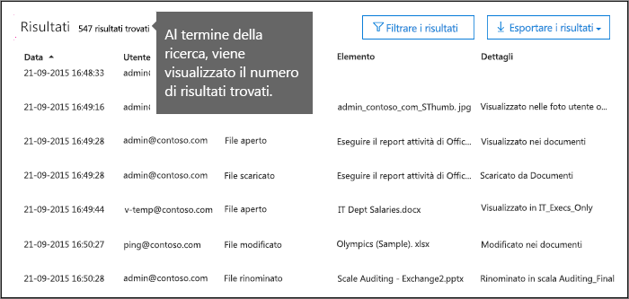
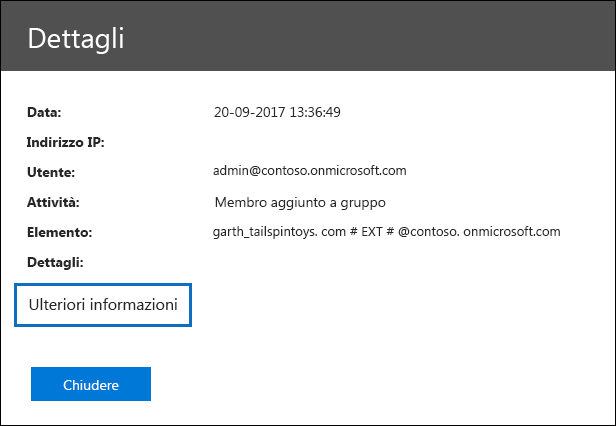
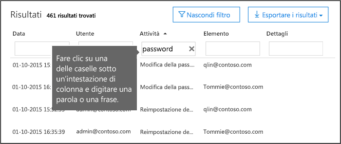
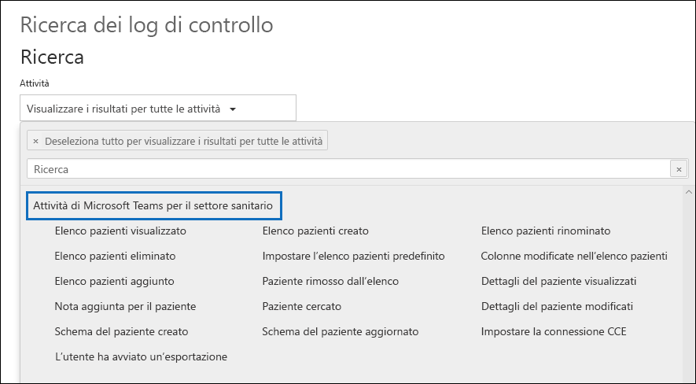

# <a name="search-the-audit-log-in-the-compliance-center"></a><span data-ttu-id="1c63b-103">Eseguire una ricerca nel log di controllo nel Centro conformità</span><span class="sxs-lookup"><span data-stu-id="1c63b-103">Search the audit log in the compliance center</span></span>

<span data-ttu-id="1c63b-p101">Se è necessario verificare se un utente ha visualizzato un documento specifico o ha eliminato un elemento dalla cassetta postale, è possibile usare il Centro conformità Microsoft 365 per eseguire una ricerca nel log di controllo unificato e visualizzare le attività di utenti e amministratori nell'organizzazione. Perché usare un log di controllo unificato? Perché è possibile cercare i tipi seguenti di [attività di utenti e amministratori](#audited-activities) in Microsoft 365:</span><span class="sxs-lookup"><span data-stu-id="1c63b-p101">Need to find if a user viewed a specific document or purged an item from their mailbox? If so, you can use the Microsoft 365 compliance center to search the unified audit log to view user and administrator activity in your organization. Why a unified audit log? Because you can search for the following types of [user and admin activity](#audited-activities) in Microsoft 365:</span></span>

- <span data-ttu-id="1c63b-108">Attività degli utenti in SharePoint Online e OneDrive for Business</span><span class="sxs-lookup"><span data-stu-id="1c63b-108">User activity in SharePoint Online and OneDrive for Business</span></span>

- <span data-ttu-id="1c63b-109">Attività utente in Exchange Online (registrazione di controllo delle cassette postali di Exchange)</span><span class="sxs-lookup"><span data-stu-id="1c63b-109">User activity in Exchange Online (Exchange mailbox audit logging)</span></span>

- <span data-ttu-id="1c63b-110">Attività amministratore in SharePoint Online</span><span class="sxs-lookup"><span data-stu-id="1c63b-110">Admin activity in SharePoint Online</span></span>

- <span data-ttu-id="1c63b-111">Attività amministratore in Azure Active Directory (servizio directory per Microsoft 365)</span><span class="sxs-lookup"><span data-stu-id="1c63b-111">Admin activity in Azure Active Directory (the directory service for Microsoft 365)</span></span>

- <span data-ttu-id="1c63b-112">Attività amministratore in Exchange Online (registrazione di controllo dell'amministratore di Exchange )</span><span class="sxs-lookup"><span data-stu-id="1c63b-112">Admin activity in Exchange Online (Exchange admin audit logging)</span></span>

- <span data-ttu-id="1c63b-113">Attività eDiscovery nel Centro sicurezza e conformità</span><span class="sxs-lookup"><span data-stu-id="1c63b-113">eDiscovery activities in the security and compliance center</span></span>

- <span data-ttu-id="1c63b-114">Attività utente e amministratore in Power BI</span><span class="sxs-lookup"><span data-stu-id="1c63b-114">User and admin activity in Power BI</span></span>

- <span data-ttu-id="1c63b-115">Attività utente e amministratore in Microsoft Teams</span><span class="sxs-lookup"><span data-stu-id="1c63b-115">User and admin activity in Microsoft Teams</span></span>

- <span data-ttu-id="1c63b-116">Attività utente e amministratore in Dynamics 365</span><span class="sxs-lookup"><span data-stu-id="1c63b-116">User and admin activity in Dynamics 365</span></span>

- <span data-ttu-id="1c63b-117">Attività utente e amministratore in Yammer</span><span class="sxs-lookup"><span data-stu-id="1c63b-117">User and admin activity in Yammer</span></span>

- <span data-ttu-id="1c63b-118">Attività utente e amministratore in Microsoft Power Automate</span><span class="sxs-lookup"><span data-stu-id="1c63b-118">User and admin activity in Microsoft Power Automate</span></span>

- <span data-ttu-id="1c63b-119">Attività utente e amministratore in Microsoft Stream</span><span class="sxs-lookup"><span data-stu-id="1c63b-119">User and admin activity in Microsoft Stream</span></span>

- <span data-ttu-id="1c63b-120">Attività di analisti e amministratori in Microsoft Workplace Analytics</span><span class="sxs-lookup"><span data-stu-id="1c63b-120">Analyst and admin activity in Microsoft Workplace Analytics</span></span>

- <span data-ttu-id="1c63b-121">Attività utente e amministratore in Microsoft Power Apps</span><span class="sxs-lookup"><span data-stu-id="1c63b-121">User and admin activity in Microsoft Power Apps</span></span>

- <span data-ttu-id="1c63b-122">Attività utente e amministratore in Microsoft Forms</span><span class="sxs-lookup"><span data-stu-id="1c63b-122">User and admin activity in Microsoft Forms</span></span>

- <span data-ttu-id="1c63b-123">Attività utente e amministratore per le etichette di riservatezza per siti che usano SharePoint Online o Microsoft Teams</span><span class="sxs-lookup"><span data-stu-id="1c63b-123">User and admin activity for sensitivity labels for sites that use SharePoint Online or Microsoft Teams</span></span>

## <a name="requirements-to-search-the-audit-log"></a><span data-ttu-id="1c63b-124">Requisiti per la ricerca nel log di controllo</span><span class="sxs-lookup"><span data-stu-id="1c63b-124">Requirements to search the audit log</span></span>

<span data-ttu-id="1c63b-125">Prima di iniziare la ricerca nel log di controllo, tenere presente quanto segue.</span><span class="sxs-lookup"><span data-stu-id="1c63b-125">Be sure to read the following items before you start searching the audit log.</span></span>

- <span data-ttu-id="1c63b-p102">È necessario che l'amministratore corrente o un altro amministratore attivi la registrazione di controllo prima di iniziare a eseguire ricerche nel log di controllo. Per attivare la registrazione, fare clic su **Avvia registrazione** nella pagina **Ricerca nel log di controllo** nel Centro sicurezza e conformità. Se questo collegamento non è visualizzato, il controllo è già stato attivato per l'organizzazione. Dopo l'attivazione, viene visualizzato un messaggio che indica che è in corso la preparazione del log di controllo e che sarà possibile eseguire una ricerca tra un paio d'ore, dopo il completamento della preparazione. Questa procedura deve essere eseguita una sola volta. Per ulteriori informazioni, vedere [Attivare o disattivare la ricerca nel log di controllo](turn-audit-log-search-on-or-off.md).</span><span class="sxs-lookup"><span data-stu-id="1c63b-p102">You (or another admin) must first turn on audit logging before you can start searching the audit log. To turn it on, click **Turn on auditing** on the **Audit log search** page in the Security & Compliance Center. (If you don't see this link, auditing has already been turned on for your organization.) After you turn it on, a message is displayed that says the audit log is being prepared and that you can run a search in a couple of hours after the preparation is complete. You only have to do this once. For more information, see [Turn audit log search on or off](turn-audit-log-search-on-or-off.md).</span></span>

  > [!NOTE]
  > <span data-ttu-id="1c63b-p103">Microsoft sta per impostare come predefinita l'attivazione del controllo. Nel frattempo, è possibile attivarlo come descritto in precedenza.</span><span class="sxs-lookup"><span data-stu-id="1c63b-p103">We're in the process of turning on auditing by default. Until then, you can turn it on as previously described.</span></span>

- <span data-ttu-id="1c63b-p104">È necessario avere il ruolo relativo ai log di controllo di sola lettura o ai log di controllo in Exchange Online per poter eseguire ricerche nel log di controllo. Per impostazione predefinita, questi ruoli sono assegnati ai gruppi di ruoli Gestione conformità e Gestione organizzazione nella pagina **Autorizzazioni** nell'interfaccia di amministrazione di Exchange. Gli amministratori globali di Office 365 e Microsoft 365 sono aggiunti automaticamente come membri del gruppo di ruoli Gestione organizzazione in Exchange Online. Per consentire a un utente di eseguire ricerche nel log di controllo con il livello minimo di privilegi, è possibile creare un gruppo di ruoli personalizzato in Exchange Online, aggiungere il ruolo relativo ai log di controllo di sola lettura o ai log di controllo e quindi aggiungere l'utente come membro del nuovo gruppo di ruoli. Per altre informazioni, vedere [Gestire i gruppi di ruoli in Exchange Online](https://go.microsoft.com/fwlink/p/?LinkID=730688).</span><span class="sxs-lookup"><span data-stu-id="1c63b-p104">You have to be assigned the View-Only Audit Logs or Audit Logs role in Exchange Online to search the audit log. By default, these roles are assigned to the Compliance Management and Organization Management role groups on the **Permissions** page in the Exchange admin center. Note global administrators in Office 365 and Microsoft 365 are automatically added as members of the Organization Management role group in Exchange Online. To give a user the ability to search the audit log with the minimum level of privileges, you can create a custom role group in Exchange Online, add the View-Only Audit Logs or Audit Logs role, and then add the user as a member of the new role group. For more information, see [Manage role groups in Exchange Online](https://go.microsoft.com/fwlink/p/?LinkID=730688).</span></span>

  > [!IMPORTANT]
  > <span data-ttu-id="1c63b-p105">Se si assegna a un utente il ruolo relativo ai log di controllo di sola lettura o ai log di controllo nella pagina **Autorizzazioni** nel Centro sicurezza e conformità, l'utente non potrà eseguire ricerche nel log di controllo. È necessario assegnare le autorizzazioni in Exchange Online. Ciò avviene perché il cmdlet sottostante usato per la ricerca nel log di controllo è un cmdlet di Exchange Online.</span><span class="sxs-lookup"><span data-stu-id="1c63b-p105">If you assign a user the View-Only Audit Logs or Audit Logs role on the **Permissions** page in the Security & Compliance Center, they won't be able to search the audit log. You have to assign the permissions in Exchange Online. This is because the underlying cmdlet used to search the audit log is an Exchange Online cmdlet.</span></span>

- <span data-ttu-id="1c63b-p106">Quando un utente o un amministratore esegue un’attività soggetta a controllo, viene generato e archiviato un record di controllo nel log di controllo dell’organizzazione. Il periodo di tempo per cui il record di controllo viene conservato (ed è disponibile per la ricerca nel log di controllo) varia in base all'abbonamento a Office 365 o Microsoft 365 Enterprise e, in particolare, al tipo di licenza assegnata a un utente specifico.</span><span class="sxs-lookup"><span data-stu-id="1c63b-p106">When an audited activity is performed by a user or admin, an audit record is generated and stored in the audit log for your organization. The length of time that an audit record is retained (and searchable in the audit log) depends on your Office 365 or Microsoft 365 Enterprise subscription, and specifically the type of the license that is assigned to specific users.</span></span>

  - <span data-ttu-id="1c63b-p107">Per gli utenti a cui è assegnata una licenza di Office 365 E5 o Microsoft 365 E5 (o gli utenti con una licenza per componente aggiuntivo Microsoft 365 E5 Compliance o Microsoft 365 E5 eDiscovery and Audit), i record di controllo per le attività di Azure Active Directory, Exchange e SharePoint vengono conservati per un anno per impostazione predefinita. Le organizzazioni, inoltre, possono creare criteri di conservazione per i log di controllo per conservare i record di controllo di attività relative ad altri servizi per un massimo di un anno. Per altre informazioni, vedere [Gestire i criteri di conservazione dei log di controllo](audit-log-retention-policies.md).</span><span class="sxs-lookup"><span data-stu-id="1c63b-p107">For users assigned an Office 365 E5 or Microsoft 365 E5 license (or users with a Microsoft 365 E5 Compliance or Microsoft 365 E5 eDiscovery and Audit add-on license), audit records for Azure Active Directory, Exchange, and SharePoint activity are retained for one year by default. Organizations can also create audit log retention policies to retain audit records for activities in other services for up to one year. For more information, see [Manage audit log retention policies](audit-log-retention-policies.md).</span></span>

    > [!NOTE]
    > <span data-ttu-id="1c63b-146">Se l'organizzazione ha partecipato al programma di anteprima privata per la conservazione dei record di controllo per un anno, la durata di conservazione per i record di controllo generati prima della data di implementazione della disponibilità generale non verrà reimpostata.</span><span class="sxs-lookup"><span data-stu-id="1c63b-146">If your organization participated in the private preview program for the one-year retention of audit records, the retention duration for audit records that were generated before the general availability rollout date will not be reset.</span></span>

  - <span data-ttu-id="1c63b-p108">Per gli utenti a cui è assegnata una qualsiasi altra licenza (non E5) di Office 365 o Microsoft 365, i record di controllo vengono conservati per 90 giorni. Per un elenco degli abbonamenti di Office 365 e Microsoft 365 che supportano la registrazione di controllo unificato, vedere [la descrizione del servizio Centro sicurezza e conformità](https://docs.microsoft.com/office365/servicedescriptions/office-365-platform-service-description/office-365-securitycompliance-center).</span><span class="sxs-lookup"><span data-stu-id="1c63b-p108">For users assigned any other (non-E5) Office 365 or Microsoft 365 license, audit records are retained for 90 days. For a list of Office 365 and Microsoft 365 subscriptions that support unified audit logging, see [the security and compliance center service description](https://docs.microsoft.com/office365/servicedescriptions/office-365-platform-service-description/office-365-securitycompliance-center).</span></span>

    > [!NOTE]
    > <span data-ttu-id="1c63b-p109">Anche se il controllo delle cassette postali è attivato per impostazione predefinita, per alcuni utenti gli eventi di controllo delle cassette postali potrebbero non essere trovati nelle ricerche nel log di controllo nel Centro sicurezza e conformità o nell'API Office 365 Management Activity. Per altre informazioni, vedere [Altre informazioni sulla registrazione di controllo delle cassette postali](enable-mailbox-auditing.md#more-information).</span><span class="sxs-lookup"><span data-stu-id="1c63b-p109">Even when mailbox auditing on by default is turned on, you might notice that mailbox audit events for some users aren't found in audit log searches in the Security & Compliance Center or via the Office 365 Management Activity API. For more information, see [More information about mailbox audit logging](enable-mailbox-auditing.md#more-information).</span></span>

- <span data-ttu-id="1c63b-151">Se si desidera disabilitare la ricerca nel log di controllo per l’organizzazione, è possibile eseguire questo comando nella sessione remota di PowerShell connessa all'organizzazione di Exchange Online:</span><span class="sxs-lookup"><span data-stu-id="1c63b-151">If you want to turn off audit log search for your organization, you can run the following command in remote PowerShell connected to your Exchange Online organization:</span></span>

  ```powershell
  Set-AdminAuditLogConfig -UnifiedAuditLogIngestionEnabled $false
  ```

    <span data-ttu-id="1c63b-152">Per attivare di nuovo la ricerca nel log di controllo, è possibile eseguire il comando seguente in PowerShell di Exchange Online:</span><span class="sxs-lookup"><span data-stu-id="1c63b-152">To turn on audit search again, you can run the following command in Exchange Online PowerShell:</span></span>

  ```powershell
  Set-AdminAuditLogConfig -UnifiedAuditLogIngestionEnabled $true
  ```

  <span data-ttu-id="1c63b-153">Per altre informazioni, vedere [Disabilitare la ricerca nel log di controllo](turn-audit-log-search-on-or-off.md).</span><span class="sxs-lookup"><span data-stu-id="1c63b-153">For more information, see [Turn off audit log search](turn-audit-log-search-on-or-off.md).</span></span>

- <span data-ttu-id="1c63b-p110">Come indicato in precedenza, il cmdlet sottostante usato per la ricerca nel log di controllo è un cmdlet di Exchange Online, ovvero **Search-UnifiedAuditLog**. Ciò significa che è possibile usare questo cmdlet anziché la pagina **Ricerca log di controllo** nel Centro sicurezza e conformità per eseguire una ricerca nel log di controllo. È necessario eseguire questo cmdlet in una sessione remota di PowerShell connessa all'organizzazione di Exchange Online. Per altre informazioni, vedere [Search-UnifiedAuditLog](https://go.microsoft.com/fwlink/p/?linkid=834776).</span><span class="sxs-lookup"><span data-stu-id="1c63b-p110">As previously stated, the underlying cmdlet used to search the audit log is an Exchange Online cmdlet, which is **Search-UnifiedAuditLog**. That means you can use this cmdlet to search the audit log instead of using the **Audit log search** page in the Security & Compliance Center. You have to run this cmdlet in remote PowerShell connected to your Exchange Online organization. For more information, see [Search-UnifiedAuditLog](https://go.microsoft.com/fwlink/p/?linkid=834776).</span></span>

  <span data-ttu-id="1c63b-158">Per informazioni sull'esportazione dei risultati della ricerca restituiti dal cmdlet **Search-UnifiedAuditLog** in un file CSV, vedere la sezione "Suggerimenti per l'esportazione e la visualizzazione del log di controllo" in [Esportare, configurare e visualizzare i record del log di controllo](export-view-audit-log-records.md#tips-for-exporting-and-viewing-the-audit-log).</span><span class="sxs-lookup"><span data-stu-id="1c63b-158">For information about exporting the search results returned by the **Search-UnifiedAuditLog** cmdlet to a CSV file, see the "Tips for exporting and viewing the audit log" section in [Export, configure, and view audit log records](export-view-audit-log-records.md#tips-for-exporting-and-viewing-the-audit-log).</span></span>

- <span data-ttu-id="1c63b-p111">Per scaricare i dati a livello di programmazione dal log di controllo, è consigliabile usare l'API Office 365 Management Activity invece di uno script di PowerShell. L'API Office 365 Management Activity è un servizio Web REST che può essere usato per sviluppare soluzioni di monitoraggio di operazioni, sicurezza e conformità per l'organizzazione. Per altre informazioni, vedere [Riferimento API Management Activity di Office 365](https://docs.microsoft.com/office/office-365-management-api/office-365-management-activity-api-reference).</span><span class="sxs-lookup"><span data-stu-id="1c63b-p111">If you want to programmatically download data from the audit log, we recommend that you use the Office 365 Management Activity API instead of using a PowerShell script. The Office 365 Management Activity API is a REST web service that you can use to develop operations, security, and compliance monitoring solutions for your organization. For more information, see [Office 365 Management Activity API reference](https://docs.microsoft.com/office/office-365-management-api/office-365-management-activity-api-reference).</span></span>

- <span data-ttu-id="1c63b-p112">La restituzione del record del log di controllo nei risultati della ricerca nel log di controllo può richiedere fino a 30 minuti o 24 ore dal momento in cui si verifica l'evento. La tabella seguente mostra il tempo necessario per i diversi servizi di Office 365.</span><span class="sxs-lookup"><span data-stu-id="1c63b-p112">It can take up to 30 minutes or up to 24 hours after an event occurs for the corresponding audit log record to be returned in the results of an audit log search. The following table shows the time it takes for the different services in Office 365.</span></span>

  |<span data-ttu-id="1c63b-164">Servizio o funzionalità Microsoft 365</span><span class="sxs-lookup"><span data-stu-id="1c63b-164">Microsoft 365 service or feature</span></span>|<span data-ttu-id="1c63b-165">30 minuti</span><span class="sxs-lookup"><span data-stu-id="1c63b-165">30 minutes</span></span>|<span data-ttu-id="1c63b-166">24 ore</span><span class="sxs-lookup"><span data-stu-id="1c63b-166">24 hours</span></span>|
  |:-----|:-----:|:-----:|
  |<span data-ttu-id="1c63b-167">Defender per Office 365 e Threat Intelligence</span><span class="sxs-lookup"><span data-stu-id="1c63b-167">Defender for Office 365 and Threat Intelligence</span></span>|||
  |<span data-ttu-id="1c63b-169">Azure Active Directory (eventi di accesso utente)</span><span class="sxs-lookup"><span data-stu-id="1c63b-169">Azure Active Directory (user login events)</span></span>|||
  |<span data-ttu-id="1c63b-171">Interfaccia di amministrazione di Azure Active Directory (eventi di amministrazione)</span><span class="sxs-lookup"><span data-stu-id="1c63b-171">Azure Active Directory (admin events)</span></span>|||
  |<span data-ttu-id="1c63b-173">Prevenzione della perdita di dati</span><span class="sxs-lookup"><span data-stu-id="1c63b-173">Data Loss Prevention</span></span>|||
  |<span data-ttu-id="1c63b-175">Dynamics 365 CRM</span><span class="sxs-lookup"><span data-stu-id="1c63b-175">Dynamics 365 CRM</span></span>|||
  |<span data-ttu-id="1c63b-177">eDiscovery</span><span class="sxs-lookup"><span data-stu-id="1c63b-177">eDiscovery</span></span>|||
  |<span data-ttu-id="1c63b-179">Exchange Online</span><span class="sxs-lookup"><span data-stu-id="1c63b-179">Exchange Online</span></span>|||
  |<span data-ttu-id="1c63b-181">Microsoft Power Automate</span><span class="sxs-lookup"><span data-stu-id="1c63b-181">Microsoft Power Automate</span></span>|||
  |<span data-ttu-id="1c63b-183">Microsoft Project</span><span class="sxs-lookup"><span data-stu-id="1c63b-183">Microsoft Project</span></span>|||
  |<span data-ttu-id="1c63b-185">Microsoft Stream</span><span class="sxs-lookup"><span data-stu-id="1c63b-185">Microsoft Stream</span></span>|||
  |<span data-ttu-id="1c63b-187">Microsoft Teams</span><span class="sxs-lookup"><span data-stu-id="1c63b-187">Microsoft Teams</span></span>|||
  |<span data-ttu-id="1c63b-189">Power Apps</span><span class="sxs-lookup"><span data-stu-id="1c63b-189">Power Apps</span></span>|||
  |<span data-ttu-id="1c63b-191">Power BI</span><span class="sxs-lookup"><span data-stu-id="1c63b-191">Power BI</span></span>|||
  |<span data-ttu-id="1c63b-193">Centro sicurezza e conformità</span><span class="sxs-lookup"><span data-stu-id="1c63b-193">Security & Compliance Center</span></span>|||
  |<span data-ttu-id="1c63b-195">Etichette di riservatezza</span><span class="sxs-lookup"><span data-stu-id="1c63b-195">Sensitivity labels</span></span>|||
  |<span data-ttu-id="1c63b-197">SharePoint Online e OneDrive for Business</span><span class="sxs-lookup"><span data-stu-id="1c63b-197">SharePoint Online and OneDrive for Business</span></span>|||
  |<span data-ttu-id="1c63b-199">Workplace Analytics</span><span class="sxs-lookup"><span data-stu-id="1c63b-199">Workplace Analytics</span></span>|||
  |<span data-ttu-id="1c63b-201">Yammer</span><span class="sxs-lookup"><span data-stu-id="1c63b-201">Yammer</span></span>||||
  |<span data-ttu-id="1c63b-203">Microsoft Forms</span><span class="sxs-lookup"><span data-stu-id="1c63b-203">Microsoft Forms</span></span>||
  ||||

- <span data-ttu-id="1c63b-p113">Azure Active Directory (Azure AD) è il servizio directory per Office 365. Il log di controllo unificato contiene le attività di utenti, gruppi, applicazioni, domini e directory eseguite nell'interfaccia di amministrazione di Microsoft 365 o nel portale di gestione di Azure. Per un elenco completo degli eventi di Azure AD, vedere [Eventi del report di controllo di Azure Active Directory](https://go.microsoft.com/fwlink/p/?LinkID=616549).</span><span class="sxs-lookup"><span data-stu-id="1c63b-p113">Azure Active Directory (Azure AD) is the directory service for Office 365. The unified audit log contains user, group, application, domain, and directory activities performed in the Microsoft 365 admin center or in the Azure management portal. For a complete list of Azure AD events, see [Azure Active Directory Audit Report Events](https://go.microsoft.com/fwlink/p/?LinkID=616549).</span></span>

- <span data-ttu-id="1c63b-p114">Per impostazione predefinita, la registrazione di controllo per Power BI non è abilitata. Per cercare le azioni di Power BI nel log di controllo, è necessario abilitare il controllo nel portale di amministrazione di Power BI. Per istruzioni, vedere la sezione "Log di controllo" nel [portale di amministrazione di Power BI](https://docs.microsoft.com/power-bi/service-admin-portal#audit-logs).</span><span class="sxs-lookup"><span data-stu-id="1c63b-p114">Audit logging for Power BI isn't enabled by default. To search for Power BI activities in the audit log, you have to enable auditing in the Power BI admin portal. For instructions, see the "Audit logs" section in [Power BI admin portal](https://docs.microsoft.com/power-bi/service-admin-portal#audit-logs).</span></span>

## <a name="search-the-audit-log"></a><span data-ttu-id="1c63b-211">Eseguire ricerche nel log di controllo</span><span class="sxs-lookup"><span data-stu-id="1c63b-211">Search the audit log</span></span>

> [!NOTE]
> <span data-ttu-id="1c63b-p115">Si è verificato un problema per cui le attività di Azure AD non erano disponibili nello strumento di ricerca nel log di controllo dal 22 ottobre 2020 al 6 novembre 2020. Queste attività includono le attività di Azure AD di amministrazione utenti, di amministrazione gruppi, di amministrazione applicazioni, di amministrazione ruoli e di amministrazione directory. Gli eventi mancanti per tale periodo saranno resi disponibili nei prossimi giorni. Il completamento di questa operazione è previsto entro il 20 novembre 2020. In alcuni casi, potrebbero essere visualizzati dati di eventi duplicati per gli eventi generati tra il 26 ottobre 2020 e il 05 novembre 2020.</span><span class="sxs-lookup"><span data-stu-id="1c63b-p115">There was an issue with Azure AD activities being unavailable in the audit log search tool from October 22, 2020 to November 6, 2020. These activites include Azure AD user administration activities, group administration activities, application administration activities, role administration activities, and directory administration activities. The missing events for the period of impact will be available over the next few days, and is expected to take no later than November 20, 2020 to complete. In some cases, customers might notice duplicate event data for events generated between October 26, 2020 and November 05, 2020.</span></span>
    
<span data-ttu-id="1c63b-216">Ecco la procedura per la ricerca nel log di audit in Office 365.</span><span class="sxs-lookup"><span data-stu-id="1c63b-216">Here's the process for searching the audit log in Office 365.</span></span>

[<span data-ttu-id="1c63b-217">Passaggio 1: Eseguire una ricerca nel log di controllo</span><span class="sxs-lookup"><span data-stu-id="1c63b-217">Step 1: Run an audit log search</span></span>](#step-1-run-an-audit-log-search)

[<span data-ttu-id="1c63b-218">Passaggio 2: Visualizzare i risultati della ricerca</span><span class="sxs-lookup"><span data-stu-id="1c63b-218">Step 2: View the search results</span></span>](#step-2-view-the-search-results)

[<span data-ttu-id="1c63b-219">Passaggio 3: Filtrare i risultati della ricerca</span><span class="sxs-lookup"><span data-stu-id="1c63b-219">Step 3: Filter the search results</span></span>](#step-3-filter-the-search-results)

[<span data-ttu-id="1c63b-220">Passaggio 4: Esportare i risultati della ricerca in un file</span><span class="sxs-lookup"><span data-stu-id="1c63b-220">Step 4: Export the search results to a file</span></span>](#step-4-export-the-search-results-to-a-file)

### <a name="step-1-run-an-audit-log-search"></a><span data-ttu-id="1c63b-221">Passaggio 1: Eseguire una ricerca nel log di controllo</span><span class="sxs-lookup"><span data-stu-id="1c63b-221">Step 1: Run an audit log search</span></span>

1. <span data-ttu-id="1c63b-222">Passare a [https://protection.office.com](https://protection.office.com).</span><span class="sxs-lookup"><span data-stu-id="1c63b-222">Go to [https://protection.office.com](https://protection.office.com).</span></span>

    > [!TIP]
    > <span data-ttu-id="1c63b-p116">Usare una sessione di esplorazione privata (invece di una normale) per accedere al Centro sicurezza e conformità per impedire l'uso delle credenziali con cui si è attualmente connessi. Per aprire una sessione InPrivate Browsing in Internet Explorer o Microsoft Edge, premere CTRL+MAIUSC+P. Per aprire una sessione di esplorazione privata in Google Chrome (chiamata finestra di navigazione in incognito), premere CTRL+MAIUSC+N.</span><span class="sxs-lookup"><span data-stu-id="1c63b-p116">Use a private browsing session (not a regular session) to access the Security & Compliance Center because this will prevent the credential that you are currently logged on with from being used. To open an InPrivate Browsing session in Internet Explorer or Microsoft Edge, just press CTRL+SHIFT+P. To open a private browsing session in Google Chrome (called an incognito window), press CTRL+SHIFT+N.</span></span>

2. <span data-ttu-id="1c63b-226">Accedere usando l'account aziendale o dell'istituto di istruzione.</span><span class="sxs-lookup"><span data-stu-id="1c63b-226">Sign in using your work or school account.</span></span>

3. <span data-ttu-id="1c63b-227">Nel riquadro sinistro del Centro sicurezza e conformità, fare clic su **Cerca**, quindi su **Ricerca log di controllo**.</span><span class="sxs-lookup"><span data-stu-id="1c63b-227">In the left pane of the Security & Compliance Center, click **Search**, and then click **Audit log search**.</span></span>

    <span data-ttu-id="1c63b-228">Viene visualizzata la pagina **Ricerca log di controllo**.</span><span class="sxs-lookup"><span data-stu-id="1c63b-228">The **Audit log search** page is displayed.</span></span>

    

    > [!NOTE]
    > <span data-ttu-id="1c63b-p117">È necessario attivare la registrazione di controllo per poter eseguire una ricerca nel log di controllo. Se è visualizzato il collegamento **Avvia registrazione attività utenti e amministratori**, fare clic su di esso per attivare il controllo. Se questo collegamento non è visualizzato, il controllo è già stato attivato per l'organizzazione.</span><span class="sxs-lookup"><span data-stu-id="1c63b-p117">You have to first turn on audit logging before you can run an audit log search. If the **Start recording user and admin activity** link is displayed, click it to turn on auditing. If you don't see this link, auditing has already been turned on for your organization.</span></span>

4. <span data-ttu-id="1c63b-233">Configurare i criteri di ricerca seguenti: </span><span class="sxs-lookup"><span data-stu-id="1c63b-233">Configure the following search criteria:</span></span>

   1. <span data-ttu-id="1c63b-p118">**Attività**: Fare clic sull'elenco a discesa per visualizzare le attività che è possibile cercare. Le attività di utenti e amministratori sono organizzate in gruppi di attività correlate. È possibile selezionare attività specifiche oppure è possibile fare clic sul nome del gruppo di attività per selezionare tutte le attività del gruppo. È anche possibile fare clic su un'attività selezionata per annullare la selezione. Dopo aver eseguito la ricerca, vengono visualizzate solo le voci del log di controllo per le attività selezionate. Se si seleziona **Visualizza i risultati per tutte le attività**, vengono visualizzati i risultati per tutte le attività eseguite dall'utente o dal gruppo di utenti selezionato.</span><span class="sxs-lookup"><span data-stu-id="1c63b-p118">**Activities**: Click the drop-down list to display the activities that you can search for. User and admin activities are organized into groups of related activities. You can select specific activities or you can click the activity group name to select all activities in the group. You can also click a selected activity to clear the selection. After you run the search, only the audit log entries for the selected activities are displayed. Selecting **Show results for all activities** displays results for all activities performed by the selected user or group of users.</span></span>

      <span data-ttu-id="1c63b-p119">Nel log di controllo vengono registrate più di 100 attività di utenti e amministratori. Fare clic sulla scheda **Attività controllate** in questo articolo per visualizzare le descrizioni delle singole attività per i vari servizi.</span><span class="sxs-lookup"><span data-stu-id="1c63b-p119">Over 100 user and admin activities are logged in the audit log. Click the **Audited activities** tab at the topic of this article to see the descriptions of every activity in each of the different services.</span></span>

   1. <span data-ttu-id="1c63b-p120">**Data inizio** e **Data fine**: Per impostazione predefinita, sono selezionati gli ultimi sette giorni. Selezionare un intervallo di date e ore per visualizzare gli eventi che si sono verificati in tale periodo. La data e l'ora sono specificate in formato UTC (Coordinated Universal Time). L'intervallo di date massimo che è possibile specificare è di 90 giorni. Se l'intervallo di date selezionato è maggiore di 90 giorni, verrà visualizzato un errore.</span><span class="sxs-lookup"><span data-stu-id="1c63b-p120">**Start date** and **End date**: The last seven days are selected by default. Select a date and time range to display the events that occurred within that period. The date and time are presented in Coordinated Universal Time (UTC) format. The maximum date range that you can specify is 90 days. An error is displayed if the selected date range is greater than 90 days.</span></span>

      > [!TIP]
      > <span data-ttu-id="1c63b-p121">Se si usa l'intervallo di date massimo di 90 giorni, selezionare l'ora corrente per **Data inizio**. In caso contrario, verrà visualizzato un errore che indica che la data di inizio è precedente alla data di fine. Se è stato attivato il controllo negli ultimi 90 giorni, l'intervallo di date massimo non può iniziare prima della data in cui il controllo è stato attivato.</span><span class="sxs-lookup"><span data-stu-id="1c63b-p121">If you're using the maximum date range of 90 days, select the current time for the **Start date**. Otherwise, you'll receive an error saying that the start date is earlier than the end date. If you've turned on auditing within the last 90 days, the maximum date range can't start before the date that auditing was turned on.</span></span>

   1. <span data-ttu-id="1c63b-p122">**Utenti**: Fare clic in questa casella e quindi selezionare uno o più utenti per cui visualizzare i risultati della ricerca. Nell'elenco di risultati vengono visualizzate le voci del log di controllo per l'azione selezionata eseguita dagli utenti specificati in questa casella. Lasciare la casella vuota per restituire le voci per tutti gli utenti (e gli account del servizio) nell'organizzazione.</span><span class="sxs-lookup"><span data-stu-id="1c63b-p122">**Users**: Click in this box and then select one or more users to display search results for. The audit log entries for the selected activity performed by the users you select in this box are displayed in the list of results. Leave this box blank to return entries for all users (and service accounts) in your organization.</span></span>

   1. <span data-ttu-id="1c63b-p123">**File, cartella o sito**: Digitare alcuni o tutti i nomi di file o cartelle per cercare l'attività relativa al file o alla cartella che contiene la parola chiave specificata. È anche possibile specificare l'URL di un file o di una cartella. Per usare un URL, digitare il percorso URL completo oppure, se si digita una parte dell'URL, non includere spazi o caratteri speciali.</span><span class="sxs-lookup"><span data-stu-id="1c63b-p123">**File, folder, or site**: Type some or all of a file or folder name to search for activity related to the file of folder that contains the specified keyword. You can also specify a URL of a file or folder. If you use a URL, be sure the type the full URL path or if you type a portion of the URL, don't include any special characters or spaces.</span></span>

      <span data-ttu-id="1c63b-256">Lasciare questa casella vuota per restituire le voci per tutti i file e le cartelle nell'organizzazione.</span><span class="sxs-lookup"><span data-stu-id="1c63b-256">Leave this box blank to return entries for all files and folders in your organization.</span></span>

      > [!TIP]
      >
      > - <span data-ttu-id="1c63b-257">Se si stanno cercando tutte le attività correlate a un **sito**, aggiungere il simbolo jolly (\*) dopo l'URL per restituire tutte le voci per quel sito; ad esempio, `"https://contoso-my.sharepoint.com/personal*"`.</span><span class="sxs-lookup"><span data-stu-id="1c63b-257">If you're looking for all activities related to a **site**, add the wildcard symbol (\*) after the URL to return all entries for that site; for example, `"https://contoso-my.sharepoint.com/personal*"`.</span></span>
      >
      > - <span data-ttu-id="1c63b-258">Se si stanno cercando tutte le attività correlate a un **file**, aggiungere il simbolo jolly (\*) prima del nome file per restituire tutte le voci per quel file; ad esempio, `"*Customer_Profitability_Sample.csv"`.</span><span class="sxs-lookup"><span data-stu-id="1c63b-258">If you're looking for all activities related to a **file**, add the wildcard symbol (\*) before the file name to return all entries for that file; for example, `"*Customer_Profitability_Sample.csv"`.</span></span>

5. <span data-ttu-id="1c63b-259">Fare clic su **Cerca** per eseguire la ricerca usando i criteri di ricerca.</span><span class="sxs-lookup"><span data-stu-id="1c63b-259">Click **Search** to run the search using your search criteria.</span></span>

   <span data-ttu-id="1c63b-p124">I risultati della ricerca vengono caricati e, dopo alcuni istanti, vengono visualizzati in **Risultati**. Al termine della ricerca viene visualizzato il numero di risultati trovati. Verranno visualizzati al massimo 5.000 eventi nel riquadro **Risultati**, con incrementi di 150 eventi. Se ci sono più di 5.000 eventi che soddisfano i criteri di ricerca, verranno visualizzati i 5.000 eventi più recenti.</span><span class="sxs-lookup"><span data-stu-id="1c63b-p124">The search results are loaded, and after a few moments they are displayed under **Results**. When the search is finished, the number of results found is displayed. A maximum of 5,000 events will be displayed in the **Results** pane in increments of 150 events. If more than 5,000 events meet the search criteria, the most recent 5,000 events are displayed.</span></span>

   

#### <a name="tips-for-searching-the-audit-log"></a><span data-ttu-id="1c63b-265">Suggerimenti per la ricerca nel log di controllo</span><span class="sxs-lookup"><span data-stu-id="1c63b-265">Tips for searching the audit log</span></span>

- <span data-ttu-id="1c63b-p125">È possibile selezionare attività specifiche da cercare facendo clic sul relativo nome. In alternativa, è possibile cercare tutte le attività in un gruppo, ad esempio **Attività su file e cartelle**, facendo clic sul nome del gruppo. Se è selezionata un'attività, è possibile fare clic su di essa per annullare la selezione. È anche possibile usare la casella di ricerca per visualizzare le attività contenenti la parola chiave digitata.</span><span class="sxs-lookup"><span data-stu-id="1c63b-p125">You can select specific activities to search for by clicking the activity name. Or you can search for all activities in a group (such as **File and folder activities**) by clicking the group name. If an activity is selected, you can click it to cancel the selection. You can also use the search box to display the activities that contain the keyword that you type.</span></span>

  

- <span data-ttu-id="1c63b-p126">È necessario selezionare **Visualizza i risultati per tutte le attività** nell'elenco **Attività** per visualizzare gli eventi del log di controllo dell'amministratore di Exchange. Gli eventi di questo log di controllo mostrano un nome di cmdlet, ad esempio **Set-Mailbox**, nella colonna **Attività** dei risultati. Per altre informazioni, fare clic sulla scheda **Attività controllate** in questo argomento e quindi fare clic su **Attività di amministrazione di Exchange**.</span><span class="sxs-lookup"><span data-stu-id="1c63b-p126">You have to select **Show results for all activities** in the **Activities** list to display events from the Exchange admin audit log. Events from this audit log display a cmdlet name (for example, **Set-Mailbox**) in the **Activity** column in the results. For more information, click the **Audited activities** tab in this topic and then click **Exchange admin activities**.</span></span>

  <span data-ttu-id="1c63b-p127">Allo stesso modo, esistono alcune attività di controllo che non hanno un elemento corrispondente nell'elenco **Attività**. Se si conosce il nome dell'operazione per queste attività, è possibile cercare tutte le attività, quindi filtrare i risultati digitando il nome dell'operazione nella casella per la colonna **Attività**. Vedere [Passaggio 3: Filtrare i risultati di ricerca](#step-3-filter-the-search-results) per altre informazioni su come filtrare i risultati.</span><span class="sxs-lookup"><span data-stu-id="1c63b-p127">Similarly, there are some auditing activities that don't have a corresponding item in the **Activities** list. If you know the name of the operation for these activities, you can search for all activities, then filter the results by typing the name of the operation in the box for the **Activity** column. See [Step 3: Filter the search results](#step-3-filter-the-search-results) for more information about filtering the results.</span></span>

- <span data-ttu-id="1c63b-p128">Fare clic su **Cancella** per cancellare i criteri di ricerca correnti. L'intervallo di date torna impostato sul valore predefinito corrispondente agli ultimi sette giorni. È anche possibile fare clic su **Deseleziona tutto per visualizzare i risultati per tutte le attività** per annullare tutte le attività selezionate.</span><span class="sxs-lookup"><span data-stu-id="1c63b-p128">Click **Clear** to clear the current search criteria. The date range returns to the default of the last seven days. You can also click **Clear all to show results for all activities** to cancel all selected activities.</span></span>

- <span data-ttu-id="1c63b-p129">Se vengono trovati 5.000 risultati, è probabile che ci siano più di 5.000 eventi che soddisfano i criteri di ricerca. È possibile perfezionare i criteri di ricerca ed eseguire di nuovo la ricerca in modo che vengano restituiti meno risultati oppure è possibile esportare tutti i risultati della ricerca selezionando **Esporta risultati** \> **Scarica tutti i risultati**.</span><span class="sxs-lookup"><span data-stu-id="1c63b-p129">If 5,000 results are found, you can probably assume that there are more than 5,000 events that met the search criteria. You can either refine the search criteria and rerun the search to return fewer results, or you can export all of the search results by selecting **Export results** \> **Download all results**.</span></span>

### <a name="step-2-view-the-search-results"></a><span data-ttu-id="1c63b-282">Passaggio 2: Visualizzare i risultati della ricerca</span><span class="sxs-lookup"><span data-stu-id="1c63b-282">Step 2: View the search results</span></span>

<span data-ttu-id="1c63b-p130">I risultati di una ricerca nel log di controllo vengono visualizzati in **Risultati** nella pagina **Ricerca log di controllo**. Come affermato in precedenza, vengono visualizzati al massimo 5.000 eventi (i più recenti) in incrementi di 150 eventi. Per visualizzare più eventi, è possibile usare la barra di scorrimento nel riquadro **Risultati** oppure è possibile premere **MAIUSC+FINE** per visualizzare i eventi 150 successivi.</span><span class="sxs-lookup"><span data-stu-id="1c63b-p130">The results of an audit log search are displayed under **Results** on the **Audit log search** page. As previously stated a maximum of 5,000 (newest) events are displayed in increments of 150 events. To display more events you can use the scroll bar in the **Results** pane or you can press **Shift + End** to display the next 150 events.</span></span>

<span data-ttu-id="1c63b-286">I risultati includono le informazioni seguenti relative a ogni evento restituito dalla ricerca:</span><span class="sxs-lookup"><span data-stu-id="1c63b-286">The results contain the following information about each event returned by the search:</span></span>

- <span data-ttu-id="1c63b-287">**Data**: La data e l’ora (in formato UTC) in cui si è verificato l'evento.</span><span class="sxs-lookup"><span data-stu-id="1c63b-287">**Date**: The date and time (in UTC format) when the event occurred.</span></span>

- <span data-ttu-id="1c63b-p131">**Indirizzo IP**: Indirizzo IP del dispositivo usato quando l'attività è stata registrata. L'indirizzo IP viene visualizzato nel formato IPv4 o IPv6.</span><span class="sxs-lookup"><span data-stu-id="1c63b-p131">**IP address**: The IP address of the device that was used when the activity was logged. The IP address is displayed in either an IPv4 or IPv6 address format.</span></span>

   > [!NOTE]
  > <span data-ttu-id="1c63b-p132">Per alcuni servizi, il valore visualizzato in questo campo può corrispondere all'indirizzo IP di un'applicazione attendibile (ad esempio Office nelle app Web) che contatta il servizio per conto dell'utente e non all'indirizzo IP del dispositivo usato dall’utente che ha eseguito l'attività. Inoltre, per le attività di amministrazione (o attività eseguite da un account di sistema) per gli eventi correlati ad Azure Active Directory, l'indirizzo IP non viene registrato e il valore visualizzato nel campo è `null`.</span><span class="sxs-lookup"><span data-stu-id="1c63b-p132">For some services, the value displayed in this field might be the IP address for a trusted application (for example, Office on the web apps) calling into the service on behalf of a user and not the IP address of the device used by person who performed the activity. Also, for admin activity (or activity performed by a system account) for Azure Active Directory-related events, the IP address isn't logged and the value displayed in this field is `null`.</span></span>

- <span data-ttu-id="1c63b-292">**Utente**: L’utente (o account del servizio) che ha eseguito l'attività che ha attivato l'evento.</span><span class="sxs-lookup"><span data-stu-id="1c63b-292">**User**: The user (or service account) who performed the action that triggered the event.</span></span>

- <span data-ttu-id="1c63b-p133">**Attività**: L’attività eseguita dall'utente. Questo valore corrisponde alle attività selezionate nell'elenco a discesa **Attività**. Per un evento del log di controllo dell'amministratore di Exchange, il valore in questa colonna è un cmdlet di Exchange. </span><span class="sxs-lookup"><span data-stu-id="1c63b-p133">**Activity**: The activity performed by the user. This value corresponds to the activities that you selected in the **Activities** drop down list. For an event from the Exchange admin audit log, the value in this column is an Exchange cmdlet.</span></span>

- <span data-ttu-id="1c63b-p134">**Elemento**: L’oggetto creato o modificato come risultato dell'attività corrispondente, ad esempio il file che è stato visualizzato o modificato oppure l'account utente che è stato aggiornato. Non tutte le attività hanno un valore in questa colonna.</span><span class="sxs-lookup"><span data-stu-id="1c63b-p134">**Item**: The object that was created or modified as a result of the corresponding activity. For example, the file that was viewed or modified or the user account that was updated. Not all activities have a value in this column.</span></span>

- <span data-ttu-id="1c63b-p135">**Dettagli**: Informazioni aggiuntive su un'attività. Anche in questo caso, non tutte le attività hanno un valore.</span><span class="sxs-lookup"><span data-stu-id="1c63b-p135">**Detail**: Additional information about an activity. Again, not all activities have a value.</span></span>

> [!TIP]
> <span data-ttu-id="1c63b-p136">Fare clic su un'intestazione di colonna in **Risultati** per ordinare i risultati. È possibile ordinare i risultati dalla A alla Z o dalla Z alla A. Fare clic sull'intestazione **Data** per ordinare i risultati dal meno recente al più recente o viceversa.</span><span class="sxs-lookup"><span data-stu-id="1c63b-p136">Click a column header under **Results** to sort the results. You can sort the results from A to Z or Z to A. Click the **Date** header to sort the results from oldest to newest or newest to oldest.</span></span>

#### <a name="view-the-details-for-a-specific-event"></a><span data-ttu-id="1c63b-303">Visualizzare i dettagli di un evento specifico</span><span class="sxs-lookup"><span data-stu-id="1c63b-303">View the details for a specific event</span></span>

<span data-ttu-id="1c63b-p137">È possibile visualizzare altri dettagli di un evento facendo clic sul record dell'evento nell'elenco dei risultati della ricerca. Verrà visualizzata una pagina **Dettagli** contenente le proprietà dettagliate del record dell'evento. Le proprietà visualizzate dipendono dal servizio in cui si verifica l'evento. Per visualizzare questi dettagli, fare clic su **Altre informazioni**. Per le descrizioni, vedere [Proprietà dettagliate nel log di controllo](detailed-properties-in-the-office-365-audit-log.md).</span><span class="sxs-lookup"><span data-stu-id="1c63b-p137">You can view more details about an event by clicking the event record in the list of search results. A **Details** page is displayed that contains the detailed properties from the event record. The properties that are displayed depend on the service in which the event occurs. To display these details, click **More information**. For descriptions, see [Detailed properties in the audit log](detailed-properties-in-the-office-365-audit-log.md).</span></span>



### <a name="step-3-filter-the-search-results"></a><span data-ttu-id="1c63b-310">Passaggio 3: Filtrare i risultati della ricerca</span><span class="sxs-lookup"><span data-stu-id="1c63b-310">Step 3: Filter the search results</span></span>

<span data-ttu-id="1c63b-p138">Oltre a ordinare i risultati di una ricerca nel log di controllo, è anche possibile filtrarli. Questa funzionalità è molto utile perché consente di filtrare rapidamente i risultati per un'attività o un utente specifico. È possibile iniziare da una ricerca più ampia e quindi filtrare rapidamente i risultati per visualizzare eventi specifici. È quindi possibile restringere i criteri ed eseguire di nuovo la ricerca affinché venga restituito un set di risultati più piccolo e conciso.</span><span class="sxs-lookup"><span data-stu-id="1c63b-p138">In addition to sorting, you can also filter the results of an audit log search. This is a great feature that can help you quickly filter the results for a specific user or activity. You can initially create a wide search and then quickly filter the results to see specific events. Then you can narrow the search criteria and rerun the search to return a smaller, more concise set of results.</span></span>

<span data-ttu-id="1c63b-315">Per filtrare i risultati:</span><span class="sxs-lookup"><span data-stu-id="1c63b-315">To filter the results:</span></span>

1. <span data-ttu-id="1c63b-316">Eseguire una ricerca nel log di controllo.</span><span class="sxs-lookup"><span data-stu-id="1c63b-316">Run an audit log search.</span></span>

2. <span data-ttu-id="1c63b-317">Quando vengono visualizzati i risultati, fare clic su **Filtra risultati**.</span><span class="sxs-lookup"><span data-stu-id="1c63b-317">When the results are displayed, click **Filter results**.</span></span>

   <span data-ttu-id="1c63b-318">Sotto ogni intestazione di colonna vengono visualizzate le caselle delle parole chiave.</span><span class="sxs-lookup"><span data-stu-id="1c63b-318">Keyword boxes are displayed under each column header.</span></span>

3. <span data-ttu-id="1c63b-p139">Fare clic su una delle caselle sotto un'intestazione di colonna e digitare una parola o una frase, a seconda della colonna in cui si sta eseguendo il filtro. I risultati verranno riorganizzati dinamicamente per visualizzare gli eventi corrispondenti al filtro.</span><span class="sxs-lookup"><span data-stu-id="1c63b-p139">Click one of the boxes under a column header and type a word or phrase, depending on the column you're filtering on. The results will dynamically readjust to display the events that match your filter.</span></span>

   

4. <span data-ttu-id="1c63b-322">Per cancellare un filtro, fare clic su **X** nella casella del filtro oppure fare clic su **Nascondi filtro**.</span><span class="sxs-lookup"><span data-stu-id="1c63b-322">To clear a filter, click the **X** in the filter box or click **Hide filtering**.</span></span>

> [!TIP]
> <span data-ttu-id="1c63b-p140">Per visualizzare gli eventi del log di controllo dell'amministratore di Exchange, digitare un **-**(trattino) nella casella del filtro **Attività**. In questo modo, verranno visualizzati i nomi dei cmdlet, che sono indicati nella colonna **Attività** per gli eventi di amministrazione di Exchange. È anche possibile disporre i nomi dei cmdlet in ordine alfabetico.</span><span class="sxs-lookup"><span data-stu-id="1c63b-p140">To display events from the Exchange admin audit log, type a **-** (dash) in the **Activity** filter box. This will display cmdlet names, which are displayed in the **Activity** column for Exchange admin events. Then you can sort the cmdlet names in alphabetical order.</span></span>

### <a name="step-4-export-the-search-results-to-a-file"></a><span data-ttu-id="1c63b-326">Passaggio 4: Esportare i risultati della ricerca in un file</span><span class="sxs-lookup"><span data-stu-id="1c63b-326">Step 4: Export the search results to a file</span></span>

<span data-ttu-id="1c63b-p141">È possibile esportare i risultati di una ricerca nel log di controllo in un file con valori delimitati da virgole (CSV) nel computer locale. È possibile aprire il file in Microsoft Excel e usare funzionalità come ricerca, ordinamento, filtro e divisione di una singola colonna (che contiene più proprietà) in più colonne.</span><span class="sxs-lookup"><span data-stu-id="1c63b-p141">You can export the results of an audit log search to a comma-separated value (CSV) file on your local computer. You can open this file in Microsoft Excel and use features such as search, sorting, filtering, and splitting a single column (that contains multiple properties) into multiple columns.</span></span>

1. <span data-ttu-id="1c63b-329">Eseguire una ricerca nel log di controllo e quindi modificare i criteri di ricerca fino a ottenere i risultati desiderati.</span><span class="sxs-lookup"><span data-stu-id="1c63b-329">Run an audit log search, and then revise the search criteria until you have the desired results.</span></span>

2. <span data-ttu-id="1c63b-330">Fare clic su **Esporta risultati** e selezionare una delle opzioni seguenti:</span><span class="sxs-lookup"><span data-stu-id="1c63b-330">Click **Export results** and select one of the following options:</span></span>

   - <span data-ttu-id="1c63b-p142">**Salva i risultati caricati**: Scegliere questa opzione per esportare solo le voci visualizzate in **Risultati** nella pagina **Ricerca log di controllo**. Il file CSV che viene scaricato contiene le stesse colonne e gli stessi dati presenti nella pagina (Data, Utente, Attività, Elemento e Dettagli). Contiene anche una colonna supplementare denominata **Altro** con altre informazioni sulla voce del log di controllo. Visto che si stanno esportando gli stessi risultati caricati (e visualizzabili) nella pagina **Ricerca log di controllo**, verranno esportate al massimo 5,000 voci.</span><span class="sxs-lookup"><span data-stu-id="1c63b-p142">**Save loaded results**: Choose this option to export only the entries that are displayed under **Results** on the **Audit log search** page. The CSV file that is downloaded contains the same columns (and data) displayed on the page (Date, User, Activity, Item, and Details). An extra column (named **More**) is included in the CSV file that contains more information from the audit log entry. Because you're exporting the same results that are loaded (and viewable) on the **Audit log search** page, a maximum of 5,000 entries are exported.</span></span>

   - <span data-ttu-id="1c63b-p143">**Scarica tutti i risultati**: Scegliere questa opzione per esportare tutte le voci del log di controllo che soddisfano i criteri di ricerca. Per un ampio set di risultati di ricerca, scegliere questa opzione per scaricare tutte le voci del log di controllo oltre ai 5.000 record di controllo che possono essere visualizzati nella pagina **Ricerca log di controllo**. Questa opzione consente di scaricare i dati non elaborati dal log di controllo in un file CSV e include informazioni aggiuntive sulle voci del log di controllo in una colonna denominata **Dati di controllo**. Se si sceglie questa opzione di esportazione potrebbe essere necessario più tempo per scaricare il file, in quanto il file potrebbe essere molto più grande di quello scaricato scegliendo l'altra opzione.</span><span class="sxs-lookup"><span data-stu-id="1c63b-p143">**Download all results**: Choose this option to export all entries from the audit log that meet the search criteria. For a large set of search results, choose this option to download all entries from the audit log in addition to the 5,000 audit records that can be displayed on the **Audit log search** page. This option downloads the raw data from the audit log to a CSV file, and contains additional information from the audit log entry in a column named **AuditData**. It may take longer to download the file if you choose this export option because the file may be much larger than the one that's downloaded if you choose the other option.</span></span>

     > [!IMPORTANT]
     > <span data-ttu-id="1c63b-p144">È possibile scaricare al massimo 50.000 voci in un file CSV da una singola ricerca nel log di controllo. Se vengono scaricate 50.000 voci nel file CSV, è probabile che ci siano più di 50.000 eventi che soddisfano i criteri di ricerca. Per eseguire l'esportazione oltre questo limite, provare a usare un intervallo di date per ridurre il numero di voci del log di controllo. Potrebbe essere necessario eseguire più ricerche con intervalli di date più piccoli per esportare più di 50.000 voci.</span><span class="sxs-lookup"><span data-stu-id="1c63b-p144">You can download a maximum of 50,000 entries to a CSV file from a single audit log search. If 50,000 entries are downloaded to the CSV file, you can probably assume there are more than 50,000 events that met the search criteria. To export more than this limit, try using a date range to reduce the number of audit log entries. You might have to run multiple searches with smaller date ranges to export more than 50,000 entries.</span></span>

3. <span data-ttu-id="1c63b-343">Dopo aver selezionato un'opzione di esportazione, nella parte inferiore della finestra viene visualizzato un messaggio che chiede se aprire il file CSV, salvarlo nella cartella Download o salvarlo in una cartella specifica.</span><span class="sxs-lookup"><span data-stu-id="1c63b-343">After you select an export option, a message is displayed at the bottom of the window that prompts you to open the CSV file, save it to the Downloads folder, or save it to a specific folder.</span></span>

#### <a name="more-information-about-exporting-and-viewing-audit-log-search-results"></a><span data-ttu-id="1c63b-344">Altre informazioni sull'esportazione e la visualizzazione dei risultati della ricerca nel log di controllo</span><span class="sxs-lookup"><span data-stu-id="1c63b-344">More information about exporting and viewing audit log search results</span></span>

- <span data-ttu-id="1c63b-p145">Se si scaricano tutti i risultati della ricerca, il file CSV contiene una colonna denominata **Dati di controllo**, che include informazioni aggiuntive su ogni evento. I dati contenuti in questa colonna sono rappresentati da un oggetto JSON contenente più proprietà del record del log di controllo. Ogni coppia *proprietà: valore* nell'oggetto JSON è separata da una virgola. È possibile usare lo strumento di trasformazione JSON nell'editor di Power Query in Excel per dividere la colonna **Dati di controllo** in più colonne, in modo che ogni proprietà dell'oggetto JSON abbia una colonna specifica. In questo modo è possibile ordinare e filtrare una o più di queste proprietà. Per istruzioni dettagliate sull'uso dell'editor di Power Query per trasformare l'oggetto JSON, vedere [Esportare, configurare e visualizzare i record del log di controllo](export-view-audit-log-records.md).</span><span class="sxs-lookup"><span data-stu-id="1c63b-p145">If you download all search results, the CSV file contains a column named **AuditData**, which contains additional information about each event. The data in this column consists of a JSON object that contains multiple properties from the audit log record. Each *property:value* pair in the JSON object is separated by a comma. You can use the JSON transform tool in the Power Query Editor in Excel to split **AuditData** column into multiple columns so that each property in the JSON object has its own column. This lets you sort and filter on one or more of these properties. For step-by-step instructions using the Power Query Editor to transform the JSON object, see [Export, configure, and view audit log records](export-view-audit-log-records.md).</span></span>

  <span data-ttu-id="1c63b-351">Dopo avere diviso la colonna **Dati di controllo**, è possibile filtrare la colonna **Operazioni** per visualizzare le proprietà dettagliate per un tipo di attività specifico.</span><span class="sxs-lookup"><span data-stu-id="1c63b-351">After you split the **AuditData** column, you can filter on the **Operations** column to display the detailed properties for a specific type of activity.</span></span>

- <span data-ttu-id="1c63b-p146">L'opzione **Scarica tutti i risultati** scarica i dati non elaborati dal log di controllo in un file CSV. Il file contiene nomi di colonne (Data di creazione, ID utente, Operazione, Dati di controllo) diversi rispetto a quelli nel file scaricato selezionando l'opzione **Salva i risultati caricati**. Anche i valori per una stessa attività potrebbero essere diversi nei due diversi file CSV. Ad esempio, l'attività nella colonna **Attività** nel file CSV può avere un valore diverso rispetto al nome descrittivo visualizzato nella colonna **Attività** nella pagina **Ricerca log di controllo**. I due valori potrebbero ad esempio essere MailboxLogin e Utente connesso a cassetta postale.</span><span class="sxs-lookup"><span data-stu-id="1c63b-p146">The **Download all results** option downloads the raw data from the audit log to a CSV file. This file contains different column names (CreationDate, UserIds, Operation, AuditData) than the file that's downloaded if you select the **Save loaded results** option. The values in the two different CSV files for the same activity may also be different. For example, the activity in the **Action** column in the CSV file and may have a different value than the "user-friendly" name that's displayed in the **Activity** column on the **Audit log search** page. For example, MailboxLogin vs. User signed in to mailbox.</span></span>

- <span data-ttu-id="1c63b-p147">Quando si scaricano tutti i risultati di una query di ricerca che contiene eventi di diversi servizi, la colonna **Dati di controllo** nel file CSV contiene proprietà diverse a seconda del servizio in cui è stata eseguita l'azione. Le voci dei log di controllo di Exchange e Azure Ad, ad esempio, contengono una proprietà denominata **ResultStatus** che indica se l'azione è riuscita o meno. Questa proprietà non è inclusa per gli eventi di SharePoint. Analogamente, gli eventi di SharePoint hanno una proprietà che identifica l'URL del sito per le attività correlate a file e cartelle. Per ovviare a questo comportamento, è consigliabile usare ricerche diverse per esportare i risultati per le attività da un unico servizio.</span><span class="sxs-lookup"><span data-stu-id="1c63b-p147">When you download all results from a search query that contains events from different services, the **AuditData** column in the CSV file contains different properties depending on which service the action was performed in. For example, entries from Exchange and Azure AD audit logs include a property named **ResultStatus** that indicates if the action was successful or not. This property isn't included for events in SharePoint. Similarly, SharePoint events have a property that identifies the site URL for file and folder-related activities. To mitigate this behavior, consider using different searches to export the results for activities from a single service.</span></span>

  <span data-ttu-id="1c63b-362">Per una descrizione delle numerose proprietà elencate nella colonna **Dati di controllo** del file CSV quando si scaricano tutti i risultati, con l'indicazione del servizio a cui si riferiscono, vedere [Proprietà dettagliate nel log di controllo](detailed-properties-in-the-office-365-audit-log.md).</span><span class="sxs-lookup"><span data-stu-id="1c63b-362">For a description of many of the properties that are listed in the **AuditData** column in the CSV file when you download all results, and the service each one applies to, see [Detailed properties in the audit log](detailed-properties-in-the-office-365-audit-log.md).</span></span>

## <a name="audited-activities"></a><span data-ttu-id="1c63b-363">Attività controllate</span><span class="sxs-lookup"><span data-stu-id="1c63b-363">Audited activities</span></span>

<span data-ttu-id="1c63b-p148">Le tabelle in questa sezione descrivono le attività che vengono controllate in Office 365. È possibile cercare questi eventi eseguendo una ricerca nel log di controllo nel Centro sicurezza e conformità.</span><span class="sxs-lookup"><span data-stu-id="1c63b-p148">The tables in this section describe the activities that are audited in Office 365. You can search for these events by searching the audit log in the security and compliance center.</span></span>

<span data-ttu-id="1c63b-p149">Queste tabelle raggruppano le attività correlate o le attività di un determinato servizio. Le tabelle includono il nome descrittivo visualizzato nell'elenco a discesa **Attività** e il nome dell'operazione corrispondente visualizzato nelle informazioni dettagliate di un record di controllo e nel file CSV quando si esportano i risultati della ricerca. Per le descrizioni sulle informazioni dettagliate, vedere [Proprietà dettagliate nel log di controllo](detailed-properties-in-the-office-365-audit-log.md).</span><span class="sxs-lookup"><span data-stu-id="1c63b-p149">These tables group related activities or the activities from a specific service. The tables include the friendly name that's displayed in the **Activities** drop-down list and the name of the corresponding operation that appears in the detailed information of an audit record and in the CSV file when you export the search results. For descriptions of the detailed information, see [Detailed properties in the audit log](detailed-properties-in-the-office-365-audit-log.md).</span></span>

<span data-ttu-id="1c63b-369">Fare clic su uno dei collegamenti seguenti per passare a una tabella specifica.</span><span class="sxs-lookup"><span data-stu-id="1c63b-369">Click one of the following links to go to a specific table.</span></span>

:::row:::
    :::column:::
        [<span data-ttu-id="1c63b-370">Attività su file e pagine</span><span class="sxs-lookup"><span data-stu-id="1c63b-370">File and page activities</span></span>](#file-and-page-activities)
    :::column-end:::
    :::column:::
        [<span data-ttu-id="1c63b-371">Attività su cartelle</span><span class="sxs-lookup"><span data-stu-id="1c63b-371">Folder activities</span></span>](#folder-activities)
    :::column-end:::
    :::column:::
        [<span data-ttu-id="1c63b-372">Attività dell'elenco di SharePoint</span><span class="sxs-lookup"><span data-stu-id="1c63b-372">SharePoint list activities</span></span>](#sharepoint-list-activities)
    :::column-end:::
:::row-end:::

:::row:::
    :::column:::
        [<span data-ttu-id="1c63b-373">Attività di richiesta di accesso e condivisione</span><span class="sxs-lookup"><span data-stu-id="1c63b-373">Sharing and access request activities</span></span>](#sharing-and-access-request-activities)
    :::column-end:::
    :::column:::
        [<span data-ttu-id="1c63b-374">Attività di sincronizzazione</span><span class="sxs-lookup"><span data-stu-id="1c63b-374">Synchronization activities</span></span>](#synchronization-activities)
    :::column-end:::
    :::column:::
        [<span data-ttu-id="1c63b-375">Attività relative alle autorizzazioni del sito</span><span class="sxs-lookup"><span data-stu-id="1c63b-375">Site permissions activities</span></span>](#site-permissions-activities)
    :::column-end:::
:::row-end:::

:::row:::
    :::column:::
        [<span data-ttu-id="1c63b-376">Attività di amministrazione siti</span><span class="sxs-lookup"><span data-stu-id="1c63b-376">Site administration activities</span></span>](#site-administration-activities)
    :::column-end:::
    :::column:::
        [<span data-ttu-id="1c63b-377">Attività su cassette postali di Exchange</span><span class="sxs-lookup"><span data-stu-id="1c63b-377">Exchange mailbox activities</span></span>](#exchange-mailbox-activities)
    :::column-end:::
    :::column:::
        [<span data-ttu-id="1c63b-378">Attività di amministrazione utenti</span><span class="sxs-lookup"><span data-stu-id="1c63b-378">User administration activities</span></span>](#user-administration-activities)
    :::column-end:::
:::row-end:::

:::row:::
    :::column:::
        [<span data-ttu-id="1c63b-379">Attività di amministrazione gruppi di Azure AD</span><span class="sxs-lookup"><span data-stu-id="1c63b-379">Azure AD group administration activities</span></span>](#azure-ad-group-administration-activities)
    :::column-end:::
    :::column:::
        [<span data-ttu-id="1c63b-380">Attività di amministrazione applicazioni</span><span class="sxs-lookup"><span data-stu-id="1c63b-380">Application administration activities</span></span>](#application-administration-activities)
    :::column-end:::
    :::column:::
        [<span data-ttu-id="1c63b-381">Attività di amministrazione ruoli</span><span class="sxs-lookup"><span data-stu-id="1c63b-381">Role administration activities</span></span>](#role-administration-activities)
    :::column-end:::
:::row-end:::

:::row:::
    :::column:::
        [<span data-ttu-id="1c63b-382">Attività di amministrazione directory</span><span class="sxs-lookup"><span data-stu-id="1c63b-382">Directory administration activities</span></span>](#directory-administration-activities)
    :::column-end:::
    :::column:::
        [<span data-ttu-id="1c63b-383">Attività di eDiscovery</span><span class="sxs-lookup"><span data-stu-id="1c63b-383">eDiscovery activities</span></span>](#ediscovery-activities)
    :::column-end:::
    :::column:::
        [<span data-ttu-id="1c63b-384">Attività di Advanced eDiscovery</span><span class="sxs-lookup"><span data-stu-id="1c63b-384">Advanced eDiscovery activities</span></span>](#advanced-ediscovery-activities)
    :::column-end:::
:::row-end:::

:::row:::
    :::column:::
        [<span data-ttu-id="1c63b-385">Attività di Power BI</span><span class="sxs-lookup"><span data-stu-id="1c63b-385">Power BI activities</span></span>](#power-bi-activities)
    :::column-end:::
    :::column:::
        [<span data-ttu-id="1c63b-386">Microsoft Workplace Analytics</span><span class="sxs-lookup"><span data-stu-id="1c63b-386">Microsoft Workplace Analytics</span></span>](#microsoft-workplace-analytics-activities)
    :::column-end:::
    :::column:::
        [<span data-ttu-id="1c63b-387">Attività di Microsoft Teams</span><span class="sxs-lookup"><span data-stu-id="1c63b-387">Microsoft Teams activities</span></span>](#microsoft-teams-activities)
    :::column-end:::
:::row-end:::

:::row:::
    :::column:::
        [<span data-ttu-id="1c63b-388">Attività di Microsoft Teams per il settore sanitario</span><span class="sxs-lookup"><span data-stu-id="1c63b-388">Microsoft Teams Healthcare activities</span></span>](#microsoft-teams-healthcare-activities)
    :::column-end:::
    :::column:::
        [<span data-ttu-id="1c63b-389">Attività di Turni di Microsoft Teams</span><span class="sxs-lookup"><span data-stu-id="1c63b-389">Microsoft Teams Shifts activities</span></span>](#microsoft-teams-shifts-activities)
    :::column-end:::
    :::column:::
        [<span data-ttu-id="1c63b-390">Attività di Yammer</span><span class="sxs-lookup"><span data-stu-id="1c63b-390">Yammer activities</span></span>](#yammer-activities)
    :::column-end:::
:::row-end:::

:::row:::
    :::column:::
        [<span data-ttu-id="1c63b-391">Attività di Microsoft Power Automate</span><span class="sxs-lookup"><span data-stu-id="1c63b-391">Microsoft Power Automate activities</span></span>](#microsoft-power-automate-activities)
    :::column-end:::
    :::column:::
        [<span data-ttu-id="1c63b-392">Attività di Microsoft Power Apps</span><span class="sxs-lookup"><span data-stu-id="1c63b-392">Microsoft Power Apps activities</span></span>](#microsoft-power-apps-activities)
    :::column-end:::
    :::column:::
        [<span data-ttu-id="1c63b-393">Attività di Microsoft Stream</span><span class="sxs-lookup"><span data-stu-id="1c63b-393">Microsoft Stream activities</span></span>](#microsoft-stream-activities)
    :::column-end:::
:::row-end:::

:::row:::
    :::column:::
        [<span data-ttu-id="1c63b-394">Attività di Esplora contenuto</span><span class="sxs-lookup"><span data-stu-id="1c63b-394">Content explorer activities</span></span>](#content-explorer-activities)
    :::column-end:::
    :::column:::
        [<span data-ttu-id="1c63b-395">Attività in quarantena</span><span class="sxs-lookup"><span data-stu-id="1c63b-395">Quarantine activities</span></span>](#quarantine-activities)
    :::column-end:::
    :::column:::
        [<span data-ttu-id="1c63b-396">Attività di Microsoft Forms</span><span class="sxs-lookup"><span data-stu-id="1c63b-396">Microsoft Forms activities</span></span>](#microsoft-forms-activities)
    :::column-end:::
:::row-end:::

:::row:::
    :::column:::
        [<span data-ttu-id="1c63b-397">Attività sulle etichette di riservatezza</span><span class="sxs-lookup"><span data-stu-id="1c63b-397">Sensitivity label activities</span></span>](#sensitivity-label-activities)
    :::column-end:::
    :::column:::
        [<span data-ttu-id="1c63b-398">Attività su criteri di conservazione ed etichette di conservazione</span><span class="sxs-lookup"><span data-stu-id="1c63b-398">Retention policy and retention label activities</span></span>](#retention-policy-and-retention-label-activities)
    :::column-end:::
    :::column:::
        [<span data-ttu-id="1c63b-399">Attività di amministrazione di Exchange</span><span class="sxs-lookup"><span data-stu-id="1c63b-399">Exchange admin activities</span></span>](#exchange-admin-audit-log)
    :::column-end:::
:::row-end:::

### <a name="file-and-page-activities"></a><span data-ttu-id="1c63b-400">Attività su file e pagine</span><span class="sxs-lookup"><span data-stu-id="1c63b-400">File and page activities</span></span>

<span data-ttu-id="1c63b-401">La tabella seguente descrive le attività su file e pagine in SharePoint Online e OneDrive for Business.</span><span class="sxs-lookup"><span data-stu-id="1c63b-401">The following table describes the file and page activities in SharePoint Online and OneDrive for Business.</span></span>

|<span data-ttu-id="1c63b-402">Nome descrittivo</span><span class="sxs-lookup"><span data-stu-id="1c63b-402">Friendly name</span></span>|<span data-ttu-id="1c63b-403">Operazione</span><span class="sxs-lookup"><span data-stu-id="1c63b-403">Operation</span></span>|<span data-ttu-id="1c63b-404">Descrizione</span><span class="sxs-lookup"><span data-stu-id="1c63b-404">Description</span></span>|
|:-----|:-----|:-----|
|<span data-ttu-id="1c63b-405">File aperto</span><span class="sxs-lookup"><span data-stu-id="1c63b-405">Accessed file</span></span>|<span data-ttu-id="1c63b-406">FileAccessed</span><span class="sxs-lookup"><span data-stu-id="1c63b-406">FileAccessed</span></span>|<span data-ttu-id="1c63b-407">Un utente o un account di sistema esegue l'accesso a un file.</span><span class="sxs-lookup"><span data-stu-id="1c63b-407">User or system account accesses a file.</span></span>|
|<span data-ttu-id="1c63b-408">(nessuno)</span><span class="sxs-lookup"><span data-stu-id="1c63b-408">(none)</span></span>|<span data-ttu-id="1c63b-409">FileAccessedExtended</span><span class="sxs-lookup"><span data-stu-id="1c63b-409">FileAccessedExtended</span></span>|<span data-ttu-id="1c63b-p150">Evento correlato all’attività "File aperto" (FileAccessed). Un evento FileAccessedExtended viene registrato quando la stessa persona accede in modo continuativo a un file per un periodo prolungato (fino a 3 ore).</span><span class="sxs-lookup"><span data-stu-id="1c63b-p150">This is related to the "Accessed file" (FileAccessed) activity. A FileAccessedExtended event is logged when the same person continually accesses a file for an extended period (up to 3 hours).</span></span> <br/><br/> <span data-ttu-id="1c63b-p151">Lo scopo della registrazione di eventi FileAccessedExtended è di ridurre il numero di eventi FileAccessed registrati quando si accede a un file in modo continuativo. Ciò consente di ridurre il numero di record FileAccessed per un'azione utente sostanzialmente identica e consente di concentrarsi sull'evento FileAccessed iniziale (e più importante).</span><span class="sxs-lookup"><span data-stu-id="1c63b-p151">The purpose of logging FileAccessedExtended events is to reduce the number of FileAccessed events that are logged when a file is continually accessed. This helps reduce the noise of multiple FileAccessed records for what is essentially the same user activity, and lets you focus on the initial (and more important) FileAccessed event.</span></span>|
|<span data-ttu-id="1c63b-414">Etichetta di conservazione modificata per un file</span><span class="sxs-lookup"><span data-stu-id="1c63b-414">Changed retention label for a file</span></span>|<span data-ttu-id="1c63b-415">ComplianceSettingChanged</span><span class="sxs-lookup"><span data-stu-id="1c63b-415">ComplianceSettingChanged</span></span>|<span data-ttu-id="1c63b-p152">È stata applicata o rimossa dal documento un’etichetta di conservazione. Questo evento viene generato quando un'etichetta di conservazione viene applicata manualmente o automaticamente a un messaggio.</span><span class="sxs-lookup"><span data-stu-id="1c63b-p152">A retention label was applied to or removed from a document. This event is triggered when a retention label is manually or automatically applied to a message.</span></span>|
|<span data-ttu-id="1c63b-418">Stato del record modificato in bloccato</span><span class="sxs-lookup"><span data-stu-id="1c63b-418">Changed record status to locked</span></span>|<span data-ttu-id="1c63b-419">LockRecord</span><span class="sxs-lookup"><span data-stu-id="1c63b-419">LockRecord</span></span>|<span data-ttu-id="1c63b-p153">Lo stato del record di un'etichetta di conservazione che classifica un documento come record è stato bloccato. Ciò significa che non è possibile modificare o eliminare il documento. Solo gli utenti che hanno almeno l'autorizzazione come collaboratori per un sito possono cambiare lo stato del record di un documento.</span><span class="sxs-lookup"><span data-stu-id="1c63b-p153">The record status of a retention label that classifies a document as a record was locked. This means the document can't be modified or deleted. Only users assigned at least the contributor permission for a site can change the record status of a document.</span></span>|
|<span data-ttu-id="1c63b-423">Stato del record modificato in sbloccato</span><span class="sxs-lookup"><span data-stu-id="1c63b-423">Changed record status to unlocked</span></span>|<span data-ttu-id="1c63b-424">UnlockRecord</span><span class="sxs-lookup"><span data-stu-id="1c63b-424">UnlockRecord</span></span>|<span data-ttu-id="1c63b-p154">Lo stato del record di un'etichetta di conservazione che classifica un documento come record è stato sbloccato. Ciò significa che è possibile modificare o eliminare il documento. Solo gli utenti che hanno almeno l'autorizzazione come collaboratori per un sito possono cambiare lo stato del record di un documento.</span><span class="sxs-lookup"><span data-stu-id="1c63b-p154">The record status of a retention label that classifies a document as a record was unlocked. This means that the document can be modified or deleted. Only users assigned at least the contributor permission for a site can change the record status of a document.</span></span>|
|<span data-ttu-id="1c63b-428">File archiviato</span><span class="sxs-lookup"><span data-stu-id="1c63b-428">Checked in file</span></span>|<span data-ttu-id="1c63b-429">FileCheckedIn</span><span class="sxs-lookup"><span data-stu-id="1c63b-429">FileCheckedIn</span></span>|<span data-ttu-id="1c63b-430">Un utente archivia un documento estratto da una raccolta documenti.</span><span class="sxs-lookup"><span data-stu-id="1c63b-430">User checks in a document that they checked out from a document library.</span></span>|
|<span data-ttu-id="1c63b-431">File estratto</span><span class="sxs-lookup"><span data-stu-id="1c63b-431">Checked out file</span></span>|<span data-ttu-id="1c63b-432">FileCheckedOut</span><span class="sxs-lookup"><span data-stu-id="1c63b-432">FileCheckedOut</span></span>|<span data-ttu-id="1c63b-p155">Un utente estrae un documento da una raccolta documenti. Gli utenti possono estrarre e modificare i documenti che sono stati condivisi con loro.</span><span class="sxs-lookup"><span data-stu-id="1c63b-p155">User checks out a document located in a document library. Users can check out and make changes to documents that have been shared with them.</span></span>|
|<span data-ttu-id="1c63b-435">File copiato</span><span class="sxs-lookup"><span data-stu-id="1c63b-435">Copied file</span></span>|<span data-ttu-id="1c63b-436">FileCopied</span><span class="sxs-lookup"><span data-stu-id="1c63b-436">FileCopied</span></span>|<span data-ttu-id="1c63b-p156">Un utente copia un documento da un sito. Il file copiato può essere salvato in un'altra cartella nel sito.</span><span class="sxs-lookup"><span data-stu-id="1c63b-p156">User copies a document from a site. The copied file can be saved to another folder on the site.</span></span>|
|<span data-ttu-id="1c63b-439">File eliminato</span><span class="sxs-lookup"><span data-stu-id="1c63b-439">Deleted file</span></span>|<span data-ttu-id="1c63b-440">FileDeleted</span><span class="sxs-lookup"><span data-stu-id="1c63b-440">FileDeleted</span></span>|<span data-ttu-id="1c63b-441">Un utente elimina un documento da un sito.</span><span class="sxs-lookup"><span data-stu-id="1c63b-441">User deletes a document from a site.</span></span>|
|<span data-ttu-id="1c63b-442">File eliminato dal Cestino</span><span class="sxs-lookup"><span data-stu-id="1c63b-442">Deleted file from recycle bin</span></span>|<span data-ttu-id="1c63b-443">FileDeletedFirstStageRecycleBin</span><span class="sxs-lookup"><span data-stu-id="1c63b-443">FileDeletedFirstStageRecycleBin</span></span>|<span data-ttu-id="1c63b-444">L'utente elimina un file dal Cestino di un sito.</span><span class="sxs-lookup"><span data-stu-id="1c63b-444">User deletes a file from the recycle bin of a site.</span></span>|
|<span data-ttu-id="1c63b-445">File eliminato dal Cestino di secondo livello</span><span class="sxs-lookup"><span data-stu-id="1c63b-445">Deleted file from second-stage recycle bin</span></span>|<span data-ttu-id="1c63b-446">FileDeletedSecondStageRecycleBin</span><span class="sxs-lookup"><span data-stu-id="1c63b-446">FileDeletedSecondStageRecycleBin</span></span>|<span data-ttu-id="1c63b-447">L'utente elimina un file dal Cestino di secondo livello di un sito.</span><span class="sxs-lookup"><span data-stu-id="1c63b-447">User deletes a file from the second-stage recycle bin of a site.</span></span>|
|<span data-ttu-id="1c63b-448">File eliminato contrassegnato come record</span><span class="sxs-lookup"><span data-stu-id="1c63b-448">Deleted file marked as a record</span></span>|<span data-ttu-id="1c63b-449">RecordDelete</span><span class="sxs-lookup"><span data-stu-id="1c63b-449">RecordDelete</span></span>|<span data-ttu-id="1c63b-p157">Un documento contrassegnato come record è stato eliminato. Un documento viene considerato un record se al documento è applicata un'etichetta di conservazione che contrassegna il contenuto come record.</span><span class="sxs-lookup"><span data-stu-id="1c63b-p157">A document that was marked as a record was deleted. A document is considered a record when a retention label that marks content as a record is applied to the document.</span></span>|
|<span data-ttu-id="1c63b-452">È stata rilevata una mancata corrispondenza della riservatezza del documento</span><span class="sxs-lookup"><span data-stu-id="1c63b-452">Detected document sensitivity mismatch</span></span>|<span data-ttu-id="1c63b-453">DocumentSensitivityMismatchDetected</span><span class="sxs-lookup"><span data-stu-id="1c63b-453">DocumentSensitivityMismatchDetected</span></span>|<span data-ttu-id="1c63b-p158">Un utente carica un documento in un sito protetto con un'etichetta di riservatezza e il documento ha un'etichetta di riservatezza con priorità più elevata rispetto all'etichetta di riservatezza applicata al sito. Ad esempio, un documento etichettato come Riservato viene caricato in un sito etichettato come Generale.</span><span class="sxs-lookup"><span data-stu-id="1c63b-p158">User uploads a document to a site that's protected with a sensitivity label and the document has a higher priority sensitivity label than the sensitivity label applied to the site. For example, a document labeled Confidential is uploaded to a site labeled General. </span></span><br/><br/> <span data-ttu-id="1c63b-p159">Questo evento non viene generato se il documento ha un'etichetta di riservatezza con priorità inferiore rispetto all'etichetta di riservatezza applicata al sito. Ad esempio, un documento etichettato come Generale viene caricato in un sito etichettato come Riservato. Per altre informazioni sulla priorità delle etichette di riservatezza, vedere [Priorità delle etichette (l’ordine è rilevante)](sensitivity-labels.md#label-priority-order-matters).</span><span class="sxs-lookup"><span data-stu-id="1c63b-p159">This event isn't triggered if the document has a lower priority sensitivity label than the sensitivity label applied to the site. For example, a document labeled General is uploaded to a site labeled Confidential. For more information about sensitivity label priority, see [Label priority (order matters)](sensitivity-labels.md#label-priority-order-matters).</span></span>|
|<span data-ttu-id="1c63b-459">Malware rilevato nel file</span><span class="sxs-lookup"><span data-stu-id="1c63b-459">Detected malware in file</span></span>|<span data-ttu-id="1c63b-460">FileMalwareDetected</span><span class="sxs-lookup"><span data-stu-id="1c63b-460">FileMalwareDetected</span></span>|<span data-ttu-id="1c63b-461">Il motore antivirus di SharePoint rileva malware in un file.</span><span class="sxs-lookup"><span data-stu-id="1c63b-461">SharePoint anti-virus engine detects malware in a file.</span></span>|
|<span data-ttu-id="1c63b-462">Estrazione file rimossa</span><span class="sxs-lookup"><span data-stu-id="1c63b-462">Discarded file checkout</span></span>|<span data-ttu-id="1c63b-463">FileCheckOutDiscarded</span><span class="sxs-lookup"><span data-stu-id="1c63b-463">FileCheckOutDiscarded</span></span>|<span data-ttu-id="1c63b-p160">Un utente elimina (o annulla) l'estrazione di un file. Ciò significa che le modifiche apportate al file dopo l'estrazione vengono eliminate e non salvate nella versione del documento nella raccolta documenti.</span><span class="sxs-lookup"><span data-stu-id="1c63b-p160">User discards (or undoes) a checked out file. That means any changes they made to the file when it was checked out are discarded, and not saved to the version of the document in the document library.</span></span>|
|<span data-ttu-id="1c63b-466">File scaricato</span><span class="sxs-lookup"><span data-stu-id="1c63b-466">Downloaded file</span></span>|<span data-ttu-id="1c63b-467">FileDownloaded</span><span class="sxs-lookup"><span data-stu-id="1c63b-467">FileDownloaded</span></span>|<span data-ttu-id="1c63b-468">Un utente scarica un documento da un sito.</span><span class="sxs-lookup"><span data-stu-id="1c63b-468">User downloads a document from a site.</span></span>|
|<span data-ttu-id="1c63b-469">File modificato</span><span class="sxs-lookup"><span data-stu-id="1c63b-469">Modified file</span></span>|<span data-ttu-id="1c63b-470">FileModified</span><span class="sxs-lookup"><span data-stu-id="1c63b-470">FileModified</span></span>|<span data-ttu-id="1c63b-471">Un utente o un account di sistema modifica il contenuto o le proprietà di un documento in un sito.</span><span class="sxs-lookup"><span data-stu-id="1c63b-471">User or system account modifies the content or the properties of a document on a site.</span></span>|
|<span data-ttu-id="1c63b-472">(nessuno)</span><span class="sxs-lookup"><span data-stu-id="1c63b-472">(none)</span></span>|<span data-ttu-id="1c63b-473">FileModifiedExtended</span><span class="sxs-lookup"><span data-stu-id="1c63b-473">FileModifiedExtended</span></span>|<span data-ttu-id="1c63b-p161">Evento correlato all’attività "File modificato" (FileModified). Un evento FileModifiedExtended viene registrato quando la stessa persona modifica in modo continuativo un file per un periodo prolungato (fino a 3 ore).</span><span class="sxs-lookup"><span data-stu-id="1c63b-p161">This is related to the "Modified file" (FileModified) activity. A FileModifiedExtended event is logged when the same person continually modifies a file for an extended period (up to 3 hours).</span></span> <br/><br/> <span data-ttu-id="1c63b-p162">Lo scopo della registrazione di eventi FileModifiedExtended è di ridurre il numero di eventi FileModified registrati quando si modifica un file in modo continuativo. Ciò consente di ridurre il numero di record FileModified per un'azione utente sostanzialmente identica e consente di concentrarsi sull'evento FileModified iniziale (e più importante).</span><span class="sxs-lookup"><span data-stu-id="1c63b-p162">The purpose of logging FileModifiedExtended events is to reduce the number of FileModified events that are logged when a file is continually modified. This helps reduce the noise of multiple FileModified records for what is essentially the same user activity, and lets you focus on the initial (and more important) FileModified event.</span></span>|
|<span data-ttu-id="1c63b-478">File spostato</span><span class="sxs-lookup"><span data-stu-id="1c63b-478">Moved file</span></span>|<span data-ttu-id="1c63b-479">FileMoved</span><span class="sxs-lookup"><span data-stu-id="1c63b-479">FileMoved</span></span>|<span data-ttu-id="1c63b-480">Un utente sposta un documento dalla posizione corrente in un sito a una nuova posizione.</span><span class="sxs-lookup"><span data-stu-id="1c63b-480">User moves a document from its current location on a site to a new location.</span></span>|
|<span data-ttu-id="1c63b-481">(nessuno)</span><span class="sxs-lookup"><span data-stu-id="1c63b-481">(none)</span></span>|<span data-ttu-id="1c63b-482">FilePreviewed</span><span class="sxs-lookup"><span data-stu-id="1c63b-482">FilePreviewed</span></span>|<span data-ttu-id="1c63b-p163">L’utente visualizza in anteprima i file in un sito di SharePoint o OneDrive for Business. Questi eventi si verificano in genere in volumi elevati in base a una singola attività, ad esempio la visualizzazione di una raccolta immagini.</span><span class="sxs-lookup"><span data-stu-id="1c63b-p163">User previews files on a SharePoint or OneDrive for Business site. These events typically occur in high volumes based on a single activity, such as viewing an image gallery.</span></span>|
|<span data-ttu-id="1c63b-485">Query di ricerca eseguita</span><span class="sxs-lookup"><span data-stu-id="1c63b-485">Performed search query</span></span>|<span data-ttu-id="1c63b-486">SearchQueryPerformed</span><span class="sxs-lookup"><span data-stu-id="1c63b-486">SearchQueryPerformed</span></span>|<span data-ttu-id="1c63b-p164">L’utente o l’account di sistema esegue una ricerca in SharePoint o OneDrive for Business. Alcuni scenari comuni in cui un account del servizio esegue una query di ricerca includono l'applicazione di criteri di conservazione o blocchi di eDiscovery a siti e account di OneDrive e l'applicazione automatica di etichette di conservazione o riservatezza al contenuto del sito.</span><span class="sxs-lookup"><span data-stu-id="1c63b-p164">User or system account performs a search in SharePoint or OneDrive for Business. Some common scenarios where a service account performs a search query include applying an eDiscovery holds and retention policy to sites and OneDrive accounts, and auto-applying retention or sensitivity labels to site content.</span></span>|
|<span data-ttu-id="1c63b-489">Tutte le versioni secondarie di un file vengono spostate nel Cestino</span><span class="sxs-lookup"><span data-stu-id="1c63b-489">Recycled all minor versions of file</span></span>|<span data-ttu-id="1c63b-490">FileVersionsAllMinorsRecycled</span><span class="sxs-lookup"><span data-stu-id="1c63b-490">FileVersionsAllMinorsRecycled</span></span>|<span data-ttu-id="1c63b-p165">L'utente elimina tutte le versioni secondarie dalla cronologia delle versioni di un file. Le versioni eliminate vengono spostate nel Cestino del sito.</span><span class="sxs-lookup"><span data-stu-id="1c63b-p165">User deletes all minor versions from the version history of a file. The deleted versions are moved to the site's recycle bin.</span></span>|
|<span data-ttu-id="1c63b-493">Tutte le versioni di un file vengono spostate nel Cestino</span><span class="sxs-lookup"><span data-stu-id="1c63b-493">Recycled all versions of file</span></span>|<span data-ttu-id="1c63b-494">FileVersionsAllRecycled</span><span class="sxs-lookup"><span data-stu-id="1c63b-494">FileVersionsAllRecycled</span></span>|<span data-ttu-id="1c63b-p166">L'utente elimina tutte le versioni dalla cronologia delle versioni di un file. Le versioni eliminate vengono spostate nel Cestino del sito.</span><span class="sxs-lookup"><span data-stu-id="1c63b-p166">User deletes all versions from the version history of a file. The deleted versions are moved to the site's recycle bin.</span></span>|
|<span data-ttu-id="1c63b-497">La versione di un file viene spostata nel Cestino</span><span class="sxs-lookup"><span data-stu-id="1c63b-497">Recycled version of file</span></span>|<span data-ttu-id="1c63b-498">FileVersionRecycled</span><span class="sxs-lookup"><span data-stu-id="1c63b-498">FileVersionRecycled</span></span>|<span data-ttu-id="1c63b-p167">L'utente una versione dalla cronologia delle versioni di un file. La versione eliminata viene spostata nel Cestino del sito.</span><span class="sxs-lookup"><span data-stu-id="1c63b-p167">User deletes a version from the version history of a file. The deleted version is moved to the site's recycle bin.</span></span>|
|<span data-ttu-id="1c63b-501">File rinominato</span><span class="sxs-lookup"><span data-stu-id="1c63b-501">Renamed file</span></span>|<span data-ttu-id="1c63b-502">FileRenamed</span><span class="sxs-lookup"><span data-stu-id="1c63b-502">FileRenamed</span></span>|<span data-ttu-id="1c63b-503">Un utente rinomina un documento in un sito.</span><span class="sxs-lookup"><span data-stu-id="1c63b-503">User renames a document on a site.</span></span>|
|<span data-ttu-id="1c63b-504">File ripristinato</span><span class="sxs-lookup"><span data-stu-id="1c63b-504">Restored file</span></span>|<span data-ttu-id="1c63b-505">FileRestored</span><span class="sxs-lookup"><span data-stu-id="1c63b-505">FileRestored</span></span>|<span data-ttu-id="1c63b-506">Un utente ripristina un documento dal Cestino di un sito.</span><span class="sxs-lookup"><span data-stu-id="1c63b-506">User restores a document from the recycle bin of a site.</span></span>|
|<span data-ttu-id="1c63b-507">File caricato</span><span class="sxs-lookup"><span data-stu-id="1c63b-507">Uploaded file</span></span>|<span data-ttu-id="1c63b-508">FileUploaded</span><span class="sxs-lookup"><span data-stu-id="1c63b-508">FileUploaded</span></span>|<span data-ttu-id="1c63b-509">Un utente carica un documento in una cartella in un sito.</span><span class="sxs-lookup"><span data-stu-id="1c63b-509">User uploads a document to a folder on a site.</span></span>|
|<span data-ttu-id="1c63b-510">Pagina visualizzata</span><span class="sxs-lookup"><span data-stu-id="1c63b-510">Viewed page</span></span>|<span data-ttu-id="1c63b-511">PageViewed</span><span class="sxs-lookup"><span data-stu-id="1c63b-511">PageViewed</span></span>|<span data-ttu-id="1c63b-p168">Utente visualizza una pagina in un sito, ma non usa un Web browser per visualizzare i file presenti in una raccolta documenti.</span><span class="sxs-lookup"><span data-stu-id="1c63b-p168">User views a page on a site. This doesn't include using a Web browser to view files located in a document library.</span></span>|
|<span data-ttu-id="1c63b-514">(nessuno)</span><span class="sxs-lookup"><span data-stu-id="1c63b-514">(none)</span></span>|<span data-ttu-id="1c63b-515">PageViewedExtended</span><span class="sxs-lookup"><span data-stu-id="1c63b-515">PageViewedExtended</span></span>|<span data-ttu-id="1c63b-p169">Questo evento è correlato all’attività "Pagina visualizzata" (PageViewed). Un evento PageViewedExtended viene registrato quando la stessa persona visualizza in modo continuativo una pagina Web per un periodo prolungato (fino a 3 ore).</span><span class="sxs-lookup"><span data-stu-id="1c63b-p169">This is related to the "Viewed page" (PageViewed) activity. A PageViewedExtended event is logged when the same person continually views a web page for an extended period (up to 3 hours).</span></span> <br/><br/> <span data-ttu-id="1c63b-p170">Lo scopo della registrazione di eventi PageViewedExtended è di ridurre il numero di eventi PageViewed registrati quando una pagina viene visualizzata in modo continuativo. Ciò consente di ridurre il numero di record PageViewed per un'azione utente sostanzialmente identica e consente di concentrarsi sull'evento PageViewed iniziale (e più importante).</span><span class="sxs-lookup"><span data-stu-id="1c63b-p170">The purpose of logging PageViewedExtended events is to reduce the number of PageViewed events that are logged when a page is continually viewed. This helps reduce the noise of multiple PageViewed records for what is essentially the same user activity, and lets you focus on the initial (and more important) PageViewed event.</span></span>|
|<span data-ttu-id="1c63b-520">Visualizzazione segnalata dal client</span><span class="sxs-lookup"><span data-stu-id="1c63b-520">View signaled by client</span></span>|<span data-ttu-id="1c63b-521">ClientViewSignaled</span><span class="sxs-lookup"><span data-stu-id="1c63b-521">ClientViewSignaled</span></span>|<span data-ttu-id="1c63b-p171">Il client di un utente, ad esempio un sito Web o un'app per dispositivi mobili, ha segnalato che la pagina indicata viene visualizzata dall'utente. Questa attività viene spesso registrata in seguito a un evento PagePrefetched per una pagina. </span><span class="sxs-lookup"><span data-stu-id="1c63b-p171">A user's client (such as website or mobile app) has signaled that the indicated page has been viewed by the user. This activity is often logged following a PagePrefetched event for a page. </span></span><br/><br/><span data-ttu-id="1c63b-p172">**Nota**: Poiché gli eventi ClientViewSignaled sono segnalati dal client, anziché dal server, è possibile che l’evento non sia registrato dal server e quindi non venga visualizzato nel log di controllo. È anche possibile che le informazioni nel record di controllo non siano attendibili. Tuttavia, poiché l'identità dell'utente viene convalidata dal token usato per creare il segnale, l'identità dell'utente riportata nel record di controllo corrispondente è accurata.</span><span class="sxs-lookup"><span data-stu-id="1c63b-p172">**NOTE**: Because ClientViewSignaled events are signaled by the client, rather than the server, it's possible the event may not be logged by the server and therefore may not appear in the audit log. It's also possible that information in the audit record may not be trustworthy. However, because the user's identity is validated by the token used to create the signal, the user's identity listed in the corresponding audit record is accurate.</span></span> |
|<span data-ttu-id="1c63b-527">(nessuno)</span><span class="sxs-lookup"><span data-stu-id="1c63b-527">(none)</span></span>|<span data-ttu-id="1c63b-528">PagePrefetched</span><span class="sxs-lookup"><span data-stu-id="1c63b-528">PagePrefetched</span></span>|<span data-ttu-id="1c63b-p173">Il client di un utente, ad esempio un sito Web o un'app per dispositivi mobili, ha richiesto un miglioramento delle prestazioni per la pagina indicata, quando l’utente esplora tale pagina. Questo evento viene registrato per indicare che il contenuto della pagina è stato reso disponibile al client dell'utente. Questo evento non indica in modo definitivo se l'utente ha esplorato la pagina.</span><span class="sxs-lookup"><span data-stu-id="1c63b-p173">A user's client (such as website or mobile app) has requested the indicated page to help improve performance if the user browses to it. This event is logged to indicate that the page content has been served to the user's client. This event isn't a definitive indication that the user navigated to the page.</span></span> <br/><br/> <span data-ttu-id="1c63b-p174">Quando il contenuto della pagina viene visualizzato dal client (come da richiesta dell’utente), viene generato un evento ClientViewSignaled. Non tutti i client supportano l'indicazione di prelettura. Per questo alcune attività di prelettura potrebbero essere registrate come eventi PageViewed.</span><span class="sxs-lookup"><span data-stu-id="1c63b-p174">When the page content is rendered by the client (as per the user's request) a ClientViewSignaled event should be generated. Not all clients support indicating a pre-fetch, and therefore some pre-fetched activities might instead be logged as PageViewed events.</span></span>|
||||

#### <a name="frequently-asked-questions-about-fileaccessed-and-filepreviewed-events"></a><span data-ttu-id="1c63b-534">Domande frequenti sugli eventi FileAccessed e FilePreviewed</span><span class="sxs-lookup"><span data-stu-id="1c63b-534">Frequently asked questions about FileAccessed and FilePreviewed events</span></span>

<span data-ttu-id="1c63b-535">**È possibile che attività non utente attivino record di controllo FilePreviewed che contengono un agente utente come "OneDriveMpc-Transform_Thumbnail"?**</span><span class="sxs-lookup"><span data-stu-id="1c63b-535">**Could any non-user activities trigger FilePreviewed audit records that contain a user agent like "OneDriveMpc-Transform_Thumbnail"?**</span></span>

<span data-ttu-id="1c63b-p175">Non siamo a conoscenza di scenari in cui attività non utente generano eventi di questo tipo. Attività utente come l'apertura di una scheda del profilo utente (facendo clic sul nome o sull'indirizzo di posta elettronica in un messaggio in Outlook sul web) genererebbero eventi simili.</span><span class="sxs-lookup"><span data-stu-id="1c63b-p175">We aren't aware of scenarios where non-user actions generate events like these. User actions like opening a user profile card (by clicking their name or email address in a message in Outlook on the web) would generate similar events.</span></span>

<span data-ttu-id="1c63b-538">**Le chiamate a OneDriveMpc-Transform_Thumbnail vengono sempre attivate intenzionalmente dall'utente?**</span><span class="sxs-lookup"><span data-stu-id="1c63b-538">**Are calls to the OneDriveMpc-Transform_Thumbnail always intentionally being triggered by the user?**</span></span>

<span data-ttu-id="1c63b-p176">No. Tuttavia, eventi simili possono essere registrati in conseguenza della prelettura del browser.</span><span class="sxs-lookup"><span data-stu-id="1c63b-p176">No. But similar events can be logged as a result of browser pre-fetch.</span></span>

<span data-ttu-id="1c63b-541">**Se viene visualizzato un evento FilePreviewed derivante da un indirizzo IP registrato Microsoft, significa che l'anteprima è stata visualizzata sullo schermo del dispositivo dell'utente?**</span><span class="sxs-lookup"><span data-stu-id="1c63b-541">**If we see a FilePreviewed event coming from a Microsoft-registered IP address, does that mean that the preview was displayed on the screen of the user's device?**</span></span>

<span data-ttu-id="1c63b-p177">No. L'evento potrebbe essere stato registrato in conseguenza della prelettura del browser.</span><span class="sxs-lookup"><span data-stu-id="1c63b-p177">No. The event might have been logged as a result of browser pre-fetch.</span></span>

<span data-ttu-id="1c63b-544">**Esistono scenari in cui un utente che visualizza l'anteprima di un documento genera eventi FileAccessed?**</span><span class="sxs-lookup"><span data-stu-id="1c63b-544">**Are there scenarios where a user previewing a document generates FileAccessed events?**</span></span>

<span data-ttu-id="1c63b-p178">Sia gli eventi FilePreviewed che FileAccessed indicano che la chiamata di un utente ha generato una lettura del file (o una lettura di un rendering di anteprima del file). Anche se questi eventi dovrebbero essere allineati all’anteprima ovvero all’intento di accesso, la distinzione dell’evento non è una garanzia dell'intento dell'utente.</span><span class="sxs-lookup"><span data-stu-id="1c63b-p178">Both the FilePreviewed and FileAccessed events indicate that a user's call led to a read of the file (or a read of a thumbnail rendering of the file). While these events are intended to align with preview vs. access intention, the event distinction isn't a guarantee of the user's intent.</span></span>

#### <a name="the-appsharepoint-user-in-audit-records"></a><span data-ttu-id="1c63b-547">Utente app\@sharepoint nei record di controllo</span><span class="sxs-lookup"><span data-stu-id="1c63b-547">The app\@sharepoint user in audit records</span></span>

<span data-ttu-id="1c63b-p179">Nei record di controllo per alcune attività dei file (e altre attività correlate a SharePoint), l'utente che ha eseguito l'attività, identificato nei campi Utente e ID utente, può essere indicato come app@sharepoint. Ciò significa che l'utente che ha eseguito l'attività era un'applicazione. In questo caso, l'applicazione aveva le autorizzazioni di SharePoint per eseguire azioni a livello di organizzazione, ad esempio cercare un sito di SharePoint o un account di OneDrive, per conto di un utente, di un amministratore o di un servizio. Questo processo in cui sono assegnate autorizzazioni a un'applicazione è definito accesso *solo in-app di SharePoint*. Ciò indica che l'autenticazione presentata a SharePoint per eseguire un'azione è stata eseguita da un'applicazione, anziché da un utente. Questo è il motivo per cui app@sharepoint viene identificato come utente in alcuni record di controllo. Per altre informazioni, vedere [Concedere l'accesso solo in-app di SharePoint](https://docs.microsoft.com/sharepoint/dev/solution-guidance/security-apponly-azureacs).</span><span class="sxs-lookup"><span data-stu-id="1c63b-p179">In audit records for some file activities (and other SharePoint-related activities), you may notice the user who performed the activity (identified in the User and UserId fields) is app@sharepoint. This indicates that the "user" who performed the activity was an application. In this case, the application was granted permissions in SharePoint to perform organization-wide actions (such as search a SharePoint site or OneDrive account) on behalf of a user, admin, or service. This process of giving permissions to an application is called *SharePoint App-Only* access. This indicates that the authentication presented to SharePoint to perform an action was made by an application, instead of a user. This is why the app@sharepoint user is identified in certain audit records. For more information, see [Grant access using SharePoint App-Only](https://docs.microsoft.com/sharepoint/dev/solution-guidance/security-apponly-azureacs).</span></span>

<span data-ttu-id="1c63b-p180">Ad esempio, app@sharepoint viene spesso identificato come utente per gli eventi "Query di ricerca eseguita” e “File aperto”. Il motivo è che un'applicazione con accesso di tipo solo in-app di SharePoint nell'organizzazione esegue query di ricerca e accede ai file durante l'applicazione di criteri di conservazione a siti e account di OneDrive.</span><span class="sxs-lookup"><span data-stu-id="1c63b-p180">For example, app@sharepoint is often identified as the user for "Performed search query" and "Accessed file" events. That's because an application with SharePoint App-Only access in your organization performs search queries and accesses files when applying retention policies to sites and OneDrive accounts.</span></span>

<span data-ttu-id="1c63b-557">Ecco alcuni altri scenari in cui è possibile identificare app@sharepoint in un record di controllo come utente che ha eseguito un'attività:</span><span class="sxs-lookup"><span data-stu-id="1c63b-557">Here are a few other scenarios where app@sharepoint may be identified in an audit record as the user who performed an activity:</span></span>

- <span data-ttu-id="1c63b-p181">Gruppi di Microsoft 365. Quando un utente o un amministratore crea un nuovo gruppo, vengono generati record di controllo per la creazione di una raccolta siti, l'aggiornamento di elenchi e l'aggiunta di membri a un gruppo di SharePoint. Queste attività vengono eseguite da un'applicazione per conto dell'utente che ha creato il gruppo.</span><span class="sxs-lookup"><span data-stu-id="1c63b-p181">Microsoft 365 Groups. When a user or admin creates a new group, audit records are generated for creating a site collection, updating lists, and adding members to a SharePoint group. These tasks are performed an application on behalf of the user who created the group.</span></span>

- <span data-ttu-id="1c63b-p182">Microsoft Teams. Analogamente a Gruppi di Microsoft 365, vengono generati record di controllo per la creazione di una raccolta siti, l'aggiornamento di elenchi e l'aggiunta di membri a un gruppo di SharePoint quando si crea un team.</span><span class="sxs-lookup"><span data-stu-id="1c63b-p182">Microsoft Teams. Similar to Microsoft 365 Groups, audit records are generated for creating a site collection, updating lists, and adding members to a SharePoint group when a team is created.</span></span>

- <span data-ttu-id="1c63b-p183">Funzionalità di conformità. Quando un amministratore implementa funzionalità di conformità, come i criteri di conservazione, i blocchi di eDiscovery e l'applicazione automatica delle etichette di sensitività.</span><span class="sxs-lookup"><span data-stu-id="1c63b-p183">Compliance features. When an admin implements compliance features, such as retention policies, eDiscovery holds, and auto-applying sensitivity labels.</span></span>

<span data-ttu-id="1c63b-p184">In questi e altri scenari si noterà anche che più record di controllo con app@sharepoint indicato come utente sono stati creati in un breve intervallo di tempo, spesso in pochi secondi. Ciò indica anche che probabilmente tali record sono stati attivati dalla stessa attività avviata dall'utente. Inoltre, i campi ApplicationDisplayName e EventData nel record di controllo consentono di identificare lo scenario o l'applicazione che ha generato l'evento.</span><span class="sxs-lookup"><span data-stu-id="1c63b-p184">In these and other scenarios, you'll also notice that multiple audit records with app@sharepoint as the specified user were created within a short time frame, often within a few seconds of each other. This also indicates they were probably triggered by the same user-initiated task. Also, the ApplicationDisplayName and EventData fields in the audit record may help you identify the scenario or application that triggered the event.</span></span>

### <a name="folder-activities"></a><span data-ttu-id="1c63b-568">Attività su cartelle</span><span class="sxs-lookup"><span data-stu-id="1c63b-568">Folder activities</span></span>

<span data-ttu-id="1c63b-p185">La tabella seguente descrive le attività su cartelle in SharePoint Online e OneDrive for Business. Come descritto in precedenza, i record di controllo per alcune attività di SharePoint indicheranno che l'utente app@sharepoint ha eseguito l'attività per conto dell'utente o dell'amministratore che ha avviato l'attività. Per altre informazioni, vedere [L'utente app\@sharepoint nei record di controllo](#the-appsharepoint-user-in-audit-records).</span><span class="sxs-lookup"><span data-stu-id="1c63b-p185">The following table describes the folder activities in SharePoint Online and OneDrive for Business. As previously explained, audit records for some SharePoint activities will indicate the app@sharepoint user performed the activity of behalf of the user or admin who initiated the action. For more information, see [The app\@sharepoint user in audit records](#the-appsharepoint-user-in-audit-records).</span></span>

|<span data-ttu-id="1c63b-572">Nome descrittivo</span><span class="sxs-lookup"><span data-stu-id="1c63b-572">Friendly name</span></span>|<span data-ttu-id="1c63b-573">Operazione</span><span class="sxs-lookup"><span data-stu-id="1c63b-573">Operation</span></span>|<span data-ttu-id="1c63b-574">Descrizione</span><span class="sxs-lookup"><span data-stu-id="1c63b-574">Description</span></span>|
|:-----|:-----|:-----|
|<span data-ttu-id="1c63b-575">Cartella copiata</span><span class="sxs-lookup"><span data-stu-id="1c63b-575">Copied folder</span></span>|<span data-ttu-id="1c63b-576">FolderCopied</span><span class="sxs-lookup"><span data-stu-id="1c63b-576">FolderCopied</span></span>|<span data-ttu-id="1c63b-577">L'utente copia una cartella da un sito in un'altra posizione in SharePoint o OneDrive for Business.</span><span class="sxs-lookup"><span data-stu-id="1c63b-577">User copies a folder from a site to another location in SharePoint or OneDrive for Business.</span></span>|
|<span data-ttu-id="1c63b-578">Cartella creata</span><span class="sxs-lookup"><span data-stu-id="1c63b-578">Created folder</span></span>|<span data-ttu-id="1c63b-579">FolderCreated</span><span class="sxs-lookup"><span data-stu-id="1c63b-579">FolderCreated</span></span>|<span data-ttu-id="1c63b-580">L'utente crea una cartella in un sito.</span><span class="sxs-lookup"><span data-stu-id="1c63b-580">User creates a folder on a site.</span></span>|
|<span data-ttu-id="1c63b-581">Cartella eliminata</span><span class="sxs-lookup"><span data-stu-id="1c63b-581">Deleted folder</span></span>|<span data-ttu-id="1c63b-582">FolderDeleted</span><span class="sxs-lookup"><span data-stu-id="1c63b-582">FolderDeleted</span></span>|<span data-ttu-id="1c63b-583">L'utente elimina una cartella da un sito.</span><span class="sxs-lookup"><span data-stu-id="1c63b-583">User deletes a folder from a site.</span></span>|
|<span data-ttu-id="1c63b-584">Cartella eliminata dal Cestino</span><span class="sxs-lookup"><span data-stu-id="1c63b-584">Deleted folder from recycle bin</span></span>|<span data-ttu-id="1c63b-585">FolderDeletedFirstStageRecycleBin</span><span class="sxs-lookup"><span data-stu-id="1c63b-585">FolderDeletedFirstStageRecycleBin</span></span>|<span data-ttu-id="1c63b-586">L'utente elimina una cartella dal Cestino di un sito.</span><span class="sxs-lookup"><span data-stu-id="1c63b-586">User deletes a folder from the recycle bin on a site.</span></span>|
|<span data-ttu-id="1c63b-587">Cartella eliminata dal Cestino di secondo livello</span><span class="sxs-lookup"><span data-stu-id="1c63b-587">Deleted folder from second-stage recycle bin</span></span>|<span data-ttu-id="1c63b-588">FolderDeletedSecondStageRecycleBin</span><span class="sxs-lookup"><span data-stu-id="1c63b-588">FolderDeletedSecondStageRecycleBin</span></span>|<span data-ttu-id="1c63b-589">L'utente elimina una cartella dal Cestino di secondo livello di un sito.</span><span class="sxs-lookup"><span data-stu-id="1c63b-589">User deletes a folder from the second-stage recycle bin on a site.</span></span>|
|<span data-ttu-id="1c63b-590">Cartella modificata</span><span class="sxs-lookup"><span data-stu-id="1c63b-590">Modified folder</span></span>|<span data-ttu-id="1c63b-591">FolderModified</span><span class="sxs-lookup"><span data-stu-id="1c63b-591">FolderModified</span></span>|<span data-ttu-id="1c63b-p186">L'utente modifica una cartella in un sito. Vengono modificati anche i metadati della cartella, ad esempio tag e proprietà.</span><span class="sxs-lookup"><span data-stu-id="1c63b-p186">User modifies a folder on a site. This includes changing the folder metadata, such as changing tags and properties.</span></span>|
|<span data-ttu-id="1c63b-594">Cartella spostata</span><span class="sxs-lookup"><span data-stu-id="1c63b-594">Moved folder</span></span>|<span data-ttu-id="1c63b-595">FolderMoved</span><span class="sxs-lookup"><span data-stu-id="1c63b-595">FolderMoved</span></span>|<span data-ttu-id="1c63b-596">L'utente sposta una cartella in una posizione diversa in un sito.</span><span class="sxs-lookup"><span data-stu-id="1c63b-596">User moves a folder to a different location on a site.</span></span>|
|<span data-ttu-id="1c63b-597">Cartella rinominata</span><span class="sxs-lookup"><span data-stu-id="1c63b-597">Renamed folder</span></span>|<span data-ttu-id="1c63b-598">FolderRenamed</span><span class="sxs-lookup"><span data-stu-id="1c63b-598">FolderRenamed</span></span>|<span data-ttu-id="1c63b-599">L'utente rinomina una cartella in un sito.</span><span class="sxs-lookup"><span data-stu-id="1c63b-599">User renames a folder on a site.</span></span>|
|<span data-ttu-id="1c63b-600">Cartella ripristinata</span><span class="sxs-lookup"><span data-stu-id="1c63b-600">Restored folder</span></span>|<span data-ttu-id="1c63b-601">FolderRestored</span><span class="sxs-lookup"><span data-stu-id="1c63b-601">FolderRestored</span></span>|<span data-ttu-id="1c63b-602">L'utente ripristina una cartella eliminata dal Cestino di un sito.</span><span class="sxs-lookup"><span data-stu-id="1c63b-602">User restores a deleted folder from the recycle bin on a site.</span></span>|
||||

### <a name="sharepoint-list-activities"></a><span data-ttu-id="1c63b-603">Attività dell'elenco di SharePoint</span><span class="sxs-lookup"><span data-stu-id="1c63b-603">SharePoint list activities</span></span>

<span data-ttu-id="1c63b-p187">La tabella seguente descrive le attività in cui gli utenti interagiscono con elenchi e voci di elenco in SharePoint Online. Come descritto in precedenza, i record di controllo per alcune attività di SharePoint indicheranno che l'utente app@sharepoint ha eseguito l'attività per conto dell'utente o dell'amministratore che ha avviato l'attività. Per altre informazioni, vedere [L'utente app\@sharepoint nei record di controllo](#the-appsharepoint-user-in-audit-records).</span><span class="sxs-lookup"><span data-stu-id="1c63b-p187">The following table describes activities related to when users interact with lists and list items in SharePoint Online. As previously explained, audit records for some SharePoint activities will indicate the app@sharepoint user performed the activity of behalf of the user or admin who initiated the action. For more information, see [The app\@sharepoint user in audit records](#the-appsharepoint-user-in-audit-records).</span></span>

|<span data-ttu-id="1c63b-607">Nome descrittivo</span><span class="sxs-lookup"><span data-stu-id="1c63b-607">Friendly name</span></span>|<span data-ttu-id="1c63b-608">Operazione</span><span class="sxs-lookup"><span data-stu-id="1c63b-608">Operation</span></span>|<span data-ttu-id="1c63b-609">Descrizione</span><span class="sxs-lookup"><span data-stu-id="1c63b-609">Description</span></span>|
|:-----|:-----|:-----|
|<span data-ttu-id="1c63b-610">Elenco creato</span><span class="sxs-lookup"><span data-stu-id="1c63b-610">Created list</span></span>|<span data-ttu-id="1c63b-611">ListCreated</span><span class="sxs-lookup"><span data-stu-id="1c63b-611">ListCreated</span></span>|<span data-ttu-id="1c63b-612">Un utente ha creato un elenco SharePoint.</span><span class="sxs-lookup"><span data-stu-id="1c63b-612">A user created a SharePoint list.</span></span>|
|<span data-ttu-id="1c63b-613">Colonna elenco creata</span><span class="sxs-lookup"><span data-stu-id="1c63b-613">Created list column</span></span>|<span data-ttu-id="1c63b-614">ListColumnCreated</span><span class="sxs-lookup"><span data-stu-id="1c63b-614">ListColumnCreated</span></span>|<span data-ttu-id="1c63b-p188">Un utente ha creato una colonna elenco di SharePoint. Una colonna elenco è una colonna associata a uno o più elenchi SharePoint.</span><span class="sxs-lookup"><span data-stu-id="1c63b-p188">A user created a SharePoint list column. A list column is a column that's attached to one or more SharePoint lists.</span></span>|
|<span data-ttu-id="1c63b-617">Tipo di contenuto elenco creato</span><span class="sxs-lookup"><span data-stu-id="1c63b-617">Created list content type</span></span>|<span data-ttu-id="1c63b-618">ListContentTypeCreated</span><span class="sxs-lookup"><span data-stu-id="1c63b-618">ListContentTypeCreated</span></span>|<span data-ttu-id="1c63b-p189">Un utente ha creato un tipo di contenuto elenco. Un tipo di contenuto elenco è un tipo di contenuto associato a uno o più elenchi SharePoint.</span><span class="sxs-lookup"><span data-stu-id="1c63b-p189">A user created a list content type. A list content type is a content type that's attached to one or more SharePoint lists.</span></span>|
|<span data-ttu-id="1c63b-621">Elemento elenco creato</span><span class="sxs-lookup"><span data-stu-id="1c63b-621">Created list item</span></span>|<span data-ttu-id="1c63b-622">ListItemCreated</span><span class="sxs-lookup"><span data-stu-id="1c63b-622">ListItemCreated</span></span>|<span data-ttu-id="1c63b-623">Un utente ha creato un elemento in un elenco di SharePoint esistente.</span><span class="sxs-lookup"><span data-stu-id="1c63b-623">A user created an item in an existing SharePoint list.</span></span>|
|<span data-ttu-id="1c63b-624">Colonna sito creata</span><span class="sxs-lookup"><span data-stu-id="1c63b-624">Created site column</span></span>|<span data-ttu-id="1c63b-625">SiteColumnCreated</span><span class="sxs-lookup"><span data-stu-id="1c63b-625">SiteColumnCreated</span></span>|<span data-ttu-id="1c63b-p190">Un utente ha creato una colonna del sito di SharePoint. Una colonna del sito è una colonna non associata a un elenco. Una colonna del sito è anche una struttura di metadati che può essere usata da qualsiasi elenco in un determinato Web.</span><span class="sxs-lookup"><span data-stu-id="1c63b-p190">A user created a SharePoint site column. A site column is a column that isn't attached to a list. A site column is also a metadata structure that can be used by any list in a given web.</span></span>|
|<span data-ttu-id="1c63b-629">Tipo di contenuto del sito creato</span><span class="sxs-lookup"><span data-stu-id="1c63b-629">Created site content type</span></span>|<span data-ttu-id="1c63b-630">ContentType del sito creato</span><span class="sxs-lookup"><span data-stu-id="1c63b-630">Site ContentType Created</span></span>|<span data-ttu-id="1c63b-p191">Un utente ha creato un tipo di contenuto del sito. Un tipo di contenuto del sito è un tipo di contenuto associato al sito padre.</span><span class="sxs-lookup"><span data-stu-id="1c63b-p191">A user created a site content type. A site content type is a content type that's attached to the parent site.</span></span>|
|<span data-ttu-id="1c63b-633">Elenco eliminato</span><span class="sxs-lookup"><span data-stu-id="1c63b-633">Deleted list</span></span>|<span data-ttu-id="1c63b-634">ListDeleted</span><span class="sxs-lookup"><span data-stu-id="1c63b-634">ListDeleted</span></span>|<span data-ttu-id="1c63b-635">Un utente ha eliminato un elenco SharePoint.</span><span class="sxs-lookup"><span data-stu-id="1c63b-635">A user deleted a SharePoint list.</span></span>|
|<span data-ttu-id="1c63b-636">Colonna elenco eliminata</span><span class="sxs-lookup"><span data-stu-id="1c63b-636">Deleted list column</span></span>|<span data-ttu-id="1c63b-637">Colonna elenco eliminata</span><span class="sxs-lookup"><span data-stu-id="1c63b-637">List Column Deleted</span></span>|<span data-ttu-id="1c63b-638">Un utente ha eliminato una colonna elenco SharePoint.</span><span class="sxs-lookup"><span data-stu-id="1c63b-638">A user deleted a SharePoint list column.</span></span>|
|<span data-ttu-id="1c63b-639">Tipo di contenuto elenco eliminato</span><span class="sxs-lookup"><span data-stu-id="1c63b-639">Deleted list content type</span></span>|<span data-ttu-id="1c63b-640">ListContentTypeDeleted</span><span class="sxs-lookup"><span data-stu-id="1c63b-640">ListContentTypeDeleted</span></span>|<span data-ttu-id="1c63b-641">Un utente ha eliminato un tipo di contenuto elenco.</span><span class="sxs-lookup"><span data-stu-id="1c63b-641">A user deleted a list content type.</span></span>|
|<span data-ttu-id="1c63b-642">Elemento elenco eliminato</span><span class="sxs-lookup"><span data-stu-id="1c63b-642">Deleted list item</span></span>|<span data-ttu-id="1c63b-643">Elemento elenco eliminato</span><span class="sxs-lookup"><span data-stu-id="1c63b-643">List Item Deleted</span></span>|<span data-ttu-id="1c63b-644">Un utente ha eliminato un elemento elenco SharePoint.</span><span class="sxs-lookup"><span data-stu-id="1c63b-644">A user deleted a SharePoint list item.</span></span>|
|<span data-ttu-id="1c63b-645">Colonna sito eliminata</span><span class="sxs-lookup"><span data-stu-id="1c63b-645">Deleted site column</span></span>|<span data-ttu-id="1c63b-646">SiteColumnDeleted</span><span class="sxs-lookup"><span data-stu-id="1c63b-646">SiteColumnDeleted</span></span>|<span data-ttu-id="1c63b-647">Un utente ha eliminato una colonna sito SharePoint.</span><span class="sxs-lookup"><span data-stu-id="1c63b-647">A user deleted a SharePoint site column.</span></span>|
|<span data-ttu-id="1c63b-648">Tipo di contenuto del sito eliminato</span><span class="sxs-lookup"><span data-stu-id="1c63b-648">Deleted site content type</span></span>|<span data-ttu-id="1c63b-649">SiteContentTypeDeleted</span><span class="sxs-lookup"><span data-stu-id="1c63b-649">SiteContentTypeDeleted</span></span>|<span data-ttu-id="1c63b-650">Un utente ha eliminato un tipo di contenuto del sito.</span><span class="sxs-lookup"><span data-stu-id="1c63b-650">A user deleted a site content type.</span></span>|
|<span data-ttu-id="1c63b-651">Elemento elenco riciclato</span><span class="sxs-lookup"><span data-stu-id="1c63b-651">Recycled list item</span></span>|<span data-ttu-id="1c63b-652">ListItemRecycled</span><span class="sxs-lookup"><span data-stu-id="1c63b-652">ListItemRecycled</span></span>|<span data-ttu-id="1c63b-653">Un utente ha spostato una elemento elenco di SharePoint nel Cestino.</span><span class="sxs-lookup"><span data-stu-id="1c63b-653">A user moved a SharePoint list item to the Recycle Bin.</span></span>|
|<span data-ttu-id="1c63b-654">Elenco ripristinato</span><span class="sxs-lookup"><span data-stu-id="1c63b-654">Restored list</span></span>|<span data-ttu-id="1c63b-655">ListRestored</span><span class="sxs-lookup"><span data-stu-id="1c63b-655">ListRestored</span></span>|<span data-ttu-id="1c63b-656">Un utente ha ripristinato un elenco di SharePoint dal Cestino.</span><span class="sxs-lookup"><span data-stu-id="1c63b-656">A user restored a SharePoint list from the Recycle Bin.</span></span>|
|<span data-ttu-id="1c63b-657">Elemento elenco ripristinato</span><span class="sxs-lookup"><span data-stu-id="1c63b-657">Restored list item</span></span>|<span data-ttu-id="1c63b-658">ListItemRestored</span><span class="sxs-lookup"><span data-stu-id="1c63b-658">ListItemRestored</span></span>|<span data-ttu-id="1c63b-659">Un utente ha ripristinato un elemento elenco di SharePoint dal Cestino.</span><span class="sxs-lookup"><span data-stu-id="1c63b-659">A user restored a SharePoint list item from the Recycle Bin.</span></span>|
|<span data-ttu-id="1c63b-660">Elenco aggiornato</span><span class="sxs-lookup"><span data-stu-id="1c63b-660">Updated list</span></span>|<span data-ttu-id="1c63b-661">ListUpdated</span><span class="sxs-lookup"><span data-stu-id="1c63b-661">ListUpdated</span></span>|<span data-ttu-id="1c63b-662">Un utente ha aggiornato un elenco di SharePoint modificando una o più proprietà.</span><span class="sxs-lookup"><span data-stu-id="1c63b-662">A user updated a SharePoint list by modifying one or more properties.</span></span>|
|<span data-ttu-id="1c63b-663">Colonna elenco aggiornata</span><span class="sxs-lookup"><span data-stu-id="1c63b-663">Updated list column</span></span>|<span data-ttu-id="1c63b-664">ListColumnUpdated</span><span class="sxs-lookup"><span data-stu-id="1c63b-664">ListColumnUpdated</span></span>|<span data-ttu-id="1c63b-665">Un utente ha aggiornato una colonna elenco di SharePoint modificando una o più proprietà.</span><span class="sxs-lookup"><span data-stu-id="1c63b-665">A user updated a SharePoint list column by modifying one or more properties.</span></span>|
|<span data-ttu-id="1c63b-666">Tipo di contenuto elenco aggiornato</span><span class="sxs-lookup"><span data-stu-id="1c63b-666">Updated list content type</span></span>|<span data-ttu-id="1c63b-667">ListContentTypeUpdated</span><span class="sxs-lookup"><span data-stu-id="1c63b-667">ListContentTypeUpdated</span></span>|<span data-ttu-id="1c63b-668">Un utente ha aggiornato un tipo di contenuto elenco modificando una o più proprietà.</span><span class="sxs-lookup"><span data-stu-id="1c63b-668">A user updated a list content type by modifying one or more properties.</span></span>|
|<span data-ttu-id="1c63b-669">Elemento elenco aggiornato</span><span class="sxs-lookup"><span data-stu-id="1c63b-669">Updated list item</span></span>|<span data-ttu-id="1c63b-670">ListItemUpdated</span><span class="sxs-lookup"><span data-stu-id="1c63b-670">ListItemUpdated</span></span>|<span data-ttu-id="1c63b-671">Un utente ha aggiornato un elemento elenco di SharePoint modificando una o più proprietà.</span><span class="sxs-lookup"><span data-stu-id="1c63b-671">A user updated a SharePoint list item by modifying one or more properties.</span></span>|
|<span data-ttu-id="1c63b-672">Colonna sito aggiornata</span><span class="sxs-lookup"><span data-stu-id="1c63b-672">Updated site column</span></span>|<span data-ttu-id="1c63b-673">SiteColumnUpdated</span><span class="sxs-lookup"><span data-stu-id="1c63b-673">SiteColumnUpdated</span></span>|<span data-ttu-id="1c63b-674">Un utente ha aggiornato una colonna sito di SharePoint modificando una o più proprietà.</span><span class="sxs-lookup"><span data-stu-id="1c63b-674">A user updated a SharePoint site column by modifying one or more properties.</span></span>|
|<span data-ttu-id="1c63b-675">Tipo di contenuto del sito aggiornato</span><span class="sxs-lookup"><span data-stu-id="1c63b-675">Updated site content type</span></span>|<span data-ttu-id="1c63b-676">SiteContentTypeUpdated</span><span class="sxs-lookup"><span data-stu-id="1c63b-676">SiteContentTypeUpdated</span></span>|<span data-ttu-id="1c63b-677">Un utente ha aggiornato un tipo di contenuto del sito modificando una o più proprietà.</span><span class="sxs-lookup"><span data-stu-id="1c63b-677">A user updated a site content type by modifying one or more properties.</span></span>|
||||

### <a name="sharing-and-access-request-activities"></a><span data-ttu-id="1c63b-678">Attività di richiesta di accesso e condivisione</span><span class="sxs-lookup"><span data-stu-id="1c63b-678">Sharing and access request activities</span></span>

<span data-ttu-id="1c63b-p192">La tabella seguente descrive le attività dell'utente di richiesta di accesso e condivisione in SharePoint Online e OneDrive for Business. Per gli eventi di condivisione, la colonna **Dettagli** in **Risultati** identifica il nome dell'utente o del gruppo con cui l'elemento è stato condiviso e indica se l'utente o il gruppo è un membro o un guest nell'organizzazione. Per altre informazioni, vedere [Usare il controllo della condivisione nel log di controllo](use-sharing-auditing.md).</span><span class="sxs-lookup"><span data-stu-id="1c63b-p192">The following table describes the user sharing and access request activities in SharePoint Online and OneDrive for Business. For sharing events, the **Detail** column under **Results** identifies the name of the user or group the item was shared with and whether that user or group is a member or guest in your organization. For more information, see [Use sharing auditing in the audit log](use-sharing-auditing.md).</span></span>

> [!NOTE]
> <span data-ttu-id="1c63b-p193">Gli utenti possono essere  *membri*  o  *guest*  in base alla proprietà UserType dell'oggetto utente. Un membro è in genere un dipendente, mentre un guest è in genere un collaboratore esterno all'organizzazione. Quando un utente accetta un invito alla condivisione (e non fa già parte dell'organizzazione), viene creato un account guest per tale utente nella directory dell'organizzazione. Dopo che l'utente guest ha ottenuto un account nella directory, le risorse possono essere condivise direttamente con lui, senza che sia necessario un invito.</span><span class="sxs-lookup"><span data-stu-id="1c63b-p193">Users can be either  *members*  or  *guests*  based on the UserType property of the user object. A member is usually an employee, and a guest is usually a collaborator outside of your organization. When a user accepts a sharing invitation (and isn't already part of your organization), a guest account is created for them in your organization's directory. Once the guest user has an account in your directory, resources may be shared directly with them (without requiring an invitation).</span></span>

|<span data-ttu-id="1c63b-686">Nome descrittivo</span><span class="sxs-lookup"><span data-stu-id="1c63b-686">Friendly name</span></span>|<span data-ttu-id="1c63b-687">Operazione</span><span class="sxs-lookup"><span data-stu-id="1c63b-687">Operation</span></span>|<span data-ttu-id="1c63b-688">Descrizione</span><span class="sxs-lookup"><span data-stu-id="1c63b-688">Description</span></span>|
|:-----|:-----|:-----|
|<span data-ttu-id="1c63b-689">È stato aggiunto un livello di autorizzazione alla raccolta siti</span><span class="sxs-lookup"><span data-stu-id="1c63b-689">Added permission level to site collection</span></span>|<span data-ttu-id="1c63b-690">PermissionLevelAdded</span><span class="sxs-lookup"><span data-stu-id="1c63b-690">PermissionLevelAdded</span></span>|<span data-ttu-id="1c63b-691">Un livello di autorizzazione è stato aggiunto a una raccolta siti.</span><span class="sxs-lookup"><span data-stu-id="1c63b-691">A permission level was added to a site collection.</span></span>|
|<span data-ttu-id="1c63b-692">Richiesta di accesso approvata</span><span class="sxs-lookup"><span data-stu-id="1c63b-692">Accepted access request</span></span>|<span data-ttu-id="1c63b-693">AccessRequestAccepted</span><span class="sxs-lookup"><span data-stu-id="1c63b-693">AccessRequestAccepted</span></span>|<span data-ttu-id="1c63b-694">Una richiesta di accesso a un sito, una cartella o un documento è stata accettata e all'utente richiedente è stato concesso l'accesso.</span><span class="sxs-lookup"><span data-stu-id="1c63b-694">An access request to a site, folder, or document was accepted and the requesting user has been granted access.</span></span>|
|<span data-ttu-id="1c63b-695">Invito alla condivisione accettato</span><span class="sxs-lookup"><span data-stu-id="1c63b-695">Accepted sharing invitation</span></span>|<span data-ttu-id="1c63b-696">SharingInvitationAccepted</span><span class="sxs-lookup"><span data-stu-id="1c63b-696">SharingInvitationAccepted</span></span>|<span data-ttu-id="1c63b-p194">Un utente (membro o guest) ha accettato un invito alla condivisione e ha ottenuto l'accesso a una risorsa. Questo evento include informazioni sull'utente che è stato invitato e sull'indirizzo di posta elettronica usato per accettare l'invito (i due elementi potrebbero essere diversi). Questa attività è spesso accompagnata da un secondo evento che descrive come è stato concesso all'utente l'accesso alla risorsa, ad esempio aggiungendo l'utente a un gruppo che ha accesso alla risorsa. </span><span class="sxs-lookup"><span data-stu-id="1c63b-p194">User (member or guest) accepted a sharing invitation and was granted access to a resource. This event includes information about the user who was invited and the email address that was used to accept the invitation (they could be different). This activity is often accompanied by a second event that describes how the user was granted access to the resource, for example, adding the user to a group that has access to the resource.</span></span>|
|<span data-ttu-id="1c63b-700">Invito alla condivisione bloccato</span><span class="sxs-lookup"><span data-stu-id="1c63b-700">Blocked sharing invitation</span></span>|<span data-ttu-id="1c63b-701">SharingInvitationBlocked</span><span class="sxs-lookup"><span data-stu-id="1c63b-701">SharingInvitationBlocked</span></span>|<span data-ttu-id="1c63b-p195">Un invito alla condivisione inviato da un utente dell'organizzazione viene bloccato da criteri di condivisione esterna che consentono o impediscono la condivisione esterna in base al dominio dell'utente di destinazione. In questo caso, l'invito alla condivisione è stato bloccato perché: </span><span class="sxs-lookup"><span data-stu-id="1c63b-p195">A sharing invitation sent by a user in your organization is blocked because of an external sharing policy that either allows or denies external sharing based on the domain of the target user. In this case, the sharing invitation was blocked because: </span></span><br/> <span data-ttu-id="1c63b-704">Il dominio dell'utente di destinazione non è incluso nell'elenco dei domini consentiti.</span><span class="sxs-lookup"><span data-stu-id="1c63b-704">The target user's domain isn't included in the list of allowed domains.</span></span> <br/> <span data-ttu-id="1c63b-705">Oppure</span><span class="sxs-lookup"><span data-stu-id="1c63b-705">Or</span></span> <br/> <span data-ttu-id="1c63b-706">Il dominio dell'utente di destinazione è incluso nell'elenco dei domini bloccati.</span><span class="sxs-lookup"><span data-stu-id="1c63b-706">The target user's domain is included in the list of blocked domains.</span></span> <br/> <span data-ttu-id="1c63b-707">Per altre informazioni su come consentire o bloccare la condivisione esterna in base ai domini, vedere [Condivisione di domini con restrizioni in SharePoint Online e OneDrive for Business](https://docs.microsoft.com/sharepoint/restricted-domains-sharing).</span><span class="sxs-lookup"><span data-stu-id="1c63b-707">For more information about allowing or blocking external sharing based on domains, see [Restricted domains sharing in SharePoint Online and OneDrive for Business](https://docs.microsoft.com/sharepoint/restricted-domains-sharing).</span></span>|
|<span data-ttu-id="1c63b-708">Richiesta di accesso creata</span><span class="sxs-lookup"><span data-stu-id="1c63b-708">Created access request</span></span>|<span data-ttu-id="1c63b-709">AccessRequestCreated</span><span class="sxs-lookup"><span data-stu-id="1c63b-709">AccessRequestCreated</span></span>|<span data-ttu-id="1c63b-710">Un utente richiede l'accesso a un sito, una cartella o un documento per il quale non ha le autorizzazioni.</span><span class="sxs-lookup"><span data-stu-id="1c63b-710">User requests access to a site, folder, or document they don't have permissions to access.</span></span>|
|<span data-ttu-id="1c63b-711">Creato un collegamento condivisibile nell'organizzazione </span><span class="sxs-lookup"><span data-stu-id="1c63b-711">Created a company shareable link</span></span>|<span data-ttu-id="1c63b-712">CompanyLinkCreated</span><span class="sxs-lookup"><span data-stu-id="1c63b-712">CompanyLinkCreated</span></span>|<span data-ttu-id="1c63b-p196">Un utente ha creato un collegamento a livello aziendale a una risorsa. I collegamenti a livello aziendale possono essere usati solo dai membri dell'organizzazione. Non possono essere usati dai guest.</span><span class="sxs-lookup"><span data-stu-id="1c63b-p196">User created a company-wide link to a resource. company-wide links can only be used by members in your organization. They can't be used by guests.</span></span>|
|<span data-ttu-id="1c63b-716">Collegamento anonimo creato</span><span class="sxs-lookup"><span data-stu-id="1c63b-716">Created an anonymous link</span></span>|<span data-ttu-id="1c63b-717">AnonymousLinkCreated</span><span class="sxs-lookup"><span data-stu-id="1c63b-717">AnonymousLinkCreated</span></span>|<span data-ttu-id="1c63b-p197">Un utente ha creato un collegamento anonimo a una risorsa. Chiunque usi questo collegamento può accedere alla risorsa senza necessità di autenticazione.</span><span class="sxs-lookup"><span data-stu-id="1c63b-p197">User created an anonymous link to a resource. Anyone with this link can access the resource without having to be authenticated.</span></span>|
|<span data-ttu-id="1c63b-720">Collegamento sicuro creato</span><span class="sxs-lookup"><span data-stu-id="1c63b-720">Created secure link</span></span>|<span data-ttu-id="1c63b-721">SecureLinkCreated</span><span class="sxs-lookup"><span data-stu-id="1c63b-721">SecureLinkCreated</span></span>|<span data-ttu-id="1c63b-722">È stato creato un collegamento di condivisione sicuro per questo elemento.</span><span class="sxs-lookup"><span data-stu-id="1c63b-722">A secure sharing link was created to this item.</span></span>|
|<span data-ttu-id="1c63b-723">Invito alla condivisione creato</span><span class="sxs-lookup"><span data-stu-id="1c63b-723">Created sharing invitation</span></span>|<span data-ttu-id="1c63b-724">SharingInvitationCreated</span><span class="sxs-lookup"><span data-stu-id="1c63b-724">SharingInvitationCreated</span></span>|<span data-ttu-id="1c63b-725">Un utente ha condiviso una risorsa in SharePoint Online o OneDrive for Business con un utente che non fa parte della directory dell'organizzazione.</span><span class="sxs-lookup"><span data-stu-id="1c63b-725">User shared a resource in SharePoint Online or OneDrive for Business with a user who isn't in your organization's directory.</span></span>|
|<span data-ttu-id="1c63b-726">Collegamento sicuro eliminato</span><span class="sxs-lookup"><span data-stu-id="1c63b-726">Deleted secure link</span></span>|<span data-ttu-id="1c63b-727">SecureLinkDeleted</span><span class="sxs-lookup"><span data-stu-id="1c63b-727">SecureLinkDeleted</span></span>|<span data-ttu-id="1c63b-728">È stato eliminato un collegamento di condivisione sicuro.</span><span class="sxs-lookup"><span data-stu-id="1c63b-728">A secure sharing link was deleted.</span></span>|
|<span data-ttu-id="1c63b-729">Richiesta di accesso rifiutata </span><span class="sxs-lookup"><span data-stu-id="1c63b-729">Denied access request</span></span>|<span data-ttu-id="1c63b-730">AccessRequestDenied</span><span class="sxs-lookup"><span data-stu-id="1c63b-730">AccessRequestDenied</span></span>|<span data-ttu-id="1c63b-731">Una richiesta di accesso a un sito, una cartella o un documento è stata negata.</span><span class="sxs-lookup"><span data-stu-id="1c63b-731">An access request to a site, folder, or document was denied.</span></span>|
|<span data-ttu-id="1c63b-732">Rimosso un collegamento condivisibile nell'organizzazione</span><span class="sxs-lookup"><span data-stu-id="1c63b-732">Removed a company shareable link</span></span>|<span data-ttu-id="1c63b-733">CompanyLinkRemoved</span><span class="sxs-lookup"><span data-stu-id="1c63b-733">CompanyLinkRemoved</span></span>|<span data-ttu-id="1c63b-p198">Un utente ha rimosso un collegamento a livello aziendale a una risorsa. Il collegamento non può più essere usato per accedere alla risorsa.</span><span class="sxs-lookup"><span data-stu-id="1c63b-p198">User removed a company-wide link to a resource. The link can no longer be used to access the resource.</span></span>|
|<span data-ttu-id="1c63b-736">Rimosso un collegamento anonimo</span><span class="sxs-lookup"><span data-stu-id="1c63b-736">Removed an anonymous link</span></span>|<span data-ttu-id="1c63b-737">AnonymousLinkRemoved</span><span class="sxs-lookup"><span data-stu-id="1c63b-737">AnonymousLinkRemoved</span></span>|<span data-ttu-id="1c63b-p199">Un utente ha rimosso un collegamento anonimo a una risorsa. Il collegamento non può più essere usato per accedere alla risorsa.</span><span class="sxs-lookup"><span data-stu-id="1c63b-p199">User removed an anonymous link to a resource. The link can no longer be used to access the resource.</span></span>|
|<span data-ttu-id="1c63b-740">File, cartella o sito condiviso</span><span class="sxs-lookup"><span data-stu-id="1c63b-740">Shared file, folder, or site</span></span>|<span data-ttu-id="1c63b-741">SharingSet</span><span class="sxs-lookup"><span data-stu-id="1c63b-741">SharingSet</span></span>|<span data-ttu-id="1c63b-p200">Un utente (membro o guest) ha condiviso un file, una cartella o un sito di SharePoint o OneDrive for Business con un altro utente nella directory dell'organizzazione. Il valore nella colonna **Dettagli** per questa attività identifica il nome dell'utente con cui la risorsa è stata condivisa e indica se l'utente è un membro o un guest. </span><span class="sxs-lookup"><span data-stu-id="1c63b-p200">User (member or guest) shared a file, folder, or site in SharePoint or OneDrive for Business with a user in your organization's directory. The value in the **Detail** column for this activity identifies the name of the user the resource was shared with and whether this user is a member or a guest. </span></span><br/><br/> <span data-ttu-id="1c63b-p201">Questa attività è spesso accompagnata da un secondo evento che descrive come è stato concesso all'utente l'accesso alla risorsa. Ad esempio aggiungendo l'utente a un gruppo che ha accesso alla risorsa.</span><span class="sxs-lookup"><span data-stu-id="1c63b-p201">This activity is often accompanied by a second event that describes how the user was granted access to the resource. For example, adding the user to a group that has access to the resource.</span></span>|
|<span data-ttu-id="1c63b-746">Richiesta di accesso aggiornata</span><span class="sxs-lookup"><span data-stu-id="1c63b-746">Updated access request</span></span>|<span data-ttu-id="1c63b-747">AccessRequestUpdated</span><span class="sxs-lookup"><span data-stu-id="1c63b-747">AccessRequestUpdated</span></span>|<span data-ttu-id="1c63b-748">Una richiesta di accesso a un elemento è stata aggiornata.</span><span class="sxs-lookup"><span data-stu-id="1c63b-748">An access request to an item was updated.</span></span>|
|<span data-ttu-id="1c63b-749">Aggiornato un collegamento anonimo</span><span class="sxs-lookup"><span data-stu-id="1c63b-749">Updated an anonymous link</span></span>|<span data-ttu-id="1c63b-750">AnonymousLinkUpdated</span><span class="sxs-lookup"><span data-stu-id="1c63b-750">AnonymousLinkUpdated</span></span>|<span data-ttu-id="1c63b-p202">Un utente ha aggiornato un collegamento anonimo a una risorsa. Il campo aggiornato è incluso nella proprietà EventData quando si esportano i risultati della ricerca.</span><span class="sxs-lookup"><span data-stu-id="1c63b-p202">User updated an anonymous link to a resource. The updated field is included in the EventData property when you export the search results.</span></span>|
|<span data-ttu-id="1c63b-753">Invito alla condivisione aggiornato</span><span class="sxs-lookup"><span data-stu-id="1c63b-753">Updated sharing invitation</span></span>|<span data-ttu-id="1c63b-754">SharingInvitationUpdated</span><span class="sxs-lookup"><span data-stu-id="1c63b-754">SharingInvitationUpdated</span></span>|<span data-ttu-id="1c63b-755">È stato aggiornato un invito alla condivisione esterna.</span><span class="sxs-lookup"><span data-stu-id="1c63b-755">An external sharing invitation was updated.</span></span>|
|<span data-ttu-id="1c63b-756">Usato un collegamento anonimo</span><span class="sxs-lookup"><span data-stu-id="1c63b-756">Used an anonymous link</span></span>|<span data-ttu-id="1c63b-757">AnonymousLinkUsed</span><span class="sxs-lookup"><span data-stu-id="1c63b-757">AnonymousLinkUsed</span></span>|<span data-ttu-id="1c63b-p203">Un utente anonimo ha eseguito l'accesso a una risorsa usando un collegamento anonimo. L'identità dell'utente potrebbe essere sconosciuta, ma è possibile ottenere altri dettagli, ad esempio il suo indirizzo IP.</span><span class="sxs-lookup"><span data-stu-id="1c63b-p203">An anonymous user accessed a resource by using an anonymous link. The user's identity might be unknown, but you can get other details such as the user's IP address.</span></span>|
|<span data-ttu-id="1c63b-760">File, cartella o sito non più condiviso</span><span class="sxs-lookup"><span data-stu-id="1c63b-760">Unshared file, folder, or site</span></span>|<span data-ttu-id="1c63b-761">SharingRevoked</span><span class="sxs-lookup"><span data-stu-id="1c63b-761">SharingRevoked</span></span>|<span data-ttu-id="1c63b-762">Un utente (membro o guest) ha annullato la condivisione di un file, una cartella o un sito che in precedenza era stato condiviso con un altro utente.</span><span class="sxs-lookup"><span data-stu-id="1c63b-762">User (member or guest) unshared a file, folder, or site that was previously shared with another user.</span></span>|
|<span data-ttu-id="1c63b-763">Usato un collegamento condivisibile nell'organizzazione</span><span class="sxs-lookup"><span data-stu-id="1c63b-763">Used a company shareable link</span></span>|<span data-ttu-id="1c63b-764">CompanyLinkUsed</span><span class="sxs-lookup"><span data-stu-id="1c63b-764">CompanyLinkUsed</span></span>|<span data-ttu-id="1c63b-765">Un utente ha eseguito l'accesso a una risorsa usando un collegamento a livello aziendale.</span><span class="sxs-lookup"><span data-stu-id="1c63b-765">User accessed a resource by using a company-wide link.</span></span>|
|<span data-ttu-id="1c63b-766">Collegamento sicuro utilizzato</span><span class="sxs-lookup"><span data-stu-id="1c63b-766">Used secure link</span></span>|<span data-ttu-id="1c63b-767">SecureLinkUsed</span><span class="sxs-lookup"><span data-stu-id="1c63b-767">SecureLinkUsed</span></span>|<span data-ttu-id="1c63b-768">Un utente ha usato un collegamento sicuro.</span><span class="sxs-lookup"><span data-stu-id="1c63b-768">A user used a secure link.</span></span>|
|<span data-ttu-id="1c63b-769">Utente aggiunto al collegamento sicuro</span><span class="sxs-lookup"><span data-stu-id="1c63b-769">User added to secure link</span></span>|<span data-ttu-id="1c63b-770">AddedToSecureLink</span><span class="sxs-lookup"><span data-stu-id="1c63b-770">AddedToSecureLink</span></span>|<span data-ttu-id="1c63b-771">Un utente è stato aggiunto all'elenco di entità che possono usare un collegamento di condivisione sicuro.</span><span class="sxs-lookup"><span data-stu-id="1c63b-771">A user was added to the list of entities who can use a secure sharing link.</span></span>|
|<span data-ttu-id="1c63b-772">Utente rimosso dal collegamento sicuro</span><span class="sxs-lookup"><span data-stu-id="1c63b-772">User removed from secure link</span></span>|<span data-ttu-id="1c63b-773">RemovedFromSecureLink</span><span class="sxs-lookup"><span data-stu-id="1c63b-773">RemovedFromSecureLink</span></span>|<span data-ttu-id="1c63b-774">Un utente è stato rimosso dall'elenco di entità che possono usare un collegamento di condivisione sicuro.</span><span class="sxs-lookup"><span data-stu-id="1c63b-774">A user was removed from the list of entities who can use a secure sharing link.</span></span>|
|<span data-ttu-id="1c63b-775">Invito alla condivisione ritirato</span><span class="sxs-lookup"><span data-stu-id="1c63b-775">Withdrew sharing invitation</span></span>|<span data-ttu-id="1c63b-776">SharingInvitationRevoked</span><span class="sxs-lookup"><span data-stu-id="1c63b-776">SharingInvitationRevoked</span></span>|<span data-ttu-id="1c63b-777">Un utente ha ritirato un invito alla condivisione per una risorsa. </span><span class="sxs-lookup"><span data-stu-id="1c63b-777">User withdrew a sharing invitation to a resource.</span></span>|
||||

### <a name="synchronization-activities"></a><span data-ttu-id="1c63b-778">Attività di sincronizzazione</span><span class="sxs-lookup"><span data-stu-id="1c63b-778">Synchronization activities</span></span>

<span data-ttu-id="1c63b-779">La tabella seguente descrive le attività di sincronizzazione file in SharePoint Online e OneDrive for Business.</span><span class="sxs-lookup"><span data-stu-id="1c63b-779">The following table lists file synchronization activities in SharePoint Online and OneDrive for Business.</span></span>

|<span data-ttu-id="1c63b-780">Nome descrittivo</span><span class="sxs-lookup"><span data-stu-id="1c63b-780">Friendly name</span></span>|<span data-ttu-id="1c63b-781">Operazione</span><span class="sxs-lookup"><span data-stu-id="1c63b-781">Operation</span></span>|<span data-ttu-id="1c63b-782">Descrizione</span><span class="sxs-lookup"><span data-stu-id="1c63b-782">Description</span></span>|
|:-----|:-----|:-----|
|<span data-ttu-id="1c63b-783">Computer autorizzato a sincronizzare i file</span><span class="sxs-lookup"><span data-stu-id="1c63b-783">Allowed computer to sync files</span></span>|<span data-ttu-id="1c63b-784">ManagedSyncClientAllowed</span><span class="sxs-lookup"><span data-stu-id="1c63b-784">ManagedSyncClientAllowed</span></span>|<span data-ttu-id="1c63b-p204">L'utente ha correttamente stabilito una relazione di sincronizzazione con un sito. La relazione di sincronizzazione è riuscita perché il computer dell'utente è membro di un dominio che è stato aggiunto all'elenco di domini (il cosiddetto *elenco Destinatari attendibili*) che possono accedere alle raccolte documenti dell'organizzazione. </span><span class="sxs-lookup"><span data-stu-id="1c63b-p204">User successfully establishes a sync relationship with a site. The sync relationship is successful because the user's computer is a member of a domain that's been added to the list of domains (called the *safe recipients list*) that can access document libraries in your organization. </span></span><br/><br/> <span data-ttu-id="1c63b-787">Per altre informazioni su questa funzionalità, vedere [Usare i cmdlet di Windows PowerShell per abilitare la sincronizzazione di OneDrive per i domini presenti nell'elenco Destinatari attendibili](https://go.microsoft.com/fwlink/p/?LinkID=534609).</span><span class="sxs-lookup"><span data-stu-id="1c63b-787">For more information about this feature, see [Use Windows PowerShell cmdlets to enable OneDrive sync for domains that are on the safe recipients list](https://go.microsoft.com/fwlink/p/?LinkID=534609).</span></span>|
|<span data-ttu-id="1c63b-788">Computer non autorizzato a sincronizzare i file</span><span class="sxs-lookup"><span data-stu-id="1c63b-788">Blocked computer from syncing files</span></span>|<span data-ttu-id="1c63b-789">UnmanagedSyncClientBlocked</span><span class="sxs-lookup"><span data-stu-id="1c63b-789">UnmanagedSyncClientBlocked</span></span>|<span data-ttu-id="1c63b-p205">L'utente prova a stabilire una relazione di sincronizzazione con un sito da un computer che non è membro del dominio dell'organizzazione o è membro di un dominio che non è stato aggiunto all'elenco dei domini (il cosiddetto *elenco Destinatari attendibili*) che possono accedere alle raccolte documenti dell'organizzazione. La relazione di sincronizzazione non è consentita e al computer dell'utente viene impedito di sincronizzare, scaricare o caricare file in una raccolta documenti. </span><span class="sxs-lookup"><span data-stu-id="1c63b-p205">User tries to establish a sync relationship with a site from a computer that isn't a member of your organization's domain or is a member of a domain that hasn't been added to the list of domains (called the  *safe recipients list)*  that can access document libraries in your organization. The sync relationship is not allowed, and the user's computer is blocked from syncing, downloading, or uploading files on a document library. </span></span><br/><br/> <span data-ttu-id="1c63b-792">Per informazioni su questa funzionalità, vedere [Usare i cmdlet di Windows PowerShell per abilitare la sincronizzazione di OneDrive per i domini presenti nell'elenco Destinatari attendibili](https://go.microsoft.com/fwlink/p/?LinkID=534609).</span><span class="sxs-lookup"><span data-stu-id="1c63b-792">For information about this feature, see [Use Windows PowerShell cmdlets to enable OneDrive sync for domains that are on the safe recipients list](https://go.microsoft.com/fwlink/p/?LinkID=534609).</span></span>|
|<span data-ttu-id="1c63b-793">File scaricati nel computer</span><span class="sxs-lookup"><span data-stu-id="1c63b-793">Downloaded files to computer</span></span>|<span data-ttu-id="1c63b-794">FileSyncDownloadedFull</span><span class="sxs-lookup"><span data-stu-id="1c63b-794">FileSyncDownloadedFull</span></span>|<span data-ttu-id="1c63b-795">Un utente stabilisce una relazione di sincronizzazione e scarica i file per la prima volta nel suo computer da una raccolta documenti.</span><span class="sxs-lookup"><span data-stu-id="1c63b-795">User establishes a sync relationship and successfully downloads files for the first time to their computer from a document library.</span></span>|
|<span data-ttu-id="1c63b-796">Modifiche ai file scaricate nel computer</span><span class="sxs-lookup"><span data-stu-id="1c63b-796">Downloaded file changes to computer</span></span>|<span data-ttu-id="1c63b-797">FileSyncDownloadedPartial </span><span class="sxs-lookup"><span data-stu-id="1c63b-797">FileSyncDownloadedPartial</span></span>|<span data-ttu-id="1c63b-p206">Un utente scarica le modifiche ai file da una raccolta documenti. Questa azione indica che le modifiche apportate ai file nella raccolta documenti sono state scaricate nel computer dell'utente. Sono state scaricate solo le modifiche perché la raccolta documenti è stata scaricata dall'utente in precedenza (come indicato dall'azione **File scaricati nel computer**).</span><span class="sxs-lookup"><span data-stu-id="1c63b-p206">User successfully downloads any changes to files from a document library. This activity indicates that any changes that were made to files in the document library were downloaded to the user's computer. Only changes were downloaded because the document library was previously downloaded by the user (as indicated by the **Downloaded files to computer** activity).</span></span>|
|<span data-ttu-id="1c63b-801">File caricati nella raccolta documenti</span><span class="sxs-lookup"><span data-stu-id="1c63b-801">Uploaded files to document library</span></span>|<span data-ttu-id="1c63b-802">FileSyncUploadedFull</span><span class="sxs-lookup"><span data-stu-id="1c63b-802">FileSyncUploadedFull</span></span>|<span data-ttu-id="1c63b-803">Un utente stabilisce una relazione di sincronizzazione e carica i file per la prima volta dal suo computer in una raccolta documenti.</span><span class="sxs-lookup"><span data-stu-id="1c63b-803">User establishes a sync relationship and successfully uploads files for the first time from their computer to a document library.</span></span>|
|<span data-ttu-id="1c63b-804">Modifiche ai file caricate nella raccolta documenti</span><span class="sxs-lookup"><span data-stu-id="1c63b-804">Uploaded file changes to document library</span></span>|<span data-ttu-id="1c63b-805">FileSyncUploadedPartial</span><span class="sxs-lookup"><span data-stu-id="1c63b-805">FileSyncUploadedPartial</span></span>|<span data-ttu-id="1c63b-p207">Un utente carica le modifiche ai file in una raccolta documenti. Questo evento indica che le modifiche apportate alla versione locale di un file di una raccolta documenti sono state caricate nella raccolta documenti. Vengono caricate solo le modifiche perché i file sono stati caricati dall'utente in precedenza (come indicato dall'azione **File caricati nella raccolta documenti**).</span><span class="sxs-lookup"><span data-stu-id="1c63b-p207">User successfully uploads changes to files on a document library. This event indicates that any changes made to the local version of a file from a document library are successfully uploaded to the document library. Only changes are uploaded because those files were previously uploaded by the user (as indicated by the **Uploaded files to document library** activity).</span></span>|
||||

### <a name="site-permissions-activities"></a><span data-ttu-id="1c63b-809">Attività relative alle autorizzazioni del sito</span><span class="sxs-lookup"><span data-stu-id="1c63b-809">Site permissions activities</span></span>

<span data-ttu-id="1c63b-p208">La tabella seguente elenca gli eventi correlati all’assegnazione di autorizzazioni in SharePoint e all’utilizzo di gruppi per concedere e revocare l’accesso ai siti. Come descritto in precedenza, i record di controllo per alcune attività di SharePoint indicheranno che l'utente app@sharepoint ha eseguito l'attività per conto dell'utente o dell'amministratore che ha avviato l'attività. Per altre informazioni, vedere [L'utente app\@sharepoint nei record di controllo](#the-appsharepoint-user-in-audit-records).</span><span class="sxs-lookup"><span data-stu-id="1c63b-p208">The following table lists events related to assigning permissions in SharePoint and using groups to give (and revoke) access to sites. As previously explained, audit records for some SharePoint activities will indicate the app@sharepoint user performed the activity of behalf of the user or admin who initiated the action. For more information, see [The app\@sharepoint user in audit records](#the-appsharepoint-user-in-audit-records).</span></span>

|<span data-ttu-id="1c63b-813">Nome descrittivo</span><span class="sxs-lookup"><span data-stu-id="1c63b-813">Friendly name</span></span>|<span data-ttu-id="1c63b-814">Operazione</span><span class="sxs-lookup"><span data-stu-id="1c63b-814">Operation</span></span>|<span data-ttu-id="1c63b-815">Descrizione</span><span class="sxs-lookup"><span data-stu-id="1c63b-815">Description</span></span>|
|:-----|:-----|:-----|
|<span data-ttu-id="1c63b-816">Amministratore raccolta siti aggiunto</span><span class="sxs-lookup"><span data-stu-id="1c63b-816">Added site collection admin</span></span>|<span data-ttu-id="1c63b-817">SiteCollectionAdminAdded</span><span class="sxs-lookup"><span data-stu-id="1c63b-817">SiteCollectionAdminAdded</span></span>|<span data-ttu-id="1c63b-p209">Un proprietario o un amministratore della raccolta siti aggiunge una persona come amministratore della raccolta siti per un sito. Gli amministratori della raccolta siti hanno autorizzazioni di controllo completo per la raccolta siti e tutti i siti secondari. Questa attività viene registrata anche quando un amministratore concede a se stesso l'accesso all'account OneDrive di un utente, modificando il profilo utente nell'interfaccia di amministrazione di SharePoint o [usando l'interfaccia di amministrazione di Microsoft 365](https://docs.microsoft.com/office365/admin/add-users/get-access-to-and-back-up-a-former-user-s-data).</span><span class="sxs-lookup"><span data-stu-id="1c63b-p209">Site collection administrator or owner adds a person as a site collection administrator for a site. Site collection administrators have full control permissions for the site collection and all subsites. This activity is also logged when an admin gives themselves access to a user's OneDrive account (by editing the user profile in the SharePoint admin center or by [using the Microsoft 365 admin center](https://docs.microsoft.com/office365/admin/add-users/get-access-to-and-back-up-a-former-user-s-data)).</span></span>|
|<span data-ttu-id="1c63b-821">Utente o gruppo aggiunto al gruppo di SharePoint</span><span class="sxs-lookup"><span data-stu-id="1c63b-821">Added user or group to SharePoint group</span></span>|<span data-ttu-id="1c63b-822">AddedToGroup</span><span class="sxs-lookup"><span data-stu-id="1c63b-822">AddedToGroup</span></span>|<span data-ttu-id="1c63b-p210">Un utente ha aggiunto un membro o un guest a un gruppo di SharePoint. Questa operazione può essere stata intenzionale oppure è il risultato di un'altra azione, ad esempio un evento di condivisione.</span><span class="sxs-lookup"><span data-stu-id="1c63b-p210">User added a member or guest to a SharePoint group. This might have been an intentional action or the result of another activity, such as a sharing event.</span></span>|
|<span data-ttu-id="1c63b-825">Ereditarietà dei livelli di autorizzazione interrotta</span><span class="sxs-lookup"><span data-stu-id="1c63b-825">Broke permission level inheritance</span></span>|<span data-ttu-id="1c63b-826">PermissionLevelsInheritanceBroken</span><span class="sxs-lookup"><span data-stu-id="1c63b-826">PermissionLevelsInheritanceBroken</span></span>|<span data-ttu-id="1c63b-827">Un elemento è stato modificato in modo che non erediti più i livelli di autorizzazione dal relativo padre.</span><span class="sxs-lookup"><span data-stu-id="1c63b-827">An item was changed so that it no longer inherits permission levels from its parent.</span></span>|
|<span data-ttu-id="1c63b-828">L'ereditarietà di condivisione è stata interrotta</span><span class="sxs-lookup"><span data-stu-id="1c63b-828">Broke sharing inheritance</span></span>|<span data-ttu-id="1c63b-829">SharingInheritanceBroken</span><span class="sxs-lookup"><span data-stu-id="1c63b-829">SharingInheritanceBroken</span></span>|<span data-ttu-id="1c63b-830">Un elemento è stato modificato in modo che non erediti più le autorizzazioni di condivisione dal relativo padre.</span><span class="sxs-lookup"><span data-stu-id="1c63b-830">An item was changed so that it no longer inherits sharing permissions from its parent.</span></span>|
|<span data-ttu-id="1c63b-831">Gruppo creato</span><span class="sxs-lookup"><span data-stu-id="1c63b-831">Created group</span></span>|<span data-ttu-id="1c63b-832">GroupAdded</span><span class="sxs-lookup"><span data-stu-id="1c63b-832">GroupAdded</span></span>|<span data-ttu-id="1c63b-p211">Un proprietario o un amministratore del sito crea un gruppo per un sito oppure esegue un'attività che comporta la creazione di un gruppo. Ad esempio, la prima volta che un utente crea un collegamento per condividere un file, viene aggiunto un gruppo di sistema al sito di OneDrive for Business dell'utente. Questo evento può anche risultare dalla creazione, da parte di un utente, di un collegamento con autorizzazioni di modifica per un file condiviso.</span><span class="sxs-lookup"><span data-stu-id="1c63b-p211">Site administrator or owner creates a group for a site, or performs a task that results in a group being created. For example, the first time a user creates a link to share a file, a system group is added to the user's OneDrive for Business site. This event can also be a result of a user creating a link with edit permissions to a shared file.</span></span>|
|<span data-ttu-id="1c63b-836">Gruppo eliminato</span><span class="sxs-lookup"><span data-stu-id="1c63b-836">Deleted group</span></span>|<span data-ttu-id="1c63b-837">GroupRemoved</span><span class="sxs-lookup"><span data-stu-id="1c63b-837">GroupRemoved</span></span>|<span data-ttu-id="1c63b-838">Un utente elimina un gruppo da un sito.</span><span class="sxs-lookup"><span data-stu-id="1c63b-838">User deletes a group from a site.</span></span>|
|<span data-ttu-id="1c63b-839">Impostazioni richieste di accesso modificate</span><span class="sxs-lookup"><span data-stu-id="1c63b-839">Modified access request setting</span></span>|<span data-ttu-id="1c63b-840">WebRequestAccessModified</span><span class="sxs-lookup"><span data-stu-id="1c63b-840">WebRequestAccessModified</span></span>|<span data-ttu-id="1c63b-841">Le impostazioni richieste di accesso sono state modificate in un sito.</span><span class="sxs-lookup"><span data-stu-id="1c63b-841">The access request settings were modified on a site.</span></span>|
|<span data-ttu-id="1c63b-842">Impostazione "I membri possono condividere" modificata</span><span class="sxs-lookup"><span data-stu-id="1c63b-842">Modified 'Members Can Share' setting</span></span>|<span data-ttu-id="1c63b-843">WebMembersCanShareModified</span><span class="sxs-lookup"><span data-stu-id="1c63b-843">WebMembersCanShareModified</span></span>|<span data-ttu-id="1c63b-844">L'impostazione **I membri possono condividere** è stata modificata in un sito.</span><span class="sxs-lookup"><span data-stu-id="1c63b-844">The **Members Can Share** setting was modified on a site.</span></span>|
|<span data-ttu-id="1c63b-845">È stato modificato un livello di autorizzazione in una raccolta siti</span><span class="sxs-lookup"><span data-stu-id="1c63b-845">Modified permission level on a site collection</span></span>|<span data-ttu-id="1c63b-846">PermissionLevelModified</span><span class="sxs-lookup"><span data-stu-id="1c63b-846">PermissionLevelModified</span></span>|<span data-ttu-id="1c63b-847">Un livello di autorizzazione è stato modificato in una raccolta siti.</span><span class="sxs-lookup"><span data-stu-id="1c63b-847">A permission level was changed on a site collection.</span></span>|
|<span data-ttu-id="1c63b-848">Autorizzazioni sito modificate</span><span class="sxs-lookup"><span data-stu-id="1c63b-848">Modified site permissions</span></span>|<span data-ttu-id="1c63b-849">SitePermissionsModified</span><span class="sxs-lookup"><span data-stu-id="1c63b-849">SitePermissionsModified</span></span>|<span data-ttu-id="1c63b-p212">Un proprietario o un amministratore del sito (o un account di sistema) modifica il livello di autorizzazione assegnato a un gruppo in un sito. Questa azione viene registrata anche se vengono rimosse tutte le autorizzazioni da un gruppo.</span><span class="sxs-lookup"><span data-stu-id="1c63b-p212">Site administrator or owner (or system account) changes the permission level that is assigned to a group on a site. This activity is also logged if all permissions are removed from a group. </span></span><br/><br/> <span data-ttu-id="1c63b-p213">**NOTA**: Questa operazione è deprecata in SharePoint Online. Per trovare gli eventi correlati, è possibile cercare altre attività relative alle autorizzazioni, ad esempio **Amministratore raccolta siti aggiunto**, **Utente o gruppo aggiunto a gruppo di SharePoint**, **Utente autorizzato a creare gruppi**, **Gruppo creato** e **Gruppo eliminato.**</span><span class="sxs-lookup"><span data-stu-id="1c63b-p213">**NOTE**: This operation has been deprecated in SharePoint Online. To find related events, you can search for other permission-related activities such as **Added site collection admin**, **Added user or group to SharePoint group**, **Allowed user to create groups**, **Created group**, and **Deleted group.**</span></span>|
|<span data-ttu-id="1c63b-854">Livello di autorizzazione rimosso dalla raccolta siti</span><span class="sxs-lookup"><span data-stu-id="1c63b-854">Removed permission level from site collection</span></span>|<span data-ttu-id="1c63b-855">PermissionLevelRemoved</span><span class="sxs-lookup"><span data-stu-id="1c63b-855">PermissionLevelRemoved</span></span>|<span data-ttu-id="1c63b-856">Un livello di autorizzazione è stato rimosso da una raccolta siti.</span><span class="sxs-lookup"><span data-stu-id="1c63b-856">A permission level was removed from a site collection.</span></span>|
|<span data-ttu-id="1c63b-857">Amministratore raccolta siti rimosso</span><span class="sxs-lookup"><span data-stu-id="1c63b-857">Removed site collection admin</span></span>|<span data-ttu-id="1c63b-858">SiteCollectionAdminRemoved</span><span class="sxs-lookup"><span data-stu-id="1c63b-858">SiteCollectionAdminRemoved</span></span>|<span data-ttu-id="1c63b-p214">Un proprietario o un amministratore della raccolta siti rimuove una persona come amministratore della raccolta siti per un sito. Questa attività viene registrata anche quando un amministratore rimuove se stesso dall’elenco degli amministratori della raccolta siti per l'account OneDrive di un utente, modificando il profilo utente nell'interfaccia di amministrazione di SharePoint. Perché questa attività sia restituita nei risultati di ricerca nel log di controllo, è necessario fare una ricerca di tutte le attività.</span><span class="sxs-lookup"><span data-stu-id="1c63b-p214">Site collection administrator or owner removes a person as a site collection administrator for a site. This activity is also logged when an admin removes themselves from the list of site collection administrators for a user's OneDrive account (by editing the user profile in the SharePoint admin center).  To return this activity in the audit log search results, you have to search for all activities.</span></span>|
|<span data-ttu-id="1c63b-862">Utente o gruppo rimosso dal gruppo di SharePoint</span><span class="sxs-lookup"><span data-stu-id="1c63b-862">Removed user or group from SharePoint group</span></span>|<span data-ttu-id="1c63b-863">RemovedFromGroup</span><span class="sxs-lookup"><span data-stu-id="1c63b-863">RemovedFromGroup</span></span>|<span data-ttu-id="1c63b-p215">Un utente ha rimosso un membro o un guest da un gruppo di SharePoint. Questa operazione può essere stata intenzionale oppure è il risultato di un'altra azione, ad esempio un evento di annullamento della condivisione.</span><span class="sxs-lookup"><span data-stu-id="1c63b-p215">User removed a member or guest from a SharePoint group. This might have been an intentional action or the result of another activity, such as an unsharing event.</span></span>|
|<span data-ttu-id="1c63b-866">Richiesta di autorizzazioni come amministratore del sito</span><span class="sxs-lookup"><span data-stu-id="1c63b-866">Requested site admin permissions</span></span>|<span data-ttu-id="1c63b-867">SiteAdminChangeRequest</span><span class="sxs-lookup"><span data-stu-id="1c63b-867">SiteAdminChangeRequest</span></span>|<span data-ttu-id="1c63b-p216">L'utente richiede di essere aggiunto come amministratore di una raccolta siti, che ha autorizzazioni di controllo completo per la raccolta siti e per tutti i siti secondari.</span><span class="sxs-lookup"><span data-stu-id="1c63b-p216">User requests to be added as a site collection administrator for a site collection. Site collection administrators have full control permissions for the site collection and all subsites.</span></span>|
|<span data-ttu-id="1c63b-870">Ereditarietà di condivisione ripristinata</span><span class="sxs-lookup"><span data-stu-id="1c63b-870">Restored sharing inheritance</span></span>|<span data-ttu-id="1c63b-871">SharingInheritanceReset</span><span class="sxs-lookup"><span data-stu-id="1c63b-871">SharingInheritanceReset</span></span>|<span data-ttu-id="1c63b-872">È stata apportata una modifica che consente a un elemento di ereditare le autorizzazioni di condivisione dal relativo padre.</span><span class="sxs-lookup"><span data-stu-id="1c63b-872">A change was made so that an item inherits sharing permissions from its parent.</span></span>|
|<span data-ttu-id="1c63b-873">Gruppo aggiornato</span><span class="sxs-lookup"><span data-stu-id="1c63b-873">Updated group</span></span>|<span data-ttu-id="1c63b-874">GroupUpdated</span><span class="sxs-lookup"><span data-stu-id="1c63b-874">GroupUpdated</span></span>|<span data-ttu-id="1c63b-p217">Un proprietario o un amministratore del sito modifica le impostazioni di un gruppo per un sito. Questo può includere la modifica del nome del gruppo, degli utenti autorizzati a visualizzare o modificare l'appartenenza al gruppo e della modalità di gestione delle richieste di appartenenza.</span><span class="sxs-lookup"><span data-stu-id="1c63b-p217">Site administrator or owner changes the settings of a group for a site. This can include changing the group's name, who can view or edit the group membership, and how membership requests are handled.</span></span>|
||||

### <a name="site-administration-activities"></a><span data-ttu-id="1c63b-877">Attività di amministrazione siti</span><span class="sxs-lookup"><span data-stu-id="1c63b-877">Site administration activities</span></span>

<span data-ttu-id="1c63b-p218">La tabella seguente elenca gli eventi generati da attività di amministrazione del sito in SharePoint Online. Come descritto in precedenza, i record di controllo per alcune attività di SharePoint indicheranno che l'utente app@sharepoint ha eseguito l'attività per conto dell'utente o dell'amministratore che ha avviato l'attività. Per altre informazioni, vedere [L'utente app\@sharepoint nei record di controllo](#the-appsharepoint-user-in-audit-records).</span><span class="sxs-lookup"><span data-stu-id="1c63b-p218">The following table lists events that result from site administration tasks in SharePoint Online. As previously explained, audit records for some SharePoint activities will indicate the app@sharepoint user performed the activity of behalf of the user or admin who initiated the action. For more information, see [The app\@sharepoint user in audit records](#the-appsharepoint-user-in-audit-records).</span></span>

|<span data-ttu-id="1c63b-881">Nome descrittivo</span><span class="sxs-lookup"><span data-stu-id="1c63b-881">Friendly name</span></span>|<span data-ttu-id="1c63b-882">Operazione</span><span class="sxs-lookup"><span data-stu-id="1c63b-882">Operation</span></span>|<span data-ttu-id="1c63b-883">Descrizione</span><span class="sxs-lookup"><span data-stu-id="1c63b-883">Description</span></span>|
|:-----|:-----|:-----|
|<span data-ttu-id="1c63b-884">Aggiunta la posizione dei dati consentita</span><span class="sxs-lookup"><span data-stu-id="1c63b-884">Added allowed data location</span></span>|<span data-ttu-id="1c63b-885">AllowedDataLocationAdded</span><span class="sxs-lookup"><span data-stu-id="1c63b-885">AllowedDataLocationAdded</span></span>|<span data-ttu-id="1c63b-886">Un amministratore globale o di SharePoint ha aggiunto una posizione di dati consentita in un ambiente multi-geografico.</span><span class="sxs-lookup"><span data-stu-id="1c63b-886">A SharePoint or global administrator added an allowed data location in a multi-geo environment.</span></span>|
|<span data-ttu-id="1c63b-887">Agente utente esente aggiunto</span><span class="sxs-lookup"><span data-stu-id="1c63b-887">Added exempt user agent</span></span>|<span data-ttu-id="1c63b-888">ExemptUserAgentSet</span><span class="sxs-lookup"><span data-stu-id="1c63b-888">ExemptUserAgentSet</span></span>|<span data-ttu-id="1c63b-889">L'amministratore di SharePoint o l'amministratore globale aggiunge un agente utente all'elenco di agenti utente esenti nell'interfaccia di amministrazione di SharePoint.</span><span class="sxs-lookup"><span data-stu-id="1c63b-889">A SharePoint or global administrator added a user agent to the list of exempt user agents in the SharePoint admin center.</span></span>|
|<span data-ttu-id="1c63b-890">Amministratore dell'area geografica aggiunto</span><span class="sxs-lookup"><span data-stu-id="1c63b-890">Added geo location admin</span></span>|<span data-ttu-id="1c63b-891">GeoAdminAdded</span><span class="sxs-lookup"><span data-stu-id="1c63b-891">GeoAdminAdded</span></span>|<span data-ttu-id="1c63b-892">Un amministratore globale o di SharePoint ha aggiunto un utente come amministratore geografico di una posizione.</span><span class="sxs-lookup"><span data-stu-id="1c63b-892">A SharePoint or global administrator added a user as a geo admin of a location.</span></span>|
|<span data-ttu-id="1c63b-893">Utente autorizzato a creare gruppi</span><span class="sxs-lookup"><span data-stu-id="1c63b-893">Allowed user to create groups</span></span>|<span data-ttu-id="1c63b-894">AllowGroupCreationSet</span><span class="sxs-lookup"><span data-stu-id="1c63b-894">AllowGroupCreationSet</span></span>|<span data-ttu-id="1c63b-895">Un proprietario o un amministratore del sito aggiunge un livello di autorizzazione a un sito che consente a un utente a cui viene assegnata tale autorizzazione di creare un gruppo per tale sito.</span><span class="sxs-lookup"><span data-stu-id="1c63b-895">Site administrator or owner adds a permission level to a site that allows a user assigned that permission to create a group for that site.</span></span>|
|<span data-ttu-id="1c63b-896">È stato annullato lo spostamento geografico di un sito</span><span class="sxs-lookup"><span data-stu-id="1c63b-896">Canceled site geo move</span></span>|<span data-ttu-id="1c63b-897">SiteGeoMoveCancelled</span><span class="sxs-lookup"><span data-stu-id="1c63b-897">SiteGeoMoveCancelled</span></span>|<span data-ttu-id="1c63b-p219">Un amministratore di SharePoint o globale annulla lo spostamento geografico di un sito di SharePoint o OneDrive. La funzionalità Multi-Geo consente a un'organizzazione di utilizzare più aree geografiche di centri dati, note anche come geo. Per ulteriori informazioni, vedere [Multi-Geo Capabilities in OneDrive e SharePoint Online](https://go.microsoft.com/fwlink/?linkid=860840).</span><span class="sxs-lookup"><span data-stu-id="1c63b-p219">A SharePoint or global administrator successfully cancels a SharePoint or OneDrive site geo move. The Multi-Geo capability lets an organization span multiple Microsoft datacenter geographies, which are called geos. For more information, see [Multi-Geo Capabilities in OneDrive and SharePoint Online](https://go.microsoft.com/fwlink/?linkid=860840).</span></span>|
|<span data-ttu-id="1c63b-901">Criterio di condivisione cambiato</span><span class="sxs-lookup"><span data-stu-id="1c63b-901">Changed a sharing policy</span></span>|<span data-ttu-id="1c63b-902">SharingPolicyChanged</span><span class="sxs-lookup"><span data-stu-id="1c63b-902">SharingPolicyChanged</span></span>|<span data-ttu-id="1c63b-p220">Un amministratore di SharePoint o globale ha modificato un criterio di condivisione di SharePoint tramite il portale di amministrazione di Microsoft 365, il portale di amministrazione di SharePoint oppure SharePoint Online Management Shell. Qualsiasi modifica apportata alle impostazioni del criterio di condivisione dell'organizzazione verrà registrata. I criteri cambiati sono identificati nel campo **ModifiedProperties** nelle proprietà dettagliate del record dell'evento.</span><span class="sxs-lookup"><span data-stu-id="1c63b-p220">A SharePoint or global administrator changed a SharePoint sharing policy by using the Microsoft 365 admin portal, SharePoint admin portal, or SharePoint Online Management Shell. Any change to the settings in the sharing policy in your organization will be logged. The policy that was changed is identified in the **ModifiedProperties** field in the detailed properties of the event record.</span></span>|
|<span data-ttu-id="1c63b-906">Criteri di accesso ai dispositivi modificati</span><span class="sxs-lookup"><span data-stu-id="1c63b-906">Changed device access policy</span></span>|<span data-ttu-id="1c63b-907">DeviceAccessPolicyChanged</span><span class="sxs-lookup"><span data-stu-id="1c63b-907">DeviceAccessPolicyChanged</span></span>|<span data-ttu-id="1c63b-p221">Un amministratore di SharePoint o globale ha cambiato i criteri dei dispositivi non gestiti per l'organizzazione. Questo criterio controlla l'accesso a SharePoint, OneDrive e Microsoft 365 da dispositivi che non fanno parte dell'organizzazione. La configurazione di questo criterio richiede un abbonamento Enterprise Mobility + Security. Per altre informazioni, vedere [Controllare l'accesso da dispositivi non gestiti](https://docs.microsoft.com/sharepoint/control-access-from-unmanaged-devices).</span><span class="sxs-lookup"><span data-stu-id="1c63b-p221">A SharePoint or global administrator changed the unmanaged devices policy for your organization. This policy controls access to SharePoint, OneDrive, and Microsoft 365 from devices that aren't joined to your organization. Configuring this policy requires an Enterprise Mobility + Security subscription. For more information, see [Control access from unmanaged devices](https://docs.microsoft.com/sharepoint/control-access-from-unmanaged-devices).</span></span>|
|<span data-ttu-id="1c63b-912">Agenti utente esenti cambiati</span><span class="sxs-lookup"><span data-stu-id="1c63b-912">Changed exempt user agents</span></span>|<span data-ttu-id="1c63b-913">CustomizeExemptUsers</span><span class="sxs-lookup"><span data-stu-id="1c63b-913">CustomizeExemptUsers</span></span>|<span data-ttu-id="1c63b-p222">Un amministratore di SharePoint o globale ha personalizzato l'elenco di agenti utente esenti nell'interfaccia di amministrazione di SharePoint. È possibile specificare quali agenti utente esentare dalla ricezione di un'intera pagina Web da indicizzare. Questo significa che quando un agente utente specificato come esente riscontra un modulo di InfoPath, tale modulo verrà restituito come file XML invece che come intera pagina Web. In questo modo, l'indicizzazione dei moduli di InfoPath sarà più veloce.</span><span class="sxs-lookup"><span data-stu-id="1c63b-p222">A SharePoint or global administrator customized the list of exempt user agents in the SharePoint admin center. You can specify which user agents to exempt from receiving an entire web page to index. This means when a user agent you've specified as exempt encounters an InfoPath form, the form will be returned as an XML file, instead of an entire web page. This makes indexing InfoPath forms faster.</span></span>|
|<span data-ttu-id="1c63b-918">Criteri di accesso alla rete modificati</span><span class="sxs-lookup"><span data-stu-id="1c63b-918">Changed network access policy</span></span>|<span data-ttu-id="1c63b-919">NetworkAccessPolicyChanged</span><span class="sxs-lookup"><span data-stu-id="1c63b-919">NetworkAccessPolicyChanged</span></span>|<span data-ttu-id="1c63b-p223">Un amministratore di SharePoint o globale ha cambiato i criteri di accesso basati sulla posizione, denominati anche limite di rete attendibile, nell'interfaccia di amministrazione di SharePoint oppure usando SharePoint Online PowerShell. Questi criteri controllano chi può accedere alle risorse di SharePoint e OneDrive nell'organizzazione in base a intervalli di indirizzi IP specificati dall'utente. Per altre informazioni, vedere [Controllare l'accesso ai dati di SharePoint Online e OneDrive in base a determinati percorsi di rete](https://docs.microsoft.com/sharepoint/control-access-based-on-network-location).</span><span class="sxs-lookup"><span data-stu-id="1c63b-p223">A SharePoint or global administrator changed the location-based access policy (also called a trusted network boundary) in the SharePoint admin center or by using SharePoint Online PowerShell. This type of policy controls who can access SharePoint and OneDrive resources in your organization based on authorized IP address ranges that you specify. For more information, see [Control access to SharePoint Online and OneDrive data based on network location](https://docs.microsoft.com/sharepoint/control-access-based-on-network-location).</span></span>|
|<span data-ttu-id="1c63b-923">Spostamento geografico di un sito completato</span><span class="sxs-lookup"><span data-stu-id="1c63b-923">Completed site geo move</span></span>|<span data-ttu-id="1c63b-924">SiteGeoMoveCompleted</span><span class="sxs-lookup"><span data-stu-id="1c63b-924">SiteGeoMoveCompleted</span></span>|<span data-ttu-id="1c63b-p224">È stato completato lo spostamento geografico di un sito programmato da un amministratore globale dell’organizzazione. La funzionalità Multi-Geo consente a un'organizzazione di utilizzare più aree geografiche di centri dati, note anche come geo. Per ulteriori informazioni, vedere [Multi-Geo Capabilities in OneDrive e SharePoint Online in Office 365](https://go.microsoft.com/fwlink/?linkid=860840).</span><span class="sxs-lookup"><span data-stu-id="1c63b-p224">A site geo move that was scheduled by a global administrator in your organization was successfully completed. The Multi-Geo capability lets an organization span multiple Microsoft datacenter geographies, which are called geos. For more information, see [Multi-Geo Capabilities in OneDrive and SharePoint Online in Office 365](https://go.microsoft.com/fwlink/?linkid=860840).</span></span>|
|<span data-ttu-id="1c63b-928">Connessione Inviato a creata</span><span class="sxs-lookup"><span data-stu-id="1c63b-928">Created Sent To connection</span></span>|<span data-ttu-id="1c63b-929">SendToConnectionAdded</span><span class="sxs-lookup"><span data-stu-id="1c63b-929">SendToConnectionAdded</span></span>|<span data-ttu-id="1c63b-p225">L'amministratore di SharePoint o globale crea una nuova connessione Invia a nella pagina di gestione dei record dell'interfaccia di amministrazione di SharePoint. Una connessione Invia a specifica le impostazioni per un archivio documenti o un centro record. Quando si crea una connessione di questo tipo, un Content Organizer può inviare documenti alla posizione specificata.</span><span class="sxs-lookup"><span data-stu-id="1c63b-p225">A SharePoint or global administrator creates a new Send To connection on the Records management page in the SharePoint admin center. A Send To connection specifies settings for a document repository or a records center. When you create a Send To connection, a Content Organizer can submit documents to the specified location.</span></span>|
|<span data-ttu-id="1c63b-933">Raccolta siti creata</span><span class="sxs-lookup"><span data-stu-id="1c63b-933">Created site collection</span></span>|<span data-ttu-id="1c63b-934">SiteCollectionCreated</span><span class="sxs-lookup"><span data-stu-id="1c63b-934">SiteCollectionCreated</span></span>|<span data-ttu-id="1c63b-935">Un amministratore SharePoint o globale crea una raccolta siti nell'organizzazione di SharePoint Online o un utente esegue il provisioning del sito di OneDrive for Business.</span><span class="sxs-lookup"><span data-stu-id="1c63b-935">A SharePoint or global administrator creates a site collection in your SharePoint Online organization or a user provisions their OneDrive for Business site.</span></span>|
|<span data-ttu-id="1c63b-936">Sito hub orfano eliminato</span><span class="sxs-lookup"><span data-stu-id="1c63b-936">Deleted orphaned hub site</span></span>|<span data-ttu-id="1c63b-937">HubSiteOrphanHubDeleted</span><span class="sxs-lookup"><span data-stu-id="1c63b-937">HubSiteOrphanHubDeleted</span></span>|<span data-ttu-id="1c63b-p226">Un amministratore di SharePoint o globale ha eliminato un sito hub orfano, ossia un sito hub a cui non sono associati siti. Un hub orfano è generato probabilmente dall’eliminazione del sito hub originale.</span><span class="sxs-lookup"><span data-stu-id="1c63b-p226">A SharePoint or global administrator deleted an orphan hub site, which is a hub site that doesn't have any sites associated with it. An orphaned hub is likely caused by the deletion of the original hub site.</span></span>|
|<span data-ttu-id="1c63b-940">Connessione Inviato a eliminata</span><span class="sxs-lookup"><span data-stu-id="1c63b-940">Deleted Sent To connection</span></span>|<span data-ttu-id="1c63b-941">SendToConnectionRemoved</span><span class="sxs-lookup"><span data-stu-id="1c63b-941">SendToConnectionRemoved</span></span>|<span data-ttu-id="1c63b-942">L'amministratore SharePoint o globale elimina una nuova connessione Invia a nella pagina Gestione record nell'interfaccia di amministrazione di SharePoint.</span><span class="sxs-lookup"><span data-stu-id="1c63b-942">A SharePoint or global administrator deletes a Send To connection on the Records management page in the SharePoint admin center.</span></span>|
|<span data-ttu-id="1c63b-943">Sito eliminato</span><span class="sxs-lookup"><span data-stu-id="1c63b-943">Deleted site</span></span>|<span data-ttu-id="1c63b-944">SiteDeleted</span><span class="sxs-lookup"><span data-stu-id="1c63b-944">SiteDeleted</span></span>|<span data-ttu-id="1c63b-945">L'amministratore del sito elimina un sito.</span><span class="sxs-lookup"><span data-stu-id="1c63b-945">Site administrator deletes a site.</span></span>|
|<span data-ttu-id="1c63b-946">Anteprima documento abilitata</span><span class="sxs-lookup"><span data-stu-id="1c63b-946">Enabled document preview</span></span>|<span data-ttu-id="1c63b-947">PreviewModeEnabledSet</span><span class="sxs-lookup"><span data-stu-id="1c63b-947">PreviewModeEnabledSet</span></span>|<span data-ttu-id="1c63b-948">Un amministratore del sito abilita l'anteprima dei documenti per un sito.</span><span class="sxs-lookup"><span data-stu-id="1c63b-948">Site administrator enables document preview for a site.</span></span>|
|<span data-ttu-id="1c63b-949">Flusso di lavoro legacy abilitato</span><span class="sxs-lookup"><span data-stu-id="1c63b-949">Enabled legacy workflow</span></span>|<span data-ttu-id="1c63b-950">LegacyWorkflowEnabledSet</span><span class="sxs-lookup"><span data-stu-id="1c63b-950">LegacyWorkflowEnabledSet</span></span>|<span data-ttu-id="1c63b-p227">Un proprietario o un amministratore del sito aggiunge il tipo di contenuto Attività flusso di lavoro di SharePoint 2013 al sito. Gli amministratori globali possono anche abilitare i flussi di lavoro per l'intera organizzazione nell'interfaccia di amministrazione di SharePoint.</span><span class="sxs-lookup"><span data-stu-id="1c63b-p227">Site administrator or owner adds the SharePoint 2013 Workflow Task content type to the site. Global administrators can also enable work flows for the entire organization in the SharePoint admin center.</span></span>|
|<span data-ttu-id="1c63b-953">Office su richiesta abilitato</span><span class="sxs-lookup"><span data-stu-id="1c63b-953">Enabled Office on Demand</span></span>|<span data-ttu-id="1c63b-954">OfficeOnDemandSet</span><span class="sxs-lookup"><span data-stu-id="1c63b-954">OfficeOnDemandSet</span></span>|<span data-ttu-id="1c63b-p228">Un amministratore del sito abilita Office su richiesta, che consente agli utenti di accedere all'ultima versione delle applicazioni desktop di Office. Office su richiesta viene abilitato nell'interfaccia di amministrazione di SharePoint e richiede un abbonamento a Microsoft 365 che include le applicazioni di Office complete installate.</span><span class="sxs-lookup"><span data-stu-id="1c63b-p228">Site administrator enables Office on Demand, which lets users access the latest version of Office desktop applications. Office on Demand is enabled in the SharePoint admin center and requires a Microsoft 365 subscription that includes full, installed Office applications.</span></span>|
|<span data-ttu-id="1c63b-957">Origine dei risultati abilitata per ricerche in Persone</span><span class="sxs-lookup"><span data-stu-id="1c63b-957">Enabled result source for People Searches</span></span>|<span data-ttu-id="1c63b-958">PeopleResultsScopeSet</span><span class="sxs-lookup"><span data-stu-id="1c63b-958">PeopleResultsScopeSet</span></span>|<span data-ttu-id="1c63b-959">Un amministratore del sito crea l'origine dei risultati per le ricerche in Persone per un sito.</span><span class="sxs-lookup"><span data-stu-id="1c63b-959">Site administrator creates the result source for People Searches for a site.</span></span>|
|<span data-ttu-id="1c63b-960">Feed RSS abilitati</span><span class="sxs-lookup"><span data-stu-id="1c63b-960">Enabled RSS feeds</span></span>|<span data-ttu-id="1c63b-961">NewsFeedEnabledSet</span><span class="sxs-lookup"><span data-stu-id="1c63b-961">NewsFeedEnabledSet</span></span>|<span data-ttu-id="1c63b-p229">Un proprietario o un amministratore del sito abilita i feed RSS per un sito. Gli amministratori globali possono abilitare i feed RSS per l'intera organizzazione nell'interfaccia di amministrazione di SharePoint.</span><span class="sxs-lookup"><span data-stu-id="1c63b-p229">Site administrator or owner enables RSS feeds for a site. Global administrators can enable RSS feeds for the entire organization in the SharePoint admin center.</span></span>|
|<span data-ttu-id="1c63b-964">Sito unito al sito hub</span><span class="sxs-lookup"><span data-stu-id="1c63b-964">Joined site to hub site</span></span>|<span data-ttu-id="1c63b-965">HubSiteJoined</span><span class="sxs-lookup"><span data-stu-id="1c63b-965">HubSiteJoined</span></span>|<span data-ttu-id="1c63b-966">Il proprietario di un sito associa il sito a un sito hub.</span><span class="sxs-lookup"><span data-stu-id="1c63b-966">A site owner associates their site with a hub site.</span></span>|
|<span data-ttu-id="1c63b-967">Sito hub registrato</span><span class="sxs-lookup"><span data-stu-id="1c63b-967">Registered hub site</span></span>|<span data-ttu-id="1c63b-968">HubSiteRegistered</span><span class="sxs-lookup"><span data-stu-id="1c63b-968">HubSiteRegistered</span></span>|<span data-ttu-id="1c63b-p230">Un amministratore di SharePoint o globale crea un sito hub. Come conseguenza il sito è registrato come un sito hub.</span><span class="sxs-lookup"><span data-stu-id="1c63b-p230">A SharePoint or global administrator creates a hub site. The results are that the site is registered to be a hub site.</span></span>|
|<span data-ttu-id="1c63b-971">Rimossa la posizione dei dati consentita</span><span class="sxs-lookup"><span data-stu-id="1c63b-971">Removed allowed data location</span></span>|<span data-ttu-id="1c63b-972">AllowedDataLocationDeleted</span><span class="sxs-lookup"><span data-stu-id="1c63b-972">AllowedDataLocationDeleted</span></span>|<span data-ttu-id="1c63b-973">Un amministratore SharePoint o globale ha rimosso una posizione di dati consentita in un ambiente multi-geografico.</span><span class="sxs-lookup"><span data-stu-id="1c63b-973">A SharePoint or global administrator removed an allowed data location in a multi-geo environment.</span></span>|
|<span data-ttu-id="1c63b-974">Amministratore dell'area geografica rimosso</span><span class="sxs-lookup"><span data-stu-id="1c63b-974">Removed geo location admin</span></span>|<span data-ttu-id="1c63b-975">GeoAdminDeleted</span><span class="sxs-lookup"><span data-stu-id="1c63b-975">GeoAdminDeleted</span></span>|<span data-ttu-id="1c63b-976">Un amministratore SharePoint o globale ha aggiunto un utente come amministratore geografico di una posizione.</span><span class="sxs-lookup"><span data-stu-id="1c63b-976">A SharePoint or global administrator removed a user as a geo admin of a location.</span></span>|
|<span data-ttu-id="1c63b-977">Sito rinominato</span><span class="sxs-lookup"><span data-stu-id="1c63b-977">Renamed site</span></span>|<span data-ttu-id="1c63b-978">SiteRenamed</span><span class="sxs-lookup"><span data-stu-id="1c63b-978">SiteRenamed</span></span>|<span data-ttu-id="1c63b-979">Un proprietario o un amministratore del sito rinomina un sito.</span><span class="sxs-lookup"><span data-stu-id="1c63b-979">Site administrator or owner renames a site</span></span>|
|<span data-ttu-id="1c63b-980">Spostamento geografico di un sito pianificato</span><span class="sxs-lookup"><span data-stu-id="1c63b-980">Scheduled site geo move</span></span>|<span data-ttu-id="1c63b-981">SiteGeoMoveScheduled</span><span class="sxs-lookup"><span data-stu-id="1c63b-981">SiteGeoMoveScheduled</span></span>|<span data-ttu-id="1c63b-p231">Un amministratore di SharePoint o globale programma lo spostamento geografico di un sito di SharePoint o OneDrive. La funzionalità Multi-Geo consente a un'organizzazione di utilizzare più aree geografiche di centri dati, note anche come geo. Per ulteriori informazioni, vedere [Multi-Geo Capabilities in OneDrive e SharePoint Online in Office 365](https://go.microsoft.com/fwlink/?linkid=860840).</span><span class="sxs-lookup"><span data-stu-id="1c63b-p231">A SharePoint or global administrator successfully schedules a SharePoint or OneDrive site geo move. The Multi-Geo capability lets an organization span multiple Microsoft datacenter geographies, which are called geos. For more information, see [Multi-Geo Capabilities in OneDrive and SharePoint Online in Office 365](https://go.microsoft.com/fwlink/?linkid=860840).</span></span>|
|<span data-ttu-id="1c63b-985">Sito host impostato</span><span class="sxs-lookup"><span data-stu-id="1c63b-985">Set host site</span></span>|<span data-ttu-id="1c63b-986">HostSiteSet</span><span class="sxs-lookup"><span data-stu-id="1c63b-986">HostSiteSet</span></span>|<span data-ttu-id="1c63b-987">Un amministratore di SharePoint o globale cambia il sito designato per ospitare siti di OneDrive for Business o personali.</span><span class="sxs-lookup"><span data-stu-id="1c63b-987">A SharePoint or global administrator changes the designated site to host personal or OneDrive for Business sites.</span></span>|
|<span data-ttu-id="1c63b-988">Impostare una quota di archiviazione per una posizione geografica</span><span class="sxs-lookup"><span data-stu-id="1c63b-988">Set storage quota for geo location</span></span>|<span data-ttu-id="1c63b-989">GeoQuotaAllocated</span><span class="sxs-lookup"><span data-stu-id="1c63b-989">GeoQuotaAllocated</span></span>|<span data-ttu-id="1c63b-990">Un amministratore SharePoint o globale ha configurato una quota di archiviazione per una posizione geografica in un ambiente multi-geografico.</span><span class="sxs-lookup"><span data-stu-id="1c63b-990">A SharePoint or global administrator configured the storage quota for a geo location in a multi-geo environment.</span></span>|
|<span data-ttu-id="1c63b-991">Sito separato dal sito hub</span><span class="sxs-lookup"><span data-stu-id="1c63b-991">Unjoined site from hub site</span></span>|<span data-ttu-id="1c63b-992">HubSiteUnjoined</span><span class="sxs-lookup"><span data-stu-id="1c63b-992">HubSiteUnjoined</span></span>|<span data-ttu-id="1c63b-993">Il proprietario di un sito annulla l'associazione del sito a un sito hub.</span><span class="sxs-lookup"><span data-stu-id="1c63b-993">A site owner disassociates their site from a hub site.</span></span>|
|<span data-ttu-id="1c63b-994">Registrazione sito hub annullata</span><span class="sxs-lookup"><span data-stu-id="1c63b-994">Unregistered hub site</span></span>|<span data-ttu-id="1c63b-995">HubSiteUnregistered</span><span class="sxs-lookup"><span data-stu-id="1c63b-995">HubSiteUnregistered</span></span>|<span data-ttu-id="1c63b-p232">Un amministratore di SharePoint o globale annulla la registrazione di un sito come sito hub. Quando viene annullata la registrazione di un sito come sito hub, questo non funziona più come sito hub.</span><span class="sxs-lookup"><span data-stu-id="1c63b-p232">A SharePoint or global administrator unregisters a site as a hub site. When a hub site is unregistered, it no longer functions as a hub site.</span></span>|
||||

### <a name="exchange-mailbox-activities"></a><span data-ttu-id="1c63b-998">Attività su cassette postali di Exchange</span><span class="sxs-lookup"><span data-stu-id="1c63b-998">Exchange mailbox activities</span></span>

<span data-ttu-id="1c63b-p233">La tabella seguente elenca le attività che è possibile registrare con la registrazione di controllo delle cassette postali. Le attività su cassetta postale eseguite dal proprietario della cassetta postale, da un utente delegato o da un amministratore vengono registrate automaticamente nel log di controllo per un massimo di 90 giorni. Un amministratore può disabilitare la registrazione di controllo delle cassette postali per tutti gli utenti dell’organizzazione. In questo caso per nessun utente vengono registrate attività su cassetta postale. Per altre informazioni, vedere [Gestire controllo delle cassette postali](enable-mailbox-auditing.md).</span><span class="sxs-lookup"><span data-stu-id="1c63b-p233">The following table lists the activities that can be logged by mailbox audit logging. Mailbox activities performed by the mailbox owner, a delegated user, or an administrator are automatically logged in the audit log for up to 90 days. It's possible for an admin to turn off mailbox audit logging for all users in your organization. In this case, no mailbox actions for any user are logged. For more information, see [Manage mailbox auditing](enable-mailbox-auditing.md).</span></span>

 <span data-ttu-id="1c63b-1004">È anche possibile cercare le attività su cassette postali utilizzando il cmdlet [Search-MailboxAuditLog](https://docs.microsoft.com/powershell/module/exchange/search-mailboxauditlog) in PowerShell per Exchange Online.</span><span class="sxs-lookup"><span data-stu-id="1c63b-1004">You can also search for mailbox activities by using the [Search-MailboxAuditLog](https://docs.microsoft.com/powershell/module/exchange/search-mailboxauditlog) cmdlet in Exchange Online PowerShell.</span></span>

|<span data-ttu-id="1c63b-1005">Nome descrittivo</span><span class="sxs-lookup"><span data-stu-id="1c63b-1005">Friendly name</span></span>|<span data-ttu-id="1c63b-1006">Operazione</span><span class="sxs-lookup"><span data-stu-id="1c63b-1006">Operation</span></span>|<span data-ttu-id="1c63b-1007">Descrizione</span><span class="sxs-lookup"><span data-stu-id="1c63b-1007">Description</span></span>|
|:-----|:-----|:-----|
|<span data-ttu-id="1c63b-1008">Elementi delle cassette postali accessibili</span><span class="sxs-lookup"><span data-stu-id="1c63b-1008">Accessed mailbox items</span></span>|<span data-ttu-id="1c63b-1009">MailItemsAccessed</span><span class="sxs-lookup"><span data-stu-id="1c63b-1009">MailItemsAccessed</span></span>|<span data-ttu-id="1c63b-p234">Sono stati letti o aperti messaggi in una cassetta postale. I record di controllo per questa attività vengono attivati in uno dei due modi seguenti: quando un client di posta elettronica, come Outlook, esegue un'operazione di binding sui messaggi o quando i protocolli di posta elettronica, come Exchange ActiveSync o IMAP, sincronizzano elementi in una cartella di posta elettronica. Questa attività viene registrata solo per gli utenti con una licenza di Office 365 o Microsoft 365 E5. L'analisi dei record di controllo per questa attività è utile quando si esamina un account di posta elettronica compromesso. Per altre informazioni, vedere la sezione "Accesso a eventi cruciali per le indagini" in [Controllo avanzato](advanced-audit.md#access-to-crucial-events-for-investigations).</span><span class="sxs-lookup"><span data-stu-id="1c63b-p234">Messages were read or accessed in mailbox. Audit records for this activity are triggered in one of two ways: when a mail client (such as Outlook) performs a bind operation on messages or when mail protocols (such as Exchange ActiveSync or IMAP) sync items in a mail folder. This activity is only logged for users with an Office 365 or Microsoft 365 E5 license. Analyzing audit records for this activity is useful when investigating compromised email account. For more information, see the "Access to crucial events for investigations" section in [Advanced Audit](advanced-audit.md#access-to-crucial-events-for-investigations).</span></span> |
|<span data-ttu-id="1c63b-1015">Aggiunte autorizzazioni delegate per le cassette postali</span><span class="sxs-lookup"><span data-stu-id="1c63b-1015">Added delegate mailbox permissions</span></span>|<span data-ttu-id="1c63b-1016">AddMailboxPermissions</span><span class="sxs-lookup"><span data-stu-id="1c63b-1016">AddMailboxPermissions</span></span>|<span data-ttu-id="1c63b-p235">Un amministratore ha assegnato l'autorizzazione FullAccess per la cassetta postale a un utente (noto come delegato) alla cassetta postale di un'altra persona. L'autorizzazione FullAccess consente al delegato di aprire la cassetta postale di un'altra persona e di leggere e gestire il contenuto della cassetta postale.</span><span class="sxs-lookup"><span data-stu-id="1c63b-p235">An administrator assigned the FullAccess mailbox permission to a user (known as a delegate) to another person's mailbox. The FullAccess permission allows the delegate to open the other person's mailbox, and read and manage the contents of the mailbox.</span></span>|
|<span data-ttu-id="1c63b-1019">Aggiunto o rimosso un utente con accesso delegato alla cartella del calendario</span><span class="sxs-lookup"><span data-stu-id="1c63b-1019">Added or removed user with delegate access to calendar folder</span></span>|<span data-ttu-id="1c63b-1020">UpdateCalendarDelegation</span><span class="sxs-lookup"><span data-stu-id="1c63b-1020">UpdateCalendarDelegation</span></span>|<span data-ttu-id="1c63b-p236">Un utente è stato aggiunto o rimosso come delegato al calendario della cassetta postale di un altro utente. La delega per il calendario assegna a un’altra persona nella stessa organizzazione le autorizzazioni per gestire il calendario del proprietario della cassetta postale.</span><span class="sxs-lookup"><span data-stu-id="1c63b-p236">A user was added or removed as a delegate to the calendar of another user's mailbox. Calendar delegation gives someone else in the same organization permissions to manage the mailbox owner's calendar.</span></span>|
|<span data-ttu-id="1c63b-1023">Aggiunte autorizzazioni alla cartella</span><span class="sxs-lookup"><span data-stu-id="1c63b-1023">Added permissions to folder</span></span>|<span data-ttu-id="1c63b-1024">AddFolderPermissions</span><span class="sxs-lookup"><span data-stu-id="1c63b-1024">AddFolderPermissions</span></span>|<span data-ttu-id="1c63b-p237">Un'autorizzazione per una cartella è stata aggiunta. Le autorizzazioni per le cartelle determinano quali utenti dell'organizzazione possono accedere alle cartelle di una cassetta postale e ai messaggi che contengono.</span><span class="sxs-lookup"><span data-stu-id="1c63b-p237">A folder permission was added. Folder permissions control which users in your organization can access folders in a mailbox and the messages located in those folders.</span></span>|
|<span data-ttu-id="1c63b-1027">Messaggi copiati in un'altra cartella</span><span class="sxs-lookup"><span data-stu-id="1c63b-1027">Copied messages to another folder</span></span>|<span data-ttu-id="1c63b-1028">Copy</span><span class="sxs-lookup"><span data-stu-id="1c63b-1028">Copy</span></span>|<span data-ttu-id="1c63b-1029">Un messaggio è stato copiato in un'altra cartella.</span><span class="sxs-lookup"><span data-stu-id="1c63b-1029">A message was copied to another folder.</span></span>|
|<span data-ttu-id="1c63b-1030">Elemento della cassetta postale creato</span><span class="sxs-lookup"><span data-stu-id="1c63b-1030">Created mailbox item</span></span>|<span data-ttu-id="1c63b-1031">Creare</span><span class="sxs-lookup"><span data-stu-id="1c63b-1031">Create</span></span>|<span data-ttu-id="1c63b-p238">È stato creato un elemento nella cartella Calendario, Contatti, Note o Attività della cassetta postale. Ad esempio è stata creata una nuova convocazione riunione. La creazione, l'invio o la ricezione di un messaggio non viene controllata, così come la creazione di una cartella della cassetta postale.</span><span class="sxs-lookup"><span data-stu-id="1c63b-p238">An item is created in the Calendar, Contacts, Notes, or Tasks folder in the mailbox. For example, a new meeting request is created. Creating, sending, or receiving a message isn't audited. Also, creating a mailbox folder is not audited.</span></span>|
|<span data-ttu-id="1c63b-1036">Creata una nuova regola della posta in arrivo in Outlook Web App</span><span class="sxs-lookup"><span data-stu-id="1c63b-1036">Created new inbox rule in Outlook web app</span></span>|<span data-ttu-id="1c63b-1037">New-InboxRule</span><span class="sxs-lookup"><span data-stu-id="1c63b-1037">New-InboxRule</span></span>|<span data-ttu-id="1c63b-1038">Il proprietario di una cassetta postale o un altro utente con accesso alla cassetta postale ha creato una regola di posta in arrivo in Outlook Web App.</span><span class="sxs-lookup"><span data-stu-id="1c63b-1038">A mailbox owner or other user with access to the mailbox created an inbox rule in the Outlook web app.</span></span>|
|<span data-ttu-id="1c63b-1039">Messaggi eliminati dalla cartella Posta eliminata</span><span class="sxs-lookup"><span data-stu-id="1c63b-1039">Deleted messages from Deleted Items folder</span></span>|<span data-ttu-id="1c63b-1040">SoftDelete</span><span class="sxs-lookup"><span data-stu-id="1c63b-1040">SoftDelete</span></span>|<span data-ttu-id="1c63b-p239">Un messaggio è stato eliminato definitivamente oppure è stato eliminato dalla cartella Posta eliminata. Questi elementi vengono spostati nella cartella Elementi ripristinabili. I messaggi vengono spostati nella cartella Elementi ripristinabili anche quando un utente li seleziona e preme **MAIUSC+CANC**.</span><span class="sxs-lookup"><span data-stu-id="1c63b-p239">A message was permanently deleted or deleted from the Deleted Items folder. These items are moved to the Recoverable Items folder. Messages are also moved to the Recoverable Items folder when a user selects it and presses **Shift+Delete**.</span></span>|
|<span data-ttu-id="1c63b-1044">Messaggio con etichetta come record</span><span class="sxs-lookup"><span data-stu-id="1c63b-1044">Labeled message as a record</span></span>|<span data-ttu-id="1c63b-1045">ApplyRecordLabel</span><span class="sxs-lookup"><span data-stu-id="1c63b-1045">ApplyRecordLabel</span></span>|<span data-ttu-id="1c63b-p240">Un messaggio è stato classificato con record. Questa situazione si verifica quando un'etichetta di conservazione che classifica il contenuto come record viene applicata manualmente o automaticamente a un messaggio.</span><span class="sxs-lookup"><span data-stu-id="1c63b-p240">A message was classified as a record. This occurs when a retention label that classifies content as a record is manually or automatically applied to a message.</span></span>|
|<span data-ttu-id="1c63b-1048">Messaggi spostati in un'altra cartella</span><span class="sxs-lookup"><span data-stu-id="1c63b-1048">Moved messages to another folder</span></span>|<span data-ttu-id="1c63b-1049">Move</span><span class="sxs-lookup"><span data-stu-id="1c63b-1049">Move</span></span>|<span data-ttu-id="1c63b-1050">Un messaggio è stato spostato in un'altra cartella.</span><span class="sxs-lookup"><span data-stu-id="1c63b-1050">A message was moved to another folder.</span></span>|
|<span data-ttu-id="1c63b-1051">Messaggi spostati nella cartella Posta eliminata</span><span class="sxs-lookup"><span data-stu-id="1c63b-1051">Moved messages to Deleted Items folder</span></span>|<span data-ttu-id="1c63b-1052">MoveToDeletedItems</span><span class="sxs-lookup"><span data-stu-id="1c63b-1052">MoveToDeletedItems</span></span>|<span data-ttu-id="1c63b-1053">Un messaggio è stato eliminato e spostato nella cartella Posta eliminata.</span><span class="sxs-lookup"><span data-stu-id="1c63b-1053">A message was deleted and moved to the Deleted Items folder.</span></span>|
|<span data-ttu-id="1c63b-1054">Autorizzazione cartella modificata</span><span class="sxs-lookup"><span data-stu-id="1c63b-1054">Modified folder permission</span></span>|<span data-ttu-id="1c63b-1055">UpdateFolderPermissions</span><span class="sxs-lookup"><span data-stu-id="1c63b-1055">UpdateFolderPermissions</span></span>|<span data-ttu-id="1c63b-p241">Un'autorizzazione per una cartella è stata cambiata. Le autorizzazioni per le cartelle determinano quali utenti dell'organizzazione possono accedere alle cartelle di una cassetta postale e ai messaggi che contengono.</span><span class="sxs-lookup"><span data-stu-id="1c63b-p241">A folder permission was changed. Folder permissions control which users in your organization can access mailbox folders and the messages in the folder.</span></span>|
|<span data-ttu-id="1c63b-1058">Regola della posta in arrivo modificata da Outlook Web App</span><span class="sxs-lookup"><span data-stu-id="1c63b-1058">Modified inbox rule from Outlook web app</span></span>|<span data-ttu-id="1c63b-1059">Set-InboxRule</span><span class="sxs-lookup"><span data-stu-id="1c63b-1059">Set-InboxRule</span></span>|<span data-ttu-id="1c63b-1060">Il proprietario di una cassetta postale o un altro utente con accesso alla cassetta postale ha modificato una regola di posta in arrivo in Outlook Web App.</span><span class="sxs-lookup"><span data-stu-id="1c63b-1060">A mailbox owner or other user with access to the mailbox modified an inbox rule using the Outlook web app.</span></span>|
|<span data-ttu-id="1c63b-1061">Messaggi ripuliti dalla cassetta postale</span><span class="sxs-lookup"><span data-stu-id="1c63b-1061">Purged messages from the mailbox</span></span>|<span data-ttu-id="1c63b-1062">HardDelete</span><span class="sxs-lookup"><span data-stu-id="1c63b-1062">HardDelete</span></span>|<span data-ttu-id="1c63b-1063">Un messaggio è stato eliminato dalla cartella Elementi ripristinabili (eliminato in modo definitivo dalla cassetta postale).</span><span class="sxs-lookup"><span data-stu-id="1c63b-1063">A message was purged from the Recoverable Items folder (permanently deleted from the mailbox).</span></span>|
|<span data-ttu-id="1c63b-1064">Rimosse autorizzazioni delegate per le cassette postali</span><span class="sxs-lookup"><span data-stu-id="1c63b-1064">Removed delegate mailbox permissions</span></span>|<span data-ttu-id="1c63b-1065">Remove-MailboxPermission</span><span class="sxs-lookup"><span data-stu-id="1c63b-1065">Remove-MailboxPermission</span></span>|<span data-ttu-id="1c63b-p242">Un amministratore ha rimosso l'autorizzazione FullAccess (che era assegnata a un delegato) dalla cassetta postale di una persona. Dopo aver rimosso l'autorizzazione FullAccess, il delegato non riesce ad aprire la cassetta postale dell'altra persona o ad accedere a qualsiasi suo contenuto.</span><span class="sxs-lookup"><span data-stu-id="1c63b-p242">An administrator removed the FullAccess permission (that was assigned to a delegate) from a person's mailbox. After the FullAccess permission is removed, the delegate can't open the other person's mailbox or access any content in it.</span></span>|
|<span data-ttu-id="1c63b-1068">Autorizzazioni rimosse dalla cartella</span><span class="sxs-lookup"><span data-stu-id="1c63b-1068">Removed permissions from folder</span></span>|<span data-ttu-id="1c63b-1069">RemoveFolderPermissions</span><span class="sxs-lookup"><span data-stu-id="1c63b-1069">RemoveFolderPermissions</span></span>|<span data-ttu-id="1c63b-p243">Un'autorizzazione per una cartella è stata rimossa. Le autorizzazioni per le cartelle determinano quali utenti dell'organizzazione possono accedere alle cartelle di una cassetta postale e ai messaggi che contengono.</span><span class="sxs-lookup"><span data-stu-id="1c63b-p243">A folder permission was removed. Folder permissions control which users in your organization can access folders in a mailbox and the messages located in those folders.</span></span>|
|<span data-ttu-id="1c63b-1072">Messaggio inviato</span><span class="sxs-lookup"><span data-stu-id="1c63b-1072">Sent message</span></span>|<span data-ttu-id="1c63b-1073">Inviare</span><span class="sxs-lookup"><span data-stu-id="1c63b-1073">Send</span></span>|<span data-ttu-id="1c63b-p244">Un messaggio è stato inviato, inoltrato o ha ricevuto risposta. Questa attività viene registrata solo per gli utenti con una licenza di Office 365 o Microsoft 365 E5. Per altre informazioni, vedere la sezione "Accesso a eventi cruciali per le indagini" in [Controllo avanzato](advanced-audit.md#access-to-crucial-events-for-investigations).</span><span class="sxs-lookup"><span data-stu-id="1c63b-p244">A message was sent, replied to or forwarded. This activity is only logged for users with an Office 365 or Microsoft 365 E5 license. For more information, see the "Access to crucial events for investigations" section in [Advanced Audit](advanced-audit.md#access-to-crucial-events-for-investigations).</span></span>|
|<span data-ttu-id="1c63b-1077">Messaggio inviato con autorizzazioni Invia come</span><span class="sxs-lookup"><span data-stu-id="1c63b-1077">Sent message using Send As permissions</span></span>|<span data-ttu-id="1c63b-1078">SendAs</span><span class="sxs-lookup"><span data-stu-id="1c63b-1078">SendAs</span></span>|<span data-ttu-id="1c63b-p245">Messaggio inviato utilizzando l'autorizzazione SendAs. Ciò significa che un altro utente ha inviato il messaggio come se provenisse dal proprietario della cassetta postale.</span><span class="sxs-lookup"><span data-stu-id="1c63b-p245">A message was sent using the SendAs permission. This means that another user sent the message as though it came from the mailbox owner.</span></span>|
|<span data-ttu-id="1c63b-1081">Messaggio inviato con autorizzazioni Invia per conto di</span><span class="sxs-lookup"><span data-stu-id="1c63b-1081">Sent message using Send On Behalf permissions</span></span>|<span data-ttu-id="1c63b-1082">SendOnBehalf</span><span class="sxs-lookup"><span data-stu-id="1c63b-1082">SendOnBehalf</span></span>|<span data-ttu-id="1c63b-p246">Messaggio inviato utilizzando l'autorizzazione SendOnBehalf. Ciò significa che un altro utente ha inviato il messaggio per conto del proprietario della cassetta postale. Il messaggio indica al destinatario la persona per conto della quale è stato inviato il messaggio e l’utente che ha effettivamente inviato il messaggio.</span><span class="sxs-lookup"><span data-stu-id="1c63b-p246">A message was sent using the SendOnBehalf permission. This means that another user sent the message on behalf of the mailbox owner. The message indicates to the recipient who the message was sent on behalf of and who actually sent the message.</span></span>|
|<span data-ttu-id="1c63b-1086">Regole della posta in arrivo aggiornate dal client di Outlook</span><span class="sxs-lookup"><span data-stu-id="1c63b-1086">Updated inbox rules from Outlook client</span></span>|<span data-ttu-id="1c63b-1087">UpdateInboxRules</span><span class="sxs-lookup"><span data-stu-id="1c63b-1087">UpdateInboxRules</span></span>|<span data-ttu-id="1c63b-1088">Il proprietario di una cassetta postale o un altro utente con accesso alla cassetta postale ha modificato una regola di posta in arrivo nel client di Outlook.</span><span class="sxs-lookup"><span data-stu-id="1c63b-1088">A mailbox owner or other user with access to the mailbox modified an inbox rule in the Outlook client.</span></span>|
|<span data-ttu-id="1c63b-1089">Messaggio aggiornato</span><span class="sxs-lookup"><span data-stu-id="1c63b-1089">Updated message</span></span>|<span data-ttu-id="1c63b-1090">Update</span><span class="sxs-lookup"><span data-stu-id="1c63b-1090">Update</span></span>|<span data-ttu-id="1c63b-1091">Un messaggio o le relative proprietà sono state modificate.</span><span class="sxs-lookup"><span data-stu-id="1c63b-1091">A message or its properties was changed.</span></span>|
|<span data-ttu-id="1c63b-1092">Utente connesso a cassetta postale</span><span class="sxs-lookup"><span data-stu-id="1c63b-1092">User signed in to mailbox</span></span>|<span data-ttu-id="1c63b-1093">MailboxLogin</span><span class="sxs-lookup"><span data-stu-id="1c63b-1093">MailboxLogin</span></span>|<span data-ttu-id="1c63b-1094">Accesso effettuato dall'utente alla propria cassetta postale.</span><span class="sxs-lookup"><span data-stu-id="1c63b-1094">The user signed in to their mailbox.</span></span>|
|<span data-ttu-id="1c63b-1095">Messaggio con etichetta come record</span><span class="sxs-lookup"><span data-stu-id="1c63b-1095">Label message as a record</span></span>||<span data-ttu-id="1c63b-1096">Un utente ha applicato un'etichetta di conservazione a un messaggio di posta elettronica e tale etichetta è configurata in modo da contrassegnare l'elemento come record.</span><span class="sxs-lookup"><span data-stu-id="1c63b-1096">A user applied a retention label to an email message and that label is configured to mark the item as a record.</span></span> |
||||

### <a name="user-administration-activities"></a><span data-ttu-id="1c63b-1097">Attività di amministrazione utenti</span><span class="sxs-lookup"><span data-stu-id="1c63b-1097">User administration activities</span></span>

<span data-ttu-id="1c63b-1098">La tabella seguente elenca le attività di amministrazione utenti registrate quando un amministratore aggiunge o modifica un account utente usando l'interfaccia di amministrazione di Microsoft 365 o il portale di gestione di Azure.</span><span class="sxs-lookup"><span data-stu-id="1c63b-1098">The following table lists user administration activities that are logged when an admin adds or changes a user account by using the Microsoft 365 admin center or the Azure management portal.</span></span>

|<span data-ttu-id="1c63b-1099">Attività</span><span class="sxs-lookup"><span data-stu-id="1c63b-1099">Activity</span></span>|<span data-ttu-id="1c63b-1100">Operazione</span><span class="sxs-lookup"><span data-stu-id="1c63b-1100">Operation</span></span>|<span data-ttu-id="1c63b-1101">Descrizione</span><span class="sxs-lookup"><span data-stu-id="1c63b-1101">Description</span></span>|
|:-----|:-----|:-----|
|<span data-ttu-id="1c63b-1102">Utente aggiunto</span><span class="sxs-lookup"><span data-stu-id="1c63b-1102">Added user</span></span>|<span data-ttu-id="1c63b-1103">Aggiungi utente</span><span class="sxs-lookup"><span data-stu-id="1c63b-1103">Add user</span></span>|<span data-ttu-id="1c63b-1104">È stato creato un account utente.</span><span class="sxs-lookup"><span data-stu-id="1c63b-1104">A user account was created.</span></span>|
|<span data-ttu-id="1c63b-1105">Licenza utente modificata</span><span class="sxs-lookup"><span data-stu-id="1c63b-1105">Changed user license</span></span>|<span data-ttu-id="1c63b-1106">Modifica della licenza utente</span><span class="sxs-lookup"><span data-stu-id="1c63b-1106">Change user license</span></span>|<span data-ttu-id="1c63b-p247">La licenza assegnata a un utente è stata modificata. Per visualizzare le licenze modificate, vedere l'azione **Utente aggiornato** corrispondente.</span><span class="sxs-lookup"><span data-stu-id="1c63b-p247">The license assigned to a user what changed. To see what licenses were changes, see the corresponding **Updated user** activity.</span></span>|
|<span data-ttu-id="1c63b-1109">Password utente cambiata</span><span class="sxs-lookup"><span data-stu-id="1c63b-1109">Changed user password</span></span>|<span data-ttu-id="1c63b-1110">Modifica della password utente</span><span class="sxs-lookup"><span data-stu-id="1c63b-1110">Change user password</span></span>|<span data-ttu-id="1c63b-p248">Un utente cambia la propria password. La reimpostazione della password self-service deve essere abilitata, per tutti gli utenti o alcuni selezionati, nell'organizzazione per consentire agli utenti di reimpostare la password. È anche possibile tenere traccia delle attività di reimpostazione della password self-service in Azure Active Directory. Per altre informazioni, vedere [Opzioni di segnalazione per la gestione delle password di Azure AD](https://docs.microsoft.com/azure/active-directory/authentication/howto-sspr-reporting).</span><span class="sxs-lookup"><span data-stu-id="1c63b-p248">A user changes their password. Self-service password reset has to be enabled (for all or selected users) in your organization to allow users to reset their password. You can also track self-service password reset activity in Azure Active Directory. For more information, see [Reporting options for Azure AD password management](https://docs.microsoft.com/azure/active-directory/authentication/howto-sspr-reporting).</span></span>
|<span data-ttu-id="1c63b-1115">Utente eliminato</span><span class="sxs-lookup"><span data-stu-id="1c63b-1115">Deleted user</span></span>|<span data-ttu-id="1c63b-1116">Elimina utente</span><span class="sxs-lookup"><span data-stu-id="1c63b-1116">Delete user</span></span>|<span data-ttu-id="1c63b-1117">È stato eliminato un account utente.</span><span class="sxs-lookup"><span data-stu-id="1c63b-1117">A user account was deleted.</span></span>|
|<span data-ttu-id="1c63b-1118">Reimpostazione della password utente</span><span class="sxs-lookup"><span data-stu-id="1c63b-1118">Reset user password</span></span>|<span data-ttu-id="1c63b-1119">Reimpostazione della password utente</span><span class="sxs-lookup"><span data-stu-id="1c63b-1119">Reset user password</span></span>|<span data-ttu-id="1c63b-1120">Un amministratore ha reimpostato la password per un utente.</span><span class="sxs-lookup"><span data-stu-id="1c63b-1120">Administrator resets the password for a user.</span></span>|
|<span data-ttu-id="1c63b-1121">Impostata una proprietà che impone all'utente di cambiare la password</span><span class="sxs-lookup"><span data-stu-id="1c63b-1121">Set property that forces user to change password</span></span>|<span data-ttu-id="1c63b-1122">Impostazione forzatura per la modifica delle password utente</span><span class="sxs-lookup"><span data-stu-id="1c63b-1122">Set force change user password</span></span>|<span data-ttu-id="1c63b-1123">Un amministratore ha impostato la proprietà che forza l'utente a cambiare la password al successivo accesso a Office 365.</span><span class="sxs-lookup"><span data-stu-id="1c63b-1123">Administrator set the property that forces a user to change their password the next time the user signs in to Office 365.</span></span>|
|<span data-ttu-id="1c63b-1124">Impostazione delle proprietà della licenza</span><span class="sxs-lookup"><span data-stu-id="1c63b-1124">Set license properties</span></span>|<span data-ttu-id="1c63b-1125">Impostazione delle proprietà della licenza</span><span class="sxs-lookup"><span data-stu-id="1c63b-1125">Set license properties</span></span>|<span data-ttu-id="1c63b-1126">Un amministratore modifica le proprietà di una licenza assegnata a un utente.</span><span class="sxs-lookup"><span data-stu-id="1c63b-1126">Administrator modifies the properties of a licensed assigned to a user.</span></span>|
|<span data-ttu-id="1c63b-1127">Utente aggiornato</span><span class="sxs-lookup"><span data-stu-id="1c63b-1127">Updated user</span></span>|<span data-ttu-id="1c63b-1128">Aggiornamento di un utente</span><span class="sxs-lookup"><span data-stu-id="1c63b-1128">Update user</span></span>|<span data-ttu-id="1c63b-p249">Un amministratore modifica una o più proprietà di un account utente. Per un elenco delle proprietà utente che possono essere aggiornate, vedere la sezione "Aggiornamento attributi utente" in [Eventi del report di controllo di Azure Active Directory](https://go.microsoft.com/fwlink/p/?LinkID=616549).</span><span class="sxs-lookup"><span data-stu-id="1c63b-p249">Administrator changes one or more properties of a user account. For a list of the user properties that can be updated, see the "Update user attributes" section in [Azure Active Directory Audit Report Events](https://go.microsoft.com/fwlink/p/?LinkID=616549).</span></span>|
||||

### <a name="azure-ad-group-administration-activities"></a><span data-ttu-id="1c63b-1131">Attività di amministrazione gruppi di Azure AD</span><span class="sxs-lookup"><span data-stu-id="1c63b-1131">Azure AD group administration activities</span></span>

<span data-ttu-id="1c63b-p250">La tabella seguente elenca le attività di amministrazione gruppi registrate quando un amministratore o un utente crea o modifica un gruppo di Microsoft 365 oppure quando un amministratore crea un gruppo di sicurezza usando l'interfaccia di amministrazione di Microsoft 365 o il portale di gestione di Azure. Per altre informazioni sui gruppi in Office 365, vedere [Visualizzare, creare ed eliminare gruppi nell'interfaccia di amministrazione di Microsoft 365](https://docs.microsoft.com/microsoft-365/admin/create-groups/create-groups).</span><span class="sxs-lookup"><span data-stu-id="1c63b-p250">The following table lists group administration activities that are logged when an admin or a user creates or changes a Microsoft 365 group or when an admin creates a security group by using the Microsoft 365 admin center or the Azure management portal. For more information about groups in Office 365, see [View, create, and delete Groups in the Microsoft 365 admin center](https://docs.microsoft.com/microsoft-365/admin/create-groups/create-groups).</span></span>

|<span data-ttu-id="1c63b-1134">Nome descrittivo</span><span class="sxs-lookup"><span data-stu-id="1c63b-1134">Friendly name</span></span>|<span data-ttu-id="1c63b-1135">Operazione</span><span class="sxs-lookup"><span data-stu-id="1c63b-1135">Operation</span></span>|<span data-ttu-id="1c63b-1136">Descrizione</span><span class="sxs-lookup"><span data-stu-id="1c63b-1136">Description</span></span>|
|:-----|:-----|:-----|
|<span data-ttu-id="1c63b-1137">Gruppo aggiunto</span><span class="sxs-lookup"><span data-stu-id="1c63b-1137">Added group</span></span>|<span data-ttu-id="1c63b-1138">Aggiunta di un gruppo</span><span class="sxs-lookup"><span data-stu-id="1c63b-1138">Add group</span></span>|<span data-ttu-id="1c63b-1139">È stato creato un gruppo.</span><span class="sxs-lookup"><span data-stu-id="1c63b-1139">A group was created.</span></span>|
|<span data-ttu-id="1c63b-1140">Membro aggiunto a gruppo</span><span class="sxs-lookup"><span data-stu-id="1c63b-1140">Added member to group</span></span>|<span data-ttu-id="1c63b-1141">Aggiunta di un membro al gruppo</span><span class="sxs-lookup"><span data-stu-id="1c63b-1141">Add member to group</span></span>|<span data-ttu-id="1c63b-1142">È stato aggiunto un membro a un gruppo.</span><span class="sxs-lookup"><span data-stu-id="1c63b-1142">A member was added to a group.</span></span>|
|<span data-ttu-id="1c63b-1143">Gruppo eliminato</span><span class="sxs-lookup"><span data-stu-id="1c63b-1143">Deleted group</span></span>|<span data-ttu-id="1c63b-1144">Eliminazione di un gruppo</span><span class="sxs-lookup"><span data-stu-id="1c63b-1144">Delete group</span></span>|<span data-ttu-id="1c63b-1145">È stato eliminato un gruppo.</span><span class="sxs-lookup"><span data-stu-id="1c63b-1145">A group was deleted.</span></span>|
|<span data-ttu-id="1c63b-1146">Membro rimosso da gruppo</span><span class="sxs-lookup"><span data-stu-id="1c63b-1146">Removed member from group</span></span>|<span data-ttu-id="1c63b-1147">Rimozione di un membro dal gruppo</span><span class="sxs-lookup"><span data-stu-id="1c63b-1147">Remove member from group</span></span>|<span data-ttu-id="1c63b-1148">È stato rimosso un membro da un gruppo.</span><span class="sxs-lookup"><span data-stu-id="1c63b-1148">A member was removed from a group.</span></span>|
|<span data-ttu-id="1c63b-1149">Gruppo aggiornato</span><span class="sxs-lookup"><span data-stu-id="1c63b-1149">Updated group</span></span>|<span data-ttu-id="1c63b-1150">Aggiornamento di un gruppo</span><span class="sxs-lookup"><span data-stu-id="1c63b-1150">Update group</span></span>|<span data-ttu-id="1c63b-1151">È stata modificata una proprietà di un gruppo.</span><span class="sxs-lookup"><span data-stu-id="1c63b-1151">A property of a group was changed.</span></span>|
||||

### <a name="application-administration-activities"></a><span data-ttu-id="1c63b-1152">Attività di amministrazione applicazioni</span><span class="sxs-lookup"><span data-stu-id="1c63b-1152">Application administration activities</span></span>

<span data-ttu-id="1c63b-p251">La tabella seguente elenca le attività di amministrazione applicazioni registrate quando un amministratore aggiunge o modifica un'applicazione registrata in Azure AD. Qualsiasi applicazione che si basa su Azure AD per l'autenticazione deve essere registrata nella directory.</span><span class="sxs-lookup"><span data-stu-id="1c63b-p251">The following table lists application admin activities that are logged when an admin adds or changes an application that's registered in Azure AD. Any application that relies on Azure AD for authentication must be registered in the directory.</span></span>

|<span data-ttu-id="1c63b-1155">Nome descrittivo</span><span class="sxs-lookup"><span data-stu-id="1c63b-1155">Friendly name</span></span>|<span data-ttu-id="1c63b-1156">Operazione</span><span class="sxs-lookup"><span data-stu-id="1c63b-1156">Operation</span></span>|<span data-ttu-id="1c63b-1157">Descrizione</span><span class="sxs-lookup"><span data-stu-id="1c63b-1157">Description</span></span>|
|:-----|:-----|:-----|
|<span data-ttu-id="1c63b-1158">Voce di delega aggiunta</span><span class="sxs-lookup"><span data-stu-id="1c63b-1158">Added delegation entry</span></span>|<span data-ttu-id="1c63b-1159">Aggiunta di una voce di delega</span><span class="sxs-lookup"><span data-stu-id="1c63b-1159">Add delegation entry</span></span>|<span data-ttu-id="1c63b-1160">Un'autorizzazione di autenticazione è stata creata/concessa a un'applicazione in Azure AD.</span><span class="sxs-lookup"><span data-stu-id="1c63b-1160">An authentication permission was created/granted to an application in Azure AD.</span></span>|
|<span data-ttu-id="1c63b-1161">Entità servizio aggiunta</span><span class="sxs-lookup"><span data-stu-id="1c63b-1161">Added service principal</span></span>|<span data-ttu-id="1c63b-1162">Aggiunta di un'entità servizio</span><span class="sxs-lookup"><span data-stu-id="1c63b-1162">Add service principal</span></span>|<span data-ttu-id="1c63b-p252">Un'applicazione è stata registrata in Azure AD. Un'applicazione è rappresentata da un'entità servizio nella directory.</span><span class="sxs-lookup"><span data-stu-id="1c63b-p252">An application was registered in Azure AD. An application is represented by a service principal in the directory.</span></span>|
|<span data-ttu-id="1c63b-1165">Credenziali aggiunte a un'entità servizio </span><span class="sxs-lookup"><span data-stu-id="1c63b-1165">Added credentials to a service principal</span></span>|<span data-ttu-id="1c63b-1166">Aggiunta delle credenziali dell'entità servizio</span><span class="sxs-lookup"><span data-stu-id="1c63b-1166">Add service principal credentials</span></span>|<span data-ttu-id="1c63b-p253">Le credenziali sono state aggiunte a un'entità servizio in Azure AD. Un'entità servizio rappresenta un'applicazione nella directory.</span><span class="sxs-lookup"><span data-stu-id="1c63b-p253">Credentials were added to a service principal in Azure AD. A service principle represents an application in the directory.</span></span>|
|<span data-ttu-id="1c63b-1169">Voce di delega rimossa</span><span class="sxs-lookup"><span data-stu-id="1c63b-1169">Removed delegation entry</span></span>|<span data-ttu-id="1c63b-1170">Rimozione della voce di delega</span><span class="sxs-lookup"><span data-stu-id="1c63b-1170">Remove delegation entry</span></span>|<span data-ttu-id="1c63b-1171">Un'autorizzazione di autenticazione è stata rimossa da un'applicazione in Azure AD.</span><span class="sxs-lookup"><span data-stu-id="1c63b-1171">An authentication permission was removed from an application in Azure AD.</span></span>|
|<span data-ttu-id="1c63b-1172">Entità servizio rimossa dalla directory</span><span class="sxs-lookup"><span data-stu-id="1c63b-1172">Removed a service principal from the directory</span></span>|<span data-ttu-id="1c63b-1173">Rimozione di un'entità servizio</span><span class="sxs-lookup"><span data-stu-id="1c63b-1173">Remove service principal</span></span>|<span data-ttu-id="1c63b-p254">Un'applicazione è stata eliminata o ne è stata annullata la registrazione in Azure AD. Un'applicazione è rappresentata da un'entità servizio nella directory.</span><span class="sxs-lookup"><span data-stu-id="1c63b-p254">An application was deleted/unregistered from Azure AD. An application is represented by a service principal in the directory.</span></span>|
|<span data-ttu-id="1c63b-1176">Credenziali rimosse da un'entità servizio </span><span class="sxs-lookup"><span data-stu-id="1c63b-1176">Removed credentials from a service principal</span></span>|<span data-ttu-id="1c63b-1177">Rimozione delle credenziali dell'entità servizio</span><span class="sxs-lookup"><span data-stu-id="1c63b-1177">Remove service principal credentials</span></span>|<span data-ttu-id="1c63b-p255">Le credenziali sono state rimosse da un'entità servizio in Azure AD. Un'entità servizio rappresenta un'applicazione nella directory.</span><span class="sxs-lookup"><span data-stu-id="1c63b-p255">Credentials were removed from a service principal in Azure AD. A service principle represents an application in the directory.</span></span>|
|<span data-ttu-id="1c63b-1180">Impostazione della voce di delega</span><span class="sxs-lookup"><span data-stu-id="1c63b-1180">Set delegation entry</span></span>|<span data-ttu-id="1c63b-1181">Impostazione della voce di delega</span><span class="sxs-lookup"><span data-stu-id="1c63b-1181">Set delegation entry</span></span>|<span data-ttu-id="1c63b-1182">Un'autorizzazione di autenticazione è stata aggiornata per un'applicazione in Azure AD.</span><span class="sxs-lookup"><span data-stu-id="1c63b-1182">An authentication permission was updated for an application in Azure AD.</span></span>|
||||

### <a name="role-administration-activities"></a><span data-ttu-id="1c63b-1183">Attività di amministrazione ruoli</span><span class="sxs-lookup"><span data-stu-id="1c63b-1183">Role administration activities</span></span>

<span data-ttu-id="1c63b-1184">La tabella seguente elenca le attività di amministrazione ruoli di Azure AD registrate quando un amministratore gestisce i ruoli di amministrazione nell'interfaccia di amministrazione di Microsoft 365 o nel portale di gestione di Azure.</span><span class="sxs-lookup"><span data-stu-id="1c63b-1184">The following table lists Azure AD role administration activities that are logged when an admin manages admin roles in the Microsoft 365 admin center or in the Azure management portal.</span></span>

|<span data-ttu-id="1c63b-1185">Nome descrittivo</span><span class="sxs-lookup"><span data-stu-id="1c63b-1185">Friendly name</span></span>|<span data-ttu-id="1c63b-1186">Operazione</span><span class="sxs-lookup"><span data-stu-id="1c63b-1186">Operation</span></span>|<span data-ttu-id="1c63b-1187">Descrizione</span><span class="sxs-lookup"><span data-stu-id="1c63b-1187">Description</span></span>|
|:-----|:-----|:-----|
|<span data-ttu-id="1c63b-1188">Membro aggiunto a ruolo</span><span class="sxs-lookup"><span data-stu-id="1c63b-1188">Add member to Role</span></span>|<span data-ttu-id="1c63b-1189">Aggiunta di un membro del ruolo al ruolo</span><span class="sxs-lookup"><span data-stu-id="1c63b-1189">Add role member to role</span></span>|<span data-ttu-id="1c63b-1190">È stato aggiunto un utente a un ruolo di amministratore in Microsoft 365.</span><span class="sxs-lookup"><span data-stu-id="1c63b-1190">Added a user to an admin role in Microsoft 365.</span></span>|
|<span data-ttu-id="1c63b-1191">Utente rimosso da un ruolo della directory</span><span class="sxs-lookup"><span data-stu-id="1c63b-1191">Removed a user from a directory role</span></span>|<span data-ttu-id="1c63b-1192">Rimozione di un membro del ruolo dal ruolo</span><span class="sxs-lookup"><span data-stu-id="1c63b-1192">Remove role member from role</span></span>|<span data-ttu-id="1c63b-1193">È stato rimosso un utente da un ruolo di amministratore in Microsoft 365.</span><span class="sxs-lookup"><span data-stu-id="1c63b-1193">Removed a user to from an admin role in Microsoft 365.</span></span>|
|<span data-ttu-id="1c63b-1194">Impostazione delle informazioni di contatto aziendali</span><span class="sxs-lookup"><span data-stu-id="1c63b-1194">Set company contact information</span></span>|<span data-ttu-id="1c63b-1195">Impostazione delle informazioni di contatto aziendali</span><span class="sxs-lookup"><span data-stu-id="1c63b-1195">Set company contact information</span></span>|<span data-ttu-id="1c63b-p256">Sono state aggiornate le preferenze di contatto a livello aziendale per l'organizzazione. Le informazioni includono indirizzi di posta elettronica per messaggi correlati all'abbonamento inviati da Microsoft 365, nonché notifiche tecniche relative ai servizi.</span><span class="sxs-lookup"><span data-stu-id="1c63b-p256">Updated the company-level contact preferences for your organization. This includes email addresses for subscription-related email sent by Microsoft 365, and technical notifications about services.</span></span>|
||||

### <a name="directory-administration-activities"></a><span data-ttu-id="1c63b-1198">Attività di amministrazione directory</span><span class="sxs-lookup"><span data-stu-id="1c63b-1198">Directory administration activities</span></span>

<span data-ttu-id="1c63b-1199">La tabella seguente elenca le attività correlate a dominio e directory di Azure AD registrate quando un amministratore gestisce l'organizzazione nell'interfaccia di amministrazione di Microsoft 365 o nel portale di gestione di Azure.</span><span class="sxs-lookup"><span data-stu-id="1c63b-1199">The following table lists Azure AD directory and domain-related activities that are logged when an administrator manages their organization in the Microsoft 365 admin center or in the Azure management portal.</span></span>

|<span data-ttu-id="1c63b-1200">Nome descrittivo</span><span class="sxs-lookup"><span data-stu-id="1c63b-1200">Friendly name</span></span>|<span data-ttu-id="1c63b-1201">Operazione</span><span class="sxs-lookup"><span data-stu-id="1c63b-1201">Operation</span></span>|<span data-ttu-id="1c63b-1202">Descrizione</span><span class="sxs-lookup"><span data-stu-id="1c63b-1202">Description</span></span>|
|:-----|:-----|:-----|
|<span data-ttu-id="1c63b-1203">Dominio aggiunto a società</span><span class="sxs-lookup"><span data-stu-id="1c63b-1203">Added domain to company</span></span>|<span data-ttu-id="1c63b-1204">Aggiunta di un dominio alla società</span><span class="sxs-lookup"><span data-stu-id="1c63b-1204">Add domain to company</span></span>|<span data-ttu-id="1c63b-1205">È stato aggiunto un dominio all'organizzazione.</span><span class="sxs-lookup"><span data-stu-id="1c63b-1205">Added a domain to your organization.</span></span>|
|<span data-ttu-id="1c63b-1206">Partner aggiunto alla directory</span><span class="sxs-lookup"><span data-stu-id="1c63b-1206">Added a partner to the directory</span></span>|<span data-ttu-id="1c63b-1207">Aggiunta di un partner alla società</span><span class="sxs-lookup"><span data-stu-id="1c63b-1207">Add partner to company</span></span>|<span data-ttu-id="1c63b-1208">È stato aggiunto un partner (amministratore delegato) all'organizzazione.</span><span class="sxs-lookup"><span data-stu-id="1c63b-1208">Added a partner (delegated administrator) to your organization.</span></span>|
|<span data-ttu-id="1c63b-1209">Dominio rimosso da società</span><span class="sxs-lookup"><span data-stu-id="1c63b-1209">Removed domain from company</span></span>|<span data-ttu-id="1c63b-1210">Rimozione di un dominio dalla società</span><span class="sxs-lookup"><span data-stu-id="1c63b-1210">Remove domain from company</span></span>|<span data-ttu-id="1c63b-1211">È stato rimosso un dominio dall'organizzazione.</span><span class="sxs-lookup"><span data-stu-id="1c63b-1211">Removed a domain from your organization.</span></span>|
|<span data-ttu-id="1c63b-1212">Partner rimosso dalla directory</span><span class="sxs-lookup"><span data-stu-id="1c63b-1212">Removed a partner from the directory</span></span>|<span data-ttu-id="1c63b-1213">Rimozione di un partner dalla società</span><span class="sxs-lookup"><span data-stu-id="1c63b-1213">Remove partner from company</span></span>|<span data-ttu-id="1c63b-1214">È stato rimosso un partner (amministratore delegato) dall'organizzazione.</span><span class="sxs-lookup"><span data-stu-id="1c63b-1214">Removed a partner (delegated administrator) from your organization.</span></span>|
|<span data-ttu-id="1c63b-1215">Informazioni sulla società impostate</span><span class="sxs-lookup"><span data-stu-id="1c63b-1215">Set company information</span></span>|<span data-ttu-id="1c63b-1216">Impostazione delle informazioni sulla società</span><span class="sxs-lookup"><span data-stu-id="1c63b-1216">Set company information</span></span>|<span data-ttu-id="1c63b-p257">Sono state aggiornate le informazioni sulla società per l'organizzazione. Le informazioni includono indirizzi di posta elettronica per messaggi correlati all'abbonamento inviati da Microsoft 365, nonché notifiche tecniche relative ai servizi di Microsoft 365.</span><span class="sxs-lookup"><span data-stu-id="1c63b-p257">Updated the company information for your organization. This includes email addresses for subscription-related email sent by Microsoft 365, and technical notifications about Microsoft 365 services.</span></span>|
|<span data-ttu-id="1c63b-1219">Impostazione dell'autenticazione del dominio</span><span class="sxs-lookup"><span data-stu-id="1c63b-1219">Set domain authentication</span></span>|<span data-ttu-id="1c63b-1220">Impostazione dell'autenticazione del dominio</span><span class="sxs-lookup"><span data-stu-id="1c63b-1220">Set domain authentication</span></span>|<span data-ttu-id="1c63b-1221">È stata modificata l'impostazione di autenticazione del dominio per l'organizzazione.</span><span class="sxs-lookup"><span data-stu-id="1c63b-1221">Changed the domain authentication setting for your organization.</span></span>|
|<span data-ttu-id="1c63b-1222">Impostazioni della federazione aggiornate per un dominio</span><span class="sxs-lookup"><span data-stu-id="1c63b-1222">Updated the federation settings for a domain</span></span>|<span data-ttu-id="1c63b-1223">Configurazione delle impostazioni di federazione nel dominio</span><span class="sxs-lookup"><span data-stu-id="1c63b-1223">Set federation settings on domain</span></span>|<span data-ttu-id="1c63b-1224">Sono state modificate le impostazioni di federazione (condivisione esterna) per l'organizzazione.</span><span class="sxs-lookup"><span data-stu-id="1c63b-1224">Changed the federation (external sharing) settings for your organization.</span></span>|
|<span data-ttu-id="1c63b-1225">Criteri password impostati</span><span class="sxs-lookup"><span data-stu-id="1c63b-1225">Set password policy</span></span>|<span data-ttu-id="1c63b-1226">Criteri password impostati</span><span class="sxs-lookup"><span data-stu-id="1c63b-1226">Set password policy</span></span>|<span data-ttu-id="1c63b-1227">Sono stati modificati i vincoli di lunghezza e caratteri per le password utente nell'organizzazione.</span><span class="sxs-lookup"><span data-stu-id="1c63b-1227">Changed the length and character constraints for user passwords in your organization.</span></span>|
|<span data-ttu-id="1c63b-1228">Attivata la sincronizzazione di Azure AD</span><span class="sxs-lookup"><span data-stu-id="1c63b-1228">Turned on Azure AD sync</span></span>|<span data-ttu-id="1c63b-1229">Impostazione del flag DirSyncEnabled per la società</span><span class="sxs-lookup"><span data-stu-id="1c63b-1229">Set DirSyncEnabled flag on company</span></span>|<span data-ttu-id="1c63b-1230">È stata impostata la proprietà che abilita una directory per Azure AD Sync.</span><span class="sxs-lookup"><span data-stu-id="1c63b-1230">Set the property that enables a directory for Azure AD Sync.</span></span>|
|<span data-ttu-id="1c63b-1231">Dominio aggiornato</span><span class="sxs-lookup"><span data-stu-id="1c63b-1231">Updated domain</span></span>|<span data-ttu-id="1c63b-1232">Aggiornamento di un dominio</span><span class="sxs-lookup"><span data-stu-id="1c63b-1232">Update domain</span></span>|<span data-ttu-id="1c63b-1233">Sono state aggiornate le impostazioni di un dominio nell'organizzazione.</span><span class="sxs-lookup"><span data-stu-id="1c63b-1233">Updated the settings of a domain in your organization.</span></span>|
|<span data-ttu-id="1c63b-1234">Dominio verificato</span><span class="sxs-lookup"><span data-stu-id="1c63b-1234">Verified domain</span></span>|<span data-ttu-id="1c63b-1235">Verifica di un dominio</span><span class="sxs-lookup"><span data-stu-id="1c63b-1235">Verify domain</span></span>|<span data-ttu-id="1c63b-1236">È stato verificato che l'organizzazione è il proprietario di un dominio.</span><span class="sxs-lookup"><span data-stu-id="1c63b-1236">Verified that your organization is the owner of a domain.</span></span>|
|<span data-ttu-id="1c63b-1237">Posta elettronica verificata in dominio verificato</span><span class="sxs-lookup"><span data-stu-id="1c63b-1237">Verified email verified domain</span></span>|<span data-ttu-id="1c63b-1238">Verifica del dominio tramite la verifica di posta elettronica</span><span class="sxs-lookup"><span data-stu-id="1c63b-1238">Verify email verified domain</span></span>|<span data-ttu-id="1c63b-1239">È stata usata la verifica tramite posta elettronica per verificare che l'organizzazione sia il proprietario di un dominio.</span><span class="sxs-lookup"><span data-stu-id="1c63b-1239">Used email verification to verify that your organization is the owner of a domain.</span></span>|
||||

### <a name="ediscovery-activities"></a><span data-ttu-id="1c63b-1240">Attività di eDiscovery</span><span class="sxs-lookup"><span data-stu-id="1c63b-1240">eDiscovery activities</span></span>

<span data-ttu-id="1c63b-p258">Le attività correlate a Ricerca contenuto ed eDiscovery eseguite nel centro sicurezza e conformità o tramite i cmdlet di PowerShell corrispondenti vengono registrate nel log di controllo. Questa operazione include le seguenti attività:</span><span class="sxs-lookup"><span data-stu-id="1c63b-p258">Content Search and eDiscovery-related activities that are performed in the security and compliance center or by running the corresponding PowerShell cmdlets are logged in the audit log. This includes the following activities:</span></span>

- <span data-ttu-id="1c63b-1243">Creazione e gestione di casi eDiscovery</span><span class="sxs-lookup"><span data-stu-id="1c63b-1243">Creating and managing eDiscovery cases</span></span>

- <span data-ttu-id="1c63b-1244">Creazione, avvio e modifica di ricerche di contenuto</span><span class="sxs-lookup"><span data-stu-id="1c63b-1244">Creating, starting, and editing Content Searches</span></span>

- <span data-ttu-id="1c63b-1245">Esecuzione di operazioni di ricerca di contenuto, ad esempio visualizzazione in anteprima, esportazione ed eliminazione dei risultati della ricerca</span><span class="sxs-lookup"><span data-stu-id="1c63b-1245">Performing Content Search actions, such as previewing, exporting, and deleting search results</span></span>

- <span data-ttu-id="1c63b-1246">Configurazione del filtro delle autorizzazioni per Ricerca contenuto</span><span class="sxs-lookup"><span data-stu-id="1c63b-1246">Configuring permissions filtering for Content Search</span></span>

- <span data-ttu-id="1c63b-1247">Gestione del ruolo di amministratore di eDiscovery</span><span class="sxs-lookup"><span data-stu-id="1c63b-1247">Managing the eDiscovery Administrator role</span></span>

<span data-ttu-id="1c63b-1248">Per un elenco e una descrizione dettagliata delle attività di eDiscovery registrate, vedere [Cercare attività di eDiscovery nel log di controllo](search-for-ediscovery-activities-in-the-audit-log.md).</span><span class="sxs-lookup"><span data-stu-id="1c63b-1248">For a list and detailed description of the eDiscovery activities that are logged, see [Search for eDiscovery activities in the audit log](search-for-ediscovery-activities-in-the-audit-log.md).</span></span>

> [!NOTE]
> <span data-ttu-id="1c63b-p259">Sono necessari fino a 30 minuti per visualizzare nei risultati della ricerca gli eventi collegati alle attività elencate in **Attività di eDiscovery** e in attività di **Advanced eDiscovery** nell'elenco a discesa **Attività**. Invece, per visualizzare nei risultati della ricerca gli eventi corrispondenti provenienti dalle attività dei cmdlet di eDiscovery sono necessarie fino a 24 ore.</span><span class="sxs-lookup"><span data-stu-id="1c63b-p259">It takes up to 30 minutes for events that result from the activities listed under **eDiscovery activities** and **Advanced eDiscovery activities** in the **Activities** drop-down list to be displayed in the search results. Conversely, it takes up to 24 hours for the corresponding events from eDiscovery cmdlet activities to appear in the search results.</span></span>

### <a name="advanced-ediscovery-activities"></a><span data-ttu-id="1c63b-1251">Attività di Advanced eDiscovery </span><span class="sxs-lookup"><span data-stu-id="1c63b-1251">Advanced eDiscovery activities</span></span>

<span data-ttu-id="1c63b-p260">È anche possibile eseguire una ricerca delle attività di Advanced eDiscovery nel log di controllo. Per una descrizione di tali attività, vedere la sezione "Attività di Advanced eDiscovery" in [Cercare attività di eDiscovery nel log di controllo](search-for-ediscovery-activities-in-the-audit-log.md#advanced-ediscovery-activities).</span><span class="sxs-lookup"><span data-stu-id="1c63b-p260">You can also search the audit log for activities in Advanced eDiscovery. For a description of these activities, see the "Advanced eDiscovery activities" section in [Search for eDiscovery activities in the audit log](search-for-ediscovery-activities-in-the-audit-log.md#advanced-ediscovery-activities).</span></span>

### <a name="power-bi-activities"></a><span data-ttu-id="1c63b-1254">Attività di Power BI</span><span class="sxs-lookup"><span data-stu-id="1c63b-1254">Power BI activities</span></span>

<span data-ttu-id="1c63b-p261">È possibile eseguire una ricerca delle attività di Power BI nel log di controllo. Per informazioni sulle attività di Power BI, vedere la sezione "Attività controllate da Power BI" in [Uso del controllo all'interno dell'organizzazione](https://docs.microsoft.com/power-bi/service-admin-auditing#activities-audited-by-power-bi).</span><span class="sxs-lookup"><span data-stu-id="1c63b-p261">You can search the audit log for activities in Power BI. For information about Power BI activities, see the "Activities audited by Power BI" section in [Using auditing within your organization](https://docs.microsoft.com/power-bi/service-admin-auditing#activities-audited-by-power-bi).</span></span>

<span data-ttu-id="1c63b-p262">Per impostazione predefinita, la registrazione di controllo per Power BI non è abilitata. Per cercare le azioni di Power BI nel log di controllo, è necessario abilitare il controllo nel portale di amministrazione di Power BI. Per istruzioni, vedere la sezione "Log di controllo" nel [portale di amministrazione di Power BI](https://docs.microsoft.com/power-bi/service-admin-portal#audit-logs).</span><span class="sxs-lookup"><span data-stu-id="1c63b-p262">Audit logging for Power BI isn't enabled by default. To search for Power BI activities in the audit log, you have to enable auditing in the Power BI admin portal. For instructions, see the "Audit logs" section in [Power BI admin portal](https://docs.microsoft.com/power-bi/service-admin-portal#audit-logs).</span></span>

### <a name="microsoft-workplace-analytics-activities"></a><span data-ttu-id="1c63b-1260">Attività di Microsoft Workplace Analytics</span><span class="sxs-lookup"><span data-stu-id="1c63b-1260">Microsoft Workplace Analytics activities</span></span>

<span data-ttu-id="1c63b-p263">Workplace Analytics fornisce informazioni dettagliate sulla collaborazione dei gruppi all’interno dell’organizzazione. Nella tabella seguente sono elencate le attività eseguite dagli utenti a cui è assegnato il ruolo di amministratore o di analista in Workplace Analytics. Gli utenti con il ruolo di analista hanno accesso completo a tutte le caratteristiche del servizio e usano il prodotto per eseguire l'analisi. Gli utenti con il ruolo di amministratore possono configurare le impostazioni di privacy e le impostazioni predefinite del sistema e possono preparare, caricare e verificare i dati dell’organizzazione in Workplace Analytics. Per altre informazioni, vedere [Workplace Analytics](https://docs.microsoft.com/workplace-analytics/index-orig).</span><span class="sxs-lookup"><span data-stu-id="1c63b-p263">Workplace Analytics provides insight into how groups collaborate across your organization. The following table lists activities performed by users that are assigned the Administrator role or the Analyst roles in Workplace Analytics. Users assigned the Analyst role have full access to all service features and use the product to do analysis. Users assigned the Administrator role can configure privacy settings and system defaults, and can prepare, upload, and verify organizational data in Workplace Analytics. For more information, see [Workplace Analytics](https://docs.microsoft.com/workplace-analytics/index-orig).</span></span>

|<span data-ttu-id="1c63b-1266">Nome descrittivo</span><span class="sxs-lookup"><span data-stu-id="1c63b-1266">Friendly name</span></span>|<span data-ttu-id="1c63b-1267">Operazione</span><span class="sxs-lookup"><span data-stu-id="1c63b-1267">Operation</span></span>|<span data-ttu-id="1c63b-1268">Descrizione</span><span class="sxs-lookup"><span data-stu-id="1c63b-1268">Description</span></span>|
|:-----|:-----|:-----|
|<span data-ttu-id="1c63b-1269">Collegamento OData accessibile</span><span class="sxs-lookup"><span data-stu-id="1c63b-1269">Accessed OData link</span></span>|<span data-ttu-id="1c63b-1270">AccessedOdataLink</span><span class="sxs-lookup"><span data-stu-id="1c63b-1270">AccessedOdataLink</span></span>|<span data-ttu-id="1c63b-1271">L'analista ha avuto accesso al collegamento a OData per una query.</span><span class="sxs-lookup"><span data-stu-id="1c63b-1271">Analyst accessed the OData link for a query.</span></span>|
|<span data-ttu-id="1c63b-1272">Query annullata</span><span class="sxs-lookup"><span data-stu-id="1c63b-1272">Canceled query</span></span>|<span data-ttu-id="1c63b-1273">CanceledQuery</span><span class="sxs-lookup"><span data-stu-id="1c63b-1273">CanceledQuery</span></span>|<span data-ttu-id="1c63b-1274">L'analista ha annullato una query in esecuzione.</span><span class="sxs-lookup"><span data-stu-id="1c63b-1274">Analyst canceled a running query.</span></span>|
|<span data-ttu-id="1c63b-1275">Esclusione riunione creata</span><span class="sxs-lookup"><span data-stu-id="1c63b-1275">Created meeting exclusion</span></span>|<span data-ttu-id="1c63b-1276">MeetingExclusionCreated</span><span class="sxs-lookup"><span data-stu-id="1c63b-1276">MeetingExclusionCreated</span></span>|<span data-ttu-id="1c63b-1277">L'analista ha creato una regola di esclusione delle riunioni.</span><span class="sxs-lookup"><span data-stu-id="1c63b-1277">Analyst created a meeting exclusion rule.</span></span>|
|<span data-ttu-id="1c63b-1278">Risultato eliminato</span><span class="sxs-lookup"><span data-stu-id="1c63b-1278">Deleted result</span></span>|<span data-ttu-id="1c63b-1279">DeletedResult</span><span class="sxs-lookup"><span data-stu-id="1c63b-1279">DeletedResult</span></span>|<span data-ttu-id="1c63b-1280">L'analista ha eliminato il risultato di una query.</span><span class="sxs-lookup"><span data-stu-id="1c63b-1280">Analyst deleted a query result.</span></span>|
|<span data-ttu-id="1c63b-1281">Report scaricato</span><span class="sxs-lookup"><span data-stu-id="1c63b-1281">Downloaded report</span></span>|<span data-ttu-id="1c63b-1282">DownloadedReport</span><span class="sxs-lookup"><span data-stu-id="1c63b-1282">DownloadedReport</span></span>|<span data-ttu-id="1c63b-1283">L'analista ha scaricato il file dei risultati di una query.</span><span class="sxs-lookup"><span data-stu-id="1c63b-1283">Analyst downloaded a query result file.</span></span>|
|<span data-ttu-id="1c63b-1284">Query eseguita</span><span class="sxs-lookup"><span data-stu-id="1c63b-1284">Executed query</span></span>|<span data-ttu-id="1c63b-1285">ExecutedQuery</span><span class="sxs-lookup"><span data-stu-id="1c63b-1285">ExecutedQuery</span></span>|<span data-ttu-id="1c63b-1286">L'analista ha eseguito una query.</span><span class="sxs-lookup"><span data-stu-id="1c63b-1286">Analyst ran a query.</span></span>|
|<span data-ttu-id="1c63b-1287">Impostazione di accesso ai dati aggiornata</span><span class="sxs-lookup"><span data-stu-id="1c63b-1287">Updated data access setting</span></span>|<span data-ttu-id="1c63b-1288">UpdatedDataAccessSetting</span><span class="sxs-lookup"><span data-stu-id="1c63b-1288">UpdatedDataAccessSetting</span></span>|<span data-ttu-id="1c63b-1289">L'amministratore ha aggiornato le impostazioni di accesso ai dati.</span><span class="sxs-lookup"><span data-stu-id="1c63b-1289">Admin updated data access settings.</span></span>|
|<span data-ttu-id="1c63b-1290">Impostazione privacy aggiornata</span><span class="sxs-lookup"><span data-stu-id="1c63b-1290">Updated privacy setting</span></span>|<span data-ttu-id="1c63b-1291">UpdatedPrivacySetting</span><span class="sxs-lookup"><span data-stu-id="1c63b-1291">UpdatedPrivacySetting</span></span>|<span data-ttu-id="1c63b-1292">L'amministratore ha aggiornato le impostazioni relative alla privacy, ad esempio, le dimensioni minime del gruppo.</span><span class="sxs-lookup"><span data-stu-id="1c63b-1292">Admin updated privacy settings; for example,  minimum group size.</span></span>|
|<span data-ttu-id="1c63b-1293">Dati dell'organizzazione caricati</span><span class="sxs-lookup"><span data-stu-id="1c63b-1293">Uploaded organization data</span></span>|<span data-ttu-id="1c63b-1294">UploadedOrgData</span><span class="sxs-lookup"><span data-stu-id="1c63b-1294">UploadedOrgData</span></span>|<span data-ttu-id="1c63b-1295">L'amministratore ha caricato il file di dati dell'organizzazione.</span><span class="sxs-lookup"><span data-stu-id="1c63b-1295">Admin uploaded organizational data file.</span></span>|
|<span data-ttu-id="1c63b-1296">Pagina Esplora visualizzata</span><span class="sxs-lookup"><span data-stu-id="1c63b-1296">Viewed Explore</span></span>|<span data-ttu-id="1c63b-1297">ViewedExplore</span><span class="sxs-lookup"><span data-stu-id="1c63b-1297">ViewedExplore</span></span>|<span data-ttu-id="1c63b-1298">L'analista ha visualizzato le visualizzazioni in una o più schede della pagina Esplora.</span><span class="sxs-lookup"><span data-stu-id="1c63b-1298">Analyst viewed visualizations in one or more Explore page tabs.</span></span>|
||||

### <a name="microsoft-teams-activities"></a><span data-ttu-id="1c63b-1299">Attività di Microsoft Teams</span><span class="sxs-lookup"><span data-stu-id="1c63b-1299">Microsoft Teams activities</span></span>

<span data-ttu-id="1c63b-p264">È possibile eseguire una ricerca nel log di controllo delle attività di utenti e amministratori in Microsoft Teams. Teams è un'area di lavoro basata su chat di Office 365. Raggruppa conversazioni, riunioni, file e note di un team in un'unica posizione. Per una descrizione delle attività di Teams controllate, vedere [Eseguire una ricerca nel log di controllo degli eventi di Microsoft Teams](https://docs.microsoft.com/microsoftteams/audit-log-events#teams-activities).</span><span class="sxs-lookup"><span data-stu-id="1c63b-p264">You can search the audit log for user and admin activities in Microsoft Teams. Teams is a chat-centered workspace in Office 365. It brings a team's conversations, meetings, files, and notes together into a single place. For descriptions of the Teams activities that are audited, see [Search the audit log for events in Microsoft Teams](https://docs.microsoft.com/microsoftteams/audit-log-events#teams-activities).</span></span>

### <a name="microsoft-teams-healthcare-activities"></a><span data-ttu-id="1c63b-1304">Attività di Microsoft Teams per il settore sanitario</span><span class="sxs-lookup"><span data-stu-id="1c63b-1304">Microsoft Teams Healthcare activities</span></span>

<span data-ttu-id="1c63b-p265">Se l'organizzazione usa l’[applicazione Pazienti](https://docs.microsoft.com/MicrosoftTeams/expand-teams-across-your-org/healthcare/patients-app-overview) in Microsoft Teams, è possibile eseguire una ricerca nel log di controllo delle attività correlate all'utilizzo dell'app Pazienti. Se l'ambiente è configurato per supportare l'app Pazienti, è disponibile un altro gruppo di attività per queste attività nell’elenco di selezione **Attività**.</span><span class="sxs-lookup"><span data-stu-id="1c63b-p265">If your organization is using the [Patients application](https://docs.microsoft.com/MicrosoftTeams/expand-teams-across-your-org/healthcare/patients-app-overview) in Microsoft Teams, you can search the audit log for activities related to the using the Patients app. If your environment is configured to support Patients app, an additional activity group for these activities is available in the **Activities** picker list.</span></span>



<span data-ttu-id="1c63b-1308">Per una descrizione delle attività dell'app Pazienti, vedere [Log di controllo per l'app Pazienti](https://docs.microsoft.com/MicrosoftTeams/expand-teams-across-your-org/healthcare/patients-audit).</span><span class="sxs-lookup"><span data-stu-id="1c63b-1308">For a description of the Patients app activities, see [Audit logs for Patients app](https://docs.microsoft.com/MicrosoftTeams/expand-teams-across-your-org/healthcare/patients-audit).</span></span>

### <a name="microsoft-teams-shifts-activities"></a><span data-ttu-id="1c63b-1309">Attività di Turni di Microsoft Teams</span><span class="sxs-lookup"><span data-stu-id="1c63b-1309">Microsoft Teams Shifts activities</span></span>

<span data-ttu-id="1c63b-p266">Se l'organizzazione usa l’applicazione Turni in Microsoft Teams, è possibile eseguire una ricerca nel log di controllo delle attività correlate all'utilizzo dell'app Turni. Se l'ambiente è configurato per supportare l'app Turni, è disponibile un altro gruppo di attività per queste attività nell’elenco di selezione **Attività**.</span><span class="sxs-lookup"><span data-stu-id="1c63b-p266">If your organization is using the Shifts app in Microsoft Teams, you can search the audit log for activities related to the using the Shifts app. If your environment is configured to support Shifts apps, an additional activity group for these activities is available in the **Activities** picker list.</span></span>

<span data-ttu-id="1c63b-1312">Per una descrizione delle attività relative alle app Turni, vedere [Eseguire ricerche nel log di controllo degli eventi di Microsoft Teams](https://docs.microsoft.com/microsoftteams/audit-log-events#shifts-in-teams-activities).</span><span class="sxs-lookup"><span data-stu-id="1c63b-1312">For a description of Shifts app activities, see [Search the audit log for events in Microsoft Teams](https://docs.microsoft.com/microsoftteams/audit-log-events#shifts-in-teams-activities).</span></span>

### <a name="yammer-activities"></a><span data-ttu-id="1c63b-1313">Attività di Yammer</span><span class="sxs-lookup"><span data-stu-id="1c63b-1313">Yammer activities</span></span>

<span data-ttu-id="1c63b-p267">La tabella seguente elenca le attività degli utenti e degli amministratori di Yammer registrate nel log di controllo. Per restituire le attività correlate a Yammer dal log di controllo, è necessario selezionare **Visualizza i risultati per tutte le attività** nell'elenco **Attività**. Usare le caselle dell'intervallo di date e l'elenco **Utenti** per limitare i risultati della ricerca.</span><span class="sxs-lookup"><span data-stu-id="1c63b-p267">The following table lists the user and admin activities in Yammer that are logged in the audit log. To return Yammer-related activities from the audit log, you have to select **Show results for all activities** in the **Activities** list. Use the date range boxes and the **Users** list to narrow the search results.</span></span>

|<span data-ttu-id="1c63b-1317">Nome descrittivo</span><span class="sxs-lookup"><span data-stu-id="1c63b-1317">Friendly name</span></span>|<span data-ttu-id="1c63b-1318">Operazione</span><span class="sxs-lookup"><span data-stu-id="1c63b-1318">Operation</span></span>|<span data-ttu-id="1c63b-1319">Descrizione</span><span class="sxs-lookup"><span data-stu-id="1c63b-1319">Description</span></span>|
|:-----|:-----|:-----|
|<span data-ttu-id="1c63b-1320">Criteri di conservazione dei dati modificati</span><span class="sxs-lookup"><span data-stu-id="1c63b-1320">Changed data retention policy</span></span>|<span data-ttu-id="1c63b-1321">SoftDeleteSettingsUpdated</span><span class="sxs-lookup"><span data-stu-id="1c63b-1321">SoftDeleteSettingsUpdated</span></span>|<span data-ttu-id="1c63b-p268">L'amministratore verificato aggiorna l'impostazione per i criteri di conservazione dei dati di rete per l'eliminazione definitiva o l'eliminazione temporanea. Solo gli amministratori verificati possono eseguire questa operazione.</span><span class="sxs-lookup"><span data-stu-id="1c63b-p268">Verified admin updates the setting for the network data retention policy to either Hard Delete or Soft Delete. Only verified admins can perform this operation.</span></span>|
|<span data-ttu-id="1c63b-1324">Configurazione di rete modificata</span><span class="sxs-lookup"><span data-stu-id="1c63b-1324">Changed network configuration</span></span>|<span data-ttu-id="1c63b-1325">NetworkConfigurationUpdated</span><span class="sxs-lookup"><span data-stu-id="1c63b-1325">NetworkConfigurationUpdated</span></span>|<span data-ttu-id="1c63b-p269">L'amministratore di rete o verificato modifica la configurazione della rete Yammer. Imposta anche l'intervallo per l'esportazione dei dati e l'abilitazione della chat.</span><span class="sxs-lookup"><span data-stu-id="1c63b-p269">Network or verified admin changes the Yammer network's configuration. This includes setting the interval for exporting data and enabling chat.</span></span>|
|<span data-ttu-id="1c63b-1328">Impostazioni del profilo di rete modificate</span><span class="sxs-lookup"><span data-stu-id="1c63b-1328">Changed network profile settings</span></span>|<span data-ttu-id="1c63b-1329">ProcessProfileFields</span><span class="sxs-lookup"><span data-stu-id="1c63b-1329">ProcessProfileFields</span></span>|<span data-ttu-id="1c63b-1330">L'amministratore di rete o verificato modifica le informazioni visualizzate nei profili dei membri per gli utenti della rete.</span><span class="sxs-lookup"><span data-stu-id="1c63b-1330">Network or verified admin changes the information that appears on member profiles for network users network.</span></span>|
|<span data-ttu-id="1c63b-1331">Modalità per il contenuto privato modificata</span><span class="sxs-lookup"><span data-stu-id="1c63b-1331">Changed private content mode</span></span>|<span data-ttu-id="1c63b-1332">SupervisorAdminToggled</span><span class="sxs-lookup"><span data-stu-id="1c63b-1332">SupervisorAdminToggled</span></span>|<span data-ttu-id="1c63b-p270">L'amministratore verificato attiva o disattiva la *modalità contenuto privato*. Questa modalità consente a un amministratore di visualizzare i post nei gruppi privati e i messaggi privati scambiati tra singoli utenti o gruppi di utenti. Solo gli amministratori verificati possono eseguire questa operazione.</span><span class="sxs-lookup"><span data-stu-id="1c63b-p270">Verified admin turns  *Private Content Mode*  on or off. This mode lets an admin view the posts in private groups and view private messages between individual users (or groups of users). Only verified admins only can perform this operation.</span></span>|
|<span data-ttu-id="1c63b-1336">Configurazione della sicurezza modificata</span><span class="sxs-lookup"><span data-stu-id="1c63b-1336">Changed security configuration</span></span>|<span data-ttu-id="1c63b-1337">NetworkSecurityConfigurationUpdated</span><span class="sxs-lookup"><span data-stu-id="1c63b-1337">NetworkSecurityConfigurationUpdated</span></span>|<span data-ttu-id="1c63b-p271">L'amministratore verificato aggiorna la configurazione di sicurezza della rete Yammer. Imposta anche i criteri di scadenza della password e le limitazioni per gli indirizzi IP. Solo gli amministratori verificati possono eseguire questa operazione.</span><span class="sxs-lookup"><span data-stu-id="1c63b-p271">Verified admin updates the Yammer network's security configuration. This includes setting password expiration policies and restrictions on IP addresses. Only verified admins can perform this operation.</span></span>|
|<span data-ttu-id="1c63b-1341">File creato</span><span class="sxs-lookup"><span data-stu-id="1c63b-1341">Created file</span></span>|<span data-ttu-id="1c63b-1342">FileCreated</span><span class="sxs-lookup"><span data-stu-id="1c63b-1342">FileCreated</span></span>|<span data-ttu-id="1c63b-1343">L'utente carica un file.</span><span class="sxs-lookup"><span data-stu-id="1c63b-1343">User uploads a file.</span></span>|
|<span data-ttu-id="1c63b-1344">Gruppo creato</span><span class="sxs-lookup"><span data-stu-id="1c63b-1344">Created group</span></span>|<span data-ttu-id="1c63b-1345">GroupCreation</span><span class="sxs-lookup"><span data-stu-id="1c63b-1345">GroupCreation</span></span>|<span data-ttu-id="1c63b-1346">Un utente crea un gruppo.</span><span class="sxs-lookup"><span data-stu-id="1c63b-1346">User creates a group.</span></span>|
|<span data-ttu-id="1c63b-1347">Gruppo eliminato</span><span class="sxs-lookup"><span data-stu-id="1c63b-1347">Deleted group</span></span>|<span data-ttu-id="1c63b-1348">GroupDeletion</span><span class="sxs-lookup"><span data-stu-id="1c63b-1348">GroupDeletion</span></span>|<span data-ttu-id="1c63b-1349">Un gruppo viene eliminato da Yammer.</span><span class="sxs-lookup"><span data-stu-id="1c63b-1349">A group is deleted from Yammer.</span></span>|
|<span data-ttu-id="1c63b-1350">Messaggio eliminato</span><span class="sxs-lookup"><span data-stu-id="1c63b-1350">Deleted message</span></span>|<span data-ttu-id="1c63b-1351">MessageDeleted</span><span class="sxs-lookup"><span data-stu-id="1c63b-1351">MessageDeleted</span></span>|<span data-ttu-id="1c63b-1352">L'utente elimina un messaggio.</span><span class="sxs-lookup"><span data-stu-id="1c63b-1352">User deletes a message.</span></span>|
|<span data-ttu-id="1c63b-1353">File scaricato</span><span class="sxs-lookup"><span data-stu-id="1c63b-1353">Downloaded file</span></span>|<span data-ttu-id="1c63b-1354">FileDownloaded</span><span class="sxs-lookup"><span data-stu-id="1c63b-1354">FileDownloaded</span></span>|<span data-ttu-id="1c63b-1355">L'utente scarica un file.</span><span class="sxs-lookup"><span data-stu-id="1c63b-1355">User downloads a file.</span></span>|
|<span data-ttu-id="1c63b-1356">Dati esportati</span><span class="sxs-lookup"><span data-stu-id="1c63b-1356">Exported data</span></span>|<span data-ttu-id="1c63b-1357">DataExport</span><span class="sxs-lookup"><span data-stu-id="1c63b-1357">DataExport</span></span>|<span data-ttu-id="1c63b-p272">L'amministratore verificato esporta i dati della rete Yammer. Solo gli amministratori verificati possono eseguire questa operazione.</span><span class="sxs-lookup"><span data-stu-id="1c63b-p272">Verified admin exports Yammer network data. Only verified admins can perform this operation.</span></span>|
|<span data-ttu-id="1c63b-1360">File condiviso</span><span class="sxs-lookup"><span data-stu-id="1c63b-1360">Shared file</span></span>|<span data-ttu-id="1c63b-1361">FileShared</span><span class="sxs-lookup"><span data-stu-id="1c63b-1361">FileShared</span></span>|<span data-ttu-id="1c63b-1362">L'utente condivide un file con un altro utente.</span><span class="sxs-lookup"><span data-stu-id="1c63b-1362">User shares a file with another user.</span></span>|
|<span data-ttu-id="1c63b-1363">Utente di rete sospeso</span><span class="sxs-lookup"><span data-stu-id="1c63b-1363">Suspended network user</span></span>|<span data-ttu-id="1c63b-1364">NetworkUserSuspended</span><span class="sxs-lookup"><span data-stu-id="1c63b-1364">NetworkUserSuspended</span></span>|<span data-ttu-id="1c63b-1365">L'amministratore di rete o verificato sospende (disattiva) un utente da Yammer.</span><span class="sxs-lookup"><span data-stu-id="1c63b-1365">Network or verified admin suspends (deactivates) a user from Yammer.</span></span>|
|<span data-ttu-id="1c63b-1366">Utente sospeso</span><span class="sxs-lookup"><span data-stu-id="1c63b-1366">Suspended user</span></span>|<span data-ttu-id="1c63b-1367">UserSuspension</span><span class="sxs-lookup"><span data-stu-id="1c63b-1367">UserSuspension</span></span>|<span data-ttu-id="1c63b-1368">L'account utente viene sospeso (disattivato).</span><span class="sxs-lookup"><span data-stu-id="1c63b-1368">User account is suspended (deactivated).</span></span>|
|<span data-ttu-id="1c63b-1369">Descrizione del file aggiornata</span><span class="sxs-lookup"><span data-stu-id="1c63b-1369">Updated file description</span></span>|<span data-ttu-id="1c63b-1370">FileUpdateDescription</span><span class="sxs-lookup"><span data-stu-id="1c63b-1370">FileUpdateDescription</span></span>|<span data-ttu-id="1c63b-1371">L'utente modifica la descrizione di un file.</span><span class="sxs-lookup"><span data-stu-id="1c63b-1371">User changes the description of a file.</span></span>|
|<span data-ttu-id="1c63b-1372">Nome file aggiornato</span><span class="sxs-lookup"><span data-stu-id="1c63b-1372">Updated file name</span></span>|<span data-ttu-id="1c63b-1373">FileUpdateName</span><span class="sxs-lookup"><span data-stu-id="1c63b-1373">FileUpdateName</span></span>|<span data-ttu-id="1c63b-1374">L'utente modifica il nome di un file.</span><span class="sxs-lookup"><span data-stu-id="1c63b-1374">User changes the name of a file.</span></span>|
|<span data-ttu-id="1c63b-1375">File visualizzato</span><span class="sxs-lookup"><span data-stu-id="1c63b-1375">Viewed file</span></span>|<span data-ttu-id="1c63b-1376">FileVisited</span><span class="sxs-lookup"><span data-stu-id="1c63b-1376">FileVisited</span></span>|<span data-ttu-id="1c63b-1377">L'utente visualizza un file.</span><span class="sxs-lookup"><span data-stu-id="1c63b-1377">User views a file.</span></span>|
||||

### <a name="microsoft-power-automate-activities"></a><span data-ttu-id="1c63b-1378">Attività di Microsoft Power Automate</span><span class="sxs-lookup"><span data-stu-id="1c63b-1378">Microsoft Power Automate activities</span></span>

<span data-ttu-id="1c63b-p273">È possibile eseguire una ricerca nel log di controllo delle attività di Power Automate, in precedenza chiamato Microsoft Flow. Queste attività includono la creazione, la modifica e l'eliminazione di flussi e la modifica delle autorizzazioni di flusso. Per informazioni sul controllo delle attività di Power Automate, vedere il blog  [Eventi di controllo di Microsoft Flow disponibili nel centro sicurezza e conformità](https://flow.microsoft.com/blog/security-and-compliance-center).</span><span class="sxs-lookup"><span data-stu-id="1c63b-p273">You can search the audit log for activities in Power Automate (formerly called Microsoft Flow). These activities include creating, editing, and deleting flows, and changing flow permissions. For information about auditing for Power Automate activities, see the blog  [Microsoft Flow audit events now available in Security & Compliance Center](https://flow.microsoft.com/blog/security-and-compliance-center).</span></span>

### <a name="microsoft-power-apps-activities"></a><span data-ttu-id="1c63b-1382">Attività di Microsoft Power Apps</span><span class="sxs-lookup"><span data-stu-id="1c63b-1382">Microsoft Power Apps activities</span></span>

<span data-ttu-id="1c63b-p274">È possibile eseguire una ricerca nel log di controllo delle attività correlate all’app di Power Apps. Queste attività includono la creazione, l'avvio e la pubblicazione di un'app. Anche l’assegnazione di autorizzazioni per le app è soggetta a controllo. Per una descrizione di tutte le attività di Power Apps, vedere [Registrazione delle attività per Power Apps](https://docs.microsoft.com/power-platform/admin/logging-powerapps#what-events-are-audited).</span><span class="sxs-lookup"><span data-stu-id="1c63b-p274">You can search the audit log for app-related activities in Power Apps. These activities include creating, launching, and publishing an app. Assigning permissions to apps is also audited. For a description of all Power Apps activities, see [Activity logging for Power Apps](https://docs.microsoft.com/power-platform/admin/logging-powerapps#what-events-are-audited).</span></span>

### <a name="microsoft-stream-activities"></a><span data-ttu-id="1c63b-1387">Attività di Microsoft Stream</span><span class="sxs-lookup"><span data-stu-id="1c63b-1387">Microsoft Stream activities</span></span>

<span data-ttu-id="1c63b-p275">È possibile eseguire una ricerca nel log di controllo delle attività di Microsoft Stream. Queste attività includono le attività su video eseguite dagli utenti, le attività su canali di gruppo e le attività di amministrazione, ad esempio la gestione degli utenti, la gestione delle impostazioni dell'organizzazione e l’esportazione di report. Per una descrizione di queste attività, vedere la sezione "Azioni registrate in Stream" in [Log di controllo in Microsoft Stream](https://docs.microsoft.com/stream/audit-logs#actions-logged-in-stream).</span><span class="sxs-lookup"><span data-stu-id="1c63b-p275">You can search the audit log for activities in Microsoft Stream. These activities include video activities performed by users, group channel activities, and admin activities such as managing users, managing organization settings, and exporting reports. For a description of these activities, see the "Actions logged in Stream" section in [Audit Logs in Microsoft Stream](https://docs.microsoft.com/stream/audit-logs#actions-logged-in-stream).</span></span>

### <a name="content-explorer-activities"></a><span data-ttu-id="1c63b-1391">Attività di Esplora contenuto</span><span class="sxs-lookup"><span data-stu-id="1c63b-1391">Content explorer activities</span></span>

<span data-ttu-id="1c63b-p276">Nella tabella seguente sono elencate le attività in Esplora contenuto registrate nel log di controllo. Esplora contenuto è utilizzato con lo strumento Classificazioni dei dati nel Centro conformità Microsoft 365. Per altre informazioni, vedere [Utilizzo di Esplora contenuto in classificazioni dei dati](data-classification-content-explorer.md).</span><span class="sxs-lookup"><span data-stu-id="1c63b-p276">The following table lists the activities in content explorer that are logged in the audit log. Content explorer, which is accessed on the Data classifications tool in the Microsoft 365 compliance center. For more information, see [Using data classification content explorer](data-classification-content-explorer.md).</span></span>

|<span data-ttu-id="1c63b-1395">Nome descrittivo</span><span class="sxs-lookup"><span data-stu-id="1c63b-1395">Friendly name</span></span>|<span data-ttu-id="1c63b-1396">Operazione</span><span class="sxs-lookup"><span data-stu-id="1c63b-1396">Operation</span></span>|<span data-ttu-id="1c63b-1397">Descrizione</span><span class="sxs-lookup"><span data-stu-id="1c63b-1397">Description</span></span>|
|:-----|:-----|:-----|
|<span data-ttu-id="1c63b-1398">Elemento a cui è stato effettuato l'accesso</span><span class="sxs-lookup"><span data-stu-id="1c63b-1398">Accessed item</span></span>|<span data-ttu-id="1c63b-1399">LabelContentExplorerAccessedItem</span><span class="sxs-lookup"><span data-stu-id="1c63b-1399">LabelContentExplorerAccessedItem</span></span>|<span data-ttu-id="1c63b-1400">Un amministratore o un utente che fa parte del gruppo di ruoli Visualizzatore contenuto di Esplora contenuto usa Esplora contenuto per visualizzare un messaggio di posta elettronica o un documento di SharePoint/OneDrive.</span><span class="sxs-lookup"><span data-stu-id="1c63b-1400">An admin (or a user who's a member of the Content Explorer Content Viewer role group) uses content explorer to view an email message or SharePoint/OneDrive document.</span></span>|
||||

### <a name="quarantine-activities"></a><span data-ttu-id="1c63b-1401">Attività in quarantena</span><span class="sxs-lookup"><span data-stu-id="1c63b-1401">Quarantine activities</span></span>

<span data-ttu-id="1c63b-p277">Nella tabella seguente sono elencate le attività in quarantena che è possibile cercare nel log di controllo. Per altre informazioni sulla quarantena, vedere [Messaggi di posta elettronica in quarantena in Office 365](../security/office-365-security/quarantine-email-messages.md).</span><span class="sxs-lookup"><span data-stu-id="1c63b-p277">The following table lists the quarantine activities that you can search for in the audit log. For more information about quarantine, see [Quarantine email messages in Office 365](../security/office-365-security/quarantine-email-messages.md).</span></span>

|<span data-ttu-id="1c63b-1404">Nome descrittivo</span><span class="sxs-lookup"><span data-stu-id="1c63b-1404">Friendly name</span></span>|<span data-ttu-id="1c63b-1405">Operazione</span><span class="sxs-lookup"><span data-stu-id="1c63b-1405">Operation</span></span>|<span data-ttu-id="1c63b-1406">Descrizione</span><span class="sxs-lookup"><span data-stu-id="1c63b-1406">Description</span></span>|
|:-----|:-----|:-----|
|<span data-ttu-id="1c63b-1407">Messaggio in quarantena eliminato</span><span class="sxs-lookup"><span data-stu-id="1c63b-1407">Deleted quarantine message</span></span>|<span data-ttu-id="1c63b-1408">QuarantineDelete</span><span class="sxs-lookup"><span data-stu-id="1c63b-1408">QuarantineDelete</span></span>|<span data-ttu-id="1c63b-1409">Un utente ha eliminato un messaggio di posta elettronica considerato dannoso.</span><span class="sxs-lookup"><span data-stu-id="1c63b-1409">A user deleted an email message that was deemed to be harmful.</span></span>|
|<span data-ttu-id="1c63b-1410">Messaggio in quarantena esportato</span><span class="sxs-lookup"><span data-stu-id="1c63b-1410">Exported quarantine message</span></span>|<span data-ttu-id="1c63b-1411">QuarantineExport</span><span class="sxs-lookup"><span data-stu-id="1c63b-1411">QuarantineExport</span></span>|<span data-ttu-id="1c63b-1412">Un utente ha esportato un messaggio di posta elettronica considerato dannoso.</span><span class="sxs-lookup"><span data-stu-id="1c63b-1412">A user exported an email message that was deemed to be harmful.</span></span>|
|<span data-ttu-id="1c63b-1413">Messaggio in quarantena in anteprima</span><span class="sxs-lookup"><span data-stu-id="1c63b-1413">Previewed quarantine message</span></span>|<span data-ttu-id="1c63b-1414">QuarantinePreview</span><span class="sxs-lookup"><span data-stu-id="1c63b-1414">QuarantinePreview</span></span>|<span data-ttu-id="1c63b-1415">Un utente ha visualizzato in anteprima un messaggio di posta elettronica considerato dannoso.</span><span class="sxs-lookup"><span data-stu-id="1c63b-1415">A user previewed an email message that was deemed to be harmful.</span></span>|
|<span data-ttu-id="1c63b-1416">Messaggio di quarantena rilasciato</span><span class="sxs-lookup"><span data-stu-id="1c63b-1416">Released quarantine message</span></span>|<span data-ttu-id="1c63b-1417">QuarantineRelease</span><span class="sxs-lookup"><span data-stu-id="1c63b-1417">QuarantineRelease</span></span>|<span data-ttu-id="1c63b-1418">Un utente ha rilasciato dalla quarantena un messaggio di posta elettronica considerato dannoso.</span><span class="sxs-lookup"><span data-stu-id="1c63b-1418">A user released an email message from quarantine that was deemed to be harmful.</span></span>|
|<span data-ttu-id="1c63b-1419">Intestazione del messaggio di quarantena visualizzata</span><span class="sxs-lookup"><span data-stu-id="1c63b-1419">Viewed quarantine message's header</span></span>|<span data-ttu-id="1c63b-1420">QuarantineViewHeader</span><span class="sxs-lookup"><span data-stu-id="1c63b-1420">QuarantineViewHeader</span></span>|<span data-ttu-id="1c63b-1421">Un utente ha visualizzato l'intestazione di un messaggio di posta elettronica considerato dannoso.</span><span class="sxs-lookup"><span data-stu-id="1c63b-1421">A user viewed the header an email message that was deemed to be harmful.</span></span>|
||||

### <a name="microsoft-forms-activities"></a><span data-ttu-id="1c63b-1422">Attività di Microsoft Forms</span><span class="sxs-lookup"><span data-stu-id="1c63b-1422">Microsoft Forms activities</span></span>

<span data-ttu-id="1c63b-p278">La tabella seguente elenca le attività degli utenti e degli amministratori in Microsoft Forms registrate nel log di controllo. Microsoft Forms è uno strumento con moduli, quiz e sondaggi usato per la raccolta di dati per l'analisi.</span><span class="sxs-lookup"><span data-stu-id="1c63b-p278">The following table lists the user and admin activities in Microsoft Forms that are logged in the audit log. Microsoft Forms is a forms/quiz/survey tool used to collect data for analysis.</span></span> 

<span data-ttu-id="1c63b-1425">Dove indicato di seguito nelle descrizioni, alcune operazioni contengono parametri di attività aggiuntivi.</span><span class="sxs-lookup"><span data-stu-id="1c63b-1425">Where noted below in the descriptions, some operations contain additional activity parameters.</span></span>

> [!NOTE]
> <span data-ttu-id="1c63b-p279">Se un'attività di Forms viene eseguita da un coautore o da intervistato anonimo, viene registrata in modo leggermente diverso. Per altre informazioni, vedere la sezione [Attività di Forms eseguite dai coautori e dagli intervistati anonimi](#forms-activities-performed-by-coauthors-and-anonymous-responders).</span><span class="sxs-lookup"><span data-stu-id="1c63b-p279">If a Forms activity is performed by a co-author or an anonymous responder, it will be logged slightly differently. For more information, see the [Forms activities performed by co-authors and anonymous responders](#forms-activities-performed-by-coauthors-and-anonymous-responders) section.</span></span>

|<span data-ttu-id="1c63b-1428">Nome descrittivo</span><span class="sxs-lookup"><span data-stu-id="1c63b-1428">Friendly name</span></span>|<span data-ttu-id="1c63b-1429">Operazione</span><span class="sxs-lookup"><span data-stu-id="1c63b-1429">Operation</span></span>|<span data-ttu-id="1c63b-1430">Descrizione</span><span class="sxs-lookup"><span data-stu-id="1c63b-1430">Description</span></span>|
|:-----|:-----|:-----|
|<span data-ttu-id="1c63b-1431">Commento creato</span><span class="sxs-lookup"><span data-stu-id="1c63b-1431">Created comment</span></span>|<span data-ttu-id="1c63b-1432">CreateComment</span><span class="sxs-lookup"><span data-stu-id="1c63b-1432">CreateComment</span></span>|<span data-ttu-id="1c63b-1433">Il proprietario del modulo aggiunge un commento o il punteggio a un test.</span><span class="sxs-lookup"><span data-stu-id="1c63b-1433">Form owner adds comment or score to a quiz.</span></span>|
|<span data-ttu-id="1c63b-1434">Modulo creato</span><span class="sxs-lookup"><span data-stu-id="1c63b-1434">Created form</span></span>|<span data-ttu-id="1c63b-1435">CreateForm</span><span class="sxs-lookup"><span data-stu-id="1c63b-1435">CreateForm</span></span>|<span data-ttu-id="1c63b-1436">Il proprietario del modulo crea un nuovo modulo.</span><span class="sxs-lookup"><span data-stu-id="1c63b-1436">Form owner creates a new form.</span></span>|
|<span data-ttu-id="1c63b-1437">Modulo modificato</span><span class="sxs-lookup"><span data-stu-id="1c63b-1437">Edited form</span></span>|<span data-ttu-id="1c63b-1438">EditForm</span><span class="sxs-lookup"><span data-stu-id="1c63b-1438">EditForm</span></span>|<span data-ttu-id="1c63b-p280">Il proprietario del modulo modifica un modulo, ad esempio per creare, rimuovere o modificare una domanda. La proprietà *EditOperation:string* indica il nome dell'operazione di modifica. Le operazioni possibili sono:</span><span class="sxs-lookup"><span data-stu-id="1c63b-p280">Form owner edits a form such, as creating, removing, or editing a question. The property *EditOperation:string* indicates the edit operation name. The possible operations are:</span></span><br/><span data-ttu-id="1c63b-1442">- CreateQuestion</span><span class="sxs-lookup"><span data-stu-id="1c63b-1442">- CreateQuestion</span></span><br/><span data-ttu-id="1c63b-1443">- CreateQuestionChoice</span><span class="sxs-lookup"><span data-stu-id="1c63b-1443">- CreateQuestionChoice</span></span> <br/><span data-ttu-id="1c63b-1444">- DeleteQuestion</span><span class="sxs-lookup"><span data-stu-id="1c63b-1444">- DeleteQuestion</span></span> <br/><span data-ttu-id="1c63b-1445">- DeleteQuestionChoice</span><span class="sxs-lookup"><span data-stu-id="1c63b-1445">- DeleteQuestionChoice</span></span> <br/><span data-ttu-id="1c63b-1446">- DeleteFormImage</span><span class="sxs-lookup"><span data-stu-id="1c63b-1446">- DeleteFormImage</span></span> <br/><span data-ttu-id="1c63b-1447">- DeleteQuestionImage</span><span class="sxs-lookup"><span data-stu-id="1c63b-1447">- DeleteQuestionImage</span></span> <br/><span data-ttu-id="1c63b-1448">- UpdateQuestion</span><span class="sxs-lookup"><span data-stu-id="1c63b-1448">- UpdateQuestion</span></span> <br/><span data-ttu-id="1c63b-1449">- UpdateQuestionChoice</span><span class="sxs-lookup"><span data-stu-id="1c63b-1449">- UpdateQuestionChoice</span></span> <br/><span data-ttu-id="1c63b-1450">- UploadFormImage/Bing/Onedrive</span><span class="sxs-lookup"><span data-stu-id="1c63b-1450">- UploadFormImage/Bing/Onedrive</span></span> <br/><span data-ttu-id="1c63b-1451">- UploadQuestionImage</span><span class="sxs-lookup"><span data-stu-id="1c63b-1451">- UploadQuestionImage</span></span> <br/><span data-ttu-id="1c63b-1452">- ChangeTheme</span><span class="sxs-lookup"><span data-stu-id="1c63b-1452">- ChangeTheme</span></span> <br><br><span data-ttu-id="1c63b-1453">FormImage include qualsiasi posizione all'interno di Forms in cui l'utente può caricare un'immagine, ad esempio in una query o come tema di sfondo.</span><span class="sxs-lookup"><span data-stu-id="1c63b-1453">FormImage includes any place within Forms that user can upload an image, such as in a query or as a background theme.</span></span>|
|<span data-ttu-id="1c63b-1454">Modulo spostato</span><span class="sxs-lookup"><span data-stu-id="1c63b-1454">Moved form</span></span>|<span data-ttu-id="1c63b-1455">MoveForm</span><span class="sxs-lookup"><span data-stu-id="1c63b-1455">MoveForm</span></span>|<span data-ttu-id="1c63b-1456">Il proprietario del modulo sposta un modulo.</span><span class="sxs-lookup"><span data-stu-id="1c63b-1456">Form owner moves a form.</span></span> <br><br><span data-ttu-id="1c63b-p281">La proprietà DestinationUserId:string indica l'ID utente della persona che ha spostato il modulo. La proprietà NewFormId:string è il nuovo ID per il modulo appena copiato.</span><span class="sxs-lookup"><span data-stu-id="1c63b-p281">Property DestinationUserId:string indicates the user ID of the person who moved the form. Property NewFormId:string is the new ID for the newly copied form.</span></span>|
|<span data-ttu-id="1c63b-1459">Modulo eliminato</span><span class="sxs-lookup"><span data-stu-id="1c63b-1459">Deleted form</span></span>|<span data-ttu-id="1c63b-1460">DeleteForm</span><span class="sxs-lookup"><span data-stu-id="1c63b-1460">DeleteForm</span></span>|<span data-ttu-id="1c63b-p282">Il proprietario del modulo elimina un modulo. Questa operazione include SoftDelete (uso dell'opzione Elimina e spostamento del modulo nel Cestino) e HardDelete (svuotamento del Cestino).</span><span class="sxs-lookup"><span data-stu-id="1c63b-p282">Form owner deletes a form. This includes SoftDelete (delete option used and form moved to recycle bin) and HardDelete (Recycle bin is emptied).</span></span>|
|<span data-ttu-id="1c63b-1463">Modulo visualizzato (fase di progettazione)</span><span class="sxs-lookup"><span data-stu-id="1c63b-1463">Viewed form (design time)</span></span>|<span data-ttu-id="1c63b-1464">ViewForm</span><span class="sxs-lookup"><span data-stu-id="1c63b-1464">ViewForm</span></span>|<span data-ttu-id="1c63b-1465">Il proprietario del modulo apre un modulo esistente per la modifica.</span><span class="sxs-lookup"><span data-stu-id="1c63b-1465">Form owner opens an existing form for editing.</span></span>|
|<span data-ttu-id="1c63b-1466">Modulo visualizzato in anteprima</span><span class="sxs-lookup"><span data-stu-id="1c63b-1466">Previewed form</span></span>|<span data-ttu-id="1c63b-1467">PreviewForm</span><span class="sxs-lookup"><span data-stu-id="1c63b-1467">PreviewForm</span></span>|<span data-ttu-id="1c63b-1468">Il proprietario del modulo visualizza un modulo in anteprima usando la funzione Anteprima.</span><span class="sxs-lookup"><span data-stu-id="1c63b-1468">Form owner previews a form using the Preview function.</span></span>|
|<span data-ttu-id="1c63b-1469">Modulo esportato</span><span class="sxs-lookup"><span data-stu-id="1c63b-1469">Exported form</span></span>|<span data-ttu-id="1c63b-1470">ExportForm</span><span class="sxs-lookup"><span data-stu-id="1c63b-1470">ExportForm</span></span>|<span data-ttu-id="1c63b-1471">Il proprietario del modulo esporta i risultati in Excel.</span><span class="sxs-lookup"><span data-stu-id="1c63b-1471">Form owner exports results to Excel.</span></span> <br><br><span data-ttu-id="1c63b-1472">La proprietà ExportFormat:stringa indica se il file di Excel è scaricato oppure online.</span><span class="sxs-lookup"><span data-stu-id="1c63b-1472">Property ExportFormat:string indicates if the Excel file is Download or Online.</span></span>|
|<span data-ttu-id="1c63b-1473">Condivisione del modulo per la copia consentita</span><span class="sxs-lookup"><span data-stu-id="1c63b-1473">Allowed share form for copy</span></span>|<span data-ttu-id="1c63b-1474">AllowShareFormForCopy</span><span class="sxs-lookup"><span data-stu-id="1c63b-1474">AllowShareFormForCopy</span></span>|<span data-ttu-id="1c63b-p283">Il proprietario del modulo crea un collegamento al modulo per condividere il modulo con altri utenti. Questo evento viene registrato quando il proprietario del modulo fa clic per generare l'URL del modulo.</span><span class="sxs-lookup"><span data-stu-id="1c63b-p283">Form owner creates a template link to share the form with other users. This event is logged when the form owner clicks to generate template URL.</span></span>|
|<span data-ttu-id="1c63b-1477">Condivisione del modulo per la copia non consentita</span><span class="sxs-lookup"><span data-stu-id="1c63b-1477">Disallowed share form for copy</span></span>|<span data-ttu-id="1c63b-1478">DisallowShareFormForCopy</span><span class="sxs-lookup"><span data-stu-id="1c63b-1478">DisallowShareFormForCopy</span></span>|<span data-ttu-id="1c63b-1479">Il proprietario del modulo elimina il collegamento al modello.</span><span class="sxs-lookup"><span data-stu-id="1c63b-1479">Form owner deletes template link.</span></span>|
|<span data-ttu-id="1c63b-1480">Coautore del modulo aggiunto</span><span class="sxs-lookup"><span data-stu-id="1c63b-1480">Added form coauthor</span></span>|<span data-ttu-id="1c63b-1481">AddFormCoauthor</span><span class="sxs-lookup"><span data-stu-id="1c63b-1481">AddFormCoauthor</span></span>|<span data-ttu-id="1c63b-p284">Un utente usa un collegamento per contribuire alla progettazione o visualizzare le risposte. Questo evento viene registrato quando un utente usa un URL di collaborazione (non quando viene generato l'URL di collaborazione).</span><span class="sxs-lookup"><span data-stu-id="1c63b-p284">A user uses a collaboration link to help design for/view responses. This event is logged when a user uses a collab URL (not when collab URL is first generated).</span></span>|
|<span data-ttu-id="1c63b-1484">Coautore del modulo rimosso</span><span class="sxs-lookup"><span data-stu-id="1c63b-1484">Removed form coauthor</span></span>|<span data-ttu-id="1c63b-1485">RemoveFormCoauthor</span><span class="sxs-lookup"><span data-stu-id="1c63b-1485">RemoveFormCoauthor</span></span>|<span data-ttu-id="1c63b-1486">Il proprietario del modulo elimina un collegamento per la collaborazione.</span><span class="sxs-lookup"><span data-stu-id="1c63b-1486">Form owner deletes a collaboration link.</span></span>|
|<span data-ttu-id="1c63b-1487">Pagina di risposta visualizzata</span><span class="sxs-lookup"><span data-stu-id="1c63b-1487">Viewed response page</span></span>|<span data-ttu-id="1c63b-1488">ViewRuntimeForm</span><span class="sxs-lookup"><span data-stu-id="1c63b-1488">ViewRuntimeForm</span></span>|<span data-ttu-id="1c63b-p285">Un utente ha aperto una pagina di risposta per la visualizzazione. Questo evento viene registrato indipendentemente dal fatto che l'utente invii o meno una risposta.</span><span class="sxs-lookup"><span data-stu-id="1c63b-p285">User has opened a response page to view. This event is logged regardless of whether the user submits a response or not.</span></span>|
|<span data-ttu-id="1c63b-1491">Risposta creata</span><span class="sxs-lookup"><span data-stu-id="1c63b-1491">Created response</span></span>|<span data-ttu-id="1c63b-1492">CreateResponse</span><span class="sxs-lookup"><span data-stu-id="1c63b-1492">CreateResponse</span></span>|<span data-ttu-id="1c63b-p286">Simile alla ricezione di una nuova risposta. Un utente ha inviato una risposta a un modulo.</span><span class="sxs-lookup"><span data-stu-id="1c63b-p286">Similar to receiving a new response.  A user has submitted a response to a form.</span></span> <br><br><span data-ttu-id="1c63b-1495">Le proprietà ResponseId:stringa e ResponderId:stringa indicano quale risultato viene visualizzato.</span><span class="sxs-lookup"><span data-stu-id="1c63b-1495">Property ResponseId:string and Property ResponderId:string indicates which result is being viewed.</span></span> <br><br><span data-ttu-id="1c63b-1496">Per un partecipante anonimo, la proprietà ResponderId sarà Null.</span><span class="sxs-lookup"><span data-stu-id="1c63b-1496">For an anonymous responder, the ResponderId property will be null.</span></span>|
|<span data-ttu-id="1c63b-1497">Risposta aggiornata</span><span class="sxs-lookup"><span data-stu-id="1c63b-1497">Updated response</span></span>|<span data-ttu-id="1c63b-1498">UpdateResponse</span><span class="sxs-lookup"><span data-stu-id="1c63b-1498">UpdateResponse</span></span>|<span data-ttu-id="1c63b-1499">Il proprietario del modulo ha aggiornato un commento o il punteggio di un test.</span><span class="sxs-lookup"><span data-stu-id="1c63b-1499">Form owner has updated a comment or score on a quiz.</span></span> <br><br><span data-ttu-id="1c63b-1500">Le proprietà ResponseId:stringa e ResponderId:stringa indicano quale risultato viene visualizzato.</span><span class="sxs-lookup"><span data-stu-id="1c63b-1500">Property ResponseId:string and Property ResponderId:string indicates which result is being viewed.</span></span> <br><br><span data-ttu-id="1c63b-1501">Per un partecipante anonimo, la proprietà ResponderId sarà Null.</span><span class="sxs-lookup"><span data-stu-id="1c63b-1501">For an anonymous responder, the ResponderId property will be null.</span></span>|
|<span data-ttu-id="1c63b-1502">Tutte le risposte eliminate</span><span class="sxs-lookup"><span data-stu-id="1c63b-1502">Deleted all responses</span></span>|<span data-ttu-id="1c63b-1503">DeleteAllResponses</span><span class="sxs-lookup"><span data-stu-id="1c63b-1503">DeleteAllResponses</span></span>|<span data-ttu-id="1c63b-1504">Il proprietario del modulo elimina tutti i dati delle risposte.</span><span class="sxs-lookup"><span data-stu-id="1c63b-1504">Form owner deletes all response data.</span></span>|
|<span data-ttu-id="1c63b-1505">Risposta eliminata</span><span class="sxs-lookup"><span data-stu-id="1c63b-1505">Deleted Response</span></span>|<span data-ttu-id="1c63b-1506">DeleteResponse</span><span class="sxs-lookup"><span data-stu-id="1c63b-1506">DeleteResponse</span></span>|<span data-ttu-id="1c63b-1507">Il proprietario del modulo elimina una risposta.</span><span class="sxs-lookup"><span data-stu-id="1c63b-1507">Form owner deletes one response.</span></span> <br><br><span data-ttu-id="1c63b-1508">La proprietà ResponseId:stringa indica la risposta eliminata.</span><span class="sxs-lookup"><span data-stu-id="1c63b-1508">Property ResponseId:string indicates the response being deleted.</span></span>|
|<span data-ttu-id="1c63b-1509">Risposte visualizzate</span><span class="sxs-lookup"><span data-stu-id="1c63b-1509">Viewed responses</span></span>|<span data-ttu-id="1c63b-1510">ViewResponses</span><span class="sxs-lookup"><span data-stu-id="1c63b-1510">ViewResponses</span></span>|<span data-ttu-id="1c63b-1511">Il proprietario del modulo visualizza l'elenco aggregato di risposte.</span><span class="sxs-lookup"><span data-stu-id="1c63b-1511">Form owner views the aggregated list of responses.</span></span> <br><br><span data-ttu-id="1c63b-1512">La proprietà ViewType:stringa indica se il proprietario del modulo visualizza i dati in dettaglio o in forma aggregata</span><span class="sxs-lookup"><span data-stu-id="1c63b-1512">Property ViewType:string indicates whether form owner is viewing Detail or Aggregate</span></span>|
|<span data-ttu-id="1c63b-1513">Risposta visualizzata</span><span class="sxs-lookup"><span data-stu-id="1c63b-1513">Viewed response</span></span>|<span data-ttu-id="1c63b-1514">ViewResponse</span><span class="sxs-lookup"><span data-stu-id="1c63b-1514">ViewResponse</span></span>|<span data-ttu-id="1c63b-1515">Il proprietario del modulo visualizza una risposta specifica.</span><span class="sxs-lookup"><span data-stu-id="1c63b-1515">Form owner views a particular response.</span></span> <br><br><span data-ttu-id="1c63b-1516">Le proprietà ResponseId:stringa e ResponderId:stringa indicano quale risultato viene visualizzato.</span><span class="sxs-lookup"><span data-stu-id="1c63b-1516">Property ResponseId:string and Property ResponderId:string indicates which result is being viewed.</span></span> <br><br><span data-ttu-id="1c63b-1517">Per un partecipante anonimo, la proprietà ResponderId sarà Null.</span><span class="sxs-lookup"><span data-stu-id="1c63b-1517">For an anonymous responder, the ResponderId property will be null.</span></span>|
|<span data-ttu-id="1c63b-1518">Collegamento di riepilogo creato</span><span class="sxs-lookup"><span data-stu-id="1c63b-1518">Created summary link</span></span>|<span data-ttu-id="1c63b-1519">GetSummaryLink</span><span class="sxs-lookup"><span data-stu-id="1c63b-1519">GetSummaryLink</span></span>|<span data-ttu-id="1c63b-1520">Il proprietario del modulo crea un collegamento ai risultati di riepilogo per condividere i risultati.</span><span class="sxs-lookup"><span data-stu-id="1c63b-1520">Form owner creates summary results link to share results.</span></span>|
|<span data-ttu-id="1c63b-1521">Collegamento di riepilogo eliminato</span><span class="sxs-lookup"><span data-stu-id="1c63b-1521">Deleted summary link</span></span>|<span data-ttu-id="1c63b-1522">DeleteSummaryLink</span><span class="sxs-lookup"><span data-stu-id="1c63b-1522">DeleteSummaryLink</span></span>|<span data-ttu-id="1c63b-1523">Il proprietario del modulo elimina il collegamento ai risultati di riepilogo.</span><span class="sxs-lookup"><span data-stu-id="1c63b-1523">Form owner deletes summary results link.</span></span>|
|<span data-ttu-id="1c63b-1524">Stato di phishing modulo aggiornato</span><span class="sxs-lookup"><span data-stu-id="1c63b-1524">Updated form phishing status</span></span>|<span data-ttu-id="1c63b-1525">UpdatePhishingStatus</span><span class="sxs-lookup"><span data-stu-id="1c63b-1525">UpdatePhishingStatus</span></span>|<span data-ttu-id="1c63b-p287">Questo evento viene registrato ogni volta che viene modificato il valore dettagliato dello stato di sicurezza interno, indipendentemente dal fatto che sia stato modificato lo stato di sicurezza finale, ad esempio il modulo ora è chiuso o aperto. Ciò significa che è possibile visualizzare eventi duplicati senza un cambiamento dello stato di sicurezza finale. I possibili valori di stato per questo evento sono:</span><span class="sxs-lookup"><span data-stu-id="1c63b-p287">This event is logged whenever the detailed value for the internal security status was changed, regardless of whether this changed the final security state (for example, form is now Closed or Opened). This means you may see duplicate events without a final security state change. The possible status values for this event are:</span></span><br/><span data-ttu-id="1c63b-1529">- Rimozione</span><span class="sxs-lookup"><span data-stu-id="1c63b-1529">- Take Down</span></span> <br/><span data-ttu-id="1c63b-1530">- Rimuovi da amministratore</span><span class="sxs-lookup"><span data-stu-id="1c63b-1530">- Take Down by Admin</span></span> <br/><span data-ttu-id="1c63b-1531">- Amministratore sbloccato</span><span class="sxs-lookup"><span data-stu-id="1c63b-1531">- Admin Unblocked</span></span> <br/><span data-ttu-id="1c63b-1532">- Bloccato automaticamente</span><span class="sxs-lookup"><span data-stu-id="1c63b-1532">- Auto Blocked</span></span> <br/><span data-ttu-id="1c63b-1533">- Sbloccato automaticamente</span><span class="sxs-lookup"><span data-stu-id="1c63b-1533">- Auto Unblocked</span></span> <br/><span data-ttu-id="1c63b-1534">- Cliente segnalato</span><span class="sxs-lookup"><span data-stu-id="1c63b-1534">- Customer Reported</span></span> <br/><span data-ttu-id="1c63b-1535">- Reimposta cliente segnalato</span><span class="sxs-lookup"><span data-stu-id="1c63b-1535">- Reset Customer Reported</span></span>|
|<span data-ttu-id="1c63b-1536">Stato di phishing utente aggiornato</span><span class="sxs-lookup"><span data-stu-id="1c63b-1536">Updated user phishing status</span></span>|<span data-ttu-id="1c63b-1537">UpdateUserPhishingStatus</span><span class="sxs-lookup"><span data-stu-id="1c63b-1537">UpdateUserPhishingStatus</span></span>|<span data-ttu-id="1c63b-p288">Questo evento viene registrato ogni volta che viene modificato il valore dello stato di sicurezza utente. Il valore dello stato utente nel record di controllo viene **Confermato come truffatore** quando l'utente ha creato un modulo di phishing che è stato rimosso dal team di sicurezza di Microsoft Online. Se un amministratore sblocca l'utente, il valore dello stato utente è impostato su **Reimpostato come utente normale**.</span><span class="sxs-lookup"><span data-stu-id="1c63b-p288">This event is logged whenever the value for the user security status was changed. The value of the user status in the audit record is **Confirmed as Phisher** when the user created a phishing form that was taken down by the Microsoft Online safety team. If an admin unblocks the user, the value of the user's status is set to **Reset as Normal User**.</span></span>|
|<span data-ttu-id="1c63b-1541">Invito a Forms Pro inviato</span><span class="sxs-lookup"><span data-stu-id="1c63b-1541">Sent Forms Pro invitation</span></span>|<span data-ttu-id="1c63b-1542">ProInvitation</span><span class="sxs-lookup"><span data-stu-id="1c63b-1542">ProInvitation</span></span>|<span data-ttu-id="1c63b-1543">L'utente fa clic per attivare una versione di valutazione Pro.</span><span class="sxs-lookup"><span data-stu-id="1c63b-1543">User clicks to activate a Pro trial.</span></span>|
|<span data-ttu-id="1c63b-1544">Impostazione modulo aggiornata</span><span class="sxs-lookup"><span data-stu-id="1c63b-1544">Updated form setting</span></span>|<span data-ttu-id="1c63b-1545">UpdateFormSetting</span><span class="sxs-lookup"><span data-stu-id="1c63b-1545">UpdateFormSetting</span></span>|<span data-ttu-id="1c63b-1546">Il proprietario del modulo aggiorna un'impostazione del modulo.</span><span class="sxs-lookup"><span data-stu-id="1c63b-1546">Form owner updates a form setting.</span></span> <br><br><span data-ttu-id="1c63b-1547">La proprietà FormSettingName:stringa indica il nome e il nuovo valore dell'impostazione.</span><span class="sxs-lookup"><span data-stu-id="1c63b-1547">Property FormSettingName:string indicates the setting's name and new value.</span></span>|
|<span data-ttu-id="1c63b-1548">Impostazione utente aggiornata</span><span class="sxs-lookup"><span data-stu-id="1c63b-1548">Updated user setting</span></span>|<span data-ttu-id="1c63b-1549">UpdateUserSetting</span><span class="sxs-lookup"><span data-stu-id="1c63b-1549">UpdateUserSetting</span></span>|<span data-ttu-id="1c63b-1550">Il proprietario del modulo aggiorna un'impostazione utente.</span><span class="sxs-lookup"><span data-stu-id="1c63b-1550">Form owner updates a user setting.</span></span> <br><br><span data-ttu-id="1c63b-1551">La proprietà UserSettingName:stringa indica il nome e il nuovo valore dell'impostazione</span><span class="sxs-lookup"><span data-stu-id="1c63b-1551">Property UserSettingName:string indicates the setting's name and new value</span></span>|
|<span data-ttu-id="1c63b-1552">Moduli elencati</span><span class="sxs-lookup"><span data-stu-id="1c63b-1552">Listed forms</span></span>|<span data-ttu-id="1c63b-1553">ListForms</span><span class="sxs-lookup"><span data-stu-id="1c63b-1553">ListForms</span></span>|<span data-ttu-id="1c63b-1554">Il proprietario del modulo sta visualizzando un elenco di moduli.</span><span class="sxs-lookup"><span data-stu-id="1c63b-1554">Form owner is viewing a list of forms.</span></span> <br><br><span data-ttu-id="1c63b-1555">La proprietà ViewType:stringa indica la visualizzazione esaminata dal proprietario del modulo: tutti i moduli, condivisi con l'utente o moduli dei gruppi</span><span class="sxs-lookup"><span data-stu-id="1c63b-1555">Property ViewType:string indicates which view the form owner is looking at: All Forms, Shared with Me, or Group Forms</span></span>|
|<span data-ttu-id="1c63b-1556">Risposta inviata</span><span class="sxs-lookup"><span data-stu-id="1c63b-1556">Submitted response</span></span>|<span data-ttu-id="1c63b-1557">SubmitResponse</span><span class="sxs-lookup"><span data-stu-id="1c63b-1557">SubmitResponse</span></span>|<span data-ttu-id="1c63b-1558">Un utente invia una risposta a un modulo.</span><span class="sxs-lookup"><span data-stu-id="1c63b-1558">A user submits a response to a form.</span></span> <br><br><span data-ttu-id="1c63b-1559">La proprietà IsInternalForm:booleano indica se il partecipante si trova nella stessa organizzazione del proprietario del modulo.</span><span class="sxs-lookup"><span data-stu-id="1c63b-1559">Property IsInternalForm:boolean indicates if the responder is within the same organization as the form owner.</span></span>|
||||

#### <a name="forms-activities-performed-by-coauthors-and-anonymous-responders"></a><span data-ttu-id="1c63b-1560">Attività di Forms eseguite da coautori e partecipanti anonimi</span><span class="sxs-lookup"><span data-stu-id="1c63b-1560">Forms activities performed by coauthors and anonymous responders</span></span>

<span data-ttu-id="1c63b-p289">Forms supporta la collaborazione nella progettazione dei moduli e nell'analisi delle risposte. Un collaboratore del modulo è noto come *coautore*. I coautori possono eseguire tutte le operazioni che può eseguire il proprietario del modulo, tranne eliminare o spostare un modulo. Forms consente anche di creare moduli a cui è possibile rispondere in modo anonimo. Ciò significa che non è necessario che l’intervistato sia connesso all'organizzazione per rispondere a un modulo.</span><span class="sxs-lookup"><span data-stu-id="1c63b-p289">Forms supports collaboration when forms are designed and when analyzing responses. A form collaborator is known as a *coauthor*. Coauthors can do everything a form owner can do, except delete or move a form. Forms also allows you to create a form that can be responded to anonymously. This means the responder doesn't have to be signed into your organization to respond to a form.</span></span>

<span data-ttu-id="1c63b-1566">La tabella seguente descrive le attività di controllo e le informazioni del record di controllo relative alle attività eseguite dai coautori e dai partecipanti anonimi.</span><span class="sxs-lookup"><span data-stu-id="1c63b-1566">The following table describes the auditing activities and information in the audit record for activities performed by coauthors and anonymous responders.</span></span>

|<span data-ttu-id="1c63b-1567">Tipo di attività</span><span class="sxs-lookup"><span data-stu-id="1c63b-1567">Activity type</span></span>|<span data-ttu-id="1c63b-1568">Utente interno o esterno</span><span class="sxs-lookup"><span data-stu-id="1c63b-1568">Internal or external user</span></span>|<span data-ttu-id="1c63b-1569">ID utente registrato</span><span class="sxs-lookup"><span data-stu-id="1c63b-1569">User ID that's logged</span></span>|<span data-ttu-id="1c63b-1570">Organizzazione a cui si è connessi</span><span class="sxs-lookup"><span data-stu-id="1c63b-1570">Organization logged in to</span></span>|<span data-ttu-id="1c63b-1571">Tipo di utente Forms</span><span class="sxs-lookup"><span data-stu-id="1c63b-1571">Forms user type</span></span>|
|:-----|:-----|:-----|:-----|:-----|
|<span data-ttu-id="1c63b-1572">Attività di creazione condivisa</span><span class="sxs-lookup"><span data-stu-id="1c63b-1572">Coauthoring activities</span></span>|<span data-ttu-id="1c63b-1573">Interno</span><span class="sxs-lookup"><span data-stu-id="1c63b-1573">Internal</span></span>|<span data-ttu-id="1c63b-1574">UPN</span><span class="sxs-lookup"><span data-stu-id="1c63b-1574">UPN</span></span>|<span data-ttu-id="1c63b-1575">Organizzazione del proprietario del modulo</span><span class="sxs-lookup"><span data-stu-id="1c63b-1575">Form owner's org</span></span>|<span data-ttu-id="1c63b-1576">Coautore</span><span class="sxs-lookup"><span data-stu-id="1c63b-1576">Coauthor</span></span>|
|<span data-ttu-id="1c63b-1577">Attività di creazione condivisa</span><span class="sxs-lookup"><span data-stu-id="1c63b-1577">Coauthoring activities</span></span>|<span data-ttu-id="1c63b-1578">Esterno</span><span class="sxs-lookup"><span data-stu-id="1c63b-1578">External</span></span>|<span data-ttu-id="1c63b-1579">UPN</span><span class="sxs-lookup"><span data-stu-id="1c63b-1579">UPN</span></span><br>|<span data-ttu-id="1c63b-1580">Organizzazione del coautore</span><span class="sxs-lookup"><span data-stu-id="1c63b-1580">Coauthor's org</span></span><br>|<span data-ttu-id="1c63b-1581">Coautore</span><span class="sxs-lookup"><span data-stu-id="1c63b-1581">Coauthor</span></span>|
|<span data-ttu-id="1c63b-1582">Attività di creazione condivisa</span><span class="sxs-lookup"><span data-stu-id="1c63b-1582">Coauthoring activities</span></span>|<span data-ttu-id="1c63b-1583">Esterno</span><span class="sxs-lookup"><span data-stu-id="1c63b-1583">External</span></span>|`urn:forms:coauthor#a0b1c2d3@forms.office.com`<br><span data-ttu-id="1c63b-1584">La seconda parte dell'ID è un hash, che varia in base ai diversi utenti</span><span class="sxs-lookup"><span data-stu-id="1c63b-1584">(The second part of the ID is a hash, which will differ for different users)</span></span>|<span data-ttu-id="1c63b-1585">Organizzazione del proprietario del modulo</span><span class="sxs-lookup"><span data-stu-id="1c63b-1585">Form owner's org</span></span><br>|<span data-ttu-id="1c63b-1586">Coautore</span><span class="sxs-lookup"><span data-stu-id="1c63b-1586">Coauthor</span></span>|
|<span data-ttu-id="1c63b-1587">Attività di risposta</span><span class="sxs-lookup"><span data-stu-id="1c63b-1587">Response activities</span></span>|<span data-ttu-id="1c63b-1588">Esterno</span><span class="sxs-lookup"><span data-stu-id="1c63b-1588">External</span></span>|<span data-ttu-id="1c63b-1589">UPN</span><span class="sxs-lookup"><span data-stu-id="1c63b-1589">UPN</span></span><br>|<span data-ttu-id="1c63b-1590">Organizzazione del partecipante</span><span class="sxs-lookup"><span data-stu-id="1c63b-1590">Responder's org</span></span><br>|<span data-ttu-id="1c63b-1591">Partecipante</span><span class="sxs-lookup"><span data-stu-id="1c63b-1591">Responder</span></span>|
|<span data-ttu-id="1c63b-1592">Attività di risposta</span><span class="sxs-lookup"><span data-stu-id="1c63b-1592">Response activities</span></span>|<span data-ttu-id="1c63b-1593">Esterno</span><span class="sxs-lookup"><span data-stu-id="1c63b-1593">External</span></span>|`urn:forms:external#a0b1c2d3@forms.office.com`<br><span data-ttu-id="1c63b-1594">La seconda parte dell'ID utente è un hash, che varia in base ai diversi utenti</span><span class="sxs-lookup"><span data-stu-id="1c63b-1594">(The second part of the User ID is a hash, which will differ for different users)</span></span>|<span data-ttu-id="1c63b-1595">Organizzazione del proprietario del modulo</span><span class="sxs-lookup"><span data-stu-id="1c63b-1595">Form owner's org</span></span>|<span data-ttu-id="1c63b-1596">Partecipante</span><span class="sxs-lookup"><span data-stu-id="1c63b-1596">Responder</span></span>|
|<span data-ttu-id="1c63b-1597">Attività di risposta</span><span class="sxs-lookup"><span data-stu-id="1c63b-1597">Response activities</span></span>|<span data-ttu-id="1c63b-1598">Anonimo</span><span class="sxs-lookup"><span data-stu-id="1c63b-1598">Anonymous</span></span>|`urn:forms:anonymous#a0b1c2d3@forms.office.com`<br><span data-ttu-id="1c63b-1599">La seconda parte dell'ID utente è un hash, che varia in base ai diversi utenti</span><span class="sxs-lookup"><span data-stu-id="1c63b-1599">(The second part of the User ID is a hash, which will differ for different users)</span></span>|<span data-ttu-id="1c63b-1600">Organizzazione del proprietario del modulo</span><span class="sxs-lookup"><span data-stu-id="1c63b-1600">Form owner's org</span></span>|<span data-ttu-id="1c63b-1601">Partecipante</span><span class="sxs-lookup"><span data-stu-id="1c63b-1601">Responder</span></span>|
||||

### <a name="sensitivity-label-activities"></a><span data-ttu-id="1c63b-1602">Attività sulle etichette di riservatezza</span><span class="sxs-lookup"><span data-stu-id="1c63b-1602">Sensitivity label activities</span></span>

<span data-ttu-id="1c63b-1603">La tabella seguente elenca gli eventi risultanti dalle attività di etichettatura per i siti di SharePoint Online e di Teams.</span><span class="sxs-lookup"><span data-stu-id="1c63b-1603">The following table lists events that result from labeling activities for SharePoint Online and Teams sites.</span></span>

|<span data-ttu-id="1c63b-1604">Nome descrittivo</span><span class="sxs-lookup"><span data-stu-id="1c63b-1604">Friendly name</span></span>|<span data-ttu-id="1c63b-1605">Operazione</span><span class="sxs-lookup"><span data-stu-id="1c63b-1605">Operation</span></span>|<span data-ttu-id="1c63b-1606">Descrizione</span><span class="sxs-lookup"><span data-stu-id="1c63b-1606">Description</span></span>|
|:-----|:-----|:-----|
|<span data-ttu-id="1c63b-1607">Etichetta di riservatezza applicata al sito</span><span class="sxs-lookup"><span data-stu-id="1c63b-1607">Applied sensitivity label to site</span></span>|<span data-ttu-id="1c63b-1608">SensitivityLabelApplied</span><span class="sxs-lookup"><span data-stu-id="1c63b-1608">SensitivityLabelApplied</span></span>|<span data-ttu-id="1c63b-1609">È stata applicata un'etichetta di riservatezza a un sito di SharePoint o di Teams.</span><span class="sxs-lookup"><span data-stu-id="1c63b-1609">A sensitivity label was applied to a SharePoint or Teams site.</span></span>|
|<span data-ttu-id="1c63b-1610">Etichetta di riservatezza rimossa dal sito</span><span class="sxs-lookup"><span data-stu-id="1c63b-1610">Removed sensitivity label from site</span></span>|<span data-ttu-id="1c63b-1611">SensitivityLabelRemoved</span><span class="sxs-lookup"><span data-stu-id="1c63b-1611">SensitivityLabelRemoved</span></span>|<span data-ttu-id="1c63b-1612">È stata rimossa un'etichetta di riservatezza da un sito di SharePoint o di Teams.</span><span class="sxs-lookup"><span data-stu-id="1c63b-1612">A sensitivity label was removed from a SharePoint or Teams site.</span></span>|
|<span data-ttu-id="1c63b-1613">Etichetta di riservatezza applicata al file</span><span class="sxs-lookup"><span data-stu-id="1c63b-1613">Applied sensitivity label to file</span></span>|<span data-ttu-id="1c63b-1614">FileSensitivityLabelApplied</span><span class="sxs-lookup"><span data-stu-id="1c63b-1614">FileSensitivityLabelApplied</span></span>|<span data-ttu-id="1c63b-1615">È stata applicata un'etichetta di riservatezza a un documento tramite Office sul web o un criterio di aggiunta automatica dell'etichetta.</span><span class="sxs-lookup"><span data-stu-id="1c63b-1615">A sensitivity label was applied to a document by using Office on the web or an auto-labeling policy.</span></span>|
|<span data-ttu-id="1c63b-1616">Etichetta di riservatezza applicata a un file modificata</span><span class="sxs-lookup"><span data-stu-id="1c63b-1616">Changed sensitivity label applied to file</span></span>|<span data-ttu-id="1c63b-1617">FileSensitivityLabelChanged</span><span class="sxs-lookup"><span data-stu-id="1c63b-1617">FileSensitivityLabelChanged</span></span>|<span data-ttu-id="1c63b-1618">È stata applicata un'etichetta di riservatezza diversa a un documento tramite Office sul web o un criterio di aggiunta automatica dell'etichetta.</span><span class="sxs-lookup"><span data-stu-id="1c63b-1618">A different sensitivity label was applied to a document by using Office on the web or an auto-labeling policy.</span></span>|
|<span data-ttu-id="1c63b-1619">Etichetta di riservatezza rimossa dal file</span><span class="sxs-lookup"><span data-stu-id="1c63b-1619">Removed sensitivity label from file</span></span>|<span data-ttu-id="1c63b-1620">FileSensitivityLabelRemoved</span><span class="sxs-lookup"><span data-stu-id="1c63b-1620">FileSensitivityLabelRemoved</span></span>|<span data-ttu-id="1c63b-1621">È stata rimossa un'etichetta di riservatezza da un documento tramite Office sul web, con un criterio di applicazione automatica delle etichette o tramite il cmdlet [Unlock-SPOSensitivityLabelEncryptedFile](https://docs.microsoft.com/powershell/module/sharepoint-online/unlock-sposensitivitylabelencryptedFile).</span><span class="sxs-lookup"><span data-stu-id="1c63b-1621">A sensitivity label was removed from a document by using Office on the web, an auto-labeling policy, or by using the [Unlock-SPOSensitivityLabelEncryptedFile](https://docs.microsoft.com/powershell/module/sharepoint-online/unlock-sposensitivitylabelencryptedFile) cmdlet.</span></span>|
||||

### <a name="retention-policy-and-retention-label-activities"></a><span data-ttu-id="1c63b-1622">Attività su criteri di conservazione ed etichette di conservazione</span><span class="sxs-lookup"><span data-stu-id="1c63b-1622">Retention policy and retention label activities</span></span>

|<span data-ttu-id="1c63b-1623">Nome descrittivo</span><span class="sxs-lookup"><span data-stu-id="1c63b-1623">Friendly name</span></span>|<span data-ttu-id="1c63b-1624">Operazione</span><span class="sxs-lookup"><span data-stu-id="1c63b-1624">Operation</span></span>|<span data-ttu-id="1c63b-1625">Descrizione</span><span class="sxs-lookup"><span data-stu-id="1c63b-1625">Description</span></span>|
|:-----|:-----|:-----|
| <span data-ttu-id="1c63b-1626">Impostazioni configurate per un criterio di conservazione</span><span class="sxs-lookup"><span data-stu-id="1c63b-1626">Configured settings for a retention policy</span></span> |<span data-ttu-id="1c63b-1627">NewRetentionComplianceRule</span><span class="sxs-lookup"><span data-stu-id="1c63b-1627">NewRetentionComplianceRule</span></span> |<span data-ttu-id="1c63b-p290">Un amministratore ha configurato le impostazioni di conservazione per un nuovo criterio di conservazione. Le impostazioni di conservazione consentono di specificare il periodo di conservazione degli elementi e cosa succede agli elementi al termine del periodo di conservazione, ad esempio l'eliminazione degli elementi, la conservazione degli elementi o la conservazione e successiva eliminazione degli elementi. Questa attività corrisponde anche all'esecuzione del cmdlet [New-RetentionComplianceRule](https://docs.microsoft.com/powershell/module/exchange/new-retentioncompliancerule).</span><span class="sxs-lookup"><span data-stu-id="1c63b-p290">Administrator configured the retention settings for a new retention policy. Retention settings include how long items are retained, and what happens to items when the retention period expires (such as deleting items, retaining items, or retaining and then deleting them). This activity also corresponds to running the [New-RetentionComplianceRule](https://docs.microsoft.com/powershell/module/exchange/new-retentioncompliancerule) cmdlet.</span></span>|
| <span data-ttu-id="1c63b-1631">Etichetta di conservazione creata</span><span class="sxs-lookup"><span data-stu-id="1c63b-1631">Created retention label</span></span> |<span data-ttu-id="1c63b-1632">NewComplianceTag</span><span class="sxs-lookup"><span data-stu-id="1c63b-1632">NewComplianceTag</span></span> |<span data-ttu-id="1c63b-1633">L'amministratore ha creato una nuova etichetta di conservazione.</span><span class="sxs-lookup"><span data-stu-id="1c63b-1633">Administrator created a new retention label.</span></span>|
| <span data-ttu-id="1c63b-1634">Criterio di conservazione creato</span><span class="sxs-lookup"><span data-stu-id="1c63b-1634">Created retention policy</span></span> |<span data-ttu-id="1c63b-1635">NewRetentionCompliancePolicy</span><span class="sxs-lookup"><span data-stu-id="1c63b-1635">NewRetentionCompliancePolicy</span></span>|<span data-ttu-id="1c63b-1636">L'amministratore ha creato un nuovo criterio di conservazione.</span><span class="sxs-lookup"><span data-stu-id="1c63b-1636">Administrator created a new retention policy.</span></span>|
| <span data-ttu-id="1c63b-1637">Impostazioni eliminate per un criterio di conservazione</span><span class="sxs-lookup"><span data-stu-id="1c63b-1637">Deleted settings from a retention policy</span></span>| <span data-ttu-id="1c63b-1638">RemoveRetentionComplianceRule</span><span class="sxs-lookup"><span data-stu-id="1c63b-1638">RemoveRetentionComplianceRule</span></span><br/>| <span data-ttu-id="1c63b-p291">Un amministratore ha eliminato le impostazioni di configurazione di un criterio di conservazione. Molto probabilmente, questa attività viene registrata quando un amministratore elimina un criterio di conservazione o esegue il cmdlet [Remove-RetentionComplianceRule](https://docs.microsoft.com/powershell/module/exchange/Remove-RetentionComplianceRule).</span><span class="sxs-lookup"><span data-stu-id="1c63b-p291">Administrator deleted the configuration settings of a retention policy. Most likely, this activity is logged when an administrator deletes a retention policy or runs the [Remove-RetentionComplianceRule](https://docs.microsoft.com/powershell/module/exchange/Remove-RetentionComplianceRule) cmdlet.</span></span>|
| <span data-ttu-id="1c63b-1641">Etichetta di conservazione eliminata</span><span class="sxs-lookup"><span data-stu-id="1c63b-1641">Deleted retention label</span></span> |<span data-ttu-id="1c63b-1642">RemoveComplianceTag</span><span class="sxs-lookup"><span data-stu-id="1c63b-1642">RemoveComplianceTag</span></span> | <span data-ttu-id="1c63b-1643">L'amministratore ha eliminato un'etichetta di conservazione.</span><span class="sxs-lookup"><span data-stu-id="1c63b-1643">Administrator deleted a retention label.</span></span>|
| <span data-ttu-id="1c63b-1644">Criterio di conservazione eliminato</span><span class="sxs-lookup"><span data-stu-id="1c63b-1644">Deleted retention policy</span></span> |<span data-ttu-id="1c63b-1645">RemoveRetentionCompliancePolicy</span><span class="sxs-lookup"><span data-stu-id="1c63b-1645">RemoveRetentionCompliancePolicy</span></span><br/> |<span data-ttu-id="1c63b-1646">L'amministratore ha eliminato un criterio di conservazione.</span><span class="sxs-lookup"><span data-stu-id="1c63b-1646">Administrator deleted a retention policy.</span></span> |
| <span data-ttu-id="1c63b-1647">Opzione del record normativo abilitata per le etichette di conservazione</span><span class="sxs-lookup"><span data-stu-id="1c63b-1647">Enabled regulatory record option for retention labels</span></span><br/> |<span data-ttu-id="1c63b-1648">SetRestrictiveRetentionUI</span><span class="sxs-lookup"><span data-stu-id="1c63b-1648">SetRestrictiveRetentionUI</span></span> |<span data-ttu-id="1c63b-1649">L'amministratore ha eseguito il cmdlet [set-RegulatoryComplianceUI](https://docs.microsoft.com/powershell/module/exchange/set-regulatorycomplianceui) in modo che un amministratore possa selezionare l'opzione di configurazione dell'interfaccia utente per un'etichetta di conservazione che consente di contrassegnare il contenuto come record normativo.</span><span class="sxs-lookup"><span data-stu-id="1c63b-1649">Administrator ran the [Set-RegulatoryComplianceUI](https://docs.microsoft.com/powershell/module/exchange/set-regulatorycomplianceui) cmdlet so that an administrator can then select the UI configuration option for a retention label to mark content as a regulatory record.</span></span>|
| <span data-ttu-id="1c63b-1650">Impostazioni aggiornate per un criterio di conservazione</span><span class="sxs-lookup"><span data-stu-id="1c63b-1650">Updated settings for a retention policy</span></span> | <span data-ttu-id="1c63b-1651">SetRetentionComplianceRule</span><span class="sxs-lookup"><span data-stu-id="1c63b-1651">SetRetentionComplianceRule</span></span> | <span data-ttu-id="1c63b-p292">Un amministratore ha modificato le impostazioni di conservazione per un criterio di conservazione esistente. Le impostazioni di conservazione consentono di specificare il periodo di conservazione degli elementi e cosa succede agli elementi al termine del periodo di conservazione, ad esempio l'eliminazione degli elementi, la conservazione degli elementi o la conservazione e successiva eliminazione degli elementi. Questa attività corrisponde anche all'esecuzione del cmdlet [Set-RetentionComplianceRule](https://docs.microsoft.com/powershell/module/exchange/set-retentioncompliancerule).</span><span class="sxs-lookup"><span data-stu-id="1c63b-p292">Administrator changed the retention settings for an existing retention policy. Retention settings include how long items are retained, and what happens to items when the retention period expires (such as deleting items, retaining items, or retaining and then deleting them). This activity also corresponds to running the [Set-RetentionComplianceRule](https://docs.microsoft.com/powershell/module/exchange/set-retentioncompliancerule) cmdlet.</span></span> |
| <span data-ttu-id="1c63b-1655">Etichetta di conservazione aggiornata</span><span class="sxs-lookup"><span data-stu-id="1c63b-1655">Updated retention label</span></span> |<span data-ttu-id="1c63b-1656">SetComplianceTag</span><span class="sxs-lookup"><span data-stu-id="1c63b-1656">SetComplianceTag</span></span>  | <span data-ttu-id="1c63b-1657">L'amministratore ha aggiornato un'etichetta di conservazione esistente.</span><span class="sxs-lookup"><span data-stu-id="1c63b-1657">Administrator updated an existing retention label.</span></span>|
| <span data-ttu-id="1c63b-1658">Criterio di conservazione aggiornato</span><span class="sxs-lookup"><span data-stu-id="1c63b-1658">Updated retention policy</span></span> |<span data-ttu-id="1c63b-1659">SetRetentionCompliancePolicy</span><span class="sxs-lookup"><span data-stu-id="1c63b-1659">SetRetentionCompliancePolicy</span></span> |<span data-ttu-id="1c63b-p293">Un amministratore ha aggiornato un criterio di conservazione esistente. Gli aggiornamenti che attivano questo evento includono l'aggiunta o l'esclusione di percorsi di contenuto ai quali applicare il criterio di conservazione.</span><span class="sxs-lookup"><span data-stu-id="1c63b-p293">Administrator updated an existing a retention policy. Updates that trigger this event include adding or excluding content locations that the retention policy is applied to.</span></span>|

### <a name="exchange-admin-audit-log"></a><span data-ttu-id="1c63b-1662">Log di controllo dell'amministratore di Exchange</span><span class="sxs-lookup"><span data-stu-id="1c63b-1662">Exchange admin audit log</span></span>

<span data-ttu-id="1c63b-p294">La registrazione di controllo dell'amministratore di Exchange, abilitata per impostazione predefinita in Office 365, registra un evento nel log di controllo quando un amministratore (o un utente a cui sono state assegnate autorizzazioni amministrative) apporta una modifica nell'organizzazione di Exchange Online. Le modifiche apportate usando l'interfaccia di amministrazione di Exchange o eseguendo un cmdlet in Exchange Online PowerShell vengono registrate nel log di controllo dell'amministratore di Exchange. I cmdlet che cominciano con i verbi **Get-**, **Search-** o **Test-** non sono registrati nel log di controllo. Per informazioni dettagliate sulla registrazione di controllo dell’amministratore di Exchange, vedere [Registrazione di controllo dell'amministratore](https://go.microsoft.com/fwlink/p/?LinkID=619225).</span><span class="sxs-lookup"><span data-stu-id="1c63b-p294">Exchange administrator audit logging (which is enabled by default in Office 365) logs an event in the audit log when an administrator (or a user who has been assigned administrative permissions) makes a change in your Exchange Online organization. Changes made by using the Exchange admin center or by running a cmdlet in Exchange Online PowerShell are logged in the Exchange admin audit log. Cmdlets that begin with the verbs **Get-**, **Search-**, or **Test-** are not logged in the audit log. For more detailed information about admin audit logging in Exchange, see [Administrator audit logging](https://go.microsoft.com/fwlink/p/?LinkID=619225).</span></span>

> [!IMPORTANT]
> <span data-ttu-id="1c63b-p295">Alcuni cmdlet di Exchange Online non sono registrati nel log di controllo dell’amministratore di Exchange (o nel log di controllo). Molti di questi cmdlet sono correlati alla gestione del servizio Exchange Online e sono eseguiti dal personale del data center di Microsoft o dagli account di servizio. Questi cmdlet non vengono registrati perché comporterebbero un numero eccessivo di eventi di controllo. Se è presente un cmdlet di Exchange Online che non è oggetto di controllo, inviare un suggerimento al [Forum per la sicurezza e conformità di User Voice](https://office365.uservoice.com/forums/289138-office-365-security-compliance) e chiedere che sia abilitato per il controllo. È anche possibile inviare una richiesta di modifica della struttura al supporto tecnico Microsoft.</span><span class="sxs-lookup"><span data-stu-id="1c63b-p295">Some Exchange Online cmdlets that aren't logged in the Exchange admin audit log (or in the audit log). Many of these cmdlets are related to maintaining the Exchange Online service and are run by Microsoft datacenter personnel or service accounts. These cmdlets aren't logged because they would result in a large number of "noisy" auditing events. If there's an Exchange Online cmdlet that isn't being audited, please submit a suggestion to the [Security & Compliance User Voice forum](https://office365.uservoice.com/forums/289138-office-365-security-compliance) and request that it is enabled for auditing. You can also submit a design change request (DCR) to Microsoft Support.</span></span>

<span data-ttu-id="1c63b-1672">Di seguito sono forniti alcuni suggerimenti per la ricerca delle attività dell’amministratore di Exchange durante la ricerca nel log di controllo:</span><span class="sxs-lookup"><span data-stu-id="1c63b-1672">Here are some tips for searching for Exchange admin activities when searching the audit log:</span></span>

- <span data-ttu-id="1c63b-p296">Per restituire le voci dal log di controllo dell'amministratore di Exchange, è necessario selezionare **Visualizza i risultati per tutte le attività** nell'elenco **Attività**. Usare le caselle relative all'intervallo di date e l'elenco **Utenti** per limitare i risultati della ricerca per i cmdlet eseguiti da uno specifico amministratore di Exchange in un determinato intervallo di date. </span><span class="sxs-lookup"><span data-stu-id="1c63b-p296">To return entries from the Exchange admin audit log, you have to select **Show results for all activities** in the **Activities** list. Use the date range boxes and the **Users** list to narrow the search results for cmdlets run by a specific Exchange administrator within a specific date range.</span></span>

- <span data-ttu-id="1c63b-p297">Per visualizzare gli eventi del log di controllo dell'amministratore di Exchange, filtrare i risultati della ricerca e digitare un **-** (trattino) nella casella del filtro **Attività**. In questo modo, vengono visualizzati i nomi dei cmdlet, che sono indicati nella colonna **Attività** per gli eventi di amministrazione di Exchange. È anche possibile disporre i nomi dei cmdlet in ordine alfabetico.</span><span class="sxs-lookup"><span data-stu-id="1c63b-p297">To display events from the Exchange admin audit log, filter the search results and type a **-** (dash) in the **Activity** filter box. This displays cmdlet names, which are displayed in the **Activity** column for Exchange admin events. Then you can sort the cmdlet names in alphabetical order.</span></span>

  

- <span data-ttu-id="1c63b-p298">Per ottenere informazioni sul cmdlet eseguito, sui parametri e sui valori dei parametri usati e sugli oggetti interessati, è possibile esportare i risultati della ricerca e selezionare l'opzione **Scarica tutti i risultati**. Per altre informazioni, vedere [Esportare, configurare e visualizzare i record del log di controllo](export-view-audit-log-records.md).</span><span class="sxs-lookup"><span data-stu-id="1c63b-p298">To get information about what cmdlet was run, which parameters and parameter values were used, and what objects were affected, you can export the search results by selecting the **Download all results** option. For more information, see [Export, configure, and view audit log records](export-view-audit-log-records.md).</span></span>

- <span data-ttu-id="1c63b-p299">È anche possibile usare il comando `Search-UnifiedAuditLog -RecordType ExchangeAdmin` in Exchange Online PowerShell per restituire solo i record di controllo dal log di controllo dell'amministratore di Exchange. Dopo l'esecuzione di un cmdlet di Exchange, potrebbero essere necessari fino a 30 minuti perché la voce del log di controllo corrispondente sia restituita nei risultati della ricerca. Per altre informazioni, vedere [Search-UnifiedAuditLog](https://docs.microsoft.com/powershell/module/exchange/search-unifiedauditlog). Per informazioni sull'esportazione dei risultati di ricerca restituiti dal cmdlet **Search-UnifiedAuditLog** in un file CSV, vedere la sezione "Suggerimenti per l'esportazione e la visualizzazione del log di controllo" in [Esportare, configurare e visualizzare i record del log di controllo](export-view-audit-log-records.md#tips-for-exporting-and-viewing-the-audit-log).</span><span class="sxs-lookup"><span data-stu-id="1c63b-p299">You can also use the `Search-UnifiedAuditLog -RecordType ExchangeAdmin` command in Exchange Online PowerShell to return only audit records from the Exchange admin audit log. It may take up to 30 minutes after an Exchange cmdlet is run for the corresponding audit log entry to be returned in the search results. For more information, see [Search-UnifiedAuditLog](https://docs.microsoft.com/powershell/module/exchange/search-unifiedauditlog). For information about exporting the search results returned by the **Search-UnifiedAuditLog** cmdlet to a CSV file, see the "Tips for exporting and viewing the audit log" section in [Export, configure, and view audit log records](export-view-audit-log-records.md#tips-for-exporting-and-viewing-the-audit-log).</span></span>

- <span data-ttu-id="1c63b-p300">È anche possibile visualizzare gli eventi nel log di controllo dell'amministratore di Exchange usando l'interfaccia di amministrazione di Exchange o tramite l’esecuzione di **Search-AdminAuditLog** in Exchange Online PowerShell. Si tratta di un ottimo metodo per cercare in modo specifico le attività eseguite dagli amministratori di Exchange Online. Per istruzioni, vedere:</span><span class="sxs-lookup"><span data-stu-id="1c63b-p300">You can also view events in the Exchange admin audit log by using the Exchange admin center or running the **Search-AdminAuditLog** in Exchange Online PowerShell. This is a good way to specifically search for activity performed by Exchange Online administrators. For instructions, see:</span></span>

  - [<span data-ttu-id="1c63b-1688">Visualizzare il registro di controllo dell'amministratore</span><span class="sxs-lookup"><span data-stu-id="1c63b-1688">View the administrator audit log</span></span>](https://technet.microsoft.com/library/dn342832%28v=exchg.150%29.aspx)

  - [<span data-ttu-id="1c63b-1689">Search-AdminAuditLog</span><span class="sxs-lookup"><span data-stu-id="1c63b-1689">Search-AdminAuditLog</span></span>](https://docs.microsoft.com/powershell/module/exchange/search-adminauditlog)

   <span data-ttu-id="1c63b-1690">Tenere presente che le stesse attività dell'amministratore di Exchange sono registrate sia nel log di controllo di amministrazione di Exchange che nel log di controllo.</span><span class="sxs-lookup"><span data-stu-id="1c63b-1690">Keep in mind that the same Exchange admin activities are logged in both the Exchange admin audit log and audit log.</span></span>

## <a name="frequently-asked-questions"></a><span data-ttu-id="1c63b-1691">Domande frequenti</span><span class="sxs-lookup"><span data-stu-id="1c63b-1691">Frequently asked questions</span></span>

<span data-ttu-id="1c63b-1692">**Quali sono i diversi servizi di Microsoft 365 attualmente controllati?**</span><span class="sxs-lookup"><span data-stu-id="1c63b-1692">**What are different Microsoft 365 services that are currently audited?**</span></span>

<span data-ttu-id="1c63b-p301">Sono controllati i servizi più usati come Exchange Online, SharePoint Online, OneDrive for Business, Azure Active Directory, Microsoft Teams, Dynamics 365, Defender per Office 365 e Power BI. Vedere l’[inizio di questo articolo](search-the-audit-log-in-security-and-compliance.md) per una lista dei servizi controllati.</span><span class="sxs-lookup"><span data-stu-id="1c63b-p301">The most used services like Exchange Online, SharePoint Online, OneDrive for Business, Azure Active Directory, Microsoft Teams, Dynamics 365, Defender for Office 365, and Power BI are audited. See the [beginning of this article](search-the-audit-log-in-security-and-compliance.md) for a list of services that are audited.</span></span>

<span data-ttu-id="1c63b-1695">**Quali attività sono controllate dal servizio di controllo in Office 365?**</span><span class="sxs-lookup"><span data-stu-id="1c63b-1695">**What activities are audited by auditing service in Office 365?**</span></span>

<span data-ttu-id="1c63b-1696">Per un elenco e una descrizione delle attività controllate, vedere la sezione [Attività controllate](#audited-activities) in questo articolo.</span><span class="sxs-lookup"><span data-stu-id="1c63b-1696">See the [Audited activities](#audited-activities) section in this article for a list and description of the activities that are audited.</span></span>

<span data-ttu-id="1c63b-1697">**Quanto tempo è necessario affinché un record di controllo sia disponibile dopo il verificarsi di un evento?**</span><span class="sxs-lookup"><span data-stu-id="1c63b-1697">**How long does it take for an auditing record to be available after an event has occurred?**</span></span>

<span data-ttu-id="1c63b-p302">La maggior parte dei dati di controllo è disponibile entro 30 minuti, ma potrebbero essere necessarie fino a 24 ore dopo il verificarsi dell’evento per visualizzare la voce del log di controllo corrispondente nei risultati della ricerca. Vedere la tabella nella sezione [Requisiti per eseguire ricerche nel log di controllo](#requirements-to-search-the-audit-log) di questo articolo che mostra il tempo necessario perché siano disponibili gli eventi nei diversi servizi.</span><span class="sxs-lookup"><span data-stu-id="1c63b-p302">Most auditing data is available within 30 minutes but it may take up to 24 hours after an event occurs for the corresponding audit log entry to be displayed in the search results. See the table in the [Requirements to search the audit log](#requirements-to-search-the-audit-log) section of this article that shows the time it takes for events in the different services to be available.</span></span>

<span data-ttu-id="1c63b-1700">**Per quanto tempo vengono conservati i record di controllo?**</span><span class="sxs-lookup"><span data-stu-id="1c63b-1700">**How long are the audit records retained for?**</span></span>

<span data-ttu-id="1c63b-p303">Come spiegato in precedenza, i record di controllo per le attività eseguite dagli utenti con una licenza Office 365 E5 o Microsoft E5 (o utenti con una licenza per il componente aggiuntivo Microsoft 365 E5) vengono conservati per un anno. Per tutti gli altri abbonamenti che supportano la registrazione di controllo unificato, i record di controllo sono conservati per 90 giorni.</span><span class="sxs-lookup"><span data-stu-id="1c63b-p303">As previously explained, audit records for activities performed by users assigned an Office 365 E5 or Microsoft E5 license (or users with a Microsoft 365 E5 add-on license) are retained for one year. For all other subscriptions that support unified audit logging, audit records are retained for 90 days.</span></span>

<span data-ttu-id="1c63b-1703">**È possibile accedere ai dati di controllo a livello di programmazione?**</span><span class="sxs-lookup"><span data-stu-id="1c63b-1703">**Can I access the auditing data programmatically?**</span></span>

<span data-ttu-id="1c63b-p304">Sì. L'API Office 365 Management Activity consente di recuperare i log di controllo a livello di programmazione.  Per un’introduzione, vedere [Introduzione alle API Office 365 Management](https://docs.microsoft.com/office/office-365-management-api/get-started-with-office-365-management-apis).</span><span class="sxs-lookup"><span data-stu-id="1c63b-p304">Yes. The Office 365 Management Activity API is used to fetch the audit logs programmatically.  To get started, see [Get started with Office 365 Management APIs](https://docs.microsoft.com/office/office-365-management-api/get-started-with-office-365-management-apis).</span></span>

<span data-ttu-id="1c63b-1707">**Esistono altri modi diversi dall'uso del Centro sicurezza e conformità o dall'API Office 365 Management Activity per ottenere log di controllo?**</span><span class="sxs-lookup"><span data-stu-id="1c63b-1707">**Are there other ways to get auditing logs other than using the security and compliance center or the Office 365 Management Activity API?**</span></span>

<span data-ttu-id="1c63b-p305">No. Questi sono gli unici due modi per ottenere dati dal servizio di controllo.</span><span class="sxs-lookup"><span data-stu-id="1c63b-p305">No. These are the only two ways to get data from the auditing service.</span></span>

<span data-ttu-id="1c63b-1710">**È necessario abilitare singolarmente il controllo in ogni servizio di cui si vogliono acquisire i log di controllo?**</span><span class="sxs-lookup"><span data-stu-id="1c63b-1710">**Do I need to individually enable auditing in each service that I want to capture audit logs for?**</span></span>

<span data-ttu-id="1c63b-1711">Nella maggior parte dei servizi, il controllo è abilitato per impostazione predefinita dopo l'attivazione del controllo per l'organizzazione (come descritto nella sezione [Requisiti per la ricerca nel log di controllo](#requirements-to-search-the-audit-log) di questo articolo).</span><span class="sxs-lookup"><span data-stu-id="1c63b-1711">In most services, auditing is enabled by default after you initially turn on auditing for your organization (as described in the [Requirements to search the audit log](#requirements-to-search-the-audit-log) section in this article).</span></span>

<span data-ttu-id="1c63b-1712">**Il servizio di controllo supporta la deduplicazione dei record?**</span><span class="sxs-lookup"><span data-stu-id="1c63b-1712">**Does the auditing service support de-duplication of records?**</span></span>

<span data-ttu-id="1c63b-p306">No. La pipeline dei servizi di controllo è quasi in tempo reale, pertanto non supporta la deduplicazione.</span><span class="sxs-lookup"><span data-stu-id="1c63b-p306">No. The auditing service pipeline is near real time, and therefore can't support de-duplication.</span></span>

<span data-ttu-id="1c63b-1715">**I dati di controllo vengono trasportati nelle diverse aree geografiche?**</span><span class="sxs-lookup"><span data-stu-id="1c63b-1715">**Does auditing data flow across geographies?**</span></span>

<span data-ttu-id="1c63b-p307">No. Attualmente vengono effettuate distribuzioni di pipeline di controllo nelle aree del Nord America, di Europa, Medio Oriente, Africa (EMEA) e Asia Pacifico (APAC). Tuttavia, i dati possono essere trasferiti tra queste aree geografiche per bilanciamento del carico e solo nel momento in cui si verificano problemi per un sito live. Durante l'esecuzione di queste attività, i dati in transito sono crittografati.</span><span class="sxs-lookup"><span data-stu-id="1c63b-p307">No. We currently have auditing pipeline deployments in the NA (North America), EMEA (Europe, Middle East, and Africa) and APAC (Asia Pacific) regions. However, we may flow the data across these regions for load-balancing and only during live-site issues. When we do perform these activities, the data in transit is encrypted.</span></span>

<span data-ttu-id="1c63b-1720">**I dati di controllo sono crittografati?**</span><span class="sxs-lookup"><span data-stu-id="1c63b-1720">**Is auditing data encrypted?**</span></span>

<span data-ttu-id="1c63b-p308">I dati di controllo sono archiviati nelle cassette postali di Exchange (dati inattivi) nella stessa area geografica in cui è distribuita la pipeline di controllo unificato. I dati inattivi delle cassette postali non sono crittografati da Exchange. Tuttavia, la crittografia a livello di servizio crittografa tutti i dati delle cassette postali perché i server di Exchange nei data center di Microsoft vengono crittografati tramite BitLocker. Per altre informazioni, vedere [Crittografia di Office 365 per Skype for Business, OneDrive for Business, SharePoint Online ed Exchange Online](office-365-encryption-for-skype-onedrive-sharepoint-and-exchange.md).</span><span class="sxs-lookup"><span data-stu-id="1c63b-p308">Auditing data is stored in Exchange mailboxes (data at rest) in the same region where the unified auditing pipeline is deployed. Mailbox data at rest is not encrypted by Exchange. However, service-level encryption encrypts all mailbox data because Exchange servers in Microsoft datacenters are encrypted via BitLocker. For more information, see [Office 365 Encryption for Skype for Business, OneDrive for Business, SharePoint Online, and Exchange Online](office-365-encryption-for-skype-onedrive-sharepoint-and-exchange.md).</span></span>

<span data-ttu-id="1c63b-1725">I dati di posta elettronica in transito sono sempre crittografati.</span><span class="sxs-lookup"><span data-stu-id="1c63b-1725">Mail data in transit is always encrypted.</span></span>
