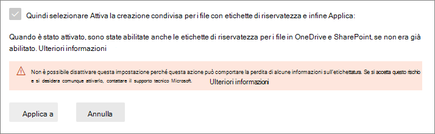

# Abilitare la creazione condivisa di file crittografati con etichette di riservatezzaEnable co-authoring for files encrypted with sensitivity labels

>*[Indicazioni per l'assegnazione di licenze di Microsoft 365 per sicurezza e conformità](/office365/servicedescriptions/microsoft-365-service-descriptions/microsoft-365-tenantlevel-services-licensing-guidance/microsoft-365-security-compliance-licensing-guidance).**[Microsoft 365 licensing guidance for security & compliance](/office365/servicedescriptions/microsoft-365-service-descriptions/microsoft-365-tenantlevel-services-licensing-guidance/microsoft-365-security-compliance-licensing-guidance).*

> [!NOTE]
> Questa funzionalità è in anteprima e soggetta a modifiche.This feature is in preview and subject to change.

Abilitare l'impostazione per supportare la [creazione condivisa](https://support.office.com/article/ee1509b4-1f6e-401e-b04a-782d26f564a4) per le app desktop di Office in modo che, quando i documenti vengono etichettati e crittografati con le [etichette di riservatezza](sensitivity-labels.md), più utenti possono modificare tali documenti contemporaneamente.Enable the setting to support [co-authoring](https://support.office.com/article/ee1509b4-1f6e-401e-b04a-782d26f564a4) for Office desktop apps so that when documents are labeled and encrypted by [sensitivity labels](sensitivity-labels.md), multiple users can edit these documents at the same time.

Se questa impostazione non è abilitata per il tenant, quando gli utenti usano le app desktop di Office, questi dovranno estrarre un documento crittografato archiviato in SharePoint o OneDrive.Without this setting enabled for your tenant, users must check out an encrypted document stored in SharePoint or OneDrive when they use Office desktop apps. Di conseguenza, non potranno collaborare in tempo reale.As a result, they can't collaborate in real time. Oppure, devono usare Office per il web quando le [etichette di riservatezza sono abilitate per i file di Office in SharePoint e OneDrive](sensitivity-labels-sharepoint-onedrive-files.md).Or, they must use Office on the web when [sensitivity labels are enabled for Office files in SharePoint and OneDrive](sensitivity-labels-sharepoint-onedrive-files.md).

Inoltre, l'abilitazione di questa funzionalità comporta il supporto della funzionalità di [salvataggio automatico](https://support.office.com/article/what-is-autosave-6d6bd723-ebfd-4e40-b5f6-ae6e8088f7a5) per i file etichettati e crittografati.In addition, enabling this functionality results in the [AutoSave](https://support.office.com/article/what-is-autosave-6d6bd723-ebfd-4e40-b5f6-ae6e8088f7a5) functionality being supported for these labeled and encrypted files.

Per leggere l'annuncio iniziale sul rilascio, vedere il post di blog [Annuncio della creazione condivisa su documenti crittografati con Microsoft Information Protection e aggiornamenti delle etichette](https://techcommunity.microsoft.com/t5/microsoft-security-and/announcing-co-authoring-on-microsoft-information-protection/ba-p/2164162).To read the initial release announcement, see the blog post [Announcing co-authoring on Microsoft Information Protection-encrypted documents and labeling updates](https://techcommunity.microsoft.com/t5/microsoft-security-and/announcing-co-authoring-on-microsoft-information-protection/ba-p/2164162).

## Modifiche ai metadati delle etichette di riservatezzaMetadata changes for sensitivity labels

> [!IMPORTANT]
> Dopo aver abilitato l'impostazione per la creazione condivisa, le informazioni di etichettatura per i file non crittografati non vengono più salvate nelle proprietà personalizzate.After you enable the setting for co-authoring, labeling information for unencrypted files is no longer saved in custom properties.
> 
> Non abilitare questa impostazione se si usano app, servizi, script o strumenti che leggono o scrivono i metadati delle etichette nella posizione precedente.Do not enable this setting if you use any apps, services, scripts, or tools that reads or writes labeling metadata to the old location.

Prima di abilitare l'impostazione per supportare la creazione condivisa per le app desktop di Office, è importante tenere presente che questa azione apporta modifiche ai metadati delle etichette salvati e letti dai file di Office.Before you enable the setting to support co-authoring for Office desktop apps, it's important to understand that this action makes changes to the labeling metadata that is saved to and read from Office files.

I metadati delle etichette includono informazioni che identificano il tenant e l'etichetta di riservatezza applicata.The labeling metadata includes information that identifies your tenant and applied sensitivity label. La modifica apportata da questa impostazione riguarda il formato e posizione dei metadati per i file di Word, Excel e PowerPoint.The change that this setting makes is the metadata format and location for Word, Excel, and PowerPoint files. Non hai bisogno di eseguire alcuna azione per i file o i messaggi crittografati; la modifica dei metadati per i file crittografati è compatibile con le versioni precedenti e non sono state apportate modifiche per i messaggi.You do not need to take any action for encrypted files or emails; the metadata change for encrypted files is backward-compatible and there are no changes for emails. Tuttavia, devi essere consapevole delle modifiche dei metadati per i file crittografati che possono essere aggiornati automaticamente ma non compatibili con le versioni precedenti.However, you do need to be aware of the metadata changes for encrypted files that can be automatically upgraded but aren't backward-compatible.

Questa modifica interessa sia i file con sono stati etichettati di recente che quelli già etichettati.This change affects both files that are newly labeled and files that are already labeled. Quando si usano app e servizi che supportano l'impostazione di creazione condivisa:When you use apps and services that support the co-authoring setting:
- Per i file etichettati di recente, viene usato solo il nuovo formato e il percorso per i metadati delle etichette.For files that are newly labeled, only the new format and location is used for the labeling metadata.
- Per i file già etichettati, all’apertura e salvataggio successivi, questi verranno copiati nel nuovo formato e percorso.For files that are already labeled, the next time the file is opened and saved, if the file has metadata in the old format and location, it is copied to the new format and location.

Per altre informazioni sulla modifica dei metadati, vedere le seguenti risorse:You can read more about this metadata change from the following resources:

- Post di blog: [Modifiche imminenti sull'archiviazione dei metadati di Microsoft Information Protection](https://techcommunity.microsoft.com/t5/microsoft-security-and/upcoming-changes-to-microsoft-information-protection-metadata/ba-p/1904418)Blog post: [Upcoming Changes to Microsoft Information Protection Metadata Storage](https://techcommunity.microsoft.com/t5/microsoft-security-and/upcoming-changes-to-microsoft-information-protection-metadata/ba-p/1904418)

- Specifiche aperte: [2.6.3 LabelInfo vs Proprietà personalizzate dei documenti](/openspecs/office_file_formats/ms-offcrypto/13939de6-c833-44ab-b213-e0088bf02341)Open Specifications: [2.6.3 LabelInfo versus Custom Document Properties](/openspecs/office_file_formats/ms-offcrypto/13939de6-c833-44ab-b213-e0088bf02341)

A causa di queste modifiche, non bisogna abilitare tale impostazione se nell’organizzazione sono presenti app, servizi, script o strumenti che leggono o scrivono i metadati delle etichette nella posizione precedente. Se lo si fa, queste possono essere alcune delle conseguenze:Because of these changes, do not enable this setting if you have any apps, services, scripts, or tools in your organization that reads or writes labeling metadata to the old location. If you do, some example consequences:

- Un documento etichettato appare senza etichettaA document that is labeled appears to users to be unlabeled

- Un documento mostra un'etichetta non aggiornataA document displays an out-of-date label to users

- La creazione condivisa e il salvataggio automatico non funzionano con un documento etichettato e crittografato se un altro utente lo ha aperto in un'app desktop di Office che non supporta la nuova etichettatura dei metadati.Co-authoring and AutoSave won't work for a labeled and encrypted document if another user has it open in an Office desktop app that doesn't support the new labeling metadata

- Una regola del flusso di posta di Exchange Online che [identifica le etichette come proprietà personalizzate negli allegati di Office](/azure/information-protection/configure-exo-rules#example-2-rule-that-applies-the-encrypt-only-option-to-emails-when-they-have-attachments-that-are-labeled-confidential--partners-and-these-emails-are-sent-outside-the-organization) non riesce a crittografare la posta elettronica e l'allegato oppure le crittografa in modo non correttoAn Exchange Online mail flow rule that [identifies labels as custom properties in Office attachments](/azure/information-protection/configure-exo-rules#example-2-rule-that-applies-the-encrypt-only-option-to-emails-when-they-have-attachments-that-are-labeled-confidential--partners-and-these-emails-are-sent-outside-the-organization) fails to encrypt the email and attachment, or incorrectly encrypts them

Per un elenco completo delle app e dei servizi che supportano questa impostazione e le modifiche ai metadati delle etichette, consultare la sezione seguente.Check the following section for a list of apps and services that support this setting and the changes to the labeling metadata.

## PrerequisitiPrerequisites

Prima di attivare questa funzionalità, assicurarsi di aver compreso i seguenti prerequisiti.Make sure you understand the following prerequisites before you turn on this feature.

- È necessario essere un amministratore globale per aggiornare questa funzionalità.You must be a global admin to turn on this feature.

- Le etichette di riservatezza devono essere [abilitate per i file di Office in SharePoint e OneDrive](sensitivity-labels-sharepoint-onedrive-files.md) per il tenant.Sensitivity labels must be [enabled for Office files in SharePoint and OneDrive](sensitivity-labels-sharepoint-onedrive-files.md) for the tenant. Se questa funzionalità non è già stata abilitata, quando si seleziona l'impostazione per attivare la creazione condivisa per i file con etichette di riservatezza, questa verrà abilitata automaticamente.If this feature isn't already enabled, it will be automatically enabled when you select the setting to turn on co-authoring for files with sensitivity labels.

- Microsoft 365 Apps for enterprise:Microsoft 365 Apps for enterprise:
    - **Windows**: versione minima 2105: 18 giugno**Windows**: Minimum version 2105: June 18
    - **macOS**: versione minima 16.50**macOS**: Minimum version 16.50
    - **iOS**: non ancora supportato**iOS**: Not yet supported
    - **Android**: non ancora supportato**Android**: Not yet supported

- Tutte le app, i servizi e gli strumenti operativi del tenant devono supportare la nuova [etichettatura dei metadati](#metadata-changes-for-sensitivity-labels).All apps, services, and operational tools in your tenant must support the new [labeling metadata](#metadata-changes-for-sensitivity-labels). Se si usa una delle opzioni seguenti, verificare le versioni minime richieste:If you use any of the following, check the minimum versions required:
    
    - **Client di etichettatura unificata e scanner di Azure Information Protection:****Azure Information Protection unified labeling client and scanner:**
        - Versione di anteprima pubblica (nome di installazione di AzInfoProtection_2.10.46_CoAuthoring_PublicPreview.exe) che è possibile installare dall'[Area download Microsoft](https://www.microsoft.com/en-us/download/details.aspx?id=53018)A public preview version (installation name of AzInfoProtection_2.10.46_CoAuthoring_PublicPreview.exe) that you can install from the [Microsoft Download Center](https://www.microsoft.com/en-us/download/details.aspx?id=53018)
    
    - **App di sincronizzazione OneDrive per Windows o macOS:****OneDrive sync app for Windows or macOS:**
        - Versione minima di 19.002.0121.0008Minimum version of 19.002.0121.0008
    
    - **Prevenzione della perdita dei dati dell'endpoint:****Endpoint data loss prevention (Endpoint DLP):**
        - Windows 10 1809 con KB 4601383Windows 10 1809 with KB 4601383
        - Windows 10 1903 e 1909 con KB 4601380Windows 10 1903 and 1909 with KB 4601380
        - Windows 10 2004 con KB 4601382Windows 10 2004 with KB 4601382
    
    - **App e servizi che usano Microsoft Information Protection SDK:****Apps and services that use the Microsoft Information Protection SDK:** 
        - Versione minima di 1.7Minimum version of 1.7 

I servizi di Microsoft 365 supportano automaticamente la nuova etichettatura dei metadati quando questa funzionalità viene attivata. Per esempio:Microsoft 365 services automatically support the new labeling metadata when you turn on this feature. For example:

- [Criteri di etichetta automaticaAuto-labeling policies](apply-sensitivity-label-automatically.md#how-to-configure-auto-labeling-policies-for-sharepoint-onedrive-and-exchange)
- [Criteri di prevenzione della perdita dei dati che usano etichette di riservatezza come condizioniDLP policies that use sensitivity labels as conditions](dlp-sensitivity-label-as-condition.md)
- [Microsoft Cloud App Security configurato per applicare etichette di riservatezzaMicrosoft Cloud App Security configured to apply sensitivity labels](/cloud-app-security/best-practices#discover-classify-label-and-protect-regulated-and-sensitive-data-stored-in-the-cloud)

## LimitazioniLimitations

Prima di abilitare l'impostazione del tenant per la creazione condivisa dei file crittografati con etichette di riservatezza, assicurarsi di comprendere le limitazioni della funzionalità, come elencato di seguito.Before you enable the tenant setting for co-authoring for files encrypted with sensitivity labels, make sure you understand the following limitations of this feature.

- A causa delle[modifiche all’etichettatura dei metadati](#metadata-changes-for-sensitivity-labels), tutte le app, i servizi e gli strumenti operativi nel tenant devono supportare i nuovi metadati in modo da garantire un'esperienza di etichettatura coerente e affidabile.Because of the [labeling metadata changes](#metadata-changes-for-sensitivity-labels), all apps, services, and operational tools in your tenant must support the new labeling metadata for a consistent and reliable labeling experience.
    
    Specifico per Excel: i metadati per un'etichetta di riservatezza che non applica la crittografia possono essere eliminati da un file se qualcuno modifica e salva il file con una versione di Excel che non supporta le modifiche ai metadati per le etichette di riservatezza.Specific to Excel: Metadata for a sensitivity label that doesn't apply encryption can be deleted from a file if somebody edits and saves that file by using a version of Excel that doesn't support the metadata changes for sensitivity labels.

- La creazione condivisa e il salvataggio automatico non sono supportati e non funzionano per i documenti di Office etichettati e crittografati che usano una delle seguenti [configurazioni per la crittografia](encryption-sensitivity-labels.md#configure-encryption-settings):Co-authoring and AutoSave aren't supported and don't work for labeled and encrypted Office documents that use any of the following [configurations for encryption](encryption-sensitivity-labels.md#configure-encryption-settings):
    - **Consentire agli utenti di assegnare le autorizzazioni quando applicano l'etichetta** e la casella di controllo **In Word, PowerPoint ed Excel, chiedere agli utenti di specificare le autorizzazioni** viene selezionata.**Let users assign permissions when they apply the label** and the checkbox **In Word, PowerPoint, and Excel, prompt users to specify permissions** is selected. Questa configurazione viene spesso definita come “autorizzazioni definite dall'utente”.This configuration is sometimes referred to as "user-defined permissions".
    - **L'accesso utenti al contenuto scade** è impostato su un valore diverso da **Mai**.**User access to content expires** is set to a value other than **Never**.
    - Viene selezionata una **Crittografia a chiave doppia**.**Double Key Encryption** is selected.
    
    Le etichette con una di queste configurazioni di crittografia vengono visualizzate nelle app di Office.For labels with any of these encryption configurations, the labels display in Office apps. Tuttavia, quando gli utenti selezionano queste etichette e nessun altro sta modificando il documento, vengono avvisati che la creazione condivisa e il salvataggio automatico non saranno disponibili.However, when users select these labels and nobody else is editing the document, they are warned that co-authoring and AutoSave won't be available. Se qualcun altro sta modificando il documento, gli utenti visualizzeranno un messaggio che indica che non è possibile applicare le etichette.If somebody else is editing the document, users see a message that the labels can't be applied.

- Se si usa il client di etichettatura unificata di Azure Information Protection: Controllare la documentazione relativa a questo client di etichettatura per [ulteriori requisiti o limitazioni](/azure/information-protection/known-issues#known-issues-for-co-authoring-public-preview).If you use the Azure Information Protection unified labeling client: Check the documentation for this labeling client for [more requirements or limitations](/azure/information-protection/known-issues#known-issues-for-co-authoring-public-preview).

## Problemi noti di questa anteprimaKnown issues for this preview

Questa versione di anteprima di creazione condivisa per file crittografati con etichette di riservatezza presenta i seguenti problemi noti:This preview version of co-authoring for files encrypted with sensitivity labels has the following known issues:

- Gli utenti non potranno applicare etichette in Office per il web per file di Word, Excel e PowerPoint che hanno dimensioni superiori a 300 MB.Users won't be able to apply any labels in Office for the web for Word, Excel, and PowerPoint files that are bigger than 300 MB. Per questi file è possibile usare le app desktop di Office. Tuttavia, è necessario essere l'unica persona con il file aperto.For these files, you can use the Office desktop apps to apply a label but you must be the only person who has the file open.

- Quando si usano [criteri di prevenzione della perdita dei dati che usano etichette di riservatezza come condizioni](dlp-sensitivity-label-as-condition.md), gli allegati non crittografati per i messaggi di posta elettronica non sono supportati.When you use [DLP policies that use sensitivity labels as conditions](dlp-sensitivity-label-as-condition.md), unencrypted attachments for emails are not supported.

- Alcuni documenti non sono compatibili con le etichette di riservatezza a causa di funzionalità come la [password di protezione](https://support.microsoft.com/office/require-a-password-to-open-or-modify-a-workbook-10579f0e-b2d9-4c05-b9f8-4109a6bce643), le [cartelle di lavoro condivise](https://support.microsoft.com/office/about-the-shared-workbook-feature-49b833c0-873b-48d8-8bf2-c1c59a628534) o il contenuto che include controlli ActiveX.Some documents are incompatible with sensitivity labels because of features such as [password-protection](https://support.microsoft.com/office/require-a-password-to-open-or-modify-a-workbook-10579f0e-b2d9-4c05-b9f8-4109a6bce643), [shared workbooks](https://support.microsoft.com/office/about-the-shared-workbook-feature-49b833c0-873b-48d8-8bf2-c1c59a628534), or content that includes ActiveX controls. Altri motivi sono documentati in [Risolvere i problemi relativi alla creazione condivisa in Office](https://support.microsoft.com/office/troubleshoot-co-authoring-in-office-bd481512-3f3a-4b6d-b7eb-ebf9d3626ae7).Other reasons are documented in [Troubleshoot co-authoring in Office](https://support.microsoft.com/office/troubleshoot-co-authoring-in-office-bd481512-3f3a-4b6d-b7eb-ebf9d3626ae7). Per questi documenti viene visualizzato un messaggio **CARICAMENTO NON RIUSCITO** e occorre selezionare l’opzione **Rimuovi modifiche**.For these documents, you see a message **UPLOAD FAILED** and should select the **Discard Changes** option. Finché non viene risolto il problema, non etichettare questi documenti identificati con questo messaggio di errore.Until this issue is addressed, do not label these documents that are identified with this failure message.

- Le app di Office per iOS e Android non sono supportate.Office apps for iOS and Android are not supported.

## Come abilitare la creazione condivisa per i file con etichette di riservatezzaHow to enable co-authoring for files with sensitivity labels

> [!CAUTION]
> L'attivazione di questa impostazione è un'azione unidirezionale. Durante la versione di anteprima abilitarla solo in un ambiente non di produzione e solo dopo aver letto e compreso le modifiche dei metadati, i prerequisiti, le limitazioni e gli eventuali problemi noti documentati in questa pagina.Turning on this setting is a one-way action. While the feature is in preview, enable it only after you have read and understood the metadata changes, prerequisites, limitations, and any known issues documented on this page.

1. Accedere al [Centro conformità Microsoft 365](https://compliance.microsoft.com) come amministratore globale per il tenant.Sign in to the [Microsoft 365 compliance center](https://compliance.microsoft.com) as a global admin for your tenant.

2. Nel riquadro di spostamento selezionare **Impostazioni** > **Creazione condivisa per i file con i file di riservatezza**.From the navigation pane, select **Settings** > **Co-authoring for files with sensitivity files**.

2. Nella **Creazione condivisa di file con etichette di riservatezza (anteprima)** leggere il riepilogo, i prerequisiti, cosa aspettarsi e l'avviso che indica che non è possibile disattivare questa impostazione dopo l'attivazione.On the **Co-authoring for files with sensitivity labels (preview)** page, read the summary description, prerequisites, what to expect, and the warning that you can't turn off this setting after you've turned it on.
    
    Quindi selezionare **Attiva la creazione condivisa per i file con etichette di riservatezza** e infine **Applica**:Then select **Turn on co-authoring for files with sensitivity labels**, and **Apply**:
    
    

3. Prima di testare questa nuova funzionalità per la creazione condivisa, bisogna attendere 24 ore perché l'impostazione venga riusata nell'ambiente.Wait 24 hours for this setting to replicate across your environment before you use this new feature for co-authoring.

## Se è necessario disabilitare questa funzionalità, contattare il Supporto tecnicoContact Support if you need to disable this feature

> [!IMPORTANT]
> Se è necessario disabilitare questa funzionalità bisogna tenere presente che le informazioni dell’etichetta potrebbero andare perse.If you do need to disable this feature, be aware that labeling information can be lost.

Dopo aver abilitato la creazione condivisa per i file con etichette di riservatezza per il tenant, non è possibile disabilitare questa impostazione manualmente.After you've enabled co-authoring for files with sensitivity labels for your tenant, you can't disable this setting yourself. Per questo motivo, prima di abilitare questa impostazione è importante verificare e comprendere i prerequisiti, le conseguenze e le limitazioni.That's why it's so important that you check and understand the prerequisites, consequences, and limitations before you enable this setting.

Come illustrato nello screenshot, quando questa impostazione è attivata, è possibile contattare il [Supporto tecnico Microsoft](../business-video/get-help-support.md) e richiedere di disattivarla.As you see from the screenshot when this setting has been turned on, you can contact [Microsoft Support](../business-video/get-help-support.md) and request to turn off this setting. Potrebbero essere necessari diversi giorni per processare la richiesta. Inoltre è necessario dimostrare di essere un amministratore globale del tenant.This request might take several days and you will need to prove that you are a global administrator for your tenant. Verranno applicate le tariffe standard del Supporto tecnico.Expect usual support charges to apply. 

Se un tecnico del supporto disabilita questa impostazione per il tenant:If a support engineer disables this setting for your tenant:

- Per le app e i servizi che supportano le nuova etichettatura dei metadati, queste saranno ripristinate nel formato e nel percorso originali dei metadati quando le etichette vengono lette o salvate.For apps and services that support the new labeling metadata, they now revert to the original metadata format and location when labels are read or saved.

- Il nuovo formato e percorso dei metadati non verrà copiato nel formato e nella posizione originali per i documenti di Office usati quando l'impostazione era abilitata.The new metadata format and location for Office documents that were used while the setting was enabled will not be copied to the original format and location. Di conseguenza, le informazioni di etichettatura per i file di Word, Excel e PowerPoint non crittografati andranno perse.As a result, this labeling information for unencrypted Word, Excel, and PowerPoint files will be lost.

- Creazione condivisa e salvataggio automatico non funzioneranno più nel tenant per documenti etichettati e crittografati.Co-authoring and AutoSave no longer work in your tenant for labeled and encrypted documents.

- Le etichette di riservatezza rimangono abilitate per i file di Office in OneDrive e SharePoint.Sensitivity labels remain enabled for Office files in OneDrive and SharePoint.