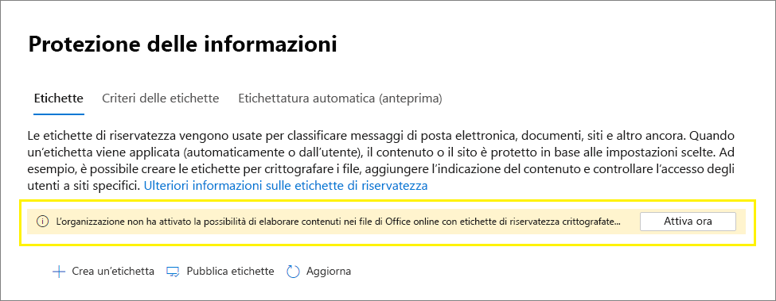

# <a name="enable-sensitivity-labels-for-office-files-in-sharepoint-and-onedrive"></a><span data-ttu-id="9ced2-103">Abilitare le etichette di riservatezza per i file di Office in SharePoint e OneDrive</span><span class="sxs-lookup"><span data-stu-id="9ced2-103">Enable sensitivity labels for Office files in SharePoint and OneDrive</span></span>

><span data-ttu-id="9ced2-104">*[Indicazioni per l'assegnazione di licenze di Microsoft 365 per sicurezza e conformità](/office365/servicedescriptions/microsoft-365-service-descriptions/microsoft-365-tenantlevel-services-licensing-guidance/microsoft-365-security-compliance-licensing-guidance).*</span><span class="sxs-lookup"><span data-stu-id="9ced2-104">*[Microsoft 365 licensing guidance for security & compliance](/office365/servicedescriptions/microsoft-365-service-descriptions/microsoft-365-tenantlevel-services-licensing-guidance/microsoft-365-security-compliance-licensing-guidance).*</span></span>

<span data-ttu-id="9ced2-105">Abilitare l'etichettatura incorporata per i file Office supportati [in](sensitivity-labels-office-apps.md#office-file-types-supported) SharePoint e OneDrive in modo che gli utenti possano applicare le etichette di riservatezza [in](sensitivity-labels.md) Office per il web.</span><span class="sxs-lookup"><span data-stu-id="9ced2-105">Enable built-in labeling for [supported Office files](sensitivity-labels-office-apps.md#office-file-types-supported) in SharePoint and OneDrive so that users can apply your [sensitivity labels](sensitivity-labels.md) in Office for the web.</span></span> <span data-ttu-id="9ced2-106">Quando questa funzionalità è abilitata, gli utenti visualizzano il pulsante Riservatezza sulla barra multifunzione in modo che possano applicare etichette e visualizzano qualsiasi nome di etichetta applicato sulla barra di stato. </span><span class="sxs-lookup"><span data-stu-id="9ced2-106">When this feature is enabled, users will see the **Sensitivity** button on the ribbon so they can apply labels, and see any applied label name on the status bar.</span></span>

<span data-ttu-id="9ced2-107">L'abilitazione di questa funzionalità consente inoltre SharePoint e OneDrive di elaborare il contenuto di Office file crittografati utilizzando un'etichetta di riservatezza.</span><span class="sxs-lookup"><span data-stu-id="9ced2-107">Enabling this feature also results in SharePoint and OneDrive being able to process the contents of Office files that have been encrypted by using a sensitivity label.</span></span> <span data-ttu-id="9ced2-108">L'etichetta può essere applicata in Office per il web o nelle app desktop Office e caricata o salvata in SharePoint e OneDrive.</span><span class="sxs-lookup"><span data-stu-id="9ced2-108">The label can be applied in Office for the web, or in Office desktop apps and uploaded or saved in SharePoint and OneDrive.</span></span> <span data-ttu-id="9ced2-109">Fino a quando non si abilita questa funzionalità, questi servizi non possono elaborare file crittografati, il che significa che la creazione condivisa, eDiscovery, prevenzione della perdita dei dati, ricerca e altre funzionalità di collaborazione non funzioneranno per questi file.</span><span class="sxs-lookup"><span data-stu-id="9ced2-109">Until you enable this feature, these services can't process encrypted files, which means that coauthoring, eDiscovery, Data Loss Prevention, search, and other collaborative features won't work for these files.</span></span>

<span data-ttu-id="9ced2-110">Dopo aver abilitato le etichette di riservatezza per i file di Office in SharePoint e OneDrive, per i file nuovi e modificati con un'etichetta di riservatezza che applica la crittografia con una chiave basata su cloud (e non utilizza la crittografia a chiave doppia [):](double-key-encryption.md)</span><span class="sxs-lookup"><span data-stu-id="9ced2-110">After you enable sensitivity labels for Office files in SharePoint and OneDrive, for new and changed files that have a sensitivity label that applies encryption with a cloud-based key (and doesn't use [Double Key Encryption](double-key-encryption.md)):</span></span>

- <span data-ttu-id="9ced2-111">Per word, Excel e PowerPoint file, SharePoint e OneDrive riconoscono l'etichetta e ora possono elaborare il contenuto del file crittografato.</span><span class="sxs-lookup"><span data-stu-id="9ced2-111">For Word, Excel, and PowerPoint files, SharePoint and OneDrive recognize the label and can now process the contents of the encrypted file.</span></span>

- <span data-ttu-id="9ced2-112">Quando gli utenti scaricano o accedono a questi file da SharePoint o OneDrive, l'etichetta di riservatezza e le eventuali impostazioni di crittografia dall'etichetta vengono applicate e rimangono nel file, ovunque sia archiviato.</span><span class="sxs-lookup"><span data-stu-id="9ced2-112">When users download or access these files from SharePoint or OneDrive, the sensitivity label and any encryption settings from the label are enforced and remain with the file, wherever it is stored.</span></span> <span data-ttu-id="9ced2-113">Assicurati di fornire indicazioni per l'uso solo delle etichette per proteggere i documenti.</span><span class="sxs-lookup"><span data-stu-id="9ced2-113">Ensure you provide user guidance to use only labels to protect documents.</span></span> <span data-ttu-id="9ced2-114">Per ulteriori informazioni, vedere [Opzioni di Information Rights Management (IRM) ed etichette di riservatezza.](sensitivity-labels-office-apps.md#information-rights-management-irm-options-and-sensitivity-labels)</span><span class="sxs-lookup"><span data-stu-id="9ced2-114">For more information, see [Information Rights Management (IRM) options and sensitivity labels](sensitivity-labels-office-apps.md#information-rights-management-irm-options-and-sensitivity-labels).</span></span>

- <span data-ttu-id="9ced2-115">Quando gli utenti caricano file con etichetta e crittografati SharePoint o OneDrive, devono disporre almeno dei diritti di visualizzazione per tali file.</span><span class="sxs-lookup"><span data-stu-id="9ced2-115">When users upload labeled and encrypted files to SharePoint or OneDrive, they must have at least view rights to those files.</span></span> <span data-ttu-id="9ced2-116">Ad esempio, possono aprire i file all'esterno SharePoint.</span><span class="sxs-lookup"><span data-stu-id="9ced2-116">For example, they can open the files outside SharePoint.</span></span> <span data-ttu-id="9ced2-117">Se non hanno questo diritto di utilizzo minimo, il caricamento ha esito positivo, ma il servizio non riconosce l'etichetta e non è in grado di elaborare il contenuto del file.</span><span class="sxs-lookup"><span data-stu-id="9ced2-117">If they don't have this minimum usage right, the upload is successful but the service doesn't recognize the label and can't process the file contents.</span></span>

- <span data-ttu-id="9ced2-118">Utilizzare Office per il web (Word, Excel, PowerPoint) per aprire e modificare Office file con etichette di riservatezza che applicano la crittografia.</span><span class="sxs-lookup"><span data-stu-id="9ced2-118">Use Office for the web (Word, Excel, PowerPoint) to open and edit Office files that have sensitivity labels that apply encryption.</span></span> <span data-ttu-id="9ced2-119">Vengono applicate le autorizzazioni assegnate con la crittografia.</span><span class="sxs-lookup"><span data-stu-id="9ced2-119">The permissions that were assigned with the encryption are enforced.</span></span> <span data-ttu-id="9ced2-120">È inoltre possibile utilizzare [l'etichettatura automatica](apply-sensitivity-label-automatically.md) per questi documenti.</span><span class="sxs-lookup"><span data-stu-id="9ced2-120">You can also use [auto-labeling](apply-sensitivity-label-automatically.md) for these documents.</span></span>

- <span data-ttu-id="9ced2-121">Gli utenti esterni possono accedere ai documenti etichettati con crittografia utilizzando account guest.</span><span class="sxs-lookup"><span data-stu-id="9ced2-121">External users can access documents that are labeled with encryption by using guest accounts.</span></span> <span data-ttu-id="9ced2-122">Per ulteriori informazioni, vedere [Support for external users and labeled content](sensitivity-labels-office-apps.md#support-for-external-users-and-labeled-content).</span><span class="sxs-lookup"><span data-stu-id="9ced2-122">For more information, see [Support for external users and labeled content](sensitivity-labels-office-apps.md#support-for-external-users-and-labeled-content).</span></span> 

- <span data-ttu-id="9ced2-123">Office 365 eDiscovery supporta la ricerca full-text per questi file e i criteri di prevenzione della perdita dei dati (DLP) supportano il contenuto in questi file.</span><span class="sxs-lookup"><span data-stu-id="9ced2-123">Office 365 eDiscovery supports full-text search for these files and Data Loss Prevention (DLP) policies support content in these files.</span></span>

> [!NOTE]
> <span data-ttu-id="9ced2-124">Se la crittografia è stata applicata con una chiave locale (una topologia di gestione delle chiavi spesso definita "mantenere la propria chiave" o HYOK) o utilizzando la crittografia a chiave [doppia,](double-key-encryption.md)il comportamento del servizio per l'elaborazione del contenuto del file non cambia.</span><span class="sxs-lookup"><span data-stu-id="9ced2-124">If encryption has been applied with an on-premises key (a key management topology often referred to as "hold your own key" or HYOK), or by using [Double Key Encryption](double-key-encryption.md), the service behavior for processing the file contents doesn't change.</span></span> <span data-ttu-id="9ced2-125">Pertanto, per questi file, la creazione condivisa, eDiscovery, la prevenzione della perdita di dati, la ricerca e altre funzionalità di collaborazione non funzioneranno.</span><span class="sxs-lookup"><span data-stu-id="9ced2-125">So for these files, coauthoring, eDiscovery, Data Loss Prevention, search, and other collaborative features won't work.</span></span>
>
> <span data-ttu-id="9ced2-126">Il SharePoint e OneDrive non cambia anche per i file esistenti in questi percorsi etichettati con la crittografia usando una singola chiave basata su Azure.</span><span class="sxs-lookup"><span data-stu-id="9ced2-126">The SharePoint and OneDrive behavior also doesn't change for existing files in these locations that are labeled with encryption using a single Azure-based key.</span></span> <span data-ttu-id="9ced2-127">Per consentire a questi file di trarre vantaggio dalle nuove funzionalità dopo aver abilitato le etichette di riservatezza per i file di Office in SharePoint e OneDrive, i file devono essere scaricati e caricati di nuovo o modificati.</span><span class="sxs-lookup"><span data-stu-id="9ced2-127">For these files to benefit from the new capabilities after you enable sensitivity labels for Office files in SharePoint and OneDrive, the files must be either downloaded and uploaded again, or edited.</span></span>

<span data-ttu-id="9ced2-128">Dopo aver abilitato le etichette di riservatezza per i file di Office in [](search-the-audit-log-in-security-and-compliance.md#sensitivity-label-activities) SharePoint e OneDrive, sono disponibili tre nuovi eventi di controllo per il monitoraggio delle etichette di riservatezza applicate ai documenti in SharePoint e OneDrive:</span><span class="sxs-lookup"><span data-stu-id="9ced2-128">After you enable sensitivity labels for Office files in SharePoint and OneDrive, three new [audit events](search-the-audit-log-in-security-and-compliance.md#sensitivity-label-activities) are available for monitoring sensitivity labels that are applied to documents in SharePoint and OneDrive:</span></span>
- <span data-ttu-id="9ced2-129">**Etichetta di riservatezza applicata al file**</span><span class="sxs-lookup"><span data-stu-id="9ced2-129">**Applied sensitivity label to file**</span></span>
- <span data-ttu-id="9ced2-130">**Etichetta di riservatezza applicata a un file modificata**</span><span class="sxs-lookup"><span data-stu-id="9ced2-130">**Changed sensitivity label applied to file**</span></span>
- <span data-ttu-id="9ced2-131">**Etichetta di riservatezza rimossa dal file**</span><span class="sxs-lookup"><span data-stu-id="9ced2-131">**Removed sensitivity label from file**</span></span>

<span data-ttu-id="9ced2-132">Guarda il video seguente (senza audio) per vedere le nuove funzionalità in azione:</span><span class="sxs-lookup"><span data-stu-id="9ced2-132">Watch the following video (no audio) to see the new capabilities in action:</span></span>

> [!VIDEO https://www.microsoft.com/videoplayer/embed//RE4ornZ]

<span data-ttu-id="9ced2-133">È sempre possibile scegliere di disabilitare le etichette di riservatezza per Office file in SharePoint e OneDrive[(](#how-to-disable-sensitivity-labels-for-sharepoint-and-onedrive-opt-out)rifiuto esplicito ) in qualsiasi momento.</span><span class="sxs-lookup"><span data-stu-id="9ced2-133">You always have the choice to disable sensitivity labels for Office files in SharePoint and OneDrive ([opt-out](#how-to-disable-sensitivity-labels-for-sharepoint-and-onedrive-opt-out)) at any time.</span></span>

<span data-ttu-id="9ced2-134">Se attualmente si proteggono i documenti in SharePoint utilizzando SharePoint Information Rights Management (IRM), verificare la sezione [SharePoint Information Rights Management (IRM)](#sharepoint-information-rights-management-irm-and-sensitivity-labels) e le etichette di riservatezza in questa pagina.</span><span class="sxs-lookup"><span data-stu-id="9ced2-134">If you are currently protecting documents in SharePoint by using SharePoint Information Rights Management (IRM), be sure to check the [SharePoint Information Rights Management (IRM) and sensitivity labels](#sharepoint-information-rights-management-irm-and-sensitivity-labels) section on this page.</span></span> 

## <a name="requirements"></a><span data-ttu-id="9ced2-135">Requisiti</span><span class="sxs-lookup"><span data-stu-id="9ced2-135">Requirements</span></span>

<span data-ttu-id="9ced2-136">Queste nuove funzionalità funzionano solo [con le etichette di](sensitivity-labels.md) riservatezza.</span><span class="sxs-lookup"><span data-stu-id="9ced2-136">These new capabilities work with [sensitivity labels](sensitivity-labels.md) only.</span></span> <span data-ttu-id="9ced2-137">Se attualmente si dispone di etichette di Azure Information Protection, eseguirne innanzitutto la migrazione alle etichette di riservatezza in modo da poter abilitare queste funzionalità per i nuovi file caricati.</span><span class="sxs-lookup"><span data-stu-id="9ced2-137">If you currently have Azure Information Protection labels, first migrate them to sensitivity labels so that you can enable these features for new files that you upload.</span></span> <span data-ttu-id="9ced2-138">Per istruzioni, vedere [Come eseguire la migrazione di etichette di Azure Information Protection a etichette di riservatezza unificate](/azure/information-protection/configure-policy-migrate-labels).</span><span class="sxs-lookup"><span data-stu-id="9ced2-138">For instructions, see [How to migrate Azure Information Protection labels to unified sensitivity labels](/azure/information-protection/configure-policy-migrate-labels).</span></span>

<span data-ttu-id="9ced2-139">Usa l'app sincronizzazione OneDrive versione 19.002.0121.0008 o successiva su Windows e la versione 19.002.0107.0008 o successiva su Mac.</span><span class="sxs-lookup"><span data-stu-id="9ced2-139">Use the OneDrive sync app version 19.002.0121.0008 or later on Windows, and version 19.002.0107.0008 or later on Mac.</span></span> <span data-ttu-id="9ced2-140">Entrambe queste versioni sono state rilasciate il 28 gennaio 2019 e sono attualmente rilasciate per tutti gli anelli.</span><span class="sxs-lookup"><span data-stu-id="9ced2-140">Both these versions were released January 28, 2019, and are currently released to all rings.</span></span> <span data-ttu-id="9ced2-141">Per ulteriori informazioni, vedere le OneDrive [sulla versione](https://support.office.com/article/845dcf18-f921-435e-bf28-4e24b95e5fc0).</span><span class="sxs-lookup"><span data-stu-id="9ced2-141">For more information, see the [OneDrive release notes](https://support.office.com/article/845dcf18-f921-435e-bf28-4e24b95e5fc0).</span></span> <span data-ttu-id="9ced2-142">Dopo aver abilitato le etichette di riservatezza per i file Office in SharePoint e OneDrive, agli utenti che eseguono una versione precedente dell'app di sincronizzazione viene richiesto di aggiornarla.</span><span class="sxs-lookup"><span data-stu-id="9ced2-142">After you enable sensitivity labels for Office files in SharePoint and OneDrive, users who run an older version of the sync app are prompted to update it.</span></span>

## <a name="limitations"></a><span data-ttu-id="9ced2-143">Limitazioni</span><span class="sxs-lookup"><span data-stu-id="9ced2-143">Limitations</span></span>

- <span data-ttu-id="9ced2-144">SharePoint e OneDrive non possono elaborare alcuni file etichettati e crittografati da app desktop di Office quando questi file contengono dati PowerQuery, dati archiviati da componenti aggiuntivi personalizzati o parti XML personalizzate come le proprietà della pagina di presentazione, gli schemi dei tipi di contenuto, il riquadro informazioni documento personalizzato e il formato XSN personalizzato.</span><span class="sxs-lookup"><span data-stu-id="9ced2-144">SharePoint and OneDrive can't process some files that are labeled and encrypted from Office desktop apps when these files contain PowerQuery data, data stored by custom add-ins, or custom XML parts such as Cover Page Properties, content type schemas, custom Document Information Panel, and Custom XSN.</span></span> <span data-ttu-id="9ced2-145">Questa limitazione si applica anche ai file a cui è stato aggiunto un [ID](https://support.microsoft.com/office/enable-and-configure-unique-document-ids-ea7fee86-bd6f-4cc8-9365-8086e794c984) documento quando vengono caricati.</span><span class="sxs-lookup"><span data-stu-id="9ced2-145">This limitation also applies to files that have a [Document ID](https://support.microsoft.com/office/enable-and-configure-unique-document-ids-ea7fee86-bd6f-4cc8-9365-8086e794c984) added when they are uploaded.</span></span>
    
    <span data-ttu-id="9ced2-146">Per questi file, applicare un'etichetta senza crittografia in modo che possano essere aperti in un secondo momento in Office sul web oppure indicare agli utenti di aprire i file nelle proprie app desktop.</span><span class="sxs-lookup"><span data-stu-id="9ced2-146">For these files, either apply a label without encryption so that they can later be opened in Office on the web, or instruct users to open the files in their desktop apps.</span></span> <span data-ttu-id="9ced2-147">I file etichettati e crittografati solo in Office sul web non sono interessati.</span><span class="sxs-lookup"><span data-stu-id="9ced2-147">Files that are labeled and encrypted only in Office on the web aren't affected.</span></span>

- <span data-ttu-id="9ced2-148">SharePoint e OneDrive non applicano automaticamente etichette di riservatezza ai file esistenti già crittografati con le etichette di Azure Information Protection.</span><span class="sxs-lookup"><span data-stu-id="9ced2-148">SharePoint and OneDrive don't automatically apply sensitivity labels to existing files that you've already encrypted using Azure Information Protection labels.</span></span> <span data-ttu-id="9ced2-149">Al contrario, per il funzionamento delle funzionalità dopo aver abilitato le etichette di riservatezza per Office file in SharePoint e OneDrive, completare queste attività:</span><span class="sxs-lookup"><span data-stu-id="9ced2-149">Instead, for the features to work after you enable sensitivity labels for Office files in SharePoint and OneDrive, complete these tasks:</span></span>
    
    1. <span data-ttu-id="9ced2-150">Assicurati di aver [eseguito la migrazione delle etichette di Azure Information Protection](/azure/information-protection/configure-policy-migrate-labels) alle etichette di riservatezza e di [averle](create-sensitivity-labels.md#publish-sensitivity-labels-by-creating-a-label-policy) pubblicate dal Centro conformità Microsoft 365.</span><span class="sxs-lookup"><span data-stu-id="9ced2-150">Make sure you have [migrated the Azure Information Protection labels](/azure/information-protection/configure-policy-migrate-labels) to sensitivity labels and [published them](create-sensitivity-labels.md#publish-sensitivity-labels-by-creating-a-label-policy) from the Microsoft 365 compliance center.</span></span>
    2. <span data-ttu-id="9ced2-151">Scarica i file etichettati e quindi caricali nella posizione originale in SharePoint o OneDrive.</span><span class="sxs-lookup"><span data-stu-id="9ced2-151">Download the labeled files and then upload them to their original location in SharePoint or OneDrive.</span></span>

- <span data-ttu-id="9ced2-152">SharePoint e OneDrive non possono elaborare i file crittografati quando l'etichetta che ha applicato la crittografia ha una delle configurazioni [seguenti per la crittografia:](encryption-sensitivity-labels.md#configure-encryption-settings)</span><span class="sxs-lookup"><span data-stu-id="9ced2-152">SharePoint and OneDrive can't process encrypted files when the label that applied the encryption has any of the following [configurations for encryption](encryption-sensitivity-labels.md#configure-encryption-settings):</span></span>
    - <span data-ttu-id="9ced2-153">**Consentire agli utenti di assegnare le autorizzazioni quando applicano l'etichetta** e la casella di controllo **In Word, PowerPoint ed Excel, chiedere agli utenti di specificare le autorizzazioni** viene selezionata.</span><span class="sxs-lookup"><span data-stu-id="9ced2-153">**Let users assign permissions when they apply the label** and the checkbox **In Word, PowerPoint, and Excel, prompt users to specify permissions** is selected.</span></span> <span data-ttu-id="9ced2-154">Questa impostazione viene talvolta definita "autorizzazioni definite dall'utente".</span><span class="sxs-lookup"><span data-stu-id="9ced2-154">This setting is sometimes referred to as "user-defined permissions".</span></span>
    - <span data-ttu-id="9ced2-155">**L'accesso utenti al contenuto scade** è impostato su un valore diverso da **Mai**.</span><span class="sxs-lookup"><span data-stu-id="9ced2-155">**User access to content expires** is set to a value other than **Never**.</span></span>
    - <span data-ttu-id="9ced2-156">Viene selezionata una **Crittografia a chiave doppia**.</span><span class="sxs-lookup"><span data-stu-id="9ced2-156">**Double Key Encryption** is selected.</span></span>
    
    <span data-ttu-id="9ced2-157">Per le etichette con una di queste configurazioni di crittografia, le etichette non vengono visualizzate agli utenti in Office per il web.</span><span class="sxs-lookup"><span data-stu-id="9ced2-157">For labels with any of these encryption configurations, the labels aren't displayed to users in Office for the web.</span></span> <span data-ttu-id="9ced2-158">Inoltre, le nuove funzionalità non possono essere usate con documenti etichettati che già dispongono di queste impostazioni di crittografia.</span><span class="sxs-lookup"><span data-stu-id="9ced2-158">Additionally, the new capabilities can't be used with labeled documents that already have these encryption settings.</span></span> <span data-ttu-id="9ced2-159">Ad esempio, questi documenti non verranno restituiti nei risultati della ricerca, anche se vengono aggiornati.</span><span class="sxs-lookup"><span data-stu-id="9ced2-159">For example, these documents won't be returned in search results, even if they are updated.</span></span>

- <span data-ttu-id="9ced2-160">Per motivi di prestazioni, quando si carica o si salva un documento in SharePoint  e l'etichetta del file non applica la crittografia, la colonna Riservatezza nella raccolta documenti può richiedere del tempo per visualizzare il nome dell'etichetta.</span><span class="sxs-lookup"><span data-stu-id="9ced2-160">For performance reasons, when you upload or save a document to SharePoint and the file's label doesn't apply encryption, the **Sensitivity** column in the document library can take a while to display the label name.</span></span> <span data-ttu-id="9ced2-161">Fattore in questo ritardo se si utilizzano script o automazione che dipendono dal nome dell'etichetta in questa colonna.</span><span class="sxs-lookup"><span data-stu-id="9ced2-161">Factor in this delay if you use scripts or automation that depend on the label name in this column.</span></span>

- <span data-ttu-id="9ced2-162">Gli utenti potrebbero subire ritardi nell'apertura di documenti crittografati nel seguente scenario Salva con nome: utilizzando una versione desktop di Office, un utente sceglie Salva con nome per un documento con un'etichetta di riservatezza che applica la crittografia.</span><span class="sxs-lookup"><span data-stu-id="9ced2-162">Users might experience delays in being able to open encrypted documents in the following Save As scenario: Using a desktop version of Office, a user chooses Save As for a document that has a sensitivity label that applies encryption.</span></span> <span data-ttu-id="9ced2-163">L'utente seleziona SharePoint o OneDrive per il percorso e quindi tenta immediatamente di aprire il documento in Office per il web.</span><span class="sxs-lookup"><span data-stu-id="9ced2-163">The user selects SharePoint or OneDrive for the location, and then immediately tries to open that document in Office for the web.</span></span> <span data-ttu-id="9ced2-164">Se il servizio sta ancora elaborando la crittografia, l'utente visualizza un messaggio che indica che il documento deve essere aperto nell'app desktop.</span><span class="sxs-lookup"><span data-stu-id="9ced2-164">If the service is still processing the encryption, the user sees a message that the document must be opened in their desktop app.</span></span> <span data-ttu-id="9ced2-165">Se si riprova tra un paio di minuti, il documento verrà aperto Office per il web.</span><span class="sxs-lookup"><span data-stu-id="9ced2-165">If they try again in a couple of minutes, the document successfully opens in Office for the web.</span></span> 

- <span data-ttu-id="9ced2-166">Per i documenti crittografati, la stampa non è supportata.</span><span class="sxs-lookup"><span data-stu-id="9ced2-166">For encrypted documents, printing is not supported.</span></span>

- <span data-ttu-id="9ced2-167">Per un documento crittografato che concede autorizzazioni di modifica a un utente, la copia non può essere bloccata nelle versioni Web delle Office app.</span><span class="sxs-lookup"><span data-stu-id="9ced2-167">For an encrypted document that grants edit permissions to a user, copying can't be blocked in the web versions of the Office apps.</span></span>

- <span data-ttu-id="9ced2-168">Per impostazione predefinita, Office app desktop e per dispositivi mobili non supportano la creazione condivisa per i file etichettati con crittografia.</span><span class="sxs-lookup"><span data-stu-id="9ced2-168">By default, Office desktop apps and mobile apps don't support co-authoring for files that are labeled with encryption.</span></span> <span data-ttu-id="9ced2-169">Queste app continuano ad aprire file con etichetta e crittografati in modalità di modifica esclusiva.</span><span class="sxs-lookup"><span data-stu-id="9ced2-169">These apps continue to open labeled and encrypted files in exclusive editing mode.</span></span>
    
    > [!NOTE]
    > <span data-ttu-id="9ced2-170">La creazione condivisa è ora supportata in anteprima.</span><span class="sxs-lookup"><span data-stu-id="9ced2-170">Co-authoring is now supported in preview.</span></span> <span data-ttu-id="9ced2-171">Per ulteriori informazioni, vedere Abilitare la creazione condivisa per [i file crittografati con etichette di riservatezza.](sensitivity-labels-coauthoring.md)</span><span class="sxs-lookup"><span data-stu-id="9ced2-171">For more information, see [Enable co-authoring for files encrypted with sensitivity labels](sensitivity-labels-coauthoring.md).</span></span>

- <span data-ttu-id="9ced2-172">Se un amministratore modifica le impostazioni per un'etichetta pubblicata già applicata ai file scaricati nel client di sincronizzazione degli utenti, gli utenti potrebbero non essere in grado di salvare le modifiche apportate al file nella cartella OneDrive Sync.</span><span class="sxs-lookup"><span data-stu-id="9ced2-172">If an admin changes settings for a published label that's already applied to files downloaded to users' sync client, users might be unable to save changes they make to the file in their OneDrive Sync folder.</span></span> <span data-ttu-id="9ced2-173">Questo scenario si applica ai file etichettati con crittografia e anche quando la modifica dell'etichetta deriva da un'etichetta che non applica la crittografia a un'etichetta che applica la crittografia.</span><span class="sxs-lookup"><span data-stu-id="9ced2-173">This scenario applies to files that are labeled with encryption, and also when the label change is from a label that didn't apply encryption to a label that does apply encryption.</span></span> <span data-ttu-id="9ced2-174">Gli utenti [visualizzano un cerchio rosso con un errore](https://support.office.com/article/what-do-the-onedrive-icons-mean-11143026-8000-44f8-aaa9-67c985aa49b3)con una croce bianca e gli viene chiesto di salvare le nuove modifiche come copia separata.</span><span class="sxs-lookup"><span data-stu-id="9ced2-174">Users see a [red circle with a white cross icon error](https://support.office.com/article/what-do-the-onedrive-icons-mean-11143026-8000-44f8-aaa9-67c985aa49b3), and they are asked to save new changes as a separate copy.</span></span> <span data-ttu-id="9ced2-175">Possono invece chiudere e riaprire il file o usare Office per il web.</span><span class="sxs-lookup"><span data-stu-id="9ced2-175">Instead, they can close and reopen the file, or use Office for the web.</span></span>

- <span data-ttu-id="9ced2-176">Gli utenti possono provare problemi di salvataggio dopo essere stati offline o in modalità sospensione quando invece di usare Office per il web usano le app desktop e mobili per Word, Excel o PowerPoint.</span><span class="sxs-lookup"><span data-stu-id="9ced2-176">Users can experience save problems after going offline or into a sleep mode when instead of using Office for the web, they use the desktop and mobile apps for Word, Excel, or PowerPoint.</span></span> <span data-ttu-id="9ced2-177">Per questi utenti, quando riprendono la sessione di app Office e provano a salvare le modifiche, viene visualizzato un messaggio di errore di caricamento con un'opzione per salvare una copia invece di salvare il file originale.</span><span class="sxs-lookup"><span data-stu-id="9ced2-177">For these users, when they resume their Office app session and try to save changes, they see an upload failure message with an option to save a copy instead of saving the original file.</span></span> 

- <span data-ttu-id="9ced2-178">I documenti crittografati nei modi seguenti non possono essere aperti in Office per il web:</span><span class="sxs-lookup"><span data-stu-id="9ced2-178">Documents that have been encrypted in the following ways can't be opened in Office for the web:</span></span>
    - <span data-ttu-id="9ced2-179">Crittografia che usa una chiave locale ("mantieni la tua chiave" o HYOK)</span><span class="sxs-lookup"><span data-stu-id="9ced2-179">Encryption that uses an on-premises key ("hold your own key" or HYOK)</span></span>
    - <span data-ttu-id="9ced2-180">Crittografia applicata tramite [la crittografia a chiave doppia](double-key-encryption.md)</span><span class="sxs-lookup"><span data-stu-id="9ced2-180">Encryption that was applied by using [Double Key Encryption](double-key-encryption.md)</span></span>
    - <span data-ttu-id="9ced2-181">Crittografia applicata in modo indipendente da un'etichetta, ad esempio applicando direttamente un modello di protezione Rights Management.</span><span class="sxs-lookup"><span data-stu-id="9ced2-181">Encryption that was applied independently from a label, for example, by directly applying a Rights Management protection template.</span></span>

- <span data-ttu-id="9ced2-182">Le etichette [configurate per altre lingue](create-sensitivity-labels.md#additional-label-settings-with-security--compliance-center-powershell) non sono supportate e visualizzano solo la lingua originale.</span><span class="sxs-lookup"><span data-stu-id="9ced2-182">Labels configured for [other languages](create-sensitivity-labels.md#additional-label-settings-with-security--compliance-center-powershell) are not supported and display the original language only.</span></span>

- <span data-ttu-id="9ced2-183">Non è possibile impedire l'acquisizione dello schermo per i documenti crittografati.</span><span class="sxs-lookup"><span data-stu-id="9ced2-183">Screen captures can't be prevented for encrypted documents.</span></span> <span data-ttu-id="9ced2-184">Per ulteriori informazioni, vedere [Can Rights Management prevent screen captures?](/azure/information-protection/faqs-rms#can-rights-management-prevent-screen-captures)</span><span class="sxs-lookup"><span data-stu-id="9ced2-184">For more information, see [Can Rights Management prevent screen captures?](/azure/information-protection/faqs-rms#can-rights-management-prevent-screen-captures)</span></span>

- <span data-ttu-id="9ced2-185">Se si elimina un'etichetta applicata a un documento in SharePoint o OneDrive, anziché rimuovere l'etichetta dal criterio di etichetta applicabile, il documento scaricato non verrà etichettato o crittografato.</span><span class="sxs-lookup"><span data-stu-id="9ced2-185">If you delete a label that's been applied to a document in SharePoint or OneDrive, rather than remove the label from the applicable label policy, the document when downloaded won't be labeled or encrypted.</span></span> <span data-ttu-id="9ced2-186">Se invece il documento con etichetta è archiviato all'esterno di SharePoint o OneDrive, il documento rimane crittografato se l'etichetta viene eliminata.</span><span class="sxs-lookup"><span data-stu-id="9ced2-186">In comparison, if the labeled document is stored outside SharePoint or OneDrive, the document remains encrypted if the label is deleted.</span></span> <span data-ttu-id="9ced2-187">Si noti che, sebbene sia possibile eliminare le etichette durante una fase di testing, è molto raro eliminare un'etichetta in un ambiente di produzione.</span><span class="sxs-lookup"><span data-stu-id="9ced2-187">Note that although you might delete labels during a testing phase, it's very rare to delete a label in a production environment.</span></span>

## <a name="how-to-enable-sensitivity-labels-for-sharepoint-and-onedrive-opt-in"></a><span data-ttu-id="9ced2-188">Come abilitare le etichette di riservatezza per SharePoint e OneDrive (consenso esplicito)</span><span class="sxs-lookup"><span data-stu-id="9ced2-188">How to enable sensitivity labels for SharePoint and OneDrive (opt-in)</span></span>

<span data-ttu-id="9ced2-189">È possibile abilitare le nuove funzionalità utilizzando il Centro conformità Microsoft 365 o PowerShell.</span><span class="sxs-lookup"><span data-stu-id="9ced2-189">You can enable the new capabilities by using the Microsoft 365 compliance center, or by using PowerShell.</span></span> <span data-ttu-id="9ced2-190">Come per tutte le modifiche alla configurazione a livello di tenant per SharePoint e OneDrive, la modifica avrà effetto circa 15 minuti.</span><span class="sxs-lookup"><span data-stu-id="9ced2-190">As with all tenant-level configuration changes for SharePoint and OneDrive, it takes about 15 minutes for the change to take effect.</span></span>

### <a name="use-the-compliance-center-to-enable-support-for-sensitivity-labels"></a><span data-ttu-id="9ced2-191">Usare il Centro conformità per abilitare il supporto per le etichette di riservatezza</span><span class="sxs-lookup"><span data-stu-id="9ced2-191">Use the compliance center to enable support for sensitivity labels</span></span>

<span data-ttu-id="9ced2-192">Questa opzione è il modo più semplice per abilitare le etichette di riservatezza per SharePoint e OneDrive, ma è necessario accedere come amministratore globale per il tenant.</span><span class="sxs-lookup"><span data-stu-id="9ced2-192">This option is the easiest way to enable sensitivity labels for SharePoint and OneDrive, but you must sign in as a global administrator for your tenant.</span></span>

1. <span data-ttu-id="9ced2-193">Accedere al Centro conformità Microsoft 365 [come](https://compliance.microsoft.com/) amministratore globale e passare a **Soluzioni**  >  **Information Protection**</span><span class="sxs-lookup"><span data-stu-id="9ced2-193">Sign in to the [Microsoft 365 compliance center](https://compliance.microsoft.com/) as a global administrator, and navigate to **Solutions** > **Information protection**</span></span>
    
    <span data-ttu-id="9ced2-194">Se questa opzione non è immediatamente visibile, selezionare prima **Mostra tutto**.</span><span class="sxs-lookup"><span data-stu-id="9ced2-194">If you don't immediately see this option, first select **Show all**.</span></span> 

2. <span data-ttu-id="9ced2-195">Se viene visualizzato un messaggio per attivare la possibilità di elaborare il contenuto Office file online, selezionare **Attiva ora**:</span><span class="sxs-lookup"><span data-stu-id="9ced2-195">If you see a message to turn on the ability to process content in Office online files, select **Turn on now**:</span></span>
    
    
    
    <span data-ttu-id="9ced2-197">Il comando viene eseguito immediatamente e al successivo aggiornamento della pagina non viene più visualizzato il messaggio o il pulsante.</span><span class="sxs-lookup"><span data-stu-id="9ced2-197">The command runs immediately and when the page is next refreshed, you no longer see the message or button.</span></span>

> [!NOTE]
> <span data-ttu-id="9ced2-198">Se hai Microsoft 365 Multi-Geo, devi usare PowerShell per abilitare queste funzionalità per tutte le posizioni geografiche.</span><span class="sxs-lookup"><span data-stu-id="9ced2-198">If you have Microsoft 365 Multi-Geo, you must use PowerShell to enable these capabilities for all your geo-locations.</span></span> <span data-ttu-id="9ced2-199">Per informazioni dettagliate, vedere la sezione successiva.</span><span class="sxs-lookup"><span data-stu-id="9ced2-199">See the next section for details.</span></span>

### <a name="use-powershell-to-enable-support-for-sensitivity-labels"></a><span data-ttu-id="9ced2-200">Abilitazione del supporto per le etichette di riservatezza tramite PowerShell</span><span class="sxs-lookup"><span data-stu-id="9ced2-200">Use PowerShell to enable support for sensitivity labels</span></span>

<span data-ttu-id="9ced2-201">In alternativa all'utilizzo del Centro conformità, è possibile abilitare il supporto per le etichette di riservatezza utilizzando il cmdlet [Set-SPOTenant](/powershell/module/sharepoint-online/set-spotenant) di SharePoint PowerShell online.</span><span class="sxs-lookup"><span data-stu-id="9ced2-201">As an alternative to using the compliance center, you can enable support for sensitivity labels by using the [Set-SPOTenant](/powershell/module/sharepoint-online/set-spotenant) cmdlet from SharePoint Online PowerShell.</span></span> 

<span data-ttu-id="9ced2-202">Se hai Microsoft 365 Multi-Geo, devi usare PowerShell per abilitare questo supporto per tutte le posizioni geografiche.</span><span class="sxs-lookup"><span data-stu-id="9ced2-202">If you have Microsoft 365 Multi-Geo, you must use PowerShell to enable this support for all your geo-locations.</span></span>

#### <a name="prepare-the-sharepoint-online-management-shell"></a><span data-ttu-id="9ced2-203">Preparare SharePoint Online Management Shell</span><span class="sxs-lookup"><span data-stu-id="9ced2-203">Prepare the SharePoint Online Management Shell</span></span>

<span data-ttu-id="9ced2-204">Prima di eseguire il comando PowerShell per abilitare le etichette di riservatezza per i file di Office in SharePoint e OneDrive, assicurarsi di eseguire SharePoint Online Management Shell versione 16.0.19418.12000 o successiva.</span><span class="sxs-lookup"><span data-stu-id="9ced2-204">Before you run the PowerShell command to enable sensitivity labels for Office files in SharePoint and OneDrive, ensure that you're running SharePoint Online Management Shell version 16.0.19418.12000 or later.</span></span> <span data-ttu-id="9ced2-205">Se si dispone già della versione più recente, è possibile passare alla [procedura successiva per](#run-the-powershell-command-to-enable-support-for-sensitivity-labels) eseguire il comando PowerShell.</span><span class="sxs-lookup"><span data-stu-id="9ced2-205">If you already have the latest version, you can skip to [next procedure](#run-the-powershell-command-to-enable-support-for-sensitivity-labels) to run the PowerShell command.</span></span>

1. <span data-ttu-id="9ced2-206">Se è stata installata una versione precedente di SharePoint Online Management Shell da PowerShell Gallery, è possibile aggiornare il modulo eseguendo il cmdlet seguente.</span><span class="sxs-lookup"><span data-stu-id="9ced2-206">If you have installed a previous version of the SharePoint Online Management Shell from PowerShell gallery, you can update the module by running the following cmdlet.</span></span>

    ```PowerShell
    Update-Module -Name Microsoft.Online.SharePoint.PowerShell
    ```

2. <span data-ttu-id="9ced2-207">In alternativa, se è stata installata una versione precedente di SharePoint Online Management Shell  dall'Area download Microsoft, è anche possibile accedere a Installazione applicazioni e disinstallare SharePoint Online Management Shell.</span><span class="sxs-lookup"><span data-stu-id="9ced2-207">Alternatively, if you have installed a previous version of the SharePoint Online Management Shell from the Microsoft Download Center, you can also go to **Add or remove programs** and uninstall the SharePoint Online Management Shell.</span></span>

3. <span data-ttu-id="9ced2-208">In un Web browser passare alla pagina Area download e [scaricare l'ultima versione di SharePoint Online Management Shell](https://go.microsoft.com/fwlink/p/?LinkId=255251).</span><span class="sxs-lookup"><span data-stu-id="9ced2-208">In a web browser, go to the Download Center page and [Download the latest SharePoint Online Management Shell](https://go.microsoft.com/fwlink/p/?LinkId=255251).</span></span>

4. <span data-ttu-id="9ced2-209">Selezionare la lingua e fare clic su **Scarica**.</span><span class="sxs-lookup"><span data-stu-id="9ced2-209">Select your language and then click **Download**.</span></span>

5. <span data-ttu-id="9ced2-210">Scegliere tra il file MSI x64 o x86.</span><span class="sxs-lookup"><span data-stu-id="9ced2-210">Choose between the x64 and x86 .msi file.</span></span> <span data-ttu-id="9ced2-211">Scaricare il file x64 se si esegue la versione a 64 bit di Windows o il file x86 se si esegue la versione a 32 bit.</span><span class="sxs-lookup"><span data-stu-id="9ced2-211">Download the x64 file if you run the 64-bit version of Windows or the x86 file if you run the 32-bit version.</span></span> <span data-ttu-id="9ced2-212">In caso contrario, vedere Quale versione del sistema operativo [Windows in esecuzione?](https://support.microsoft.com/help/13443/windows-which-operating-system)</span><span class="sxs-lookup"><span data-stu-id="9ced2-212">If you don’t know, see [Which version of Windows operating system am I running?](https://support.microsoft.com/help/13443/windows-which-operating-system)</span></span>

6. <span data-ttu-id="9ced2-213">Dopo aver scaricato il file, eseguire il file e seguire i passaggi dell'Installazione guidata.</span><span class="sxs-lookup"><span data-stu-id="9ced2-213">After you have downloaded the file, run the file and follow the steps in the Setup Wizard.</span></span>

#### <a name="run-the-powershell-command-to-enable-support-for-sensitivity-labels"></a><span data-ttu-id="9ced2-214">Eseguire il comando PowerShell per abilitare il supporto per le etichette di riservatezza</span><span class="sxs-lookup"><span data-stu-id="9ced2-214">Run the PowerShell command to enable support for sensitivity labels</span></span>

<span data-ttu-id="9ced2-215">Per abilitare le nuove funzionalità, utilizzare il cmdlet [Set-SPOTenant](/powershell/module/sharepoint-online/set-spotenant) con *il parametro EnableAIPIntegration:*</span><span class="sxs-lookup"><span data-stu-id="9ced2-215">To enable the new capabilities, use the [Set-SPOTenant](/powershell/module/sharepoint-online/set-spotenant) cmdlet with the *EnableAIPIntegration* parameter:</span></span>

1. <span data-ttu-id="9ced2-216">Usando un account aziendale o dell'istituto di istruzione con privilegi di amministratore globale o SharePoint amministratore in Microsoft 365, connettersi a SharePoint.</span><span class="sxs-lookup"><span data-stu-id="9ced2-216">Using a work or school account that has global administrator or SharePoint admin privileges in Microsoft 365, connect to SharePoint.</span></span> <span data-ttu-id="9ced2-217">Per informazioni in merito, vedere [Guida introduttiva a SharePoint Online Management Shell](/powershell/sharepoint/sharepoint-online/connect-sharepoint-online).</span><span class="sxs-lookup"><span data-stu-id="9ced2-217">To learn how, see [Getting started with SharePoint Online Management Shell](/powershell/sharepoint/sharepoint-online/connect-sharepoint-online).</span></span>
    
    > [!NOTE]
    > <span data-ttu-id="9ced2-218">Se si dispone di Microsoft 365 Multi-Geo, utilizzare il parametro -Url con [Connessione-SPOService](/powershell/module/sharepoint-online/connect-sposervice)e specificare l'URL del sito Dell'interfaccia di amministrazione di SharePoint Online per una delle posizioni geografiche.</span><span class="sxs-lookup"><span data-stu-id="9ced2-218">If you have Microsoft 365 Multi-Geo, use the -Url parameter with [Connect-SPOService](/powershell/module/sharepoint-online/connect-sposervice), and specify the SharePoint Online Administration Center site URL for one of your geo-locations.</span></span>

2. <span data-ttu-id="9ced2-219">Eseguire il comando seguente e premere **Y** per confermare:</span><span class="sxs-lookup"><span data-stu-id="9ced2-219">Run the following command and press **Y** to confirm:</span></span>

    ```PowerShell
    Set-SPOTenant -EnableAIPIntegration $true
    ```
3. <span data-ttu-id="9ced2-220">Per Microsoft 365 multi-geo: ripetere i passaggi 1 e 2 per ognuna delle posizioni geografiche rimanenti.</span><span class="sxs-lookup"><span data-stu-id="9ced2-220">For Microsoft 365 Multi-Geo: Repeat steps 1 and 2 for each of your remaining geo-locations.</span></span>

## <a name="publishing-and-changing-sensitivity-labels"></a><span data-ttu-id="9ced2-221">Pubblicazione e modifica delle etichette di riservatezza</span><span class="sxs-lookup"><span data-stu-id="9ced2-221">Publishing and changing sensitivity labels</span></span>

<span data-ttu-id="9ced2-222">Quando si utilizzano etichette di riservatezza con SharePoint e OneDrive, tenere presente che è necessario consentire il tempo di replica quando si pubblicano nuove etichette di riservatezza o si aggiornano le etichette di riservatezza esistenti.</span><span class="sxs-lookup"><span data-stu-id="9ced2-222">When you use sensitivity labels with SharePoint and OneDrive, keep in mind that you need to allow for replication time when you publish new sensitivity labels or update existing sensitivity labels.</span></span> <span data-ttu-id="9ced2-223">Ciò è particolarmente importante per le nuove etichette che applicano la crittografia.</span><span class="sxs-lookup"><span data-stu-id="9ced2-223">This is especially important for new labels that apply encryption.</span></span>

<span data-ttu-id="9ced2-224">Ad esempio: puoi creare e pubblicare una nuova etichetta di riservatezza che applica la crittografia e viene visualizzata molto rapidamente nell'app desktop di un utente.</span><span class="sxs-lookup"><span data-stu-id="9ced2-224">For example: You create and publish a new sensitivity label that applies encryption and it very quickly appears in a user's desktop app.</span></span> <span data-ttu-id="9ced2-225">L'utente applica l'etichetta a un documento e la carica SharePoint o OneDrive.</span><span class="sxs-lookup"><span data-stu-id="9ced2-225">The user applies this label to a document and then uploads it to SharePoint or OneDrive.</span></span> <span data-ttu-id="9ced2-226">Se la replica delle etichette non è stata completata per il servizio, le nuove funzionalità non verranno applicate al documento al caricamento.</span><span class="sxs-lookup"><span data-stu-id="9ced2-226">If the label replication hasn't completed for the service, the new capabilities won't be applied to that document on upload.</span></span> <span data-ttu-id="9ced2-227">Di conseguenza, il documento non verrà restituito nella ricerca o per eDiscovery e il documento non può essere aperto in Office per il web.</span><span class="sxs-lookup"><span data-stu-id="9ced2-227">As a result, the document won't be returned in search or for eDiscovery and the document can't be opened in Office for the web.</span></span>  

<span data-ttu-id="9ced2-228">Le modifiche seguenti vengono replicate entro un'ora: le etichette di riservatezza nuove ed eliminate e le impostazioni dei criteri delle etichette di riservatezza che includono le etichette incluse nel criterio.</span><span class="sxs-lookup"><span data-stu-id="9ced2-228">The following changes replicate within one hour: New and deleted sensitivity labels, and sensitivity label policy settings that include which labels are in the policy.</span></span>

<span data-ttu-id="9ced2-229">Le modifiche seguenti vengono replicate entro 24 ore: modifiche alle impostazioni delle etichette di riservatezza per le etichette esistenti.</span><span class="sxs-lookup"><span data-stu-id="9ced2-229">The following changes replicate within 24 hours: Changes to sensitivity label settings for existing labels.</span></span>

<span data-ttu-id="9ced2-230">Poiché il ritardo di replica è di solo un'ora per le nuove etichette di riservatezza, è improbabile che si verifichi lo scenario nell'esempio.</span><span class="sxs-lookup"><span data-stu-id="9ced2-230">Because the replication delay is only one hour for new sensitivity labels, you are unlikely to run into the scenario in the example.</span></span> <span data-ttu-id="9ced2-231">Tuttavia, come protezione, è consigliabile pubblicare prima nuove etichette per pochi utenti di test, attendere un'ora e quindi verificare il comportamento dell'etichetta SharePoint e OneDrive.</span><span class="sxs-lookup"><span data-stu-id="9ced2-231">But as a safeguard, we recommend publishing new labels to just a few test users first, wait for an hour, and then verify the label behavior on SharePoint and OneDrive.</span></span> <span data-ttu-id="9ced2-232">Come passaggio finale, rendi l'etichetta disponibile per più utenti aggiungendo altri utenti al criterio di etichetta esistente o aggiungendo l'etichetta a un criterio di etichetta esistente per gli utenti standard.</span><span class="sxs-lookup"><span data-stu-id="9ced2-232">As the final step, make the label available to more users by either adding more users to the existing label policy, or add the label to an existing label policy for your standard users.</span></span> <span data-ttu-id="9ced2-233">Al momento in cui gli utenti standard visualizzano l'etichetta, l'etichetta è già sincronizzata con SharePoint e OneDrive.</span><span class="sxs-lookup"><span data-stu-id="9ced2-233">At the time your standard users see the label, it has already synchronized to SharePoint and OneDrive.</span></span>

## <a name="sharepoint-information-rights-management-irm-and-sensitivity-labels"></a><span data-ttu-id="9ced2-234">SharePoint Information Rights Management (IRM) e etichette di riservatezza</span><span class="sxs-lookup"><span data-stu-id="9ced2-234">SharePoint Information Rights Management (IRM) and sensitivity labels</span></span>

<span data-ttu-id="9ced2-235">[SharePoint Information Rights Management (IRM)](set-up-irm-in-sp-admin-center.md) è una tecnologia precedente per proteggere i file a livello di elenco e raccolta applicando la crittografia e le restrizioni quando i file vengono scaricati.</span><span class="sxs-lookup"><span data-stu-id="9ced2-235">[SharePoint Information Rights Management (IRM)](set-up-irm-in-sp-admin-center.md) is an older technology to protect files at the list and library level by applying encryption and restrictions when files are downloaded.</span></span> <span data-ttu-id="9ced2-236">Questa tecnologia di protezione precedente è progettata per impedire agli utenti non autorizzati di aprire il file mentre si trova all'esterno SharePoint.</span><span class="sxs-lookup"><span data-stu-id="9ced2-236">This older protection technology is designed to prevent unauthorized users from opening the file while it's outside SharePoint.</span></span>

<span data-ttu-id="9ced2-237">In confronto, le etichette di riservatezza forniscono le impostazioni di protezione dei contrassegni visivi (intestazioni, piè di pagina, filigrane) oltre alla crittografia.</span><span class="sxs-lookup"><span data-stu-id="9ced2-237">In comparison, sensitivity labels provide the protection settings of visual markings (headers, footers, watermarks) in addition to encryption.</span></span> <span data-ttu-id="9ced2-238">Le impostazioni di crittografia [](/azure/information-protection/configure-usage-rights) supportano l'intera gamma di diritti di utilizzo per limitare le operazioni che gli utenti possono eseguire con il contenuto e le stesse etichette di riservatezza sono supportate per [molti scenari.](get-started-with-sensitivity-labels.md#common-scenarios-for-sensitivity-labels)</span><span class="sxs-lookup"><span data-stu-id="9ced2-238">The encryption settings support the full range of [usage rights](/azure/information-protection/configure-usage-rights) to restrict what users can do with the content, and the same sensitivity labels are supported for [many scenarios](get-started-with-sensitivity-labels.md#common-scenarios-for-sensitivity-labels).</span></span> <span data-ttu-id="9ced2-239">L'uso dello stesso metodo di protezione con impostazioni coerenti tra carichi di lavoro e app determina una strategia di protezione coerente.</span><span class="sxs-lookup"><span data-stu-id="9ced2-239">Using the same protection method with consistent settings across workloads and apps results in a consistent protection strategy.</span></span>

<span data-ttu-id="9ced2-240">Tuttavia, è possibile utilizzare entrambe le soluzioni di protezione insieme e il comportamento è il seguente:</span><span class="sxs-lookup"><span data-stu-id="9ced2-240">However, you can use both protection solutions together and the behavior is as follows:</span></span> 

- <span data-ttu-id="9ced2-241">Se si carica un file con un'etichetta di riservatezza che applica la crittografia, SharePoint non è in grado di elaborare il contenuto di questi file in modo che la creazione condivisa, eDiscovery, DLP e la ricerca non siano supportate per questi file.</span><span class="sxs-lookup"><span data-stu-id="9ced2-241">If you upload a file with a sensitivity label that applies encryption, SharePoint can't process the content of these files so coauthoring, eDiscovery, DLP, and search are not supported for these files.</span></span>

- <span data-ttu-id="9ced2-242">Se si applica un'etichetta a un file Office per il web, vengono applicate tutte le impostazioni di crittografia dell'etichetta.</span><span class="sxs-lookup"><span data-stu-id="9ced2-242">If you label a file using Office for the web, any encryption settings from the label are enforced.</span></span> <span data-ttu-id="9ced2-243">Per questi file, sono supportati la creazione condivisa, eDiscovery, DLP e la ricerca.</span><span class="sxs-lookup"><span data-stu-id="9ced2-243">For these files, coauthoring, eDiscovery, DLP, and search are supported.</span></span>

- <span data-ttu-id="9ced2-244">Se si scarica un file etichettato utilizzando Office per il web, l'etichetta viene mantenuta e vengono applicate le impostazioni di crittografia dall'etichetta anziché le impostazioni di restrizione IRM.</span><span class="sxs-lookup"><span data-stu-id="9ced2-244">If you download a file that's labeled by using Office for the web, the label is retained and any encryption settings from the label are enforced rather than the IRM restriction settings.</span></span>

- <span data-ttu-id="9ced2-245">Se si scarica un Office o un file PDF non crittografato con un'etichetta di riservatezza, vengono applicate le impostazioni IRM.</span><span class="sxs-lookup"><span data-stu-id="9ced2-245">If you download an Office or PDF file that isn't encrypted with a sensitivity label, IRM settings are applied.</span></span>

- <span data-ttu-id="9ced2-246">Se è stata abilitata una qualsiasi delle impostazioni aggiuntive della raccolta IRM, che includono impedire agli utenti di caricare documenti che non supportano IRM, queste impostazioni vengono applicate.</span><span class="sxs-lookup"><span data-stu-id="9ced2-246">If you have enabled any of the additional IRM library settings, which include preventing users from uploading documents that don't support IRM, these settings are enforced.</span></span>

<span data-ttu-id="9ced2-247">Con questo comportamento, puoi essere certo che tutti i Office e i file PDF sono protetti da accessi non autorizzati se vengono scaricati, anche se non sono etichettati.</span><span class="sxs-lookup"><span data-stu-id="9ced2-247">With this behavior, you can be assured that all Office and PDF files are protected from unauthorized access if they are downloaded, even if they aren't labeled.</span></span> <span data-ttu-id="9ced2-248">Tuttavia, i file con etichetta che vengono caricati non trarranno vantaggio dalle nuove funzionalità.</span><span class="sxs-lookup"><span data-stu-id="9ced2-248">However, labeled files that are uploaded won't benefit from the new capabilities.</span></span>


## <a name="search-for-documents-by-sensitivity-label"></a><span data-ttu-id="9ced2-249">Cercare documenti in base all'etichetta di riservatezza</span><span class="sxs-lookup"><span data-stu-id="9ced2-249">Search for documents by sensitivity label</span></span>

<span data-ttu-id="9ced2-250">Utilizzare la proprietà gestita **InformationProtectionLabelId** per trovare tutti i documenti in SharePoint o OneDrive con un'etichetta di riservatezza specifica.</span><span class="sxs-lookup"><span data-stu-id="9ced2-250">Use the managed property **InformationProtectionLabelId** to find all documents in SharePoint or OneDrive that have a specific sensitivity label.</span></span> <span data-ttu-id="9ced2-251">Utilizzare la sintassi seguente: `InformationProtectionLabelId:<GUID>`</span><span class="sxs-lookup"><span data-stu-id="9ced2-251">Use the following syntax: `InformationProtectionLabelId:<GUID>`</span></span>

<span data-ttu-id="9ced2-252">Ad esempio, per cercare tutti i documenti etichettati come "Riservato" e tale etichetta ha un GUID "8faca7b8-8d20-48a3-8ea2-0f96310a848e", nella casella di ricerca digitare:</span><span class="sxs-lookup"><span data-stu-id="9ced2-252">For example, to search for all documents that have been labeled as "Confidential", and that label has a GUID of "8faca7b8-8d20-48a3-8ea2-0f96310a848e", in the search box, type:</span></span>

```
InformationProtectionLabelId:8faca7b8-8d20-48a3-8ea2-0f96310a848e
```

<span data-ttu-id="9ced2-253">La ricerca non troverà documenti etichettati in un file compresso, ad esempio un .zip file.</span><span class="sxs-lookup"><span data-stu-id="9ced2-253">Search won't find labeled documents in a compressed file, such as a .zip file.</span></span>

<span data-ttu-id="9ced2-254">Per ottenere i GUID per le etichette di riservatezza, utilizzare il cmdlet [Get-Label:](/powershell/module/exchange/get-label)</span><span class="sxs-lookup"><span data-stu-id="9ced2-254">To get the GUIDs for your sensitivity labels, use the [Get-Label](/powershell/module/exchange/get-label) cmdlet:</span></span>    

1. <span data-ttu-id="9ced2-255">Prima di tutto, [connettersi a PowerShell in Centro sicurezza e conformità di Office 365](/powershell/exchange/office-365-scc/connect-to-scc-powershell/connect-to-scc-powershell).</span><span class="sxs-lookup"><span data-stu-id="9ced2-255">First, [connect to Office 365 Security & Compliance Center PowerShell](/powershell/exchange/office-365-scc/connect-to-scc-powershell/connect-to-scc-powershell).</span></span> 
   
    <span data-ttu-id="9ced2-256">Ad esempio, in una sessione di PowerShell eseguita come amministratore, accedere con un account di amministratore globale.</span><span class="sxs-lookup"><span data-stu-id="9ced2-256">For example, in a PowerShell session that you run as administrator, sign in with a global administrator account.</span></span>    

2. <span data-ttu-id="9ced2-257">Eseguire quindi il comando seguente:</span><span class="sxs-lookup"><span data-stu-id="9ced2-257">Then run the following command:</span></span>  

    ```powershell   
    Get-Label |ft Name, Guid    
    ``` 

<span data-ttu-id="9ced2-258">Per ulteriori informazioni sull'utilizzo delle proprietà gestite, vedere [Manage the search schema in SharePoint](/sharepoint/manage-search-schema).</span><span class="sxs-lookup"><span data-stu-id="9ced2-258">For more information about using managed properties, see [Manage the search schema in SharePoint](/sharepoint/manage-search-schema).</span></span>

## <a name="remove-encryption-for-a-labeled-document"></a><span data-ttu-id="9ced2-259">Rimuovere la crittografia per un documento con etichetta</span><span class="sxs-lookup"><span data-stu-id="9ced2-259">Remove encryption for a labeled document</span></span>

<span data-ttu-id="9ced2-260">In rari casi, un SharePoint deve rimuovere la crittografia da un documento archiviato in SharePoint.</span><span class="sxs-lookup"><span data-stu-id="9ced2-260">There might be rare occasions when a SharePoint administrator needs to remove encryption from a document stored in SharePoint.</span></span> <span data-ttu-id="9ced2-261">Qualsiasi utente a cui è assegnato il diritto di utilizzo [Rights Management](/azure/information-protection/configure-usage-rights#usage-rights-and-descriptions) di Esportazione o Controllo completo per tale documento può rimuovere la crittografia applicata dal servizio Azure Rights Management da Azure Information Protection.</span><span class="sxs-lookup"><span data-stu-id="9ced2-261">Any user who has the [Rights Management usage right](/azure/information-protection/configure-usage-rights#usage-rights-and-descriptions) of Export or Full Control assigned to them for that document can remove encryption that was applied by the Azure Rights Management service from Azure Information Protection.</span></span> <span data-ttu-id="9ced2-262">Ad esempio, gli utenti con uno di questi diritti di utilizzo possono sostituire un'etichetta che applica la crittografia con un'etichetta senza crittografia.</span><span class="sxs-lookup"><span data-stu-id="9ced2-262">For example, users with either of these usage rights can replace a label that applies encryption with a label without encryption.</span></span> <span data-ttu-id="9ced2-263">In alternativa, un [utente con privilegi di amministratore](/azure/information-protection/configure-super-users) potrebbe scaricare il file e salvare una copia locale senza la crittografia.</span><span class="sxs-lookup"><span data-stu-id="9ced2-263">Alternatively, a [super user](/azure/information-protection/configure-super-users) could download the file and save a local copy without the encryption.</span></span>

<span data-ttu-id="9ced2-264">[In](/sharepoint/sharepoint-admin-role) alternativa, un amministratore globale o un amministratore di SharePoint può eseguire il cmdlet [Unlock-SPOSensitivityLabelEncryptedFile,](/powershell/module/sharepoint-online/unlock-sposensitivitylabelencryptedFile) che rimuove sia l'etichetta di riservatezza che la crittografia.</span><span class="sxs-lookup"><span data-stu-id="9ced2-264">As an alternative, a global admin or [SharePoint admin](/sharepoint/sharepoint-admin-role) can run the [Unlock-SPOSensitivityLabelEncryptedFile](/powershell/module/sharepoint-online/unlock-sposensitivitylabelencryptedFile) cmdlet, which removes both the sensitivity label and the encryption.</span></span> <span data-ttu-id="9ced2-265">Questo cmdlet viene eseguito anche se l'amministratore non dispone delle autorizzazioni di accesso al sito o al file o se il servizio Azure Rights Management non è disponibile.</span><span class="sxs-lookup"><span data-stu-id="9ced2-265">This cmdlet runs even if the admin doesn't have access permissions to the site or file, or if the Azure Rights Management service is unavailable.</span></span> 

<span data-ttu-id="9ced2-266">Ad esempio:</span><span class="sxs-lookup"><span data-stu-id="9ced2-266">For example:</span></span>

```powershell
Unlock-SPOSensitivityLabelEncryptedFile -FileUrl "https://contoso.com/sites/Marketing/Shared Documents/Doc1.docx" -JustificationText "Need to decrypt this file"
```

<span data-ttu-id="9ced2-267">Requisiti:</span><span class="sxs-lookup"><span data-stu-id="9ced2-267">Requirements:</span></span>

- <span data-ttu-id="9ced2-268">SharePoint Online Management Shell versione 16.0.20616.12000 o successiva.</span><span class="sxs-lookup"><span data-stu-id="9ced2-268">SharePoint Online Management Shell version 16.0.20616.12000 or later.</span></span>

- <span data-ttu-id="9ced2-269">La crittografia è stata applicata da un'etichetta di riservatezza con le impostazioni di crittografia definite dall'amministratore (le [impostazioni dell'etichetta](encryption-sensitivity-labels.md#assign-permissions-now) Assegna ora le autorizzazioni).</span><span class="sxs-lookup"><span data-stu-id="9ced2-269">The encryption has been applied by a sensitivity label with admin-defined encryption settings (the [Assign permissions now](encryption-sensitivity-labels.md#assign-permissions-now) label settings).</span></span> <span data-ttu-id="9ced2-270">[La crittografia a chiave](encryption-sensitivity-labels.md#double-key-encryption) doppia non è supportata per questo cmdlet.</span><span class="sxs-lookup"><span data-stu-id="9ced2-270">[Double Key Encryption](encryption-sensitivity-labels.md#double-key-encryption) is not supported for this cmdlet.</span></span>

<span data-ttu-id="9ced2-271">Il testo di giustificazione [](search-the-audit-log-in-security-and-compliance.md#sensitivity-label-activities) viene aggiunto all'evento di controllo dell'etichetta di riservatezza Rimossa dal **file** e l'azione di decrittografia viene registrata anche nella registrazione dell'utilizzo della protezione per [Azure Information Protection.](/azure/information-protection/log-analyze-usage)</span><span class="sxs-lookup"><span data-stu-id="9ced2-271">The justification text is added to the [audit event](search-the-audit-log-in-security-and-compliance.md#sensitivity-label-activities) of **Removed sensitivity label from file**, and the decryption action is also recorded in the [protection usage logging for Azure Information Protection](/azure/information-protection/log-analyze-usage).</span></span>

## <a name="how-to-disable-sensitivity-labels-for-sharepoint-and-onedrive-opt-out"></a><span data-ttu-id="9ced2-272">Come disabilitare le etichette di riservatezza per SharePoint e OneDrive (rifiutare esplicitamente)</span><span class="sxs-lookup"><span data-stu-id="9ced2-272">How to disable sensitivity labels for SharePoint and OneDrive (opt-out)</span></span>

<span data-ttu-id="9ced2-273">Se si disabilitano queste nuove funzionalità, i file caricati dopo aver abilitato le etichette di riservatezza per SharePoint e OneDrive continueranno a essere protetti dall'etichetta perché le impostazioni delle etichette continuano a essere applicate.</span><span class="sxs-lookup"><span data-stu-id="9ced2-273">If you disable these new capabilities, files that you uploaded after you enabled sensitivity labels for SharePoint and OneDrive continue to be protected by the label because the label settings continue to be enforced.</span></span> <span data-ttu-id="9ced2-274">Quando si applicano etichette di riservatezza ai nuovi file dopo aver disabilitato queste nuove funzionalità, la ricerca full-text, eDiscovery e la creazione condivisa non funzioneranno più.</span><span class="sxs-lookup"><span data-stu-id="9ced2-274">When you apply sensitivity labels to new files after you disable these new capabilities, full-text search, eDiscovery, and coauthoring will no longer work.</span></span>

<span data-ttu-id="9ced2-275">Per disabilitare queste nuove funzionalità, è necessario utilizzare PowerShell.</span><span class="sxs-lookup"><span data-stu-id="9ced2-275">To disable these new capabilities, you must use PowerShell.</span></span> <span data-ttu-id="9ced2-276">Utilizzando SharePoint Online Management Shell e il cmdlet [Set-SPOTenant,](/powershell/module/sharepoint-online/set-spotenant) specificare lo stesso parametro *EnableAIPIntegration* come descritto nella sezione [Use PowerShell to enable support for sensitivity labels.](#use-powershell-to-enable-support-for-sensitivity-labels)</span><span class="sxs-lookup"><span data-stu-id="9ced2-276">Using the SharePoint Online Management Shell and the [Set-SPOTenant](/powershell/module/sharepoint-online/set-spotenant) cmdlet, specify the same *EnableAIPIntegration* parameter as described in the [Use PowerShell to enable support for sensitivity labels](#use-powershell-to-enable-support-for-sensitivity-labels) section.</span></span> <span data-ttu-id="9ced2-277">Ma questa volta, imposta il valore del parametro su false e premi **Y** per confermare:</span><span class="sxs-lookup"><span data-stu-id="9ced2-277">But this time, set the parameter value to false and press **Y** to confirm:</span></span>

```PowerShell
Set-SPOTenant -EnableAIPIntegration $false
```

<span data-ttu-id="9ced2-278">Se hai Microsoft 365 Multi-Geo, devi eseguire questo comando per ognuna delle posizioni geografiche.</span><span class="sxs-lookup"><span data-stu-id="9ced2-278">If you have Microsoft 365 Multi-Geo, you must run this command for each of your geo-locations.</span></span>

## <a name="next-steps"></a><span data-ttu-id="9ced2-279">Passaggi successivi</span><span class="sxs-lookup"><span data-stu-id="9ced2-279">Next steps</span></span>

<span data-ttu-id="9ced2-280">Dopo aver abilitato le etichette di riservatezza per Office file in SharePoint e OneDrive, è consigliabile etichettare automaticamente questi file utilizzando criteri di etichettatura automatica.</span><span class="sxs-lookup"><span data-stu-id="9ced2-280">After you've enabled sensitivity labels for Office files in SharePoint and OneDrive, consider automatically labeling these files by using auto-labeling policies.</span></span> <span data-ttu-id="9ced2-281">Per ulteriori informazioni, vedere [Applicare automaticamente un'etichetta di riservatezza al contenuto.](apply-sensitivity-label-automatically.md)</span><span class="sxs-lookup"><span data-stu-id="9ced2-281">For more information, see [Apply a sensitivity label to content automatically](apply-sensitivity-label-automatically.md).</span></span>

<span data-ttu-id="9ced2-282">È necessario condividere i propri documenti etichettati e crittografati con persone esterne all’organizzazione?</span><span class="sxs-lookup"><span data-stu-id="9ced2-282">Need to share your labeled and encrypted documents with people outside your organization?</span></span>  <span data-ttu-id="9ced2-283">Vedere [Condivisione di documenti crittografati con utenti esterni](sensitivity-labels-office-apps.md#sharing-encrypted-documents-with-external-users).</span><span class="sxs-lookup"><span data-stu-id="9ced2-283">See [Sharing encrypted documents with external users](sensitivity-labels-office-apps.md#sharing-encrypted-documents-with-external-users).</span></span>
