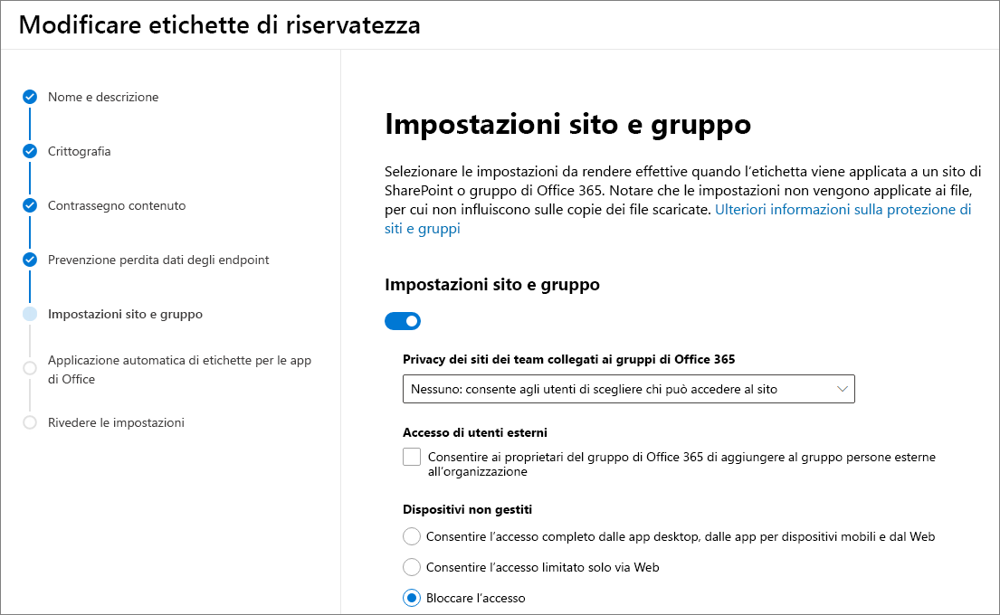

# <a name="use-sensitivity-labels-with-microsoft-teams-office-365-groups-and-sharepoint-sites-public-preview"></a>Usare le etichette di riservatezza con Microsoft Teams, gruppi di Office 365 e siti di SharePoint (anteprima pubblica)

Quando si creano etichette di riservatezza nel [Centro conformità Microsoft 365](https://protection.office.com/), ora è possibile applicarle a Microsoft Teams, gruppi di Office 365 e siti di SharePoint. È possibile associare criteri alle etichette per controllare:

- Impostazioni pubbliche/private
- Accesso guest
- Accesso da dispositivi non gestiti

Quando si applica un'etichetta a un team o a un gruppo, l'etichetta viene applicata automaticamente al sito del team di SharePoint connesso e viceversa.

Ora è possibile abilitare le etichette di riservatezza anche per i file di Office in SharePoint e OneDrive. Per altre informazioni, vedere [Abilitare le etichette di riservatezza per i file di Office in SharePoint e OneDrive (anteprima pubblica)](sensitivity-labels-sharepoint-onedrive-files.md).

## <a name="about-the-public-preview-for-microsoft-teams-office-365-groups-and-sharepoint-sites"></a>Informazioni sull'anteprima pubblica per Microsoft Teams, gruppi di Office 365 e siti di SharePoint

Le etichette di riservatezza per Microsoft Teams, gruppi di Office 365 e siti di SharePoint sono in fase di implementazione graduale nei tenant e potrebbero essere modificate prima del rilascio finale.

Questa anteprima pubblica non funziona con le reti per la distribuzione di contenuti (CDN) di Office 365.

## <a name="overview"></a>Panoramica

Quando si pubblicano etichette di riservatezza, gli utenti in Office 365 hanno accesso allo stesso elenco di etichette.

Queste immagini mostrano:

- L'aspetto dell'elenco quando si crea un nuovo sito del team di SharePoint.

- La visualizzazione dell'elenco in Word

Ad esempio:


## <a name="enable-this-preview"></a>Abilitare questa anteprima

Per abilitare questa anteprima delle etichette di riservatezza con Microsoft Teams, gruppi di Office 365 e siti di SharePoint, è necessario usare la versione di anteprima di [Azure Active Directory (AzureAD) PowerShell for Graph](https://docs.microsoft.com/powershell/azure/active-directory/overview?view=azureadps-2.0) (nome modulo **AzureADPreview**):

- Se non è ancora stata installata una versione del modulo PowerShell di Azure AD, vedere [installare il modulo Azure AD](https://docs.microsoft.com/powershell/azure/active-directory/install-adv2?view=azureadps-2.0-preview#installing-the-azure-ad-module) e seguire le istruzioni per installare la versione di anteprima pubblica.

- Se è installata la versione 2.0 disponibile a livello generale del modulo PowerShell di Azure AD (AzureAD), è necessario disinstallarlo eseguendo `Uninstall-Module AzureAD` nella sessione di PowerShell e quindi installare la versione di anteprima eseguendo `Install-Module AzureADPreview`.

- Se è già stata installata la versione Preview, eseguire `Install-Module AzureADPreview` per verificare che sia la versione più recente di questo modulo.

A questo punto si è pronti per abilitare l'anteprima delle etichette di riservatezza con Microsoft Teams, gruppi di Office 365 e siti di SharePoint:

1. In una sessione di PowerShell, connettersi ad Azure Active Directory con un account aziendale o dell'istituto di istruzione dotato di privilegi di amministratore globale. Ad esempio, eseguire:
    
    ```powershell
    Connect-AzureAD
    ````
    
    Per le istruzioni complete, vedere [Connettersi ad Azure AD](https://docs.microsoft.com/powershell/azure/active-directory/install-adv2?view=azureadps-2.0-preview#connect-to-azure-ad).

2. Eseguire i comandi seguenti:
    
    ```powershell
    $setting=(Get-AzureADDirectorySetting | where -Property DisplayName -Value "Group.Unified" -EQ)
    if ($setting -eq $null)
    {
    $template = Get-AzureADDirectorySettingTemplate -Id 62375ab9-6b52-47ed-826b-58e47e0e304b
    $setting = $template.CreateDirectorySetting()
    $setting["EnableMIPLabels"] = "True"
    New-AzureADDirectorySetting -DirectorySetting $setting
    }
    else
    {
    $setting["EnableMIPLabels"] = "True"
    Set-AzureADDirectorySetting -Id $setting.Id -DirectorySetting $setting
    }
    ```
    
    > [!NOTE]
    > Quando si abilita questa anteprima, Office 365 non usa più le vecchie classificazioni per i nuovi gruppi e siti di SharePoint. Se si usava la [classificazione dei siti di Azure AD](/sharepoint/dev/solution-guidance/modern-experience-site-classification) ($setting["ClassificationList"]), i gruppi e i siti esistenti mostrano ancora le vecchie classificazioni. Per mostrare le nuove classificazioni, convertirle. Per informazioni su come convertirle, vedere [Se si usava la classificazione dei siti di Azure AD classica](#if-you-used-classic-azure-ad-site-classification). 

3. Nella stessa sessione di PowerShell, connettersi al Centro sicurezza e conformità usando un account aziendale o dell'istituto di istruzione con privilegi di amministratore globale. Per istruzioni, vedere [Connettersi a PowerShell per Centro sicurezza e conformità di Office 365](/powershell/exchange/office-365-scc/connect-to-scc-powershell/connect-to-scc-powershell).

4. Eseguire i comandi seguenti per sincronizzare le etichette con Azure AD, in modo da poterle usare con i gruppi di Office 365:
    
    ```powershell
    Set-ExecutionPolicy RemoteSigned
    $UserCredential = Get-Credential
    $Session = New-PSSession -ConfigurationName Microsoft.Exchange -ConnectionUri https://ps.compliance.protection.outlook.com/powershell-liveid/ -Credential $UserCredential -Authentication Basic -AllowRedirection
    Import-PSSession $Session -DisableNameChecking
    Execute-AzureAdLabelSync
    ```
## <a name="set-site-and-group-settings-when-you-create-or-edit-sensitivity-labels"></a>Configurare le impostazioni a livello di sito e gruppo quando si creano o si modificano le etichette di riservatezza

Dopo aver abilitato l'anteprima, usare la procedura seguente per creare o modificare le etichette di riservatezza. Per usare le nuove etichette di riservatezza con siti e gruppi è necessario completare questa procedura, anche se sono già state definite etichette. La sincronizzazione delle modifiche apportate a queste impostazioni può richiedere fino a 24 ore.

1. Nel Centro conformità Microsoft 365 selezionare **Classificazione** > **Etichette di riservatezza**.

2. Selezionare **Crea un'etichetta**. Se si ha già un'etichetta, andare al passaggio successivo.

3. Selezionare le opzioni desiderate, quindi nella scheda **Impostazioni sito e gruppo** scegliere:
    
    - Privacy (Pubblico/Privato): privato vuol dire che solo i membri approvati all'interno dell'organizzazione possono vedere il contenuto del gruppo. Nessun altro utente dell'organizzazione può vedere cosa contiene il gruppo. [Altre informazioni](https://support.office.com/article/36236e39-26d3-420b-b0ac-8072d2d2bedc)
    - Accesso guest: è possibile controllare se si possono aggiungere utenti guest a un gruppo. [Informazioni sulla gestione dell'accesso guest nei gruppi di Office 365](/office365/admin/create-groups/manage-guest-access-in-groups)
    - Dispositivi non gestiti: questa opzione consente di bloccare o limitare l'accesso al contenuto di SharePoint da dispositivi non aggiunti ad AD ibrido o non conformi in Intune. Se si seleziona Dispositivi non gestiti, è necessario passare ad Azure AD per completare la configurazione del criterio. Per informazioni, vedere [Controllare l'accesso da dispositivi non gestiti](/sharepoint/control-access-from-unmanaged-devices).
    
    

> [!IMPORTANT]
> Quando si applica un'etichetta a un team, a un gruppo o a un sito, vengono applicate solo le impostazioni a livello di sito e gruppo. Le altre impostazioni, come la crittografia e il contrassegno dei contenuti, non vengono applicate a tutto il contenuto all'interno del team, del gruppo o del sito.
> 
> Analogamente, se si crea un'etichetta e non si attivano le impostazioni di sito e gruppo, l'etichetta sarà ancora disponibile quando gli utenti creano team, gruppi e siti, ma si servirà solo a classificare senza applicare alcuna impostazione.

[Altre informazioni sulla pubblicazione di etichette di riservatezza](/microsoft-365/compliance/sensitivity-labels#what-label-policies-can-do)

## <a name="sensitivity-label-management"></a>Gestione delle etichetta di riservatezza

> [!WARNING]
> La creazione, la modifica e l'eliminazione delle etichette di riservatezza che si usano per Microsoft Teams, gruppi di Office 365 e siti di SharePoint richiedono un attento coordinamento con la pubblicazione di criteri delle etichette per gli utenti. 

Evitare errori nella creazione per siti e gruppi che possono incidere su tutti gli utenti, usando le indicazioni seguenti.

**Creazione e pubblicazione di etichette**

Dopo la creazione e la pubblicazione di un'etichetta di riservatezza, possono essere necessarie fino a 24 ore prima che l'etichetta diventi visibile agli utenti di team, gruppi e siti. Seguire questa procedura per pubblicare un'etichetta per tutti gli utenti nel tenant:

1. Creare l'etichetta di riservatezza e pubblicarla solo per pochi account utente nel tenant.

2. Attendere 24 ore.

3. Dopo questa attesa di 24 ore, usare uno degli account utente specificati nel passaggio 1 per creare un team, un gruppo di Office 365 o un sito di SharePoint con l'etichetta creata nel passaggio 1.

4. Se non si verificano errori durante l'operazione di creazione del passaggio 3, pubblicare l'etichetta per tutti gli utenti del tenant. In caso di errori, contattare il [Supporto tecnico Microsoft](https://docs.microsoft.com/office365/admin/contact-support-for-business-products).

**Modifica ed eliminazione di etichette pubblicate**

Se si modifica o si elimina un'etichetta di riservatezza inclusa in uno o più criteri delle etichette, tali azioni possono causare errori di creazione per tutti i team, i gruppi e i siti. Per evitare questa situazione, seguire queste indicazioni:

1. Rimuovere l'etichetta di riservatezza da tutti i criteri che includono l'etichetta.

2. Attendere 48 ore.

3. Dopo l'attesa di 48 ore, provare a creare un team, un gruppo o un sito e verificare che l'etichetta non sia più visibile.

4. Se l'etichetta di riservatezza non è visibile, è possibile modificare o eliminare l'etichetta in sicurezza. Se l'etichetta è ancora visibile, contattare il [Supporto tecnico Microsoft](https://docs.microsoft.com/office365/admin/contact-support-for-business-products).

## <a name="troubleshoot-sensitivity-label-deployment"></a>Risolvere i problemi di distribuzione delle etichette di riservatezza

### <a name="labels-not-visible-after-publishing"></a>Etichette non visibili dopo la pubblicazione
Se si verificano problemi durante la creazione di un team o un gruppo di Office 365 dopo aver abilitato queste impostazioni o aver modificato la descrizione di una etichetta di riservatezza, salvare l'etichetta, attendere alcune ore e quindi provare di nuovo a creare il team o il gruppo. Per informazioni, vedere [Pianificare l'implementazione dopo aver creato o modificato un'etichetta di riservatezza](sensitivity-labels-sharepoint-onedrive-files.md#schedule-roll-out-after-you-create-or-change-a-sensitivity-label).

Se non è ancora possibile vedere la nuova etichetta di riservatezza da SharePoint Online, contattare il [Supporto tecnico Microsoft](https://docs.microsoft.com/office365/admin/contact-support-for-business-products).

### <a name="team-group-or-sharepoint-site-creation-errors"></a>Errori nella creazione di team, gruppi o siti di SharePoint
Se si verificano errori di creazione durante l'anteprima pubblica, sono disponibili due opzioni:

- Assicurarsi che le etichette di riservatezza non siano obbligatorie per alcun utente.

- È possibile disattivare le etichette di riservatezza per Microsoft Teams, gruppi di Office 365 e siti di SharePoint seguendo le stesse istruzioni riportate nella sezione [abilitare questa anteprima](#enable-this-preview) di questa pagina. Tuttavia, per disabilitare l'anteprima, cercare la riga `$setting["EnableMIPLabels"] = "True"` e modificare il valore **True** in **False**.

## <a name="apply-a-sensitivity-label-to-a-new-team"></a>Applicare un'etichetta di riservatezza a un nuovo team

Gli utenti possono selezionare le etichette di riservatezza quando creano nuovi team in Microsoft Teams. Quando selezionano il livello di riservatezza, le impostazioni di privacy cambiano come necessario. In base alle impostazioni di accesso guest selezionate per l'etichetta, gli utenti possono o non possano aggiungere al team persone esterne all'organizzazione.

[Altre informazioni sulle etichette di riservatezza per Teams](https://docs.microsoft.com/microsoftteams/sensitivity-labels)


Dopo la creazione del team, l'etichetta di riservatezza compare nell'angolo in alto a destra di tutti i canali.


Il servizio applica automaticamente la stessa etichetta di riservatezza al gruppo di Office 365 e al sito del team di SharePoint connesso.

## <a name="apply-a-sensitivity-label-to-a-new-group"></a>Applicare un'etichetta di riservatezza a un nuovo gruppo

In Outlook sul Web, la nuova casella **Riservatezza** contiene le etichette pubblicate. Se gli utenti vogliono altre informazioni, possono fare clic sull'icona della Guida per leggere i dettagli sulle etichette disponibili e sui criteri associati.


## <a name="apply-a-sensitivity-label-to-a-new-site"></a>Applicare un'etichetta di riservatezza a un nuovo sito

Gli amministratori e gli utenti finali possono selezionare le etichette di riservatezza quando creano siti di comunicazione e siti del team moderni.

[Informazioni su come creare un sito nella nuova interfaccia di amministrazione di SharePoint](/sharepoint/create-site-collection)

Quando gli utenti creano siti di comunicazione e siti del team moderni, per impostazione predefinita è già selezionata un'etichetta di riservatezza. Per saperne di più sulle etichette, gli utenti possono selezionare l'icona della Guida.


Quando gli utenti visitano il sito, possono vedere il nome dell'etichetta e i criteri applicati.


## <a name="manage-sensitivity-labels-in-the-sharepoint-admin-center"></a>Gestire le etichette di riservatezza nell'interfaccia di amministrazione di SharePoint

Per visualizzare e modificare le etichette, usare la pagina Siti attivi nella nuova interfaccia di amministrazione di SharePoint.


[Altre informazioni sulla gestione dei siti nella nuova interfaccia di amministrazione di SharePoint](/sharepoint/manage-sites-in-new-admin-center).

## <a name="change-site-and-group-settings-for-a-label"></a>Modificare le impostazioni a livello di sito e gruppo

Ogni volta che si apporta una modifica alle impostazioni di sito e gruppo per un'etichetta, è necessario eseguire i comandi di PowerShell seguenti in modo che i team, i siti e i gruppi possano usare le nuove impostazioni. Come procedura consigliata, non modificare le impostazioni di sito e gruppo per un'etichetta dopo aver applicato l'etichetta a più team, gruppi o siti.

1. Eseguire i comandi seguenti per connettersi a PowerShell per Centro sicurezza e conformità di Office 365 e ottenere l'elenco delle etichette di riservatezza e i relativi GUID.
    
    ```powershell
    Set-ExecutionPolicy RemoteSigned
    $UserCredential = Get-Credential
    $Session = New-PSSession -ConfigurationName Microsoft.Exchange -ConnectionUri https://ps.compliance.protection.outlook.com/powershell-liveid -Authentication Basic -AllowRedirection -Credential $UserCredential
    Import-PSSession $Session
    Get-Label |ft Name, Guid
    ```

2. Prendere nota del GUID dell'etichetta o delle etichette modificate.

3. Ora connettersi a PowerShell per Exchange Online ed eseguire il cmdlet Get-UnifiedGroup, specificando il GUID dell'etichetta al posto del GUID di esempio "e48058ea-98e8-4940-8db0-ba1310fd955e": 
    
    ```powershell
    Set-ExecutionPolicy RemoteSigned
    $UserCredential = Get-Credential
    $Session = New-PSSession -ConfigurationName Microsoft.Exchange -ConnectionUri https://outlook.office365.com/powershell-liveid/ -Credential $UserCredential -Authentication Basic -AllowRedirection
    Import-PSSession $Session
    $Groups= Get-UnifiedGroup | Where {$_.SensitivityLabel  -eq "e48058ea-98e8-4940-8db0-ba1310fd955e"}
    ```

4. Per ogni gruppo, riapplicare l'etichetta di riservatezza specificando il GUID dell'etichetta al posto del GUID di esempio "e48058ea-98e8-4940-8db0-ba1310fd955e":
    
    ```powershell
    foreach ($g in $groups)
    {Set-UnifiedGroup -Identity $g.Identity -SensitivityLabelId "e48058ea-98e8-4940-8db0-ba1310fd955e"}
    ```

## <a name="support-for-the-new-sensitivity-labels"></a>Supporto delle nuove etichette di riservatezza

Le app e i servizi seguenti supportano le etichette di riservatezza in questa versione di anteprima:

- Centro conformità Microsoft 365
- SharePoint
- Outlook sul Web
- Teams
- Interfaccia di amministrazione di SharePoint
- Interfaccia di amministrazione di Azure AD

Non è possibile usare le app e i servizi seguenti per creare gruppi di Office 365 con le nuove etichette di riservatezza:

- Outlook per Mac
- Outlook Mobile  
- Outlook desktop per Windows
- Forms  
- Dynamics 365  
- Yammer  
- Stream  
- Planner  
- Project  
- PowerBI  
- Interfaccia di amministrazione di Teams  
- Interfaccia di amministrazione di Microsoft 365  
- Interfaccia di amministrazione di Exchange

## <a name="if-you-used-classic-azure-ad-site-classification"></a>Se si usava la classificazione dei siti di Azure AD classica

Quando si abilita questa anteprima, Office 365 non supporta più le vecchie classificazioni per i nuovi gruppi e siti di SharePoint. Tuttavia, i gruppi e i siti esistenti continuano a visualizzare le vecchie classificazioni, a meno che non vengano convertite. Le vecchie classificazioni includono la classificazione dei siti "moderni" configurata, probabilmente tramite Azure AD PowerShell o la libreria principale di PnP, che definiscono i valori per l'impostazione `ClassificationList`.

Ad esempio, in PowerShell:

```powershell
   ($setting["ClassificationList"])
```

Per altre informazioni sul metodo di classificazione precedente, vedere [Classificazione dei siti "moderni" di SharePoint](https://docs.microsoft.com/sharepoint/dev/solution-guidance/modern-experience-site-classification).

In base alla distribuzione corrente, per convertire le vecchie classificazioni nelle nuove classificazioni si può procedere in due modi.

### <a name="if-you-never-used-sensitivity-labels-unified-microsoft-information-protection-labels-for-files-and-email"></a>Se non si sono mai usate etichette di riservatezza (etichette di Microsoft Information Protection unificate) per file e messaggi di posta elettronica

È consigliabile:

1. Creare nuove etichette di riservatezza nel Centro conformità Microsoft 365 con lo stesso nome delle classificazioni esistenti.
2. Usare PowerShell per applicare le nuove etichette ai gruppi di Office 365 e ai siti di SharePoint esistenti usando il mapping dei nomi.
3. Eliminare le vecchie classificazioni.

Le app e i servizi che supportano le nuove etichette di riservatezza le mostreranno. È possibile creare nuovi team, gruppi e siti con le nuove etichette. Gli utenti possono comunque creare gruppi da app e servizi che non supportano le nuove etichette. Tuttavia, gli utenti non possono applicare un'etichetta a questi gruppi. Usare PowerShell per applicare le nuove etichette di riservatezza a questi gruppi.

È possibile mantenere le vecchie classificazioni, tuttavia è consigliabile usare PowerShell per applicare le nuove etichette di riservatezza a questi gruppi.

Le app e i servizi che supportano le nuove etichette di riservatezza verranno creati con le nuove etichette. Quando gli utenti creano gruppi da app e servizi che non supportano le nuove etichette, possono selezionare una classificazione.

### <a name="if-you-use-sensitivity-labels-unified-microsoft-information-protection-labels-for-files-and-email"></a>Se si usano etichette di riservatezza (etichette di Microsoft Information Protection unificate) per file e messaggi di posta elettronica

Dopo aver abilitato l'anteprima, passare a ogni etichetta nel Centro conformità Microsoft 365 e applicare i criteri desiderati per i siti e i gruppi. Gli utenti inizieranno a visualizzare le etichette esistenti per i siti e i gruppi.

### <a name="prepare-the-sharepoint-online-management-shell-before-you-relabel-office-365-groups"></a>Preparare SharePoint Online Management Shell prima di rietichettare i gruppi di Office 365.

Prima di applicare nuove etichette, assicurarsi di disporre della versione più recente di SharePoint Online Management Shell. Se si ha già l'ultima versione, è possibile procedere e [Rietichettare i gruppi di Office 365 con le nuove etichette di riservatezza](#relabel-office-365-groups-with-new-sensitivity-labels).

Per preparare SharePoint Online Management Shell per l'anteprima:

1. Se è installata una versione precedente di SharePoint Online Management Shell, passare a **Installazione applicazioni** e disinstallare "SharePoint Online Management Shell".

2. In un Web browser passare alla pagina Area download e [scaricare l'ultima versione di SharePoint Online Management Shell](https://go.microsoft.com/fwlink/p/?LinkId=255251).

3. Selezionare la lingua e fare clic su **Scarica**.

4. Scegliere tra il file MSI x64 o x86. Scaricare il file x64 se si esegue la versione a 64 bit di Windows e il file x86 se si esegue la versione a 32 bit. Vedere [Quale versione del sistema operativo Windows sto eseguendo?](https://support.microsoft.com/help/13443/windows-which-operating-system) in caso di dubbi.

5. Dopo aver scaricato il file, eseguirlo e seguire i passaggi della configurazione guidata.

### <a name="relabel-office-365-groups-with-new-sensitivity-labels"></a>Rietichettare i gruppi di Office 365 con le nuove etichette di riservatezza

1. Verificare che sia in uso l'ultima versione di SharePoint Online Management Shell. Per le istruzioni, vedere [Preparare SharePoint Online Management Shell prima di rietichettare i gruppi di Office 365](#prepare-the-sharepoint-online-management-shell-before-you-relabel-office-365-groups).

2. Usando un account aziendale o dell'istituto di istruzione con privilegi di amministratore globale o amministratore di SharePoint in Office 365, connettersi a SharePoint Online Management Shell. Per informazioni in merito, vedere [Guida introduttiva a SharePoint Online Management Shell](/powershell/sharepoint/sharepoint-online/connect-sharepoint-online).

3. Eseguire il comando seguente per ottenere l'elenco delle etichette di riservatezza e dei GUID corrispondenti.

    ```PowerShell
    Set-ExecutionPolicy RemoteSigned
    $UserCredential = Get-Credential
    $Session = New-PSSession -ConfigurationName Microsoft.Exchange -ConnectionUri https://ps.compliance.protection.outlook.com/powershell-liveid -Authentication Basic -AllowRedirection -Credential $UserCredential
    Import-PSSession $Session
    Get-Label |ft Name, Guid  
    ```

4. Prendere nota del GUID dell'etichetta che si vuole sovrascrivere. Ad esempio, l'etichetta "Generale".

5. Usare il comando seguente per visualizzare l'elenco dei gruppi con classificazione "General". Eseguendo questo comando, ci si connette a PowerShell per Exchange Online e si esegue il cmdlet Get-UnifiedGroup.

   ```PowerShell
   Set-ExecutionPolicy RemoteSigned
   $UserCredential = Get-Credential
   $Session = New-PSSession -ConfigurationName Microsoft.Exchange -ConnectionUri https://outlook.office365.com/powershell-liveid/ -Credential $UserCredential -Authentication Basic -AllowRedirection
   Import-PSSession $Session
   $Groups= Get-UnifiedGroup | Where {$_.classification -eq "General"}
   ```

6. Per ogni gruppo, aggiungere il GUID della nuova etichetta di riservatezza.

    ```PowerShell
    foreach ($g in $groups)
    {Set-UnifiedGroup -Identity $g.Identity -SensitivityLabelId "457fa763-7c59-461c-b402-ad1ac6b703cc"}
    ```
