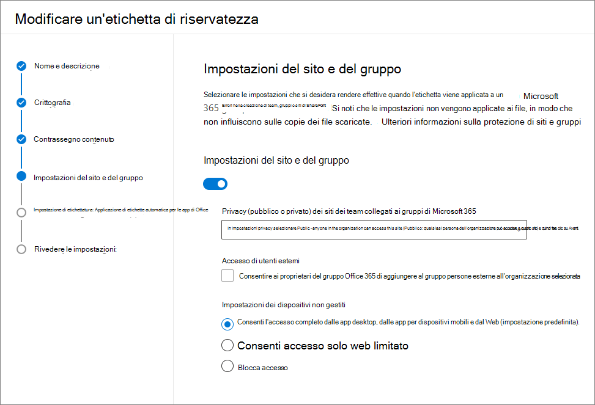

# <a name="use-sensitivity-labels-to-protect-content-in-microsoft-teams-microsoft-365-groups-and-sharepoint-sites"></a><span data-ttu-id="7086e-103">Usare le etichette di riservatezza per proteggere il contenuto in Microsoft Teams, gruppi di Microsoft 365 e siti di SharePoint</span><span class="sxs-lookup"><span data-stu-id="7086e-103">Use sensitivity labels to protect content in Microsoft Teams, Microsoft 365 groups, and SharePoint sites</span></span>

><span data-ttu-id="7086e-104">*[Indicazioni per l'assegnazione di licenze di Microsoft 365 per sicurezza e conformità](https://aka.ms/ComplianceSD).*</span><span class="sxs-lookup"><span data-stu-id="7086e-104">*[Microsoft 365 licensing guidance for security & compliance](https://aka.ms/ComplianceSD).*</span></span>

<span data-ttu-id="7086e-105">Le [etichette di riservatezza](sensitivity-labels.md), oltre a essere usate per classificare e proteggere documenti e messaggi di posta elettronica, possono essere usate per proteggere il contenuto dei contenitori seguenti: siti di Microsoft Teams, gruppi di Microsoft 365 ([in precedenza gruppi di Office 365](https://techcommunity.microsoft.com/t5/microsoft-365-blog/office-365-groups-will-become-microsoft-365-groups/ba-p/1303601)) e siti di SharePoint.</span><span class="sxs-lookup"><span data-stu-id="7086e-105">In addition to using [sensitivity labels](sensitivity-labels.md) to classify and protect documents and emails, you can also use sensitivity labels to protect content in the following containers: Microsoft Teams sites, Microsoft 365 groups ([formerly Office 365 groups](https://techcommunity.microsoft.com/t5/microsoft-365-blog/office-365-groups-will-become-microsoft-365-groups/ba-p/1303601)), and SharePoint sites.</span></span> <span data-ttu-id="7086e-106">Per questa classificazione e protezione a livello di contenitore, usare le seguenti impostazioni di etichetta:</span><span class="sxs-lookup"><span data-stu-id="7086e-106">For this container-level classification and protection, use the following label settings:</span></span>

- <span data-ttu-id="7086e-107">Privacy (pubblico o privato) dei siti dei team collegati ai gruppi di Microsoft 365</span><span class="sxs-lookup"><span data-stu-id="7086e-107">Privacy (public or private) of Microsoft 365 group-connected teams sites</span></span>
- <span data-ttu-id="7086e-108">Accesso di utenti esterni</span><span class="sxs-lookup"><span data-stu-id="7086e-108">External users access</span></span>
- <span data-ttu-id="7086e-109">Accesso da dispositivi non gestiti</span><span class="sxs-lookup"><span data-stu-id="7086e-109">Access from unmanaged devices</span></span>

> [!IMPORTANT]
> <span data-ttu-id="7086e-110">La funzionalità **Accedi da dispositivi non gestiti** funziona in combinazione con la caratteristica di SharePoint che consente di [controllare l'accesso da dispositivi non gestiti](/sharepoint/control-access-from-unmanaged-devices).</span><span class="sxs-lookup"><span data-stu-id="7086e-110">The **Access from unmanaged devices** setting works in conjunction with the SharePoint feature to [control access from unmanaged devices](/sharepoint/control-access-from-unmanaged-devices).</span></span> <span data-ttu-id="7086e-111">Per utilizzare un'etichetta di riservatezza per cui sia configurata questa impostazione, è necessario configurare questa funzionalità dipendente di SharePoint.</span><span class="sxs-lookup"><span data-stu-id="7086e-111">You must configure this dependent SharePoint feature to use a sensitivity label that has this setting configured.</span></span> <span data-ttu-id="7086e-112">Altre informazioni sono disponibili nelle istruzioni seguenti.</span><span class="sxs-lookup"><span data-stu-id="7086e-112">Additional information is included in the instructions that follow.</span></span>

<span data-ttu-id="7086e-113">Quando si applica questa etichetta di riservatezza a uno dei contenitori supportati, l'etichetta applica automaticamente le impostazioni di classificazione e protezione al sito o al gruppo connesso.</span><span class="sxs-lookup"><span data-stu-id="7086e-113">When you apply this sensitivity label to a supported container, the label automatically applies the classification and protection settings to the connected site or group.</span></span>

<span data-ttu-id="7086e-114">Il contenuto di tali contenitori, tuttavia, non eredita le etichette per la classificazione e le impostazioni come i contrassegni visivi o la crittografia.</span><span class="sxs-lookup"><span data-stu-id="7086e-114">Content in these containers however, do not inherit the labels for the classification and settings such as visual markings, or encryption.</span></span> <span data-ttu-id="7086e-115">Per fare in modo che gli utenti possano etichettare i propri documenti nei siti di SharePoint o del team, assicurarsi di [abilitare le etichette di riservatezza per i file di Office in SharePoint e OneDrive](sensitivity-labels-sharepoint-onedrive-files.md).</span><span class="sxs-lookup"><span data-stu-id="7086e-115">So that users can label their documents in SharePoint sites or team sites, make sure you've [enabled sensitivity labels for Office files in SharePoint and OneDrive](sensitivity-labels-sharepoint-onedrive-files.md).</span></span>

> [!NOTE]
> <span data-ttu-id="7086e-116">Le etichette di riservatezza per i contenitori non sono supportate con le reti per la distribuzione di contenuti (CDN) di Office 365.</span><span class="sxs-lookup"><span data-stu-id="7086e-116">Sensitivity labels for containers aren't supported with Office 365 Content Delivery Networks (CDNs).</span></span>

## <a name="using-sensitivity-labels-for-microsoft-teams-microsoft-365-groups-and-sharepoint-sites"></a><span data-ttu-id="7086e-117">Usare le etichette di riservatezza per Microsoft Teams, gruppi di Microsoft 365 e siti di SharePoint</span><span class="sxs-lookup"><span data-stu-id="7086e-117">Using sensitivity labels for Microsoft Teams, Microsoft 365 groups, and SharePoint sites</span></span>

<span data-ttu-id="7086e-118">Prima di abilitare le etichette di riservatezza per contenitori e configurare le etichette di riservatezza per le nuove impostazioni, gli utenti possono vedere e applicare tali etichette nelle loro app.</span><span class="sxs-lookup"><span data-stu-id="7086e-118">Before you enable sensitivity labels for containers and configure sensitivity labels for the new settings, users can see and apply sensitivity labels in their apps.</span></span> <span data-ttu-id="7086e-119">Un esempio da Word:</span><span class="sxs-lookup"><span data-stu-id="7086e-119">For example, from Word:</span></span>


<span data-ttu-id="7086e-121">Dopo l'abilitazione e la configurazione delle etichette di riservatezza, gli utenti possono anche vedere e applicare etichette di riservatezza a Microsoft Teams, gruppi di Microsoft 365 e siti di SharePoint.</span><span class="sxs-lookup"><span data-stu-id="7086e-121">After you enable and configure sensitivity labels for containers, users can additionally see and apply sensitivity labels to Microsoft team sites, Microsoft 365 groups, and SharePoint sites.</span></span> <span data-ttu-id="7086e-122">Un esempio quando si crea un nuovo sito del team di SharePoint:</span><span class="sxs-lookup"><span data-stu-id="7086e-122">For example, when you create a new team site from SharePoint:</span></span>


## <a name="how-to-enable-sensitivity-labels-for-containers-and-synchronize-labels"></a><span data-ttu-id="7086e-124">Come abilitare le etichette di riservatezza per i contenitori e sincronizzare le etichette</span><span class="sxs-lookup"><span data-stu-id="7086e-124">How to enable sensitivity labels for containers and synchronize labels</span></span>

1. <span data-ttu-id="7086e-125">Dato che questa funzione usa le funzionalità di Azure AD, seguire le istruzioni riportate nella relativa documentazione per abilitare il supporto per le etichette di riservatezza: [Assegnare etichette di riservatezza a gruppi di Microsoft 365 in Azure Active Directory](https://docs.microsoft.com/azure/active-directory/users-groups-roles/groups-assign-sensitivity-labels).</span><span class="sxs-lookup"><span data-stu-id="7086e-125">Because this feature uses Azure AD functionality, follow the instructions from the Azure AD documentation to enable sensitivity label support: [Assign sensitivity labels to Microsoft 365 groups in Azure Active Directory](https://docs.microsoft.com/azure/active-directory/users-groups-roles/groups-assign-sensitivity-labels).</span></span>

2. <span data-ttu-id="7086e-126">Ora è necessario sincronizzare le etichette di riservatezza in Azure AD.</span><span class="sxs-lookup"><span data-stu-id="7086e-126">You now need to synchronize your sensitivity labels to Azure AD.</span></span> <span data-ttu-id="7086e-127">Prima di tutto,[connettersi a PowerShell in Centro sicurezza e conformità](/powershell/exchange/office-365-scc/connect-to-scc-powershell/connect-to-scc-powershell).</span><span class="sxs-lookup"><span data-stu-id="7086e-127">First, [connect to Security & Compliance Center PowerShell](/powershell/exchange/office-365-scc/connect-to-scc-powershell/connect-to-scc-powershell).</span></span>

   <span data-ttu-id="7086e-128">Ad esempio, in una sessione di PowerShell eseguita come amministratore, accedere con un account di amministratore globale.</span><span class="sxs-lookup"><span data-stu-id="7086e-128">For example, in a PowerShell session that you run as administrator, sign in with a global administrator account.</span></span>

3. <span data-ttu-id="7086e-129">Quindi eseguire il comando seguente per assicurarsi di poter usare le etichette di riservatezza con i gruppi di Microsoft 365:</span><span class="sxs-lookup"><span data-stu-id="7086e-129">Then run the following command to ensure your sensitivity labels can be used with Microsoft 365 groups:</span></span>

    ```powershell
    Execute-AzureAdLabelSync
    ```

## <a name="how-to-configure-site-and-group-settings"></a><span data-ttu-id="7086e-130">Come configurare le impostazioni di sito e gruppo</span><span class="sxs-lookup"><span data-stu-id="7086e-130">How to configure site and group settings</span></span>

<span data-ttu-id="7086e-131">Ora è possibile creare o modificare le etichette di riservatezza che si desidera rendere disponibili per siti e gruppi.</span><span class="sxs-lookup"><span data-stu-id="7086e-131">You're now ready to create or edit sensitivity labels that you want to be available for sites and groups.</span></span> <span data-ttu-id="7086e-132">L'abilitazione delle etichette di sicurezza per contenitori rende visibile una nuova pagina nelle procedure guidate per l'etichetta di riservatezza: **Impostazioni sito e gruppo**</span><span class="sxs-lookup"><span data-stu-id="7086e-132">Enabling sensitivity labels for containers makes a new page visible in the sensitivity labeling wizards: **Site and group settings**</span></span>

<span data-ttu-id="7086e-133">Se serve aiuto per creare o modificare un'etichetta di riservatezza, seguire le istruzioni [Creare e configurare etichette di riservatezza](create-sensitivity-labels.md#create-and-configure-sensitivity-labels).</span><span class="sxs-lookup"><span data-stu-id="7086e-133">If you need help with creating or editing a sensitivity label, see the instructions from [Create and configure sensitivity labels](create-sensitivity-labels.md#create-and-configure-sensitivity-labels).</span></span>

<span data-ttu-id="7086e-134">In questa nuova pagina **Impostazioni sito e gruppo**, configurare le impostazioni seguenti:</span><span class="sxs-lookup"><span data-stu-id="7086e-134">On this new **Site and group settings** page, configure the settings:</span></span>

- <span data-ttu-id="7086e-135">**Privacy dei siti dei team connessi a gruppi di Microsoft 365**: mantenere l'impostazione predefinita **Pubblico - qualsiasi utente dell'organizzazione può accedere al sito** se si vuole che chiunque nell'organizzazione possa accedere al sito del team o al gruppo in cui è applicata l'etichetta.</span><span class="sxs-lookup"><span data-stu-id="7086e-135">**Privacy of Microsoft 365 group-connected teams sites**: Keep the default of **Public - anyone in the organization can access the site** if you want anyone in your organization to access the team site or group where this label is applied.</span></span>

  <span data-ttu-id="7086e-136">Selezionare **Privato** se si vuole limitare l'accesso solo ai membri approvati nell'organizzazione.</span><span class="sxs-lookup"><span data-stu-id="7086e-136">Select **Private** if you want access to be restricted to only approved members in your organization.</span></span>

  <span data-ttu-id="7086e-137">Selezionare **Nessuno: consente agli utenti di scegliere chi può accedere al sito** quando si vuole proteggere il contenuto del contenitore usando l'etichetta di riservatezza, ma consentendo comunque agli utenti di configurare in autonomia le impostazioni di privacy.</span><span class="sxs-lookup"><span data-stu-id="7086e-137">Select **None - let user chose who can access the site** when you want to protect content in the container by using the sensitivity label, but still let users configure the privacy setting themselves.</span></span>

  <span data-ttu-id="7086e-138">Le impostazioni di **Pubblico** o **Privato** impostano e bloccano l'impostazione della privacy quando si applica l'etichetta al contenitore.</span><span class="sxs-lookup"><span data-stu-id="7086e-138">The settings of **Public** or **Private** set and lock the privacy setting when you apply this label to the container.</span></span> <span data-ttu-id="7086e-139">L'impostazione scelta sostituisce ogni precedente impostazione della privacy configurata per il team o il gruppo, bloccando il livello di privacy in modo che possa essere modificato solo rimuovendo prima l'etichetta di riservatezza dal contenitore.</span><span class="sxs-lookup"><span data-stu-id="7086e-139">Your chosen setting replaces any previous privacy setting that might be configured for the team or group, and locks the privacy value so it can be changed only by first removing the sensitivity label from the container.</span></span> <span data-ttu-id="7086e-140">Dopo aver rimosso l'etichetta di riservatezza, viene mantenuto il livello di privacy impostato dall'etichetta, che ora potrà essere modificato, se necessario.</span><span class="sxs-lookup"><span data-stu-id="7086e-140">After you remove the sensitivity label, the privacy setting from the label remains and users can now change it again.</span></span>

- <span data-ttu-id="7086e-141">**Accesso di utenti esterni**: controllare se il proprietario del gruppo può [aggiungere utenti guest al gruppo](/office365/admin/create-groups/manage-guest-access-in-groups).</span><span class="sxs-lookup"><span data-stu-id="7086e-141">**External users access**: Control whether the group owner can [add guests to the group](/office365/admin/create-groups/manage-guest-access-in-groups).</span></span>

- <span data-ttu-id="7086e-142">**Dispositivi non gestiti**: questa opzione si serve della funzionalità di SharePoint che usa l'accesso condizionale di Azure AD per bloccare o limitare l'accesso ai contenuti di SharePoint e OneDrive da dispositivi non gestiti.</span><span class="sxs-lookup"><span data-stu-id="7086e-142">**Unmanaged devices**: This option uses the SharePoint feature that uses Azure AD conditional access to block or limit access to SharePoint and OneDrive content from unmanaged devices.</span></span> <span data-ttu-id="7086e-143">Per altre informazioni, vedere [Controllare l'accesso da dispositivi non gestiti](/sharepoint/control-access-from-unmanaged-devices).</span><span class="sxs-lookup"><span data-stu-id="7086e-143">For more information, see [Control access from unmanaged devices](/sharepoint/control-access-from-unmanaged-devices).</span></span> <span data-ttu-id="7086e-144">L'opzione specificata per questa impostazione dell'etichetta equivale all'esecuzione di un comando di PowerShell per un sito, come descritto nei passaggi 7-9 di [Bloccare o limitare l'accesso a uno specifico sito di SharePoint o OneDrive](https://docs.microsoft.com/sharepoint/control-access-from-unmanaged-devices#block-or-limit-access-to-a-specific-sharepoint-site-or-onedrive).</span><span class="sxs-lookup"><span data-stu-id="7086e-144">The option you specify for this label setting is the equivalent of running a PowerShell command for a site, as described in steps 7-9 from [Block or limit access to a specific SharePoint site or OneDrive](https://docs.microsoft.com/sharepoint/control-access-from-unmanaged-devices#block-or-limit-access-to-a-specific-sharepoint-site-or-onedrive).</span></span>
    
    <span data-ttu-id="7086e-145">Se non si configurano i criteri di accesso condizionale dipendenti come descritto nei passaggi 1-6 delle istruzioni per SharePoint, l'opzione specificata non avrà alcun effetto.</span><span class="sxs-lookup"><span data-stu-id="7086e-145">If you don't configure the dependent conditional access policy as documented in steps 1-6 in the SharePoint instructions, the option you specify here will have no effect.</span></span> <span data-ttu-id="7086e-146">Inoltre, non avrà alcun effetto se è meno restrittiva rispetto a un'impostazione configurata al livello del tenant.</span><span class="sxs-lookup"><span data-stu-id="7086e-146">Additionally, it will have no effect if it's less restrictive than a configured setting at the tenant level.</span></span> <span data-ttu-id="7086e-147">Se è stata configurata un'opzione per i dispositivi non gestiti a livello di organizzazione, scegliere un'impostazione dell'etichetta uguale o più restrittiva.</span><span class="sxs-lookup"><span data-stu-id="7086e-147">If you have configured an organization-wide setting for unmanaged devices, choose a label setting that's either the same or more restrictive.</span></span>
    
    <span data-ttu-id="7086e-148">Per esempio, se il tenant è configurato in modo da **Consentire l'accesso limitato solo web**, l'impostazione dell'etichetta che consente l'accesso totale non avrà effetto perché è meno restrittiva.</span><span class="sxs-lookup"><span data-stu-id="7086e-148">For example, if your tenant is configured for **Allow limited, web-only access**, the label setting that allows full access will have no effect because it's less restrictive.</span></span> <span data-ttu-id="7086e-149">Per questa impostazione a livello del tenant, scegliere l'impostazione dell'etichetta per bloccare l'accesso (più restrittiva) o l'impostazione per l'accesso limitato (la stessa impostazione del tenant).</span><span class="sxs-lookup"><span data-stu-id="7086e-149">For this tenant-level setting, choose the label setting to block access (more restrictive) or the label setting for limited access (the same as the tenant setting).</span></span>
    
    <span data-ttu-id="7086e-150">Dato che la funzionalità di SharePoint può essere configurata indipendentemente dall'impostazione dell'etichetta, la procedura guidata dell'etichetta di riservatezza non verifica che le dipendenze siano disponibili.</span><span class="sxs-lookup"><span data-stu-id="7086e-150">Because you can configure the SharePoint settings separately from the label configuration, there's no check in the sensitivity label wizard that the dependencies are in place.</span></span>



> [!IMPORTANT]
> <span data-ttu-id="7086e-152">Quando si applica l'etichetta a un team, a un gruppo o a un sito, vengono applicate solo queste impostazioni a livello di sito e gruppo.</span><span class="sxs-lookup"><span data-stu-id="7086e-152">Only these site and group settings take effect when you apply the label to a team, group, or site.</span></span> <span data-ttu-id="7086e-153">Le altre impostazioni dell'etichetta, come la crittografia e il contrassegno di contenuti, non vengono applicate ai contenuto all'interno del team, del gruppo o del sito.</span><span class="sxs-lookup"><span data-stu-id="7086e-153">Other label settings, such as encryption and content marking, aren't applied to the content within the team, group, or site.</span></span>
>
> <span data-ttu-id="7086e-154">In fase di implementazione graduale nei tenant: quando gli utenti creano team, gruppi e siti, saranno disponibili per la selezione solo le etichette con impostazioni a livello di sito e gruppo.</span><span class="sxs-lookup"><span data-stu-id="7086e-154">Gradually rolling out to tenants: Only labels with the site and group settings will be available to select when users create teams, groups, and sites.</span></span> <span data-ttu-id="7086e-155">Se attualmente è possibile applicare un'etichetta a un contenitore quando l'etichetta non ha le impostazioni di sito e gruppo abilitate, al contenitore viene applicato solo il nome dell'etichetta.</span><span class="sxs-lookup"><span data-stu-id="7086e-155">If you can currently apply a label to a container when the label doesn't have the site and group settings enabled, only the label name is applied to the container.</span></span>

<span data-ttu-id="7086e-156">Se l'etichetta di riservatezza non è già pubblicata, ora è possibile farlo [aggiungendola a un criterio di etichetta di riservatezza](create-sensitivity-labels.md#publish-sensitivity-labels-by-creating-a-label-policy).</span><span class="sxs-lookup"><span data-stu-id="7086e-156">If your sensitivity label isn't already published, now publish it by [adding it to a sensitivity label policy](create-sensitivity-labels.md#publish-sensitivity-labels-by-creating-a-label-policy).</span></span> <span data-ttu-id="7086e-157">Gli utenti a cui è stato assegnato un criterio di etichetta di riservatezza che include tale etichetta potranno selezionarla per siti e gruppi.</span><span class="sxs-lookup"><span data-stu-id="7086e-157">The users who are assigned a sensitivity label policy that includes this label will be able to select it for sites and groups.</span></span>

<span data-ttu-id="7086e-158">Dal criterio di etichetta, solo l'impostazione dei criteri **Applica questa etichetta per impostazione predefinita a documenti e messaggi di posta elettronica** è applicabile quando si applica questa etichetta ai contenitori.</span><span class="sxs-lookup"><span data-stu-id="7086e-158">From the label policy, only the policy setting **Apply this label by default to documents and email** is applicable when you apply this label to containers.</span></span> <span data-ttu-id="7086e-159">Le altre impostazioni dei criteri non vengono applicate, inclusi etichettatura obbligatoria, richiesta della motivazione da parte dell'utente e un collegamento alla pagina della Guida personalizzata.</span><span class="sxs-lookup"><span data-stu-id="7086e-159">Other policy settings are not applied, which include mandatory labeling, requiring user justification, and a link to the custom help page.</span></span>

## <a name="sensitivity-label-management"></a><span data-ttu-id="7086e-160">Gestione delle etichetta di riservatezza</span><span class="sxs-lookup"><span data-stu-id="7086e-160">Sensitivity label management</span></span>

<span data-ttu-id="7086e-161">Seguire le istruzioni seguenti per creare, modificare o eliminare le etichette di riservatezza configurate per i siti e i gruppi.</span><span class="sxs-lookup"><span data-stu-id="7086e-161">Use the following guidance for when you create, modify, or delete sensitivity labels that are configured for sites and groups.</span></span>

### <a name="creating-and-publishing-labels-that-are-configured-for-sites-and-groups"></a><span data-ttu-id="7086e-162">Creare e pubblicare etichette configurate per i siti e i gruppi</span><span class="sxs-lookup"><span data-stu-id="7086e-162">Creating and publishing labels that are configured for sites and groups</span></span>

<span data-ttu-id="7086e-163">Quando si crea e si pubblica una nuova etichetta di riservatezza, diventerà visibile agli utenti di team, gruppi e siti entro un'ora.</span><span class="sxs-lookup"><span data-stu-id="7086e-163">When a new sensitivity label is created and published, it's visible for users in teams, groups, and sites within one hour.</span></span> <span data-ttu-id="7086e-164">Tuttavia, se si modifica un'etichetta esistente, la modifica può richiedere fino 24 ore.</span><span class="sxs-lookup"><span data-stu-id="7086e-164">However, if you modify an existing label, allow up to 24 hours.</span></span> <span data-ttu-id="7086e-165">Seguire le istruzioni seguenti per pubblicare un'etichetta per gli utenti quando l'etichetta è configurata per le impostazioni di sito e gruppo:</span><span class="sxs-lookup"><span data-stu-id="7086e-165">Use the following guidance to publish a label for your users when that label is configured for site and group settings:</span></span>

1. <span data-ttu-id="7086e-166">Dopo aver creato e configurato l'etichetta di riservatezza, aggiungerla a un criterio di etichetta applicabile solo a pochi utenti test.</span><span class="sxs-lookup"><span data-stu-id="7086e-166">After you create and configure the sensitivity label, add this label to a label policy that applies to just a few test users.</span></span>

2. <span data-ttu-id="7086e-167">Attendere la replica della modifica:</span><span class="sxs-lookup"><span data-stu-id="7086e-167">Wait for the change to replicate:</span></span>

   - <span data-ttu-id="7086e-168">Nuova etichetta: attendere un'ora.</span><span class="sxs-lookup"><span data-stu-id="7086e-168">New label: Wait for one hour.</span></span>
   - <span data-ttu-id="7086e-169">Etichetta esistente: attendere 24 ore.</span><span class="sxs-lookup"><span data-stu-id="7086e-169">Existing label: Wait for 24 hours.</span></span>

3. <span data-ttu-id="7086e-170">Dopo questo periodo di attesa, usare uno degli account utente test per creare un team, un gruppo di Microsoft 365 o un sito di SharePoint con l'etichetta creata nel passaggio 1.</span><span class="sxs-lookup"><span data-stu-id="7086e-170">After this wait period, use one of the test user accounts to create a team, Microsoft 365 group, or SharePoint site with the label that you created in step 1.</span></span>

4. <span data-ttu-id="7086e-171">Se non si verificano errori durante l'operazione di creazione, sarà possibile pubblicare l'etichetta per tutti gli utenti del tenant in sicurezza.</span><span class="sxs-lookup"><span data-stu-id="7086e-171">If there are no errors during this creation operation, you know it's safe to publish the label to all users in your tenant.</span></span>

### <a name="modifying-published-labels-that-are-configured-for-sites-and-groups"></a><span data-ttu-id="7086e-172">Modificare etichette pubblicate che sono configurate per i siti e i gruppi</span><span class="sxs-lookup"><span data-stu-id="7086e-172">Modifying published labels that are configured for sites and groups</span></span>

<span data-ttu-id="7086e-173">Come procedura consigliata, non modificare le impostazioni di sito e gruppo per un'etichetta di riservatezza dopo averla applicata a team, gruppi o siti.</span><span class="sxs-lookup"><span data-stu-id="7086e-173">As a best practice, don't change the site and group settings for a sensitivity label after the label has been applied to teams, groups, or sites.</span></span> <span data-ttu-id="7086e-174">In caso di modifica, ricordare di attendere 24 ore per la replica delle modifiche in tutti i contenitori a cui è applicata l'etichetta.</span><span class="sxs-lookup"><span data-stu-id="7086e-174">If you do, remember to wait for 24 hours for the changes to replicate to all containers that have the label applied.</span></span>

<span data-ttu-id="7086e-175">Inoltre, se le modifiche includono l'impostazione **Accesso di utenti esterni**:</span><span class="sxs-lookup"><span data-stu-id="7086e-175">In addition, if your changes include the **External users access** setting:</span></span>

- <span data-ttu-id="7086e-176">La nuova impostazione si applica ai nuovi utenti, ma non agli utenti esistenti.</span><span class="sxs-lookup"><span data-stu-id="7086e-176">The new setting applies to new users but not to existing users.</span></span> <span data-ttu-id="7086e-177">Ad esempio, se questa impostazione è stata selezionata in precedenza e quindi gli utenti Guest hanno eseguito l'accesso al sito, tali utenti Guest possono continuare ad accedere al sito dopo aver deselezionato l'impostazione nella configurazione dell'etichetta.</span><span class="sxs-lookup"><span data-stu-id="7086e-177">For example, if this setting was previously selected and as a result, guest users accessed the site, these guest users can still access the site after this setting is cleared in the label configuration.</span></span>

- <span data-ttu-id="7086e-178">Le impostazioni di privacy relative alle proprietà dei gruppi hiddenMembership e roleEnabled non vengono aggiornate.</span><span class="sxs-lookup"><span data-stu-id="7086e-178">The privacy settings for the group properties hiddenMembership and roleEnabled aren't updated.</span></span>

### <a name="deleting-published-labels-that-are-configured-for-sites-and-groups"></a><span data-ttu-id="7086e-179">Eliminare etichette pubblicate che sono configurate per i siti e i gruppi</span><span class="sxs-lookup"><span data-stu-id="7086e-179">Deleting published labels that are configured for sites and groups</span></span>

<span data-ttu-id="7086e-180">Se si elimina un'etichetta di riservatezza che ha impostazioni a livello di sito e gruppo abilitate e questa etichetta è inclusa in uno o più criteri di etichetta, questa azione può causare errori di creazione per i nuovi team, gruppi e siti.</span><span class="sxs-lookup"><span data-stu-id="7086e-180">If you delete a sensitivity label that has the site and group settings enabled, and that label is included in one or more label policies, this action can result in creation failures for new teams, groups, and sites.</span></span> <span data-ttu-id="7086e-181">Per evitare questa situazione, seguire queste indicazioni:</span><span class="sxs-lookup"><span data-stu-id="7086e-181">To avoid this situation, use the following guidance:</span></span>

1. <span data-ttu-id="7086e-182">Rimuovere l'etichetta di riservatezza da tutti i criteri che includono l'etichetta.</span><span class="sxs-lookup"><span data-stu-id="7086e-182">Remove the sensitivity label from all label policies that include the label.</span></span>

2. <span data-ttu-id="7086e-183">Attendere un'ora.</span><span class="sxs-lookup"><span data-stu-id="7086e-183">Wait for one hour.</span></span>

3. <span data-ttu-id="7086e-184">Dopo questo periodo di attesa, provare a creare un team, un gruppo o un sito e verificare che l'etichetta non sia più visibile.</span><span class="sxs-lookup"><span data-stu-id="7086e-184">After this wait period, try creating a team, group, or site and confirm that the label is no longer visible.</span></span>

4. <span data-ttu-id="7086e-185">Se l'etichetta di riservatezza non è visibile, è possibile eliminare l'etichetta in sicurezza.</span><span class="sxs-lookup"><span data-stu-id="7086e-185">If the sensitivity label isn't visible, you can now safely delete the label.</span></span>

## <a name="how-to-apply-sensitivity-labels-to-containers"></a><span data-ttu-id="7086e-186">Come applicare le etichette di riservatezza ai contenitori</span><span class="sxs-lookup"><span data-stu-id="7086e-186">How to apply sensitivity labels to containers</span></span>

<span data-ttu-id="7086e-187">A questo punto è possibile applicare una o più etichette di riservatezza ai seguenti contenitori:</span><span class="sxs-lookup"><span data-stu-id="7086e-187">You're now ready to apply the sensitivity label or labels to the following containers:</span></span>

- [<span data-ttu-id="7086e-188">Gruppo di Microsoft 365 in Azure AD</span><span class="sxs-lookup"><span data-stu-id="7086e-188">Microsoft 365 group in Azure AD</span></span>](#apply-sensitivity-labels-to-microsoft-365-groups)
- [<span data-ttu-id="7086e-189">Sito del team di Microsoft Teams</span><span class="sxs-lookup"><span data-stu-id="7086e-189">Microsoft Teams team site</span></span>](#apply-a-sensitivity-label-to-a-new-team)
- [<span data-ttu-id="7086e-190">Gruppo di Microsoft 365 in Outlook sul Web</span><span class="sxs-lookup"><span data-stu-id="7086e-190">Microsoft 365 group in Outlook on the web</span></span>](#apply-a-sensitivity-label-to-a-new-group-in-outlook-on-the-web)
- [<span data-ttu-id="7086e-191">Sito di SharePoint</span><span class="sxs-lookup"><span data-stu-id="7086e-191">SharePoint site</span></span>](#apply-a-sensitivity-label-to-a-new-site)

<span data-ttu-id="7086e-192">È possibile usare PowerShell se è necessario per [applicare un'etichetta di riservatezza a più siti](#use-powershell-to-apply-a-sensitivity-label-to-multiple-sites).</span><span class="sxs-lookup"><span data-stu-id="7086e-192">You can use PowerShell if you need to [apply a sensitivity label to multiple sites](#use-powershell-to-apply-a-sensitivity-label-to-multiple-sites).</span></span>

### <a name="apply-sensitivity-labels-to-microsoft-365-groups"></a><span data-ttu-id="7086e-193">Applicare etichette di riservatezza ai gruppi di Microsoft 365</span><span class="sxs-lookup"><span data-stu-id="7086e-193">Apply sensitivity labels to Microsoft 365 groups</span></span>

<span data-ttu-id="7086e-194">Ora si è pronti per applicare una o più etichette di riservatezza ai gruppi di Microsoft 365.</span><span class="sxs-lookup"><span data-stu-id="7086e-194">You're now ready to apply the sensitivity label or labels to Microsoft 365 groups.</span></span> <span data-ttu-id="7086e-195">Per istruzioni, tornare alla documentazione di Azure AD:</span><span class="sxs-lookup"><span data-stu-id="7086e-195">Return to the Azure AD documentation for instructions:</span></span>

- [<span data-ttu-id="7086e-196">Assegnare un'etichetta a un nuovo gruppo nel portale di Azure</span><span class="sxs-lookup"><span data-stu-id="7086e-196">Assign a label to a new group in Azure portal</span></span>](https://docs.microsoft.com/azure/active-directory/users-groups-roles/groups-assign-sensitivity-labels#assign-a-label-to-a-new-group-in-azure-portal)

- [<span data-ttu-id="7086e-197">Assegnare un'etichetta a un gruppo già esistente nel portale di Azure</span><span class="sxs-lookup"><span data-stu-id="7086e-197">Assign a label to an existing group in Azure portal</span></span>](https://docs.microsoft.com/azure/active-directory/users-groups-roles/groups-assign-sensitivity-labels#assign-a-label-to-an-existing-group-in-azure-portal)

- <span data-ttu-id="7086e-198">[Assegnare un'etichetta da un gruppo già esistente nel portale di Azure](https://docs.microsoft.com/azure/active-directory/users-groups-roles/groups-assign-sensitivity-labels#remove-a-label-from-an-existing-group-in-azure-portal).</span><span class="sxs-lookup"><span data-stu-id="7086e-198">[Remove a label from an existing group in Azure portal](https://docs.microsoft.com/azure/active-directory/users-groups-roles/groups-assign-sensitivity-labels#remove-a-label-from-an-existing-group-in-azure-portal).</span></span>

### <a name="apply-a-sensitivity-label-to-a-new-team"></a><span data-ttu-id="7086e-199">Applicare un'etichetta di riservatezza a un nuovo team</span><span class="sxs-lookup"><span data-stu-id="7086e-199">Apply a sensitivity label to a new team</span></span>

<span data-ttu-id="7086e-200">Gli utenti possono selezionare le etichette di riservatezza quando creano nuovi team in Microsoft Teams.</span><span class="sxs-lookup"><span data-stu-id="7086e-200">Users can select sensitivity labels when they create new teams in Microsoft Teams.</span></span> <span data-ttu-id="7086e-201">Quando selezionano l'etichetta dall'elenco a discesa **Riservatezza**, l'impostazione della privacy può cambiare in modo da riflettere la configurazione dell'etichetta.</span><span class="sxs-lookup"><span data-stu-id="7086e-201">When they select the label from the **Sensitivity** dropdown, the privacy setting might change to reflect the label configuration.</span></span> <span data-ttu-id="7086e-202">In base alle impostazioni di accesso degli utenti esterni selezionate per l'etichetta, gli utenti possono o non possano aggiungere al team persone esterne all'organizzazione.</span><span class="sxs-lookup"><span data-stu-id="7086e-202">Depending on the external users access setting you selected for the label, users can or can't add people outside the organization to the team.</span></span>

[<span data-ttu-id="7086e-203">Altre informazioni sulle etichette di riservatezza per Teams</span><span class="sxs-lookup"><span data-stu-id="7086e-203">Learn more about sensitivity labels for Teams</span></span>](https://docs.microsoft.com/microsoftteams/sensitivity-labels)


<span data-ttu-id="7086e-205">Dopo la creazione del team, l'etichetta di riservatezza compare nell'angolo in alto a destra di tutti i canali.</span><span class="sxs-lookup"><span data-stu-id="7086e-205">After you create the team, the sensitivity label appears in the upper-right corner of all channels.</span></span>


<span data-ttu-id="7086e-207">Il servizio applica automaticamente la stessa etichetta di riservatezza al gruppo di Microsoft 365 e al sito del team di SharePoint connesso.</span><span class="sxs-lookup"><span data-stu-id="7086e-207">The service automatically applies the same sensitivity label to the Microsoft 365 group and the connected SharePoint team site.</span></span>

### <a name="apply-a-sensitivity-label-to-a-new-group-in-outlook-on-the-web"></a><span data-ttu-id="7086e-208">Applicare un'etichetta di riservatezza a un nuovo gruppo in Outlook sul Web</span><span class="sxs-lookup"><span data-stu-id="7086e-208">Apply a sensitivity label to a new group in Outlook on the web</span></span>

<span data-ttu-id="7086e-209">In Outlook sul Web, quando si crea un nuovo gruppo è possibile selezionare o modificare l'opzione **Riservatezza** per le etichette pubblicate:</span><span class="sxs-lookup"><span data-stu-id="7086e-209">In Outlook on the web, when you create a new group, you can select or change the **Sensitivity** option for published labels:</span></span>


### <a name="apply-a-sensitivity-label-to-a-new-site"></a><span data-ttu-id="7086e-211">Applicare un'etichetta di riservatezza a un nuovo sito</span><span class="sxs-lookup"><span data-stu-id="7086e-211">Apply a sensitivity label to a new site</span></span>

<span data-ttu-id="7086e-212">Gli amministratori e gli utenti finali possono selezionare le etichette di riservatezza quando [creano siti di comunicazione e siti del team moderni](/sharepoint/create-site-collection) ed espandere le **Impostazioni avanzate**:</span><span class="sxs-lookup"><span data-stu-id="7086e-212">Admins and end users can select sensitivity labels when they [create modern team sites and communication sites](/sharepoint/create-site-collection), and expand **Advanced settings**:</span></span>


<span data-ttu-id="7086e-214">La casella a discesa mostra i nomi di etichetta disponibili per la selezione e l'icona della Guida mostra tutti i nomi delle etichette con la relativa descrizione comando, aiutando gli utenti a determinare l'etichetta corretta da applicare.</span><span class="sxs-lookup"><span data-stu-id="7086e-214">The dropdown box displays the label names for the selection, and the help icon displays all the label names with their tooltip, which can help users determine the correct label to apply.</span></span>

<span data-ttu-id="7086e-215">Quando l'etichetta viene applicata e gli utenti visitano il sito, vedono il nome dell'etichetta e i criteri applicati.</span><span class="sxs-lookup"><span data-stu-id="7086e-215">When the label is applied, and users browse to the site, they see the name of the label and applied policies.</span></span> <span data-ttu-id="7086e-216">Ad esempio, questo sito è stato etichettato come **Riservato** e l'impostazione della privacy è **Privato**:</span><span class="sxs-lookup"><span data-stu-id="7086e-216">For example, this site has been labeled as **Confidential**, and the privacy setting is set to **Private**:</span></span>


### <a name="use-powershell-to-apply-a-sensitivity-label-to-multiple-sites"></a><span data-ttu-id="7086e-218">Usare PowerShell per applicare un'etichetta di riservatezza a più siti</span><span class="sxs-lookup"><span data-stu-id="7086e-218">Use PowerShell to apply a sensitivity label to multiple sites</span></span>

<span data-ttu-id="7086e-219">È possibile usare il cmdlet [Set-SPOSite](/powershell/module/sharepoint-online/set-sposite) e [Set-SPOTenant](/powershell/module/sharepoint-online/set-spotenant) con il parametro *SensitivityLabel* dall'attuale [SharePoint Online Management Shell](https://docs.microsoft.com/powershell/sharepoint/sharepoint-online/connect-sharepoint-online) per applicare un'etichetta di riservatezza a molti siti.</span><span class="sxs-lookup"><span data-stu-id="7086e-219">You can use the [Set-SPOSite](/powershell/module/sharepoint-online/set-sposite) and [Set-SPOTenant](/powershell/module/sharepoint-online/set-spotenant) cmdlet with the *SensitivityLabel* parameter from the current [SharePoint Online Management Shell](https://docs.microsoft.com/powershell/sharepoint/sharepoint-online/connect-sharepoint-online) to apply a sensitivity label to many sites.</span></span> <span data-ttu-id="7086e-220">I siti possono essere una raccolta siti di SharePoint o un sito di OneDrive.</span><span class="sxs-lookup"><span data-stu-id="7086e-220">The sites can be any SharePoint site collection, or a OneDrive site.</span></span>

<span data-ttu-id="7086e-221">Verificare di avere la versione 16.0.19418.12000 o successiva di SharePoint Online Management Shell.</span><span class="sxs-lookup"><span data-stu-id="7086e-221">Make sure you have version 16.0.19418.12000 or later of the SharePoint Online Management Shell.</span></span>

1. <span data-ttu-id="7086e-222">Aprire una sessione di PowerShell con l'opzione **Esegui come amministratore**.</span><span class="sxs-lookup"><span data-stu-id="7086e-222">Open a PowerShell session with the **Run as Administrator** option.</span></span>

2. <span data-ttu-id="7086e-223">Se non si conosce il GUID dell'etichetta: [connettersi a PowerShell per Centro sicurezza e conformità](https://docs.microsoft.com/powershell/exchange/connect-to-scc-powershell) e ottenere l'elenco delle etichette di riservatezza e i relativi GUID.</span><span class="sxs-lookup"><span data-stu-id="7086e-223">If you don't know your label GUID: [Connect to Security & Compliance Center PowerShell](https://docs.microsoft.com/powershell/exchange/connect-to-scc-powershell) and get the list of sensitivity labels and their GUIDs.</span></span>

   ```powershell
   Get-Label |ft Name, Guid
   ```

3. <span data-ttu-id="7086e-224">Ora [connettersi a PowerShell per SharePoint Online](https://docs.microsoft.com/powershell/sharepoint/sharepoint-online/connect-sharepoint-online) e archiviare il GUID di etichetta come una variabile.</span><span class="sxs-lookup"><span data-stu-id="7086e-224">Now [connect to SharePoint Online PowerShell](https://docs.microsoft.com/powershell/sharepoint/sharepoint-online/connect-sharepoint-online) and store your label GUID as a variable.</span></span> <span data-ttu-id="7086e-225">Ad esempio:</span><span class="sxs-lookup"><span data-stu-id="7086e-225">For example:</span></span>

   ```powershell
   $Id = [GUID]("e48058ea-98e8-4940-8db0-ba1310fd955e")
   ```

4. <span data-ttu-id="7086e-226">Creare una nuova variabile che identifichi più siti con una stringa di identificazione in comune nell'URL.</span><span class="sxs-lookup"><span data-stu-id="7086e-226">Create a new variable that identifies multiple sites that have an identifying string in common in their URL.</span></span> <span data-ttu-id="7086e-227">Ad esempio:</span><span class="sxs-lookup"><span data-stu-id="7086e-227">For example:</span></span>

   ```powershell
   $sites = Get-SPOSite -IncludePersonalSite $true -Limit all -Filter "Url -like 'documents"
   ```

5. <span data-ttu-id="7086e-228">Eseguire il comando seguente per applicare l'etichetta a questi siti.</span><span class="sxs-lookup"><span data-stu-id="7086e-228">Run the following command to apply the label to these sites.</span></span> <span data-ttu-id="7086e-229">Usare gli esempi riportati:</span><span class="sxs-lookup"><span data-stu-id="7086e-229">Using our examples:</span></span>

   ```powershell
   $sites | ForEach-Object {Set-SPOTenant $_.url -SensitivityLabel $Id}
   ```

<span data-ttu-id="7086e-230">Per applicare etichette diverse a siti diversi, ripetere il comando seguente per ogni sito: `Set-SPOSite -Identity <URL> -SensitivityLabel "<labelguid>"`</span><span class="sxs-lookup"><span data-stu-id="7086e-230">To apply different labels to different sites, repeat the following command for each site: `Set-SPOSite -Identity <URL> -SensitivityLabel "<labelguid>"`</span></span>

## <a name="view-and-manage-sensitivity-labels-in-the-sharepoint-admin-center"></a><span data-ttu-id="7086e-231">Visualizzare e gestire le etichette di riservatezza nell'interfaccia di amministrazione di SharePoint</span><span class="sxs-lookup"><span data-stu-id="7086e-231">View and manage sensitivity labels in the SharePoint admin center</span></span>

<span data-ttu-id="7086e-232">Per visualizzare, ordinare e cercare le etichette di riservatezza applicate, usare la pagina **Siti attivi** nella nuova interfaccia di amministrazione di SharePoint.</span><span class="sxs-lookup"><span data-stu-id="7086e-232">To view, sort, and search the applied sensitivity labels, use the **Active sites** page in the new SharePoint admin center.</span></span> <span data-ttu-id="7086e-233">Potrebbe essere necessario aggiungere prima la colonna **Riservatezza**:</span><span class="sxs-lookup"><span data-stu-id="7086e-233">You might need to first add the **Sensitivity** column:</span></span>


<span data-ttu-id="7086e-235">Per altre informazioni sulla gestione dei siti dalla pagina Siti attivi, compresa l'informazione su come aggiungere una colonna, vedere [Gestire i siti nella nuova interfaccia di amministrazione di SharePoint](/sharepoint/manage-sites-in-new-admin-center).</span><span class="sxs-lookup"><span data-stu-id="7086e-235">For more information about managing sites from the Active sites page, including how to add a column, see [Manage sites in the new SharePoint admin center](/sharepoint/manage-sites-in-new-admin-center).</span></span>

<span data-ttu-id="7086e-236">È anche possibile modificare e applicare un'etichetta da questa pagina:</span><span class="sxs-lookup"><span data-stu-id="7086e-236">You can also change and apply a label from this page:</span></span>

1. <span data-ttu-id="7086e-237">Selezionare il nome del sito per aprire il riquadro dei dettagli.</span><span class="sxs-lookup"><span data-stu-id="7086e-237">Select the site name to open the details pane.</span></span>

2. <span data-ttu-id="7086e-238">Selezionare la scheda **Criteri**, quindi **Modifica** per l'impostazione **Riservatezza**.</span><span class="sxs-lookup"><span data-stu-id="7086e-238">Select the **Policies** tab, and then select **Edit** for the **Sensitivity** setting.</span></span>

3. <span data-ttu-id="7086e-239">Nel riquadro **Modificare l'impostazione di riservatezza** selezionare l'etichetta di riservatezza da applicare al sito, quindi selezionare **Salva**.</span><span class="sxs-lookup"><span data-stu-id="7086e-239">From the **Edit sensitivity setting** pane, select the sensitivity label you want to apply to the site, and then select **Save**.</span></span>

## <a name="support-for-sensitivity-labels"></a><span data-ttu-id="7086e-240">Supporto per etichette di riservatezza</span><span class="sxs-lookup"><span data-stu-id="7086e-240">Support for sensitivity labels</span></span>

<span data-ttu-id="7086e-241">Le app e i servizi seguenti supportano le etichette di riservatezza configurate per le impostazioni di sito e gruppo:</span><span class="sxs-lookup"><span data-stu-id="7086e-241">The following apps and services support sensitivity labels configured for sites and group settings:</span></span>

- <span data-ttu-id="7086e-242">Interfacce di amministrazione:</span><span class="sxs-lookup"><span data-stu-id="7086e-242">Admin centers:</span></span>

  - <span data-ttu-id="7086e-243">Interfaccia di amministrazione di SharePoint</span><span class="sxs-lookup"><span data-stu-id="7086e-243">SharePoint admin center</span></span>
  - <span data-ttu-id="7086e-244">Portale di Azure Active Directory</span><span class="sxs-lookup"><span data-stu-id="7086e-244">Azure Active Directory portal</span></span>
  - <span data-ttu-id="7086e-245">Centro conformità Microsoft 365, Centro sicurezza Microsoft 365, Centro sicurezza e conformità</span><span class="sxs-lookup"><span data-stu-id="7086e-245">Microsoft 365 compliance center, Microsoft 365 security center, Security & Compliance Center</span></span>

- <span data-ttu-id="7086e-246">App e servizi utente:</span><span class="sxs-lookup"><span data-stu-id="7086e-246">User apps and services:</span></span>

  - <span data-ttu-id="7086e-247">SharePoint</span><span class="sxs-lookup"><span data-stu-id="7086e-247">SharePoint</span></span>
  - <span data-ttu-id="7086e-248">Teams</span><span class="sxs-lookup"><span data-stu-id="7086e-248">Teams</span></span>
  - <span data-ttu-id="7086e-249">Outlook sul Web e per Windows, MacOS, iOS e Android</span><span class="sxs-lookup"><span data-stu-id="7086e-249">Outlook on the web and for Windows, MacOS, iOS, and Android</span></span>
  - <span data-ttu-id="7086e-250">Forms</span><span class="sxs-lookup"><span data-stu-id="7086e-250">Forms</span></span>
  - <span data-ttu-id="7086e-251">Stream</span><span class="sxs-lookup"><span data-stu-id="7086e-251">Stream</span></span>

<span data-ttu-id="7086e-252">Le app e i servizi seguenti attualmente non supportano le etichette di riservatezza configurate per le impostazioni di sito e gruppo:</span><span class="sxs-lookup"><span data-stu-id="7086e-252">The following apps and services don't currently support sensitivity labels configured for sites and group settings:</span></span>

- <span data-ttu-id="7086e-253">Interfacce di amministrazione:</span><span class="sxs-lookup"><span data-stu-id="7086e-253">Admin centers:</span></span>

  - <span data-ttu-id="7086e-254">Interfaccia di amministrazione di Microsoft 365</span><span class="sxs-lookup"><span data-stu-id="7086e-254">Microsoft 365 admin center</span></span>
  - <span data-ttu-id="7086e-255">Interfaccia di amministrazione di Teams</span><span class="sxs-lookup"><span data-stu-id="7086e-255">Teams admin center</span></span>
  - <span data-ttu-id="7086e-256">Interfaccia di amministrazione di Exchange</span><span class="sxs-lookup"><span data-stu-id="7086e-256">Exchange admin center</span></span>

- <span data-ttu-id="7086e-257">App e servizi utente:</span><span class="sxs-lookup"><span data-stu-id="7086e-257">User apps and services:</span></span>

  - <span data-ttu-id="7086e-258">Dynamics 365</span><span class="sxs-lookup"><span data-stu-id="7086e-258">Dynamics 365</span></span>
  - <span data-ttu-id="7086e-259">Yammer</span><span class="sxs-lookup"><span data-stu-id="7086e-259">Yammer</span></span>
  - <span data-ttu-id="7086e-260">Planner</span><span class="sxs-lookup"><span data-stu-id="7086e-260">Planner</span></span>
  - <span data-ttu-id="7086e-261">Project</span><span class="sxs-lookup"><span data-stu-id="7086e-261">Project</span></span>
  - <span data-ttu-id="7086e-262">Power BI</span><span class="sxs-lookup"><span data-stu-id="7086e-262">Power BI</span></span>

## <a name="classic-azure-ad-group-classification"></a><span data-ttu-id="7086e-263">Classificazione dei gruppi di Azure AD classica</span><span class="sxs-lookup"><span data-stu-id="7086e-263">Classic Azure AD group classification</span></span>

<span data-ttu-id="7086e-264">Dopo aver abilitato le etichette di riservatezza per i contenitori, Microsoft 365 non supporta più le vecchie classificazioni per i nuovi gruppi di Microsoft 365 e siti di SharePoint.</span><span class="sxs-lookup"><span data-stu-id="7086e-264">Microsoft 365 no longer supports the old classifications for new Microsoft 365 groups and SharePoint sites after you enable sensitivity labels for containers.</span></span> <span data-ttu-id="7086e-265">Tuttavia, i gruppi e i siti esistenti che supportano le etichette di riservatezza continuano a visualizzare i vecchi valori di classificazione, finché non vengono convertiti per usare le etichette di riservatezza.</span><span class="sxs-lookup"><span data-stu-id="7086e-265">However, existing groups and sites that support sensitivity labels still display the old classification values until you convert them to use sensitivity labels.</span></span>

<span data-ttu-id="7086e-266">Come esempio della classificazione dei gruppi precedente per SharePoint, vedere [Classificazione dei siti "moderni" di SharePoint](https://docs.microsoft.com/sharepoint/dev/solution-guidance/modern-experience-site-classification).</span><span class="sxs-lookup"><span data-stu-id="7086e-266">As an example of how you might have used the old group classification for SharePoint, see [SharePoint "modern" sites classification](https://docs.microsoft.com/sharepoint/dev/solution-guidance/modern-experience-site-classification).</span></span>

<span data-ttu-id="7086e-267">Queste classificazioni venivano configurate tramite Azure AD PowerShell o la raccolta PnP Core e definendo i valori per l'impostazione `ClassificationList`.</span><span class="sxs-lookup"><span data-stu-id="7086e-267">These classifications were configured by using Azure AD PowerShell or the PnP Core library and defining values for the `ClassificationList` setting.</span></span> <span data-ttu-id="7086e-268">Se il tenant include valori di classificazione definiti, vengono visualizzati eseguendo il comando seguente dal [modulo PowerShell AzureADPreview](https://www.powershellgallery.com/packages/AzureADPreview):</span><span class="sxs-lookup"><span data-stu-id="7086e-268">If your tenant has classification values defined, they are shown when you run the following command from the [AzureADPreview PowerShell module](https://www.powershellgallery.com/packages/AzureADPreview):</span></span>

```powershell
($setting["ClassificationList"])
```

<span data-ttu-id="7086e-269">Per passare dalle vecchie classificazioni alle etichette di riservatezza, eseguire una delle seguenti operazioni:</span><span class="sxs-lookup"><span data-stu-id="7086e-269">To convert your old classifications to sensitivity labels, do one of the following:</span></span>

- <span data-ttu-id="7086e-270">Usare etichette esistenti: specificare le impostazioni di etichetta desiderate per i siti e i gruppi modificando etichette di riservatezza esistenti e già pubblicate.</span><span class="sxs-lookup"><span data-stu-id="7086e-270">Use existing labels: Specify the label settings you want for sites and groups by editing existing sensitivity labels that are already published.</span></span>

- <span data-ttu-id="7086e-271">Creare nuove etichette: specificare le impostazioni di etichetta desiderate per i siti e i gruppi creando e pubblicando nuove etichette di riservatezza che abbiano nomi identici alle classificazioni esistenti.</span><span class="sxs-lookup"><span data-stu-id="7086e-271">Create new labels: Specify the label settings you want for sites and groups by creating and publishing new sensitivity labels that have the same names as your existing classifications.</span></span>

<span data-ttu-id="7086e-272">In seguito:</span><span class="sxs-lookup"><span data-stu-id="7086e-272">Then:</span></span>

1. <span data-ttu-id="7086e-273">Usare PowerShell per applicare le etichette di riservatezza ai gruppi di Microsoft 365 e ai siti di SharePoint esistenti utilizzando il mapping del nome.</span><span class="sxs-lookup"><span data-stu-id="7086e-273">Use PowerShell to apply the sensitivity labels to existing Microsoft 365 groups and SharePoint sites by using name mapping.</span></span> <span data-ttu-id="7086e-274">Per istruzioni, vedere la sezione successiva.</span><span class="sxs-lookup"><span data-stu-id="7086e-274">See the next section for instructions.</span></span>

2. <span data-ttu-id="7086e-275">Rimuovere le vecchie classificazioni dai gruppi e siti esistenti.</span><span class="sxs-lookup"><span data-stu-id="7086e-275">Remove the old classifications from the existing groups and sites.</span></span>

<span data-ttu-id="7086e-276">Nonostante non si possa impedire agli utenti di creare nuovi gruppi in app e servizi che non supportano ancora le etichette di riservatezza, è tuttavia possibile eseguire uno script di PowerShell ricorrente per cercare nuovi gruppi che gli utenti abbiano creato con le vecchie classificazioni, per poi convertirli all'uso delle etichette di riservatezza.</span><span class="sxs-lookup"><span data-stu-id="7086e-276">Although you can't prevent users from creating new groups in apps and services that don't yet support sensitivity labels, you can run a recurring PowerShell script to look for new groups that users have created with the old classifications, and convert these to use sensitivity labels.</span></span>

<span data-ttu-id="7086e-277">Per facilitare la gestione della coesistenza di etichette di riservatezza e classificazioni di Azure AD per siti e gruppi, vedere [Etichette di riservatezza e classificazione di Azure Active Directory per gruppi di Microsoft 365](migrate-aad-classification-sensitivity-labels.md).</span><span class="sxs-lookup"><span data-stu-id="7086e-277">To help you manage the coexistence of sensitivity labels and Azure AD classifications for sites and groups, see [Azure Active Directory classification and sensitivity labels for Microsoft 365 groups](migrate-aad-classification-sensitivity-labels.md).</span></span>

### <a name="use-powershell-to-convert-classifications-for-microsoft-365-groups-to-sensitivity-labels"></a><span data-ttu-id="7086e-278">Usare PowerShell per convertire le classificazioni per i gruppi di Microsoft 365 in etichette di riservatezza</span><span class="sxs-lookup"><span data-stu-id="7086e-278">Use PowerShell to convert classifications for Microsoft 365 groups to sensitivity labels</span></span>

1. <span data-ttu-id="7086e-279">Prima di tutto,[connettersi a PowerShell in Centro sicurezza e conformità](/powershell/exchange/office-365-scc/connect-to-scc-powershell/connect-to-scc-powershell).</span><span class="sxs-lookup"><span data-stu-id="7086e-279">First, [connect to Security & Compliance Center PowerShell](/powershell/exchange/office-365-scc/connect-to-scc-powershell/connect-to-scc-powershell).</span></span>

   <span data-ttu-id="7086e-280">Ad esempio, in una sessione di PowerShell eseguita come amministratore, accedere con un account di amministratore globale:</span><span class="sxs-lookup"><span data-stu-id="7086e-280">For example, in a PowerShell session that you run as administrator, sign in with a global administrator account:</span></span>

2. <span data-ttu-id="7086e-281">Ottenere l'elenco delle etichette di riservatezza e dei GUID corrispondenti usando il cmdlet [Get-Label](https://docs.microsoft.com/powershell/module/exchange/get-label):</span><span class="sxs-lookup"><span data-stu-id="7086e-281">Get the list of sensitivity labels and their GUIDs by using the [Get-Label](https://docs.microsoft.com/powershell/module/exchange/get-label) cmdlet:</span></span>

   ```powershell
   Get-Label |ft Name, Guid
   ```

3. <span data-ttu-id="7086e-282">Prendere nota dei GUID per le etichette di riservatezza che si desidera applicare ai gruppi di Microsoft 365.</span><span class="sxs-lookup"><span data-stu-id="7086e-282">Make a note of the GUIDs for the sensitivity labels you want to apply to your Microsoft 365 groups.</span></span>

4. <span data-ttu-id="7086e-283">Ora [connettersi a PowerShell di Exchange Online](https://docs.microsoft.com/powershell/exchange/connect-to-exchange-online-powershell) in una finestra separata di Windows PowerShell.</span><span class="sxs-lookup"><span data-stu-id="7086e-283">Now [connect to Exchange Online PowerShell](https://docs.microsoft.com/powershell/exchange/connect-to-exchange-online-powershell) in a separate Windows PowerShell window.</span></span>

5. <span data-ttu-id="7086e-284">Usare il comando seguente come un esempio per visualizzare l'elenco dei gruppi al momento classificati come "Generale":</span><span class="sxs-lookup"><span data-stu-id="7086e-284">Use the following command as an example to get the list of groups that currently have the classification of "General":</span></span>

   ```PowerShell
   $Groups= Get-UnifiedGroup | Where {$_.classification -eq "General"}
   ```

6. <span data-ttu-id="7086e-285">Per ogni gruppo, aggiungere il GUID della nuova etichetta di riservatezza.</span><span class="sxs-lookup"><span data-stu-id="7086e-285">For each group, add the new sensitivity label GUID.</span></span> <span data-ttu-id="7086e-286">Ad esempio:</span><span class="sxs-lookup"><span data-stu-id="7086e-286">For example:</span></span>

    ```PowerShell
    foreach ($g in $groups)
    {Set-UnifiedGroup -Identity $g.Identity -SensitivityLabelId "457fa763-7c59-461c-b402-ad1ac6b703cc"}
    ```

7. <span data-ttu-id="7086e-287">Ripetere i passaggi 5 e 6 per le classificazioni dei gruppi rimanenti.</span><span class="sxs-lookup"><span data-stu-id="7086e-287">Repeat steps 5 and 6 for your remaining group classifications.</span></span>

## <a name="auditing-sensitivity-label-activities"></a><span data-ttu-id="7086e-288">Controllo delle attività sulle etichette di riservatezza</span><span class="sxs-lookup"><span data-stu-id="7086e-288">Auditing sensitivity label activities</span></span>

<span data-ttu-id="7086e-289">Se qualcuno carica un documento in un sito protetto con un'etichetta di riservatezza e il documento ha un'etichetta di riservatezza con [priorità più elevata](sensitivity-labels.md#label-priority-order-matters) rispetto all'etichetta di riservatezza applicata al sito, l'azione non verrà bloccata.</span><span class="sxs-lookup"><span data-stu-id="7086e-289">If somebody uploads a document to a site that's protected with a sensitivity label and their document has a [higher priority](sensitivity-labels.md#label-priority-order-matters) sensitivity label than the sensitivity label applied to the site, this action isn't blocked.</span></span> <span data-ttu-id="7086e-290">Ad esempio, si supponga sia stata applicata l'etichetta **Generale** a un sito di SharePoint e che qualcuno carichi su tale sito un documento con etichetta **Riservato**.</span><span class="sxs-lookup"><span data-stu-id="7086e-290">For example, you've applied the **General** label to a SharePoint site, and somebody uploads to this site a document labeled **Confidential**.</span></span> <span data-ttu-id="7086e-291">Dato che un'etichetta di riservatezza con una priorità più elevata identifica un contenuto maggiormente riservato di quello contrassegnato con un ordine di priorità inferiore, la situazione potrebbe porre un problema di sicurezza.</span><span class="sxs-lookup"><span data-stu-id="7086e-291">Because a sensitivity label with a higher priority identifies content that is more sensitivity than content that has a lower priority order, this situation could be a security concern.</span></span>

<span data-ttu-id="7086e-292">Anche se l'azione non è bloccata, viene controllata e genera automaticamente un messaggio di posta elettronica per la persona che ha caricato il documento e l'amministratore del sito.</span><span class="sxs-lookup"><span data-stu-id="7086e-292">Although the action isn't blocked, it is audited and automatically generates an email to the person who uploaded the document and the site administrator.</span></span> <span data-ttu-id="7086e-293">Di conseguenza, sia l'utente che l'amministratore possono identificare quali documenti abbiano questo disallineamento di priorità dell'etichetta e, se necessario, intervenire.</span><span class="sxs-lookup"><span data-stu-id="7086e-293">As a result, both the user and administrators can identify documents that have this misalignment of label priority and take action if needed.</span></span> <span data-ttu-id="7086e-294">Ad esempio, è possibile spostare o eliminare dal sito il documento caricato.</span><span class="sxs-lookup"><span data-stu-id="7086e-294">For example, delete or move the uploaded document from the site.</span></span>

<span data-ttu-id="7086e-295">Non costituirebbe alcun problema di sicurezza se il documento recasse un'etichetta di riservatezza con priorità inferiore rispetto a quella applicata al sito.</span><span class="sxs-lookup"><span data-stu-id="7086e-295">It wouldn't be a security concern if the document has a lower priority sensitivity label than the sensitivity label applied to the site.</span></span> <span data-ttu-id="7086e-296">Ad esempio, un documento con etichetta **Generale** viene caricato in un sito con etichetta **Riservato**.</span><span class="sxs-lookup"><span data-stu-id="7086e-296">For example, a document labeled **General** is uploaded to a site labeled **Confidential**.</span></span> <span data-ttu-id="7086e-297">In questo scenario non vengono generati eventi di controllo o messaggi di posta elettronica.</span><span class="sxs-lookup"><span data-stu-id="7086e-297">In this scenario, an auditing event and email aren't generated.</span></span>

<span data-ttu-id="7086e-298">Per eseguire una ricerca di tale evento nel log di controllo, cercare **È stata rilevata una mancata corrispondenza della riservatezza del documento** nella categoria **Attività su file e pagine**.</span><span class="sxs-lookup"><span data-stu-id="7086e-298">To search the audit log for this event, look for **Detected document sensitivity mismatch** from the **File and page activities** category.</span></span>

<span data-ttu-id="7086e-299">Il messaggio di posta elettronica generato automaticamente ha l'oggetto **Rilevata etichetta di riservatezza incompatibile** e il messaggio di posta elettronica spiega la mancata corrispondenza dell'etichetta, con un collegamento al documento caricato e al sito.</span><span class="sxs-lookup"><span data-stu-id="7086e-299">The automatically generated email has the subject **Incompatible sensitivity label detected** and the email message explains the labeling mismatch with a link to the uploaded document and site.</span></span> <span data-ttu-id="7086e-300">Include anche un collegamento alla documentazione che spiega in che modo gli utenti possono modificare l'etichetta di riservatezza.</span><span class="sxs-lookup"><span data-stu-id="7086e-300">It also contains a documentation link that explains how users can change the sensitivity label.</span></span> <span data-ttu-id="7086e-301">Attualmente, non è possibile disabilitare o personalizzare questi messaggi di posta elettronica automatici.</span><span class="sxs-lookup"><span data-stu-id="7086e-301">Currently, these automated emails cannot be disabled or customized.</span></span>

<span data-ttu-id="7086e-302">Vengono controllate anche le attività di aggiunta o rimozione di un'etichetta di riservatezza da un sito o gruppo, senza però che venga generato un messaggio di posta elettronica.</span><span class="sxs-lookup"><span data-stu-id="7086e-302">When somebody adds or removes a sensitivity label to or from a site or group, these activities are also audited but without automatically generating an email.</span></span>

<span data-ttu-id="7086e-303">Tutti questi eventi di controllo sono disponibili nella categoria [Attività etichetta di riservatezza](search-the-audit-log-in-security-and-compliance.md#sensitivity-label-activities).</span><span class="sxs-lookup"><span data-stu-id="7086e-303">All these auditing events can be found in the [Sensitivity label activities](search-the-audit-log-in-security-and-compliance.md#sensitivity-label-activities) category.</span></span> <span data-ttu-id="7086e-304">Per istruzioni sulla ricerca nel log di controllo, vedere [Eseguire ricerche nel log di controllo nel Centro sicurezza e conformità](search-the-audit-log-in-security-and-compliance.md).</span><span class="sxs-lookup"><span data-stu-id="7086e-304">For instructions to search the audit log, see [Search the audit log in the Security & Compliance Center](search-the-audit-log-in-security-and-compliance.md).</span></span>

## <a name="how-to-disable-sensitivity-labels-for-containers"></a><span data-ttu-id="7086e-305">Come disabilitare le etichette di riservatezza per i contenitori</span><span class="sxs-lookup"><span data-stu-id="7086e-305">How to disable sensitivity labels for containers</span></span>

<span data-ttu-id="7086e-306">È possibile disabilitare le etichette di riservatezza per Microsoft Teams, gruppi di Microsoft 365 e siti di SharePoint seguendo le stesse istruzioni per [abilitare il supporto per le etichette di riservatezza](https://docs.microsoft.com/azure/active-directory/users-groups-roles/groups-assign-sensitivity-labels#enable-sensitivity-label-support-in-powershell).</span><span class="sxs-lookup"><span data-stu-id="7086e-306">You can turn off sensitivity labels for Microsoft Teams, Microsoft 365 groups, and SharePoint sites by using the same instructions from [Enable sensitivity label support in PowerShell](https://docs.microsoft.com/azure/active-directory/users-groups-roles/groups-assign-sensitivity-labels#enable-sensitivity-label-support-in-powershell).</span></span> <span data-ttu-id="7086e-307">Tuttavia, per disabilitare la funzione, nel passaggio 5 specificare `$setting["EnableMIPLabels"] = "False"`.</span><span class="sxs-lookup"><span data-stu-id="7086e-307">However, to disable the feature, in step 5, specify `$setting["EnableMIPLabels"] = "False"`.</span></span>

<span data-ttu-id="7086e-308">Oltre a nascondere la pagina delle **impostazioni di siti e gruppo**, quando si creano o si modificano le etichette di riservatezza, questa azione ripristina la proprietà usata dai contenitori per la configurazione.</span><span class="sxs-lookup"><span data-stu-id="7086e-308">In addition to hiding the **Sites and group settings** page when you create or edit sensitivity labels, this action reverts which property the containers use for their configuration.</span></span> <span data-ttu-id="7086e-309">L'abilitazione di etichette di riservatezza per Microsoft Teams, gruppi di Microsoft 365 e siti di SharePoint cambia la proprietà usata da **Classificazione**, (usata per la [classificazione del gruppo di Azure AD](#classic-azure-ad-group-classification)) in **Riservatezza**.</span><span class="sxs-lookup"><span data-stu-id="7086e-309">Enabling sensitivity labels for Microsoft Teams, Microsoft 365 groups, and SharePoint sites switches the property used from **Classification** (used for [Azure AD group classification](#classic-azure-ad-group-classification)) to **Sensitivity**.</span></span> <span data-ttu-id="7086e-310">Quando si disabilitano le etichette di riservatezza per i contenitori, i contenitori ignorano la proprietà Riservatezza e usano nuovamente la proprietà Classificazione.</span><span class="sxs-lookup"><span data-stu-id="7086e-310">When you disable sensitivity labels for containers, the containers ignore the Sensitivity property and use the Classification property again.</span></span>

<span data-ttu-id="7086e-311">Ciò significa che tutte le impostazioni delle etichette dei siti e dei gruppi applicate in precedenza ai contenitori non verranno applicate e nei contenitori non verranno più visualizzate le etichette.</span><span class="sxs-lookup"><span data-stu-id="7086e-311">This means that any label settings from sites and groups previously applied to containers won't be enforced, and containers no longer display the labels.</span></span>

<span data-ttu-id="7086e-312">Se a tali contenitori sono applicati valori di classificazione di Azure AD, i contenitori ripristinano nuovamente l'uso delle classificazioni.</span><span class="sxs-lookup"><span data-stu-id="7086e-312">If these containers have Azure AD classification values applied to them, the containers revert to using the classifications again.</span></span> <span data-ttu-id="7086e-313">Tenere presente che in qualsiasi nuovo sito o gruppo creato dopo l'abilitazione della funzione non verrà visualizzata alcuna etichetta o classificazione.</span><span class="sxs-lookup"><span data-stu-id="7086e-313">Be aware that any new sites or groups that were created after enabling the feature won't display a label or have a classification.</span></span> <span data-ttu-id="7086e-314">A questi contenitori e a tutti i nuovi contenitori sarà possibile, a questo punto, applicare valori di classificazione.</span><span class="sxs-lookup"><span data-stu-id="7086e-314">For these containers, and any new containers, you can now apply classification values.</span></span> <span data-ttu-id="7086e-315">Per altre informazioni, vedere [Classificazione dei siti "moderni" di SharePoint](https://docs.microsoft.com/sharepoint/dev/solution-guidance/modern-experience-site-classification) e [Creare classificazioni per i gruppi di Office nell'organizzazione](https://docs.microsoft.com/microsoft-365/enterprise/manage-microsoft-365-groups-with-powershell).</span><span class="sxs-lookup"><span data-stu-id="7086e-315">For more information, see [SharePoint "modern" sites classification](https://docs.microsoft.com/sharepoint/dev/solution-guidance/modern-experience-site-classification) and [Create classifications for Office groups in your organization](https://docs.microsoft.com/microsoft-365/enterprise/manage-microsoft-365-groups-with-powershell).</span></span>

## <a name="additional-resources"></a><span data-ttu-id="7086e-316">Risorse aggiuntive</span><span class="sxs-lookup"><span data-stu-id="7086e-316">Additional resources</span></span>

<span data-ttu-id="7086e-317">Per informazioni su come [usare le etichette di riservatezza con Microsoft Teams, Gruppi di Office 365 e i siti di SharePoint Online](https://techcommunity.microsoft.com/t5/security-privacy-and-compliance/using-sensitivity-labels-with-microsoft-teams-o365-groups-and/ba-p/1221885#M1380), consultare la registrazione del webinar e le risposte alle domande.</span><span class="sxs-lookup"><span data-stu-id="7086e-317">See the webinar recording and answered questions for [Using Sensitivity labels with Microsoft Teams, O365 Groups and SharePoint Online sites](https://techcommunity.microsoft.com/t5/security-privacy-and-compliance/using-sensitivity-labels-with-microsoft-teams-o365-groups-and/ba-p/1221885#M1380).</span></span>

<span data-ttu-id="7086e-318">Il webinar è stato registrato quando la funzione era ancora in anteprima, quindi si potrebbero notare alcune differenze nell'interfaccia utente.</span><span class="sxs-lookup"><span data-stu-id="7086e-318">This webinar was recorded when the feature was still in preview, so you might notice some discrepancies in the UI.</span></span> <span data-ttu-id="7086e-319">Tuttavia, le informazioni per questa funzione e tutte le nuove funzionalità documentate in questa pagina sono esatte.</span><span class="sxs-lookup"><span data-stu-id="7086e-319">However, the information for this feature is still accurate, with any new capabilities documented on this page.</span></span>
