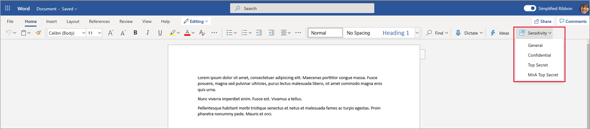
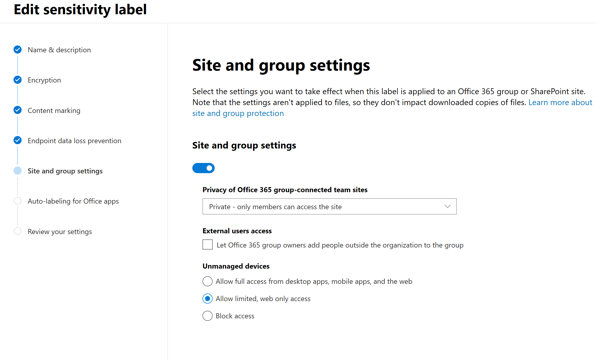
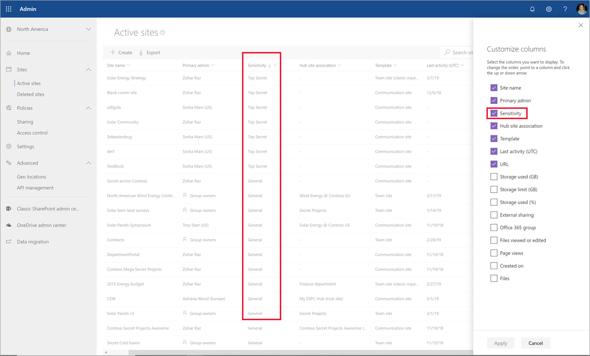

# <a name="use-sensitivity-labels-with-microsoft-teams-office-365-groups-and-sharepoint-sites-public-preview"></a><span data-ttu-id="3e3be-103">Usare le etichette di riservatezza con Microsoft Teams, gruppi di Office 365 e siti di SharePoint (anteprima pubblica)</span><span class="sxs-lookup"><span data-stu-id="3e3be-103">Use sensitivity labels with Microsoft Teams, Office 365 groups, and SharePoint sites (public preview)</span></span>

<span data-ttu-id="3e3be-104">Quando si creano etichette di riservatezza nel [Centro conformità Microsoft 365](https://protection.office.com/), ora è possibile applicarle a Microsoft Teams, gruppi di Office 365 e siti di SharePoint.</span><span class="sxs-lookup"><span data-stu-id="3e3be-104">When you create sensitivity labels in the [Microsoft 365 compliance center](https://protection.office.com/), you can now apply them to Microsoft Teams, Office 365 groups, and SharePoint sites.</span></span> <span data-ttu-id="3e3be-105">È possibile associare criteri alle etichette per controllare:</span><span class="sxs-lookup"><span data-stu-id="3e3be-105">You can associate policies with the labels to control:</span></span>

- <span data-ttu-id="3e3be-106">Impostazioni pubbliche/private</span><span class="sxs-lookup"><span data-stu-id="3e3be-106">Public/private settings</span></span>
- <span data-ttu-id="3e3be-107">Accesso guest</span><span class="sxs-lookup"><span data-stu-id="3e3be-107">Guest access</span></span>
- <span data-ttu-id="3e3be-108">Accesso da dispositivi non gestiti</span><span class="sxs-lookup"><span data-stu-id="3e3be-108">Access from unmanaged devices</span></span>

<span data-ttu-id="3e3be-109">Quando si applica un'etichetta a un team o a un gruppo, l'etichetta viene applicata automaticamente al sito del team di SharePoint connesso e viceversa.</span><span class="sxs-lookup"><span data-stu-id="3e3be-109">When you apply a label to a team or group, the label automatically applies to the connected SharePoint team site and the other way around.</span></span>

<span data-ttu-id="3e3be-110">Ora è possibile abilitare le etichette di riservatezza anche per i file di Office in SharePoint e OneDrive.</span><span class="sxs-lookup"><span data-stu-id="3e3be-110">You can now also enable sensitivity labels for Office files in SharePoint and OneDrive.</span></span> <span data-ttu-id="3e3be-111">Per altre informazioni, vedere [Abilitare le etichette di riservatezza per i file di Office in SharePoint e OneDrive (anteprima pubblica)](sensitivity-labels-sharepoint-onedrive-files.md).</span><span class="sxs-lookup"><span data-stu-id="3e3be-111">For more information, see [Enable sensitivity labels for Office files in SharePoint and OneDrive (public preview)](sensitivity-labels-sharepoint-onedrive-files.md).</span></span>

## <a name="about-the-public-preview-for-microsoft-teams-office-365-groups-and-sharepoint-sites"></a><span data-ttu-id="3e3be-112">Informazioni sull'anteprima pubblica per Microsoft Teams, gruppi di Office 365 e siti di SharePoint</span><span class="sxs-lookup"><span data-stu-id="3e3be-112">About the public preview for Microsoft Teams, Office 365 groups, and SharePoint sites</span></span>

<span data-ttu-id="3e3be-113">Le etichette di riservatezza per Microsoft Teams, gruppi di Office 365 e siti di SharePoint sono in fase di implementazione graduale nei tenant e potrebbero essere modificate prima del rilascio finale.</span><span class="sxs-lookup"><span data-stu-id="3e3be-113">Sensitivity labels for Microsoft Teams, Office 365 groups, and SharePoint sites are gradually rolling out to tenants and might change before final release.</span></span>

<span data-ttu-id="3e3be-114">Questa anteprima pubblica non funziona con le reti per la distribuzione di contenuti (CDN) di Office 365.</span><span class="sxs-lookup"><span data-stu-id="3e3be-114">This public preview doesn't work with Office 365 Content Delivery Networks (CDNs).</span></span>

## <a name="overview"></a><span data-ttu-id="3e3be-115">Panoramica</span><span class="sxs-lookup"><span data-stu-id="3e3be-115">Overview</span></span>

<span data-ttu-id="3e3be-116">Quando si pubblicano etichette di riservatezza, gli utenti in Office 365 hanno accesso allo stesso elenco di etichette.</span><span class="sxs-lookup"><span data-stu-id="3e3be-116">When you publish sensitivity labels, users across Office 365 have access to the same list of labels.</span></span>

<span data-ttu-id="3e3be-117">Queste immagini mostrano:</span><span class="sxs-lookup"><span data-stu-id="3e3be-117">These images show:</span></span>

- <span data-ttu-id="3e3be-118">L'aspetto dell'elenco quando si crea un nuovo sito del team di SharePoint.</span><span class="sxs-lookup"><span data-stu-id="3e3be-118">How the list appears when you create a new team site from SharePoint</span></span>

- <span data-ttu-id="3e3be-119">La visualizzazione dell'elenco in Word</span><span class="sxs-lookup"><span data-stu-id="3e3be-119">When you view the list in Word</span></span>

<span data-ttu-id="3e3be-120">Ad esempio:</span><span class="sxs-lookup"><span data-stu-id="3e3be-120">For example:</span></span>




## <a name="enable-this-preview"></a><span data-ttu-id="3e3be-123">Abilitare questa anteprima</span><span class="sxs-lookup"><span data-stu-id="3e3be-123">Enable this preview</span></span>

<span data-ttu-id="3e3be-124">Per abilitare questa anteprima delle etichette di riservatezza con Microsoft Teams, gruppi di Office 365 e siti di SharePoint, è necessario usare la versione di anteprima di [Azure Active Directory (AzureAD) PowerShell for Graph](https://docs.microsoft.com/powershell/azure/active-directory/overview?view=azureadps-2.0) (nome modulo **AzureADPreview**):</span><span class="sxs-lookup"><span data-stu-id="3e3be-124">You must use the preview version of [Azure Active Directory PowerShell for Graph (AzureAD)](https://docs.microsoft.com/powershell/azure/active-directory/overview?view=azureadps-2.0) (module name **AzureADPreview**) to enable this preview of sensitivity labels with Microsoft Teams, Office 365 groups, and SharePoint sites:</span></span>

- <span data-ttu-id="3e3be-125">Se non è ancora stata installata una versione del modulo PowerShell di Azure AD, vedere [installare il modulo Azure AD](https://docs.microsoft.com/powershell/azure/active-directory/install-adv2?view=azureadps-2.0-preview#installing-the-azure-ad-module) e seguire le istruzioni per installare la versione di anteprima pubblica.</span><span class="sxs-lookup"><span data-stu-id="3e3be-125">If you haven't installed any version of the Azure AD PowerShell module before, see [Installing the Azure AD Module](https://docs.microsoft.com/powershell/azure/active-directory/install-adv2?view=azureadps-2.0-preview#installing-the-azure-ad-module) and follow the instructions to install the public preview release.</span></span>

- <span data-ttu-id="3e3be-126">Se è installata la versione 2.0 disponibile a livello generale del modulo PowerShell di Azure AD (AzureAD), è necessario disinstallarlo eseguendo `Uninstall-Module AzureAD` nella sessione di PowerShell e quindi installare la versione di anteprima eseguendo `Install-Module AzureADPreview`.</span><span class="sxs-lookup"><span data-stu-id="3e3be-126">If you have the 2.0 general availability version of the Azure AD PowerShell module (AzureAD) installed, you must uninstall it by running `Uninstall-Module AzureAD` in your PowerShell session, and then install the preview version by running `Install-Module AzureADPreview`.</span></span>

- <span data-ttu-id="3e3be-127">Se è già stata installata la versione Preview, eseguire `Install-Module AzureADPreview` per verificare che sia la versione più recente di questo modulo.</span><span class="sxs-lookup"><span data-stu-id="3e3be-127">If you have already installed the preview version, run `Install-Module AzureADPreview` to make sure it's the latest version of this module.</span></span>

<span data-ttu-id="3e3be-128">A questo punto si è pronti per abilitare l'anteprima delle etichette di riservatezza con Microsoft Teams, gruppi di Office 365 e siti di SharePoint:</span><span class="sxs-lookup"><span data-stu-id="3e3be-128">You're now ready to enable the preview of sensitivity labels with Microsoft Teams, Office 365 groups, and SharePoint sites:</span></span>

1. <span data-ttu-id="3e3be-129">In una sessione di PowerShell, connettersi ad Azure Active Directory con un account aziendale o dell'istituto di istruzione dotato di privilegi di amministratore globale.</span><span class="sxs-lookup"><span data-stu-id="3e3be-129">In a PowerShell session, using a work or school account that has global admin privileges, connect to Azure Active Directory.</span></span> <span data-ttu-id="3e3be-130">Ad esempio, eseguire:</span><span class="sxs-lookup"><span data-stu-id="3e3be-130">For example, run:</span></span>
    
    ```powershell
    Connect-AzureAD
    ````
    
    <span data-ttu-id="3e3be-131">Per le istruzioni complete, vedere [Connettersi ad Azure AD](https://docs.microsoft.com/powershell/azure/active-directory/install-adv2?view=azureadps-2.0-preview#connect-to-azure-ad).</span><span class="sxs-lookup"><span data-stu-id="3e3be-131">For full instructions, see [Connect to Azure AD](https://docs.microsoft.com/powershell/azure/active-directory/install-adv2?view=azureadps-2.0-preview#connect-to-azure-ad).</span></span>

2. <span data-ttu-id="3e3be-132">Eseguire i comandi seguenti:</span><span class="sxs-lookup"><span data-stu-id="3e3be-132">Run the following commands:</span></span>
    
    ```powershell
    $setting=(Get-AzureADDirectorySetting | where -Property DisplayName -Value "Group.Unified" -EQ)
    if ($setting -eq $null)
    {
    $template = Get-AzureADDirectorySettingTemplate -Id 62375ab9-6b52-47ed-826b-58e47e0e304b
    $setting = $template.CreateDirectorySetting()
    $setting["EnableMIPLabels"] = "True"
    New-AzureADDirectorySetting -DirectorySetting $setting
    }
    else
    {
    $setting["EnableMIPLabels"] = "True"
    Set-AzureADDirectorySetting -Id $setting.Id -DirectorySetting $setting
    }
    ```
    
    > [!NOTE]
    > <span data-ttu-id="3e3be-133">Quando si abilita questa anteprima, Office 365 non usa più le vecchie classificazioni per i nuovi gruppi e siti di SharePoint.</span><span class="sxs-lookup"><span data-stu-id="3e3be-133">Office 365 no longer uses the old classifications for new groups and SharePoint sites when you enable this preview.</span></span> <span data-ttu-id="3e3be-134">Se si usava la [classificazione dei siti di Azure AD](/sharepoint/dev/solution-guidance/modern-experience-site-classification) ($setting["ClassificationList"]), i gruppi e i siti esistenti mostrano ancora le vecchie classificazioni.</span><span class="sxs-lookup"><span data-stu-id="3e3be-134">If you used [Azure AD site classification](/sharepoint/dev/solution-guidance/modern-experience-site-classification) ($setting["ClassificationList"]), existing groups and sites still display the old classifications.</span></span> <span data-ttu-id="3e3be-135">Per mostrare le nuove classificazioni, convertirle.</span><span class="sxs-lookup"><span data-stu-id="3e3be-135">To display the new classifications, convert them.</span></span> <span data-ttu-id="3e3be-136">Per informazioni su come convertirle, vedere [Se si usava la classificazione dei siti di Azure AD classica](#if-you-used-classic-azure-ad-site-classification).</span><span class="sxs-lookup"><span data-stu-id="3e3be-136">For information about how to convert them, see [If you used classic Azure AD site classification](#if-you-used-classic-azure-ad-site-classification).</span></span> 

3. <span data-ttu-id="3e3be-137">Nella stessa sessione di PowerShell, connettersi al Centro sicurezza e conformità usando un account aziendale o dell'istituto di istruzione con privilegi di amministratore globale.</span><span class="sxs-lookup"><span data-stu-id="3e3be-137">In the same PowerShell session, now connect to the Security & Compliance Center by using a work or school account that has global admin privileges.</span></span> <span data-ttu-id="3e3be-138">Per istruzioni, vedere [Connettersi a PowerShell per Centro sicurezza e conformità di Office 365](/powershell/exchange/office-365-scc/connect-to-scc-powershell/connect-to-scc-powershell).</span><span class="sxs-lookup"><span data-stu-id="3e3be-138">For instructions, see [Connect to Office 365 Security & Compliance Center PowerShell](/powershell/exchange/office-365-scc/connect-to-scc-powershell/connect-to-scc-powershell).</span></span>

4. <span data-ttu-id="3e3be-139">Eseguire i comandi seguenti per sincronizzare le etichette con Azure AD, in modo da poterle usare con i gruppi di Office 365:</span><span class="sxs-lookup"><span data-stu-id="3e3be-139">Run the following commands to synchronize your labels to Azure AD, so that they can used with Office 365 groups:</span></span>
    
    ```powershell
    Set-ExecutionPolicy RemoteSigned
    $UserCredential = Get-Credential
    $Session = New-PSSession -ConfigurationName Microsoft.Exchange -ConnectionUri https://ps.compliance.protection.outlook.com/powershell-liveid/ -Credential $UserCredential -Authentication Basic -AllowRedirection
    Import-PSSession $Session -DisableNameChecking
    Execute-AzureAdLabelSync
    ```
## <a name="set-site-and-group-settings-when-you-create-or-edit-sensitivity-labels"></a><span data-ttu-id="3e3be-140">Configurare le impostazioni a livello di sito e gruppo quando si creano o si modificano le etichette di riservatezza</span><span class="sxs-lookup"><span data-stu-id="3e3be-140">Set site and group settings when you create or edit sensitivity labels</span></span>

<span data-ttu-id="3e3be-141">Dopo aver abilitato l'anteprima, usare la procedura seguente per creare o modificare le etichette di riservatezza.</span><span class="sxs-lookup"><span data-stu-id="3e3be-141">After you enable the preview, use the following steps to create or edit sensitivity labels.</span></span> <span data-ttu-id="3e3be-142">Per usare le nuove etichette di riservatezza con siti e gruppi è necessario completare questa procedura, anche se sono già state definite etichette.</span><span class="sxs-lookup"><span data-stu-id="3e3be-142">You must complete these steps for the new sensitivity labels to work with sites and groups, even if you already have labels defined.</span></span> <span data-ttu-id="3e3be-143">La sincronizzazione delle modifiche apportate a queste impostazioni può richiedere fino a 24 ore.</span><span class="sxs-lookup"><span data-stu-id="3e3be-143">Changes to these settings might take up to 24 hours to synchronize.</span></span>

1. <span data-ttu-id="3e3be-144">Nel Centro conformità Microsoft 365 selezionare **Classificazione** > **Etichette di riservatezza**.</span><span class="sxs-lookup"><span data-stu-id="3e3be-144">In the Microsoft 365 compliance center, select **Classification** > **Sensitivity labels**.</span></span>

2. <span data-ttu-id="3e3be-145">Selezionare **Crea un'etichetta**.</span><span class="sxs-lookup"><span data-stu-id="3e3be-145">Select **Create a label**.</span></span> <span data-ttu-id="3e3be-146">Se si ha già un'etichetta, andare al passaggio successivo.</span><span class="sxs-lookup"><span data-stu-id="3e3be-146">If you already have a label, skip to the next step.</span></span>

3. <span data-ttu-id="3e3be-147">Selezionare le opzioni desiderate, quindi nella scheda **Impostazioni sito e gruppo** scegliere:</span><span class="sxs-lookup"><span data-stu-id="3e3be-147">Select the options you want, and then on the **Site and group settings** tab, choose:</span></span>
    
    - <span data-ttu-id="3e3be-148">Privacy (Pubblico/Privato): privato vuol dire che solo i membri approvati all'interno dell'organizzazione possono vedere il contenuto del gruppo.</span><span class="sxs-lookup"><span data-stu-id="3e3be-148">Privacy (Public/Private): Private means that only approved members in your organization can see what's inside the group.</span></span> <span data-ttu-id="3e3be-149">Nessun altro utente dell'organizzazione può vedere cosa contiene il gruppo.</span><span class="sxs-lookup"><span data-stu-id="3e3be-149">Anyone else in your organization can't see what's in the group.</span></span> [<span data-ttu-id="3e3be-150">Altre informazioni</span><span class="sxs-lookup"><span data-stu-id="3e3be-150">Learn more</span></span>](https://support.office.com/article/36236e39-26d3-420b-b0ac-8072d2d2bedc)
    - <span data-ttu-id="3e3be-151">Accesso guest: è possibile controllare se si possono aggiungere utenti guest a un gruppo.</span><span class="sxs-lookup"><span data-stu-id="3e3be-151">Guest access: You can control if guests can be added to a group.</span></span> [<span data-ttu-id="3e3be-152">Informazioni sulla gestione dell'accesso guest nei gruppi di Office 365</span><span class="sxs-lookup"><span data-stu-id="3e3be-152">Learn about managing guest access in Office 365 Groups</span></span>](/office365/admin/create-groups/manage-guest-access-in-groups)
    - <span data-ttu-id="3e3be-153">Dispositivi non gestiti: questa opzione consente di bloccare o limitare l'accesso al contenuto di SharePoint da dispositivi non aggiunti ad AD ibrido o non conformi in Intune.</span><span class="sxs-lookup"><span data-stu-id="3e3be-153">Unmanaged devices: This setting lets you block or limit access to SharePoint content from devices that aren't hybrid AD joined or compliant in Intune.</span></span> <span data-ttu-id="3e3be-154">Se si seleziona Dispositivi non gestiti, è necessario passare ad Azure AD per completare la configurazione del criterio.</span><span class="sxs-lookup"><span data-stu-id="3e3be-154">If you select Unmanaged devices, you must go to Azure AD to finish setting up the policy.</span></span> <span data-ttu-id="3e3be-155">Per informazioni, vedere [Controllare l'accesso da dispositivi non gestiti](/sharepoint/control-access-from-unmanaged-devices).</span><span class="sxs-lookup"><span data-stu-id="3e3be-155">For info, see [Control access from unmanaged devices](/sharepoint/control-access-from-unmanaged-devices).</span></span>
    
    

> [!IMPORTANT]
> <span data-ttu-id="3e3be-157">Quando si applica un'etichetta a un team, a un gruppo o a un sito, vengono applicate solo le impostazioni a livello di sito e gruppo.</span><span class="sxs-lookup"><span data-stu-id="3e3be-157">Only the site and group settings take effect when you apply a label to a team, group, or site.</span></span> <span data-ttu-id="3e3be-158">Le altre impostazioni, come la crittografia e il contrassegno dei contenuti, non vengono applicate a tutto il contenuto all'interno del team, del gruppo o del sito.</span><span class="sxs-lookup"><span data-stu-id="3e3be-158">Other settings, such as encryption and content marking, aren't applied to all content within the team, group, or site.</span></span>
> 
> <span data-ttu-id="3e3be-159">Analogamente, se si crea un'etichetta e non si attivano le impostazioni di sito e gruppo, l'etichetta sarà ancora disponibile quando gli utenti creano team, gruppi e siti, ma si servirà solo a classificare senza applicare alcuna impostazione.</span><span class="sxs-lookup"><span data-stu-id="3e3be-159">Similarly, if you create a label and don't turn on site and group settings, the label will still be available when users create teams, groups, and sites, but it will classify without applying any settings.</span></span>

[<span data-ttu-id="3e3be-160">Altre informazioni sulla pubblicazione di etichette di riservatezza</span><span class="sxs-lookup"><span data-stu-id="3e3be-160">Learn more about publishing sensitivity labels</span></span>](/microsoft-365/compliance/sensitivity-labels#what-label-policies-can-do)

## <a name="sensitivity-label-management"></a><span data-ttu-id="3e3be-161">Gestione delle etichetta di riservatezza</span><span class="sxs-lookup"><span data-stu-id="3e3be-161">Sensitivity label management</span></span>

> [!WARNING]
> <span data-ttu-id="3e3be-162">La creazione, la modifica e l'eliminazione delle etichette di riservatezza che si usano per Microsoft Teams, gruppi di Office 365 e siti di SharePoint richiedono un attento coordinamento con la pubblicazione di criteri delle etichette per gli utenti.</span><span class="sxs-lookup"><span data-stu-id="3e3be-162">Creating, modifying, and deleting sensitivity labels that you use for Microsoft Teams, Office 365 groups, and SharePoint sites requires careful coordination with publishing label policies to users.</span></span> 

<span data-ttu-id="3e3be-163">Evitare errori nella creazione per siti e gruppi che possono incidere su tutti gli utenti, usando le indicazioni seguenti.</span><span class="sxs-lookup"><span data-stu-id="3e3be-163">Avoid creation errors for sites and groups that can affect all users by using the following guidance.</span></span>

<span data-ttu-id="3e3be-164">**Creazione e pubblicazione di etichette**</span><span class="sxs-lookup"><span data-stu-id="3e3be-164">**Creating and publishing labels:**</span></span>

<span data-ttu-id="3e3be-165">Dopo la creazione e la pubblicazione di un'etichetta di riservatezza, possono essere necessarie fino a 24 ore prima che l'etichetta diventi visibile agli utenti di team, gruppi e siti.</span><span class="sxs-lookup"><span data-stu-id="3e3be-165">After a sensitivity label is created and published, it can take up to 24 hours for the label to become visible for users in teams, groups, and sites.</span></span> <span data-ttu-id="3e3be-166">Seguire questa procedura per pubblicare un'etichetta per tutti gli utenti nel tenant:</span><span class="sxs-lookup"><span data-stu-id="3e3be-166">Use the following steps to publish a label for all users in the tenant:</span></span>

1. <span data-ttu-id="3e3be-167">Creare l'etichetta di riservatezza e pubblicarla solo per pochi account utente nel tenant.</span><span class="sxs-lookup"><span data-stu-id="3e3be-167">Create the sensitivity label and publish it for just a few user accounts in the tenant.</span></span>

2. <span data-ttu-id="3e3be-168">Attendere 24 ore.</span><span class="sxs-lookup"><span data-stu-id="3e3be-168">Wait for 24 hours.</span></span>

3. <span data-ttu-id="3e3be-169">Dopo questa attesa di 24 ore, usare uno degli account utente specificati nel passaggio 1 per creare un team, un gruppo di Office 365 o un sito di SharePoint con l'etichetta creata nel passaggio 1.</span><span class="sxs-lookup"><span data-stu-id="3e3be-169">After this 24 hours wait, use one of the user accounts you specified in step 1 to create a team, Office 365 group, or SharePoint site with the label that you created in step 1.</span></span>

4. <span data-ttu-id="3e3be-170">Se non si verificano errori durante l'operazione di creazione del passaggio 3, pubblicare l'etichetta per tutti gli utenti del tenant.</span><span class="sxs-lookup"><span data-stu-id="3e3be-170">If there are no errors during the creation operation for step 3, publish the label for all users in your tenant.</span></span> <span data-ttu-id="3e3be-171">In caso di errori, contattare il [Supporto tecnico Microsoft](https://docs.microsoft.com/office365/admin/contact-support-for-business-products).</span><span class="sxs-lookup"><span data-stu-id="3e3be-171">If there are errors, contact Microsoft Support.</span></span>

<span data-ttu-id="3e3be-172">**Modifica ed eliminazione di etichette pubblicate**</span><span class="sxs-lookup"><span data-stu-id="3e3be-172">**Modifying and deleting published labels:**</span></span>

<span data-ttu-id="3e3be-173">Se si modifica o si elimina un'etichetta di riservatezza inclusa in uno o più criteri delle etichette, tali azioni possono causare errori di creazione per tutti i team, i gruppi e i siti.</span><span class="sxs-lookup"><span data-stu-id="3e3be-173">If you modify or delete a sensitivity label that is included in one or more label policies, these actions can result in creation failures for all teams, groups, and sites.</span></span> <span data-ttu-id="3e3be-174">Per evitare questa situazione, seguire queste indicazioni:</span><span class="sxs-lookup"><span data-stu-id="3e3be-174">To avoid this situation, use the following guidance:</span></span>

1. <span data-ttu-id="3e3be-175">Rimuovere l'etichetta di riservatezza da tutti i criteri che includono l'etichetta.</span><span class="sxs-lookup"><span data-stu-id="3e3be-175">Remove the sensitivity label from all label policies that include the label.</span></span>

2. <span data-ttu-id="3e3be-176">Attendere 48 ore.</span><span class="sxs-lookup"><span data-stu-id="3e3be-176">Wait for 48 hours.</span></span>

3. <span data-ttu-id="3e3be-177">Dopo l'attesa di 48 ore, provare a creare un team, un gruppo o un sito e verificare che l'etichetta non sia più visibile.</span><span class="sxs-lookup"><span data-stu-id="3e3be-177">After the 48 hours wait, try creating a team, group, or site and confirm that the label is no longer visible.</span></span>

4. <span data-ttu-id="3e3be-178">Se l'etichetta di riservatezza non è visibile, è possibile modificare o eliminare l'etichetta in sicurezza.</span><span class="sxs-lookup"><span data-stu-id="3e3be-178">If the sensitivity label isn't visible, you can now safely modify or delete the label.</span></span> <span data-ttu-id="3e3be-179">Se l'etichetta è ancora visibile, contattare il [Supporto tecnico Microsoft](https://docs.microsoft.com/office365/admin/contact-support-for-business-products).</span><span class="sxs-lookup"><span data-stu-id="3e3be-179">If the label is still visible, contact Microsoft Support.</span></span>

## <a name="troubleshoot-sensitivity-label-deployment"></a><span data-ttu-id="3e3be-180">Risolvere i problemi di distribuzione delle etichette di riservatezza</span><span class="sxs-lookup"><span data-stu-id="3e3be-180">Troubleshoot sensitivity label deployment</span></span>

### <a name="labels-not-visible-after-publishing"></a><span data-ttu-id="3e3be-181">Etichette non visibili dopo la pubblicazione</span><span class="sxs-lookup"><span data-stu-id="3e3be-181">Labels not visible after publishing</span></span>
<span data-ttu-id="3e3be-182">Se si verificano problemi durante la creazione di un team o un gruppo di Office 365 dopo aver abilitato queste impostazioni o aver modificato la descrizione di una etichetta di riservatezza, salvare l'etichetta, attendere alcune ore e quindi provare di nuovo a creare il team o il gruppo.</span><span class="sxs-lookup"><span data-stu-id="3e3be-182">If you experience issues when you create a team or Office 365 group after you enable these settings or modify a sensitivity label's description, save the label, wait a few hours, and then try to create the team or group again.</span></span> <span data-ttu-id="3e3be-183">Per informazioni, vedere [Pianificare l'implementazione dopo aver creato o modificato un'etichetta di riservatezza](sensitivity-labels-sharepoint-onedrive-files.md#schedule-roll-out-after-you-create-or-change-a-sensitivity-label).</span><span class="sxs-lookup"><span data-stu-id="3e3be-183">For information, see [Schedule roll-out after you create or change a sensitivity label](sensitivity-labels-sharepoint-onedrive-files.md#schedule-roll-out-after-you-create-or-change-a-sensitivity-label).</span></span>

<span data-ttu-id="3e3be-184">Se non è ancora possibile vedere la nuova etichetta di riservatezza da SharePoint Online, contattare il [Supporto tecnico Microsoft](https://docs.microsoft.com/office365/admin/contact-support-for-business-products).</span><span class="sxs-lookup"><span data-stu-id="3e3be-184">If you are still not able to see the new sensitivity label from SharePoint Online, contact Microsoft Support.</span></span>

### <a name="team-group-or-sharepoint-site-creation-errors"></a><span data-ttu-id="3e3be-185">Errori nella creazione di team, gruppi o siti di SharePoint</span><span class="sxs-lookup"><span data-stu-id="3e3be-185">Team, group, or SharePoint site creation errors</span></span>
<span data-ttu-id="3e3be-186">Se si verificano errori di creazione durante l'anteprima pubblica, sono disponibili due opzioni:</span><span class="sxs-lookup"><span data-stu-id="3e3be-186">If you experience creation errors during the public preview, you have two options:</span></span>

- <span data-ttu-id="3e3be-187">Assicurarsi che le etichette di riservatezza non siano obbligatorie per alcun utente.</span><span class="sxs-lookup"><span data-stu-id="3e3be-187">Ensure that sensitivity labels are not mandatory for any user.</span></span>

- <span data-ttu-id="3e3be-188">È possibile disattivare le etichette di riservatezza per Microsoft Teams, gruppi di Office 365 e siti di SharePoint seguendo le stesse istruzioni riportate nella sezione [abilitare questa anteprima](#enable-this-preview) di questa pagina.</span><span class="sxs-lookup"><span data-stu-id="3e3be-188">You can turn off sensitivity labels for Microsoft Teams, Office 365 groups, and SharePoint sites by using the same instructions from the [Enable this preview](#enable-this-preview) section on this page.</span></span> <span data-ttu-id="3e3be-189">Tuttavia, per disabilitare l'anteprima, cercare la riga `$setting["EnableMIPLabels"] = "True"` e modificare il valore **True** in **False**.</span><span class="sxs-lookup"><span data-stu-id="3e3be-189">However, to disable the preview, search for the line `$setting["EnableMIPLabels"] = "True"`, and change the **True** value to **False**.</span></span>

## <a name="apply-a-sensitivity-label-to-a-new-team"></a><span data-ttu-id="3e3be-190">Applicare un'etichetta di riservatezza a un nuovo team</span><span class="sxs-lookup"><span data-stu-id="3e3be-190">Apply a sensitivity label to a new team</span></span>

<span data-ttu-id="3e3be-191">Gli utenti possono selezionare le etichette di riservatezza quando creano nuovi team in Microsoft Teams.</span><span class="sxs-lookup"><span data-stu-id="3e3be-191">Users can select sensitivity labels when they create new teams in Microsoft Teams.</span></span> <span data-ttu-id="3e3be-192">Quando selezionano il livello di riservatezza, le impostazioni di privacy cambiano come necessario.</span><span class="sxs-lookup"><span data-stu-id="3e3be-192">When they select the sensitivity level, the privacy setting changes as necessary.</span></span> <span data-ttu-id="3e3be-193">In base alle impostazioni di accesso guest selezionate per l'etichetta, gli utenti possono o non possano aggiungere al team persone esterne all'organizzazione.</span><span class="sxs-lookup"><span data-stu-id="3e3be-193">Depending on the guest access setting you selected for the label, users can or can't add people outside the organization to the team.</span></span>

[<span data-ttu-id="3e3be-194">Altre informazioni sulle etichette di riservatezza per Teams</span><span class="sxs-lookup"><span data-stu-id="3e3be-194">Learn more about sensitivity labels for Teams</span></span>](https://docs.microsoft.com/microsoftteams/sensitivity-labels)


<span data-ttu-id="3e3be-196">Dopo la creazione del team, l'etichetta di riservatezza compare nell'angolo in alto a destra di tutti i canali.</span><span class="sxs-lookup"><span data-stu-id="3e3be-196">After you create the team, the sensitivity label appears in the upper-right corner of all channels.</span></span>


<span data-ttu-id="3e3be-198">Il servizio applica automaticamente la stessa etichetta di riservatezza al gruppo di Office 365 e al sito del team di SharePoint connesso.</span><span class="sxs-lookup"><span data-stu-id="3e3be-198">The service automatically applies the same sensitivity label to the Office 365 group and the connected SharePoint team site.</span></span>

## <a name="apply-a-sensitivity-label-to-a-new-group"></a><span data-ttu-id="3e3be-199">Applicare un'etichetta di riservatezza a un nuovo gruppo</span><span class="sxs-lookup"><span data-stu-id="3e3be-199">Apply a sensitivity label to a new group</span></span>

<span data-ttu-id="3e3be-200">In Outlook sul Web, la nuova casella **Riservatezza** contiene le etichette pubblicate.</span><span class="sxs-lookup"><span data-stu-id="3e3be-200">In Outlook on the web, the new **Sensitivity** box contains published labels.</span></span> <span data-ttu-id="3e3be-201">Se gli utenti vogliono altre informazioni, possono fare clic sull'icona della Guida per leggere i dettagli sulle etichette disponibili e sui criteri associati.</span><span class="sxs-lookup"><span data-stu-id="3e3be-201">If users want more info, they can click the help icon to read details about the available labels and associated policies.</span></span>


## <a name="apply-a-sensitivity-label-to-a-new-site"></a><span data-ttu-id="3e3be-203">Applicare un'etichetta di riservatezza a un nuovo sito</span><span class="sxs-lookup"><span data-stu-id="3e3be-203">Apply a sensitivity label to a new site</span></span>

<span data-ttu-id="3e3be-204">Gli amministratori e gli utenti finali possono selezionare le etichette di riservatezza quando creano siti di comunicazione e siti del team moderni.</span><span class="sxs-lookup"><span data-stu-id="3e3be-204">Admins and end users can select sensitivity labels when they create modern team sites and communication sites.</span></span>

[<span data-ttu-id="3e3be-205">Informazioni su come creare un sito nella nuova interfaccia di amministrazione di SharePoint</span><span class="sxs-lookup"><span data-stu-id="3e3be-205">Learn how to create a site in the new SharePoint admin center</span></span>](/sharepoint/create-site-collection)

<span data-ttu-id="3e3be-206">Quando gli utenti creano siti di comunicazione e siti del team moderni, per impostazione predefinita è già selezionata un'etichetta di riservatezza.</span><span class="sxs-lookup"><span data-stu-id="3e3be-206">When users create modern team and communication sites, a sensitivity label is already selected by default.</span></span> <span data-ttu-id="3e3be-207">Per saperne di più sulle etichette, gli utenti possono selezionare l'icona della Guida.</span><span class="sxs-lookup"><span data-stu-id="3e3be-207">Users can select the help icon to learn more about the labels.</span></span>


<span data-ttu-id="3e3be-209">Quando gli utenti visitano il sito, possono vedere il nome dell'etichetta e i criteri applicati.</span><span class="sxs-lookup"><span data-stu-id="3e3be-209">When users browse to the site, they can see the name of the label and applied policies.</span></span>


## <a name="manage-sensitivity-labels-in-the-sharepoint-admin-center"></a><span data-ttu-id="3e3be-211">Gestire le etichette di riservatezza nell'interfaccia di amministrazione di SharePoint</span><span class="sxs-lookup"><span data-stu-id="3e3be-211">Manage sensitivity labels in the SharePoint admin center</span></span>

<span data-ttu-id="3e3be-212">Per visualizzare e modificare le etichette, usare la pagina Siti attivi nella nuova interfaccia di amministrazione di SharePoint.</span><span class="sxs-lookup"><span data-stu-id="3e3be-212">To view and edit the labels, use the Active sites page in the new SharePoint admin center.</span></span>



<span data-ttu-id="3e3be-214">[Altre informazioni sulla gestione dei siti nella nuova interfaccia di amministrazione di SharePoint](/sharepoint/manage-sites-in-new-admin-center).</span><span class="sxs-lookup"><span data-stu-id="3e3be-214">[Learn more about managing sites in the new SharePoint admin center](/sharepoint/manage-sites-in-new-admin-center).</span></span>

## <a name="change-site-and-group-settings-for-a-label"></a><span data-ttu-id="3e3be-215">Modificare le impostazioni a livello di sito e gruppo</span><span class="sxs-lookup"><span data-stu-id="3e3be-215">Change site and group settings for a label</span></span>

<span data-ttu-id="3e3be-216">Ogni volta che si apporta una modifica alle impostazioni di sito e gruppo per un'etichetta, è necessario eseguire i comandi di PowerShell seguenti in modo che i team, i siti e i gruppi possano usare le nuove impostazioni.</span><span class="sxs-lookup"><span data-stu-id="3e3be-216">Whenever you make a change to site and group settings for a label, you must run the following PowerShell commands so that your teams, sites, and groups can use the new settings.</span></span> <span data-ttu-id="3e3be-217">Come procedura consigliata, non modificare le impostazioni di sito e gruppo per un'etichetta dopo aver applicato l'etichetta a più team, gruppi o siti.</span><span class="sxs-lookup"><span data-stu-id="3e3be-217">As a best practice, don't the change site and group settings for a label after you've applied the label to several teams, groups, or sites.</span></span>

1. <span data-ttu-id="3e3be-218">Eseguire i comandi seguenti per connettersi a PowerShell per Centro sicurezza e conformità di Office 365 e ottenere l'elenco delle etichette di riservatezza e i relativi GUID.</span><span class="sxs-lookup"><span data-stu-id="3e3be-218">Run the following commands to connect to Office 365 Security & Compliance Center PowerShell and get the list of sensitivity labels and their GUIDs.</span></span>
    
    ```powershell
    Set-ExecutionPolicy RemoteSigned
    $UserCredential = Get-Credential
    $Session = New-PSSession -ConfigurationName Microsoft.Exchange -ConnectionUri https://ps.compliance.protection.outlook.com/powershell-liveid -Authentication Basic -AllowRedirection -Credential $UserCredential
    Import-PSSession $Session
    Get-Label |ft Name, Guid
    ```

2. <span data-ttu-id="3e3be-219">Prendere nota del GUID dell'etichetta o delle etichette modificate.</span><span class="sxs-lookup"><span data-stu-id="3e3be-219">Make a note of the GUID for the label or labels you have changed.</span></span>

3. <span data-ttu-id="3e3be-220">Ora connettersi a PowerShell per Exchange Online ed eseguire il cmdlet Get-UnifiedGroup, specificando il GUID dell'etichetta al posto del GUID di esempio "e48058ea-98e8-4940-8db0-ba1310fd955e":</span><span class="sxs-lookup"><span data-stu-id="3e3be-220">Now connect to Exchange Online PowerShell and run the Get-UnifiedGroup cmdlet, specifying your label GUID in place of the example GUID of "e48058ea-98e8-4940-8db0-ba1310fd955e":</span></span> 
    
    ```powershell
    Set-ExecutionPolicy RemoteSigned
    $UserCredential = Get-Credential
    $Session = New-PSSession -ConfigurationName Microsoft.Exchange -ConnectionUri https://outlook.office365.com/powershell-liveid/ -Credential $UserCredential -Authentication Basic -AllowRedirection
    Import-PSSession $Session
    $Groups= Get-UnifiedGroup | Where {$_.SensitivityLabel  -eq "e48058ea-98e8-4940-8db0-ba1310fd955e"}
    ```

4. <span data-ttu-id="3e3be-221">Per ogni gruppo, riapplicare l'etichetta di riservatezza specificando il GUID dell'etichetta al posto del GUID di esempio "e48058ea-98e8-4940-8db0-ba1310fd955e":</span><span class="sxs-lookup"><span data-stu-id="3e3be-221">For each group, reapply the sensitivity label, specifying your label GUID in place of the example GUID of "e48058ea-98e8-4940-8db0-ba1310fd955e":</span></span>
    
    ```powershell
    foreach ($g in $groups)
    {Set-UnifiedGroup -Identity $g.Identity -SensitivityLabelId "e48058ea-98e8-4940-8db0-ba1310fd955e"}
    ```

## <a name="support-for-the-new-sensitivity-labels"></a><span data-ttu-id="3e3be-222">Supporto delle nuove etichette di riservatezza</span><span class="sxs-lookup"><span data-stu-id="3e3be-222">Support for the new sensitivity labels</span></span>

<span data-ttu-id="3e3be-223">Le app e i servizi seguenti supportano le etichette di riservatezza in questa versione di anteprima:</span><span class="sxs-lookup"><span data-stu-id="3e3be-223">The following apps and services support the sensitivity labels in this preview:</span></span>

- <span data-ttu-id="3e3be-224">Centro conformità Microsoft 365</span><span class="sxs-lookup"><span data-stu-id="3e3be-224">Microsoft 365 compliance center</span></span>
- <span data-ttu-id="3e3be-225">SharePoint</span><span class="sxs-lookup"><span data-stu-id="3e3be-225">SharePoint</span></span>
- <span data-ttu-id="3e3be-226">Outlook sul Web</span><span class="sxs-lookup"><span data-stu-id="3e3be-226">Outlook on the web</span></span>
- <span data-ttu-id="3e3be-227">Teams</span><span class="sxs-lookup"><span data-stu-id="3e3be-227">Teams</span></span>
- <span data-ttu-id="3e3be-228">Interfaccia di amministrazione di SharePoint</span><span class="sxs-lookup"><span data-stu-id="3e3be-228">SharePoint admin center</span></span>
- <span data-ttu-id="3e3be-229">Interfaccia di amministrazione di Azure AD</span><span class="sxs-lookup"><span data-stu-id="3e3be-229">Azure AD admin center</span></span>

<span data-ttu-id="3e3be-230">Non è possibile usare le app e i servizi seguenti per creare gruppi di Office 365 con le nuove etichette di riservatezza:</span><span class="sxs-lookup"><span data-stu-id="3e3be-230">You can't use the following apps and services to create Office 365 groups with the new sensitivity labels:</span></span>

- <span data-ttu-id="3e3be-231">Outlook per Mac</span><span class="sxs-lookup"><span data-stu-id="3e3be-231">Outlook for the Mac</span></span>
- <span data-ttu-id="3e3be-232">Outlook Mobile</span><span class="sxs-lookup"><span data-stu-id="3e3be-232">Outlook mobile</span></span>  
- <span data-ttu-id="3e3be-233">Outlook desktop per Windows</span><span class="sxs-lookup"><span data-stu-id="3e3be-233">Outlook desktop for Windows</span></span>
- <span data-ttu-id="3e3be-234">Forms</span><span class="sxs-lookup"><span data-stu-id="3e3be-234">Forms</span></span>  
- <span data-ttu-id="3e3be-235">Dynamics 365</span><span class="sxs-lookup"><span data-stu-id="3e3be-235">Dynamics 365</span></span>  
- <span data-ttu-id="3e3be-236">Yammer</span><span class="sxs-lookup"><span data-stu-id="3e3be-236">Yammer</span></span>  
- <span data-ttu-id="3e3be-237">Stream</span><span class="sxs-lookup"><span data-stu-id="3e3be-237">Stream</span></span>  
- <span data-ttu-id="3e3be-238">Planner</span><span class="sxs-lookup"><span data-stu-id="3e3be-238">Planner</span></span>  
- <span data-ttu-id="3e3be-239">Project</span><span class="sxs-lookup"><span data-stu-id="3e3be-239">Project</span></span>  
- <span data-ttu-id="3e3be-240">PowerBI</span><span class="sxs-lookup"><span data-stu-id="3e3be-240">PowerBI</span></span>  
- <span data-ttu-id="3e3be-241">Interfaccia di amministrazione di Teams</span><span class="sxs-lookup"><span data-stu-id="3e3be-241">Teams admin center</span></span>  
- <span data-ttu-id="3e3be-242">Interfaccia di amministrazione di Microsoft 365</span><span class="sxs-lookup"><span data-stu-id="3e3be-242">Microsoft 365 admin center</span></span>  
- <span data-ttu-id="3e3be-243">Interfaccia di amministrazione di Exchange</span><span class="sxs-lookup"><span data-stu-id="3e3be-243">Exchange admin center</span></span>

## <a name="if-you-used-classic-azure-ad-site-classification"></a><span data-ttu-id="3e3be-244">Se si usava la classificazione dei siti di Azure AD classica</span><span class="sxs-lookup"><span data-stu-id="3e3be-244">If you used classic Azure AD site classification</span></span>

<span data-ttu-id="3e3be-245">Quando si abilita questa anteprima, Office 365 non supporta più le vecchie classificazioni per i nuovi gruppi e siti di SharePoint.</span><span class="sxs-lookup"><span data-stu-id="3e3be-245">Office 365 no longer supports the old classifications for new groups and SharePoint sites when you enable this preview.</span></span> <span data-ttu-id="3e3be-246">Tuttavia, i gruppi e i siti esistenti continuano a visualizzare le vecchie classificazioni, a meno che non vengano convertite.</span><span class="sxs-lookup"><span data-stu-id="3e3be-246">However, existing groups and sites still display the old classifications unless you convert them.</span></span> <span data-ttu-id="3e3be-247">Le vecchie classificazioni includono la classificazione dei siti "moderni" configurata, probabilmente tramite Azure AD PowerShell o la libreria principale di PnP, che definiscono i valori per l'impostazione `ClassificationList`.</span><span class="sxs-lookup"><span data-stu-id="3e3be-247">Old classifications include the "modern" sites classification you set up, possibly through Azure AD PowerShell or the PnP Core library, that defined values for the `ClassificationList` setting.</span></span>

<span data-ttu-id="3e3be-248">Ad esempio, in PowerShell:</span><span class="sxs-lookup"><span data-stu-id="3e3be-248">For example, in PowerShell:</span></span>

```powershell
   ($setting["ClassificationList"])
```

<span data-ttu-id="3e3be-249">Per altre informazioni sul metodo di classificazione precedente, vedere [Classificazione dei siti "moderni" di SharePoint](https://docs.microsoft.com/sharepoint/dev/solution-guidance/modern-experience-site-classification).</span><span class="sxs-lookup"><span data-stu-id="3e3be-249">For more information about the old classification method, see [SharePoint "modern" sites classification](https://docs.microsoft.com/sharepoint/dev/solution-guidance/modern-experience-site-classification).</span></span>

<span data-ttu-id="3e3be-250">In base alla distribuzione corrente, per convertire le vecchie classificazioni nelle nuove classificazioni si può procedere in due modi.</span><span class="sxs-lookup"><span data-stu-id="3e3be-250">Based on your current deployment, you have two options to convert your old classifications to the new classifications.</span></span>

### <a name="if-you-never-used-sensitivity-labels-unified-microsoft-information-protection-labels-for-files-and-email"></a><span data-ttu-id="3e3be-251">Se non si sono mai usate etichette di riservatezza (etichette di Microsoft Information Protection unificate) per file e messaggi di posta elettronica</span><span class="sxs-lookup"><span data-stu-id="3e3be-251">If you never used sensitivity labels (unified Microsoft Information Protection labels) for files and email</span></span>

<span data-ttu-id="3e3be-252">È consigliabile:</span><span class="sxs-lookup"><span data-stu-id="3e3be-252">We recommend that you:</span></span>

1. <span data-ttu-id="3e3be-253">Creare nuove etichette di riservatezza nel Centro conformità Microsoft 365 con lo stesso nome delle classificazioni esistenti.</span><span class="sxs-lookup"><span data-stu-id="3e3be-253">Create new sensitivity labels in the Microsoft 365 compliance center that have the same names as your existing classifications.</span></span>
2. <span data-ttu-id="3e3be-254">Usare PowerShell per applicare le nuove etichette ai gruppi di Office 365 e ai siti di SharePoint esistenti usando il mapping dei nomi.</span><span class="sxs-lookup"><span data-stu-id="3e3be-254">Use PowerShell to apply the new labels to existing Office 365 groups and SharePoint sites using name mapping.</span></span>
3. <span data-ttu-id="3e3be-255">Eliminare le vecchie classificazioni.</span><span class="sxs-lookup"><span data-stu-id="3e3be-255">Delete the old classifications.</span></span>

<span data-ttu-id="3e3be-256">Le app e i servizi che supportano le nuove etichette di riservatezza le mostreranno.</span><span class="sxs-lookup"><span data-stu-id="3e3be-256">Apps and services that support the new sensitivity labels will show them.</span></span> <span data-ttu-id="3e3be-257">È possibile creare nuovi team, gruppi e siti con le nuove etichette.</span><span class="sxs-lookup"><span data-stu-id="3e3be-257">You create new teams, groups, and sites with the new labels.</span></span> <span data-ttu-id="3e3be-258">Gli utenti possono comunque creare gruppi da app e servizi che non supportano le nuove etichette.</span><span class="sxs-lookup"><span data-stu-id="3e3be-258">Users can still create groups from apps and services that don't support the new labels.</span></span> <span data-ttu-id="3e3be-259">Tuttavia, gli utenti non possono applicare un'etichetta a questi gruppi.</span><span class="sxs-lookup"><span data-stu-id="3e3be-259">However, users can't apply a label to these groups.</span></span> <span data-ttu-id="3e3be-260">Usare PowerShell per applicare le nuove etichette di riservatezza a questi gruppi.</span><span class="sxs-lookup"><span data-stu-id="3e3be-260">Use PowerShell to apply the new sensitivity labels to these groups.</span></span>

<span data-ttu-id="3e3be-261">È possibile mantenere le vecchie classificazioni, tuttavia è consigliabile usare PowerShell per applicare le nuove etichette di riservatezza a questi gruppi.</span><span class="sxs-lookup"><span data-stu-id="3e3be-261">You can keep your old classifications; however, we highly recommend using PowerShell to apply the new sensitivity labels to these groups.</span></span>

<span data-ttu-id="3e3be-262">Le app e i servizi che supportano le nuove etichette di riservatezza verranno creati con le nuove etichette.</span><span class="sxs-lookup"><span data-stu-id="3e3be-262">Apps and services that support the new sensitivity labels will get created with the new labels.</span></span> <span data-ttu-id="3e3be-263">Quando gli utenti creano gruppi da app e servizi che non supportano le nuove etichette, possono selezionare una classificazione.</span><span class="sxs-lookup"><span data-stu-id="3e3be-263">When users create groups from apps and services that don't support the new labels, they can select a classification.</span></span>

### <a name="if-you-use-sensitivity-labels-unified-microsoft-information-protection-labels-for-files-and-email"></a><span data-ttu-id="3e3be-264">Se si usano etichette di riservatezza (etichette di Microsoft Information Protection unificate) per file e messaggi di posta elettronica</span><span class="sxs-lookup"><span data-stu-id="3e3be-264">If you use sensitivity labels (unified Microsoft Information Protection labels) for files and email</span></span>

<span data-ttu-id="3e3be-265">Dopo aver abilitato l'anteprima, passare a ogni etichetta nel Centro conformità Microsoft 365 e applicare i criteri desiderati per i siti e i gruppi.</span><span class="sxs-lookup"><span data-stu-id="3e3be-265">As soon as you enable this preview, go to each label in the Microsoft 365 compliance center and apply the policies you want for sites and groups.</span></span> <span data-ttu-id="3e3be-266">Gli utenti inizieranno a visualizzare le etichette esistenti per i siti e i gruppi.</span><span class="sxs-lookup"><span data-stu-id="3e3be-266">Users will start seeing your existing labels available for sites and groups.</span></span>

### <a name="prepare-the-sharepoint-online-management-shell-before-you-relabel-office-365-groups"></a><span data-ttu-id="3e3be-267">Preparare SharePoint Online Management Shell prima di rietichettare i gruppi di Office 365.</span><span class="sxs-lookup"><span data-stu-id="3e3be-267">Prepare the SharePoint Online Management Shell before you relabel Office 365 groups</span></span>

<span data-ttu-id="3e3be-268">Prima di applicare nuove etichette, assicurarsi di disporre della versione più recente di SharePoint Online Management Shell.</span><span class="sxs-lookup"><span data-stu-id="3e3be-268">Before you apply new labels, ensure that you're running the latest SharePoint Online Management Shell.</span></span> <span data-ttu-id="3e3be-269">Se si ha già l'ultima versione, è possibile procedere e [Rietichettare i gruppi di Office 365 con le nuove etichette di riservatezza](#relabel-office-365-groups-with-new-sensitivity-labels).</span><span class="sxs-lookup"><span data-stu-id="3e3be-269">If you already have the latest version, you can go ahead and [Relabel Office 365 groups with new sensitivity labels](#relabel-office-365-groups-with-new-sensitivity-labels).</span></span>

<span data-ttu-id="3e3be-270">Per preparare SharePoint Online Management Shell per l'anteprima:</span><span class="sxs-lookup"><span data-stu-id="3e3be-270">To prepare the SharePoint Online Management Shell for the preview:</span></span>

1. <span data-ttu-id="3e3be-271">Se è installata una versione precedente di SharePoint Online Management Shell, passare a **Installazione applicazioni** e disinstallare "SharePoint Online Management Shell".</span><span class="sxs-lookup"><span data-stu-id="3e3be-271">If you installed a previous version of the SharePoint Online Management Shell, go to **Add or remove programs** and uninstall “SharePoint Online Management Shell”.</span></span>

2. <span data-ttu-id="3e3be-272">In un Web browser passare alla pagina Area download e [scaricare l'ultima versione di SharePoint Online Management Shell](https://go.microsoft.com/fwlink/p/?LinkId=255251).</span><span class="sxs-lookup"><span data-stu-id="3e3be-272">In a web browser, go to the Download Center page and [Download the latest SharePoint Online Management Shell](https://go.microsoft.com/fwlink/p/?LinkId=255251).</span></span>

3. <span data-ttu-id="3e3be-273">Selezionare la lingua e fare clic su **Scarica**.</span><span class="sxs-lookup"><span data-stu-id="3e3be-273">Select your language and then click **Download**.</span></span>

4. <span data-ttu-id="3e3be-274">Scegliere tra il file MSI x64 o x86.</span><span class="sxs-lookup"><span data-stu-id="3e3be-274">Choose between the x64 and x86 .msi file.</span></span> <span data-ttu-id="3e3be-275">Scaricare il file x64 se si esegue la versione a 64 bit di Windows e il file x86 se si esegue la versione a 32 bit.</span><span class="sxs-lookup"><span data-stu-id="3e3be-275">Download the x64 file if you run the 64-bit version of Windows or the x86 file if you’re run the 32-bit version.</span></span> <span data-ttu-id="3e3be-276">Vedere [Quale versione del sistema operativo Windows sto eseguendo?](https://support.microsoft.com/help/13443/windows-which-operating-system) in caso di dubbi.</span><span class="sxs-lookup"><span data-stu-id="3e3be-276">If you don’t know, see [Which version of Windows operating system am I running?](https://support.microsoft.com/help/13443/windows-which-operating-system).</span></span>

5. <span data-ttu-id="3e3be-277">Dopo aver scaricato il file, eseguirlo e seguire i passaggi della configurazione guidata.</span><span class="sxs-lookup"><span data-stu-id="3e3be-277">After you download the file, run the file and follow the steps in the Setup Wizard.</span></span>

### <a name="relabel-office-365-groups-with-new-sensitivity-labels"></a><span data-ttu-id="3e3be-278">Rietichettare i gruppi di Office 365 con le nuove etichette di riservatezza</span><span class="sxs-lookup"><span data-stu-id="3e3be-278">Relabel Office 365 groups with new sensitivity labels</span></span>

1. <span data-ttu-id="3e3be-279">Verificare che sia in uso l'ultima versione di SharePoint Online Management Shell.</span><span class="sxs-lookup"><span data-stu-id="3e3be-279">Ensure that you're using the latest version of the SharePoint Online Management Shell.</span></span> <span data-ttu-id="3e3be-280">Per le istruzioni, vedere [Preparare SharePoint Online Management Shell prima di rietichettare i gruppi di Office 365](#prepare-the-sharepoint-online-management-shell-before-you-relabel-office-365-groups).</span><span class="sxs-lookup"><span data-stu-id="3e3be-280">For instructions, see [Prepare the SharePoint Online Management Shell before you relabel Office 365 groups](#prepare-the-sharepoint-online-management-shell-before-you-relabel-office-365-groups).</span></span>

2. <span data-ttu-id="3e3be-281">Usando un account aziendale o dell'istituto di istruzione con privilegi di amministratore globale o amministratore di SharePoint in Office 365, connettersi a SharePoint Online Management Shell.</span><span class="sxs-lookup"><span data-stu-id="3e3be-281">Using a work or school account that has global administrator or SharePoint admin privileges in Office 365, connect to SharePoint Online Management Shell.</span></span> <span data-ttu-id="3e3be-282">Per informazioni in merito, vedere [Guida introduttiva a SharePoint Online Management Shell](/powershell/sharepoint/sharepoint-online/connect-sharepoint-online).</span><span class="sxs-lookup"><span data-stu-id="3e3be-282">To learn how, see [Getting started with SharePoint Online Management Shell](/powershell/sharepoint/sharepoint-online/connect-sharepoint-online).</span></span>

3. <span data-ttu-id="3e3be-283">Eseguire il comando seguente per ottenere l'elenco delle etichette di riservatezza e dei GUID corrispondenti.</span><span class="sxs-lookup"><span data-stu-id="3e3be-283">Run the following command to get the list of sensitivity labels and their GUIDs.</span></span>

    ```PowerShell
    Set-ExecutionPolicy RemoteSigned
    $UserCredential = Get-Credential
    $Session = New-PSSession -ConfigurationName Microsoft.Exchange -ConnectionUri https://ps.compliance.protection.outlook.com/powershell-liveid -Authentication Basic -AllowRedirection -Credential $UserCredential
    Import-PSSession $Session
    Get-Label |ft Name, Guid  
    ```

4. <span data-ttu-id="3e3be-284">Prendere nota del GUID dell'etichetta che si vuole sovrascrivere.</span><span class="sxs-lookup"><span data-stu-id="3e3be-284">Make a note of the GUID for the label you want to overwrite.</span></span> <span data-ttu-id="3e3be-285">Ad esempio, l'etichetta "Generale".</span><span class="sxs-lookup"><span data-stu-id="3e3be-285">For example, the "General" label.</span></span>

5. <span data-ttu-id="3e3be-286">Usare il comando seguente per visualizzare l'elenco dei gruppi con classificazione "General".</span><span class="sxs-lookup"><span data-stu-id="3e3be-286">Use the following command to get the list of groups that have the “General” classification.</span></span> <span data-ttu-id="3e3be-287">Eseguendo questo comando, ci si connette a PowerShell per Exchange Online e si esegue il cmdlet Get-UnifiedGroup.</span><span class="sxs-lookup"><span data-stu-id="3e3be-287">When you run this command, you'll connect to Exchange Online PowerShell and run the Get-UnifiedGroup cmdlet.</span></span>

   ```PowerShell
   Set-ExecutionPolicy RemoteSigned
   $UserCredential = Get-Credential
   $Session = New-PSSession -ConfigurationName Microsoft.Exchange -ConnectionUri https://outlook.office365.com/powershell-liveid/ -Credential $UserCredential -Authentication Basic -AllowRedirection
   Import-PSSession $Session
   $Groups= Get-UnifiedGroup | Where {$_.classification -eq "General"}
   ```

6. <span data-ttu-id="3e3be-288">Per ogni gruppo, aggiungere il GUID della nuova etichetta di riservatezza.</span><span class="sxs-lookup"><span data-stu-id="3e3be-288">For each group, add the new sensitivity label GUID.</span></span>

    ```PowerShell
    foreach ($g in $groups)
    {Set-UnifiedGroup -Identity $g.Identity -SensitivityLabelId "457fa763-7c59-461c-b402-ad1ac6b703cc"}
    ```
