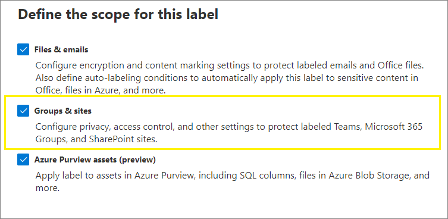

# <a name="use-sensitivity-labels-to-protect-content-in-microsoft-teams-microsoft-365-groups-and-sharepoint-sites"></a>Usare le etichette di riservatezza per proteggere il contenuto in Microsoft Teams, gruppi di Microsoft 365 e siti di SharePoint

>*[Indicazioni per l'assegnazione di licenze di Microsoft 365 per sicurezza e conformità](https://aka.ms/ComplianceSD).*

Le [etichette di riservatezza](sensitivity-labels.md), oltre a essere usate per classificare e proteggere documenti e messaggi di posta elettronica, possono essere usate per proteggere il contenuto dei contenitori seguenti: siti di Microsoft Teams, gruppi di Microsoft 365 ([in precedenza gruppi di Office 365](https://techcommunity.microsoft.com/t5/microsoft-365-blog/office-365-groups-will-become-microsoft-365-groups/ba-p/1303601)) e siti di SharePoint. Per questa classificazione e protezione a livello di contenitore, usare le seguenti impostazioni di etichetta:

- Privacy (pubblica o privata) dei siti dei team e dei gruppi di Microsoft 365
- Accesso utenti esterni
- Condivisione esterna dai siti di SharePoint (anteprima)
- Accesso da dispositivi non gestiti

> [!IMPORTANT]
> La funzionalità **Accedi da dispositivi non gestiti** funziona in combinazione con la caratteristica di SharePoint che consente di [controllare l'accesso da dispositivi non gestiti](/sharepoint/control-access-from-unmanaged-devices). Per utilizzare un'etichetta di riservatezza per cui sia configurata questa impostazione, è necessario configurare questa funzionalità dipendente di SharePoint. Altre informazioni sono disponibili nelle istruzioni seguenti.

Quando si applica questa etichetta di riservatezza a uno dei contenitori supportati, l'etichetta applica automaticamente le impostazioni di classificazione e protezione configurate al sito o al gruppo.

Il contenuto di tali contenitori, tuttavia, non eredita le etichette per la classificazione o le impostazioni per i file e i messaggi di posta elettronica come i contrassegni visivi e la crittografia. Per fare in modo che gli utenti possano etichettare i propri documenti nei siti di SharePoint o del team, assicurarsi di [abilitare le etichette di riservatezza per i file di Office in SharePoint e OneDrive](sensitivity-labels-sharepoint-onedrive-files.md).

> [!NOTE]
> Le etichette di riservatezza per i contenitori non sono supportate con le reti per la distribuzione di contenuti (CDN) di Office 365.

## <a name="using-sensitivity-labels-for-microsoft-teams-microsoft-365-groups-and-sharepoint-sites"></a>Usare le etichette di riservatezza per Microsoft Teams, gruppi di Microsoft 365 e siti di SharePoint

Prima di abilitare le etichette di riservatezza per contenitori e configurare le etichette di riservatezza per le nuove impostazioni, gli utenti potranno vedere e applicare tali etichette nelle loro app. Un esempio da Word:


Dopo l'abilitazione e la configurazione delle etichette di riservatezza, gli utenti possono anche vedere e applicare etichette di riservatezza a Microsoft Teams, gruppi di Microsoft 365 e siti di SharePoint. Un esempio quando si crea un nuovo sito del team di SharePoint:


## <a name="how-to-enable-sensitivity-labels-for-containers-and-synchronize-labels"></a>Come abilitare le etichette di riservatezza per i contenitori e sincronizzare le etichette

1. Dato che questa funzione usa le funzionalità di Azure AD, seguire le istruzioni riportate nella relativa documentazione per abilitare il supporto per le etichette di riservatezza: [Assegnare etichette di riservatezza a gruppi di Microsoft 365 in Azure Active Directory](https://docs.microsoft.com/azure/active-directory/users-groups-roles/groups-assign-sensitivity-labels).

2. Ora è necessario sincronizzare le etichette di riservatezza in Azure AD. Prima di tutto,[connettersi a PowerShell in Centro sicurezza e conformità](/powershell/exchange/office-365-scc/connect-to-scc-powershell/connect-to-scc-powershell).

   Ad esempio, in una sessione di PowerShell eseguita come amministratore, accedere con un account di amministratore globale.

3. Quindi eseguire il comando seguente per assicurarsi di poter usare le etichette di riservatezza con i gruppi di Microsoft 365:

    ```powershell
    Execute-AzureAdLabelSync
    ```

## <a name="how-to-configure-groups-and-site-settings"></a>Come configurare i gruppi e le impostazioni del sito

L'abilitazione delle etichette di riservatezza per i contenitori indica che è possibile configurare le impostazioni di protezione per i gruppi e i siti tramite la procedura guidata dell’etichetta di riservatezza. Finché non si abilita il supporto, le impostazioni sono visibili nella procedura guidata, ma non è possibile configurarle.

1. Seguire le istruzioni generali per [creare o modificare un'etichetta di riservatezza](create-sensitivity-labels.md#create-and-configure-sensitivity-labels) e verificare che sia selezionata l'opzione **Gruppi e siti** per l'ambito dell'etichetta: 
    
    
    
    Quando solo questo ambito è selezionato per l'etichetta, l'etichetta non verrà visualizzata nelle app di Office che supportano le etichette di riservatezza e non può essere applicata a file e messaggi di posta elettronica. La separazione delle etichette può essere utile sia per gli utenti che per gli amministratori, ma può anche aumentare la complessità della distribuzione delle etichette.
    
    Ad esempio, è necessario rivedere attentamente l'[ordine delle etichette](sensitivity-labels.md#label-priority-order-matters) poiché SharePoint rileva quando un documento etichettato viene caricato su un sito etichettato. In questo scenario, vengono generati automaticamente un evento di controllo e un messaggio di posta elettronica quando il documento ha un'etichetta di riservatezza con priorità più elevata rispetto all'etichetta del sito. Per ulteriori informazioni, vedere la sezione [Attività di controllo dell'etichetta di riservatezza](#auditing-sensitivity-label-activities) in questa pagina. 

2. Quindi, nella pagina **Definisci impostazioni di protezione per gruppi e siti**, selezionare una o entrambe le opzioni disponibili:
    
    - **Privacy e impostazioni di accesso utente esterno** per configurare le impostazioni di **Privacy** e **Accesso utenti esterni**. 
    - **Impostazioni di accesso al dispositivo e condivisione esterna** per configurare le impostazioni **Controlla la condivisione esterna da siti di SharePoint etichettati** e **Accedi da dispositivi non gestiti**.

3. Se è stato selezionato **Privacy e impostazioni di accesso utente esterno**, configurare le seguenti impostazioni:
    
    - **Privacy**: mantenere l'impostazione predefinita **Pubblico** se si vuole consentire a chiunque nell’organizzazione l’accesso al sito del team o al gruppo in cui è applicata questa etichetta.
        
        Selezionare **Privato** se si vuole limitare l'accesso solo ai membri approvati nell'organizzazione.
        
        Selezionare **Nessuno** quando si vuole proteggere il contenuto del contenitore usando l'etichetta di riservatezza, ma consentendo comunque agli utenti di configurare in autonomia le impostazioni di privacy.
        
        Le impostazioni di **Pubblico** o **Privato** impostano e bloccano l'impostazione della privacy quando si applica l'etichetta al contenitore. L'impostazione scelta sostituisce ogni precedente impostazione della privacy configurata per il team o il gruppo, bloccando il livello di privacy in modo che possa essere modificato solo rimuovendo prima l'etichetta di riservatezza dal contenitore. Dopo aver rimosso l'etichetta di riservatezza, viene mantenuto il livello di privacy impostato dall'etichetta, che ora potrà essere modificato, se necessario.
    
    - **Accesso utente esterno**: controllare se il proprietario del gruppo può [aggiungere utenti guest al gruppo](/office365/admin/create-groups/manage-guest-access-in-groups).

4. Se è stato selezionato **Accesso dispositivo e impostazioni condivisione esterna**, configurare le seguenti impostazioni:
    
    - **Controlla la condivisione esterna da siti di SharePoint etichettati**: selezionare questa opzione, attualmente in anteprima, per selezionare in seguito la condivisione con tutti gli utenti, gli utenti guest nuovi ed esistenti, o soltanto gli utenti della propria organizzazione. Per altre informazioni su questa configurazione e sulle impostazioni, vedere la documentazione di SharePoint [Attivare e disattivare la condivisione esterna per un sito](https://docs.microsoft.com/sharepoint/change-external-sharing-site).
    
    - **Accedi da dispositivi non gestiti**: questa opzione si serve della funzionalità di SharePoint che usa l'accesso condizionale di Azure AD per bloccare o limitare l'accesso ai contenuti di SharePoint e OneDrive da dispositivi non gestiti. Per altre informazioni, vedere [Controllare l'accesso da dispositivi non gestiti](/sharepoint/control-access-from-unmanaged-devices) dalla documentazione di SharePoint. L'opzione specificata per questa impostazione dell'etichetta equivale all'esecuzione di un comando di PowerShell per un sito, come descritto nei passaggi 3-5 [Bloccare o limitare l'accesso a uno specifico sito di SharePoint o OneDrive](https://docs.microsoft.com/sharepoint/control-access-from-unmanaged-devices#block-or-limit-access-to-a-specific-sharepoint-site-or-onedrive) della sezione delle istruzioni di SharePoint.
        
        Per altre informazioni, vedere [Ulteriori informazioni sulle dipendenze per l'opzione dei dispositivi non gestiti](#more-information-about-the-dependencies-for-the-unmanaged-devices-option) alla fine di questa sezione.

> [!IMPORTANT]
> Quando si applica l'etichetta a un team, un gruppo o un sito, vengono applicate solo queste impostazioni a livello di sito e di gruppo. Se l’[ ambito dell'etichetta ](sensitivity-labels.md#label-scopes) include file e messaggi di posta elettronica, le altre impostazioni dell'etichetta, come la crittografia e il contrassegno di contenuti, non vengono applicate al contenuto all'interno del team, del gruppo o del sito.

Se l'etichetta di riservatezza non è già pubblicata, ora è possibile farlo [aggiungendola a un criterio di etichetta di riservatezza](create-sensitivity-labels.md#publish-sensitivity-labels-by-creating-a-label-policy). Gli utenti a cui è stato assegnato un criterio di etichetta di riservatezza che include tale etichetta potranno selezionarla per siti e gruppi.

##### <a name="more-information-about-the-dependencies-for-the-unmanaged-devices-option"></a>Ulteriori informazioni sulle dipendenze per l'opzione dei dispositivi non gestiti

Se non si configurano i criteri di accesso condizionale dipendente per SharePoint, come descritto in [Usa restrizioni imposte dalle app](https://docs.microsoft.com/sharepoint/app-enforced-restrictions), l'opzione specificata non avrà alcun effetto. Inoltre, non avrà alcun effetto se è meno restrittiva rispetto a un'impostazione configurata al livello del tenant. Se è stata configurata un'opzione per i dispositivi non gestiti a livello di organizzazione, scegliere un'impostazione dell'etichetta uguale o più restrittiva

Per esempio, se il tenant è configurato in modo da **Consentire l'accesso limitato solo web**, l'impostazione dell'etichetta che consente l'accesso totale non avrà effetto perché è meno restrittiva. Per questa impostazione a livello del tenant, scegliere l'impostazione dell'etichetta per bloccare l'accesso (più restrittiva) o l'impostazione per l'accesso limitato (la stessa impostazione del tenant).

Dato che la funzionalità di SharePoint può essere configurata indipendentemente dall'impostazione dell'etichetta, la procedura guidata dell'etichetta di riservatezza non verifica che le dipendenze siano disponibili. Queste dipendenze possono essere configurate dopo la creazione e la pubblicazione dell'etichetta e anche dopo l'applicazione dell'etichetta. Se l'etichetta è già stata applicata, l'impostazione dell'etichetta non avrà effetto fino alla successiva autenticazione dell'utente.

## <a name="sensitivity-label-management"></a>Gestione delle etichetta di riservatezza

Seguire le istruzioni seguenti per creare, modificare o eliminare le etichette di riservatezza configurate per i siti e i gruppi.

### <a name="creating-and-publishing-labels-that-are-configured-for-sites-and-groups"></a>Creare e pubblicare etichette configurate per i siti e i gruppi

Quando si crea e si pubblica una nuova etichetta di riservatezza, diventerà visibile agli utenti di team, gruppi e siti entro un'ora. Tuttavia, se si modifica un'etichetta esistente, la modifica può richiedere fino 24 ore. Seguire le istruzioni seguenti per pubblicare un'etichetta per gli utenti quando l'etichetta è configurata per le impostazioni di sito e gruppo:

1. Dopo aver creato e configurato l'etichetta di riservatezza, aggiungerla a un criterio di etichetta applicabile solo a pochi utenti test.

2. Attendere la replica della modifica:

   - Nuova etichetta: attendere un'ora.
   - Etichetta esistente: attendere 24 ore.

3. Dopo questo periodo di attesa, usare uno degli account utente test per creare un team, un gruppo di Microsoft 365 o un sito di SharePoint con l'etichetta creata nel passaggio 1.

4. Se non si verificano errori durante l'operazione di creazione, sarà possibile pubblicare l'etichetta per tutti gli utenti del tenant in sicurezza.

### <a name="modifying-published-labels-that-are-configured-for-sites-and-groups"></a>Modificare etichette pubblicate che sono configurate per i siti e i gruppi

Come procedura consigliata, non modificare le impostazioni di sito e gruppo per un'etichetta di riservatezza dopo averla applicata a team, gruppi o siti. In caso di modifica, ricordare di attendere 24 ore per la replica delle modifiche in tutti i contenitori a cui è applicata l'etichetta.

Inoltre, se le modifiche includono l'impostazione **Accesso di utenti esterni**:

- La nuova impostazione si applica ai nuovi utenti, ma non agli utenti esistenti. Ad esempio, se questa impostazione è stata selezionata in precedenza e quindi gli utenti Guest hanno eseguito l'accesso al sito, tali utenti Guest possono continuare ad accedere al sito dopo aver deselezionato l'impostazione nella configurazione dell'etichetta.

- Le impostazioni di privacy relative alle proprietà dei gruppi hiddenMembership e roleEnabled non vengono aggiornate.

### <a name="deleting-published-labels-that-are-configured-for-sites-and-groups"></a>Eliminare etichette pubblicate che sono configurate per i siti e i gruppi

Se si elimina un'etichetta di riservatezza che ha impostazioni a livello di sito e gruppo abilitate e questa etichetta è inclusa in uno o più criteri di etichetta, questa azione può causare errori di creazione per i nuovi team, gruppi e siti. Per evitare questa situazione, seguire queste indicazioni:

1. Rimuovere l'etichetta di riservatezza da tutti i criteri che includono l'etichetta.

2. Attendere un'ora.

3. Dopo questo periodo di attesa, provare a creare un team, un gruppo o un sito e verificare che l'etichetta non sia più visibile.

4. Se l'etichetta di riservatezza non è visibile, è possibile eliminare l'etichetta in sicurezza.

## <a name="how-to-apply-sensitivity-labels-to-containers"></a>Come applicare le etichette di riservatezza ai contenitori

A questo punto è possibile applicare una o più etichette di riservatezza ai seguenti contenitori:

- [Gruppo di Microsoft 365 in Azure AD](#apply-sensitivity-labels-to-microsoft-365-groups)
- [Sito del team di Microsoft Teams](#apply-a-sensitivity-label-to-a-new-team)
- [Gruppo di Microsoft 365 in Outlook sul Web](#apply-a-sensitivity-label-to-a-new-group-in-outlook-on-the-web)
- [Sito di SharePoint](#apply-a-sensitivity-label-to-a-new-site)

È possibile usare PowerShell se è necessario per [applicare un'etichetta di riservatezza a più siti](#use-powershell-to-apply-a-sensitivity-label-to-multiple-sites).

### <a name="apply-sensitivity-labels-to-microsoft-365-groups"></a>Applicare etichette di riservatezza ai gruppi di Microsoft 365

Ora si è pronti per applicare una o più etichette di riservatezza ai gruppi di Microsoft 365. Per istruzioni, tornare alla documentazione di Azure AD:

- [Assegnare un'etichetta a un nuovo gruppo nel portale di Azure](https://docs.microsoft.com/azure/active-directory/users-groups-roles/groups-assign-sensitivity-labels#assign-a-label-to-a-new-group-in-azure-portal)

- [Assegnare un'etichetta a un gruppo già esistente nel portale di Azure](https://docs.microsoft.com/azure/active-directory/users-groups-roles/groups-assign-sensitivity-labels#assign-a-label-to-an-existing-group-in-azure-portal)

- [Assegnare un'etichetta da un gruppo già esistente nel portale di Azure](https://docs.microsoft.com/azure/active-directory/users-groups-roles/groups-assign-sensitivity-labels#remove-a-label-from-an-existing-group-in-azure-portal).

### <a name="apply-a-sensitivity-label-to-a-new-team"></a>Applicare un'etichetta di riservatezza a un nuovo team

Gli utenti possono selezionare le etichette di riservatezza quando creano nuovi team in Microsoft Teams. Quando selezionano l'etichetta dall'elenco a discesa **Riservatezza**, l'impostazione della privacy può cambiare in modo da riflettere la configurazione dell'etichetta. In base alle impostazioni di accesso degli utenti esterni selezionate per l'etichetta, gli utenti possono o non possano aggiungere al team persone esterne all'organizzazione.

[Altre informazioni sulle etichette di riservatezza per Teams](https://docs.microsoft.com/microsoftteams/sensitivity-labels)


Dopo la creazione del team, l'etichetta di riservatezza compare nell'angolo in alto a destra di tutti i canali.


Il servizio applica automaticamente la stessa etichetta di riservatezza al gruppo di Microsoft 365 e al sito del team di SharePoint connesso.

### <a name="apply-a-sensitivity-label-to-a-new-group-in-outlook-on-the-web"></a>Applicare un'etichetta di riservatezza a un nuovo gruppo in Outlook sul Web

In Outlook sul Web, quando si crea un nuovo gruppo è possibile selezionare o modificare l'opzione **Riservatezza** per le etichette pubblicate:


### <a name="apply-a-sensitivity-label-to-a-new-site"></a>Applicare un'etichetta di riservatezza a un nuovo sito

Gli amministratori e gli utenti finali possono selezionare le etichette di riservatezza quando [creano siti di comunicazione e siti del team moderni](/sharepoint/create-site-collection) ed espandere le **Impostazioni avanzate**:


La casella a discesa mostra i nomi di etichetta disponibili per la selezione e l'icona della Guida mostra tutti i nomi delle etichette con la relativa descrizione comando, aiutando gli utenti a determinare l'etichetta corretta da applicare.

Quando l'etichetta viene applicata e gli utenti visitano il sito, vedono il nome dell'etichetta e i criteri applicati. Ad esempio, questo sito è stato etichettato come **Riservato** e l'impostazione della privacy è **Privato**:


### <a name="use-powershell-to-apply-a-sensitivity-label-to-multiple-sites"></a>Usare PowerShell per applicare un'etichetta di riservatezza a più siti

È possibile usare il cmdlet [Set-SPOSite](/powershell/module/sharepoint-online/set-sposite) e [Set-SPOTenant](/powershell/module/sharepoint-online/set-spotenant) con il parametro *SensitivityLabel* dall'attuale [SharePoint Online Management Shell](https://docs.microsoft.com/powershell/sharepoint/sharepoint-online/connect-sharepoint-online) per applicare un'etichetta di riservatezza a molti siti. I siti possono essere una raccolta siti di SharePoint o un sito di OneDrive.

Verificare di avere la versione 16.0.19418.12000 o successiva di SharePoint Online Management Shell.

1. Aprire una sessione di PowerShell con l'opzione **Esegui come amministratore**.

2. Se non si conosce il GUID dell'etichetta: [connettersi a PowerShell per Centro sicurezza e conformità](https://docs.microsoft.com/powershell/exchange/connect-to-scc-powershell) e ottenere l'elenco delle etichette di riservatezza e i relativi GUID.

   ```powershell
   Get-Label |ft Name, Guid
   ```

3. Ora [connettersi a PowerShell per SharePoint Online](https://docs.microsoft.com/powershell/sharepoint/sharepoint-online/connect-sharepoint-online) e archiviare il GUID di etichetta come una variabile. Ad esempio:

   ```powershell
   $Id = [GUID]("e48058ea-98e8-4940-8db0-ba1310fd955e")
   ```

4. Creare una nuova variabile che identifichi più siti con una stringa di identificazione in comune nell'URL. Ad esempio:

   ```powershell
   $sites = Get-SPOSite -IncludePersonalSite $true -Limit all -Filter "Url -like 'documents"
   ```

5. Eseguire il comando seguente per applicare l'etichetta a questi siti. Usare gli esempi riportati:

   ```powershell
   $sites | ForEach-Object {Set-SPOTenant $_.url -SensitivityLabel $Id}
   ```

Per applicare etichette diverse a siti diversi, ripetere il comando seguente per ogni sito: `Set-SPOSite -Identity <URL> -SensitivityLabel "<labelguid>"`

## <a name="view-and-manage-sensitivity-labels-in-the-sharepoint-admin-center"></a>Visualizzare e gestire le etichette di riservatezza nell'interfaccia di amministrazione di SharePoint

Per visualizzare, ordinare e cercare le etichette di riservatezza applicate, usare la pagina **Siti attivi** nella nuova interfaccia di amministrazione di SharePoint. Potrebbe essere necessario aggiungere prima la colonna **Riservatezza**:


Per altre informazioni sulla gestione dei siti dalla pagina Siti attivi, compresa l'informazione su come aggiungere una colonna, vedere [Gestire i siti nella nuova interfaccia di amministrazione di SharePoint](/sharepoint/manage-sites-in-new-admin-center).

È anche possibile modificare e applicare un'etichetta da questa pagina:

1. Selezionare il nome del sito per aprire il riquadro dei dettagli.

2. Selezionare la scheda **Criteri**, quindi **Modifica** per l'impostazione **Riservatezza**.

3. Nel riquadro **Modificare l'impostazione di riservatezza** selezionare l'etichetta di riservatezza da applicare al sito, quindi selezionare **Salva**.

## <a name="support-for-sensitivity-labels"></a>Supporto per etichette di riservatezza

Le app e i servizi seguenti supportano le etichette di riservatezza configurate per le impostazioni di sito e gruppo:

- Interfacce di amministrazione:

  - Interfaccia di amministrazione di SharePoint
  - Portale di Azure Active Directory
  - Centro conformità Microsoft 365, Centro sicurezza Microsoft 365, Centro sicurezza e conformità

- App e servizi utente:

  - SharePoint
  - Teams
  - Outlook sul web e per Windows, macOS, iOS e Android
  - Forms
  - Stream
  - Planner (distribuzione) 

Le app e i servizi seguenti attualmente non supportano le etichette di riservatezza configurate per le impostazioni di sito e gruppo:

- Interfacce di amministrazione:

  - Interfaccia di amministrazione di Microsoft 365
  - Interfaccia di amministrazione di Teams
  - Interfaccia di amministrazione di Exchange

- App e servizi utente:

  - Dynamics 365
  - Yammer
  - Project
  - Power BI

## <a name="classic-azure-ad-group-classification"></a>Classificazione dei gruppi di Azure AD classica

Dopo aver abilitato le etichette di riservatezza per i contenitori, Microsoft 365 non supporta più le vecchie classificazioni per i nuovi gruppi di Microsoft 365 e siti di SharePoint. Tuttavia, i gruppi e i siti esistenti che supportano le etichette di riservatezza continuano a visualizzare i vecchi valori di classificazione, finché non vengono convertiti per usare le etichette di riservatezza.

Come esempio della classificazione dei gruppi precedente per SharePoint, vedere [Classificazione dei siti "moderni" di SharePoint](https://docs.microsoft.com/sharepoint/dev/solution-guidance/modern-experience-site-classification).

Queste classificazioni venivano configurate tramite Azure AD PowerShell o la raccolta PnP Core e definendo i valori per l'impostazione `ClassificationList`. Se il tenant include valori di classificazione definiti, vengono visualizzati eseguendo il comando seguente dal [modulo PowerShell AzureADPreview](https://www.powershellgallery.com/packages/AzureADPreview):

```powershell
($setting["ClassificationList"])
```

Per passare dalle vecchie classificazioni alle etichette di riservatezza, eseguire una delle seguenti operazioni:

- Usare etichette esistenti: specificare le impostazioni di etichetta desiderate per i siti e i gruppi modificando etichette di riservatezza esistenti e già pubblicate.

- Creare nuove etichette: specificare le impostazioni di etichetta desiderate per i siti e i gruppi creando e pubblicando nuove etichette di riservatezza che abbiano nomi identici alle classificazioni esistenti.

In seguito:

1. Usare PowerShell per applicare le etichette di riservatezza ai gruppi di Microsoft 365 e ai siti di SharePoint esistenti utilizzando il mapping del nome. Per istruzioni, vedere la sezione successiva.

2. Rimuovere le vecchie classificazioni dai gruppi e siti esistenti.

Nonostante non si possa impedire agli utenti di creare nuovi gruppi in app e servizi che non supportano ancora le etichette di riservatezza, è tuttavia possibile eseguire uno script di PowerShell ricorrente per cercare nuovi gruppi che gli utenti abbiano creato con le vecchie classificazioni, per poi convertirli all'uso delle etichette di riservatezza.

Per facilitare la gestione della coesistenza di etichette di riservatezza e classificazioni di Azure AD per siti e gruppi, vedere [Etichette di riservatezza e classificazione di Azure Active Directory per gruppi di Microsoft 365](migrate-aad-classification-sensitivity-labels.md).

### <a name="use-powershell-to-convert-classifications-for-microsoft-365-groups-to-sensitivity-labels"></a>Usare PowerShell per convertire le classificazioni per i gruppi di Microsoft 365 in etichette di riservatezza

1. Prima di tutto,[connettersi a PowerShell in Centro sicurezza e conformità](/powershell/exchange/office-365-scc/connect-to-scc-powershell/connect-to-scc-powershell).

   Ad esempio, in una sessione di PowerShell eseguita come amministratore, accedere con un account di amministratore globale:

2. Ottenere l'elenco delle etichette di riservatezza e dei GUID corrispondenti usando il cmdlet [Get-Label](https://docs.microsoft.com/powershell/module/exchange/get-label):

   ```powershell
   Get-Label |ft Name, Guid
   ```

3. Prendere nota dei GUID per le etichette di riservatezza che si desidera applicare ai gruppi di Microsoft 365.

4. Ora [connettersi a PowerShell di Exchange Online](https://docs.microsoft.com/powershell/exchange/connect-to-exchange-online-powershell) in una finestra separata di Windows PowerShell.

5. Usare il comando seguente come un esempio per visualizzare l'elenco dei gruppi al momento classificati come "Generale":

   ```PowerShell
   $Groups= Get-UnifiedGroup | Where {$_.classification -eq "General"}
   ```

6. Per ogni gruppo, aggiungere il GUID della nuova etichetta di riservatezza. Ad esempio:

    ```PowerShell
    foreach ($g in $groups)
    {Set-UnifiedGroup -Identity $g.Identity -SensitivityLabelId "457fa763-7c59-461c-b402-ad1ac6b703cc"}
    ```

7. Ripetere i passaggi 5 e 6 per le classificazioni dei gruppi rimanenti.

## <a name="auditing-sensitivity-label-activities"></a>Controllo delle attività sulle etichette di riservatezza

> [!IMPORTANT]
> Se si usa la separazione delle etichette selezionando solo l'ambito **Gruppi e siti** per le etichette che proteggono i contenitori: a causa dell'evento di controllo **Rilevata mancata corrispondenza della riservatezza del documento** e dei messaggi di posta elettronica descritti in questa sezione, è consigliabile [ordinare queste etichette](sensitivity-labels.md#label-priority-order-matters) prima delle etichette che hanno un ambito per **File e messaggi di posta elettronica**. 

Se qualcuno carica un documento in un sito protetto con un'etichetta di riservatezza e il documento ha un'etichetta di riservatezza con [priorità più elevata](sensitivity-labels.md#label-priority-order-matters) rispetto all'etichetta di riservatezza applicata al sito, l'azione non verrà bloccata. Ad esempio, si supponga sia stata applicata l'etichetta **Generale** a un sito di SharePoint e che qualcuno carichi su tale sito un documento con etichetta **Riservato**. Dato che un'etichetta di riservatezza con una priorità più elevata identifica un contenuto maggiormente riservato di quello contrassegnato con un ordine di priorità inferiore, la situazione potrebbe porre un problema di sicurezza.

Anche se l'azione non è bloccata, viene controllata e genera automaticamente un messaggio di posta elettronica per la persona che ha caricato il documento e l'amministratore del sito. Di conseguenza, sia l'utente che l'amministratore possono identificare quali documenti abbiano questo disallineamento di priorità dell'etichetta e, se necessario, intervenire. Ad esempio, è possibile spostare o eliminare dal sito il documento caricato.

Non costituirebbe alcun problema di sicurezza se il documento recasse un'etichetta di riservatezza con priorità inferiore rispetto a quella applicata al sito. Ad esempio, un documento con etichetta **Generale** viene caricato in un sito con etichetta **Riservato**. In questo scenario non vengono generati eventi di controllo o messaggi di posta elettronica.

Per eseguire una ricerca di tale evento nel log di controllo, cercare **È stata rilevata una mancata corrispondenza della riservatezza del documento** nella categoria **Attività su file e pagine**.

Il messaggio di posta elettronica generato automaticamente ha l'oggetto **Rilevata etichetta di riservatezza incompatibile** e il messaggio di posta elettronica spiega la mancata corrispondenza dell'etichetta, con un collegamento al documento caricato e al sito. Include anche un collegamento alla documentazione che spiega in che modo gli utenti possono modificare l'etichetta di riservatezza. Attualmente, non è possibile disabilitare o personalizzare questi messaggi di posta elettronica automatici.

Vengono controllate anche le attività di aggiunta o rimozione di un'etichetta di riservatezza da un sito o gruppo, senza però che venga generato un messaggio di posta elettronica.

Tutti questi eventi di controllo sono disponibili nella categoria [Attività etichetta di riservatezza](search-the-audit-log-in-security-and-compliance.md#sensitivity-label-activities). Per istruzioni sulla ricerca nel log di controllo, vedere [Eseguire ricerche nel log di controllo nel Centro sicurezza e conformità](search-the-audit-log-in-security-and-compliance.md).

## <a name="how-to-disable-sensitivity-labels-for-containers"></a>Come disabilitare le etichette di riservatezza per i contenitori

È possibile disabilitare le etichette di riservatezza per Microsoft Teams, gruppi di Microsoft 365 e siti di SharePoint seguendo le stesse istruzioni per [abilitare il supporto per le etichette di riservatezza](https://docs.microsoft.com/azure/active-directory/users-groups-roles/groups-assign-sensitivity-labels#enable-sensitivity-label-support-in-powershell). Tuttavia, per disabilitare la funzione, nel passaggio 5 specificare `$setting["EnableMIPLabels"] = "False"`.

Oltre a rendere tutte le impostazioni non disponibili per i gruppi e i siti quando si creano o si modificano le etichette di riservatezza, questa azione ripristina la proprietà utilizzata dai contenitori per la configurazione. L'abilitazione di etichette di riservatezza per Microsoft Teams, gruppi di Microsoft 365 e siti di SharePoint cambia la proprietà usata da **Classificazione**, (usata per la [classificazione del gruppo di Azure AD](#classic-azure-ad-group-classification)) in **Riservatezza**. Quando si disabilitano le etichette di riservatezza per i contenitori, i contenitori ignorano la proprietà Riservatezza e usano nuovamente la proprietà Classificazione.

Ciò significa che tutte le impostazioni delle etichette dei siti e dei gruppi applicate in precedenza ai contenitori non verranno applicate e nei contenitori non verranno più visualizzate le etichette.

Se a tali contenitori sono applicati valori di classificazione di Azure AD, i contenitori ripristinano nuovamente l'uso delle classificazioni. Tenere presente che in qualsiasi nuovo sito o gruppo creato dopo l'abilitazione della funzione non verrà visualizzata alcuna etichetta o classificazione. A questi contenitori e a tutti i nuovi contenitori sarà possibile, a questo punto, applicare valori di classificazione. Per altre informazioni, vedere [Classificazione dei siti "moderni" di SharePoint](https://docs.microsoft.com/sharepoint/dev/solution-guidance/modern-experience-site-classification) e [Creare classificazioni per i gruppi di Office nell'organizzazione](https://docs.microsoft.com/microsoft-365/enterprise/manage-microsoft-365-groups-with-powershell).

## <a name="additional-resources"></a>Risorse aggiuntive

Per informazioni su come [usare le etichette di riservatezza con Microsoft Teams, Gruppi di Office 365 e i siti di SharePoint Online](https://techcommunity.microsoft.com/t5/security-privacy-and-compliance/using-sensitivity-labels-with-microsoft-teams-o365-groups-and/ba-p/1221885#M1380), consultare la registrazione del webinar e le risposte alle domande.

Il webinar è stato registrato quando la funzione era ancora in anteprima, quindi si potrebbero notare alcune differenze nell'interfaccia utente. Tuttavia, le informazioni per questa funzione e tutte le nuove funzionalità documentate in questa pagina sono esatte.
