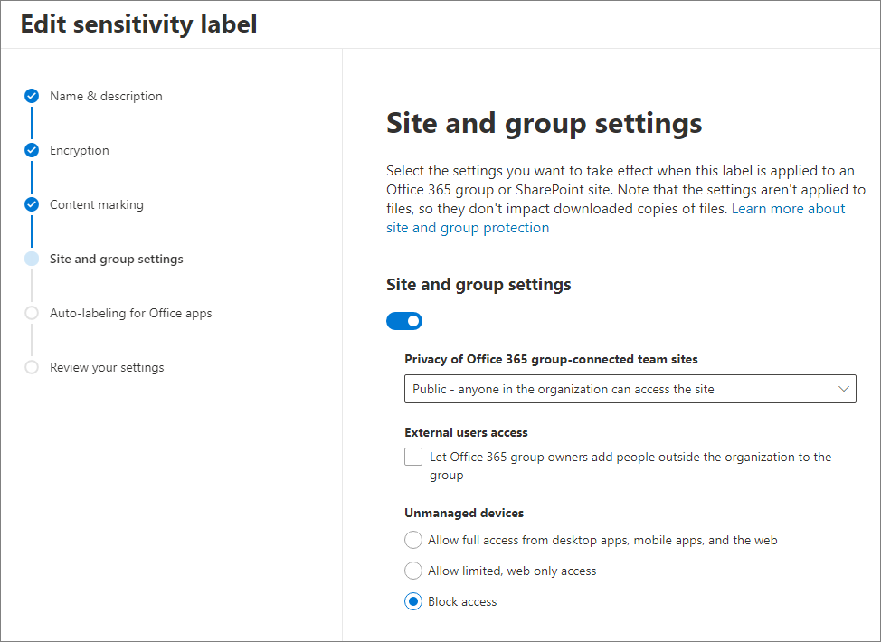

# <a name="use-sensitivity-labels-with-microsoft-teams-office-365-groups-and-sharepoint-sites-public-preview"></a>Usare le etichette di riservatezza con Microsoft Teams, gruppi di Office 365 e siti di SharePoint (anteprima pubblica)

Quando si creano etichette di riservatezza nel [Centro conformità Microsoft 365](https://protection.office.com/), ora è possibile applicarle ai seguenti contenitori: Microsoft Teams, gruppi di Office 365 e siti di SharePoint. Per tali contenitori, è possibile usare le impostazioni di etichetta per controllare le seguenti opzioni:

- Privacy dei siti dei team collegati ai gruppi di Office 365 (pubblici o privati)
- Accesso di utenti esterni
- Accesso da dispositivi non gestiti 

Quando si applica tale etichetta a uno dei contenitori supportati, questa applica automaticamente le opzioni configurate al relativo sito di SharePoint o del team. 

Il contenuto di tali contenitori, tuttavia, non eredita le etichette per impostazioni come il nome dell'etichetta, contrassegni visivi o la crittografia. Per etichettare file nei siti di SharePoint o del team, [abilitare le etichette di riservatezza per i file di Office in SharePoint e OneDrive](sensitivity-labels-sharepoint-onedrive-files.md).

## <a name="about-the-public-preview-for-microsoft-teams-office-365-groups-and-sharepoint-sites"></a>Informazioni sull'anteprima pubblica per Microsoft Teams, gruppi di Office 365 e siti di SharePoint

Le etichette di riservatezza per Microsoft Teams, gruppi di Office 365 e siti di SharePoint sono in fase di implementazione graduale nei tenant e potrebbero essere modificate prima del rilascio finale. Questa anteprima pubblica non funziona con le reti per la distribuzione di contenuti (CDN) di Office 365.

Prima di abilitare questa anteprima e configurare le etichette di riservatezza per le nuove impostazioni, gli utenti possono vedere e applicare tali etichette nelle loro app. Un esempio da Word:


Dopo l'abilitazione e la configurazione di questa anteprima, gli utenti possono anche vedere e applicare etichette di riservatezza a Microsoft Teams, gruppi di Office 365 e siti di SharePoint. Un esempio quando si crea un nuovo sito del team di SharePoint:


## <a name="enable-this-preview-and-synchronize-labels"></a>Abilitare questa anteprima e sincronizzare le etichette

1. Dato che questa funzione usa le funzionalità di Azure AD, seguire le istruzioni riportate nella relativa documentazione per abilitare l'anteprima: [Assegnare etichette di riservatezza a gruppi di Office 365 in Azure Active Directory (anteprima)](https://docs.microsoft.com/azure/active-directory/users-groups-roles/groups-assign-sensitivity-labels).

2. In una sessione di PowerShell, connettersi al Centro sicurezza e conformità usando un account aziendale o dell'istituto di istruzione con privilegi di amministratore globale. Per istruzioni, vedere [Connettersi a PowerShell per Centro sicurezza e conformità di Office 365](/powershell/exchange/office-365-scc/connect-to-scc-powershell/connect-to-scc-powershell).

3. Eseguire i comandi seguenti per sincronizzare le etichette con Azure AD, in modo da poterle usare con i gruppi di Office 365:
    
    ```powershell
    Set-ExecutionPolicy RemoteSigned
    $UserCredential = Get-Credential
    $Session = New-PSSession -ConfigurationName Microsoft.Exchange -ConnectionUri https://ps.compliance.protection.outlook.com/powershell-liveid/ -Credential $UserCredential -Authentication Basic -AllowRedirection
    Import-PSSession $Session -DisableNameChecking
    Execute-AzureAdLabelSync
    ```

## <a name="how-to-configure-site-and-group-settings-when-you-create-or-edit-sensitivity-labels"></a>Come configurare le impostazioni a livello di sito e gruppo quando si creano o si modificano le etichette di riservatezza

Ora è possibile creare o modificare le etichette di riservatezza che si desidera rendere disponibili per siti e gruppi. L'abilitazione dell'anteprima rende visibile una nuova pagina nelle procedure guidate per l'etichetta di riservatezza: **Impostazioni sito e gruppo**

Se serve aiuto per creare o modificare un'etichetta di riservatezza, seguire le istruzioni [Creare e configurare etichette di riservatezza](create-sensitivity-labels.md#create-and-configure-sensitivity-labels).

In questa nuova pagina **Impostazioni sito e gruppo**, configurare le impostazioni seguenti:

- **Privacy dei siti dei team collegati ai gruppi di Office 365**: viene automaticamente selezionata l'impostazione predefinita **Pubblico**, quindi chiunque nell'organizzazione può accedere al sito del team dove risulta applicata l'etichetta. Selezionare **Privato** se si desidera che soltanto membri approvati dell'organizzazione possano accedere al sito del team di gruppo. 
    
    L'impostazione selezionata sostituisce ogni precedente impostazione della privacy configurata per il gruppo, bloccando il livello di privacy in modo che possa essere modificato solo rimuovendo prima l'etichetta di riservatezza dal sito del team o dal gruppo. Dopo aver rimosso l'etichetta di riservatezza, viene mantenuto il livello di privacy impostato dall'etichetta, che ora potrà essere modificato, se necessario.

- **Accesso di utenti esterni**: controllare se il proprietario del gruppo può [aggiungere utenti guest al gruppo](/office365/admin/create-groups/manage-guest-access-in-groups).

- **Dispositivi non gestiti**: per i [dispositivi non gestiti](/sharepoint/control-access-from-unmanaged-devices), è possibile consentire l'accesso completo, il solo accesso Web o il blocco totale. 



> [!IMPORTANT]
> Quando si applica un'etichetta a un team, a un gruppo o a un sito, vengono applicate solo queste impostazioni a livello di sito e gruppo. Le altre impostazioni dell'etichetta, come la crittografia e il contrassegno di contenuti, non vengono applicate ai contenuto all'interno del team, del gruppo o del sito.
> 
> Analogamente, se si crea un'etichetta e non si attivano queste impostazioni di sito e gruppo, l'etichetta sarà ancora disponibile quando gli utenti creano team, gruppi e siti, ma verrà applicato solo il nome dell'etichetta.

Se l'etichetta non è già pubblicata, ora è possibile farlo [aggiungendola a un criterio di etichetta](create-sensitivity-labels.md#publish-sensitivity-labels-by-creating-a-label-policy).

## <a name="sensitivity-label-management"></a>Gestione delle etichetta di riservatezza

> [!WARNING]
> La creazione, la modifica e l'eliminazione delle etichette di riservatezza che si usano per Microsoft Teams, gruppi di Office 365 e siti di SharePoint richiedono un attento coordinamento con la pubblicazione di criteri delle etichette per gli utenti. 

Evitare errori nella creazione per siti e gruppi che possono incidere su tutti gli utenti, usando le indicazioni seguenti.

**Creazione e pubblicazione di etichette**

Dopo la creazione e la pubblicazione di un'etichetta di riservatezza, possono essere necessarie fino a 24 ore prima che l'etichetta diventi visibile agli utenti di team, gruppi e siti. Seguire questa procedura per pubblicare un'etichetta per tutti gli utenti nel tenant:

1. Creare l'etichetta di riservatezza e pubblicarla solo per pochi account utente nel tenant.

2. Attendere 24 ore.

3. Dopo questa attesa di 24 ore, usare uno degli account utente specificati nel passaggio 1 per creare un team, un gruppo di Office 365 o un sito di SharePoint con l'etichetta creata nel passaggio 1.

4. Se non si verificano errori durante l'operazione di creazione del passaggio 3, pubblicare l'etichetta per tutti gli utenti del tenant. In caso di errori, contattare il [Supporto tecnico Microsoft](https://docs.microsoft.com/office365/admin/contact-support-for-business-products).

**Modifica ed eliminazione di etichette pubblicate**

Se si modifica o si elimina un'etichetta di riservatezza inclusa in uno o più criteri delle etichette, tali azioni possono causare errori di creazione per tutti i team, i gruppi e i siti. Per evitare questa situazione, seguire queste indicazioni:

1. Rimuovere l'etichetta di riservatezza da tutti i criteri che includono l'etichetta.

2. Attendere 48 ore.

3. Dopo l'attesa di 48 ore, provare a creare un team, un gruppo o un sito e verificare che l'etichetta non sia più visibile.

4. Se l'etichetta di riservatezza non è visibile, è possibile modificare o eliminare l'etichetta in sicurezza. Se l'etichetta è ancora visibile, contattare il [Supporto tecnico Microsoft](https://docs.microsoft.com/office365/admin/contact-support-for-business-products).

## <a name="assign-sensitivity-labels-to-office-365-groups"></a>Assegnare etichette di riservatezza ai gruppi di Office 365

Ora si è pronti per applicare una o più etichette di riservatezza ai gruppi di Office 365. Per istruzioni, tornare alla documentazione di Azure AD:

- [Assegnare un'etichetta a un nuovo gruppo nel portale di Azure](https://docs.microsoft.com/azure/active-directory/users-groups-roles/groups-assign-sensitivity-labels#assign-a-label-to-a-new-group-in-azure-portal)

-  [Assegnare un'etichetta a un gruppo già esistente nel portale di Azure](https://docs.microsoft.com/azure/active-directory/users-groups-roles/groups-assign-sensitivity-labels#assign-a-label-to-an-existing-group-in-azure-portal)

-  [Assegnare un'etichetta da un gruppo già esistente nel portale di Azure](https://docs.microsoft.com/azure/active-directory/users-groups-roles/groups-assign-sensitivity-labels#remove-a-label-from-an-existing-group-in-azure-portal).

## <a name="apply-a-sensitivity-label-to-a-new-team"></a>Applicare un'etichetta di riservatezza a un nuovo team

Gli utenti possono selezionare le etichette di riservatezza quando creano nuovi team in Microsoft Teams. Quando selezionano il livello di riservatezza, le impostazioni di privacy cambiano come necessario. In base alle impostazioni di accesso degli utenti esterni selezionate per l'etichetta, gli utenti possono o non possano aggiungere al team persone esterne all'organizzazione.

[Altre informazioni sulle etichette di riservatezza per Teams](https://docs.microsoft.com/microsoftteams/sensitivity-labels)


Dopo la creazione del team, l'etichetta di riservatezza compare nell'angolo in alto a destra di tutti i canali.


Il servizio applica automaticamente la stessa etichetta di riservatezza al gruppo di Office 365 e al sito del team di SharePoint connesso.

## <a name="apply-a-sensitivity-label-to-a-new-group-in-outlook-on-the-web"></a>Applicare un'etichetta di riservatezza a un nuovo gruppo in Outlook sul Web

In Outlook sul Web, quando si crea un nuovo gruppo è possibile selezionare o modificare l'opzione **Riservatezza** per le etichette pubblicate:


## <a name="apply-a-sensitivity-label-to-a-new-site"></a>Applicare un'etichetta di riservatezza a un nuovo sito

Gli amministratori e gli utenti finali possono selezionare le etichette di riservatezza quando [creano siti di comunicazione e siti del team moderni](/sharepoint/create-site-collection).

Quando gli utenti creano siti di comunicazione e siti del team moderni, per impostazione predefinita è già selezionata un'etichetta di riservatezza. Per saperne di più sulle etichette, gli utenti possono selezionare l'icona della Guida.


Quando gli utenti visitano il sito, possono vedere il nome dell'etichetta e i criteri applicati.


## <a name="view-sensitivity-labels-in-the-sharepoint-admin-center"></a>Visualizzare le etichette di riservatezza nell'interfaccia di amministrazione di SharePoint

Per visualizzare le etichette di riservatezza applicate, usare la pagina **Siti attivi** nella nuova interfaccia di amministrazione di SharePoint. Potrebbe essere necessario aggiungere prima la colonna **Riservatezza**:


[Altre informazioni sulla gestione dei siti nella nuova interfaccia di amministrazione di SharePoint](/sharepoint/manage-sites-in-new-admin-center).

## <a name="change-site-and-group-settings-for-a-label"></a>Modificare le impostazioni a livello di sito e gruppo

Ogni volta che si apporta una modifica alle impostazioni di sito e gruppo per un'etichetta, è necessario eseguire i comandi di PowerShell seguenti in modo che i team, i siti e i gruppi possano usare le nuove impostazioni. Come procedura consigliata, non modificare le impostazioni di sito e gruppo per un'etichetta dopo aver applicato l'etichetta a più team, gruppi o siti.

1. Eseguire i comandi seguenti per connettersi a PowerShell per Centro sicurezza e conformità di Office 365 e ottenere l'elenco delle etichette di riservatezza e i relativi GUID.
    
    ```powershell
    Set-ExecutionPolicy RemoteSigned
    $UserCredential = Get-Credential
    $Session = New-PSSession -ConfigurationName Microsoft.Exchange -ConnectionUri https://ps.compliance.protection.outlook.com/powershell-liveid -Authentication Basic -AllowRedirection -Credential $UserCredential
    Import-PSSession $Session
    Get-Label |ft Name, Guid
    ```

2. Prendere nota del GUID dell'etichetta o delle etichette modificate.

3. Ora connettersi a PowerShell per Exchange Online ed eseguire il cmdlet Get-UnifiedGroup, specificando il GUID dell'etichetta al posto del GUID di esempio "e48058ea-98e8-4940-8db0-ba1310fd955e": 
    
    ```powershell
    Set-ExecutionPolicy RemoteSigned
    $UserCredential = Get-Credential
    $Session = New-PSSession -ConfigurationName Microsoft.Exchange -ConnectionUri https://outlook.office365.com/powershell-liveid/ -Credential $UserCredential -Authentication Basic -AllowRedirection
    Import-PSSession $Session
    $Groups= Get-UnifiedGroup | Where {$_.SensitivityLabel  -eq "e48058ea-98e8-4940-8db0-ba1310fd955e"}
    ```

4. Per ogni gruppo, riapplicare l'etichetta di riservatezza specificando il GUID dell'etichetta al posto del GUID di esempio "e48058ea-98e8-4940-8db0-ba1310fd955e":
    
    ```powershell
    foreach ($g in $groups)
    {Set-UnifiedGroup -Identity $g.Identity -SensitivityLabelId "e48058ea-98e8-4940-8db0-ba1310fd955e"}
    ```

## <a name="support-for-the-sensitivity-labels"></a>Supporto per le etichette di riservatezza

È possibile usare le etichette di riservatezza configurate per le impostazioni del sito e del gruppo con le app e i servizi seguenti:

- SharePoint Online
- Teams
- Outlook sul Web
- Interfaccia di amministrazione di SharePoint
- Interfaccia di amministrazione di Azure AD

Non risulta invece possibile utilizzare le etichette di riservatezza configurate per le impostazioni del sito e del gruppo con le app e i servizi seguenti:

- Outlook per Mac
- Outlook Mobile
- Outlook desktop per Windows
- Forms
- Dynamics 365
- Yammer
- Stream
- Planner
- Project
- PowerBI
- Interfaccia di amministrazione di Teams
- Interfaccia di amministrazione di Microsoft 365
- Interfaccia di amministrazione di Exchange


## <a name="classic-azure-ad-site-classification"></a>Classificazione dei siti di Azure AD classica

Quando si abilita questa anteprima, Office 365 non supporta più le vecchie classificazioni per i nuovi gruppi e siti di SharePoint. Tuttavia, i gruppi e i siti esistenti continuano a visualizzare le vecchie classificazioni, a meno che non vengano convertite all'uso delle etichette di riservatezza. Le vecchie classificazioni includono la classificazione dei siti "moderni" configurata, probabilmente tramite Azure AD PowerShell o la libreria principale di PnP, che definiscono i valori per l'impostazione `ClassificationList`.

Ad esempio, in PowerShell:

```powershell
   ($setting["ClassificationList"])
```

Per altre informazioni sul metodo di classificazione precedente, vedere [Classificazione dei siti "moderni" di SharePoint](https://docs.microsoft.com/sharepoint/dev/solution-guidance/modern-experience-site-classification).

Per passare dalle vecchie classificazioni alle etichette di riservatezza, eseguire una delle seguenti operazioni:

- Usare etichette esistenti: specificare le impostazioni di etichetta desiderate per i siti e i gruppi modificando etichette di riservatezza esistenti e già pubblicate.

- Creare nuove etichette: specificare le impostazioni di etichetta desiderate per i siti e i gruppi creando e pubblicando nuove etichette di riservatezza che abbiano nomi identici alle classificazioni esistenti.

In seguito: 

1. Usare PowerShell per applicare le etichette di riservatezza ai gruppi di Office 365 e ai siti di SharePoint esistenti utilizzando il mapping del nome. Per istruzioni, vedere la sezione successiva.

2. Rimuovere le vecchie classificazioni dai gruppi e siti esistenti.

Nonostante non si possa impedire agli utenti di creare nuovi gruppi in app e servizi che non supportano ancora le etichette di riservatezza, è tuttavia possibile eseguire uno script di PowerShell ricorrente per cercare nuovi gruppi che gli utenti abbiano creato con le vecchie classificazioni, per poi convertirli all'uso delle etichette di riservatezza. 

#### <a name="use-powershell-to-convert-classifications-for-office-365-groups-to-sensitivity-labels"></a>Usare PowerShell per convertire le classificazioni per i gruppi di Office 365 in etichette di riservatezza

1. Verificare che sia in uso la versione di SharePoint Online Management Shell 16.0.19418.12000 o successiva. Se la versione più recente è già installata, andare direttamente al passaggio 4.

2. Se è stata installata una versione precedente di SharePoint Online Management Shell da PowerShell Gallery, è possibile aggiornare il modulo eseguendo il cmdlet seguente.
    
    ```PowerShell
    Update-Module -Name Microsoft.Online.SharePoint.PowerShell
    ```

3. Se è stata installata una versione precedente di SharePoint Online Management Shell dall'Area download Microsoft, passare a **Installazione applicazioni** e disinstallare SharePoint Online Management Shell. In seguito, installare la versione più recente di SharePoint Online Management Shell dall'[Area download Microsoft](https://go.microsoft.com/fwlink/p/?LinkId=255251).

4. Usando un account aziendale o dell'istituto di istruzione con privilegi di amministratore globale o amministratore di SharePoint in Office 365, connettersi a SharePoint Online Management Shell. Per informazioni in merito, vedere [Guida introduttiva a SharePoint Online Management Shell](/powershell/sharepoint/sharepoint-online/connect-sharepoint-online).

5. Eseguire i comandi seguenti per ottenere l'elenco delle etichette di riservatezza e dei GUID corrispondenti.

    ```PowerShell
    Set-ExecutionPolicy RemoteSigned
    $UserCredential = Get-Credential
    $Session = New-PSSession -ConfigurationName Microsoft.Exchange -ConnectionUri https://ps.compliance.protection.outlook.com/powershell-liveid -Authentication Basic -AllowRedirection -Credential $UserCredential
    Import-PSSession $Session
    Get-Label |ft Name, Guid  
    ```

6. Prendere nota dei GUID per le etichette di riservatezza che si desidera applicare ai gruppi di Office 365.

7. Usare il comando seguente come un esempio per visualizzare l'elenco dei gruppi al momento classificati come "Generale":

   ```PowerShell
   $Groups= Get-UnifiedGroup | Where {$_.classification -eq "General"}
   ```

6. Per ogni gruppo, aggiungere il GUID della nuova etichetta di riservatezza. Ad esempio:

    ```PowerShell
    foreach ($g in $groups)
    {Set-UnifiedGroup -Identity $g.Identity -SensitivityLabelId "457fa763-7c59-461c-b402-ad1ac6b703cc"}
    ```

## <a name="auditing-sensitivity-label-activities"></a>Controllo delle attività sulle etichette di riservatezza

Se qualcuno carica un documento in un sito protetto con un'etichetta di riservatezza e il documento ha un'etichetta di riservatezza con [priorità più elevata](sensitivity-labels.md#label-priority-order-matters) rispetto all'etichetta di riservatezza applicata al sito, l'azione non verrà bloccata. Ad esempio, si supponga sia stata applicata l'etichetta **Generale** a un sito di SharePoint e che qualcuno carichi su tale sito un documento con etichetta **Riservato**. Dato che un'etichetta di riservatezza con una priorità più elevata identifica un contenuto maggiormente riservato di quello contrassegnato con un ordine di priorità inferiore, la situazione potrebbe porre un problema di sicurezza.

L'azione non viene bloccata, ma soggetta a controllo, in modo da identificare quali documenti abbiano questo disallineamento di priorità dell'etichetta e, se necessario, intervenire. Ad esempio, è possibile spostare o eliminare dal sito il documento caricato. 

Non costituirebbe alcun problema di sicurezza se il documento recasse un'etichetta di riservatezza con priorità inferiore rispetto a quella applicata al sito. Ad esempio, un documento con etichetta **Generale** viene caricato in un sito con etichetta **Riservato**. In questo scenario, non viene generato alcun evento di controllo.

Per eseguire una ricerca di tale evento nel log di controllo, cercare **Mancata corrispondenza della riservatezza del documento** nella categoria **Attività su file e pagine**. 

Vengono controllate anche le attività di aggiunta o rimozione di un'etichetta di riservatezza da un sito o gruppo. Questi eventi sono disponibili nella categoria [Attività sulle etichetta di riservatezza](search-the-audit-log-in-security-and-compliance.md#sensitivity-label-activities). 

Per istruzioni sulla ricerca nel log di controllo, vedere [Eseguire ricerche nel log di controllo nel Centro sicurezza e conformità](search-the-audit-log-in-security-and-compliance.md).

## <a name="troubleshoot-sensitivity-label-deployment"></a>Risolvere i problemi di distribuzione delle etichette di riservatezza

Problemi con le etichette di riservatezza per Microsoft Teams, gruppi di Office 365 e siti di SharePoint? Verificare quanto segue:

### <a name="labels-not-visible-after-publishing"></a>Etichette non visibili dopo la pubblicazione
Se si verificano problemi durante la creazione di un team o un gruppo di Office 365 dopo aver abilitato queste impostazioni o aver modificato la descrizione di una etichetta di riservatezza, attendere alcune ore e quindi provare di nuovo a creare il team o il gruppo. Per informazioni, vedere [Pianificare l'implementazione dopo aver creato o modificato un'etichetta di riservatezza](sensitivity-labels-sharepoint-onedrive-files.md#schedule-roll-out-after-you-create-or-change-a-sensitivity-label).

Se non è ancora possibile vedere la nuova etichetta di riservatezza da SharePoint Online, contattare il [Supporto tecnico Microsoft](https://docs.microsoft.com/office365/admin/contact-support-for-business-products).

### <a name="team-group-or-sharepoint-site-creation-errors"></a>Errori nella creazione di team, gruppi o siti di SharePoint
Se si verificano errori di creazione durante l'anteprima pubblica, sono disponibili due opzioni:

- Assicurarsi che le etichette di riservatezza non siano obbligatorie per alcun utente.

- È possibile disattivare le etichette di riservatezza per Microsoft Teams, gruppi di Office 365 e siti di SharePoint seguendo le stesse istruzioni per [Abilitare il supporto per le etichette di riservatezza](https://docs.microsoft.com/azure/active-directory/users-groups-roles/groups-assign-sensitivity-labels#enable-sensitivity-label-support-in-powershell). Tuttavia, per disabilitare l'anteprima, disabilitare la funzionalità usando `$setting["EnableMIPLabels"] = "False"` al passaggio 5.

