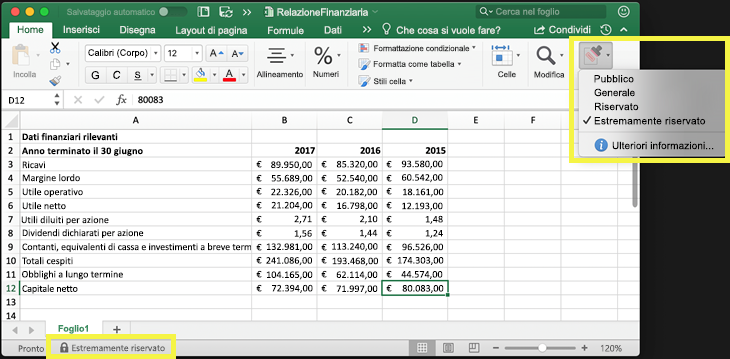
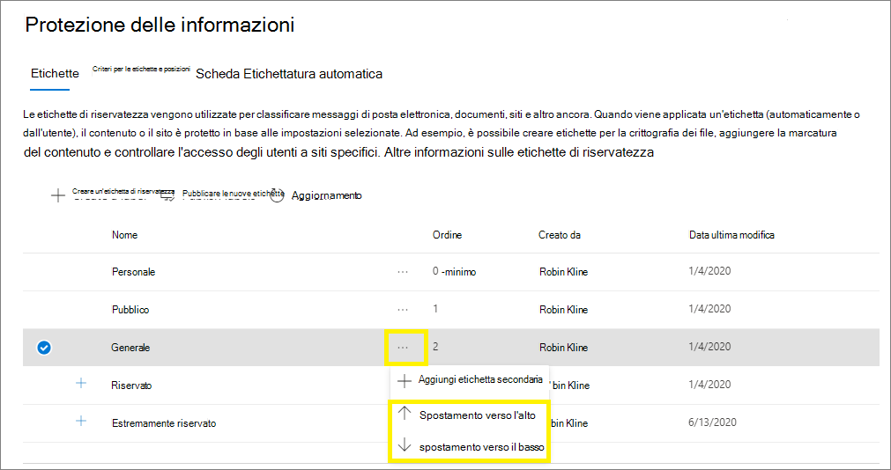
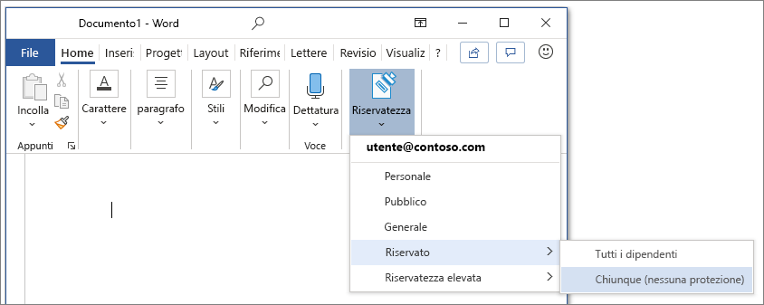
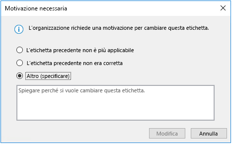
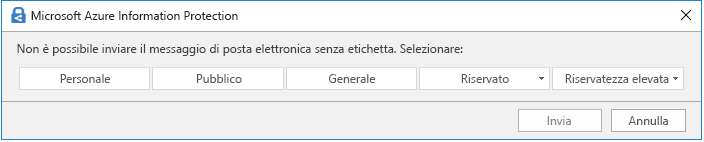
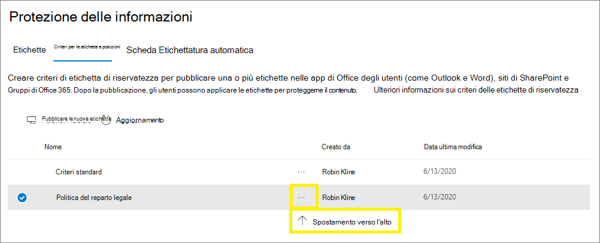

# Informazioni sulle etichette di riservatezza

>*[Indicazioni per l'assegnazione di licenze di Microsoft 365 per sicurezza e conformità](https://aka.ms/ComplianceSD).*

Per svolgere il proprio lavoro, i membri dell'organizzazione collaborano con altri utenti, sia interni che esterni all'organizzazione stessa. Questo significa che i contenuti non sono più protetti da un firewall, ma possono spostarsi tra dispositivi, applicazioni e servizi. E quando si spostano, è preferibile che lo facciano in modo sicuro e protetto, nel rispetto dei criteri aziendali e di conformità dell'organizzazione.

Le etichette di riservatezza del framework Microsoft Information Protection consentono di classificare e proteggere i dati dell'organizzazione, garantendo al contempo che la produttività degli utenti e la loro capacità di collaborare non vengano ostacolate.

Esempio che mostra le etichette di riservatezza disponibili in Excel dalla scheda **Home** sulla barra multifunzione. In questo esempio l'etichetta applicata viene visualizzata sulla barra di stato:

Per applicare le etichette di riservatezza, gli utenti devono aver eseguito l'accesso con l'account aziendale o dell'istituto di istruzione di Microsoft 365.

> [!NOTE]
> Per i tenant degli enti pubblici degli Stati Uniti (GCC, GCC-HC e DoD), le etichette di riservatezza sono attualmente supportate solo per lo scanner e il client di etichettatura unificata di Azure Information Protection. 
> 
> Per altre informazioni, vedere [Descrizione del servizio Azure Information Protection Premium per gli enti pubblici](https://docs.microsoft.com/enterprise-mobility-security/solutions/ems-aip-premium-govt-service-description).

È possibile usare le etichette di riservatezza per:
  
- **Applicare al contenuto etichettato le impostazioni di protezione, ad esempio crittografia o filigrane.** Ad esempio, gli utenti possono applicare un'etichetta Riservato a un documento o a un messaggio di posta elettronica, e quell'etichetta può crittografare il contenuto e applicare una filigrana Riservato.

- **Proteggere il contenuto nelle app di Office su piattaforme e dispositivi diversi.** Per un elenco delle app supportate, vedere [Usare le etichette di riservatezza nelle app di Office](sensitivity-labels-office-apps.md).

- **Proteggere il contenuto in app e servizi di terze parti** con Microsoft Cloud App Security. Con Cloud App Security è possibile rilevare, classificare, etichettare e proteggere i contenuti in servizi e app di terze parti, ad esempio SalesForce, Box o DropBox, anche se l'applicazione o servizio di terze parti non legge o supporta le etichette di riservatezza.

- **Estendere le etichette di riservatezza ad app e servizi di terze parti.** Con l'SDK di Microsoft Information Protection, le app e i servizi di terze parti possono leggere le etichette di riservatezza e applicare impostazioni di protezione.

- **Classificare il contenuto senza usare nessuna impostazione di protezione.** È anche possibile assegnare ai contenuti una semplice classificazione (ad esempio un adesivo) che persiste e si sposta con i contenuti mentre vengono usati e condivisi. Si può usare questa classificazione per generare report sull'utilizzo e visualizzare i dati delle attività relativi ai contenuti riservati. In base a queste informazioni, è sempre possibile decidere in un secondo momento di applicare le impostazioni di protezione.

In tutti questi casi, le etichette di riservatezza in Microsoft 365 aiutano a identificare le azioni corrette da eseguire per ogni contenuto. Con le etichette di riservatezza è possibile classificare i dati all'interno dell'organizzazione e applicare le impostazioni di protezione in base alla classificazione.

## Cos'è un'etichetta di riservatezza

Un'etichetta di riservatezza assegnata a un documento o a un messaggio di posta elettronica è come un timbro applicato al contenuto, cioè:

- **Personalizzabile.** È possibile creare categorie per diversi livelli di contenuti riservati all'interno dell'organizzazione, ad esempio Personale, Pubblico, Generale, Riservato e Riservatezza elevata.

- **Testo non crittografato.** Poiché l'etichetta è archiviata come testo non crittografato nei metadati del contenuto, le app e i servizi di terze parti possono leggerla e quindi applicare le proprie azioni di protezione, se necessario.

- **Persistente.** Quando al contenuto è applicata un'etichetta di riservatezza, questa viene archiviata nei metadati del messaggio di posta elettronica o del documento. Questo significa che l'etichetta, incluse le impostazioni di protezione, si sposta con il contenuto e diventa la base per l'applicazione dei criteri.

Nelle applicazioni di Office, un'etichetta di riservatezza viene visualizzata dagli utenti come tag in un messaggio di posta elettronica o in un documento.

A ogni elemento di contenuto può essere applicata una sola etichetta di riservatezza. È possibile applicare a un elemento una singola etichetta di riservatezza e una singola [etichetta di conservazione](retention.md#retention-labels).

> [!div class="mx-imgBorder"]
> 

## Operazioni eseguibili dalle etichette di riservatezza

Quando si applica un'etichetta di riservatezza a un messaggio di posta elettronica o a un documento, vengono applicate ai contenuti le impostazioni di protezione configurare per quell'etichetta. Con un'etichetta di riservatezza, è possibile:

- **Crittografare** solo la posta elettronica o sia la posta elettronica sia i documenti. È possibile scegliere quali utenti o gruppi hanno le autorizzazioni necessarie per eseguire determinate azioni e per quanto tempo. Ad esempio, puoi scegliere di consentire agli utenti di un gruppo specifico di un'altra organizzazione di avere le autorizzazioni necessarie per consultare il contenuto solo per 7 giorni dopo l'applicazione delle etichette al contenuto. In alternativa, anziché assegnare autorizzazioni definite dall'amministratore, è possibile consentire agli utenti di assegnare le autorizzazioni al contenuto quando vi applicano l'etichetta. 
    
    Per altre informazioni sulle impostazioni di **Crittografia** quando si crea o si modifica un'etichetta di riservatezza, vedere [Limitare l'accesso al contenuto usando la crittografia nelle etichette di riservatezza](encryption-sensitivity-labels.md).

- **Contrassegnare il contenuto** quando si usano app di Office con l'aggiunta di filigrane personalizzate, intestazioni o piè di pagina a messaggi di posta elettronica o documenti cui è stata applicata l'etichetta. Le filigrane possono essere applicate solo ai documenti, non ai messaggi di posta elettronica. Intestazione e filigrana di esempio:
    
    
    
    Se è necessario verificare se sono stati applicati contrassegni al contenuto, Vedere [Quando le app di Office applicano il contrassegno e la crittografia](sensitivity-labels-office-apps.md#when-office-apps-apply-content-marking-and-encryption).
    
    Lunghezza stringa: le filigrane sono limitate a 255 caratteri. Le intestazioni e i piè di pagina hanno un limite di 1024 caratteri, tranne che in Excel. Excel ha un limite totale di 255 caratteri per le intestazioni e i piè di pagina, ma questo limite include i caratteri non visibili, come i codici di formattazione. Se viene raggiunto questo limite, la stringa immessa non viene visualizzata in Excel.

- **Proteggere il contenuto in contenitori come siti e gruppi** quando si abilita la capacità di [usare le etichette di riservatezza con Microsoft Teams, gruppi di Microsoft 365 e siti di SharePoint](sensitivity-labels-teams-groups-sites.md).
    
    Le opzioni di configurazione per **Impostazioni sito e gruppo** non vengono visualizzate finché non si abilità questa capacità. Tenere presente che questa configurazione di etichetta non comporta l'etichettatura automatica dei documenti, ma le impostazioni di etichetta proteggono il contenuto controllando l'accesso al contenitore in cui sono archiviati i documenti. Queste impostazioni includono il livello di privacy, indipendentemente dal fatto che il proprietario di un gruppo di Microsoft 365 possa aggiungere utenti Guest al gruppo, e il livello di accesso concesso a un dispositivo non gestito.

- **Applicare l'etichetta automaticamente nelle app di Office o consigliare un'etichetta.** È possibile scegliere i tipi di informazioni riservate che si desidera etichettare e l'etichetta può essere applicata automaticamente oppure richiedere agli utenti di applicare l'etichetta consigliata. Se si consiglia un'etichetta, viene visualizzato il messaggio che si sceglie. Ad esempio:
    
    
    
    Per altre informazioni sull'**applicazione automatica di etichette per le app di Office**, vedere [Applicare automaticamente un'etichetta di riservatezza al contenuto](apply-sensitivity-label-automatically.md).

### Priorità dell’etichetta (l’ordine è importante)

Quando si creano le etichette di riservatezza nella propria interfaccia di amministrazione, queste vengono visualizzate in un elenco nella scheda **Riservatezza** nella pagina **Etichette**. In questo elenco, l'ordine delle etichette è importante perché ne riflette la priorità. È importante che l'etichetta con il grado di riservatezza più restrittivo, come Riservatezza elevata, sia visualizzata nella **parte inferiore** dell'elenco e che l'etichetta con il grado di riservatezza meno restrittivo, ad esempio Pubblico, sia visualizzata nella **parte superiore**.

È possibile applicare un'unica etichetta di riservatezza a un documento o un messaggio di posta elettronica. Se si imposta un'opzione per richiedere ali utenti di fornire una giustificazione per modificare un'etichetta applicando una classificazione inferiore, l'ordine di questo elenco identifica le classificazioni inferiori. Tuttavia, questa opzione non si applica alle sottoetichette.

L'ordinamento delle sottoetichette viene però usato con l'[etichettatura automatica](apply-sensitivity-label-automatically.md). Quando si configurano le etichette in modo da applicarle automaticamente o come suggerimento, diverse etichette possono avere più corrispondenze. Per determinare l'etichetta da applicare o consigliare si usa l'ordinamento delle etichette, ovvero viene selezionata l'etichetta a riservatezza meno elevata e, se applicabile, anche la sottoetichetta a riservatezza meno elevata.

### Sottoetichette (raggruppamento etichette)

Con le sottoetichette è possibile raggruppare uno o più etichette sotto un'etichetta padre visualizzata dall'utente in un'app di Office. Ad esempio, sotto l'etichetta Riservato l'organizzazione può usare etichette diverse per tipi specifici di tale classificazione. In questo esempio l'etichetta padre Riservato è semplicemente un'etichetta di testo senza impostazioni di sicurezza e non può essere applicata al contenuto perché contiene sottoetichette. Gli utenti devono invece scegliere Riservato per visualizzare le sottoetichette e in seguito possono scegliere una sottoetichetta da applicare al contenuto.

Le sottoetichette sono solo un modo per presentare le etichette agli utenti in gruppi logici. Non ereditano le impostazioni dell'etichetta padre che le contiene. Quando si pubblica una sottoetichetta per un utente, tale utente può applicare tale sottoetichetta al contenuto ma non può applicare l'etichetta padre.

Non scegliere un'etichetta padre come etichetta predefinita o configurare un'etichetta padre da applicare (o consigliare) automaticamente, altrimenti l'etichetta padre non verrà applicata al contenuto.

Esempio di come vengono visualizzate le sottoetichette per gli utenti:

### Modificare o eliminare un'etichetta di riservatezza

Se si elimina un'etichetta di riservatezza dall'interfaccia di amministrazione, l'etichetta non viene rimossa dal contenuto e le impostazioni di protezione continuano a essere applicate al contenuto.

Se si modifica un'etichetta di riservatezza, sarà applicata al contenuto la versione dell'etichetta originalmente applicata su di esso.

## Operazioni eseguibili dai criteri di etichetta

Dopo aver creato le etichette di riservatezza, è necessario pubblicarle per renderle disponibili a utenti e servizi dell'organizzazione. Sarà poi possibile applicarle a documenti e messaggi di posta elettronica. A differenza delle etichette di conservazione, che vengono pubblicate in posizioni, ad esempio tutte le cassette postali di Exchange, le etichette di riservatezza vengono pubblicate a utenti o gruppi. Saranno quindi visualizzate nelle app di Office per quegli utenti e gruppi.

Con un criterio di etichetta, è possibile:

- **Scegliere gli utenti e i gruppi che vedranno le etichette.** Le etichette possono essere pubblicate per qualsiasi utente specifico, gruppo di sicurezza abilitato per la posta elettronica, gruppo di distribuzione o gruppo di Microsoft 365, che può avere [appartenenza dinamica](https://docs.microsoft.com/azure/active-directory/users-groups-roles/groups-create-rule) in Azure AD.

- **Applicare un'etichetta predefinita** a tutti i nuovi documenti e messaggi di posta elettronica creati dagli utenti e dai gruppi inclusi nel criterio di etichetta. Questa opzione si applica anche ai contenitori, se sono state [abilitate le etichette di riservatezza per Microsoft Teams, i gruppi di Microsoft 365 e i siti di SharePoint](sensitivity-labels-teams-groups-sites.md). Gli utenti possono sempre modificare l'etichetta predefinita, se non è quella giusta per il documento o la posta elettronica. 
    
    Considerare l'uso di un'etichetta predefinita per impostare un livello di impostazioni di sicurezza di base da applicare a tutto il contenuto. Tuttavia, in mancanza di formazione per gli utenti e di altri controlli, questa impostazione può anche risultare nell'applicazione di etichette non corrette. In genere non è consigliabile selezionare un'etichetta che applica la crittografia come etichetta predefinita dei documenti. Ad esempio, molte organizzazioni devono inviare e condividere documenti con utenti esterni che potrebbero non avere app che supportano la crittografia o che potrebbero non usare un  account che può essere autorizzato. Per altre informazioni su questo scenario, vedere [Condivisione di documenti crittografati con utenti esterni](sensitivity-labels-office-apps.md#sharing-encrypted-documents-with-external-users).

- **Richiedere una motivazione per la modifica di un'etichetta.** Se un utente prova a rimuovere un'etichetta o a sostituirla con un'etichetta che ha un numero d'ordine inferiore, è possibile richiedere all'utente di fornire una motivazione per eseguire questa operazione. Ad esempio, un utente apre un documento con l'etichetta Riservato (numero d'ordine 3) e sostituisce tale etichetta con un'altra denominata Pubblico (numero d'ordine 1). Attualmente, la motivazione non viene inviata all'[analisi delle etichette](label-analytics.md) per la revisione da parte dell'amministratore. Tuttavia, il [client di etichettatura unificata di Azure Information Protection ](https://docs.microsoft.com/azure/information-protection/rms-client/aip-clientv2) invia le informazioni all'[analisi di Azure Information Protection](https://docs.microsoft.com/azure/information-protection/reports-aip).

    

- **Richiedere agli utenti di applicare un'etichetta alla posta elettronica e ai documenti.** Con questa opzione, nota anche come etichettatura obbligatoria, è possibile richiedere l'applicazione di un'etichetta prima che gli utenti possano salvare documenti e inviare messaggi di posta elettronica. L'etichetta può essere assegnata manualmente dall'utente, automaticamente in seguito a una condizione configurata oppure assegnata per impostazione predefinita (l'opzione per l'etichetta predefinita descritta in precedenza). Esempio di messaggio di richiesta mostrato in Outlook quando un utente deve assegnare un'etichetta:

    
    
    > [!NOTE]
    > Per l'etichettatura obbligatoria attualmente è necessario il [client di etichettatura unificata di Azure Information Protection](https://docs.microsoft.com/azure/information-protection/rms-client/install-unifiedlabelingclient-app). Questo client viene eseguito solo in Windows, quindi questa funzionalità non è ancora supportata in Mac, iOS e Android.
    
    Valutare l'uso di questa opzione per ampliare la portata dell'etichettatura. Tuttavia, in mancanza di formazione per gli utenti, questa impostazione può risultare nell'applicazione di etichette non corrette. Inoltre, a meno che non si imposti anche un'etichetta predefinita, l'etichettatura obbligatoria può infastidire gli utenti con le continue richieste. 

- **Fornire un collegamento a una pagina della Guida personalizzata.** Se gli utenti non conoscono il significato delle etichette di riservatezza o non sanno come usarle, è possibile fornire un URL che consente di accedere a maggiori informazioni, visualizzato nella parte inferiore del menu **Etichetta di riservatezza** nelle app di Office:

    

Quando si crea un criterio etichetta che assegna nuove etichette di riservatezza a utenti e gruppi, gli utenti vedranno le etichette nelle app di Office entro 30 minuti. Tuttavia, le modifiche alle etichette possono richiedere fino a 24 ore.

Non esiste un numero limite di etichette di riservatezza che è possibile creare e pubblicare, con un'eccezione: se l'etichetta applica la crittografia, è possibile creare un massimo di 500 etichette. Tuttavia, come procedura consigliata per ridurre al minimo i sovraccarichi per gli amministratori e le difficoltà per gli utenti, cercare di creare un numero limitato di etichette. Le distribuzioni nel mondo reale hanno evidenziato un'efficacia notevolmente ridotta nei casi in cui gli utenti hanno più di cinque etichette principali, oppure più di cinque sottoetichette per ogni etichetta principale.

### Priorità dei criteri di etichetta (l’ordine è importante)

Per rendere disponibili le etichette di riservatezza agli utenti, è possibile pubblicarle in un criterio di etichetta di riservatezza, incluso in un elenco della scheda **Criteri di riservatezza** nella pagina **Criteri etichetta**. Come le etichette di riservatezza (vedere [Priorità dell'etichetta (l'ordine è importante)](#label-priority-order-matters)), l'ordine dei criteri di etichetta di riservatezza è importante perché ne rispecchia la priorità. Il criterio di etichetta con priorità più bassa viene visualizzato nella parte **superiore**, mentre il criterio di etichetta con priorità più alta viene visualizzato nella parte **inferiore**.

Un criterio di etichetta è costituito da:

- Un set di etichette.
- Lo scopo dei criteri di etichetta, ossia gli utenti e i gruppi inclusi nel criterio.
- Le impostazioni dei criteri di etichetta descritte sopra (etichetta predefinita, motivazione, etichette obbligatorie e collegamento alla guida).

È possibile includere un utente in più criteri di etichetta. L'utente visualizzerà tutte le etichette di riservatezza di tali criteri. Vedrà però le impostazioni dei criteri solo del criterio di etichetta con la priorità più alta.

Se l'etichetta o l'impostazione dei criteri di etichetta prevista per un utente o un gruppo non viene visualizzata e sono trascorsi 30 minuti, controllare l'ordine dei criteri per le etichette di riservatezza. Per riordinare i criteri di etichetta, selezionare un criterio di etichetta di riservatezza > scegliere i puntini di sospensione a destra > **Sposta su** o **Sposta giù**.

Se si usano etichette di conservazione oltre alle etichette di riservatezza, è importante tenere presente che la priorità è importante per i criteri delle etichette di riservatezza, ma non per le [etichette di conservazione](retention.md#the-principles-of-retention-or-what-takes-precedence).

## Etichette di riservatezza e Azure Information Protection

Se sono state distribuite etichette con Azure Information Protection, usare le sezioni seguenti per indicazioni prima di iniziare a usare le etichette di riservatezza.

### Etichette di Azure Information Protection

> [!NOTE]
> La gestione delle etichette di Azure Information Protection nel portale di Azure non sarà più disponibile dal **31 marzo 2021**. Per altre informazioni, vedere l'avviso ufficiale di [funzionalità deprecata](https://techcommunity.microsoft.com/t5/azure-information-protection/announcing-timelines-for-sunsetting-label-management-in-the/ba-p/1226179).

Se si usano etichette di Azure Information Protection perché il tenant non si trova ancora sulla [piattaforma di etichettatura unificata](https://docs.microsoft.com/azure/information-protection/faqs#how-can-i-determine-if-my-tenant-is-on-the-unified-labeling-platform), è consigliabile evitare di creare etichette di riservatezza finché non viene attivata l'etichettatura unificata. In questo scenario, le etichette visualizzate nel portale di Azure sono etichette di Azure Information Protection anziché etichette di riservatezza. Queste etichette possono essere usate dal client di Azure Information Protection (classico) nei computer Windows, ma non possono essere usate da dispositivi che eseguono macOS, iOS o Android. Per risolvere il problema, [eseguire la migrazione di queste etichette](/azure/information-protection/configure-policy-migrate-labels) in etichette di riservatezza. 

I metadati applicati da entrambi i set di etichette sono compatibili, quindi non è necessario rietichettare documenti e messaggi di posta elettronica al termine della migrazione.

### Client di Azure Information Protection

Se si usano le etichette di riservatezza nelle app di Microsoft 365 Apps for enterprise in computer Windows, è possibile scegliere di usare un client di Azure Information Protection o di usare l'etichettatura integrata in Office.

Per impostazione predefinita, l'etichettatura integrata è disattivata nelle app quando è installato il client di Azure Information Protection. Per altre informazioni, incluse indicazioni su come modificare questo comportamento predefinito, vedere [Client di etichettatura incorporato di Office e client Azure Information Protection](sensitivity-labels-office-apps.md#office-built-in-labeling-client-and-the-azure-information-protection-client).

Anche quando si usa l'etichettatura integrata nelle app di Office, è possibile usare il client di etichettatura unificato di Azure Information Protection con le etichette di riservatezza per quanto segue:

- Uno strumento di analisi per individuare le informazioni sensibili archiviate in locale e quindi, se necessario, etichettare quel contenuto

- Opzioni disponibili nel menu di scelta rapida in Esplora file per consentire agli utenti di applicare etichette a tutti i tipi di file

- Un visualizzatore per visualizzare i file crittografati per i documenti di testo, immagine o PDF

- Un modulo di PowerShell per individuare le informazioni sensibili nei file in locale e applicare o rimuovere etichette e crittografia da tali file.

Se non si ha familiarità con Azure Information Protection o se si è un cliente di Azure Information Protection che ha appena eseguito la migrazione delle etichette, vedere [Scegliere il client di etichettatura da usare per i computer Windows](https://docs.microsoft.com/azure/information-protection/rms-client/use-client#choose-which-labeling-client-to-use-for-windows-computers) dalla documentazione di Azure Information Protection.

## Etichette di riservatezza e Microsoft Cloud App Security

Con Cloud App Security (CAS) è possibile individuare, classificare, etichettare e proteggere il contenuto in servizi e app di terze parti, ad esempio SalesForce, Box o DropBox. 

Cloud App Security è compatibile sia con le etichette di riservatezza che con le etichette di Azure Information Protection:

- Se nelle interfacce di amministrazione per l'etichettatura ci sono una o più etichette di riservatezza [pubblicate](create-sensitivity-labels.md#publish-sensitivity-labels-by-creating-a-label-policy) ad almeno un utente, vengono usate le etichette di riservatezza.

- Se nelle interfacce di amministrazione per l'etichettatura non ci sono etichette di riservatezza pubblicate, vengono usate le etichette di Azure Information Protection.

Per le istruzioni su come usare Cloud App Security con queste etichette, vedere [Integrazione di Azure Information Protection](https://docs.microsoft.com/cloud-app-security/azip-integration).

## Etichette di riservatezza e Microsoft Information Protection SDK

Dato che un'etichetta di riservatezza è archiviata in testo non crittografato nei metadati di un documento, le app e i servizi di terze parti possono leggere e scrivere in questi dati di etichettatura per integrare la distribuzione dell'etichettatura. Inoltre, gli sviluppatori di software possono usare [Microsoft Information Protection SDK](https://docs.microsoft.com/information-protection/develop/overview#microsoft-information-protection-sdk) per supportare pienamente le funzionalità di etichettatura e crittografia su più piattaforme. Per altre informazioni, vedere l'[annuncio della disponibilità generale sul blog della Tech Community](https://techcommunity.microsoft.com/t5/Microsoft-Information-Protection/Microsoft-Information-Protection-SDK-Now-Generally-Available/ba-p/263144). 

Sono anche disponibili informazioni sulle [soluzioni dei partner integrate con Microsoft Information Protection](https://techcommunity.microsoft.com/t5/Azure-Information-Protection/Microsoft-Information-Protection-showcases-integrated-partner/ba-p/262657).

## Guida alla distribuzione

Vedere [Iniziare a usare le etichette di riservatezza](get-started-with-sensitivity-labels.md).

