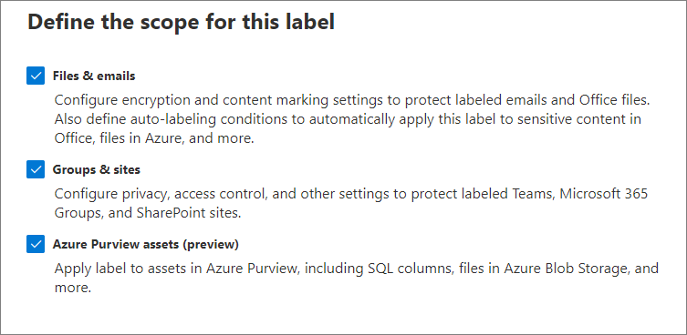

# Informazioni sulle etichette di riservatezzaLearn about sensitivity labels

>*[Indicazioni per l'assegnazione di licenze di Microsoft 365 per sicurezza e conformità](https://aka.ms/ComplianceSD).**[Microsoft 365 licensing guidance for security & compliance](https://aka.ms/ComplianceSD).*

Per svolgere il proprio lavoro, i membri dell'organizzazione collaborano con altri utenti, sia interni che esterni all'organizzazione stessa. Questo significa che i contenuti non sono più protetti da un firewall, ma possono spostarsi tra dispositivi, applicazioni e servizi. E quando si spostano, è preferibile che lo facciano in modo sicuro e protetto, nel rispetto dei criteri aziendali e di conformità dell'organizzazione.To get their work done, people in your organization collaborate with others both inside and outside the organization. This means that content no longer stays behind a firewall—it can roam everywhere, across devices, apps, and services. And when it roams, you want it to do so in a secure, protected way that meets your organization's business and compliance policies.

Le etichette di riservatezza della soluzione Microsoft Information Protection consentono di classificare e proteggere i dati dell'organizzazione, garantendo al contempo che la produttività degli utenti e la loro capacità di collaborare non vengano ostacolate.Sensitivity labels from the Microsoft Information Protection solution let you classify and protect your organization's data, while making sure that user productivity and their ability to collaborate isn't hindered.

Esempio che mostra le etichette di riservatezza disponibili in Excel dalla scheda **Home** sulla barra multifunzione.Example showing available sensitivity labels in Excel, from the **Home** tab on the Ribbon. In questo esempio l'etichetta applicata viene visualizzata sulla barra di stato:In this example, the applied label displays on the status bar:

Per applicare le etichette di riservatezza, gli utenti devono aver eseguito l'accesso con l'account aziendale o dell'istituto di istruzione di Microsoft 365.To apply sensitivity labels, users must be signed in with their Microsoft 365 work or school account.

È possibile usare le etichette di riservatezza per:You can use sensitivity labels to:
  
- **Fornire impostazioni di protezione che includono crittografia e contrassegni di contenuto.****Provide protection settings that include encryption and content markings.** Ad esempio, applicare un'etichetta "Riservato" a un documento o a un messaggio di posta elettronica. L'etichetta crittografa il contenuto e applica la filigrana "Riservato".For example, apply a "Confidential" label to a document or email, and that label encrypts the content and applies a "Confidential" watermark. I contrassegni di contenuto includono intestazioni, piè di pagina e filigrane e la crittografia consente anche di limitare le azioni che gli utenti autorizzati possono eseguire sul contenuto.Content markings include headers and footers as well as watermarks, and encryption can also restrict what actions authorized people can take on the content.

- **Proteggere il contenuto nelle app di Office su piattaforme e dispositivi diversi.****Protect content in Office apps across different platforms and devices.** Supportato da Word, Excel, PowerPoint e Outlook nelle app desktop di Office e in Office sul Web.Supported by Word, Excel, PowerPoint, and Outlook on the Office desktop apps and Office on the web. Supportato in Windows, macOS, iOS e Android.Supported on Windows, macOS, iOS, and Android.

- **Proteggere il contenuto in app e servizi di terze parti** con Microsoft Cloud App Security.**Protect content in third-party apps and services** by using Microsoft Cloud App Security. Con Cloud App Security è possibile rilevare, classificare, etichettare e proteggere i contenuti in servizi e app di terze parti, ad esempio SalesForce, Box o DropBox, anche se l'applicazione o servizio di terze parti non legge o supporta le etichette di riservatezza.With Cloud App Security, you can detect, classify, label, and protect content in third-party apps and services, such as SalesForce, Box, or DropBox, even if the third-party app or service does not read or support sensitivity labels.

- **Proteggere i contenitori** tra cui Teams, i Gruppi di Microsoft 365 e i siti di SharePoint.**Protect containers** that include Teams, Microsoft 365 Groups, and SharePoint sites. Ad esempio, configurare le impostazioni di privacy, l'accesso degli utente esterni, la condivisione esterna e l'accesso da dispositivi non gestiti.For example, set privacy settings, external user access and external sharing, and access from unmanaged devices.

- **Estendere le etichette di riservatezza a Power BI**: quando si attiva questa funzionalità, è possibile applicare e visualizzare le etichette in Power BI e proteggere i dati quando vengono salvati all'esterno del servizio.**Extend sensitivity labels to Power BI**: When you turn on this capability, you can apply and view labels in Power BI, and protect data when it's saved outside the service.

- **Estendere le etichette di riservatezza alle risorse in Azure Purview**: quando si attiva questa funzionalità, attualmente in anteprima, è possibile applicare le etichette di riservatezza a risorse come colonne SQL, file in Archiviazione BLOB di Azure e così via.**Extend sensitivity labels to assets in Azure Purview**: When you turn on this capability, currently in preview, you can apply your sensitivity labels to assets such as SQL columns, files in Azure Blob Storage, and more. 

- **Estendere le etichette di riservatezza ad app e servizi di terze parti.****Extend sensitivity labels to third-party apps and services.** Con l'SDK di Microsoft Information Protection, le app e i servizi di terze parti possono leggere le etichette di riservatezza e applicare impostazioni di protezione.Using the Microsoft Information Protection SDK, third-party apps can read sensitivity labels and apply protection settings.

- **Classificare il contenuto senza usare nessuna impostazione di protezione.****Classify content without using any protection settings.** È anche possibile assegnare un'etichetta semplicemente come risultato della classificazione del contenuto.You can also simply assign a label as a result of classifying the content. Questo offre agli utenti un mapping visivo della classificazione per i nomi delle etichette dell'organizzazione ed è possibile usare le etichette per generare report sull'utilizzo e visualizzare i dati delle attività per il contenuto riservato.This provides users with a visual mapping of classification to your organization's label names, and can use the labels to generate usage reports and see activity data for your sensitive content. In base a queste informazioni, è sempre possibile decidere in un secondo momento di applicare le impostazioni di protezione.Based on this information, you can always choose to apply protection settings later.

In tutti questi casi, le etichette di riservatezza in Microsoft 365 aiutano a identificare le azioni corrette da eseguire per ogni contenuto.In all these cases, sensitivity labels in Microsoft 365 can help you take the right actions on the right content. Con le etichette di riservatezza è possibile classificare i dati all'interno dell'organizzazione e applicare le impostazioni di protezione in base alla classificazione.With sensitivity labels, you can classify data across your organization, and enforce protection settings based on that classification.

Per altre informazioni su questi e altri scenari supportati dalle etichette di riservatezza, vedere [Scenari comuni per le etichette di riservatezza](get-started-with-sensitivity-labels.md#common-scenarios-for-sensitivity-labels).For more information about these and other scenarios that are supported by sensitivity labels, see [Common scenarios for sensitivity labels](get-started-with-sensitivity-labels.md#common-scenarios-for-sensitivity-labels). Vengono continuamente sviluppate nuove funzionalità che supportano le etichette di riservatezza, dunque può essere utile consultare la [roadmap di Microsoft 365](https://aka.ms/MIPC/Roadmap).New features are being developed all the time that support sensitivity labels, so you might also find it useful to reference the [Microsoft 365 roadmap](https://aka.ms/MIPC/Roadmap).

## Cos'è un'etichetta di riservatezzaWhat a sensitivity label is

Un'etichetta di riservatezza è come un timbro applicato al contenuto e ha queste caratteristiche:When you assign a sensitivity label to content, it's like a stamp that's applied and is:

- **Personalizzabile.****Customizable.** È possibile creare categorie per diversi livelli di contenuto riservato nell'organizzazione, in base alle proprie specifiche esigenze.Specific to your organization and business needs, you can create categories for different levels of sensitive content in your organization. Ad esempio, si può iniziare con etichette come Personale, Pubblico, Generale, Riservato ed Estremamente riservato.For example, Personal, Public, General, Confidential, and Highly Confidential.

- **Testo non crittografato.****Clear text.** Poiché un'etichetta è archiviata come testo non crittografato nei metadati di file e messaggi di posta elettronica, le app e i servizi di terze parti possono leggerla e quindi applicare le proprie azioni di protezione, se necessario.Because a label is stored in clear text in the metadata for files and emails, third-party apps and services can read it and then apply their own protective actions, if required.

- **Persistente.****Persistent.** Poiché l'etichetta è archiviata nei metadati di file e messaggi di posta elettronica, l'etichetta si sposta con il contenuto, indipendentemente dal percorso in cui viene salvato o archiviato.Because the label is stored in metadata for files and emails, the label roams with the content, no matter where it's saved or stored. L'identificazione univoca delle etichette diventa la base per applicare e applicare i criteri configurati.The unique label identification becomes the basis for applying and enforcing the policies that you configure.

Agli utenti, un'etichetta di riservatezza appare come un contrassegno nelle app che usano e può essere facilmente integrata nei flussi di lavoro esistenti.When viewed by users, a sensitivity label appears like a tag on apps that they use and can be easily integrated into their existing workflows.

A ogni elemento che supporta le etichette di riservatezza può esserne applicata solo una.Each item that supports sensitivity labels can have a single sensitivity label applied to it. Ai documenti e messaggi di posta elettronica può essere applicata sia un’etichetta di riservatezza che un’[etichetta di conservazione](retention.md#retention-labels).Documents and emails can have both a sensitivity label and a [retention label](retention.md#retention-labels) applied to them.

> [!div class="mx-imgBorder"]
> 

## Operazioni eseguibili dalle etichette di riservatezzaWhat sensitivity labels can do

Quando si applica un'etichetta di riservatezza a un messaggio di posta elettronica o a un documento, al contenuto vengono applicate le impostazioni di protezione configurate per quell'etichetta.After a sensitivity label is applied to an email or document, any configured protection settings for that label are enforced on the content. È possibile configurare un'etichetta di riservatezza in modo da:You can configure a sensitivity label to:

- **Crittografare** i messaggi di posta elettronica e i documenti per impedire agli utenti non autorizzati di accedere ai dati.**Encrypt** emails and documents to prevent unauthorized people from accessing this data. È inoltre possibile scegliere quali utenti o gruppi hanno le autorizzazioni necessarie per eseguire determinate azioni e per quanto tempo.You can additionally choose which users or group have permissions to perform which actions and for how long. Ad esempio, si può scegliere di consentire a tutti gli utenti dell'organizzazione di modificare un documento, mentre un gruppo specifico di un'altra organizzazione può solo visualizzarlo.For example, you can choose to allow all users in your organization to modify a document while a specific group in another organization can only view it. In alternativa, anziché assegnare autorizzazioni definite dall'amministratore, è possibile consentire agli utenti di assegnare le autorizzazioni al contenuto quando vi applicano l'etichetta.Alternatively, instead of administrator-defined permissions, you can allow your users to assign permissions to the content when they apply the label. 
    
    Per altre informazioni sulle impostazioni di **Crittografia** quando si crea o si modifica un'etichetta di riservatezza, vedere [Limitare l'accesso al contenuto usando la crittografia nelle etichette di riservatezza](encryption-sensitivity-labels.md).For more information about the **Encryption** settings when you create or edit a sensitivity label, see [Restrict access to content by using encryption in sensitivity labels](encryption-sensitivity-labels.md).

- **Contrassegnare il contenuto** quando si usano app di Office con l'aggiunta di filigrane personalizzate, intestazioni o piè di pagina a messaggi di posta elettronica o documenti cui è stata applicata l'etichetta.**Mark the content** when you use Office apps, by adding watermarks, headers, or footers to email or documents that have the label applied. Le filigrane possono essere applicate solo ai documenti, non ai messaggi di posta elettronica.Watermarks can be applied to documents but not email. Intestazione e filigrana di esempio:Example header and watermark:
    
    
    
    Se è necessario verificare se sono stati applicati contrassegni al contenuto,Need to check when content markings are applied? Vedere [Quando le app di Office applicano il contrassegno e la crittografia](sensitivity-labels-office-apps.md#when-office-apps-apply-content-marking-and-encryption).See [When Office apps apply content marking and encryption](sensitivity-labels-office-apps.md#when-office-apps-apply-content-marking-and-encryption).
    
    Alcune app, ma non tutte, supportano l'applicazione di contrassegni dinamici mediante l'uso di variabili.Some, but not all apps support dynamic markings by using variables. Ad esempio, inserire il nome dell'etichetta o il nome del documento nell'intestazione, nel piè di pagina o nella filigrana.For example, insert the label name or document name into the header, footer, or watermark. Per altre informazioni, vedere [Contrassegni dinamici con variabili](sensitivity-labels-office-apps.md#dynamic-markings-with-variables).For more information, see [Dynamic markings with variables](sensitivity-labels-office-apps.md#dynamic-markings-with-variables).
    
    Lunghezza stringa: le filigrane sono limitate a 255 caratteri.String lengths: Watermarks are limited to 255 characters. Le intestazioni e i piè di pagina hanno un limite di 1024 caratteri, tranne che in Excel.Headers and footers are limited to 1024 characters, except in Excel. Excel ha un limite totale di 255 caratteri per le intestazioni e i piè di pagina, ma questo limite include i caratteri non visibili, come i codici di formattazione.Excel has a total limit of 255 characters for headers and footers but this limit includes characters that aren't visible, such as formatting codes. Se viene raggiunto questo limite, la stringa immessa non viene visualizzata in Excel.If that limit is reached, the string you enter is not displayed in Excel.

- **Proteggere il contenuto in contenitori come siti e gruppi** quando si abilita la capacità di [usare le etichette di riservatezza con Microsoft Teams, gruppi di Microsoft 365 e siti di SharePoint](sensitivity-labels-teams-groups-sites.md).**Protect content in containers such as sites and groups** when you enable the capability to [use sensitivity labels with Microsoft Teams, Microsoft 365 groups, and SharePoint sites](sensitivity-labels-teams-groups-sites.md).
    
    Non è possibile configurare le impostazioni di protezione per i gruppi e i siti finché non si abilita questa funzionalità.You can't configure protection settings for groups and sites until you enable this capability. La configurazione dell’etichetta non comporta l’applicazione automatica delle etichette a documenti o messaggi di posta elettronica, ma le impostazioni dell’etichetta proteggono il contenuto tramite il controllo dell'accesso al contenitore in cui si archivia tale contenuto.This label configuration doesn't result in documents or emails being automatically labeled but instead, the label settings protect content by controlling access to the container where content can be stored. Queste impostazioni includono le impostazioni di privacy, l'accesso utente esterno, la condivisione esterna e l’accesso da dispositivi non gestiti.These settings include privacy settings, external user access and external sharing, and access from unmanaged devices.

- **Applicare l'etichetta automaticamente ai file e ai messaggi di posta elettronica o consigliare un'etichetta.****Apply the label automatically to files and emails, or recommend a label.** Scegliere come identificare i tipi di informazioni sensibili che si desidera etichettare e l'etichetta può essere applicata automaticamente oppure richiedere agli utenti di applicare l'etichetta consigliata.Choose how to identify sensitive information that you want labeled, and the label can be applied automatically, or you can prompt users to apply the label that you recommend. Se si consiglia un'etichetta, viene visualizzato il messaggio che si sceglie.If you recommend a label, the prompt displays whatever text you choose. Ad esempio:For example:
    
    
    
    Per altre informazioni sulle impostazioni di **applicazione automatica di etichette ai file e ai messaggi di posta elettronica** quando si crea o modifica un’etichetta di riservatezza, vedere [Applicare automaticamente un'etichetta di riservatezza al contenuto](apply-sensitivity-label-automatically.md) per le app Office e [Etichettare automaticamente i file in Azure Purview](https://docs.microsoft.com/azure/purview/create-sensitivity-label).For more information about the **Auto-labeling for files and emails** settings when you create or edit a sensitivity label, see [Apply a sensitivity label to content automatically](apply-sensitivity-label-automatically.md) for Office apps, and [Automatically label your data in Azure Purview](https://docs.microsoft.com/azure/purview/create-sensitivity-label).

### Ambiti di etichettaLabel scopes

Quando si crea un'etichetta di riservatezza, viene chiesto di configurare l'ambito dell'etichetta che determina due fattori:When you create a sensitivity label, you're asked to configure the label's scope which determines two things:
- quali impostazioni di etichetta possono essere configurate per quell'etichettaWhich label settings you can configure for that label
- dove l'etichetta sarà visibile per gli utentiWhere the label will be visible to users

La configurazione dell'ambito consente di avere etichette di riservatezza che sono uniche per documenti e messaggi di posta elettronica e non possono essere selezionate per i contenitori.This scope configuration lets you have sensitivity labels that are just for documents and emails and can't be selected for containers. Allo stesso modo, le etichette di riservatezza solo per i contenitori non possono essere selezionate per documenti e messaggi di posta elettronica.And similarly, sensitivity labels that are just for containers and can't be selected for documents and emails. Caratteristica nuova e attualmente in anteprima è anche possibile selezionare l'ambito per le risorse di Azure Purview:New, and currently in preview, you can also select the scope for Azure Purview assets:

Per impostazione predefinita, è sempre selezionato l'ambito **File e messaggi di posta elettronica**.By default, the **Files & emails** scope is always selected. Gli altri ambiti sono selezionati sono selezionati per impostazione predefinita quando le funzionalità sono abilitate per il tenant:The other scopes are selected by default when the features are enabled for your tenant:

- **Gruppi e siti**: [abilitare le etichette di riservatezza per i contenitori e sincronizzare le etichette](sensitivity-labels-teams-groups-sites.md#how-to-enable-sensitivity-labels-for-containers-and-synchronize-labels)**Groups & sites**: [Enable sensitivity labels for containers and synchronize labels](sensitivity-labels-teams-groups-sites.md#how-to-enable-sensitivity-labels-for-containers-and-synchronize-labels)

- **Risorse di Azure Purview (anteprima)**: [etichettare automaticamente i contenuti in Azure Purview](https://go.microsoft.com/fwlink/?linkid=2148989).**Azure Purview assets (preview)**: [Automatically label your content in Azure Purview](https://go.microsoft.com/fwlink/?linkid=2148989)

Se si modificano le impostazioni predefinite in modo che non siano selezionate tutti gli ambiti, viene visualizzata la prima pagina delle impostazioni di configurazione per gli ambiti non selezionati, ma non è possibile configurare le impostazioni.If you change the defaults so not all scopes are selected, you see the first page of the configuration settings for scopes you haven't selected, but you can't configure the settings. Ad esempio, se non è selezionato l'ambito per i file e i messaggi di posta elettronica, non è possibile selezionare le opzioni nella pagina successiva:For example, if the scope for files and emails is not selected, you can't select the options on the next page:

Per le pagine che non hanno opzioni disponibili, selezionare **Avanti** per continuare.For these pages that have unavailable options, select **Next** to continue. In alternativa, selezionare **Indietro** per cambiare l'ambito dell'etichetta.Or, select **Back** to change the label's scope.

### Priorità dell’etichetta (l’ordine è importante)Label priority (order matters)

Quando si creano le etichette di riservatezza nella propria interfaccia di amministrazione, queste vengono visualizzate in un elenco nella scheda **Riservatezza** nella pagina **Etichette**.When you create your sensitivity labels in your admin center, they appear in a list on the **Sensitivity** tab on the **Labels** page. In questo elenco, l'ordine delle etichette è importante perché ne riflette la priorità.In this list, the order of the labels is important because it reflects their priority. È importante che l'etichetta con il grado di riservatezza più restrittivo, come Riservatezza elevata, sia visualizzata nella **parte inferiore** dell'elenco e che l'etichetta con il grado di riservatezza meno restrittivo, ad esempio Pubblico, sia visualizzata nella **parte superiore**.You want your most restrictive sensitivity label, such as Highly Confidential, to appear at the **bottom** of the list, and your least restrictive sensitivity label, such as Public, to appear at the **top**.

È possibile applicare una sola etichetta di riservatezza a un elemento, ad esempio un documento, un messaggio di posta elettronica o un contenitore.You can apply just one sensitivity label to an item such as a document, email, or container. Se si imposta un'opzione per richiedere ali utenti di fornire una giustificazione per modificare un'etichetta applicando una classificazione inferiore, l'ordine di questo elenco identifica le classificazioni inferiori.If you set an option that requires your users to provide a justification for changing a label to a lower classification, the order of this list identifies the lower classifications. Tuttavia, questa opzione non si applica alle sottoetichette.However, this option does not apply to sublabels.

L'ordinamento delle sottoetichette viene però usato con l'[etichettatura automatica](apply-sensitivity-label-automatically.md).The ordering of sublabels is used with [automatic labeling](apply-sensitivity-label-automatically.md), though. Quando si configurano le etichette in modo da applicarle automaticamente o come suggerimento, diverse etichette possono avere più corrispondenze.When you configure labels to be applied automatically or as a recommendation, multiple matches can result for more than one label. Per determinare l'etichetta da applicare o consigliare si usa l'ordinamento delle etichette, ovvero viene selezionata l'etichetta a riservatezza meno elevata e, se applicabile, anche la sottoetichetta a riservatezza meno elevata.To determine the label to apply or recommend, the label ordering is used: The last sensitive label is selected, and then if applicable, the last sublabel.

### Sottoetichette (raggruppamento etichette)Sublabels (grouping labels)

Con le sottoetichette è possibile raggruppare uno o più etichette sotto un'etichetta padre visualizzata dall'utente in un'app di Office.With sublabels, you can group one or more labels below a parent label that a user sees in an Office app. Ad esempio, sotto l'etichetta Riservato l'organizzazione può usare etichette diverse per tipi specifici di tale classificazione.For example, under Confidential, your organization might use several different labels for specific types of that classification. In questo esempio l'etichetta padre Riservato è semplicemente un'etichetta di testo senza impostazioni di sicurezza e non può essere applicata al contenuto perché contiene sottoetichette.In this example, the parent label Confidential is simply a text label with no protection settings, and because it has sublabels, it can't be applied to content. Gli utenti devono invece scegliere Riservato per visualizzare le sottoetichette e in seguito possono scegliere una sottoetichetta da applicare al contenuto.Instead, users must choose Confidential to view the sublabels, and then they can choose a sublabel to apply to content.

Le sottoetichette sono solo un modo per presentare le etichette agli utenti in gruppi logici.Sublabels are simply a way to present labels to users in logical groups. Non ereditano le impostazioni dell'etichetta padre che le contiene.Sublabels don't inherit any settings from their parent label. Quando si pubblica una sottoetichetta per un utente, tale utente può applicare tale sottoetichetta al contenuto ma non può applicare l'etichetta padre.When you publish a sublabel for a user, that user can then apply that sublabel to content but can't apply just the parent label.

Non scegliere un'etichetta padre come etichetta predefinita o configurare un'etichetta padre da applicare (o consigliare) automaticamente,Don't choose a parent label as the default label, or configure a parent label to be automatically applied (or recommended). altrimenti l'etichetta padre non verrà applicata al contenuto.If you do, the parent label won't be applied to content.

Esempio di come vengono visualizzate le sottoetichette per gli utenti:Example of how sublabels display for users:

### Modificare o eliminare un'etichetta di riservatezzaEditing or deleting a sensitivity label

Se si elimina un'etichetta di riservatezza dall'interfaccia di amministrazione, l'etichetta non viene rimossa dal contenuto e le impostazioni di protezione continuano a essere applicate al contenuto.If you delete a sensitivity label from your admin center, the label is not automatically removed from content, and any protection settings continue to be enforced on content that had that label applied.

Se si modifica un'etichetta di riservatezza, sarà applicata al contenuto la versione dell'etichetta originalmente applicata su di esso.If you edit a sensitivity label, the version of the label that was applied to content is what's enforced on that content.

## Operazioni eseguibili dai criteri di etichettaWhat label policies can do

Dopo aver creato le etichette di riservatezza, è necessario pubblicarle per renderle disponibili a utenti e servizi dell'organizzazione.After you create your sensitivity labels, you need to publish them, to make them available to people and services in your organization. Sarà quindi possibile applicare le etichette di riservatezza a messaggi di posta elettronica e documenti di Office e ad altri elementi che le supportano.The sensitivity labels can then be applied to Office documents and emails, and other items that support sensitivity labels. 

A differenza delle etichette di conservazione, che vengono pubblicate in posizioni, ad esempio tutte le cassette postali di Exchange, le etichette di riservatezza vengono pubblicate a utenti o gruppi.Unlike retention labels, which are published to locations such as all Exchange mailboxes, sensitivity labels are published to users or groups. Le app che supportano le etichette di riservatezza possono quindi mostrarle a tali utenti e gruppi come etichette applicate oppure come etichette che possono essere applicate.Apps that support sensitivity labels can then display them to those users and groups as applied labels, or as labels that they can apply.

Quando si configura un criterio di etichetta, è possibile:When you configure a label policy, you can:

- **Scegliere gli utenti e i gruppi che vedranno le etichette.****Choose which users and groups see the labels.** Le etichette possono essere pubblicate per qualsiasi utente specifico, gruppo di sicurezza abilitato per la posta elettronica, gruppo di distribuzione o gruppo di Microsoft 365, che può avere [appartenenza dinamica](https://docs.microsoft.com/azure/active-directory/users-groups-roles/groups-create-rule) in Azure AD.Labels can be published to any specific user or email-enabled security group, distribution group, or Microsoft 365 group (which can have [dynamic membership](https://docs.microsoft.com/azure/active-directory/users-groups-roles/groups-create-rule)) in Azure AD.

- **Applicare un’etichetta predefinita** a tutti i nuovi documenti e messaggi di posta elettronica creati dagli utenti e dai gruppi inclusi nel criterio dell’etichetta e la stessa o una differente etichetta predefinita ai contenitori (se sono state [abilitate le etichette di riservatezza per Microsoft Teams, i gruppi di Microsoft 365 e i siti di SharePoint](sensitivity-labels-teams-groups-sites.md)). **Apply a default label** to all new documents and email created by the users and groups included in the label policy, and the same or different default label to containers (if you've [enabled sensitivity labels for Microsoft Teams, Microsoft 365 groups, and SharePoint sites](sensitivity-labels-teams-groups-sites.md)). Gli utenti possono sempre modificare l'etichetta predefinita, se non è quella giusta per il documento o la posta elettronica.Users can always change the default label if it's not the right label for their document or email. 
    
    Considerare l'uso di un'etichetta predefinita per impostare un livello di impostazioni di sicurezza di base da applicare a tutto il contenuto.Consider using a default label to set a base level of protection settings that you want applied to all your content. Tuttavia, in mancanza di formazione per gli utenti e di altri controlli, questa impostazione può anche risultare nell'applicazione di etichette non corrette.However, without user training and other controls, this setting can also result in inaccurate labeling. In genere non è consigliabile selezionare un'etichetta che applica la crittografia come etichetta predefinita dei documenti.It's usually not a good idea to select a label that applies encryption as a default label to documents. Ad esempio, molte organizzazioni devono inviare e condividere documenti con utenti esterni che potrebbero non avere app che supportano la crittografia o che potrebbero non usare un  account che può essere autorizzato.For example, many organizations need to send and share documents with external users who might not have apps that support the encryption or they might not use an account that can be authorized. Per altre informazioni su questo scenario, vedere [Condivisione di documenti crittografati con utenti esterni](sensitivity-labels-office-apps.md#sharing-encrypted-documents-with-external-users).For more information about this scenario, see [Sharing encrypted documents with external users](sensitivity-labels-office-apps.md#sharing-encrypted-documents-with-external-users).

- **Richiedere una motivazione per la modifica di un'etichetta.****Require a justification for changing a label.** Se un utente prova a rimuovere un'etichetta o a sostituirla con un'etichetta che ha un numero d'ordine inferiore, è possibile richiedere all'utente di fornire una motivazione per eseguire questa operazione.If a user tries to remove a label or replace it with a label that has a lower-order number, you can require the user provides a justification to perform this action. Ad esempio, un utente apre un documento con l'etichetta Riservato (numero d'ordine 3) e sostituisce tale etichetta con un'altra denominata Pubblico (numero d'ordine 1).For example, a user opens a document labeled Confidential (order number 3) and replaces that label with one named Public (order number 1). Al momento, il motivo della giustificazione viene utilizzato solo dal [client di etichettatura unificata di Azure Information Protection ](https://docs.microsoft.com/azure/information-protection/rms-client/aip-clientv2), che invia le informazioni all'[Analisi di Azure Information Protection](https://docs.microsoft.com/azure/information-protection/reports-aip).Currently, the justification reason is used only by the [Azure Information Protection unified labeling client](https://docs.microsoft.com/azure/information-protection/rms-client/aip-clientv2), which sends this information to [Azure Information Protection analytics](https://docs.microsoft.com/azure/information-protection/reports-aip).

    

- **Richiedere agli utenti di applicare un'etichetta** con un'opzione per i messaggi di posta elettronica e documenti e un'altra per i contenitori.**Require users to apply a label** with one option for email and documents, and another for containers. Questa opzione, nota anche come etichettatura obbligatoria, assicura l'applicazione di un'etichetta prima che gli utenti possano salvare documenti, inviare messaggi di posta elettronica e creare nuovi gruppi o siti.Also known as mandatory labeling, these options ensure a label must be applied before users can save documents and send emails, and create new groups or sites.
    
    L'etichetta può essere assegnata manualmente dall'utente, automaticamente in seguito a una condizione configurata oppure assegnata per impostazione predefinita (l'opzione per l'etichetta predefinita descritta in precedenza).For documents and emails, a label can be assigned manually by the user, automatically as a result of a condition that you configure, or be assigned by default (the default label option previously described). Esempio di messaggio di richiesta mostrato in Outlook quando un utente deve assegnare un'etichetta:An example prompt shown in Outlook when a user is required to assign a label:

    
    
    > [!NOTE]
    > L'etichettatura obbligatoria per documenti e messaggi di posta elettronica non è disponibile per tutte le app o per tutte le piattaforme.Mandatory labeling for documents and emails isn't available for all apps or all platforms. Per altre informazioni, vedere [Richiedere agli utenti di applicare un'etichetta alla posta elettronica e ai documenti](sensitivity-labels-office-apps.md#require-users-to-apply-a-label-to-their-email-and-documents).For more information, see [Require users to apply a label to their email and documents](sensitivity-labels-office-apps.md#require-users-to-apply-a-label-to-their-email-and-documents).
    
    Per i contenitori, l'etichetta deve essere assegnata al momento della creazione del gruppo o del sito.For containers, a label must be assigned at the time the group or site is created.
    
    Valutare l'uso di questa opzione per ampliare la portata dell'etichettatura.Consider using this option to help increase your labeling coverage. Tuttavia, in mancanza di formazione per gli utenti, queste impostazioni possono risultare nell'applicazione di etichette non corrette.However, without user training, these settings can result in inaccurate labeling. Inoltre, a meno che non si imposti anche un'etichetta corrispondente predefinita, l'etichettatura obbligatoria può infastidire gli utenti con messaggi di richiesta frequenti.In addition, unless you also set a corresponding default label, mandatory labeling can frustrate your users with the frequent prompts.

- **Fornire un collegamento a una pagina della Guida personalizzata.****Provide help link to a custom help page.** Se gli utenti non conoscono il significato delle etichette di riservatezza o non sanno come usarle, è possibile fornire un URL che consente di accedere a maggiori informazioni, visualizzato nella parte inferiore del menu **Etichetta di riservatezza** nelle app di Office:If your users aren't sure what your sensitivity labels mean or how they should be used, you can provide a Learn More URL that appears at the bottom of the **Sensitivity label** menu in the Office apps:

    

Quando si crea un criterio etichetta che assegna nuove etichette di riservatezza a utenti e gruppi, gli utenti vedranno le etichette nelle app di Office entro 30 minuti.After you create a label policy that assigns new sensitivity labels to users and groups, users see those labels in their Office apps within 30 minutes. Tuttavia, le modifiche alle etichette possono richiedere fino a 24 ore.However, allow up to 24 hours for changes to those labels.

Non esiste un numero limite di etichette di riservatezza che è possibile creare e pubblicare, con un'eccezione: se l'etichetta applica la crittografia, è possibile creare un massimo di 500 etichette.There is no limit to the number of sensitivity labels that you can create and publish, with one exception: If the label applies encryption, there is a maximum of 500 labels that you can create. Tuttavia, come procedura consigliata per ridurre al minimo i sovraccarichi per gli amministratori e le difficoltà per gli utenti, cercare di creare un numero limitato di etichette.However, as a best practice to lower admin overheads and reduce complexity for your users, try to keep the number of labels to a minimum. Le distribuzioni nel mondo reale hanno evidenziato un'efficacia notevolmente ridotta nei casi in cui gli utenti hanno più di cinque etichette principali, oppure più di cinque sottoetichette per ogni etichetta principale.Real-world deployments have proved effectiveness to be noticeably reduced when users have more than five main labels or more than five sublabels per main label.

### Priorità dei criteri di etichetta (l’ordine è importante)Label policy priority (order matters)

Per rendere disponibili le etichette di riservatezza agli utenti, è possibile pubblicarle in un criterio di etichetta di riservatezza, incluso in un elenco della scheda **Criteri di riservatezza** nella pagina **Criteri etichetta**.You make your sensitivity labels available to users by publishing them in a sensitivity label policy that appears in a list on the **Sensitivity policies** tab on the **Label policies** page. Come le etichette di riservatezza (vedere [Priorità dell'etichetta (l'ordine è importante)](#label-priority-order-matters)), l'ordine dei criteri di etichetta di riservatezza è importante perché ne rispecchia la priorità.Just like sensitivity labels (see [Label priority (order matters)](#label-priority-order-matters)), the order of the sensitivity label policies is important because it reflects their priority. Il criterio di etichetta con priorità più bassa viene visualizzato nella parte **superiore**, mentre il criterio di etichetta con priorità più alta viene visualizzato nella parte **inferiore**.The label policy with lowest priority is shown at the **top**, and the label policy with the highest priority is shown at the **bottom**.

Un criterio di etichetta è costituito da:A label policy consists of:

- Un set di etichette.A set of labels.
- Gli utenti e i gruppi a cui verrà assegnato il criterio con le etichette.The users and groups that will be assigned the policy with labels.
- L'ambito del criterio e le impostazioni del criterio per quell'ambito, ad esempio etichetta predefinita per i file e i messaggi di posta elettronica.The scope of the policy and policy settings for that scope (such as default label for files and emails).

È possibile includere un utente in più criteri di etichetta. L'utente visualizzerà tutte le etichette di riservatezza di tali criteri.You can include a user in multiple label policies, and the user will see all the sensitivity labels from those policies. Vedrà però le impostazioni dei criteri solo del criterio di etichetta con la priorità più alta.However, a user gets the policy settings from only the label policy with the highest priority.

Se l'etichetta o l'impostazione dei criteri di etichetta prevista per un utente o un gruppo non viene visualizzata e sono trascorsi 30 minuti, controllare l'ordine dei criteri per le etichette di riservatezza.If you're not seeing the label or label policy setting that you expect for a user or group, and you have waited 30 minutes, check the order of the sensitivity label policies. Per riordinare i criteri di etichetta, selezionare un criterio di etichetta di riservatezza > scegliere i puntini di sospensione a destra > **Sposta su** o **Sposta giù**.To reorder the label policies, select a sensitivity label policy > choose the ellipsis on the right > **Move down** or **Move up**.

Se si usano etichette di conservazione oltre alle etichette di riservatezza, è importante tenere presente che la priorità è importante per i criteri delle etichette di riservatezza, ma non per le [etichette di conservazione](retention.md#the-principles-of-retention-or-what-takes-precedence).If you use retention labels in addition to sensitivity labels, it's important to remember that priority matters for sensitivity label policies, but not for [retention labels](retention.md#the-principles-of-retention-or-what-takes-precedence).

## Etichette di riservatezza e Azure Information ProtectionSensitivity labels and Azure Information Protection

Se sono state distribuite etichette con Azure Information Protection, usare le sezioni seguenti per indicazioni prima di iniziare a usare le etichette di riservatezza.If you have deployed labels with Azure Information Protection, use the following sections for guidance before you start to use sensitivity labels.

### Etichette di Azure Information ProtectionAzure Information Protection labels

> [!NOTE]
> La gestione delle etichette di Azure Information Protection nel portale di Azure non sarà più disponibile dal **31 marzo 2021**.Label management for Azure Information Protection labels in the Azure portal is being deprecated **March 31, 2021**. Per altre informazioni, vedere l'avviso ufficiale di [funzionalità deprecata](https://techcommunity.microsoft.com/t5/azure-information-protection/announcing-timelines-for-sunsetting-label-management-in-the/ba-p/1226179).Learn more from the official [deprecation notice](https://techcommunity.microsoft.com/t5/azure-information-protection/announcing-timelines-for-sunsetting-label-management-in-the/ba-p/1226179).

Se si usano etichette di Azure Information Protection perché il tenant non si trova ancora sulla [piattaforma di etichettatura unificata](https://docs.microsoft.com/azure/information-protection/faqs#how-can-i-determine-if-my-tenant-is-on-the-unified-labeling-platform), è consigliabile evitare di creare etichette di riservatezza finché non viene attivata l'etichettatura unificata.If you are using Azure Information Protection labels because your tenant isn't yet on the [unified labeling platform](https://docs.microsoft.com/azure/information-protection/faqs#how-can-i-determine-if-my-tenant-is-on-the-unified-labeling-platform), we recommend that you avoid creating sensitivity labels until you activate unified labeling. In questo scenario, le etichette visualizzate nel portale di Azure sono etichette di Azure Information Protection anziché etichette di riservatezza.In this scenario, the labels you see in the Azure portal are Azure Information Protection labels rather than sensitivity labels. Queste etichette possono essere usate dal client di Azure Information Protection (classico) nei computer Windows, ma non possono essere usate da dispositivi che eseguono macOS, iOS o Android.These labels can be used by the Azure Information Protection client (classic) on Windows computers, but can't be used by devices running macOS, iOS, or Android. Per risolvere il problema, [eseguire la migrazione di queste etichette](/azure/information-protection/configure-policy-migrate-labels) in etichette di riservatezza.To resolve this, [migrate these labels](/azure/information-protection/configure-policy-migrate-labels) to sensitivity labels. 

I metadati applicati da entrambi i set di etichette sono compatibili, quindi non è necessario rietichettare documenti e messaggi di posta elettronica al termine della migrazione.The metadata applied by both sets of labels are compatible, so you don't need to relabel documents and emails when the migration is complete.

### Client di Azure Information ProtectionAzure Information Protection clients

Se si usano le etichette di riservatezza nelle app di Microsoft 365 Apps for enterprise in computer Windows, è possibile scegliere di usare un client di Azure Information Protection o di usare l'etichettatura integrata in Office.When you use sensitivity labels in Microsoft 365 Apps for enterprise apps on Windows computers, you have a choice of using an Azure Information Protection client, or use labeling that's built into Office.

Per impostazione predefinita, l'etichettatura integrata è disattivata nelle app quando è installato il client di Azure Information Protection.By default, built-in labeling is turned off in these apps when the Azure Information Protection client is installed. Per altre informazioni, incluse indicazioni su come modificare questo comportamento predefinito, vedere [Client di etichettatura incorporato di Office e client Azure Information Protection](sensitivity-labels-office-apps.md#office-built-in-labeling-client-and-the-azure-information-protection-client).For more information, including how to change this default behavior, see [Office built-in labeling client and the Azure Information Protection client](sensitivity-labels-office-apps.md#office-built-in-labeling-client-and-the-azure-information-protection-client).

Anche quando si usa l'etichettatura integrata nelle app di Office, è possibile usare il client di etichettatura unificato di Azure Information Protection con le etichette di riservatezza per quanto segue:Even when you use built-in labeling in Office apps, you can also use the Azure Information Protection unified labeling client with sensitivity labels for the following:

- Uno strumento di analisi per individuare le informazioni sensibili archiviate in locale e quindi, se necessario, etichettare quel contenutoA scanner to discover sensitive information that's stored on-premises, and then optionally, label that content

- Opzioni disponibili nel menu di scelta rapida in Esplora file per consentire agli utenti di applicare etichette a tutti i tipi di fileRight-click options in File Explorer for users to apply labels to all file types

- Un visualizzatore per visualizzare i file crittografati per i documenti di testo, immagine o PDFA viewer to display encrypted files for text, images, or PDF documents

- Un modulo di PowerShell per individuare le informazioni sensibili nei file in locale e applicare o rimuovere etichette e crittografia da tali file.A PowerShell module to discover sensitive information in files on premises, and apply or remove labels and encryption from these files.

Se non si ha familiarità con Azure Information Protection o se si è un cliente di Azure Information Protection che ha appena eseguito la migrazione delle etichette, vedere [Scegliere il client di etichettatura da usare per i computer Windows](https://docs.microsoft.com/azure/information-protection/rms-client/use-client#choose-which-labeling-client-to-use-for-windows-computers) dalla documentazione di Azure Information Protection.If you are new to Azure Information Protection, or if you are an existing Azure Information Protection customer that has just migrated your labels, see [Choose which labeling client to use for Windows computers](https://docs.microsoft.com/azure/information-protection/rms-client/use-client#choose-which-labeling-client-to-use-for-windows-computers) from the Azure Information Protection documentation.

## Etichette di riservatezza e Microsoft Cloud App SecuritySensitivity labels and Microsoft Cloud App Security

Con Cloud App Security (CAS) è possibile individuare, classificare, etichettare e proteggere il contenuto in servizi e app di terze parti, ad esempio SalesForce, Box o DropBox.By using Cloud App Security (CAS), you can discover, classify, label, and protect content in third-party services and apps, such as SalesForce, Box, or Dropbox. 

Cloud App Security è compatibile sia con le etichette di riservatezza che con le etichette di Azure Information Protection:Cloud App Security works with both Azure Information Protection labels and sensitivity labels:

- Se nelle interfacce di amministrazione per l'etichettatura ci sono una o più etichette di riservatezza [pubblicate](create-sensitivity-labels.md#publish-sensitivity-labels-by-creating-a-label-policy) ad almeno un utente, vengono usate le etichette di riservatezza.If the labeling admin centers have one or more sensitivity labels [published](create-sensitivity-labels.md#publish-sensitivity-labels-by-creating-a-label-policy) to at least one user: Sensitivity labels are used.

- Se nelle interfacce di amministrazione per l'etichettatura non ci sono etichette di riservatezza pubblicate, vengono usate le etichette di Azure Information Protection.If the labeling admin centers don't have sensitivity labels published: Azure Information Protection labels are used.

Per le istruzioni su come usare Cloud App Security con queste etichette, vedere [Integrazione di Azure Information Protection](https://docs.microsoft.com/cloud-app-security/azip-integration).For instructions to use Cloud App Security with these labels, see [Azure Information Protection integration](https://docs.microsoft.com/cloud-app-security/azip-integration).

## Etichette di riservatezza e Microsoft Information Protection SDKSensitivity labels and the Microsoft Information Protection SDK

Dato che un'etichetta di riservatezza è archiviata in testo non crittografato nei metadati di un documento, le app e i servizi di terze parti possono leggere e scrivere in questi dati di etichettatura per integrare la distribuzione dell'etichettatura.Because a sensitivity label is stored as clear text in the metadata of a document, third-party apps and services can read from and write to this labeling metadata to supplement your labeling deployment. Inoltre, gli sviluppatori di software possono usare [Microsoft Information Protection SDK](https://docs.microsoft.com/information-protection/develop/overview#microsoft-information-protection-sdk) per supportare pienamente le funzionalità di etichettatura e crittografia su più piattaforme.Additionally, software developers can use the [Microsoft Information Protection SDK](https://docs.microsoft.com/information-protection/develop/overview#microsoft-information-protection-sdk) to fully support labeling and encryption capabilities across multiple platforms. Per altre informazioni, vedere l'[annuncio della disponibilità generale sul blog della Tech Community](https://techcommunity.microsoft.com/t5/Microsoft-Information-Protection/Microsoft-Information-Protection-SDK-Now-Generally-Available/ba-p/263144).To learn more, see the [General Availability announcement on the Tech Community blog](https://techcommunity.microsoft.com/t5/Microsoft-Information-Protection/Microsoft-Information-Protection-SDK-Now-Generally-Available/ba-p/263144). 

Sono anche disponibili informazioni sulle [soluzioni dei partner integrate con Microsoft Information Protection](https://techcommunity.microsoft.com/t5/Azure-Information-Protection/Microsoft-Information-Protection-showcases-integrated-partner/ba-p/262657).You can also learn about [partner solutions that are integrated with Microsoft Information Protection](https://techcommunity.microsoft.com/t5/Azure-Information-Protection/Microsoft-Information-Protection-showcases-integrated-partner/ba-p/262657).

## Guida alla distribuzioneDeployment guidance

Per la pianificazione della distribuzione e linee guida che includono informazioni sulla licenza, autorizzazioni, strategia di distribuzione, un elenco di scenari supportati e la documentazione per l'utente finale, vedere [Introduzione alle etichette di riservatezza](get-started-with-sensitivity-labels.md).For deployment planning and guidance that includes licensing information, permissions, deployment strategy, a list of supported scenarios, and end user documentation, see [Get started with sensitivity labels](get-started-with-sensitivity-labels.md).
