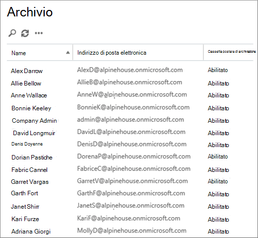
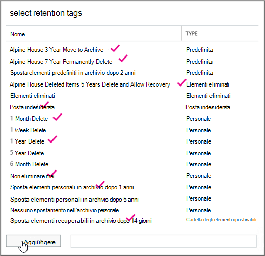

# <a name="set-up-an-archive-and-deletion-policy-for-mailboxes-in-your-organization"></a><span data-ttu-id="374ca-103">Configurare criteri di archiviazione ed eliminazione per le cassette postali in un'organizzazione</span><span class="sxs-lookup"><span data-stu-id="374ca-103">Set up an archive and deletion policy for mailboxes in your organization</span></span>

<span data-ttu-id="374ca-104">In Microsoft 365, gli amministratori possono creare un criterio di archiviazione ed eliminazione che sposta automaticamente gli elementi nella cassetta postale di archiviazione di un utente ed elimina automaticamente gli elementi dalla cassetta postale.</span><span class="sxs-lookup"><span data-stu-id="374ca-104">In Microsoft 365, admins can create an archiving and deletion policy that automatically moves items to a user's archive mailbox and automatically deletes items from the mailbox.</span></span> <span data-ttu-id="374ca-105">L'amministratore esegue questa operazione creando un criterio di conservazione assegnato alle cassette postali e sposta gli elementi nella cassetta postale di archiviazione di un utente dopo un determinato periodo di tempo e che elimina anche gli elementi dalla cassetta postale dopo aver raggiunto un determinato limite di validità.</span><span class="sxs-lookup"><span data-stu-id="374ca-105">The admin does this by creating a retention policy that's assigned to mailboxes, and moves items to a user's archive mailbox after a certain period of time and that also deletes items from the mailbox after they reach a certain age limit.</span></span> <span data-ttu-id="374ca-106">Le regole effettive che determinano quali elementi vengono spostati o eliminati e quando ciò accade sono denominati tag di conservazione.</span><span class="sxs-lookup"><span data-stu-id="374ca-106">The actual rules that determine what items are moved or deleted and when that happens are called retention tags.</span></span> <span data-ttu-id="374ca-107">I tag di conservazione sono collegati a un criterio di conservazione, che a sua volta viene assegnato alla cassetta postale di un utente.</span><span class="sxs-lookup"><span data-stu-id="374ca-107">Retention tags are linked to a retention policy, that in turn is assigned to a user's mailbox.</span></span> <span data-ttu-id="374ca-108">Un tag di conservazione applica le impostazioni di conservazione a singoli messaggi e cartelle nella cassetta postale di un utente.</span><span class="sxs-lookup"><span data-stu-id="374ca-108">A retention tag applies retention settings to individual messages and folders in a user's mailbox.</span></span> <span data-ttu-id="374ca-109">Definisce per quanto tempo un messaggio rimane nella cassetta postale e quale azione viene eseguita quando il messaggio raggiunge il periodo di conservazione specificato.</span><span class="sxs-lookup"><span data-stu-id="374ca-109">It defines how long a message remains in the mailbox and what action is taken when the message reaches the specified retention age.</span></span> <span data-ttu-id="374ca-110">Quando un messaggio raggiunge il periodo di conservazione, viene spostato nella cassetta postale di archiviazione dell'utente o viene eliminato.</span><span class="sxs-lookup"><span data-stu-id="374ca-110">When a message reaches its retention age, it's either moved to the user's archive mailbox or it's deleted.</span></span>
  
<span data-ttu-id="374ca-111">I passaggi descritti in questo articolo configurano un criterio di archiviazione e conservazione per un'organizzazione fittizia denominata Alpine House.</span><span class="sxs-lookup"><span data-stu-id="374ca-111">The steps in this article will set up an archiving and retention policy for a fictitious organization named Alpine House.</span></span> <span data-ttu-id="374ca-112">La configurazione di questo criterio include le attività seguenti:</span><span class="sxs-lookup"><span data-stu-id="374ca-112">Setting up this policy includes the following tasks:</span></span>
  
- <span data-ttu-id="374ca-113">Abilitazione di una cassetta postale di archiviazione per ogni utente dell'organizzazione.</span><span class="sxs-lookup"><span data-stu-id="374ca-113">Enabling an archive mailbox for every user in the organization.</span></span> <span data-ttu-id="374ca-114">In questo modo gli utenti possono aggiungere ulteriore spazio di archiviazione alle cassette postali ed è necessario in modo che un criterio di conservazione possa spostare gli elementi nella cassetta postale di archiviazione.</span><span class="sxs-lookup"><span data-stu-id="374ca-114">This gives users additional mailbox storage, and is required so that a retention policy can move items to the archive mailbox.</span></span> <span data-ttu-id="374ca-115">Consente inoltre a un utente di archiviare le informazioni di archiviazione spostando gli elementi nella cassetta postale di archiviazione.</span><span class="sxs-lookup"><span data-stu-id="374ca-115">It also lets a user store archival information by moving items to their archive mailbox.</span></span>

- <span data-ttu-id="374ca-116">La creazione di tre tag di conservazione personalizzati consente di eseguire le operazioni seguenti:</span><span class="sxs-lookup"><span data-stu-id="374ca-116">Creating three custom retention tags that do the following:</span></span>

  - <span data-ttu-id="374ca-117">Sposta automaticamente gli elementi che hanno 3 anni nella cassetta postale di archiviazione dell'utente.</span><span class="sxs-lookup"><span data-stu-id="374ca-117">Automatically moves items that are 3 years old to the user's archive mailbox.</span></span> <span data-ttu-id="374ca-118">Lo spostamento degli elementi nella cassetta postale di archiviazione libera spazio nella cassetta postale principale di un utente.</span><span class="sxs-lookup"><span data-stu-id="374ca-118">Moving items to the archive mailbox frees up space in a user's primary mailbox.</span></span>

  - <span data-ttu-id="374ca-119">Elimina automaticamente gli elementi che hanno 5 anni dalla cartella Posta eliminata.</span><span class="sxs-lookup"><span data-stu-id="374ca-119">Automatically deletes items that are 5 years old from the Deleted Items folder.</span></span> <span data-ttu-id="374ca-120">Ciò consente inoltre di liberare spazio nella cassetta postale principale dell'utente.</span><span class="sxs-lookup"><span data-stu-id="374ca-120">This also frees up space in the user's primary mailbox.</span></span> <span data-ttu-id="374ca-121">Gli utenti avranno la possibilità di recuperare questi elementi, se necessario.</span><span class="sxs-lookup"><span data-stu-id="374ca-121">User's will have the opportunity to recover these items if necessary.</span></span> <span data-ttu-id="374ca-122">Per ulteriori informazioni, vedere la nota [a](#more-information) piè di pagina nella sezione Ulteriori informazioni.</span><span class="sxs-lookup"><span data-stu-id="374ca-122">See the footnote in the [More information](#more-information) section for more details.</span></span> 

  - <span data-ttu-id="374ca-123">Elimina automaticamente (e definitivamente) gli elementi che hanno 7 anni sia dalla cassetta postale principale che da quella di archiviazione.</span><span class="sxs-lookup"><span data-stu-id="374ca-123">Automatically (and permanently) deletes items that are 7 years old from both the primary and archive mailbox.</span></span> <span data-ttu-id="374ca-124">A causa delle normative di conformità, alcune organizzazioni sono necessarie per conservare la posta elettronica per un determinato periodo di tempo.</span><span class="sxs-lookup"><span data-stu-id="374ca-124">Because of compliance regulations, some organization's are required to retain email for a certain period of time.</span></span> <span data-ttu-id="374ca-125">Dopo la scadenza di questo periodo di tempo, un'organizzazione potrebbe voler rimuovere definitivamente queste cassette postali utente.</span><span class="sxs-lookup"><span data-stu-id="374ca-125">After this time period expires, an organization might want to permanently remove these items user mailboxes.</span></span>

- <span data-ttu-id="374ca-126">Creazione di un nuovo criterio di conservazione e aggiunta dei nuovi tag di conservazione personalizzati.</span><span class="sxs-lookup"><span data-stu-id="374ca-126">Creating a new retention policy and adding the new custom retention tags to it.</span></span> <span data-ttu-id="374ca-127">Verranno inoltre aggiunti tag di conservazione incorporati al nuovo criterio di conservazione.</span><span class="sxs-lookup"><span data-stu-id="374ca-127">Additionally, you'll also add built-in retention tags to the new retention policy.</span></span> <span data-ttu-id="374ca-128">Sono inclusi i tag personali che gli utenti possono assegnare agli elementi nella propria cassetta postale.</span><span class="sxs-lookup"><span data-stu-id="374ca-128">This includes personal tags that users can assign to items in their mailbox.</span></span> <span data-ttu-id="374ca-129">Verrà inoltre aggiunto un tag di conservazione che sposta gli elementi dalla cartella Elementi ripristinabili nella cassetta postale principale dell'utente alla cartella Elementi ripristinabili nella cassetta postale di archiviazione.</span><span class="sxs-lookup"><span data-stu-id="374ca-129">You'll also add a retention tag that moves items from the Recoverable Items folder in the user's primary mailbox to the Recoverable Items folder in their archive mailbox.</span></span> <span data-ttu-id="374ca-130">Ciò consente di liberare spazio nella cartella Elementi ripristinabili di un utente quando la cassetta postale viene messa in attesa.</span><span class="sxs-lookup"><span data-stu-id="374ca-130">This helps free up space in a user's Recoverable Items folder when their mailbox is placed on hold.</span></span>

<span data-ttu-id="374ca-131">È possibile seguire alcuni o tutti i passaggi descritti in questo articolo per configurare un criterio di archiviazione ed eliminazione per le cassette postali nell'organizzazione.</span><span class="sxs-lookup"><span data-stu-id="374ca-131">You can follow some or all of the steps in this article to set up an archive and deletion policy for mailboxes in your own organization.</span></span> <span data-ttu-id="374ca-132">È consigliabile testare questo processo su alcune cassette postali prima di implementarlo in tutte le cassette postali dell'organizzazione.</span><span class="sxs-lookup"><span data-stu-id="374ca-132">We recommend that you test this process on a few mailboxes before implementing it on all mailboxes in your organization.</span></span>
  
## <a name="before-you-set-up-an-archive-and-deletion-policy"></a><span data-ttu-id="374ca-133">Prima di configurare un criterio di archiviazione ed eliminazione</span><span class="sxs-lookup"><span data-stu-id="374ca-133">Before you set up an archive and deletion policy</span></span>

- <span data-ttu-id="374ca-134">Per eseguire i passaggi descritti in questo argomento, è necessario essere un amministratore globale dell'organizzazione.</span><span class="sxs-lookup"><span data-stu-id="374ca-134">You have to be a global administrator in your organization to perform the steps in this topic.</span></span> 

- <span data-ttu-id="374ca-135">Quando si crea un nuovo account utente e si assegna all'utente una Exchange Online, viene creata automaticamente una cassetta postale per l'utente.</span><span class="sxs-lookup"><span data-stu-id="374ca-135">When you create a new user account and assign the user an Exchange Online license, a mailbox is automatically created for the user.</span></span> <span data-ttu-id="374ca-136">Quando la cassetta postale viene creata, viene automaticamente assegnato un criterio di conservazione predefinito, denominato Criterio di gestione dei messaggistica predefinito.</span><span class="sxs-lookup"><span data-stu-id="374ca-136">When the mailbox is created, it's automatically assigned a default retention policy, named Default MRM Policy.</span></span> <span data-ttu-id="374ca-137">In questo articolo verrà creato un nuovo criterio di conservazione e quindi assegnato alle cassette postali degli utenti, sostituendo il criterio gestione messaggistica predefinito.</span><span class="sxs-lookup"><span data-stu-id="374ca-137">In this article, you will create a new retention policy and then assign it to user mailboxes, replacing the Default MRM policy.</span></span> <span data-ttu-id="374ca-138">A una cassetta postale può essere assegnato un solo criterio di conservazione alla volta.</span><span class="sxs-lookup"><span data-stu-id="374ca-138">A mailbox can have only one retention policy assigned to it at any one time.</span></span>

- <span data-ttu-id="374ca-139">Per ulteriori informazioni sui tag di conservazione e sui criteri di conservazione in Exchange Online, vedere [Tag di conservazione e criteri di conservazione.](/exchange/security-and-compliance/messaging-records-management/retention-tags-and-policies)</span><span class="sxs-lookup"><span data-stu-id="374ca-139">To learn more about retention tags and retention policies in Exchange Online, see [Retention tags and retention policies](/exchange/security-and-compliance/messaging-records-management/retention-tags-and-policies).</span></span>

## <a name="step-1-enable-archive-mailboxes-for-users"></a><span data-ttu-id="374ca-140">Passaggio 1: Abilitare le cassette postali di archiviazione per gli utenti</span><span class="sxs-lookup"><span data-stu-id="374ca-140">Step 1: Enable archive mailboxes for users</span></span>

<span data-ttu-id="374ca-141">Il primo passaggio consiste nell'abilitare la cassetta postale di archiviazione per ogni utente dell'organizzazione.</span><span class="sxs-lookup"><span data-stu-id="374ca-141">The first step is to enable the archive mailbox for each user in your organization.</span></span> <span data-ttu-id="374ca-142">La cassetta postale di archiviazione di un utente deve essere abilitata in modo che un tag di conservazione con un'azione di conservazione "Sposta nell'archivio" possa spostare l'elemento dopo la scadenza del periodo di conservazione.</span><span class="sxs-lookup"><span data-stu-id="374ca-142">A user's archive mailbox has to be enabled so that a retention tag with a "Move to Archive" retention action can move the item after the retention age expires.</span></span>
  
> [!NOTE]
> <span data-ttu-id="374ca-143">È possibile abilitare le cassette postali di archiviazione in qualsiasi momento durante questo processo, purché siano abilitate a un certo punto prima di completare il processo.</span><span class="sxs-lookup"><span data-stu-id="374ca-143">You can enable archive mailboxes any time during this process, just as long as they're enabled at some point before you complete the process.</span></span> <span data-ttu-id="374ca-144">Se una cassetta postale di archiviazione non è abilitata, non viene eseguita alcuna azione sugli elementi a cui è assegnato un criterio di archiviazione o eliminazione.</span><span class="sxs-lookup"><span data-stu-id="374ca-144">If an archive mailbox isn't enabled, no action is taken on any items that have an archive or deletion policy assigned to it.</span></span>
  
1. <span data-ttu-id="374ca-145">Passare a [https://protection.office.com](https://protection.office.com).</span><span class="sxs-lookup"><span data-stu-id="374ca-145">Go to [https://protection.office.com](https://protection.office.com).</span></span>

2. <span data-ttu-id="374ca-146">Accedi con l'account amministratore globale.</span><span class="sxs-lookup"><span data-stu-id="374ca-146">Sign in using your global administrator account.</span></span>
    
3. <span data-ttu-id="374ca-147">Nel Centro sicurezza & conformità passare a **Archivio governance** \> **delle informazioni**.</span><span class="sxs-lookup"><span data-stu-id="374ca-147">In the Security & Compliance Center, go to **Information governance** \> **Archive**.</span></span>

    <span data-ttu-id="374ca-148">Viene visualizzato un elenco delle cassette postali nell'organizzazione e se la cassetta postale di archiviazione corrispondente è abilitata o disabilitata.</span><span class="sxs-lookup"><span data-stu-id="374ca-148">A list of the mailboxes in your organization is displayed and whether the corresponding archive mailbox is enabled or disabled.</span></span>

4. <span data-ttu-id="374ca-149">Selezionare tutte le cassette postali facendo clic sulla prima nell'elenco, tenendo premuto **MAIUSC** e quindi facendo clic sull'ultima nell'elenco.</span><span class="sxs-lookup"><span data-stu-id="374ca-149">Select all the mailboxes by clicking on the first one in the list, holding down the **Shift** key, and then clicking the last one in the list.</span></span>

    > [!TIP]
    > <span data-ttu-id="374ca-150">Questo passaggio presuppone che non siano abilitate cassette postali di archiviazione.</span><span class="sxs-lookup"><span data-stu-id="374ca-150">This step assumes that no archive mailboxes are enabled.</span></span> <span data-ttu-id="374ca-151">Se sono presenti cassette postali con l'archivio abilitato, tenere premuto **CTRL** e fare clic su ogni cassetta postale con una cassetta postale di archiviazione disabilitata.</span><span class="sxs-lookup"><span data-stu-id="374ca-151">If you have any mailboxes with the archive enabled, hold down the **Ctrl** key and click each mailbox that has a disabled archive mailbox.</span></span> <span data-ttu-id="374ca-152">Oppure è possibile fare clic **sull'intestazione** della colonna Cassetta postale di archiviazione per ordinare le righe in base al fatto che la cassetta postale di archiviazione sia abilitata o disabilitata per semplificare la selezione delle cassette postali.</span><span class="sxs-lookup"><span data-stu-id="374ca-152">Or you can click the **Archive mailbox** column header to sort the rows based on whether the archive mailbox is enabled or disabled to make it easier to select mailboxes.</span></span>
  
5. <span data-ttu-id="374ca-153">Nel riquadro dei dettagli, in **Modifica in blocco,** fare clic su **Abilita.**</span><span class="sxs-lookup"><span data-stu-id="374ca-153">In the details pane, under **Bulk Edit**, click **Enable**.</span></span>

    <span data-ttu-id="374ca-154">Viene visualizzato un avviso che indica che gli elementi più vecchi di due anni verranno spostati nella nuova cassetta postale di archiviazione.</span><span class="sxs-lookup"><span data-stu-id="374ca-154">A warning is displayed saying that items that are older than two years will be moved to the new archive mailbox.</span></span> <span data-ttu-id="374ca-155">Ciò è dovuto al fatto che il criterio di conservazione predefinito a cui viene assegnata una nuova cassetta postale utente al momento della creazione ha un tag dei criteri predefinito di archiviazione con validità di conservazione di 2 anni.</span><span class="sxs-lookup"><span data-stu-id="374ca-155">This is because the default retention policy that's assigned a new user mailbox when it's created has an archive default policy tag that has a retention age of 2 years.</span></span> <span data-ttu-id="374ca-156">Il tag dei criteri predefiniti di archiviazione personalizzato che verrà creato nel passaggio 2 ha un periodo di conservazione di 3 anni.</span><span class="sxs-lookup"><span data-stu-id="374ca-156">The custom archive default policy tag that you'll create in Step 2 has a retention age of 3 years.</span></span> <span data-ttu-id="374ca-157">Ciò significa che gli elementi di 3 anni o più verranno spostati nella cassetta postale di archiviazione.</span><span class="sxs-lookup"><span data-stu-id="374ca-157">That means items that are 3 years or older will be moved to the archive mailbox.</span></span>

6. <span data-ttu-id="374ca-158">Fare **clic su Sì** per chiudere il messaggio di avviso e avviare il processo per abilitare la cassetta postale di archiviazione per ogni cassetta postale selezionata.</span><span class="sxs-lookup"><span data-stu-id="374ca-158">Click **Yes** to close the warning message and start the process to enable the archive mailbox for each selected mailbox.</span></span>

7. <span data-ttu-id="374ca-159">Al termine del processo, fare clic **su Aggiorna**  l'elenco nella **pagina** Archivio.</span><span class="sxs-lookup"><span data-stu-id="374ca-159">When the process is complete, click **Refresh**  to update the list on the **Archive** page.</span></span>

    <span data-ttu-id="374ca-160">La cassetta postale di archiviazione è abilitata per tutti gli utenti dell'organizzazione.</span><span class="sxs-lookup"><span data-stu-id="374ca-160">The archive mailbox is enabled for all user's in your organization.</span></span>

    

## <a name="step-2-create-new-retention-tags-for-the-archive-and-deletion-policies"></a><span data-ttu-id="374ca-162">Passaggio 2: Creare nuovi tag di conservazione per i criteri di archiviazione ed eliminazione</span><span class="sxs-lookup"><span data-stu-id="374ca-162">Step 2: Create new retention tags for the archive and deletion policies</span></span>

<span data-ttu-id="374ca-163">In questo passaggio verranno creati i tre tag di conservazione personalizzati descritti in precedenza.</span><span class="sxs-lookup"><span data-stu-id="374ca-163">In this step, you'll create the three custom retention tags that were previously described.</span></span>
  
- <span data-ttu-id="374ca-164">Alpine House 3 year Move to Archive (criteri di archiviazione personalizzati)</span><span class="sxs-lookup"><span data-stu-id="374ca-164">Alpine House 3 Year Move to Archive (custom archive policy)</span></span>

- <span data-ttu-id="374ca-165">Alpine House 7 Year Permanently Delete (criteri di eliminazione personalizzati)</span><span class="sxs-lookup"><span data-stu-id="374ca-165">Alpine House 7 Year Permanently Delete (custom deletion policy)</span></span>

- <span data-ttu-id="374ca-166">Alpine House Deleted Items 5 Years Delete and Allow Recovery (tag personalizzato per la cartella Posta eliminata)</span><span class="sxs-lookup"><span data-stu-id="374ca-166">Alpine House Deleted Items 5 Years Delete and Allow Recovery (custom tag for the Deleted Items folder)</span></span>

<span data-ttu-id="374ca-167">Per creare nuovi tag di conservazione, si utilizzerà l'interfaccia di amministrazione di Exchange (EAC) nell'organizzazione Exchange Online locale.</span><span class="sxs-lookup"><span data-stu-id="374ca-167">To create new retention tags, you'll use the Exchange admin center (EAC) in your Exchange Online organization.</span></span> <span data-ttu-id="374ca-168">Assicurarsi di utilizzare la versione classica dell'interfaccia di amministrazione di Exchange.</span><span class="sxs-lookup"><span data-stu-id="374ca-168">Be sure to use the classic version of the EAC.</span></span>
  
1. <span data-ttu-id="374ca-169">Accedere a [https://admin.protection.outlook.com/ecp/](https://admin.protection.outlook.com/ecp/) e accedere utilizzando le credenziali.</span><span class="sxs-lookup"><span data-stu-id="374ca-169">Go to [https://admin.protection.outlook.com/ecp/](https://admin.protection.outlook.com/ecp/) and sign in using your credentials.</span></span>
  
2. <span data-ttu-id="374ca-170">Nell'interfaccia di amministrazione di Exchange, accedere a **Gestione conformità** Tag  >  **di conservazione**</span><span class="sxs-lookup"><span data-stu-id="374ca-170">In the EAC, go to **Compliance management** > **Retention tags**</span></span>

    <span data-ttu-id="374ca-171">Viene visualizzato un elenco dei tag di conservazione per l'organizzazione.</span><span class="sxs-lookup"><span data-stu-id="374ca-171">A list of the retention tags for your organization is displayed.</span></span>

### <a name="create-a-custom-archive-default-policy-tag"></a><span data-ttu-id="374ca-172">Creare un tag dei criteri predefiniti di archiviazione personalizzato</span><span class="sxs-lookup"><span data-stu-id="374ca-172">Create a custom archive default policy tag</span></span>
  
<span data-ttu-id="374ca-173">Innanzitutto, si creerà un tag dei criteri predefiniti di archiviazione personalizzato (DPT) che sposta gli elementi nella cassetta postale di archiviazione dopo 3 anni.</span><span class="sxs-lookup"><span data-stu-id="374ca-173">First, you'll create a custom archive default policy tag (DPT) that will move items to the archive mailbox after 3 years.</span></span>
  
1. <span data-ttu-id="374ca-174">Nella pagina **Tag di conservazione** fare clic su Nuovo **tag** Icona Nuovo e quindi selezionare Applicato  **automaticamente all'intera cassetta postale (impostazione predefinita).**</span><span class="sxs-lookup"><span data-stu-id="374ca-174">On the **Retention tags** page, click **New tag**, and then select **applied automatically to entire mailbox (default)**.</span></span>

2. <span data-ttu-id="374ca-175">Nella pagina **Nuovo tag applicato automaticamente all'intera cassetta postale (impostazione predefinita),** completare i seguenti campi:</span><span class="sxs-lookup"><span data-stu-id="374ca-175">On the **New tag applied automatically to entire mailbox (default)** page, complete the following fields:</span></span> 

    
  
   1. <span data-ttu-id="374ca-177">**Nome** Digitare un nome per il nuovo tag di conservazione.</span><span class="sxs-lookup"><span data-stu-id="374ca-177">**Name** Type a name for the new retention tag.</span></span> 

   2. <span data-ttu-id="374ca-178">**Azione di conservazione** Selezionare **Sposta in archivio per** spostare gli elementi nella cassetta postale di archiviazione alla scadenza del periodo di conservazione.</span><span class="sxs-lookup"><span data-stu-id="374ca-178">**Retention action** Select **Move to Archive** to move items to the archive mailbox when the retention period expires.</span></span>

   3. <span data-ttu-id="374ca-179">**Periodo di conservazione** Selezionare **When the item reaches the following age (in days)** e quindi immettere la durata del periodo di conservazione.</span><span class="sxs-lookup"><span data-stu-id="374ca-179">**Retention period** Select **When the item reaches the following age (in days)**, and then enter the duration of the retention period.</span></span> <span data-ttu-id="374ca-180">Per questo scenario, gli elementi verranno spostati nella cassetta postale di archiviazione dopo 1095 giorni (3 anni).</span><span class="sxs-lookup"><span data-stu-id="374ca-180">For this scenario, items will be moved to the archive mailbox after 1095 days (3 years).</span></span>

   4. <span data-ttu-id="374ca-181">**Commento** (facoltativo) Digitare un commento che spiega lo scopo del tag di conservazione personalizzato.</span><span class="sxs-lookup"><span data-stu-id="374ca-181">**Comment** (Optional) Type a comment that explains the purpose of the custom retention tag.</span></span>

3. <span data-ttu-id="374ca-182">Fare **clic su** Salva per creare il file DPT di archiviazione personalizzato.</span><span class="sxs-lookup"><span data-stu-id="374ca-182">Click **Save** to create the custom archive DPT.</span></span>

    <span data-ttu-id="374ca-183">Il nuovo tag DPT di archiviazione viene visualizzato nell'elenco dei tag di conservazione.</span><span class="sxs-lookup"><span data-stu-id="374ca-183">The new archive DPT is displayed in the list of retention tags.</span></span>

### <a name="create-a-custom-deletion-default-policy-tag"></a><span data-ttu-id="374ca-184">Creare un tag dei criteri predefiniti di eliminazione personalizzato</span><span class="sxs-lookup"><span data-stu-id="374ca-184">Create a custom deletion default policy tag</span></span>
  
<span data-ttu-id="374ca-185">Successivamente, creerai un altro DPT personalizzato, ma questo sarà un criterio di eliminazione che elimina definitivamente gli elementi dopo 7 anni.</span><span class="sxs-lookup"><span data-stu-id="374ca-185">Next, you'll create another custom DPT but this one will be a deletion policy that permanently deletes items after 7 years.</span></span>
  
1. <span data-ttu-id="374ca-186">Nella pagina **Tag di conservazione** fare clic su Nuovo **tag** Icona Nuovo e quindi selezionare Applicato  **automaticamente all'intera cassetta postale (impostazione predefinita).**</span><span class="sxs-lookup"><span data-stu-id="374ca-186">On the **Retention tags** page, click **New tag**, and then select **applied automatically to entire mailbox (default)**.</span></span>

2. <span data-ttu-id="374ca-187">Nella pagina **Nuovo tag applicato automaticamente all'intera cassetta postale (impostazione predefinita),** completare i seguenti campi:</span><span class="sxs-lookup"><span data-stu-id="374ca-187">On the **New tag applied automatically to entire mailbox (default)** page, complete the following fields:</span></span> 

    
  
   1. <span data-ttu-id="374ca-189">**Nome** Digitare un nome per il nuovo tag di conservazione.</span><span class="sxs-lookup"><span data-stu-id="374ca-189">**Name** Type a name for the new retention tag.</span></span> 

   2. <span data-ttu-id="374ca-190">**Azione di conservazione** Selezionare **Elimina definitivamente per** eliminare gli elementi dalla cassetta postale alla scadenza del periodo di conservazione.</span><span class="sxs-lookup"><span data-stu-id="374ca-190">**Retention action** Select **Permanently Delete** to purge items from the mailbox when the retention period expires.</span></span>

   3. <span data-ttu-id="374ca-191">**Periodo di conservazione** Selezionare **When the item reaches the following age (in days)** e quindi immettere la durata del periodo di conservazione.</span><span class="sxs-lookup"><span data-stu-id="374ca-191">**Retention period** Select **When the item reaches the following age (in days)**, and then enter the duration of the retention period.</span></span> <span data-ttu-id="374ca-192">Per questo scenario, gli elementi verranno eliminati dopo 2555 giorni (7 anni).</span><span class="sxs-lookup"><span data-stu-id="374ca-192">For this scenario, items will be purged after 2555 days (7 years).</span></span>

   4. <span data-ttu-id="374ca-193">**Commento** (facoltativo) Digitare un commento che spiega lo scopo del tag di conservazione personalizzato.</span><span class="sxs-lookup"><span data-stu-id="374ca-193">**Comment** (Optional) Type a comment that explains the purpose of the custom retention tag.</span></span> 

3. <span data-ttu-id="374ca-194">Fare **clic su** Salva per creare il file DPT di eliminazione personalizzato.</span><span class="sxs-lookup"><span data-stu-id="374ca-194">Click **Save** to create the custom deletion DPT.</span></span> 

    <span data-ttu-id="374ca-195">Il nuovo tag DPT di eliminazione viene visualizzato nell'elenco dei tag di conservazione.</span><span class="sxs-lookup"><span data-stu-id="374ca-195">The new deletion DPT is displayed in the list of retention tags.</span></span>

### <a name="create-a-custom-retention-policy-tag-for-the-deleted-items-folder"></a><span data-ttu-id="374ca-196">Creare un tag dei criteri di conservazione personalizzato per la cartella Posta eliminata</span><span class="sxs-lookup"><span data-stu-id="374ca-196">Create a custom retention policy tag for the Deleted Items folder</span></span>
  
<span data-ttu-id="374ca-197">L'ultimo tag di conservazione che verrà creato è un tag dei criteri di conservazione personalizzato per la cartella Posta eliminata.</span><span class="sxs-lookup"><span data-stu-id="374ca-197">The last retention tag that you'll create is a custom retention policy tag (RPT) for the Deleted Items folder.</span></span> <span data-ttu-id="374ca-198">Questo tag eliminerà gli elementi nella cartella Posta eliminata dopo 5 anni e fornisce un periodo di ripristino in cui gli utenti possono utilizzare lo strumento Recupera posta eliminata per ripristinare un elemento.</span><span class="sxs-lookup"><span data-stu-id="374ca-198">This tag will delete items in the Deleted Items folder after 5 years, and provides a recovery period when users can use the Recover Deleted Items tool to recover an item.</span></span>
  
1. <span data-ttu-id="374ca-199">Nella pagina **Tag di conservazione** fare clic su Nuovo **tag** Icona Nuovo e quindi selezionare Applicato  **automaticamente a una cartella predefinita.**</span><span class="sxs-lookup"><span data-stu-id="374ca-199">On the **Retention tags** page, click **New tag** , and then select **applied automatically to a default folder**.</span></span>

2. <span data-ttu-id="374ca-200">Nella pagina **Nuovo tag applicato automaticamente a una cartella predefinita,** completare i campi seguenti:</span><span class="sxs-lookup"><span data-stu-id="374ca-200">On the **New tag applied automatically to a default folder** page, complete the following fields:</span></span>

    
  
   1. <span data-ttu-id="374ca-202">**Nome** Digitare un nome per il nuovo tag di conservazione.</span><span class="sxs-lookup"><span data-stu-id="374ca-202">**Name** Type a name for the new retention tag.</span></span> 

   2. <span data-ttu-id="374ca-203">**Applica questo tag alla cartella predefinita seguente** Nell'elenco a discesa selezionare **Posta eliminata**.</span><span class="sxs-lookup"><span data-stu-id="374ca-203">**Apply this tag to the following default folder** In the drop-down list, select **Deleted Items**.</span></span>

   3. <span data-ttu-id="374ca-204">**Azione di conservazione** Selezionare **Elimina e Consenti** ripristino per eliminare gli elementi alla scadenza del periodo di conservazione, ma consentire agli utenti di ripristinare un elemento eliminato entro il periodo di conservazione degli elementi eliminati (che per impostazione predefinita è 14 giorni).</span><span class="sxs-lookup"><span data-stu-id="374ca-204">**Retention action** Select **Delete and Allow Recovery** to delete items when the retention period expires, but allow users to recover a deleted item within the deleted item retention period (which by default is 14 days).</span></span>

   4. <span data-ttu-id="374ca-205">**Periodo di conservazione** Selezionare **When the item reaches the following age (in days)** e quindi immettere la durata del periodo di conservazione.</span><span class="sxs-lookup"><span data-stu-id="374ca-205">**Retention period** Select **When the item reaches the following age (in days)**, and then enter the duration of the retention period.</span></span> <span data-ttu-id="374ca-206">Per questo scenario, gli elementi verranno eliminati dopo 1825 giorni (5 anni).</span><span class="sxs-lookup"><span data-stu-id="374ca-206">For this scenario, items will be deleted after 1825 days (5 years).</span></span>

   5. <span data-ttu-id="374ca-207">**Commento** (facoltativo) Digitare un commento che spiega lo scopo del tag di conservazione personalizzato.</span><span class="sxs-lookup"><span data-stu-id="374ca-207">**Comment** (Optional) Type a comment that explains the purpose of the custom retention tag.</span></span> 

3. <span data-ttu-id="374ca-208">Fare **clic su** Salva per creare il formato RPT personalizzato per la cartella Posta eliminata.</span><span class="sxs-lookup"><span data-stu-id="374ca-208">Click **Save** to create the custom RPT for the Deleted Items folder.</span></span>

    <span data-ttu-id="374ca-209">Il nuovo criterio di conservazione viene visualizzato nell'elenco dei tag di conservazione.</span><span class="sxs-lookup"><span data-stu-id="374ca-209">The new RPT is displayed in the list of retention tags.</span></span>

## <a name="step-3-create-a-new-retention-policy"></a><span data-ttu-id="374ca-210">Passaggio 3: Creare un nuovo criterio di conservazione</span><span class="sxs-lookup"><span data-stu-id="374ca-210">Step 3: Create a new retention policy</span></span>

<span data-ttu-id="374ca-211">Dopo aver creato i tag di conservazione personalizzati, il passaggio successivo consiste nel creare un nuovo criterio di conservazione e aggiungere i tag di conservazione.</span><span class="sxs-lookup"><span data-stu-id="374ca-211">After you create the custom retention tags, the next step is to create a new retention policy and add the retention tags.</span></span> <span data-ttu-id="374ca-212">Verranno aggiunti i tre tag di conservazione personalizzati creati nel passaggio 2 e i tag predefiniti menzionati nella prima sezione.</span><span class="sxs-lookup"><span data-stu-id="374ca-212">You'll add the three custom retention tags that you created in Step 2, and the built-in tags that were mentioned in the first section.</span></span> <span data-ttu-id="374ca-213">Nel passaggio 4, questo nuovo criterio di conservazione verrà assegnato alle cassette postali degli utenti.</span><span class="sxs-lookup"><span data-stu-id="374ca-213">In Step 4, you'll assign this new retention policy to user mailboxes.</span></span>
  
1. <span data-ttu-id="374ca-214">Nell'interfaccia di amministrazione di Exchange, accedere **a Gestione conformità** Criteri di  >  **conservazione**.</span><span class="sxs-lookup"><span data-stu-id="374ca-214">In the EAC, go to **Compliance management** > **Retention policies**.</span></span>

2. <span data-ttu-id="374ca-215">Nella pagina **Criteri di conservazione** fare clic su **Nuova** icona  .</span><span class="sxs-lookup"><span data-stu-id="374ca-215">On the **Retention policies** page, click **New** .</span></span>

3. <span data-ttu-id="374ca-216">Nella casella **Nome** digitare un nome per il nuovo criterio di conservazione. ad esempio, **Alpine House Archive ed Deletion Policy**.</span><span class="sxs-lookup"><span data-stu-id="374ca-216">In the **Name** box, type a name for the new retention policy; for example, **Alpine House Archive and Deletion Policy**.</span></span>

4. <span data-ttu-id="374ca-217">In **Tag di conservazione** fare clic su **Aggiungi** nuovo  icona.</span><span class="sxs-lookup"><span data-stu-id="374ca-217">Under **Retention tags**, click **Add** .</span></span>

    <span data-ttu-id="374ca-218">Viene visualizzato un elenco dei tag di conservazione nell'organizzazione.</span><span class="sxs-lookup"><span data-stu-id="374ca-218">A list of the retention tags in your organization is displayed.</span></span> <span data-ttu-id="374ca-219">Si noti che vengono visualizzati i tag personalizzati creati nel passaggio 2.</span><span class="sxs-lookup"><span data-stu-id="374ca-219">Note the custom tags that you created in Step 2 are displayed.</span></span>

5. <span data-ttu-id="374ca-220">Aggiungi i 9 tag di conservazione evidenziati nello screenshot seguente (questi tag sono descritti in modo più dettagliato nella [sezione Ulteriori](#more-information) informazioni).</span><span class="sxs-lookup"><span data-stu-id="374ca-220">Add the 9 retention tags that are highlighted in the following screenshot (these tags are described in more detail in the [More information](#more-information) section).</span></span> <span data-ttu-id="374ca-221">Per aggiungere un tag di conservazione, selezionarlo e quindi fare clic su **Aggiungi.**</span><span class="sxs-lookup"><span data-stu-id="374ca-221">To add a retention tag, select it and then click **Add**.</span></span>

    
  
    > [!TIP]
    > <span data-ttu-id="374ca-223">È possibile selezionare più tag di conservazione tenendo premuto **CTRL** e quindi facendo clic su ogni tag.</span><span class="sxs-lookup"><span data-stu-id="374ca-223">You can select multiple retention tags by holding down the **Ctrl** key and then clicking each tag.</span></span> 
  
6. <span data-ttu-id="374ca-224">Dopo aver aggiunto i tag di conservazione, fare clic su **OK.**</span><span class="sxs-lookup"><span data-stu-id="374ca-224">After you've added the retention tags, click **OK**.</span></span>

7. <span data-ttu-id="374ca-225">Nella pagina **Nuovo criterio di conservazione** fare clic su **Salva** per creare il nuovo criterio.</span><span class="sxs-lookup"><span data-stu-id="374ca-225">On the **New retention policy** page, click **Save** to create the new policy.</span></span>

    <span data-ttu-id="374ca-226">Il nuovo criterio di conservazione viene visualizzato nell'elenco.</span><span class="sxs-lookup"><span data-stu-id="374ca-226">The new retention policy is displayed in the list.</span></span> <span data-ttu-id="374ca-227">Selezionarlo per visualizzare i tag di conservazione a esso collegati nel riquadro dei dettagli.</span><span class="sxs-lookup"><span data-stu-id="374ca-227">Select it to display the retention tags linked to it in the details pane.</span></span>

    
  
## <a name="step-4-assign-the-new-retention-policy-to-user-mailboxes"></a><span data-ttu-id="374ca-229">Passaggio 4: Assegnare il nuovo criterio di conservazione alle cassette postali degli utenti</span><span class="sxs-lookup"><span data-stu-id="374ca-229">Step 4: Assign the new retention policy to user mailboxes</span></span>

<span data-ttu-id="374ca-230">Quando viene creata una nuova cassetta postale, per impostazione predefinita viene assegnato un criterio di conservazione denominato Criterio di gestione dei messaggistica predefinito.</span><span class="sxs-lookup"><span data-stu-id="374ca-230">When a new mailbox is created, a retention policy named Default MRM policy is assigned to it by default.</span></span> <span data-ttu-id="374ca-231">In questo passaggio, questo criterio di conservazione verrà sostituito (poiché a una cassetta postale può essere assegnato un solo criterio di conservazione) assegnando il nuovo criterio di conservazione creato nel passaggio 3 alle cassette postali degli utenti nell'organizzazione.</span><span class="sxs-lookup"><span data-stu-id="374ca-231">In this step, you'll replace this retention policy (because a mailbox can have only one retention policy assigned to it) by assigning the new retention policy that you created in Step 3 to the user mailboxes in your organization.</span></span> <span data-ttu-id="374ca-232">In questo passaggio si presuppone che il nuovo criterio verrà assegnato a tutte le cassette postali dell'organizzazione.</span><span class="sxs-lookup"><span data-stu-id="374ca-232">This step assumes that you'll assign the new policy to all mailboxes in your organization.</span></span>
  
1. <span data-ttu-id="374ca-233">Nell'interfaccia di amministrazione di Exchange, accedere a **Destinatari**  >  **Cassette postali**.</span><span class="sxs-lookup"><span data-stu-id="374ca-233">In the EAC, go to **Recipients** > **Mailboxes**.</span></span>

    <span data-ttu-id="374ca-234">Viene visualizzato un elenco di tutte le cassette postali utente nell'organizzazione.</span><span class="sxs-lookup"><span data-stu-id="374ca-234">A list of all user mailboxes in your organization is displayed.</span></span>

2. <span data-ttu-id="374ca-235">Selezionare tutte le cassette postali facendo clic sulla prima nell'elenco, tenendo premuto **MAIUSC** e quindi facendo clic sull'ultima nell'elenco.</span><span class="sxs-lookup"><span data-stu-id="374ca-235">Select all the mailboxes by clicking on the first one in the list, holding down the **Shift** key, and then clicking the last one in the list.</span></span> 

3. <span data-ttu-id="374ca-236">Nel riquadro dei dettagli sul lato destro dell'interfaccia di amministrazione di Exchange, in **Modifica in** blocco, fare clic su **Altre opzioni.**</span><span class="sxs-lookup"><span data-stu-id="374ca-236">In the details pane on the right side of the EAC, under **Bulk Edit**, click **More options**.</span></span>

4. <span data-ttu-id="374ca-237">In **Criterio di conservazione**, fare clic su **Aggiorna**.</span><span class="sxs-lookup"><span data-stu-id="374ca-237">Under **Retention Policy**, click **Update**.</span></span>

5. <span data-ttu-id="374ca-238">Nella pagina **Assegnazione in** blocco  dei criteri di conservazione, nell'elenco a discesa Selezionare il criterio di conservazione, selezionare il criterio di conservazione creato nel passaggio 3. ad esempio, **Alpine House Archive e Retention Policy**.</span><span class="sxs-lookup"><span data-stu-id="374ca-238">On the **Bulk assign retention policy** page, in the **Select the retention policy** drop-down list, select the retention policy that you created in Step 3; for example, **Alpine House Archive and Retention Policy**.</span></span>

6. <span data-ttu-id="374ca-239">Fare **clic su Salva** per salvare la nuova assegnazione dei criteri di conservazione.</span><span class="sxs-lookup"><span data-stu-id="374ca-239">Click **Save** to save the new retention policy assignment.</span></span>

7. <span data-ttu-id="374ca-240">Per verificare che il nuovo criterio di conservazione sia stato assegnato alle cassette postali, è possibile eseguire le operazioni seguenti:</span><span class="sxs-lookup"><span data-stu-id="374ca-240">To verify that the new retention policy was assigned to mailboxes, you can do the following:</span></span>

   1. <span data-ttu-id="374ca-241">Selezionare una cassetta postale nella pagina **Cassette** postali e quindi fare clic **su Modifica**  Modifica.</span><span class="sxs-lookup"><span data-stu-id="374ca-241">Select a mailbox on the **Mailboxes** page, and then click **Edit** .</span></span>

   2. <span data-ttu-id="374ca-242">Nella pagina delle proprietà della cassetta postale per l'utente selezionato, fare clic su **Funzionalità cassetta postale**.</span><span class="sxs-lookup"><span data-stu-id="374ca-242">On the mailbox properties page for the selected user, click **Mailbox features**.</span></span>

   <span data-ttu-id="374ca-243">Il nome del nuovo criterio assegnato alla cassetta postale viene visualizzato nell'elenco **a** discesa Criterio di conservazione.</span><span class="sxs-lookup"><span data-stu-id="374ca-243">The name of the new policy assigned to the mailbox is displayed in the **Retention policy** drop-down list.</span></span>

## <a name="optional-step-5-run-the-managed-folder-assistant-to-apply-the-new-settings"></a><span data-ttu-id="374ca-244">(Facoltativo) Passaggio 5: Eseguire l'Assistente cartelle gestite per applicare le nuove impostazioni</span><span class="sxs-lookup"><span data-stu-id="374ca-244">(Optional) Step 5: Run the Managed Folder Assistant to apply the new settings</span></span>

<span data-ttu-id="374ca-245">Dopo aver applicato il nuovo criterio di conservazione alle cassette postali nel passaggio 4, possono essere necessario fino a 7 giorni in Exchange Online per applicare le nuove impostazioni di conservazione alle cassette postali.</span><span class="sxs-lookup"><span data-stu-id="374ca-245">After you apply the new retention policy to mailboxes in Step 4, it can take up to 7 days in Exchange Online for the new retention settings to be applied to the mailboxes.</span></span> <span data-ttu-id="374ca-246">Questo perché un processo denominato *Assistente cartelle gestite* elabora le cassette postali almeno una volta ogni 7 giorni.</span><span class="sxs-lookup"><span data-stu-id="374ca-246">This is because a process called the *Managed Folder Assistant* processes mailboxes at least once every 7 days.</span></span> <span data-ttu-id="374ca-247">Anziché attendere l'esecuzione dell'Assistente cartelle gestite, è possibile forzare l'esecuzione eseguendo il cmdlet **Start-ManagedFolderAssistant** in Exchange Online PowerShell.</span><span class="sxs-lookup"><span data-stu-id="374ca-247">Instead of waiting for the Managed Folder Assistant to run, you can force this to happen by running the **Start-ManagedFolderAssistant** cmdlet in Exchange Online PowerShell.</span></span>

 <span data-ttu-id="374ca-248">**Cosa succede quando si esegue l'Assistente cartelle gestite?**</span><span class="sxs-lookup"><span data-stu-id="374ca-248">**What happens when you run the Managed Folder Assistant?**</span></span> <span data-ttu-id="374ca-249">Applica le impostazioni nel criterio di conservazione esaminando gli elementi nella cassetta postale e determinando se sono soggetti alla conservazione.</span><span class="sxs-lookup"><span data-stu-id="374ca-249">It applies the settings in the retention policy by inspecting items in the mailbox and determining whether they're subject to retention.</span></span> <span data-ttu-id="374ca-250">Vengono quindi contrassegnati gli elementi soggetti alla conservazione con il tag di conservazione appropriato e quindi viene eseguita l'azione di conservazione specificata sugli elementi che hanno passato il periodo di conservazione.</span><span class="sxs-lookup"><span data-stu-id="374ca-250">It then stamps items subject to retention with the appropriate retention tag, and then takes the specified retention action on items past their retention age.</span></span>
  
<span data-ttu-id="374ca-251">Ecco i passaggi per connettersi Exchange Online PowerShell e quindi eseguire l'Assistente cartelle gestite in ogni cassetta postale dell'organizzazione.</span><span class="sxs-lookup"><span data-stu-id="374ca-251">Here are the steps to connect to Exchange Online PowerShell, and then run the Managed Folder Assistant on every mailbox in your organization.</span></span>

1. <span data-ttu-id="374ca-252">[Connettersi a PowerShell per Exchange Online](/powershell/exchange/connect-to-exchange-online-powershell).</span><span class="sxs-lookup"><span data-stu-id="374ca-252">[Connect to Exchange Online PowerShell](/powershell/exchange/connect-to-exchange-online-powershell).</span></span>
  
2. <span data-ttu-id="374ca-253">Eseguire i due comandi seguenti per avviare l'Assistente cartelle gestite per tutte le cassette postali utente dell'organizzazione.</span><span class="sxs-lookup"><span data-stu-id="374ca-253">Run the following two commands to start the Managed Folder Assistant for all user mailboxes in your organization.</span></span>

    ```powershell
    $Mailboxes = Get-Mailbox -ResultSize Unlimited -Filter {RecipientTypeDetails -eq "UserMailbox"}
    ```

    ```powershell
    $Mailboxes.Identity | Start-ManagedFolderAssistant
    ```

<span data-ttu-id="374ca-254">È tutto.</span><span class="sxs-lookup"><span data-stu-id="374ca-254">That's it!</span></span> <span data-ttu-id="374ca-255">Sono stati impostati criteri di archiviazione ed eliminazione per l'organizzazione Alpine House.</span><span class="sxs-lookup"><span data-stu-id="374ca-255">You've set up an archive and deletion policy for the Alpine House organization.</span></span>

> [!NOTE]
> <span data-ttu-id="374ca-256">Come indicato in precedenza, l'Assistente cartelle gestite elabora le cassette postali almeno una volta ogni 7 giorni.</span><span class="sxs-lookup"><span data-stu-id="374ca-256">As previously stated, the Managed Folder Assistant processes mailboxes at least once every 7 days.</span></span> <span data-ttu-id="374ca-257">È quindi possibile che una cassetta postale possa essere elaborata con maggiore frequenza dall'Assistente cartelle gestite.</span><span class="sxs-lookup"><span data-stu-id="374ca-257">So it's possible that a mailbox can be processed by the Managed Folder Assistant more frequently.</span></span> <span data-ttu-id="374ca-258">Inoltre, gli amministratori non possono prevedere la prossima volta che una cassetta postale viene elaborata dall'Assistente cartelle gestite, motivo per cui potrebbe essere necessario eseguirla manualmente.</span><span class="sxs-lookup"><span data-stu-id="374ca-258">Also, admins can't predict the next time a mailbox is processed by the Managed Folder Assistant, which is one reason why you may want to run it manually.</span></span> <span data-ttu-id="374ca-259">Tuttavia, se si desidera impedire temporaneamente all'Assistente cartelle gestite di applicare le nuove impostazioni di conservazione a una cassetta postale, è possibile eseguire il comando per disabilitare temporaneamente l'elaborazione di una cassetta postale da parte dell'Assistente cartelle `Set-Mailbox -ElcProcessingDisabled $true` gestite.</span><span class="sxs-lookup"><span data-stu-id="374ca-259">However, if you want to temporarily prevent the Managed Folder Assistant from applying the new retention settings to a mailbox, you can run the `Set-Mailbox -ElcProcessingDisabled $true` command to temporarily disable the the Managed Folder Assistant from processing a mailbox.</span></span> <span data-ttu-id="374ca-260">Per ri abilitare l'Assistente cartelle gestite per una cassetta postale, eseguire il `Set-Mailbox -ElcProcessingDisabled $false` comando.</span><span class="sxs-lookup"><span data-stu-id="374ca-260">To re-enable the Managed Folder Assistant for a mailbox, run the `Set-Mailbox -ElcProcessingDisabled $false` command.</span></span> <span data-ttu-id="374ca-261">Infine, se un utente della cassetta postale ha un account disabilitato, gli elementi di spostamento non verranno processati per l'azione di archiviazione per tale cassetta postale.</span><span class="sxs-lookup"><span data-stu-id="374ca-261">Finally, if a mailbox user has a disabled account, we will not process the move items to archive action for that mailbox.</span></span>
  
## <a name="optional-step-6-make-the-new-retention-policy-the-default-for-your-organization"></a><span data-ttu-id="374ca-262">(Facoltativo) Passaggio 6: Impostare il nuovo criterio di conservazione come predefinito per l'organizzazione</span><span class="sxs-lookup"><span data-stu-id="374ca-262">(Optional) Step 6: Make the new retention policy the default for your organization</span></span>

<span data-ttu-id="374ca-263">Nel passaggio 4 è necessario assegnare il nuovo criterio di conservazione alle cassette postali esistenti.</span><span class="sxs-lookup"><span data-stu-id="374ca-263">In Step 4, you have to assign the new retention policy to existing mailboxes.</span></span> <span data-ttu-id="374ca-264">È tuttavia possibile configurare Exchange Online in modo che il nuovo criterio di conservazione sia assegnato alle nuove cassette postali create in futuro.</span><span class="sxs-lookup"><span data-stu-id="374ca-264">But you can configure Exchange Online so that the new retention policy is assigned to new mailboxes that are created in the future.</span></span> <span data-ttu-id="374ca-265">A tale scopo, utilizzare Exchange Online PowerShell per aggiornare il piano delle cassette postali predefinito dell'organizzazione.</span><span class="sxs-lookup"><span data-stu-id="374ca-265">You do this by using Exchange Online PowerShell to update your organization's default mailbox plan.</span></span> <span data-ttu-id="374ca-266">Un *piano delle cassette* postali è un modello che configura automaticamente le proprietà sulle nuove cassette postali.</span><span class="sxs-lookup"><span data-stu-id="374ca-266">A *mailbox plan* is a template that automatically configures properties on new mailboxes.</span></span>  <span data-ttu-id="374ca-267">In questo passaggio facoltativo, è possibile sostituire il criterio di conservazione corrente assegnato al piano delle cassette postali (per impostazione predefinita, il criterio di gestione record di messaggistica predefinito) con il criterio di conservazione creato nel passaggio 3.</span><span class="sxs-lookup"><span data-stu-id="374ca-267">In this optional step, you can replace the current retention policy that's assigned to the mailbox plan (by default, the Default MRM Policy) with the retention policy that you created in Step 3.</span></span> <span data-ttu-id="374ca-268">Dopo aver aggiornato il piano delle cassette postali, il nuovo criterio di conservazione verrà assegnato alle nuove cassette postali.</span><span class="sxs-lookup"><span data-stu-id="374ca-268">After you update the mailbox plan, the new retention policy will be assigned to new mailboxes.</span></span>

1. <span data-ttu-id="374ca-269">[Connettersi a PowerShell per Exchange Online](/powershell/exchange/connect-to-exchange-online-powershell).</span><span class="sxs-lookup"><span data-stu-id="374ca-269">[Connect to Exchange Online PowerShell](/powershell/exchange/connect-to-exchange-online-powershell).</span></span>

2. <span data-ttu-id="374ca-270">Eseguire il comando seguente per visualizzare informazioni sui piani delle cassette postali nell'organizzazione.</span><span class="sxs-lookup"><span data-stu-id="374ca-270">Run the following command to display information about the mailbox plans in your organization.</span></span>

    ```powershell
    Get-MailboxPlan | Format-Table DisplayName,RetentionPolicy,IsDefault
    ```

    <span data-ttu-id="374ca-271">Prendere nota del piano della cassetta postale impostato come predefinito.</span><span class="sxs-lookup"><span data-stu-id="374ca-271">Note the mailbox plan that's set as the default.</span></span>

3. <span data-ttu-id="374ca-272">Eseguire il comando seguente per assegnare il nuovo criterio di conservazione creato nel passaggio 3 (ad esempio, **Alpine House Archive e Retention Policy)** al piano delle cassette postali predefinito.</span><span class="sxs-lookup"><span data-stu-id="374ca-272">Run the following command to assign the new retention policy that you created in Step 3 (for example, **Alpine House Archive and Retention Policy**) to the default mailbox plan.</span></span> <span data-ttu-id="374ca-273">In questo esempio si presuppone che il nome del piano delle cassette postali predefinito sia **ExchangeOnlineEnterprise**.</span><span class="sxs-lookup"><span data-stu-id="374ca-273">This example assumes the name of the default mailbox plan is **ExchangeOnlineEnterprise**.</span></span>

    ```powershell
    Set-MailboxPlan "ExchangeOnlineEnterprise" -RetentionPolicy "Alpine House Archive and Retention Policy"
    ```

4. <span data-ttu-id="374ca-274">È possibile eseguire di nuovo il comando nel passaggio 2 per verificare che il criterio di conservazione assegnato al piano della cassetta postale predefinito sia stato modificato.</span><span class="sxs-lookup"><span data-stu-id="374ca-274">You can rerun the command in step 2 to verify that the retention policy assigned to the default mailbox plan was changed.</span></span>

## <a name="more-information"></a><span data-ttu-id="374ca-275">Ulteriori informazioni</span><span class="sxs-lookup"><span data-stu-id="374ca-275">More information</span></span>

- <span data-ttu-id="374ca-276">Come viene calcolato il periodo di conservazione?</span><span class="sxs-lookup"><span data-stu-id="374ca-276">How is retention age calculated?</span></span> <span data-ttu-id="374ca-277">Il periodo di conservazione degli elementi della cassetta postale viene calcolato a partire dalla data di recapito o dalla data di creazione per elementi quali bozze di messaggi non inviati ma creati dall'utente.</span><span class="sxs-lookup"><span data-stu-id="374ca-277">The retention age of mailbox items is calculated from the date of delivery or the date of creation for items such as draft messages that aren't sent but are created by the user.</span></span> <span data-ttu-id="374ca-278">Quando Assistente cartelle gestite elabora gli elementi in una cassetta postale, applica una data di inizio e una data di scadenza a tutti gli elementi con tag di conservazione utilizzando l'azione di conservazione Elimina e consenti ripristino o Elimina definitivamente.</span><span class="sxs-lookup"><span data-stu-id="374ca-278">When the Managed Folder Assistant processes items in a mailbox, it stamps a start date and an expiration date for all items that have retention tags with the Delete and Allow Recovery or Permanently Delete retention action.</span></span> <span data-ttu-id="374ca-279">Gli elementi con un tag di archiviazione vengono contrassegnati con una data di spostamento.</span><span class="sxs-lookup"><span data-stu-id="374ca-279">Items that have an archive tag are stamped with a move date.</span></span> 

- <span data-ttu-id="374ca-280">Nella tabella seguente vengono fornite ulteriori informazioni su ogni tag di conservazione aggiunto al criterio di conservazione personalizzato creato seguendo la procedura descritta in questo argomento.</span><span class="sxs-lookup"><span data-stu-id="374ca-280">The following table provides more information about each retention tag that is added to the custom retention policy that was created by following the steps in this topic.</span></span>

    | <span data-ttu-id="374ca-281">Tag di conservazione</span><span class="sxs-lookup"><span data-stu-id="374ca-281">Retention tag</span></span> | <span data-ttu-id="374ca-282">Scopo di questo tag</span><span class="sxs-lookup"><span data-stu-id="374ca-282">What this tag does</span></span> | <span data-ttu-id="374ca-283">Incorporato o personalizzato?</span><span class="sxs-lookup"><span data-stu-id="374ca-283">Built-in or custom?</span></span> | <span data-ttu-id="374ca-284">Tipo</span><span class="sxs-lookup"><span data-stu-id="374ca-284">Type</span></span> |
    |:-----|:-----|:-----|:-----|
    |<span data-ttu-id="374ca-285">Alpine House 3 anni sposta nell'archivio</span><span class="sxs-lookup"><span data-stu-id="374ca-285">Alpine House 3 Year Move to Archive</span></span>  <br/> |<span data-ttu-id="374ca-286">Sposta gli elementi vecchi di 1095 giorni (3 anni) nella cassetta postale di archiviazione.</span><span class="sxs-lookup"><span data-stu-id="374ca-286">Moves items that are 1095 days (3 years) old to the archive mailbox.</span></span>  <br/> |<span data-ttu-id="374ca-287">Personalizzato (vedere [Passaggio 2: Creare nuovi tag di conservazione per i criteri di archiviazione ed eliminazione)](#step-2-create-new-retention-tags-for-the-archive-and-deletion-policies)</span><span class="sxs-lookup"><span data-stu-id="374ca-287">Custom (See [Step 2: Create new retention tags for the archive and deletion policies](#step-2-create-new-retention-tags-for-the-archive-and-deletion-policies))</span></span>  <br/> |<span data-ttu-id="374ca-288">Tag criterio predefinito (archivio); questo tag viene applicato automaticamente all'intera cassetta postale.</span><span class="sxs-lookup"><span data-stu-id="374ca-288">Default Policy Tag (archive); this tag is automatically applied to the entire mailbox.</span></span>  <br/> |
    |<span data-ttu-id="374ca-289">Alpine House 7 Anni Elimina definitivamente</span><span class="sxs-lookup"><span data-stu-id="374ca-289">Alpine House 7 Year Permanently Delete</span></span>  <br/> |<span data-ttu-id="374ca-290">Elimina definitivamente gli elementi nella cassetta postale principale o nella cassetta postale di archiviazione quando hanno 7 anni.</span><span class="sxs-lookup"><span data-stu-id="374ca-290">Permanently deletes items in the primary mailbox or the archive mailbox when they are 7 years old.</span></span>  <br/> |<span data-ttu-id="374ca-291">Personalizzato (vedere [Passaggio 2: Creare nuovi tag di conservazione per i criteri di archiviazione ed eliminazione)](#step-2-create-new-retention-tags-for-the-archive-and-deletion-policies)</span><span class="sxs-lookup"><span data-stu-id="374ca-291">Custom (See [Step 2: Create new retention tags for the archive and deletion policies](#step-2-create-new-retention-tags-for-the-archive-and-deletion-policies))</span></span>  <br/> |<span data-ttu-id="374ca-292">Tag criterio predefinito (eliminazione); questo tag viene applicato automaticamente all'intera cassetta postale.</span><span class="sxs-lookup"><span data-stu-id="374ca-292">Default Policy Tag (deletion); this tag is automatically applied to the entire mailbox.</span></span>  <br/> |
    |<span data-ttu-id="374ca-293">Alpine House Deleted Items 5 Years Delete and Allow Recovery</span><span class="sxs-lookup"><span data-stu-id="374ca-293">Alpine House Deleted Items 5 Years Delete and Allow Recovery</span></span>  <br/> |<span data-ttu-id="374ca-294">Elimina gli elementi dalla cartella Posta eliminata che hanno 5 anni.</span><span class="sxs-lookup"><span data-stu-id="374ca-294">Deletes items from the Deleted Items folder that are 5 years old.</span></span> <span data-ttu-id="374ca-295">Gli utenti possono ripristinare questi elementi per un massimo di 14 giorni dopo l'eliminazione.<sup>\*</sup></span><span class="sxs-lookup"><span data-stu-id="374ca-295">Users can recover these items for up 14 days after they're deleted.<sup>\*</sup></span></span> <br/> |<span data-ttu-id="374ca-296">Personalizzato (vedere [Passaggio 2: Creare nuovi tag di conservazione per i criteri di archiviazione ed eliminazione)](#step-2-create-new-retention-tags-for-the-archive-and-deletion-policies)</span><span class="sxs-lookup"><span data-stu-id="374ca-296">Custom (See [Step 2: Create new retention tags for the archive and deletion policies](#step-2-create-new-retention-tags-for-the-archive-and-deletion-policies))</span></span>  <br/> |<span data-ttu-id="374ca-297">Tag dei criteri di conservazione (elementi eliminati); questo tag viene applicato automaticamente agli elementi nella cartella Posta eliminata.</span><span class="sxs-lookup"><span data-stu-id="374ca-297">Retention Policy Tag (Deleted Items); this tag is automatically applied to items in the Deleted items folder.</span></span>  <br/> |
    |<span data-ttu-id="374ca-298">Elementi ripristinabili 14 giorni Sposta nell'archivio</span><span class="sxs-lookup"><span data-stu-id="374ca-298">Recoverable Items 14 days Move to Archive</span></span>  <br/> |<span data-ttu-id="374ca-299">Sposta gli elementi presenti nella cartella Elementi ripristinabili per 14 giorni nella cartella Elementi ripristinabili nella cassetta postale di archiviazione.</span><span class="sxs-lookup"><span data-stu-id="374ca-299">Moves items that have been in the Recoverable Items folder for 14 days to the Recoverable Items folder in the archive mailbox.</span></span>  <br/> |<span data-ttu-id="374ca-300">Built-in</span><span class="sxs-lookup"><span data-stu-id="374ca-300">Built-in</span></span>  <br/> |<span data-ttu-id="374ca-301">Tag dei criteri di conservazione (elementi ripristinabili); questo tag viene applicato automaticamente agli elementi nella cartella Elementi ripristinabili.</span><span class="sxs-lookup"><span data-stu-id="374ca-301">Retention Policy Tag (Recoverable Items); this tag is automatically applied to items in the Recoverable Items folder.</span></span>  <br/> |
    |<span data-ttu-id="374ca-302">Posta indesiderata</span><span class="sxs-lookup"><span data-stu-id="374ca-302">Junk Email</span></span>  <br/> |<span data-ttu-id="374ca-303">Elimina definitivamente gli elementi presenti nella cartella Posta indesiderata per 30 giorni.</span><span class="sxs-lookup"><span data-stu-id="374ca-303">Permanently deletes items that have been in the Junk Email folder for 30 days.</span></span> <span data-ttu-id="374ca-304">Gli utenti possono ripristinare questi elementi per un massimo di 14 giorni dopo l'eliminazione.<sup>\*</sup></span><span class="sxs-lookup"><span data-stu-id="374ca-304">Users can recover these items for up 14 days after they're deleted.<sup>\*</sup></span></span> <br/> |<span data-ttu-id="374ca-305">Built-in</span><span class="sxs-lookup"><span data-stu-id="374ca-305">Built-in</span></span>  <br/> |<span data-ttu-id="374ca-306">Tag dei criteri di conservazione (posta indesiderata); questo tag viene applicato automaticamente agli elementi nella cartella Posta indesiderata.</span><span class="sxs-lookup"><span data-stu-id="374ca-306">Retention Policy Tag (Junk Email); this tag is automatically applied to items in Junk Email folder.</span></span>  <br/> |
    |<span data-ttu-id="374ca-307">Elimina dopo 1 mese</span><span class="sxs-lookup"><span data-stu-id="374ca-307">1 Month Delete</span></span>  <br/> |<span data-ttu-id="374ca-308">Elimina definitivamente gli elementi che hanno una data di 30 giorni.</span><span class="sxs-lookup"><span data-stu-id="374ca-308">Permanently deletes items that are 30 days old.</span></span> <span data-ttu-id="374ca-309">Gli utenti possono ripristinare questi elementi per un massimo di 14 giorni dopo l'eliminazione.<sup>\*</sup></span><span class="sxs-lookup"><span data-stu-id="374ca-309">Users can recover these items for up 14 days after they're deleted.<sup>\*</sup></span></span> <br/> |<span data-ttu-id="374ca-310">Built-in</span><span class="sxs-lookup"><span data-stu-id="374ca-310">Built-in</span></span>  <br/> |<span data-ttu-id="374ca-311">Personale; questo tag può essere applicato dagli utenti.</span><span class="sxs-lookup"><span data-stu-id="374ca-311">Personal; this tag can be applied by users.</span></span>  <br/> |
    |<span data-ttu-id="374ca-312">Elimina dopo 1 anno</span><span class="sxs-lookup"><span data-stu-id="374ca-312">1 Year Delete</span></span>  <br/> |<span data-ttu-id="374ca-313">Elimina definitivamente gli elementi vecchi di 365 giorni.</span><span class="sxs-lookup"><span data-stu-id="374ca-313">Permanently deletes items that are 365 days old.</span></span> <span data-ttu-id="374ca-314">Gli utenti possono ripristinare questi elementi per un massimo di 14 giorni dopo l'eliminazione.<sup>\*</sup></span><span class="sxs-lookup"><span data-stu-id="374ca-314">Users can recover these items for up 14 days after they're deleted.<sup>\*</sup></span></span> <br/> |<span data-ttu-id="374ca-315">Built-in</span><span class="sxs-lookup"><span data-stu-id="374ca-315">Built-in</span></span>  <br/> |<span data-ttu-id="374ca-316">Personale; questo tag può essere applicato dagli utenti.</span><span class="sxs-lookup"><span data-stu-id="374ca-316">Personal; this tag can be applied by users.</span></span>  <br/> |
    |<span data-ttu-id="374ca-317">Non eliminare mai</span><span class="sxs-lookup"><span data-stu-id="374ca-317">Never Delete</span></span>  <br/> |<span data-ttu-id="374ca-318">Questo tag impedisce l'eliminazione degli elementi da un criterio di conservazione.</span><span class="sxs-lookup"><span data-stu-id="374ca-318">This tag prevents items from being deleted by a retention policy.</span></span>  <br/> |<span data-ttu-id="374ca-319">Built-in</span><span class="sxs-lookup"><span data-stu-id="374ca-319">Built-in</span></span>  <br/> |<span data-ttu-id="374ca-320">Personale; questo tag può essere applicato dagli utenti.</span><span class="sxs-lookup"><span data-stu-id="374ca-320">Personal; this tag can be applied by users.</span></span>  <br/> |
    |<span data-ttu-id="374ca-321">Sposta elementi personali in archivio dopo 1 anni</span><span class="sxs-lookup"><span data-stu-id="374ca-321">Personal 1 year move to archive</span></span>  <br/> |<span data-ttu-id="374ca-322">Sposta gli elementi nella cassetta postale di archiviazione dopo 1 anno.</span><span class="sxs-lookup"><span data-stu-id="374ca-322">Moves items to the archive mailbox after 1 year.</span></span>  <br/> |<span data-ttu-id="374ca-323">Built-in</span><span class="sxs-lookup"><span data-stu-id="374ca-323">Built-in</span></span>  <br/> |<span data-ttu-id="374ca-324">Personale; questo tag può essere applicato dagli utenti.</span><span class="sxs-lookup"><span data-stu-id="374ca-324">Personal; this tag can be applied by users.</span></span>  <br/> |

    > <span data-ttu-id="374ca-325"><sup>\*</sup>Gli utenti possono utilizzare lo strumento Recupera posta eliminata in Outlook e Outlook sul Web (in precedenza noto come Outlook Web App) per ripristinare un elemento eliminato entro il periodo di conservazione degli elementi eliminati, che per impostazione predefinita è di 14 giorni in Exchange Online.</span><span class="sxs-lookup"><span data-stu-id="374ca-325"><sup>\*</sup> Users can use the Recover Deleted Items tool in Outlook and Outlook on the web (formerly known as Outlook Web App) to recover a deleted item within the deleted item retention period, which by default is 14 days in Exchange Online.</span></span> <span data-ttu-id="374ca-326">Un amministratore può utilizzare Windows PowerShell per aumentare il periodo di conservazione degli elementi eliminati a un massimo di 30 giorni.</span><span class="sxs-lookup"><span data-stu-id="374ca-326">An administrator can use Windows PowerShell to increase the deleted item retention period to a maximum of 30 days.</span></span> <span data-ttu-id="374ca-327">Per ulteriori informazioni, vedere: [Recover deleted items in Outlook for Windows](https://support.office.com/article/49e81f3c-c8f4-4426-a0b9-c0fd751d48ce) e Change the deleted item retention period for a mailbox in [Exchange Online](https://www.microsoft.com/?ref=go)</span><span class="sxs-lookup"><span data-stu-id="374ca-327">For more information, see: [Recover deleted items in Outlook for Windows](https://support.office.com/article/49e81f3c-c8f4-4426-a0b9-c0fd751d48ce) and [Change the deleted item retention period for a mailbox in Exchange Online](https://www.microsoft.com/?ref=go)</span></span>
  
- <span data-ttu-id="374ca-328">L'utilizzo del tag di conservazione Sposta in archivio per **14** giorni degli elementi ripristinabili consente di liberare spazio di archiviazione nella cartella Elementi ripristinabili nella cassetta postale principale dell'utente.</span><span class="sxs-lookup"><span data-stu-id="374ca-328">Using the **Recoverable Items 14 days Move to Archive** retention tag helps free up storage space in the Recoverable Items folder in the user's primary mailbox.</span></span> <span data-ttu-id="374ca-329">Ciò è utile quando la cassetta postale di un utente viene messa in attesa, il che significa che non viene mai eliminata definitivamente la cassetta postale dell'utente.</span><span class="sxs-lookup"><span data-stu-id="374ca-329">This is useful when a user's mailbox is placed on hold, which means nothing is ever permanently deleted the user's mailbox.</span></span> <span data-ttu-id="374ca-330">Senza spostare gli elementi nella cassetta postale di archiviazione, è possibile che la quota di archiviazione per la cartella Elementi ripristinabili nella cassetta postale principale sia raggiunta.</span><span class="sxs-lookup"><span data-stu-id="374ca-330">Without moving items to the archive mailbox, it's possible the storage quota for the Recoverable Items folder in the primary mailbox will be reached.</span></span> <span data-ttu-id="374ca-331">Per ulteriori informazioni su questo e su come evitarlo, vedere [Increase the Recoverable Items quota for mailboxes on hold](./increase-the-recoverable-quota-for-mailboxes-on-hold.md).</span><span class="sxs-lookup"><span data-stu-id="374ca-331">For more information about this and how to avoid it, see [Increase the Recoverable Items quota for mailboxes on hold](./increase-the-recoverable-quota-for-mailboxes-on-hold.md).</span></span>