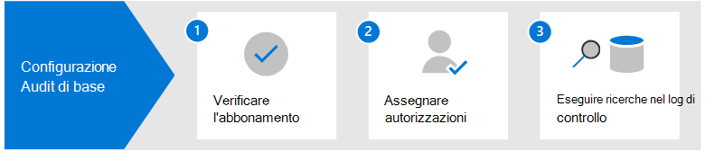

# Configurare il controllo di base in Microsoft 365

Controllo di base in Microsoft 365 consente di cercare i record di controllo per le attività eseguite nei diversi servizi Microsoft 365 da utenti e amministratori. Poiché il controllo di base è abilitato per impostazione predefinita per la maggior parte delle organizzazioni di Microsoft 365 e Office 365, è necessario eseguire alcune operazioni prima che l'utente e gli altri utenti dell'organizzazione possano eseguire ricerche nel log di controllo.

In questo articolo vengono illustrati i passaggi seguenti necessari per configurare Il controllo di base.

Questi passaggi includono la verifica delle sottoscrizioni organizzative appropriate e delle licenze utente necessarie per generare e conservare i record di controllo e l'assegnazione delle autorizzazioni ai membri del team delle operazioni di sicurezza, IT, conformità e team legali in modo da poter eseguire ricerche nel log di controllo.

Per ulteriori informazioni, vedere [Basic Audit in Microsoft 365.](auditing-solutions-overview.md#basic-audit)

## Passaggio 1: verificare la sottoscrizione dell'organizzazione e le licenze utente

Licensing for Basic Audit richiede la sottoscrizione dell'organizzazione appropriata che fornisce l'accesso a strumento di ricerca log di controllo e licenze per utente necessarie per registrare e conservare i record di controllo.

Quando un'attività di controllo viene eseguita da un utente o da un amministratore, viene generato un record di controllo che viene archiviato nel log di controllo per l'organizzazione. In Controllo di base, i record di controllo vengono conservati e ricercabili nel log di controllo per 90 giorni.

Per un elenco dei requisiti di sottoscrizione e di licenza per Il controllo di base, vedere [Auditing solutions in Microsoft 365](auditing-solutions-overview.md#licensing-requirements).

## Passaggio 2: Assegnare le autorizzazioni per la ricerca nel log di controllo

Agli amministratori e ai membri dei team di indagine deve essere assegnato il ruolo View-Only log di controllo o log di controllo in Exchange Online per eseguire ricerche nel log di controllo. Per impostazione predefinita, questi ruoli sono assegnati ai gruppi di ruoli Gestione conformità e Gestione organizzazione nella pagina **Autorizzazioni** nell'Interfaccia di amministrazione di Exchange. Gli amministratori globali in Office 365 e Microsoft 365 vengono aggiunti automaticamente come membri del gruppo di ruoli Gestione organizzazione in Exchange Online. Per consentire a un utente di eseguire ricerche nel log di controllo con il livello minimo di privilegi, è possibile creare un gruppo di ruoli personalizzato in Exchange Online, aggiungere il ruolo relativo ai log di controllo di sola lettura o ai log di controllo e quindi aggiungere l'utente come membro del nuovo gruppo di ruoli. Per altre informazioni, vedere [Gestire i gruppi di ruoli in Exchange Online](/Exchange/permissions-exo/role-groups).

Lo screenshot seguente mostra i due ruoli correlati al controllo assegnati al gruppo di ruoli Gestione organizzazione nell'Exchange di amministrazione.

## Passaggio 3: ricerca nel log di controllo

A questo punto è possibile eseguire una ricerca nel log di controllo nel Centro Microsoft 365 conformità.

1. Accedere a e accedere con un account a <https://compliance.microsoft.com> cui sono state assegnate le autorizzazioni di controllo appropriate.

2. Nel riquadro di spostamento sinistro del centro Microsoft 365 conformità fare clic **su Mostra tutto** e quindi su **Controlla.**

3. Nella pagina **Controllo** configurare la ricerca utilizzando le condizioni seguenti nella **scheda** Ricerca. 

   

   1. **Intervallo di data e ora**. Selezionare un intervallo di date e ore per visualizzare gli eventi che si sono verificati in quel periodo. La data e l'ora vengono visualizzati nel fuso orario locale. Gli ultimi sette giorni sono selezionati per impostazione predefinita.
  
   2. **Attività**. Selezionare le attività da cercare. Utilizzare la casella di ricerca per cercare le attività da aggiungere all'elenco. Per un elenco parziale delle attività verificate, vedere [Audited activities.](search-the-audit-log-in-security-and-compliance.md#audited-activities) Lasciare vuota questa casella per restituire le voci per tutte le attività verificate.
  
   3. **Utenti**.  Fare clic in questa casella e iniziare a digitare il nome degli utenti per cui visualizzare i risultati della ricerca. Le voci del registro di controllo per le attività selezionate eseguite dagli utenti selezionati in questa casella vengono visualizzate nell'elenco dei risultati. Lasciare la casella vuota per restituire le voci per tutti gli utenti (e gli account del servizio) nell'organizzazione.
  
   4. **File, cartella o sito**. Digitare parte o tutto il nome di un file o di una cartella per cercare le attività correlate al file della cartella contenente la parola chiave specificata. È anche possibile specificare un URL di un file o una cartella. Se si utilizza un URL di un file o di una cartella, assicurarsi di digitare il percorso completo dell'URL oppure, se si digita una parte dell'URL, non includere spazi o caratteri speciali. Lasciare questa casella vuota per restituire le voci per tutti i file e le cartelle nell'organizzazione.

4. Fare **clic su** Cerca per eseguire la ricerca.

Viene visualizzata una nuova pagina che mostra che la ricerca nel log di controllo è in esecuzione. Al termine della ricerca, i record di controllo vengono visualizzati nella pagina. Fare clic su un record per visualizzare una pagina a comparsa con proprietà dettagliate.

Per istruzioni più dettagliate, vedere [Search the audit log in the compliance center.](search-the-audit-log-in-security-and-compliance.md)
