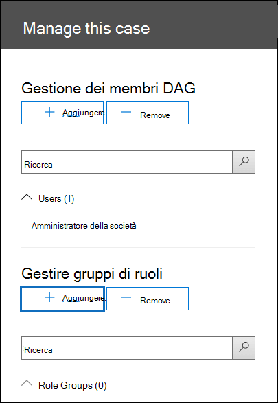

# <a name="set-up-compliance-boundaries-for-ediscovery-investigations"></a>Configurare i limiti di conformità per le indagini di eDiscovery

Le indicazioni contenute in questo articolo possono essere applicate quando si utilizza eDiscovery core o Advanced eDiscovery per gestire le indagini.

I limiti di conformità consentono di creare confini logici all'interno di un'organizzazione che controllano i percorsi dei contenuti degli utenti, ad esempio le cassette postali, gli account OneDrive e i siti di SharePoint. Inoltre, i limiti di conformità controllano chi può accedere ai casi di eDiscovery utilizzati per gestire le indagini legali, umane o di altro tipo all'interno dell'organizzazione. La necessità di limiti di conformità è spesso necessaria per le multinazionali che devono rispettare confini geografici e regolamenti e per i governi, che spesso sono divisi in diverse agenzie. In Microsoft 365, i limiti di conformità consentono di soddisfare questi requisiti quando eseguono ricerche di contenuto e gestiscono indagini con casi di eDiscovery.
  
Nell'esempio riportato di seguito viene illustrato il funzionamento dei limiti di conformità.
  

  
In questo esempio, contoso LTD è un'organizzazione costituita da due consociate, Fourth Coffee e Coho Winery. L'azienda richiede che i gestori e gli investigatori di eDiscovery possano cercare solo le cassette postali di Exchange, gli account di OneDrive e i siti di SharePoint nell'agenzia. Inoltre, i responsabili e gli investigatori di eDiscovery possono vedere solo i casi di eDiscovery nell'agenzia e possono accedere solo ai casi in cui sono membri. Ecco come i limiti di conformità soddisfano questi requisiti.
  
- La funzionalità di filtro delle autorizzazioni di ricerca nella ricerca contenuto controlla i percorsi di contenuto in cui i responsabili e gli investigatori di eDiscovery possono eseguire ricerche. Questo significa che i responsabili e gli investigatori di eDiscovery della Fourth Coffee Agency possono solo ricercare i percorsi dei contenuti nell'affiliata di Fourth Coffee. La stessa restrizione si applica alla filiale di Coho Winery.

    I gruppi di ruoli controllano gli utenti che possono visualizzare i casi di eDiscovery nel centro sicurezza & Compliance. Questo significa che i responsabili e gli investigatori di eDiscovery possono vedere solo i casi di eDiscovery nell'agenzia.

- I gruppi di ruoli consentono anche di controllare chi può assegnare membri a un caso di eDiscovery. Questo significa che i responsabili e gli investigatori di eDiscovery possono solo assegnare i membri ai casi in cui essi stessi sono membri.

Ecco la procedura per configurare i limiti di conformità:
  
[Passaggio 1: identificare un attributo utente per definire le agenzie](#step-1-identify-a-user-attribute-to-define-your-agencies)

[Passaggio 2: presentare una richiesta con il supporto tecnico Microsoft per sincronizzare l'attributo dell'utente con gli account di OneDrive](#step-2-file-a-request-with-microsoft-support-to-synchronize-the-user-attribute-to-onedrive-accounts)

[Passaggio 3: creare un gruppo di ruoli per ogni agenzia](#step-3-create-a-role-group-for-each-agency)

[Passaggio 4: creare un filtro delle autorizzazioni di ricerca per applicare il limite di conformità](#step-4-create-a-search-permissions-filter-to-enforce-the-compliance-boundary)

[Passaggio 5: creare un caso di eDiscovery per indagini intra-Agency](#step-5-create-an-ediscovery-case-for-intra-agency-investigations)

## <a name="before-you-set-up-compliance-boundaries"></a>Prima di configurare i limiti di conformità

È necessario conoscere i prerequisiti seguenti prima che l'attributo Azure Active Directory (Azure AD) che si è in grado di eseguire la sincronizzazione con il passaggio 1 sia stato eseguito correttamente nell'account OneDrive di un utente (nel passaggio 2):

- Agli utenti deve essere assegnata una licenza di Exchange Online e una licenza di SharePoint Online.

- Le cassette postali degli utenti devono avere una dimensione di almeno 10 MB. Se la cassetta postale di un utente è inferiore a 10 MB, l'attributo utilizzato per definire le agenzie non verrà sincronizzato con l'account OneDrive dell'utente.

- I limiti di conformità e gli attributi utilizzati per creare i filtri delle autorizzazioni di ricerca richiedono che gli attributi di Azure Active Directory (Azure AD) siano sincronizzati nelle cassette postali degli utenti. Per verificare che gli attributi che si desidera utilizzare siano stati sincronizzati, eseguire il cmdlet [Get-User](https://docs.microsoft.com/powershell/module/exchange/get-user) in PowerShell di Exchange Online. L'output di questo cmdlet consente di visualizzare gli attributi di Azure AD sincronizzati con Exchange Online.

## <a name="step-1-identify-a-user-attribute-to-define-your-agencies"></a>Passaggio 1: identificare un attributo utente per definire le agenzie

Il primo passaggio consiste nel scegliere un attributo di Azure ad per l'utilizzo che definirà le agenzie. Questo attributo viene utilizzato per creare il filtro delle autorizzazioni di ricerca che limita un Manager di eDiscovery per cercare solo i percorsi di contenuto degli utenti a cui è assegnato un valore specifico per questo attributo. Si supponga, ad esempio, che contoso decida di utilizzare l'attributo **Department** . Il valore di questo attributo per gli utenti nella quarta filiale del caffè dovrebbe essere  `FourthCoffee`  e il valore per gli utenti nella filiale di Coho Winery sarebbe `CohoWinery` . Nel passaggio 4, è possibile utilizzare questa  `attribute:value`  coppia, ad esempio *Department: fourthcoffee*, per limitare i percorsi di contenuto utente che possono essere cercati dai responsabili di eDiscovery. 
  
Ecco un elenco degli attributi degli utenti di Azure AD che è possibile utilizzare per i limiti di conformità:
  
- Company

- CustomAttribute1-CustomAttribute15

- Reparto

- Ufficio

- C (codice paese a due lettere) <sup>*</sup>

  > [!NOTE]
  > <sup>*</sup> Questo attributo viene mappato alla proprietà CountryOrRegion restituita eseguendo il cmdlet **Get-User** in PowerShell di Exchange Online. Il cmdlet restituisce il nome del paese localizzato, che viene convertito dal codice paese a due lettere. Per ulteriori informazioni, vedere la descrizione del parametro CountryOrRegion nell'articolo di riferimento del cmdlet [set-user](https://docs.microsoft.com/powershell/module/exchange/set-user) .

Anche se sono disponibili più attributi degli utenti, in particolare per le cassette postali di Exchange, gli attributi sopra elencati sono gli unici attualmente supportati da OneDrive.
  
## <a name="step-2-file-a-request-with-microsoft-support-to-synchronize-the-user-attribute-to-onedrive-accounts"></a>Passaggio 2: presentare una richiesta con il supporto tecnico Microsoft per sincronizzare l'attributo dell'utente con gli account di OneDrive

Il passaggio successivo consiste nel presentare una richiesta con il supporto tecnico Microsoft per sincronizzare l'attributo di Azure AD che si è scelto nel passaggio 1 per tutti gli account di OneDrive nell'organizzazione. Dopo che si è verificata la sincronizzazione, l'attributo e il relativo valore scelto nel passaggio 1 verranno mappati a una proprietà gestita nascosta denominata `ComplianceAttribute` . Questo attributo viene utilizzato per creare il filtro delle autorizzazioni di ricerca per OneDrive nel passaggio 4.
  
Includere le informazioni seguenti quando si invia la richiesta al supporto tecnico Microsoft:
  
- Il nome di dominio predefinito dell'organizzazione

- Nome dell'attributo di Azure AD (dal passaggio 1)

- Il titolo seguente o la descrizione dello scopo della richiesta di supporto: "abilitare la sincronizzazione di OneDrive for business con Azure AD per i filtri di sicurezza di conformità". Ciò consente di instradare la richiesta al team di progettazione di eDiscovery che implementa la richiesta.

Dopo aver apportato la modifica dell'ingegneria e l'attributo è sincronizzato con OneDrive, il supporto tecnico Microsoft invierà il numero di build in cui è stata apportata la modifica e la data di distribuzione stimata. Il processo di distribuzione richiede solitamente 4 – 6 settimane dopo aver inviato la richiesta di supporto.
  
> [!IMPORTANT]
> È possibile completare il passaggio 3 al passaggio 5 prima della distribuzione di questa modifica dell'attributo. Tuttavia, l'esecuzione di ricerche di contenuto non restituirà documenti dagli account di OneDrive specificati in un filtro delle autorizzazioni di ricerca fino a quando non viene distribuita la sincronizzazione degli attributi.
  
## <a name="step-3-create-a-role-group-for-each-agency"></a>Passaggio 3: creare un gruppo di ruoli per ogni agenzia

Il passaggio successivo consiste nel creare i gruppi di ruoli nel centro sicurezza & Compliance che si allineerà con le agenzie. È consigliabile creare un gruppo di ruoli copiando il gruppo dei responsabili di eDiscovery incorporati, aggiungendo i membri corretti e rimuovendo i ruoli che potrebbero non essere applicabili alle proprie esigenze. Per ulteriori informazioni sui ruoli correlati a eDiscovery, vedere [assign eDiscovery Permissions in the Office 365 Security & Compliance Center](assign-ediscovery-permissions.md).
  
Per creare i gruppi di ruoli, passare alla pagina **autorizzazioni** nel centro sicurezza & conformità e creare un gruppo di ruoli per ogni team in ogni agenzia che utilizzerà i limiti di conformità e i casi di eDiscovery per gestire le indagini. 
  
Utilizzando lo scenario dei limiti di conformità di Contoso, è necessario creare quattro gruppi di ruoli e aggiungere i membri corretti a ognuno di essi.
  
- Fourth Coffee eDiscovery managers

- Ricercatori del Coffee Fourth

- Coho Winery eDiscovery managers

- Ricercatori della cantina di Coho
  
## <a name="step-4-create-a-search-permissions-filter-to-enforce-the-compliance-boundary"></a>Passaggio 4: creare un filtro delle autorizzazioni di ricerca per applicare il limite di conformità

Dopo aver creato i gruppi di ruoli per ogni agenzia, il passaggio successivo consiste nel creare i filtri delle autorizzazioni di ricerca che associano ciascun gruppo di ruoli alla propria agenzia specifica e definisce il limite di conformità stesso. È necessario creare un filtro delle autorizzazioni di ricerca per ogni agenzia. Per ulteriori informazioni sulla creazione di filtri per le autorizzazioni di sicurezza, vedere [Configure Permissions Filtering for content search](permissions-filtering-for-content-search.md).
  
Di seguito viene riportata la sintassi utilizzata per creare un filtro delle autorizzazioni di ricerca utilizzato per i limiti di conformità.

```powershell
New-ComplianceSecurityFilter -FilterName <name of filter> -Users <role groups> -Filters "Mailbox_<ComplianceAttribute>  -eq '<AttributeVale> '", "Site_<ComplianceAttribute>  -eq '<AttributeValue>' -or Site_Path -like '<SharePointURL>*'" -Action <Action >
```

Di seguito è riportato una descrizione di ogni parametro nel comando:
  
- `FilterName`: Specifica il nome del filtro. Utilizzare un nome che descriva o identifichi l'Agenzia in cui viene utilizzato il filtro.

- `Users`: Specifica gli utenti o i gruppi a cui viene applicato il filtro per le azioni di ricerca del contenuto eseguite. Per i limiti di conformità, questo parametro consente di specificare i gruppi di ruoli (creati al passaggio 3) nell'agenzia per la quale si sta creando il filtro. Si tratta di un parametro multivalore in modo che sia possibile includere uno o più gruppi di ruoli, separati da virgole.

- `Filters`: Specifica i criteri di ricerca per il filtro. Per i limiti di conformità, è possibile definire i filtri seguenti. Ognuna si applica a una posizione di contenuto. 

    - `Mailbox`: Specifica le cassette postali che i gruppi di ruoli definiti nel  `Users` parametro possono eseguire una ricerca. Per i limiti di conformità,  *ComplianceAttribute*  è lo stesso attributo identificato nel passaggio 1 e  *AttributeValue*  specifica l'Agenzia. Questo filtro consente ai membri del gruppo di ruolo di eseguire ricerche solo nelle cassette postali di una determinata agenzia. ad esempio, `"Mailbox_Department -eq 'FourthCoffee'"` . 

    - `Site`: Specifica gli account di OneDrive che i gruppi di ruoli definiti nel `Users` parametro possono eseguire la ricerca. Per il filtro OneDrive, utilizzare la stringa Actual  `ComplianceAttribute` . Questo mapping allo stesso attributo che è stato identificato nel passaggio 1 e che è sincronizzato con gli account di OneDrive a causa della richiesta di supporto inviata al passaggio 2. *AttributeValue*  specifica l'Agenzia. Questo filtro consente ai membri del gruppo di ruolo di cercare solo gli account di OneDrive in una determinata agenzia. ad esempio,  `"Site_ComplianceAttribute -eq 'FourthCoffee'"` .

    - `Site_Path`: Specifica i siti di SharePoint che i gruppi di ruoli definiti nel  `Users` parametro possono eseguire una ricerca. *SharePointURL* specifica i siti nell'agenzia che i membri del gruppo di ruoli possono eseguire la ricerca. Ad esempio,  `"Site_Path -like 'https://contoso.sharepoint.com/sites/FourthCoffee*'"`. Si noti `Site` che i `Site_Path` filtri e sono connessi tramite un operatore **or** .

     > [!NOTE]
     > La sintassi per il `Filters` parametro include un *elenco di filtri*. Un elenco di filtri è un filtro che include un filtro per le cassette postali e un filtro sito separato da una virgola. Nell'esempio precedente, si noti che una virgola separa **Mailbox_ComplianceAttribute** e **Site_ComplianceAttribute**: `-Filters "Mailbox_<ComplianceAttribute>  -eq '<AttributeVale> '", "Site_ComplianceAttribute  -eq '<AttributeValue>' -or Site_Path -like '<SharePointURL>*'"` . Quando il filtro viene elaborato durante l'esecuzione di una ricerca di contenuto, vengono creati due filtri per le autorizzazioni di ricerca dall'elenco filtri: un filtro per le cassette postali e un filtro sito. Un'alternativa all'utilizzo di un elenco di filtri consiste nel creare due filtri di autorizzazioni di ricerca distinti per ogni agenzia: un filtro delle autorizzazioni di ricerca per l'attributo della cassetta postale e un filtro per gli attributi del sito. In entrambi i casi, i risultati saranno gli stessi. L'utilizzo di un elenco filtri o la creazione di filtri di autorizzazioni di ricerca distinti è una questione di preferenza.

- `Action`: Specifica il tipo di azione di ricerca di conformità a cui viene applicato il filtro. Ad esempio,  `-Action Search` il filtro verrebbe applicato solo quando i membri del gruppo di ruoli definiti nel `Users` parametro eseguono una ricerca di contenuto. In questo caso, il filtro non verrebbe applicato quando si esportano i risultati della ricerca. Per i limiti di conformità, utilizzare  `-Action All` in modo che il filtro si applichi a tutte le azioni di ricerca. 

    Per un elenco delle azioni di ricerca del contenuto, vedere la sezione "New-ComplianceSecurityFilter" in [Configure Permissions Filtering for content search](permissions-filtering-for-content-search.md#new-compliancesecurityfilter).

Di seguito sono riportati alcuni esempi dei due filtri delle autorizzazioni di ricerca che verrebbero creati per supportare lo scenario dei limiti di conformità di contoso. In entrambi gli esempi è incluso un elenco di filtri separati da virgole, in cui la cassetta postale e i filtri del sito sono inclusi nello stesso filtro delle autorizzazioni di ricerca e sono separati da una virgola.
  
### <a name="fourth-coffee"></a>Fourth Coffee

```powershell
New-ComplianceSecurityFilter -FilterName "Fourth Coffee Security Filter" -Users "Fourth Coffee eDiscovery Managers", "Fourth Coffee Investigators" -Filters "Mailbox_Department -eq 'FourthCoffee'", "Site_ComplianceAttribute -eq 'FourthCoffee' -or Site_Path -like 'https://contoso.sharepoint.com/sites/FourthCoffee*'" -Action ALL
```

### <a name="coho-winery"></a>Azienda vinicola Coho

```powershell
New-ComplianceSecurityFilter -FilterName "Coho Winery Security Filter" -Users "Coho Winery eDiscovery Managers", "Coho Winery Investigators" -Filters "Mailbox_Department -eq 'CohoWinery'", "Site_ComplianceAttribute -eq 'CohoWinery' -or Site_Path -like 'https://contoso.sharepoint.com/sites/CohoWinery*'" -Action ALL
```

## <a name="step-5-create-an-ediscovery-case-for-intra-agency-investigations"></a>Passaggio 5: creare un caso di eDiscovery per le indagini intra-Agency

Il passaggio finale consiste nel creare un caso di eDiscovery nel centro sicurezza & compliance e quindi aggiungere il gruppo di ruoli creato nel passaggio 3 come membro del caso. Questo comporta due importanti caratteristiche dell'utilizzo dei limiti di conformità:
  
- Solo i membri del gruppo di ruoli aggiunti al caso saranno in grado di visualizzare e accedere al caso nel centro sicurezza & conformità. Ad esempio, se il gruppo di ruolo investigatori di Fourth Coffee è l'unico membro di un caso, i membri del gruppo di ruoli Fourth Coffee eDiscovery Managers (o membri di qualsiasi altro gruppo di ruoli) non potranno visualizzare o accedere al caso.

- Quando un membro del gruppo di ruoli assegnato a un caso esegue una ricerca associata al caso, sarà in grado di eseguire la ricerca solo nei percorsi di contenuto all'interno della propria agenzia (definiti dal filtro delle autorizzazioni di ricerca creato nel passaggio 4).

Per creare un caso e assegnare membri:

1. Passare alla pagina **eDiscovery** o **Advanced eDiscovery** nel centro sicurezza & compliance e creare un caso.

2. Nell'elenco dei casi di eDiscovery, fare clic sul nome del caso creato.

3. Nella pagina **Gestisci** il riquadro a comparsa di questo caso, in **Manage role groups**fare clic su  **Aggiungi**.

    
  
4. Nell'elenco dei gruppi di ruoli, selezionare uno dei gruppi di ruoli creati nel passaggio 3, quindi fare clic su **Aggiungi**.

5. Fare clic su **Salva** nel riquadro a comparsa **Gestisci questo caso** per salvare la modifica.

## <a name="searching-and-exporting-content-in-multi-geo-environments"></a>Ricerca ed esportazione di contenuto in ambienti multi-Geo

I filtri per le autorizzazioni di ricerca consentono inoltre di controllare il percorso del contenuto per l'esportazione e il Data Center in cui è possibile eseguire ricerche nei percorsi di contenuto in un [ambiente multi-geografico di SharePoint](https://go.microsoft.com/fwlink/?linkid=860840).
  
- **Esportare i risultati della ricerca:** È possibile esportare i risultati della ricerca da cassette postali di Exchange, siti di SharePoint e account OneDrive da un datacenter specifico. Questo significa che è possibile specificare la posizione del centro dati da cui verranno esportati i risultati della ricerca.

    Utilizzare il parametro **Region** per i cmdlet **New-ComplianceSecurityFilter** o **set-ComplianceSecurityFilter** per creare o modificare il Data Center in cui verrà instradata l'esportazione.
  
    |**Valore del parametro**|**Percorso del datacenter**|
    |:-----|:-----|
    |NAM  <br/> |Nordamericano (i datacenter sono negli Stati Uniti)  <br/> |
    |EUR  <br/> |Europa  <br/> |
    |APC  <br/> |Asia Pacifico  <br/> |
    |CAN <br/> |Canada|
    |||

- **Instradare le ricerche contenuto:** È possibile instradare le ricerche di contenuto dei siti di SharePoint e degli account di OneDrive a un datacenter satellite. Questo significa che è possibile specificare la posizione del centro dati in cui verranno eseguite le ricerche.

    Utilizzare uno dei seguenti valori per il parametro **Region** per controllare la posizione del Data Center in cui verranno eseguite ricerche durante la ricerca di siti di SharePoint e di account OneDrive. 
  
    |**Valore del parametro**|**Percorsi di routing dei datacenter per SharePoint**|
    |:-----|:-----|
    |NAM  <br/> |NOI  <br/> |
    |EUR  <br/> |Europa  <br/> |
    |APC  <br/> |Asia Pacifico  <br/> |
    |CAN  <br/> |NOI  <br/> |
    |AUS  <br/> |Asia Pacifico  <br/> |
    |KOR  <br/> |Data Center predefinito dell'organizzazione  <br/> |
    |GBR  <br/> |Europa  <br/> |
    |JPN  <br/> |Asia Pacifico  <br/> |
    |IND  <br/> |Asia Pacifico  <br/> |
    |LAM  <br/> |NOI  <br/> |
    |||

   Se non si specifica il parametro **Region** per un filtro delle autorizzazioni di ricerca, verrà eseguita la ricerca nell'area di SharePoint principale dell'organizzazione. I risultati della ricerca vengono esportati nel centro dati più vicino.

   Per semplificare il concetto, il parametro **Region** controlla il Data Center utilizzato per la ricerca di contenuto in SharePoint e OneDrive. Questo non si applica alla ricerca di contenuto in Exchange perché le ricerche di contenuto di Exchange non sono associate alla posizione geografica dei datacenter. Inoltre, lo stesso valore del parametro **Region** può anche dettare il Data Center in cui vengono instradate le esportazioni. Questo è spesso necessario per controllare lo spostamento dei dati tra i boarder geografici.

> [!NOTE]
> Se si utilizza Advanced eDiscovery, il parametro **Region** non controlla l'area da cui vengono esportati i dati. I dati vengono esportati dal datacenter principale dell'organizzazione. Inoltre, la ricerca di contenuto in SharePoint e OneDrive non è associata alla posizione geografica dei data center. Viene eseguita la ricerca in tutti i datacenter. Per ulteriori informazioni su Advanced eDiscovery, vedere [Overview of the Advanced eDiscovery Solution in Microsoft 365](overview-ediscovery-20.md).

Di seguito sono riportati alcuni esempi di utilizzo del parametro **Region** quando si creano filtri delle autorizzazioni di ricerca per i limiti di conformità. Ciò presuppone che la quarta filiale del caffè si trovi in Nord America e che Coho Winery sia in Europa. 
  
```powershell
New-ComplianceSecurityFilter -FilterName "Fourth Coffee Security Filter" -Users "Fourth Coffee eDiscovery Managers", "Fourth Coffee Investigators" -Filters "Mailbox_Department -eq 'FourthCoffee'", "Site_Department -eq 'FourthCoffee' -or Site_Path -like 'https://contoso.sharepoint.com/sites/FourthCoffee*'" -Action ALL -Region NAM
```

```powershell
New-ComplianceSecurityFilter -FilterName "Coho Winery Security Filter" -Users "Coho Winery eDiscovery Managers", "Coho Winery Investigators" -Filters "Mailbox_Department -eq 'CohoWinery'", "Site_Department -eq 'CohoWinery' -or Site_Path -like 'https://contoso.sharepoint.com/sites/CohoWinery*'" -Action ALL -Region EUR
```

Quando si esegue la ricerca e l'esportazione di contenuto in ambienti multi-Geo, tenere presente quanto segue.
  
- Il parametro **Area** non controlla le ricerche nelle cassette postali di Exchange. Quando si esegue la ricerca delle cassette postali, verranno ricercati tutti i datacenter. Per limitare l'ambito di ricerca delle cassette postali di Exchange, utilizzare il parametro **Filters** durante la creazione o la modifica di un filtro delle autorizzazioni di ricerca. 

- Se è necessario che un Manager di eDiscovery sia in grado di eseguire ricerche in più aree di SharePoint, è necessario creare un account utente diverso per il responsabile di eDiscovery da utilizzare nel filtro delle autorizzazioni di ricerca per specificare l'area in cui si trovano i siti di SharePoint o gli account di OneDrive. Per ulteriori informazioni sull'impostazione di questo articolo, vedere la sezione "ricerca di contenuto in un ambiente multi-geo di SharePoint" in [Ricerca contenuto](content-search.md#searching-for-content-in-a-sharepoint-multi-geo-environment).

- Quando si esegue una ricerca del contenuto in SharePoint e OneDrive, il parametro **Region** indirizza le ricerche nella posizione principale o via satellite in cui il responsabile di eDiscovery conterrà le indagini di eDiscovery. Se un Manager di eDiscovery cerca i siti di SharePoint e OneDrive all'esterno dell'area specificata nel filtro delle autorizzazioni di ricerca, non vengono restituiti i risultati della ricerca.

- Quando si esportano i risultati della ricerca, il contenuto proveniente da tutti i percorsi di contenuto (compresi Exchange, Skype for business, SharePoint, OneDrive e altri servizi che è possibile cercare tramite lo strumento di ricerca del contenuto) viene caricato nel percorso di archiviazione di Azure nel datacenter specificato dal parametro **Region** . Questo consente alle organizzazioni di rimanere all'interno della conformità, non consentendo l'esportazione di contenuto nei confini controllati. Se nel filtro delle autorizzazioni di ricerca non è specificata alcuna area, il contenuto viene caricato nel centro dati principale dell'organizzazione.

- È possibile modificare un filtro delle autorizzazioni di ricerca esistente per aggiungere o modificare l'area eseguendo il comando riportato di seguito:

    ```powershell
    Set-ComplianceSecurityFilter -FilterName <Filter name>  -Region <Region>
    ```

## <a name="using-compliance-boundaries-for-sharepoint-hub-sites"></a>Utilizzo dei limiti di conformità per i siti hub di SharePoint

I [siti hub di SharePoint](https://docs.microsoft.com/sharepoint/dev/features/hub-site/hub-site-overview) spesso vengono allineati con gli stessi confini geografici o di agenzie che seguono i limiti di conformità eDiscovery. Questo significa che è possibile utilizzare la proprietà ID sito del sito hub per creare un limite di conformità. A tale scopo, utilizzare il cmdlet [Get-SPOHubSite](https://docs.microsoft.com/powershell/module/sharepoint-online/get-spohubsite#examples) in PowerShell di SharePoint Online per ottenere SiteId per il sito hub e quindi utilizzare questo valore per la proprietà Department ID per creare un filtro delle autorizzazioni di ricerca.

Utilizzare la sintassi seguente per creare un filtro delle autorizzazioni di ricerca per un sito hub di SharePoint:

```powershell
New-ComplianceSecurityFilter -FilterName <Filter Name> -Users <User or Group> -Filters "Site_Departmentid -eq '{SiteId of hub site}'" -Action ALL
```

Di seguito è riportato un esempio di creazione di un filtro delle autorizzazioni di ricerca per un sito hub per l'Coho Winery Agency:

```powershell
New-ComplianceSecurityFilter -FilterName "Coho Winery Hub Site Security Filter" -Users "Coho Winery eDiscovery Managers", "Coho Winery Investigators" -Filters "Site_Departmentid -eq '44252d09-62c4-4913-9eb0-a2a8b8d7f863'" -Action ALL
```

## <a name="compliance-boundary-limitations"></a>Limitazioni relative ai limiti di conformità

Quando si gestiscono i casi di eDiscovery e le indagini sull'utilizzo dei limiti di conformità, tenere presente le limitazioni seguenti.
  
- Durante la creazione e l'esecuzione di una ricerca, è possibile selezionare i percorsi di contenuto esterni all'organizzazione. Tuttavia, a causa del filtro delle autorizzazioni di ricerca, il contenuto proveniente da tali posizioni non è incluso nei risultati della ricerca.

- I limiti di conformità non si applicano alle esenzioni nei casi di eDiscovery. Questo significa che un Manager di eDiscovery in un'agenzia può mettere in attesa un utente in un'altra agenzia. Tuttavia, il limite di conformità verrà applicato se eDiscovery Manager cerca i percorsi di contenuto dell'utente che è stato messo in attesa. Questo significa che il responsabile di eDiscovery non è in grado di eseguire ricerche nei percorsi di contenuto dell'utente, anche se è stato in grado di bloccare l'utente.

    Inoltre, le statistiche di esenzione si applicano solo ai percorsi di contenuto nell'agenzia.

- I filtri delle autorizzazioni di ricerca non vengono applicati alle cartelle pubbliche di Exchange.

## <a name="more-information"></a>Altre informazioni

- Se una cassetta postale è deautorizzata o eliminata temporaneamente, gli attributi di Azure AD non vengono più sincronizzati con la cassetta postale. Se un blocco è stato inserito nella cassetta postale quando è stato eliminato, il contenuto conservato nella cassetta postale è ancora soggetto a un limite di conformità o a un filtro delle autorizzazioni di ricerca in base all'ultima sincronizzazione degli attributi di Azure AD prima che la cassetta postale sia stata eliminata. 

    Inoltre, la sincronizzazione tra la cassetta postale e l'account di OneDrive dell'utente cesserà se la cassetta postale è deceduta o eliminata temporaneamente. L'ultimo valore timbrato dell'attributo Compliance per l'account OneDrive rimarrà attivo.

- L'attributo Compliance è sincronizzato dalla cassetta postale di Exchange di un utente al proprio account OneDrive ogni sette giorni. Come indicato in precedenza, questa sincronizzazione si verifica solo quando all'utente è assegnata una licenza di Exchange Online e SharePoint Online e la cassetta postale dell'utente è di almeno 10 MB.

- Se i limiti di conformità e le autorizzazioni di ricerca vengono implementati per la cassetta postale e l'account di OneDrive di un utente, è consigliabile non eliminare la cassetta postale di un utente e non il relativo account di OneDrive. In altre parole, se si elimina la cassetta postale di un utente, è necessario rimuovere anche l'account OneDrive dell'utente.

- Sono presenti situazioni (ad esempio un dipendente che restituisce) in cui un utente può disporre di due o più account OneDrive. In questi casi, solo l'account OneDrive primario associato all'utente in Azure AD verrà sincronizzato.

- I limiti di conformità e i filtri delle autorizzazioni di ricerca dipendono dagli attributi timbrati sul contenuto in Exchange, OneDrive e SharePoint e dalla successiva indicizzazione del contenuto timbrato. 

- Non è consigliabile utilizzare filtri di esclusione (come `-not()` l'utilizzo in un filtro delle autorizzazioni di ricerca) per un limite di conformità basato sul contenuto. L'utilizzo di un filtro di esclusione può avere risultati imprevisti se il contenuto con gli attributi aggiornati di recente non è stato indicizzato. 

## <a name="frequently-asked-questions"></a>Domande frequenti

**Chi può creare e gestire i filtri delle autorizzazioni di ricerca (utilizzando i cmdlet New-ComplianceSecurityFilter e set-ComplianceSecurityFilter)?**
  
Per creare, visualizzare e modificare i filtri delle autorizzazioni di ricerca, è necessario essere membri del gruppo di ruoli Gestione organizzazione nel centro sicurezza & Compliance.
  
**Se un responsabile di eDiscovery viene assegnato a più di un gruppo di ruoli che si estende su più agenzie, in che modo viene eseguita la ricerca del contenuto in un'agenzia o nell'altra?**
  
Il responsabile di eDiscovery può aggiungere parametri alla query di ricerca che limita la ricerca a un'agenzia specifica. Ad esempio, se un'organizzazione ha specificato la proprietà **CustomAttribute10** per distinguere le agenzie, è possibile accodare quanto segue alla query di ricerca per cercare le cassette postali e gli account di OneDrive in una specifica agenzia:  `CustomAttribute10:<value> AND Site_ComplianceAttribute:<value>` .
  
**Cosa succede se il valore dell'attributo utilizzato come attributo di conformità in un filtro delle autorizzazioni di ricerca è cambiato?**
  
Il filtro delle autorizzazioni di ricerca impiega fino a tre giorni per applicare il limite di conformità se il valore dell'attributo utilizzato nel filtro viene modificato. Nello scenario di Contoso, ad esempio, si supponga che un utente del Fourth Coffee Agency venga trasferito all'agenzia di Coho Winery. Di conseguenza, il valore dell'attributo **Department** nell'oggetto User viene modificato da *fourthcoffee* a *cohowinery*. In questa situazione, Fourth Coffee eDiscovery and Investors otterrà i risultati di ricerca per l'utente per un massimo di tre giorni dopo la modifica dell'attributo. Analogamente, sono necessari fino a tre giorni prima che i responsabili e gli investigatori di Coho Winery eDiscovery ottenere risultati di ricerca per l'utente.
  
**È possibile che un Manager di eDiscovery veda contenuto da due limiti di conformità distinti?**
  
Sì, è possibile eseguire questa operazione quando si eseguono ricerche nelle cassette postali di Exchange aggiungendo eDiscovery Manager ai gruppi di ruoli che dispongono di visibilità per entrambe le agenzie. Tuttavia, durante la ricerca di siti di SharePoint e account di OneDrive, un responsabile di eDiscovery può cercare contenuto in limiti di conformità diversi solo se le agenzie si trovano nella stessa area geografica o geografica. **Nota:** Questa limitazione per i siti non è applicabile in Advanced eDiscovery poiché la ricerca di contenuto in SharePoint e OneDrive non è associata per località geografica.
  
**I filtri per le autorizzazioni di ricerca funzionano per il caso eDiscovery, criteri di conservazione Microsoft 365 o DLP?**
  
No, non in questo momento.
  
**Se si specifica un'area geografica in cui controllare il contenuto esportato, ma non si dispone di un'organizzazione di SharePoint in tale area, è comunque possibile eseguire la ricerca di SharePoint?**
  
Se l'area specificata nel filtro delle autorizzazioni di ricerca non esiste nell'organizzazione, verrà eseguita la ricerca nell'area predefinita.
  
**Qual è il numero massimo di filtri per le autorizzazioni di ricerca che è possibile creare in un'organizzazione?**
  
Non esiste alcun limite al numero di filtri per le autorizzazioni di ricerca che è possibile creare in un'organizzazione. Tuttavia, le prestazioni di ricerca avranno un impatto se sono presenti più di 100 filtri delle autorizzazioni di ricerca. Per mantenere il minor numero possibile di filtri per le autorizzazioni di ricerca nell'organizzazione, creare filtri che consentano di combinare le regole per Exchange, SharePoint e OneDrive in un unico filtro delle autorizzazioni di ricerca quando possibile.
