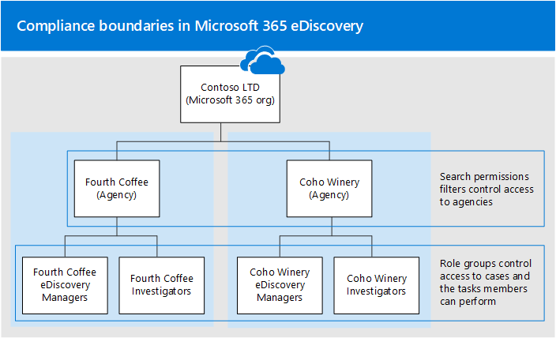

# <a name="set-up-compliance-boundaries-for-ediscovery-investigations"></a><span data-ttu-id="d0770-103">Configurare i limiti di conformità per le indagini di eDiscovery</span><span class="sxs-lookup"><span data-stu-id="d0770-103">Set up compliance boundaries for eDiscovery investigations</span></span>

<span data-ttu-id="d0770-104">Le indicazioni contenute in questo articolo possono essere applicate quando si utilizza eDiscovery core o Advanced eDiscovery per gestire le indagini.</span><span class="sxs-lookup"><span data-stu-id="d0770-104">The guidance in this article can be applied when using either Core eDiscovery or Advanced eDiscovery to manage investigations.</span></span>

<span data-ttu-id="d0770-105">I limiti di conformità consentono di creare confini logici all'interno di un'organizzazione che controllano i percorsi dei contenuti degli utenti, ad esempio le cassette postali, gli account OneDrive e i siti di SharePoint.</span><span class="sxs-lookup"><span data-stu-id="d0770-105">Compliance boundaries create logical boundaries within an organization that control the user content locations (such as mailboxes, OneDrive accounts, and SharePoint sites) that eDiscovery managers can search.</span></span> <span data-ttu-id="d0770-106">Inoltre, i limiti di conformità controllano chi può accedere ai casi di eDiscovery utilizzati per gestire le indagini legali, umane o di altro tipo all'interno dell'organizzazione.</span><span class="sxs-lookup"><span data-stu-id="d0770-106">Also, compliance boundaries control who can access eDiscovery cases used to manage the legal, human resources, or other investigations within your organization.</span></span> <span data-ttu-id="d0770-107">La necessità di limiti di conformità è spesso necessaria per le multinazionali che devono rispettare confini geografici e regolamenti e per i governi, che spesso sono divisi in diverse agenzie.</span><span class="sxs-lookup"><span data-stu-id="d0770-107">The need for compliance boundaries is often necessary for multi-national corporations that have to respect geographical boarders and regulations and for governments, which are often divided into different agencies.</span></span> <span data-ttu-id="d0770-108">In Microsoft 365, i limiti di conformità consentono di soddisfare questi requisiti quando eseguono ricerche di contenuto e gestiscono indagini con casi di eDiscovery.</span><span class="sxs-lookup"><span data-stu-id="d0770-108">In Microsoft 365, compliance boundaries help you meet these requirements when performing content searches and managing investigations with eDiscovery cases.</span></span>
  
<span data-ttu-id="d0770-109">Nell'esempio riportato di seguito viene illustrato il funzionamento dei limiti di conformità.</span><span class="sxs-lookup"><span data-stu-id="d0770-109">We use the example in the following illustration to explain how compliance boundaries work.</span></span>
  

  
<span data-ttu-id="d0770-111">In questo esempio, contoso LTD è un'organizzazione costituita da due consociate, Fourth Coffee e Coho Winery.</span><span class="sxs-lookup"><span data-stu-id="d0770-111">In this example, Contoso LTD is an organization that consists of two subsidiaries, Fourth Coffee and Coho Winery.</span></span> <span data-ttu-id="d0770-112">L'azienda richiede che i gestori e gli investigatori di eDiscovery possano cercare solo le cassette postali di Exchange, gli account di OneDrive e i siti di SharePoint nell'agenzia.</span><span class="sxs-lookup"><span data-stu-id="d0770-112">The business requires that eDiscovery mangers and investigators can only search the Exchange mailboxes, OneDrive accounts, and SharePoint sites in their agency.</span></span> <span data-ttu-id="d0770-113">Inoltre, i responsabili e gli investigatori di eDiscovery possono vedere solo i casi di eDiscovery nell'agenzia e possono accedere solo ai casi in cui sono membri.</span><span class="sxs-lookup"><span data-stu-id="d0770-113">Also, eDiscovery managers and investigators can only see eDiscovery cases in their agency, and they can only access the cases that they're a member of.</span></span> <span data-ttu-id="d0770-114">Ecco come i limiti di conformità soddisfano questi requisiti.</span><span class="sxs-lookup"><span data-stu-id="d0770-114">Here's how compliance boundaries meet these requirements.</span></span>
  
- <span data-ttu-id="d0770-115">La funzionalità di filtro delle autorizzazioni di ricerca nella ricerca contenuto controlla i percorsi di contenuto in cui i responsabili e gli investigatori di eDiscovery possono eseguire ricerche.</span><span class="sxs-lookup"><span data-stu-id="d0770-115">The search permissions filtering functionality in Content Search controls the content locations that eDiscovery managers and investigators can search.</span></span> <span data-ttu-id="d0770-116">Questo significa che i responsabili e gli investigatori di eDiscovery della Fourth Coffee Agency possono solo ricercare i percorsi dei contenuti nell'affiliata di Fourth Coffee.</span><span class="sxs-lookup"><span data-stu-id="d0770-116">This means eDiscovery managers and investigators in the Fourth Coffee agency can only search content locations in the Fourth Coffee subsidiary.</span></span> <span data-ttu-id="d0770-117">La stessa restrizione si applica alla filiale di Coho Winery.</span><span class="sxs-lookup"><span data-stu-id="d0770-117">The same restriction applies to the Coho Winery subsidiary.</span></span>

    <span data-ttu-id="d0770-118">I gruppi di ruoli controllano gli utenti che possono visualizzare i casi di eDiscovery nel centro sicurezza & Compliance.</span><span class="sxs-lookup"><span data-stu-id="d0770-118">Role groups control who can see the eDiscovery cases in the Security & Compliance Center.</span></span> <span data-ttu-id="d0770-119">Questo significa che i responsabili e gli investigatori di eDiscovery possono vedere solo i casi di eDiscovery nell'agenzia.</span><span class="sxs-lookup"><span data-stu-id="d0770-119">This means that eDiscovery managers and investigators can only see the eDiscovery cases in their agency.</span></span>

- <span data-ttu-id="d0770-120">I gruppi di ruoli consentono anche di controllare chi può assegnare membri a un caso di eDiscovery.</span><span class="sxs-lookup"><span data-stu-id="d0770-120">Role groups also control who can assign members to an eDiscovery case.</span></span> <span data-ttu-id="d0770-121">Questo significa che i responsabili e gli investigatori di eDiscovery possono solo assegnare i membri ai casi in cui essi stessi sono membri.</span><span class="sxs-lookup"><span data-stu-id="d0770-121">This means eDiscovery managers and investigators can only assign members to cases that they themselves are a member of.</span></span>

<span data-ttu-id="d0770-122">Ecco la procedura per configurare i limiti di conformità:</span><span class="sxs-lookup"><span data-stu-id="d0770-122">Here's the process for setting up compliance boundaries:</span></span>
  
[<span data-ttu-id="d0770-123">Passaggio 1: identificare un attributo utente per definire le agenzie</span><span class="sxs-lookup"><span data-stu-id="d0770-123">Step 1: Identify a user attribute to define your agencies</span></span>](#step-1-identify-a-user-attribute-to-define-your-agencies)

[<span data-ttu-id="d0770-124">Passaggio 2: presentare una richiesta con il supporto tecnico Microsoft per sincronizzare l'attributo dell'utente con gli account di OneDrive</span><span class="sxs-lookup"><span data-stu-id="d0770-124">Step 2: File a request with Microsoft Support to synchronize the user attribute to OneDrive accounts</span></span>](#step-2-file-a-request-with-microsoft-support-to-synchronize-the-user-attribute-to-onedrive-accounts)

[<span data-ttu-id="d0770-125">Passaggio 3: creare un gruppo di ruoli per ogni agenzia</span><span class="sxs-lookup"><span data-stu-id="d0770-125">Step 3: Create a role group for each agency</span></span>](#step-3-create-a-role-group-for-each-agency)

[<span data-ttu-id="d0770-126">Passaggio 4: creare un filtro delle autorizzazioni di ricerca per applicare il limite di conformità</span><span class="sxs-lookup"><span data-stu-id="d0770-126">Step 4: Create a search permissions filter to enforce the compliance boundary</span></span>](#step-4-create-a-search-permissions-filter-to-enforce-the-compliance-boundary)

[<span data-ttu-id="d0770-127">Passaggio 5: creare un caso di eDiscovery per indagini intra-Agency</span><span class="sxs-lookup"><span data-stu-id="d0770-127">Step 5: Create an eDiscovery case for an intra-agency investigations</span></span>](#step-5-create-an-ediscovery-case-for-intra-agency-investigations)

## <a name="before-you-set-up-compliance-boundaries"></a><span data-ttu-id="d0770-128">Prima di configurare i limiti di conformità</span><span class="sxs-lookup"><span data-stu-id="d0770-128">Before you set up compliance boundaries</span></span>

<span data-ttu-id="d0770-129">È necessario conoscere i prerequisiti seguenti prima che l'attributo Azure Active Directory (Azure AD) che si è in grado di eseguire la sincronizzazione con il passaggio 1 sia stato eseguito correttamente nell'account OneDrive di un utente (nel passaggio 2):</span><span class="sxs-lookup"><span data-stu-id="d0770-129">You have to meet the following prerequisites before the Azure Active Directory (Azure AD) attribute that you identity (in Step 1) can be successfully synched to a user's OneDrive account (in Step 2):</span></span>

- <span data-ttu-id="d0770-130">Agli utenti deve essere assegnata una licenza di Exchange Online e una licenza di SharePoint Online.</span><span class="sxs-lookup"><span data-stu-id="d0770-130">Users must be assigned an Exchange Online license and a SharePoint Online license.</span></span>

- <span data-ttu-id="d0770-131">Le cassette postali degli utenti devono avere una dimensione di almeno 10 MB.</span><span class="sxs-lookup"><span data-stu-id="d0770-131">User mailboxes must be at least 10 MB in size.</span></span> <span data-ttu-id="d0770-132">Se la cassetta postale di un utente è inferiore a 10 MB, l'attributo utilizzato per definire le agenzie non verrà sincronizzato con l'account OneDrive dell'utente.</span><span class="sxs-lookup"><span data-stu-id="d0770-132">If a user's mailbox is less than 10 MB, the attribute used to define your agencies won't be synched to the user's OneDrive account.</span></span>

- <span data-ttu-id="d0770-133">I limiti di conformità e gli attributi utilizzati per creare i filtri delle autorizzazioni di ricerca richiedono che gli attributi di Azure Active Directory (Azure AD) siano sincronizzati nelle cassette postali degli utenti.</span><span class="sxs-lookup"><span data-stu-id="d0770-133">Compliance boundaries and the attributes used to create search permissions filters require that Azure Active Directory (Azure AD) attributes are synchronized to user mailboxes.</span></span> <span data-ttu-id="d0770-134">Per verificare che gli attributi che si desidera utilizzare siano stati sincronizzati, eseguire il cmdlet [Get-User](https://docs.microsoft.com/powershell/module/exchange/get-user) in PowerShell di Exchange Online.</span><span class="sxs-lookup"><span data-stu-id="d0770-134">To verify that the attributes that you want to use have been synchronized, run the [Get-User](https://docs.microsoft.com/powershell/module/exchange/get-user) cmdlet in Exchange Online PowerShell.</span></span> <span data-ttu-id="d0770-135">L'output di questo cmdlet consente di visualizzare gli attributi di Azure AD sincronizzati con Exchange Online.</span><span class="sxs-lookup"><span data-stu-id="d0770-135">The output of this cmdlet displays the Azure AD attributes synchronized to Exchange Online.</span></span>

## <a name="step-1-identify-a-user-attribute-to-define-your-agencies"></a><span data-ttu-id="d0770-136">Passaggio 1: identificare un attributo utente per definire le agenzie</span><span class="sxs-lookup"><span data-stu-id="d0770-136">Step 1: Identify a user attribute to define your agencies</span></span>

<span data-ttu-id="d0770-137">Il primo passaggio consiste nel scegliere un attributo di Azure ad per l'utilizzo che definirà le agenzie.</span><span class="sxs-lookup"><span data-stu-id="d0770-137">The first step is to choose an Azure AD attribute to use that will define your agencies.</span></span> <span data-ttu-id="d0770-138">Questo attributo viene utilizzato per creare il filtro delle autorizzazioni di ricerca che limita un Manager di eDiscovery per cercare solo i percorsi di contenuto degli utenti a cui è assegnato un valore specifico per questo attributo.</span><span class="sxs-lookup"><span data-stu-id="d0770-138">This attribute is used to create the search permissions filter that limits an eDiscovery manager to search only the content locations of users who are assigned a specific value for this attribute.</span></span> <span data-ttu-id="d0770-139">Si supponga, ad esempio, che contoso decida di utilizzare l'attributo **Department** .</span><span class="sxs-lookup"><span data-stu-id="d0770-139">For example, let's say Contoso decides to use the **Department** attribute.</span></span> <span data-ttu-id="d0770-140">Il valore di questo attributo per gli utenti nella quarta filiale del caffè dovrebbe essere  `FourthCoffee`  e il valore per gli utenti nella filiale di Coho Winery sarebbe `CohoWinery` .</span><span class="sxs-lookup"><span data-stu-id="d0770-140">The value for this attribute for users in the Fourth Coffee subsidiary would be  `FourthCoffee`  and the value for users in Coho Winery subsidiary would be `CohoWinery`.</span></span> <span data-ttu-id="d0770-141">Nel passaggio 4, è possibile utilizzare questa  `attribute:value`  coppia, ad esempio *Department: fourthcoffee*, per limitare i percorsi di contenuto utente che possono essere cercati dai responsabili di eDiscovery.</span><span class="sxs-lookup"><span data-stu-id="d0770-141">In Step 4, you use this  `attribute:value`  pair (for example, *Department:FourthCoffee*) to limit the user content locations that eDiscovery managers can search.</span></span> 
  
<span data-ttu-id="d0770-142">Ecco un elenco degli attributi degli utenti di Azure AD che è possibile utilizzare per i limiti di conformità:</span><span class="sxs-lookup"><span data-stu-id="d0770-142">Here's a list of Azure AD user attributes that you can use for compliance boundaries:</span></span>
  
- <span data-ttu-id="d0770-143">Company</span><span class="sxs-lookup"><span data-stu-id="d0770-143">Company</span></span>

- <span data-ttu-id="d0770-144">CustomAttribute1-CustomAttribute15</span><span class="sxs-lookup"><span data-stu-id="d0770-144">CustomAttribute1 - CustomAttribute15</span></span>

- <span data-ttu-id="d0770-145">Reparto</span><span class="sxs-lookup"><span data-stu-id="d0770-145">Department</span></span>

- <span data-ttu-id="d0770-146">Ufficio</span><span class="sxs-lookup"><span data-stu-id="d0770-146">Office</span></span>

- <span data-ttu-id="d0770-147">C (codice paese a due lettere) <sup>\*</sup></span><span class="sxs-lookup"><span data-stu-id="d0770-147">C (Two-letter country code) <sup>\*</sup></span></span>

  > [!NOTE]
  > <span data-ttu-id="d0770-148"><sup>\*</sup> Questo attributo viene mappato alla proprietà CountryOrRegion restituita eseguendo il cmdlet **Get-User** in PowerShell di Exchange Online.</span><span class="sxs-lookup"><span data-stu-id="d0770-148"><sup>\*</sup> This attribute maps to the CountryOrRegion property that is returned by running the **Get-User** cmdlet in Exchange Online PowerShell.</span></span> <span data-ttu-id="d0770-149">Il cmdlet restituisce il nome del paese localizzato, che viene convertito dal codice paese a due lettere.</span><span class="sxs-lookup"><span data-stu-id="d0770-149">The cmdlet returns the localized country name, which is translated from the two-letter country code.</span></span> <span data-ttu-id="d0770-150">Per ulteriori informazioni, vedere la descrizione del parametro CountryOrRegion nell'articolo di riferimento del cmdlet [set-user](https://docs.microsoft.com/powershell/module/exchange/set-user) .</span><span class="sxs-lookup"><span data-stu-id="d0770-150">For more information, see the CountryOrRegion parameter description in the [Set-User](https://docs.microsoft.com/powershell/module/exchange/set-user) cmdlet reference article.</span></span>

<span data-ttu-id="d0770-151">Anche se sono disponibili più attributi degli utenti, in particolare per le cassette postali di Exchange, gli attributi sopra elencati sono gli unici attualmente supportati da OneDrive.</span><span class="sxs-lookup"><span data-stu-id="d0770-151">Although more user attributes are available, particularly for Exchange mailboxes, the attributes listed above are the only ones currently supported by OneDrive.</span></span>
  
## <a name="step-2-file-a-request-with-microsoft-support-to-synchronize-the-user-attribute-to-onedrive-accounts"></a><span data-ttu-id="d0770-152">Passaggio 2: presentare una richiesta con il supporto tecnico Microsoft per sincronizzare l'attributo dell'utente con gli account di OneDrive</span><span class="sxs-lookup"><span data-stu-id="d0770-152">Step 2: File a request with Microsoft Support to synchronize the user attribute to OneDrive accounts</span></span>

<span data-ttu-id="d0770-153">Il passaggio successivo consiste nel presentare una richiesta con il supporto tecnico Microsoft per sincronizzare l'attributo di Azure AD che si è scelto nel passaggio 1 per tutti gli account di OneDrive nell'organizzazione.</span><span class="sxs-lookup"><span data-stu-id="d0770-153">The next step is to file a request with Microsoft Support to synchronize the Azure AD attribute that you chose in Step 1 to all OneDrive accounts in your organization.</span></span> <span data-ttu-id="d0770-154">Dopo che si è verificata la sincronizzazione, l'attributo e il relativo valore scelto nel passaggio 1 verranno mappati a una proprietà gestita nascosta denominata `ComplianceAttribute` .</span><span class="sxs-lookup"><span data-stu-id="d0770-154">After this synchronization occurs, the attribute (and its value) that you chose in Step 1 will be mapped to a hidden managed property named `ComplianceAttribute`.</span></span> <span data-ttu-id="d0770-155">Questo attributo viene utilizzato per creare il filtro delle autorizzazioni di ricerca per OneDrive nel passaggio 4.</span><span class="sxs-lookup"><span data-stu-id="d0770-155">You use this attribute to create the search permissions filter for OneDrive in Step 4.</span></span>
  
<span data-ttu-id="d0770-156">Includere le informazioni seguenti quando si invia la richiesta al supporto tecnico Microsoft:</span><span class="sxs-lookup"><span data-stu-id="d0770-156">Include the following information when you submit the request to Microsoft support:</span></span>
  
- <span data-ttu-id="d0770-157">Il nome di dominio predefinito dell'organizzazione</span><span class="sxs-lookup"><span data-stu-id="d0770-157">The default domain name of your organization</span></span>

- <span data-ttu-id="d0770-158">Nome dell'attributo di Azure AD (dal passaggio 1)</span><span class="sxs-lookup"><span data-stu-id="d0770-158">The name of the Azure AD attribute (from Step 1)</span></span>

- <span data-ttu-id="d0770-159">Il titolo seguente o la descrizione dello scopo della richiesta di supporto: "abilitare la sincronizzazione di OneDrive for business con Azure AD per i filtri di sicurezza di conformità".</span><span class="sxs-lookup"><span data-stu-id="d0770-159">The following title or description of the purpose of the support request: "Enable OneDrive for Business Synchronization with Azure AD for Compliance Security Filters".</span></span> <span data-ttu-id="d0770-160">Ciò consente di instradare la richiesta al team di progettazione di eDiscovery che implementa la richiesta.</span><span class="sxs-lookup"><span data-stu-id="d0770-160">This helps route the request to the eDiscovery engineering team who implements the request.</span></span>

<span data-ttu-id="d0770-161">Dopo aver apportato la modifica dell'ingegneria e l'attributo è sincronizzato con OneDrive, il supporto tecnico Microsoft invierà il numero di build in cui è stata apportata la modifica e la data di distribuzione stimata.</span><span class="sxs-lookup"><span data-stu-id="d0770-161">After the engineering change is made and the attribute is synchronized to OneDrive, Microsoft Support will send you the build number that the change was made in and an estimated deployment date.</span></span> <span data-ttu-id="d0770-162">Il processo di distribuzione richiede solitamente 4 – 6 settimane dopo aver inviato la richiesta di supporto.</span><span class="sxs-lookup"><span data-stu-id="d0770-162">The deployment process usually takes 4–6 weeks after you submit the support request.</span></span>
  
> [!IMPORTANT]
> <span data-ttu-id="d0770-163">È possibile completare il passaggio 3 al passaggio 5 prima della distribuzione di questa modifica dell'attributo.</span><span class="sxs-lookup"><span data-stu-id="d0770-163">You can complete Step 3 through Step 5 before this attribute change is deployed.</span></span> <span data-ttu-id="d0770-164">Tuttavia, l'esecuzione di ricerche di contenuto non restituirà documenti dagli account di OneDrive specificati in un filtro delle autorizzazioni di ricerca fino a quando non viene distribuita la sincronizzazione degli attributi.</span><span class="sxs-lookup"><span data-stu-id="d0770-164">But running content searches won't return documents from OneDrive accounts that are specified in a search permissions filter until after the attribute synch is deployed.</span></span>
  
## <a name="step-3-create-a-role-group-for-each-agency"></a><span data-ttu-id="d0770-165">Passaggio 3: creare un gruppo di ruoli per ogni agenzia</span><span class="sxs-lookup"><span data-stu-id="d0770-165">Step 3: Create a role group for each agency</span></span>

<span data-ttu-id="d0770-166">Il passaggio successivo consiste nel creare i gruppi di ruoli nel centro sicurezza & Compliance che si allineerà con le agenzie.</span><span class="sxs-lookup"><span data-stu-id="d0770-166">The next step is to create the role groups in the Security & Compliance Center that will align with your agencies.</span></span> <span data-ttu-id="d0770-167">È consigliabile creare un gruppo di ruoli copiando il gruppo dei responsabili di eDiscovery incorporati, aggiungendo i membri corretti e rimuovendo i ruoli che potrebbero non essere applicabili alle proprie esigenze.</span><span class="sxs-lookup"><span data-stu-id="d0770-167">We recommend that you create a role group by copying the built-in eDiscovery Managers group, adding the appropriate members, and removing roles that may not be applicable to your needs.</span></span> <span data-ttu-id="d0770-168">Per ulteriori informazioni sui ruoli correlati a eDiscovery, vedere [assign eDiscovery Permissions in the Office 365 Security & Compliance Center](assign-ediscovery-permissions.md).</span><span class="sxs-lookup"><span data-stu-id="d0770-168">For more information about eDiscovery-related roles, see [Assign eDiscovery permissions in the Office‍ 365 Security & Compliance Center](assign-ediscovery-permissions.md).</span></span>
  
<span data-ttu-id="d0770-169">Per creare i gruppi di ruoli, passare alla pagina **autorizzazioni** nel centro sicurezza & conformità e creare un gruppo di ruoli per ogni team in ogni agenzia che utilizzerà i limiti di conformità e i casi di eDiscovery per gestire le indagini.</span><span class="sxs-lookup"><span data-stu-id="d0770-169">To create the role groups, go to the **Permissions** page in the Security & Compliance Center and create a role group for each team in each agency that will use compliance boundaries and eDiscovery cases to manage investigations.</span></span> 
  
<span data-ttu-id="d0770-170">Utilizzando lo scenario dei limiti di conformità di Contoso, è necessario creare quattro gruppi di ruoli e aggiungere i membri corretti a ognuno di essi.</span><span class="sxs-lookup"><span data-stu-id="d0770-170">Using the Contoso compliance boundaries scenario, four role groups need to be created and the appropriate members added to each one.</span></span>
  
- <span data-ttu-id="d0770-171">Fourth Coffee eDiscovery managers</span><span class="sxs-lookup"><span data-stu-id="d0770-171">Fourth Coffee eDiscovery Managers</span></span>

- <span data-ttu-id="d0770-172">Ricercatori del Coffee Fourth</span><span class="sxs-lookup"><span data-stu-id="d0770-172">Fourth Coffee Investigators</span></span>

- <span data-ttu-id="d0770-173">Coho Winery eDiscovery managers</span><span class="sxs-lookup"><span data-stu-id="d0770-173">Coho Winery eDiscovery Managers</span></span>

- <span data-ttu-id="d0770-174">Ricercatori della cantina di Coho</span><span class="sxs-lookup"><span data-stu-id="d0770-174">Coho Winery Investigators</span></span>
  
## <a name="step-4-create-a-search-permissions-filter-to-enforce-the-compliance-boundary"></a><span data-ttu-id="d0770-175">Passaggio 4: creare un filtro delle autorizzazioni di ricerca per applicare il limite di conformità</span><span class="sxs-lookup"><span data-stu-id="d0770-175">Step 4: Create a search permissions filter to enforce the compliance boundary</span></span>

<span data-ttu-id="d0770-176">Dopo aver creato i gruppi di ruoli per ogni agenzia, il passaggio successivo consiste nel creare i filtri delle autorizzazioni di ricerca che associano ciascun gruppo di ruoli alla propria agenzia specifica e definisce il limite di conformità stesso.</span><span class="sxs-lookup"><span data-stu-id="d0770-176">After you've created role groups for each agency, the next step is to create the search permissions filters that associate each role group to its specific agency and defines the compliance boundary itself.</span></span> <span data-ttu-id="d0770-177">È necessario creare un filtro delle autorizzazioni di ricerca per ogni agenzia.</span><span class="sxs-lookup"><span data-stu-id="d0770-177">You need to create one search permissions filter for each agency.</span></span> <span data-ttu-id="d0770-178">Per ulteriori informazioni sulla creazione di filtri per le autorizzazioni di sicurezza, vedere [Configure Permissions Filtering for content search](permissions-filtering-for-content-search.md).</span><span class="sxs-lookup"><span data-stu-id="d0770-178">For more information about creating security permissions filters, see [Configure permissions filtering for Content Search](permissions-filtering-for-content-search.md).</span></span>
  
<span data-ttu-id="d0770-179">Di seguito viene riportata la sintassi utilizzata per creare un filtro delle autorizzazioni di ricerca utilizzato per i limiti di conformità.</span><span class="sxs-lookup"><span data-stu-id="d0770-179">Here's the syntax that's used to create a search permissions filter used for compliance boundaries.</span></span>

```powershell
New-ComplianceSecurityFilter -FilterName <name of filter> -Users <role groups> -Filters "Mailbox_<ComplianceAttribute>  -eq '<AttributeVale> '", "Site_<ComplianceAttribute>  -eq '<AttributeValue>' -or Site_Path -like '<SharePointURL>*'" -Action <Action >
```

<span data-ttu-id="d0770-180">Di seguito è riportato una descrizione di ogni parametro nel comando:</span><span class="sxs-lookup"><span data-stu-id="d0770-180">Here's a description of each parameter in the command:</span></span>
  
- <span data-ttu-id="d0770-181">`FilterName`: Specifica il nome del filtro.</span><span class="sxs-lookup"><span data-stu-id="d0770-181">`FilterName`: Specifies the name of the filter.</span></span> <span data-ttu-id="d0770-182">Utilizzare un nome che descriva o identifichi l'Agenzia in cui viene utilizzato il filtro.</span><span class="sxs-lookup"><span data-stu-id="d0770-182">Use a name that describes or identifies the agency that the filter is used in.</span></span>

- <span data-ttu-id="d0770-183">`Users`: Specifica gli utenti o i gruppi a cui viene applicato il filtro per le azioni di ricerca del contenuto eseguite.</span><span class="sxs-lookup"><span data-stu-id="d0770-183">`Users`: Specifies the users or groups who get this filter applied to the Content Search actions they perform.</span></span> <span data-ttu-id="d0770-184">Per i limiti di conformità, questo parametro consente di specificare i gruppi di ruoli (creati al passaggio 3) nell'agenzia per la quale si sta creando il filtro.</span><span class="sxs-lookup"><span data-stu-id="d0770-184">For compliance boundaries, this parameter specifies the role groups (that you created in Step 3) in the agency that you're creating the filter for.</span></span> <span data-ttu-id="d0770-185">Si tratta di un parametro multivalore in modo che sia possibile includere uno o più gruppi di ruoli, separati da virgole.</span><span class="sxs-lookup"><span data-stu-id="d0770-185">Note this is a multi-value parameter so you can include one or more role groups, separated by commas.</span></span>

- <span data-ttu-id="d0770-186">`Filters`: Specifica i criteri di ricerca per il filtro.</span><span class="sxs-lookup"><span data-stu-id="d0770-186">`Filters`: Specifies the search criteria for the filter.</span></span> <span data-ttu-id="d0770-187">Per i limiti di conformità, è possibile definire i filtri seguenti.</span><span class="sxs-lookup"><span data-stu-id="d0770-187">For the compliance boundaries, you define the following filters.</span></span> <span data-ttu-id="d0770-188">Ognuna si applica a una posizione di contenuto.</span><span class="sxs-lookup"><span data-stu-id="d0770-188">Each one applies to a content location.</span></span> 

    - <span data-ttu-id="d0770-189">`Mailbox`: Specifica le cassette postali che i gruppi di ruoli definiti nel  `Users` parametro possono eseguire una ricerca.</span><span class="sxs-lookup"><span data-stu-id="d0770-189">`Mailbox`: Specifies the mailboxes that the role groups defined in the  `Users` parameter can search.</span></span> <span data-ttu-id="d0770-190">Per i limiti di conformità,  *ComplianceAttribute*  è lo stesso attributo identificato nel passaggio 1 e  *AttributeValue*  specifica l'Agenzia.</span><span class="sxs-lookup"><span data-stu-id="d0770-190">For compliance boundaries,  *ComplianceAttribute*  is the same attribute that you identified in Step 1 and  *AttributeValue*  specifies the agency.</span></span> <span data-ttu-id="d0770-191">Questo filtro consente ai membri del gruppo di ruolo di eseguire ricerche solo nelle cassette postali di una determinata agenzia. ad esempio, `"Mailbox_Department -eq 'FourthCoffee'"` .</span><span class="sxs-lookup"><span data-stu-id="d0770-191">This filter allows members of the role group to search only the mailboxes in a specific agency; for example, `"Mailbox_Department -eq 'FourthCoffee'"`.</span></span> 

    - <span data-ttu-id="d0770-192">`Site`: Specifica gli account di OneDrive che i gruppi di ruoli definiti nel `Users` parametro possono eseguire la ricerca.</span><span class="sxs-lookup"><span data-stu-id="d0770-192">`Site`: Specifies the OneDrive accounts that the role groups defined in the `Users` parameter can search.</span></span> <span data-ttu-id="d0770-193">Per il filtro OneDrive, utilizzare la stringa Actual  `ComplianceAttribute` .</span><span class="sxs-lookup"><span data-stu-id="d0770-193">For the OneDrive filter, use the actual string  `ComplianceAttribute`.</span></span> <span data-ttu-id="d0770-194">Questo mapping allo stesso attributo che è stato identificato nel passaggio 1 e che è sincronizzato con gli account di OneDrive a causa della richiesta di supporto inviata al passaggio 2. *AttributeValue*  specifica l'Agenzia.</span><span class="sxs-lookup"><span data-stu-id="d0770-194">This maps to the same attribute that you identified in Step 1 and that's synchronized to OneDrive accounts as a result of the support request that you submitted in Step 2; *AttributeValue*  specifies the agency.</span></span> <span data-ttu-id="d0770-195">Questo filtro consente ai membri del gruppo di ruolo di cercare solo gli account di OneDrive in una determinata agenzia. ad esempio,  `"Site_ComplianceAttribute -eq 'FourthCoffee'"` .</span><span class="sxs-lookup"><span data-stu-id="d0770-195">This filter allows members of the role group to search only the OneDrive accounts in a specific agency; for example,  `"Site_ComplianceAttribute -eq 'FourthCoffee'"`.</span></span>

    - <span data-ttu-id="d0770-196">`Site_Path`: Specifica i siti di SharePoint che i gruppi di ruoli definiti nel  `Users` parametro possono eseguire una ricerca.</span><span class="sxs-lookup"><span data-stu-id="d0770-196">`Site_Path`: Specifies the SharePoint sites that the role groups defined in the  `Users` parameter can search.</span></span> <span data-ttu-id="d0770-197">*SharePointURL* specifica i siti nell'agenzia che i membri del gruppo di ruoli possono eseguire la ricerca.</span><span class="sxs-lookup"><span data-stu-id="d0770-197">The  *SharePointURL*  specifies the sites in the agency that members of the role group can search.</span></span> <span data-ttu-id="d0770-198">Ad esempio,  `"Site_Path -like 'https://contoso.sharepoint.com/sites/FourthCoffee*'"`.</span><span class="sxs-lookup"><span data-stu-id="d0770-198">For example,  `"Site_Path -like 'https://contoso.sharepoint.com/sites/FourthCoffee*'"`.</span></span> <span data-ttu-id="d0770-199">Si noti `Site` che i `Site_Path` filtri e sono connessi tramite un operatore **or** .</span><span class="sxs-lookup"><span data-stu-id="d0770-199">Notice the `Site` and `Site_Path` filters are connected by an **-or** operator.</span></span>

     > [!NOTE]
     > <span data-ttu-id="d0770-200">La sintassi per il `Filters` parametro include un *elenco di filtri*.</span><span class="sxs-lookup"><span data-stu-id="d0770-200">The syntax for the `Filters` parameter includes a *filters list*.</span></span> <span data-ttu-id="d0770-201">Un elenco di filtri è un filtro che include un filtro per le cassette postali e un filtro sito separato da una virgola.</span><span class="sxs-lookup"><span data-stu-id="d0770-201">A filters list is a filter that includes a mailbox filter and a site filter separated by a comma.</span></span> <span data-ttu-id="d0770-202">Nell'esempio precedente, si noti che una virgola separa **Mailbox_ComplianceAttribute** e **Site_ComplianceAttribute**: `-Filters "Mailbox_<ComplianceAttribute>  -eq '<AttributeVale> '", "Site_ComplianceAttribute  -eq '<AttributeValue>' -or Site_Path -like '<SharePointURL>*'"` .</span><span class="sxs-lookup"><span data-stu-id="d0770-202">In the previous example, notice that a comma separates **Mailbox_ComplianceAttribute** and **Site_ComplianceAttribute**: `-Filters "Mailbox_<ComplianceAttribute>  -eq '<AttributeVale> '", "Site_ComplianceAttribute  -eq '<AttributeValue>' -or Site_Path -like '<SharePointURL>*'"`.</span></span> <span data-ttu-id="d0770-203">Quando il filtro viene elaborato durante l'esecuzione di una ricerca di contenuto, vengono creati due filtri per le autorizzazioni di ricerca dall'elenco filtri: un filtro per le cassette postali e un filtro sito.</span><span class="sxs-lookup"><span data-stu-id="d0770-203">When this filter is processed during the running of a content search, two search permissions filters are created from the filters list: one mailbox filter and one site filter.</span></span> <span data-ttu-id="d0770-204">Un'alternativa all'utilizzo di un elenco di filtri consiste nel creare due filtri di autorizzazioni di ricerca distinti per ogni agenzia: un filtro delle autorizzazioni di ricerca per l'attributo della cassetta postale e un filtro per gli attributi del sito.</span><span class="sxs-lookup"><span data-stu-id="d0770-204">An alternative to using a filters list would be to create two separate search permissions filters for each agency: one search permissions filter for the mailbox attribute and one filter for the site attributes.</span></span> <span data-ttu-id="d0770-205">In entrambi i casi, i risultati saranno gli stessi.</span><span class="sxs-lookup"><span data-stu-id="d0770-205">In either case, the results will be the same.</span></span> <span data-ttu-id="d0770-206">L'utilizzo di un elenco filtri o la creazione di filtri di autorizzazioni di ricerca distinti è una questione di preferenza.</span><span class="sxs-lookup"><span data-stu-id="d0770-206">Using a filters list or creating separate search permissions filters is a matter of preference.</span></span>

- <span data-ttu-id="d0770-207">`Action`: Specifica il tipo di azione di ricerca di conformità a cui viene applicato il filtro.</span><span class="sxs-lookup"><span data-stu-id="d0770-207">`Action`: Specifies the type of Compliance Search action that the filter is applied to.</span></span> <span data-ttu-id="d0770-208">Ad esempio,  `-Action Search` il filtro verrebbe applicato solo quando i membri del gruppo di ruoli definiti nel `Users` parametro eseguono una ricerca di contenuto.</span><span class="sxs-lookup"><span data-stu-id="d0770-208">For example,  `-Action Search` would only apply the filter when members of the role group defined in the `Users` parameter run a content search.</span></span> <span data-ttu-id="d0770-209">In questo caso, il filtro non verrebbe applicato quando si esportano i risultati della ricerca.</span><span class="sxs-lookup"><span data-stu-id="d0770-209">In this case, the filter wouldn't be applied when exporting search results.</span></span> <span data-ttu-id="d0770-210">Per i limiti di conformità, utilizzare  `-Action All` in modo che il filtro si applichi a tutte le azioni di ricerca.</span><span class="sxs-lookup"><span data-stu-id="d0770-210">For compliance boundaries, use  `-Action All` so the filter applies to all search actions.</span></span> 

    <span data-ttu-id="d0770-211">Per un elenco delle azioni di ricerca del contenuto, vedere la sezione "New-ComplianceSecurityFilter" in [Configure Permissions Filtering for content search](permissions-filtering-for-content-search.md#new-compliancesecurityfilter).</span><span class="sxs-lookup"><span data-stu-id="d0770-211">For a list of the Content Search actions, see the "New-ComplianceSecurityFilter" section in [Configure permissions filtering for Content Search](permissions-filtering-for-content-search.md#new-compliancesecurityfilter).</span></span>

<span data-ttu-id="d0770-212">Di seguito sono riportati alcuni esempi dei due filtri delle autorizzazioni di ricerca che verrebbero creati per supportare lo scenario dei limiti di conformità di contoso.</span><span class="sxs-lookup"><span data-stu-id="d0770-212">Here are examples of the two search permissions filters that would be created to support the Contoso compliance boundaries scenario.</span></span> <span data-ttu-id="d0770-213">In entrambi gli esempi è incluso un elenco di filtri separati da virgole, in cui la cassetta postale e i filtri del sito sono inclusi nello stesso filtro delle autorizzazioni di ricerca e sono separati da una virgola.</span><span class="sxs-lookup"><span data-stu-id="d0770-213">Both of these examples include a comma-separated filters list, in which the mailbox and site filters are included in the same search permissions filter and are separated by a comma.</span></span>
  
### <a name="fourth-coffee"></a><span data-ttu-id="d0770-214">Fourth Coffee</span><span class="sxs-lookup"><span data-stu-id="d0770-214">Fourth Coffee</span></span>

```powershell
New-ComplianceSecurityFilter -FilterName "Fourth Coffee Security Filter" -Users "Fourth Coffee eDiscovery Managers", "Fourth Coffee Investigators" -Filters "Mailbox_Department -eq 'FourthCoffee'", "Site_ComplianceAttribute -eq 'FourthCoffee' -or Site_Path -like 'https://contoso.sharepoint.com/sites/FourthCoffee*'" -Action ALL
```

### <a name="coho-winery"></a><span data-ttu-id="d0770-215">Azienda vinicola Coho</span><span class="sxs-lookup"><span data-stu-id="d0770-215">Coho Winery</span></span>

```powershell
New-ComplianceSecurityFilter -FilterName "Coho Winery Security Filter" -Users "Coho Winery eDiscovery Managers", "Coho Winery Investigators" -Filters "Mailbox_Department -eq 'CohoWinery'", "Site_ComplianceAttribute -eq 'CohoWinery' -or Site_Path -like 'https://contoso.sharepoint.com/sites/CohoWinery*'" -Action ALL
```

## <a name="step-5-create-an-ediscovery-case-for-intra-agency-investigations"></a><span data-ttu-id="d0770-216">Passaggio 5: creare un caso di eDiscovery per le indagini intra-Agency</span><span class="sxs-lookup"><span data-stu-id="d0770-216">Step 5: Create an eDiscovery case for intra-agency investigations</span></span>

<span data-ttu-id="d0770-217">Il passaggio finale consiste nel creare un caso di eDiscovery nel centro sicurezza & compliance e quindi aggiungere il gruppo di ruoli creato nel passaggio 3 come membro del caso.</span><span class="sxs-lookup"><span data-stu-id="d0770-217">The final step is to create a eDiscovery case in the Security & Compliance Center and then add the role group that you created in Step 3 as a member of the case.</span></span> <span data-ttu-id="d0770-218">Questo comporta due importanti caratteristiche dell'utilizzo dei limiti di conformità:</span><span class="sxs-lookup"><span data-stu-id="d0770-218">This results in two important characteristics of using compliance boundaries:</span></span>
  
- <span data-ttu-id="d0770-219">Solo i membri del gruppo di ruoli aggiunti al caso saranno in grado di visualizzare e accedere al caso nel centro sicurezza & conformità.</span><span class="sxs-lookup"><span data-stu-id="d0770-219">Only members of the role group added to the case will be able to see and access the case in the Security & Compliance Center.</span></span> <span data-ttu-id="d0770-220">Ad esempio, se il gruppo di ruolo investigatori di Fourth Coffee è l'unico membro di un caso, i membri del gruppo di ruoli Fourth Coffee eDiscovery Managers (o membri di qualsiasi altro gruppo di ruoli) non potranno visualizzare o accedere al caso.</span><span class="sxs-lookup"><span data-stu-id="d0770-220">For example, if the Fourth Coffee Investigators role group is the only member of a case, then members of the Fourth Coffee eDiscovery Managers role group (or members of any other role group) won't be able to see or access the case.</span></span>

- <span data-ttu-id="d0770-221">Quando un membro del gruppo di ruoli assegnato a un caso esegue una ricerca associata al caso, sarà in grado di eseguire la ricerca solo nei percorsi di contenuto all'interno della propria agenzia (definiti dal filtro delle autorizzazioni di ricerca creato nel passaggio 4).</span><span class="sxs-lookup"><span data-stu-id="d0770-221">When a member of the role group assigned to a case runs a search associated with the case, they will only be able to search the content locations within their agency (which is defined by the search permissions filter that you created in Step 4.)</span></span>

<span data-ttu-id="d0770-222">Per creare un caso e assegnare membri:</span><span class="sxs-lookup"><span data-stu-id="d0770-222">To create a case and assign members:</span></span>

1. <span data-ttu-id="d0770-223">Passare alla pagina **eDiscovery** o **Advanced eDiscovery** nel centro sicurezza & compliance e creare un caso.</span><span class="sxs-lookup"><span data-stu-id="d0770-223">Go to the **eDiscovery** or **Advanced eDiscovery** page in the Security & Compliance Center and create a case.</span></span>

2. <span data-ttu-id="d0770-224">Nell'elenco dei casi di eDiscovery, fare clic sul nome del caso creato.</span><span class="sxs-lookup"><span data-stu-id="d0770-224">In the list of eDiscovery cases, click the name of the case you created.</span></span>

3. <span data-ttu-id="d0770-225">Nella pagina **Gestisci** il riquadro a comparsa di questo caso, in **Manage role groups**fare clic su  **Aggiungi**.</span><span class="sxs-lookup"><span data-stu-id="d0770-225">In the **Manage this case** flyout page, under **Manage role groups**, click  **Add**.</span></span>

    
  
4. <span data-ttu-id="d0770-227">Nell'elenco dei gruppi di ruoli, selezionare uno dei gruppi di ruoli creati nel passaggio 3, quindi fare clic su **Aggiungi**.</span><span class="sxs-lookup"><span data-stu-id="d0770-227">In the list of role groups, select one of the role groups that you created in Step 3, and click **Add**.</span></span>

5. <span data-ttu-id="d0770-228">Fare clic su **Salva** nel riquadro a comparsa **Gestisci questo caso** per salvare la modifica.</span><span class="sxs-lookup"><span data-stu-id="d0770-228">Click **Save** on the **Manage this case** flyout to save the change.</span></span>

## <a name="searching-and-exporting-content-in-multi-geo-environments"></a><span data-ttu-id="d0770-229">Ricerca ed esportazione di contenuto in ambienti multi-Geo</span><span class="sxs-lookup"><span data-stu-id="d0770-229">Searching and exporting content in Multi-Geo environments</span></span>

<span data-ttu-id="d0770-230">I filtri per le autorizzazioni di ricerca consentono inoltre di controllare il percorso del contenuto per l'esportazione e il Data Center in cui è possibile eseguire ricerche nei percorsi di contenuto in un [ambiente multi-geografico di SharePoint](https://go.microsoft.com/fwlink/?linkid=860840).</span><span class="sxs-lookup"><span data-stu-id="d0770-230">Search permissions filters also let you control where content is routed for export and which datacenter can be searched when searching content locations in a [SharePoint Multi-Geo environment](https://go.microsoft.com/fwlink/?linkid=860840).</span></span>
  
- <span data-ttu-id="d0770-231">**Esportare i risultati della ricerca:** È possibile esportare i risultati della ricerca da cassette postali di Exchange, siti di SharePoint e account OneDrive da un datacenter specifico.</span><span class="sxs-lookup"><span data-stu-id="d0770-231">**Export search results:** You can export the search results from Exchange mailboxes, SharePoint sites, and OneDrive accounts from a specific datacenter.</span></span> <span data-ttu-id="d0770-232">Questo significa che è possibile specificare la posizione del centro dati da cui verranno esportati i risultati della ricerca.</span><span class="sxs-lookup"><span data-stu-id="d0770-232">This means that you can specify the datacenter location that search results will be exported from.</span></span>

    <span data-ttu-id="d0770-233">Utilizzare il parametro **Region** per i cmdlet **New-ComplianceSecurityFilter** o **set-ComplianceSecurityFilter** per creare o modificare il Data Center in cui verrà instradata l'esportazione.</span><span class="sxs-lookup"><span data-stu-id="d0770-233">Use the **Region** parameter for **New-ComplianceSecurityFilter** or **Set-ComplianceSecurityFilter** cmdlets to create or change which datacenter the export will be routed through.</span></span>
  
    |<span data-ttu-id="d0770-234">**Valore del parametro**</span><span class="sxs-lookup"><span data-stu-id="d0770-234">**Parameter value**</span></span>|<span data-ttu-id="d0770-235">**Percorso del datacenter**</span><span class="sxs-lookup"><span data-stu-id="d0770-235">**Datacenter location**</span></span>|
    |:-----|:-----|
    |<span data-ttu-id="d0770-236">NAM</span><span class="sxs-lookup"><span data-stu-id="d0770-236">NAM</span></span>  <br/> |<span data-ttu-id="d0770-237">Nordamericano (i datacenter sono negli Stati Uniti)</span><span class="sxs-lookup"><span data-stu-id="d0770-237">North American (datacenters are in the US)</span></span>  <br/> |
    |<span data-ttu-id="d0770-238">EUR</span><span class="sxs-lookup"><span data-stu-id="d0770-238">EUR</span></span>  <br/> |<span data-ttu-id="d0770-239">Europa</span><span class="sxs-lookup"><span data-stu-id="d0770-239">Europe</span></span>  <br/> |
    |<span data-ttu-id="d0770-240">APC</span><span class="sxs-lookup"><span data-stu-id="d0770-240">APC</span></span>  <br/> |<span data-ttu-id="d0770-241">Asia Pacifico</span><span class="sxs-lookup"><span data-stu-id="d0770-241">Asia Pacific</span></span>  <br/> |
    |<span data-ttu-id="d0770-242">CAN</span><span class="sxs-lookup"><span data-stu-id="d0770-242">CAN</span></span> <br/> |<span data-ttu-id="d0770-243">Canada</span><span class="sxs-lookup"><span data-stu-id="d0770-243">Canada</span></span>|
    |||

- <span data-ttu-id="d0770-244">**Instradare le ricerche contenuto:** È possibile instradare le ricerche di contenuto dei siti di SharePoint e degli account di OneDrive a un datacenter satellite.</span><span class="sxs-lookup"><span data-stu-id="d0770-244">**Route content searches:** You can route the content searches of SharePoint sites and OneDrive accounts to a satellite datacenter.</span></span> <span data-ttu-id="d0770-245">Questo significa che è possibile specificare la posizione del centro dati in cui verranno eseguite le ricerche.</span><span class="sxs-lookup"><span data-stu-id="d0770-245">This means you can specify the datacenter location where searches will be run.</span></span>

    <span data-ttu-id="d0770-246">Utilizzare uno dei seguenti valori per il parametro **Region** per controllare la posizione del Data Center in cui verranno eseguite ricerche durante la ricerca di siti di SharePoint e di account OneDrive.</span><span class="sxs-lookup"><span data-stu-id="d0770-246">Use one of the following values for the **Region** parameter to control the datacenter location that searches will run in when searching SharePoint sites and OneDrive accounts.</span></span> 
  
    |<span data-ttu-id="d0770-247">**Valore del parametro**</span><span class="sxs-lookup"><span data-stu-id="d0770-247">**Parameter value**</span></span>|<span data-ttu-id="d0770-248">**Percorsi di routing dei datacenter per SharePoint**</span><span class="sxs-lookup"><span data-stu-id="d0770-248">**Datacenter routing locations for SharePoint**</span></span>|
    |:-----|:-----|
    |<span data-ttu-id="d0770-249">NAM</span><span class="sxs-lookup"><span data-stu-id="d0770-249">NAM</span></span>  <br/> |<span data-ttu-id="d0770-250">NOI</span><span class="sxs-lookup"><span data-stu-id="d0770-250">US</span></span>  <br/> |
    |<span data-ttu-id="d0770-251">EUR</span><span class="sxs-lookup"><span data-stu-id="d0770-251">EUR</span></span>  <br/> |<span data-ttu-id="d0770-252">Europa</span><span class="sxs-lookup"><span data-stu-id="d0770-252">Europe</span></span>  <br/> |
    |<span data-ttu-id="d0770-253">APC</span><span class="sxs-lookup"><span data-stu-id="d0770-253">APC</span></span>  <br/> |<span data-ttu-id="d0770-254">Asia Pacifico</span><span class="sxs-lookup"><span data-stu-id="d0770-254">Asia Pacific</span></span>  <br/> |
    |<span data-ttu-id="d0770-255">CAN</span><span class="sxs-lookup"><span data-stu-id="d0770-255">CAN</span></span>  <br/> |<span data-ttu-id="d0770-256">NOI</span><span class="sxs-lookup"><span data-stu-id="d0770-256">US</span></span>  <br/> |
    |<span data-ttu-id="d0770-257">AUS</span><span class="sxs-lookup"><span data-stu-id="d0770-257">AUS</span></span>  <br/> |<span data-ttu-id="d0770-258">Asia Pacifico</span><span class="sxs-lookup"><span data-stu-id="d0770-258">Asia Pacific</span></span>  <br/> |
    |<span data-ttu-id="d0770-259">KOR</span><span class="sxs-lookup"><span data-stu-id="d0770-259">KOR</span></span>  <br/> |<span data-ttu-id="d0770-260">Data Center predefinito dell'organizzazione</span><span class="sxs-lookup"><span data-stu-id="d0770-260">The organization's default datacenter</span></span>  <br/> |
    |<span data-ttu-id="d0770-261">GBR</span><span class="sxs-lookup"><span data-stu-id="d0770-261">GBR</span></span>  <br/> |<span data-ttu-id="d0770-262">Europa</span><span class="sxs-lookup"><span data-stu-id="d0770-262">Europe</span></span>  <br/> |
    |<span data-ttu-id="d0770-263">JPN</span><span class="sxs-lookup"><span data-stu-id="d0770-263">JPN</span></span>  <br/> |<span data-ttu-id="d0770-264">Asia Pacifico</span><span class="sxs-lookup"><span data-stu-id="d0770-264">Asia Pacific</span></span>  <br/> |
    |<span data-ttu-id="d0770-265">IND</span><span class="sxs-lookup"><span data-stu-id="d0770-265">IND</span></span>  <br/> |<span data-ttu-id="d0770-266">Asia Pacifico</span><span class="sxs-lookup"><span data-stu-id="d0770-266">Asia Pacific</span></span>  <br/> |
    |<span data-ttu-id="d0770-267">LAM</span><span class="sxs-lookup"><span data-stu-id="d0770-267">LAM</span></span>  <br/> |<span data-ttu-id="d0770-268">NOI</span><span class="sxs-lookup"><span data-stu-id="d0770-268">US</span></span>  <br/> |
    |||

   <span data-ttu-id="d0770-269">Se non si specifica il parametro **Region** per un filtro delle autorizzazioni di ricerca, verrà eseguita la ricerca nell'area di SharePoint principale dell'organizzazione.</span><span class="sxs-lookup"><span data-stu-id="d0770-269">If you don't specify the **Region** parameter for a search permissions filter, the organization's primary SharePoint region will be searched.</span></span> <span data-ttu-id="d0770-270">I risultati della ricerca vengono esportati nel centro dati più vicino.</span><span class="sxs-lookup"><span data-stu-id="d0770-270">Search results are exported to the closest datacenter.</span></span>

   <span data-ttu-id="d0770-271">Per semplificare il concetto, il parametro **Region** controlla il Data Center utilizzato per la ricerca di contenuto in SharePoint e OneDrive.</span><span class="sxs-lookup"><span data-stu-id="d0770-271">To simplify the concept, the **Region** parameter controls the datacenter that is used to search for content in SharePoint and OneDrive.</span></span> <span data-ttu-id="d0770-272">Questo non si applica alla ricerca di contenuto in Exchange perché le ricerche di contenuto di Exchange non sono associate alla posizione geografica dei datacenter.</span><span class="sxs-lookup"><span data-stu-id="d0770-272">This doesn't apply to searching for content in Exchange because Exchange content searches aren't bound by the geographic location of datacenters.</span></span> <span data-ttu-id="d0770-273">Inoltre, lo stesso valore del parametro **Region** può anche dettare il Data Center in cui vengono instradate le esportazioni.</span><span class="sxs-lookup"><span data-stu-id="d0770-273">Also, the same **Region** parameter value may also dictate the datacenter that exports are routed through.</span></span> <span data-ttu-id="d0770-274">Questo è spesso necessario per controllare lo spostamento dei dati tra i boarder geografici.</span><span class="sxs-lookup"><span data-stu-id="d0770-274">This is often necessary to control the movement of data across geographic boarders.</span></span>

> [!NOTE]
> <span data-ttu-id="d0770-275">Se si utilizza Advanced eDiscovery, il parametro **Region** non controlla l'area da cui vengono esportati i dati.</span><span class="sxs-lookup"><span data-stu-id="d0770-275">If you're using Advanced eDiscovery, the **Region** parameter doesn't control the region that data is exported from.</span></span> <span data-ttu-id="d0770-276">I dati vengono esportati dal datacenter principale dell'organizzazione.</span><span class="sxs-lookup"><span data-stu-id="d0770-276">Data is exported from the organization's primary datacenter.</span></span> <span data-ttu-id="d0770-277">Inoltre, la ricerca di contenuto in SharePoint e OneDrive non è associata alla posizione geografica dei data center.</span><span class="sxs-lookup"><span data-stu-id="d0770-277">Also, searching for content in SharePoint and OneDrive isn't bound by the geographic location of datacenters.</span></span> <span data-ttu-id="d0770-278">Viene eseguita la ricerca in tutti i datacenter.</span><span class="sxs-lookup"><span data-stu-id="d0770-278">All datacenters are searched.</span></span> <span data-ttu-id="d0770-279">Per ulteriori informazioni su Advanced eDiscovery, vedere [Overview of the Advanced eDiscovery Solution in Microsoft 365](overview-ediscovery-20.md).</span><span class="sxs-lookup"><span data-stu-id="d0770-279">For more information about Advanced eDiscovery, see [Overview of the Advanced eDiscovery solution in Microsoft 365](overview-ediscovery-20.md).</span></span>

<span data-ttu-id="d0770-280">Di seguito sono riportati alcuni esempi di utilizzo del parametro **Region** quando si creano filtri delle autorizzazioni di ricerca per i limiti di conformità.</span><span class="sxs-lookup"><span data-stu-id="d0770-280">Here are examples of using the **Region** parameter when creating search permission filters for compliance boundaries.</span></span> <span data-ttu-id="d0770-281">Ciò presuppone che la quarta filiale del caffè si trovi in Nord America e che Coho Winery sia in Europa.</span><span class="sxs-lookup"><span data-stu-id="d0770-281">This assumes that the Fourth Coffee subsidiary is located in North America and that Coho Winery is in Europe.</span></span> 
  
```powershell
New-ComplianceSecurityFilter -FilterName "Fourth Coffee Security Filter" -Users "Fourth Coffee eDiscovery Managers", "Fourth Coffee Investigators" -Filters "Mailbox_Department -eq 'FourthCoffee'", "Site_Department -eq 'FourthCoffee' -or Site_Path -like 'https://contoso.sharepoint.com/sites/FourthCoffee*'" -Action ALL -Region NAM
```

```powershell
New-ComplianceSecurityFilter -FilterName "Coho Winery Security Filter" -Users "Coho Winery eDiscovery Managers", "Coho Winery Investigators" -Filters "Mailbox_Department -eq 'CohoWinery'", "Site_Department -eq 'CohoWinery' -or Site_Path -like 'https://contoso.sharepoint.com/sites/CohoWinery*'" -Action ALL -Region EUR
```

<span data-ttu-id="d0770-282">Quando si esegue la ricerca e l'esportazione di contenuto in ambienti multi-Geo, tenere presente quanto segue.</span><span class="sxs-lookup"><span data-stu-id="d0770-282">Keep the following things in mind when searching and exporting content in multi-geo environments.</span></span>
  
- <span data-ttu-id="d0770-283">Il parametro **Area** non controlla le ricerche nelle cassette postali di Exchange.</span><span class="sxs-lookup"><span data-stu-id="d0770-283">The **Region** parameter doesn't control searches of Exchange mailboxes.</span></span> <span data-ttu-id="d0770-284">Quando si esegue la ricerca delle cassette postali, verranno ricercati tutti i datacenter.</span><span class="sxs-lookup"><span data-stu-id="d0770-284">All datacenters will be searched when you search mailboxes.</span></span> <span data-ttu-id="d0770-285">Per limitare l'ambito di ricerca delle cassette postali di Exchange, utilizzare il parametro **Filters** durante la creazione o la modifica di un filtro delle autorizzazioni di ricerca.</span><span class="sxs-lookup"><span data-stu-id="d0770-285">To limit the scope of which Exchange mailboxes are searched, use the **Filters** parameter when creating or changing a search permissions filter.</span></span> 

- <span data-ttu-id="d0770-286">Se è necessario che un Manager di eDiscovery sia in grado di eseguire ricerche in più aree di SharePoint, è necessario creare un account utente diverso per il responsabile di eDiscovery da utilizzare nel filtro delle autorizzazioni di ricerca per specificare l'area in cui si trovano i siti di SharePoint o gli account di OneDrive.</span><span class="sxs-lookup"><span data-stu-id="d0770-286">If it's necessary for an eDiscovery Manager to search across multiple SharePoint regions, you need to create a different user account for that eDiscovery manager to use in the search permissions filter to specify the region where the SharePoint sites or OneDrive accounts are located.</span></span> <span data-ttu-id="d0770-287">Per ulteriori informazioni sull'impostazione di questo articolo, vedere la sezione "ricerca di contenuto in un ambiente multi-geo di SharePoint" in [Ricerca contenuto](content-search.md#searching-for-content-in-a-sharepoint-multi-geo-environment).</span><span class="sxs-lookup"><span data-stu-id="d0770-287">For more information about setting this up, see the "Searching for content in a SharePoint Multi-Geo environment" section in [Content Search](content-search.md#searching-for-content-in-a-sharepoint-multi-geo-environment).</span></span>

- <span data-ttu-id="d0770-288">Quando si esegue una ricerca del contenuto in SharePoint e OneDrive, il parametro **Region** indirizza le ricerche nella posizione principale o via satellite in cui il responsabile di eDiscovery conterrà le indagini di eDiscovery.</span><span class="sxs-lookup"><span data-stu-id="d0770-288">When searching for content in SharePoint and OneDrive, the **Region** parameter directs searches to either the primary or satellite location where the eDiscovery manager will conduct eDiscovery investigations.</span></span> <span data-ttu-id="d0770-289">Se un Manager di eDiscovery cerca i siti di SharePoint e OneDrive all'esterno dell'area specificata nel filtro delle autorizzazioni di ricerca, non vengono restituiti i risultati della ricerca.</span><span class="sxs-lookup"><span data-stu-id="d0770-289">If an eDiscovery manager searches SharePoint and OneDrive sites outside of the region that's specified in the search permissions filter, no search results are returned.</span></span>

- <span data-ttu-id="d0770-290">Quando si esportano i risultati della ricerca, il contenuto proveniente da tutti i percorsi di contenuto (compresi Exchange, Skype for business, SharePoint, OneDrive e altri servizi che è possibile cercare tramite lo strumento di ricerca del contenuto) viene caricato nel percorso di archiviazione di Azure nel datacenter specificato dal parametro **Region** .</span><span class="sxs-lookup"><span data-stu-id="d0770-290">When exporting search results, content from all content locations (including Exchange, Skype for Business, SharePoint, OneDrive, and other services that you can search by using the Content Search tool) are uploaded to the Azure Storage location in the datacenter that's specified by the **Region** parameter.</span></span> <span data-ttu-id="d0770-291">Questo consente alle organizzazioni di rimanere all'interno della conformità, non consentendo l'esportazione di contenuto nei confini controllati.</span><span class="sxs-lookup"><span data-stu-id="d0770-291">This helps organizations stay within compliance by not allowing content to be exported across controlled borders.</span></span> <span data-ttu-id="d0770-292">Se nel filtro delle autorizzazioni di ricerca non è specificata alcuna area, il contenuto viene caricato nel centro dati principale dell'organizzazione.</span><span class="sxs-lookup"><span data-stu-id="d0770-292">If no region is specified in the search permissions filter, content is uploaded to the organization's primary datacenter.</span></span>

- <span data-ttu-id="d0770-293">È possibile modificare un filtro delle autorizzazioni di ricerca esistente per aggiungere o modificare l'area eseguendo il comando riportato di seguito:</span><span class="sxs-lookup"><span data-stu-id="d0770-293">You can edit an existing search permissions filter to add or change the region by running the following command:</span></span>

    ```powershell
    Set-ComplianceSecurityFilter -FilterName <Filter name>  -Region <Region>
    ```

## <a name="using-compliance-boundaries-for-sharepoint-hub-sites"></a><span data-ttu-id="d0770-294">Utilizzo dei limiti di conformità per i siti hub di SharePoint</span><span class="sxs-lookup"><span data-stu-id="d0770-294">Using compliance boundaries for SharePoint hub sites</span></span>

<span data-ttu-id="d0770-295">I [siti hub di SharePoint](https://docs.microsoft.com/sharepoint/dev/features/hub-site/hub-site-overview) spesso vengono allineati con gli stessi confini geografici o di agenzie che seguono i limiti di conformità eDiscovery.</span><span class="sxs-lookup"><span data-stu-id="d0770-295">[SharePoint hub sites](https://docs.microsoft.com/sharepoint/dev/features/hub-site/hub-site-overview) often align with the same geographical or agency boundaries that eDiscovery compliance boundaries follow.</span></span> <span data-ttu-id="d0770-296">Questo significa che è possibile utilizzare la proprietà ID sito del sito hub per creare un limite di conformità.</span><span class="sxs-lookup"><span data-stu-id="d0770-296">That means you can use the site ID property of the hub site to create a compliance boundary.</span></span> <span data-ttu-id="d0770-297">A tale scopo, utilizzare il cmdlet [Get-SPOHubSite](https://docs.microsoft.com/powershell/module/sharepoint-online/get-spohubsite#examples) in PowerShell di SharePoint Online per ottenere SiteId per il sito hub e quindi utilizzare questo valore per la proprietà Department ID per creare un filtro delle autorizzazioni di ricerca.</span><span class="sxs-lookup"><span data-stu-id="d0770-297">To do this, use the [Get-SPOHubSite](https://docs.microsoft.com/powershell/module/sharepoint-online/get-spohubsite#examples) cmdlet in SharePoint Online PowerShell to obtain the SiteId for the hub site and then use this value for the department ID property to create a search permissions filter.</span></span>

<span data-ttu-id="d0770-298">Utilizzare la sintassi seguente per creare un filtro delle autorizzazioni di ricerca per un sito hub di SharePoint:</span><span class="sxs-lookup"><span data-stu-id="d0770-298">Use the following syntax to create a search permissions filter for a SharePoint hub site:</span></span>

```powershell
New-ComplianceSecurityFilter -FilterName <Filter Name> -Users <User or Group> -Filters "Site_Departmentid -eq '{SiteId of hub site}'" -Action ALL
```

<span data-ttu-id="d0770-299">Di seguito è riportato un esempio di creazione di un filtro delle autorizzazioni di ricerca per un sito hub per l'Coho Winery Agency:</span><span class="sxs-lookup"><span data-stu-id="d0770-299">Here's an example of creating a search permissions filter for a hub site for the Coho Winery agency:</span></span>

```powershell
New-ComplianceSecurityFilter -FilterName "Coho Winery Hub Site Security Filter" -Users "Coho Winery eDiscovery Managers", "Coho Winery Investigators" -Filters "Site_Departmentid -eq '44252d09-62c4-4913-9eb0-a2a8b8d7f863'" -Action ALL
```

## <a name="compliance-boundary-limitations"></a><span data-ttu-id="d0770-300">Limitazioni relative ai limiti di conformità</span><span class="sxs-lookup"><span data-stu-id="d0770-300">Compliance boundary limitations</span></span>

<span data-ttu-id="d0770-301">Quando si gestiscono i casi di eDiscovery e le indagini sull'utilizzo dei limiti di conformità, tenere presente le limitazioni seguenti.</span><span class="sxs-lookup"><span data-stu-id="d0770-301">Keep the following limitations in mind when managing eDiscovery cases and investigations that use of compliance boundaries.</span></span>
  
- <span data-ttu-id="d0770-302">Durante la creazione e l'esecuzione di una ricerca, è possibile selezionare i percorsi di contenuto esterni all'organizzazione.</span><span class="sxs-lookup"><span data-stu-id="d0770-302">When creating and running a search, you can select content locations that are outside of your agency.</span></span> <span data-ttu-id="d0770-303">Tuttavia, a causa del filtro delle autorizzazioni di ricerca, il contenuto proveniente da tali posizioni non è incluso nei risultati della ricerca.</span><span class="sxs-lookup"><span data-stu-id="d0770-303">However, because of the search permissions filter, content from those locations isn't included in the search results.</span></span>

- <span data-ttu-id="d0770-304">I limiti di conformità non si applicano alle esenzioni nei casi di eDiscovery.</span><span class="sxs-lookup"><span data-stu-id="d0770-304">Compliance boundaries don't apply to holds in eDiscovery cases.</span></span> <span data-ttu-id="d0770-305">Questo significa che un Manager di eDiscovery in un'agenzia può mettere in attesa un utente in un'altra agenzia.</span><span class="sxs-lookup"><span data-stu-id="d0770-305">That means an eDiscovery manager in one agency can place a user in a different agency on hold.</span></span> <span data-ttu-id="d0770-306">Tuttavia, il limite di conformità verrà applicato se eDiscovery Manager cerca i percorsi di contenuto dell'utente che è stato messo in attesa.</span><span class="sxs-lookup"><span data-stu-id="d0770-306">However, the compliance boundary will be enforced if the eDiscovery manager searches the content locations of the user who was placed on hold.</span></span> <span data-ttu-id="d0770-307">Questo significa che il responsabile di eDiscovery non è in grado di eseguire ricerche nei percorsi di contenuto dell'utente, anche se è stato in grado di bloccare l'utente.</span><span class="sxs-lookup"><span data-stu-id="d0770-307">That means the eDiscovery manager won't be able search the user's content locations, even though they were able to place the user on hold.</span></span>

    <span data-ttu-id="d0770-308">Inoltre, le statistiche di esenzione si applicano solo ai percorsi di contenuto nell'agenzia.</span><span class="sxs-lookup"><span data-stu-id="d0770-308">Also, hold statistics will only apply to content locations in the agency.</span></span>

- <span data-ttu-id="d0770-309">I filtri delle autorizzazioni di ricerca non vengono applicati alle cartelle pubbliche di Exchange.</span><span class="sxs-lookup"><span data-stu-id="d0770-309">Search permissions filters aren't applied to Exchange public folders.</span></span>

## <a name="more-information"></a><span data-ttu-id="d0770-310">Altre informazioni</span><span class="sxs-lookup"><span data-stu-id="d0770-310">More information</span></span>

- <span data-ttu-id="d0770-311">Se una cassetta postale è deautorizzata o eliminata temporaneamente, gli attributi di Azure AD non vengono più sincronizzati con la cassetta postale.</span><span class="sxs-lookup"><span data-stu-id="d0770-311">If a mailbox is de-licensed or soft-deleted, Azure AD attributes are no longer synchronized to the mailbox.</span></span> <span data-ttu-id="d0770-312">Se un blocco è stato inserito nella cassetta postale quando è stato eliminato, il contenuto conservato nella cassetta postale è ancora soggetto a un limite di conformità o a un filtro delle autorizzazioni di ricerca in base all'ultima sincronizzazione degli attributi di Azure AD prima che la cassetta postale sia stata eliminata.</span><span class="sxs-lookup"><span data-stu-id="d0770-312">If a hold was placed on the mailbox when it was deleted, the content preserved in the mailbox is still subject to a compliance boundary or search permissions filter based on the last time the Azure AD attributes were synchronized before the mailbox was deleted.</span></span> 

    <span data-ttu-id="d0770-313">Inoltre, la sincronizzazione tra la cassetta postale e l'account di OneDrive dell'utente cesserà se la cassetta postale è deceduta o eliminata temporaneamente.</span><span class="sxs-lookup"><span data-stu-id="d0770-313">Additionally, the synchronization between the user's mailbox and OneDrive account will cease if the mailbox is de-licensed or soft-deleted.</span></span> <span data-ttu-id="d0770-314">L'ultimo valore timbrato dell'attributo Compliance per l'account OneDrive rimarrà attivo.</span><span class="sxs-lookup"><span data-stu-id="d0770-314">The last stamped value of the compliance attribute for the OneDrive account will remain in effect.</span></span>

- <span data-ttu-id="d0770-315">L'attributo Compliance è sincronizzato dalla cassetta postale di Exchange di un utente al proprio account OneDrive ogni sette giorni.</span><span class="sxs-lookup"><span data-stu-id="d0770-315">The compliance attribute is synchronized from a user's Exchange mailbox to their OneDrive account every seven days.</span></span> <span data-ttu-id="d0770-316">Come indicato in precedenza, questa sincronizzazione si verifica solo quando all'utente è assegnata una licenza di Exchange Online e SharePoint Online e la cassetta postale dell'utente è di almeno 10 MB.</span><span class="sxs-lookup"><span data-stu-id="d0770-316">As previously stated, this synchronization only occurs when the user is assigned both an Exchange Online and SharePoint Online license and the user's mailbox is at least 10 MB.</span></span>

- <span data-ttu-id="d0770-317">Se i limiti di conformità e le autorizzazioni di ricerca vengono implementati per la cassetta postale e l'account di OneDrive di un utente, è consigliabile non eliminare la cassetta postale di un utente e non il relativo account di OneDrive.</span><span class="sxs-lookup"><span data-stu-id="d0770-317">If compliance boundaries and search permissions filters implemented for both a user's mailbox and OneDrive account, then we recommend that you don't delete a user's mailbox and not their OneDrive account.</span></span> <span data-ttu-id="d0770-318">In altre parole, se si elimina la cassetta postale di un utente, è necessario rimuovere anche l'account OneDrive dell'utente.</span><span class="sxs-lookup"><span data-stu-id="d0770-318">In other words, if you delete a user's mailbox, you should also remove the user's OneDrive account.</span></span>

- <span data-ttu-id="d0770-319">Sono presenti situazioni (ad esempio un dipendente che restituisce) in cui un utente può disporre di due o più account OneDrive.</span><span class="sxs-lookup"><span data-stu-id="d0770-319">There are situations (such as a returning employee) where a user might have two or more OneDrive accounts.</span></span> <span data-ttu-id="d0770-320">In questi casi, solo l'account OneDrive primario associato all'utente in Azure AD verrà sincronizzato.</span><span class="sxs-lookup"><span data-stu-id="d0770-320">In these cases, only the primary OneDrive account associated with the user in Azure AD will be synchronized.</span></span>

- <span data-ttu-id="d0770-321">I limiti di conformità e i filtri delle autorizzazioni di ricerca dipendono dagli attributi timbrati sul contenuto in Exchange, OneDrive e SharePoint e dalla successiva indicizzazione del contenuto timbrato.</span><span class="sxs-lookup"><span data-stu-id="d0770-321">Compliance boundaries and search permissions filters depend on attributes being stamped on content in Exchange, OneDrive, and SharePoint and the subsequent indexing of this stamped content.</span></span> 

- <span data-ttu-id="d0770-322">Non è consigliabile utilizzare filtri di esclusione (come `-not()` l'utilizzo in un filtro delle autorizzazioni di ricerca) per un limite di conformità basato sul contenuto.</span><span class="sxs-lookup"><span data-stu-id="d0770-322">We don't recommend using exclusion filters (such as using `-not()` in a search permissions filter) for a content-based compliance boundary.</span></span> <span data-ttu-id="d0770-323">L'utilizzo di un filtro di esclusione può avere risultati imprevisti se il contenuto con gli attributi aggiornati di recente non è stato indicizzato.</span><span class="sxs-lookup"><span data-stu-id="d0770-323">Using an exclusion filter can have unexpected results if content with recently updated attributes hasn't been indexed.</span></span> 

## <a name="frequently-asked-questions"></a><span data-ttu-id="d0770-324">Domande frequenti</span><span class="sxs-lookup"><span data-stu-id="d0770-324">Frequently asked questions</span></span>

<span data-ttu-id="d0770-325">**Chi può creare e gestire i filtri delle autorizzazioni di ricerca (utilizzando i cmdlet New-ComplianceSecurityFilter e set-ComplianceSecurityFilter)?**</span><span class="sxs-lookup"><span data-stu-id="d0770-325">**Who can create and manage search permissions filters (using New-ComplianceSecurityFilter and Set-ComplianceSecurityFilter cmdlets)?**</span></span>
  
<span data-ttu-id="d0770-326">Per creare, visualizzare e modificare i filtri delle autorizzazioni di ricerca, è necessario essere membri del gruppo di ruoli Gestione organizzazione nel centro sicurezza & Compliance.</span><span class="sxs-lookup"><span data-stu-id="d0770-326">To create, view, and modify search permissions filters, you have to be a member of the Organization Management role group in the Security & Compliance Center.</span></span>
  
<span data-ttu-id="d0770-327">**Se un responsabile di eDiscovery viene assegnato a più di un gruppo di ruoli che si estende su più agenzie, in che modo viene eseguita la ricerca del contenuto in un'agenzia o nell'altra?**</span><span class="sxs-lookup"><span data-stu-id="d0770-327">**If an eDiscovery manager is assigned to more than one role group that spans multiple agencies, how do they search for content in one agency or the other?**</span></span>
  
<span data-ttu-id="d0770-328">Il responsabile di eDiscovery può aggiungere parametri alla query di ricerca che limita la ricerca a un'agenzia specifica.</span><span class="sxs-lookup"><span data-stu-id="d0770-328">The eDiscovery manager can add parameters to their search query that restrict the search to a specific agency.</span></span> <span data-ttu-id="d0770-329">Ad esempio, se un'organizzazione ha specificato la proprietà **CustomAttribute10** per distinguere le agenzie, è possibile accodare quanto segue alla query di ricerca per cercare le cassette postali e gli account di OneDrive in una specifica agenzia:  `CustomAttribute10:<value> AND Site_ComplianceAttribute:<value>` .</span><span class="sxs-lookup"><span data-stu-id="d0770-329">For example, if an organization has specified the **CustomAttribute10** property to differentiate agencies, they can append the following to their search query to search mailboxes and OneDrive accounts in a specific agency:  `CustomAttribute10:<value> AND Site_ComplianceAttribute:<value>`.</span></span>
  
<span data-ttu-id="d0770-330">**Cosa succede se il valore dell'attributo utilizzato come attributo di conformità in un filtro delle autorizzazioni di ricerca è cambiato?**</span><span class="sxs-lookup"><span data-stu-id="d0770-330">**What happens if the value of the attribute that's used as the compliance attribute in a search permissions filter is changed?**</span></span>
  
<span data-ttu-id="d0770-331">Il filtro delle autorizzazioni di ricerca impiega fino a tre giorni per applicare il limite di conformità se il valore dell'attributo utilizzato nel filtro viene modificato.</span><span class="sxs-lookup"><span data-stu-id="d0770-331">It takes up to three days for a search permissions filter to enforce the compliance boundary if the value of the attribute that's used in the filter is changed.</span></span> <span data-ttu-id="d0770-332">Nello scenario di Contoso, ad esempio, si supponga che un utente del Fourth Coffee Agency venga trasferito all'agenzia di Coho Winery.</span><span class="sxs-lookup"><span data-stu-id="d0770-332">For example, in the Contoso scenario let's say that a user in the Fourth Coffee agency is transferred to the Coho Winery agency.</span></span> <span data-ttu-id="d0770-333">Di conseguenza, il valore dell'attributo **Department** nell'oggetto User viene modificato da *fourthcoffee* a *cohowinery*.</span><span class="sxs-lookup"><span data-stu-id="d0770-333">As a result, the value of the **Department** attribute on the user object is changed from *FourthCoffee* to *CohoWinery*.</span></span> <span data-ttu-id="d0770-334">In questa situazione, Fourth Coffee eDiscovery and Investors otterrà i risultati di ricerca per l'utente per un massimo di tre giorni dopo la modifica dell'attributo.</span><span class="sxs-lookup"><span data-stu-id="d0770-334">In this situation, Fourth Coffee eDiscovery and investors will get search results for that user for up three days after the attribute is changed.</span></span> <span data-ttu-id="d0770-335">Analogamente, sono necessari fino a tre giorni prima che i responsabili e gli investigatori di Coho Winery eDiscovery ottenere risultati di ricerca per l'utente.</span><span class="sxs-lookup"><span data-stu-id="d0770-335">Similarly, it takes up to three days before Coho Winery eDiscovery managers and investigators get search results for the user.</span></span>
  
<span data-ttu-id="d0770-336">**È possibile che un Manager di eDiscovery veda contenuto da due limiti di conformità distinti?**</span><span class="sxs-lookup"><span data-stu-id="d0770-336">**Can an eDiscovery manager see content from two separate compliance boundaries?**</span></span>
  
<span data-ttu-id="d0770-337">Sì, è possibile eseguire questa operazione quando si eseguono ricerche nelle cassette postali di Exchange aggiungendo eDiscovery Manager ai gruppi di ruoli che dispongono di visibilità per entrambe le agenzie.</span><span class="sxs-lookup"><span data-stu-id="d0770-337">Yes, this can be done when searching Exchange mailboxes by adding the eDiscovery manager to role groups that have visibility to both agencies.</span></span> <span data-ttu-id="d0770-338">Tuttavia, durante la ricerca di siti di SharePoint e account di OneDrive, un responsabile di eDiscovery può cercare contenuto in limiti di conformità diversi solo se le agenzie si trovano nella stessa area geografica o geografica.</span><span class="sxs-lookup"><span data-stu-id="d0770-338">However when searching SharePoint sites and OneDrive accounts, an eDiscovery manager can search for content in different compliance boundaries only if the agencies are in the same region or geo location.</span></span> <span data-ttu-id="d0770-339">**Nota:** Questa limitazione per i siti non è applicabile in Advanced eDiscovery poiché la ricerca di contenuto in SharePoint e OneDrive non è associata per località geografica.</span><span class="sxs-lookup"><span data-stu-id="d0770-339">**Note:** This limitation for sites doesn't apply in Advanced eDiscovery because searching for content in SharePoint and OneDrive isn't bound by geographic location.</span></span>
  
<span data-ttu-id="d0770-340">**I filtri per le autorizzazioni di ricerca funzionano per il caso eDiscovery, criteri di conservazione Microsoft 365 o DLP?**</span><span class="sxs-lookup"><span data-stu-id="d0770-340">**Do search permissions filters work for eDiscovery case holds, Microsoft 365 retention policies, or DLP?**</span></span>
  
<span data-ttu-id="d0770-341">No, non in questo momento.</span><span class="sxs-lookup"><span data-stu-id="d0770-341">No, not at this time.</span></span>
  
<span data-ttu-id="d0770-342">**Se si specifica un'area geografica in cui controllare il contenuto esportato, ma non si dispone di un'organizzazione di SharePoint in tale area, è comunque possibile eseguire la ricerca di SharePoint?**</span><span class="sxs-lookup"><span data-stu-id="d0770-342">**If I specify a region to control where content is exported, but I don't have a SharePoint organization in that region, can I still search SharePoint?**</span></span>
  
<span data-ttu-id="d0770-343">Se l'area specificata nel filtro delle autorizzazioni di ricerca non esiste nell'organizzazione, verrà eseguita la ricerca nell'area predefinita.</span><span class="sxs-lookup"><span data-stu-id="d0770-343">If the region specified in the search permissions filter doesn't exist in your organization, the default region will be searched.</span></span>
  
<span data-ttu-id="d0770-344">**Qual è il numero massimo di filtri per le autorizzazioni di ricerca che è possibile creare in un'organizzazione?**</span><span class="sxs-lookup"><span data-stu-id="d0770-344">**What is the maximum number of search permissions filters that can be created in an organization?**</span></span>
  
<span data-ttu-id="d0770-345">Non esiste alcun limite al numero di filtri per le autorizzazioni di ricerca che è possibile creare in un'organizzazione.</span><span class="sxs-lookup"><span data-stu-id="d0770-345">There is no limit to the number of search permissions filters that can be created in an organization.</span></span> <span data-ttu-id="d0770-346">Tuttavia, le prestazioni di ricerca avranno un impatto se sono presenti più di 100 filtri delle autorizzazioni di ricerca.</span><span class="sxs-lookup"><span data-stu-id="d0770-346">However, search performance will be impacted when there are more than 100 search permissions filters.</span></span> <span data-ttu-id="d0770-347">Per mantenere il minor numero possibile di filtri per le autorizzazioni di ricerca nell'organizzazione, creare filtri che consentano di combinare le regole per Exchange, SharePoint e OneDrive in un unico filtro delle autorizzazioni di ricerca quando possibile.</span><span class="sxs-lookup"><span data-stu-id="d0770-347">To keep the number of search permissions filters in your organization as small as possible, create filters that combine rules for Exchange, SharePoint, and OneDrive into a single search permissions filter whenever possible.</span></span>
