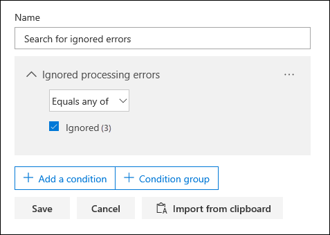
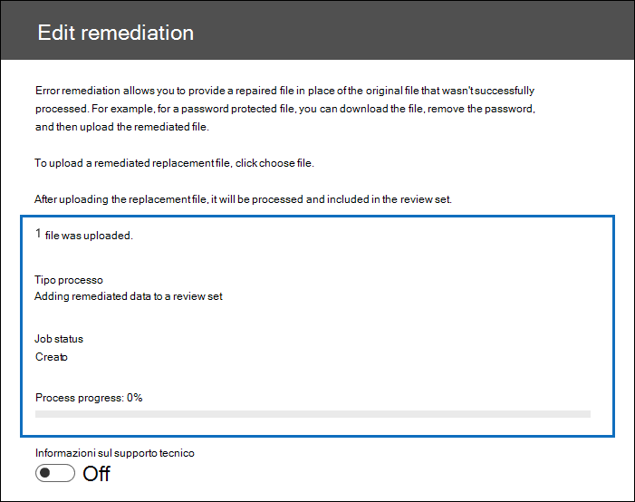

# Correzione degli errori di un singolo elemento in Advanced eDiscovery

La correzione degli errori Advanced eDiscovery agli utenti la possibilità di correggere i problemi relativi ai dati che impediscono Advanced eDiscovery di elaborare correttamente il contenuto. Ad esempio, i file protetti da password non possono essere elaborati perché tali file sono bloccati o crittografati. In precedenza, era possibile correggere gli errori solo in blocco utilizzando [questo flusso di lavoro.](error-remediation-when-processing-data-in-advanced-ediscovery.md) Ma a volte, non ha senso correggere gli errori in più file quando non si è sicuri se uno di questi file risponde al caso in cui si sta esaminando. Potrebbe anche non essere utile correggere gli errori prima di avere avuto la possibilità di esaminare i metadati del file (ad esempio, il percorso del file o chi ha avuto accesso) per prendere decisioni in anticipo sulla velocità di risposta. Una nuova funzionalità *denominata* correzione degli errori di un singolo elemento offre ai responsabili di eDiscovery la possibilità di visualizzare i metadati dei file con un errore di elaborazione e, se necessario, correggere l'errore direttamente nel set di revisione. L'articolo illustra come identificare, ignorare e correggere i file con errori di elaborazione in un set di revisione.

## Identificare i documenti con errori

I documenti con errori di elaborazione in un set di revisione sono ora identificati (con un banner). È possibile correggere o ignorare l'errore. Lo screenshot seguente mostra il banner di errore di elaborazione per un documento di Word in un set di revisioni protetto da password. Si noti inoltre che è possibile visualizzare i metadati dei file dei documenti con errori di elaborazione.

È inoltre possibile cercare i documenti con errori di elaborazione utilizzando la condizione **Stato** elaborazione durante l'esecuzione di [query nei documenti in un set di revisione.](review-set-search.md)

### Ignora errori

È possibile ignorare un errore di elaborazione facendo clic **su Ignora** nel banner di errore di elaborazione. Quando si ignora un errore, il documento viene rimosso dal flusso di lavoro di correzione degli errori [in blocco.](error-remediation-when-processing-data-in-advanced-ediscovery.md) Dopo che un errore viene ignorato, il banner del documento cambia colore e indica che l'errore di elaborazione è stato ignorato. In qualsiasi momento, è possibile annullare la decisione di ignorare l'errore facendo clic su **Ripristina**.

È inoltre possibile cercare tutti i documenti con un errore di elaborazione ignorato utilizzando la condizione *Errori* di elaborazione ignorati durante l'esecuzione di query su documenti in un set di revisioni.

## Correggere un documento con errori

A volte potrebbe essere necessario correggere un errore di elaborazione nei documenti (rimuovendo una password, decrittografando un file crittografato o recuperando un documento danneggiato) e quindi aggiungere il documento correttivo al set di revisioni. In questo modo è possibile esaminare ed esportare il documento di errore insieme agli altri documenti nel set di revisioni. 

Per correggere un singolo documento, attenersi alla seguente procedura:

1. Fare **clic su**  >  **Scarica** scarica originale per scaricare una copia del file in un computer locale.

   

2. Correggere l'errore nel file offline. Per i file crittografati, che richiederebbero software di decrittografia, per rimuovere la protezione con password, fornire la password e salvare il file o usare un cracker di password. Dopo aver corretti il file, andare al passaggio successivo.

3. Nel set di revisione, selezionare il file con l'errore di elaborazione che è stato corretti e quindi fare clic **su Correzione**.

   

4. Fare **clic** su Sfoglia, passare al percorso del file correttivo nel computer locale e quindi selezionare il file.

   

    Dopo aver selezionato il file correttivo, questo viene caricato automaticamente nel set di revisioni. È possibile tenere traccia dello stato di elaborazione del file.

    

   Al termine dell'elaborazione, è possibile visualizzare il documento correttivo.

    

Per ulteriori informazioni su cosa accade quando viene eseguita la correzione di un documento, vedere [What happens when files are remediated](error-remediation-when-processing-data-in-advanced-ediscovery.md#what-happens-when-files-are-remediated).

## Cercare documenti corretti

È possibile cercare tutti i documenti in un set di revisioni corretti utilizzando la condizione **Keywords** e specificando la coppia property:value seguente: **IsFromErrorRemediation:true**. Questa proprietà è disponibile anche nel file di caricamento dell'esportazione quando si esportano documenti da un insieme di revisioni.
