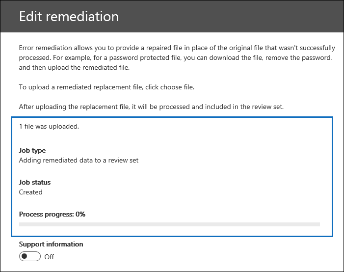

# Correzione degli errori dei singoli elementiSingle item error remediation

La correzione degli errori garantisce agli utenti avanzati di eDiscovery la possibilità di correggere i problemi relativi ai dati che impediscono l'elaborazione corretta del contenuto da parte di Advanced eDiscovery.Error remediation gives Advanced eDiscovery users the ability to rectify data issues that prevent Advanced eDiscovery from properly processing the content. Ad esempio, i file protetti da password non possono essere elaborati perché tali file sono bloccati o crittografati.For example, files that are password protected can't be processed because those files are locked or encrypted. In precedenza, è possibile correggere solo gli errori in blocco utilizzando [questo flusso di lavoro](error-remediation-when-processing-data-in-advanced-ediscovery.md).Previously, you could only remediate errors in bulk by using [this workflow](error-remediation-when-processing-data-in-advanced-ediscovery.md). Tuttavia, a volte, non ha senso correggere gli errori in più file quando non si è sicuri se uno qualsiasi di questi file risponde al caso in cui si sta indagando.But sometimes, it doesn't make sense to remediate errors in multiple files when you’re unsure if any of those files are responsive to the case you’re investigating. Potrebbe anche non essere opportuno correggere gli errori prima di aver avuto la possibilità di esaminare i metadati dei file (come il percorso del file o chi aveva accesso) per aiutarti a prendere decisioni in anticipo sulla reattività.It also might not make sense to remediate errors before you’ve had a chance to review the file metadata (such as file location or who had access) to help you make up-front decisions about responsiveness. Una nuova funzionalità denominata correzione degli errori di un *singolo elemento* fornisce ai responsabili di eDiscovery la possibilità di visualizzare i metadati dei file con un errore di elaborazione e, se necessario, correggere l'errore direttamente nel set di revisione.A new feature called *single item error remediation* gives eDiscovery managers the ability to view the metadata of files with a processing error and if necessary remediate the error directly in the review set. In questo articolo viene illustrato come identificare, ignorare e correggere i file con errori di elaborazione in un set di revisione.The article discusses how to identify, ignore, and remediate files with processing errors in a review set.

## Identificare i documenti con erroriIdentify documents with errors

I documenti con errori di elaborazione in un set di revisione sono ora identificati (con un banner).Documents with processing errors in a review set are now identified (with a banner). È possibile correggere o ignorare l'errore.You can remediate or ignore the error. Nella schermata seguente viene mostrato il banner di errore di elaborazione per un documento di Word in un set di revisione che è protetto da password.The following screenshot shows the processing error banner for a Word document in a review set that is password-protected. Si noti inoltre che è possibile visualizzare i metadati dei file di documenti con errori di elaborazione.Also notice that you can view the file metadata of documents with processing errors.

È inoltre possibile cercare i documenti che presentano errori di elaborazione utilizzando la condizione di **elaborazione dello stato** durante [l'esecuzione di query sui documenti in un set di revisione](review-set-search.md).You can also search for documents that have processing errors by using the **Processing status** condition when [querying the documents in a review set](review-set-search.md).

### Ignorare gli erroriIgnore errors

È possibile ignorare un errore di elaborazione facendo clic su **Ignora** nel banner di errore di elaborazione.You can ignore a processing error by clicking **Ignore** in the processing error banner. Quando si ignora un errore, il documento viene rimosso dal flusso di lavoro per la [correzione degli errori di massa](error-remediation-when-processing-data-in-advanced-ediscovery.md).When you ignore an error, the document is removed from the [bulk error remediation workflow](error-remediation-when-processing-data-in-advanced-ediscovery.md). Dopo aver ignorato un errore, il banner del documento cambia colore e indica che l'errore di elaborazione è stato ignorato.After an error is ignored, the document banner changes color and indicates that the processing error was ignored. In qualsiasi momento, è possibile annullare la decisione di ignorare l'errore facendo clic su **Ripristina**.At any time, you can revert the decision to ignore the error by clicking **Revert**.

È inoltre possibile cercare tutti i documenti in cui si è verificato un errore di elaborazione ignorato utilizzando la condizione relativa agli *errori di elaborazione ignorati* durante l'esecuzione di query sui documenti in un set di revisione.You can also search for all documents that had a processing error that was ignored by using the *Ignored processing errors* condition when querying documents in a review set.

## Correggere gli errori di un documentoRemediate a document with errors

A volte potrebbe essere necessario correggere un errore di elaborazione nei documenti (tramite la rimozione di una password, la decrittografia di un file crittografato o il ripristino di un documento danneggiato) e quindi aggiungere il documento correttivo al set di revisione.Sometimes you may be required to remediate a processing error in documents (by removing a password, decrypting an encrypted file, or recovering a corrupted document) and then add the remediated document to the review set. In questo modo è possibile esaminare ed esportare il documento di errore insieme agli altri documenti nel set di revisione.This allows you to review and export the error document together with the other documents in the review set. 

Per correggere un singolo documento, attenersi alla procedura seguente:To remediate a single document, follow these steps:

1.  > Fare **clic su download downloa\d\*\*\**originale** per scaricare una copia del file in un computer locale.Click **Download** > **Download original** to download a copy of the file to a local computer.

   

2. Correggere l'errore nel file offline.Remediate the error in the file offline. Per i file crittografati, che richiedono un software di decrittografia, per rimuovere la protezione dalle password, fornire la password e salvare il file oppure utilizzare un programma di cracking delle password.For encrypted files, that would require decryption software, to remove password protection, either provide the password and save the file or use a password cracker. Dopo aver rimediato il file, passare al passaggio successivo.After you remediate the file, go to the next step.

3. Nel set di Revisione selezionare il file con l'errore di elaborazione da correggere e quindi fare clic su **correzione**.In the review set, select the file with the processing error that you remediated, and then  click **Remediation**.

   

4. Fare clic su **Sfoglia**, passare al percorso del file di correzione nel computer locale e quindi selezionare il file.Click **Browse**, go to the location of the remediated file on your local computer, and then select the file.

   

    Dopo aver selezionato il file di correzione, viene caricato automaticamente nel set di revisione.After selecting the remediated file, it is automatically uploaded to the review set. È possibile monitorare lo stato di elaborazione del file.You can track the processing status of the file.

    

   Al termine dell'elaborazione, è possibile visualizzare il documento correttivo.After processing is completed, you can view the remediated document.

    

Per ulteriori informazioni sugli elementi che si verificano quando un documento viene correttivo, vedere [cosa succede quando i file vengono corretti](error-remediation.md#what-happens-when-files-are-remediated).For more information about what happens when a document is remediated, see [What happens when files are remediated](error-remediation.md#what-happens-when-files-are-remediated).

## Ricerca di documenti correttiSearch for remediated documents

È possibile cercare tutti i documenti in un set di revisione che sono stati corretti utilizzando la condizione **Keywords** e specificando la proprietà seguente: coppia valore: **IsFromErrorRemediation: true**.You can search for all documents in a review set that were remediated by using the **Keywords** condition and specifying the following property:value pair: **IsFromErrorRemediation:true**. Questa proprietà è disponibile anche nel file di caricamento dell'esportazione quando si esportano i documenti da un set di revisione.This property is also available in the export load file when you export documents from a review set.
