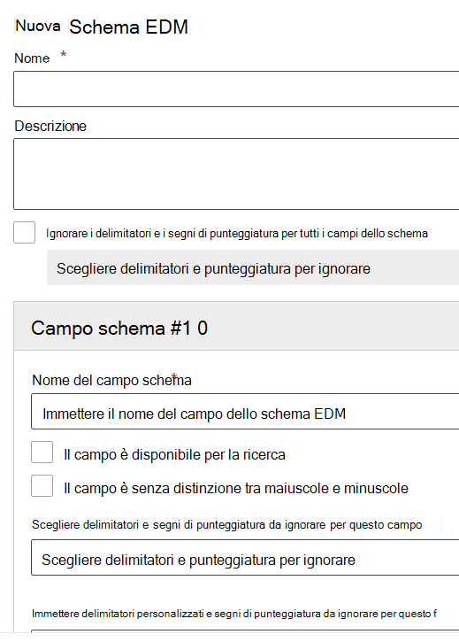

# Usare la procedura guidata per lo schema Exact Data Match e per il tipo di informazioni sensibili

[La creazione di un tipo di informazioni sensibili personalizzato con la classificazione basata su Exact Data Match (EDM)](create-custom-sensitive-information-types-with-exact-data-match-based-classification.md) comporta molti passaggi.  È possibile usare questa procedura guidata per creare lo schema e i file modello del tipo di informazioni sensibili (pacchetto di regole) per semplificare il processo.

> [!NOTE]
> La procedura guidata per lo schema Exact Data Match e per il tipo di informazioni sensibili è disponibile unicamente per i cloud World Wide e GCC.

Questa procedura guidata può essere usata al posto di:

- [Definire lo schema per il database delle informazioni sensibili](create-custom-sensitive-information-types-with-exact-data-match-based-classification.md#define-the-schema-for-your-database-of-sensitive-information)
- [Configurare un modello (pacchetto di regole)](create-custom-sensitive-information-types-with-exact-data-match-based-classification.md#set-up-a-rule-package)

passaggi nella [Parte 1: Configurare una classificazione basata su EDM](create-custom-sensitive-information-types-with-exact-data-match-based-classification.md#part-1-set-up-edm-based-classification).

## Prerequisiti

1. Acquisire familiarità con i passaggi per creare un tipo di informazioni sensibili con il [flusso di lavoro in breve](create-custom-sensitive-information-types-with-exact-data-match-based-classification.md#the-work-flow-at-a-glance) EDM.

2. Seguire i passaggi nella sezione [Salvare i dati sensibili in formato .csv](create-custom-sensitive-information-types-with-exact-data-match-based-classification.md#save-sensitive-data-in-csv-format).

## Usare la procedura guidata per lo schema Exact Data Match e per il modello del tipo di informazioni sensibili

1. Nel centro conformità Microsoft 365 per il tenant andare a **Classificazione dei dati** > **Corrispondenze dei dati esatte**.

2. Scegliere **Creare schema EDM** per aprire il riquadro a comparsa della configurazione della procedura guidata per lo schema.

3. Immettere il **Nome** e la **Descrizione** appropriati.

4. Scegliere **Ignorare delimitatori e punteggiatura per tutti i campi dello schema** se si desidera questo comportamento. Per scoprire ulteriori informazioni sulla configurazione di EDM per ignorare maiuscole o minuscole e delimitatori, vedere [Creare un tipo di informazioni sensibili personalizzato con una classificazione basata su Exact Data Match (EDM)](create-custom-sensitive-information-types-with-exact-data-match-based-classification.md).

5. Immettere i valori desiderati per il **campo n.1 dello schema** e aggiungere più campi secondo necessità. 

> [!IMPORTANT]
> Almeno un campo dello schema, ma non più di cinque, deve essere designato come disponibile per la ricerca.

6. Scegliere Salva. Ora lo schema sarà incluso nell'elenco.

7. Scegliere **tipi di informazioni sensibili EDM** e **Creare un tipo di informazioni sensibili EDM** per aprire la configurazione guidata per il tipo di informazioni sensibili.

8. Scegliere **Scegliere uno schema EDM esistente** e scegliere lo schema creato nei passaggi 2-6 in elenco.

9. Scegliere **Avanti** e **Creare modello**.

10. Scegliere il **Livello di confidenza** e l'**Elemento primario**.  Per scoprire ulteriori informazioni sulla configurazione di un modello, vedere [Creare un tipo di informazioni sensibili personalizzato nel Centro conformità](create-a-custom-sensitive-information-type.md)

11.  Scegliere il **Tipo di informazioni sensibili dell'elemento primario** da associare. Vedere [Definizioni dell'entità del tipo di informazioni sensibili](sensitive-information-type-entity-definitions.md) per scoprire ulteriori informazioni sui tipi di informazioni sensibili disponibili.

12. Scegliere **Fine**.

13. Scegliere il **Livello di confidenza e la vicinanza del carattere** desiderati.  Questo sarà il valore predefinito per il tipo completo di informazioni sensibili EDM

13. Scegliere **Creare modello** se si desidera creare modelli aggiuntivi per il tipo di informazioni sensibili EDM.

14. Scegliere **Avanti** e compilare i campi **Nome** e **Descrizione per gli amministratori**.

15. Rivedere e scegliere **Invia**.

È possibile eliminare o modificare il modello del tipo di informazioni sensibili dai controlli di modifica ed eliminazione.

> [!IMPORTANT]
> Se si desidera rimuovere uno schema già associato a un tipo di informazioni sensibili EDM, è necessario eliminare innanzi tutto il tipo di informazioni sensibili EDM, quindi eliminare lo schema.

## Passaggi successivi

Dopo aver usato questa configurazione guidata per creare lo schema EDM e i file modello (pacchetto di regole), è ancora necessario eseguire i passaggi nella [Parte 2: hashing e caricamento dei dati sensibili](create-custom-sensitive-information-types-with-exact-data-match-based-classification.md#part-2-hash-and-upload-the-sensitive-data) prima di poter usare il tipo di informazioni sensibili EDM personalizzato.