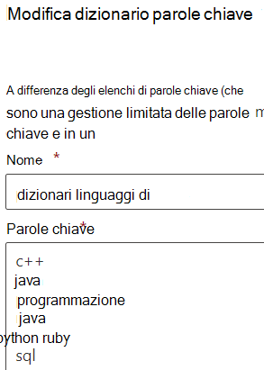

# <a name="modify-a-keyword-dictionary"></a>Modificare un dizionario di parole chiave

Può essere necessario modificare le parole chiave in uno dei dizionari di parole chiave o modificare uno dei dizionari predefiniti. A tale scopo, è possibile utilizzare PowerShell o il Centro conformità.

## <a name="modify-a-keyword-dictionary-in-compliance-center"></a>Modificare un dizionario parole chiave nel Centro conformità

I dizionari parole chiave possono essere utilizzati come o in modelli `Primary elements` `Supporting elements` SIT (Sensitive Information Type). È possibile modificare un dizionario di parole chiave durante la creazione di un sit o in un sit esistente. Ad esempio, per modificare un dizionario parole chiave esistente:

1. Apri il modello con il dizionario parole chiave che vuoi aggiornare.
2. Trova il dizionario parole chiave che vuoi aggiornare e scegli Modifica. 
3.  Apporta le modifiche usando una parola chiave per riga.



4. Scegliere `Done` .

## <a name="modify-a-keyword-dictionary-using-powershell"></a>Modificare un dizionario parole chiave con PowerShell 

Ad esempio, alcuni termini verranno modificati in PowerShell, salvati in locale, dove è possibile modificarli in un editor, e quindi inseriti al posto dei termini esistenti. 

Prima di tutto, recuperare l'oggetto dizionario:
  
```powershell
$dict = Get-DlpKeywordDictionary -Name "Diseases"
```

Se si stampa `$dict`, verranno visualizzate le diverse variabili. Le stesse parole chiave vengono archiviate in un oggetto in back-end, ma `$dict.KeywordDictionary` contiene una rappresentazione di queste parole in formato stringa, che verrò usata per modificare il dizionario. 

Prima di modificare il dizionario, è necessario riconvertire la stringa di termini in una matrice usando il metodo `.split(',')`. Poi è necessario eliminare gli spazi indesiderati tra le parole chiave con il metodo `.trim()`, lasciando solo le parole chiave da usare. 
  
```powershell
$terms = $dict.KeywordDictionary.split(',').trim()
```

A questo punto si rimuovono alcuni termini dal dizionario. Il dizionario di esempio include solo alcune parole chiave, quindi è possibile evitare l'esportazione modificando il dizionario direttamente nel Blocco note. In genere, però, i dizionari contengono una grande quantità di testo, quindi è utile conoscere la procedura per modificarli facilmente in PowerShell.
  
Nell'ultimo passaggio le parole chiave sono state salvate in una matrice. Ci sono diversi modi per [rimuovere elementi da una matrice](/previous-versions/windows/it-pro/windows-powershell-1.0/ee692802(v=technet.10)), ma l'approccio più diretto consiste nel creare una matrice di termini da rimuovere dal dizionario e quindi copiare solo i termini del dizionario che non si trovano nell'elenco di termini da rimuovere.
  
Eseguire il comando `$terms` per visualizzare l'elenco attuale di termini. L'output del comando avrà questo aspetto: 
  
`aarskog's syndrome`
`abandonment`
`abasia`
`abderhalden-kaufmann-lignac`
`abdominalgia`
`abduction contracture`
`abetalipoproteinemia`
`abiotrophy`
`ablatio`
`ablation`
`ablepharia`
`abocclusion`
`abolition`
`aborter`
`abortion`
`abortus`
`aboulomania`
`abrami's disease`

Eseguire questo comando per specificare i termini da rimuovere:
  
```powershell
$termsToRemove = @('abandonment', 'ablatio')
```

Eseguire questo comando per rimuovere effettivamente i termini dall'elenco:
  
```powershell
$updatedTerms = $terms | Where-Object{ $_ -notin $termsToRemove }
```

Eseguire il comando `$updatedTerms` per visualizzare l'elenco aggiornato di termini. L'output del comando è simile al seguente (i termini specificati sono stati rimossi): 
  
`aarskog's syndrome`
`abasia`
`abderhalden-kaufmann-lignac`
`abdominalgia`
`abduction contracture`
`abetalipo proteinemia`
`abiotrophy`
`ablation`
`ablepharia`
`abocclusion`
`abolition`
`aborter`
`abortion`
`abortus`
`aboulomania`
`abrami's disease`
```

Now save the dictionary locally and add a few more terms. You could add the terms right here in PowerShell, but you'll still need to export the file locally to ensure it's saved with Unicode encoding and contains the BOM.
  
Save the dictionary locally by running the following:
  
```powershell
Set-Content $updatedTerms -Path "C:\myPath\terms.txt"
```

Ora basta aprire il file, aggiungere gli altri termini e salvare il file con la codifica Unicode (UTF-16). A questo punto, è possibile caricare i termini aggiornati e aggiornare il dizionario esistente.
  
```powershell
PS> Set-DlpKeywordDictionary -Identity "Diseases" -FileData (Get-Content -Path "C:myPath\terms.txt" -Encoding Byte -ReadCount 0)
```

Ora il dizionario esistente è aggiornato. Il campo `Identity` prende il nome del dizionario. Se si vuole modificare anche il nome del dizionario con il cmdlet `set-`, basta aggiungere il parametro con il nuovo nome del dizionario `-Name` al comando precedente. 

Vedere anche
- [Creare un dizionario di parole chiave](create-a-keyword-dictionary.md)
- [Creare una tipologia personalizzata di informazioni riservate](create-a-custom-sensitive-information-type.md)
