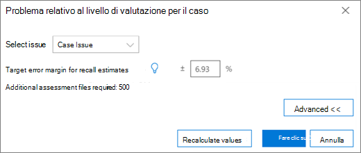

# Tagging e valutazione nel modulo Pertinenza in Advanced eDiscoveryTagging and Assessment in the Relevance module in Advanced eDiscovery
  
In questa sezione viene descritta la procedura per la valutazione nel modulo Pertinenza in Advanced eDiscovery.This section describes the procedure for Assessment in the Relevance module in Advanced eDiscovery.
  
## Esecuzione della formazione e dell'analisi di valutazionePerforming Assessment training and analysis

1. Nella scheda **Traccia di \> pertinenza** fare clic su **Valutazione** per avviare la valutazione del caso.In the **Relevance \> Track** tab, click **Assessment** to start case assessment.

    Ad esempio, in questa procedura viene creato un set di valutazione di esempio di 500 file e viene visualizzata la scheda **Tag,** che contiene il pannello Tagging, il contenuto dei file visualizzati e altre opzioni di tagging.For example purposes in this procedure, a sample assessment set of 500 files is created and the **Tag** tab is displayed, which contains the Tagging panel, displayed file content and other tagging options. 

    
  
2. Esaminare ogni file nell'esempio, determinare la pertinenza del file per ogni problema relativo al caso e contrassegnare il file con i pulsanti Pertinenza (R), Non rilevante (NR) e Ignora nel riquadro del pannello **Tagging.**Review each file in the sample, determine the file's relevance for each case issue, and tag the file using the Relevance (R), Not relevant (NR) and Skip buttons in the **Tagging panel** pane. 

    > [!NOTE]
    >  La valutazione richiede 500 file con tag.Assessment requires 500 tagged files. Se i file vengono "ignorati", riceverai più file da contrassegnare.If files are "skipped", you will receive more files to tag. 
  
3. Dopo aver taggato tutti i file nell'esempio, fare clic su **Calcola**.After tagging all files in the sample, click **Calculate**.

    Il margine di errore corrente di valutazione e la ricchezza vengono calcolati e visualizzati nella scheda **Traccia** di pertinenza, con dettagli espansi per problema, come illustrato di seguito.The Assessment current error margin and richness are calculated and displayed in the **Relevance Track** tab, with expanded details per issue, as shown below. Ulteriori dettagli su questa finestra di dialogo sono descritti nella sezione [Revisione dei risultati della](#reviewing-assessment-results) valutazione.More details about this dialog are described in the [Reviewing assessment results](#reviewing-assessment-results) section.

    
  
    > [!TIP]
    > Per impostazione predefinita, è consigliabile passare al passaggio successivo predefinito al termine dell'indicatore di stato della valutazione per il problema, a indicare che l'esempio di valutazione è stato esaminato e che sono stati contrassegnati file pertinenti sufficienti.By default, we recommend that you proceed to the default Next step when the Assessment progress indicator for the issue has completed, indicating that the assessment sample was reviewed and sufficient relevant files were tagged. > In caso contrario, se si  desidera visualizzare i risultati della scheda Traccia  e controllare il margine di errore e il passaggio successivo, fare clic su Modifica accanto a Passaggio **successivo,** selezionare **Continua** valutazione e quindi fare clic su **OK.**> Otherwise, if you want to view the **Track** tab results and control the margin of error and the next step, click **Modify** adjacent to **Next Step**, select **Continue assessment**, and then click **OK**.
  
4. Fare **clic su** Modifica a destra della casella **di** controllo Valutazione per visualizzare e specificare i parametri di valutazione per problema.Click **Modify** to the right of the **Assessment** check box to view and specify assessment parameters per issue. Viene **visualizzata una** finestra di dialogo a livello di valutazione per ogni problema, come illustrato nell'esempio seguente:An **Assessment level** dialog for each issue is displayed, as shown in the following example: 

    
  
    I parametri seguenti per il problema vengono calcolati e visualizzati nella finestra **di dialogo Livello di** valutazione:The following parameters for the issue are calculated and displayed in the **Assessment level** dialog: 

    **Margine di errore di destinazione per le** stime di richiamo: in base a questo valore, viene calcolato il numero stimato di file aggiuntivi necessari per la revisione.**Target error margin for recall estimates**: Based on this value, the estimated number of additional files necessary to review is calculated. Il margine utilizzato per il richiamo è superiore al 75% e con un livello di probabilità del 95%.The margin used for recall is greater than 75% and with a 95% confidence level.

    **File di valutazione aggiuntivi necessari:** indica quanti altri file sono necessari se non sono stati soddisfatti i requisiti del margine di errore corrente.**Additional assessment files required**: Indicates how many more files are necessary if the current error margin's requirements have not been met. 

5. Per regolare il margine di errore corrente e vedere l'effetto di margini di errore diversi (per problema):To adjust the current error margin and see the effect of different error margins (per issue):

6. **Nell'elenco Seleziona problema** selezionare un problema.In the **Select issue** list, select an issue. 

7. In **Margine di errore di destinazione per le stime di richiamo** immettere un nuovo valore.In **Target error margin for recall estimates**, enter a new value.

8. Fare **clic su Aggiorna** valori per visualizzare l'impatto delle rettifiche.Click **Update values** to see the impact of the adjustments. 

9. Fare **clic su** Avanzate nella finestra di **dialogo** Livello di valutazione per visualizzare i seguenti parametri e dettagli aggiuntivi:Click **Advanced** in the **Assessment level** dialog to see the following additional parameters and details: 

    
  
    - **Richness stimata**: ricchezza stimata in base ai risultati della valutazione corrente**Estimated richness**: Estimated richness according to the current assessment results

    - **Per il richiamo presunto:** per impostazione predefinita, il margine di errore di destinazione si applica al richiamo superiore al 75%.**For assumed recall**: By default, the target error margin applies to recall above 75%. Fare **clic su** Modifica se si desidera modificare questo parametro e controllare il margine di errore in un intervallo diverso di valori di richiamo.Click **Edit** if you want to change this parameter and control the margin of error on a different range of recall values. 

    - **Livello di probabilità**: per impostazione predefinita, il margine di errore consigliato per la probabilità è 95%.**Confidence level**: By default, the recommended error margin for confidence is 95%. Fare **clic su** Modifica se si desidera modificare questo parametro.Click **Edit** if you want to change this parameter.

    - **Margine di errore di richness previsto:** dati i valori aggiornati, questo è il margine di errore previsto della ricchezza, dopo la revisione di tutti i file di valutazione aggiuntivi.**Expected richness error margin**: Given the updated values, this is the expected margin of error of the richness, after all additional assessment files are reviewed.

    - **File di valutazione aggiuntivi necessari:** dati i valori aggiornati, il numero di file di valutazione aggiuntivi che devono essere esaminati per raggiungere l'obiettivo.**Additional assessment files required**: Given the updated values, the number of additional assessment files that need to be reviewed to reach the target.

    - **Totale file di valutazione necessari:** dati i valori aggiornati, i file di valutazione totali necessari per la revisione.**Total assessment files required**: Given the updated values, total assessment files required for review.

    - **Numero previsto di file pertinenti nella** valutazione: dati i valori aggiornati, il numero previsto di file pertinenti nell'intera valutazione dopo la revisione di tutti i file di valutazione aggiuntivi.**Expected number of relevant files in assessment**: Given the updated values, the expected number of relevant files in the entire assessment after all additional assessment files are reviewed.

10. Fare **clic su Ricalcola valori** se i parametri vengono modificati.Click **Recalculate values**, if parameters are changed. Al termine, se è presente un problema, fare clic  su **OK** per salvare le modifiche oppure su Avanti quando sono presenti più problemi da esaminare o modificare e quindi **su Fine.**When you're done, if there is one issue, click **OK** to save the changes (or **Next** when there are multiple issues to review or modify and then **Finish**). 

    In caso di più problemi, dopo che tutti  i problemi sono stati esaminati o modificati, viene visualizzata una finestra di dialogo Di riepilogo, come illustrato nell'esempio seguente.When there are multiple issues, after all issues have been reviewed or adjusted, an **Assessment level: summary** dialog is displayed, as shown in the following example. 

    
  
    Al termine della valutazione, passare alla fase successiva della formazione sulla pertinenza.On successful completion of assessment, proceed to the next stage in Relevance training.

## Revisione dei risultati della valutazioneReviewing assessment results

Dopo aver taggato un campione di valutazione, i risultati della valutazione vengono calcolati e visualizzati nella scheda Traccia di pertinenza.After an Assessment sample is tagged, the assessment results are calculated and displayed in the Relevance Track tab.
  
Nella visualizzazione traccia espansa vengono visualizzati i risultati seguenti:The following results are displayed in the expanded Track display:
  
- Margine di errore corrente di valutazione per le stime di richiamoAssessment current error margin for recall estimates

- Ricchezza stimataEstimated richness

- File di valutazione aggiuntivi necessari (per la revisione)Additional assessment files required (for review)

Il margine di errore corrente di valutazione è il margine di errore consigliato Advanced eDiscovery.The Assessment current error margin is the error margin recommended by Advanced eDiscovery. Il numero visualizzato per i "File di valutazione aggiuntivi necessari" corrisponde a tale raccomandazione.The number displayed for the "Additional assessment files required" corresponds to that recommendation.
  
L'indicatore di stato della valutazione mostra il livello di completamento della valutazione, dato il margine di errore corrente.The Assessment progress indicator shows the level of completion of the assessment, given the current error margin. Quando è in corso la valutazione, l'utente contrassegnerà un altro campione di valutazione.When assessment is underway, the user will tag another assessment sample.
  
Quando l'indicatore di stato della valutazione mostra che la valutazione è stata completata, significa che la revisione del campione di valutazione è stata completata e sono stati taggati file pertinenti sufficienti.When the assessment progress indicator shows assessment as complete, that means the assessment sample review was completed and sufficient relevant files were tagged. 
  
La visualizzazione traccia espansa mostra il passaggio successivo consigliato, le statistiche di valutazione e l'accesso ai risultati dettagliati.The expanded Track display shows the recommended next step, the assessment statistics, and access to detailed results.
  
Quando la ricchezza è molto bassa, il numero di file di valutazione aggiuntivi necessari per raggiungere un numero minimo di file rilevanti per produrre statistiche utili è molto elevato.When richness is very low, the number of additional assessment files needed to reach a minimal number of relevant files to produce useful statistics is very high. Advanced eDiscovery sarà quindi consigliabile passare alla formazione.Advanced eDiscovery will then recommend moving on to training. L'indicatore di stato della valutazione sarà ombreggiato e non saranno disponibili statistiche.The assessment progress indicator will be shaded, and no statistics will be available.
  
In assenza di stabilizzazione basata su statistiche, i risultati avranno un livello inferiore di accuratezza e livello di confidenza.In the absence of statistically based stabilization, there will be results with a lower level of accuracy and confidence level. Tuttavia, questi risultati possono essere utilizzati per trovare i file pertinenti quando non è necessario conoscere la percentuale di file pertinenti trovati.However, these results can be used to find relevant files when you do not need to know the percentage of relevant files found. Analogamente, questo stato può essere usato per formare i problemi con scarsa ricchezza, in cui i punteggi di pertinenza possono accelerare l'accesso ai file rilevanti per un problema specifico.Similarly, this status can be used to train issues with low richness, where Relevance scores can accelerate access to files relevant to a specific issue.
  
> [!TIP]
> Nella scheda **Traccia di \> pertinenza,** visualizzazione dei problemi espansa, sono disponibili le opzioni di visualizzazione seguenti:In the **Relevance \> Track** tab, expanded issue display, the following viewing options are available: 
> 
> Il passaggio successivo consigliato, ad esempio Passaggio **successivo: Tagging** può essere ignorato (per problema) facendo clic sul pulsante **Modifica** a destra e quindi selezionando un passaggio diverso nel **passaggio Successivo.**The recommended next step, such as **Next step: Tagging** can be bypassed (per issue) by clicking the **Modify** button to its right, and then selecting an different step in the **Next step**. Quando l'indicatore di stato della valutazione non è stato completato, la valutazione sarà l'opzione consigliata successiva, per contrassegnare più file di valutazione e aumentare l'accuratezza delle statistiche.When the assessment progress indicator has not completed, assessment will be the next recommended option, to tag more assessment files and increase statistics accuracy. 
> 
> È possibile modificare il margine di errore e valutarne l'impatto facendo clic su Modifica e nella finestra di dialogo Livello di **valutazione,** modificando il margine di errore target per le stime di richiamo e facendo clic su **Aggiorna valori.**You can change the error margin and assess its impact, by clicking **Modify**, and in the **Assessment level dialog**, changing the **Target error margin for recall estimates**, and clicking **Update values**. Inoltre, in questa finestra di dialogo è possibile visualizzare le opzioni avanzate facendo clic su **Avanzate.**Also, in this dialog, you can view advanced options, by clicking **Advanced**. 
> 
> È possibile visualizzare ulteriori statistiche del livello di valutazione e il relativo impatto facendo clic su **Visualizza.**You can view additional assessment level statistics and their impact by clicking **View**. Nella finestra di dialogo Dei risultati dettagliati, le statistiche sono disponibili per ogni problema, quando sono presenti almeno 500 file di valutazione con tag e almeno 18 file sono contrassegnati come rilevanti per il problema.In the displayed Detail results dialog, statistics are available per issue, when there are at least 500 tagged assessment files and at least 18 files are tagged as Relevant for the issue. 
