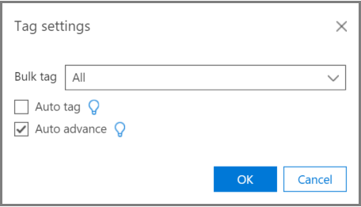
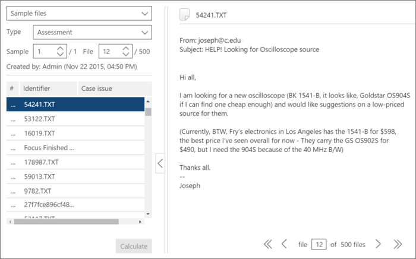

# Formazione su tagging e pertinenza in Advanced eDiscoveryTagging and Relevance training in Advanced eDiscovery
  
In questo articolo viene descritta la procedura per l'utilizzo del modulo di formazione per la pertinenza in Advanced eDiscovery.This article describes the procedure for working with the Relevance training module in Advanced eDiscovery.
  
Dopo aver completato la valutazione in Advanced eDiscovery e aver immesso la fase di formazione per la pertinenza, nella scheda Tag per il tagging viene inserito un esempio di formazione di 40 file.After Assessment is completed in Advanced eDiscovery, and you enter the Relevance training stage, a training sample of 40 files is brought into the Tag tab for tagging.
  
## Formazione sulla pertinenzaPerforming Relevance training

1. Nella scheda **\> Tag di** pertinenza, il riquadro Tagging viene visualizzato per impostazione predefinita nel riquadro sinistro e i file di esempio vengono visualizzati, uno alla volta per il tagging.In the **Relevance \> Tag** tab, the Tagging pane is displayed by default in the left pane and the sample files are displayed, one at a time for tagging.

    
  
    Nella scheda **Tag** viene visualizzato il nome visualizzato del file.In the **Tag** tab, the file's display name is shown. Può trattarsi del percorso, dell'oggetto del messaggio di posta elettronica, del titolo o del nome definito dall'utente.This could be the path, email subject, title, or user-defined name. L'ID, il percorso del file o il percorso di testo possono essere copiati facendo clic con il pulsante destro del mouse sul percorso del file.The ID, file path or text path can be copied by right-clicking on the file's path.

    Le  statistiche di tagging della scheda Tag mostrano il numero di esempio del file (nella parte superiore del riquadro sinistro), il numero del file attualmente visualizzato fuori dal totale dei file nell'esempio (nella parte inferiore del riquadro destro) e il numero totale corrente di file con tag nell'esempio (nella parte inferiore del riquadro sinistro), che cambia man mano che tagi i file.The **Tag** tab tagging statistics show the file sample number (at the top of the left pane), the number of the currently displayed file out of the total files in the sample (bottom of right pane), and the current total number of tagged files in the sample (bottom of the left pane), which changes as you tag files. Ciò vale per qualsiasi tagging per pertinenza eseguito, in Valutazione, Formazione, Catch-up o Test.This applies for any Relevance tagging done, whether in Assessment, Training, Catch-up, or Test.

    Le icone che indicano l'esistenza di commenti, tag e file di famiglia vengono visualizzate nella visualizzazione file in una barra sopra il file.Icons indicating the existence of comments, tags, and family files are displayed in the file view in a bar above the file.

2. Determinare la pertinenza del file per il caso e contrassegnare il file utilizzando i pulsanti dell'icona dell'opzione Tagging o i tasti di scelta rapida, come illustrato nella tabella seguente:Determine the file's relevance for the case issue and tag the file using either the Tagging option icon buttons or keyboard shortcuts, as shown in the following table:

   |**Opzione di tagging****Tagging option**|**Descrizione****Description**|**Scelta rapida da tastiera****Keyboard shortcut**|**Tasti di scelta rapida per il tagging in blocco (per più problemi)****Bulk tagging keyboard shortcut (for multiple issues)**|
   |-----|-----|-----|-----|
   |RR    |PertinenteRelevant    |ZZ    |`Shift + Z`    |
   |NRNR    |Non rilevanteNot relevant    |XX    |`Shift + X`    |
   |IgnoraSkip    |IgnoraSkip    |CC    |`Shift + A`    |
   |||||

   - Quando esistono più problemi per un file, dopo aver taggato un problema, la selezione passa al problema successivo (se presente).When multiple issues exist for a file, after tagging one issue, the selection moves to the next issue (if any).  

   - Le parole chiave definite dall'amministratore o dal responsabile del caso durante l'evidenziazione delle parole chiave (Impostazione pertinenza Parole chiave evidenziate) verranno visualizzate (in colori specificati) per identificare i file rilevanti durante l'applicazione di \> tag.Keywords that were defined by the Administrator or Case manager when highlighting keywords (Relevance setup \> Highlighted keywords), will be displayed (in specified colors) to help identify relevant files while tagging. Se una parola chiave ha una doppia sottolineatura, è possibile fare clic su di essa per visualizzare una descrizione comando con la descrizione della parola chiave.If a keyword has a double underline, it can be clicked to display a tool-tip with the keyword's description.

     Facoltativamente, nella **scheda Tag** fare clic su Impostazioni **tag** per impostare le opzioni seguenti:Optionally, in the **Tag** tab, click **Tag settings** to set the following options:

      
  
   - **Tag in** blocco : utilizzare questa opzione per  assegnare più problemi a un file selezionando Tutti per impostare il  tag per il file selezionato per tutti i problemi (sostituisce i problemi già contrassegnati) oppure selezionando Il resto per applicare il tag ai problemi senza tag rimanenti.**Bulk tag**: Use this option to assign multiple issues for a file by selecting **All** to set the tag for the selected file for all issues (overrides already tagged issues) or by selecting **The rest** to apply the tag to the remaining untagged issues. L'opzione selezionata rimane attiva per tutti i casi dell'utente fino a quando non viene modificata da tale utente (l'impostazione è per utente per tutti i casi dell'utente).The selected option remains in effect for all of this user's cases until changed by that user (setting is per user for all the user's cases).

   - **Tag automatico:** selezionare questa casella di controllo per impostare altri problemi per un file come Non rilevanti dopo un singolo tagging pertinente.**Auto tag**: Select this check box to set other issues for a file as Not relevant after a single Relevant tagging.

   - **Avanzamento automatico:** selezionare questa casella di controllo per spostare la selezione del file visualizzato nel file successivo quando si contrassegna l'ultimo o solo il problema senza tag.**Auto advance**: Select this check box to move the displayed file selection to the next file when tagging the last or only untagged issue.

    I file ignorati non verranno considerati ai fini della formazione per la pertinenza e del punteggio per la pertinenza.Skipped files will not be considered for Relevance training and Relevance scoring purposes.

3. I commenti a testo libero, associati a un file, possono essere visualizzati e modificati tramite l'opzione **Commento** nell'elenco a discesa del riquadro sinistro.Free-text comments, associated with a file, can be viewed and edited via the **Comment** option in the left pane drop-down list. (facoltativo)(optional)

4. Le linee guida per il tagging possono essere visualizzate selezionando l'opzione Linee guida di **tagging** nell'elenco a discesa del riquadro sinistro.Guidelines for tagging can be viewed by selecting the **Tagging guidelines** option in the left pane drop-down list.

5. Dopo aver completato il tagging di tutti i file nell'elenco e aver calcolato i risultati, fare clic su **Calcola**.After you finish tagging all files in the list and are ready to calculate the results, click **Calculate**. Viene **visualizzata** la scheda Traccia.The **Track** tab is displayed.  

## Utilizzo dell'elenco dei file di esempioWorking with the sample files list

L'elenco dei file di esempio consente di visualizzare un elenco dei file in un esempio di formazione ed eseguire diverse azioni su uno o più file.The sample files list allows you to view a list of the files in a training sample and perform various actions on one or more files. Nella scheda **Tag di** pertinenza, nel riquadro sinistro File di esempio viene visualizzato un elenco di file di esempio per l'elaborazione con processi di valutazione, formazione, aggiornamento e \>  incoerenze. In the **Relevance** \> **Tag** tab, the **Sample files** left pane displays a list of sample files for processing with Assessment, Training, Catch-up, and Inconsistencies processes.
  
1. Nella scheda **Tag di \> rilevanza** selezionare l'elenco a discesa File di esempio nel riquadro sinistro.In the **Relevance \> Tag** tab, select the Sample files in the left pane drop-down list. I file di esempio sono elencati nel riquadro sinistro.The sample files are listed in the left pane.

    
  
2. Selezionare un campione o un numero di file specifico immettendo o selezionandone il numero nelle **caselle Esempio** **o File.**Select a specific sample or file number by entering or selecting its number in the **Sample** or **File** boxes.

   - Un numero di sequenza di file è elencato nella colonna sinistra dell'elenco dei file visualizzati nella **scheda** Tag. Facendo clic sull'intestazione, l'ordine originale visualizzato dei file torna all'ordine originale.A file sequence number is listed in the left column of the displayed file list on the **Tag** tab. By clicking the header, the original displayed order of the files returns to its original order.

   - Facendo clic su una riga di file, il relativo contenuto viene visualizzato nel riquadro destro.Clicking on a file row displays its content in the right pane.

   - Spostarsi tra i file nell'esempio corrente utilizzando le opzioni della barra dei menu inferiore.Navigate between files in the current sample by using the lower menu bar options. Sono inoltre disponibili i tasti di scelta rapida di spostamento:In addition, navigational keyboard shortcuts are available:
  
     - Per passare al primo file dell'esempio: `Shift + Ctrl + <`To go to the first file in the sample: `Shift + Ctrl + <`

     - Per passare al file precedente nell'esempio: `Shift + <`To go to the previous file in the sample: `Shift + <`

     - Per passare al file successivo nell'esempio: `Shift + >`To go to the next file in the sample: `Shift + >`

     - Per passare all'ultimo file dell'esempio: `Shift + Ctrl + >`To go to the last file in the sample: `Shift + Ctrl + >`
