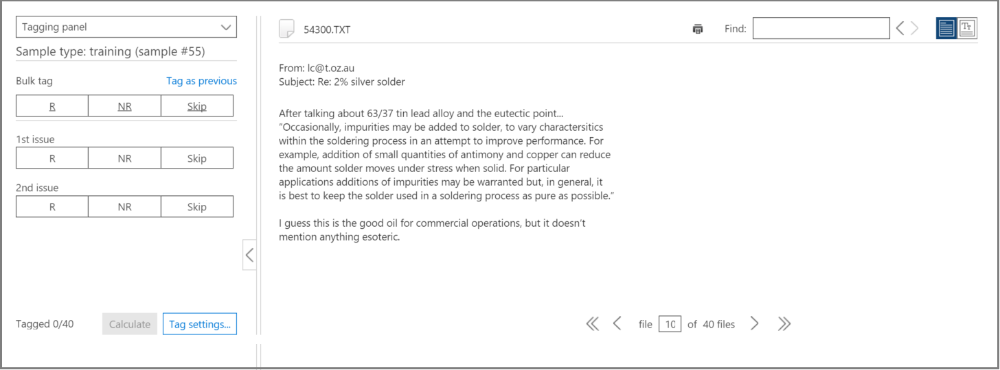

# Formazione di tagging e pertinenza in Advanced eDiscovery
  
In questo articolo viene descritta la procedura per l'utilizzo del modulo di formazione per pertinenza in Advanced eDiscovery.
  
Dopo aver completato la valutazione in Advanced eDiscovery e immettendo la fase di formazione per pertinenza, un campione di formazione di 40 file viene portato nella scheda Tag per il tagging.
  
## Esecuzione della formazione sulla pertinenza

1. Nella scheda **\> tag pertinenza** , il riquadro di tagging viene visualizzato per impostazione predefinita nel riquadro sinistro e vengono visualizzati i file di esempio, uno alla volta per il tagging.

    
  
    Nella scheda **tag** viene visualizzato il nome visualizzato del file. Potrebbe trattarsi del percorso, dell'oggetto di posta elettronica, del titolo o del nome definito dall'utente. L'ID, il percorso del file o il percorso del testo può essere copiato facendo clic con il pulsante destro del mouse sul percorso del file.

    Le statistiche di tagging della scheda **tag** mostrano il numero di campione del file (nella parte superiore del riquadro sinistro), il numero del file attualmente visualizzato al di fuori dei file totali del campione (parte inferiore del riquadro destro) e il numero totale corrente di file contrassegnati nell'esempio (in basso nel riquadro sinistro), che cambia quando si Tag file. Questo vale per tutti i tag di pertinenza effettuati, sia in valutazione, formazione, catch-up o test.

    Le icone che indicano l'esistenza di commenti, tag e file di famiglia vengono visualizzate nella visualizzazione file in una barra sopra il file.

2. Determinare la pertinenza del file per il problema del caso e contrassegnare il file utilizzando i pulsanti icona o i tasti di scelta rapida per l'opzione di tagging, come illustrato nella tabella seguente:

   |**Opzione di tagging**|**Descrizione**|**Tasti di scelta rapida**|**Tasti di scelta rapida per la codifica in blocco (per più problemi)**|
   |-----|-----|-----|-----|
   |R    |Pertinenti    |Z    |`Shift + Z`    |
   |NR    |Non pertinente    |X    |`Shift + X`    |
   |Saltare    |Saltare    |C    |`Shift + A`    |
   |||||

   - Quando sono presenti più problemi per un file, dopo aver eseguito il tagging di un problema, la selezione viene spostata sul prossimo problema (se presente).  

   - Le parole chiave definite dall'amministratore o dal responsabile del caso quando evidenziano le parole chiave (impostazione di pertinenza \> evidenziata), verranno visualizzate (in colori specificati) per facilitare l'identificazione dei file rilevanti durante il tagging. Se una parola chiave ha una doppia sottolineatura, è possibile fare clic su di essa per visualizzare un suggerimento per gli strumenti con la descrizione della parola chiave.

     Facoltativamente, nella scheda **tag** fare clic su **impostazioni Tag** per impostare le opzioni seguenti:

      
  
   - **Tag di massa**: utilizzare questa opzione per assegnare più problemi a un file selezionando **tutto** per impostare il tag per il file selezionato per tutti i problemi (sostituzioni dei problemi già contrassegnati) oppure selezionando **il resto** per applicare il tag ai restanti problemi senza tag. L'opzione selezionata rimane attiva per tutti i casi di questo utente fino a quando non è stata modificata da tale utente (l'impostazione è per utente per tutti i casi dell'utente).

   - **Tag automatico**: selezionare questa casella di controllo per impostare altri problemi relativi a un file come non rilevanti dopo un singolo tagging pertinente.

   - **Anticipo automatico**: selezionare questa casella di controllo per spostare la selezione dei file visualizzati nel file successivo quando si contrassegna l'ultimo o l'unico problema senza tag.

    I file ignorati non verranno considerati per la formazione di pertinenza e per il Punteggio di pertinenza.

3. I commenti free-text, associati a un file, possono essere visualizzati e modificati tramite l'opzione **Comment** nell'elenco a discesa riquadro sinistro. optional

4. Le linee guida per il tagging possono essere visualizzate selezionando l'opzione **linee guida di tagging** nell'elenco a discesa riquadro sinistro.

5. Dopo aver completato la codifica di tutti i file nell'elenco e di essere pronti per il calcolo dei risultati, fare clic su **Calcola**. Viene visualizzata la scheda **Track** .  

## Utilizzo dell'elenco dei file di esempio

L'elenco file di esempio consente di visualizzare un elenco dei file in un campione di formazione ed eseguire diverse operazioni in uno o più file. Nella scheda **tag pertinenza** \>  , nel riquadro a sinistra dei **file di esempio** viene visualizzato un elenco di file di esempio per l'elaborazione con processi di valutazione, formazione, catch-up e incoerenze.
  
1. Nella scheda **\> tag pertinenza** Selezionare i file di esempio nell'elenco a discesa riquadro sinistro. I file di esempio sono elencati nel riquadro sinistro.

    
  
2. Selezionare un campione o un numero di file specifico immettendo o selezionando il relativo numero nelle caselle di **esempio** o di **file** .

   - Un numero di sequenza di file è elencato nella colonna sinistra dell'elenco dei file visualizzati nella scheda **tag** . Facendo clic sull'intestazione, l'ordine visualizzato originale dei file torna all'ordine originale.

   - Se si fa clic su una riga di file, il relativo contenuto viene visualizzato nel riquadro destro.

   - Passare da un file all'altra nell'esempio corrente utilizzando le opzioni della barra dei menu inferiore. Inoltre, sono disponibili tasti di scelta rapida per l'esplorazione:
  
     - Per passare al primo file dell'esempio: `Shift + Ctrl + <`

     - Per passare al file precedente nell'esempio: `Shift + <`

     - Per passare al file successivo nell'esempio: `Shift + >`

     - Per passare all'ultimo file dell'esempio: `Shift + Ctrl + >`
