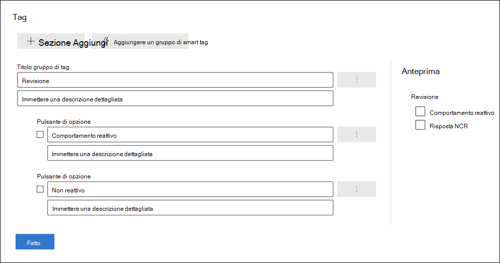
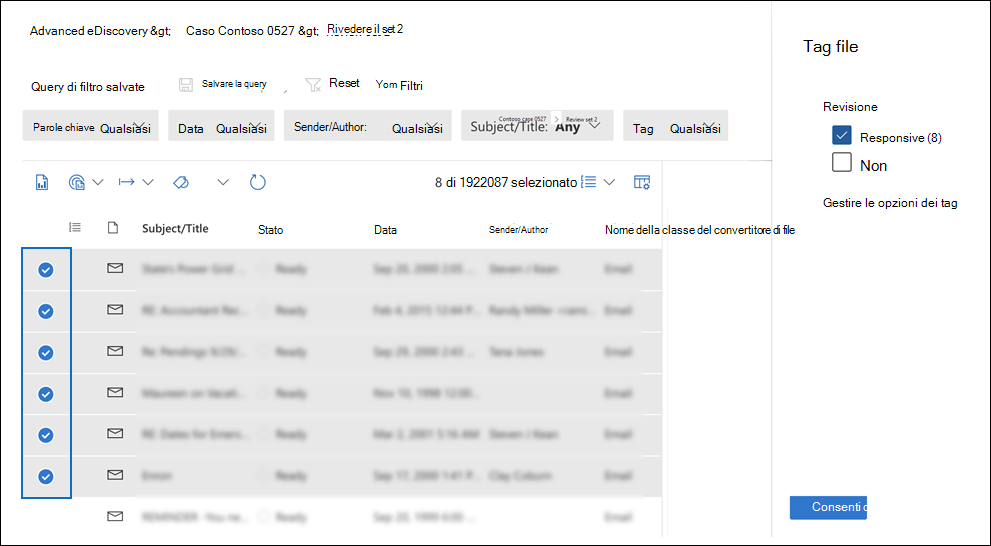

# Contrassegnare i documenti in un set di revisioni in Advanced eDiscoveryTag documents in a review set in Advanced eDiscovery

L'organizzazione del contenuto in un set di revisione è importante per completare vari flussi di lavoro nel processo di eDiscovery.Organizing content in a review set is important to complete various workflows in the eDiscovery process. Tra questi vi sono anche:This includes:

- Eliminare contenuto non necessarioCulling unnecessary content

- Identificazione del contenuto pertinenteIdentifying relevant content

- Identificazione del contenuto che deve essere esaminato da un esperto o da un avvocatoIdentifying content that must be reviewed by an expert or attorney

Quando esperti, avvocati o altri utenti esaminano il contenuto in un set di recensioni, le loro opinioni relative al contenuto possono essere acquisite utilizzando tag.When experts, attorneys, or other users review content in a review set, their opinions related to the content can be captured by using tags. Ad esempio, se lo scopo è eliminare il contenuto non necessario, un utente può contrassegnare i documenti con un tag, ad esempio "non reattivo".For example, if the intent is to cull unnecessary content, a user can tag documents with a tag such as "non-responsive". Dopo aver esaminato e taggato il contenuto, è possibile creare una ricerca nel set di recensioni per escludere qualsiasi contenuto contrassegnato come "non reattivo".After content has been reviewed and tagged, a review set search can be created to exclude any content tagged as "non-responsive". Questo processo elimina il contenuto non reattivo dai passaggi successivi del flusso di lavoro di eDiscovery.This process eliminates the non-responsive content from the next steps in the eDiscovery workflow. Il riquadro di tagging in un set di revisione può essere personalizzato per ogni caso in modo che i tag supportino il flusso di lavoro di revisione previsto per il caso.The tagging panel in a review set can be customized for every case so that the tags support the intended review workflow for the case.

> [!NOTE]
> L'ambito dei tag è un Advanced eDiscovery caso.The scope of tags is an Advanced eDiscovery case. Ciò significa che un caso può avere un solo set di tag che i revisori possono usare per contrassegnare i documenti del set di revisione.That means a case can only have one set of tags that reviewers can use to tag review set documents. Non è possibile configurare un set diverso di tag da utilizzare in set di revisione diversi nello stesso caso.You can't set up a different set of tags for use in different review sets in the same case.

## Tipi di tagTag types

Advanced eDiscovery fornisce due tipi di tag:Advanced eDiscovery provides two types of tags:

- **Tag a scelta** singola : limita i revisori alla selezione di un singolo tag all'interno di un gruppo.**Single choice tags**: Restricts reviewers to selecting a single tag within a group. Questi tipi di tag possono essere utili per garantire che i revisori non selezionano tag in conflitto, ad esempio "reattivi" e "non reattivi".These types of tags can be useful to ensure that reviewers don't select conflicting tags such as "responsive" and "non-responsive". I tag a scelta singola vengono visualizzati come pulsanti di opzione.Single choice tags appear as radio buttons.

- **Tag a scelta multipla**: consente alle recensioni di selezionare più tag all'interno di un gruppo.**Multiple choice tags**: Allow reviews to select multiple tags within a group. Questi tipi di tag vengono visualizzati come caselle di controllo.These types of tags appear as checkboxes.

## Struttura tagTag structure

Oltre ai tipi di tag, la struttura dell'organizzazione dei tag nel pannello tag può essere usata per rendere più intuitivo l'applicazione di tag ai documenti.In addition to the tag types, the structure of how tags are organized in the tag panel can be used to make tagging documents more intuitive. I tag sono raggruppati per sezioni.Tags are grouped by sections. La ricerca dei set di recensioni supporta la possibilità di eseguire ricerche per tag e per sezione tag.Review set search supports the ability to search by tag and by tag section. Ciò significa che puoi creare una ricerca di set di recensioni per recuperare i documenti contrassegnati con qualsiasi tag in una sezione.This means you can create a review set search to retrieve documents tagged with any tag in a section.

Puoi organizzare ulteriormente i tag annidandoli all'interno di una sezione.You can further organize tags by nesting them within a section. Ad esempio, se lo scopo è identificare e contrassegnare il contenuto con privilegi, è possibile utilizzare la annidamento per chiarire che un revisore può contrassegnare un documento come "privilegiato" e selezionare il tipo di privilegio controllando il tag annidato appropriato.For example, if the intent is to identify and tag privileged content, nesting can be used to make it clear that a reviewer can tag a document as "Privileged" and select the type of privilege by checking the appropriate nested tag.

## Creare tagCreate tags

Prima di applicare tag ai documenti nel set di revisioni, è necessario creare una struttura di tag.Before applying tags to documents in the review set, you need to create a tag structure.

1. Aprire un set di revisioni e passare alla barra dei comandi e selezionare **Tag per query.**Open a review set and navigate to the command bar and select **Tag by query**.

2. Nel pannello di tagging seleziona **Gestisci opzioni tag**In the tagging panel, select **Manage tag options**

3. Seleziona **Aggiungi sezione tag.**Select **Add tag section**.

4. Digitare il titolo di un gruppo di tag e una descrizione facoltativa e quindi fare clic su **Salva.**Type a tag group title and an optional description, and then click **Save**.

5. Seleziona il menu a discesa con tre puntini accanto al titolo del gruppo di tag e fai clic **sulla casella di** controllo Aggiungi o sul pulsante di opzione **Aggiungi.**Select the triple dot dropdown menu next to the tag group title and click **Add check box** or **Add option button**.

6. Digitare un nome e una descrizione per la casella di controllo o il pulsante di opzione.Type a name and description for the checkbox or option button.

7. Ripeti questo processo per creare nuove sezioni di tag, opzioni di tag e caselle di controllo.Repeat this process to create new tag sections, tag options, and checkboxes.

   

## Applicazione di tagApplying tags

Con la struttura dei tag impostata, i revisori possono applicare tag ai documenti di un set di revisioni.With the tag structure in place, reviewers can apply tags to documents in a review set. Esistono due modi diversi per applicare i tag:There are two different ways to apply tags:

- Tag fileTag files

- Tag per queryTag by query

### Tag fileTag files

Indipendentemente dal fatto che si selezioni un singolo elemento o più elementi in un set di revisioni, è possibile applicare tag alla selezione facendo clic su **Tag file** nella barra dei comandi.Whether you select a single item or several items in a review set, you can apply tags to their selection by clicking **Tag files** in the command bar. Nel pannello di tagging puoi selezionare un tag e applicarlo automaticamente ai documenti selezionati.In the tagging panel, you can select a tag and it is automatically applied to the selected documents.

> [!NOTE]
> I tag verranno applicati solo agli elementi selezionati nell'elenco di elementi.Tags will be applied only to selected items in the list of items.

### Tag per queryTag by query

L'applicazione di tag tramite query consente di applicare tag a tutti gli elementi visualizzati da una query di filtro attualmente applicata nel set di revisioni.Tagging by query lets you apply tags to all items displayed by a filter query that's currently applied in the review set.

1. Deselezionare tutti gli elementi nel set di revisione e passare alla barra dei comandi e selezionare **Contrassegna per query**.Unselect all items in the review set and go to the command bar and select **Tag by query**.

2. Nel riquadro di tagging seleziona il tag che vuoi applicare.In the tagging panel, select the tag that you want to apply.

3. **Nell'elenco a discesa Selezione tag** sono disponibili tre opzioni che determinano a quali elementi applicare il tag.Under the **Tag selection** dropdown, there are three options that dictate which items to apply the tag to.

   - **Elementi che corrispondono a query applicata**: applica tag a elementi specifici che soddisfano le condizioni della query di filtro.**Items that match applied query**: Applies tags to specific items that match the filter query conditions.

   - **Includi elementi famiglia associati**: applica tag a elementi specifici che soddisfano le condizioni della query di filtro e gli elementi della famiglia associati.**Include associated family items**: Applies tags to specific items that match the filter query conditions and their associated family items. *Gli elementi della* famiglia sono elementi che condividono lo stesso valore di metadati FamilyId.*Family items* are items that share the same FamilyId metadata value.  

   - **Includi elementi di conversazione associati**: applica tag agli elementi che soddisfano le condizioni di query del filtro e agli elementi di conversazione associati.**Include associated conversation items**: Applies tags to items that match the filter query conditions and their associated conversation items. *Gli elementi di* conversazione sono elementi che condividono gli stessi valori dei metadati ConversationId.*Conversation items* are items that share the same ConversationId metadata values.

   

4. Fare **clic su Avvia processo di tagging** per attivare il processo di tagging.Click **Start tagging job** to trigger the tagging job.

## Filtro tagTag filter

Utilizzare il filtro tag nel set di revisione per trovare o escludere rapidamente elementi dai risultati della query in base alla modalità di applicazione di tag a un elemento.Use the tag filter in review set to quickly find or exclude items from the query results based on how an item is tagged. 

1. Seleziona **Filtri** per espandere il pannello dei filtri.Select **Filters** to expand the filter panel.

2. Selezionare ed espandere **Proprietà elemento**.Select and expand **Item properties**.

3. Scorrere verso il basso per trovare il filtro denominato **Tag,** selezionare la casella di controllo e quindi fare clic su **Fine.**Scroll down to find the filter named **Tag**, select the checkbox, and then click **Done**.

4. Per includere o escludere elementi con un tag specifico da una query, eseguire una delle operazioni seguenti:To include or exclude items with a specific tag from a query, do one of the following:

   - **Includi elementi:** seleziona il valore del tag e seleziona Uguale a **uno qualsiasi** nel menu a discesa.**Include items**: Select the tag value and select **Equal any of** in the dropdown menu.

      OppureOr

   - **Escludi** elementi : seleziona il valore del tag e seleziona Uguale **a nessuno nel** menu a discesa.**Exclude items**: Select the tag value and select **Equals none of** in dropdown menu.

     

> [!NOTE]
> Assicurati di aggiornare la pagina per assicurarti che il filtro tag visualizzi le modifiche più recenti alla struttura dei tag.Be sure to refresh the page to ensure that the tag filter displays the latest changes to the tag structure.
