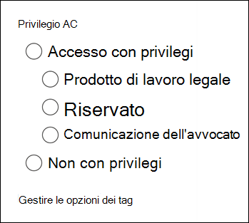

# Tag documenti in un set di revisione in Advanced eDiscovery

L'organizzazione del contenuto in un set di revisione è importante per completare diversi flussi di lavoro nel processo di eDiscovery. Ciò include:

- Eliminazione del contenuto non necessario

- Identificazione di contenuto pertinente
 
- Identificazione di contenuti che devono essere esaminati da un esperto o da un avvocato

Quando esperti, avvocati o altri utenti esaminano il contenuto in un set di revisione, le loro opinioni relative al contenuto possono essere acquisite utilizzando i tag. Ad esempio, se lo scopo è quello di eliminare contenuto non necessario, un utente può contrassegnare i documenti con un tag come "non rispondente". Dopo che il contenuto è stato revisionato e contrassegnato, è possibile creare una ricerca di set di revisione per escludere qualsiasi contenuto contrassegnato come "non reattivo", che elimina questo contenuto dai passaggi successivi del flusso di lavoro di eDiscovery. Il riquadro Tag può essere personalizzato per ogni caso, in modo che i tag possano supportare il flusso di lavoro di revisione previsto.

## Tipi di tag

Advanced eDiscovery offre due tipi di Tag:

- **Tag a scelta singola** : limita gli utenti a selezionare un singolo tag all'interno di un gruppo. Questo può essere utile per garantire agli utenti di non selezionare tag in conflitto, ad esempio "reattivi" e "non rispondenti". Questi verranno visualizzati come pulsanti di opzione.

- **Tag a scelta multipla** : consente agli utenti di selezionare più tag all'interno di un gruppo. Questi verranno visualizzati come caselle di controllo.

## Struttura tag

Oltre ai tipi di tag, è possibile utilizzare la struttura del modo in cui i tag vengono organizzati nel pannello Tag per rendere più intuitivi i documenti di tagging. I tag vengono raggruppati in base alle sezioni. Review set Search supporta la funzionalità di ricerca in base al tag e alla sezione Tag. Questo significa che è possibile creare una ricerca set di revisione per recuperare i documenti contrassegnati con un tag qualsiasi in una sezione.

I tag possono essere ulteriormente organizzati annidando questi all'interno di una sezione. Ad esempio, se si intende identificare e contrassegnare il contenuto con privilegi, è possibile utilizzare la nidificazione per specificare che un utente può contrassegnare un documento come "privilegiato" e selezionare il tipo di privilegio selezionando il tag nidificato appropriato.

## Applicazione di tag

Esistono diversi modi per applicare un tag al contenuto.

### Tagging di un singolo documento

Quando si visualizza un documento in un set di recensioni, è possibile visualizzare i tag che possono essere utilizzati da una recensione facendo clic su **tagging Panel**.

Ciò consentirà di applicare i tag al documento visualizzato nel visualizzatore.

### Tag di massa

È possibile eseguire il tagging in blocco selezionando più file nella griglia dei risultati e quindi utilizzando i tag del **riquadro di tagging** in modo analogo al tagging dei singoli documenti. Non è possibile eseguire un tagging in blocco selezionando due volte i tag; il primo clic applicherà il tag e la seconda selezione assicurerà che il tag sia deselezionato per tutti i file selezionati.

> [!NOTE]
> Quando si esegue il tagging in blocco, nel riquadro di tagging viene visualizzato il numero di file contrassegnati per ogni tag nel pannello.

### Tagging in altri pannelli di Revisione

Quando si esaminano i documenti, è possibile utilizzare gli altri pannelli di revisione per esaminare altre caratteristiche dei documenti nella griglia dei risultati. Questo include la revisione di altri documenti correlati, i thread di posta elettronica, la presenza di duplicati e duplicati hash. Ad esempio, quando si esaminano i documenti correlati (utilizzando il pannello di controllo della **famiglia di documenti** ), è possibile ridurre in modo significativo il tempo di revisione tramite la codifica in blocco dei documenti correlati. Ad esempio, se un messaggio di posta elettronica dispone di più allegati e si desidera garantire che l'intera famiglia sia contrassegnata in modo coerente.

Ad esempio, ecco come visualizzare il pannello di **tagging** quando si utilizza il pannello Revisione **famiglia documenti** :

1. Con il pannello Revisione aperto per un documento selezionato, ad esempio l'elenco di contenuto correlato nel pannello Revisione **famiglia** documenti, fare clic su **tag documenti** nel riquadro Revisione famiglia documenti.

   Il pannello di tagging viene visualizzato come finestra popup.

2. Scegliere uno o più tag per applicare il documento selezionato. 

3. Per contrassegnare tutti i documenti, selezionare tutti i documenti nel riquadro **famiglia** documenti, fare clic su **Documenti Tag**e quindi scegliere i tag da applicare all'intera famiglia di documenti.

