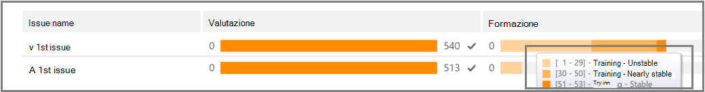
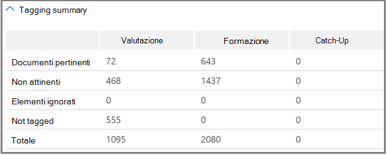

# Tenere traccia dell'analisi di rilevanza in Advanced eDiscoveryTrack Relevance analysis in Advanced eDiscovery
  
In Advanced eDiscovery, nella scheda Traccia di pertinenza viene visualizzata la validità calcolata del training di pertinenza eseguito nella scheda Tag e viene indicato il passaggio successivo da eseguire nel processo di formazione iterativa in Pertinenza.In Advanced eDiscovery, the Relevance Track tab displays the calculated validity of the Relevance training performed in the Tag tab and indicates the next step to take in the iterative training process in Relevance. 
  
## Monitoraggio dello stato di formazione per la pertinenzaTracking Relevance training status

1. Visualizzare i dettagli seguenti in Traccia di pertinenza per i problemi relativi ai casi, come illustrato nell'esempio seguente di una finestra di dialogo Nome **problema** riportata di seguito.View the following details in Relevance Track for the case issues, as shown in the following example of an **Issue name** dialog below.

   - **Valutazione**: questo indicatore di stato mostra in che misura il training di pertinenza eseguito fino a questo punto ha raggiunto l'obiettivo di valutazione in termini di margine di errore.**Assessment**: This progress indicator shows to what degree the Relevance training performed to this point has achieved the assessment target in terms of margin of error. Viene inoltre visualizzata la ricchezza dei risultati di formazione per la pertinenza.The richness of the Relevance training results is also displayed.

   - **Formazione:** questo indicatore di stato con codice a colori e la descrizione comando indicano la stabilità dei risultati del training per la pertinenza e una scala numerica che mostra il numero di esempi di formazione per la pertinenza contrassegnati per ogni problema.**Training**: This color-coded progress indicator and tool-tip indicates the Relevance training results stability and a numeric scale showing the number of Relevance training samples tagged for each issue. L'esperto monitora l'avanzamento del processo iterativo di formazione sulla rilevanza.The expert monitors the progress of the iterative Relevance training process. 
  
   - **Calcolo batch:** questo indicatore di stato fornisce informazioni sul completamento del calcolo batch.**Batch calculation**: This progress indicator provides information about the completion of Batch calculation.
  
   - **Passaggio successivo**: visualizza il suggerimento per il passaggio successivo da eseguire.**Next step**: Displays the recommendation for the next step to be performed. 
  
    Nell'esempio viene visualizzata una valutazione completata correttamente per un problema, indicata dall'indicatore di stato del colore completato e dal segno di spunta.In the example, a successfully completed Assessment for an issue is shown, indicated by the completed color progress indicator and the checkmark. È in corso il tagging, ma il caso è ancora considerato instabile (lo stato di stabilità viene visualizzato anche in una descrizione comando).Tagging is underway, but the case is still considered unstable (stability status also shown in a tool-tip). Il passaggio successivo è "Training".The next step recommendation is "Training". 
  
    
  
    La visualizzazione espansa visualizza informazioni e opzioni aggiuntive.The expanded view displays additional information and options. Il margine di errore corrente visualizzato è il margine di errore del richiamo nello stato corrente di valutazione, dati i file di valutazione esistenti (già contrassegnati).The displayed current error margin is the error margin of the recall in the current state of assessment, given the existing (already tagged) assessment files.
  
    > [!NOTE]
    >  La fase di valutazione può essere ignorata deselezionando la casella **di** controllo Valutazione per ogni problema e quindi per "tutti i problemi".The Assessment stage can be bypassed by clearing the **Assessment** check box per issue and then for "all issues". Tuttavia, di conseguenza, non ci saranno statistiche per questo problema.However, as a result, there will be no statistics for this issue. > la casella di controllo **Valutazione** può essere eseguita solo prima dell'esecuzione della valutazione.> Clearing the **Assessment** check box can only be done before assessment is performed. Se in un caso esistono più problemi, la valutazione viene ignorata solo se la casella di controllo è deselezionata per ogni problemaWhere multiple issues exist in a case, assessment is bypassed only if the check box is cleared for each issue 
  
    Quando la valutazione non viene completata con il primo set di file di esempio, la valutazione potrebbe essere il passaggio successivo per contrassegnare più file.When assessment is not completed with the first sample set of files, assessment might be the next step for tagging more files.
  
    In **Traccia di rilevanza,** l'indicatore di avanzamento del training e la descrizione comando indicano il numero stimato di campioni aggiuntivi necessari per \> raggiungere la stabilità.In **Relevance** \> **Track**, the training progress indicator and tool-tip indicate the estimated number of additional samples needed to reach stability. Questa stima fornisce una linea guida per la formazione aggiuntiva necessaria.This estimate provides a guideline for the additional training needed.
  
    
  
2. Al termine del tagging e se è necessario continuare la formazione, fare clic su **Formazione**.When you're done tagging and if you need to continue training, click **Training**. Un altro set di file di esempio viene generato dal set di file caricato per ulteriore formazione.Another sample set of files is generated from the loaded file set for additional training. Viene quindi restituita la scheda Tag per contrassegnare e formare altri file.You are then returned to the Tag tab to tag and train more files.

### Raggiungere livelli di formazione stabiliReaching stable training levels

Dopo che i file di valutazione hanno raggiunto un livello stabile di formazione, Advanced eDiscovery è pronto per il calcolo batch.After the assessment files have attained a stable level of training, Advanced eDiscovery is ready for Batch calculation.
  
> [!NOTE]
> In genere, dopo tre campioni di formazione stabili, il passaggio successivo è "Calcolo batch".Usually, after three stable training samples, the next step is "Batch calculation". Possono esserci eccezioni, ad esempio, quando sono state apportate modifiche al tagging dei file di esempi precedenti o quando sono stati aggiunti file di seeding.There may be exceptions, for example, when there were changes to the tagging of files from earlier samples or when seed files were added. 
  
### Esecuzione del calcolo batchPerforming Batch calculation

Il calcolo batch viene eseguito come passaggio successivo dopo il completamento dell'addestramento (quando viene visualizzato uno stato di formazione stabile dall'indicatore di stato, un segno di spunta e uno stato stabile nella descrizione comando). Il calcolo batch applica le conoscenze acquisite durante la formazione sulla pertinenza all'intera popolazione di file, per valutare la pertinenza dei file e per assegnare i punteggi di pertinenza.Batch calculation is executed as the next step after training is successfully completed (when a stable training status is shown by the progress bar, a checkmark and stable status in the tool-tip.) Batch calculation applies the knowledge acquired during the Relevance training to the entire file population, to assess the files' relevance and to assign Relevance scores.
  
Quando è presente più di un problema, il calcolo batch viene eseguito per ogni problema.When there is more than one issue, Batch calculation is done per issue. Durante il calcolo batch, l'avanzamento viene monitorato durante l'elaborazione di tutti i file.During Batch calculation, progress is monitored while processing all of the files. 
  
In questo caso, il passaggio successivo consigliato è "None", che indica che non è necessario un ulteriore training iterativo per la pertinenza a questo punto.Here, the recommended next step is "None", which indicates that no additional iterative Relevance training is required at this point. La fase successiva è la **scheda \> Pertinenza Decidi.**The next phase is the **Relevance \> Decide** tab. 
  
Se si desidera importare nuovi file dopo il calcolo batch, l'amministratore può aggiungere i file importati a un nuovo carico.If you want to import new files after Batch calculation, the administrator can add the imported files to a new load.
  
> [!NOTE]
> Se si fa **clic su Annulla** durante il calcolo batch, il processo salva ciò che è già stato eseguito.If you click **Cancel** during Batch calculation, the process saves what was already executed. Se si esegue di nuovo il calcolo batch, il processo continuerà dall'ultimo punto eseguito.If you run Batch calculation again, the process will continue from the last executed point. 
  
### Valutazione della coerenza dei tagAssessing tagging consistency

Se sono presenti incoerenze nel tagging dei file, può influire sull'analisi.If there are inconsistencies in file tagging, it can affect the analysis. Il Advanced eDiscovery di coerenza dei tag può essere utilizzato quando i risultati non sono ottimali o se la coerenza è in dubbio.The Advanced eDiscovery tagging consistency process can be used when results are not optimal or consistency is in doubt. Viene restituito un elenco dei possibili file contrassegnati in modo incoerente e possono essere esaminati e ritantati, se necessario.A list of possible inconsistently tagged files is returned, and they can be reviewed and retagged, as necessary.
  
> [!NOTE]
> Dopo sette o più round di formazione dopo la valutazione, la coerenza dei tag può essere visualizzata in **Pertinenza** \> **Track** \> **Issue** \> **Detailed results** Training \> **progress**.After seven or more training rounds following assessment, tagging consistency can be viewed in **Relevance** \> **Track** \> **Issue** \> **Detailed results** \> **Training progress**. Questa revisione viene eseguita per un problema alla volta.This review is done for one issue at a time.
  
1. In **Traccia di \> pertinenza** espandere la riga di un problema.In **Relevance \> Track**, expand an issue's row.
  
2. A destra di **Passaggio successivo** fare clic su **Modifica.**To the right of **Next step**, click **Modify**.
  
3. Seleziona **Tag incoerenze** come opzione Passaggio **successivo,** dopo sette esempi di formazione e fai clic su **OK.**Select **Tag inconsistencies** as the **Next step** option, after seven training samples and click **OK**.
  
4. Selezionare **Incoerenze tag.**Select **Tag inconsistencies**. Verrà **visualizzata** la scheda Tag con un elenco delle incoerenze da ritagare in base alle esigenze.The **Tag** tab opens displaying a list of the inconsistencies to retag as necessary.
  
5. Fare **clic su** Calcola per inviare le modifiche.Click **Calculate** to submit the changes. Il passaggio successivo dopo l'applicazione di tag alle incoerenze è "Formazione".The next step after tagging inconsistencies is "Training". 
  
## Visualizzazione e utilizzo dei risultati di pertinenzaViewing and using Relevance results

Nella scheda **Traccia di \> pertinenza** espandere la riga di un problema e accanto a **Risultati dettagliati** fare clic su **Visualizza.**In the **Relevance \> Track** tab, expand an issue's row, and next to **Detailed results**, click **View**. Vengono visualizzati i riquadri dei risultati dettagliati, come illustrato e descritto di seguito.The Detailed results panes are displayed, as shown and described below.
  

  
### Riepilogo taggingTagging summary

 Nell'esempio riportato di seguito, nel riepilogo **tagging** vengono visualizzati i totali per ogni processo di tagging dei file di valutazione, formazione e di ripristino.In the example shown below, the **Tagging summary** displays totals for each of Assessment, Training, and Catch-up file tagging processes.
  

  
### Parole chiaveKeywords

Una parola chiave è una stringa univoca, una parola, una frase o una sequenza di parole in un file identificato da Advanced eDiscovery come indicatore significativo dell'eventuale pertinente di un file.A keyword is a unique string, word, phrase, or sequence of words in a file identified by Advanced eDiscovery as a significant indicator of whether a file is relevant. La parola chiave dell'elenco di colonne "Includi" e i pesi nei file contrassegnati come rilevanti e le colonne "Escludi" elencano parole chiave e pesi nei file contrassegnati come Non rilevante.The "Include" columns list keyword and weights in files tagged as Relevant, and the "Exclude" columns lists keywords and weights in files tagged as Not relevant.
  
Advanced eDiscovery assegna valori negativi o positivi del peso delle parole chiave.Advanced eDiscovery assigns negative or positive keyword weight values. Maggiore è il peso, maggiore è la probabilità che a un file in cui viene visualizzata la parola chiave venga assegnato un punteggio di rilevanza più alto durante il calcolo batch.The higher the weight, the higher the likelihood that a file in which the keyword appears is assigned a higher Relevance score during Batch calculation.
  
L Advanced eDiscovery di parole chiave può essere usato per integrare un elenco creato da un esperto o come controllo di sanità mentale indiretta in qualsiasi momento del processo di revisione dei file.The Advanced eDiscovery list of keywords can be used to supplement a list built by an expert or as an indirect sanity check at any point in the file review process.
  
### Avanzamento della formazioneTraining progress

Il **riquadro Avanzamento formazione** include un grafico sullo stato di avanzamento del training e la visualizzazione dell'indicatore di qualità, come illustrato nell'esempio seguente.The **Training Progress** pane includes a training progress graph and quality indicator display, as shown in the example below.
  

  
**Indicatore qualità formazione**: Visualizza la classificazione della coerenza di tagging nel modo seguente:**Training quality indicator**: Displays the rating of the tagging consistency as follows:
  
- **Buona:** i file sono contrassegnati in modo coerente.**Good**: Files are tagged consistently. (Luce verde visualizzata)(Green light displayed)
  
- **Medio:** alcuni file potrebbero essere contrassegnati in modo incoerente.**Medium**: Some files may be tagged inconsistently. (Luce gialla visualizzata)(Yellow light displayed)

- **Avviso:** molti file potrebbero essere contrassegnati in modo incoerente.**Warning**: Many files may be tagged inconsistently. (Luce rossa visualizzata)(Red light displayed)

**Grafico dello stato di** avanzamento della formazione : mostra il grado di stabilità del training di rilevanza dopo molti cicli di formazione per la pertinenza rispetto al valore di misurazione F.**Training progress graph**: Shows the degree of Relevance training stability after many Relevance training cycles in comparison to the F-measure value. Quando ci spostiamo da sinistra a destra nel grafico, l'intervallo di confidenza si restringe e viene usato, insieme alla misura F, da Advanced eDiscovery Relevance per determinare la stabilità quando i risultati del training per la pertinenza sono ottimizzati.As we move from the left to the right across the graph, the confidence interval narrows and is used, along with the F-measure, by Advanced eDiscovery Relevance to determine stability when the Relevance training results are optimized.
  
> [!NOTE]
> Per la pertinenza viene utilizzato F2, una metrica di misurazione F in cui il richiamo riceve il doppio del peso della precisione.Relevance uses F2, an F-measure metric where Recall receives twice as much weight as Precision. Per i casi di elevata ricchezza (oltre il 25%), per rilevanza viene utilizzato F1 (rapporto 1:1).For cases with high richness (over 25%), Relevance uses F1 (1:1 ratio). Il rapporto di misurazione F può essere configurato in **Configurazione per pertinenza** \> **Impostazioni avanzate.**The F-measure ratio can be configured in **Relevance setup** \> **Advanced settings**.
  
### Risultati del calcolo batchBatch calculation results

Il **riquadro Risultati calcolo batch** include il numero di file con punteggio per Rilevanza, come indicato di seguito:The **Batch calculation results** pane includes the number of files that were scored for Relevance, as follows: 
  
- **Esito positivo****Success**
  
- **Vuoto**: non contiene testo, ad esempio solo spazi/tabulazioni**Empty**: Contains no text, for example, only spaces/tabs
  
- **Failed**: A causa di dimensioni eccessive o non è stato possibile leggere**Failed**: Due to excessive size or could not be read
  
- **Ignorato:** a causa di dimensioni eccessive**Ignored**: Due to excessive size
  
- **Nebuloso:** contiene testo senza significato o nessuna funzionalità rilevante per il problema**Nebulous**: Contains meaningless text or no features relevant to the issue
  
> [!NOTE]
> Vuoto, Non riuscito, Ignorato o Nebuloso riceverà un punteggio di pertinenza pari a -1.Empty, Failed, Ignored, or Nebulous will receive a Relevance score of -1.
  
### Statistiche di formazioneTraining statistics

Nel **riquadro Statistiche formazione** vengono visualizzate statistiche e grafici in base ai risultati Advanced eDiscovery formazione sulla pertinenza.The **Training statistics** pane displays statistics and graphs based on results from Advanced eDiscovery Relevance training. 
  

  
Questa visualizzazione mostra quanto segue:This view shows the following:
  
- **Rapporto revisione-richiamo**: confronto dei risultati in base ai punteggi di pertinenza in una revisione ipoteticamente lineare.**Review-recall ratio**: Comparison of results according to Relevance scores in a hypothetically linear review. Il richiamo viene stimato in base al set di dimensioni impostato per la revisione.Recall is estimated given the review set size set.
  
- **Parametri**: statistiche calcolate cumulative relative al set di revisione in relazione alla popolazione di file per l'intero caso.**Parameters**: Cumulative calculated statistics pertaining to the review set in relation to the file population for the entire case.
  
- **Review:** percentuale di file da esaminare in base a questo limite.**Review**: Percentage of files to review based on this cutoff.
  
- **Richiamo:** percentuale di file rilevanti nel set di revisioni.**Recall**: Percentage of Relevant files in the review set. 
  
- **Distribuzione in base al punteggio di pertinenza**: i file nella visualizzazione grigio scuro a sinistra sono al di sotto del punteggio di pertinenza.**Distribution by relevance score**: Files in the dark gray display to the left are below the cutoff score. Una descrizione comando visualizza il punteggio di pertinenza e la percentuale correlata di file nel set di file di revisione in relazione al totale dei file.A tool-tip displays the Relevance score and the related percentage of files in the review file set in relation to the total files.
