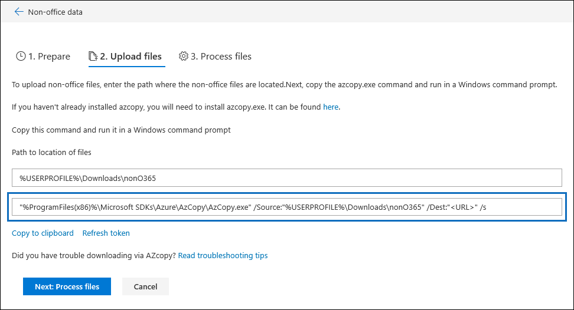

# Risoluzione dei problemi relativi a AzCopy in Advanced eDiscoveryTroubleshoot AzCopy in Advanced eDiscovery

Quando si caricano dati o documenti non Microsoft 365 per la correzione degli errori in Advanced eDiscovery, l'interfaccia utente fornisce un comando AzCopy di Azure che contiene parametri con il percorso in cui vengono archiviati i file che si desidera caricare e il percorso di archiviazione di Azure in cui verranno caricati i file.When loading non-Microsoft 365 data or documents for error remediation in Advanced eDiscovery, the user interface supplies an Azure AzCopy command that contains parameters with the location of where the files that you want to upload are stored and the Azure storage location that the files will be uploaded to. Per caricare i documenti, è possibile copiare questo comando e quindi eseguirlo in un prompt dei comandi nel computer locale.To upload your documents, you copy this command and then run it in a Command Prompt on your local computer.  Nello screenshot seguente è riportato un esempio di un comando AzCopy:The follow screenshot shows an example of an AzCopy command:

In genere, il comando fornito funziona quando lo si esegue.Usually the command that's provided works when you run it. Tuttavia, è possibile che i casi in cui il comando visualizzato non venga eseguito correttamente.However, there may be cases when the command that's displayed will not run successfully. Ecco alcuni possibili motivi.Here's a few possible reasons.

## La versione supportata di AzCopy non è installata nel computer localeThe supported version of AzCopy isn't installed on the local computer

A questo punto, è necessario utilizzare AzCopy v 8.1 per caricare i dati non Microsoft 365 in Advanced eDiscovery.At this time, you must use AzCopy v8.1 to load non-Microsoft 365 data in Advanced eDiscovery. Il comando AzCopy visualizzato nella pagina **Carica file** visualizzata nella schermata precedente restituisce un errore se non si utilizza AzCopy v 8.1.The AzCopy command that's displayed on the **Upload files** page shown in the previous screenshot returns an error if you're not using AzCopy v8.1. Per installare questa versione, vedere [trasferire dati con AzCopy v 8.1 in Windows](https://docs.microsoft.com/previous-versions/azure/storage/storage-use-azcopy).To install this version, see [Transfer data with the AzCopy v8.1 on Windows](https://docs.microsoft.com/previous-versions/azure/storage/storage-use-azcopy).

## AzCopy non è installato nel computer locale o non è installato nel percorso predefinitoAzCopy isn't installed on the local computer or it's not installed in the default location

Se AzCopy non è installato oppure è installato in un percorso diverso da quello predefinito (ovvero `%ProgramFiles(x86)%` ), quando si esegue il comando AzCopy è possibile che venga visualizzato il messaggio di errore seguente:If AzCopy isn't installed or it's installed in a location other than the default install location (which is `%ProgramFiles(x86)%`), you may receive the following error when you run the AzCopy command:

    The system cannot find the path specified.

Se AzCopy non è installato nel computer locale, è possibile trovare informazioni sull'installazione in [trasferimento dati con AzCopy v 8.1 in Windows](https://docs.microsoft.com/previous-versions/azure/storage/storage-use-azcopy).If AzCopy isn't installed on the local computer, you can find installation information in [Transfer data with the AzCopy v8.1 on Windows](https://docs.microsoft.com/previous-versions/azure/storage/storage-use-azcopy). Assicurarsi di installarlo nel percorso predefinito.Be sure to install it in the default location.

Se AzCopy è installato, ma è installato in una posizione diversa da quella predefinita, è possibile copiare il comando, incollarlo in un file di testo e quindi cambiare il percorso in cui è installato AzCopy.If AzCopy is installed, but it's installed in a location different than the default location, you can copy the command, paste it to a text file, and then change the path to the location where AzCopy is installed. Ad esempio, se si trova Azcopy `%ProgramFiles%` , è possibile modificare la prima parte del comando da `%ProgramFiles(x86)%\Microsoft SDKs\Azure\AzCopy.exe` a `%ProgramFiles%\Microsoft SDKs\Azure\AzCopy` .For example, if Azcopy is located in `%ProgramFiles%`, then you can change the first part of the command from `%ProgramFiles(x86)%\Microsoft SDKs\Azure\AzCopy.exe` to `%ProgramFiles%\Microsoft SDKs\Azure\AzCopy`. Dopo aver apportato questa modifica, copiarla dal file di testo e quindi eseguirla come prompt dei comandi.After you make this change, copy it from the text file and then run it a Command Prompt.

> [!TIP]
> Se AzCopy è installato in un percorso diverso dal percorso di installazione predefinito, è consigliabile disinstallarlo e quindi reinstallarlo nel percorso predefinito.If AzCopy is installed in a location other then the default install location, consider uninstalling it and then re-installing it in the default location. Ciò consentirà di prevenire questo problema in futuro.This will help prevent this issue in the future.
