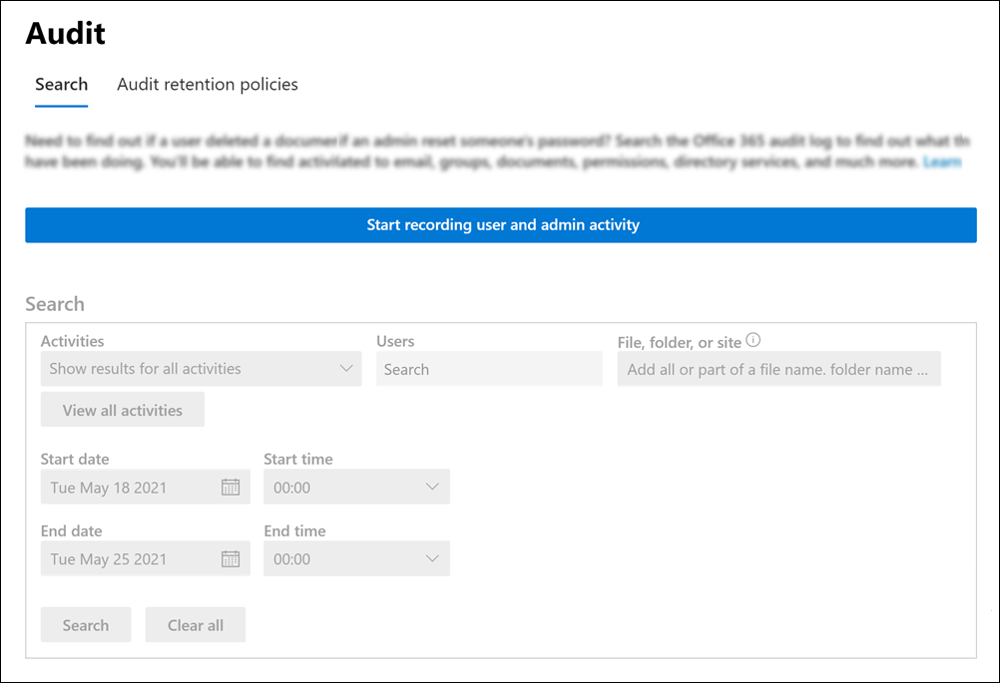

# <a name="turn-auditing-on-or-off"></a>Attivare o disattivare il controllo

La registrazione di controllo è attivata per impostazione predefinita per le organizzazioni di Microsoft 365 e Office 365 Enterprise. Ciò include le organizzazioni con abbonamenti E3 / G3 o E5 / G5. Quando il controllo nel Centro conformità è attivato, le attività degli utenti e degli amministratori dell'organizzazione vengono registrate nel log di controllo e conservate per 90 giorni e fino a un anno a seconda della licenza assegnata agli utenti. Tuttavia, l'organizzazione potrebbe avere motivi per non voler registrare e conservare i dati del registro di controllo. In questi casi, un amministratore globale può decidere di disattivare il controllo in Microsoft 365.

> [!IMPORTANT]
> Se si disattiva il controllo in Microsoft 365, non è possibile usare l'API di attività di gestione di Office 365 o Azure Sentinel per accedere ai dati di controllo per l'organizzazione. Disattivare il controllo seguendo i passaggi descritti in questo articolo significa che non verrà restituito alcun risultato quando si esegue una ricerca nel log di controllo utilizzando il Centro sicurezza e conformità di & o quando si esegue il cmdlet **Search-UnifiedAuditLog** in Exchange Online PowerShell. Questo significa anche che i log di controllo non saranno disponibili tramite l'API Office 365 management o Azure Sentinel.
  
## <a name="before-you-turn-auditing-on-or-off"></a>Prima di attivare o disattivare il controllo

- Per attivare o disattivare il controllo nell Exchange Online nell'organizzazione Microsoft 365 controllo. Per impostazione predefinita, questo ruolo viene assegnato ai gruppi  di ruoli Gestione conformità e Gestione organizzazione nella pagina Autorizzazioni nell'Exchange di amministrazione. Gli amministratori globali in Microsoft 365 sono membri del gruppo di ruoli Gestione organizzazione in Exchange Online. 

    > [!NOTE]
    > Agli utenti devono essere assegnate le autorizzazioni Exchange Online attivare o disattivare il controllo. Se si assegna agli utenti  il ruolo Log di controllo nella pagina Autorizzazioni del Centro sicurezza & conformità, non potranno attivare o disattivare il controllo. Questo perché il cmdlet sottostante è un cmdlet Exchange Online PowerShell. 

- Per istruzioni dettagliate sulla ricerca nel log di controllo, vedere [Search the audit log in the Security & Compliance Center.](search-the-audit-log-in-security-and-compliance.md) Per altre informazioni sull'API di Microsoft 365 Management Activity, vedi Introduzione alle API di [Microsoft 365 Management.](/office/office-365-management-api/get-started-with-office-365-management-apis)

- Per verificare che il controllo sia attivato, è possibile eseguire il comando seguente in Exchange Online PowerShell:

    ```powershell
    Get-AdminAuditLogConfig | FL UnifiedAuditLogIngestionEnabled
    ```

    Il valore di  `True` per la  _proprietà UnifiedAuditLogIngestionEnabled_ indica che il controllo è attivato. 

## <a name="turn-on-auditing"></a>Attivare il controllo

Se il controllo non è attivato per l'organizzazione, è possibile attivarlo nel Centro conformità o Exchange Online PowerShell. L'attivazione del controllo può richiedere diverse ore prima di poter restituire i risultati durante la ricerca nel log di controllo.
  
### <a name="use-the-compliance-center-to-turn-on-auditing"></a>Usare il Centro conformità per attivare il controllo

1. Andare su <https://compliance.microsoft.com> ed eseguire l'accesso.

2. Nel riquadro di spostamento sinistro del Centro Microsoft 365 conformità fare clic **su Mostra tutto** e quindi su **Controlla.**

   Se il controllo non è attivato per l'organizzazione, viene visualizzato un banner in cui viene richiesto di avviare la registrazione delle attività degli utenti e degli amministratori.

   

3. Fai clic sul **banner Avvia registrazione attività utente e** amministratore.

   L'applicazione della modifica potrebbe richiedere fino a 60 minuti.

### <a name="use-powershell-to-turn-on-auditing"></a>Usare PowerShell per attivare il controllo

1. [Connettersi a PowerShell per Exchange Online](/powershell/exchange/connect-to-exchange-online-powershell)

2. Eseguire il comando di PowerShell seguente per attivare il controllo in Office 365.

    ```powershell
    Set-AdminAuditLogConfig -UnifiedAuditLogIngestionEnabled $true
    ```

    Viene visualizzato un messaggio che indica che la modifica potrebbe richiedere fino a 60 minuti.
  
## <a name="turn-off-auditing"></a>Disattivare il controllo

È necessario utilizzare Exchange Online PowerShell per disattivare il controllo.
  
1. [Connettersi a PowerShell per Exchange Online](/powershell/exchange/connect-to-exchange-online-powershell)

2. Eseguire il comando di PowerShell seguente per disattivare il controllo.

    ```powershell
    Set-AdminAuditLogConfig -UnifiedAuditLogIngestionEnabled $false
    ```

3. Dopo un po', verificare che il controllo sia disattivato (disabilitato). È possibile eseguire questa operazione in due modi:

    - In Exchange Online PowerShell, eseguire il comando seguente:

      ```powershell
      Get-AdminAuditLogConfig | FL UnifiedAuditLogIngestionEnabled
      ```

      Il valore di  `False` per la  _proprietà UnifiedAuditLogIngestionEnabled_ indica che il controllo è disattivato.

    - Passare alla pagina **Controllo** nel Centro Microsoft 365 conformità.

      Se il controllo non è attivato per l'organizzazione, viene visualizzato un banner in cui viene richiesto di avviare la registrazione delle attività degli utenti e degli amministratori.
