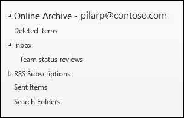

# Panoramica dell'archiviazione illimitataOverview of unlimited archiving

In Office 365, le cassette postali di archiviazione forniscono agli utenti ulteriore spazio di archiviazione delle cassette postali.In Office 365, archive mailboxes provide users with additional mailbox storage space. Dopo aver abilitato la cassetta postale di archiviazione di un utente, sono disponibili fino a 100 GB di spazio di archiviazione aggiuntivo.After a user's archive mailbox is enabled, up to 100 GB of additional storage is available. In passato, quando è stata raggiunta la quota di archiviazione da 100 GB, le organizzazioni hanno dovuto contattare Microsoft per richiedere ulteriore spazio di archiviazione per una cassetta postale di archiviazione.In the past, when the 100-GB storage quota was reached, organizations had to contact Microsoft to request additional storage space for an archive mailbox. Non è più così.That's no longer the case.

La funzionalità di archiviazione illimitata in Microsoft 365 (denominata archiviazione con espansione *automatica)* offre ulteriore spazio di archiviazione nelle cassette postali di archiviazione.The unlimited archiving feature in Microsoft 365 (called *auto-expanding archiving*) provides additional storage in archive mailboxes. Quando viene raggiunta la quota di archiviazione nella cassetta postale di archiviazione, Microsoft 365 aumenta automaticamente le dimensioni dell'archivio, il che significa che gli utenti non eseguono lo spazio di archiviazione delle cassette postali e gli amministratori non devono richiedere ulteriore spazio di archiviazione per le cassette postali di archiviazione.When the storage quota in the archive mailbox is reached, Microsoft 365 automatically increases the size of the archive, which means that users won't run out of mailbox storage space and administrators won't have to request additional storage for archive mailboxes.

Per istruzioni dettagliate sull'attivazione dell'archiviazione con espansione automatica, vedere [Enable unlimited archiving](enable-unlimited-archiving.md).For step-by-step instructions for turning on auto-expanding archiving, see [Enable unlimited archiving](enable-unlimited-archiving.md).

> [!NOTE]
> L'espansione automatica dell'archivio supporta anche le cassette postali condivise.Auto-expanding archiving also supports shared mailboxes. Per abilitare l'archivio per una cassetta postale condivisa, è necessaria una licenza di Exchange Online Piano 2 o una licenza di Exchange Online Piano 1 con Archiviazione Exchange Online licenza.To enable the archive for a shared mailbox, an Exchange Online Plan 2 license or an Exchange Online Plan 1 license with an Exchange Online Archiving license is required.

## Funzionamento dell'archiviazione con espansione automaticaHow auto-expanding archiving works

Come spiegato in precedenza, viene creato ulteriore spazio di archiviazione delle cassette postali quando è abilitata la cassetta postale di archiviazione di un utente.As previously explained, additional mailbox storage space is created when a user's archive mailbox is enabled. Quando l'archiviazione con espansione automatica è abilitata, Microsoft 365 controlla periodicamente le dimensioni della cassetta postale di archiviazione.When auto-expanding archiving is enabled, Microsoft 365 periodically checks the size of the archive mailbox. Quando una cassetta postale di archiviazione si avvicina al limite di archiviazione, Microsoft 365 crea automaticamente ulteriore spazio di archiviazione per l'archivio.When an archive mailbox gets close to its storage limit, Microsoft 365 automatically creates additional storage space for the archive. Se l'utente esauri lo spazio di archiviazione aggiuntivo, Microsoft 365 aggiunge più spazio di archiviazione all'archivio dell'utente.If the user runs out of this additional storage space, Microsoft 365 adds more storage space to the user's archive. Questo processo si verifica automaticamente, il che significa che gli amministratori non devono richiedere ulteriore archiviazione o gestire l'archiviazione con espansione automatica.This process happens automatically, which means administrators don't have to request additional archive storage or manage auto-expanding archiving.

Ecco una breve panoramica del processo.Here's a quick overview of the process.

1. L'archiviazione è abilitata per una cassetta postale utente o una cassetta postale condivisa.Archiving is enabled for a user mailbox or a shared mailbox. Viene creata una cassetta postale di archiviazione con 100 GB di spazio di archiviazione e la quota di avviso per la cassetta postale di archiviazione è impostata su 90 GB.An archive mailbox with 100 GB of storage space is created, and the warning quota for the archive mailbox is set to 90 GB.

2. Un amministratore abilita l'archiviazione con espansione automatica per la cassetta postale.An administrator enables auto-expanding archiving for the mailbox. Quando la cassetta postale di archiviazione (inclusa la cartella Elementi ripristinabili) raggiunge i 90 GB, viene convertita in un archivio con espansione automatica e Microsoft 365 aggiunge spazio di archiviazione all'archivio.When the archive mailbox (including the Recoverable Items folder) reaches 90 GB, it's converted to an auto-expanding archive, and Microsoft 365 adds storage space to the archive. Il provisioning dello spazio di archiviazione aggiuntivo può richiedere fino a 30 giorni.It can take up to 30 days for the additional storage space to be provisioned.

   > [!NOTE]
   > Se una cassetta postale viene messa in attesa o assegnata a un criterio di conservazione, la quota di archiviazione per la cassetta postale di archiviazione viene aumentata a 110 GB quando è abilitata l'archiviazione con espansione automatica.If a mailbox is placed on hold or assigned to a retention policy, the storage quota for the archive mailbox is increased to 110 GB when auto-expanding archiving is enabled. Analogamente, la quota di avviso di archiviazione viene aumentata a 100 GB.Similarly, the archive warning quota is increased to 100 GB.

3. Microsoft 365 aggiunge automaticamente più spazio di archiviazione quando necessario.Microsoft 365 automatically adds more storage space when necessary.

> [!IMPORTANT]
> L'espansione automatica dell'archivio è supportata solo per le cassette postali utilizzate per singoli utenti (o cassette postali condivise) con un tasso di crescita che non supera 1 GB al giorno.Auto-expanding archive is only supported for mailboxes used for individual users (or shared mailboxes) with a growth rate that doesn't exceed 1 GB per day. Una cassetta postale di archiviazione di un utente è destinata esclusivamente a quell'utente.A user's archive mailbox is intended for just that user. L'utilizzo dell'inserimento nel journal, delle regole di trasporto o delle regole di inoltro automatico per copiare i messaggi in una cassetta postale di archiviazione non è consentito.Using journaling, transport rules, or auto-forwarding rules to copy messages to an archive mailbox is not permitted. Microsoft si riserva il diritto di negare l'archiviazione illimitata nei casi in cui la cassetta postale di archiviazione di un utente viene utilizzata per archiviare i dati di archiviazione per altri utenti o in altri casi di utilizzo inappropriato.Microsoft reserves the right to deny unlimited archiving in instances where a user's archive mailbox is used to store archive data for other users or in other cases of the inappropriate use.

## Cosa viene spostato nello spazio di archiviazione di archiviazione aggiuntivo?What gets moved to the additional archive storage space?

Per utilizzare in modo efficiente l'archiviazione di archiviazione con espansione automatica, le cartelle potrebbero essere spostate.To make efficient use of auto-expanding archive storage, folders may get moved. Microsoft 365 determina quali cartelle vengono spostate quando viene aggiunto ulteriore spazio di archiviazione all'archivio.Microsoft 365 determines which folders get moved when additional storage is added to the archive. A volte, quando una cartella viene spostata, vengono create automaticamente una o più sottocartelle e gli elementi della cartella originale vengono distribuiti a queste cartelle per facilitare il processo di spostamento.Sometimes when a folder is moved, one or more subfolders are automatically created and items from the original folder are distributed to these folders to facilitate the moving process. Quando si visualizza la parte di archivio dell'elenco delle cartelle in Outlook, queste sottocartelle vengono visualizzate nella cartella originale.When viewing the archive portion of the folder list in Outlook, these subfolders are displayed under the original folder.  La convenzione di denominazione utilizzata da Microsoft 365 per denominare queste sottocartelle è _yyyy (Creato in **\<folder name\> mmm dd, yyyy h_mm)**, dove:The naming convention that Microsoft 365 uses to name these subfolders is **\<folder name\>_yyyy (Created on mmm dd, yyyy h_mm)**, where:

- **aaaa** è l'anno in cui sono stati ricevuti i messaggi nella cartella.**yyyy** is the year the messages in the folder were received.

- **mmm dd, yyyy h_m** è la data e l'ora in cui la sottocartella è stata creata da Office 365, in formato UTC, in base al fuso orario e alle impostazioni internazionali dell'utente in Outlook.**mmm dd, yyyy h_m** is the date and time that the subfolder was created by Office 365, in UTC format, based on the user's time zone and regional settings in Outlook.

Gli screenshot seguenti mostrano un elenco di cartelle prima e dopo che i messaggi vengono spostati in un archivio espanso automaticamente.The following screenshots show a folder list before and after messages are moved to an auto-expanded archive.

 **Prima dell'aggiunta di ulteriore spazio di archiviazione****Before additional storage is added**

 **Dopo l'aggiunta di ulteriore spazio di archiviazione****After additional storage is added**

> [!NOTE]
> Come descritto in precedenza, Microsoft 365 sposta gli elementi in sottocartelle (e li denomina utilizzando la convenzione di denominazione descritta in precedenza) per distribuire il contenuto in un archivio ausiliario.As previously described, Microsoft 365 moves items to subfolders (and names them using the naming convention described above) to help distribute content to an auxiliary archive. Tuttavia, lo spostamento di elementi in sottocartelle potrebbe non essere sempre il caso.But moving items to subfolders may not always be the case. A volte un'intera cartella può essere spostata in un archivio ausiliario.Sometimes an entire folder may be moved to an auxiliary archive. In questo caso, la cartella manterrà il nome originale.In this case, the folder will retain its original name.  Non sarà evidente nell'elenco delle cartelle di Outlook che la cartella è stata spostata in un archivio ausiliario.It won't be apparent in the folder list in Outlook that the folder was moved to an auxiliary archive.

## Requisiti di Outlook per l'accesso agli elementi in un archivio espanso automaticamenteOutlook requirements for accessing items in an auto-expanded archive

Per accedere ai messaggi archiviati in un archivio espanso automaticamente, gli utenti devono utilizzare uno dei client Outlook seguenti:To access messages that are stored in an auto-expanded archive, users have to use one of the following Outlook clients:

- Outlook 2016 o Outlook 2019 per WindowsOutlook 2016 or Outlook 2019 for Windows

- Outlook sul WebOutlook on the web

- Outlook 2016 o Outlook 2019 per MacOutlook 2016 or Outlook 2019 for Mac

Ecco alcuni aspetti da considerare quando si utilizza Outlook o Outlook sul Web per accedere ai messaggi archiviati in un archivio espanso automaticamente.Here are some things to consider when using Outlook or Outlook on the web to access messages stored in an auto-expanded archive.

- È possibile accedere a qualsiasi cartella nella cassetta postale di archiviazione, incluse quelle spostate nell'area di archiviazione espansa automaticamente.You can access any folder in your archive mailbox, including ones that were moved to the auto-expanded storage area.

- La ricerca per l'archiviazione espansa automaticamente è disponibile in Outlook per il Web (OWA).Search for auto-expanded archiving is available in Outlook for the web (OWA). Analogamente all'archivio online, è possibile cercare gli elementi spostati in un'area di archiviazione aggiuntiva.Similar to Online Archive, you can search for items that were moved to an additional storage area. Quando l'archivio è selezionato come ambito di ricerca in OWA, verranno cercati tutti gli archivi (inclusi gli archivi espansi automaticamente) e le sottocartelle corrispondenti.When archive is selected as the search scope in OWA, all archives (including auto-expanded archives) and their corresponding subfolders will be searched.

- La ricerca di archiviazione espansa automaticamente è disponibile in Outlook Desktop nel canale corrente (anteprima).Auto-expanded archive search is available in Outlook Desktop in Current Channel (Preview). All'interno di questa anteprima è disponibile l'ambito Cassetta postale corrente, che consente di eseguire ricerche nell'archivio espanso automaticamente.Within this preview, the Current Mailbox scope is available, thus allowing you to search the auto-expanded archive. Per ulteriori informazioni su questa e altre funzionalità di supporto di Microsoft Search, vedere [How Outlook for Windows connected to Exchange Online utilizes Microsoft Search.](https://techcommunity.microsoft.com/t5/outlook-global-customer-service/how-outlook-for-windows-connected-to-exchange-online-utilizes/ba-p/1715045)For more information about this and other Microsoft Search support features, see [How Outlook for Windows connected to Exchange Online utilizes Microsoft Search](https://techcommunity.microsoft.com/t5/outlook-global-customer-service/how-outlook-for-windows-connected-to-exchange-online-utilizes/ba-p/1715045). 

- I conteggi degli elementi in Outlook e i conteggi di lettura/lettura (in Outlook e Outlook sul Web) in un archivio espanso automaticamente potrebbero non essere accurati.Item counts in Outlook and Read/Unread counts (in Outlook and Outlook on the web) in an auto-expanded archive might not be accurate.

- È possibile eliminare elementi in una sottocartella che punta a un'area di archiviazione espansa automaticamente, ma la cartella stessa non può essere eliminata.You can delete items in a subfolder that points to an auto-expanded storage area, but the folder itself can't be deleted.

- Non è possibile utilizzare la funzionalità Recupera elementi eliminati per ripristinare un elemento eliminato da un'area di archiviazione espansa automaticamente.You can't use the Recover Deleted Items feature to recover an item that was deleted from an auto-expanded storage area.

## Archiviazione con espansione automatica e altre funzionalità di conformitàAuto-expanding archiving and other compliance features

In questa sezione vengono illustrate le funzionalità tra l'archiviazione con espansione automatica e altre funzionalità di conformità e governance dei dati.This section explains the functionality between auto-expanding archiving and other compliance and data governance features.

- **eDiscovery:** Quando si utilizza uno strumento di eDiscovery, ad esempio Ricerca contenuto o In-Place eDiscovery, vengono ricercate anche le aree di archiviazione aggiuntive in un archivio espanso automaticamente.**eDiscovery:** When you use an eDiscovery tool, such as Content Search or In-Place eDiscovery, the additional storage areas in an auto-expanded archive are also searched.

- **Conservazione:** Quando si archivia una cassetta postale utilizzando strumenti come il blocco per controversia legale in Exchange Online o i criteri di conservazione e archiviazione dei casi di eDiscovery nel Centro sicurezza e conformità, viene messo in attesa anche il contenuto che si trova in un archivio espanso automaticamente.**Retention:** When you put a mailbox on hold by using tools such as Litigation Hold in Exchange Online or eDiscovery case holds and retention policies in the security and compliance center, content located in an auto-expanded archive is also placed on hold.

- **Gestione record di messaggistica :Messaging records management (MRM):** Se si utilizzano i criteri di eliminazione di Gestione record di messaggistica in Exchange Online per eliminare definitivamente gli elementi delle cassette postali scaduti, verranno eliminati anche gli elementi scaduti che si trovano nell'archivio espanso automaticamente.**Messaging records management (MRM):** If you use MRM deletion policies in Exchange Online to permanently delete expired mailbox items, expired items located in the auto-expanded archive will also be deleted.

- **Servizio di importazione:** È possibile utilizzare il servizio di importazione di Office 365 per importare i file PST nell'archivio espanso automaticamente di un utente.**Import service:** You can use the Office 365 Import service to import PST files to a user's auto-expanded archive. È possibile importare fino a 100 GB di dati dai file PST nella cassetta postale di archiviazione dell'utente.You can import up to 100 GB of data from PST files to the user's archive mailbox.

## Ulteriori informazioniMore information

Per ulteriori dettagli tecnici sull'espansione automatica dell'archiviazione, vedere Domande frequenti su [Microsoft 365:](https://techcommunity.microsoft.com/t5/exchange-team-blog/office-365-auto-expanding-archives-faq/ba-p/607784)Espansione automatica degli archivi.For more technical details about auto-expanding archiving, see [Microsoft 365: Auto-Expanding Archives FAQ](https://techcommunity.microsoft.com/t5/exchange-team-blog/office-365-auto-expanding-archives-faq/ba-p/607784).
